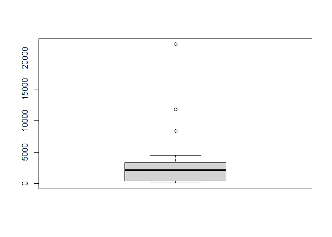

Importing data from statistical software packages
================
Mohamad Osman
2022-06-23

# **Section 05: Importing data from statistical software packages**

### **`01-Import SAS data with haven`**

-   Load the `haven` package; it’s already installed on DataCamp’s
    servers.

-   Import the data file `"sales.sas7bdat"`. Call the imported data
    frame `sales`.

-   Display the structure of `sales` with
    [**`str()`**](https://www.rdocumentation.org/packages/utils/functions/str).
    Some columns represent categorical variables, so they should be
    factors.

``` r
# Load the haven package
library(haven)

# Import sales.sas7bdat: sales
dest_path <- file.path("..", "00_Datasets", "sales.sas7bdat")


sales <- read_sas(dest_path)

# Display the structure of sales
str(sales)
```

    ## tibble [431 × 4] (S3: tbl_df/tbl/data.frame)
    ##  $ purchase: num [1:431] 0 0 1 1 0 0 0 0 0 0 ...
    ##  $ age     : num [1:431] 41 47 41 39 32 32 33 45 43 40 ...
    ##  $ gender  : chr [1:431] "Female" "Female" "Female" "Female" ...
    ##  $ income  : chr [1:431] "Low" "Low" "Low" "Low" ...

### **`02-Import STATA data with haven`**

-   Import the data file directly from the URL using
    [**`read_dta()`**](http://cran.r-project.org/web/packages/haven/haven.pdf),
    and store it as `sugar`.

-   Print out the structure of `sugar`. The `Date` column has class
    `labelled`.

-   Convert the values in the `Date` column of `sugar` to dates, using
    `as.Date(as_factor(___))`.

-   Print out the structure of `sugar` once more. Looks better now?

``` r
# haven is already loaded

# Import the data from the URL: sugar
sugar <- read_dta("http://assets.datacamp.com/production/course_1478/datasets/trade.dta")

# Structure of sugar
str(sugar)
```

    ## tibble [10 × 5] (S3: tbl_df/tbl/data.frame)
    ##  $ Date    : dbl+lbl [1:10] 10,  9,  8,  7,  6,  5,  4,  3,  2,  1
    ##    ..@ label       : chr "Date"
    ##    ..@ format.stata: chr "%9.0g"
    ##    ..@ labels      : Named num [1:10] 1 2 3 4 5 6 7 8 9 10
    ##    .. ..- attr(*, "names")= chr [1:10] "2004-12-31" "2005-12-31" "2006-12-31" "2007-12-31" ...
    ##  $ Import  : num [1:10] 37664782 16316512 11082246 35677943 9879878 ...
    ##   ..- attr(*, "label")= chr "Import"
    ##   ..- attr(*, "format.stata")= chr "%9.0g"
    ##  $ Weight_I: num [1:10] 54029106 21584365 14526089 55034932 14806865 ...
    ##   ..- attr(*, "label")= chr "Weight_I"
    ##   ..- attr(*, "format.stata")= chr "%9.0g"
    ##  $ Export  : num [1:10] 5.45e+07 1.03e+08 3.79e+07 4.85e+07 7.15e+07 ...
    ##   ..- attr(*, "label")= chr "Export"
    ##   ..- attr(*, "format.stata")= chr "%9.0g"
    ##  $ Weight_E: num [1:10] 9.34e+07 1.58e+08 8.80e+07 1.12e+08 1.32e+08 ...
    ##   ..- attr(*, "label")= chr "Weight_E"
    ##   ..- attr(*, "format.stata")= chr "%9.0g"
    ##  - attr(*, "label")= chr "Written by R."

``` r
# Convert values in Date column to dates
sugar$Date <- as.Date(as_factor(sugar$Date))

# Structure of sugar again
str(sugar)
```

    ## tibble [10 × 5] (S3: tbl_df/tbl/data.frame)
    ##  $ Date    : Date[1:10], format: "2013-12-31" "2012-12-31" ...
    ##  $ Import  : num [1:10] 37664782 16316512 11082246 35677943 9879878 ...
    ##   ..- attr(*, "label")= chr "Import"
    ##   ..- attr(*, "format.stata")= chr "%9.0g"
    ##  $ Weight_I: num [1:10] 54029106 21584365 14526089 55034932 14806865 ...
    ##   ..- attr(*, "label")= chr "Weight_I"
    ##   ..- attr(*, "format.stata")= chr "%9.0g"
    ##  $ Export  : num [1:10] 5.45e+07 1.03e+08 3.79e+07 4.85e+07 7.15e+07 ...
    ##   ..- attr(*, "label")= chr "Export"
    ##   ..- attr(*, "format.stata")= chr "%9.0g"
    ##  $ Weight_E: num [1:10] 9.34e+07 1.58e+08 8.80e+07 1.12e+08 1.32e+08 ...
    ##   ..- attr(*, "label")= chr "Weight_E"
    ##   ..- attr(*, "format.stata")= chr "%9.0g"
    ##  - attr(*, "label")= chr "Written by R."

### **`03-Import SPSS data with haven`**

-   Use
    [**`read_sav()`**](http://cran.r-project.org/web/packages/haven/haven.pdf)
    to import the SPSS data in `"person.sav"`. Name the imported data
    frame `traits`.

-   `traits` contains several missing values, or `NA`s. Run
    [**`summary()`**](https://www.rdocumentation.org/packages/base/functions/summary)
    on it to find out how many `NA`s are contained in each variable.

-   Print out a subset of those individuals that scored high on
    Extroversion *and* on Agreeableness, i.e. scoring higher than 40 on
    each of these two categories. You can use `subset()` for this.

``` r
# haven is already loaded

# Import person.sav: traits
dest_path <- file.path("..", "00_Datasets", "person.sav")

traits <- read_sav(dest_path)

# Summarize traits
summary(traits)
```

    ##     Neurotic      Extroversion   Agreeableness   Conscientiousness
    ##  Min.   : 0.00   Min.   : 5.00   Min.   :15.00   Min.   : 7.00    
    ##  1st Qu.:18.00   1st Qu.:26.00   1st Qu.:39.00   1st Qu.:25.00    
    ##  Median :24.00   Median :31.00   Median :45.00   Median :30.00    
    ##  Mean   :23.63   Mean   :30.23   Mean   :44.55   Mean   :30.85    
    ##  3rd Qu.:29.00   3rd Qu.:34.00   3rd Qu.:50.00   3rd Qu.:36.00    
    ##  Max.   :44.00   Max.   :65.00   Max.   :73.00   Max.   :58.00    
    ##  NA's   :14      NA's   :16      NA's   :19      NA's   :14

``` r
# Print out a subset
subset(traits, Extroversion > 40 & Agreeableness > 40)
```

    ## # A tibble: 8 × 4
    ##   Neurotic Extroversion Agreeableness Conscientiousness
    ##      <dbl>        <dbl>         <dbl>             <dbl>
    ## 1       38           43            49                29
    ## 2       20           42            46                31
    ## 3       18           42            49                31
    ## 4       42           43            44                29
    ## 5       30           42            51                24
    ## 6       18           42            50                25
    ## 7       27           45            55                23
    ## 8       18           43            57                34

### **`04-Factorize, round two`**

-   Import the SPSS data straight from the URL and store the resulting
    data frame as `work`.

-   Display the summary of the `GENDER` column of `work`. This
    information doesn’t give you a lot of useful information, right?

-   Convert the `GENDER` column in `work` to a factor, the class to
    denote categorical variables in R. Use
    [**`as_factor()`**](http://cran.r-project.org/web/packages/haven/haven.pdf).

-   Once again display the summary of the `GENDER` column. This time,
    the printout makes much more sense.

``` r
# haven is already loaded

# Import SPSS data from the URL: work
work <- read_sav("http://s3.amazonaws.com/assets.datacamp.com/production/course_1478/datasets/employee.sav")

# Display summary of work$GENDER
summary(work$GENDER)
```

    ##    Length     Class      Mode 
    ##       474 character character

``` r
# Convert work$GENDER to a factor
work$GENDER <- as_factor(work$GENDER)

# Display summary of work$GENDER again
summary(work$GENDER)
```

    ## Female   Male 
    ##    216    258

### **`05-Import STATA data with foreign (1)`**

The `foreign` package offers a simple function to import and read
*STATA* data:
[**`read.dta()`**](https://www.rdocumentation.org/packages/foreign/functions/read.dta).

In this exercise, you will import data on the US presidential elections
in the year 2000. The data in `florida.dta` contains the total numbers
of votes for each of the four candidates as well as the total number of
votes per election area in the state of Florida (Source: [**Florida
Department of State**](https://results.elections.myflorida.com/)). The
file is available in your working directory, you can download it
[**here**](http://s3.amazonaws.com/assets.datacamp.com/production/course_1478/datasets/florida.dta)
if you want to experiment some more.

-   Load the `foreign` package; it’s already installed on DataCamp’s
    servers.

-   Import the data on the elections in Florida, `"florida.dta"`, and
    name the resulting data frame `florida`. Use
    [**`read.dta()`**](https://www.rdocumentation.org/packages/foreign/functions/read.dta)
    without specifying extra arguments.

-   Check out the last 6 observations of `florida` with `tail()`

``` r
# Load the foreign package
library(foreign)

# File path 
dest_path <- file.path("..", "00_Datasets", "florida.dta")


# Import florida.dta and name the resulting data frame florida
florida <- read.dta(dest_path)

# Check tail() of florida
tail(florida)
```

    ##     gore  bush buchanan nader  total
    ## 62  2647  4051       27    59   6784
    ## 63  1399  2326       26    29   3780
    ## 64 97063 82214      396  2436 182109
    ## 65  3835  4511       46   149   8541
    ## 66  5637 12176      120   265  18198
    ## 67  2796  4983       88    93   7960

### **`06-Import STATA data with foreign (2)`**

The arguments you will use most often are `convert.dates`,
`convert.factors`, `missing.type` and `convert.underscore`. Their
meaning is pretty straightforward, as Filip explained in the video. It’s
all about correctly converting STATA data to standard R data structures.
Type `?read.dta` to find out about about the default values.

-   Specify the path to the file using
    [**`file.path()`**](https://www.rdocumentation.org/packages/base/functions/file.path).
    Call it `path`. Remember the `"edequality.dta"` file is located in
    the `"worldbank"` folder.

-   Use the `path` variable to import the data file in three different
    ways; each time show its structure with
    [**`str()`**](https://www.rdocumentation.org/packages/utils/functions/str):

-   `edu_equal_1`: By passing only the file `path` to
    [**`read.dta()`**](https://www.rdocumentation.org/packages/foreign/functions/read.dta).

-   `edu_equal_2`: By passing the file `path`, and setting
    `convert.factors` to `FALSE`.

-   `edu_equal_3`: By passing the file `path`, and setting
    `convert.underscore` to `TRUE`.

``` r
# foreign is already loaded

# Specify the file path using file.path(): path
path <- file.path("..", "00_Datasets", "edequality.dta")
str(path)
```

    ##  chr "../00_Datasets/edequality.dta"

``` r
# Create and print structure of edu_equal_1
edu_equal_1 <- read.dta(path)
str(edu_equal_1)
```

    ## 'data.frame':    12214 obs. of  27 variables:
    ##  $ hhid              : num  1 1 1 2 2 3 4 4 5 6 ...
    ##  $ hhweight          : num  627 627 627 627 627 ...
    ##  $ location          : Factor w/ 2 levels "urban location",..: 1 1 1 1 1 2 2 2 1 1 ...
    ##  $ region            : Factor w/ 9 levels "Sofia city","Bourgass",..: 8 8 8 9 9 4 4 4 8 8 ...
    ##  $ ethnicity_head    : Factor w/ 4 levels "Bulgaria","Turks",..: 2 2 2 1 1 1 1 1 1 1 ...
    ##  $ age               : num  37 11 8 73 70 75 79 80 82 83 ...
    ##  $ gender            : Factor w/ 2 levels "male","female": 2 2 1 1 2 1 1 2 2 2 ...
    ##  $ relation          : Factor w/ 9 levels "head                      ",..: 1 3 3 1 2 1 1 2 1 1 ...
    ##  $ literate          : Factor w/ 2 levels "no","yes": 1 2 2 2 2 2 2 2 2 2 ...
    ##  $ income_mnt        : num  13.3 13.3 13.3 142.5 142.5 ...
    ##  $ income            : num  160 160 160 1710 1710 ...
    ##  $ aggregate         : num  1042 1042 1042 3271 3271 ...
    ##  $ aggr_ind_annual   : num  347 347 347 1635 1635 ...
    ##  $ educ_completed    : int  2 4 4 4 3 3 3 3 4 4 ...
    ##  $ grade_complete    : num  4 3 0 3 4 4 4 4 5 5 ...
    ##  $ grade_all         : num  4 11 8 11 8 8 8 8 13 13 ...
    ##  $ unemployed        : int  2 1 1 1 1 1 1 1 1 1 ...
    ##  $ reason_OLF        : int  NA NA NA 3 3 3 9 9 3 3 ...
    ##  $ sector            : int  NA NA NA NA NA NA 1 1 NA NA ...
    ##  $ occupation        : int  NA NA NA NA NA NA 5 5 NA NA ...
    ##  $ earn_mont         : num  0 0 0 0 0 0 20 20 0 0 ...
    ##  $ earn_ann          : num  0 0 0 0 0 0 240 240 0 0 ...
    ##  $ hours_week        : num  NA NA NA NA NA NA 30 35 NA NA ...
    ##  $ hours_mnt         : num  NA NA NA NA NA ...
    ##  $ fulltime          : int  NA NA NA NA NA NA 1 1 NA NA ...
    ##  $ hhexp             : num  100 100 100 343 343 ...
    ##  $ legacy_pension_amt: num  NA NA NA NA NA NA NA NA NA NA ...
    ##  - attr(*, "datalabel")= chr ""
    ##  - attr(*, "time.stamp")= chr ""
    ##  - attr(*, "formats")= chr [1:27] "%9.0g" "%9.0g" "%9.0g" "%9.0g" ...
    ##  - attr(*, "types")= int [1:27] 100 100 108 108 108 100 108 108 108 100 ...
    ##  - attr(*, "val.labels")= chr [1:27] "" "" "location" "region" ...
    ##  - attr(*, "var.labels")= chr [1:27] "hhid" "hhweight" "location" "region" ...
    ##  - attr(*, "expansion.fields")=List of 12
    ##   ..$ : chr [1:3] "_dta" "_svy_su1" "cluster"
    ##   ..$ : chr [1:3] "_dta" "_svy_strata1" "strata"
    ##   ..$ : chr [1:3] "_dta" "_svy_stages" "1"
    ##   ..$ : chr [1:3] "_dta" "_svy_version" "2"
    ##   ..$ : chr [1:3] "_dta" "__XijVarLabcons" "(sum) cons"
    ##   ..$ : chr [1:3] "_dta" "ReS_Xij" "cons"
    ##   ..$ : chr [1:3] "_dta" "ReS_str" "0"
    ##   ..$ : chr [1:3] "_dta" "ReS_j" "group"
    ##   ..$ : chr [1:3] "_dta" "ReS_ver" "v.2"
    ##   ..$ : chr [1:3] "_dta" "ReS_i" "hhid dur"
    ##   ..$ : chr [1:3] "_dta" "note1" "variables g1pc, g2pc, g3pc, g4pc, g5pc, g7pc, g8pc, g9pc, g10pc, g11pc, g12pc,  gall, health, rent, durables we"| __truncated__
    ##   ..$ : chr [1:3] "_dta" "note0" "1"
    ##  - attr(*, "version")= int 7
    ##  - attr(*, "label.table")=List of 12
    ##   ..$ location: Named int [1:2] 1 2
    ##   .. ..- attr(*, "names")= chr [1:2] "urban location" "rural location"
    ##   ..$ region  : Named int [1:9] 1 2 3 4 5 6 7 8 9
    ##   .. ..- attr(*, "names")= chr [1:9] "Sofia city" "Bourgass" "Varna" "Lovetch" ...
    ##   ..$ ethnic  : Named int [1:4] 1 2 3 4
    ##   .. ..- attr(*, "names")= chr [1:4] "Bulgaria" "Turks" "Roma" "Other"
    ##   ..$ s2_q2   : Named int [1:2] 1 2
    ##   .. ..- attr(*, "names")= chr [1:2] "male" "female"
    ##   ..$ s2_q3   : Named int [1:9] 1 2 3 4 5 6 7 8 9
    ##   .. ..- attr(*, "names")= chr [1:9] "head                      " "spouse/partner            " "child                     " "son/daughter-in-law       " ...
    ##   ..$ lit     : Named int [1:2] 1 2
    ##   .. ..- attr(*, "names")= chr [1:2] "no" "yes"
    ##   ..$         : Named int [1:4] 1 2 3 4
    ##   .. ..- attr(*, "names")= chr [1:4] "never attanded" "primary" "secondary" "postsecondary"
    ##   ..$         : Named int [1:2] 1 2
    ##   .. ..- attr(*, "names")= chr [1:2] "Not unemployed" "Unemployed"
    ##   ..$         : Named int [1:10] 1 2 3 4 5 6 7 8 9 10
    ##   .. ..- attr(*, "names")= chr [1:10] "student" "housewife/childcare" "in retirement" "illness, disability" ...
    ##   ..$         : Named int [1:10] 1 2 3 4 5 6 7 8 9 10
    ##   .. ..- attr(*, "names")= chr [1:10] "agriculture" "mining" "manufacturing" "utilities" ...
    ##   ..$         : Named int [1:5] 1 2 3 4 5
    ##   .. ..- attr(*, "names")= chr [1:5] "private company" "public works program" "government,public sector, army" "private individual" ...
    ##   ..$         : Named int [1:2] 1 2
    ##   .. ..- attr(*, "names")= chr [1:2] "no" "yes"

``` r
# Create and print structure of edu_equal_2
edu_equal_2 <- read.dta(path, convert.factors = FALSE)
str(edu_equal_2)
```

    ## 'data.frame':    12214 obs. of  27 variables:
    ##  $ hhid              : num  1 1 1 2 2 3 4 4 5 6 ...
    ##  $ hhweight          : num  627 627 627 627 627 ...
    ##  $ location          : int  1 1 1 1 1 2 2 2 1 1 ...
    ##  $ region            : int  8 8 8 9 9 4 4 4 8 8 ...
    ##  $ ethnicity_head    : int  2 2 2 1 1 1 1 1 1 1 ...
    ##  $ age               : num  37 11 8 73 70 75 79 80 82 83 ...
    ##  $ gender            : int  2 2 1 1 2 1 1 2 2 2 ...
    ##  $ relation          : int  1 3 3 1 2 1 1 2 1 1 ...
    ##  $ literate          : int  1 2 2 2 2 2 2 2 2 2 ...
    ##  $ income_mnt        : num  13.3 13.3 13.3 142.5 142.5 ...
    ##  $ income            : num  160 160 160 1710 1710 ...
    ##  $ aggregate         : num  1042 1042 1042 3271 3271 ...
    ##  $ aggr_ind_annual   : num  347 347 347 1635 1635 ...
    ##  $ educ_completed    : int  2 4 4 4 3 3 3 3 4 4 ...
    ##  $ grade_complete    : num  4 3 0 3 4 4 4 4 5 5 ...
    ##  $ grade_all         : num  4 11 8 11 8 8 8 8 13 13 ...
    ##  $ unemployed        : int  2 1 1 1 1 1 1 1 1 1 ...
    ##  $ reason_OLF        : int  NA NA NA 3 3 3 9 9 3 3 ...
    ##  $ sector            : int  NA NA NA NA NA NA 1 1 NA NA ...
    ##  $ occupation        : int  NA NA NA NA NA NA 5 5 NA NA ...
    ##  $ earn_mont         : num  0 0 0 0 0 0 20 20 0 0 ...
    ##  $ earn_ann          : num  0 0 0 0 0 0 240 240 0 0 ...
    ##  $ hours_week        : num  NA NA NA NA NA NA 30 35 NA NA ...
    ##  $ hours_mnt         : num  NA NA NA NA NA ...
    ##  $ fulltime          : int  NA NA NA NA NA NA 1 1 NA NA ...
    ##  $ hhexp             : num  100 100 100 343 343 ...
    ##  $ legacy_pension_amt: num  NA NA NA NA NA NA NA NA NA NA ...
    ##  - attr(*, "datalabel")= chr ""
    ##  - attr(*, "time.stamp")= chr ""
    ##  - attr(*, "formats")= chr [1:27] "%9.0g" "%9.0g" "%9.0g" "%9.0g" ...
    ##  - attr(*, "types")= int [1:27] 100 100 108 108 108 100 108 108 108 100 ...
    ##  - attr(*, "val.labels")= chr [1:27] "" "" "location" "region" ...
    ##  - attr(*, "var.labels")= chr [1:27] "hhid" "hhweight" "location" "region" ...
    ##  - attr(*, "expansion.fields")=List of 12
    ##   ..$ : chr [1:3] "_dta" "_svy_su1" "cluster"
    ##   ..$ : chr [1:3] "_dta" "_svy_strata1" "strata"
    ##   ..$ : chr [1:3] "_dta" "_svy_stages" "1"
    ##   ..$ : chr [1:3] "_dta" "_svy_version" "2"
    ##   ..$ : chr [1:3] "_dta" "__XijVarLabcons" "(sum) cons"
    ##   ..$ : chr [1:3] "_dta" "ReS_Xij" "cons"
    ##   ..$ : chr [1:3] "_dta" "ReS_str" "0"
    ##   ..$ : chr [1:3] "_dta" "ReS_j" "group"
    ##   ..$ : chr [1:3] "_dta" "ReS_ver" "v.2"
    ##   ..$ : chr [1:3] "_dta" "ReS_i" "hhid dur"
    ##   ..$ : chr [1:3] "_dta" "note1" "variables g1pc, g2pc, g3pc, g4pc, g5pc, g7pc, g8pc, g9pc, g10pc, g11pc, g12pc,  gall, health, rent, durables we"| __truncated__
    ##   ..$ : chr [1:3] "_dta" "note0" "1"
    ##  - attr(*, "version")= int 7
    ##  - attr(*, "label.table")=List of 12
    ##   ..$ location: Named int [1:2] 1 2
    ##   .. ..- attr(*, "names")= chr [1:2] "urban location" "rural location"
    ##   ..$ region  : Named int [1:9] 1 2 3 4 5 6 7 8 9
    ##   .. ..- attr(*, "names")= chr [1:9] "Sofia city" "Bourgass" "Varna" "Lovetch" ...
    ##   ..$ ethnic  : Named int [1:4] 1 2 3 4
    ##   .. ..- attr(*, "names")= chr [1:4] "Bulgaria" "Turks" "Roma" "Other"
    ##   ..$ s2_q2   : Named int [1:2] 1 2
    ##   .. ..- attr(*, "names")= chr [1:2] "male" "female"
    ##   ..$ s2_q3   : Named int [1:9] 1 2 3 4 5 6 7 8 9
    ##   .. ..- attr(*, "names")= chr [1:9] "head                      " "spouse/partner            " "child                     " "son/daughter-in-law       " ...
    ##   ..$ lit     : Named int [1:2] 1 2
    ##   .. ..- attr(*, "names")= chr [1:2] "no" "yes"
    ##   ..$         : Named int [1:4] 1 2 3 4
    ##   .. ..- attr(*, "names")= chr [1:4] "never attanded" "primary" "secondary" "postsecondary"
    ##   ..$         : Named int [1:2] 1 2
    ##   .. ..- attr(*, "names")= chr [1:2] "Not unemployed" "Unemployed"
    ##   ..$         : Named int [1:10] 1 2 3 4 5 6 7 8 9 10
    ##   .. ..- attr(*, "names")= chr [1:10] "student" "housewife/childcare" "in retirement" "illness, disability" ...
    ##   ..$         : Named int [1:10] 1 2 3 4 5 6 7 8 9 10
    ##   .. ..- attr(*, "names")= chr [1:10] "agriculture" "mining" "manufacturing" "utilities" ...
    ##   ..$         : Named int [1:5] 1 2 3 4 5
    ##   .. ..- attr(*, "names")= chr [1:5] "private company" "public works program" "government,public sector, army" "private individual" ...
    ##   ..$         : Named int [1:2] 1 2
    ##   .. ..- attr(*, "names")= chr [1:2] "no" "yes"

``` r
# Create and print structure of edu_equal_3
edu_equal_3 <- read.dta(path, convert.underscore = TRUE)
str(edu_equal_3)
```

    ## 'data.frame':    12214 obs. of  27 variables:
    ##  $ hhid              : num  1 1 1 2 2 3 4 4 5 6 ...
    ##  $ hhweight          : num  627 627 627 627 627 ...
    ##  $ location          : Factor w/ 2 levels "urban location",..: 1 1 1 1 1 2 2 2 1 1 ...
    ##  $ region            : Factor w/ 9 levels "Sofia city","Bourgass",..: 8 8 8 9 9 4 4 4 8 8 ...
    ##  $ ethnicity.head    : Factor w/ 4 levels "Bulgaria","Turks",..: 2 2 2 1 1 1 1 1 1 1 ...
    ##  $ age               : num  37 11 8 73 70 75 79 80 82 83 ...
    ##  $ gender            : Factor w/ 2 levels "male","female": 2 2 1 1 2 1 1 2 2 2 ...
    ##  $ relation          : Factor w/ 9 levels "head                      ",..: 1 3 3 1 2 1 1 2 1 1 ...
    ##  $ literate          : Factor w/ 2 levels "no","yes": 1 2 2 2 2 2 2 2 2 2 ...
    ##  $ income.mnt        : num  13.3 13.3 13.3 142.5 142.5 ...
    ##  $ income            : num  160 160 160 1710 1710 ...
    ##  $ aggregate         : num  1042 1042 1042 3271 3271 ...
    ##  $ aggr.ind.annual   : num  347 347 347 1635 1635 ...
    ##  $ educ.completed    : int  2 4 4 4 3 3 3 3 4 4 ...
    ##  $ grade.complete    : num  4 3 0 3 4 4 4 4 5 5 ...
    ##  $ grade.all         : num  4 11 8 11 8 8 8 8 13 13 ...
    ##  $ unemployed        : int  2 1 1 1 1 1 1 1 1 1 ...
    ##  $ reason.OLF        : int  NA NA NA 3 3 3 9 9 3 3 ...
    ##  $ sector            : int  NA NA NA NA NA NA 1 1 NA NA ...
    ##  $ occupation        : int  NA NA NA NA NA NA 5 5 NA NA ...
    ##  $ earn.mont         : num  0 0 0 0 0 0 20 20 0 0 ...
    ##  $ earn.ann          : num  0 0 0 0 0 0 240 240 0 0 ...
    ##  $ hours.week        : num  NA NA NA NA NA NA 30 35 NA NA ...
    ##  $ hours.mnt         : num  NA NA NA NA NA ...
    ##  $ fulltime          : int  NA NA NA NA NA NA 1 1 NA NA ...
    ##  $ hhexp             : num  100 100 100 343 343 ...
    ##  $ legacy.pension.amt: num  NA NA NA NA NA NA NA NA NA NA ...
    ##  - attr(*, "datalabel")= chr ""
    ##  - attr(*, "time.stamp")= chr ""
    ##  - attr(*, "formats")= chr [1:27] "%9.0g" "%9.0g" "%9.0g" "%9.0g" ...
    ##  - attr(*, "types")= int [1:27] 100 100 108 108 108 100 108 108 108 100 ...
    ##  - attr(*, "val.labels")= chr [1:27] "" "" "location" "region" ...
    ##  - attr(*, "var.labels")= chr [1:27] "hhid" "hhweight" "location" "region" ...
    ##  - attr(*, "expansion.fields")=List of 12
    ##   ..$ : chr [1:3] "_dta" "_svy_su1" "cluster"
    ##   ..$ : chr [1:3] "_dta" "_svy_strata1" "strata"
    ##   ..$ : chr [1:3] "_dta" "_svy_stages" "1"
    ##   ..$ : chr [1:3] "_dta" "_svy_version" "2"
    ##   ..$ : chr [1:3] "_dta" "__XijVarLabcons" "(sum) cons"
    ##   ..$ : chr [1:3] "_dta" "ReS_Xij" "cons"
    ##   ..$ : chr [1:3] "_dta" "ReS_str" "0"
    ##   ..$ : chr [1:3] "_dta" "ReS_j" "group"
    ##   ..$ : chr [1:3] "_dta" "ReS_ver" "v.2"
    ##   ..$ : chr [1:3] "_dta" "ReS_i" "hhid dur"
    ##   ..$ : chr [1:3] "_dta" "note1" "variables g1pc, g2pc, g3pc, g4pc, g5pc, g7pc, g8pc, g9pc, g10pc, g11pc, g12pc,  gall, health, rent, durables we"| __truncated__
    ##   ..$ : chr [1:3] "_dta" "note0" "1"
    ##  - attr(*, "version")= int 7
    ##  - attr(*, "label.table")=List of 12
    ##   ..$ location: Named int [1:2] 1 2
    ##   .. ..- attr(*, "names")= chr [1:2] "urban location" "rural location"
    ##   ..$ region  : Named int [1:9] 1 2 3 4 5 6 7 8 9
    ##   .. ..- attr(*, "names")= chr [1:9] "Sofia city" "Bourgass" "Varna" "Lovetch" ...
    ##   ..$ ethnic  : Named int [1:4] 1 2 3 4
    ##   .. ..- attr(*, "names")= chr [1:4] "Bulgaria" "Turks" "Roma" "Other"
    ##   ..$ s2_q2   : Named int [1:2] 1 2
    ##   .. ..- attr(*, "names")= chr [1:2] "male" "female"
    ##   ..$ s2_q3   : Named int [1:9] 1 2 3 4 5 6 7 8 9
    ##   .. ..- attr(*, "names")= chr [1:9] "head                      " "spouse/partner            " "child                     " "son/daughter-in-law       " ...
    ##   ..$ lit     : Named int [1:2] 1 2
    ##   .. ..- attr(*, "names")= chr [1:2] "no" "yes"
    ##   ..$         : Named int [1:4] 1 2 3 4
    ##   .. ..- attr(*, "names")= chr [1:4] "never attanded" "primary" "secondary" "postsecondary"
    ##   ..$         : Named int [1:2] 1 2
    ##   .. ..- attr(*, "names")= chr [1:2] "Not unemployed" "Unemployed"
    ##   ..$         : Named int [1:10] 1 2 3 4 5 6 7 8 9 10
    ##   .. ..- attr(*, "names")= chr [1:10] "student" "housewife/childcare" "in retirement" "illness, disability" ...
    ##   ..$         : Named int [1:10] 1 2 3 4 5 6 7 8 9 10
    ##   .. ..- attr(*, "names")= chr [1:10] "agriculture" "mining" "manufacturing" "utilities" ...
    ##   ..$         : Named int [1:5] 1 2 3 4 5
    ##   .. ..- attr(*, "names")= chr [1:5] "private company" "public works program" "government,public sector, army" "private individual" ...
    ##   ..$         : Named int [1:2] 1 2
    ##   .. ..- attr(*, "names")= chr [1:2] "no" "yes"

### **`07-Import SPSS data with foreign (1)`**

All great things come in pairs. Where `foreign` provided
[**`read.dta()`**](https://www.rdocumentation.org/packages/foreign/functions/read.dta)
to read Stata data, there’s also
[**`read.spss()`**](https://www.rdocumentation.org/packages/foreign/functions/read.spss)
to read SPSS data files. To get a data frame, make sure to set
`to.data.frame = TRUE` inside
[**`read.spss()`**](https://www.rdocumentation.org/packages/foreign/functions/read.spss).

In this exercise, you’ll be working with socio-economic variables from
different countries (Source: [**Quantative Data Analysis in
Education**](http://cw.routledge.com/textbooks/9780415372985/resources/datasets.asp)).
The SPSS data is in a file called `international.sav`, which is in your
working directory. You can also download it
[**here**](http://s3.amazonaws.com/assets.datacamp.com/production/course_1478/datasets/international.sav)
if you want to play around with it some more.

-   Import the data file `"international.sav"` and have R convert it to
    a data frame. Store this data frame as `demo`.

-   Create a boxplot of the `gdp` variable of `demo`.

``` r
# foreign is already loaded

# Import international.sav as a data frame: demo
path <- file.path("..", "00_Datasets", "international.sav")

demo <- read.spss(path, to.data.frame = TRUE)
```

    ## re-encoding from CP1252

``` r
# Create boxplot of gdp variable of demo
boxplot(demo$gdp)
```

<!-- -->

### 

**`08-Import SPSS data with foreign (2)`**

-   Import the data file `"international.sav"` as a data frame,
    `demo_1`.

-   Print the first few rows of `demo_1` using the
    [**`head()`**](https://www.rdocumentation.org/packages/utils/functions/head)
    function.

-   Import the data file `"international.sav"` as a data frame,
    `demo_2`, but this time in a way such that variables with value
    labels are *not* converted to R factors.

-   Again, print the first few rows of `demo_2`. Can you tell the
    difference between the two data frames?

``` r
# foreign is already loaded

# Import international.sav as demo_1
demo_1 <- read.spss(path, to.data.frame = TRUE)
```

    ## re-encoding from CP1252

``` r
# Print out the head of demo_1
head(demo_1)
```

    ##   id              country  contint m_illit f_illit lifeexpt  gdp
    ## 1  1 Argentina            Americas     3.0     3.0       16 3375
    ## 2  2 Benin                  Africa    45.2    74.5        7  521
    ## 3  3 Burundi                Africa    33.2    48.1        5   86
    ## 4  4 Chile                Americas     4.2     4.4       14 4523
    ## 5  5 Dominican Republic   Americas    12.0    12.7       12 2408
    ## 6  6 El Salvador          Americas    17.6    22.9       11 2302

``` r
# Import international.sav as demo_2
demo_2 <- read.spss(path, to.data.frame = TRUE, use.value.labels = FALSE)
```

    ## re-encoding from CP1252

``` r
# Print out the head of demo_2
head(demo_2)
```

    ##   id              country contint m_illit f_illit lifeexpt  gdp
    ## 1  1 Argentina                  2     3.0     3.0       16 3375
    ## 2  2 Benin                      1    45.2    74.5        7  521
    ## 3  3 Burundi                    1    33.2    48.1        5   86
    ## 4  4 Chile                      2     4.2     4.4       14 4523
    ## 5  5 Dominican Republic         2    12.0    12.7       12 2408
    ## 6  6 El Salvador                2    17.6    22.9       11 2302

### `The End`
