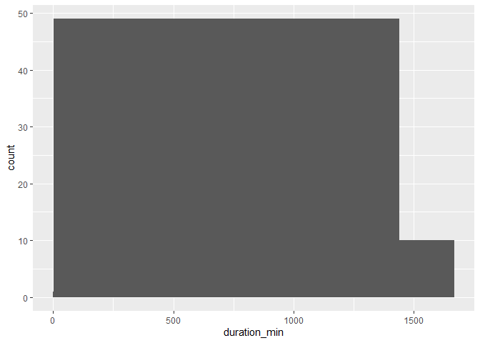
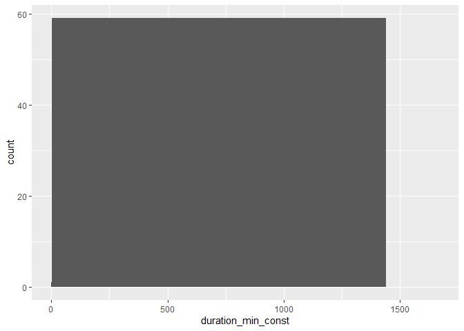

Cleaning Data in R
================
Mohamad Osman
2022-06-26

# Section 01: **Common Data Problems**

### **`01-Converting data types`**

-   Examine the data types of the columns of `bike_share_rides`.

-   Get a summary of the `user_birth_year` column of `bike_share_rides`.

``` r
library(tidyverse)
```

    ## ── Attaching packages ─────────────────────────────────────── tidyverse 1.3.1 ──

    ## ✔ ggplot2 3.3.6     ✔ purrr   0.3.4
    ## ✔ tibble  3.1.7     ✔ dplyr   1.0.9
    ## ✔ tidyr   1.2.0     ✔ stringr 1.4.0
    ## ✔ readr   2.1.2     ✔ forcats 0.5.1

    ## ── Conflicts ────────────────────────────────────────── tidyverse_conflicts() ──
    ## ✖ dplyr::filter() masks stats::filter()
    ## ✖ dplyr::lag()    masks stats::lag()

``` r
library(dplyr)
library(assertive)
```

    ## 
    ## Attaching package: 'assertive'

    ## The following objects are masked from 'package:purrr':
    ## 
    ##     is_atomic, is_character, is_double, is_empty, is_formula,
    ##     is_function, is_integer, is_list, is_logical, is_null, is_numeric,
    ##     is_vector

    ## The following object is masked from 'package:tibble':
    ## 
    ##     has_rownames

``` r
library(stringr)
```

``` r
# file path
bike_share_file <- file.path("..", "00_Datasets", "bike_share_rides_ch1_1.rds") 

# reading rds file
bike_share_rides <- readRDS(bike_share_file)


# Glimpse at bike_share_rides
glimpse(bike_share_rides)
```

    ## Rows: 35,229
    ## Columns: 10
    ## $ ride_id         <int> 52797, 54540, 87695, 45619, 70832, 96135, 29928, 83331…
    ## $ date            <chr> "2017-04-15", "2017-04-19", "2017-04-14", "2017-04-03"…
    ## $ duration        <chr> "1316.15 minutes", "8.13 minutes", "24.85 minutes", "6…
    ## $ station_A_id    <dbl> 67, 21, 16, 58, 16, 6, 5, 16, 5, 81, 30, 16, 16, 67, 2…
    ## $ station_A_name  <chr> "San Francisco Caltrain Station 2  (Townsend St at 4th…
    ## $ station_B_id    <dbl> 89, 64, 355, 368, 81, 66, 350, 91, 62, 81, 109, 10, 80…
    ## $ station_B_name  <chr> "Division St at Potrero Ave", "5th St at Brannan St", …
    ## $ bike_id         <dbl> 1974, 860, 2263, 1417, 507, 75, 388, 239, 1449, 3289, …
    ## $ user_gender     <chr> "Male", "Male", "Male", "Male", "Male", "Male", "Male"…
    ## $ user_birth_year <dbl> 1972, 1986, 1993, 1981, 1981, 1988, 1993, 1996, 1993, …

``` r
# Summary of user_birth_year
summary(bike_share_rides$user_birth_year)
```

    ##    Min. 1st Qu.  Median    Mean 3rd Qu.    Max. 
    ##    1900    1979    1986    1984    1991    2001

-   Add a new column to `bike_share_rides` called `user_birth_year_fct`,
    which contains `user_birth_year`, converted to a factor.

-   Assert that the `user_birth_year_fct` is a factor to confirm the
    conversion.

``` r
# Glimpse at bike_share_rides
glimpse(bike_share_rides)
```

    ## Rows: 35,229
    ## Columns: 10
    ## $ ride_id         <int> 52797, 54540, 87695, 45619, 70832, 96135, 29928, 83331…
    ## $ date            <chr> "2017-04-15", "2017-04-19", "2017-04-14", "2017-04-03"…
    ## $ duration        <chr> "1316.15 minutes", "8.13 minutes", "24.85 minutes", "6…
    ## $ station_A_id    <dbl> 67, 21, 16, 58, 16, 6, 5, 16, 5, 81, 30, 16, 16, 67, 2…
    ## $ station_A_name  <chr> "San Francisco Caltrain Station 2  (Townsend St at 4th…
    ## $ station_B_id    <dbl> 89, 64, 355, 368, 81, 66, 350, 91, 62, 81, 109, 10, 80…
    ## $ station_B_name  <chr> "Division St at Potrero Ave", "5th St at Brannan St", …
    ## $ bike_id         <dbl> 1974, 860, 2263, 1417, 507, 75, 388, 239, 1449, 3289, …
    ## $ user_gender     <chr> "Male", "Male", "Male", "Male", "Male", "Male", "Male"…
    ## $ user_birth_year <dbl> 1972, 1986, 1993, 1981, 1981, 1988, 1993, 1996, 1993, …

``` r
# Summary of user_birth_year
#summary(bike_share_rides$user_birth_year)

# Convert user_birth_year to factor: user_birth_year_fct
bike_share_rides <- bike_share_rides %>%
  mutate(user_birth_year_fct = as.factor(user_birth_year))

# Assert user_birth_year_fct is a factor
assert_is_factor(bike_share_rides$user_birth_year_fct)

# Summary of user_birth_year_fct
summary(bike_share_rides$user_birth_year_fct)
```

    ## 1900 1902 1923 1931 1938 1939 1941 1942 1943 1945 1946 1947 1948 1949 1950 1951 
    ##    1    7    2   23    2    1    3   10    4   16    5   24    9   30   37   25 
    ## 1952 1953 1954 1955 1956 1957 1958 1959 1960 1961 1962 1963 1964 1965 1966 1967 
    ##   70   49   65   66  112   62  156   99  196  161  256  237  245  349  225  363 
    ## 1968 1969 1970 1971 1972 1973 1974 1975 1976 1977 1978 1979 1980 1981 1982 1983 
    ##  365  331  370  548  529  527  563  601  481  541  775  876  825 1016 1056 1262 
    ## 1984 1985 1986 1987 1988 1989 1990 1991 1992 1993 1994 1995 1996 1997 1998 1999 
    ## 1157 1318 1606 1672 2135 1872 2062 1582 1703 1498 1476 1185  813  358  365  348 
    ## 2000 2001 
    ##  473   30

### **`02-Trimming strings`**

-   Use `str_remove()` to remove `"minutes"` from the `duration` column
    of `bike_share_rides`. Add this as a new column called
    `duration_trimmed`.

-   Convert the `duration_trimmed` column to a numeric type and add this
    as a new column called `duration_mins`.

-   Glimpse at `bike_share_rides` and assert that the `duration_mins`
    column is `numeric`.

-   Calculate the mean of `duration_mins`.

``` r
bike_share_rides <- bike_share_rides %>%
  # Remove 'minutes' from duration: duration_trimmed
  mutate(duration_trimmed = str_remove(duration, "minutes"),
         # Convert duration_trimmed to numeric: duration_mins
         duration_mins = as.numeric(duration_trimmed))

# Glimpse at bike_share_rides
glimpse(bike_share_rides)
```

    ## Rows: 35,229
    ## Columns: 13
    ## $ ride_id             <int> 52797, 54540, 87695, 45619, 70832, 96135, 29928, 8…
    ## $ date                <chr> "2017-04-15", "2017-04-19", "2017-04-14", "2017-04…
    ## $ duration            <chr> "1316.15 minutes", "8.13 minutes", "24.85 minutes"…
    ## $ station_A_id        <dbl> 67, 21, 16, 58, 16, 6, 5, 16, 5, 81, 30, 16, 16, 6…
    ## $ station_A_name      <chr> "San Francisco Caltrain Station 2  (Townsend St at…
    ## $ station_B_id        <dbl> 89, 64, 355, 368, 81, 66, 350, 91, 62, 81, 109, 10…
    ## $ station_B_name      <chr> "Division St at Potrero Ave", "5th St at Brannan S…
    ## $ bike_id             <dbl> 1974, 860, 2263, 1417, 507, 75, 388, 239, 1449, 32…
    ## $ user_gender         <chr> "Male", "Male", "Male", "Male", "Male", "Male", "M…
    ## $ user_birth_year     <dbl> 1972, 1986, 1993, 1981, 1981, 1988, 1993, 1996, 19…
    ## $ user_birth_year_fct <fct> 1972, 1986, 1993, 1981, 1981, 1988, 1993, 1996, 19…
    ## $ duration_trimmed    <chr> "1316.15 ", "8.13 ", "24.85 ", "6.35 ", "9.8 ", "1…
    ## $ duration_mins       <dbl> 1316.15, 8.13, 24.85, 6.35, 9.80, 17.47, 16.52, 14…

``` r
# Assert duration_mins is numeric
assert_is_numeric(bike_share_rides$duration_mins)

# Calculate mean duration
mean(bike_share_rides$duration_mins)
```

    ## [1] 13.06214

### **`03-Ride duration constraints`**

1.  Create a three-bin histogram of the `duration_min` column of
    `bike_share_rides` using `ggplot2` to identify if there is
    out-of-range data.

``` r
bike_share_file <- file.path("..", "00_Datasets", "bike_share_rides_nn.csv") 
bike_share_rides <- read.csv(bike_share_file)
```

``` r
# Create breaks
breaks <- c(min(bike_share_rides$duration_min), 0, 1440,
            max(bike_share_rides$duration_min))

# Create a histogram of duration_min
ggplot(bike_share_rides, aes(duration_min)) +
  geom_histogram(breaks = breaks)
```

<!-- -->

-   Replace the values of `duration_min` that are greater than `1440`
    minutes (24 hours) with `1440`. Add this to `bike_share_rides` as a
    **new** column called `duration_min_const`.

-   Assert that all values of `duration_min_const` are between `0` and
    `1440`.

``` r
# Create breaks
breaks <- c(min(bike_share_rides$duration_min), 0, 1440, max(bike_share_rides$duration_min))

# Create a histogram of duration_min
ggplot(bike_share_rides, aes(duration_min)) +
  geom_histogram(breaks = breaks)
```

<!-- -->

``` r
# duration_min_const: replace vals of duration_min > 1440 with 1440
bike_share_rides <- bike_share_rides %>%
  mutate(duration_min_const = replace(duration_min, duration_min > 1440, 1440))

# Make sure all values of duration_min_const are between 0 and 1440
assert_all_are_in_closed_range(bike_share_rides$duration_min_const, lower = 0, upper = 1440)

# Create a histogram of duration_min
ggplot(bike_share_rides, aes(duration_min_const)) +
  geom_histogram(breaks = breaks)
```

<!-- -->

### **`04-Back to the future`**

-   Convert the `date` column of `bike_share_rides` from `character` to
    the `Date` data type.

-   Assert that all values in the `date` column happened sometime in the
    past and not in the future.

-   Filter `bike_share_rides` to get only the rides from the past or
    today, and save this as `bike_share_rides_past`.

-   Assert that the `dates` in `bike_share_rides_past` occurred only in
    the past.

``` r
bike_share_file <- file.path("..", "00_Datasets", "bike_share_rides_date_version.csv") 
bike_share_rides <- read.csv(bike_share_file)
bike_share_rides$date <- as.Date(bike_share_rides$date, format = "%m/%d/%Y")
str(bike_share_rides$date[1:10])
```

    ##  Date[1:10], format: "2017-04-15" "2017-04-19" "2017-04-14" "2017-04-03" "2017-04-10" ...

``` r
library(lubridate)
```

    ## 
    ## Attaching package: 'lubridate'

    ## The following objects are masked from 'package:base':
    ## 
    ##     date, intersect, setdiff, union

``` r
# Convert date to Date type
bike_share_rides <- bike_share_rides %>%
  mutate(date = as.Date(date))


# Make sure all dates are in the past
#assert_all_are_in_past(bike_share_rides$date)


# Filter for rides that occurred before or on today's date
bike_share_rides_past <- bike_share_rides %>%
  filter(date <= today())

# Make sure all dates from bike_share_rides_past are in the past
assert_all_are_in_past(bike_share_rides_past$date)
```

    ## Warning: Coercing bike_share_rides_past$date to class 'POSIXct'.

### **`05-Full duplicates`**

-   Get the total number of full duplicates in `bike_share_rides`.

-   Remove all full duplicates from `bike_share_rides` and save the new
    data frame as `bike_share_rides_unique.`

-   Get the total number of full duplicates in the new
    `bike_share_rides_unique` data frame.

``` r
bike_share_file <- file.path("..", "00_Datasets", "bike_share_rides_full_duplicated.csv") 

bike_share_rides <- read.csv(bike_share_file)


# Count the number of full duplicates
sum(duplicated(bike_share_rides))
```

    ## [1] 2

``` r
# Remove duplicates
bike_share_rides_unique <- distinct(bike_share_rides)


# Count the full duplicates in bike_share_rides_unique
sum(duplicated(bike_share_rides_unique))
```

    ## [1] 0

### **`06-Removing partial duplicates`**

-   Count the number of occurrences of each `ride_id`.

-   Filter for `ride_id`s that occur multiple times.

``` r
bike_share_file <- file.path("..", "00_Datasets", "bike_share_rides_partial_duplicated.csv") 

bike_share_rides <- read.csv(bike_share_file)


# Find duplicated ride_ids
bike_share_rides %>% 
  # Count the number of occurrences of each ride_id
  count(ride_id) %>% 
  # Filter for rows with a count > 1
  filter(n > 1)
```

    ##   ride_id n
    ## 1   41441 2
    ## 2   87056 2

-   Remove full and partial duplicates from `bike_share_rides` based on
    `ride_id` only, keeping all columns.

-   Store this as `bike_share_rides_unique`.

-   Find the duplicated `ride_id`s in `bike_share_rides_unique`.

``` r
# Find duplicated ride_ids
bike_share_rides %>% 
  count(ride_id) %>% 
  filter(n > 1)
```

    ##   ride_id n
    ## 1   41441 2
    ## 2   87056 2

``` r
# Remove full and partial duplicates
bike_share_rides_unique <- bike_share_rides %>%
  # Only based on ride_id instead of all cols
  distinct(ride_id, .keep_all = TRUE)

# Find duplicated ride_ids in bike_share_rides_unique
bike_share_rides_unique %>%
  # Count the number of occurrences of each ride_id
  count(ride_id) %>%
  # Filter for rows with a count > 1
  filter(n > 1)
```

    ## [1] ride_id n      
    ## <0 rows> (or 0-length row.names)

### **07-Aggregating partial duplicates**

-   Group `bike_share_rides` by `ride_id` and `date`.

-   Add a column called `duration_min_avg` that contains the mean ride
    duration for the row’s `ride_id` and `date`.

-   Remove duplicates based on `ride_id` and `date`, keeping all columns
    of the data frame.

-   Remove the `duration_min` column.

``` r
bike_share_rides %>%
  # Group by ride_id and date
  group_by(ride_id, date) %>%
  # Add duration_min_avg column
  mutate(duration_min_avg = mean(duration_min) ) %>%
  # Remove duplicates based on ride_id and date, keep all cols
  distinct(ride_id, date, .keep_all = TRUE) %>%
  # Remove duration_min column
  select(-duration_min)
```

    ## # A tibble: 35,229 × 6
    ## # Groups:   ride_id, date [35,229]
    ##    ride_id date      station_A_id station_A_name   station_B_id duration_min_avg
    ##      <int> <chr>            <int> <chr>                   <int>            <dbl>
    ##  1   52797 4/15/2017           67 San Francisco C�           89          1316   
    ##  2   54540 4/19/2017           21 Montgomery St B�           64             8.13
    ##  3   87695 4/14/2017           16 Steuart St at M�          355            24.8 
    ##  4   45619 4/3/2017            58 Market St at 10�          368             6.35
    ##  5   70832 4/10/2017           16 Steuart St at M�           81             9.8 
    ##  6   96135 4/18/2017            6 The Embarcadero�           66            17.5 
    ##  7   29928 4/22/2017            5 Powell St BART �          350            16.5 
    ##  8   83331 4/11/2017           16 Steuart St at M�           91            14.7 
    ##  9   72424 4/5/2017             5 Powell St BART �           62             4.12
    ## 10   25910 4/20/2017           81 Berry St at 4th�           81            25.8 
    ## # … with 35,219 more rows

### `The End`
