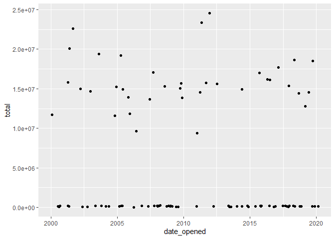
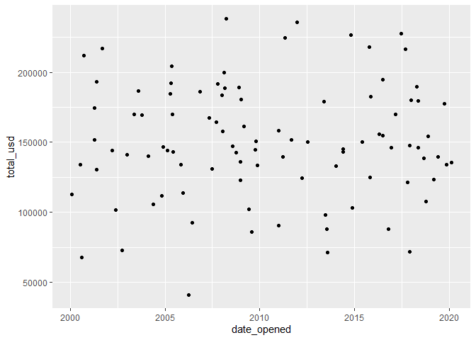
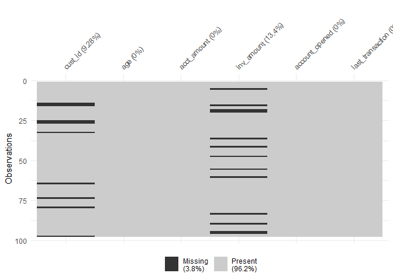

Advanced Data Problems
================
Mohamad Osman
2022-06-26

# `Section 03: Advanced Data Problems`

### `01-Date uniformity`

-   Take a look at the head of `accounts` to get a sense of the data
    you’re working with.

``` r
# file path 
accounts_file = file.path("..", "00_Datasets", "ch3_1_accounts.rds")

accounts <- readRDS(accounts_file)
```

-   Take a look at the head of `accounts` to get a sense of the data
    you’re working with.

``` r
library(lubridate)
```

    ## 
    ## Attaching package: 'lubridate'

    ## The following objects are masked from 'package:base':
    ## 
    ##     date, intersect, setdiff, union

``` r
library(dplyr)
```

    ## 
    ## Attaching package: 'dplyr'

    ## The following objects are masked from 'package:stats':
    ## 
    ##     filter, lag

    ## The following objects are masked from 'package:base':
    ## 
    ##     intersect, setdiff, setequal, union

``` r
library(ggplot2)
```

``` r
# Check out the accounts data frame
head(accounts)
```

    ##         id      date_opened    total
    ## 1 A880C79F       2003-10-19   169305
    ## 2 BE8222DF October 05, 2018   107460
    ## 3 19F9E113       2008-07-29 15297152
    ## 4 A2FE52A3       2005-06-09 14897272
    ## 5 F6DC2C08       2012-03-31   124568
    ## 6 D2E55799       2007-06-20 13635752

``` r
# Check out the accounts data frame
head(accounts)
```

    ##         id      date_opened    total
    ## 1 A880C79F       2003-10-19   169305
    ## 2 BE8222DF October 05, 2018   107460
    ## 3 19F9E113       2008-07-29 15297152
    ## 4 A2FE52A3       2005-06-09 14897272
    ## 5 F6DC2C08       2012-03-31   124568
    ## 6 D2E55799       2007-06-20 13635752

``` r
# Define the date formats
formats <- c("%Y-%m-%d", "%B %d, %Y")

# Convert dates to the same format
accounts %>%
  mutate(date_opened_clean = parse_date_time(accounts$date_opened, formats))
```

    ##          id        date_opened    total date_opened_clean
    ## 1  A880C79F         2003-10-19   169305        2003-10-19
    ## 2  BE8222DF   October 05, 2018   107460        2018-10-05
    ## 3  19F9E113         2008-07-29 15297152        2008-07-29
    ## 4  A2FE52A3         2005-06-09 14897272        2005-06-09
    ## 5  F6DC2C08         2012-03-31   124568        2012-03-31
    ## 6  D2E55799         2007-06-20 13635752        2007-06-20
    ## 7  53AE87EF  December 01, 2017 15375984        2017-12-01
    ## 8  3E97F253         2019-06-03 14515800        2019-06-03
    ## 9  4AE79EA1         2011-05-07 23338536        2011-05-07
    ## 10 2322DFB4         2018-04-07   189524        2018-04-07
    ## 11 645335B2         2018-11-16   154001        2018-11-16
    ## 12 D5EB0F00         2001-04-16   174576        2001-04-16
    ## 13 1EB593F7         2005-04-21   191989        2005-04-21
    ## 14 DDBA03D9         2006-06-13  9617192        2006-06-13
    ## 15 40E4A2F4         2009-01-07   180547        2009-01-07
    ## 16 39132EEA         2012-07-07 15611960        2012-07-07
    ## 17 387F8E4D   January 03, 2011  9402640        2011-01-03
    ## 18 11C3C3C0  December 24, 2017   180003        2017-12-24
    ## 19 C2FC91E1         2004-05-21   105722        2004-05-21
    ## 20 FB8F01C1         2001-09-06 22575072        2001-09-06
    ## 21 0128D2D0         2005-04-09 19179784        2005-04-09
    ## 22 BE6E4B3F         2009-10-20 15679976        2009-10-20
    ## 23 7C6E2ECC         2003-05-16   169814        2003-05-16
    ## 24 02E63545         2015-10-25   125117        2015-10-25
    ## 25 4399C98B       May 19, 2001   130421        2001-05-19
    ## 26 98F4CF0F       May 27, 2014 14893944        2014-05-27
    ## 27 247222A6       May 26, 2015   150372        2015-05-26
    ## 28 420985EE         2008-12-27   123125        2008-12-27
    ## 29 0E3903BA         2015-11-11   182668        2015-11-11
    ## 30 64EF994F         2009-02-26   161141        2009-02-26
    ## 31 CCF84EDB         2008-12-26   136128        2008-12-26
    ## 32 51C21705     April 22, 2016 16191136        2016-04-22
    ## 33 C868C6AD   January 31, 2000 11733072        2000-01-31
    ## 34 92C237C6         2005-12-13 11838528        2005-12-13
    ## 35 9ECEADB2       May 17, 2018   146153        2018-05-17
    ## 36 DF0AFE50         2004-12-03 15250040        2004-12-03
    ## 37 5CD605B3         2016-10-19    87921        2016-10-19
    ## 38 402839E2 September 14, 2019   163416        2019-09-14
    ## 39 78286CE7         2009-10-05 15049216        2009-10-05
    ## 40 168E071B         2013-07-11    87826        2013-07-11
    ## 41 466CCDAA         2002-03-24 14981304        2002-03-24
    ## 42 8DE1ECB9         2015-10-17   217975        2015-10-17
    ## 43 E19FE6B5      June 06, 2009   101936        2009-06-06
    ## 44 1240D39C September 07, 2011 15761824        2011-09-07
    ## 45 A7BFAA72         2019-11-12   133790        2019-11-12
    ## 46 C3D24436       May 24, 2002   101584        2002-05-24
    ## 47 FAD92F0F September 13, 2007 17081064        2007-09-13
    ## 48 236A1D51         2019-10-01 18486936        2019-10-01
    ## 49 A6DDDC4C         2000-08-17    67962        2000-08-17
    ## 50 DDFD0B3D         2001-04-11 15776384        2001-04-11
    ## 51 D13375E9  November 01, 2005 13944632        2005-11-01
    ## 52 AC50B796         2016-06-30 16111264        2016-06-30
    ## 53 290319FD       May 27, 2005   170178        2005-05-27
    ## 54 FC71925A  November 02, 2006   186281        2006-11-02
    ## 55 7B0F3685         2013-05-23   179102        2013-05-23
    ## 56 BE411172         2017-02-24 17689984        2017-02-24
    ## 57 58066E39 September 16, 2015 17025632        2015-09-16
    ## 58 EA7FF83A         2004-11-02 11598704        2004-11-02
    ## 59 14A2DDB7         2019-03-06 12808952        2019-03-06
    ## 60 305EEAA8         2018-09-01 14417728        2018-09-01
    ## 61 8F25E54C  November 24, 2008   189126        2008-11-24
    ## 62 19DD73C6         2002-12-31 14692600        2002-12-31
    ## 63 ACB8E6AF         2013-07-27    71359        2013-07-27
    ## 64 91BFCC40         2014-01-10   132859        2014-01-10
    ## 65 86ACAF81         2011-12-14 24533704        2011-12-14
    ## 66 77E85C14  November 20, 2009 13868192        2009-11-20
    ## 67 C5C6B79D         2008-03-01   188424        2008-03-01
    ## 68 0E5B69F5         2018-05-07 18650632        2018-05-07
    ## 69 5275B518         2017-11-23    71665        2017-11-23
    ## 70 17217048       May 25, 2001 20111208        2001-05-25
    ## 71 E7496A7F         2008-09-27   142669        2008-09-27
    ## 72 41BBB7B4  February 22, 2005   144229        2005-02-22
    ## 73 F6C7ABA1         2008-01-07   183440        2008-01-07
    ## 74 E699DF01  February 17, 2008   199603        2008-02-17
    ## 75 BACA7378         2005-05-11   204271        2005-05-11
    ## 76 84A4302F         2003-08-12 19420648        2003-08-12
    ## 77 F8A78C27     April 05, 2006    41164        2006-04-05
    ## 78 8BADDF6A  December 31, 2010   158203        2010-12-31
    ## 79 9FB57E68 September 01, 2017   216352        2017-09-01
    ## 80 5C98E8F5         2014-11-25   103200        2014-11-25
    ## 81 6BB53C2A  December 03, 2016   146394        2016-12-03
    ## 82 E23F2505   October 15, 2017   121614        2017-10-15
    ## 83 0C121914      June 21, 2017   227729        2017-06-21
    ## 84 3627E08A         2008-04-01   238104        2008-04-01
    ## 85 A94493B3    August 01, 2009    85975        2009-08-01
    ## 86 0682E9DE         2002-10-01    72832        2002-10-01
    ## 87 49931170         2011-03-25 14519856        2011-03-25
    ## 88 A154F63B         2000-07-11   133800        2000-07-11
    ## 89 3690CCED         2014-10-19   226595        2014-10-19
    ## 90 48F5E6D8  February 16, 2020   135435        2020-02-16
    ## 91 515FAD84         2013-06-20    98190        2013-06-20
    ## 92 59794264         2008-01-16   157964        2008-01-16
    ## 93 2038185B         2016-06-24   194662        2016-06-24
    ## 94 65EAC615  February 20, 2004   140191        2004-02-20
    ## 95 6C7509C9 September 16, 2000   212089        2000-09-16
    ## 96 BD969A9D         2007-04-29   167238        2007-04-29
    ## 97 B0CDCE3D       May 28, 2014   145240        2014-05-28
    ## 98 33A7F03E   October 14, 2007   191839        2007-10-14

-   Create a scatter plot with `date_opened` on the x-axis and `total`
    on the y-axis.

``` r
accounts <- accounts %>%
  mutate(date_opened = parse_date_time(date_opened, formats))
```

``` r
# Scatter plot of opening date and total amount
accounts %>%
  ggplot(aes(x = date_opened, y = total)) +
  geom_point()
```

<!-- -->

``` r
accounts_file_path <- file.path("..", "00_Datasets", "account_offices.csv")
account_offices <- read.csv(accounts_file_path)
```

``` r
# Scatter plot of opening date and total amount
accounts %>%
  ggplot(aes(x = date_opened, y = total)) +
  geom_point()
```

<!-- -->

``` r
# Left join accounts and account_offices by id
accounts %>%
  left_join(account_offices, by = c("id"))
```

    ##          id date_opened    total   office
    ## 1  A880C79F  2003-10-19   169305 New York
    ## 2  BE8222DF  2018-10-05   107460 New York
    ## 3  19F9E113  2008-07-29 15297152    Tokyo
    ## 4  A2FE52A3  2005-06-09 14897272    Tokyo
    ## 5  F6DC2C08  2012-03-31   124568 New York
    ## 6  D2E55799  2007-06-20 13635752    Tokyo
    ## 7  53AE87EF  2017-12-01 15375984    Tokyo
    ## 8  3E97F253  2019-06-03 14515800    Tokyo
    ## 9  4AE79EA1  2011-05-07 23338536    Tokyo
    ## 10 2322DFB4  2018-04-07   189524 New York
    ## 11 645335B2  2018-11-16   154001 New York
    ## 12 D5EB0F00  2001-04-16   174576 New York
    ## 13 1EB593F7  2005-04-21   191989 New York
    ## 14 DDBA03D9  2006-06-13  9617192    Tokyo
    ## 15 40E4A2F4  2009-01-07   180547 New York
    ## 16 39132EEA  2012-07-07 15611960    Tokyo
    ## 17 387F8E4D  2011-01-03  9402640    Tokyo
    ## 18 11C3C3C0  2017-12-24   180003 New York
    ## 19 C2FC91E1  2004-05-21   105722 New York
    ## 20 FB8F01C1  2001-09-06 22575072    Tokyo
    ## 21 0128D2D0  2005-04-09 19179784    Tokyo
    ## 22 BE6E4B3F  2009-10-20 15679976    Tokyo
    ## 23 7C6E2ECC  2003-05-16   169814 New York
    ## 24 02E63545  2015-10-25   125117 New York
    ## 25 4399C98B  2001-05-19   130421 New York
    ## 26 98F4CF0F  2014-05-27 14893944    Tokyo
    ## 27 247222A6  2015-05-26   150372 New York
    ## 28 420985EE  2008-12-27   123125 New York
    ## 29 0E3903BA  2015-11-11   182668 New York
    ## 30 64EF994F  2009-02-26   161141 New York
    ## 31 CCF84EDB  2008-12-26   136128 New York
    ## 32 51C21705  2016-04-22 16191136    Tokyo
    ## 33 C868C6AD  2000-01-31 11733072    Tokyo
    ## 34 92C237C6  2005-12-13 11838528    Tokyo
    ## 35 9ECEADB2  2018-05-17   146153 New York
    ## 36 DF0AFE50  2004-12-03 15250040    Tokyo
    ## 37 5CD605B3  2016-10-19    87921 New York
    ## 38 402839E2  2019-09-14   163416     <NA>
    ## 39 78286CE7  2009-10-05 15049216    Tokyo
    ## 40 168E071B  2013-07-11    87826 New York
    ## 41 466CCDAA  2002-03-24 14981304    Tokyo
    ## 42 8DE1ECB9  2015-10-17   217975 New York
    ## 43 E19FE6B5  2009-06-06   101936 New York
    ## 44 1240D39C  2011-09-07 15761824    Tokyo
    ## 45 A7BFAA72  2019-11-12   133790 New York
    ## 46 C3D24436  2002-05-24   101584 New York
    ## 47 FAD92F0F  2007-09-13 17081064    Tokyo
    ## 48 236A1D51  2019-10-01 18486936    Tokyo
    ## 49 A6DDDC4C  2000-08-17    67962 New York
    ## 50 DDFD0B3D  2001-04-11 15776384    Tokyo
    ## 51 D13375E9  2005-11-01 13944632    Tokyo
    ## 52 AC50B796  2016-06-30 16111264    Tokyo
    ## 53 290319FD  2005-05-27   170178 New York
    ## 54 FC71925A  2006-11-02   186281 New York
    ## 55 7B0F3685  2013-05-23   179102 New York
    ## 56 BE411172  2017-02-24 17689984    Tokyo
    ## 57 58066E39  2015-09-16 17025632     <NA>
    ## 58 EA7FF83A  2004-11-02 11598704    Tokyo
    ## 59 14A2DDB7  2019-03-06 12808952    Tokyo
    ## 60 305EEAA8  2018-09-01 14417728    Tokyo
    ## 61 8F25E54C  2008-11-24   189126 New York
    ## 62 19DD73C6  2002-12-31 14692600    Tokyo
    ## 63 ACB8E6AF  2013-07-27    71359 New York
    ## 64 91BFCC40  2014-01-10   132859 New York
    ## 65 86ACAF81  2011-12-14 24533704    Tokyo
    ## 66 77E85C14  2009-11-20 13868192    Tokyo
    ## 67 C5C6B79D  2008-03-01   188424 New York
    ## 68 0E5B69F5  2018-05-07 18650632    Tokyo
    ## 69 5275B518  2017-11-23    71665 New York
    ## 70 17217048  2001-05-25 20111208    Tokyo
    ## 71 E7496A7F  2008-09-27   142669 New York
    ## 72 41BBB7B4  2005-02-22   144229 New York
    ## 73 F6C7ABA1  2008-01-07   183440 New York
    ## 74 E699DF01  2008-02-17   199603 New York
    ## 75 BACA7378  2005-05-11   204271 New York
    ## 76 84A4302F  2003-08-12 19420648    Tokyo
    ## 77 F8A78C27  2006-04-05    41164 New York
    ## 78 8BADDF6A  2010-12-31   158203 New York
    ## 79 9FB57E68  2017-09-01   216352 New York
    ## 80 5C98E8F5  2014-11-25   103200 New York
    ## 81 6BB53C2A  2016-12-03   146394 New York
    ## 82 E23F2505  2017-10-15   121614 New York
    ## 83 0C121914  2017-06-21   227729 New York
    ## 84 3627E08A  2008-04-01   238104 New York
    ## 85 A94493B3  2009-08-01    85975 New York
    ## 86 0682E9DE  2002-10-01    72832 New York
    ## 87 49931170  2011-03-25 14519856    Tokyo
    ## 88 A154F63B  2000-07-11   133800 New York
    ## 89 3690CCED  2014-10-19   226595 New York
    ## 90 48F5E6D8  2020-02-16   135435 New York
    ## 91 515FAD84  2013-06-20    98190 New York
    ## 92 59794264  2008-01-16   157964 New York
    ## 93 2038185B  2016-06-24   194662 New York
    ## 94 65EAC615  2004-02-20   140191 New York
    ## 95 6C7509C9  2000-09-16   212089 New York
    ## 96 BD969A9D  2007-04-29   167238 New York
    ## 97 B0CDCE3D  2014-05-28   145240 New York
    ## 98 33A7F03E  2007-10-14   191839 New York

### **`02-Currency uniformity`**

The formula to convert yen to dollars is `USD = JPY / 104`.

`dplyr` and `ggplot2` are loaded and the `accounts` and
`account_offices` data frames are available.

-   Convert the `total`s from the Tokyo office from yen to dollars, and
    keep the `total` from the New York office in dollars. Store this as
    a new column called `total_usd`.

-   Create a scatter plot of your new uniform data using `date_opened`
    on the x-axis and `total_usd` on the y-axis.

``` r
# Scatter plot of opening date and total amount
accounts %>%
  ggplot(aes(x = date_opened, y = total)) +
  geom_point()
```

<!-- -->

``` r
# Left join accounts to account_offices by id
accounts %>%
  left_join(account_offices, by = "id") %>%
  # Convert totals from the Tokyo office to USD
  mutate(total_usd = ifelse(office == "Tokyo", total/104, total)) %>%
  # Scatter plot of opening date vs total_usd
  ggplot(aes(x = date_opened, y = total_usd)) +
  geom_point()
```

    ## Warning: Removed 2 rows containing missing values (geom_point).

<!-- -->

### 

**`03-Validating totals`**

-   Create a new column called `theoretical_total` that contains the sum
    of the amounts in each fund.

-   Find the accounts where the `total` doesn’t match the
    `theoretical_total`

``` r
file_path = file.path("..", "00_Datasets", "accounts_with_funds.csv")
accounts <- read.csv(file_path)
```

``` r
# Find invalid totals
accounts %>%
  # theoretical_total: sum of the three funds
  mutate(theoretical_total = fund_A + fund_B + fund_C) %>%
  # Find accounts where total doesn't match theoretical_total
  filter(total != theoretical_total)
```

    ##    X       id date_opened  total fund_A fund_B fund_C acct_age
    ## 1 12 D5EB0F00   4/16/2001 130920  69487  48681  56408       21
    ## 2 34 92C237C6  12/13/2005  85362  72556  21739  19537       16
    ## 3 68 0E5B69F5    5/7/2018 134488  88475  44383  46475        4
    ##   theoretical_total
    ## 1            174576
    ## 2            113832
    ## 3            179333

### **`04-Validating age`**

-   Create a new column called `theoretical_age` that contains the age
    of each account based on the `date_opened`.

-   Find the accounts where the `acct_age` doesn’t match the
    `theoretical_age`.

``` r
# read the csv file.
file_path = file.path("..", "00_Datasets", "accounts_with_ages.csv")
accounts <- read.csv(file_path)
accounts
```

    ##          id date_opened  total fund_A fund_B fund_C acct_age
    ## 1  A880C79F  10/19/2003 169305  85018  75580   8707       18
    ## 2  BE8222DF   10/5/2018 107460  64784  35194   7482        3
    ## 3  19F9E113   7/29/2008 147088  64029  15300  67759       13
    ## 4  A2FE52A3    6/9/2005 143243  63466  54053  25724       17
    ## 5  F6DC2C08   3/31/2012 124568  21156  47935  55477       10
    ## 6  D2E55799   6/20/2007 131113  79241  26800  25072       15
    ## 7  53AE87EF   12/1/2017 147846  38450  29185  80211        4
    ## 8  3E97F253    6/3/2019 139575  11045  65907  62623        3
    ## 9  4AE79EA1    5/7/2011 224409  68394  80418  75597       11
    ## 10 2322DFB4    4/7/2018 189524  66964  52238  70322        4
    ## 11 645335B2  11/16/2018 154001  68691  56400  28910        3
    ## 12 D5EB0F00   4/16/2001 130920  69487  48681  56408       21
    ## 13 1EB593F7   4/21/2005 191989  75388  84199  32402       17
    ## 14 DDBA03D9   6/13/2006  92473  32931  22162  37380       16
    ## 15 40E4A2F4    1/7/2009 180547  82564  68210  29773       13
    ## 16 39132EEA    7/7/2012 150115  26358  74286  49471        9
    ## 17 387F8E4D    1/3/2011  90410   7520  67142  15748       11
    ## 18 11C3C3C0  12/24/2017 180003  84295  31591  64117        3
    ## 19 C2FC91E1   5/21/2004 105722  25398  24075  56249       18
    ## 20 FB8F01C1    9/6/2001 217068  69738  86768  60562       20
    ## 21 0128D2D0    4/9/2005 184421  82221  60149  42051       17
    ## 22 BE6E4B3F  10/20/2009 150769  49607  55417  45745       12
    ## 23 7C6E2ECC   5/16/2003 169814  82093  62756  24965       19
    ## 24 02E63545  10/25/2015 125117  50287  23342  51488        6
    ## 25 4399C98B   5/19/2001 130421  58177  43912  28332       21
    ## 26 98F4CF0F   5/27/2014 143211  84645   7088  51478        8
    ## 27 247222A6   5/26/2015 150372  69104  63369  17899        7
    ## 28 420985EE  12/27/2008 123125  59390  27890  35845       13
    ## 29 0E3903BA  11/11/2015 182668  47236  87437  47995        6
    ## 30 64EF994F   2/26/2009 161141  89269  25939  45933       13
    ## 31 CCF84EDB  12/26/2008 136128  33405  89016  13707       13
    ## 32 51C21705   4/22/2016 155684  53542  38234  63908        6
    ## 33 C868C6AD   1/31/2000 112818  17876  15057  79885       22
    ## 34 92C237C6  12/13/2005  85362  72556  21739  19537       16
    ## 35 9ECEADB2   5/17/2018 146153  40675  46482  58996        4
    ## 36 DF0AFE50   12/3/2004 146635  67373  63443  15819       17
    ## 37 5CD605B3  10/19/2016  87921   8474  50284  29163        5
    ## 38 4.03E+07   9/14/2019 163416  59213  23460  80743        2
    ## 39 78286CE7   10/5/2009 144704  72495  38450  33759       12
    ## 40 168E071B   7/11/2013  87826  21642  42937  23247        8
    ## 41 466CCDAA   3/24/2002 144051  19756  80182  44113       20
    ## 42 8DE1ECB9  10/17/2015 217975  67105  72907  77963        6
    ## 43 E19FE6B5    6/6/2009 101936  39942  38580  23414       13
    ## 44 1240D39C    9/7/2011 151556  18835  46135  86586       10
    ## 45 A7BFAA72  11/12/2019 133790  56001  54885  22904        2
    ## 46 C3D24436   5/24/2002 101584  58434  21069  22081       20
    ## 47 FAD92F0F   9/13/2007 164241  70211  73984  20046       14
    ## 48 236A1D51   10/1/2019 177759  20886  80883  75990        2
    ## 49 A6DDDC4C   8/17/2000  67962   5970  20088  41904       21
    ## 50 DDFD0B3D   4/11/2001 151696  30596  84390  36710       21
    ## 51 D13375E9   11/1/2005 134083  28545  37537  68001       16
    ## 52 AC50B796   6/30/2016 154916  54451  35906  64559        5
    ## 53 290319FD   5/27/2005 170178  54341  32764  83073       17
    ## 54 FC71925A   11/2/2006 186281  89127  43356  53798       15
    ## 55 7B0F3685   5/23/2013 179102  81321  18106  79675        9
    ## 56 BE411172   2/24/2017 170096  86735  56580  26781        5
    ## 57 5.81E+43   9/16/2015 163708  59004  16987  87717        6
    ## 58 EA7FF83A   11/2/2004 111526  86856  19406   5264       16
    ## 59 14A2DDB7    3/6/2019 123163  49666  25407  48090        3
    ## 60 305EEAA8    9/1/2018 138632  20307  35028  83297        3
    ## 61 8F25E54C  11/24/2008 189126  72037  62513  54576       13
    ## 62 19DD73C6  12/31/2002 141275  72872  51219  17184       19
    ## 63 ACB8E6AF   7/27/2013  71359  10203  51163   9993        8
    ## 64 91BFCC40   1/10/2014 132859  67405   7399  58055        8
    ## 65 86ACAF81  12/14/2011 235901  79599  79291  77011       10
    ## 66 77E85C14  11/20/2009 133348  20954  33018  79376       12
    ## 67 C5C6B79D    3/1/2008 188424  61972  69266  57186       14
    ## 68 0E5B69F5    5/7/2018 134488  88475  44383  46475        4
    ## 69 5275B518  11/23/2017  71665  16114  35691  19860        4
    ## 70 17217048   5/25/2001 193377  45365  58558  89454       21
    ## 71 E7496A7F   9/27/2008 142669   8615  72841  61213       13
    ## 72 41BBB7B4   2/22/2005 144229  26449  83938  33842       17
    ## 73 F6C7ABA1    1/7/2008 183440  82468  73281  27691       14
    ## 74 E699DF01   2/17/2008 199603  84788  47808  67007       14
    ## 75 BACA7378   5/11/2005 204271  87254  57043  59974       17
    ## 76 84A4302F   8/12/2003 186737  86632  33506  66599       18
    ## 77 F8A78C27    4/5/2006  41164   7560  21040  12564       16
    ## 78 8BADDF6A  12/31/2010 158203  25477  43902  88824       11
    ## 79 9FB57E68    9/1/2017 216352  86665  77117  52570        4
    ## 80 5C98E8F5  11/25/2014 103200  28990  24986  49224        7
    ## 81 6BB53C2A   12/3/2016 146394  29561  29023  87810        5
    ## 82 E23F2505  10/15/2017 121614  59013  39086  23515        4
    ## 83 0C121914   6/21/2017 227729  86625  79950  61154        5
    ## 84 3627E08A    4/1/2008 238104  60475  89011  88618       13
    ## 85 A94493B3    8/1/2009  85975  48482   7054  30439       12
    ## 86 0682E9DE   10/1/2002  72832  15809  15617  41406       19
    ## 87 49931170   3/25/2011 139614  83035  22239  34340       11
    ## 88 A154F63B   7/11/2000 133800  42648  16464  74688       21
    ## 89 3690CCED  10/19/2014 226595  70260  84337  71998        7
    ## 90 48F5E6D8   2/16/2020 135435  29123  23204  83108        2
    ## 91 515FAD84   6/20/2013  98190   6452  60014  31724        9
    ## 92 59794264   1/16/2008 157964  68869  32999  56096       14
    ## 93 2038185B   6/24/2016 194662  20591  89990  84081        6
    ## 94 65EAC615   2/20/2004 140191  20108  46764  73319       18
    ## 95 6C7509C9   9/16/2000 212089  58861  76975  76253       21
    ## 96 BD969A9D   4/29/2007 167238  10234  83183  73821       15
    ## 97 B0CDCE3D   5/28/2014 145240  62549  48606  34085        8
    ## 98 33A7F03E  10/14/2007 191839  80542  87909  23388       14

``` r
# change the format of the date opended. 
accounts <- accounts %>%
  mutate(date_opened = parse_date_time(date_opened, "%m/%d/$Y"))

# Find invalid acct_age
accounts %>%
  # theoretical_age: age of acct based on date_opened
  mutate(theoretical_age = floor(as.numeric(date_opened %--% today(), "years"))) %>%
  # Filter for rows where acct_age is different from theoretical_age
  filter(theoretical_age != acct_age)
```

    ##         id date_opened  total fund_A fund_B fund_C acct_age theoretical_age
    ## 1 11C3C3C0  2017-12-24 180003  84295  31591  64117        3               4
    ## 2 EA7FF83A  2004-11-02 111526  86856  19406   5264       16              17
    ## 3 3627E08A  2008-04-01 238104  60475  89011  88618       13              14

### **`05-Visualizing missing data`**

-   Visualize the missing values in `accounts` by column using a
    function from the `visdat` package.

``` r
library(visdat)
```

``` r
# read account 
account_m_file <- file.path("..", "00_Datasets", "accounts_missing_values.csv")
accounts <- read.csv(account_m_file)

# Visualize the missing values by column
vis_miss(accounts)
```

    ## Warning: `gather_()` was deprecated in tidyr 1.2.0.
    ## Please use `gather()` instead.
    ## This warning is displayed once every 8 hours.
    ## Call `lifecycle::last_lifecycle_warnings()` to see where this warning was generated.

<!-- -->

-   Add a logical column to `accounts` called `missing_inv` that
    indicates whether each row is missing the `inv_amount` or not.

-   Group by `missing_inv`.

-   Calculate the mean age for each group of `missing_inv`.

``` r
# Visualize the missing values by column
vis_miss(accounts)
```

<!-- -->

``` r
accounts %>%
  # missing_inv: Is inv_amount missing?
  mutate(missing_inv = is.na(inv_amount)) %>%
  # Group by missing_inv
  group_by(missing_inv) %>%
  # Calculate mean age for each missing_inv group
  summarize(avg_age = mean(age))
```

    ## # A tibble: 2 × 2
    ##   missing_inv avg_age
    ##   <lgl>         <dbl>
    ## 1 FALSE          43.6
    ## 2 TRUE           21.8

-   Sort `accounts` by `age`.

-   Visualize missing data by column.

``` r
# Visualize the missing values by column
vis_miss(accounts)
```

<!-- -->

``` r
accounts %>%
  # missing_inv: Is inv_amount missing?
  mutate(missing_inv = is.na(inv_amount)) %>%
  # Group by missing_inv
  group_by(missing_inv) %>%
  # Calculate mean age for each missing_inv group
  summarize(avg_age = mean(age))
```

    ## # A tibble: 2 × 2
    ##   missing_inv avg_age
    ##   <lgl>         <dbl>
    ## 1 FALSE          43.6
    ## 2 TRUE           21.8

``` r
# Sort by age and visualize missing vals
#accounts %>%
  #arrange(age)%>%
  #vis_miss(is.na(accounts)))
```

### **06-Treating missing data**

In this exercise, you’re working with another version of the `accounts`
data that contains missing values for both the `cust_id` and
`acct_amount` columns.

You want to figure out how many unique customers the bank has, as well
as the average amount held by customers. You know that rows with missing
`cust_id` don’t really help you, and that on average, the `acct_amount`
is usually 5 times the amount of `inv_amount`.

In this exercise, you will drop rows of `accounts` with missing
`cust_id`s, and impute missing values of `inv_amount` with some domain
knowledge. `dplyr` and `assertive` are loaded and `accounts` is
available.

Filter `accounts` to remove rows with missing `cust_id`s and save as
`accounts_clean`.

``` r
# read account 
account_m_file <- file.path("..", "00_Datasets", "accounts_missing_values.csv")
accounts <- read.csv(account_m_file)
```

``` r
# Create accounts_clean
accounts_clean <- accounts %>%
  # Filter to remove rows with missing cust_id
  filter(!is.na(cust_id))

accounts_clean
```

    ##     cust_id age acct_amount inv_amount account_opened last_transaction
    ## 1  8C35540A  54    44244.71   35500.50       3/5/2018         30-09-19
    ## 2  D5536652  36    86506.85   81921.86       21-01-18         14-01-19
    ## 3  A631984D  49    77799.33   46412.27       26-01-18        6/10/2019
    ## 4  93F2F951  56    93875.24   76563.35       21-08-17        10/7/2019
    ## 5  DE0A0882  21    99998.35         NA       5/6/2017         15-01-19
    ## 6  25E68E1B  47   109737.62   93552.69       26-12-17       12/11/2018
    ## 7  3FA9296D  53    79744.23   70357.70       21-06-18         24-08-18
    ## 8  984403B9  29    17939.88   14429.59      7/10/2017         18-05-18
    ## 9  870A9281  58    63523.31   51297.32       2/9/2018         22-02-19
    ## 10 166B05B0  53    38175.46   15052.70       28-02-19         31-10-18
    ## 11 0A9BA907  44    90469.53   70173.49       15-06-18         28-08-18
    ## 12 2AB6539A  59    53796.13   12401.32       3/1/2019         17-11-18
    ## 13 F389832C  48    95380.06   58388.14       3/2/2018         23-09-18
    ## 14 CA507BA1  50    12209.84    7516.33       26-05-18        11/9/2019
    ## 15 472341F2  35    83127.65   67961.74       14-12-18         22-04-18
    ## 16 D3287768  20    89961.77         NA       3/9/2018         19-10-18
    ## 17 FA01676F  21    66947.30         NA      10/8/2018         23-07-19
    ## 18 A69FA1B8  41    75207.99   31620.86       23-02-19         9/9/2019
    ## 19 9B550FD5  42    32891.31   11993.35       2/5/2018         27-06-19
    ## 20 B99CD662  28    92838.44   49090.83       4/5/2017        12/3/2019
    ## 21 7A73F334  35   120512.00   93233.00       14-05-18         19-07-18
    ## 22 B40E8497  33    99771.90   86992.74       16-05-17         5/1/2020
    ## 23 EC189A55  53    83343.18    7282.91       4/2/2019         31-12-18
    ## 24 3C5CBBD7  45    59678.01   35939.08       3/1/2019        2/10/2018
    ## 25 F7FC8F78  26    88049.82   84432.03       28-02-18         30-04-18
    ## 26 ACE5C956  39    90413.25   21574.21       29-12-18         30-04-19
    ## 27 2EC1B555  34    55976.78   51478.91      5/12/2017         21-10-19
    ## 28 5321D380  58    59700.08    8145.24      9/10/2018         4/2/2019
    ## 29 C55C54A8  45    79630.02   25250.82       30-10-18         19-02-19
    ## 30 AC2AEAC4  57    88440.54   63332.90      12/3/2018         1/8/2019
    ## 31 904A19DD  20    31981.36         NA       28-01-19         23-06-19
    ## 32 A731C34E  46    95352.02   84066.66       13-11-17         13-01-19
    ## 33 96525DA6  33    82511.24   33929.23       23-07-18         7/8/2018
    ## 34 BD7CF5D7  29    82084.76   44340.56       18-07-17         26-02-20
    ## 35 0109137B  44    31730.19   21959.28       20-04-18         8/7/2019
    ## 36 93E78DA3  22    41942.23         NA      9/10/2017         15-04-18
    ## 37 72DD1471  27   100683.48   87882.91       22-01-18         17-05-18
    ## 38 EC7C25A8  30    86503.33   49180.36       8/6/2017         2/4/2018
    ## 39 38B8CD9C  55    28834.71   27532.35       17-09-18         5/2/2020
    ## 40 80C0DAB3  27    73951.45   61650.12       3/4/2017         21-09-19
    ## 41 DEC6DBE4  46    32220.83    3216.72       9/8/2018         17-11-19
    ## 42 3B240FEF  25    97856.46         NA       23-05-18       11/10/2018
    ## 43 82E87321  50    97833.54   61481.86       18-10-18         21-07-18
    ## 44 1903EB99  37    24267.02   22963.63       17-03-17         21-11-18
    ## 45 2F4F99C1  53    82058.48   35760.69       30-12-18        11/8/2018
    ## 46 46351200  56    97595.30   82251.59       18-08-18         20-02-20
    ## 47 7D8EBAF6  52   109943.03   81490.13       2/7/2017         22-02-20
    ## 48 E2EFF324  29    67297.46   57252.76       27-04-18        10/7/2018
    ## 49 A1815565  32    82996.04   30898.16      7/11/2017         30-09-19
    ## 50 6B094617  21    89855.98         NA       6/2/2018         14-02-19
    ## 51 C580AE41  47    96673.37   68468.28       28-09-18         17-09-18
    ## 52 B25B3B8D  57    99193.98   83364.21       28-04-18         4/7/2019
    ## 53 0F0884F6  56    84505.81   47826.51       8/3/2018         24-08-19
    ## 54 58F8CC80  42    87146.19   25759.85       18-10-18        10/1/2019
    ## 55 56D310A8  21    88660.40         NA       25-02-18         29-07-18
    ## 56 4A13E345  45    84107.71    4217.92       17-09-18         9/2/2019
    ## 57 5AEA5AB8  56   100266.99   89342.43       9/6/2018         3/7/2019
    ## 58 7A4EED75  33    98923.14   20932.30       28-11-17         1/5/2019
    ## 59 87FDF627  56    95275.46   55888.87       26-02-19         25-06-18
    ## 60 FBAD3C91  35    99141.90   13468.40       29-05-18        2/11/2019
    ## 61 BFC13E88  58    59863.77   24569.47       25-04-18         2/4/2018
    ## 62 5F6A2443  57    98047.16   76216.88       15-12-18       12/11/2019
    ## 63 7A2879AF  54    83345.15   45162.06       30-08-18        9/11/2019
    ## 64 13770971  26    92750.87   27963.45       16-08-17         24-04-19
    ## 65 EC10469C  28    73618.75   48979.16       27-12-18         8/6/2018
    ## 66 B5D367B5  39    44226.86   36572.69       16-09-17         3/4/2019
    ## 67 625167AC  28    95315.71   66914.63       8/6/2017         3/7/2019
    ## 68 777A7F2C  30    52684.17   20970.35       27-10-18         25-05-19
    ## 69 3E51A395  46    21757.14   10582.94       4/6/2017         22-09-18
    ## 70 2C5901B4  40   250046.76   90442.57       5/2/2018        11/7/2019
    ## 71 D4C7E817  56    26585.87   20441.92       6/5/2018        8/12/2018
    ## 72 E52D4C7F  36    61795.89   49387.29       22-05-17         24-10-19
    ## 73 987DC93E  51    35924.41   14881.89       30-12-18        6/12/2018
    ## 74 A07D5C92  45    99577.36   60408.99       17-11-17         16-01-20
    ## 75 078C654F  21    87312.64         NA       14-04-17         5/8/2018
    ## 76 807465A4  48    28827.59   14585.75       20-04-17         31-07-18
    ## 77 8D08495A  59    89138.52   60798.23       8/8/2018         5/2/2019
    ## 78 C9FB0E86  46    88682.34   26166.11       19-05-18         6/8/2019
    ## 79 296A9395  48    34679.60   28459.96       24-12-17         19-02-19
    ## 80 F2158F66  41    84132.10   23714.06      7/11/2017        8/11/2018
    ## 81 33CA2B76  23    75508.61         NA       16-11-17         3/3/2019
    ## 82 EEBD980F  59    57838.49   50814.83      8/12/2018         4/1/2020
    ## 83 014E0511  27    70272.97   65969.80       9/2/2019         22-05-19
    ## 84 0B44C3F8  32    33984.87   31395.00      10/4/2018         28-09-19
    ## 85 CEC1CAE5  32    92169.14   77896.86       26-11-17        8/10/2018
    ## 86 4C7F8638  23    21942.37         NA       14-07-18         2/2/2019
    ## 87 A81D31B3  24    74010.15         NA       2/6/2018        12/9/2018
    ## 88 93A17007  36    40651.36    9387.87       28-05-17         8/3/2019

-   Create a new column called `acct_amount_filled`, which contains the
    values of `acct_amount`, except all `NA` values should be replaced
    with 5 times the amount in `inv_amount`.

``` r
# Create accounts_clean
accounts_clean <- accounts %>%
  # Filter to remove rows with missing cust_id
  filter(!is.na(cust_id)) %>%
  # Add new col acct_amount_filled with replaced NAs
  mutate(acct_amount_filled = ifelse(is.na(acct_amount), 5 * inv_amount, acct_amount))

accounts_clean
```

    ##     cust_id age acct_amount inv_amount account_opened last_transaction
    ## 1  8C35540A  54    44244.71   35500.50       3/5/2018         30-09-19
    ## 2  D5536652  36    86506.85   81921.86       21-01-18         14-01-19
    ## 3  A631984D  49    77799.33   46412.27       26-01-18        6/10/2019
    ## 4  93F2F951  56    93875.24   76563.35       21-08-17        10/7/2019
    ## 5  DE0A0882  21    99998.35         NA       5/6/2017         15-01-19
    ## 6  25E68E1B  47   109737.62   93552.69       26-12-17       12/11/2018
    ## 7  3FA9296D  53    79744.23   70357.70       21-06-18         24-08-18
    ## 8  984403B9  29    17939.88   14429.59      7/10/2017         18-05-18
    ## 9  870A9281  58    63523.31   51297.32       2/9/2018         22-02-19
    ## 10 166B05B0  53    38175.46   15052.70       28-02-19         31-10-18
    ## 11 0A9BA907  44    90469.53   70173.49       15-06-18         28-08-18
    ## 12 2AB6539A  59    53796.13   12401.32       3/1/2019         17-11-18
    ## 13 F389832C  48    95380.06   58388.14       3/2/2018         23-09-18
    ## 14 CA507BA1  50    12209.84    7516.33       26-05-18        11/9/2019
    ## 15 472341F2  35    83127.65   67961.74       14-12-18         22-04-18
    ## 16 D3287768  20    89961.77         NA       3/9/2018         19-10-18
    ## 17 FA01676F  21    66947.30         NA      10/8/2018         23-07-19
    ## 18 A69FA1B8  41    75207.99   31620.86       23-02-19         9/9/2019
    ## 19 9B550FD5  42    32891.31   11993.35       2/5/2018         27-06-19
    ## 20 B99CD662  28    92838.44   49090.83       4/5/2017        12/3/2019
    ## 21 7A73F334  35   120512.00   93233.00       14-05-18         19-07-18
    ## 22 B40E8497  33    99771.90   86992.74       16-05-17         5/1/2020
    ## 23 EC189A55  53    83343.18    7282.91       4/2/2019         31-12-18
    ## 24 3C5CBBD7  45    59678.01   35939.08       3/1/2019        2/10/2018
    ## 25 F7FC8F78  26    88049.82   84432.03       28-02-18         30-04-18
    ## 26 ACE5C956  39    90413.25   21574.21       29-12-18         30-04-19
    ## 27 2EC1B555  34    55976.78   51478.91      5/12/2017         21-10-19
    ## 28 5321D380  58    59700.08    8145.24      9/10/2018         4/2/2019
    ## 29 C55C54A8  45    79630.02   25250.82       30-10-18         19-02-19
    ## 30 AC2AEAC4  57    88440.54   63332.90      12/3/2018         1/8/2019
    ## 31 904A19DD  20    31981.36         NA       28-01-19         23-06-19
    ## 32 A731C34E  46    95352.02   84066.66       13-11-17         13-01-19
    ## 33 96525DA6  33    82511.24   33929.23       23-07-18         7/8/2018
    ## 34 BD7CF5D7  29    82084.76   44340.56       18-07-17         26-02-20
    ## 35 0109137B  44    31730.19   21959.28       20-04-18         8/7/2019
    ## 36 93E78DA3  22    41942.23         NA      9/10/2017         15-04-18
    ## 37 72DD1471  27   100683.48   87882.91       22-01-18         17-05-18
    ## 38 EC7C25A8  30    86503.33   49180.36       8/6/2017         2/4/2018
    ## 39 38B8CD9C  55    28834.71   27532.35       17-09-18         5/2/2020
    ## 40 80C0DAB3  27    73951.45   61650.12       3/4/2017         21-09-19
    ## 41 DEC6DBE4  46    32220.83    3216.72       9/8/2018         17-11-19
    ## 42 3B240FEF  25    97856.46         NA       23-05-18       11/10/2018
    ## 43 82E87321  50    97833.54   61481.86       18-10-18         21-07-18
    ## 44 1903EB99  37    24267.02   22963.63       17-03-17         21-11-18
    ## 45 2F4F99C1  53    82058.48   35760.69       30-12-18        11/8/2018
    ## 46 46351200  56    97595.30   82251.59       18-08-18         20-02-20
    ## 47 7D8EBAF6  52   109943.03   81490.13       2/7/2017         22-02-20
    ## 48 E2EFF324  29    67297.46   57252.76       27-04-18        10/7/2018
    ## 49 A1815565  32    82996.04   30898.16      7/11/2017         30-09-19
    ## 50 6B094617  21    89855.98         NA       6/2/2018         14-02-19
    ## 51 C580AE41  47    96673.37   68468.28       28-09-18         17-09-18
    ## 52 B25B3B8D  57    99193.98   83364.21       28-04-18         4/7/2019
    ## 53 0F0884F6  56    84505.81   47826.51       8/3/2018         24-08-19
    ## 54 58F8CC80  42    87146.19   25759.85       18-10-18        10/1/2019
    ## 55 56D310A8  21    88660.40         NA       25-02-18         29-07-18
    ## 56 4A13E345  45    84107.71    4217.92       17-09-18         9/2/2019
    ## 57 5AEA5AB8  56   100266.99   89342.43       9/6/2018         3/7/2019
    ## 58 7A4EED75  33    98923.14   20932.30       28-11-17         1/5/2019
    ## 59 87FDF627  56    95275.46   55888.87       26-02-19         25-06-18
    ## 60 FBAD3C91  35    99141.90   13468.40       29-05-18        2/11/2019
    ## 61 BFC13E88  58    59863.77   24569.47       25-04-18         2/4/2018
    ## 62 5F6A2443  57    98047.16   76216.88       15-12-18       12/11/2019
    ## 63 7A2879AF  54    83345.15   45162.06       30-08-18        9/11/2019
    ## 64 13770971  26    92750.87   27963.45       16-08-17         24-04-19
    ## 65 EC10469C  28    73618.75   48979.16       27-12-18         8/6/2018
    ## 66 B5D367B5  39    44226.86   36572.69       16-09-17         3/4/2019
    ## 67 625167AC  28    95315.71   66914.63       8/6/2017         3/7/2019
    ## 68 777A7F2C  30    52684.17   20970.35       27-10-18         25-05-19
    ## 69 3E51A395  46    21757.14   10582.94       4/6/2017         22-09-18
    ## 70 2C5901B4  40   250046.76   90442.57       5/2/2018        11/7/2019
    ## 71 D4C7E817  56    26585.87   20441.92       6/5/2018        8/12/2018
    ## 72 E52D4C7F  36    61795.89   49387.29       22-05-17         24-10-19
    ## 73 987DC93E  51    35924.41   14881.89       30-12-18        6/12/2018
    ## 74 A07D5C92  45    99577.36   60408.99       17-11-17         16-01-20
    ## 75 078C654F  21    87312.64         NA       14-04-17         5/8/2018
    ## 76 807465A4  48    28827.59   14585.75       20-04-17         31-07-18
    ## 77 8D08495A  59    89138.52   60798.23       8/8/2018         5/2/2019
    ## 78 C9FB0E86  46    88682.34   26166.11       19-05-18         6/8/2019
    ## 79 296A9395  48    34679.60   28459.96       24-12-17         19-02-19
    ## 80 F2158F66  41    84132.10   23714.06      7/11/2017        8/11/2018
    ## 81 33CA2B76  23    75508.61         NA       16-11-17         3/3/2019
    ## 82 EEBD980F  59    57838.49   50814.83      8/12/2018         4/1/2020
    ## 83 014E0511  27    70272.97   65969.80       9/2/2019         22-05-19
    ## 84 0B44C3F8  32    33984.87   31395.00      10/4/2018         28-09-19
    ## 85 CEC1CAE5  32    92169.14   77896.86       26-11-17        8/10/2018
    ## 86 4C7F8638  23    21942.37         NA       14-07-18         2/2/2019
    ## 87 A81D31B3  24    74010.15         NA       2/6/2018        12/9/2018
    ## 88 93A17007  36    40651.36    9387.87       28-05-17         8/3/2019
    ##    acct_amount_filled
    ## 1            44244.71
    ## 2            86506.85
    ## 3            77799.33
    ## 4            93875.24
    ## 5            99998.35
    ## 6           109737.62
    ## 7            79744.23
    ## 8            17939.88
    ## 9            63523.31
    ## 10           38175.46
    ## 11           90469.53
    ## 12           53796.13
    ## 13           95380.06
    ## 14           12209.84
    ## 15           83127.65
    ## 16           89961.77
    ## 17           66947.30
    ## 18           75207.99
    ## 19           32891.31
    ## 20           92838.44
    ## 21          120512.00
    ## 22           99771.90
    ## 23           83343.18
    ## 24           59678.01
    ## 25           88049.82
    ## 26           90413.25
    ## 27           55976.78
    ## 28           59700.08
    ## 29           79630.02
    ## 30           88440.54
    ## 31           31981.36
    ## 32           95352.02
    ## 33           82511.24
    ## 34           82084.76
    ## 35           31730.19
    ## 36           41942.23
    ## 37          100683.48
    ## 38           86503.33
    ## 39           28834.71
    ## 40           73951.45
    ## 41           32220.83
    ## 42           97856.46
    ## 43           97833.54
    ## 44           24267.02
    ## 45           82058.48
    ## 46           97595.30
    ## 47          109943.03
    ## 48           67297.46
    ## 49           82996.04
    ## 50           89855.98
    ## 51           96673.37
    ## 52           99193.98
    ## 53           84505.81
    ## 54           87146.19
    ## 55           88660.40
    ## 56           84107.71
    ## 57          100266.99
    ## 58           98923.14
    ## 59           95275.46
    ## 60           99141.90
    ## 61           59863.77
    ## 62           98047.16
    ## 63           83345.15
    ## 64           92750.87
    ## 65           73618.75
    ## 66           44226.86
    ## 67           95315.71
    ## 68           52684.17
    ## 69           21757.14
    ## 70          250046.76
    ## 71           26585.87
    ## 72           61795.89
    ## 73           35924.41
    ## 74           99577.36
    ## 75           87312.64
    ## 76           28827.59
    ## 77           89138.52
    ## 78           88682.34
    ## 79           34679.60
    ## 80           84132.10
    ## 81           75508.61
    ## 82           57838.49
    ## 83           70272.97
    ## 84           33984.87
    ## 85           92169.14
    ## 86           21942.37
    ## 87           74010.15
    ## 88           40651.36

-   Assert that there are no missing values in the `acct_amount_filled`
    column of `accounts_clean`.

-   Assert that there are no missing values in the `cust_id` column of
    `accounts_clean`.

``` r
library(assertive)

# Create accounts_clean
accounts_clean <- accounts %>%
  # Filter to remove rows with missing cust_id
  filter(!is.na(cust_id)) %>%
  # Add new col acct_amount_filled with replaced NAs
  mutate(acct_amount_filled = ifelse(is.na(acct_amount), inv_amount * 5, acct_amount))

# Assert that cust_id has no missing vals
assert_all_are_not_na(accounts_clean$cust_id)

# Assert that acct_amount_filled has no missing vals
assert_all_are_not_na(accounts_clean$acct_amount_filled)
```

### `The End`
