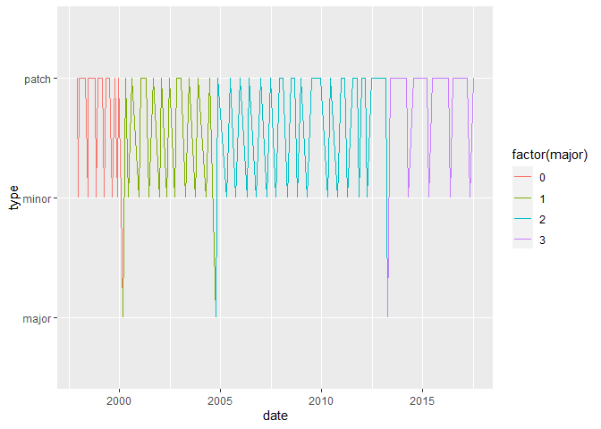
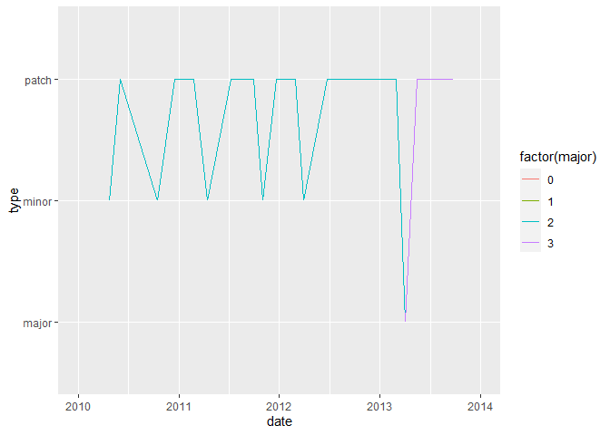
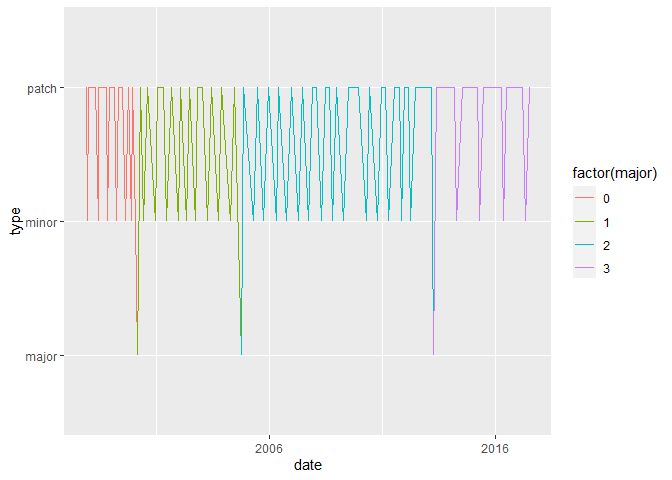
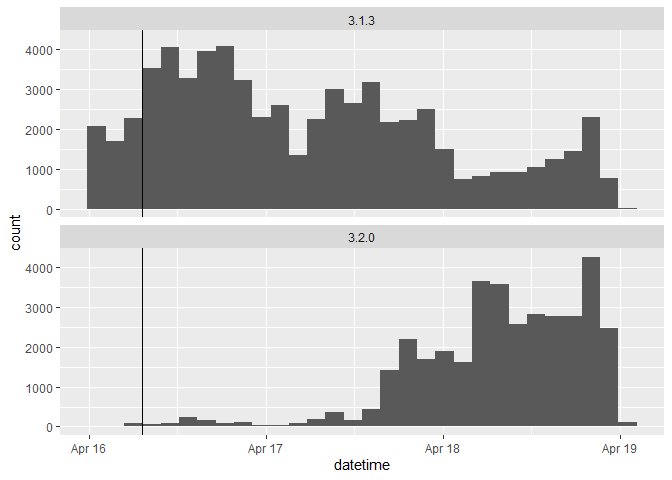

Dates and Times in R
================
Mohamad Osman
2022-06-28

# Section 01: Dates and Times in R

### **`01-Recognizing ISO 8601 dates`**

-   Which of the following is the correct way to specify the *4th of
    October 2004* according to `ISO 8601`?

    `Ans: 2004-10-04`

### **`02-Specifying dates`**

``` r
x = "2013-04-03"
```

We’ve stored the string `"2013-04-03"` in a variable called `x`.

-   Use `str()` to look at the structure of `x` and confirm it’s just a
    character string.

-   Convert `x` to a date using `as.Date()`.

-   Use `str()` to look at the structure of `x_date` and confirm it’s a
    `Date`.

-   Now use `as.Date()` to store the date *April 10, 2014*.

``` r
# The date R 3.0.0 was released
x <- "2013-04-03"

# Examine structure of x
str(x)
```

    ##  chr "2013-04-03"

``` r
# Use as.Date() to interpret x as a date
x_date <- as.Date(x)

# Examine structure of x_date
str(x_date)
```

    ##  Date[1:1], format: "2013-04-03"

``` r
# Store April 10 2014 as a Date
april_10_2014 <- as.Date("2014-04-10")
april_10_2014
```

    ## [1] "2014-04-10"

### **`03-Automatic import`**

-   Use `read_csv()` to read in the CSV file `rversions.csv` as
    `releases`.

-   Use `str()` to examine the structure of the `date` column. *Notice
    it’s already a `Date` object*.

-   We’ve loaded `anytime` and created an object called `sep_10_2009`.
    Use the `anytime()` function to parse `sep_10_2009`.

``` r
# Load the readr package
library(readr)

# Use read_csv() to import rversions.csv
rversions_path <- file.path("..", "00_Datasets", "rversions.csv")
releases <- read.csv(rversions_path)

# Examine the structure of the date column
str(releases$date)
```

    ##  chr [1:105] "1997-12-04" "1997-12-21" "1998-01-10" "1998-03-14" ...

``` r
# Load the anytime package
library(anytime)

# Various ways of writing Sep 10 2009
sep_10_2009 <- c("September 10 2009", "2009-09-10", "10 Sep 2009", "09-10-2009")

# Use anytime() to parse sep_10_2009
anytime(sep_10_2009)
```

    ## [1] "2009-09-10 +03" "2009-09-10 +03" "2009-09-10 +03" "2009-09-10 +03"

### **`04-Plotting`**

-   Make a plot of releases over time by setting the `x` argument of the
    `aes()` function to the `date` column.

-   Zoom in to the period from 2010 to 2014 by specifying limits from
    `"2010-01-01"` to `"2014-01-01"`. *Notice these strings need to be
    wrapped in `as.Date()` to be interpreted as `Date` objects.*

-   Adjust the axis labeling by specifying `date_breaks` of `"10 years"`
    and `date_labels` of `"%Y"`.

``` r
releases$date <- as.Date(releases$date)
str(releases)
```

    ## 'data.frame':    105 obs. of  7 variables:
    ##  $ major   : int  0 0 0 0 0 0 0 0 0 0 ...
    ##  $ minor   : int  60 61 61 61 61 62 62 62 62 62 ...
    ##  $ patch   : int  NA NA 1 2 3 NA 1 2 3 4 ...
    ##  $ date    : Date, format: "1997-12-04" "1997-12-21" ...
    ##  $ datetime: chr  "1997-12-04T08:47:58Z" "1997-12-21T13:09:22Z" "1998-01-10T00:31:55Z" "1998-03-14T19:25:55Z" ...
    ##  $ time    : chr  "08:47:58.000000" "13:09:22.000000" "00:31:55.000000" "19:25:55.000000" ...
    ##  $ type    : chr  "patch" "minor" "patch" "patch" ...

``` r
library(ggplot2)

# Set the x axis to the date column
ggplot(releases, aes(x = date, y = type)) +
  geom_line(aes(group = 1, color = factor(major)))
```

<!-- -->

``` r
# Limit the axis to between 2010-01-01 and 2014-01-01
ggplot(releases, aes(x = date, y = type)) +
  geom_line(aes(group = 1, color = factor(major))) +
  xlim(as.Date("2010-01-01"), as.Date("2014-01-01"))
```

    ## Warning: Removed 87 row(s) containing missing values (geom_path).

<!-- -->

``` r
# Specify breaks every ten years and labels with "%Y"
ggplot(releases, aes(x = date, y = type)) +
  geom_line(aes(group = 1, color = factor(major))) +
  scale_x_date(date_breaks = "10 years", date_labels = "%Y")
```

<!-- -->

### 05-**Arithmetic and logical operators**

-   Find the date of the most recent release by calling `max()` on the
    date column in `releases`.

-   Find the rows in `releases` that have the most recent date, by
    specifying the comparison `date == last_release_date` in
    [**`filter()`**](https://www.rdocumentation.org/packages/dplyr/versions/0.7.8/topics/filter)

-   Print `last_release` to see which release this was.

-   Calculate how long it has been since the most recent release by
    subtracting `last_release_date` from `Sys.Date()`

``` r
library(dplyr)
```

    ## 
    ## Attaching package: 'dplyr'

    ## The following objects are masked from 'package:stats':
    ## 
    ##     filter, lag

    ## The following objects are masked from 'package:base':
    ## 
    ##     intersect, setdiff, setequal, union

``` r
# Find the largest date
last_release_date <- max(releases$date)

# Filter row for last release
last_release <- filter(releases, date == last_release_date)

# Print last_release
last_release
```

    ##   major minor patch       date             datetime            time  type
    ## 1     3     4     1 2017-06-30 2017-06-30T07:04:11Z 07:04:11.824142 patch

``` r
# How long since last release?
Sys.Date() - last_release_date
```

    ## Time difference of 1824 days

### **`06-Getting datetimes into R`**

-   Use `as.POSIXct()` and an appropriate string to input the datetime
    corresponding to Oct 1st 2010 at 12:12:00.

-   Enter the same datetime again, but now specify the timezone as
    `"America/Los_Angeles"`.

-   Use `read_csv()` to read in `rversions.csv` again.

-   Examine the structure of the `datetime` column to verify
    `read_csv()` has correctly interpreted it as a datetime.

``` r
# Use as.POSIXct to enter the datetime 
as.POSIXct("2010-10-01 12:12:00")
```

    ## [1] "2010-10-01 12:12:00 +03"

``` r
# Use as.POSIXct again but set the timezone to `"America/Los_Angeles"`
as.POSIXct("2010-10-01 12:12:00", tz = "America/Los_Angeles")
```

    ## [1] "2010-10-01 12:12:00 PDT"

``` r
# Use read_csv to import rversions.csv
# already read
releases$datetime <- as.POSIXct(releases$datetime)


# Examine structure of datetime column
str(releases$datetime)
```

    ##  POSIXct[1:105], format: "1997-12-04" "1997-12-21" "1998-01-10" "1998-03-14" "1998-05-02" ...

### **`07-Datetimes behave nicely too`**

-   Use `read_csv()` to import `cran-logs_2015-04-17.csv`.

-   Print `logs` to see the information we have on each download.

-   Store the R 3.2.0 release time as a `POSIXct` object.

-   Find out when the first request for 3.2.0 was made by filtering for
    values in the `datetime` column that are greater than
    `release_time`.

-   Finally see how downloads increase by creating histograms of
    download time for 3.2.0 and the previous version 3.1.3. We’ve
    provided most of the code, you just need to specify the `x`
    aesthetic to be the `datetime` column.

``` r
# Use read_csv() to import rversions.csv
rversions_path <- file.path("..", "00_Datasets", "rversions.csv")
releases <- read.csv(rversions_path)
```

``` r
# Import "cran-logs_2015-04-17.csv" with read_csv()
logs_path <- file.path("..", "00_Datasets", "cran-logs_2015-04-17.csv")

logs <- read_csv(logs_path)
```

    ## Rows: 100000 Columns: 3
    ## ── Column specification ────────────────────────────────────────────────────────
    ## Delimiter: ","
    ## chr  (2): r_version, country
    ## dttm (1): datetime
    ## 
    ## ℹ Use `spec()` to retrieve the full column specification for this data.
    ## ℹ Specify the column types or set `show_col_types = FALSE` to quiet this message.

``` r
# Print logs
print(logs)
```

    ## # A tibble: 100,000 × 3
    ##    datetime            r_version country
    ##    <dttm>              <chr>     <chr>  
    ##  1 2015-04-16 22:40:19 3.1.3     CO     
    ##  2 2015-04-16 09:11:04 3.1.3     GB     
    ##  3 2015-04-16 17:12:37 3.1.3     DE     
    ##  4 2015-04-18 12:34:43 3.2.0     GB     
    ##  5 2015-04-16 04:49:18 3.1.3     PE     
    ##  6 2015-04-16 06:40:44 3.1.3     TW     
    ##  7 2015-04-16 00:21:36 3.1.3     US     
    ##  8 2015-04-16 10:27:23 3.1.3     US     
    ##  9 2015-04-16 01:59:43 3.1.3     SG     
    ## 10 2015-04-18 15:41:32 3.2.0     CA     
    ## # … with 99,990 more rows

``` r
# Store the release time as a POSIXct object
release_time <- as.POSIXct("2015-04-16 07:13:33", tz = "UTC")

# When is the first download of 3.2.0?
logs %>% 
  filter(datetime > release_time,
    r_version == "3.2.0")
```

    ## # A tibble: 35,826 × 3
    ##    datetime            r_version country
    ##    <dttm>              <chr>     <chr>  
    ##  1 2015-04-18 12:34:43 3.2.0     GB     
    ##  2 2015-04-18 15:41:32 3.2.0     CA     
    ##  3 2015-04-18 14:58:41 3.2.0     IE     
    ##  4 2015-04-18 16:44:45 3.2.0     US     
    ##  5 2015-04-18 04:34:35 3.2.0     US     
    ##  6 2015-04-18 22:29:45 3.2.0     CH     
    ##  7 2015-04-17 16:21:06 3.2.0     US     
    ##  8 2015-04-18 20:34:57 3.2.0     AT     
    ##  9 2015-04-17 18:23:19 3.2.0     US     
    ## 10 2015-04-18 03:00:31 3.2.0     US     
    ## # … with 35,816 more rows

``` r
# Examine histograms of downloads by version
ggplot(logs, aes(x = datetime)) +
  geom_histogram(bins = 30) +
  geom_vline(aes(xintercept = as.numeric(release_time)))+
  facet_wrap(~ r_version, ncol = 1)
```

<!-- -->

### `The End`
