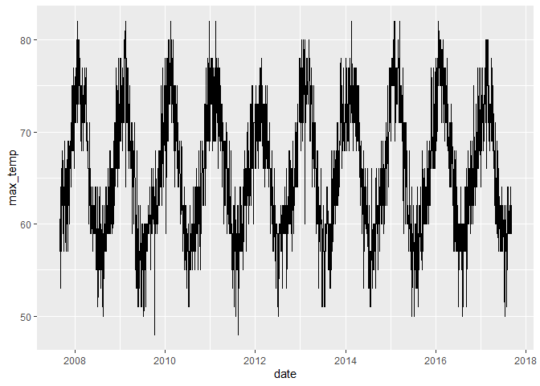

Parsing and Manipulating Dates and Times with lubridate
================
Mohamad Osman
2022-06-28

# Section 02: **Parsing and Manipulating Dates and Times with lubridate**

### **`01-Selecting the right parsing function`**

`lubridate` provides a set of functions for parsing dates of a known
order. For example,
[**`ymd()`**](https://www.rdocumentation.org/packages/lubridate/versions/1.8.0/topics/ymd)
will parse dates with year first, followed by month and then day. The
parsing is flexible, for example, it will parse the `m` whether it is
numeric (e.g. `9` or `09`), a full month name (e.g. `September`), or an
abbreviated month name (e.g. `Sep`).

For each date the ISO 8601 format is displayed as a comment after it, to
help you check your work

-   Choose the correct function to parse `x`.

-   Choose the correct function to parse `y`.

-   Choose the correct function to parse `z`.

``` r
library(dplyr)
```

    ## 
    ## Attaching package: 'dplyr'

    ## The following objects are masked from 'package:stats':
    ## 
    ##     filter, lag

    ## The following objects are masked from 'package:base':
    ## 
    ##     intersect, setdiff, setequal, union

``` r
library(tidyverse)
```

    ## ── Attaching packages ─────────────────────────────────────── tidyverse 1.3.1 ──

    ## ✔ ggplot2 3.3.6     ✔ purrr   0.3.4
    ## ✔ tibble  3.1.7     ✔ stringr 1.4.0
    ## ✔ tidyr   1.2.0     ✔ forcats 0.5.1
    ## ✔ readr   2.1.2

    ## ── Conflicts ────────────────────────────────────────── tidyverse_conflicts() ──
    ## ✖ dplyr::filter() masks stats::filter()
    ## ✖ dplyr::lag()    masks stats::lag()

``` r
library(lubridate)
```

    ## 
    ## Attaching package: 'lubridate'

    ## The following objects are masked from 'package:base':
    ## 
    ##     date, intersect, setdiff, union

``` r
# Parse x 
x <- "2010 September 20th" # 2010-09-20
ymd(x)
```

    ## [1] "2010-09-20"

``` r
# Parse y 
y <- "02.01.2010"  # 2010-01-02
dmy(y)
```

    ## [1] "2010-01-02"

``` r
# Parse z 
z <- "Sep, 12th 2010 14:00"  # 2010-09-12T14:00
mdy_hm(z)
```

    ## [1] "2010-09-12 14:00:00 UTC"

### **`` 02-Specifying an order with `parse_date_time()` ``**

One advantage of `parse_date_time()` is that you can use more format
characters. For example, you can specify weekday names with `A`, `I` for
12 hour time, am/pm indicators with `p` and many others. You can see a
whole list on the help page
[**`?parse_date_time`**](https://www.rdocumentation.org/packages/lubridate/versions/1.8.0/topics/parse_date_time).

Another big advantage is that you can specify a vector of orders, and
that allows parsing of dates where multiple formats might be used.

-   `x` is a trickier datetime. Use the clues in the instructions to
    parse `x`.

-   `two_orders` has two different orders, parse both by specifying the
    order to be `c("mdy", "dmy")`.

-   Parse `short_dates` with `orders = c("dOmY", "OmY", "Y")`. *What
    happens to the dates that don’t have months or days specified?*

``` r
# Specify an order string to parse x
x <- "Monday June 1st 2010 at 4pm"
parse_date_time(x, orders = "amdYIp")
```

    ## [1] "2010-06-01 16:00:00 UTC"

``` r
# Specify order to include both "mdy" and "dmy"
two_orders <- c("October 7, 2001", "October 13, 2002", "April 13, 2003","17 April 2005", "23 April 2017")
parse_date_time(two_orders, orders = c("mdy", "dmy"))
```

    ## [1] "2001-10-07 UTC" "2002-10-13 UTC" "2003-04-13 UTC" "2005-04-17 UTC"
    ## [5] "2017-04-23 UTC"

``` r
# Specify order to include "dOmY", "OmY" and "Y"
short_dates <- c("11 December 1282", "May 1372", "1253")
parse_date_time(short_dates, orders =  c("dOmY", "OmY", "Y"))
```

    ## [1] "1282-12-11 UTC" "1372-05-01 UTC" "1253-01-01 UTC"

### **`03-Import daily weather data`**

-   Import the daily data, `"akl_weather_daily.csv"` with `read_csv()`.

-   Print `akl_daily_raw` to confirm the `date` column hasn’t been
    interpreted as a date. *Can you see why?*

-   Using `mutate()` overwrite the column `date` with a parsed version
    of `date`. You need to specify the parsing function. Hint: the first
    date should be September 1.

-   Print `akl_daily` to verify the `date` column is now a `Date`.

-   Take a look at the data by plotting `date` on the x-axis and
    `max_temp` of the y-axis

``` r
library(lubridate)
library(readr)
library(dplyr)
library(ggplot2)

# Import CSV with read_csv()
akl_weather_daily_path <- file.path("..", "00_Datasets", "Auckland_daily_weather.csv")
akl_daily_raw <- read.csv(akl_weather_daily_path)

# Print akl_daily_raw
akl_daily_raw
```

    ##            date max_temp min_temp mean_temp mean_rh                 events
    ## 1      2007-9-1       60       51        56      75                   <NA>
    ## 2      2007-9-2       60       53        56      82                   Rain
    ## 3      2007-9-3       57       51        54      78                   <NA>
    ## 4      2007-9-4       64       50        57      80                   Rain
    ## 5      2007-9-5       53       48        50      90                   Rain
    ## 6      2007-9-6       57       42        50      69                   <NA>
    ## 7      2007-9-7       59       41        50      77                   <NA>
    ## 8      2007-9-8       59       46        52      80                   <NA>
    ## 9      2007-9-9       55       50        52      88                   Rain
    ## 10    2007-9-10       59       50        54      82                   Rain
    ## 11    2007-9-11       57       50        54      78                   <NA>
    ## 12    2007-9-12       59       42        50      78                   <NA>
    ## 13    2007-9-13       62       44        53      77                   <NA>
    ## 14    2007-9-14       62       51        56      78                   <NA>
    ## 15    2007-9-15       66       50        58      83                    Fog
    ## 16    2007-9-16       60       55        58      92                   Rain
    ## 17    2007-9-17       64       51        58      87                    Fog
    ## 18    2007-9-18       66       53        60      86                   Rain
    ## 19    2007-9-19       66       51        58      82                   Rain
    ## 20    2007-9-20       62       57        60      79                   Rain
    ## 21    2007-9-21       64       53        58      74                   <NA>
    ## 22    2007-9-22       68       50        59      83                   <NA>
    ## 23    2007-9-23       66       55        62      89                   Rain
    ## 24    2007-9-24       66       51        58      86      Rain-Thunderstorm
    ## 25    2007-9-25       59       50        54      86                   Rain
    ## 26    2007-9-26       60       48        54      76                   <NA>
    ## 27    2007-9-27       59       46        52      70                   Rain
    ## 28    2007-9-28       59       44        52      71                   <NA>
    ## 29    2007-9-29       60       46        53      75                   <NA>
    ## 30    2007-9-30       62       53        58      84                   Rain
    ## 31    2007-10-1       NA       NA        NA      NA                   <NA>
    ## 32    2007-10-1       64       53        58      87      Rain-Thunderstorm
    ## 33    2007-10-2       62       53        58      75                   Rain
    ## 34    2007-10-3       57       48        52      73      Rain-Thunderstorm
    ## 35    2007-10-4       60       42        51      70                   <NA>
    ## 36    2007-10-5       62       51        56      75                   Rain
    ## 37    2007-10-6       64       48        56      76                   <NA>
    ## 38    2007-10-7       69       48        58      82                   <NA>
    ## 39    2007-10-8       69       57        63      84                   Rain
    ## 40    2007-10-9       64       57        60      86                   Rain
    ## 41   2007-10-10       64       59        62      91                   Rain
    ## 42   2007-10-11       62       53        58      80                   Rain
    ## 43   2007-10-12       62       51        56      73                   Rain
    ## 44   2007-10-13       64       51        58      82                   Rain
    ## 45   2007-10-14       60       51        56      71                   Rain
    ## 46   2007-10-15       62       51        56      77                   Rain
    ## 47   2007-10-16       62       55        58      75                   Rain
    ## 48   2007-10-17       66       55        62      84                   Rain
    ## 49   2007-10-18       59       48        54      84                   Rain
    ## 50   2007-10-19       57       44        50      71                   Rain
    ## 51   2007-10-20       59       44        52      78                   Rain
    ## 52   2007-10-21       60       55        58      73                   <NA>
    ## 53   2007-10-22       60       53        58      80                   Rain
    ## 54   2007-10-23       66       53        60      80                   <NA>
    ## 55   2007-10-24       62       57        60      90                   Rain
    ## 56   2007-10-25       60       55        58      75                   <NA>
    ## 57   2007-10-26       60       55        58      72                   <NA>
    ## 58   2007-10-27       62       53        58      73                   Rain
    ## 59   2007-10-28       60       50        55      78                   Rain
    ## 60   2007-10-29       64       50        57      71                   <NA>
    ## 61   2007-10-30       64       48        56      68                   <NA>
    ## 62   2007-10-31       66       50        58      72                   <NA>
    ## 63    2007-11-1       68       50        59      82                   Rain
    ## 64    2007-11-2       66       57        62      81                   <NA>
    ## 65    2007-11-3       69       53        61      79                   <NA>
    ## 66    2007-11-4       64       60        62      86                   Rain
    ## 67    2007-11-5       64       57        60      83                   Rain
    ## 68    2007-11-6       57       51        54      86                   Rain
    ## 69    2007-11-7       62       51        56      84                   Rain
    ## 70    2007-11-8       62       53        58      67                   <NA>
    ## 71    2007-11-9       64       55        60      68                   <NA>
    ## 72   2007-11-10       64       48        56      76                   <NA>
    ## 73   2007-11-11       69       48        58      72                   <NA>
    ## 74   2007-11-12       66       51        58      77                   Rain
    ## 75   2007-11-13       64       51        58      76                   Rain
    ## 76   2007-11-14       60       51        56      76                   Rain
    ## 77   2007-11-15       62       53        58      67                   <NA>
    ## 78   2007-11-16       64       55        60      81                   Rain
    ## 79   2007-11-17       66       51        58      75                   <NA>
    ## 80   2007-11-18       66       57        62      75                   <NA>
    ## 81   2007-11-19       66       51        58      83                   <NA>
    ## 82   2007-11-20       68       55        62      81                   <NA>
    ## 83   2007-11-21       69       53        61      81                   <NA>
    ## 84   2007-11-22       66       53        60      80                   <NA>
    ## 85   2007-11-23       69       53        61      77                   Rain
    ## 86   2007-11-24       69       57        63      82                   Rain
    ## 87   2007-11-25       68       59        64      81                   <NA>
    ## 88   2007-11-26       66       59        62      75                   <NA>
    ## 89   2007-11-27       66       57        62      71                   <NA>
    ## 90   2007-11-28       68       55        62      75                   Rain
    ## 91   2007-11-29       64       53        58      77                   Rain
    ## 92   2007-11-30       66       57        62      77                   Rain
    ## 93    2007-12-1       69       53        61      78                   <NA>
    ## 94    2007-12-2       71       59        65      84                   Rain
    ## 95    2007-12-3       68       59        64      79                   <NA>
    ## 96    2007-12-4       71       57        64      69                   <NA>
    ## 97    2007-12-5       69       59        64      86                   Rain
    ## 98    2007-12-6       71       62        66      93                   Rain
    ## 99    2007-12-7       69       57        63      72                   Rain
    ## 100   2007-12-8       75       55        65      70                   Rain
    ## 101   2007-12-9       68       64        66      88                   Rain
    ## 102  2007-12-10       69       66        68      82                   Rain
    ## 103  2007-12-11       68       64        66      81                   Rain
    ## 104  2007-12-12       71       62        66      80                   Rain
    ## 105  2007-12-13       73       60        66      79                   <NA>
    ## 106  2007-12-14       75       59        67      74                   <NA>
    ## 107  2007-12-15       71       60        66      74                   <NA>
    ## 108  2007-12-16       73       60        66      72                   Rain
    ## 109  2007-12-17       75       62        68      81                   Rain
    ## 110  2007-12-18       77       66        72      87                   Rain
    ## 111  2007-12-19       71       62        66      84                   Rain
    ## 112  2007-12-20       68       60        64      75                   Rain
    ## 113  2007-12-21       68       57        62      82                   Rain
    ## 114  2007-12-22       69       59        64      73                   Rain
    ## 115  2007-12-23       71       55        63      67                   <NA>
    ## 116  2007-12-24       75       59        67      71                   Rain
    ## 117  2007-12-25       73       59        66      84                   Rain
    ## 118  2007-12-26       66       53        60      70                   Rain
    ## 119  2007-12-27       68       55        62      65                   Rain
    ## 120  2007-12-28       71       59        65      71                   <NA>
    ## 121  2007-12-29       71       60        66      75                   <NA>
    ## 122  2007-12-30       71       57        64      72                   <NA>
    ## 123  2007-12-31       75       60        68      80                   Rain
    ## 124    2008-1-1       75       60        68      69                   <NA>
    ## 125    2008-1-2       75       60        68      70                   <NA>
    ## 126    2008-1-3       75       57        66      77                   <NA>
    ## 127    2008-1-4       75       62        68      73                   <NA>
    ## 128    2008-1-5       75       62        68      69                   <NA>
    ## 129    2008-1-6       77       64        70      74                   <NA>
    ## 130    2008-1-7       77       66        72      79                   <NA>
    ## 131    2008-1-8       73       64        68      86                   Rain
    ## 132    2008-1-9       71       64        68      88                   Rain
    ## 133   2008-1-10       71       64        68      75                   Rain
    ## 134   2008-1-11       77       62        70      61                   <NA>
    ## 135   2008-1-12       75       60        68      61                   <NA>
    ## 136   2008-1-13       77       57        67      66                   <NA>
    ## 137   2008-1-14       77       59        68      71                   <NA>
    ## 138   2008-1-15       77       62        70      74                   <NA>
    ## 139   2008-1-16       78       68        73      74                   <NA>
    ## 140   2008-1-17       73       66        70      76                   <NA>
    ## 141   2008-1-18       78       64        71      75                   <NA>
    ## 142   2008-1-19       82       64        73      60                   <NA>
    ## 143   2008-1-20       80       60        70      64                   Rain
    ## 144   2008-1-21       73       69        71      91                   Rain
    ## 145   2008-1-22       78       69        74      84                   Rain
    ## 146   2008-1-23       71       64        68      79                   Rain
    ## 147   2008-1-24       78       62        70      67                   <NA>
    ## 148   2008-1-25       78       62        70      71                   <NA>
    ## 149   2008-1-26       78       59        68      67                   <NA>
    ## 150   2008-1-27       73       60        66      69                   <NA>
    ## 151   2008-1-28       75       64        70      72                   <NA>
    ## 152   2008-1-29       77       66        72      72                   <NA>
    ## 153   2008-1-30       80       64        72      75                   <NA>
    ## 154   2008-1-31       78       68        73      71                   <NA>
    ## 155    2008-2-1       77       66        72      73                   <NA>
    ## 156    2008-2-2       80       64        72      75                   <NA>
    ## 157    2008-2-3       75       66        70      82                   Rain
    ## 158    2008-2-4       80       62        71      79                   <NA>
    ## 159    2008-2-5       78       62        71      62                   <NA>
    ## 160    2008-2-6       75       53        64      55                   <NA>
    ## 161    2008-2-7       75       53        64      57                   <NA>
    ## 162    2008-2-8       77       57        67      66                   <NA>
    ## 163    2008-2-9       77       57        67      75                   <NA>
    ## 164   2008-2-10       78       68        74      88                   Rain
    ## 165   2008-2-11       78       66        72      78                   <NA>
    ## 166   2008-2-12       75       62        68      77                   Rain
    ## 167   2008-2-13       77       60        68      71                   <NA>
    ## 168   2008-2-14       69       64        66      83                   Rain
    ## 169   2008-2-15       73       60        66      74                   Rain
    ## 170   2008-2-16       71       59        65      69                   Rain
    ## 171   2008-2-17       73       62        68      67                   <NA>
    ## 172   2008-2-18       73       64        68      66                   <NA>
    ## 173   2008-2-19       75       59        67      75                   <NA>
    ## 174   2008-2-20       75       62        68      72                   <NA>
    ## 175   2008-2-21       75       60        68      67                   Rain
    ## 176   2008-2-22       71       64        68      73                   Rain
    ## 177   2008-2-23       68       64        66      89                   Rain
    ## 178   2008-2-24       75       66        70      89                   Rain
    ## 179   2008-2-25       75       64        70      78                   Rain
    ## 180   2008-2-26       73       62        68      70                   <NA>
    ## 181   2008-2-27       71       59        65      65                   <NA>
    ## 182   2008-2-28       75       60        68      74                   <NA>
    ## 183   2008-2-29       77       60        68      75                   <NA>
    ## 184    2008-3-1       75       68        72      89                   Rain
    ## 185    2008-3-2       71       66        68      84                   Rain
    ## 186    2008-3-3       75       60        68      77                   <NA>
    ## 187    2008-3-4       68       60        64      79                   Rain
    ## 188    2008-3-5       69       60        64      75                   Rain
    ## 189    2008-3-6       71       57        64      73                   Rain
    ## 190    2008-3-7       71       59        65      82                   <NA>
    ## 191    2008-3-8       73       57        65      78                   <NA>
    ## 192    2008-3-9       71       57        64      79                   <NA>
    ## 193   2008-3-10       73       60        66      74                   <NA>
    ## 194   2008-3-11       75       60        68      80                   Rain
    ## 195   2008-3-12       71       62        66      71                   <NA>
    ## 196   2008-3-13       75       59        67      74                   <NA>
    ## 197   2008-3-14       75       62        70      80                   <NA>
    ## 198   2008-3-15       75       59        67      75                   <NA>
    ## 199   2008-3-16       73       64        68      76                   <NA>
    ## 200   2008-3-17       75       59        67      68                   <NA>
    ## 201   2008-3-18       73       60        66      77                   <NA>
    ## 202   2008-3-19       71       60        66      76                   <NA>
    ## 203   2008-3-20       73       60        66      79                   <NA>
    ## 204   2008-3-21       75       57        66      82                    Fog
    ## 205   2008-3-22       73       59        66      78                   <NA>
    ## 206   2008-3-23       77       55        66      76                   Rain
    ## 207   2008-3-24       75       62        68      76                   Rain
    ## 208   2008-3-25       73       59        66      74                   <NA>
    ## 209   2008-3-26       75       60        68      74                   <NA>
    ## 210   2008-3-27       75       60        68      75                   <NA>
    ## 211   2008-3-28       75       62        68      75                   Rain
    ## 212   2008-3-29       73       62        68      70                   <NA>
    ## 213   2008-3-30       77       64        70      72                   <NA>
    ## 214   2008-3-31       71       66        68      80                   <NA>
    ## 215    2008-4-1       71       66        68      87                   Rain
    ## 216    2008-4-2       69       60        64      67                   <NA>
    ## 217    2008-4-3       69       53        61      85                   Rain
    ## 218    2008-4-4       71       57        64      67                   <NA>
    ## 219    2008-4-5       71       55        63      75                   <NA>
    ## 220    2008-4-6       71       55        63      81                   <NA>
    ## 221    2008-4-7       71       57        64      81                   <NA>
    ## 222    2008-4-8       69       57        63      70                   <NA>
    ## 223    2008-4-9       68       51        60      64                   <NA>
    ## 224   2008-4-10       69       48        58      74                   <NA>
    ## 225   2008-4-11       69       50        60      80                   <NA>
    ## 226   2008-4-12       68       53        60      77                   Rain
    ## 227   2008-4-13       66       59        62      77                   Rain
    ## 228   2008-4-14       68       60        64      90                   Rain
    ## 229   2008-4-15       68       64        66      91      Rain-Thunderstorm
    ## 230   2008-4-16       69       60        64      93                   <NA>
    ## 231   2008-4-17       69       60        66      89                   Rain
    ## 232   2008-4-18       68       59        64      82                   Rain
    ## 233   2008-4-19       64       53        60      69                   <NA>
    ## 234   2008-4-20       60       46        53      65                   <NA>
    ## 235   2008-4-21       62       44        53      73                   <NA>
    ## 236   2008-4-22       66       57        62      84                   Rain
    ## 237   2008-4-23       64       57        60      77                   Rain
    ## 238   2008-4-24       66       60        63      76                   <NA>
    ## 239   2008-4-25       64       55        60      84                   <NA>
    ## 240   2008-4-26       68       55        62      81                   <NA>
    ## 241   2008-4-27       69       60        66      93               Fog-Rain
    ## 242   2008-4-28       71       57        64      93                    Fog
    ## 243   2008-4-29       68       64        66      93                   Rain
    ## 244   2008-4-30       68       59        64      84                   Rain
    ## 245    2008-5-1       62       55        58      81                   Rain
    ## 246    2008-5-2       64       55        60      74                   Rain
    ## 247    2008-5-3       59       51        56      74                   Rain
    ## 248    2008-5-4       59       50        54      91                   Rain
    ## 249    2008-5-5       66       55        60      88                   Rain
    ## 250    2008-5-6       60       51        56      82                   Rain
    ## 251    2008-5-7       60       46        53      79                   <NA>
    ## 252    2008-5-8       62       42        52      84                   <NA>
    ## 253    2008-5-9       62       50        56      90               Fog-Rain
    ## 254   2008-5-10       64       51        58      90                   Rain
    ## 255   2008-5-11       64       57        60      82                   Rain
    ## 256   2008-5-12       60       48        55      76                   <NA>
    ## 257   2008-5-13       59       44        52      77                   <NA>
    ## 258   2008-5-14       62       48        55      86                   Rain
    ## 259   2008-5-15       62       46        54      89                    Fog
    ## 260   2008-5-16       60       44        52      95                    Fog
    ## 261   2008-5-17       62       42        52      90                   <NA>
    ## 262   2008-5-18       62       44        53      87                   <NA>
    ## 263   2008-5-19       62       50        56      87                   Rain
    ## 264   2008-5-20       60       53        56      82                   Rain
    ## 265   2008-5-21       59       51        55      84                   Rain
    ## 266   2008-5-22       60       48        54      81                   <NA>
    ## 267   2008-5-23       64       46        55      84                   <NA>
    ## 268   2008-5-24       60       51        56      79                   <NA>
    ## 269   2008-5-25       60       44        52      79                   <NA>
    ## 270   2008-5-26       57       50        54      88                   Rain
    ## 271   2008-5-27       59       46        52      78                   <NA>
    ## 272   2008-5-28       59       44        52      81                   <NA>
    ## 273   2008-5-29       59       39        49      86                   <NA>
    ## 274   2008-5-30       60       44        52      90                   Rain
    ## 275   2008-5-31       60       50        55      92               Fog-Rain
    ## 276    2008-6-1       62       46        54      92               Fog-Rain
    ## 277    2008-6-2       60       51        56      88                   Rain
    ## 278    2008-6-3       59       44        52      84                   Rain
    ## 279    2008-6-4       59       46        54      74                   Rain
    ## 280    2008-6-5       59       39        49      78                   <NA>
    ## 281    2008-6-6       60       50        55      82                   Rain
    ## 282    2008-6-7       62       50        56      86                   Rain
    ## 283    2008-6-8       60       48        54      72                   Rain
    ## 284    2008-6-9       60       53        56      78                   Rain
    ## 285   2008-6-10       62       48        56      85                   <NA>
    ## 286   2008-6-11       59       46        52      83                   <NA>
    ## 287   2008-6-12       60       51        56      76                   <NA>
    ## 288   2008-6-13       62       50        58      84                   <NA>
    ## 289   2008-6-14       62       51        56      87                   Rain
    ## 290   2008-6-15       64       53        58      90                   Rain
    ## 291   2008-6-16       64       59        62      89                   Rain
    ## 292   2008-6-17       62       57        60      93                   Rain
    ## 293   2008-6-18       57       50        54      71                   <NA>
    ## 294   2008-6-19       55       48        52      78                   <NA>
    ## 295   2008-6-20       57       48        52      82                   <NA>
    ## 296   2008-6-21       60       48        54      89                   Rain
    ## 297   2008-6-22       62       55        60      93                   Rain
    ## 298   2008-6-23       57       50        54      83                   Rain
    ## 299   2008-6-24       55       46        50      77                   Rain
    ## 300   2008-6-25       59       50        54      78      Rain-Thunderstorm
    ## 301   2008-6-26       59       51        55      82                   Rain
    ## 302   2008-6-27       59       48        54      83      Rain-Thunderstorm
    ## 303   2008-6-28       55       46        50      79      Rain-Thunderstorm
    ## 304   2008-6-29       55       44        50      84                   Rain
    ## 305   2008-6-30       55       44        50      81                   Rain
    ## 306    2008-7-1       57       46        52      90                   Rain
    ## 307    2008-7-2       60       46        53      82                   Rain
    ## 308    2008-7-3       64       48        56      86                   Rain
    ## 309    2008-7-4       59       50        54      83                   Rain
    ## 310    2008-7-5       51       42        46      75      Rain-Thunderstorm
    ## 311    2008-7-6       53       42        48      69      Rain-Thunderstorm
    ## 312    2008-7-7       55       35        45      87                   Rain
    ## 313    2008-7-8       53       35        44      78                   <NA>
    ## 314    2008-7-9       53       37        45      85                   <NA>
    ## 315   2008-7-10       57       35        46      88                   Rain
    ## 316   2008-7-11       59       51        55      89                   Rain
    ## 317   2008-7-12       60       53        58      90                   Rain
    ## 318   2008-7-13       59       46        52      92                   <NA>
    ## 319   2008-7-14       57       42        50      92                    Fog
    ## 320   2008-7-15       55       46        50      87                   <NA>
    ## 321   2008-7-16       55       46        50      91                   Rain
    ## 322   2008-7-17       60       51        56      92                   Rain
    ## 323   2008-7-18       62       53        58      94                   Rain
    ## 324   2008-7-19       64       55        60      91                   Rain
    ## 325   2008-7-20       60       50        55      85                   Rain
    ## 326   2008-7-21       57       48        52      79                   Rain
    ## 327   2008-7-22       59       50        54      90                   Rain
    ## 328   2008-7-23       59       53        56      80                   Rain
    ## 329   2008-7-24       57       50        54      84                   Rain
    ## 330   2008-7-25       53       42        48      78                   <NA>
    ## 331   2008-7-26       55       46        50      88                   Rain
    ## 332   2008-7-27       53       50        52      88                   Rain
    ## 333   2008-7-28       59       46        52      83                   Rain
    ## 334   2008-7-29       57       50        54      93                   Rain
    ## 335   2008-7-30       60       55        58      92                   Rain
    ## 336   2008-7-31       60       53        56      81                   Rain
    ## 337    2008-8-1       59       51        55      79                   Rain
    ## 338    2008-8-2       57       50        54      87                   Rain
    ## 339    2008-8-3       59       51        56      85                   Rain
    ## 340    2008-8-4       59       48        54      84                   Rain
    ## 341    2008-8-5       55       46        50      79                   Rain
    ## 342    2008-8-6       57       50        54      82                   Rain
    ## 343    2008-8-7       57       44        50      80                   <NA>
    ## 344    2008-8-8       62       51        56      87                   Rain
    ## 345    2008-8-9       53       42        48      87                   Rain
    ## 346   2008-8-10       51       37        44      70                   <NA>
    ## 347   2008-8-11       55       42        48      76                   Rain
    ## 348   2008-8-12       60       51        56      87                   Rain
    ## 349   2008-8-13       55       48        52      83                   Rain
    ## 350   2008-8-14       57       48        52      78      Rain-Thunderstorm
    ## 351   2008-8-15       59       48        54      85      Rain-Thunderstorm
    ## 352   2008-8-16       57       46        52      81      Rain-Thunderstorm
    ## 353   2008-8-17       50       44        47      90                   Rain
    ## 354   2008-8-18       53       42        48      80                   Rain
    ## 355   2008-8-19       53       46        50      80                   Rain
    ## 356   2008-8-20       55       42        48      82                   Rain
    ## 357   2008-8-21       59       50        54      84                   Rain
    ## 358   2008-8-22       59       48        54      85                   <NA>
    ## 359   2008-8-23       59       51        55      89                   Rain
    ## 360   2008-8-24       62       51        56      92                   Rain
    ## 361   2008-8-25       62       48        55      92                    Fog
    ## 362   2008-8-26       60       53        56      90                   Rain
    ## 363   2008-8-27       59       51        55      87                   <NA>
    ## 364   2008-8-28       59       53        56      83                   Rain
    ## 365   2008-8-29       59       48        54      86                   <NA>
    ## 366   2008-8-30       57       48        52      84                   <NA>
    ## 367   2008-8-31       59       46        52      78                   <NA>
    ## 368    2008-9-1       60       46        53      82                   Rain
    ## 369    2008-9-2       60       46        53      83                   Rain
    ## 370    2008-9-3       59       48        54      86                   <NA>
    ## 371    2008-9-4       64       48        56      84                   <NA>
    ## 372    2008-9-5       57       46        52      88                    Fog
    ## 373    2008-9-6       57       46        52      77                   <NA>
    ## 374    2008-9-7       62       42        52      80                   <NA>
    ## 375    2008-9-8       62       55        58      88                   Rain
    ## 376    2008-9-9       64       50        58      90                   <NA>
    ## 377   2008-9-10       59       48        54      81      Rain-Thunderstorm
    ## 378   2008-9-11       60       51        56      80                   Rain
    ## 379   2008-9-12       60       51        56      83                   Rain
    ## 380   2008-9-13       57       48        52      83                   Rain
    ## 381   2008-9-14       59       51        55      75                   Rain
    ## 382   2008-9-15       62       44        53      88                    Fog
    ## 383   2008-9-16       62       50        56      86                   <NA>
    ## 384   2008-9-17       60       51        56      78                   Rain
    ## 385   2008-9-18       59       51        55      79                   Rain
    ## 386   2008-9-19       60       51        56      81                   Rain
    ## 387   2008-9-20       62       50        56      79                   <NA>
    ## 388   2008-9-21       60       46        53      79                   <NA>
    ## 389   2008-9-22       62       51        56      81                   Rain
    ## 390   2008-9-23       66       53        60      84                   <NA>
    ## 391   2008-9-24       64       53        58      76                   <NA>
    ## 392   2008-9-25       62       53        58      81                   Rain
    ## 393   2008-9-26       59       51        55      68                   <NA>
    ## 394   2008-9-27       62       48        55      78                   Rain
    ## 395   2008-9-28       60       50        56      65                   Rain
    ## 396   2008-9-29       62       44        53      80                   Rain
    ## 397   2008-9-30       60       53        56      76                   Rain
    ## 398   2008-10-1       59       48        54      66                   Rain
    ## 399   2008-10-2       59       50        54      69                   Rain
    ## 400   2008-10-3       60       53        56      74                   <NA>
    ## 401   2008-10-4       64       57        60      77                   <NA>
    ## 402   2008-10-5       62       59        60      81                   <NA>
    ## 403   2008-10-6       62       59        60      91                   Rain
    ## 404   2008-10-7       68       57        62      85                   Rain
    ## 405   2008-10-8       60       53        56      75                   Rain
    ## 406   2008-10-9       59       51        55      75                   Rain
    ## 407  2008-10-10       59       50        54      67                   Rain
    ## 408  2008-10-11       59       53        56      77                   Rain
    ## 409  2008-10-12       66       48        57      74                   <NA>
    ## 410  2008-10-13       64       48        56      76                   <NA>
    ## 411  2008-10-14       66       50        58      77                   <NA>
    ## 412  2008-10-15       66       50        58      79                   <NA>
    ## 413  2008-10-16       68       57        62      86                   Rain
    ## 414  2008-10-17       60       53        58      82                   Rain
    ## 415  2008-10-18       60       53        56      75                   Rain
    ## 416  2008-10-19       60       51        56      76                   Rain
    ## 417  2008-10-20       62       50        56      78                   <NA>
    ## 418  2008-10-21       64       51        58      70                   <NA>
    ## 419  2008-10-22       66       51        58      75                   <NA>
    ## 420  2008-10-23       66       55        60      87                   Rain
    ## 421  2008-10-24       66       59        62      82                   Rain
    ## 422  2008-10-25       64       55        60      85                   Rain
    ## 423  2008-10-26       59       50        54      75                   Rain
    ## 424  2008-10-27       60       42        51      69                   Rain
    ## 425  2008-10-28       62       57        60      83                   Rain
    ## 426  2008-10-29       60       55        58      82                   Rain
    ## 427  2008-10-30       59       53        56      66                   Rain
    ## 428  2008-10-31       60       53        56      67                   Rain
    ## 429   2008-11-1       60       53        56      71                   Rain
    ## 430   2008-11-2       64       55        60      78                   Rain
    ## 431   2008-11-3       66       51        58      77                   <NA>
    ## 432   2008-11-4       66       57        62      78                   <NA>
    ## 433   2008-11-5       60       51        56      77                   Rain
    ## 434   2008-11-6       62       51        56      68                   Rain
    ## 435   2008-11-7       60       50        55      70                   Rain
    ## 436   2008-11-8       64       46        55      67                   <NA>
    ## 437   2008-11-9       64       55        60      69                   <NA>
    ## 438  2008-11-10       64       55        60      72                   <NA>
    ## 439  2008-11-11       68       51        60      77                   <NA>
    ## 440  2008-11-12       69       51        60      83                   <NA>
    ## 441  2008-11-13       64       57        60      85                   <NA>
    ## 442  2008-11-14       71       57        64      76                   <NA>
    ## 443  2008-11-15       69       57        64      72                   <NA>
    ## 444  2008-11-16       68       57        62      67                   <NA>
    ## 445  2008-11-17       64       55        60      81                   Rain
    ## 446  2008-11-18       64       55        60      67                   Rain
    ## 447  2008-11-19       62       55        58      60                   <NA>
    ## 448  2008-11-20       66       53        62      64                   <NA>
    ## 449  2008-11-21       68       46        57      67                   <NA>
    ## 450  2008-11-22       69       57        63      67                   <NA>
    ## 451  2008-11-23       69       62        66      80                   Rain
    ## 452  2008-11-24       66       62        64      92                   Rain
    ## 453  2008-11-25       71       60        66      83                   Rain
    ## 454  2008-11-26       71       59        65      79                   Rain
    ## 455  2008-11-27       66       57        62      68                   <NA>
    ## 456  2008-11-28       71       57        64      73                   <NA>
    ## 457  2008-11-29       69       55        62      78                   <NA>
    ## 458  2008-11-30       77       59        68      76                   <NA>
    ## 459   2008-12-1       68       60        64      84                   Rain
    ## 460   2008-12-2       68       59        64      79                   Rain
    ## 461   2008-12-3       71       60        66      75                   <NA>
    ## 462   2008-12-4       73       57        65      73                   <NA>
    ## 463   2008-12-5       71       60        66      77                   Rain
    ## 464   2008-12-6       66       55        60      66                   <NA>
    ## 465   2008-12-7       75       55        65      64                   <NA>
    ## 466   2008-12-8       68       57        62      76                   Rain
    ## 467   2008-12-9       69       60        64      87                   Rain
    ## 468  2008-12-10       68       59        64      77                   Rain
    ## 469  2008-12-11       64       59        62      65                   <NA>
    ## 470  2008-12-12       69       57        63      72                   <NA>
    ## 471  2008-12-13       69       57        63      65                   <NA>
    ## 472  2008-12-14       71       59        65      73                   Rain
    ## 473  2008-12-15       71       62        66      82                   Rain
    ## 474  2008-12-16       78       62        70      75                   Rain
    ## 475  2008-12-17       66       59        62      71                   Rain
    ## 476  2008-12-18       69       59        64      62                   <NA>
    ## 477  2008-12-19       75       57        66      70                   <NA>
    ## 478  2008-12-20       75       59        68      79                   Rain
    ## 479  2008-12-21       69       57        63      72                   Rain
    ## 480  2008-12-22       73       57        65      68                   <NA>
    ## 481  2008-12-23       71       55        63      73                   Rain
    ## 482  2008-12-24       66       55        60      87                   Rain
    ## 483  2008-12-25       68       60        64      62                   <NA>
    ## 484  2008-12-26       73       51        62      64                   <NA>
    ## 485  2008-12-27       73       57        65      73                   <NA>
    ## 486  2008-12-28       73       57        65      74                   <NA>
    ## 487  2008-12-29       69       62        66      87                   Rain
    ## 488  2008-12-30       71       62        68      84                   Rain
    ## 489  2008-12-31       75       59        67      78                   Rain
    ## 490    2009-1-1       75       64        70      73                   <NA>
    ## 491    2009-1-2       77       64        70      85                   Rain
    ## 492    2009-1-3       78       62        70      81                   Rain
    ## 493    2009-1-4       69       60        64      62                   <NA>
    ## 494    2009-1-5       69       55        62      70                   <NA>
    ## 495    2009-1-6       71       55        63      70                   <NA>
    ## 496    2009-1-7       71       55        63      73                   <NA>
    ## 497    2009-1-8       78       59        68      72                   <NA>
    ## 498    2009-1-9       78       64        71      77                   <NA>
    ## 499   2009-1-10       73       66        70      82                   Rain
    ## 500   2009-1-11       71       60        66      80                   Rain
    ## 501   2009-1-12       75       60        68      70                   <NA>
    ## 502   2009-1-13       71       64        68      79                   <NA>
    ## 503   2009-1-14       75       62        68      74                   <NA>
    ## 504   2009-1-15       73       57        65      70                   <NA>
    ## 505   2009-1-16       71       62        66      70                   <NA>
    ## 506   2009-1-17       75       62        68      70                   <NA>
    ## 507   2009-1-18       69       59        64      73                   Rain
    ## 508   2009-1-19       68       59        64      68                   Rain
    ## 509   2009-1-20       69       60        64      69                   Rain
    ## 510   2009-1-21       69       57        63      70                   <NA>
    ## 511   2009-1-22       75       53        64      74                   <NA>
    ## 512   2009-1-23       77       57        67      74                   <NA>
    ## 513   2009-1-24       75       59        67      73                   <NA>
    ## 514   2009-1-25       75       59        67      77                   <NA>
    ## 515   2009-1-26       75       64        70      73                   <NA>
    ## 516   2009-1-27       73       66        70      76                   Rain
    ## 517   2009-1-28       73       59        66      69                   <NA>
    ## 518   2009-1-29       71       59        65      70                   <NA>
    ## 519   2009-1-30       71       62        66      70                   <NA>
    ## 520   2009-1-31       73       66        70      76                   <NA>
    ## 521    2009-2-1       73       66        70      76                   Rain
    ## 522    2009-2-2       73       66        70      72                   <NA>
    ## 523    2009-2-3       80       64        72      66                   <NA>
    ## 524    2009-2-4       78       60        69      75                   <NA>
    ## 525    2009-2-5       78       64        71      71                   <NA>
    ## 526    2009-2-6       80       64        72      66                   <NA>
    ## 527    2009-2-7       78       60        69      74                   <NA>
    ## 528    2009-2-8       78       66        72      74                   <NA>
    ## 529    2009-2-9       78       64        71      82                   Rain
    ## 530   2009-2-10       78       71        74      87                   Rain
    ## 531   2009-2-11       80       68        74      87                   Rain
    ## 532   2009-2-12       82       71        76      82                   Rain
    ## 533   2009-2-13       71       62        68      74                   Rain
    ## 534   2009-2-14       64       57        60      82                   Rain
    ## 535   2009-2-15       73       57        65      67                   <NA>
    ## 536   2009-2-16       73       62        68      75                   Rain
    ## 537   2009-2-17       78       62        70      74                   <NA>
    ## 538   2009-2-18       75       62        68      87                   Rain
    ## 539   2009-2-19       78       64        71      82                   Rain
    ## 540   2009-2-20       73       69        71      93                   Rain
    ## 541   2009-2-21       75       68        72      84                   <NA>
    ## 542   2009-2-22       73       64        68      79                   Rain
    ## 543   2009-2-23       71       62        66      71                   Rain
    ## 544   2009-2-24       71       60        66      75                   Rain
    ## 545   2009-2-25       71       59        65      71                   <NA>
    ## 546   2009-2-26       71       55        63      74                   <NA>
    ## 547   2009-2-27       73       60        66      77                   Rain
    ## 548   2009-2-28       73       64        68      90                   Rain
    ## 549    2009-3-1       77       62        70      81                   <NA>
    ## 550    2009-3-2       73       64        68      79                   <NA>
    ## 551    2009-3-3       71       62        66      77                   <NA>
    ## 552    2009-3-4       71       62        66      67                   <NA>
    ## 553    2009-3-5       69       66        68      76                   Rain
    ## 554    2009-3-6       77       68        72      90                   Rain
    ## 555    2009-3-7       75       66        70      84                   <NA>
    ## 556    2009-3-8       71       64        68      73                   Rain
    ## 557    2009-3-9       68       62        65      69                   Rain
    ## 558   2009-3-10       68       60        64      64                   Rain
    ## 559   2009-3-11       66       59        62      70                   Rain
    ## 560   2009-3-12       66       53        60      75                   Rain
    ## 561   2009-3-13       68       59        64      80                   Rain
    ## 562   2009-3-14       66       53        60      83                   Rain
    ## 563   2009-3-15       71       57        64      69                   <NA>
    ## 564   2009-3-16       71       57        64      71                   <NA>
    ## 565   2009-3-17       75       57        66      77                   <NA>
    ## 566   2009-3-18       73       60        66      83                   <NA>
    ## 567   2009-3-19       71       62        66      82                   Rain
    ## 568   2009-3-20       68       62        65      69                   <NA>
    ## 569   2009-3-21       69       60        64      68                   <NA>
    ## 570   2009-3-22       69       55        62      75                   <NA>
    ## 571   2009-3-23       68       57        62      67                   <NA>
    ## 572   2009-3-24       66       50        58      68                   <NA>
    ## 573   2009-3-25       69       48        58      79                   <NA>
    ## 574   2009-3-26       68       57        62      74                   <NA>
    ## 575   2009-3-27       68       50        59      75                   <NA>
    ## 576   2009-3-28       69       51        60      78                   <NA>
    ## 577   2009-3-29       69       53        61      80                   <NA>
    ## 578   2009-3-30       69       51        60      78                   <NA>
    ## 579   2009-3-31       68       60        64      73                   <NA>
    ## 580    2009-4-1       69       57        63      64                   Rain
    ## 581    2009-4-2       66       48        57      61                   <NA>
    ## 582    2009-4-3       68       48        58      73                   <NA>
    ## 583    2009-4-4       71       50        60      71                   <NA>
    ## 584    2009-4-5       71       53        62      72                   <NA>
    ## 585    2009-4-6       71       53        62      76                   Rain
    ## 586    2009-4-7       69       59        64      76                   <NA>
    ## 587    2009-4-8       64       53        58      78                   Rain
    ## 588    2009-4-9       59       50        54      76                   Rain
    ## 589   2009-4-10       64       41        52      76                   <NA>
    ## 590   2009-4-11       64       50        57      87                   Rain
    ## 591   2009-4-12       64       59        62      72                   <NA>
    ## 592   2009-4-13       68       55        62      78                   <NA>
    ## 593   2009-4-14       68       57        62      83                   Rain
    ## 594   2009-4-15       69       55        62      78                   <NA>
    ## 595   2009-4-16       69       53        61      73                   <NA>
    ## 596   2009-4-17       66       51        58      79                   <NA>
    ## 597   2009-4-18       68       57        62      69                   <NA>
    ## 598   2009-4-19       66       59        62      74                   Rain
    ## 599   2009-4-20       64       57        60      90                   Rain
    ## 600   2009-4-21       60       51        56      70                   Rain
    ## 601   2009-4-22       62       48        55      72                   <NA>
    ## 602   2009-4-23       64       50        57      69                   <NA>
    ## 603   2009-4-24       68       59        64      67                   <NA>
    ## 604   2009-4-25       68       62        65      79                   Rain
    ## 605   2009-4-26       66       60        63      90                   Rain
    ## 606   2009-4-27       71       64        68      83                   <NA>
    ## 607   2009-4-28       71       64        68      85                   Rain
    ## 608   2009-4-29       68       60        64      84                   Rain
    ## 609   2009-4-30       66       55        60      80                   Rain
    ## 610    2009-5-1       64       51        58      76                   Rain
    ## 611    2009-5-2       55       50        52      86                   Rain
    ## 612    2009-5-3       62       48        55      71                   <NA>
    ## 613    2009-5-4       60       44        52      79                   <NA>
    ## 614    2009-5-5       64       46        55      80                   Rain
    ## 615    2009-5-6       62       53        58      76                   Rain
    ## 616    2009-5-7       60       46        53      81                   Rain
    ## 617    2009-5-8       57       50        54      89      Rain-Thunderstorm
    ## 618    2009-5-9       57       50        54      79              Rain-Hail
    ## 619   2009-5-10       59       48        54      84                   Rain
    ## 620   2009-5-11       53       48        50      86                   Rain
    ## 621   2009-5-12       55       48        52      84                   Rain
    ## 622   2009-5-13       60       46        53      81                   Rain
    ## 623   2009-5-14       62       48        55      85                   Rain
    ## 624   2009-5-15       64       46        55      85                   <NA>
    ## 625   2009-5-16       68       55        62      87                   <NA>
    ## 626   2009-5-17       68       53        62      87                   Rain
    ## 627   2009-5-18       64       51        58      86               Fog-Rain
    ## 628   2009-5-19       60       51        56      75                   Rain
    ## 629   2009-5-20       55       44        50      77                   Rain
    ## 630   2009-5-21       51       41        46      73                   Rain
    ## 631   2009-5-22       57       37        47      83                   Rain
    ## 632   2009-5-23       55       41        48      73                   <NA>
    ## 633   2009-5-24       57       42        50      82                   Rain
    ## 634   2009-5-25       59       50        54      83                   Rain
    ## 635   2009-5-26       57       51        54      75                   <NA>
    ## 636   2009-5-27       62       50        56      81                   <NA>
    ## 637   2009-5-28       59       44        52      84                   <NA>
    ## 638   2009-5-29       60       44        52      90               Fog-Rain
    ## 639   2009-5-30       60       50        55      91                   Rain
    ## 640   2009-5-31       57       41        49      77                   Rain
    ## 641    2009-6-1       51       39        45      66                   <NA>
    ## 642    2009-6-2       53       41        47      79                   <NA>
    ## 643    2009-6-3       55       35        45      85                   <NA>
    ## 644    2009-6-4       55       33        44      84                   <NA>
    ## 645    2009-6-5       57       33        45      87                    Fog
    ## 646    2009-6-6       57       48        52      83                   Rain
    ## 647    2009-6-7       53       44        48      85                   <NA>
    ## 648    2009-6-8       55       42        48      76                   <NA>
    ## 649    2009-6-9       57       51        54      88                   Rain
    ## 650   2009-6-10       60       51        56      94                   Rain
    ## 651   2009-6-11       62       53        58      89               Fog-Rain
    ## 652   2009-6-12       59       55        57      91                   Rain
    ## 653   2009-6-13       60       48        54      86                   Rain
    ## 654   2009-6-14       57       50        54      89                   Rain
    ## 655   2009-6-15       59       51        56      86                   Rain
    ## 656   2009-6-16       57       48        52      79                   Rain
    ## 657   2009-6-17       51       37        44      71                   <NA>
    ## 658   2009-6-18       51       39        45      78                   Rain
    ## 659   2009-6-19       55       35        45      78                   <NA>
    ## 660   2009-6-20       55       46        50      71                   <NA>
    ## 661   2009-6-21       51       35        43      80                   <NA>
    ## 662   2009-6-22       53       37        45      83                   <NA>
    ## 663   2009-6-23       51       37        44      82                   <NA>
    ## 664   2009-6-24       51       41        46      85                   <NA>
    ## 665   2009-6-25       55       41        48      85                   <NA>
    ## 666   2009-6-26       59       48        54      88                   Rain
    ## 667   2009-6-27       59       51        55      96                    Fog
    ## 668   2009-6-28       60       51        56      95               Fog-Rain
    ## 669   2009-6-29       55       50        52      90                   Rain
    ## 670   2009-6-30       55       50        52      80                   Rain
    ## 671    2009-7-1       55       46        52      78                   <NA>
    ## 672    2009-7-2       55       39        47      84                   Rain
    ## 673    2009-7-3       60       46        54      87                   Rain
    ## 674    2009-7-4       57       44        50      92                   Rain
    ## 675    2009-7-5       59       50        54      85                   Rain
    ## 676    2009-7-6       59       48        54      87                   Rain
    ## 677    2009-7-7       59       46        52      83                   Rain
    ## 678    2009-7-8       55       48        52      88                   Rain
    ## 679    2009-7-9       53       41        47      85                    Fog
    ## 680   2009-7-10       53       35        44      87                   <NA>
    ## 681   2009-7-11       50       46        48      89                   Rain
    ## 682   2009-7-12       51       46        48      72                   Rain
    ## 683   2009-7-13       53       39        47      74                   <NA>
    ## 684   2009-7-14       59       37        48      86                   Rain
    ## 685   2009-7-15       60       53        56      87                   Rain
    ## 686   2009-7-16       60       48        54      91                   Rain
    ## 687   2009-7-17       55       42        48      96               Fog-Rain
    ## 688   2009-7-18       57       50        54      81                   Rain
    ## 689   2009-7-19       59       51        55      79                   Rain
    ## 690   2009-7-20       57       48        54      84                   Rain
    ## 691   2009-7-21       57       44        50      83                   Rain
    ## 692   2009-7-22       60       50        56      84                   Rain
    ## 693   2009-7-23       60       44        52      88               Fog-Rain
    ## 694   2009-7-24       59       46        52      82                   Rain
    ## 695   2009-7-25       51       41        46      73                   <NA>
    ## 696   2009-7-26       53       39        46      80                   <NA>
    ## 697   2009-7-27       53       37        45      80                   <NA>
    ## 698   2009-7-28       55       39        47      85                   <NA>
    ## 699   2009-7-29       57       50        54      87                   Rain
    ## 700   2009-7-30       60       48        54      83                   Rain
    ## 701   2009-7-31       60       46        53      82                   Rain
    ## 702    2009-8-1       59       48        54      89                   Rain
    ## 703    2009-8-2       59       46        52      80                   Rain
    ## 704    2009-8-3       57       48        52      75                   Rain
    ## 705    2009-8-4       60       44        52      77                   Rain
    ## 706    2009-8-5       57       48        52      78                   <NA>
    ## 707    2009-8-6       59       37        48      88                   <NA>
    ## 708    2009-8-7       59       41        50      85                    Fog
    ## 709    2009-8-8       57       41        49      78                   <NA>
    ## 710    2009-8-9       57       44        50      70                   <NA>
    ## 711   2009-8-10       59       51        55      64                   <NA>
    ## 712   2009-8-11       59       50        54      73                   <NA>
    ## 713   2009-8-12       60       48        54      81                   Rain
    ## 714   2009-8-13       60       51        56      85                   Rain
    ## 715   2009-8-14       59       55        57      90                   Rain
    ## 716   2009-8-15       62       53        60      90                   Rain
    ## 717   2009-8-16       60       55        58      91                   Rain
    ## 718   2009-8-17       59       55        57      81                   Rain
    ## 719   2009-8-18       60       51        56      83                   <NA>
    ## 720   2009-8-19       59       50        54      87                   Rain
    ## 721   2009-8-20       59       50        54      81                   Rain
    ## 722   2009-8-21       60       48        54      77                   <NA>
    ## 723   2009-8-22       60       50        55      80                   <NA>
    ## 724   2009-8-23       59       46        52      84                   <NA>
    ## 725   2009-8-24       60       51        56      80                   Rain
    ## 726   2009-8-25       60       50        55      88                   Rain
    ## 727   2009-8-26       62       53        58      82      Rain-Thunderstorm
    ## 728   2009-8-27       62       55        58      76                   Rain
    ## 729   2009-8-28       64       51        58      77                   <NA>
    ## 730   2009-8-29       62       50        56      86                   <NA>
    ## 731   2009-8-30       64       55        60      93                   Rain
    ## 732   2009-8-31       60       51        56      79                   Rain
    ## 733    2009-9-1       62       48        55      85                   Rain
    ## 734    2009-9-2       60       50        55      81                   <NA>
    ## 735    2009-9-3       59       50        54      72                   <NA>
    ## 736    2009-9-4       55       42        48      69                   Rain
    ## 737    2009-9-5       57       41        49      69                   <NA>
    ## 738    2009-9-6       59       39        49      84                   <NA>
    ## 739    2009-9-7       60       39        50      88                   <NA>
    ## 740    2009-9-8       62       42        52      89                    Fog
    ## 741    2009-9-9       60       44        52      82                   <NA>
    ## 742   2009-9-10       60       51        56      80                   <NA>
    ## 743   2009-9-11       59       55        57      92                   Rain
    ## 744   2009-9-12       62       57        60      92                   Rain
    ## 745   2009-9-13       66       53        60      93                   <NA>
    ## 746   2009-9-14       66       48        57      90                    Fog
    ## 747   2009-9-15       62       48        55      89                   <NA>
    ## 748   2009-9-16       64       50        57      86                   <NA>
    ## 749   2009-9-17       64       51        58      93                   <NA>
    ## 750   2009-9-18       60       50        55      86                    Fog
    ## 751   2009-9-19       60       51        56      93                   Rain
    ## 752   2009-9-20       59       48        54      79                   <NA>
    ## 753   2009-9-21       62       44        53      80                   <NA>
    ## 754   2009-9-22       62       53        58      90                   Rain
    ## 755   2009-9-23       62       57        60      93                   Rain
    ## 756   2009-9-24       64       55        60      98                   Rain
    ## 757   2009-9-25       66       55        60      88                   Rain
    ## 758   2009-9-26       62       55        58      89                   Rain
    ## 759   2009-9-27       62       55        58      82                   Rain
    ## 760   2009-9-28       64       53        60      90                   Rain
    ## 761   2009-9-29       62       50        56      92      Rain-Thunderstorm
    ## 762   2009-9-30       62       53        58      88                   Rain
    ## 763   2009-10-1       60       55        58      83                   Rain
    ## 764   2009-10-2       62       55        58      82                   <NA>
    ## 765   2009-10-3       64       59        62      93                   Rain
    ## 766   2009-10-4       62       46        55      94                   Rain
    ## 767   2009-10-5       48       42        45      94                   Rain
    ## 768   2009-10-6       57       44        50      79                   Rain
    ## 769   2009-10-7       59       51        55      80                   <NA>
    ## 770   2009-10-8       60       51        56      71                   <NA>
    ## 771   2009-10-9       60       50        55      90                   Rain
    ## 772  2009-10-10       59       48        54      83                   Rain
    ## 773  2009-10-11       59       42        50      75                   <NA>
    ## 774  2009-10-12       60       46        53      79                   <NA>
    ## 775  2009-10-13       60       46        53      84                   <NA>
    ## 776  2009-10-14       64       51        58      88                   Rain
    ## 777  2009-10-15       62       59        60      97                   Rain
    ## 778  2009-10-16       68       57        62      81                   <NA>
    ## 779  2009-10-17       68       53        60      86                   Rain
    ## 780  2009-10-18       62       53        58      83                   Rain
    ## 781  2009-10-19       62       51        56      81                   Rain
    ## 782  2009-10-20       60       53        56      81                   Rain
    ## 783  2009-10-21       60       44        52      76                   <NA>
    ## 784  2009-10-22       60       55        58      79                   Rain
    ## 785  2009-10-23       60       53        56      79                   Rain
    ## 786  2009-10-24       60       48        54      74                   <NA>
    ## 787  2009-10-25       62       48        55      81                   <NA>
    ## 788  2009-10-26       62       46        54      91                   Rain
    ## 789  2009-10-27       59       55        57      87                   Rain
    ## 790  2009-10-28       62       55        58      83                   Rain
    ## 791  2009-10-29       59       51        55      72                   Rain
    ## 792  2009-10-30       60       41        50      69                   <NA>
    ## 793  2009-10-31       60       46        53      77                   <NA>
    ## 794   2009-11-1       62       53        58      80                   <NA>
    ## 795   2009-11-2       60       53        56      85                   Rain
    ## 796   2009-11-3       64       55        60      88                   Rain
    ## 797   2009-11-4       66       55        60      86                   Rain
    ## 798   2009-11-5       64       57        60      96                   Rain
    ## 799   2009-11-6       64       55        60      79                   <NA>
    ## 800   2009-11-7       62       53        58      70                   <NA>
    ## 801   2009-11-8       64       57        60      80                   Rain
    ## 802   2009-11-9       62       55        58      84                   Rain
    ## 803  2009-11-10       66       55        60      82                   <NA>
    ## 804  2009-11-11       64       53        58      82                   Rain
    ## 805  2009-11-12       68       50        59      67                   <NA>
    ## 806  2009-11-13       62       48        55      76                   Rain
    ## 807  2009-11-14       64       53        58      78                   Rain
    ## 808  2009-11-15       64       55        60      85                   Rain
    ## 809  2009-11-16       64       57        60      79                   Rain
    ## 810  2009-11-17       64       55        60      75                   <NA>
    ## 811  2009-11-18       68       59        64      87                   Rain
    ## 812  2009-11-19       64       57        60      78                   <NA>
    ## 813  2009-11-20       64       55        60      82                   Rain
    ## 814  2009-11-21       68       59        64      82                   <NA>
    ## 815  2009-11-22       64       60        62      96                   Rain
    ## 816  2009-11-23       68       55        62      89                   <NA>
    ## 817  2009-11-24       66       59        62      92                   <NA>
    ## 818  2009-11-25       64       57        60      76                   <NA>
    ## 819  2009-11-26       66       57        62      77                   <NA>
    ## 820  2009-11-27       64       57        60      75                   <NA>
    ## 821  2009-11-28       68       57        62      80                   Rain
    ## 822  2009-11-29       69       60        64      91                   Rain
    ## 823  2009-11-30       69       60        64      93                   <NA>
    ## 824   2009-12-1       75       62        68      88                   Rain
    ## 825   2009-12-2       69       64        66      98                   Rain
    ## 826   2009-12-3       71       62        66      89                   Rain
    ## 827   2009-12-4       62       57        60      91                   Rain
    ## 828   2009-12-5       68       55        62      86                   Rain
    ## 829   2009-12-6       71       51        61      82                   <NA>
    ## 830   2009-12-7       66       59        62      79                   Rain
    ## 831   2009-12-8       66       57        62      78                   <NA>
    ## 832   2009-12-9       69       57        63      82                   <NA>
    ## 833  2009-12-10       75       55        65      85                   <NA>
    ## 834  2009-12-11       77       57        67      84                   <NA>
    ## 835  2009-12-12       71       62        66      84                   Rain
    ## 836  2009-12-13       69       55        62      71                   <NA>
    ## 837  2009-12-14       69       60        64      82                   Rain
    ## 838  2009-12-15       64       57        60      69                   Rain
    ## 839  2009-12-16       66       51        58      65                   <NA>
    ## 840  2009-12-17       68       57        62      73                   <NA>
    ## 841  2009-12-18       68       55        62      79                   <NA>
    ## 842  2009-12-19       71       59        65      76                   <NA>
    ## 843  2009-12-20       71       60        66      80                   Rain
    ## 844  2009-12-21       66       57        62      66                   Rain
    ## 845  2009-12-22       71       53        62      74                   <NA>
    ## 846  2009-12-23       71       60        66      78                   Rain
    ## 847  2009-12-24       73       59        66      76                   <NA>
    ## 848  2009-12-25       75       57        66      74                   <NA>
    ## 849  2009-12-26       73       59        66      80                   <NA>
    ## 850  2009-12-27       73       59        66      79                   <NA>
    ## 851  2009-12-28       75       66        70      82                   <NA>
    ## 852  2009-12-29       71       66        68      89                   Rain
    ## 853  2009-12-30       71       62        66      82                   Rain
    ## 854  2009-12-31       68       59        64      65                   <NA>
    ## 855    2010-1-1       69       60        64      70                   <NA>
    ## 856    2010-1-2       75       59        67      72                   <NA>
    ## 857    2010-1-3       78       57        68      76                   <NA>
    ## 858    2010-1-4       69       62        66      79                   Rain
    ## 859    2010-1-5       68       60        64      66                   <NA>
    ## 860    2010-1-6       75       53        64      73                   <NA>
    ## 861    2010-1-7       73       57        65      75                   <NA>
    ## 862    2010-1-8       71       60        66      74                   Rain
    ## 863    2010-1-9       59       57        58      69                   <NA>
    ## 864   2010-1-10       71       62        68      59                   <NA>
    ## 865   2010-1-11       68       57        62      74                   Rain
    ## 866   2010-1-12       69       55        62      77                   <NA>
    ## 867   2010-1-13       69       60        64      76                   <NA>
    ## 868   2010-1-14       73       60        66      79                   <NA>
    ## 869   2010-1-15       75       59        67      77                   <NA>
    ## 870   2010-1-16       78       64        71      74                   <NA>
    ## 871   2010-1-17       71       62        66      85                   <NA>
    ## 872   2010-1-18       77       64        70      81                   <NA>
    ## 873   2010-1-19       78       64        71      76                   <NA>
    ## 874   2010-1-20       77       64        70      82                   <NA>
    ## 875   2010-1-21       75       66        70      86                   Rain
    ## 876   2010-1-22       69       62        66      82                   Rain
    ## 877   2010-1-23       69       62        66      86                   Rain
    ## 878   2010-1-24       69       62        66      83                   Rain
    ## 879   2010-1-25       77       60        68      77                   <NA>
    ## 880   2010-1-26       77       64        70      76                   <NA>
    ## 881   2010-1-27       78       62        70      78                   <NA>
    ## 882   2010-1-28       78       62        70      82      Rain-Thunderstorm
    ## 883   2010-1-29       80       60        70      71                   <NA>
    ## 884   2010-1-30       80       62        71      80                   Rain
    ## 885   2010-1-31       73       68        70      86                   Rain
    ## 886    2010-2-1       75       68        72      89                   Rain
    ## 887    2010-2-2       75       66        72      79                   <NA>
    ## 888    2010-2-3       77       64        70      74                   <NA>
    ## 889    2010-2-4       77       62        70      74                   <NA>
    ## 890    2010-2-5       75       62        68      79                   <NA>
    ## 891    2010-2-6       75       64        70      76                   <NA>
    ## 892    2010-2-7       77       66        72      77                   Rain
    ## 893    2010-2-8       75       62        68      84                   Rain
    ## 894    2010-2-9       77       64        70      80                   <NA>
    ## 895   2010-2-10       73       66        70      75                   Rain
    ## 896   2010-2-11       77       64        70      77                   <NA>
    ## 897   2010-2-12       78       60        69      79                   <NA>
    ## 898   2010-2-13       78       68        73      81                   Rain
    ## 899   2010-2-14       77       69        73      89                   Rain
    ## 900   2010-2-15       75       68        72      87                   Rain
    ## 901   2010-2-16       75       66        70      87                   Rain
    ## 902   2010-2-17       82       68        75      85                   <NA>
    ## 903   2010-2-18       78       69        74      83                   Rain
    ## 904   2010-2-19       71       64        68      80                   Rain
    ## 905   2010-2-20       75       60        68      74                   <NA>
    ## 906   2010-2-21       75       57        66      78                   <NA>
    ## 907   2010-2-22       78       59        68      79                   <NA>
    ## 908   2010-2-23       78       66        72      67                   <NA>
    ## 909   2010-2-24       80       64        72      74                   <NA>
    ## 910   2010-2-25       75       66        70      84                   Rain
    ## 911   2010-2-26       73       64        68      70                   Rain
    ## 912   2010-2-27       77       59        68      74                   <NA>
    ## 913   2010-2-28       77       59        68      66                   <NA>
    ## 914    2010-3-1       78       62        70      73                   <NA>
    ## 915    2010-3-2       75       62        68      80                   Rain
    ## 916    2010-3-3       71       62        66      81                   Rain
    ## 917    2010-3-4       71       62        68      73                   <NA>
    ## 918    2010-3-5       75       59        67      83                   <NA>
    ## 919    2010-3-6       80       62        71      72                   Rain
    ## 920    2010-3-7       75       57        66      58                   <NA>
    ## 921    2010-3-8       73       57        65      71                   <NA>
    ## 922    2010-3-9       75       57        66      76                   <NA>
    ## 923   2010-3-10       75       60        68      79                   <NA>
    ## 924   2010-3-11       73       64        68      76                   Rain
    ## 925   2010-3-12       69       62        66      74                   Rain
    ## 926   2010-3-13       68       51        60      68                   Rain
    ## 927   2010-3-14       71       60        66      79                   Rain
    ## 928   2010-3-15       71       62        66      75                   Rain
    ## 929   2010-3-16       66       59        62      75                   <NA>
    ## 930   2010-3-17       71       59        66      71                   <NA>
    ## 931   2010-3-18       64       48        56      60                   <NA>
    ## 932   2010-3-19       68       62        65      77                   <NA>
    ## 933   2010-3-20       73       62        68      84                   <NA>
    ## 934   2010-3-21       73       60        66      87                   <NA>
    ## 935   2010-3-22       75       60        68      82                   <NA>
    ## 936   2010-3-23       73       60        68      84                   Rain
    ## 937   2010-3-24       75       59        67      88                   Rain
    ## 938   2010-3-25       68       60        64      79                   Rain
    ## 939   2010-3-26       69       62        66      82                   Rain
    ## 940   2010-3-27       71       62        66      82                   <NA>
    ## 941   2010-3-28       75       62        68      81                   <NA>
    ## 942   2010-3-29       71       60        66      68                   <NA>
    ## 943   2010-3-30       73       53        63      72                   <NA>
    ## 944   2010-3-31       71       57        64      72                   Rain
    ## 945    2010-4-1       69       57        63      75                   <NA>
    ## 946    2010-4-2       71       57        64      77                   <NA>
    ## 947    2010-4-3       71       55        63      76                   Rain
    ## 948    2010-4-4       71       57        64      90                   Rain
    ## 949    2010-4-5       75       59        67      83               Fog-Rain
    ## 950    2010-4-6       69       59        64      89                   Rain
    ## 951    2010-4-7       66       55        60      76                   <NA>
    ## 952    2010-4-8       68       50        59      67                   <NA>
    ## 953    2010-4-9       68       50        59      74                   <NA>
    ## 954   2010-4-10       69       50        60      77                   <NA>
    ## 955   2010-4-11       71       50        60      79                   <NA>
    ## 956   2010-4-12       69       51        60      76                   <NA>
    ## 957   2010-4-13       68       55        62      80                   <NA>
    ## 958   2010-4-14       69       62        66      85                   Rain
    ## 959   2010-4-15       68       60        64      81                   Rain
    ## 960   2010-4-16       66       57        62      77                   Rain
    ## 961   2010-4-17       64       48        56      84                   Rain
    ## 962   2010-4-18       68       59        64      77                   <NA>
    ## 963   2010-4-19       66       59        62      86                   Rain
    ## 964   2010-4-20       64       57        60      82                   Rain
    ## 965   2010-4-21       66       51        58      90                   Rain
    ## 966   2010-4-22       64       57        60      86                   Rain
    ## 967   2010-4-23       66       57        62      89                   Rain
    ## 968   2010-4-24       69       59        64      91                   <NA>
    ## 969   2010-4-25       69       57        63      92                   <NA>
    ## 970   2010-4-26       69       59        64      88                   <NA>
    ## 971   2010-4-27       69       62        66      93                   Rain
    ## 972   2010-4-28       66       55        60      89                    Fog
    ## 973   2010-4-29       68       53        60      90                   <NA>
    ## 974   2010-4-30       69       50        60      84               Fog-Rain
    ## 975    2010-5-1       62       57        60      88                   Rain
    ## 976    2010-5-2       62       48        55      76                   <NA>
    ## 977    2010-5-3       62       46        54      86                   <NA>
    ## 978    2010-5-4       64       51        58      76                   Rain
    ## 979    2010-5-5       64       48        56      75                   <NA>
    ## 980    2010-5-6       60       44        52      79                   <NA>
    ## 981    2010-5-7       62       57        60      66                   <NA>
    ## 982    2010-5-8       62       57        60      74                   <NA>
    ## 983    2010-5-9       66       55        60      85                   Rain
    ## 984   2010-5-10       68       53        60      81                   <NA>
    ## 985   2010-5-11       68       55        62      77                   <NA>
    ## 986   2010-5-12       66       62        64      93                   Rain
    ## 987   2010-5-13       69       59        64      91                   <NA>
    ## 988   2010-5-14       68       57        62      85                   <NA>
    ## 989   2010-5-15       66       59        62      86                   Rain
    ## 990   2010-5-16       66       53        60      82                   <NA>
    ## 991   2010-5-17       62       51        56      90                   <NA>
    ## 992   2010-5-18       64       50        57      93                   <NA>
    ## 993   2010-5-19       64       46        55      93                    Fog
    ## 994   2010-5-20       59       46        52      98               Fog-Rain
    ## 995   2010-5-21       57       53        55      97                   Rain
    ## 996   2010-5-22       62       46        55      91                   <NA>
    ## 997   2010-5-23       60       44        52      97                   Rain
    ## 998   2010-5-24       62       57        60      97                   Rain
    ## 999   2010-5-25       60       51        56      88                   Rain
    ## 1000  2010-5-26       62       55        58      86                   Rain
    ## 1001  2010-5-27       62       53        58      95                   Rain
    ## 1002  2010-5-28       62       51        56      93                   Rain
    ## 1003  2010-5-29       59       51        55      89                   Rain
    ## 1004  2010-5-30       59       46        52      86                   Rain
    ## 1005  2010-5-31       59       46        52      88                   <NA>
    ## 1006   2010-6-1       59       50        54      96                   Rain
    ## 1007   2010-6-2       64       53        58      95                   <NA>
    ## 1008   2010-6-3       60       50        56      92                   <NA>
    ## 1009   2010-6-4       59       44        52      88                   <NA>
    ## 1010   2010-6-5       62       46        54      86                   Rain
    ## 1011   2010-6-6       64       57        60      96                   Rain
    ## 1012   2010-6-7       62       53        58      88                   Rain
    ## 1013   2010-6-8       55       46        52      86                   Rain
    ## 1014   2010-6-9       57       42        50      72                   <NA>
    ## 1015  2010-6-10       59       48        54      78                   Rain
    ## 1016  2010-6-11       60       55        58      92                   Rain
    ## 1017  2010-6-12       62       55        58      87                   Rain
    ## 1018  2010-6-13       57       48        52      88                   Rain
    ## 1019  2010-6-14       57       50        54      85                   Rain
    ## 1020  2010-6-15       55       42        48      78                   Rain
    ## 1021  2010-6-16       57       39        48      86                   <NA>
    ## 1022  2010-6-17       59       41        50      90                    Fog
    ## 1023  2010-6-18       60       44        52      91                   <NA>
    ## 1024  2010-6-19       60       53        56      84                   Rain
    ## 1025  2010-6-20       62       55        60      94               Fog-Rain
    ## 1026  2010-6-21       62       53        58      83                   Rain
    ## 1027  2010-6-22       57       50        54      82                   Rain
    ## 1028  2010-6-23       59       44        52      90                    Fog
    ## 1029  2010-6-24       53       46        50      94                   Rain
    ## 1030  2010-6-25       53       48        50      99                   Rain
    ## 1031  2010-6-26       57       44        50      96               Fog-Rain
    ## 1032  2010-6-27       59       50        54      82                   Rain
    ## 1033  2010-6-28       59       44        52      91                   Rain
    ## 1034  2010-6-29       59       51        55      89                   Rain
    ## 1035  2010-6-30       57       50        54      92                   Rain
    ## 1036   2010-7-1       57       44        50      93                    Fog
    ## 1037   2010-7-2       59       46        52      92                   <NA>
    ## 1038   2010-7-3       59       41        50      91                   <NA>
    ## 1039   2010-7-4       57       46        52      93                   Rain
    ## 1040   2010-7-5       59       51        55      87                   Rain
    ## 1041   2010-7-6       60       53        56      77                   Rain
    ## 1042   2010-7-7       57       53        55      88                   Rain
    ## 1043   2010-7-8       55       48        52      85                   Rain
    ## 1044   2010-7-9       53       44        48      76                   <NA>
    ## 1045  2010-7-10       51       39        45      79                   <NA>
    ## 1046  2010-7-11       51       37        44      86                   <NA>
    ## 1047  2010-7-12       53       37        45      85                   <NA>
    ## 1048  2010-7-13       53       41        47      87                   <NA>
    ## 1049  2010-7-14       55       39        47      85                   <NA>
    ## 1050  2010-7-15       55       39        47      89                   <NA>
    ## 1051  2010-7-16       55       44        50      97                   Rain
    ## 1052  2010-7-17       57       44        52      94                   Rain
    ## 1053  2010-7-18       57       44        50      94                    Fog
    ## 1054  2010-7-19       55       41        48      96                   Rain
    ## 1055  2010-7-20       57       48        52      85                   <NA>
    ## 1056  2010-7-21       57       50        54      92                   Rain
    ## 1057  2010-7-22       62       55        58      94                   Rain
    ## 1058  2010-7-23       59       50        54      95                   Rain
    ## 1059  2010-7-24       59       46        52      93                   <NA>
    ## 1060  2010-7-25       57       46        52      90                   <NA>
    ## 1061  2010-7-26       59       46        52      92                   Rain
    ## 1062  2010-7-27       59       50        54      84                   Rain
    ## 1063  2010-7-28       57       50        54      86                   Rain
    ## 1064  2010-7-29       57       46        52      93                   Rain
    ## 1065  2010-7-30       55       42        48      96                    Fog
    ## 1066  2010-7-31       59       41        50      91                   <NA>
    ## 1067   2010-8-1       59       53        56      92                   Rain
    ## 1068   2010-8-2       60       51        56      96                   Rain
    ## 1069   2010-8-3       60       51        56      99               Fog-Rain
    ## 1070   2010-8-4       60       55        58      98                   Rain
    ## 1071   2010-8-5       59       51        55      95               Fog-Rain
    ## 1072   2010-8-6       60       48        54      92                   <NA>
    ## 1073   2010-8-7       59       51        55      98                   Rain
    ## 1074   2010-8-8       55       50        52      91      Rain-Thunderstorm
    ## 1075   2010-8-9       57       48        52      80                   Rain
    ## 1076  2010-8-10       55       42        48      74                   Rain
    ## 1077  2010-8-11       57       39        48      82                   Rain
    ## 1078  2010-8-12       57       37        47      83                    Fog
    ## 1079  2010-8-13       60       57        58      89                   Rain
    ## 1080  2010-8-14       60       55        58      99                   Rain
    ## 1081  2010-8-15       57       53        55      94                   Rain
    ## 1082  2010-8-16       59       50        54      91                   Rain
    ## 1083  2010-8-17       64       53        58      85                   Rain
    ## 1084  2010-8-18       57       50        54      81                   Rain
    ## 1085  2010-8-19       59       50        54      79                   Rain
    ## 1086  2010-8-20       57       44        50      93                   Rain
    ## 1087  2010-8-21       60       51        56      87                   Rain
    ## 1088  2010-8-22       59       51        55      83                   Rain
    ## 1089  2010-8-23       59       46        52      84                   Rain
    ## 1090  2010-8-24       59       46        52      80                   Rain
    ## 1091  2010-8-25       59       44        52      89                   Rain
    ## 1092  2010-8-26       60       50        55      91                   Rain
    ## 1093  2010-8-27       55       50        53      97                   Rain
    ## 1094  2010-8-28       64       50        57      88                   Rain
    ## 1095  2010-8-29       59       50        54      89                   Rain
    ## 1096  2010-8-30       59       48        54      87               Fog-Rain
    ## 1097  2010-8-31       59       51        55      83                   Rain
    ## 1098   2010-9-1       59       46        52      81                   <NA>
    ## 1099   2010-9-2       57       44        50      90                   Rain
    ## 1100   2010-9-3       57       50        54      78                   Rain
    ## 1101   2010-9-4       57       48        52      71                   Rain
    ## 1102   2010-9-5       59       50        54      71                   <NA>
    ## 1103   2010-9-6       64       53        58      80                   Rain
    ## 1104   2010-9-7       60       53        56      96                   Rain
    ## 1105   2010-9-8       64       50        57      89                   Rain
    ## 1106   2010-9-9       60       53        56      94                   Rain
    ## 1107  2010-9-10       60       48        56      81                   Rain
    ## 1108  2010-9-11       60       48        54      93                   Rain
    ## 1109  2010-9-12       66       57        62      90                   Rain
    ## 1110  2010-9-13       59       51        56      83                   Rain
    ## 1111  2010-9-14       64       50        57      81                   Rain
    ## 1112  2010-9-15       59       44        54      75                   Rain
    ## 1113  2010-9-16       64       46        55      90                   Rain
    ## 1114  2010-9-17       62       48        55      79      Rain-Thunderstorm
    ## 1115  2010-9-18       60       50        55      73                   Rain
    ## 1116  2010-9-19       60       51        56      76                   Rain
    ## 1117  2010-9-20       60       50        55      75                   Rain
    ## 1118  2010-9-21       59       51        55      82                   Rain
    ## 1119  2010-9-22       55       48        52      73                   Rain
    ## 1120  2010-9-23       60       50        55      79                   Rain
    ## 1121  2010-9-24       62       48        55      78                   Rain
    ## 1122  2010-9-25       62       53        58      86                   Rain
    ## 1123  2010-9-26       64       51        58      86                   <NA>
    ## 1124  2010-9-27       64       55        60      88                   <NA>
    ## 1125  2010-9-28       68       51        60      85                   <NA>
    ## 1126  2010-9-29       68       55        62      88                   <NA>
    ## 1127  2010-9-30       62       59        60      94                   Rain
    ## 1128  2010-10-1       62       53        58      79                   Rain
    ## 1129  2010-10-2       60       50        55      71                   <NA>
    ## 1130  2010-10-3       62       48        55      81                   <NA>
    ## 1131  2010-10-4       64       46        55      78                   <NA>
    ## 1132  2010-10-5       64       46        55      80                   <NA>
    ## 1133  2010-10-6       60       53        56      78                   <NA>
    ## 1134  2010-10-7       62       55        58      79                   <NA>
    ## 1135  2010-10-8       64       53        58      77                   <NA>
    ## 1136  2010-10-9       62       53        58      77                   Rain
    ## 1137 2010-10-10       60       50        55      67                   Rain
    ## 1138 2010-10-11       55       44        50      74                   Rain
    ## 1139 2010-10-12       60       44        52      59                   Rain
    ## 1140 2010-10-13       62       50        56      75                   Rain
    ## 1141 2010-10-14       69       55        62      84                   Rain
    ## 1142 2010-10-15       62       57        60      88                   <NA>
    ## 1143 2010-10-16       62       55        58      79                   <NA>
    ## 1144 2010-10-17       64       55        60      83                   Rain
    ## 1145 2010-10-18       60       51        56      76                   Rain
    ## 1146 2010-10-19       62       46        54      70                   <NA>
    ## 1147 2010-10-20       59       51        55      73                   Rain
    ## 1148 2010-10-21       59       51        55      75                   Rain
    ## 1149 2010-10-22       60       51        56      72                   Rain
    ## 1150 2010-10-23       62       48        55      82                   <NA>
    ## 1151 2010-10-24       69       46        58      82                   <NA>
    ## 1152 2010-10-25       66       51        58      79                   <NA>
    ## 1153 2010-10-26       68       51        60      80                   <NA>
    ## 1154 2010-10-27       68       51        60      81                   <NA>
    ## 1155 2010-10-28       68       51        60      80                   <NA>
    ## 1156 2010-10-29       69       53        61      72                   <NA>
    ## 1157 2010-10-30       66       53        60      78                   Rain
    ## 1158 2010-10-31       64       50        57      60                   <NA>
    ## 1159  2010-11-1       68       48        58      63                   <NA>
    ## 1160  2010-11-2       62       51        58      67                   Rain
    ## 1161  2010-11-3       64       50        57      77                   Rain
    ## 1162  2010-11-4       68       50        59      80                   <NA>
    ## 1163  2010-11-5       62       55        60      82                   Rain
    ## 1164  2010-11-6       62       53        58      68                   Rain
    ## 1165  2010-11-7       64       51        58      67                   <NA>
    ## 1166  2010-11-8       64       46        55      80                   <NA>
    ## 1167  2010-11-9       66       51        58      81                   <NA>
    ## 1168 2010-11-10       66       53        60      77                   <NA>
    ## 1169 2010-11-11       66       57        62      80                   Rain
    ## 1170 2010-11-12       66       59        62      84                   Rain
    ## 1171 2010-11-13       69       57        63      79                   <NA>
    ## 1172 2010-11-14       68       60        64      81                   <NA>
    ## 1173 2010-11-15       68       57        64      84                   Rain
    ## 1174 2010-11-16       71       55        63      80                   <NA>
    ## 1175 2010-11-17       69       55        62      78                   <NA>
    ## 1176 2010-11-18       73       55        64      81                   <NA>
    ## 1177 2010-11-19       73       60        66      86                   Rain
    ## 1178 2010-11-20       71       64        68      92                   Rain
    ## 1179 2010-11-21       64       60        62      79                   Rain
    ## 1180 2010-11-22       66       59        62      70                   <NA>
    ## 1181 2010-11-23       62       53        58      78                   <NA>
    ## 1182 2010-11-24       68       50        59      70                   <NA>
    ## 1183 2010-11-25       66       55        60      74                   <NA>
    ## 1184 2010-11-26       69       60        64      77                   <NA>
    ## 1185 2010-11-27       71       59        65      82                   <NA>
    ## 1186 2010-11-28       73       60        66      81                   <NA>
    ## 1187 2010-11-29       75       60        68      82                   <NA>
    ## 1188 2010-11-30       71       60        66      83                   <NA>
    ## 1189  2010-12-1       77       59        68      79                   <NA>
    ## 1190  2010-12-2       69       60        64      81                   Rain
    ## 1191  2010-12-3       71       60        66      78                   <NA>
    ## 1192  2010-12-4       69       62        66      77                   <NA>
    ## 1193  2010-12-5       71       62        66      69                   <NA>
    ## 1194  2010-12-6       71       60        66      73                   <NA>
    ## 1195  2010-12-7       69       62        66      77                   Rain
    ## 1196  2010-12-8       71       60        66      70                   <NA>
    ## 1197  2010-12-9       73       57        65      75                   <NA>
    ## 1198 2010-12-10       69       59        64      65                   <NA>
    ## 1199 2010-12-11       75       57        66      69                   Rain
    ## 1200 2010-12-12       77       64        70      82                   Rain
    ## 1201 2010-12-13       78       64        71      78                   <NA>
    ## 1202 2010-12-14       75       68        72      91                   Rain
    ## 1203 2010-12-15       77       64        70      78                   <NA>
    ## 1204 2010-12-16       69       64        66      90                   Rain
    ## 1205 2010-12-17       75       66        70      91                   Rain
    ## 1206 2010-12-18       73       68        70      92                   Rain
    ## 1207 2010-12-19       71       66        68      96                   Rain
    ## 1208 2010-12-20       75       66        70      94                   Rain
    ## 1209 2010-12-21       80       69        74      84                   Rain
    ## 1210 2010-12-22       82       68        75      82                   <NA>
    ## 1211 2010-12-23       71       62        68      72                   <NA>
    ## 1212 2010-12-24       71       62        66      81                   Rain
    ## 1213 2010-12-25       68       60        64      67                   <NA>
    ## 1214 2010-12-26       69       60        64      70                   <NA>
    ## 1215 2010-12-27       75       57        66      83                   Rain
    ## 1216 2010-12-28       73       64        68      86                   Rain
    ## 1217 2010-12-29       69       60        64      70                   <NA>
    ## 1218 2010-12-30       75       59        67      81                   <NA>
    ## 1219 2010-12-31       69       64        66      82                   <NA>
    ## 1220   2011-1-1       69       64        66      75                   <NA>
    ## 1221   2011-1-2       77       60        68      79                   <NA>
    ## 1222   2011-1-3       75       59        67      80                   <NA>
    ## 1223   2011-1-4       75       60        68      81                   <NA>
    ## 1224   2011-1-5       77       64        70      75                   <NA>
    ## 1225   2011-1-6       75       68        72      85                   Rain
    ## 1226   2011-1-7       78       68        73      85                   <NA>
    ## 1227   2011-1-8       73       62        68      72                   <NA>
    ## 1228   2011-1-9       75       62        68      68                   <NA>
    ## 1229  2011-1-10       73       62        68      62                   <NA>
    ## 1230  2011-1-11       75       60        68      72                   <NA>
    ## 1231  2011-1-12       75       62        68      70                   <NA>
    ## 1232  2011-1-13       75       64        70      69                   Rain
    ## 1233  2011-1-14       78       60        69      75                   <NA>
    ## 1234  2011-1-15       78       64        71      73                   <NA>
    ## 1235  2011-1-16       77       59        68      70                   <NA>
    ## 1236  2011-1-17       78       59        68      84                   Rain
    ## 1237  2011-1-18       75       69        72      97                   Rain
    ## 1238  2011-1-19       75       68        72      79                   Rain
    ## 1239  2011-1-20       75       60        68      68                   <NA>
    ## 1240  2011-1-21       73       62        68      71                   Rain
    ## 1241  2011-1-22       68       60        64      91                   Rain
    ## 1242  2011-1-23       75       60        68      92                   Rain
    ## 1243  2011-1-24       69       64        66      87                   Rain
    ## 1244  2011-1-25       73       64        68      79                   <NA>
    ## 1245  2011-1-26       77       62        70      82                   <NA>
    ## 1246  2011-1-27       73       64        68      77                   <NA>
    ## 1247  2011-1-28       73       62        68      90                   Rain
    ## 1248  2011-1-29       69       64        66      79                   Rain
    ## 1249  2011-1-30       69       62        66      66                   <NA>
    ## 1250  2011-1-31       75       64        70      74                   <NA>
    ## 1251   2011-2-1       69       64        66      78                   <NA>
    ## 1252   2011-2-2       75       64        70      83                   <NA>
    ## 1253   2011-2-3       75       68        72      92                   <NA>
    ## 1254   2011-2-4       75       69        72      91                   Rain
    ## 1255   2011-2-5       77       69        73      87                   <NA>
    ## 1256   2011-2-6       77       69        73      86                   <NA>
    ## 1257   2011-2-7       77       68        72      82                   <NA>
    ## 1258   2011-2-8       77       64        72      87                   Rain
    ## 1259   2011-2-9       71       62        66      76                   Rain
    ## 1260  2011-2-10       69       62        66      71                   <NA>
    ## 1261  2011-2-11       78       62        70      76                   <NA>
    ## 1262  2011-2-12       78       68        73      81                   <NA>
    ## 1263  2011-2-13       82       68        75      78                   <NA>
    ## 1264  2011-2-14       78       64        71      85                   <NA>
    ## 1265  2011-2-15       75       64        70      79                   <NA>
    ## 1266  2011-2-16       69       66        68      87                   Rain
    ## 1267  2011-2-17       75       62        68      72                   <NA>
    ## 1268  2011-2-18       75       59        67      72                   <NA>
    ## 1269  2011-2-19       73       59        66      81                   <NA>
    ## 1270  2011-2-20       75       64        70      81                   <NA>
    ## 1271  2011-2-21       75       66        70      81                   <NA>
    ## 1272  2011-2-22       78       66        72      84                   Rain
    ## 1273  2011-2-23       73       64        68      83                   Rain
    ## 1274  2011-2-24       71       64        68      72                   <NA>
    ## 1275  2011-2-25       73       64        68      74                   <NA>
    ## 1276  2011-2-26       73       64        68      76                   <NA>
    ## 1277  2011-2-27       71       62        68      72                   <NA>
    ## 1278  2011-2-28       75       57        66      80                   <NA>
    ## 1279   2011-3-1       77       59        68      79                   <NA>
    ## 1280   2011-3-2       75       66        70      82                   Rain
    ## 1281   2011-3-3       77       60        68      81                   Rain
    ## 1282   2011-3-4       78       64        71      87                   Rain
    ## 1283   2011-3-5       71       64        68      94                   Rain
    ## 1284   2011-3-6       66       57        62      77                   Rain
    ## 1285   2011-3-7       68       50        59      68                   <NA>
    ## 1286   2011-3-8       68       51        60      70                   <NA>
    ## 1287   2011-3-9       71       51        61      78                   <NA>
    ## 1288  2011-3-10       71       53        62      80                   <NA>
    ## 1289  2011-3-11       71       53        62      80                   <NA>
    ## 1290  2011-3-12       73       55        64      84                   <NA>
    ## 1291  2011-3-13       73       57        65      84                   <NA>
    ## 1292  2011-3-14       77       60        68      80                   <NA>
    ## 1293  2011-3-15       77       59        68      78                   <NA>
    ## 1294  2011-3-16       75       60        68      78                   <NA>
    ## 1295  2011-3-17       77       59        68      80                   <NA>
    ## 1296  2011-3-18       73       60        66      88                   Rain
    ## 1297  2011-3-19       71       59        65      75                   Rain
    ## 1298  2011-3-20       71       53        62      82                   <NA>
    ## 1299  2011-3-21       69       64        66      87                   Rain
    ## 1300  2011-3-22       73       64        68      88                   Rain
    ## 1301  2011-3-23       75       62        68      80                   <NA>
    ## 1302  2011-3-24       71       60        66      71                   <NA>
    ## 1303  2011-3-25       68       62        65      83                   Rain
    ## 1304  2011-3-26       71       64        68      96                   Rain
    ## 1305  2011-3-27       73       66        70      93                   Rain
    ## 1306  2011-3-28       69       60        64      74                   Rain
    ## 1307  2011-3-29       69       53        61      83                   <NA>
    ## 1308  2011-3-30       71       55        63      77                   <NA>
    ## 1309  2011-3-31       69       51        60      78                   <NA>
    ## 1310   2011-4-1       69       60        64      79                   Rain
    ## 1311   2011-4-2       69       53        61      72                   <NA>
    ## 1312   2011-4-3       73       55        64      82                   Rain
    ## 1313   2011-4-4       73       62        68      77                   <NA>
    ## 1314   2011-4-5       64       53        58      80                   Rain
    ## 1315   2011-4-6       66       55        60      72                   Rain
    ## 1316   2011-4-7       66       59        62      78                   Rain
    ## 1317   2011-4-8       66       53        60      79                   Rain
    ## 1318   2011-4-9       68       55        62      84                   <NA>
    ## 1319  2011-4-10       68       53        60      86                   <NA>
    ## 1320  2011-4-11       69       55        62      88                   <NA>
    ## 1321  2011-4-12       68       53        60      81                   <NA>
    ## 1322  2011-4-13       68       53        60      89                   <NA>
    ## 1323  2011-4-14       71       57        64      83                    Fog
    ## 1324  2011-4-15       71       55        63      84                   <NA>
    ## 1325  2011-4-16       68       62        65      90                   Rain
    ## 1326  2011-4-17       69       59        64      86                   Rain
    ## 1327  2011-4-18       60       50        56      75                   Rain
    ## 1328  2011-4-19       62       46        54      70                   <NA>
    ## 1329  2011-4-20       66       57        62      81                   Rain
    ## 1330  2011-4-21       68       53        60      86                   <NA>
    ## 1331  2011-4-22       66       55        60      88                   <NA>
    ## 1332  2011-4-23       69       55        62      83                   <NA>
    ## 1333  2011-4-24       69       57        63      87                   <NA>
    ## 1334  2011-4-25       66       60        63      95                   Rain
    ## 1335  2011-4-26       64       59        62      88                   Rain
    ## 1336  2011-4-27       66       59        62      89                   Rain
    ## 1337  2011-4-28       62       55        58      78                   Rain
    ## 1338  2011-4-29       62       51        56      72                   <NA>
    ## 1339  2011-4-30       62       48        55      78                   <NA>
    ## 1340   2011-5-1       66       57        62      75                   Rain
    ## 1341   2011-5-2       64       60        62      89                   Rain
    ## 1342   2011-5-3       68       60        64      97                   Rain
    ## 1343   2011-5-4       69       57        64      92                    Fog
    ## 1344   2011-5-5       64       53        58      96                    Fog
    ## 1345   2011-5-6       69       59        64      92                   Rain
    ## 1346   2011-5-7       66       55        60      84                   Rain
    ## 1347   2011-5-8       66       55        62      81                   Rain
    ## 1348   2011-5-9       66       51        58      92                    Fog
    ## 1349  2011-5-10       68       53        60      93                   <NA>
    ## 1350  2011-5-11       68       57        62      95                   Rain
    ## 1351  2011-5-12       71       57        64      90               Fog-Rain
    ## 1352  2011-5-13       69       59        64      85                   <NA>
    ## 1353  2011-5-14       66       57        62      84                   Rain
    ## 1354  2011-5-15       66       53        60      84                   Rain
    ## 1355  2011-5-16       64       57        60      75                   Rain
    ## 1356  2011-5-17       66       57        62      80                   Rain
    ## 1357  2011-5-18       59       48        54      74                   Rain
    ## 1358  2011-5-19       60       44        52      83                   Rain
    ## 1359  2011-5-20       62       48        55      91                   Rain
    ## 1360  2011-5-21       62       53        58      89                   Rain
    ## 1361  2011-5-22       62       50        56      91                   <NA>
    ## 1362  2011-5-23       62       48        55      91                    Fog
    ## 1363  2011-5-24       64       46        55      91                    Fog
    ## 1364  2011-5-25       66       60        63      90                   Rain
    ## 1365  2011-5-26       66       62        64      97                   Rain
    ## 1366  2011-5-27       64       57        60      89                   <NA>
    ## 1367  2011-5-28       62       57        60      81                   Rain
    ## 1368  2011-5-29       60       48        54      82                   Rain
    ## 1369  2011-5-30       60       51        56      72                   <NA>
    ## 1370  2011-5-31       60       50        55      88                   Rain
    ## 1371   2011-6-1       62       50        56      82                   <NA>
    ## 1372   2011-6-2       59       46        52      82                   <NA>
    ## 1373   2011-6-3       60       53        56      81                   Rain
    ## 1374   2011-6-4       62       59        60      88                   Rain
    ## 1375   2011-6-5       69       59        64      91                   Rain
    ## 1376   2011-6-6       62       57        60      94                    Fog
    ## 1377   2011-6-7       64       53        58      91                   <NA>
    ## 1378   2011-6-8       62       51        56      89                   Rain
    ## 1379   2011-6-9       59       50        54      94                    Fog
    ## 1380  2011-6-10       62       55        58      95                   Rain
    ## 1381  2011-6-11       62       55        58      94                   Rain
    ## 1382  2011-6-12       62       55        58      90                   Rain
    ## 1383  2011-6-13       60       53        56      78                   Rain
    ## 1384  2011-6-14       60       53        56      77                   <NA>
    ## 1385  2011-6-15       59       53        56      76                   Rain
    ## 1386  2011-6-16       60       50        55      83                   Rain
    ## 1387  2011-6-17       59       48        54      87                   Rain
    ## 1388  2011-6-18       68       57        62      90                   Rain
    ## 1389  2011-6-19       60       55        58      91                   Rain
    ## 1390  2011-6-20       59       50        54      97                   Rain
    ## 1391  2011-6-21       60       51        56      89                   Rain
    ## 1392  2011-6-22       59       48        55      84                   Rain
    ## 1393  2011-6-23       60       50        55      90                   Rain
    ## 1394  2011-6-24       59       48        54      91                   Rain
    ## 1395  2011-6-25       59       50        54      85                   Rain
    ## 1396  2011-6-26       55       48        52      80                   Rain
    ## 1397  2011-6-27       59       39        49      86                   Rain
    ## 1398  2011-6-28       59       48        54      91                   Rain
    ## 1399  2011-6-29       55       44        50      87                   Rain
    ## 1400  2011-6-30       53       41        47      79                   <NA>
    ## 1401   2011-7-1       55       41        48      87                   <NA>
    ## 1402   2011-7-2       59       41        50      85                   <NA>
    ## 1403   2011-7-3       57       46        52      87                   <NA>
    ## 1404   2011-7-4       55       46        50      84                   <NA>
    ## 1405   2011-7-5       57       51        54      83                   <NA>
    ## 1406   2011-7-6       59       50        54      82                   Rain
    ## 1407   2011-7-7       59       50        54      82                   Rain
    ## 1408   2011-7-8       55       48        52      82                   Rain
    ## 1409   2011-7-9       60       53        56      77                   Rain
    ## 1410  2011-7-10       62       51        56      80                   Rain
    ## 1411  2011-7-11       62       50        56      85                   Rain
    ## 1412  2011-7-12       57       48        52      78                   Rain
    ## 1413  2011-7-13       60       53        56      85                   Rain
    ## 1414  2011-7-14       59       48        54      85                   Rain
    ## 1415  2011-7-15       51       46        48      82                   Rain
    ## 1416  2011-7-16       57       44        50      87                   Rain
    ## 1417  2011-7-17       59       44        52      91                   <NA>
    ## 1418  2011-7-18       59       39        49      88                    Fog
    ## 1419  2011-7-19       59       41        50      85                   <NA>
    ## 1420  2011-7-20       57       50        54      79                   <NA>
    ## 1421  2011-7-21       57       53        55      90                   Rain
    ## 1422  2011-7-22       60       53        56      85                   Rain
    ## 1423  2011-7-23       64       53        58      87                   Rain
    ## 1424  2011-7-24       57       50        54      86                   Rain
    ## 1425  2011-7-25       50       41        46      74                   Rain
    ## 1426  2011-7-26       55       35        45      74                   <NA>
    ## 1427  2011-7-27       59       41        50      84                   Rain
    ## 1428  2011-7-28       59       50        54      91                   Rain
    ## 1429  2011-7-29       55       50        52      84                   Rain
    ## 1430  2011-7-30       59       48        54      88                   Rain
    ## 1431  2011-7-31       57       42        50      84                    Fog
    ## 1432   2011-8-1       55       41        48      89                   Rain
    ## 1433   2011-8-2       55       46        50      82                   <NA>
    ## 1434   2011-8-3       57       44        50      83                   <NA>
    ## 1435   2011-8-4       55       44        50      80                   <NA>
    ## 1436   2011-8-5       59       48        54      89                   Rain
    ## 1437   2011-8-6       59       42        50      83                   <NA>
    ## 1438   2011-8-7       60       51        56      80                   Rain
    ## 1439   2011-8-8       57       48        54      72                   <NA>
    ## 1440   2011-8-9       55       48        52      86                   <NA>
    ## 1441  2011-8-10       60       44        52      78                   <NA>
    ## 1442  2011-8-11       62       53        58      89                   Rain
    ## 1443  2011-8-12       62       48        55      89      Rain-Thunderstorm
    ## 1444  2011-8-13       59       48        54      94                    Fog
    ## 1445  2011-8-14       55       50        52      77                   Rain
    ## 1446  2011-8-15       50       39        44      77                   Rain
    ## 1447  2011-8-16       48       35        42      87                   Rain
    ## 1448  2011-8-17       51       37        44      76                   <NA>
    ## 1449  2011-8-18       53       39        46      76                   <NA>
    ## 1450  2011-8-19       53       39        46      76                   <NA>
    ## 1451  2011-8-20       55       41        48      82                   <NA>
    ## 1452  2011-8-21       57       35        46      84                   <NA>
    ## 1453  2011-8-22       59       39        49      87                   <NA>
    ## 1454  2011-8-23       59       48        54      87                   <NA>
    ## 1455  2011-8-24       57       48        52      87                   Rain
    ## 1456  2011-8-25       57       48        54      91                   Rain
    ## 1457  2011-8-26       59       42        50      86                   <NA>
    ## 1458  2011-8-27       60       44        52      84                   <NA>
    ## 1459  2011-8-28       62       48        55      92                    Fog
    ## 1460  2011-8-29       57       48        52      92                   <NA>
    ## 1461  2011-8-30       64       57        60      96               Fog-Rain
    ## 1462  2011-8-31       60       51        56      89                   Rain
    ## 1463   2011-9-1       59       48        55      78                   Rain
    ## 1464   2011-9-2       57       48        52      79                   Rain
    ## 1465   2011-9-3       57       48        52      74                   Rain
    ## 1466   2011-9-4       59       46        54      81                   Rain
    ## 1467   2011-9-5       64       41        52      83                   <NA>
    ## 1468   2011-9-6       62       44        53      89                    Fog
    ## 1469   2011-9-7       60       46        53      88                    Fog
    ## 1470   2011-9-8       60       48        54      83                   <NA>
    ## 1471   2011-9-9       62       42        52      80                   <NA>
    ## 1472  2011-9-10       62       44        53      80                   <NA>
    ## 1473  2011-9-11       60       50        55      87      Rain-Thunderstorm
    ## 1474  2011-9-12       60       50        55      79                   Rain
    ## 1475  2011-9-13       57       50        54      79                   Rain
    ## 1476  2011-9-14       59       51        55      81                   Rain
    ## 1477  2011-9-15       60       51        56      82                   Rain
    ## 1478  2011-9-16       59       50        54      77                   Rain
    ## 1479  2011-9-17       60       51        56      82                   Rain
    ## 1480  2011-9-18       59       48        54      90                   Rain
    ## 1481  2011-9-19       60       50        55      86                   <NA>
    ## 1482  2011-9-20       57       50        54      70                   Rain
    ## 1483  2011-9-21       57       42        50      78                   <NA>
    ## 1484  2011-9-22       60       48        54      84                   Rain
    ## 1485  2011-9-23       62       48        55      81                   <NA>
    ## 1486  2011-9-24       64       46        55      81                   <NA>
    ## 1487  2011-9-25       55       51        53      87                   Rain
    ## 1488  2011-9-26       57       48        52      72                   Rain
    ## 1489  2011-9-27       59       39        49      80                   <NA>
    ## 1490  2011-9-28       59       44        52      81                   <NA>
    ## 1491  2011-9-29       64       48        56      79                   <NA>
    ## 1492  2011-9-30       64       48        56      74                   <NA>
    ## 1493  2011-10-1       60       51        56      79                   <NA>
    ## 1494  2011-10-2       62       59        60      88                   Rain
    ## 1495  2011-10-3       64       60        62      94                   Rain
    ## 1496  2011-10-4       68       55        62      79                   <NA>
    ## 1497  2011-10-5       68       51        60      82                   <NA>
    ## 1498  2011-10-6       66       51        58      80                   <NA>
    ## 1499  2011-10-7       62       51        56      80                   <NA>
    ## 1500  2011-10-8       62       53        58      73                   <NA>
    ## 1501  2011-10-9       62       48        55      79                   <NA>
    ## 1502 2011-10-10       62       53        58      84                   Rain
    ## 1503 2011-10-11       66       59        62      91                   Rain
    ## 1504 2011-10-12       64       59        62      93                   Rain
    ## 1505 2011-10-13       62       53        58      92                   Rain
    ## 1506 2011-10-14       62       51        56      80                   <NA>
    ## 1507 2011-10-15       64       50        57      81                   Rain
    ## 1508 2011-10-16       62       51        56      79                   <NA>
    ## 1509 2011-10-17       64       48        56      90                   Rain
    ## 1510 2011-10-18       60       51        56      82                   Rain
    ## 1511 2011-10-19       57       48        52      87                   Rain
    ## 1512 2011-10-20       60       50        55      80                   <NA>
    ## 1513 2011-10-21       66       55        60      84                   <NA>
    ## 1514 2011-10-22       62       57        60      85                   Rain
    ## 1515 2011-10-23       64       55        60      87                   <NA>
    ## 1516 2011-10-24       62       50        56      77                   <NA>
    ## 1517 2011-10-25       64       53        58      75                   <NA>
    ## 1518 2011-10-26       66       53        60      84                   <NA>
    ## 1519 2011-10-27       69       55        62      82                   <NA>
    ## 1520 2011-10-28       66       59        62      79                   <NA>
    ## 1521 2011-10-29       69       57        63      83                   Rain
    ## 1522 2011-10-30       71       55        63      79                   <NA>
    ## 1523 2011-10-31       69       53        61      80                   Rain
    ## 1524  2011-11-1       68       60        64      89                   Rain
    ## 1525  2011-11-2       68       59        64      82                   Rain
    ## 1526  2011-11-3       66       57        62      81                   Rain
    ## 1527  2011-11-4       66       57        62      73                   Rain
    ## 1528  2011-11-5       60       53        56      76                   Rain
    ## 1529  2011-11-6       62       51        56      78                   Rain
    ## 1530  2011-11-7       64       55        60      81                   Rain
    ## 1531  2011-11-8       66       55        60      82                   Rain
    ## 1532  2011-11-9       64       59        62      92                   Rain
    ## 1533 2011-11-10       68       59        64      81                   Rain
    ## 1534 2011-11-11       64       50        57      71                   <NA>
    ## 1535 2011-11-12       62       53        58      84                   Rain
    ## 1536 2011-11-13       64       57        60      77                   <NA>
    ## 1537 2011-11-14       64       53        58      71                   Rain
    ## 1538 2011-11-15       66       53        60      79                   <NA>
    ## 1539 2011-11-16       64       57        60      81                   <NA>
    ## 1540 2011-11-17       62       55        58      76                   <NA>
    ## 1541 2011-11-18       64       57        60      71                   Rain
    ## 1542 2011-11-19       64       55        60      66                   Rain
    ## 1543 2011-11-20       64       57        60      71                   <NA>
    ## 1544 2011-11-21       71       53        62      79                   Rain
    ## 1545 2011-11-22       68       57        64      75                   <NA>
    ## 1546 2011-11-23       73       50        62      79                   <NA>
    ## 1547 2011-11-24       66       57        62      81                   Rain
    ## 1548 2011-11-25       62       57        60      79                   Rain
    ## 1549 2011-11-26       64       57        60      78                   Rain
    ## 1550 2011-11-27       66       57        62      73                   <NA>
    ## 1551 2011-11-28       73       55        64      81                   <NA>
    ## 1552 2011-11-29       66       59        62      87                   Rain
    ## 1553 2011-11-30       66       57        62      74                   <NA>
    ## 1554  2011-12-1       69       55        62      66                   <NA>
    ## 1555  2011-12-2       73       55        64      81                   Rain
    ## 1556  2011-12-3       75       59        67      80                   <NA>
    ## 1557  2011-12-4       66       64        65      91                   Rain
    ## 1558  2011-12-5       73       60        66      87                   <NA>
    ## 1559  2011-12-6       73       60        68      81                   Rain
    ## 1560  2011-12-7       68       59        64      78                   <NA>
    ## 1561  2011-12-8       69       60        64      76                   <NA>
    ## 1562  2011-12-9       75       55        65      77                   <NA>
    ## 1563 2011-12-10       68       62        65      74                   <NA>
    ## 1564 2011-12-11       69       60        64      69                   <NA>
    ## 1565 2011-12-12       66       60        63      90                   Rain
    ## 1566 2011-12-13       68       62        65      91                   Rain
    ## 1567 2011-12-14       68       62        66      86                   Rain
    ## 1568 2011-12-15       66       62        64      96                   Rain
    ## 1569 2011-12-16       69       59        64      83                   Rain
    ## 1570 2011-12-17       71       60        66      85                   Rain
    ## 1571 2011-12-18       60       55        58      94                   Rain
    ## 1572 2011-12-19       68       55        62      79                   <NA>
    ## 1573 2011-12-20       71       53        62      83                   <NA>
    ## 1574 2011-12-21       71       53        62      81                   Rain
    ## 1575 2011-12-22       71       57        64      81                   Rain
    ## 1576 2011-12-23       71       59        65      76                   <NA>
    ## 1577 2011-12-24       71       53        62      72                   <NA>
    ## 1578 2011-12-25       71       57        64      73                   <NA>
    ## 1579 2011-12-26       71       60        66      74                   <NA>
    ## 1580 2011-12-27       71       55        63      73                   <NA>
    ## 1581 2011-12-28       71       62        66      73                   <NA>
    ## 1582 2011-12-29       71       66        68      82                   Rain
    ## 1583 2011-12-30       69       66        68      96                   Rain
    ## 1584 2011-12-31       73       68        70      94                   Rain
    ## 1585   2012-1-1       71       64        68      90                   Rain
    ## 1586   2012-1-2       66       62        64      80                   Rain
    ## 1587   2012-1-3       73       59        66      81                   <NA>
    ## 1588   2012-1-4       71       60        66      87                   Rain
    ## 1589   2012-1-5       73       62        68      80                   <NA>
    ## 1590   2012-1-6       75       60        68      76                   <NA>
    ## 1591   2012-1-7       66       60        63      90                   Rain
    ## 1592   2012-1-8       66       60        63      95                   Rain
    ## 1593   2012-1-9       73       62        68      85                   Rain
    ## 1594  2012-1-10       69       62        66      87                   Rain
    ## 1595  2012-1-11       73       57        65      83                   Rain
    ## 1596  2012-1-12       71       62        66      86                   Rain
    ## 1597  2012-1-13       73       64        68      74                   Rain
    ## 1598  2012-1-14       69       60        64      76                   Rain
    ## 1599  2012-1-15       73       60        66      81                   Rain
    ## 1600  2012-1-16       69       60        64      70                   <NA>
    ## 1601  2012-1-17       68       57        62      80                   Rain
    ## 1602  2012-1-18       73       55        64      77                   <NA>
    ## 1603  2012-1-19       73       59        66      79                   <NA>
    ## 1604  2012-1-20       73       60        66      80                   <NA>
    ## 1605  2012-1-21       71       64        68      77                   Rain
    ## 1606  2012-1-22       69       62        66      80                   Rain
    ## 1607  2012-1-23       66       59        62      60                   <NA>
    ## 1608  2012-1-24       69       51        60      68                   <NA>
    ## 1609  2012-1-25       71       62        66      76                   <NA>
    ## 1610  2012-1-26       73       62        68      68                   <NA>
    ## 1611  2012-1-27       69       60        64      74                   Rain
    ## 1612  2012-1-28       68       55        62      68                   <NA>
    ## 1613  2012-1-29       71       62        66      73                   <NA>
    ## 1614  2012-1-30       75       59        67      79                   <NA>
    ## 1615  2012-1-31       75       60        68      79                   <NA>
    ## 1616   2012-2-1       73       59        66      81                   <NA>
    ## 1617   2012-2-2       75       64        70      86                   Rain
    ## 1618   2012-2-3       69       64        66      82                   Rain
    ## 1619   2012-2-4       69       60        66      71                   <NA>
    ## 1620   2012-2-5       71       60        66      69                   <NA>
    ## 1621   2012-2-6       71       59        65      72                   <NA>
    ## 1622   2012-2-7       75       57        66      71                   Rain
    ## 1623   2012-2-8       75       59        67      81                   <NA>
    ## 1624   2012-2-9       75       62        68      79                   <NA>
    ## 1625  2012-2-10       77       62        70      80                   <NA>
    ## 1626  2012-2-11       73       62        68      81                   Rain
    ## 1627  2012-2-12       71       59        65      87                   Rain
    ## 1628  2012-2-13       75       64        70      84                   Rain
    ## 1629  2012-2-14       75       60        68      81                   <NA>
    ## 1630  2012-2-15       69       62        66      89                   Rain
    ## 1631  2012-2-16       77       60        68      83                   Rain
    ## 1632  2012-2-17       71       60        66      85                   <NA>
    ## 1633  2012-2-18       75       60        68      82                   <NA>
    ## 1634  2012-2-19       75       59        67      78                   <NA>
    ## 1635  2012-2-20       77       62        70      74                   <NA>
    ## 1636  2012-2-21       78       60        69      81                   <NA>
    ## 1637  2012-2-22       73       68        70      87                   Rain
    ## 1638  2012-2-23       71       66        68      90                   Rain
    ## 1639  2012-2-24       75       66        70      75                   <NA>
    ## 1640  2012-2-25       69       62        66      71                   Rain
    ## 1641  2012-2-26       71       59        65      73                   Rain
    ## 1642  2012-2-27       73       57        65      76                   Rain
    ## 1643  2012-2-28       71       57        64      76                   <NA>
    ## 1644  2012-2-29       69       59        64      84                   Rain
    ## 1645   2012-3-1       68       62        65      76                   Rain
    ## 1646   2012-3-2       68       60        64      70                   Rain
    ## 1647   2012-3-3       66       59        63      77                   Rain
    ## 1648   2012-3-4       68       51        60      65                   <NA>
    ## 1649   2012-3-5       69       51        60      73                   <NA>
    ## 1650   2012-3-6       69       53        61      77                   <NA>
    ## 1651   2012-3-7       73       57        65      80                   Rain
    ## 1652   2012-3-8       69       59        64      78                   Rain
    ## 1653   2012-3-9       73       55        64      67                   <NA>
    ## 1654  2012-3-10       69       59        64      78                   <NA>
    ## 1655  2012-3-11       69       62        66      96                   Rain
    ## 1656  2012-3-12       66       60        63      88                   Rain
    ## 1657  2012-3-13       69       62        66      78                   <NA>
    ## 1658  2012-3-14       69       57        63      74                   <NA>
    ## 1659  2012-3-15       71       55        63      76                   Rain
    ## 1660  2012-3-16       71       55        63      75                   <NA>
    ## 1661  2012-3-17       69       60        64      79                   Rain
    ## 1662  2012-3-18       71       60        66      83                   <NA>
    ## 1663  2012-3-19       64       59        62      93                   Rain
    ## 1664  2012-3-20       73       59        66      84                   Rain
    ## 1665  2012-3-21       69       62        66      92                   Rain
    ## 1666  2012-3-22       75       59        67      88                   <NA>
    ## 1667  2012-3-23       71       62        68      87                   Rain
    ## 1668  2012-3-24       71       60        66      90                   Rain
    ## 1669  2012-3-25       69       60        66      81                   Rain
    ## 1670  2012-3-26       66       55        62      69                   <NA>
    ## 1671  2012-3-27       68       51        60      82                   <NA>
    ## 1672  2012-3-28       68       53        60      87                   <NA>
    ## 1673  2012-3-29       71       55        63      78                   <NA>
    ## 1674  2012-3-30       68       51        60      78                   <NA>
    ## 1675  2012-3-31       73       55        64      79                   <NA>
    ## 1676   2012-4-1       71       57        64      83                   Rain
    ## 1677   2012-4-2       68       60        64      81                   <NA>
    ## 1678   2012-4-3       71       60        66      73                   <NA>
    ## 1679   2012-4-4       75       64        70      68                   <NA>
    ## 1680   2012-4-5       75       62        68      69                   <NA>
    ## 1681   2012-4-6       71       53        62      69                   <NA>
    ## 1682   2012-4-7       66       53        60      75                   Rain
    ## 1683   2012-4-8       68       55        62      78                   <NA>
    ## 1684   2012-4-9       68       55        62      83                   <NA>
    ## 1685  2012-4-10       69       53        61      89                   <NA>
    ## 1686  2012-4-11       69       57        63      89                   Rain
    ## 1687  2012-4-12       68       60        64      87                   Rain
    ## 1688  2012-4-13       66       60        63      80                   Rain
    ## 1689  2012-4-14       68       57        62      81               Fog-Rain
    ## 1690  2012-4-15       68       53        60      88                    Fog
    ## 1691  2012-4-16       69       53        61      88                   <NA>
    ## 1692  2012-4-17       66       55        62      84                   <NA>
    ## 1693  2012-4-18       68       53        60      82                   <NA>
    ## 1694  2012-4-19       64       48        56      73                   <NA>
    ## 1695  2012-4-20       64       51        58      77                   <NA>
    ## 1696  2012-4-21       66       48        57      78                   <NA>
    ## 1697  2012-4-22       66       48        57      82                   <NA>
    ## 1698  2012-4-23       68       50        59      80                   <NA>
    ## 1699  2012-4-24       68       50        59      77                   <NA>
    ## 1700  2012-4-25       69       55        62      69                   <NA>
    ## 1701  2012-4-26       69       60        64      84                   Rain
    ## 1702  2012-4-27       71       60        66      87                   Rain
    ## 1703  2012-4-28       66       59        62      77                   Rain
    ## 1704  2012-4-29       66       57        62      79                   <NA>
    ## 1705  2012-4-30       62       55        58      76                   Rain
    ## 1706   2012-5-1       62       53        58      73                   Rain
    ## 1707   2012-5-2       59       46        52      66                   <NA>
    ## 1708   2012-5-3       60       42        51      79                   <NA>
    ## 1709   2012-5-4       62       44        53      82                   <NA>
    ## 1710   2012-5-5       64       44        54      83                   <NA>
    ## 1711   2012-5-6       66       50        58      79                   <NA>
    ## 1712   2012-5-7       66       50        58      83                   <NA>
    ## 1713   2012-5-8       66       57        62      88                   Rain
    ## 1714   2012-5-9       62       53        58      97               Fog-Rain
    ## 1715  2012-5-10       64       53        58      95                    Fog
    ## 1716  2012-5-11       62       57        60      81                   Rain
    ## 1717  2012-5-12       64       51        58      77                   Rain
    ## 1718  2012-5-13       68       51        60      88                   <NA>
    ## 1719  2012-5-14       66       55        62      89                   Rain
    ## 1720  2012-5-15       62       53        58      84                   Rain
    ## 1721  2012-5-16       60       50        55      81                   Rain
    ## 1722  2012-5-17       62       50        56      75                   Rain
    ## 1723  2012-5-18       64       55        60      75                   Rain
    ## 1724  2012-5-19       60       48        56      82                   Rain
    ## 1725  2012-5-20       60       42        51      86                   <NA>
    ## 1726  2012-5-21       62       48        55      87                   <NA>
    ## 1727  2012-5-22       57       44        50      83                   <NA>
    ## 1728  2012-5-23       60       41        50      88                    Fog
    ## 1729  2012-5-24       62       44        53      90                    Fog
    ## 1730  2012-5-25       62       46        54      89                    Fog
    ## 1731  2012-5-26       62       48        55      96                    Fog
    ## 1732  2012-5-27       62       55        58      90                   Rain
    ## 1733  2012-5-28       60       57        58      93                   Rain
    ## 1734  2012-5-29       59       46        54      75                   Rain
    ## 1735  2012-5-30       57       39        48      75                   Rain
    ## 1736  2012-5-31       60       50        56      87                   Rain
    ## 1737   2012-6-1       59       44        52      77                   <NA>
    ## 1738   2012-6-2       60       41        50      87                   <NA>
    ## 1739   2012-6-3       62       51        56      88                   Rain
    ## 1740   2012-6-4       62       48        55      95                   Rain
    ## 1741   2012-6-5       62       51        56      94               Fog-Rain
    ## 1742   2012-6-6       66       57        62      92                   Rain
    ## 1743   2012-6-7       57       50        54      89                   Rain
    ## 1744   2012-6-8       59       48        54      90                   Rain
    ## 1745   2012-6-9       62       51        56      86                   Rain
    ## 1746  2012-6-10       59       53        56      80                   Rain
    ## 1747  2012-6-11       60       53        56      84                   <NA>
    ## 1748  2012-6-12       59       44        52      76                   Rain
    ## 1749  2012-6-13       53       39        46      77                   <NA>
    ## 1750  2012-6-14       57       41        49      86                   <NA>
    ## 1751  2012-6-15       55       41        48      89                   <NA>
    ## 1752  2012-6-16       53       41        47      77                   <NA>
    ## 1753  2012-6-17       53       35        44      74                   <NA>
    ## 1754  2012-6-18       59       41        50      89                   Rain
    ## 1755  2012-6-19       60       50        55      91                   Rain
    ## 1756  2012-6-20       60       50        55      90                   Rain
    ## 1757  2012-6-21       60       48        54      91                   Rain
    ## 1758  2012-6-22       60       48        54      88                   Rain
    ## 1759  2012-6-23       60       46        53      86                   <NA>
    ## 1760  2012-6-24       59       51        55      89                   Rain
    ## 1761  2012-6-25       59       48        54      80                   Rain
    ## 1762  2012-6-26       59       50        54      83                   Rain
    ## 1763  2012-6-27       57       48        52      75                   Rain
    ## 1764  2012-6-28       59       51        55      79                   Rain
    ## 1765  2012-6-29       57       44        50      81                   Rain
    ## 1766  2012-6-30       51       39        45      80                   <NA>
    ## 1767   2012-7-1       55       42        48      80                   <NA>
    ## 1768   2012-7-2       55       44        50      81                   <NA>
    ## 1769   2012-7-3       57       44        52      90               Fog-Rain
    ## 1770   2012-7-4       59       44        52      94               Fog-Rain
    ## 1771   2012-7-5       50       44        47      99                    Fog
    ## 1772   2012-7-6       57       42        50      93                    Fog
    ## 1773   2012-7-7       55       41        48      83                   <NA>
    ## 1774   2012-7-8       53       37        45      87                   <NA>
    ## 1775   2012-7-9       55       37        46      89                   <NA>
    ## 1776  2012-7-10       55       37        46      90                    Fog
    ## 1777  2012-7-11       55       35        45      90                    Fog
    ## 1778  2012-7-12       57       48        52      78                   <NA>
    ## 1779  2012-7-13       59       48        54      79                   <NA>
    ## 1780  2012-7-14       60       48        54      85                   <NA>
    ## 1781  2012-7-15       59       57        58      94                   Rain
    ## 1782  2012-7-16       60       55        58      94                   Rain
    ## 1783  2012-7-17       59       51        55      81                   Rain
    ## 1784  2012-7-18       59       41        50      87                   <NA>
    ## 1785  2012-7-19       59       37        48      91                    Fog
    ## 1786  2012-7-20       60       41        50      85                   <NA>
    ## 1787  2012-7-21       60       53        56      78                   Rain
    ## 1788  2012-7-22       59       55        57      94                   Rain
    ## 1789  2012-7-23       62       53        58      97                   Rain
    ## 1790  2012-7-24       62       53        58      97               Fog-Rain
    ## 1791  2012-7-25       62       55        58      95               Fog-Rain
    ## 1792  2012-7-26       59       48        54      78                   <NA>
    ## 1793  2012-7-27       57       42        50      81                   <NA>
    ## 1794  2012-7-28       57       42        50      83                   <NA>
    ## 1795  2012-7-29       57       50        54      87                   Rain
    ## 1796  2012-7-30       59       53        56      91                   Rain
    ## 1797  2012-7-31       57       42        50      84                   Rain
    ## 1798   2012-8-1       60       42        51      87                   Rain
    ## 1799   2012-8-2       60       51        56      90                   Rain
    ## 1800   2012-8-3       60       48        54      89                   <NA>
    ## 1801   2012-8-4       62       50        56      93                   Rain
    ## 1802   2012-8-5       59       46        52      93                   Rain
    ## 1803   2012-8-6       60       46        53      91                    Fog
    ## 1804   2012-8-7       60       46        53      90                   Rain
    ## 1805   2012-8-8       53       48        50      92                   Rain
    ## 1806   2012-8-9       57       46        52      90                   Rain
    ## 1807  2012-8-10       60       44        52      85                   <NA>
    ## 1808  2012-8-11       62       44        53      89                   Rain
    ## 1809  2012-8-12       62       55        58      91                   Rain
    ## 1810  2012-8-13       60       53        56      90                   Rain
    ## 1811  2012-8-14       60       48        54      87                   Rain
    ## 1812  2012-8-15       60       46        53      93                   Rain
    ## 1813  2012-8-16       59       48        54      86                   Rain
    ## 1814  2012-8-17       59       46        52      86                   Rain
    ## 1815  2012-8-18       62       50        56      90                   Rain
    ## 1816  2012-8-19       60       51        56      96                   Rain
    ## 1817  2012-8-20       62       53        58      87                   Rain
    ## 1818  2012-8-21       59       51        55      86                   Rain
    ## 1819  2012-8-22       60       48        55      82                   <NA>
    ## 1820  2012-8-23       60       44        52      93                   <NA>
    ## 1821  2012-8-24       60       46        53      88                   <NA>
    ## 1822  2012-8-25       60       44        52      84                   <NA>
    ## 1823  2012-8-26       60       48        54      81                   <NA>
    ## 1824  2012-8-27       64       53        58      85                   Rain
    ## 1825  2012-8-28       59       48        54      78                   <NA>
    ## 1826  2012-8-29       62       42        52      81                   <NA>
    ## 1827  2012-8-30       59       48        54      76                   <NA>
    ## 1828  2012-8-31       62       44        53      76                   <NA>
    ## 1829   2012-9-1       59       46        52      75                   <NA>
    ## 1830   2012-9-2       60       55        58      70                   Rain
    ## 1831   2012-9-3       59       51        56      91                   Rain
    ## 1832   2012-9-4       59       51        55      78                   Rain
    ## 1833   2012-9-5       60       51        56      75                   Rain
    ## 1834   2012-9-6       62       51        56      82                   <NA>
    ## 1835   2012-9-7       66       55        60      74                   <NA>
    ## 1836   2012-9-8       64       55        60      84                   Rain
    ## 1837   2012-9-9       62       51        58      78                   Rain
    ## 1838  2012-9-10       60       53        56      74                   Rain
    ## 1839  2012-9-11       60       50        55      75                   Rain
    ## 1840  2012-9-12       53       44        48      67                   Rain
    ## 1841  2012-9-13       57       37        47      71                   <NA>
    ## 1842  2012-9-14       59       41        50      74                   <NA>
    ## 1843  2012-9-15       60       46        53      78                   Rain
    ## 1844  2012-9-16       62       51        56      94                   Rain
    ## 1845  2012-9-17       62       51        56      89                   Rain
    ## 1846  2012-9-18       59       50        55      76                   <NA>
    ## 1847  2012-9-19       59       42        50      84                   <NA>
    ## 1848  2012-9-20       60       48        54      83                   Rain
    ## 1849  2012-9-21       60       46        54      74                   <NA>
    ## 1850  2012-9-22       60       46        53      74                   <NA>
    ## 1851  2012-9-23       60       48        54      84                   Rain
    ## 1852  2012-9-24       60       48        54      76                   <NA>
    ## 1853  2012-9-25       62       48        55      72                   Rain
    ## 1854  2012-9-26       64       53        58      85                   Rain
    ## 1855  2012-9-27       60       55        58      83                   Rain
    ## 1856  2012-9-28       62       53        58      85                   Rain
    ## 1857  2012-9-29       68       55        62      87                   <NA>
    ## 1858  2012-9-30       64       55        60      80                   <NA>
    ## 1859  2012-10-1       NA       NA        NA      NA                   <NA>
    ## 1860  2012-10-1       62       55        58      84                   Rain
    ## 1861  2012-10-2       60       51        56      74                   Rain
    ## 1862  2012-10-3       62       51        56      82                   Rain
    ## 1863  2012-10-4       60       53        56      78                   Rain
    ## 1864  2012-10-5       62       53        58      73                   Rain
    ## 1865  2012-10-6       62       51        56      81                   Rain
    ## 1866  2012-10-7       60       50        56      69                   Rain
    ## 1867  2012-10-8       68       50        59      86                   Rain
    ## 1868  2012-10-9       66       53        60      77                   <NA>
    ## 1869 2012-10-10       62       48        55      86                   <NA>
    ## 1870 2012-10-11       62       48        55      82                   <NA>
    ## 1871 2012-10-12       66       44        55      81                   <NA>
    ## 1872 2012-10-13       66       57        62      84                   Rain
    ## 1873 2012-10-14       60       53        56      70                   Rain
    ## 1874 2012-10-15       60       51        56      75                   Rain
    ## 1875 2012-10-16       60       53        56      75                   Rain
    ## 1876 2012-10-17       66       53        60      77                   Rain
    ## 1877 2012-10-18       62       53        60      78                   Rain
    ## 1878 2012-10-19       59       51        55      72                   Rain
    ## 1879 2012-10-20       60       50        56      67                   <NA>
    ## 1880 2012-10-21       62       50        56      90                   Rain
    ## 1881 2012-10-22       64       57        60      82                   Rain
    ## 1882 2012-10-23       57       51        54      83                   Rain
    ## 1883 2012-10-24       62       42        52      59                   <NA>
    ## 1884 2012-10-25       60       42        51      78                   <NA>
    ## 1885 2012-10-26       64       55        60      80                   <NA>
    ## 1886 2012-10-27       66       48        57      82                   <NA>
    ## 1887 2012-10-28       66       51        58      83                   Rain
    ## 1888 2012-10-29       69       55        62      86                   Rain
    ## 1889 2012-10-30       68       55        62      76                   <NA>
    ## 1890 2012-10-31       62       55        58      84                   <NA>
    ## 1891  2012-11-1       66       57        62      78                   <NA>
    ## 1892  2012-11-2       64       57        60      76                   <NA>
    ## 1893  2012-11-3       64       55        60      78                   Rain
    ## 1894  2012-11-4       59       53        56      65                   Rain
    ## 1895  2012-11-5       62       53        58      70                   Rain
    ## 1896  2012-11-6       64       51        58      76                   Rain
    ## 1897  2012-11-7       60       51        56      81                   Rain
    ## 1898  2012-11-8       64       48        56      82                   Rain
    ## 1899  2012-11-9       64       48        56      80                   <NA>
    ## 1900 2012-11-10       64       55        60      77                   <NA>
    ## 1901 2012-11-11       64       53        58      82                   Rain
    ## 1902 2012-11-12       62       53        58      82                   Rain
    ## 1903 2012-11-13       66       51        58      79                   <NA>
    ## 1904 2012-11-14       62       55        58      74                   Rain
    ## 1905 2012-11-15       66       55        60      81                   Rain
    ## 1906 2012-11-16       64       55        60      74                   Rain
    ## 1907 2012-11-17       64       55        60      88                   Rain
    ## 1908 2012-11-18       64       57        60      72                   Rain
    ## 1909 2012-11-19       64       51        58      64                   <NA>
    ## 1910 2012-11-20       66       50        58      71                   <NA>
    ## 1911 2012-11-21       69       51        60      77                   <NA>
    ## 1912 2012-11-22       71       59        65      70                   <NA>
    ## 1913 2012-11-23       69       55        62      72                   <NA>
    ## 1914 2012-11-24       66       55        60      75                   <NA>
    ## 1915 2012-11-25       68       59        64      72                   <NA>
    ## 1916 2012-11-26       69       59        64      75                   Rain
    ## 1917 2012-11-27       66       59        62      75                   Rain
    ## 1918 2012-11-28       69       57        63      79                   Rain
    ## 1919 2012-11-29       64       59        62      87                   Rain
    ## 1920 2012-11-30       64       57        60      67                   <NA>
    ## 1921  2012-12-1       66       55        60      67                   <NA>
    ## 1922  2012-12-2       66       59        62      81                   Rain
    ## 1923  2012-12-3       69       59        64      87                   Rain
    ## 1924  2012-12-4       69       51        60      81                   <NA>
    ## 1925  2012-12-5       71       62        66      95                   Rain
    ## 1926  2012-12-6       71       62        66      90      Rain-Thunderstorm
    ## 1927  2012-12-7       64       55        60      76                   Rain
    ## 1928  2012-12-8       68       55        62      71                   Rain
    ## 1929  2012-12-9       66       51        58      77                   <NA>
    ## 1930 2012-12-10       68       51        60      77                   <NA>
    ## 1931 2012-12-11       66       59        62      78                   Rain
    ## 1932 2012-12-12       73       60        66      72                   <NA>
    ## 1933 2012-12-13       73       59        66      74                   <NA>
    ## 1934 2012-12-14       NA       NA        NA      NA                   <NA>
    ## 1935 2012-12-15       NA       NA        NA      NA                   <NA>
    ## 1936 2012-12-16       NA       NA        NA      NA                   <NA>
    ## 1937 2012-12-17       NA       NA        NA      NA                   <NA>
    ## 1938 2012-12-18       NA       NA        NA      NA                   <NA>
    ## 1939 2012-12-19       NA       NA        NA      NA                   <NA>
    ## 1940 2012-12-20       71       66        70      81                   <NA>
    ## 1941 2012-12-21       78       66        72      77                   <NA>
    ## 1942 2012-12-22       77       62        70      79                   <NA>
    ## 1943 2012-12-23       77       64        70      76                   <NA>
    ## 1944 2012-12-24       78       69        74      83                   <NA>
    ## 1945 2012-12-25       75       69        72      90                   Rain
    ## 1946 2012-12-26       73       68        70      94                   Rain
    ## 1947 2012-12-27       75       66        70      89                   <NA>
    ## 1948 2012-12-28       75       68        72      87                   Rain
    ## 1949 2012-12-29       78       62        70      81                   <NA>
    ## 1950 2012-12-30       78       66        72      84                   <NA>
    ## 1951 2012-12-31       71       60        66      65                   <NA>
    ## 1952   2013-1-1       73       59        66      65                   <NA>
    ## 1953   2013-1-2       77       57        67      71                   <NA>
    ## 1954   2013-1-3       68       60        64      79                   Rain
    ## 1955   2013-1-4       69       59        64      64                   <NA>
    ## 1956   2013-1-5       73       57        65      68                   <NA>
    ## 1957   2013-1-6       77       59        68      74                   <NA>
    ## 1958   2013-1-7       71       62        66      83                   <NA>
    ## 1959   2013-1-8       71       62        66      70                   <NA>
    ## 1960   2013-1-9       77       59        68      75                   <NA>
    ## 1961  2013-1-10       80       64        72      72                   <NA>
    ## 1962  2013-1-11       78       62        70      75                   <NA>
    ## 1963  2013-1-12       78       66        72      84                   Rain
    ## 1964  2013-1-13       78       66        72      82                   <NA>
    ## 1965  2013-1-14       75       66        70      84                   Rain
    ## 1966  2013-1-15       77       62        70      77                   Rain
    ## 1967  2013-1-16       71       62        66      69                   <NA>
    ## 1968  2013-1-17       71       59        65      74                   Rain
    ## 1969  2013-1-18       69       59        64      60                   Rain
    ## 1970  2013-1-19       71       57        64      70                   <NA>
    ## 1971  2013-1-20       71       62        66      80                   <NA>
    ## 1972  2013-1-21       71       62        66      72                   <NA>
    ## 1973  2013-1-22       77       60        68      71                   <NA>
    ## 1974  2013-1-23       77       64        70      68                   <NA>
    ## 1975  2013-1-24       78       62        70      72                   <NA>
    ## 1976  2013-1-25       80       64        72      66                   <NA>
    ## 1977  2013-1-26       73       59        66      59                   <NA>
    ## 1978  2013-1-27       75       60        68      60                   <NA>
    ## 1979  2013-1-28       78       59        68      62                   <NA>
    ## 1980  2013-1-29       78       55        66      67                   <NA>
    ## 1981  2013-1-30       77       60        68      64                   <NA>
    ## 1982  2013-1-31       78       62        70      62                   <NA>
    ## 1983   2013-2-1       78       62        70      65                   <NA>
    ## 1984   2013-2-2       78       62        70      71                   <NA>
    ## 1985   2013-2-3       80       64        72      79                   <NA>
    ## 1986   2013-2-4       75       69        72      95                   Rain
    ## 1987   2013-2-5       69       59        64      77                   Rain
    ## 1988   2013-2-6       69       51        60      60                   <NA>
    ## 1989   2013-2-7       60       53        58      88                   <NA>
    ## 1990   2013-2-8       75       59        67      72                   <NA>
    ## 1991   2013-2-9       73       59        66      74                   <NA>
    ## 1992  2013-2-10       73       59        66      69                   <NA>
    ## 1993  2013-2-11       75       57        66      75                   <NA>
    ## 1994  2013-2-12       75       59        67      76                   <NA>
    ## 1995  2013-2-13       71       60        66      79                   Rain
    ## 1996  2013-2-14       71       62        66      67                   Rain
    ## 1997  2013-2-15       73       62        68      70                   Rain
    ## 1998  2013-2-16       73       64        68      70                   Rain
    ## 1999  2013-2-17       73       62        68      74                   <NA>
    ## 2000  2013-2-18       78       59        68      76                   <NA>
    ## 2001  2013-2-19       77       64        70      78                   <NA>
    ## 2002  2013-2-20       77       64        70      66                   <NA>
    ## 2003  2013-2-21       77       59        68      80                   <NA>
    ## 2004  2013-2-22       77       60        68      76                   <NA>
    ## 2005  2013-2-23       78       62        70      68                   <NA>
    ## 2006  2013-2-24       77       59        68      75                   <NA>
    ## 2007  2013-2-25       77       57        67      66                   <NA>
    ## 2008  2013-2-26       77       60        68      67                   <NA>
    ## 2009  2013-2-27       77       62        70      72                   <NA>
    ## 2010  2013-2-28       75       60        68      78                   <NA>
    ## 2011   2013-3-1       73       66        70      72                   <NA>
    ## 2012   2013-3-2       73       62        68      75                   <NA>
    ## 2013   2013-3-3       75       62        68      82                   Rain
    ## 2014   2013-3-4       73       66        70      73                   <NA>
    ## 2015   2013-3-5       73       62        68      69                   <NA>
    ## 2016   2013-3-6       73       57        65      78                   <NA>
    ## 2017   2013-3-7       78       60        69      64                   <NA>
    ## 2018   2013-3-8       77       60        68      79                   <NA>
    ## 2019   2013-3-9       80       59        70      67                   <NA>
    ## 2020  2013-3-10       78       57        68      67                   <NA>
    ## 2021  2013-3-11       78       57        68      75                   <NA>
    ## 2022  2013-3-12       78       59        68      70                   <NA>
    ## 2023  2013-3-13       77       59        68      78                   <NA>
    ## 2024  2013-3-14       77       59        68      80                   <NA>
    ## 2025  2013-3-15       77       59        68      69                   <NA>
    ## 2026  2013-3-16       73       60        66      78                   <NA>
    ## 2027  2013-3-17       71       66        68      92                   Rain
    ## 2028  2013-3-18       78       68        73      85                   Rain
    ## 2029  2013-3-19       69       62        66      77                   Rain
    ## 2030  2013-3-20       69       59        64      72                   Rain
    ## 2031  2013-3-21       73       55        64      70                   <NA>
    ## 2032  2013-3-22       71       55        63      76                   <NA>
    ## 2033  2013-3-23       71       59        65      74                   <NA>
    ## 2034  2013-3-24       73       55        64      73                   <NA>
    ## 2035  2013-3-25       75       55        65      74                   <NA>
    ## 2036  2013-3-26       73       55        64      83                   <NA>
    ## 2037  2013-3-27       75       59        67      86                   <NA>
    ## 2038  2013-3-28       75       59        67      85                   <NA>
    ## 2039  2013-3-29       73       57        65      73                   <NA>
    ## 2040  2013-3-30       73       62        68      81                   Rain
    ## 2041  2013-3-31       77       62        70      89                   Rain
    ## 2042   2013-4-1       73       66        70      86                   Rain
    ## 2043   2013-4-2       75       60        68      83                   <NA>
    ## 2044   2013-4-3       73       64        68      84                   <NA>
    ## 2045   2013-4-4       68       62        65      82                   Rain
    ## 2046   2013-4-5       69       59        64      70                   <NA>
    ## 2047   2013-4-6       68       51        60      74                   Rain
    ## 2048   2013-4-7       64       50        57      77                   <NA>
    ## 2049   2013-4-8       66       46        56      77                   <NA>
    ## 2050   2013-4-9       68       46        57      81                   <NA>
    ## 2051  2013-4-10       68       51        60      81                   <NA>
    ## 2052  2013-4-11       71       51        61      81                   <NA>
    ## 2053  2013-4-12       71       55        63      81                   <NA>
    ## 2054  2013-4-13       69       53        61      85                   <NA>
    ## 2055  2013-4-14       71       53        62      86                   <NA>
    ## 2056  2013-4-15       66       60        63      86                   Rain
    ## 2057  2013-4-16       71       62        66      96                   Rain
    ## 2058  2013-4-17       68       64        66      91                   Rain
    ## 2059  2013-4-18       69       59        64      83                   <NA>
    ## 2060  2013-4-19       68       55        62      91                   Rain
    ## 2061  2013-4-20       75       62        68      92                   Rain
    ## 2062  2013-4-21       71       62        66      92      Rain-Thunderstorm
    ## 2063  2013-4-22       71       59        65      89                   Rain
    ## 2064  2013-4-23       69       53        61      85                   Rain
    ## 2065  2013-4-24       64       59        62      94      Rain-Thunderstorm
    ## 2066  2013-4-25       69       60        64      82                   Rain
    ## 2067  2013-4-26       68       60        64      74                   Rain
    ## 2068  2013-4-27       68       62        65      83                   Rain
    ## 2069  2013-4-28       69       60        64      87                   Rain
    ## 2070  2013-4-29       69       59        64      88                   <NA>
    ## 2071  2013-4-30       69       62        66      89                   <NA>
    ## 2072   2013-5-1       66       53        60      81                   <NA>
    ## 2073   2013-5-2       71       57        64      89                   Rain
    ## 2074   2013-5-3       69       57        63      90                   <NA>
    ## 2075   2013-5-4       66       55        60      95                   Rain
    ## 2076   2013-5-5       66       55        60      92                   Rain
    ## 2077   2013-5-6       60       55        58      90                   Rain
    ## 2078   2013-5-7       66       51        58      85                   <NA>
    ## 2079   2013-5-8       59       50        54      99                   Rain
    ## 2080   2013-5-9       60       51        56      99                   Rain
    ## 2081  2013-5-10       62       50        56      92                   Rain
    ## 2082  2013-5-11       60       50        55      81                   <NA>
    ## 2083  2013-5-12       62       46        54      79                   <NA>
    ## 2084  2013-5-13       66       46        56      91                   <NA>
    ## 2085  2013-5-14       62       48        55      96                    Fog
    ## 2086  2013-5-15       64       53        58      96                    Fog
    ## 2087  2013-5-16       68       51        60      90                   <NA>
    ## 2088  2013-5-17       64       57        60      95                   Rain
    ## 2089  2013-5-18       66       59        62      96                   Rain
    ## 2090  2013-5-19       68       55        62      89                   Rain
    ## 2091  2013-5-20       66       51        58      90                   Rain
    ## 2092  2013-5-21       64       53        58      93      Rain-Thunderstorm
    ## 2093  2013-5-22       60       50        55      96                   Rain
    ## 2094  2013-5-23       60       55        58      88                   Rain
    ## 2095  2013-5-24       62       48        55      85                   <NA>
    ## 2096  2013-5-25       62       51        56      95                   Rain
    ## 2097  2013-5-26       64       57        60      88                   Rain
    ## 2098  2013-5-27       62       55        58      83                   Rain
    ## 2099  2013-5-28       53       42        48      83      Rain-Thunderstorm
    ## 2100  2013-5-29       55       37        46      71                   <NA>
    ## 2101  2013-5-30       57       42        50      93                   Rain
    ## 2102  2013-5-31       59       46        52      95                   Rain
    ## 2103   2013-6-1       60       51        56      80                   <NA>
    ## 2104   2013-6-2       60       48        54      81                   <NA>
    ## 2105   2013-6-3       60       42        51      90                    Fog
    ## 2106   2013-6-4       62       51        56      97                   Rain
    ## 2107   2013-6-5       60       55        58      88                   <NA>
    ## 2108   2013-6-6       59       50        54      73                   <NA>
    ## 2109   2013-6-7       57       50        54      89                   <NA>
    ## 2110   2013-6-8       62       48        55      86                   <NA>
    ## 2111   2013-6-9       59       50        54      94                   Rain
    ## 2112  2013-6-10       59       46        52      96                    Fog
    ## 2113  2013-6-11       60       46        53      97                   <NA>
    ## 2114  2013-6-12       60       51        56      91                   Rain
    ## 2115  2013-6-13       60       53        56      88                   Rain
    ## 2116  2013-6-14       60       51        56      97                   Rain
    ## 2117  2013-6-15       60       53        56      94                   Rain
    ## 2118  2013-6-16       60       59        60      97                   Rain
    ## 2119  2013-6-17       66       55        60      93                   Rain
    ## 2120  2013-6-18       62       55        58      96                   Rain
    ## 2121  2013-6-19       59       53        56      98                   Rain
    ## 2122  2013-6-20       55       46        50      80                   Rain
    ## 2123  2013-6-21       55       44        50      73                   Rain
    ## 2124  2013-6-22       57       50        54      79                   Rain
    ## 2125  2013-6-23       51       46        48      87                   Rain
    ## 2126  2013-6-24       57       39        48      94                   Rain
    ## 2127  2013-6-25       57       50        54      91                   Rain
    ## 2128  2013-6-26       57       48        52      96               Fog-Rain
    ## 2129  2013-6-27       51       48        50      82                   <NA>
    ## 2130  2013-6-28       55       42        48      79                   <NA>
    ## 2131  2013-6-29       55       39        47      87                   <NA>
    ## 2132  2013-6-30       57       46        52      89                   <NA>
    ## 2133   2013-7-1       59       42        50      84                   <NA>
    ## 2134   2013-7-2       60       42        51      83                   <NA>
    ## 2135   2013-7-3       57       48        52      97                   Rain
    ## 2136   2013-7-4       62       53        58      95                   Rain
    ## 2137   2013-7-5       62       53        58      94                   <NA>
    ## 2138   2013-7-6       62       55        58      89                   Rain
    ## 2139   2013-7-7       60       48        54      86                   Rain
    ## 2140   2013-7-8       57       50        54      81                   Rain
    ## 2141   2013-7-9       57       42        50      78                   Rain
    ## 2142  2013-7-10       53       46        50      88                   Rain
    ## 2143  2013-7-11       51       42        46      89                   <NA>
    ## 2144  2013-7-12       55       42        48      90                   <NA>
    ## 2145  2013-7-13       57       42        50      92                   <NA>
    ## 2146  2013-7-14       57       44        50      85                   Rain
    ## 2147  2013-7-15       51       41        46      69                   <NA>
    ## 2148  2013-7-16       55       37        46      78                   <NA>
    ## 2149  2013-7-17       57       41        49      87                   <NA>
    ## 2150  2013-7-18       57       51        54      79                   <NA>
    ## 2151  2013-7-19       59       51        55      78                   Rain
    ## 2152  2013-7-20       60       50        55      85                   <NA>
    ## 2153  2013-7-21       57       50        54      92                   <NA>
    ## 2154  2013-7-22       57       42        50      96                    Fog
    ## 2155  2013-7-23       60       48        54      88                   <NA>
    ## 2156  2013-7-24       59       50        54      96                   Rain
    ## 2157  2013-7-25       59       50        54      90                   Rain
    ## 2158  2013-7-26       57       51        54      79                   Rain
    ## 2159  2013-7-27       59       48        54      78                   <NA>
    ## 2160  2013-7-28       60       41        50      92                   <NA>
    ## 2161  2013-7-29       59       44        52      91                    Fog
    ## 2162  2013-7-30       59       41        50      94                    Fog
    ## 2163  2013-7-31       59       46        52      86                   <NA>
    ## 2164   2013-8-1       59       51        55      76                   Rain
    ## 2165   2013-8-2       60       55        58      83                   Rain
    ## 2166   2013-8-3       64       51        58      78                   <NA>
    ## 2167   2013-8-4       60       51        56      83                   <NA>
    ## 2168   2013-8-5       60       51        56      89                   <NA>
    ## 2169   2013-8-6       62       48        55      88                   Rain
    ## 2170   2013-8-7       64       48        56      92                   <NA>
    ## 2171   2013-8-8       64       46        55      89                    Fog
    ## 2172   2013-8-9       64       46        55      84                   <NA>
    ## 2173  2013-8-10       59       51        55      93                   Rain
    ## 2174  2013-8-11       59       51        55      88                   Rain
    ## 2175  2013-8-12       55       51        53      80                   Rain
    ## 2176  2013-8-13       60       51        56      78                   Rain
    ## 2177  2013-8-14       59       51        55      77                   Rain
    ## 2178  2013-8-15       59       48        54      71                   Rain
    ## 2179  2013-8-16       60       48        54      88                   Rain
    ## 2180  2013-8-17       60       50        55      87                   Rain
    ## 2181  2013-8-18       60       51        56      82                   <NA>
    ## 2182  2013-8-19       59       46        52      92               Fog-Rain
    ## 2183  2013-8-20       59       51        55      84                   Rain
    ## 2184  2013-8-21       55       51        53      89                   Rain
    ## 2185  2013-8-22       60       50        56      90                   Rain
    ## 2186  2013-8-23       59       44        52      91               Fog-Rain
    ## 2187  2013-8-24       60       42        51      91               Fog-Rain
    ## 2188  2013-8-25       59       50        55      92  Fog-Rain-Thunderstorm
    ## 2189  2013-8-26       59       46        52      92               Fog-Rain
    ## 2190  2013-8-27       59       51        55      81                   Rain
    ## 2191  2013-8-28       60       46        53      84                   Rain
    ## 2192  2013-8-29       53       48        50      89                   Rain
    ## 2193  2013-8-30       53       46        50      78                   Rain
    ## 2194  2013-8-31       59       44        52      69                   <NA>
    ## 2195   2013-9-1       60       44        52      72                   <NA>
    ## 2196   2013-9-2       60       44        52      73                   <NA>
    ## 2197   2013-9-3       59       42        50      81                   <NA>
    ## 2198   2013-9-4       59       44        52      84                   Rain
    ## 2199   2013-9-5       59       46        52      76                   Rain
    ## 2200   2013-9-6       55       39        47      72                   <NA>
    ## 2201   2013-9-7       60       53        56      88                   Rain
    ## 2202   2013-9-8       60       53        56      87                   Rain
    ## 2203   2013-9-9       59       53        56      78                   Rain
    ## 2204  2013-9-10       60       48        54      76                   Rain
    ## 2205  2013-9-11       68       53        60      79                   Rain
    ## 2206  2013-9-12       62       57        60      94                   Rain
    ## 2207  2013-9-13       62       53        58      87                   Rain
    ## 2208  2013-9-14       59       51        55      82                   Rain
    ## 2209  2013-9-15       57       46        52      72                   Rain
    ## 2210  2013-9-16       60       46        53      78                   <NA>
    ## 2211  2013-9-17       62       48        56      75                   <NA>
    ## 2212  2013-9-18       57       37        47      68                   <NA>
    ## 2213  2013-9-19       59       46        52      81                   Rain
    ## 2214  2013-9-20       66       57        62      90                   Rain
    ## 2215  2013-9-21       64       59        62      93                   Rain
    ## 2216  2013-9-22       68       53        60      83      Rain-Thunderstorm
    ## 2217  2013-9-23       66       53        60      85                   <NA>
    ## 2218  2013-9-24       62       55        58      92                   Rain
    ## 2219  2013-9-25       60       57        58      93                   Rain
    ## 2220  2013-9-26       62       57        60      83                   Rain
    ## 2221  2013-9-27       66       57        62      85                   Rain
    ## 2222  2013-9-28       62       55        58      74                   Rain
    ## 2223  2013-9-29       64       55        60      66                   Rain
    ## 2224  2013-9-30       60       53        56      83                   Rain
    ## 2225  2013-10-1       62       55        58      78                   <NA>
    ## 2226  2013-10-2       62       48        55      82                   <NA>
    ## 2227  2013-10-3       62       53        58      77                   <NA>
    ## 2228  2013-10-4       64       48        56      92                   Rain
    ## 2229  2013-10-5       66       57        62      89                   Rain
    ## 2230  2013-10-6       68       53        60      81                   <NA>
    ## 2231  2013-10-7       64       53        58      83                   <NA>
    ## 2232  2013-10-8       66       50        58      86                   Rain
    ## 2233  2013-10-9       62       51        56      70                   Rain
    ## 2234 2013-10-10       60       48        54      76                   Rain
    ## 2235 2013-10-11       62       57        60      88              Rain-Hail
    ## 2236 2013-10-12       60       53        56      76                   Rain
    ## 2237 2013-10-13       64       55        60      76                   <NA>
    ## 2238 2013-10-14       66       55        60      78                   <NA>
    ## 2239 2013-10-15       68       51        60      79                   Rain
    ## 2240 2013-10-16       62       51        56      69                   Rain
    ## 2241 2013-10-17       64       55        60      82                   Rain
    ## 2242 2013-10-18       66       48        57      83                   <NA>
    ## 2243 2013-10-19       64       55        60      78                   Rain
    ## 2244 2013-10-20       62       50        56      76                   <NA>
    ## 2245 2013-10-21       62       53        58      72                   <NA>
    ## 2246 2013-10-22       66       51        58      75                   <NA>
    ## 2247 2013-10-23       64       59        62      89                   Rain
    ## 2248 2013-10-24       68       59        64      76                   <NA>
    ## 2249 2013-10-25       71       57        64      77                   Rain
    ## 2250 2013-10-26       66       53        60      69                   Rain
    ## 2251 2013-10-27       66       48        57      77                   Rain
    ## 2252 2013-10-28       62       55        58      68                   <NA>
    ## 2253 2013-10-29       62       51        56      66                   Rain
    ## 2254 2013-10-30       66       51        58      65                   Rain
    ## 2255 2013-10-31       71       57        64      74                   Rain
    ## 2256  2013-11-1       66       55        60      74                   Rain
    ## 2257  2013-11-2       62       53        58      66                   Rain
    ## 2258  2013-11-3       64       53        58      77                   Rain
    ## 2259  2013-11-4       68       51        60      78                   <NA>
    ## 2260  2013-11-5       66       55        60      82                   Rain
    ## 2261  2013-11-6       66       53        60      78                   Rain
    ## 2262  2013-11-7       66       53        60      89                   Rain
    ## 2263  2013-11-8       66       51        58      88                   Rain
    ## 2264  2013-11-9       66       59        62      80                   <NA>
    ## 2265 2013-11-10       64       59        62      81                   <NA>
    ## 2266 2013-11-11       66       59        62      88                   Rain
    ## 2267 2013-11-12       69       59        64      77                   <NA>
    ## 2268 2013-11-13       68       51        60      66                   <NA>
    ## 2269 2013-11-14       68       50        59      79                   <NA>
    ## 2270 2013-11-15       68       50        59      82                   <NA>
    ## 2271 2013-11-16       69       53        61      79                   <NA>
    ## 2272 2013-11-17       69       59        64      82                   <NA>
    ## 2273 2013-11-18       71       57        64      76                   <NA>
    ## 2274 2013-11-19       75       60        68      76      Rain-Thunderstorm
    ## 2275 2013-11-20       73       57        65      76                   Rain
    ## 2276 2013-11-21       75       59        67      76                   Rain
    ## 2277 2013-11-22       77       55        66      79                   <NA>
    ## 2278 2013-11-23       78       57        68      78                   <NA>
    ## 2279 2013-11-24       71       60        66      80                   <NA>
    ## 2280 2013-11-25       73       60        66      71                   <NA>
    ## 2281 2013-11-26       77       62        70      82                   Rain
    ## 2282 2013-11-27       73       60        66      86                   Rain
    ## 2283 2013-11-28       71       60        66      82                   Rain
    ## 2284 2013-11-29       71       60        66      78                   Rain
    ## 2285 2013-11-30       75       62        68      78                   Rain
    ## 2286  2013-12-1       68       59        64      63                   <NA>
    ## 2287  2013-12-2       73       51        62      69                   <NA>
    ## 2288  2013-12-3       71       57        64      78                   Rain
    ## 2289  2013-12-4       66       62        64      94                   Rain
    ## 2290  2013-12-5       71       64        68      95                   Rain
    ## 2291  2013-12-6       73       62        68      79                   Rain
    ## 2292  2013-12-7       71       60        66      81                   Rain
    ## 2293  2013-12-8       69       57        63      82                   Rain
    ## 2294  2013-12-9       69       59        64      77                   Rain
    ## 2295 2013-12-10       68       59        64      68                   <NA>
    ## 2296 2013-12-11       68       57        62      74                   <NA>
    ## 2297 2013-12-12       71       57        64      79                   Rain
    ## 2298 2013-12-13       77       59        68      78                   <NA>
    ## 2299 2013-12-14       77       59        68      80           Thunderstorm
    ## 2300 2013-12-15       77       60        68      80       Fog-Thunderstorm
    ## 2301 2013-12-16       77       59        68      76                   <NA>
    ## 2302 2013-12-17       73       62        68      77                   Rain
    ## 2303 2013-12-18       69       62        66      68                   Rain
    ## 2304 2013-12-19       69       60        64      68                   Rain
    ## 2305 2013-12-20       71       55        63      69                   <NA>
    ## 2306 2013-12-21       69       59        64      72                   <NA>
    ## 2307 2013-12-22       68       60        64      70                   Rain
    ## 2308 2013-12-23       69       57        63      67                   <NA>
    ## 2309 2013-12-24       71       59        65      66                   <NA>
    ## 2310 2013-12-25       68       60        64      83                   Rain
    ## 2311 2013-12-26       69       59        64      74                   Rain
    ## 2312 2013-12-27       71       57        64      78                   <NA>
    ## 2313 2013-12-28       71       57        64      80                   Rain
    ## 2314 2013-12-29       73       60        66      88                   Rain
    ## 2315 2013-12-30       73       60        66      86                   Rain
    ## 2316 2013-12-31       69       59        64      64                   <NA>
    ## 2317   2014-1-1       75       53        64      78                   Rain
    ## 2318   2014-1-2       73       60        66      71                   <NA>
    ## 2319   2014-1-3       78       59        68      76                   <NA>
    ## 2320   2014-1-4       78       66        72      81                   Rain
    ## 2321   2014-1-5       75       64        70      81                   Rain
    ## 2322   2014-1-6       71       60        66      64                   <NA>
    ## 2323   2014-1-7       77       53        65      77                   Rain
    ## 2324   2014-1-8       73       62        68      69                   Rain
    ## 2325   2014-1-9       68       57        62      70                   Rain
    ## 2326  2014-1-10       71       55        63      74                   <NA>
    ## 2327  2014-1-11       71       59        65      71                   <NA>
    ## 2328  2014-1-12       71       59        65      77                   Rain
    ## 2329  2014-1-13       75       64        70      68                   Rain
    ## 2330  2014-1-14       69       62        66      65                   <NA>
    ## 2331  2014-1-15       71       59        65      67                   <NA>
    ## 2332  2014-1-16       69       60        64      73                   <NA>
    ## 2333  2014-1-17       69       62        66      74                   Rain
    ## 2334  2014-1-18       71       59        65      62                   <NA>
    ## 2335  2014-1-19       73       53        63      75                   <NA>
    ## 2336  2014-1-20       71       62        66      81                   Rain
    ## 2337  2014-1-21       69       64        66      89                   Rain
    ## 2338  2014-1-22       77       64        70      77                   Rain
    ## 2339  2014-1-23       69       60        64      69                   Rain
    ## 2340  2014-1-24       71       60        66      67                   Rain
    ## 2341  2014-1-25       75       55        65      71                   <NA>
    ## 2342  2014-1-26       75       64        70      86                   Rain
    ## 2343  2014-1-27       68       59        64      67                   <NA>
    ## 2344  2014-1-28       69       55        62      68                   <NA>
    ## 2345  2014-1-29       71       53        62      78                   <NA>
    ## 2346  2014-1-30       71       62        66      73                   <NA>
    ## 2347  2014-1-31       77       57        67      75                   <NA>
    ## 2348   2014-2-1       73       57        65      68                   <NA>
    ## 2349   2014-2-2       78       59        68      59                   <NA>
    ## 2350   2014-2-3       77       59        68      71                   <NA>
    ## 2351   2014-2-4       73       60        66      77                   <NA>
    ## 2352   2014-2-5       73       62        68      78                   Rain
    ## 2353   2014-2-6       77       64        70      72                   <NA>
    ## 2354   2014-2-7       75       66        70      76                   Rain
    ## 2355   2014-2-8       73       66        70      88                   Rain
    ## 2356   2014-2-9       75       66        70      80                   <NA>
    ## 2357  2014-2-10       73       64        68      68                   <NA>
    ## 2358  2014-2-11       71       64        68      74                   <NA>
    ## 2359  2014-2-12       71       57        64      75                   Rain
    ## 2360  2014-2-13       71       62        66      69                   Rain
    ## 2361  2014-2-14       71       60        66      74                   Rain
    ## 2362  2014-2-15       73       57        65      76                   Rain
    ## 2363  2014-2-16       80       57        68      75                   <NA>
    ## 2364  2014-2-17       80       59        70      71                   <NA>
    ## 2365  2014-2-18       82       66        74      70                   <NA>
    ## 2366  2014-2-19       77       66        72      78                   Rain
    ## 2367  2014-2-20       77       64        70      80                   Rain
    ## 2368  2014-2-21       78       69        74      70                   Rain
    ## 2369  2014-2-22       77       68        72      88                   Rain
    ## 2370  2014-2-23       73       62        68      73                   Rain
    ## 2371  2014-2-24       71       57        64      59                   <NA>
    ## 2372  2014-2-25       71       55        63      74                   <NA>
    ## 2373  2014-2-26       77       55        66      79                   <NA>
    ## 2374  2014-2-27       NA       NA        NA      NA                   <NA>
    ## 2375  2014-2-28       75       62        68      68                   Rain
    ## 2376   2014-3-1       68       60        64      60                   Rain
    ## 2377   2014-3-2       69       57        63      69                   Rain
    ## 2378   2014-3-3       71       57        64      78                   Rain
    ## 2379   2014-3-4       68       55        62      60                   Rain
    ## 2380   2014-3-5       68       55        62      69                   Rain
    ## 2381   2014-3-6       69       53        61      70                   <NA>
    ## 2382   2014-3-7       73       53        63      82                   <NA>
    ## 2383   2014-3-8       73       53        63      78                    Fog
    ## 2384   2014-3-9       71       60        66      74                   <NA>
    ## 2385  2014-3-10       77       55        66      79                   Rain
    ## 2386  2014-3-11       73       57        65      82                    Fog
    ## 2387  2014-3-12       73       60        66      76                   <NA>
    ## 2388  2014-3-13       77       55        66      71                   <NA>
    ## 2389  2014-3-14       73       57        65      75                   Rain
    ## 2390  2014-3-15       71       66        68      87                   Rain
    ## 2391  2014-3-16       77       64        70      85                   Rain
    ## 2392  2014-3-17       73       62        68      80                   <NA>
    ## 2393  2014-3-18       75       59        67      85                   Rain
    ## 2394  2014-3-19       73       62        68      74                   <NA>
    ## 2395  2014-3-20       71       55        63      80                   <NA>
    ## 2396  2014-3-21       77       59        68      73                   Rain
    ## 2397  2014-3-22       73       55        64      66                   <NA>
    ## 2398  2014-3-23       71       57        64      81                   Rain
    ## 2399  2014-3-24       73       55        64      84                   <NA>
    ## 2400  2014-3-25       71       57        64      82               Fog-Rain
    ## 2401  2014-3-26       68       60        64      68                   Rain
    ## 2402  2014-3-27       69       59        64      71                   <NA>
    ## 2403  2014-3-28       69       55        62      81                   <NA>
    ## 2404  2014-3-29       69       57        63      78                   <NA>
    ## 2405  2014-3-30       71       53        62      82                   <NA>
    ## 2406  2014-3-31       77       55        66      81                   <NA>
    ## 2407   2014-4-1       73       53        63      88                    Fog
    ## 2408   2014-4-2       75       57        66      84                   Rain
    ## 2409   2014-4-3       69       57        63      87               Fog-Rain
    ## 2410   2014-4-4       71       57        64      87                   Rain
    ## 2411   2014-4-5       71       57        64      84                   <NA>
    ## 2412   2014-4-6       71       62        66      84                   <NA>
    ## 2413   2014-4-7       71       59        65      87                   <NA>
    ## 2414   2014-4-8       71       62        66      86                   <NA>
    ## 2415   2014-4-9       73       64        68      85                   Rain
    ## 2416  2014-4-10       75       62        68      84                   <NA>
    ## 2417  2014-4-11       69       62        66      89                   Rain
    ## 2418  2014-4-12       71       57        65      76                   Rain
    ## 2419  2014-4-13       73       51        62      80                   <NA>
    ## 2420  2014-4-14       71       60        66      83                   Rain
    ## 2421  2014-4-15       71       64        68      74                   Rain
    ## 2422  2014-4-16       71       62        68      80                   Rain
    ## 2423  2014-4-17       75       62        68      89                   Rain
    ## 2424  2014-4-18       75       64        70      85                   Rain
    ## 2425  2014-4-19       73       60        66      86                   Rain
    ## 2426  2014-4-20       68       59        64      91                   Rain
    ## 2427  2014-4-21       68       59        64      80                   Rain
    ## 2428  2014-4-22       68       57        62      77                   Rain
    ## 2429  2014-4-23       66       53        60      75                   Rain
    ## 2430  2014-4-24       69       50        60      88                   Rain
    ## 2431  2014-4-25       71       57        64      86                   <NA>
    ## 2432  2014-4-26       66       57        62      75                   Rain
    ## 2433  2014-4-27       66       48        57      78                   <NA>
    ## 2434  2014-4-28       64       53        58      72                   Rain
    ## 2435  2014-4-29       64       51        58      79                   Rain
    ## 2436  2014-4-30       62       48        55      84                   <NA>
    ## 2437   2014-5-1       64       46        55      88                   <NA>
    ## 2438   2014-5-2       64       46        55      88                    Fog
    ## 2439   2014-5-3       68       48        58      87                    Fog
    ## 2440   2014-5-4       69       50        60      87                   <NA>
    ## 2441   2014-5-5       66       59        62      91                   Rain
    ## 2442   2014-5-6       69       59        64      89                   Rain
    ## 2443   2014-5-7       69       57        63      89                   Rain
    ## 2444   2014-5-8       68       57        62      89                   Rain
    ## 2445   2014-5-9       66       53        60      88                   Rain
    ## 2446  2014-5-10       64       50        57      86                   <NA>
    ## 2447  2014-5-11       64       46        55      86                    Fog
    ## 2448  2014-5-12       66       50        58      86                    Fog
    ## 2449  2014-5-13       64       51        58      82                   Rain
    ## 2450  2014-5-14       59       51        55      88                   Rain
    ## 2451  2014-5-15       60       51        56      78                   Rain
    ## 2452  2014-5-16       60       46        53      84                   <NA>
    ## 2453  2014-5-17       62       42        52      90                    Fog
    ## 2454  2014-5-18       62       48        55      92                    Fog
    ## 2455  2014-5-19       64       50        57      93                    Fog
    ## 2456  2014-5-20       64       48        56      89                    Fog
    ## 2457  2014-5-21       64       51        58      89                   Rain
    ## 2458  2014-5-22       64       55        60      71                   Rain
    ## 2459  2014-5-23       64       55        60      79                   Rain
    ## 2460  2014-5-24       68       60        64      81                   Rain
    ## 2461  2014-5-25       66       59        62      85                   Rain
    ## 2462  2014-5-26       59       46        54      73                   Rain
    ## 2463  2014-5-27       53       39        46      72                   <NA>
    ## 2464  2014-5-28       55       35        45      76                   <NA>
    ## 2465  2014-5-29       59       44        52      88                   Rain
    ## 2466  2014-5-30       62       53        58      91                   Rain
    ## 2467  2014-5-31       59       48        54      83                   Rain
    ## 2468   2014-6-1       59       42        50      85                   <NA>
    ## 2469   2014-6-2       57       50        54      85                   Rain
    ## 2470   2014-6-3       62       48        55      87                   <NA>
    ## 2471   2014-6-4       64       48        56      83                   <NA>
    ## 2472   2014-6-5       60       46        53      90                   <NA>
    ## 2473   2014-6-6       62       46        54      91                    Fog
    ## 2474   2014-6-7       64       50        57      86                    Fog
    ## 2475   2014-6-8       66       48        57      89               Fog-Rain
    ## 2476   2014-6-9       64       59        62      89                   Rain
    ## 2477  2014-6-10       60       55        58      93                   Rain
    ## 2478  2014-6-11       66       51        58      88                   Rain
    ## 2479  2014-6-12       62       50        56      87                   Rain
    ## 2480  2014-6-13       60       50        55      79                   <NA>
    ## 2481  2014-6-14       60       44        52      83                   <NA>
    ## 2482  2014-6-15       62       42        52      90                    Fog
    ## 2483  2014-6-16       60       48        54      92                   Rain
    ## 2484  2014-6-17       64       57        60      91                   Rain
    ## 2485  2014-6-18       60       53        56      82                   Rain
    ## 2486  2014-6-19       59       53        56      80                   Rain
    ## 2487  2014-6-20       59       51        55      76                   Rain
    ## 2488  2014-6-21       62       48        55      85                   Rain
    ## 2489  2014-6-22       62       48        55      89                   Rain
    ## 2490  2014-6-23       60       41        50      93                    Fog
    ## 2491  2014-6-24       62       51        56      84               Fog-Rain
    ## 2492  2014-6-25       62       57        60      91              Rain-Hail
    ## 2493  2014-6-26       66       57        62      90               Fog-Rain
    ## 2494  2014-6-27       59       50        54      87                   Rain
    ## 2495  2014-6-28       60       51        56      77                   Rain
    ## 2496  2014-6-29       59       42        50      81                   <NA>
    ## 2497  2014-6-30       60       55        58      91                   Rain
    ## 2498   2014-7-1       60       50        55      90                   Rain
    ## 2499   2014-7-2       55       46        50      78                   Rain
    ## 2500   2014-7-3       55       44        50      79                   Rain
    ## 2501   2014-7-4       53       44        48      84                   Rain
    ## 2502   2014-7-5       60       55        58      81                   Rain
    ## 2503   2014-7-6       60       48        54      82                   Rain
    ## 2504   2014-7-7       59       50        54      83                   Rain
    ## 2505   2014-7-8       57       53        55      75                   Rain
    ## 2506   2014-7-9       59       55        57      75                   Rain
    ## 2507  2014-7-10       60       57        58      77                   Rain
    ## 2508  2014-7-11       62       55        58      76                   Rain
    ## 2509  2014-7-12       59       51        55      93                   Rain
    ## 2510  2014-7-13       60       48        54      94                   Rain
    ## 2511  2014-7-14       53       44        48      98                    Fog
    ## 2512  2014-7-15       57       44        50      87                    Fog
    ## 2513  2014-7-16       53       41        47      77                   <NA>
    ## 2514  2014-7-17       53       41        47      77                   <NA>
    ## 2515  2014-7-18       51       35        43      83                   <NA>
    ## 2516  2014-7-19       55       37        46      87               Fog-Rain
    ## 2517  2014-7-20       57       48        54      83                   Rain
    ## 2518  2014-7-21       55       46        50      85                   Rain
    ## 2519  2014-7-22       51       39        45      74                   Rain
    ## 2520  2014-7-23       57       35        46      82                   Rain
    ## 2521  2014-7-24       55       39        47      90               Fog-Rain
    ## 2522  2014-7-25       57       50        54      83                   Rain
    ## 2523  2014-7-26       57       42        50      83                   Rain
    ## 2524  2014-7-27       55       42        50      87                   Rain
    ## 2525  2014-7-28       57       37        47      87                   <NA>
    ## 2526  2014-7-29       60       41        50      85                   Rain
    ## 2527  2014-7-30       62       51        56      89                   Rain
    ## 2528  2014-7-31       64       51        58      90                   <NA>
    ## 2529   2014-8-1       62       46        54      95                    Fog
    ## 2530   2014-8-2       66       59        62      90                   Rain
    ## 2531   2014-8-3       60       51        56      93                   Rain
    ## 2532   2014-8-4       59       42        50      85               Fog-Rain
    ## 2533   2014-8-5       59       48        54      79                   Rain
    ## 2534   2014-8-6       57       50        54      76                   Rain
    ## 2535   2014-8-7       57       50        54      75                   Rain
    ## 2536   2014-8-8       57       50        54      79                   Rain
    ## 2537   2014-8-9       53       42        48      69                   Rain
    ## 2538  2014-8-10       57       39        48      82                   Rain
    ## 2539  2014-8-11       60       42        51      80                   Rain
    ## 2540  2014-8-12       57       48        52      82                   Rain
    ## 2541  2014-8-13       55       46        50      77                   Rain
    ## 2542  2014-8-14       55       46        52      78                   Rain
    ## 2543  2014-8-15       55       46        50      74                   Rain
    ## 2544  2014-8-16       57       50        54      83                   <NA>
    ## 2545  2014-8-17       59       50        54      83                   <NA>
    ## 2546  2014-8-18       57       48        54      81                   <NA>
    ## 2547  2014-8-19       59       46        52      90                   Rain
    ## 2548  2014-8-20       60       53        56      95                   Rain
    ## 2549  2014-8-21       59       48        54      83                   Rain
    ## 2550  2014-8-22       55       41        48      66                   <NA>
    ## 2551  2014-8-23       59       46        52      78                   <NA>
    ## 2552  2014-8-24       59       42        50      83                   <NA>
    ## 2553  2014-8-25       59       41        50      82                   <NA>
    ## 2554  2014-8-26       59       44        52      76                   <NA>
    ## 2555  2014-8-27       57       46        52      80                   Rain
    ## 2556  2014-8-28       59       48        54      76                   Rain
    ## 2557  2014-8-29       60       48        54      73                   <NA>
    ## 2558  2014-8-30       57       51        54      81                   Rain
    ## 2559  2014-8-31       57       50        54      87                   Rain
    ## 2560   2014-9-1       53       48        50      97                   Rain
    ## 2561   2014-9-2       62       51        56      85                   Rain
    ## 2562   2014-9-3       62       50        56      91                   <NA>
    ## 2563   2014-9-4       64       50        57      89                   Rain
    ## 2564   2014-9-5       66       53        60      90                   Rain
    ## 2565   2014-9-6       62       53        58      86                   Rain
    ## 2566   2014-9-7       66       50        58      79                   <NA>
    ## 2567   2014-9-8       60       50        55      80                   Rain
    ## 2568   2014-9-9       62       44        53      82                   <NA>
    ## 2569  2014-9-10       62       50        56      78                   <NA>
    ## 2570  2014-9-11       64       46        55      84                   <NA>
    ## 2571  2014-9-12       60       53        56      95                   Rain
    ## 2572  2014-9-13       62       55        58      94                   Rain
    ## 2573  2014-9-14       59       53        56      84                   Rain
    ## 2574  2014-9-15       60       51        56      80                   Rain
    ## 2575  2014-9-16       62       51        56      84                   Rain
    ## 2576  2014-9-17       60       51        56      75                   Rain
    ## 2577  2014-9-18       62       46        54      91                   Rain
    ## 2578  2014-9-19       62       50        56      84 Rain-Hail-Thunderstorm
    ## 2579  2014-9-20       60       48        54      83                   Rain
    ## 2580  2014-9-21       55       44        50      83                   Rain
    ## 2581  2014-9-22       57       46        52      74                   Rain
    ## 2582  2014-9-23       60       41        50      75                   <NA>
    ## 2583  2014-9-24       60       55        58      82                   <NA>
    ## 2584  2014-9-25       60       51        56      79                   <NA>
    ## 2585  2014-9-26       62       51        56      71                   <NA>
    ## 2586  2014-9-27       62       50        56      81                   Rain
    ## 2587  2014-9-28       66       57        62      83                   Rain
    ## 2588  2014-9-29       64       51        58      76                   Rain
    ## 2589  2014-9-30       62       50        56      80                   Rain
    ## 2590  2014-10-1       64       51        58      71                   <NA>
    ## 2591  2014-10-2       64       53        58      78                   Rain
    ## 2592  2014-10-3       62       51        56      77                   Rain
    ## 2593  2014-10-4       57       46        52      73                   Rain
    ## 2594  2014-10-5       60       51        56      76                   Rain
    ## 2595  2014-10-6       62       51        56      78                   Rain
    ## 2596  2014-10-7       60       48        55      70                   Rain
    ## 2597  2014-10-8       66       44        55      83                   <NA>
    ## 2598  2014-10-9       62       55        58      82                   Rain
    ## 2599 2014-10-10       64       51        58      79                   <NA>
    ## 2600 2014-10-11       64       50        57      81                   <NA>
    ## 2601 2014-10-12       62       55        58      79                   <NA>
    ## 2602 2014-10-13       64       53        60      76                   <NA>
    ## 2603 2014-10-14       66       51        58      84                   <NA>
    ## 2604 2014-10-15       66       53        60      83                   <NA>
    ## 2605 2014-10-16       68       50        59      84                   <NA>
    ## 2606 2014-10-17       69       55        62      78                   Rain
    ## 2607 2014-10-18       64       57        60      93                   Rain
    ## 2608 2014-10-19       64       55        60      82                   Rain
    ## 2609 2014-10-20       60       55        58      75                   Rain
    ## 2610 2014-10-21       64       55        60      80                   Rain
    ## 2611 2014-10-22       64       55        60      82                   Rain
    ## 2612 2014-10-23       66       57        62      81                   Rain
    ## 2613 2014-10-24       62       51        58      74                   Rain
    ## 2614 2014-10-25       60       42        51      61                   <NA>
    ## 2615 2014-10-26       62       50        56      73                   <NA>
    ## 2616 2014-10-27       66       55        60      75                   Rain
    ## 2617 2014-10-28       68       57        62      95                   Rain
    ## 2618 2014-10-29       64       57        60      88                   Rain
    ## 2619 2014-10-30       62       48        55      75      Rain-Thunderstorm
    ## 2620 2014-10-31       64       55        60      75                   Rain
    ## 2621  2014-11-1       66       57        62      83                   Rain
    ## 2622  2014-11-2       69       59        64      78                   <NA>
    ## 2623  2014-11-3       64       53        58      83                   Rain
    ## 2624  2014-11-4       62       50        56      75                   Rain
    ## 2625  2014-11-5       60       50        55      78                   Rain
    ## 2626  2014-11-6       59       48        54      71                   Rain
    ## 2627  2014-11-7       62       50        56      66                   Rain
    ## 2628  2014-11-8       62       50        56      72                   <NA>
    ## 2629  2014-11-9       64       46        55      78                   <NA>
    ## 2630 2014-11-10       66       50        58      79                   <NA>
    ## 2631 2014-11-11       66       55        62      82                   Rain
    ## 2632 2014-11-12       60       51        56      74                   Rain
    ## 2633 2014-11-13       60       48        54      74                   Rain
    ## 2634 2014-11-14       62       53        58      75                   Rain
    ## 2635 2014-11-15       64       57        60      79                   Rain
    ## 2636 2014-11-16       64       55        60      74                   Rain
    ## 2637 2014-11-17       69       50        60      89                   Rain
    ## 2638 2014-11-18       66       57        62      77                   Rain
    ## 2639 2014-11-19       66       53        60      75                   Rain
    ## 2640 2014-11-20       62       53        58      69                   Rain
    ## 2641 2014-11-21       66       55        60      74                   <NA>
    ## 2642 2014-11-22       69       59        64      85                   Rain
    ## 2643 2014-11-23       66       59        62      80                   Rain
    ## 2644 2014-11-24       66       57        62      89                   Rain
    ## 2645 2014-11-25       71       62        66      91                   Rain
    ## 2646 2014-11-26       68       59        64      85                   <NA>
    ## 2647 2014-11-27       68       57        62      72                   <NA>
    ## 2648 2014-11-28       68       55        62      79                   Rain
    ## 2649 2014-11-29       64       53        58      68                   Rain
    ## 2650 2014-11-30       66       57        62      69                   Rain
    ## 2651  2014-12-1       62       53        58      69                   Rain
    ## 2652  2014-12-2       64       50        57      65                   Rain
    ## 2653  2014-12-3       66       50        58      73                   <NA>
    ## 2654  2014-12-4       68       57        62      68                   <NA>
    ## 2655  2014-12-5       71       59        65      79                   <NA>
    ## 2656  2014-12-6       71       59        65      81                   Rain
    ## 2657  2014-12-7       71       59        65      81                   Rain
    ## 2658  2014-12-8       71       62        66      86                   Rain
    ## 2659  2014-12-9       69       62        66      87                   Rain
    ## 2660 2014-12-10       75       62        68      81                   Rain
    ## 2661 2014-12-11       69       62        66      91                   Rain
    ## 2662 2014-12-12       64       60        62      77                   Rain
    ## 2663 2014-12-13       64       57        62      77                   Rain
    ## 2664 2014-12-14       64       57        60      88                   Rain
    ## 2665 2014-12-15       66       59        62      73                   Rain
    ## 2666 2014-12-16       64       59        62      73                   Rain
    ## 2667 2014-12-17       69       60        64      91      Rain-Thunderstorm
    ## 2668 2014-12-18       71       62        66      85                   Rain
    ## 2669 2014-12-19       77       59        68      81                    Fog
    ## 2670 2014-12-20       71       62        66      96                   Rain
    ## 2671 2014-12-21       73       64        68      87                   Rain
    ## 2672 2014-12-22       71       60        66      76                   <NA>
    ## 2673 2014-12-23       75       57        66      77                   <NA>
    ## 2674 2014-12-24       73       62        68      75                   <NA>
    ## 2675 2014-12-25       71       59        65      73                   <NA>
    ## 2676 2014-12-26       73       59        66      69                   <NA>
    ## 2677 2014-12-27       73       59        66      73                   <NA>
    ## 2678 2014-12-28       73       59        66      77                   Rain
    ## 2679 2014-12-29       77       62        70      70                   <NA>
    ## 2680 2014-12-30       75       57        66      71                   <NA>
    ## 2681 2014-12-31       73       62        68      76                   Rain
    ## 2682   2015-1-1       69       60        64      71                   Rain
    ## 2683   2015-1-2       73       53        63      76                   <NA>
    ## 2684   2015-1-3       71       57        64      79                   <NA>
    ## 2685   2015-1-4       77       59        68      82                   <NA>
    ## 2686   2015-1-5       75       59        67      82                   <NA>
    ## 2687   2015-1-6       75       57        66      76                   <NA>
    ## 2688   2015-1-7       75       60        68      75                   <NA>
    ## 2689   2015-1-8       78       59        68      74                   <NA>
    ## 2690   2015-1-9       75       64        70      74                   Rain
    ## 2691  2015-1-10       77       60        68      80                   <NA>
    ## 2692  2015-1-11       75       64        70      71                   <NA>
    ## 2693  2015-1-12       77       66        72      77                   <NA>
    ## 2694  2015-1-13       75       64        70      73                   <NA>
    ## 2695  2015-1-14       75       60        68      71                   <NA>
    ## 2696  2015-1-15       78       60        69      74                   <NA>
    ## 2697  2015-1-16       78       62        70      69                   <NA>
    ## 2698  2015-1-17       77       64        70      84                   Rain
    ## 2699  2015-1-18       77       64        70      73                   Rain
    ## 2700  2015-1-19       78       64        71      74                   Rain
    ## 2701  2015-1-20       77       62        70      75                   <NA>
    ## 2702  2015-1-21       75       62        68      64                   <NA>
    ## 2703  2015-1-22       78       57        68      68                   <NA>
    ## 2704  2015-1-23       77       62        70      66                   <NA>
    ## 2705  2015-1-24       78       64        71      67                   <NA>
    ## 2706  2015-1-25       80       60        70      73                   <NA>
    ## 2707  2015-1-26       78       62        70      67                   <NA>
    ## 2708  2015-1-27       78       64        71      71                   <NA>
    ## 2709  2015-1-28       78       66        72      70                   Rain
    ## 2710  2015-1-29       82       64        73      71                   <NA>
    ## 2711  2015-1-30       82       64        73      73                   <NA>
    ## 2712  2015-1-31       75       68        72      84                   Rain
    ## 2713   2015-2-1       75       68        72      84                   Rain
    ## 2714   2015-2-2       82       66        74      77                   Rain
    ## 2715   2015-2-3       78       68        73      77                   Rain
    ## 2716   2015-2-4       69       60        64      84                   Rain
    ## 2717   2015-2-5       71       62        66      72                   Rain
    ## 2718   2015-2-6       69       60        64      69                   Rain
    ## 2719   2015-2-7       71       60        66      63                   Rain
    ## 2720   2015-2-8       71       62        66      73                   <NA>
    ## 2721   2015-2-9       75       64        70      76                   <NA>
    ## 2722  2015-2-10       77       64        70      75                   Rain
    ## 2723  2015-2-11       73       59        66      56                   <NA>
    ## 2724  2015-2-12       73       60        66      67                   <NA>
    ## 2725  2015-2-13       75       60        68      73                   <NA>
    ## 2726  2015-2-14       77       59        68      75                   Rain
    ## 2727  2015-2-15       73       60        66      72                   Rain
    ## 2728  2015-2-16       75       59        67      81                   Rain
    ## 2729  2015-2-17       75       57        66      76                   <NA>
    ## 2730  2015-2-18       75       59        67      77                   <NA>
    ## 2731  2015-2-19       75       57        66      76                   Rain
    ## 2732  2015-2-20       77       64        70      78                   Rain
    ## 2733  2015-2-21       77       62        70      84                   Rain
    ## 2734  2015-2-22       73       66        70      81                   <NA>
    ## 2735  2015-2-23       77       62        70      76                   Rain
    ## 2736  2015-2-24       73       62        68      73                   Rain
    ## 2737  2015-2-25       77       57        67      78                   <NA>
    ## 2738  2015-2-26       77       60        68      76                   <NA>
    ## 2739  2015-2-27       77       59        68      78           Thunderstorm
    ## 2740  2015-2-28       77       59        68      77                   <NA>
    ## 2741   2015-3-1       80       60        70      74                   <NA>
    ## 2742   2015-3-2       78       62        70      74                   <NA>
    ## 2743   2015-3-3       77       62        70      74                   Rain
    ## 2744   2015-3-4       78       66        72      75                   Rain
    ## 2745   2015-3-5       78       62        70      80                   <NA>
    ## 2746   2015-3-6       77       64        72      84                   Rain
    ## 2747   2015-3-7       78       62        70      79                   Rain
    ## 2748   2015-3-8       73       62        68      71                   Rain
    ## 2749   2015-3-9       71       60        66      75                   Rain
    ## 2750  2015-3-10       75       60        68      76                   <NA>
    ## 2751  2015-3-11       75       59        67      78                   <NA>
    ## 2752  2015-3-12       78       64        71      80                   <NA>
    ## 2753  2015-3-13       78       60        69      76                   <NA>
    ## 2754  2015-3-14       82       60        71      77                   <NA>
    ## 2755  2015-3-15       73       62        68      80                   Rain
    ## 2756  2015-3-16       73       62        68      87                   Rain
    ## 2757  2015-3-17       71       62        66      76                   Rain
    ## 2758  2015-3-18       71       57        64      72                   Rain
    ## 2759  2015-3-19       71       55        63      74                   Rain
    ## 2760  2015-3-20       71       53        62      79                   <NA>
    ## 2761  2015-3-21       71       60        66      71                   Rain
    ## 2762  2015-3-22       73       57        65      70                   <NA>
    ## 2763  2015-3-23       71       59        65      71                   Rain
    ## 2764  2015-3-24       71       59        65      82                   Rain
    ## 2765  2015-3-25       75       57        66      82                   Rain
    ## 2766  2015-3-26       73       60        66      84                   Rain
    ## 2767  2015-3-27       75       60        68      89               Fog-Rain
    ## 2768  2015-3-28       73       64        68      91                   Rain
    ## 2769  2015-3-29       73       62        68      84                   Rain
    ## 2770  2015-3-30       71       62        66      77                   Rain
    ## 2771  2015-3-31       71       62        66      70                   <NA>
    ## 2772   2015-4-1       71       53        62      79                   <NA>
    ## 2773   2015-4-2       71       53        62      85                   <NA>
    ## 2774   2015-4-3       69       57        63      80                    Fog
    ## 2775   2015-4-4       71       55        63      80                   <NA>
    ## 2776   2015-4-5       69       59        64      87                   Rain
    ## 2777   2015-4-6       73       60        66      81                   <NA>
    ## 2778   2015-4-7       73       60        66      80                   <NA>
    ## 2779   2015-4-8       75       60        68      79                   <NA>
    ## 2780   2015-4-9       71       66        68      87                   Rain
    ## 2781  2015-4-10       77       64        70      86                   Rain
    ## 2782  2015-4-11       69       59        64      79                   Rain
    ## 2783  2015-4-12       66       57        62      71                   Rain
    ## 2784  2015-4-13       66       51        58      84                   Rain
    ## 2785  2015-4-14       59       48        54      79                   Rain
    ## 2786  2015-4-15       64       46        55      75                   Rain
    ## 2787  2015-4-16       64       53        58      75                   <NA>
    ## 2788  2015-4-17       64       48        56      76                   Rain
    ## 2789  2015-4-18       62       53        58      87                   Rain
    ## 2790  2015-4-19       71       53        62      82                   <NA>
    ## 2791  2015-4-20       71       51        61      85                    Fog
    ## 2792  2015-4-21       69       51        60      89                    Fog
    ## 2793  2015-4-22       66       53        60      93                    Fog
    ## 2794  2015-4-23       68       55        62      90               Fog-Rain
    ## 2795  2015-4-24       71       53        62      79                   <NA>
    ## 2796  2015-4-25       68       51        60      80                   <NA>
    ## 2797  2015-4-26       69       57        63      77                   Rain
    ## 2798  2015-4-27       71       64        68      89                   Rain
    ## 2799  2015-4-28       64       57        60      79      Rain-Thunderstorm
    ## 2800  2015-4-29       64       53        58      78                   Rain
    ## 2801  2015-4-30       60       57        58      74                   Rain
    ## 2802   2015-5-1       64       46        55      83                   <NA>
    ## 2803   2015-5-2       62       50        56      79                   Rain
    ## 2804   2015-5-3       62       50        56      74                   <NA>
    ## 2805   2015-5-4       66       48        57      83                   <NA>
    ## 2806   2015-5-5       68       53        60      84                   <NA>
    ## 2807   2015-5-6       69       55        62      85                   Rain
    ## 2808   2015-5-7       71       62        66      91                   Rain
    ## 2809   2015-5-8       64       57        60      97                   Rain
    ## 2810   2015-5-9       66       55        60      86                   <NA>
    ## 2811  2015-5-10       66       55        60      80               Fog-Rain
    ## 2812  2015-5-11       68       50        59      86                    Fog
    ## 2813  2015-5-12       62       57        60      82                   Rain
    ## 2814  2015-5-13       66       53        60      71                   Rain
    ## 2815  2015-5-14       66       53        60      85                   Rain
    ## 2816  2015-5-15       60       51        56      85                   Rain
    ## 2817  2015-5-16       60       48        54      78               Fog-Rain
    ## 2818  2015-5-17       60       46        53      87                   Rain
    ## 2819  2015-5-18       60       46        53      85                   Rain
    ## 2820  2015-5-19       62       51        56      82                   Rain
    ## 2821  2015-5-20       60       44        52      87                    Fog
    ## 2822  2015-5-21       62       51        56      89                   Rain
    ## 2823  2015-5-22       62       51        56      81                   Rain
    ## 2824  2015-5-23       60       51        56      95                   Rain
    ## 2825  2015-5-24       59       53        56      77                   Rain
    ## 2826  2015-5-25       57       48        52      73                   Rain
    ## 2827  2015-5-26       57       51        54      78                   Rain
    ## 2828  2015-5-27       57       44        50      83                   Rain
    ## 2829  2015-5-28       57       41        49      80                   <NA>
    ## 2830  2015-5-29       57       39        48      91               Fog-Rain
    ## 2831  2015-5-30       62       42        52      85                    Fog
    ## 2832  2015-5-31       62       51        56      90                   Rain
    ## 2833   2015-6-1       62       53        58      89                   Rain
    ## 2834   2015-6-2       68       53        60      91      Rain-Thunderstorm
    ## 2835   2015-6-3       60       51        56      87              Rain-Hail
    ## 2836   2015-6-4       60       53        56      88                   Rain
    ## 2837   2015-6-5       59       51        55      93               Fog-Rain
    ## 2838   2015-6-6       59       46        52      94                    Fog
    ## 2839   2015-6-7       57       44        50      91               Fog-Rain
    ## 2840   2015-6-8       60       42        51      91                    Fog
    ## 2841   2015-6-9       60       46        53      93                    Fog
    ## 2842  2015-6-10       62       51        56      77                   Rain
    ## 2843  2015-6-11       59       53        56      82                   Rain
    ## 2844  2015-6-12       60       51        56      74                   Rain
    ## 2845  2015-6-13       59       55        57      70                   Rain
    ## 2846  2015-6-14       60       53        58      83                   Rain
    ## 2847  2015-6-15       60       51        56      82                   Rain
    ## 2848  2015-6-16       55       41        48      68                   Rain
    ## 2849  2015-6-17       57       37        47      82                   <NA>
    ## 2850  2015-6-18       59       51        55      76                   <NA>
    ## 2851  2015-6-19       64       53        58      81                   <NA>
    ## 2852  2015-6-20       62       59        60      90                   Rain
    ## 2853  2015-6-21       59       50        54      78                   Rain
    ## 2854  2015-6-22       55       42        48      76                   Rain
    ## 2855  2015-6-23       50       37        44      72                   <NA>
    ## 2856  2015-6-24       51       37        44      82                   <NA>
    ## 2857  2015-6-25       55       39        47      81                   <NA>
    ## 2858  2015-6-26       59       50        54      82                   Rain
    ## 2859  2015-6-27       59       53        56      78                   Rain
    ## 2860  2015-6-28       59       51        55      84                   Rain
    ## 2861  2015-6-29       59       51        55      82                   Rain
    ## 2862  2015-6-30       59       51        55      90                   Rain
    ## 2863   2015-7-1       59       50        54      84                   Rain
    ## 2864   2015-7-2       57       44        50      87                   Rain
    ## 2865   2015-7-3       60       44        52      89                   Rain
    ## 2866   2015-7-4       60       55        58      94                   Rain
    ## 2867   2015-7-5       57       53        55      84                   Rain
    ## 2868   2015-7-6       60       53        56      86                   Rain
    ## 2869   2015-7-7       62       51        56      91                   Rain
    ## 2870   2015-7-8       53       42        48      86                   Rain
    ## 2871   2015-7-9       50       39        44      66                   <NA>
    ## 2872  2015-7-10       50       39        44      70                   <NA>
    ## 2873  2015-7-11       53       35        44      82                   <NA>
    ## 2874  2015-7-12       51       35        43      85                   <NA>
    ## 2875  2015-7-13       57       35        46      86                    Fog
    ## 2876  2015-7-14       57       44        50      78                   Rain
    ## 2877  2015-7-15       59       55        57      89                   Rain
    ## 2878  2015-7-16       59       50        54      95                   Rain
    ## 2879  2015-7-17       59       44        52      88                   Rain
    ## 2880  2015-7-18       60       44        52      91                   Rain
    ## 2881  2015-7-19       55       50        52      77                   Rain
    ## 2882  2015-7-20       57       50        54      82                   Rain
    ## 2883  2015-7-21       57       39        48      71                   <NA>
    ## 2884  2015-7-22       57       42        50      85                   <NA>
    ## 2885  2015-7-23       53       39        46      93                    Fog
    ## 2886  2015-7-24       55       44        50      88                   Rain
    ## 2887  2015-7-25       57       41        49      88               Fog-Rain
    ## 2888  2015-7-26       59       50        54      92                   Rain
    ## 2889  2015-7-27       60       53        56      96                   Rain
    ## 2890  2015-7-28       60       48        54      88      Rain-Thunderstorm
    ## 2891  2015-7-29       55       50        52      82                   Rain
    ## 2892  2015-7-30       53       41        47      72                   <NA>
    ## 2893  2015-7-31       57       44        50      87                   Rain
    ## 2894   2015-8-1       60       48        54      81                   Rain
    ## 2895   2015-8-2       60       50        55      91                   Rain
    ## 2896   2015-8-3       64       50        57      88                   <NA>
    ## 2897   2015-8-4       64       51        58      86                   Rain
    ## 2898   2015-8-5       59       51        55      97                   Rain
    ## 2899   2015-8-6       59       50        54      88                   Rain
    ## 2900   2015-8-7       55       50        52      84                   Rain
    ## 2901   2015-8-8       55       44        50      72                   Rain
    ## 2902   2015-8-9       53       41        48      85                   Rain
    ## 2903  2015-8-10       53       39        46      81                   Rain
    ## 2904  2015-8-11       51       39        45      76                   <NA>
    ## 2905  2015-8-12       53       39        46      79                   <NA>
    ## 2906  2015-8-13       57       35        46      83                   <NA>
    ## 2907  2015-8-14       59       51        55      83              Rain-Hail
    ## 2908  2015-8-15       59       48        54      93                   Rain
    ## 2909  2015-8-16       59       50        54      85                   Rain
    ## 2910  2015-8-17       62       42        52      81                   <NA>
    ## 2911  2015-8-18       59       48        54      88                   Rain
    ## 2912  2015-8-19       59       50        54      88                   Rain
    ## 2913  2015-8-20       57       48        54      81                   Rain
    ## 2914  2015-8-21       55       41        48      81                    Fog
    ## 2915  2015-8-22       57       42        50      84                   Rain
    ## 2916  2015-8-23       60       48        54      81                   <NA>
    ## 2917  2015-8-24       62       48        55      81                   <NA>
    ## 2918  2015-8-25       59       51        55      87                   Rain
    ## 2919  2015-8-26       59       48        54      72                   <NA>
    ## 2920  2015-8-27       60       42        51      81                   <NA>
    ## 2921  2015-8-28       60       41        50      85                   <NA>
    ## 2922  2015-8-29       59       41        50      86               Fog-Rain
    ## 2923  2015-8-30       62       53        58      97                   Rain
    ## 2924  2015-8-31       59       55        57      98               Fog-Rain
    ## 2925   2015-9-1       64       53        58      91                   Rain
    ## 2926   2015-9-2       64       51        58      85                   Rain
    ## 2927   2015-9-3       59       51        55      85                   Rain
    ## 2928   2015-9-4       57       50        54      82                   Rain
    ## 2929   2015-9-5       59       50        54      82                   Rain
    ## 2930   2015-9-6       57       48        52      75                   Rain
    ## 2931   2015-9-7       57       50        54      73                   Rain
    ## 2932   2015-9-8       59       51        55      67                   Rain
    ## 2933   2015-9-9       59       48        54      78                   Rain
    ## 2934  2015-9-10       57       50        54      89                   Rain
    ## 2935  2015-9-11       55       48        52      75                   Rain
    ## 2936  2015-9-12       55       46        50      73                   Rain
    ## 2937  2015-9-13       59       50        55      82                   <NA>
    ## 2938  2015-9-14       60       44        52      92                    Fog
    ## 2939  2015-9-15       57       51        54      82                   Rain
    ## 2940  2015-9-16       59       53        56      79                   Rain
    ## 2941  2015-9-17       68       46        57      75                   <NA>
    ## 2942  2015-9-18       64       51        58      88                   Rain
    ## 2943  2015-9-19       60       51        56      84                   Rain
    ## 2944  2015-9-20       57       46        52      86              Rain-Hail
    ## 2945  2015-9-21       57       48        52      76                   Rain
    ## 2946  2015-9-22       57       48        52      80                   Rain
    ## 2947  2015-9-23       59       51        55      85                   Rain
    ## 2948  2015-9-24       64       51        58      86                   Rain
    ## 2949  2015-9-25       64       51        58      77                   Rain
    ## 2950  2015-9-26       64       50        57      69                   Rain
    ## 2951  2015-9-27       62       44        53      73                   Rain
    ## 2952  2015-9-28       60       50        55      81                   Rain
    ## 2953  2015-9-29       62       44        53      78                   <NA>
    ## 2954  2015-9-30       64       44        54      80                   <NA>
    ## 2955  2015-10-1       66       50        58      78                   <NA>
    ## 2956  2015-10-2       66       51        58      85                   Rain
    ## 2957  2015-10-3       60       51        56      82                   Rain
    ## 2958  2015-10-4       60       53        56      80                   <NA>
    ## 2959  2015-10-5       60       53        56      74                   <NA>
    ## 2960  2015-10-6       62       51        56      77                   <NA>
    ## 2961  2015-10-7       62       53        58      78                   <NA>
    ## 2962  2015-10-8       60       53        56      75                   Rain
    ## 2963  2015-10-9       60       46        53      71                   Rain
    ## 2964 2015-10-10       60       50        55      78                   Rain
    ## 2965 2015-10-11       62       55        58      73                   <NA>
    ## 2966 2015-10-12       64       55        60      80                   Rain
    ## 2967 2015-10-13       64       51        58      79                   Rain
    ## 2968 2015-10-14       62       55        58      84                   Rain
    ## 2969 2015-10-15       60       55        58      72                   <NA>
    ## 2970 2015-10-16       60       55        58      73                   <NA>
    ## 2971 2015-10-17       62       55        58      75                   Rain
    ## 2972 2015-10-18       64       55        60      82                   Rain
    ## 2973 2015-10-19       60       53        56      74                   Rain
    ## 2974 2015-10-20       60       53        56      68                   <NA>
    ## 2975 2015-10-21       62       55        58      81                   Rain
    ## 2976 2015-10-22       64       55        60      79                   Rain
    ## 2977 2015-10-23       69       59        64      72                   <NA>
    ## 2978 2015-10-24       62       53        58      84                   Rain
    ## 2979 2015-10-25       60       48        54      81                   <NA>
    ## 2980 2015-10-26       64       48        56      76                   <NA>
    ## 2981 2015-10-27       64       55        60      77                   <NA>
    ## 2982 2015-10-28       66       50        58      77                   <NA>
    ## 2983 2015-10-29       64       57        60      88                   Rain
    ## 2984 2015-10-30       62       53        58      81                   Rain
    ## 2985 2015-10-31       62       53        58      70                   <NA>
    ## 2986  2015-11-1       62       51        56      69                   <NA>
    ## 2987  2015-11-2       62       50        56      82                   Rain
    ## 2988  2015-11-3       66       53        60      71                   <NA>
    ## 2989  2015-11-4       60       51        56      82                   Rain
    ## 2990  2015-11-5       62       50        56      68                   <NA>
    ## 2991  2015-11-6       64       46        55      70                   <NA>
    ## 2992  2015-11-7       68       46        57      80                   <NA>
    ## 2993  2015-11-8       64       55        60      78                   <NA>
    ## 2994  2015-11-9       69       55        62      86                   <NA>
    ## 2995 2015-11-10       69       57        63      82                   <NA>
    ## 2996 2015-11-11       68       59        64      76                   <NA>
    ## 2997 2015-11-12       68       53        60      75      Rain-Thunderstorm
    ## 2998 2015-11-13       62       44        53      58                   <NA>
    ## 2999 2015-11-14       66       44        55      64                   <NA>
    ## 3000 2015-11-15       66       55        60      80                   Rain
    ## 3001 2015-11-16       64       57        60      94                   Rain
    ## 3002 2015-11-17       64       55        60      72                   Rain
    ## 3003 2015-11-18       62       51        58      71                   Rain
    ## 3004 2015-11-19       64       50        57      80                   Rain
    ## 3005 2015-11-20       68       57        62      77                   Rain
    ## 3006 2015-11-21       66       59        62      90                   Rain
    ## 3007 2015-11-22       66       59        62      83      Rain-Thunderstorm
    ## 3008 2015-11-23       66       53        60      69                   <NA>
    ## 3009 2015-11-24       68       48        58      74                   <NA>
    ## 3010 2015-11-25       71       59        65      77                   Rain
    ## 3011 2015-11-26       73       64        68      86                   Rain
    ## 3012 2015-11-27       77       60        68      83                   Rain
    ## 3013 2015-11-28       75       60        68      88                   Rain
    ## 3014 2015-11-29       69       57        63      74                   <NA>
    ## 3015 2015-11-30       73       60        66      80                   <NA>
    ## 3016  2015-12-1       69       62        66      84                   <NA>
    ## 3017  2015-12-2       68       59        64      77                   <NA>
    ## 3018  2015-12-3       71       55        63      72                   <NA>
    ## 3019  2015-12-4       71       60        66      81                   <NA>
    ## 3020  2015-12-5       68       59        64      69                   <NA>
    ## 3021  2015-12-6       69       59        64      68                   <NA>
    ## 3022  2015-12-7       69       59        64      77                   Rain
    ## 3023  2015-12-8       66       59        62      61                   <NA>
    ## 3024  2015-12-9       68       59        64      67                   Rain
    ## 3025 2015-12-10       66       59        62      68                   <NA>
    ## 3026 2015-12-11       71       62        66      92                   Rain
    ## 3027 2015-12-12       77       62        70      76                   Rain
    ## 3028 2015-12-13       69       59        64      75                   Rain
    ## 3029 2015-12-14       66       57        62      62                   <NA>
    ## 3030 2015-12-15       68       59        64      68                   Rain
    ## 3031 2015-12-16       69       59        64      73                   Rain
    ## 3032 2015-12-17       66       55        60      66                   Rain
    ## 3033 2015-12-18       66       51        58      72                   Rain
    ## 3034 2015-12-19       69       59        64      75                   <NA>
    ## 3035 2015-12-20       69       59        64      75                   <NA>
    ## 3036 2015-12-21       71       60        66      76                   <NA>
    ## 3037 2015-12-22       73       62        68      75                   <NA>
    ## 3038 2015-12-23       71       59        65      76                   Rain
    ## 3039 2015-12-24       66       59        62      85                   Rain
    ## 3040 2015-12-25       68       57        62      79                   Rain
    ## 3041 2015-12-26       75       57        66      78                   <NA>
    ## 3042 2015-12-27       75       60        68      80                   <NA>
    ## 3043 2015-12-28       71       59        65      81                   <NA>
    ## 3044 2015-12-29       73       62        68      77                   <NA>
    ## 3045 2015-12-30       75       62        68      77                   Rain
    ## 3046 2015-12-31       78       60        69      71                   <NA>
    ## 3047   2016-1-1       68       62        65      82                   Rain
    ## 3048   2016-1-2       68       64        66      94                   Rain
    ## 3049   2016-1-3       77       66        72      91                   Rain
    ## 3050   2016-1-4       73       60        66      76                   Rain
    ## 3051   2016-1-5       69       55        62      69                   <NA>
    ## 3052   2016-1-6       69       57        63      65                   <NA>
    ## 3053   2016-1-7       71       60        66      65                   Rain
    ## 3054   2016-1-8       77       64        70      92                   Rain
    ## 3055   2016-1-9       69       64        66      81                   Rain
    ## 3056  2016-1-10       71       62        66      76                   Rain
    ## 3057  2016-1-11       75       59        67      72                   <NA>
    ## 3058  2016-1-12       69       62        66      87                   Rain
    ## 3059  2016-1-13       71       62        66      73                   <NA>
    ## 3060  2016-1-14       75       62        68      80                   <NA>
    ## 3061  2016-1-15       75       62        68      76                   <NA>
    ## 3062  2016-1-16       78       59        68      76                   Rain
    ## 3063  2016-1-17       78       66        72      80                   Rain
    ## 3064  2016-1-18       77       68        72      89                   Rain
    ## 3065  2016-1-19       75       62        68      78                   Rain
    ## 3066  2016-1-20       75       62        68      78                   <NA>
    ## 3067  2016-1-21       78       64        71      77                   <NA>
    ## 3068  2016-1-22       77       62        70      75                   <NA>
    ## 3069  2016-1-23       78       59        68      76                   <NA>
    ## 3070  2016-1-24       82       60        71      73                   <NA>
    ## 3071  2016-1-25       82       64        73      73                   <NA>
    ## 3072  2016-1-26       80       64        72      80                   Rain
    ## 3073  2016-1-27       77       69        73      91  Fog-Rain-Thunderstorm
    ## 3074  2016-1-28       78       68        73      85               Fog-Rain
    ## 3075  2016-1-29       77       68        72      84                   Rain
    ## 3076  2016-1-30       78       66        72      78                   <NA>
    ## 3077  2016-1-31       80       66        73      81      Rain-Thunderstorm
    ## 3078   2016-2-1       78       68        73      78                   <NA>
    ## 3079   2016-2-2       78       66        72      77                   <NA>
    ## 3080   2016-2-3       78       66        72      77                   <NA>
    ## 3081   2016-2-4       77       64        70      65                   Rain
    ## 3082   2016-2-5       75       66        70      83                   Rain
    ## 3083   2016-2-6       78       66        72      87                   Rain
    ## 3084   2016-2-7       80       68        74      75                   Rain
    ## 3085   2016-2-8       75       66        70      78                   Rain
    ## 3086   2016-2-9       75       66        70      75                   <NA>
    ## 3087  2016-2-10       78       66        72      83                   Rain
    ## 3088  2016-2-11       78       64        71      80                   <NA>
    ## 3089  2016-2-12       78       64        71      81                   Rain
    ## 3090  2016-2-13       80       62        71      76                   <NA>
    ## 3091  2016-2-14       78       64        71      71                   <NA>
    ## 3092  2016-2-15       78       64        71      68                   Rain
    ## 3093  2016-2-16       77       66        72      79                   Rain
    ## 3094  2016-2-17       71       66        68      87                   Rain
    ## 3095  2016-2-18       78       68        73      88              Rain-Hail
    ## 3096  2016-2-19       77       64        70      81                   Rain
    ## 3097  2016-2-20       75       59        67      74                   <NA>
    ## 3098  2016-2-21       75       66        70      75                   <NA>
    ## 3099  2016-2-22       78       60        69      77                   <NA>
    ## 3100  2016-2-23       77       62        70      74                   <NA>
    ## 3101  2016-2-24       77       60        68      79                   <NA>
    ## 3102  2016-2-25       75       57        66      77                   <NA>
    ## 3103  2016-2-26       78       60        69      77                   <NA>
    ## 3104  2016-2-27       80       62        71      86                   Rain
    ## 3105  2016-2-28       78       69        74      88                   Rain
    ## 3106  2016-2-29       73       68        70      94                   Rain
    ## 3107   2016-3-1       71       64        68      88                   Rain
    ## 3108   2016-3-2       73       62        68      77                   <NA>
    ## 3109   2016-3-3       75       60        68      74                   <NA>
    ## 3110   2016-3-4       75       60        68      74                   <NA>
    ## 3111   2016-3-5       77       60        68      81                   <NA>
    ## 3112   2016-3-6       75       59        67      81                   <NA>
    ## 3113   2016-3-7       75       69        72      79                   Rain
    ## 3114   2016-3-8       75       68        72      76                   <NA>
    ## 3115   2016-3-9       73       64        68      74                   Rain
    ## 3116  2016-3-10       73       55        64      78                   <NA>
    ## 3117  2016-3-11       73       64        68      78                   Rain
    ## 3118  2016-3-12       71       55        63      61                   <NA>
    ## 3119  2016-3-13       73       55        64      70                   <NA>
    ## 3120  2016-3-14       73       55        64      77                   <NA>
    ## 3121  2016-3-15       75       59        67      81                   Rain
    ## 3122  2016-3-16       77       66        72      85                   Rain
    ## 3123  2016-3-17       69       62        66      93                   Rain
    ## 3124  2016-3-18       75       62        68      82                   Rain
    ## 3125  2016-3-19       73       62        68      76                   <NA>
    ## 3126  2016-3-20       75       62        68      80                   Rain
    ## 3127  2016-3-21       77       60        68      79                   Rain
    ## 3128  2016-3-22       75       64        70      76                   <NA>
    ## 3129  2016-3-23       71       68        70      88                   Rain
    ## 3130  2016-3-24       73       68        70      92                   Rain
    ## 3131  2016-3-25       75       66        70      90                   Rain
    ## 3132  2016-3-26       75       64        70      85                   <NA>
    ## 3133  2016-3-27       73       62        68      82                   <NA>
    ## 3134  2016-3-28       71       59        65      83                   Rain
    ## 3135  2016-3-29       73       59        66      78                   <NA>
    ## 3136  2016-3-30       73       59        66      62                   <NA>
    ## 3137  2016-3-31       69       57        63      76                   <NA>
    ## 3138   2016-4-1       69       62        66      79                   Rain
    ## 3139   2016-4-2       78       66        72      86                   Rain
    ## 3140   2016-4-3       75       64        70      88                   Rain
    ## 3141   2016-4-4       71       60        66      76                   <NA>
    ## 3142   2016-4-5       69       57        63      75                   Rain
    ## 3143   2016-4-6       68       50        59      68                   <NA>
    ## 3144   2016-4-7       68       50        59      79                   <NA>
    ## 3145   2016-4-8       69       55        62      84                   Rain
    ## 3146   2016-4-9       69       55        62      79                   <NA>
    ## 3147  2016-4-10       68       51        60      89                   Rain
    ## 3148  2016-4-11       69       57        63      85                   <NA>
    ## 3149  2016-4-12       73       57        65      83                   Rain
    ## 3150  2016-4-13       66       57        62      83                   Rain
    ## 3151  2016-4-14       69       55        62      77                   Rain
    ## 3152  2016-4-15       68       50        59      80                   <NA>
    ## 3153  2016-4-16       68       53        60      76                   Rain
    ## 3154  2016-4-17       66       59        62      94                   Rain
    ## 3155  2016-4-18       69       60        64      83                   <NA>
    ## 3156  2016-4-19       69       57        63      78                   <NA>
    ## 3157  2016-4-20       68       55        62      84                    Fog
    ## 3158  2016-4-21       69       55        62      75                   Rain
    ## 3159  2016-4-22       71       57        64      74                   <NA>
    ## 3160  2016-4-23       71       51        61      78                   <NA>
    ## 3161  2016-4-24       64       59        62      85                   Rain
    ## 3162  2016-4-25       68       59        64      72                   Rain
    ## 3163  2016-4-26       68       57        64      75                   Rain
    ## 3164  2016-4-27       68       51        60      83               Fog-Rain
    ## 3165  2016-4-28       66       57        62      70                   <NA>
    ## 3166  2016-4-29       64       60        62      68                   <NA>
    ## 3167  2016-4-30       68       55        62      70                   <NA>
    ## 3168   2016-5-1       69       53        61      85                   Rain
    ## 3169   2016-5-2       73       57        65      87                    Fog
    ## 3170   2016-5-3       73       53        63      82                   <NA>
    ## 3171   2016-5-4       71       51        61      92                    Fog
    ## 3172   2016-5-5       71       60        66      86                   Rain
    ## 3173   2016-5-6       68       59        64      91               Fog-Rain
    ## 3174   2016-5-7       68       55        62      88                    Fog
    ## 3175   2016-5-8       64       55        60      91                    Fog
    ## 3176   2016-5-9       69       55        62      90                    Fog
    ## 3177  2016-5-10       69       53        61      89                    Fog
    ## 3178  2016-5-11       69       64        66      92                   Rain
    ## 3179  2016-5-12       68       60        64      85                   Rain
    ## 3180  2016-5-13       71       57        64      86                   Rain
    ## 3181  2016-5-14       69       57        64      82                   Rain
    ## 3182  2016-5-15       68       55        62      88                   Rain
    ## 3183  2016-5-16       68       57        62      85      Rain-Thunderstorm
    ## 3184  2016-5-17       66       55        60      68                   Rain
    ## 3185  2016-5-18       66       51        58      79      Rain-Thunderstorm
    ## 3186  2016-5-19       66       57        62      79                   Rain
    ## 3187  2016-5-20       68       57        62      80      Rain-Thunderstorm
    ## 3188  2016-5-21       62       53        58      87      Rain-Thunderstorm
    ## 3189  2016-5-22       62       55        58      78                   Rain
    ## 3190  2016-5-23       57       51        54      83                   Rain
    ## 3191  2016-5-24       64       55        60      80                   Rain
    ## 3192  2016-5-25       64       53        58      84                   Rain
    ## 3193  2016-5-26       64       51        58      84                   Rain
    ## 3194  2016-5-27       64       53        58      86                   Rain
    ## 3195  2016-5-28       68       60        64      81                   Rain
    ## 3196  2016-5-29       66       55        60      87                   Rain
    ## 3197  2016-5-30       60       51        56      78                   Rain
    ## 3198  2016-5-31       59       51        55      78                   Rain
    ## 3199   2016-6-1       57       44        50      87               Fog-Rain
    ## 3200   2016-6-2       57       44        50      76                   <NA>
    ## 3201   2016-6-3       57       39        48      86                   <NA>
    ## 3202   2016-6-4       59       39        49      87                   <NA>
    ## 3203   2016-6-5       59       41        50      88                   <NA>
    ## 3204   2016-6-6       60       42        51      84                   <NA>
    ## 3205   2016-6-7       64       50        57      72                   <NA>
    ## 3206   2016-6-8       62       55        58      76                   Rain
    ## 3207   2016-6-9       66       59        62      88                   Rain
    ## 3208  2016-6-10       68       59        64      96                   Rain
    ## 3209  2016-6-11       62       53        58      89               Fog-Rain
    ## 3210  2016-6-12       62       53        58      83                   Rain
    ## 3211  2016-6-13       57       44        50      72                   Rain
    ## 3212  2016-6-14       59       42        50      93                   Rain
    ## 3213  2016-6-15       60       51        56      93                   Rain
    ## 3214  2016-6-16       62       46        54      89                   Rain
    ## 3215  2016-6-17       59       44        52      89                   <NA>
    ## 3216  2016-6-18       57       46        52      88               Fog-Rain
    ## 3217  2016-6-19       60       51        56      81                    Fog
    ## 3218  2016-6-20       64       44        54      92                    Fog
    ## 3219  2016-6-21       64       53        58      88               Fog-Rain
    ## 3220  2016-6-22       62       60        61      96      Rain-Thunderstorm
    ## 3221  2016-6-23       62       53        60      91                   Rain
    ## 3222  2016-6-24       60       50        55      81                   Rain
    ## 3223  2016-6-25       60       50        55      95                   Rain
    ## 3224  2016-6-26       62       50        56      85                   Rain
    ## 3225  2016-6-27       60       48        54      87                   Rain
    ## 3226  2016-6-28       60       51        56      85                   Rain
    ## 3227  2016-6-29       57       51        54      97                   Rain
    ## 3228  2016-6-30       59       50        54      95               Fog-Rain
    ## 3229   2016-7-1       53       42        48      76                   <NA>
    ## 3230   2016-7-2       55       35        45      82                    Fog
    ## 3231   2016-7-3       55       35        45      84                    Fog
    ## 3232   2016-7-4       60       41        50      90                    Fog
    ## 3233   2016-7-5       60       42        51      93               Fog-Rain
    ## 3234   2016-7-6       51       42        46     100                    Fog
    ## 3235   2016-7-7       59       50        54      87                   Rain
    ## 3236   2016-7-8       60       55        58      90      Rain-Thunderstorm
    ## 3237   2016-7-9       59       48        54      69                   <NA>
    ## 3238  2016-7-10       57       46        52      74                   <NA>
    ## 3239  2016-7-11       57       44        50      75                   <NA>
    ## 3240  2016-7-12       57       41        49      81                   <NA>
    ## 3241  2016-7-13       59       39        49      85                   Rain
    ## 3242  2016-7-14       59       50        54      83                   Rain
    ## 3243  2016-7-15       60       51        56      79      Rain-Thunderstorm
    ## 3244  2016-7-16       57       50        54      76                   Rain
    ## 3245  2016-7-17       59       51        55      78                   Rain
    ## 3246  2016-7-18       57       50        54      78                   Rain
    ## 3247  2016-7-19       60       51        56      83                   Rain
    ## 3248  2016-7-20       57       51        54      78                   Rain
    ## 3249  2016-7-21       57       50        54      79                   Rain
    ## 3250  2016-7-22       59       48        54      85                   Rain
    ## 3251  2016-7-23       62       57        60      92                   Rain
    ## 3252  2016-7-24       64       55        60      75              Rain-Hail
    ## 3253  2016-7-25       59       46        52      77                   Rain
    ## 3254  2016-7-26       60       48        54      90                   Rain
    ## 3255  2016-7-27       60       46        53      90                   Rain
    ## 3256  2016-7-28       60       51        56      86                   Rain
    ## 3257  2016-7-29       59       51        55      73                   Rain
    ## 3258  2016-7-30       60       51        56      78                   Rain
    ## 3259  2016-7-31       55       46        50      77                   Rain
    ## 3260   2016-8-1       59       48        54      86                   Rain
    ## 3261   2016-8-2       57       48        52      83                   Rain
    ## 3262   2016-8-3       60       51        56      89                   Rain
    ## 3263   2016-8-4       57       50        54      92                   Rain
    ## 3264   2016-8-5       57       48        52      84                   Rain
    ## 3265   2016-8-6       50       44        47      86                   Rain
    ## 3266   2016-8-7       51       46        48      68                   Rain
    ## 3267   2016-8-8       51       37        44      72                   Rain
    ## 3268   2016-8-9       55       39        47      75                   Rain
    ## 3269  2016-8-10       53       46        50      75                   Rain
    ## 3270  2016-8-11       59       48        54      79                   <NA>
    ## 3271  2016-8-12       60       42        51      87                   <NA>
    ## 3272  2016-8-13       59       48        54      87                   Rain
    ## 3273  2016-8-14       59       41        50      79                   <NA>
    ## 3274  2016-8-15       57       46        52      69                   <NA>
    ## 3275  2016-8-16       60       41        50      85                    Fog
    ## 3276  2016-8-17       59       42        50      85                    Fog
    ## 3277  2016-8-18       59       42        50      84                    Fog
    ## 3278  2016-8-19       57       42        50      75                   <NA>
    ## 3279  2016-8-20       60       46        53      77                   <NA>
    ## 3280  2016-8-21       60       42        51      81                   <NA>
    ## 3281  2016-8-22       60       44        52      82                   Rain
    ## 3282  2016-8-23       60       48        54      86                   <NA>
    ## 3283  2016-8-24       57       46        52      96                   Rain
    ## 3284  2016-8-25       60       55        58      97                   Rain
    ## 3285  2016-8-26       64       55        60      82                   Rain
    ## 3286  2016-8-27       60       51        56      72                   Rain
    ## 3287  2016-8-28       60       48        54      81                   <NA>
    ## 3288  2016-8-29       57       48        52      85                   Rain
    ## 3289  2016-8-30       60       53        56      84                   Rain
    ## 3290  2016-8-31       60       48        54      81                   <NA>
    ## 3291   2016-9-1       59       46        52      88                   Rain
    ## 3292   2016-9-2       64       50        57      85                   Rain
    ## 3293   2016-9-3       60       55        58      90                   Rain
    ## 3294   2016-9-4       66       57        62      90                   Rain
    ## 3295   2016-9-5       60       55        58      77                   Rain
    ## 3296   2016-9-6       60       53        56      76                   Rain
    ## 3297   2016-9-7       60       51        56      73                   Rain
    ## 3298   2016-9-8       51       42        46      75                   Rain
    ## 3299   2016-9-9       53       44        48      61                   <NA>
    ## 3300  2016-9-10       57       44        50      72                   <NA>
    ## 3301  2016-9-11       60       39        50      74                   <NA>
    ## 3302  2016-9-12       59       41        50      83                   <NA>
    ## 3303  2016-9-13       62       44        53      76                   <NA>
    ## 3304  2016-9-14       64       50        57      84                   Rain
    ## 3305  2016-9-15       57       55        56      94                   Rain
    ## 3306  2016-9-16       68       57        62      88                   Rain
    ## 3307  2016-9-17       60       57        58      91                   Rain
    ## 3308  2016-9-18       62       55        58      90                   Rain
    ## 3309  2016-9-19       60       51        56      84                   Rain
    ## 3310  2016-9-20       60       50        55      85                   Rain
    ## 3311  2016-9-21       60       53        56      86                   Rain
    ## 3312  2016-9-22       62       51        56      89                   Rain
    ## 3313  2016-9-23       66       57        62      90                   Rain
    ## 3314  2016-9-24       62       55        58      90                   Rain
    ## 3315  2016-9-25       60       55        58      97                   Rain
    ## 3316  2016-9-26       64       55        60      81                   Rain
    ## 3317  2016-9-27       64       55        60      87                   Rain
    ## 3318  2016-9-28       60       53        56      93      Rain-Thunderstorm
    ## 3319  2016-9-29       66       53        60      86                   Rain
    ## 3320  2016-9-30       66       55        60      90                   Rain
    ## 3321  2016-10-1       66       55        60      87                   Rain
    ## 3322  2016-10-2       64       55        60      92                   Rain
    ## 3323  2016-10-3       64       51        58      88               Fog-Rain
    ## 3324  2016-10-4       64       55        60      83                   Rain
    ## 3325  2016-10-5       64       55        60      82                   Rain
    ## 3326  2016-10-6       60       53        56      81                   Rain
    ## 3327  2016-10-7       60       50        55      77                   Rain
    ## 3328  2016-10-8       62       55        58      73                   Rain
    ## 3329  2016-10-9       64       53        58      82                   Rain
    ## 3330 2016-10-10       59       53        56      83                   Rain
    ## 3331 2016-10-11       69       53        61      87                   Rain
    ## 3332 2016-10-12       66       57        62      84                   Rain
    ## 3333 2016-10-13       62       53        58      68                   Rain
    ## 3334 2016-10-14       66       48        57      79                   Rain
    ## 3335 2016-10-15       60       48        54      78                   Rain
    ## 3336 2016-10-16       62       55        58      75                   Rain
    ## 3337 2016-10-17       64       57        60      77                   <NA>
    ## 3338 2016-10-18       64       53        58      76                   <NA>
    ## 3339 2016-10-19       69       50        60      83                   <NA>
    ## 3340 2016-10-20       69       57        63      83                   Rain
    ## 3341 2016-10-21       62       51        56      75                   Rain
    ## 3342 2016-10-22       62       53        58      75                   Rain
    ## 3343 2016-10-23       64       51        58      72                   <NA>
    ## 3344 2016-10-24       66       51        58      81                   Rain
    ## 3345 2016-10-25       66       55        60      89                   Rain
    ## 3346 2016-10-26       66       55        60      83                   Rain
    ## 3347 2016-10-27       64       55        60      78                   Rain
    ## 3348 2016-10-28       66       53        60      76                   Rain
    ## 3349 2016-10-29       62       55        58      68                   Rain
    ## 3350 2016-10-30       60       51        56      63                   <NA>
    ## 3351 2016-10-31       62       46        54      71      Rain-Thunderstorm
    ## 3352  2016-11-1       68       44        56      69                   <NA>
    ## 3353  2016-11-2       64       55        60      74                   Rain
    ## 3354  2016-11-3       64       55        60      67                   Rain
    ## 3355  2016-11-4       62       51        56      71                   Rain
    ## 3356  2016-11-5       66       53        60      80                   Rain
    ## 3357  2016-11-6       75       59        67      76                   Rain
    ## 3358  2016-11-7       64       53        58      87                   Rain
    ## 3359  2016-11-8       64       53        58      79                   Rain
    ## 3360  2016-11-9       66       59        62      81                   <NA>
    ## 3361 2016-11-10       69       59        64      76                   <NA>
    ## 3362 2016-11-11       69       59        64      82                   Rain
    ## 3363 2016-11-12       64       57        60      83                   Rain
    ## 3364 2016-11-13       64       53        60      61                   Rain
    ## 3365 2016-11-14       68       50        59      80                   <NA>
    ## 3366 2016-11-15       66       62        64      94                   Rain
    ## 3367 2016-11-16       66       59        62      77                   Rain
    ## 3368 2016-11-17       62       51        56      82                   Rain
    ## 3369 2016-11-18       64       51        58      70                   Rain
    ## 3370 2016-11-19       64       59        62      83                   Rain
    ## 3371 2016-11-20       64       59        62      68                   <NA>
    ## 3372 2016-11-21       64       57        60      71                   Rain
    ## 3373 2016-11-22       66       57        62      77                   <NA>
    ## 3374 2016-11-23       66       57        62      78                   <NA>
    ## 3375 2016-11-24       73       57        65      76                   <NA>
    ## 3376 2016-11-25       68       60        64      88                   Rain
    ## 3377 2016-11-26       71       55        63      75                   Rain
    ## 3378 2016-11-27       69       57        63      72                   Rain
    ## 3379 2016-11-28       64       55        60      67                   Rain
    ## 3380 2016-11-29       64       57        60      73                   Rain
    ## 3381 2016-11-30       68       57        62      68                   Rain
    ## 3382  2016-12-1       69       51        60      80                   <NA>
    ## 3383  2016-12-2       68       57        62      81                   Rain
    ## 3384  2016-12-3       69       59        64      62                   <NA>
    ## 3385  2016-12-4       68       59        64      71                   <NA>
    ## 3386  2016-12-5       73       59        66      75                   <NA>
    ## 3387  2016-12-6       77       59        68      75                   <NA>
    ## 3388  2016-12-7       71       60        66      79                   Rain
    ## 3389  2016-12-8       66       60        63      93                   Rain
    ## 3390  2016-12-9       77       60        68      81                   <NA>
    ## 3391 2016-12-10       71       62        66      88                   Rain
    ## 3392 2016-12-11       66       55        60      69                   Rain
    ## 3393 2016-12-12       66       55        60      72                   Rain
    ## 3394 2016-12-13       66       55        60      62                   Rain
    ## 3395 2016-12-14       66       59        62      72                   <NA>
    ## 3396 2016-12-15       71       57        64      82                   Rain
    ## 3397 2016-12-16       68       59        64      64                   <NA>
    ## 3398 2016-12-17       68       57        64      68                   <NA>
    ## 3399 2016-12-18       71       53        62      75                   <NA>
    ## 3400 2016-12-19       73       60        66      80                   Rain
    ## 3401 2016-12-20       68       57        62      62                   <NA>
    ## 3402 2016-12-21       75       51        63      72                   <NA>
    ## 3403 2016-12-22       77       60        68      77                   <NA>
    ## 3404 2016-12-23       68       57        62      71              Rain-Hail
    ## 3405 2016-12-24       68       55        62      70                   Rain
    ## 3406 2016-12-25       69       59        64      71                   Rain
    ## 3407 2016-12-26       69       60        64      68                   <NA>
    ## 3408 2016-12-27       68       59        64      74                   <NA>
    ## 3409 2016-12-28       71       59        66      83                   Rain
    ## 3410 2016-12-29       64       59        62      69                   Rain
    ## 3411 2016-12-30       71       53        62      71                   <NA>
    ## 3412 2016-12-31       71       53        62      71                   <NA>
    ## 3413   2017-1-1       75       59        67      70                   <NA>
    ## 3414   2017-1-2       75       62        68      85                   Rain
    ## 3415   2017-1-3       77       66        72      86                   Rain
    ## 3416   2017-1-4       68       60        64      76                   Rain
    ## 3417   2017-1-5       68       57        62      55                   <NA>
    ## 3418   2017-1-6       69       50        60      65                   <NA>
    ## 3419   2017-1-7       69       59        64      60                   <NA>
    ## 3420   2017-1-8       69       60        64      63                   <NA>
    ## 3421   2017-1-9       73       62        68      68                   <NA>
    ## 3422  2017-1-10       73       60        66      83                   Rain
    ## 3423  2017-1-11       75       64        70      84                   Rain
    ## 3424  2017-1-12       77       60        68      74                   <NA>
    ## 3425  2017-1-13       73       60        66      75                   Rain
    ## 3426  2017-1-14       73       60        66      68                   <NA>
    ## 3427  2017-1-15       77       64        70      82                   Rain
    ## 3428  2017-1-16       71       62        66      68                   <NA>
    ## 3429  2017-1-17       71       60        66      67                   <NA>
    ## 3430  2017-1-18       73       62        68      75                   <NA>
    ## 3431  2017-1-19       69       59        64      76                   Rain
    ## 3432  2017-1-20       68       57        62      61                   Rain
    ## 3433  2017-1-21       71       51        61      75              Rain-Hail
    ## 3434  2017-1-22       73       62        68      78                   Rain
    ## 3435  2017-1-23       69       59        64      67                   Rain
    ## 3436  2017-1-24       71       60        66      67                   <NA>
    ## 3437  2017-1-25       71       59        65      78                   Rain
    ## 3438  2017-1-26       69       59        64      65                   <NA>
    ## 3439  2017-1-27       69       60        64      66                   <NA>
    ## 3440  2017-1-28       71       60        66      72                   <NA>
    ## 3441  2017-1-29       73       55        64      79                   <NA>
    ## 3442  2017-1-30       73       59        66      73                   <NA>
    ## 3443  2017-1-31       75       64        70      79                   Rain
    ## 3444   2017-2-1       75       60        68      76                   <NA>
    ## 3445   2017-2-2       77       64        70      73                   Rain
    ## 3446   2017-2-3       75       64        70      80                   Rain
    ## 3447   2017-2-4       73       62        68      70                   <NA>
    ## 3448   2017-2-5       75       62        68      74                   <NA>
    ## 3449   2017-2-6       77       57        67      78                   <NA>
    ## 3450   2017-2-7       80       66        73      79                   <NA>
    ## 3451   2017-2-8       71       62        68      83                   Rain
    ## 3452   2017-2-9       73       59        66      66                   Rain
    ## 3453  2017-2-10       71       57        64      72                   <NA>
    ## 3454  2017-2-11       71       60        66      68                   <NA>
    ## 3455  2017-2-12       75       57        66      79                   Rain
    ## 3456  2017-2-13       80       66        74      83                   Rain
    ## 3457  2017-2-14       66       64        65      95                   Rain
    ## 3458  2017-2-15       75       60        68      77                   Rain
    ## 3459  2017-2-16       68       59        64      92                   Rain
    ## 3460  2017-2-17       69       62        66      92                   Rain
    ## 3461  2017-2-18       78       64        71      86                   Rain
    ## 3462  2017-2-19       80       68        74      84                   Rain
    ## 3463  2017-2-20       77       66        72      75                   Rain
    ## 3464  2017-2-21       77       59        68      70                   <NA>
    ## 3465  2017-2-22       75       62        68      73                   <NA>
    ## 3466  2017-2-23       77       59        68      81                    Fog
    ## 3467  2017-2-24       77       62        70      80                   <NA>
    ## 3468  2017-2-25       75       64        70      79                   <NA>
    ## 3469  2017-2-26       75       62        68      74                   <NA>
    ## 3470  2017-2-27       80       59        70      75                   <NA>
    ## 3471  2017-2-28       77       62        70      79                   Rain
    ## 3472   2017-3-1       75       62        68      83                   <NA>
    ## 3473   2017-3-2       73       60        68      77                   <NA>
    ## 3474   2017-3-3       71       59        65      71                   <NA>
    ## 3475   2017-3-4       75       62        68      75                   Rain
    ## 3476   2017-3-5       71       66        68      76                   Rain
    ## 3477   2017-3-6       73       62        68      66                   <NA>
    ## 3478   2017-3-7       71       60        66      89                   Rain
    ## 3479   2017-3-8       69       60        64      88                   Rain
    ## 3480   2017-3-9       73       60        66      79                   <NA>
    ## 3481  2017-3-10       73       66        70      87                   Rain
    ## 3482  2017-3-11       73       66        70      94                   Rain
    ## 3483  2017-3-12       73       66        70      91                   Rain
    ## 3484  2017-3-13       71       62        66      78                   Rain
    ## 3485  2017-3-14       68       60        64      75                   Rain
    ## 3486  2017-3-15       71       53        62      71                   <NA>
    ## 3487  2017-3-16       73       53        63      72                   <NA>
    ## 3488  2017-3-17       73       57        65      78                   <NA>
    ## 3489  2017-3-18       71       62        66      83                   <NA>
    ## 3490  2017-3-19       73       57        65      78                   <NA>
    ## 3491  2017-3-20       73       55        64      80                   Rain
    ## 3492  2017-3-21       71       62        66      77                   Rain
    ## 3493  2017-3-22       73       64        68      83                   <NA>
    ## 3494  2017-3-23       71       62        66      85                   Rain
    ## 3495  2017-3-24       73       59        66      83                   <NA>
    ## 3496  2017-3-25       73       62        68      83                   Rain
    ## 3497  2017-3-26       75       64        70      84                   Rain
    ## 3498  2017-3-27       75       64        70      91                   Rain
    ## 3499  2017-3-28       78       62        70      87      Rain-Thunderstorm
    ## 3500  2017-3-29       69       64        66      92                   Rain
    ## 3501  2017-3-30       71       62        66      89                   Rain
    ## 3502  2017-3-31       69       60        64      81                   <NA>
    ## 3503   2017-4-1       75       57        66      86                   <NA>
    ## 3504   2017-4-2       75       62        68      91                   Rain
    ## 3505   2017-4-3       75       66        70      92               Fog-Rain
    ## 3506   2017-4-4       73       60        66      95                   Rain
    ## 3507   2017-4-5       77       62        70      94                   Rain
    ## 3508   2017-4-6       68       60        64      73                   Rain
    ## 3509   2017-4-7       68       59        64      77                   Rain
    ## 3510   2017-4-8       69       53        61      81                   <NA>
    ## 3511   2017-4-9       68       53        60      80                   <NA>
    ## 3512  2017-4-10       73       57        65      80                   <NA>
    ## 3513  2017-4-11       75       60        68      84                   <NA>
    ## 3514  2017-4-12       69       66        68      92                   Rain
    ## 3515  2017-4-13       68       62        65      91                   Rain
    ## 3516  2017-4-14       71       60        66      87                   Rain
    ## 3517  2017-4-15       68       57        62      84                   Rain
    ## 3518  2017-4-16       69       57        63      82                   Rain
    ## 3519  2017-4-17       66       57        62      83                   Rain
    ## 3520  2017-4-18       68       55        62      81                   Rain
    ## 3521  2017-4-19       66       51        58      83               Fog-Rain
    ## 3522  2017-4-20       66       57        62      76                   Rain
    ## 3523  2017-4-21       62       51        56      75                   <NA>
    ## 3524  2017-4-22       68       55        62      79                   <NA>
    ## 3525  2017-4-23       66       51        58      84                   <NA>
    ## 3526  2017-4-24       66       57        62      80                   Rain
    ## 3527  2017-4-25       68       51        60      82                   <NA>
    ## 3528  2017-4-26       68       48        58      86                    Fog
    ## 3529  2017-4-27       71       50        60      86                   <NA>
    ## 3530  2017-4-28       71       53        62      87                   <NA>
    ## 3531  2017-4-29       66       60        63      96                   Rain
    ## 3532  2017-4-30       66       55        60      85                   Rain
    ## 3533   2017-5-1       60       46        54      72                   Rain
    ## 3534   2017-5-2       60       44        52      73                   <NA>
    ## 3535   2017-5-3       62       42        52      87                   Rain
    ## 3536   2017-5-4       62       57        60      71                   Rain
    ## 3537   2017-5-5       64       51        58      75                   Rain
    ## 3538   2017-5-6       64       46        55      88                    Fog
    ## 3539   2017-5-7       64       46        55      85                    Fog
    ## 3540   2017-5-8       66       51        58      88                   <NA>
    ## 3541   2017-5-9       69       51        60      86                   Rain
    ## 3542  2017-5-10       68       57        62      88                   Rain
    ## 3543  2017-5-11       66       62        64      91                   Rain
    ## 3544  2017-5-12       66       57        62      92      Rain-Thunderstorm
    ## 3545  2017-5-13       59       48        54      72                   <NA>
    ## 3546  2017-5-14       59       42        50      84                   <NA>
    ## 3547  2017-5-15       62       53        58      76                   Rain
    ## 3548  2017-5-16       62       51        56      77                   Rain
    ## 3549  2017-5-17       68       59        64      94                   Rain
    ## 3550  2017-5-18       64       59        62      80                   Rain
    ## 3551  2017-5-19       60       55        58      72                   Rain
    ## 3552  2017-5-20       60       51        56      73                   Rain
    ## 3553  2017-5-21       57       42        50      62                   Rain
    ## 3554  2017-5-22       57       37        47      77                   <NA>
    ## 3555  2017-5-23       60       37        48      78                   <NA>
    ## 3556  2017-5-24       66       50        58      89                   Rain
    ## 3557  2017-5-25       60       44        52      93                    Fog
    ## 3558  2017-5-26       66       44        55      88               Fog-Rain
    ## 3559  2017-5-27       64       57        60      96               Fog-Rain
    ## 3560  2017-5-28       62       55        58      93                   Rain
    ## 3561  2017-5-29       62       53        58      89               Fog-Rain
    ## 3562  2017-5-30       62       53        58      83                   Rain
    ## 3563  2017-5-31       62       51        56      91                   Rain
    ## 3564   2017-6-1       62       48        55      91                    Fog
    ## 3565   2017-6-2       60       53        56      89                   Rain
    ## 3566   2017-6-3       59       50        54      82                   Rain
    ## 3567   2017-6-4       59       46        52      81                   <NA>
    ## 3568   2017-6-5       62       48        56      90                   Rain
    ## 3569   2017-6-6       59       42        50      94               Fog-Rain
    ## 3570   2017-6-7       59       48        54      87                   Rain
    ## 3571   2017-6-8       57       44        50      83                   <NA>
    ## 3572   2017-6-9       57       42        50      85                   Rain
    ## 3573  2017-6-10       60       51        56      84                   Rain
    ## 3574  2017-6-11       59       46        52      84                   Rain
    ## 3575  2017-6-12       60       50        55      92                   Rain
    ## 3576  2017-6-13       62       50        56      87                   Rain
    ## 3577  2017-6-14       59       55        57      69                   Rain
    ## 3578  2017-6-15       57       46        52      74                   <NA>
    ## 3579  2017-6-16       60       51        56      85                   Rain
    ## 3580  2017-6-17       57       44        50      97                    Fog
    ## 3581  2017-6-18       60       46        53      92               Fog-Rain
    ## 3582  2017-6-19       62       50        56      88                   <NA>
    ## 3583  2017-6-20       64       46        55      86                   <NA>
    ## 3584  2017-6-21       60       50        55      77                   <NA>
    ## 3585  2017-6-22       62       57        60      92                   Rain
    ## 3586  2017-6-23       60       55        58      96               Fog-Rain
    ## 3587  2017-6-24       59       53        56      88               Fog-Rain
    ## 3588  2017-6-25       62       50        56      83                   Rain
    ## 3589  2017-6-26       57       48        52      78                   <NA>
    ## 3590  2017-6-27       57       41        49      86                   <NA>
    ## 3591  2017-6-28       57       42        50      89                   Rain
    ## 3592  2017-6-29       57       44        50      88                    Fog
    ## 3593  2017-6-30       60       41        50      87               Fog-Rain
    ## 3594   2017-7-1       60       55        58      91              Rain-Hail
    ## 3595   2017-7-2       59       50        54      94               Fog-Rain
    ## 3596   2017-7-3       59       50        54      94                   Rain
    ## 3597   2017-7-4       59       46        52      85                    Fog
    ## 3598   2017-7-5       59       51        55      91                   Rain
    ## 3599   2017-7-6       62       50        56      96      Rain-Thunderstorm
    ## 3600   2017-7-7       59       51        55      93                   Rain
    ## 3601   2017-7-8       60       44        52      90               Fog-Rain
    ## 3602   2017-7-9       59       48        54      90                   Rain
    ## 3603  2017-7-10       59       51        55      84                   Rain
    ## 3604  2017-7-11       59       48        54      84                   Rain
    ## 3605  2017-7-12       53       44        48      85                   Rain
    ## 3606  2017-7-13       50       41        46      79                   Rain
    ## 3607  2017-7-14       51       44        48      78                   Rain
    ## 3608  2017-7-15       55       41        48      85                   <NA>
    ## 3609  2017-7-16       59       39        49      83                   Rain
    ## 3610  2017-7-17       60       44        52      77                   <NA>
    ## 3611  2017-7-18       59       48        54      89               Fog-Rain
    ## 3612  2017-7-19       62       42        52      92                    Fog
    ## 3613  2017-7-20       62       50        56      92                   Rain
    ## 3614  2017-7-21       59       50        54      87      Rain-Thunderstorm
    ## 3615  2017-7-22       57       51        54      90                   Rain
    ## 3616  2017-7-23       59       48        54      89                   Rain
    ## 3617  2017-7-24       57       50        54      81                   Rain
    ## 3618  2017-7-25       59       50        54      83                   Rain
    ## 3619  2017-7-26       59       46        54      81                   Rain
    ## 3620  2017-7-27       57       48        52      89                   Rain
    ## 3621  2017-7-28       57       48        52      89                   Rain
    ## 3622  2017-7-29       51       37        44      70                   <NA>
    ## 3623  2017-7-30       51       35        43      82                   <NA>
    ## 3624  2017-7-31       53       35        44      83                    Fog
    ## 3625   2017-8-1       60       46        53      79                   <NA>
    ## 3626   2017-8-2       59       50        54      90                   Rain
    ## 3627   2017-8-3       57       46        52      81                   <NA>
    ## 3628   2017-8-4       55       41        48      77                   <NA>
    ## 3629   2017-8-5       59       39        49      81                   <NA>
    ## 3630   2017-8-6       60       46        53      84                   Rain
    ## 3631   2017-8-7       64       55        60      88               Fog-Rain
    ## 3632   2017-8-8       64       55        60      93                   Rain
    ## 3633   2017-8-9       60       55        58      95                   Rain
    ## 3634  2017-8-10       60       50        55      85                   Rain
    ## 3635  2017-8-11       59       48        54      86                   Rain
    ## 3636  2017-8-12       62       55        58      84                   Rain
    ## 3637  2017-8-13       64       50        57      86                   Rain
    ## 3638  2017-8-14       59       50        54      87                   Rain
    ## 3639  2017-8-15       59       46        52      82                   Rain
    ## 3640  2017-8-16       60       48        54      84                   <NA>
    ## 3641  2017-8-17       60       50        55      86                   Rain
    ## 3642  2017-8-18       60       50        55      93               Fog-Rain
    ## 3643  2017-8-19       60       51        56      89                   Rain
    ## 3644  2017-8-20       60       50        55      84                   Rain
    ## 3645  2017-8-21       59       50        54      85                   Rain
    ## 3646  2017-8-22       59       44        52      82                   <NA>
    ## 3647  2017-8-23       60       39        50      82                   <NA>
    ## 3648  2017-8-24       62       41        52      82                    Fog
    ## 3649  2017-8-25       62       42        52      80                   <NA>
    ## 3650  2017-8-26       62       46        54      85                   Rain
    ## 3651  2017-8-27       60       51        56      84                   Rain
    ## 3652  2017-8-28       64       55        60      91                   Rain
    ## 3653  2017-8-29       62       51        56      87                   <NA>
    ## 3654  2017-8-30       59       50        54      94                   Rain
    ## 3655  2017-8-31       62       53        58      89                   Rain
    ## 3656   2017-9-1       62       50        56      87                   Rain
    ## 3657   2017-9-2       60       51        56      88                   Rain
    ## 3658   2017-9-3       59       51        55      78                   Rain
    ## 3659   2017-9-4       60       51        56      79                   Rain
    ## 3660   2017-9-5       62       50        56      75                   Rain
    ## 3661   2017-9-6       NA       NA        NA      NA                   <NA>
    ##      cloud_cover
    ## 1              4
    ## 2              4
    ## 3              6
    ## 4              6
    ## 5              7
    ## 6              1
    ## 7              4
    ## 8              5
    ## 9              7
    ## 10             4
    ## 11             3
    ## 12             2
    ## 13             4
    ## 14             5
    ## 15             4
    ## 16             6
    ## 17             4
    ## 18             4
    ## 19             4
    ## 20             5
    ## 21             3
    ## 22             4
    ## 23             6
    ## 24             4
    ## 25             3
    ## 26             3
    ## 27             2
    ## 28             2
    ## 29             3
    ## 30             6
    ## 31            NA
    ## 32             5
    ## 33             5
    ## 34             3
    ## 35             3
    ## 36             3
    ## 37             2
    ## 38             3
    ## 39             5
    ## 40             5
    ## 41             5
    ## 42             4
    ## 43             4
    ## 44             6
    ## 45             4
    ## 46             5
    ## 47             3
    ## 48             5
    ## 49             5
    ## 50             2
    ## 51             4
    ## 52             4
    ## 53             5
    ## 54             4
    ## 55             6
    ## 56             3
    ## 57             6
    ## 58             5
    ## 59             6
    ## 60             4
    ## 61             1
    ## 62             1
    ## 63             5
    ## 64             6
    ## 65             4
    ## 66             6
    ## 67             7
    ## 68             6
    ## 69             5
    ## 70             5
    ## 71             3
    ## 72             2
    ## 73             1
    ## 74             3
    ## 75             4
    ## 76             4
    ## 77             3
    ## 78             6
    ## 79             3
    ## 80             5
    ## 81             3
    ## 82             3
    ## 83             2
    ## 84             3
    ## 85             5
    ## 86             6
    ## 87             2
    ## 88             4
    ## 89             5
    ## 90             4
    ## 91             6
    ## 92             5
    ## 93             3
    ## 94             6
    ## 95             4
    ## 96             6
    ## 97             6
    ## 98             7
    ## 99             6
    ## 100            3
    ## 101            6
    ## 102            6
    ## 103            7
    ## 104            5
    ## 105            4
    ## 106            5
    ## 107            6
    ## 108            5
    ## 109            5
    ## 110            6
    ## 111            7
    ## 112            5
    ## 113            5
    ## 114            6
    ## 115            3
    ## 116            3
    ## 117            7
    ## 118            4
    ## 119            3
    ## 120            5
    ## 121            3
    ## 122            1
    ## 123            5
    ## 124            3
    ## 125            3
    ## 126            2
    ## 127            5
    ## 128            7
    ## 129            6
    ## 130            5
    ## 131            6
    ## 132            6
    ## 133            3
    ## 134            3
    ## 135            3
    ## 136            1
    ## 137            2
    ## 138            3
    ## 139            4
    ## 140            5
    ## 141            4
    ## 142            2
    ## 143            5
    ## 144            7
    ## 145            6
    ## 146            6
    ## 147            3
    ## 148            3
    ## 149            1
    ## 150            1
    ## 151            3
    ## 152            4
    ## 153            2
    ## 154            4
    ## 155            4
    ## 156            4
    ## 157            5
    ## 158            3
    ## 159            2
    ## 160            1
    ## 161            1
    ## 162            2
    ## 163            4
    ## 164            6
    ## 165            5
    ## 166            4
    ## 167            3
    ## 168            5
    ## 169            5
    ## 170            4
    ## 171            5
    ## 172            6
    ## 173            4
    ## 174            3
    ## 175            5
    ## 176            6
    ## 177            7
    ## 178            6
    ## 179            4
    ## 180            3
    ## 181            4
    ## 182            2
    ## 183            3
    ## 184            7
    ## 185            6
    ## 186            3
    ## 187            7
    ## 188            5
    ## 189            4
    ## 190            3
    ## 191            2
    ## 192            2
    ## 193            2
    ## 194            3
    ## 195            4
    ## 196            4
    ## 197            5
    ## 198            3
    ## 199            3
    ## 200            0
    ## 201            3
    ## 202            3
    ## 203            3
    ## 204            1
    ## 205            2
    ## 206            2
    ## 207            5
    ## 208            5
    ## 209            4
    ## 210            2
    ## 211            5
    ## 212            5
    ## 213            5
    ## 214            5
    ## 215            7
    ## 216            3
    ## 217            5
    ## 218            3
    ## 219            5
    ## 220            3
    ## 221            4
    ## 222            3
    ## 223            1
    ## 224            1
    ## 225            2
    ## 226            5
    ## 227            4
    ## 228            6
    ## 229            5
    ## 230            6
    ## 231            5
    ## 232            4
    ## 233            5
    ## 234            3
    ## 235            1
    ## 236            6
    ## 237            6
    ## 238            6
    ## 239            5
    ## 240            6
    ## 241            5
    ## 242            6
    ## 243            6
    ## 244            4
    ## 245            5
    ## 246            4
    ## 247            5
    ## 248            6
    ## 249            5
    ## 250            4
    ## 251            2
    ## 252            3
    ## 253            5
    ## 254            4
    ## 255            3
    ## 256            1
    ## 257            1
    ## 258            4
    ## 259            1
    ## 260            2
    ## 261            1
    ## 262            2
    ## 263            4
    ## 264            4
    ## 265            4
    ## 266            6
    ## 267            4
    ## 268            5
    ## 269            4
    ## 270            6
    ## 271            2
    ## 272            1
    ## 273            1
    ## 274            4
    ## 275            4
    ## 276            5
    ## 277            4
    ## 278            2
    ## 279            3
    ## 280            4
    ## 281            5
    ## 282            5
    ## 283            4
    ## 284            4
    ## 285            3
    ## 286            7
    ## 287            6
    ## 288            6
    ## 289            5
    ## 290            4
    ## 291            6
    ## 292            6
    ## 293            4
    ## 294            6
    ## 295            4
    ## 296            4
    ## 297            6
    ## 298            5
    ## 299            5
    ## 300            5
    ## 301            5
    ## 302            5
    ## 303            6
    ## 304            4
    ## 305            2
    ## 306            5
    ## 307            4
    ## 308            4
    ## 309            4
    ## 310            5
    ## 311            3
    ## 312            3
    ## 313            1
    ## 314            0
    ## 315            2
    ## 316            6
    ## 317            6
    ## 318            2
    ## 319            5
    ## 320            5
    ## 321            6
    ## 322            6
    ## 323            6
    ## 324            5
    ## 325            5
    ## 326            3
    ## 327            6
    ## 328            4
    ## 329            3
    ## 330            3
    ## 331            6
    ## 332            7
    ## 333            5
    ## 334            6
    ## 335            5
    ## 336            5
    ## 337            5
    ## 338            6
    ## 339            5
    ## 340            3
    ## 341            3
    ## 342            3
    ## 343            5
    ## 344            5
    ## 345            5
    ## 346            2
    ## 347            4
    ## 348            6
    ## 349            4
    ## 350            4
    ## 351            6
    ## 352            4
    ## 353            5
    ## 354            4
    ## 355            4
    ## 356            4
    ## 357            5
    ## 358            3
    ## 359            6
    ## 360            6
    ## 361            4
    ## 362            3
    ## 363            4
    ## 364            3
    ## 365            4
    ## 366            5
    ## 367            4
    ## 368            4
    ## 369            3
    ## 370            4
    ## 371            3
    ## 372            5
    ## 373            4
    ## 374            3
    ## 375            6
    ## 376            5
    ## 377            4
    ## 378            5
    ## 379            4
    ## 380            3
    ## 381            4
    ## 382            3
    ## 383            3
    ## 384            5
    ## 385            4
    ## 386            4
    ## 387            3
    ## 388            2
    ## 389            4
    ## 390            6
    ## 391            4
    ## 392            5
    ## 393            2
    ## 394            5
    ## 395            3
    ## 396            4
    ## 397            4
    ## 398            4
    ## 399            4
    ## 400            5
    ## 401            4
    ## 402            5
    ## 403            7
    ## 404            6
    ## 405            4
    ## 406            4
    ## 407            4
    ## 408            6
    ## 409            5
    ## 410            2
    ## 411            4
    ## 412            3
    ## 413            6
    ## 414            5
    ## 415            5
    ## 416            3
    ## 417            2
    ## 418            4
    ## 419            4
    ## 420            6
    ## 421            6
    ## 422            6
    ## 423            4
    ## 424            3
    ## 425            6
    ## 426            6
    ## 427            4
    ## 428            5
    ## 429            6
    ## 430            5
    ## 431            5
    ## 432            6
    ## 433            5
    ## 434            5
    ## 435            4
    ## 436            4
    ## 437            4
    ## 438            5
    ## 439            4
    ## 440            3
    ## 441            5
    ## 442            6
    ## 443            3
    ## 444            4
    ## 445            4
    ## 446            3
    ## 447            4
    ## 448            2
    ## 449            1
    ## 450            3
    ## 451            4
    ## 452            8
    ## 453            5
    ## 454            3
    ## 455            4
    ## 456            2
    ## 457            3
    ## 458            2
    ## 459            5
    ## 460            5
    ## 461            4
    ## 462            2
    ## 463            2
    ## 464            2
    ## 465            1
    ## 466            2
    ## 467            5
    ## 468            5
    ## 469            6
    ## 470            4
    ## 471            3
    ## 472            3
    ## 473            5
    ## 474            4
    ## 475            5
    ## 476            3
    ## 477            3
    ## 478            3
    ## 479            3
    ## 480            4
    ## 481            4
    ## 482            7
    ## 483            4
    ## 484            1
    ## 485            2
    ## 486            1
    ## 487            6
    ## 488            5
    ## 489            2
    ## 490            3
    ## 491            4
    ## 492            5
    ## 493            2
    ## 494            1
    ## 495            1
    ## 496            2
    ## 497            3
    ## 498            3
    ## 499            3
    ## 500            4
    ## 501            1
    ## 502            3
    ## 503            1
    ## 504            2
    ## 505            5
    ## 506            4
    ## 507            4
    ## 508            3
    ## 509            3
    ## 510            3
    ## 511            2
    ## 512            2
    ## 513            1
    ## 514            2
    ## 515            3
    ## 516            5
    ## 517            3
    ## 518            2
    ## 519            5
    ## 520            6
    ## 521            5
    ## 522            4
    ## 523            3
    ## 524            2
    ## 525            2
    ## 526            2
    ## 527            1
    ## 528            5
    ## 529            5
    ## 530            6
    ## 531            4
    ## 532            5
    ## 533            5
    ## 534            4
    ## 535            1
    ## 536            3
    ## 537            3
    ## 538            4
    ## 539            3
    ## 540            6
    ## 541            5
    ## 542            4
    ## 543            2
    ## 544            3
    ## 545            2
    ## 546            2
    ## 547            2
    ## 548            5
    ## 549            2
    ## 550            2
    ## 551            2
    ## 552            2
    ## 553            5
    ## 554            6
    ## 555            3
    ## 556            3
    ## 557            2
    ## 558            2
    ## 559            4
    ## 560            3
    ## 561            4
    ## 562            3
    ## 563            2
    ## 564            2
    ## 565            2
    ## 566            4
    ## 567            3
    ## 568            5
    ## 569            4
    ## 570            2
    ## 571            2
    ## 572            2
    ## 573            1
    ## 574            4
    ## 575            2
    ## 576            1
    ## 577            2
    ## 578            3
    ## 579            4
    ## 580            1
    ## 581            1
    ## 582            2
    ## 583            2
    ## 584            1
    ## 585            2
    ## 586            2
    ## 587            3
    ## 588            4
    ## 589            1
    ## 590            3
    ## 591            6
    ## 592            3
    ## 593            4
    ## 594            2
    ## 595            2
    ## 596            3
    ## 597            3
    ## 598            5
    ## 599            5
    ## 600            2
    ## 601            3
    ## 602            2
    ## 603            3
    ## 604            3
    ## 605            5
    ## 606            4
    ## 607            5
    ## 608            4
    ## 609            2
    ## 610            1
    ## 611            3
    ## 612            1
    ## 613            2
    ## 614            3
    ## 615            3
    ## 616            3
    ## 617            3
    ## 618            3
    ## 619            4
    ## 620            5
    ## 621            3
    ## 622            1
    ## 623            3
    ## 624            3
    ## 625            2
    ## 626            3
    ## 627            2
    ## 628            3
    ## 629            3
    ## 630            2
    ## 631            3
    ## 632            1
    ## 633            4
    ## 634            3
    ## 635            2
    ## 636            1
    ## 637            4
    ## 638            2
    ## 639            3
    ## 640            2
    ## 641            1
    ## 642            1
    ## 643            1
    ## 644            1
    ## 645            3
    ## 646            3
    ## 647            2
    ## 648            3
    ## 649            4
    ## 650            6
    ## 651            4
    ## 652            5
    ## 653            3
    ## 654            5
    ## 655            3
    ## 656            3
    ## 657            1
    ## 658            1
    ## 659            3
    ## 660            2
    ## 661            1
    ## 662            3
    ## 663            2
    ## 664            3
    ## 665            4
    ## 666            3
    ## 667            6
    ## 668            6
    ## 669            4
    ## 670            1
    ## 671            3
    ## 672            2
    ## 673            3
    ## 674            4
    ## 675            3
    ## 676            3
    ## 677            3
    ## 678            4
    ## 679            2
    ## 680            1
    ## 681            4
    ## 682            4
    ## 683            1
    ## 684            4
    ## 685            2
    ## 686            4
    ## 687            5
    ## 688            5
    ## 689            3
    ## 690            4
    ## 691            3
    ## 692            3
    ## 693            4
    ## 694            2
    ## 695            1
    ## 696            2
    ## 697            3
    ## 698            2
    ## 699            5
    ## 700            3
    ## 701            2
    ## 702            4
    ## 703            3
    ## 704            4
    ## 705            4
    ## 706            1
    ## 707            2
    ## 708            2
    ## 709            2
    ## 710            4
    ## 711            3
    ## 712            3
    ## 713            3
    ## 714            3
    ## 715            6
    ## 716            5
    ## 717            6
    ## 718            3
    ## 719            5
    ## 720            4
    ## 721            4
    ## 722            1
    ## 723            1
    ## 724            3
    ## 725            4
    ## 726            4
    ## 727            4
    ## 728            3
    ## 729            3
    ## 730            3
    ## 731            6
    ## 732            4
    ## 733            2
    ## 734            2
    ## 735            2
    ## 736            1
    ## 737            1
    ## 738           NA
    ## 739            1
    ## 740            4
    ## 741            4
    ## 742            6
    ## 743            6
    ## 744            5
    ## 745            4
    ## 746            3
    ## 747            3
    ## 748            2
    ## 749            3
    ## 750            5
    ## 751            4
    ## 752            4
    ## 753            3
    ## 754            5
    ## 755            6
    ## 756            6
    ## 757            5
    ## 758            5
    ## 759            3
    ## 760            3
    ## 761            3
    ## 762            4
    ## 763            5
    ## 764            5
    ## 765            6
    ## 766            6
    ## 767            6
    ## 768            3
    ## 769            3
    ## 770            6
    ## 771            5
    ## 772            4
    ## 773            2
    ## 774            4
    ## 775            2
    ## 776            3
    ## 777            6
    ## 778            3
    ## 779            3
    ## 780            3
    ## 781            2
    ## 782            4
    ## 783            2
    ## 784            6
    ## 785            3
    ## 786            1
    ## 787            2
    ## 788            5
    ## 789            5
    ## 790            4
    ## 791            3
    ## 792            2
    ## 793            1
    ## 794            3
    ## 795            6
    ## 796            6
    ## 797            5
    ## 798            5
    ## 799            3
    ## 800            5
    ## 801            5
    ## 802            5
    ## 803            4
    ## 804            5
    ## 805            2
    ## 806            3
    ## 807            3
    ## 808            6
    ## 809            5
    ## 810            3
    ## 811            6
    ## 812            6
    ## 813            6
    ## 814            5
    ## 815            6
    ## 816            4
    ## 817            6
    ## 818            2
    ## 819            4
    ## 820            3
    ## 821            6
    ## 822            6
    ## 823            6
    ## 824            5
    ## 825            5
    ## 826            5
    ## 827            5
    ## 828            4
    ## 829            2
    ## 830            3
    ## 831            3
    ## 832            2
    ## 833            2
    ## 834            4
    ## 835            4
    ## 836            2
    ## 837            4
    ## 838            4
    ## 839            3
    ## 840            2
    ## 841            4
    ## 842            3
    ## 843            4
    ## 844            4
    ## 845            3
    ## 846            4
    ## 847            1
    ## 848            1
    ## 849            1
    ## 850            3
    ## 851            3
    ## 852            5
    ## 853            5
    ## 854            3
    ## 855            4
    ## 856            3
    ## 857            2
    ## 858            5
    ## 859            3
    ## 860            2
    ## 861            3
    ## 862            3
    ## 863            2
    ## 864            2
    ## 865            4
    ## 866            3
    ## 867            4
    ## 868            2
    ## 869            2
    ## 870            1
    ## 871            6
    ## 872            4
    ## 873            4
    ## 874            4
    ## 875            4
    ## 876            4
    ## 877            6
    ## 878            5
    ## 879            3
    ## 880            2
    ## 881            3
    ## 882            3
    ## 883            2
    ## 884            2
    ## 885            5
    ## 886            5
    ## 887            3
    ## 888            2
    ## 889            2
    ## 890            3
    ## 891            5
    ## 892            3
    ## 893            2
    ## 894            2
    ## 895            4
    ## 896            3
    ## 897            3
    ## 898            4
    ## 899            5
    ## 900            4
    ## 901            5
    ## 902            3
    ## 903            5
    ## 904            4
    ## 905            1
    ## 906            3
    ## 907            2
    ## 908            3
    ## 909            2
    ## 910            4
    ## 911            3
    ## 912            2
    ## 913            1
    ## 914            1
    ## 915            2
    ## 916            4
    ## 917            3
    ## 918            2
    ## 919            1
    ## 920            1
    ## 921            3
    ## 922            1
    ## 923            1
    ## 924            4
    ## 925            4
    ## 926            4
    ## 927            3
    ## 928            6
    ## 929            6
    ## 930            2
    ## 931            2
    ## 932            6
    ## 933            3
    ## 934            3
    ## 935            2
    ## 936            3
    ## 937            4
    ## 938            4
    ## 939            4
    ## 940            5
    ## 941            3
    ## 942            4
    ## 943            2
    ## 944            2
    ## 945            3
    ## 946            6
    ## 947            2
    ## 948            4
    ## 949            3
    ## 950            4
    ## 951            2
    ## 952           NA
    ## 953            2
    ## 954            2
    ## 955            2
    ## 956            1
    ## 957            3
    ## 958            3
    ## 959            5
    ## 960            3
    ## 961            6
    ## 962            5
    ## 963            5
    ## 964            4
    ## 965            5
    ## 966            6
    ## 967            4
    ## 968            3
    ## 969            3
    ## 970            3
    ## 971            6
    ## 972            1
    ## 973            2
    ## 974            3
    ## 975            4
    ## 976            1
    ## 977            4
    ## 978            4
    ## 979           NA
    ## 980            7
    ## 981            6
    ## 982            6
    ## 983            3
    ## 984            2
    ## 985            5
    ## 986            6
    ## 987            4
    ## 988            1
    ## 989            2
    ## 990            3
    ## 991            1
    ## 992            2
    ## 993            1
    ## 994            4
    ## 995            5
    ## 996            1
    ## 997            2
    ## 998            5
    ## 999            3
    ## 1000           3
    ## 1001           4
    ## 1002           4
    ## 1003           4
    ## 1004           1
    ## 1005           2
    ## 1006           5
    ## 1007           2
    ## 1008           3
    ## 1009          NA
    ## 1010           4
    ## 1011           6
    ## 1012           4
    ## 1013           3
    ## 1014           2
    ## 1015           4
    ## 1016           3
    ## 1017           4
    ## 1018           3
    ## 1019           3
    ## 1020           2
    ## 1021           1
    ## 1022           2
    ## 1023           3
    ## 1024           3
    ## 1025           5
    ## 1026           3
    ## 1027           3
    ## 1028           3
    ## 1029           3
    ## 1030           6
    ## 1031           3
    ## 1032           2
    ## 1033           2
    ## 1034           3
    ## 1035           3
    ## 1036           2
    ## 1037           3
    ## 1038           2
    ## 1039           4
    ## 1040           5
    ## 1041           1
    ## 1042           3
    ## 1043           3
    ## 1044           1
    ## 1045          NA
    ## 1046          NA
    ## 1047           1
    ## 1048           2
    ## 1049          NA
    ## 1050          NA
    ## 1051           6
    ## 1052           3
    ## 1053           2
    ## 1054           6
    ## 1055           4
    ## 1056           5
    ## 1057           4
    ## 1058           3
    ## 1059           1
    ## 1060           3
    ## 1061           4
    ## 1062           3
    ## 1063           4
    ## 1064           3
    ## 1065           4
    ## 1066           2
    ## 1067           4
    ## 1068           5
    ## 1069           7
    ## 1070           6
    ## 1071           4
    ## 1072           3
    ## 1073           4
    ## 1074           4
    ## 1075           4
    ## 1076           1
    ## 1077           3
    ## 1078           3
    ## 1079           7
    ## 1080           5
    ## 1081           6
    ## 1082           5
    ## 1083           4
    ## 1084           4
    ## 1085           3
    ## 1086           4
    ## 1087           5
    ## 1088           3
    ## 1089           3
    ## 1090           2
    ## 1091           4
    ## 1092           3
    ## 1093           6
    ## 1094           3
    ## 1095           3
    ## 1096           4
    ## 1097           3
    ## 1098           1
    ## 1099           6
    ## 1100           3
    ## 1101           3
    ## 1102           6
    ## 1103           5
    ## 1104           6
    ## 1105           3
    ## 1106           6
    ## 1107           3
    ## 1108           4
    ## 1109           5
    ## 1110           5
    ## 1111           4
    ## 1112           2
    ## 1113           5
    ## 1114           4
    ## 1115           4
    ## 1116           4
    ## 1117           3
    ## 1118           4
    ## 1119           3
    ## 1120           4
    ## 1121           3
    ## 1122           5
    ## 1123           3
    ## 1124           3
    ## 1125           3
    ## 1126           2
    ## 1127           5
    ## 1128           4
    ## 1129           3
    ## 1130           2
    ## 1131           2
    ## 1132           3
    ## 1133           3
    ## 1134           3
    ## 1135           2
    ## 1136           4
    ## 1137           4
    ## 1138           3
    ## 1139           2
    ## 1140           5
    ## 1141           3
    ## 1142           5
    ## 1143           5
    ## 1144           5
    ## 1145           3
    ## 1146           3
    ## 1147           3
    ## 1148           4
    ## 1149           3
    ## 1150           1
    ## 1151           1
    ## 1152           1
    ## 1153           1
    ## 1154           3
    ## 1155           2
    ## 1156           2
    ## 1157           4
    ## 1158           4
    ## 1159           2
    ## 1160           3
    ## 1161           3
    ## 1162           3
    ## 1163           5
    ## 1164           1
    ## 1165           1
    ## 1166           2
    ## 1167           4
    ## 1168           3
    ## 1169           6
    ## 1170           6
    ## 1171           3
    ## 1172           5
    ## 1173           4
    ## 1174           3
    ## 1175           1
    ## 1176           3
    ## 1177           5
    ## 1178           5
    ## 1179           4
    ## 1180           4
    ## 1181           4
    ## 1182           2
    ## 1183           5
    ## 1184           4
    ## 1185           3
    ## 1186           5
    ## 1187           4
    ## 1188           5
    ## 1189           5
    ## 1190           5
    ## 1191           5
    ## 1192           5
    ## 1193           3
    ## 1194           3
    ## 1195           5
    ## 1196           2
    ## 1197           2
    ## 1198           2
    ## 1199           3
    ## 1200           4
    ## 1201           2
    ## 1202           7
    ## 1203           3
    ## 1204           6
    ## 1205           6
    ## 1206           6
    ## 1207           6
    ## 1208           6
    ## 1209           3
    ## 1210           4
    ## 1211           3
    ## 1212           6
    ## 1213           3
    ## 1214           4
    ## 1215           4
    ## 1216           4
    ## 1217           2
    ## 1218           5
    ## 1219           4
    ## 1220           3
    ## 1221           2
    ## 1222           1
    ## 1223           3
    ## 1224           4
    ## 1225           5
    ## 1226           4
    ## 1227           3
    ## 1228           4
    ## 1229           4
    ## 1230           2
    ## 1231           3
    ## 1232           3
    ## 1233           2
    ## 1234           2
    ## 1235           2
    ## 1236           5
    ## 1237           6
    ## 1238           5
    ## 1239           2
    ## 1240           3
    ## 1241           6
    ## 1242           6
    ## 1243           6
    ## 1244           4
    ## 1245           2
    ## 1246           1
    ## 1247           4
    ## 1248           5
    ## 1249           6
    ## 1250           5
    ## 1251           3
    ## 1252           4
    ## 1253           7
    ## 1254           6
    ## 1255           7
    ## 1256           5
    ## 1257           5
    ## 1258           3
    ## 1259           4
    ## 1260           2
    ## 1261           4
    ## 1262           6
    ## 1263           4
    ## 1264           3
    ## 1265           4
    ## 1266           5
    ## 1267           2
    ## 1268           1
    ## 1269           1
    ## 1270           3
    ## 1271           4
    ## 1272           5
    ## 1273           4
    ## 1274           4
    ## 1275           3
    ## 1276           2
    ## 1277           2
    ## 1278           2
    ## 1279           1
    ## 1280           4
    ## 1281           4
    ## 1282           4
    ## 1283           5
    ## 1284           3
    ## 1285           1
    ## 1286           1
    ## 1287           2
    ## 1288           2
    ## 1289           2
    ## 1290           2
    ## 1291           1
    ## 1292           2
    ## 1293           2
    ## 1294           2
    ## 1295           2
    ## 1296           3
    ## 1297           2
    ## 1298           2
    ## 1299           3
    ## 1300           4
    ## 1301           3
    ## 1302           3
    ## 1303           3
    ## 1304           5
    ## 1305           4
    ## 1306           4
    ## 1307           2
    ## 1308           1
    ## 1309           3
    ## 1310           3
    ## 1311           1
    ## 1312           2
    ## 1313           3
    ## 1314           4
    ## 1315           3
    ## 1316           4
    ## 1317           4
    ## 1318           4
    ## 1319           4
    ## 1320           2
    ## 1321           2
    ## 1322           2
    ## 1323           2
    ## 1324           1
    ## 1325           3
    ## 1326           3
    ## 1327           3
    ## 1328           5
    ## 1329           4
    ## 1330           2
    ## 1331           2
    ## 1332           2
    ## 1333           2
    ## 1334           5
    ## 1335           6
    ## 1336           5
    ## 1337           3
    ## 1338           1
    ## 1339           1
    ## 1340           3
    ## 1341           5
    ## 1342           5
    ## 1343           2
    ## 1344           3
    ## 1345           4
    ## 1346           4
    ## 1347           3
    ## 1348           2
    ## 1349           3
    ## 1350           5
    ## 1351           2
    ## 1352           2
    ## 1353           2
    ## 1354           3
    ## 1355           5
    ## 1356           4
    ## 1357           2
    ## 1358           3
    ## 1359           3
    ## 1360           4
    ## 1361           2
    ## 1362           1
    ## 1363           3
    ## 1364           4
    ## 1365           6
    ## 1366           3
    ## 1367           5
    ## 1368           3
    ## 1369           2
    ## 1370           4
    ## 1371           3
    ## 1372           4
    ## 1373           5
    ## 1374           5
    ## 1375           4
    ## 1376           6
    ## 1377           3
    ## 1378           4
    ## 1379           3
    ## 1380           5
    ## 1381           3
    ## 1382           4
    ## 1383           5
    ## 1384           6
    ## 1385           5
    ## 1386           3
    ## 1387           5
    ## 1388           5
    ## 1389           5
    ## 1390           4
    ## 1391           3
    ## 1392           6
    ## 1393           4
    ## 1394           3
    ## 1395           5
    ## 1396           1
    ## 1397           3
    ## 1398           3
    ## 1399           2
    ## 1400           4
    ## 1401           4
    ## 1402           1
    ## 1403           3
    ## 1404           2
    ## 1405           5
    ## 1406           4
    ## 1407           3
    ## 1408           3
    ## 1409           3
    ## 1410           4
    ## 1411           4
    ## 1412           4
    ## 1413           5
    ## 1414           5
    ## 1415           3
    ## 1416           4
    ## 1417           2
    ## 1418          NA
    ## 1419           1
    ## 1420           5
    ## 1421           4
    ## 1422           4
    ## 1423           3
    ## 1424           5
    ## 1425           3
    ## 1426           2
    ## 1427           4
    ## 1428           4
    ## 1429           5
    ## 1430           4
    ## 1431           1
    ## 1432           4
    ## 1433           2
    ## 1434           1
    ## 1435           1
    ## 1436           4
    ## 1437           5
    ## 1438           5
    ## 1439           5
    ## 1440           6
    ## 1441           5
    ## 1442           4
    ## 1443           2
    ## 1444           2
    ## 1445           3
    ## 1446           4
    ## 1447           3
    ## 1448           1
    ## 1449           1
    ## 1450           1
    ## 1451           1
    ## 1452           3
    ## 1453           1
    ## 1454           5
    ## 1455           6
    ## 1456           4
    ## 1457           2
    ## 1458           3
    ## 1459           3
    ## 1460           3
    ## 1461           6
    ## 1462           5
    ## 1463           4
    ## 1464           3
    ## 1465           3
    ## 1466           4
    ## 1467           1
    ## 1468           2
    ## 1469           3
    ## 1470           2
    ## 1471           1
    ## 1472           4
    ## 1473           4
    ## 1474           4
    ## 1475           5
    ## 1476           4
    ## 1477           4
    ## 1478           3
    ## 1479           3
    ## 1480           3
    ## 1481           5
    ## 1482           2
    ## 1483           5
    ## 1484           6
    ## 1485           3
    ## 1486           3
    ## 1487           4
    ## 1488           2
    ## 1489           1
    ## 1490           2
    ## 1491           1
    ## 1492           3
    ## 1493           4
    ## 1494           6
    ## 1495           6
    ## 1496           3
    ## 1497           2
    ## 1498           3
    ## 1499           3
    ## 1500           3
    ## 1501           2
    ## 1502           4
    ## 1503           5
    ## 1504           6
    ## 1505           5
    ## 1506           3
    ## 1507           2
    ## 1508           2
    ## 1509           3
    ## 1510           4
    ## 1511           4
    ## 1512           1
    ## 1513           4
    ## 1514           6
    ## 1515           5
    ## 1516           3
    ## 1517           4
    ## 1518           5
    ## 1519           3
    ## 1520           5
    ## 1521           5
    ## 1522           2
    ## 1523           3
    ## 1524           5
    ## 1525           5
    ## 1526           4
    ## 1527           3
    ## 1528           4
    ## 1529           4
    ## 1530           5
    ## 1531           5
    ## 1532           6
    ## 1533           5
    ## 1534           1
    ## 1535           5
    ## 1536           5
    ## 1537           5
    ## 1538           2
    ## 1539           4
    ## 1540           3
    ## 1541           4
    ## 1542           3
    ## 1543           5
    ## 1544           4
    ## 1545           3
    ## 1546           4
    ## 1547           5
    ## 1548           6
    ## 1549           6
    ## 1550           4
    ## 1551           5
    ## 1552           5
    ## 1553           4
    ## 1554           4
    ## 1555           3
    ## 1556           4
    ## 1557           6
    ## 1558           4
    ## 1559           4
    ## 1560           3
    ## 1561           2
    ## 1562           2
    ## 1563           5
    ## 1564           5
    ## 1565           7
    ## 1566           7
    ## 1567           5
    ## 1568           6
    ## 1569           4
    ## 1570           5
    ## 1571           6
    ## 1572           4
    ## 1573           3
    ## 1574           3
    ## 1575           3
    ## 1576           4
    ## 1577           3
    ## 1578           4
    ## 1579           3
    ## 1580           2
    ## 1581           4
    ## 1582           4
    ## 1583           6
    ## 1584           6
    ## 1585           6
    ## 1586           6
    ## 1587           5
    ## 1588           5
    ## 1589           4
    ## 1590           3
    ## 1591           3
    ## 1592           6
    ## 1593           6
    ## 1594           6
    ## 1595           3
    ## 1596           4
    ## 1597           5
    ## 1598           3
    ## 1599           3
    ## 1600           2
    ## 1601           3
    ## 1602           2
    ## 1603           1
    ## 1604           3
    ## 1605           4
    ## 1606           5
    ## 1607           2
    ## 1608           1
    ## 1609           2
    ## 1610           4
    ## 1611           4
    ## 1612           4
    ## 1613           6
    ## 1614           4
    ## 1615           3
    ## 1616           3
    ## 1617           5
    ## 1618           6
    ## 1619           4
    ## 1620           2
    ## 1621           3
    ## 1622           3
    ## 1623           2
    ## 1624           2
    ## 1625           3
    ## 1626           3
    ## 1627           7
    ## 1628           5
    ## 1629           4
    ## 1630           4
    ## 1631           3
    ## 1632           3
    ## 1633           2
    ## 1634           1
    ## 1635           2
    ## 1636           3
    ## 1637           5
    ## 1638           6
    ## 1639           3
    ## 1640           3
    ## 1641           3
    ## 1642           3
    ## 1643           3
    ## 1644           4
    ## 1645           4
    ## 1646           4
    ## 1647           5
    ## 1648           1
    ## 1649           2
    ## 1650           2
    ## 1651           4
    ## 1652           3
    ## 1653          NA
    ## 1654           6
    ## 1655           6
    ## 1656           5
    ## 1657           4
    ## 1658           3
    ## 1659           3
    ## 1660           1
    ## 1661           2
    ## 1662           6
    ## 1663           3
    ## 1664           4
    ## 1665           6
    ## 1666           3
    ## 1667           3
    ## 1668           6
    ## 1669           5
    ## 1670           2
    ## 1671           2
    ## 1672           3
    ## 1673           2
    ## 1674           2
    ## 1675           3
    ## 1676           3
    ## 1677           3
    ## 1678           2
    ## 1679           1
    ## 1680           2
    ## 1681           1
    ## 1682           3
    ## 1683           1
    ## 1684           2
    ## 1685           2
    ## 1686           5
    ## 1687           4
    ## 1688           4
    ## 1689           4
    ## 1690           3
    ## 1691           3
    ## 1692           5
    ## 1693           2
    ## 1694           4
    ## 1695           3
    ## 1696           2
    ## 1697           1
    ## 1698           2
    ## 1699           3
    ## 1700           4
    ## 1701           4
    ## 1702           5
    ## 1703           5
    ## 1704           6
    ## 1705           4
    ## 1706           2
    ## 1707           1
    ## 1708           1
    ## 1709           1
    ## 1710           3
    ## 1711           2
    ## 1712           3
    ## 1713           4
    ## 1714           5
    ## 1715           6
    ## 1716           3
    ## 1717           2
    ## 1718           3
    ## 1719           4
    ## 1720           4
    ## 1721           3
    ## 1722           2
    ## 1723           3
    ## 1724           3
    ## 1725           2
    ## 1726           2
    ## 1727           2
    ## 1728           1
    ## 1729           3
    ## 1730           3
    ## 1731           3
    ## 1732           3
    ## 1733           5
    ## 1734           3
    ## 1735           4
    ## 1736           4
    ## 1737          NA
    ## 1738           4
    ## 1739           5
    ## 1740           4
    ## 1741           4
    ## 1742           5
    ## 1743           4
    ## 1744           3
    ## 1745           4
    ## 1746           5
    ## 1747           4
    ## 1748           3
    ## 1749          NA
    ## 1750           1
    ## 1751           3
    ## 1752           1
    ## 1753          NA
    ## 1754           4
    ## 1755           3
    ## 1756           3
    ## 1757           2
    ## 1758           3
    ## 1759           5
    ## 1760           4
    ## 1761           3
    ## 1762           4
    ## 1763           4
    ## 1764           4
    ## 1765           3
    ## 1766          NA
    ## 1767           3
    ## 1768           4
    ## 1769           3
    ## 1770           4
    ## 1771           6
    ## 1772           5
    ## 1773           1
    ## 1774          NA
    ## 1775           1
    ## 1776           1
    ## 1777           3
    ## 1778           3
    ## 1779           1
    ## 1780           2
    ## 1781           4
    ## 1782           5
    ## 1783           4
    ## 1784           1
    ## 1785           3
    ## 1786           2
    ## 1787           3
    ## 1788           6
    ## 1789           6
    ## 1790           7
    ## 1791           5
    ## 1792           2
    ## 1793           1
    ## 1794           2
    ## 1795           5
    ## 1796           4
    ## 1797           4
    ## 1798           3
    ## 1799           3
    ## 1800           1
    ## 1801           3
    ## 1802           3
    ## 1803           2
    ## 1804           4
    ## 1805           3
    ## 1806           5
    ## 1807           2
    ## 1808           4
    ## 1809           5
    ## 1810           4
    ## 1811           3
    ## 1812           3
    ## 1813           3
    ## 1814           3
    ## 1815           3
    ## 1816           5
    ## 1817           5
    ## 1818           3
    ## 1819           1
    ## 1820           2
    ## 1821           2
    ## 1822           2
    ## 1823           2
    ## 1824           3
    ## 1825           2
    ## 1826           2
    ## 1827           4
    ## 1828           3
    ## 1829           5
    ## 1830           4
    ## 1831           6
    ## 1832           4
    ## 1833           5
    ## 1834           4
    ## 1835           4
    ## 1836           4
    ## 1837           4
    ## 1838           3
    ## 1839           4
    ## 1840           2
    ## 1841           1
    ## 1842           2
    ## 1843           6
    ## 1844           4
    ## 1845           4
    ## 1846           4
    ## 1847           4
    ## 1848           3
    ## 1849           3
    ## 1850           2
    ## 1851           3
    ## 1852           3
    ## 1853           3
    ## 1854           5
    ## 1855           3
    ## 1856           4
    ## 1857           3
    ## 1858           4
    ## 1859          NA
    ## 1860           5
    ## 1861           4
    ## 1862           5
    ## 1863           5
    ## 1864           4
    ## 1865           5
    ## 1866           4
    ## 1867           5
    ## 1868           2
    ## 1869           2
    ## 1870           3
    ## 1871           2
    ## 1872           5
    ## 1873           4
    ## 1874           3
    ## 1875           4
    ## 1876           4
    ## 1877           5
    ## 1878           4
    ## 1879           2
    ## 1880           6
    ## 1881           4
    ## 1882           4
    ## 1883           1
    ## 1884           2
    ## 1885           3
    ## 1886           2
    ## 1887           3
    ## 1888           4
    ## 1889           2
    ## 1890           6
    ## 1891           5
    ## 1892           6
    ## 1893           5
    ## 1894           5
    ## 1895           4
    ## 1896           3
    ## 1897           4
    ## 1898           3
    ## 1899           2
    ## 1900           3
    ## 1901           5
    ## 1902           3
    ## 1903           2
    ## 1904           4
    ## 1905           4
    ## 1906           4
    ## 1907           6
    ## 1908           4
    ## 1909           2
    ## 1910           2
    ## 1911           2
    ## 1912           3
    ## 1913           2
    ## 1914           3
    ## 1915           6
    ## 1916           5
    ## 1917           4
    ## 1918           5
    ## 1919           6
    ## 1920           5
    ## 1921           4
    ## 1922           6
    ## 1923           5
    ## 1924           3
    ## 1925           5
    ## 1926           4
    ## 1927           4
    ## 1928           3
    ## 1929           1
    ## 1930           2
    ## 1931           6
    ## 1932           4
    ## 1933           3
    ## 1934          NA
    ## 1935          NA
    ## 1936          NA
    ## 1937          NA
    ## 1938          NA
    ## 1939          NA
    ## 1940           5
    ## 1941           5
    ## 1942           4
    ## 1943           4
    ## 1944           5
    ## 1945           6
    ## 1946           6
    ## 1947           6
    ## 1948           5
    ## 1949           3
    ## 1950           4
    ## 1951           3
    ## 1952           1
    ## 1953           3
    ## 1954           4
    ## 1955           2
    ## 1956           1
    ## 1957           1
    ## 1958           5
    ## 1959           6
    ## 1960           4
    ## 1961           5
    ## 1962           2
    ## 1963           5
    ## 1964           5
    ## 1965           5
    ## 1966           4
    ## 1967           5
    ## 1968           4
    ## 1969           3
    ## 1970           2
    ## 1971           4
    ## 1972           4
    ## 1973           2
    ## 1974           2
    ## 1975           2
    ## 1976           3
    ## 1977           2
    ## 1978           2
    ## 1979           1
    ## 1980           1
    ## 1981           2
    ## 1982           4
    ## 1983           4
    ## 1984           4
    ## 1985           5
    ## 1986           7
    ## 1987           4
    ## 1988           1
    ## 1989          NA
    ## 1990           1
    ## 1991           2
    ## 1992           4
    ## 1993           2
    ## 1994           2
    ## 1995           4
    ## 1996           3
    ## 1997           6
    ## 1998           6
    ## 1999           4
    ## 2000           2
    ## 2001           4
    ## 2002           4
    ## 2003           2
    ## 2004           3
    ## 2005           4
    ## 2006           1
    ## 2007           1
    ## 2008           3
    ## 2009           3
    ## 2010           3
    ## 2011           6
    ## 2012           4
    ## 2013           3
    ## 2014           6
    ## 2015           5
    ## 2016           3
    ## 2017           3
    ## 2018           2
    ## 2019           1
    ## 2020           1
    ## 2021          NA
    ## 2022           1
    ## 2023           2
    ## 2024           3
    ## 2025           2
    ## 2026           5
    ## 2027           6
    ## 2028           6
    ## 2029           5
    ## 2030           3
    ## 2031           3
    ## 2032           3
    ## 2033           3
    ## 2034           2
    ## 2035           2
    ## 2036           2
    ## 2037           2
    ## 2038           3
    ## 2039           2
    ## 2040           5
    ## 2041           6
    ## 2042           3
    ## 2043           1
    ## 2044           3
    ## 2045           2
    ## 2046           2
    ## 2047           1
    ## 2048           2
    ## 2049           1
    ## 2050           1
    ## 2051           2
    ## 2052           2
    ## 2053           2
    ## 2054           2
    ## 2055           2
    ## 2056           3
    ## 2057           6
    ## 2058           6
    ## 2059           4
    ## 2060           4
    ## 2061           4
    ## 2062           3
    ## 2063           2
    ## 2064           2
    ## 2065           4
    ## 2066           3
    ## 2067           3
    ## 2068           5
    ## 2069           4
    ## 2070           3
    ## 2071           4
    ## 2072           1
    ## 2073           4
    ## 2074           2
    ## 2075           4
    ## 2076           4
    ## 2077           4
    ## 2078           1
    ## 2079           3
    ## 2080           2
    ## 2081           3
    ## 2082           1
    ## 2083           1
    ## 2084          NA
    ## 2085           3
    ## 2086           3
    ## 2087           3
    ## 2088           4
    ## 2089           4
    ## 2090           4
    ## 2091           2
    ## 2092           2
    ## 2093           3
    ## 2094           4
    ## 2095           2
    ## 2096           5
    ## 2097           5
    ## 2098           4
    ## 2099           4
    ## 2100           2
    ## 2101           3
    ## 2102           5
    ## 2103           6
    ## 2104           4
    ## 2105           4
    ## 2106           4
    ## 2107           2
    ## 2108           3
    ## 2109           4
    ## 2110           1
    ## 2111           4
    ## 2112           3
    ## 2113           3
    ## 2114           6
    ## 2115           5
    ## 2116           4
    ## 2117           4
    ## 2118           5
    ## 2119           4
    ## 2120           4
    ## 2121           3
    ## 2122           4
    ## 2123           4
    ## 2124           3
    ## 2125           3
    ## 2126           3
    ## 2127           5
    ## 2128           6
    ## 2129           3
    ## 2130           1
    ## 2131           2
    ## 2132           3
    ## 2133           3
    ## 2134           4
    ## 2135           5
    ## 2136           3
    ## 2137           6
    ## 2138           6
    ## 2139           4
    ## 2140           3
    ## 2141           3
    ## 2142           4
    ## 2143           2
    ## 2144           3
    ## 2145           2
    ## 2146           4
    ## 2147           1
    ## 2148           2
    ## 2149           6
    ## 2150           6
    ## 2151           6
    ## 2152           5
    ## 2153           5
    ## 2154           5
    ## 2155           4
    ## 2156           4
    ## 2157           3
    ## 2158           5
    ## 2159           5
    ## 2160           3
    ## 2161           3
    ## 2162           3
    ## 2163           4
    ## 2164           4
    ## 2165           5
    ## 2166           3
    ## 2167           2
    ## 2168           4
    ## 2169           1
    ## 2170           2
    ## 2171           1
    ## 2172           1
    ## 2173           3
    ## 2174           5
    ## 2175           4
    ## 2176           4
    ## 2177           3
    ## 2178           4
    ## 2179           4
    ## 2180           4
    ## 2181           2
    ## 2182           3
    ## 2183           3
    ## 2184           5
    ## 2185           2
    ## 2186           3
    ## 2187           2
    ## 2188           4
    ## 2189           6
    ## 2190           3
    ## 2191           3
    ## 2192           5
    ## 2193           3
    ## 2194           2
    ## 2195           3
    ## 2196           3
    ## 2197           4
    ## 2198           6
    ## 2199           6
    ## 2200           5
    ## 2201           7
    ## 2202           6
    ## 2203           5
    ## 2204           4
    ## 2205           7
    ## 2206           7
    ## 2207           6
    ## 2208           6
    ## 2209           5
    ## 2210           7
    ## 2211           6
    ## 2212           2
    ## 2213           7
    ## 2214           6
    ## 2215           7
    ## 2216           6
    ## 2217           5
    ## 2218           7
    ## 2219           7
    ## 2220           7
    ## 2221           7
    ## 2222           7
    ## 2223           6
    ## 2224           6
    ## 2225           5
    ## 2226           2
    ## 2227           7
    ## 2228           7
    ## 2229           7
    ## 2230           5
    ## 2231           3
    ## 2232           5
    ## 2233           6
    ## 2234           5
    ## 2235           7
    ## 2236           6
    ## 2237           6
    ## 2238           6
    ## 2239           6
    ## 2240           3
    ## 2241           4
    ## 2242           3
    ## 2243           5
    ## 2244           6
    ## 2245           7
    ## 2246           5
    ## 2247           7
    ## 2248           6
    ## 2249           6
    ## 2250           2
    ## 2251           5
    ## 2252           4
    ## 2253           5
    ## 2254           4
    ## 2255           5
    ## 2256           6
    ## 2257           4
    ## 2258           5
    ## 2259           4
    ## 2260           5
    ## 2261           4
    ## 2262           6
    ## 2263           5
    ## 2264           8
    ## 2265           8
    ## 2266           7
    ## 2267           7
    ## 2268           4
    ## 2269           3
    ## 2270           3
    ## 2271           4
    ## 2272           2
    ## 2273           3
    ## 2274           5
    ## 2275           5
    ## 2276           4
    ## 2277           4
    ## 2278           4
    ## 2279           5
    ## 2280           6
    ## 2281           5
    ## 2282           6
    ## 2283           5
    ## 2284           5
    ## 2285           6
    ## 2286           3
    ## 2287           4
    ## 2288           5
    ## 2289           7
    ## 2290           7
    ## 2291           5
    ## 2292           4
    ## 2293           5
    ## 2294           4
    ## 2295           7
    ## 2296           4
    ## 2297           1
    ## 2298           3
    ## 2299           2
    ## 2300           4
    ## 2301           1
    ## 2302           2
    ## 2303           5
    ## 2304           4
    ## 2305           3
    ## 2306           4
    ## 2307           4
    ## 2308           2
    ## 2309           5
    ## 2310           6
    ## 2311           4
    ## 2312           3
    ## 2313           5
    ## 2314           6
    ## 2315           5
    ## 2316           5
    ## 2317           4
    ## 2318           6
    ## 2319           4
    ## 2320           5
    ## 2321           6
    ## 2322           4
    ## 2323           5
    ## 2324           4
    ## 2325           3
    ## 2326           1
    ## 2327           7
    ## 2328           7
    ## 2329           5
    ## 2330           6
    ## 2331           5
    ## 2332           7
    ## 2333           7
    ## 2334           7
    ## 2335           4
    ## 2336           6
    ## 2337           7
    ## 2338           6
    ## 2339           5
    ## 2340           4
    ## 2341           3
    ## 2342           6
    ## 2343           3
    ## 2344           4
    ## 2345           2
    ## 2346           6
    ## 2347           3
    ## 2348           3
    ## 2349           4
    ## 2350           4
    ## 2351           5
    ## 2352           6
    ## 2353           6
    ## 2354           7
    ## 2355           6
    ## 2356           7
    ## 2357           5
    ## 2358           7
    ## 2359           6
    ## 2360           6
    ## 2361           6
    ## 2362           5
    ## 2363           3
    ## 2364           5
    ## 2365           5
    ## 2366           6
    ## 2367           6
    ## 2368           4
    ## 2369           7
    ## 2370           6
    ## 2371           4
    ## 2372           6
    ## 2373           6
    ## 2374          NA
    ## 2375           4
    ## 2376           5
    ## 2377           5
    ## 2378           5
    ## 2379           4
    ## 2380           5
    ## 2381          NA
    ## 2382           1
    ## 2383           4
    ## 2384           6
    ## 2385           5
    ## 2386           4
    ## 2387           6
    ## 2388           5
    ## 2389           4
    ## 2390           6
    ## 2391           7
    ## 2392           3
    ## 2393           5
    ## 2394           7
    ## 2395           4
    ## 2396           5
    ## 2397           4
    ## 2398           5
    ## 2399           5
    ## 2400           5
    ## 2401           6
    ## 2402           5
    ## 2403           4
    ## 2404           7
    ## 2405          NA
    ## 2406          NA
    ## 2407           5
    ## 2408           6
    ## 2409           5
    ## 2410           5
    ## 2411           3
    ## 2412           2
    ## 2413           4
    ## 2414           6
    ## 2415           7
    ## 2416           5
    ## 2417           5
    ## 2418           3
    ## 2419           4
    ## 2420           6
    ## 2421           6
    ## 2422           6
    ## 2423           6
    ## 2424           4
    ## 2425           5
    ## 2426           5
    ## 2427           5
    ## 2428           5
    ## 2429           5
    ## 2430           5
    ## 2431           4
    ## 2432           5
    ## 2433           4
    ## 2434           5
    ## 2435           6
    ## 2436           5
    ## 2437           1
    ## 2438           4
    ## 2439           5
    ## 2440           4
    ## 2441           6
    ## 2442           6
    ## 2443           5
    ## 2444           5
    ## 2445           4
    ## 2446           4
    ## 2447           4
    ## 2448           6
    ## 2449           5
    ## 2450           6
    ## 2451           4
    ## 2452           1
    ## 2453           6
    ## 2454           5
    ## 2455           3
    ## 2456           4
    ## 2457           5
    ## 2458           6
    ## 2459           6
    ## 2460           6
    ## 2461           6
    ## 2462           6
    ## 2463          NA
    ## 2464           6
    ## 2465           6
    ## 2466           6
    ## 2467           6
    ## 2468           6
    ## 2469           6
    ## 2470           6
    ## 2471           5
    ## 2472           5
    ## 2473           6
    ## 2474           5
    ## 2475           4
    ## 2476           7
    ## 2477           7
    ## 2478           5
    ## 2479           5
    ## 2480          NA
    ## 2481          NA
    ## 2482           3
    ## 2483           6
    ## 2484           5
    ## 2485           4
    ## 2486           5
    ## 2487           5
    ## 2488           5
    ## 2489           5
    ## 2490           5
    ## 2491           6
    ## 2492           6
    ## 2493           6
    ## 2494           4
    ## 2495           5
    ## 2496           6
    ## 2497           6
    ## 2498           5
    ## 2499           5
    ## 2500           4
    ## 2501           5
    ## 2502           6
    ## 2503           6
    ## 2504           6
    ## 2505           5
    ## 2506           6
    ## 2507           7
    ## 2508           5
    ## 2509           6
    ## 2510           5
    ## 2511           5
    ## 2512           1
    ## 2513           5
    ## 2514           5
    ## 2515           1
    ## 2516           6
    ## 2517           7
    ## 2518           6
    ## 2519           5
    ## 2520           3
    ## 2521           4
    ## 2522           5
    ## 2523           4
    ## 2524           6
    ## 2525           3
    ## 2526           5
    ## 2527           6
    ## 2528           4
    ## 2529           5
    ## 2530           6
    ## 2531           6
    ## 2532           4
    ## 2533           6
    ## 2534           6
    ## 2535           7
    ## 2536           5
    ## 2537           4
    ## 2538           6
    ## 2539           6
    ## 2540           5
    ## 2541           4
    ## 2542           5
    ## 2543           6
    ## 2544           7
    ## 2545           7
    ## 2546           6
    ## 2547           5
    ## 2548           6
    ## 2549           6
    ## 2550           3
    ## 2551           1
    ## 2552          NA
    ## 2553           6
    ## 2554           6
    ## 2555           7
    ## 2556           5
    ## 2557           5
    ## 2558           6
    ## 2559           7
    ## 2560           7
    ## 2561           5
    ## 2562           6
    ## 2563           5
    ## 2564           6
    ## 2565           6
    ## 2566           2
    ## 2567           7
    ## 2568           5
    ## 2569           6
    ## 2570           4
    ## 2571           6
    ## 2572           7
    ## 2573           6
    ## 2574           4
    ## 2575           5
    ## 2576           5
    ## 2577           5
    ## 2578           5
    ## 2579           5
    ## 2580           4
    ## 2581           5
    ## 2582           6
    ## 2583           7
    ## 2584           6
    ## 2585           6
    ## 2586           7
    ## 2587           6
    ## 2588           7
    ## 2589           6
    ## 2590           5
    ## 2591           6
    ## 2592           6
    ## 2593           5
    ## 2594           6
    ## 2595           7
    ## 2596           6
    ## 2597           5
    ## 2598           5
    ## 2599           4
    ## 2600           3
    ## 2601           6
    ## 2602           6
    ## 2603           5
    ## 2604           5
    ## 2605           6
    ## 2606           6
    ## 2607           7
    ## 2608           6
    ## 2609           5
    ## 2610           7
    ## 2611           7
    ## 2612           5
    ## 2613           6
    ## 2614           1
    ## 2615           6
    ## 2616           6
    ## 2617           7
    ## 2618           6
    ## 2619           7
    ## 2620           6
    ## 2621           5
    ## 2622           6
    ## 2623           6
    ## 2624           6
    ## 2625           5
    ## 2626           3
    ## 2627           3
    ## 2628           2
    ## 2629          NA
    ## 2630           4
    ## 2631           6
    ## 2632           5
    ## 2633           4
    ## 2634           6
    ## 2635           7
    ## 2636           4
    ## 2637           7
    ## 2638           6
    ## 2639           4
    ## 2640           4
    ## 2641           4
    ## 2642           7
    ## 2643           6
    ## 2644           7
    ## 2645           7
    ## 2646           6
    ## 2647           2
    ## 2648           5
    ## 2649           4
    ## 2650           6
    ## 2651           6
    ## 2652           3
    ## 2653           3
    ## 2654           7
    ## 2655           6
    ## 2656           7
    ## 2657           5
    ## 2658           7
    ## 2659           7
    ## 2660           6
    ## 2661           7
    ## 2662           6
    ## 2663           6
    ## 2664           7
    ## 2665           7
    ## 2666           8
    ## 2667           7
    ## 2668           7
    ## 2669           4
    ## 2670           7
    ## 2671           6
    ## 2672           2
    ## 2673           2
    ## 2674           6
    ## 2675           5
    ## 2676           5
    ## 2677           3
    ## 2678           5
    ## 2679           6
    ## 2680           3
    ## 2681           6
    ## 2682           5
    ## 2683           4
    ## 2684           5
    ## 2685           2
    ## 2686           6
    ## 2687           4
    ## 2688           3
    ## 2689           5
    ## 2690           6
    ## 2691           4
    ## 2692           3
    ## 2693           5
    ## 2694           5
    ## 2695           5
    ## 2696           4
    ## 2697           4
    ## 2698           7
    ## 2699           6
    ## 2700           5
    ## 2701           3
    ## 2702           4
    ## 2703           3
    ## 2704           5
    ## 2705           5
    ## 2706           5
    ## 2707           6
    ## 2708           6
    ## 2709           5
    ## 2710           5
    ## 2711           5
    ## 2712           6
    ## 2713           6
    ## 2714           5
    ## 2715           5
    ## 2716           5
    ## 2717           6
    ## 2718           6
    ## 2719           6
    ## 2720           7
    ## 2721           8
    ## 2722           6
    ## 2723           6
    ## 2724           7
    ## 2725           7
    ## 2726           5
    ## 2727           5
    ## 2728           5
    ## 2729           3
    ## 2730           2
    ## 2731           2
    ## 2732           5
    ## 2733           6
    ## 2734           6
    ## 2735           6
    ## 2736           6
    ## 2737           1
    ## 2738           3
    ## 2739           3
    ## 2740           2
    ## 2741           4
    ## 2742           2
    ## 2743           4
    ## 2744           5
    ## 2745           4
    ## 2746           6
    ## 2747           6
    ## 2748           6
    ## 2749           6
    ## 2750           4
    ## 2751           4
    ## 2752           5
    ## 2753           5
    ## 2754           4
    ## 2755           4
    ## 2756           5
    ## 2757           4
    ## 2758           7
    ## 2759           6
    ## 2760           4
    ## 2761           7
    ## 2762           4
    ## 2763           6
    ## 2764           6
    ## 2765           4
    ## 2766           6
    ## 2767           7
    ## 2768           7
    ## 2769           5
    ## 2770           3
    ## 2771           4
    ## 2772           3
    ## 2773           4
    ## 2774           3
    ## 2775           4
    ## 2776           7
    ## 2777           4
    ## 2778           2
    ## 2779           7
    ## 2780           5
    ## 2781           5
    ## 2782           4
    ## 2783           7
    ## 2784           6
    ## 2785           5
    ## 2786           5
    ## 2787           6
    ## 2788           7
    ## 2789           6
    ## 2790           3
    ## 2791           2
    ## 2792           1
    ## 2793           1
    ## 2794           5
    ## 2795           4
    ## 2796           5
    ## 2797           4
    ## 2798           7
    ## 2799           3
    ## 2800           4
    ## 2801           7
    ## 2802           5
    ## 2803           7
    ## 2804           8
    ## 2805           6
    ## 2806           3
    ## 2807           4
    ## 2808           5
    ## 2809           6
    ## 2810           4
    ## 2811           4
    ## 2812           3
    ## 2813           6
    ## 2814           4
    ## 2815           6
    ## 2816           5
    ## 2817           3
    ## 2818           5
    ## 2819           6
    ## 2820           6
    ## 2821           6
    ## 2822           6
    ## 2823           3
    ## 2824           7
    ## 2825           5
    ## 2826           6
    ## 2827           5
    ## 2828           5
    ## 2829           3
    ## 2830           4
    ## 2831           2
    ## 2832           6
    ## 2833           6
    ## 2834           5
    ## 2835           5
    ## 2836           5
    ## 2837           6
    ## 2838           6
    ## 2839           5
    ## 2840           4
    ## 2841           6
    ## 2842           6
    ## 2843           5
    ## 2844           6
    ## 2845           7
    ## 2846           5
    ## 2847           6
    ## 2848           3
    ## 2849           6
    ## 2850           7
    ## 2851           6
    ## 2852           6
    ## 2853           6
    ## 2854           5
    ## 2855          NA
    ## 2856           2
    ## 2857           5
    ## 2858           6
    ## 2859           5
    ## 2860           4
    ## 2861           5
    ## 2862           4
    ## 2863           4
    ## 2864           5
    ## 2865           6
    ## 2866           6
    ## 2867           5
    ## 2868           4
    ## 2869           7
    ## 2870           5
    ## 2871           5
    ## 2872           3
    ## 2873           1
    ## 2874          NA
    ## 2875           3
    ## 2876           4
    ## 2877           6
    ## 2878           4
    ## 2879           4
    ## 2880           6
    ## 2881           5
    ## 2882           5
    ## 2883           6
    ## 2884           5
    ## 2885           6
    ## 2886           7
    ## 2887           5
    ## 2888           7
    ## 2889           5
    ## 2890           4
    ## 2891           5
    ## 2892           4
    ## 2893           6
    ## 2894           6
    ## 2895           6
    ## 2896           4
    ## 2897           6
    ## 2898           7
    ## 2899           6
    ## 2900           6
    ## 2901           4
    ## 2902           5
    ## 2903           7
    ## 2904           2
    ## 2905           2
    ## 2906           4
    ## 2907           6
    ## 2908           5
    ## 2909           5
    ## 2910           4
    ## 2911           6
    ## 2912           5
    ## 2913           5
    ## 2914           3
    ## 2915           7
    ## 2916           6
    ## 2917           5
    ## 2918           7
    ## 2919           5
    ## 2920           4
    ## 2921           5
    ## 2922           6
    ## 2923           7
    ## 2924           7
    ## 2925           6
    ## 2926           4
    ## 2927           6
    ## 2928           7
    ## 2929           6
    ## 2930           5
    ## 2931           5
    ## 2932           7
    ## 2933           6
    ## 2934           6
    ## 2935           5
    ## 2936           4
    ## 2937           6
    ## 2938           4
    ## 2939           7
    ## 2940           7
    ## 2941           5
    ## 2942           5
    ## 2943           6
    ## 2944           5
    ## 2945           6
    ## 2946           5
    ## 2947           7
    ## 2948           5
    ## 2949           5
    ## 2950           6
    ## 2951           5
    ## 2952           6
    ## 2953           3
    ## 2954           2
    ## 2955           5
    ## 2956           6
    ## 2957           6
    ## 2958           7
    ## 2959           7
    ## 2960           6
    ## 2961           6
    ## 2962           6
    ## 2963           6
    ## 2964           6
    ## 2965           7
    ## 2966           5
    ## 2967           5
    ## 2968           6
    ## 2969           6
    ## 2970           8
    ## 2971           7
    ## 2972           7
    ## 2973           5
    ## 2974           5
    ## 2975           7
    ## 2976           6
    ## 2977           6
    ## 2978           6
    ## 2979           5
    ## 2980           5
    ## 2981           4
    ## 2982           7
    ## 2983           7
    ## 2984           6
    ## 2985           4
    ## 2986           7
    ## 2987           5
    ## 2988           6
    ## 2989           6
    ## 2990           4
    ## 2991          NA
    ## 2992           1
    ## 2993           4
    ## 2994           6
    ## 2995           5
    ## 2996           6
    ## 2997           6
    ## 2998          NA
    ## 2999           4
    ## 3000           6
    ## 3001           7
    ## 3002           6
    ## 3003           7
    ## 3004           7
    ## 3005           6
    ## 3006           7
    ## 3007           6
    ## 3008           4
    ## 3009           4
    ## 3010           5
    ## 3011           6
    ## 3012           6
    ## 3013           7
    ## 3014           6
    ## 3015           7
    ## 3016           6
    ## 3017           7
    ## 3018           6
    ## 3019           5
    ## 3020           6
    ## 3021           4
    ## 3022           5
    ## 3023           6
    ## 3024           6
    ## 3025           7
    ## 3026           7
    ## 3027           6
    ## 3028           5
    ## 3029           3
    ## 3030           6
    ## 3031           4
    ## 3032           5
    ## 3033           5
    ## 3034           4
    ## 3035           5
    ## 3036           5
    ## 3037           5
    ## 3038           6
    ## 3039           6
    ## 3040           7
    ## 3041           2
    ## 3042           5
    ## 3043           4
    ## 3044           4
    ## 3045           5
    ## 3046           1
    ## 3047           6
    ## 3048           6
    ## 3049           7
    ## 3050           6
    ## 3051           5
    ## 3052           5
    ## 3053           7
    ## 3054           7
    ## 3055           6
    ## 3056           7
    ## 3057           5
    ## 3058           6
    ## 3059           5
    ## 3060           5
    ## 3061           4
    ## 3062           4
    ## 3063           5
    ## 3064           6
    ## 3065           5
    ## 3066           4
    ## 3067           5
    ## 3068           5
    ## 3069           3
    ## 3070           1
    ## 3071           4
    ## 3072           6
    ## 3073           6
    ## 3074           5
    ## 3075           6
    ## 3076           4
    ## 3077           4
    ## 3078           4
    ## 3079           6
    ## 3080           4
    ## 3081           7
    ## 3082           5
    ## 3083           7
    ## 3084           6
    ## 3085           7
    ## 3086           7
    ## 3087           5
    ## 3088           6
    ## 3089           4
    ## 3090           3
    ## 3091           5
    ## 3092           6
    ## 3093           6
    ## 3094           6
    ## 3095           6
    ## 3096           4
    ## 3097           3
    ## 3098           5
    ## 3099           5
    ## 3100           4
    ## 3101           4
    ## 3102           3
    ## 3103          NA
    ## 3104           5
    ## 3105           6
    ## 3106           6
    ## 3107           7
    ## 3108           6
    ## 3109           5
    ## 3110           6
    ## 3111           3
    ## 3112           4
    ## 3113           7
    ## 3114           4
    ## 3115           5
    ## 3116           5
    ## 3117           6
    ## 3118           5
    ## 3119           3
    ## 3120           5
    ## 3121           6
    ## 3122           5
    ## 3123           6
    ## 3124           4
    ## 3125           6
    ## 3126           5
    ## 3127           4
    ## 3128           4
    ## 3129           7
    ## 3130           7
    ## 3131           4
    ## 3132           5
    ## 3133           3
    ## 3134           4
    ## 3135           4
    ## 3136           2
    ## 3137           4
    ## 3138           5
    ## 3139           6
    ## 3140           4
    ## 3141           4
    ## 3142           4
    ## 3143           3
    ## 3144           7
    ## 3145           5
    ## 3146           4
    ## 3147           6
    ## 3148           6
    ## 3149           4
    ## 3150           6
    ## 3151           4
    ## 3152           3
    ## 3153           3
    ## 3154           7
    ## 3155           4
    ## 3156           5
    ## 3157           4
    ## 3158           6
    ## 3159           5
    ## 3160           5
    ## 3161           6
    ## 3162           5
    ## 3163           6
    ## 3164           4
    ## 3165           8
    ## 3166           8
    ## 3167           6
    ## 3168           6
    ## 3169           5
    ## 3170           4
    ## 3171           5
    ## 3172           6
    ## 3173           7
    ## 3174           6
    ## 3175           5
    ## 3176           2
    ## 3177           2
    ## 3178           7
    ## 3179           4
    ## 3180           4
    ## 3181           5
    ## 3182           5
    ## 3183           5
    ## 3184           6
    ## 3185           5
    ## 3186           5
    ## 3187           4
    ## 3188           5
    ## 3189           6
    ## 3190           6
    ## 3191           6
    ## 3192           5
    ## 3193           3
    ## 3194           5
    ## 3195           5
    ## 3196           6
    ## 3197           3
    ## 3198           5
    ## 3199           4
    ## 3200           7
    ## 3201          NA
    ## 3202          NA
    ## 3203          NA
    ## 3204           3
    ## 3205           4
    ## 3206           5
    ## 3207           6
    ## 3208           7
    ## 3209           6
    ## 3210           5
    ## 3211           4
    ## 3212           5
    ## 3213           5
    ## 3214           4
    ## 3215           5
    ## 3216           6
    ## 3217           7
    ## 3218           3
    ## 3219           7
    ## 3220           7
    ## 3221           5
    ## 3222           5
    ## 3223           6
    ## 3224           5
    ## 3225           6
    ## 3226           3
    ## 3227           6
    ## 3228           7
    ## 3229           1
    ## 3230          NA
    ## 3231           6
    ## 3232           4
    ## 3233           5
    ## 3234           4
    ## 3235           6
    ## 3236           6
    ## 3237           5
    ## 3238           3
    ## 3239           4
    ## 3240           4
    ## 3241           7
    ## 3242           5
    ## 3243           5
    ## 3244           4
    ## 3245           6
    ## 3246           5
    ## 3247           6
    ## 3248           6
    ## 3249           6
    ## 3250           6
    ## 3251           7
    ## 3252           7
    ## 3253           4
    ## 3254           5
    ## 3255           4
    ## 3256           5
    ## 3257           6
    ## 3258           6
    ## 3259           5
    ## 3260           4
    ## 3261           4
    ## 3262           6
    ## 3263           6
    ## 3264           4
    ## 3265           7
    ## 3266           3
    ## 3267           4
    ## 3268           5
    ## 3269           6
    ## 3270           4
    ## 3271           5
    ## 3272           5
    ## 3273           7
    ## 3274           7
    ## 3275           5
    ## 3276           3
    ## 3277          NA
    ## 3278           6
    ## 3279           7
    ## 3280           4
    ## 3281           6
    ## 3282           3
    ## 3283           6
    ## 3284           7
    ## 3285           6
    ## 3286           5
    ## 3287           2
    ## 3288           6
    ## 3289           3
    ## 3290           6
    ## 3291           6
    ## 3292           6
    ## 3293           7
    ## 3294           7
    ## 3295           6
    ## 3296           5
    ## 3297           6
    ## 3298           5
    ## 3299           5
    ## 3300           1
    ## 3301          NA
    ## 3302           5
    ## 3303           7
    ## 3304           6
    ## 3305           7
    ## 3306           5
    ## 3307           6
    ## 3308           7
    ## 3309           5
    ## 3310           6
    ## 3311           7
    ## 3312           7
    ## 3313           7
    ## 3314           6
    ## 3315           7
    ## 3316           7
    ## 3317           6
    ## 3318           7
    ## 3319           6
    ## 3320           7
    ## 3321           6
    ## 3322           6
    ## 3323           4
    ## 3324           5
    ## 3325           5
    ## 3326           6
    ## 3327           5
    ## 3328           5
    ## 3329           7
    ## 3330           6
    ## 3331           5
    ## 3332           6
    ## 3333           3
    ## 3334           5
    ## 3335           4
    ## 3336           5
    ## 3337           3
    ## 3338           3
    ## 3339           6
    ## 3340           6
    ## 3341           5
    ## 3342           5
    ## 3343          NA
    ## 3344           6
    ## 3345           6
    ## 3346           5
    ## 3347           5
    ## 3348           4
    ## 3349           3
    ## 3350           3
    ## 3351           4
    ## 3352           5
    ## 3353           5
    ## 3354           4
    ## 3355           6
    ## 3356           5
    ## 3357           5
    ## 3358           6
    ## 3359           6
    ## 3360           5
    ## 3361           5
    ## 3362           6
    ## 3363           7
    ## 3364           6
    ## 3365           4
    ## 3366           7
    ## 3367           4
    ## 3368           5
    ## 3369           4
    ## 3370           7
    ## 3371           6
    ## 3372           4
    ## 3373           3
    ## 3374           5
    ## 3375           6
    ## 3376           6
    ## 3377           2
    ## 3378           5
    ## 3379           5
    ## 3380           7
    ## 3381           7
    ## 3382           4
    ## 3383           6
    ## 3384           6
    ## 3385           6
    ## 3386           5
    ## 3387           3
    ## 3388           3
    ## 3389           7
    ## 3390           6
    ## 3391           6
    ## 3392           5
    ## 3393           6
    ## 3394           5
    ## 3395           6
    ## 3396           5
    ## 3397           4
    ## 3398           6
    ## 3399           5
    ## 3400           6
    ## 3401           3
    ## 3402           2
    ## 3403           5
    ## 3404           5
    ## 3405           5
    ## 3406           7
    ## 3407           6
    ## 3408           7
    ## 3409           5
    ## 3410           6
    ## 3411           4
    ## 3412           5
    ## 3413           4
    ## 3414           7
    ## 3415           7
    ## 3416           6
    ## 3417           6
    ## 3418           3
    ## 3419           5
    ## 3420           6
    ## 3421           6
    ## 3422           7
    ## 3423           6
    ## 3424           4
    ## 3425           6
    ## 3426           4
    ## 3427           7
    ## 3428           4
    ## 3429           4
    ## 3430           5
    ## 3431           6
    ## 3432           2
    ## 3433           4
    ## 3434           6
    ## 3435           6
    ## 3436           5
    ## 3437           5
    ## 3438           4
    ## 3439           4
    ## 3440           4
    ## 3441           1
    ## 3442           5
    ## 3443           7
    ## 3444           4
    ## 3445           4
    ## 3446           7
    ## 3447           3
    ## 3448           3
    ## 3449           4
    ## 3450           6
    ## 3451           7
    ## 3452           6
    ## 3453           5
    ## 3454           4
    ## 3455           5
    ## 3456           7
    ## 3457           7
    ## 3458           7
    ## 3459           7
    ## 3460           7
    ## 3461           6
    ## 3462           6
    ## 3463           6
    ## 3464           4
    ## 3465           6
    ## 3466           4
    ## 3467           5
    ## 3468           6
    ## 3469           4
    ## 3470           4
    ## 3471           6
    ## 3472           5
    ## 3473           3
    ## 3474           5
    ## 3475           4
    ## 3476           6
    ## 3477           6
    ## 3478           5
    ## 3479           6
    ## 3480           6
    ## 3481           5
    ## 3482           6
    ## 3483           7
    ## 3484           6
    ## 3485           5
    ## 3486           1
    ## 3487           2
    ## 3488           5
    ## 3489           4
    ## 3490           4
    ## 3491           6
    ## 3492           7
    ## 3493           7
    ## 3494           7
    ## 3495           5
    ## 3496           4
    ## 3497           5
    ## 3498           6
    ## 3499           5
    ## 3500           7
    ## 3501           6
    ## 3502           8
    ## 3503           2
    ## 3504           7
    ## 3505           5
    ## 3506           6
    ## 3507           6
    ## 3508           5
    ## 3509           5
    ## 3510           5
    ## 3511           4
    ## 3512           3
    ## 3513           5
    ## 3514           5
    ## 3515           6
    ## 3516           4
    ## 3517           3
    ## 3518           4
    ## 3519           4
    ## 3520           4
    ## 3521           3
    ## 3522           5
    ## 3523           7
    ## 3524           7
    ## 3525           5
    ## 3526           7
    ## 3527           2
    ## 3528           4
    ## 3529           5
    ## 3530           5
    ## 3531           6
    ## 3532           6
    ## 3533           5
    ## 3534          NA
    ## 3535           5
    ## 3536           6
    ## 3537           5
    ## 3538           5
    ## 3539           7
    ## 3540           5
    ## 3541           6
    ## 3542           5
    ## 3543           6
    ## 3544           7
    ## 3545           7
    ## 3546           7
    ## 3547           7
    ## 3548           7
    ## 3549           6
    ## 3550           7
    ## 3551           7
    ## 3552           5
    ## 3553           5
    ## 3554          NA
    ## 3555           5
    ## 3556           5
    ## 3557           5
    ## 3558           5
    ## 3559           6
    ## 3560           5
    ## 3561           6
    ## 3562           5
    ## 3563           3
    ## 3564           5
    ## 3565           7
    ## 3566           6
    ## 3567           6
    ## 3568           5
    ## 3569           6
    ## 3570           5
    ## 3571           4
    ## 3572           7
    ## 3573           6
    ## 3574           5
    ## 3575           5
    ## 3576           5
    ## 3577           6
    ## 3578           6
    ## 3579           6
    ## 3580           4
    ## 3581           5
    ## 3582           5
    ## 3583           2
    ## 3584           4
    ## 3585           7
    ## 3586           6
    ## 3587           7
    ## 3588           4
    ## 3589           5
    ## 3590           2
    ## 3591           6
    ## 3592           5
    ## 3593           5
    ## 3594           7
    ## 3595           5
    ## 3596           5
    ## 3597           5
    ## 3598           6
    ## 3599           6
    ## 3600           6
    ## 3601           5
    ## 3602           5
    ## 3603           4
    ## 3604           5
    ## 3605           5
    ## 3606           6
    ## 3607           5
    ## 3608           2
    ## 3609           5
    ## 3610           6
    ## 3611           5
    ## 3612           5
    ## 3613           5
    ## 3614           6
    ## 3615           6
    ## 3616           5
    ## 3617           5
    ## 3618           4
    ## 3619           4
    ## 3620           5
    ## 3621           6
    ## 3622           1
    ## 3623          NA
    ## 3624           6
    ## 3625           6
    ## 3626           6
    ## 3627           4
    ## 3628           3
    ## 3629           5
    ## 3630           7
    ## 3631           5
    ## 3632           6
    ## 3633           7
    ## 3634           3
    ## 3635           4
    ## 3636           6
    ## 3637           4
    ## 3638           5
    ## 3639           3
    ## 3640           5
    ## 3641           6
    ## 3642           6
    ## 3643           6
    ## 3644           5
    ## 3645           6
    ## 3646           5
    ## 3647           2
    ## 3648           2
    ## 3649           2
    ## 3650           5
    ## 3651           6
    ## 3652           7
    ## 3653           5
    ## 3654           6
    ## 3655           6
    ## 3656           6
    ## 3657           6
    ## 3658           6
    ## 3659           5
    ## 3660           6
    ## 3661          NA

``` r
# Parse date 
akl_daily <- akl_daily_raw %>%
  mutate(date = ymd(date))

# Print akl_daily
akl_daily
```

    ##            date max_temp min_temp mean_temp mean_rh                 events
    ## 1    2007-09-01       60       51        56      75                   <NA>
    ## 2    2007-09-02       60       53        56      82                   Rain
    ## 3    2007-09-03       57       51        54      78                   <NA>
    ## 4    2007-09-04       64       50        57      80                   Rain
    ## 5    2007-09-05       53       48        50      90                   Rain
    ## 6    2007-09-06       57       42        50      69                   <NA>
    ## 7    2007-09-07       59       41        50      77                   <NA>
    ## 8    2007-09-08       59       46        52      80                   <NA>
    ## 9    2007-09-09       55       50        52      88                   Rain
    ## 10   2007-09-10       59       50        54      82                   Rain
    ## 11   2007-09-11       57       50        54      78                   <NA>
    ## 12   2007-09-12       59       42        50      78                   <NA>
    ## 13   2007-09-13       62       44        53      77                   <NA>
    ## 14   2007-09-14       62       51        56      78                   <NA>
    ## 15   2007-09-15       66       50        58      83                    Fog
    ## 16   2007-09-16       60       55        58      92                   Rain
    ## 17   2007-09-17       64       51        58      87                    Fog
    ## 18   2007-09-18       66       53        60      86                   Rain
    ## 19   2007-09-19       66       51        58      82                   Rain
    ## 20   2007-09-20       62       57        60      79                   Rain
    ## 21   2007-09-21       64       53        58      74                   <NA>
    ## 22   2007-09-22       68       50        59      83                   <NA>
    ## 23   2007-09-23       66       55        62      89                   Rain
    ## 24   2007-09-24       66       51        58      86      Rain-Thunderstorm
    ## 25   2007-09-25       59       50        54      86                   Rain
    ## 26   2007-09-26       60       48        54      76                   <NA>
    ## 27   2007-09-27       59       46        52      70                   Rain
    ## 28   2007-09-28       59       44        52      71                   <NA>
    ## 29   2007-09-29       60       46        53      75                   <NA>
    ## 30   2007-09-30       62       53        58      84                   Rain
    ## 31   2007-10-01       NA       NA        NA      NA                   <NA>
    ## 32   2007-10-01       64       53        58      87      Rain-Thunderstorm
    ## 33   2007-10-02       62       53        58      75                   Rain
    ## 34   2007-10-03       57       48        52      73      Rain-Thunderstorm
    ## 35   2007-10-04       60       42        51      70                   <NA>
    ## 36   2007-10-05       62       51        56      75                   Rain
    ## 37   2007-10-06       64       48        56      76                   <NA>
    ## 38   2007-10-07       69       48        58      82                   <NA>
    ## 39   2007-10-08       69       57        63      84                   Rain
    ## 40   2007-10-09       64       57        60      86                   Rain
    ## 41   2007-10-10       64       59        62      91                   Rain
    ## 42   2007-10-11       62       53        58      80                   Rain
    ## 43   2007-10-12       62       51        56      73                   Rain
    ## 44   2007-10-13       64       51        58      82                   Rain
    ## 45   2007-10-14       60       51        56      71                   Rain
    ## 46   2007-10-15       62       51        56      77                   Rain
    ## 47   2007-10-16       62       55        58      75                   Rain
    ## 48   2007-10-17       66       55        62      84                   Rain
    ## 49   2007-10-18       59       48        54      84                   Rain
    ## 50   2007-10-19       57       44        50      71                   Rain
    ## 51   2007-10-20       59       44        52      78                   Rain
    ## 52   2007-10-21       60       55        58      73                   <NA>
    ## 53   2007-10-22       60       53        58      80                   Rain
    ## 54   2007-10-23       66       53        60      80                   <NA>
    ## 55   2007-10-24       62       57        60      90                   Rain
    ## 56   2007-10-25       60       55        58      75                   <NA>
    ## 57   2007-10-26       60       55        58      72                   <NA>
    ## 58   2007-10-27       62       53        58      73                   Rain
    ## 59   2007-10-28       60       50        55      78                   Rain
    ## 60   2007-10-29       64       50        57      71                   <NA>
    ## 61   2007-10-30       64       48        56      68                   <NA>
    ## 62   2007-10-31       66       50        58      72                   <NA>
    ## 63   2007-11-01       68       50        59      82                   Rain
    ## 64   2007-11-02       66       57        62      81                   <NA>
    ## 65   2007-11-03       69       53        61      79                   <NA>
    ## 66   2007-11-04       64       60        62      86                   Rain
    ## 67   2007-11-05       64       57        60      83                   Rain
    ## 68   2007-11-06       57       51        54      86                   Rain
    ## 69   2007-11-07       62       51        56      84                   Rain
    ## 70   2007-11-08       62       53        58      67                   <NA>
    ## 71   2007-11-09       64       55        60      68                   <NA>
    ## 72   2007-11-10       64       48        56      76                   <NA>
    ## 73   2007-11-11       69       48        58      72                   <NA>
    ## 74   2007-11-12       66       51        58      77                   Rain
    ## 75   2007-11-13       64       51        58      76                   Rain
    ## 76   2007-11-14       60       51        56      76                   Rain
    ## 77   2007-11-15       62       53        58      67                   <NA>
    ## 78   2007-11-16       64       55        60      81                   Rain
    ## 79   2007-11-17       66       51        58      75                   <NA>
    ## 80   2007-11-18       66       57        62      75                   <NA>
    ## 81   2007-11-19       66       51        58      83                   <NA>
    ## 82   2007-11-20       68       55        62      81                   <NA>
    ## 83   2007-11-21       69       53        61      81                   <NA>
    ## 84   2007-11-22       66       53        60      80                   <NA>
    ## 85   2007-11-23       69       53        61      77                   Rain
    ## 86   2007-11-24       69       57        63      82                   Rain
    ## 87   2007-11-25       68       59        64      81                   <NA>
    ## 88   2007-11-26       66       59        62      75                   <NA>
    ## 89   2007-11-27       66       57        62      71                   <NA>
    ## 90   2007-11-28       68       55        62      75                   Rain
    ## 91   2007-11-29       64       53        58      77                   Rain
    ## 92   2007-11-30       66       57        62      77                   Rain
    ## 93   2007-12-01       69       53        61      78                   <NA>
    ## 94   2007-12-02       71       59        65      84                   Rain
    ## 95   2007-12-03       68       59        64      79                   <NA>
    ## 96   2007-12-04       71       57        64      69                   <NA>
    ## 97   2007-12-05       69       59        64      86                   Rain
    ## 98   2007-12-06       71       62        66      93                   Rain
    ## 99   2007-12-07       69       57        63      72                   Rain
    ## 100  2007-12-08       75       55        65      70                   Rain
    ## 101  2007-12-09       68       64        66      88                   Rain
    ## 102  2007-12-10       69       66        68      82                   Rain
    ## 103  2007-12-11       68       64        66      81                   Rain
    ## 104  2007-12-12       71       62        66      80                   Rain
    ## 105  2007-12-13       73       60        66      79                   <NA>
    ## 106  2007-12-14       75       59        67      74                   <NA>
    ## 107  2007-12-15       71       60        66      74                   <NA>
    ## 108  2007-12-16       73       60        66      72                   Rain
    ## 109  2007-12-17       75       62        68      81                   Rain
    ## 110  2007-12-18       77       66        72      87                   Rain
    ## 111  2007-12-19       71       62        66      84                   Rain
    ## 112  2007-12-20       68       60        64      75                   Rain
    ## 113  2007-12-21       68       57        62      82                   Rain
    ## 114  2007-12-22       69       59        64      73                   Rain
    ## 115  2007-12-23       71       55        63      67                   <NA>
    ## 116  2007-12-24       75       59        67      71                   Rain
    ## 117  2007-12-25       73       59        66      84                   Rain
    ## 118  2007-12-26       66       53        60      70                   Rain
    ## 119  2007-12-27       68       55        62      65                   Rain
    ## 120  2007-12-28       71       59        65      71                   <NA>
    ## 121  2007-12-29       71       60        66      75                   <NA>
    ## 122  2007-12-30       71       57        64      72                   <NA>
    ## 123  2007-12-31       75       60        68      80                   Rain
    ## 124  2008-01-01       75       60        68      69                   <NA>
    ## 125  2008-01-02       75       60        68      70                   <NA>
    ## 126  2008-01-03       75       57        66      77                   <NA>
    ## 127  2008-01-04       75       62        68      73                   <NA>
    ## 128  2008-01-05       75       62        68      69                   <NA>
    ## 129  2008-01-06       77       64        70      74                   <NA>
    ## 130  2008-01-07       77       66        72      79                   <NA>
    ## 131  2008-01-08       73       64        68      86                   Rain
    ## 132  2008-01-09       71       64        68      88                   Rain
    ## 133  2008-01-10       71       64        68      75                   Rain
    ## 134  2008-01-11       77       62        70      61                   <NA>
    ## 135  2008-01-12       75       60        68      61                   <NA>
    ## 136  2008-01-13       77       57        67      66                   <NA>
    ## 137  2008-01-14       77       59        68      71                   <NA>
    ## 138  2008-01-15       77       62        70      74                   <NA>
    ## 139  2008-01-16       78       68        73      74                   <NA>
    ## 140  2008-01-17       73       66        70      76                   <NA>
    ## 141  2008-01-18       78       64        71      75                   <NA>
    ## 142  2008-01-19       82       64        73      60                   <NA>
    ## 143  2008-01-20       80       60        70      64                   Rain
    ## 144  2008-01-21       73       69        71      91                   Rain
    ## 145  2008-01-22       78       69        74      84                   Rain
    ## 146  2008-01-23       71       64        68      79                   Rain
    ## 147  2008-01-24       78       62        70      67                   <NA>
    ## 148  2008-01-25       78       62        70      71                   <NA>
    ## 149  2008-01-26       78       59        68      67                   <NA>
    ## 150  2008-01-27       73       60        66      69                   <NA>
    ## 151  2008-01-28       75       64        70      72                   <NA>
    ## 152  2008-01-29       77       66        72      72                   <NA>
    ## 153  2008-01-30       80       64        72      75                   <NA>
    ## 154  2008-01-31       78       68        73      71                   <NA>
    ## 155  2008-02-01       77       66        72      73                   <NA>
    ## 156  2008-02-02       80       64        72      75                   <NA>
    ## 157  2008-02-03       75       66        70      82                   Rain
    ## 158  2008-02-04       80       62        71      79                   <NA>
    ## 159  2008-02-05       78       62        71      62                   <NA>
    ## 160  2008-02-06       75       53        64      55                   <NA>
    ## 161  2008-02-07       75       53        64      57                   <NA>
    ## 162  2008-02-08       77       57        67      66                   <NA>
    ## 163  2008-02-09       77       57        67      75                   <NA>
    ## 164  2008-02-10       78       68        74      88                   Rain
    ## 165  2008-02-11       78       66        72      78                   <NA>
    ## 166  2008-02-12       75       62        68      77                   Rain
    ## 167  2008-02-13       77       60        68      71                   <NA>
    ## 168  2008-02-14       69       64        66      83                   Rain
    ## 169  2008-02-15       73       60        66      74                   Rain
    ## 170  2008-02-16       71       59        65      69                   Rain
    ## 171  2008-02-17       73       62        68      67                   <NA>
    ## 172  2008-02-18       73       64        68      66                   <NA>
    ## 173  2008-02-19       75       59        67      75                   <NA>
    ## 174  2008-02-20       75       62        68      72                   <NA>
    ## 175  2008-02-21       75       60        68      67                   Rain
    ## 176  2008-02-22       71       64        68      73                   Rain
    ## 177  2008-02-23       68       64        66      89                   Rain
    ## 178  2008-02-24       75       66        70      89                   Rain
    ## 179  2008-02-25       75       64        70      78                   Rain
    ## 180  2008-02-26       73       62        68      70                   <NA>
    ## 181  2008-02-27       71       59        65      65                   <NA>
    ## 182  2008-02-28       75       60        68      74                   <NA>
    ## 183  2008-02-29       77       60        68      75                   <NA>
    ## 184  2008-03-01       75       68        72      89                   Rain
    ## 185  2008-03-02       71       66        68      84                   Rain
    ## 186  2008-03-03       75       60        68      77                   <NA>
    ## 187  2008-03-04       68       60        64      79                   Rain
    ## 188  2008-03-05       69       60        64      75                   Rain
    ## 189  2008-03-06       71       57        64      73                   Rain
    ## 190  2008-03-07       71       59        65      82                   <NA>
    ## 191  2008-03-08       73       57        65      78                   <NA>
    ## 192  2008-03-09       71       57        64      79                   <NA>
    ## 193  2008-03-10       73       60        66      74                   <NA>
    ## 194  2008-03-11       75       60        68      80                   Rain
    ## 195  2008-03-12       71       62        66      71                   <NA>
    ## 196  2008-03-13       75       59        67      74                   <NA>
    ## 197  2008-03-14       75       62        70      80                   <NA>
    ## 198  2008-03-15       75       59        67      75                   <NA>
    ## 199  2008-03-16       73       64        68      76                   <NA>
    ## 200  2008-03-17       75       59        67      68                   <NA>
    ## 201  2008-03-18       73       60        66      77                   <NA>
    ## 202  2008-03-19       71       60        66      76                   <NA>
    ## 203  2008-03-20       73       60        66      79                   <NA>
    ## 204  2008-03-21       75       57        66      82                    Fog
    ## 205  2008-03-22       73       59        66      78                   <NA>
    ## 206  2008-03-23       77       55        66      76                   Rain
    ## 207  2008-03-24       75       62        68      76                   Rain
    ## 208  2008-03-25       73       59        66      74                   <NA>
    ## 209  2008-03-26       75       60        68      74                   <NA>
    ## 210  2008-03-27       75       60        68      75                   <NA>
    ## 211  2008-03-28       75       62        68      75                   Rain
    ## 212  2008-03-29       73       62        68      70                   <NA>
    ## 213  2008-03-30       77       64        70      72                   <NA>
    ## 214  2008-03-31       71       66        68      80                   <NA>
    ## 215  2008-04-01       71       66        68      87                   Rain
    ## 216  2008-04-02       69       60        64      67                   <NA>
    ## 217  2008-04-03       69       53        61      85                   Rain
    ## 218  2008-04-04       71       57        64      67                   <NA>
    ## 219  2008-04-05       71       55        63      75                   <NA>
    ## 220  2008-04-06       71       55        63      81                   <NA>
    ## 221  2008-04-07       71       57        64      81                   <NA>
    ## 222  2008-04-08       69       57        63      70                   <NA>
    ## 223  2008-04-09       68       51        60      64                   <NA>
    ## 224  2008-04-10       69       48        58      74                   <NA>
    ## 225  2008-04-11       69       50        60      80                   <NA>
    ## 226  2008-04-12       68       53        60      77                   Rain
    ## 227  2008-04-13       66       59        62      77                   Rain
    ## 228  2008-04-14       68       60        64      90                   Rain
    ## 229  2008-04-15       68       64        66      91      Rain-Thunderstorm
    ## 230  2008-04-16       69       60        64      93                   <NA>
    ## 231  2008-04-17       69       60        66      89                   Rain
    ## 232  2008-04-18       68       59        64      82                   Rain
    ## 233  2008-04-19       64       53        60      69                   <NA>
    ## 234  2008-04-20       60       46        53      65                   <NA>
    ## 235  2008-04-21       62       44        53      73                   <NA>
    ## 236  2008-04-22       66       57        62      84                   Rain
    ## 237  2008-04-23       64       57        60      77                   Rain
    ## 238  2008-04-24       66       60        63      76                   <NA>
    ## 239  2008-04-25       64       55        60      84                   <NA>
    ## 240  2008-04-26       68       55        62      81                   <NA>
    ## 241  2008-04-27       69       60        66      93               Fog-Rain
    ## 242  2008-04-28       71       57        64      93                    Fog
    ## 243  2008-04-29       68       64        66      93                   Rain
    ## 244  2008-04-30       68       59        64      84                   Rain
    ## 245  2008-05-01       62       55        58      81                   Rain
    ## 246  2008-05-02       64       55        60      74                   Rain
    ## 247  2008-05-03       59       51        56      74                   Rain
    ## 248  2008-05-04       59       50        54      91                   Rain
    ## 249  2008-05-05       66       55        60      88                   Rain
    ## 250  2008-05-06       60       51        56      82                   Rain
    ## 251  2008-05-07       60       46        53      79                   <NA>
    ## 252  2008-05-08       62       42        52      84                   <NA>
    ## 253  2008-05-09       62       50        56      90               Fog-Rain
    ## 254  2008-05-10       64       51        58      90                   Rain
    ## 255  2008-05-11       64       57        60      82                   Rain
    ## 256  2008-05-12       60       48        55      76                   <NA>
    ## 257  2008-05-13       59       44        52      77                   <NA>
    ## 258  2008-05-14       62       48        55      86                   Rain
    ## 259  2008-05-15       62       46        54      89                    Fog
    ## 260  2008-05-16       60       44        52      95                    Fog
    ## 261  2008-05-17       62       42        52      90                   <NA>
    ## 262  2008-05-18       62       44        53      87                   <NA>
    ## 263  2008-05-19       62       50        56      87                   Rain
    ## 264  2008-05-20       60       53        56      82                   Rain
    ## 265  2008-05-21       59       51        55      84                   Rain
    ## 266  2008-05-22       60       48        54      81                   <NA>
    ## 267  2008-05-23       64       46        55      84                   <NA>
    ## 268  2008-05-24       60       51        56      79                   <NA>
    ## 269  2008-05-25       60       44        52      79                   <NA>
    ## 270  2008-05-26       57       50        54      88                   Rain
    ## 271  2008-05-27       59       46        52      78                   <NA>
    ## 272  2008-05-28       59       44        52      81                   <NA>
    ## 273  2008-05-29       59       39        49      86                   <NA>
    ## 274  2008-05-30       60       44        52      90                   Rain
    ## 275  2008-05-31       60       50        55      92               Fog-Rain
    ## 276  2008-06-01       62       46        54      92               Fog-Rain
    ## 277  2008-06-02       60       51        56      88                   Rain
    ## 278  2008-06-03       59       44        52      84                   Rain
    ## 279  2008-06-04       59       46        54      74                   Rain
    ## 280  2008-06-05       59       39        49      78                   <NA>
    ## 281  2008-06-06       60       50        55      82                   Rain
    ## 282  2008-06-07       62       50        56      86                   Rain
    ## 283  2008-06-08       60       48        54      72                   Rain
    ## 284  2008-06-09       60       53        56      78                   Rain
    ## 285  2008-06-10       62       48        56      85                   <NA>
    ## 286  2008-06-11       59       46        52      83                   <NA>
    ## 287  2008-06-12       60       51        56      76                   <NA>
    ## 288  2008-06-13       62       50        58      84                   <NA>
    ## 289  2008-06-14       62       51        56      87                   Rain
    ## 290  2008-06-15       64       53        58      90                   Rain
    ## 291  2008-06-16       64       59        62      89                   Rain
    ## 292  2008-06-17       62       57        60      93                   Rain
    ## 293  2008-06-18       57       50        54      71                   <NA>
    ## 294  2008-06-19       55       48        52      78                   <NA>
    ## 295  2008-06-20       57       48        52      82                   <NA>
    ## 296  2008-06-21       60       48        54      89                   Rain
    ## 297  2008-06-22       62       55        60      93                   Rain
    ## 298  2008-06-23       57       50        54      83                   Rain
    ## 299  2008-06-24       55       46        50      77                   Rain
    ## 300  2008-06-25       59       50        54      78      Rain-Thunderstorm
    ## 301  2008-06-26       59       51        55      82                   Rain
    ## 302  2008-06-27       59       48        54      83      Rain-Thunderstorm
    ## 303  2008-06-28       55       46        50      79      Rain-Thunderstorm
    ## 304  2008-06-29       55       44        50      84                   Rain
    ## 305  2008-06-30       55       44        50      81                   Rain
    ## 306  2008-07-01       57       46        52      90                   Rain
    ## 307  2008-07-02       60       46        53      82                   Rain
    ## 308  2008-07-03       64       48        56      86                   Rain
    ## 309  2008-07-04       59       50        54      83                   Rain
    ## 310  2008-07-05       51       42        46      75      Rain-Thunderstorm
    ## 311  2008-07-06       53       42        48      69      Rain-Thunderstorm
    ## 312  2008-07-07       55       35        45      87                   Rain
    ## 313  2008-07-08       53       35        44      78                   <NA>
    ## 314  2008-07-09       53       37        45      85                   <NA>
    ## 315  2008-07-10       57       35        46      88                   Rain
    ## 316  2008-07-11       59       51        55      89                   Rain
    ## 317  2008-07-12       60       53        58      90                   Rain
    ## 318  2008-07-13       59       46        52      92                   <NA>
    ## 319  2008-07-14       57       42        50      92                    Fog
    ## 320  2008-07-15       55       46        50      87                   <NA>
    ## 321  2008-07-16       55       46        50      91                   Rain
    ## 322  2008-07-17       60       51        56      92                   Rain
    ## 323  2008-07-18       62       53        58      94                   Rain
    ## 324  2008-07-19       64       55        60      91                   Rain
    ## 325  2008-07-20       60       50        55      85                   Rain
    ## 326  2008-07-21       57       48        52      79                   Rain
    ## 327  2008-07-22       59       50        54      90                   Rain
    ## 328  2008-07-23       59       53        56      80                   Rain
    ## 329  2008-07-24       57       50        54      84                   Rain
    ## 330  2008-07-25       53       42        48      78                   <NA>
    ## 331  2008-07-26       55       46        50      88                   Rain
    ## 332  2008-07-27       53       50        52      88                   Rain
    ## 333  2008-07-28       59       46        52      83                   Rain
    ## 334  2008-07-29       57       50        54      93                   Rain
    ## 335  2008-07-30       60       55        58      92                   Rain
    ## 336  2008-07-31       60       53        56      81                   Rain
    ## 337  2008-08-01       59       51        55      79                   Rain
    ## 338  2008-08-02       57       50        54      87                   Rain
    ## 339  2008-08-03       59       51        56      85                   Rain
    ## 340  2008-08-04       59       48        54      84                   Rain
    ## 341  2008-08-05       55       46        50      79                   Rain
    ## 342  2008-08-06       57       50        54      82                   Rain
    ## 343  2008-08-07       57       44        50      80                   <NA>
    ## 344  2008-08-08       62       51        56      87                   Rain
    ## 345  2008-08-09       53       42        48      87                   Rain
    ## 346  2008-08-10       51       37        44      70                   <NA>
    ## 347  2008-08-11       55       42        48      76                   Rain
    ## 348  2008-08-12       60       51        56      87                   Rain
    ## 349  2008-08-13       55       48        52      83                   Rain
    ## 350  2008-08-14       57       48        52      78      Rain-Thunderstorm
    ## 351  2008-08-15       59       48        54      85      Rain-Thunderstorm
    ## 352  2008-08-16       57       46        52      81      Rain-Thunderstorm
    ## 353  2008-08-17       50       44        47      90                   Rain
    ## 354  2008-08-18       53       42        48      80                   Rain
    ## 355  2008-08-19       53       46        50      80                   Rain
    ## 356  2008-08-20       55       42        48      82                   Rain
    ## 357  2008-08-21       59       50        54      84                   Rain
    ## 358  2008-08-22       59       48        54      85                   <NA>
    ## 359  2008-08-23       59       51        55      89                   Rain
    ## 360  2008-08-24       62       51        56      92                   Rain
    ## 361  2008-08-25       62       48        55      92                    Fog
    ## 362  2008-08-26       60       53        56      90                   Rain
    ## 363  2008-08-27       59       51        55      87                   <NA>
    ## 364  2008-08-28       59       53        56      83                   Rain
    ## 365  2008-08-29       59       48        54      86                   <NA>
    ## 366  2008-08-30       57       48        52      84                   <NA>
    ## 367  2008-08-31       59       46        52      78                   <NA>
    ## 368  2008-09-01       60       46        53      82                   Rain
    ## 369  2008-09-02       60       46        53      83                   Rain
    ## 370  2008-09-03       59       48        54      86                   <NA>
    ## 371  2008-09-04       64       48        56      84                   <NA>
    ## 372  2008-09-05       57       46        52      88                    Fog
    ## 373  2008-09-06       57       46        52      77                   <NA>
    ## 374  2008-09-07       62       42        52      80                   <NA>
    ## 375  2008-09-08       62       55        58      88                   Rain
    ## 376  2008-09-09       64       50        58      90                   <NA>
    ## 377  2008-09-10       59       48        54      81      Rain-Thunderstorm
    ## 378  2008-09-11       60       51        56      80                   Rain
    ## 379  2008-09-12       60       51        56      83                   Rain
    ## 380  2008-09-13       57       48        52      83                   Rain
    ## 381  2008-09-14       59       51        55      75                   Rain
    ## 382  2008-09-15       62       44        53      88                    Fog
    ## 383  2008-09-16       62       50        56      86                   <NA>
    ## 384  2008-09-17       60       51        56      78                   Rain
    ## 385  2008-09-18       59       51        55      79                   Rain
    ## 386  2008-09-19       60       51        56      81                   Rain
    ## 387  2008-09-20       62       50        56      79                   <NA>
    ## 388  2008-09-21       60       46        53      79                   <NA>
    ## 389  2008-09-22       62       51        56      81                   Rain
    ## 390  2008-09-23       66       53        60      84                   <NA>
    ## 391  2008-09-24       64       53        58      76                   <NA>
    ## 392  2008-09-25       62       53        58      81                   Rain
    ## 393  2008-09-26       59       51        55      68                   <NA>
    ## 394  2008-09-27       62       48        55      78                   Rain
    ## 395  2008-09-28       60       50        56      65                   Rain
    ## 396  2008-09-29       62       44        53      80                   Rain
    ## 397  2008-09-30       60       53        56      76                   Rain
    ## 398  2008-10-01       59       48        54      66                   Rain
    ## 399  2008-10-02       59       50        54      69                   Rain
    ## 400  2008-10-03       60       53        56      74                   <NA>
    ## 401  2008-10-04       64       57        60      77                   <NA>
    ## 402  2008-10-05       62       59        60      81                   <NA>
    ## 403  2008-10-06       62       59        60      91                   Rain
    ## 404  2008-10-07       68       57        62      85                   Rain
    ## 405  2008-10-08       60       53        56      75                   Rain
    ## 406  2008-10-09       59       51        55      75                   Rain
    ## 407  2008-10-10       59       50        54      67                   Rain
    ## 408  2008-10-11       59       53        56      77                   Rain
    ## 409  2008-10-12       66       48        57      74                   <NA>
    ## 410  2008-10-13       64       48        56      76                   <NA>
    ## 411  2008-10-14       66       50        58      77                   <NA>
    ## 412  2008-10-15       66       50        58      79                   <NA>
    ## 413  2008-10-16       68       57        62      86                   Rain
    ## 414  2008-10-17       60       53        58      82                   Rain
    ## 415  2008-10-18       60       53        56      75                   Rain
    ## 416  2008-10-19       60       51        56      76                   Rain
    ## 417  2008-10-20       62       50        56      78                   <NA>
    ## 418  2008-10-21       64       51        58      70                   <NA>
    ## 419  2008-10-22       66       51        58      75                   <NA>
    ## 420  2008-10-23       66       55        60      87                   Rain
    ## 421  2008-10-24       66       59        62      82                   Rain
    ## 422  2008-10-25       64       55        60      85                   Rain
    ## 423  2008-10-26       59       50        54      75                   Rain
    ## 424  2008-10-27       60       42        51      69                   Rain
    ## 425  2008-10-28       62       57        60      83                   Rain
    ## 426  2008-10-29       60       55        58      82                   Rain
    ## 427  2008-10-30       59       53        56      66                   Rain
    ## 428  2008-10-31       60       53        56      67                   Rain
    ## 429  2008-11-01       60       53        56      71                   Rain
    ## 430  2008-11-02       64       55        60      78                   Rain
    ## 431  2008-11-03       66       51        58      77                   <NA>
    ## 432  2008-11-04       66       57        62      78                   <NA>
    ## 433  2008-11-05       60       51        56      77                   Rain
    ## 434  2008-11-06       62       51        56      68                   Rain
    ## 435  2008-11-07       60       50        55      70                   Rain
    ## 436  2008-11-08       64       46        55      67                   <NA>
    ## 437  2008-11-09       64       55        60      69                   <NA>
    ## 438  2008-11-10       64       55        60      72                   <NA>
    ## 439  2008-11-11       68       51        60      77                   <NA>
    ## 440  2008-11-12       69       51        60      83                   <NA>
    ## 441  2008-11-13       64       57        60      85                   <NA>
    ## 442  2008-11-14       71       57        64      76                   <NA>
    ## 443  2008-11-15       69       57        64      72                   <NA>
    ## 444  2008-11-16       68       57        62      67                   <NA>
    ## 445  2008-11-17       64       55        60      81                   Rain
    ## 446  2008-11-18       64       55        60      67                   Rain
    ## 447  2008-11-19       62       55        58      60                   <NA>
    ## 448  2008-11-20       66       53        62      64                   <NA>
    ## 449  2008-11-21       68       46        57      67                   <NA>
    ## 450  2008-11-22       69       57        63      67                   <NA>
    ## 451  2008-11-23       69       62        66      80                   Rain
    ## 452  2008-11-24       66       62        64      92                   Rain
    ## 453  2008-11-25       71       60        66      83                   Rain
    ## 454  2008-11-26       71       59        65      79                   Rain
    ## 455  2008-11-27       66       57        62      68                   <NA>
    ## 456  2008-11-28       71       57        64      73                   <NA>
    ## 457  2008-11-29       69       55        62      78                   <NA>
    ## 458  2008-11-30       77       59        68      76                   <NA>
    ## 459  2008-12-01       68       60        64      84                   Rain
    ## 460  2008-12-02       68       59        64      79                   Rain
    ## 461  2008-12-03       71       60        66      75                   <NA>
    ## 462  2008-12-04       73       57        65      73                   <NA>
    ## 463  2008-12-05       71       60        66      77                   Rain
    ## 464  2008-12-06       66       55        60      66                   <NA>
    ## 465  2008-12-07       75       55        65      64                   <NA>
    ## 466  2008-12-08       68       57        62      76                   Rain
    ## 467  2008-12-09       69       60        64      87                   Rain
    ## 468  2008-12-10       68       59        64      77                   Rain
    ## 469  2008-12-11       64       59        62      65                   <NA>
    ## 470  2008-12-12       69       57        63      72                   <NA>
    ## 471  2008-12-13       69       57        63      65                   <NA>
    ## 472  2008-12-14       71       59        65      73                   Rain
    ## 473  2008-12-15       71       62        66      82                   Rain
    ## 474  2008-12-16       78       62        70      75                   Rain
    ## 475  2008-12-17       66       59        62      71                   Rain
    ## 476  2008-12-18       69       59        64      62                   <NA>
    ## 477  2008-12-19       75       57        66      70                   <NA>
    ## 478  2008-12-20       75       59        68      79                   Rain
    ## 479  2008-12-21       69       57        63      72                   Rain
    ## 480  2008-12-22       73       57        65      68                   <NA>
    ## 481  2008-12-23       71       55        63      73                   Rain
    ## 482  2008-12-24       66       55        60      87                   Rain
    ## 483  2008-12-25       68       60        64      62                   <NA>
    ## 484  2008-12-26       73       51        62      64                   <NA>
    ## 485  2008-12-27       73       57        65      73                   <NA>
    ## 486  2008-12-28       73       57        65      74                   <NA>
    ## 487  2008-12-29       69       62        66      87                   Rain
    ## 488  2008-12-30       71       62        68      84                   Rain
    ## 489  2008-12-31       75       59        67      78                   Rain
    ## 490  2009-01-01       75       64        70      73                   <NA>
    ## 491  2009-01-02       77       64        70      85                   Rain
    ## 492  2009-01-03       78       62        70      81                   Rain
    ## 493  2009-01-04       69       60        64      62                   <NA>
    ## 494  2009-01-05       69       55        62      70                   <NA>
    ## 495  2009-01-06       71       55        63      70                   <NA>
    ## 496  2009-01-07       71       55        63      73                   <NA>
    ## 497  2009-01-08       78       59        68      72                   <NA>
    ## 498  2009-01-09       78       64        71      77                   <NA>
    ## 499  2009-01-10       73       66        70      82                   Rain
    ## 500  2009-01-11       71       60        66      80                   Rain
    ## 501  2009-01-12       75       60        68      70                   <NA>
    ## 502  2009-01-13       71       64        68      79                   <NA>
    ## 503  2009-01-14       75       62        68      74                   <NA>
    ## 504  2009-01-15       73       57        65      70                   <NA>
    ## 505  2009-01-16       71       62        66      70                   <NA>
    ## 506  2009-01-17       75       62        68      70                   <NA>
    ## 507  2009-01-18       69       59        64      73                   Rain
    ## 508  2009-01-19       68       59        64      68                   Rain
    ## 509  2009-01-20       69       60        64      69                   Rain
    ## 510  2009-01-21       69       57        63      70                   <NA>
    ## 511  2009-01-22       75       53        64      74                   <NA>
    ## 512  2009-01-23       77       57        67      74                   <NA>
    ## 513  2009-01-24       75       59        67      73                   <NA>
    ## 514  2009-01-25       75       59        67      77                   <NA>
    ## 515  2009-01-26       75       64        70      73                   <NA>
    ## 516  2009-01-27       73       66        70      76                   Rain
    ## 517  2009-01-28       73       59        66      69                   <NA>
    ## 518  2009-01-29       71       59        65      70                   <NA>
    ## 519  2009-01-30       71       62        66      70                   <NA>
    ## 520  2009-01-31       73       66        70      76                   <NA>
    ## 521  2009-02-01       73       66        70      76                   Rain
    ## 522  2009-02-02       73       66        70      72                   <NA>
    ## 523  2009-02-03       80       64        72      66                   <NA>
    ## 524  2009-02-04       78       60        69      75                   <NA>
    ## 525  2009-02-05       78       64        71      71                   <NA>
    ## 526  2009-02-06       80       64        72      66                   <NA>
    ## 527  2009-02-07       78       60        69      74                   <NA>
    ## 528  2009-02-08       78       66        72      74                   <NA>
    ## 529  2009-02-09       78       64        71      82                   Rain
    ## 530  2009-02-10       78       71        74      87                   Rain
    ## 531  2009-02-11       80       68        74      87                   Rain
    ## 532  2009-02-12       82       71        76      82                   Rain
    ## 533  2009-02-13       71       62        68      74                   Rain
    ## 534  2009-02-14       64       57        60      82                   Rain
    ## 535  2009-02-15       73       57        65      67                   <NA>
    ## 536  2009-02-16       73       62        68      75                   Rain
    ## 537  2009-02-17       78       62        70      74                   <NA>
    ## 538  2009-02-18       75       62        68      87                   Rain
    ## 539  2009-02-19       78       64        71      82                   Rain
    ## 540  2009-02-20       73       69        71      93                   Rain
    ## 541  2009-02-21       75       68        72      84                   <NA>
    ## 542  2009-02-22       73       64        68      79                   Rain
    ## 543  2009-02-23       71       62        66      71                   Rain
    ## 544  2009-02-24       71       60        66      75                   Rain
    ## 545  2009-02-25       71       59        65      71                   <NA>
    ## 546  2009-02-26       71       55        63      74                   <NA>
    ## 547  2009-02-27       73       60        66      77                   Rain
    ## 548  2009-02-28       73       64        68      90                   Rain
    ## 549  2009-03-01       77       62        70      81                   <NA>
    ## 550  2009-03-02       73       64        68      79                   <NA>
    ## 551  2009-03-03       71       62        66      77                   <NA>
    ## 552  2009-03-04       71       62        66      67                   <NA>
    ## 553  2009-03-05       69       66        68      76                   Rain
    ## 554  2009-03-06       77       68        72      90                   Rain
    ## 555  2009-03-07       75       66        70      84                   <NA>
    ## 556  2009-03-08       71       64        68      73                   Rain
    ## 557  2009-03-09       68       62        65      69                   Rain
    ## 558  2009-03-10       68       60        64      64                   Rain
    ## 559  2009-03-11       66       59        62      70                   Rain
    ## 560  2009-03-12       66       53        60      75                   Rain
    ## 561  2009-03-13       68       59        64      80                   Rain
    ## 562  2009-03-14       66       53        60      83                   Rain
    ## 563  2009-03-15       71       57        64      69                   <NA>
    ## 564  2009-03-16       71       57        64      71                   <NA>
    ## 565  2009-03-17       75       57        66      77                   <NA>
    ## 566  2009-03-18       73       60        66      83                   <NA>
    ## 567  2009-03-19       71       62        66      82                   Rain
    ## 568  2009-03-20       68       62        65      69                   <NA>
    ## 569  2009-03-21       69       60        64      68                   <NA>
    ## 570  2009-03-22       69       55        62      75                   <NA>
    ## 571  2009-03-23       68       57        62      67                   <NA>
    ## 572  2009-03-24       66       50        58      68                   <NA>
    ## 573  2009-03-25       69       48        58      79                   <NA>
    ## 574  2009-03-26       68       57        62      74                   <NA>
    ## 575  2009-03-27       68       50        59      75                   <NA>
    ## 576  2009-03-28       69       51        60      78                   <NA>
    ## 577  2009-03-29       69       53        61      80                   <NA>
    ## 578  2009-03-30       69       51        60      78                   <NA>
    ## 579  2009-03-31       68       60        64      73                   <NA>
    ## 580  2009-04-01       69       57        63      64                   Rain
    ## 581  2009-04-02       66       48        57      61                   <NA>
    ## 582  2009-04-03       68       48        58      73                   <NA>
    ## 583  2009-04-04       71       50        60      71                   <NA>
    ## 584  2009-04-05       71       53        62      72                   <NA>
    ## 585  2009-04-06       71       53        62      76                   Rain
    ## 586  2009-04-07       69       59        64      76                   <NA>
    ## 587  2009-04-08       64       53        58      78                   Rain
    ## 588  2009-04-09       59       50        54      76                   Rain
    ## 589  2009-04-10       64       41        52      76                   <NA>
    ## 590  2009-04-11       64       50        57      87                   Rain
    ## 591  2009-04-12       64       59        62      72                   <NA>
    ## 592  2009-04-13       68       55        62      78                   <NA>
    ## 593  2009-04-14       68       57        62      83                   Rain
    ## 594  2009-04-15       69       55        62      78                   <NA>
    ## 595  2009-04-16       69       53        61      73                   <NA>
    ## 596  2009-04-17       66       51        58      79                   <NA>
    ## 597  2009-04-18       68       57        62      69                   <NA>
    ## 598  2009-04-19       66       59        62      74                   Rain
    ## 599  2009-04-20       64       57        60      90                   Rain
    ## 600  2009-04-21       60       51        56      70                   Rain
    ## 601  2009-04-22       62       48        55      72                   <NA>
    ## 602  2009-04-23       64       50        57      69                   <NA>
    ## 603  2009-04-24       68       59        64      67                   <NA>
    ## 604  2009-04-25       68       62        65      79                   Rain
    ## 605  2009-04-26       66       60        63      90                   Rain
    ## 606  2009-04-27       71       64        68      83                   <NA>
    ## 607  2009-04-28       71       64        68      85                   Rain
    ## 608  2009-04-29       68       60        64      84                   Rain
    ## 609  2009-04-30       66       55        60      80                   Rain
    ## 610  2009-05-01       64       51        58      76                   Rain
    ## 611  2009-05-02       55       50        52      86                   Rain
    ## 612  2009-05-03       62       48        55      71                   <NA>
    ## 613  2009-05-04       60       44        52      79                   <NA>
    ## 614  2009-05-05       64       46        55      80                   Rain
    ## 615  2009-05-06       62       53        58      76                   Rain
    ## 616  2009-05-07       60       46        53      81                   Rain
    ## 617  2009-05-08       57       50        54      89      Rain-Thunderstorm
    ## 618  2009-05-09       57       50        54      79              Rain-Hail
    ## 619  2009-05-10       59       48        54      84                   Rain
    ## 620  2009-05-11       53       48        50      86                   Rain
    ## 621  2009-05-12       55       48        52      84                   Rain
    ## 622  2009-05-13       60       46        53      81                   Rain
    ## 623  2009-05-14       62       48        55      85                   Rain
    ## 624  2009-05-15       64       46        55      85                   <NA>
    ## 625  2009-05-16       68       55        62      87                   <NA>
    ## 626  2009-05-17       68       53        62      87                   Rain
    ## 627  2009-05-18       64       51        58      86               Fog-Rain
    ## 628  2009-05-19       60       51        56      75                   Rain
    ## 629  2009-05-20       55       44        50      77                   Rain
    ## 630  2009-05-21       51       41        46      73                   Rain
    ## 631  2009-05-22       57       37        47      83                   Rain
    ## 632  2009-05-23       55       41        48      73                   <NA>
    ## 633  2009-05-24       57       42        50      82                   Rain
    ## 634  2009-05-25       59       50        54      83                   Rain
    ## 635  2009-05-26       57       51        54      75                   <NA>
    ## 636  2009-05-27       62       50        56      81                   <NA>
    ## 637  2009-05-28       59       44        52      84                   <NA>
    ## 638  2009-05-29       60       44        52      90               Fog-Rain
    ## 639  2009-05-30       60       50        55      91                   Rain
    ## 640  2009-05-31       57       41        49      77                   Rain
    ## 641  2009-06-01       51       39        45      66                   <NA>
    ## 642  2009-06-02       53       41        47      79                   <NA>
    ## 643  2009-06-03       55       35        45      85                   <NA>
    ## 644  2009-06-04       55       33        44      84                   <NA>
    ## 645  2009-06-05       57       33        45      87                    Fog
    ## 646  2009-06-06       57       48        52      83                   Rain
    ## 647  2009-06-07       53       44        48      85                   <NA>
    ## 648  2009-06-08       55       42        48      76                   <NA>
    ## 649  2009-06-09       57       51        54      88                   Rain
    ## 650  2009-06-10       60       51        56      94                   Rain
    ## 651  2009-06-11       62       53        58      89               Fog-Rain
    ## 652  2009-06-12       59       55        57      91                   Rain
    ## 653  2009-06-13       60       48        54      86                   Rain
    ## 654  2009-06-14       57       50        54      89                   Rain
    ## 655  2009-06-15       59       51        56      86                   Rain
    ## 656  2009-06-16       57       48        52      79                   Rain
    ## 657  2009-06-17       51       37        44      71                   <NA>
    ## 658  2009-06-18       51       39        45      78                   Rain
    ## 659  2009-06-19       55       35        45      78                   <NA>
    ## 660  2009-06-20       55       46        50      71                   <NA>
    ## 661  2009-06-21       51       35        43      80                   <NA>
    ## 662  2009-06-22       53       37        45      83                   <NA>
    ## 663  2009-06-23       51       37        44      82                   <NA>
    ## 664  2009-06-24       51       41        46      85                   <NA>
    ## 665  2009-06-25       55       41        48      85                   <NA>
    ## 666  2009-06-26       59       48        54      88                   Rain
    ## 667  2009-06-27       59       51        55      96                    Fog
    ## 668  2009-06-28       60       51        56      95               Fog-Rain
    ## 669  2009-06-29       55       50        52      90                   Rain
    ## 670  2009-06-30       55       50        52      80                   Rain
    ## 671  2009-07-01       55       46        52      78                   <NA>
    ## 672  2009-07-02       55       39        47      84                   Rain
    ## 673  2009-07-03       60       46        54      87                   Rain
    ## 674  2009-07-04       57       44        50      92                   Rain
    ## 675  2009-07-05       59       50        54      85                   Rain
    ## 676  2009-07-06       59       48        54      87                   Rain
    ## 677  2009-07-07       59       46        52      83                   Rain
    ## 678  2009-07-08       55       48        52      88                   Rain
    ## 679  2009-07-09       53       41        47      85                    Fog
    ## 680  2009-07-10       53       35        44      87                   <NA>
    ## 681  2009-07-11       50       46        48      89                   Rain
    ## 682  2009-07-12       51       46        48      72                   Rain
    ## 683  2009-07-13       53       39        47      74                   <NA>
    ## 684  2009-07-14       59       37        48      86                   Rain
    ## 685  2009-07-15       60       53        56      87                   Rain
    ## 686  2009-07-16       60       48        54      91                   Rain
    ## 687  2009-07-17       55       42        48      96               Fog-Rain
    ## 688  2009-07-18       57       50        54      81                   Rain
    ## 689  2009-07-19       59       51        55      79                   Rain
    ## 690  2009-07-20       57       48        54      84                   Rain
    ## 691  2009-07-21       57       44        50      83                   Rain
    ## 692  2009-07-22       60       50        56      84                   Rain
    ## 693  2009-07-23       60       44        52      88               Fog-Rain
    ## 694  2009-07-24       59       46        52      82                   Rain
    ## 695  2009-07-25       51       41        46      73                   <NA>
    ## 696  2009-07-26       53       39        46      80                   <NA>
    ## 697  2009-07-27       53       37        45      80                   <NA>
    ## 698  2009-07-28       55       39        47      85                   <NA>
    ## 699  2009-07-29       57       50        54      87                   Rain
    ## 700  2009-07-30       60       48        54      83                   Rain
    ## 701  2009-07-31       60       46        53      82                   Rain
    ## 702  2009-08-01       59       48        54      89                   Rain
    ## 703  2009-08-02       59       46        52      80                   Rain
    ## 704  2009-08-03       57       48        52      75                   Rain
    ## 705  2009-08-04       60       44        52      77                   Rain
    ## 706  2009-08-05       57       48        52      78                   <NA>
    ## 707  2009-08-06       59       37        48      88                   <NA>
    ## 708  2009-08-07       59       41        50      85                    Fog
    ## 709  2009-08-08       57       41        49      78                   <NA>
    ## 710  2009-08-09       57       44        50      70                   <NA>
    ## 711  2009-08-10       59       51        55      64                   <NA>
    ## 712  2009-08-11       59       50        54      73                   <NA>
    ## 713  2009-08-12       60       48        54      81                   Rain
    ## 714  2009-08-13       60       51        56      85                   Rain
    ## 715  2009-08-14       59       55        57      90                   Rain
    ## 716  2009-08-15       62       53        60      90                   Rain
    ## 717  2009-08-16       60       55        58      91                   Rain
    ## 718  2009-08-17       59       55        57      81                   Rain
    ## 719  2009-08-18       60       51        56      83                   <NA>
    ## 720  2009-08-19       59       50        54      87                   Rain
    ## 721  2009-08-20       59       50        54      81                   Rain
    ## 722  2009-08-21       60       48        54      77                   <NA>
    ## 723  2009-08-22       60       50        55      80                   <NA>
    ## 724  2009-08-23       59       46        52      84                   <NA>
    ## 725  2009-08-24       60       51        56      80                   Rain
    ## 726  2009-08-25       60       50        55      88                   Rain
    ## 727  2009-08-26       62       53        58      82      Rain-Thunderstorm
    ## 728  2009-08-27       62       55        58      76                   Rain
    ## 729  2009-08-28       64       51        58      77                   <NA>
    ## 730  2009-08-29       62       50        56      86                   <NA>
    ## 731  2009-08-30       64       55        60      93                   Rain
    ## 732  2009-08-31       60       51        56      79                   Rain
    ## 733  2009-09-01       62       48        55      85                   Rain
    ## 734  2009-09-02       60       50        55      81                   <NA>
    ## 735  2009-09-03       59       50        54      72                   <NA>
    ## 736  2009-09-04       55       42        48      69                   Rain
    ## 737  2009-09-05       57       41        49      69                   <NA>
    ## 738  2009-09-06       59       39        49      84                   <NA>
    ## 739  2009-09-07       60       39        50      88                   <NA>
    ## 740  2009-09-08       62       42        52      89                    Fog
    ## 741  2009-09-09       60       44        52      82                   <NA>
    ## 742  2009-09-10       60       51        56      80                   <NA>
    ## 743  2009-09-11       59       55        57      92                   Rain
    ## 744  2009-09-12       62       57        60      92                   Rain
    ## 745  2009-09-13       66       53        60      93                   <NA>
    ## 746  2009-09-14       66       48        57      90                    Fog
    ## 747  2009-09-15       62       48        55      89                   <NA>
    ## 748  2009-09-16       64       50        57      86                   <NA>
    ## 749  2009-09-17       64       51        58      93                   <NA>
    ## 750  2009-09-18       60       50        55      86                    Fog
    ## 751  2009-09-19       60       51        56      93                   Rain
    ## 752  2009-09-20       59       48        54      79                   <NA>
    ## 753  2009-09-21       62       44        53      80                   <NA>
    ## 754  2009-09-22       62       53        58      90                   Rain
    ## 755  2009-09-23       62       57        60      93                   Rain
    ## 756  2009-09-24       64       55        60      98                   Rain
    ## 757  2009-09-25       66       55        60      88                   Rain
    ## 758  2009-09-26       62       55        58      89                   Rain
    ## 759  2009-09-27       62       55        58      82                   Rain
    ## 760  2009-09-28       64       53        60      90                   Rain
    ## 761  2009-09-29       62       50        56      92      Rain-Thunderstorm
    ## 762  2009-09-30       62       53        58      88                   Rain
    ## 763  2009-10-01       60       55        58      83                   Rain
    ## 764  2009-10-02       62       55        58      82                   <NA>
    ## 765  2009-10-03       64       59        62      93                   Rain
    ## 766  2009-10-04       62       46        55      94                   Rain
    ## 767  2009-10-05       48       42        45      94                   Rain
    ## 768  2009-10-06       57       44        50      79                   Rain
    ## 769  2009-10-07       59       51        55      80                   <NA>
    ## 770  2009-10-08       60       51        56      71                   <NA>
    ## 771  2009-10-09       60       50        55      90                   Rain
    ## 772  2009-10-10       59       48        54      83                   Rain
    ## 773  2009-10-11       59       42        50      75                   <NA>
    ## 774  2009-10-12       60       46        53      79                   <NA>
    ## 775  2009-10-13       60       46        53      84                   <NA>
    ## 776  2009-10-14       64       51        58      88                   Rain
    ## 777  2009-10-15       62       59        60      97                   Rain
    ## 778  2009-10-16       68       57        62      81                   <NA>
    ## 779  2009-10-17       68       53        60      86                   Rain
    ## 780  2009-10-18       62       53        58      83                   Rain
    ## 781  2009-10-19       62       51        56      81                   Rain
    ## 782  2009-10-20       60       53        56      81                   Rain
    ## 783  2009-10-21       60       44        52      76                   <NA>
    ## 784  2009-10-22       60       55        58      79                   Rain
    ## 785  2009-10-23       60       53        56      79                   Rain
    ## 786  2009-10-24       60       48        54      74                   <NA>
    ## 787  2009-10-25       62       48        55      81                   <NA>
    ## 788  2009-10-26       62       46        54      91                   Rain
    ## 789  2009-10-27       59       55        57      87                   Rain
    ## 790  2009-10-28       62       55        58      83                   Rain
    ## 791  2009-10-29       59       51        55      72                   Rain
    ## 792  2009-10-30       60       41        50      69                   <NA>
    ## 793  2009-10-31       60       46        53      77                   <NA>
    ## 794  2009-11-01       62       53        58      80                   <NA>
    ## 795  2009-11-02       60       53        56      85                   Rain
    ## 796  2009-11-03       64       55        60      88                   Rain
    ## 797  2009-11-04       66       55        60      86                   Rain
    ## 798  2009-11-05       64       57        60      96                   Rain
    ## 799  2009-11-06       64       55        60      79                   <NA>
    ## 800  2009-11-07       62       53        58      70                   <NA>
    ## 801  2009-11-08       64       57        60      80                   Rain
    ## 802  2009-11-09       62       55        58      84                   Rain
    ## 803  2009-11-10       66       55        60      82                   <NA>
    ## 804  2009-11-11       64       53        58      82                   Rain
    ## 805  2009-11-12       68       50        59      67                   <NA>
    ## 806  2009-11-13       62       48        55      76                   Rain
    ## 807  2009-11-14       64       53        58      78                   Rain
    ## 808  2009-11-15       64       55        60      85                   Rain
    ## 809  2009-11-16       64       57        60      79                   Rain
    ## 810  2009-11-17       64       55        60      75                   <NA>
    ## 811  2009-11-18       68       59        64      87                   Rain
    ## 812  2009-11-19       64       57        60      78                   <NA>
    ## 813  2009-11-20       64       55        60      82                   Rain
    ## 814  2009-11-21       68       59        64      82                   <NA>
    ## 815  2009-11-22       64       60        62      96                   Rain
    ## 816  2009-11-23       68       55        62      89                   <NA>
    ## 817  2009-11-24       66       59        62      92                   <NA>
    ## 818  2009-11-25       64       57        60      76                   <NA>
    ## 819  2009-11-26       66       57        62      77                   <NA>
    ## 820  2009-11-27       64       57        60      75                   <NA>
    ## 821  2009-11-28       68       57        62      80                   Rain
    ## 822  2009-11-29       69       60        64      91                   Rain
    ## 823  2009-11-30       69       60        64      93                   <NA>
    ## 824  2009-12-01       75       62        68      88                   Rain
    ## 825  2009-12-02       69       64        66      98                   Rain
    ## 826  2009-12-03       71       62        66      89                   Rain
    ## 827  2009-12-04       62       57        60      91                   Rain
    ## 828  2009-12-05       68       55        62      86                   Rain
    ## 829  2009-12-06       71       51        61      82                   <NA>
    ## 830  2009-12-07       66       59        62      79                   Rain
    ## 831  2009-12-08       66       57        62      78                   <NA>
    ## 832  2009-12-09       69       57        63      82                   <NA>
    ## 833  2009-12-10       75       55        65      85                   <NA>
    ## 834  2009-12-11       77       57        67      84                   <NA>
    ## 835  2009-12-12       71       62        66      84                   Rain
    ## 836  2009-12-13       69       55        62      71                   <NA>
    ## 837  2009-12-14       69       60        64      82                   Rain
    ## 838  2009-12-15       64       57        60      69                   Rain
    ## 839  2009-12-16       66       51        58      65                   <NA>
    ## 840  2009-12-17       68       57        62      73                   <NA>
    ## 841  2009-12-18       68       55        62      79                   <NA>
    ## 842  2009-12-19       71       59        65      76                   <NA>
    ## 843  2009-12-20       71       60        66      80                   Rain
    ## 844  2009-12-21       66       57        62      66                   Rain
    ## 845  2009-12-22       71       53        62      74                   <NA>
    ## 846  2009-12-23       71       60        66      78                   Rain
    ## 847  2009-12-24       73       59        66      76                   <NA>
    ## 848  2009-12-25       75       57        66      74                   <NA>
    ## 849  2009-12-26       73       59        66      80                   <NA>
    ## 850  2009-12-27       73       59        66      79                   <NA>
    ## 851  2009-12-28       75       66        70      82                   <NA>
    ## 852  2009-12-29       71       66        68      89                   Rain
    ## 853  2009-12-30       71       62        66      82                   Rain
    ## 854  2009-12-31       68       59        64      65                   <NA>
    ## 855  2010-01-01       69       60        64      70                   <NA>
    ## 856  2010-01-02       75       59        67      72                   <NA>
    ## 857  2010-01-03       78       57        68      76                   <NA>
    ## 858  2010-01-04       69       62        66      79                   Rain
    ## 859  2010-01-05       68       60        64      66                   <NA>
    ## 860  2010-01-06       75       53        64      73                   <NA>
    ## 861  2010-01-07       73       57        65      75                   <NA>
    ## 862  2010-01-08       71       60        66      74                   Rain
    ## 863  2010-01-09       59       57        58      69                   <NA>
    ## 864  2010-01-10       71       62        68      59                   <NA>
    ## 865  2010-01-11       68       57        62      74                   Rain
    ## 866  2010-01-12       69       55        62      77                   <NA>
    ## 867  2010-01-13       69       60        64      76                   <NA>
    ## 868  2010-01-14       73       60        66      79                   <NA>
    ## 869  2010-01-15       75       59        67      77                   <NA>
    ## 870  2010-01-16       78       64        71      74                   <NA>
    ## 871  2010-01-17       71       62        66      85                   <NA>
    ## 872  2010-01-18       77       64        70      81                   <NA>
    ## 873  2010-01-19       78       64        71      76                   <NA>
    ## 874  2010-01-20       77       64        70      82                   <NA>
    ## 875  2010-01-21       75       66        70      86                   Rain
    ## 876  2010-01-22       69       62        66      82                   Rain
    ## 877  2010-01-23       69       62        66      86                   Rain
    ## 878  2010-01-24       69       62        66      83                   Rain
    ## 879  2010-01-25       77       60        68      77                   <NA>
    ## 880  2010-01-26       77       64        70      76                   <NA>
    ## 881  2010-01-27       78       62        70      78                   <NA>
    ## 882  2010-01-28       78       62        70      82      Rain-Thunderstorm
    ## 883  2010-01-29       80       60        70      71                   <NA>
    ## 884  2010-01-30       80       62        71      80                   Rain
    ## 885  2010-01-31       73       68        70      86                   Rain
    ## 886  2010-02-01       75       68        72      89                   Rain
    ## 887  2010-02-02       75       66        72      79                   <NA>
    ## 888  2010-02-03       77       64        70      74                   <NA>
    ## 889  2010-02-04       77       62        70      74                   <NA>
    ## 890  2010-02-05       75       62        68      79                   <NA>
    ## 891  2010-02-06       75       64        70      76                   <NA>
    ## 892  2010-02-07       77       66        72      77                   Rain
    ## 893  2010-02-08       75       62        68      84                   Rain
    ## 894  2010-02-09       77       64        70      80                   <NA>
    ## 895  2010-02-10       73       66        70      75                   Rain
    ## 896  2010-02-11       77       64        70      77                   <NA>
    ## 897  2010-02-12       78       60        69      79                   <NA>
    ## 898  2010-02-13       78       68        73      81                   Rain
    ## 899  2010-02-14       77       69        73      89                   Rain
    ## 900  2010-02-15       75       68        72      87                   Rain
    ## 901  2010-02-16       75       66        70      87                   Rain
    ## 902  2010-02-17       82       68        75      85                   <NA>
    ## 903  2010-02-18       78       69        74      83                   Rain
    ## 904  2010-02-19       71       64        68      80                   Rain
    ## 905  2010-02-20       75       60        68      74                   <NA>
    ## 906  2010-02-21       75       57        66      78                   <NA>
    ## 907  2010-02-22       78       59        68      79                   <NA>
    ## 908  2010-02-23       78       66        72      67                   <NA>
    ## 909  2010-02-24       80       64        72      74                   <NA>
    ## 910  2010-02-25       75       66        70      84                   Rain
    ## 911  2010-02-26       73       64        68      70                   Rain
    ## 912  2010-02-27       77       59        68      74                   <NA>
    ## 913  2010-02-28       77       59        68      66                   <NA>
    ## 914  2010-03-01       78       62        70      73                   <NA>
    ## 915  2010-03-02       75       62        68      80                   Rain
    ## 916  2010-03-03       71       62        66      81                   Rain
    ## 917  2010-03-04       71       62        68      73                   <NA>
    ## 918  2010-03-05       75       59        67      83                   <NA>
    ## 919  2010-03-06       80       62        71      72                   Rain
    ## 920  2010-03-07       75       57        66      58                   <NA>
    ## 921  2010-03-08       73       57        65      71                   <NA>
    ## 922  2010-03-09       75       57        66      76                   <NA>
    ## 923  2010-03-10       75       60        68      79                   <NA>
    ## 924  2010-03-11       73       64        68      76                   Rain
    ## 925  2010-03-12       69       62        66      74                   Rain
    ## 926  2010-03-13       68       51        60      68                   Rain
    ## 927  2010-03-14       71       60        66      79                   Rain
    ## 928  2010-03-15       71       62        66      75                   Rain
    ## 929  2010-03-16       66       59        62      75                   <NA>
    ## 930  2010-03-17       71       59        66      71                   <NA>
    ## 931  2010-03-18       64       48        56      60                   <NA>
    ## 932  2010-03-19       68       62        65      77                   <NA>
    ## 933  2010-03-20       73       62        68      84                   <NA>
    ## 934  2010-03-21       73       60        66      87                   <NA>
    ## 935  2010-03-22       75       60        68      82                   <NA>
    ## 936  2010-03-23       73       60        68      84                   Rain
    ## 937  2010-03-24       75       59        67      88                   Rain
    ## 938  2010-03-25       68       60        64      79                   Rain
    ## 939  2010-03-26       69       62        66      82                   Rain
    ## 940  2010-03-27       71       62        66      82                   <NA>
    ## 941  2010-03-28       75       62        68      81                   <NA>
    ## 942  2010-03-29       71       60        66      68                   <NA>
    ## 943  2010-03-30       73       53        63      72                   <NA>
    ## 944  2010-03-31       71       57        64      72                   Rain
    ## 945  2010-04-01       69       57        63      75                   <NA>
    ## 946  2010-04-02       71       57        64      77                   <NA>
    ## 947  2010-04-03       71       55        63      76                   Rain
    ## 948  2010-04-04       71       57        64      90                   Rain
    ## 949  2010-04-05       75       59        67      83               Fog-Rain
    ## 950  2010-04-06       69       59        64      89                   Rain
    ## 951  2010-04-07       66       55        60      76                   <NA>
    ## 952  2010-04-08       68       50        59      67                   <NA>
    ## 953  2010-04-09       68       50        59      74                   <NA>
    ## 954  2010-04-10       69       50        60      77                   <NA>
    ## 955  2010-04-11       71       50        60      79                   <NA>
    ## 956  2010-04-12       69       51        60      76                   <NA>
    ## 957  2010-04-13       68       55        62      80                   <NA>
    ## 958  2010-04-14       69       62        66      85                   Rain
    ## 959  2010-04-15       68       60        64      81                   Rain
    ## 960  2010-04-16       66       57        62      77                   Rain
    ## 961  2010-04-17       64       48        56      84                   Rain
    ## 962  2010-04-18       68       59        64      77                   <NA>
    ## 963  2010-04-19       66       59        62      86                   Rain
    ## 964  2010-04-20       64       57        60      82                   Rain
    ## 965  2010-04-21       66       51        58      90                   Rain
    ## 966  2010-04-22       64       57        60      86                   Rain
    ## 967  2010-04-23       66       57        62      89                   Rain
    ## 968  2010-04-24       69       59        64      91                   <NA>
    ## 969  2010-04-25       69       57        63      92                   <NA>
    ## 970  2010-04-26       69       59        64      88                   <NA>
    ## 971  2010-04-27       69       62        66      93                   Rain
    ## 972  2010-04-28       66       55        60      89                    Fog
    ## 973  2010-04-29       68       53        60      90                   <NA>
    ## 974  2010-04-30       69       50        60      84               Fog-Rain
    ## 975  2010-05-01       62       57        60      88                   Rain
    ## 976  2010-05-02       62       48        55      76                   <NA>
    ## 977  2010-05-03       62       46        54      86                   <NA>
    ## 978  2010-05-04       64       51        58      76                   Rain
    ## 979  2010-05-05       64       48        56      75                   <NA>
    ## 980  2010-05-06       60       44        52      79                   <NA>
    ## 981  2010-05-07       62       57        60      66                   <NA>
    ## 982  2010-05-08       62       57        60      74                   <NA>
    ## 983  2010-05-09       66       55        60      85                   Rain
    ## 984  2010-05-10       68       53        60      81                   <NA>
    ## 985  2010-05-11       68       55        62      77                   <NA>
    ## 986  2010-05-12       66       62        64      93                   Rain
    ## 987  2010-05-13       69       59        64      91                   <NA>
    ## 988  2010-05-14       68       57        62      85                   <NA>
    ## 989  2010-05-15       66       59        62      86                   Rain
    ## 990  2010-05-16       66       53        60      82                   <NA>
    ## 991  2010-05-17       62       51        56      90                   <NA>
    ## 992  2010-05-18       64       50        57      93                   <NA>
    ## 993  2010-05-19       64       46        55      93                    Fog
    ## 994  2010-05-20       59       46        52      98               Fog-Rain
    ## 995  2010-05-21       57       53        55      97                   Rain
    ## 996  2010-05-22       62       46        55      91                   <NA>
    ## 997  2010-05-23       60       44        52      97                   Rain
    ## 998  2010-05-24       62       57        60      97                   Rain
    ## 999  2010-05-25       60       51        56      88                   Rain
    ## 1000 2010-05-26       62       55        58      86                   Rain
    ## 1001 2010-05-27       62       53        58      95                   Rain
    ## 1002 2010-05-28       62       51        56      93                   Rain
    ## 1003 2010-05-29       59       51        55      89                   Rain
    ## 1004 2010-05-30       59       46        52      86                   Rain
    ## 1005 2010-05-31       59       46        52      88                   <NA>
    ## 1006 2010-06-01       59       50        54      96                   Rain
    ## 1007 2010-06-02       64       53        58      95                   <NA>
    ## 1008 2010-06-03       60       50        56      92                   <NA>
    ## 1009 2010-06-04       59       44        52      88                   <NA>
    ## 1010 2010-06-05       62       46        54      86                   Rain
    ## 1011 2010-06-06       64       57        60      96                   Rain
    ## 1012 2010-06-07       62       53        58      88                   Rain
    ## 1013 2010-06-08       55       46        52      86                   Rain
    ## 1014 2010-06-09       57       42        50      72                   <NA>
    ## 1015 2010-06-10       59       48        54      78                   Rain
    ## 1016 2010-06-11       60       55        58      92                   Rain
    ## 1017 2010-06-12       62       55        58      87                   Rain
    ## 1018 2010-06-13       57       48        52      88                   Rain
    ## 1019 2010-06-14       57       50        54      85                   Rain
    ## 1020 2010-06-15       55       42        48      78                   Rain
    ## 1021 2010-06-16       57       39        48      86                   <NA>
    ## 1022 2010-06-17       59       41        50      90                    Fog
    ## 1023 2010-06-18       60       44        52      91                   <NA>
    ## 1024 2010-06-19       60       53        56      84                   Rain
    ## 1025 2010-06-20       62       55        60      94               Fog-Rain
    ## 1026 2010-06-21       62       53        58      83                   Rain
    ## 1027 2010-06-22       57       50        54      82                   Rain
    ## 1028 2010-06-23       59       44        52      90                    Fog
    ## 1029 2010-06-24       53       46        50      94                   Rain
    ## 1030 2010-06-25       53       48        50      99                   Rain
    ## 1031 2010-06-26       57       44        50      96               Fog-Rain
    ## 1032 2010-06-27       59       50        54      82                   Rain
    ## 1033 2010-06-28       59       44        52      91                   Rain
    ## 1034 2010-06-29       59       51        55      89                   Rain
    ## 1035 2010-06-30       57       50        54      92                   Rain
    ## 1036 2010-07-01       57       44        50      93                    Fog
    ## 1037 2010-07-02       59       46        52      92                   <NA>
    ## 1038 2010-07-03       59       41        50      91                   <NA>
    ## 1039 2010-07-04       57       46        52      93                   Rain
    ## 1040 2010-07-05       59       51        55      87                   Rain
    ## 1041 2010-07-06       60       53        56      77                   Rain
    ## 1042 2010-07-07       57       53        55      88                   Rain
    ## 1043 2010-07-08       55       48        52      85                   Rain
    ## 1044 2010-07-09       53       44        48      76                   <NA>
    ## 1045 2010-07-10       51       39        45      79                   <NA>
    ## 1046 2010-07-11       51       37        44      86                   <NA>
    ## 1047 2010-07-12       53       37        45      85                   <NA>
    ## 1048 2010-07-13       53       41        47      87                   <NA>
    ## 1049 2010-07-14       55       39        47      85                   <NA>
    ## 1050 2010-07-15       55       39        47      89                   <NA>
    ## 1051 2010-07-16       55       44        50      97                   Rain
    ## 1052 2010-07-17       57       44        52      94                   Rain
    ## 1053 2010-07-18       57       44        50      94                    Fog
    ## 1054 2010-07-19       55       41        48      96                   Rain
    ## 1055 2010-07-20       57       48        52      85                   <NA>
    ## 1056 2010-07-21       57       50        54      92                   Rain
    ## 1057 2010-07-22       62       55        58      94                   Rain
    ## 1058 2010-07-23       59       50        54      95                   Rain
    ## 1059 2010-07-24       59       46        52      93                   <NA>
    ## 1060 2010-07-25       57       46        52      90                   <NA>
    ## 1061 2010-07-26       59       46        52      92                   Rain
    ## 1062 2010-07-27       59       50        54      84                   Rain
    ## 1063 2010-07-28       57       50        54      86                   Rain
    ## 1064 2010-07-29       57       46        52      93                   Rain
    ## 1065 2010-07-30       55       42        48      96                    Fog
    ## 1066 2010-07-31       59       41        50      91                   <NA>
    ## 1067 2010-08-01       59       53        56      92                   Rain
    ## 1068 2010-08-02       60       51        56      96                   Rain
    ## 1069 2010-08-03       60       51        56      99               Fog-Rain
    ## 1070 2010-08-04       60       55        58      98                   Rain
    ## 1071 2010-08-05       59       51        55      95               Fog-Rain
    ## 1072 2010-08-06       60       48        54      92                   <NA>
    ## 1073 2010-08-07       59       51        55      98                   Rain
    ## 1074 2010-08-08       55       50        52      91      Rain-Thunderstorm
    ## 1075 2010-08-09       57       48        52      80                   Rain
    ## 1076 2010-08-10       55       42        48      74                   Rain
    ## 1077 2010-08-11       57       39        48      82                   Rain
    ## 1078 2010-08-12       57       37        47      83                    Fog
    ## 1079 2010-08-13       60       57        58      89                   Rain
    ## 1080 2010-08-14       60       55        58      99                   Rain
    ## 1081 2010-08-15       57       53        55      94                   Rain
    ## 1082 2010-08-16       59       50        54      91                   Rain
    ## 1083 2010-08-17       64       53        58      85                   Rain
    ## 1084 2010-08-18       57       50        54      81                   Rain
    ## 1085 2010-08-19       59       50        54      79                   Rain
    ## 1086 2010-08-20       57       44        50      93                   Rain
    ## 1087 2010-08-21       60       51        56      87                   Rain
    ## 1088 2010-08-22       59       51        55      83                   Rain
    ## 1089 2010-08-23       59       46        52      84                   Rain
    ## 1090 2010-08-24       59       46        52      80                   Rain
    ## 1091 2010-08-25       59       44        52      89                   Rain
    ## 1092 2010-08-26       60       50        55      91                   Rain
    ## 1093 2010-08-27       55       50        53      97                   Rain
    ## 1094 2010-08-28       64       50        57      88                   Rain
    ## 1095 2010-08-29       59       50        54      89                   Rain
    ## 1096 2010-08-30       59       48        54      87               Fog-Rain
    ## 1097 2010-08-31       59       51        55      83                   Rain
    ## 1098 2010-09-01       59       46        52      81                   <NA>
    ## 1099 2010-09-02       57       44        50      90                   Rain
    ## 1100 2010-09-03       57       50        54      78                   Rain
    ## 1101 2010-09-04       57       48        52      71                   Rain
    ## 1102 2010-09-05       59       50        54      71                   <NA>
    ## 1103 2010-09-06       64       53        58      80                   Rain
    ## 1104 2010-09-07       60       53        56      96                   Rain
    ## 1105 2010-09-08       64       50        57      89                   Rain
    ## 1106 2010-09-09       60       53        56      94                   Rain
    ## 1107 2010-09-10       60       48        56      81                   Rain
    ## 1108 2010-09-11       60       48        54      93                   Rain
    ## 1109 2010-09-12       66       57        62      90                   Rain
    ## 1110 2010-09-13       59       51        56      83                   Rain
    ## 1111 2010-09-14       64       50        57      81                   Rain
    ## 1112 2010-09-15       59       44        54      75                   Rain
    ## 1113 2010-09-16       64       46        55      90                   Rain
    ## 1114 2010-09-17       62       48        55      79      Rain-Thunderstorm
    ## 1115 2010-09-18       60       50        55      73                   Rain
    ## 1116 2010-09-19       60       51        56      76                   Rain
    ## 1117 2010-09-20       60       50        55      75                   Rain
    ## 1118 2010-09-21       59       51        55      82                   Rain
    ## 1119 2010-09-22       55       48        52      73                   Rain
    ## 1120 2010-09-23       60       50        55      79                   Rain
    ## 1121 2010-09-24       62       48        55      78                   Rain
    ## 1122 2010-09-25       62       53        58      86                   Rain
    ## 1123 2010-09-26       64       51        58      86                   <NA>
    ## 1124 2010-09-27       64       55        60      88                   <NA>
    ## 1125 2010-09-28       68       51        60      85                   <NA>
    ## 1126 2010-09-29       68       55        62      88                   <NA>
    ## 1127 2010-09-30       62       59        60      94                   Rain
    ## 1128 2010-10-01       62       53        58      79                   Rain
    ## 1129 2010-10-02       60       50        55      71                   <NA>
    ## 1130 2010-10-03       62       48        55      81                   <NA>
    ## 1131 2010-10-04       64       46        55      78                   <NA>
    ## 1132 2010-10-05       64       46        55      80                   <NA>
    ## 1133 2010-10-06       60       53        56      78                   <NA>
    ## 1134 2010-10-07       62       55        58      79                   <NA>
    ## 1135 2010-10-08       64       53        58      77                   <NA>
    ## 1136 2010-10-09       62       53        58      77                   Rain
    ## 1137 2010-10-10       60       50        55      67                   Rain
    ## 1138 2010-10-11       55       44        50      74                   Rain
    ## 1139 2010-10-12       60       44        52      59                   Rain
    ## 1140 2010-10-13       62       50        56      75                   Rain
    ## 1141 2010-10-14       69       55        62      84                   Rain
    ## 1142 2010-10-15       62       57        60      88                   <NA>
    ## 1143 2010-10-16       62       55        58      79                   <NA>
    ## 1144 2010-10-17       64       55        60      83                   Rain
    ## 1145 2010-10-18       60       51        56      76                   Rain
    ## 1146 2010-10-19       62       46        54      70                   <NA>
    ## 1147 2010-10-20       59       51        55      73                   Rain
    ## 1148 2010-10-21       59       51        55      75                   Rain
    ## 1149 2010-10-22       60       51        56      72                   Rain
    ## 1150 2010-10-23       62       48        55      82                   <NA>
    ## 1151 2010-10-24       69       46        58      82                   <NA>
    ## 1152 2010-10-25       66       51        58      79                   <NA>
    ## 1153 2010-10-26       68       51        60      80                   <NA>
    ## 1154 2010-10-27       68       51        60      81                   <NA>
    ## 1155 2010-10-28       68       51        60      80                   <NA>
    ## 1156 2010-10-29       69       53        61      72                   <NA>
    ## 1157 2010-10-30       66       53        60      78                   Rain
    ## 1158 2010-10-31       64       50        57      60                   <NA>
    ## 1159 2010-11-01       68       48        58      63                   <NA>
    ## 1160 2010-11-02       62       51        58      67                   Rain
    ## 1161 2010-11-03       64       50        57      77                   Rain
    ## 1162 2010-11-04       68       50        59      80                   <NA>
    ## 1163 2010-11-05       62       55        60      82                   Rain
    ## 1164 2010-11-06       62       53        58      68                   Rain
    ## 1165 2010-11-07       64       51        58      67                   <NA>
    ## 1166 2010-11-08       64       46        55      80                   <NA>
    ## 1167 2010-11-09       66       51        58      81                   <NA>
    ## 1168 2010-11-10       66       53        60      77                   <NA>
    ## 1169 2010-11-11       66       57        62      80                   Rain
    ## 1170 2010-11-12       66       59        62      84                   Rain
    ## 1171 2010-11-13       69       57        63      79                   <NA>
    ## 1172 2010-11-14       68       60        64      81                   <NA>
    ## 1173 2010-11-15       68       57        64      84                   Rain
    ## 1174 2010-11-16       71       55        63      80                   <NA>
    ## 1175 2010-11-17       69       55        62      78                   <NA>
    ## 1176 2010-11-18       73       55        64      81                   <NA>
    ## 1177 2010-11-19       73       60        66      86                   Rain
    ## 1178 2010-11-20       71       64        68      92                   Rain
    ## 1179 2010-11-21       64       60        62      79                   Rain
    ## 1180 2010-11-22       66       59        62      70                   <NA>
    ## 1181 2010-11-23       62       53        58      78                   <NA>
    ## 1182 2010-11-24       68       50        59      70                   <NA>
    ## 1183 2010-11-25       66       55        60      74                   <NA>
    ## 1184 2010-11-26       69       60        64      77                   <NA>
    ## 1185 2010-11-27       71       59        65      82                   <NA>
    ## 1186 2010-11-28       73       60        66      81                   <NA>
    ## 1187 2010-11-29       75       60        68      82                   <NA>
    ## 1188 2010-11-30       71       60        66      83                   <NA>
    ## 1189 2010-12-01       77       59        68      79                   <NA>
    ## 1190 2010-12-02       69       60        64      81                   Rain
    ## 1191 2010-12-03       71       60        66      78                   <NA>
    ## 1192 2010-12-04       69       62        66      77                   <NA>
    ## 1193 2010-12-05       71       62        66      69                   <NA>
    ## 1194 2010-12-06       71       60        66      73                   <NA>
    ## 1195 2010-12-07       69       62        66      77                   Rain
    ## 1196 2010-12-08       71       60        66      70                   <NA>
    ## 1197 2010-12-09       73       57        65      75                   <NA>
    ## 1198 2010-12-10       69       59        64      65                   <NA>
    ## 1199 2010-12-11       75       57        66      69                   Rain
    ## 1200 2010-12-12       77       64        70      82                   Rain
    ## 1201 2010-12-13       78       64        71      78                   <NA>
    ## 1202 2010-12-14       75       68        72      91                   Rain
    ## 1203 2010-12-15       77       64        70      78                   <NA>
    ## 1204 2010-12-16       69       64        66      90                   Rain
    ## 1205 2010-12-17       75       66        70      91                   Rain
    ## 1206 2010-12-18       73       68        70      92                   Rain
    ## 1207 2010-12-19       71       66        68      96                   Rain
    ## 1208 2010-12-20       75       66        70      94                   Rain
    ## 1209 2010-12-21       80       69        74      84                   Rain
    ## 1210 2010-12-22       82       68        75      82                   <NA>
    ## 1211 2010-12-23       71       62        68      72                   <NA>
    ## 1212 2010-12-24       71       62        66      81                   Rain
    ## 1213 2010-12-25       68       60        64      67                   <NA>
    ## 1214 2010-12-26       69       60        64      70                   <NA>
    ## 1215 2010-12-27       75       57        66      83                   Rain
    ## 1216 2010-12-28       73       64        68      86                   Rain
    ## 1217 2010-12-29       69       60        64      70                   <NA>
    ## 1218 2010-12-30       75       59        67      81                   <NA>
    ## 1219 2010-12-31       69       64        66      82                   <NA>
    ## 1220 2011-01-01       69       64        66      75                   <NA>
    ## 1221 2011-01-02       77       60        68      79                   <NA>
    ## 1222 2011-01-03       75       59        67      80                   <NA>
    ## 1223 2011-01-04       75       60        68      81                   <NA>
    ## 1224 2011-01-05       77       64        70      75                   <NA>
    ## 1225 2011-01-06       75       68        72      85                   Rain
    ## 1226 2011-01-07       78       68        73      85                   <NA>
    ## 1227 2011-01-08       73       62        68      72                   <NA>
    ## 1228 2011-01-09       75       62        68      68                   <NA>
    ## 1229 2011-01-10       73       62        68      62                   <NA>
    ## 1230 2011-01-11       75       60        68      72                   <NA>
    ## 1231 2011-01-12       75       62        68      70                   <NA>
    ## 1232 2011-01-13       75       64        70      69                   Rain
    ## 1233 2011-01-14       78       60        69      75                   <NA>
    ## 1234 2011-01-15       78       64        71      73                   <NA>
    ## 1235 2011-01-16       77       59        68      70                   <NA>
    ## 1236 2011-01-17       78       59        68      84                   Rain
    ## 1237 2011-01-18       75       69        72      97                   Rain
    ## 1238 2011-01-19       75       68        72      79                   Rain
    ## 1239 2011-01-20       75       60        68      68                   <NA>
    ## 1240 2011-01-21       73       62        68      71                   Rain
    ## 1241 2011-01-22       68       60        64      91                   Rain
    ## 1242 2011-01-23       75       60        68      92                   Rain
    ## 1243 2011-01-24       69       64        66      87                   Rain
    ## 1244 2011-01-25       73       64        68      79                   <NA>
    ## 1245 2011-01-26       77       62        70      82                   <NA>
    ## 1246 2011-01-27       73       64        68      77                   <NA>
    ## 1247 2011-01-28       73       62        68      90                   Rain
    ## 1248 2011-01-29       69       64        66      79                   Rain
    ## 1249 2011-01-30       69       62        66      66                   <NA>
    ## 1250 2011-01-31       75       64        70      74                   <NA>
    ## 1251 2011-02-01       69       64        66      78                   <NA>
    ## 1252 2011-02-02       75       64        70      83                   <NA>
    ## 1253 2011-02-03       75       68        72      92                   <NA>
    ## 1254 2011-02-04       75       69        72      91                   Rain
    ## 1255 2011-02-05       77       69        73      87                   <NA>
    ## 1256 2011-02-06       77       69        73      86                   <NA>
    ## 1257 2011-02-07       77       68        72      82                   <NA>
    ## 1258 2011-02-08       77       64        72      87                   Rain
    ## 1259 2011-02-09       71       62        66      76                   Rain
    ## 1260 2011-02-10       69       62        66      71                   <NA>
    ## 1261 2011-02-11       78       62        70      76                   <NA>
    ## 1262 2011-02-12       78       68        73      81                   <NA>
    ## 1263 2011-02-13       82       68        75      78                   <NA>
    ## 1264 2011-02-14       78       64        71      85                   <NA>
    ## 1265 2011-02-15       75       64        70      79                   <NA>
    ## 1266 2011-02-16       69       66        68      87                   Rain
    ## 1267 2011-02-17       75       62        68      72                   <NA>
    ## 1268 2011-02-18       75       59        67      72                   <NA>
    ## 1269 2011-02-19       73       59        66      81                   <NA>
    ## 1270 2011-02-20       75       64        70      81                   <NA>
    ## 1271 2011-02-21       75       66        70      81                   <NA>
    ## 1272 2011-02-22       78       66        72      84                   Rain
    ## 1273 2011-02-23       73       64        68      83                   Rain
    ## 1274 2011-02-24       71       64        68      72                   <NA>
    ## 1275 2011-02-25       73       64        68      74                   <NA>
    ## 1276 2011-02-26       73       64        68      76                   <NA>
    ## 1277 2011-02-27       71       62        68      72                   <NA>
    ## 1278 2011-02-28       75       57        66      80                   <NA>
    ## 1279 2011-03-01       77       59        68      79                   <NA>
    ## 1280 2011-03-02       75       66        70      82                   Rain
    ## 1281 2011-03-03       77       60        68      81                   Rain
    ## 1282 2011-03-04       78       64        71      87                   Rain
    ## 1283 2011-03-05       71       64        68      94                   Rain
    ## 1284 2011-03-06       66       57        62      77                   Rain
    ## 1285 2011-03-07       68       50        59      68                   <NA>
    ## 1286 2011-03-08       68       51        60      70                   <NA>
    ## 1287 2011-03-09       71       51        61      78                   <NA>
    ## 1288 2011-03-10       71       53        62      80                   <NA>
    ## 1289 2011-03-11       71       53        62      80                   <NA>
    ## 1290 2011-03-12       73       55        64      84                   <NA>
    ## 1291 2011-03-13       73       57        65      84                   <NA>
    ## 1292 2011-03-14       77       60        68      80                   <NA>
    ## 1293 2011-03-15       77       59        68      78                   <NA>
    ## 1294 2011-03-16       75       60        68      78                   <NA>
    ## 1295 2011-03-17       77       59        68      80                   <NA>
    ## 1296 2011-03-18       73       60        66      88                   Rain
    ## 1297 2011-03-19       71       59        65      75                   Rain
    ## 1298 2011-03-20       71       53        62      82                   <NA>
    ## 1299 2011-03-21       69       64        66      87                   Rain
    ## 1300 2011-03-22       73       64        68      88                   Rain
    ## 1301 2011-03-23       75       62        68      80                   <NA>
    ## 1302 2011-03-24       71       60        66      71                   <NA>
    ## 1303 2011-03-25       68       62        65      83                   Rain
    ## 1304 2011-03-26       71       64        68      96                   Rain
    ## 1305 2011-03-27       73       66        70      93                   Rain
    ## 1306 2011-03-28       69       60        64      74                   Rain
    ## 1307 2011-03-29       69       53        61      83                   <NA>
    ## 1308 2011-03-30       71       55        63      77                   <NA>
    ## 1309 2011-03-31       69       51        60      78                   <NA>
    ## 1310 2011-04-01       69       60        64      79                   Rain
    ## 1311 2011-04-02       69       53        61      72                   <NA>
    ## 1312 2011-04-03       73       55        64      82                   Rain
    ## 1313 2011-04-04       73       62        68      77                   <NA>
    ## 1314 2011-04-05       64       53        58      80                   Rain
    ## 1315 2011-04-06       66       55        60      72                   Rain
    ## 1316 2011-04-07       66       59        62      78                   Rain
    ## 1317 2011-04-08       66       53        60      79                   Rain
    ## 1318 2011-04-09       68       55        62      84                   <NA>
    ## 1319 2011-04-10       68       53        60      86                   <NA>
    ## 1320 2011-04-11       69       55        62      88                   <NA>
    ## 1321 2011-04-12       68       53        60      81                   <NA>
    ## 1322 2011-04-13       68       53        60      89                   <NA>
    ## 1323 2011-04-14       71       57        64      83                    Fog
    ## 1324 2011-04-15       71       55        63      84                   <NA>
    ## 1325 2011-04-16       68       62        65      90                   Rain
    ## 1326 2011-04-17       69       59        64      86                   Rain
    ## 1327 2011-04-18       60       50        56      75                   Rain
    ## 1328 2011-04-19       62       46        54      70                   <NA>
    ## 1329 2011-04-20       66       57        62      81                   Rain
    ## 1330 2011-04-21       68       53        60      86                   <NA>
    ## 1331 2011-04-22       66       55        60      88                   <NA>
    ## 1332 2011-04-23       69       55        62      83                   <NA>
    ## 1333 2011-04-24       69       57        63      87                   <NA>
    ## 1334 2011-04-25       66       60        63      95                   Rain
    ## 1335 2011-04-26       64       59        62      88                   Rain
    ## 1336 2011-04-27       66       59        62      89                   Rain
    ## 1337 2011-04-28       62       55        58      78                   Rain
    ## 1338 2011-04-29       62       51        56      72                   <NA>
    ## 1339 2011-04-30       62       48        55      78                   <NA>
    ## 1340 2011-05-01       66       57        62      75                   Rain
    ## 1341 2011-05-02       64       60        62      89                   Rain
    ## 1342 2011-05-03       68       60        64      97                   Rain
    ## 1343 2011-05-04       69       57        64      92                    Fog
    ## 1344 2011-05-05       64       53        58      96                    Fog
    ## 1345 2011-05-06       69       59        64      92                   Rain
    ## 1346 2011-05-07       66       55        60      84                   Rain
    ## 1347 2011-05-08       66       55        62      81                   Rain
    ## 1348 2011-05-09       66       51        58      92                    Fog
    ## 1349 2011-05-10       68       53        60      93                   <NA>
    ## 1350 2011-05-11       68       57        62      95                   Rain
    ## 1351 2011-05-12       71       57        64      90               Fog-Rain
    ## 1352 2011-05-13       69       59        64      85                   <NA>
    ## 1353 2011-05-14       66       57        62      84                   Rain
    ## 1354 2011-05-15       66       53        60      84                   Rain
    ## 1355 2011-05-16       64       57        60      75                   Rain
    ## 1356 2011-05-17       66       57        62      80                   Rain
    ## 1357 2011-05-18       59       48        54      74                   Rain
    ## 1358 2011-05-19       60       44        52      83                   Rain
    ## 1359 2011-05-20       62       48        55      91                   Rain
    ## 1360 2011-05-21       62       53        58      89                   Rain
    ## 1361 2011-05-22       62       50        56      91                   <NA>
    ## 1362 2011-05-23       62       48        55      91                    Fog
    ## 1363 2011-05-24       64       46        55      91                    Fog
    ## 1364 2011-05-25       66       60        63      90                   Rain
    ## 1365 2011-05-26       66       62        64      97                   Rain
    ## 1366 2011-05-27       64       57        60      89                   <NA>
    ## 1367 2011-05-28       62       57        60      81                   Rain
    ## 1368 2011-05-29       60       48        54      82                   Rain
    ## 1369 2011-05-30       60       51        56      72                   <NA>
    ## 1370 2011-05-31       60       50        55      88                   Rain
    ## 1371 2011-06-01       62       50        56      82                   <NA>
    ## 1372 2011-06-02       59       46        52      82                   <NA>
    ## 1373 2011-06-03       60       53        56      81                   Rain
    ## 1374 2011-06-04       62       59        60      88                   Rain
    ## 1375 2011-06-05       69       59        64      91                   Rain
    ## 1376 2011-06-06       62       57        60      94                    Fog
    ## 1377 2011-06-07       64       53        58      91                   <NA>
    ## 1378 2011-06-08       62       51        56      89                   Rain
    ## 1379 2011-06-09       59       50        54      94                    Fog
    ## 1380 2011-06-10       62       55        58      95                   Rain
    ## 1381 2011-06-11       62       55        58      94                   Rain
    ## 1382 2011-06-12       62       55        58      90                   Rain
    ## 1383 2011-06-13       60       53        56      78                   Rain
    ## 1384 2011-06-14       60       53        56      77                   <NA>
    ## 1385 2011-06-15       59       53        56      76                   Rain
    ## 1386 2011-06-16       60       50        55      83                   Rain
    ## 1387 2011-06-17       59       48        54      87                   Rain
    ## 1388 2011-06-18       68       57        62      90                   Rain
    ## 1389 2011-06-19       60       55        58      91                   Rain
    ## 1390 2011-06-20       59       50        54      97                   Rain
    ## 1391 2011-06-21       60       51        56      89                   Rain
    ## 1392 2011-06-22       59       48        55      84                   Rain
    ## 1393 2011-06-23       60       50        55      90                   Rain
    ## 1394 2011-06-24       59       48        54      91                   Rain
    ## 1395 2011-06-25       59       50        54      85                   Rain
    ## 1396 2011-06-26       55       48        52      80                   Rain
    ## 1397 2011-06-27       59       39        49      86                   Rain
    ## 1398 2011-06-28       59       48        54      91                   Rain
    ## 1399 2011-06-29       55       44        50      87                   Rain
    ## 1400 2011-06-30       53       41        47      79                   <NA>
    ## 1401 2011-07-01       55       41        48      87                   <NA>
    ## 1402 2011-07-02       59       41        50      85                   <NA>
    ## 1403 2011-07-03       57       46        52      87                   <NA>
    ## 1404 2011-07-04       55       46        50      84                   <NA>
    ## 1405 2011-07-05       57       51        54      83                   <NA>
    ## 1406 2011-07-06       59       50        54      82                   Rain
    ## 1407 2011-07-07       59       50        54      82                   Rain
    ## 1408 2011-07-08       55       48        52      82                   Rain
    ## 1409 2011-07-09       60       53        56      77                   Rain
    ## 1410 2011-07-10       62       51        56      80                   Rain
    ## 1411 2011-07-11       62       50        56      85                   Rain
    ## 1412 2011-07-12       57       48        52      78                   Rain
    ## 1413 2011-07-13       60       53        56      85                   Rain
    ## 1414 2011-07-14       59       48        54      85                   Rain
    ## 1415 2011-07-15       51       46        48      82                   Rain
    ## 1416 2011-07-16       57       44        50      87                   Rain
    ## 1417 2011-07-17       59       44        52      91                   <NA>
    ## 1418 2011-07-18       59       39        49      88                    Fog
    ## 1419 2011-07-19       59       41        50      85                   <NA>
    ## 1420 2011-07-20       57       50        54      79                   <NA>
    ## 1421 2011-07-21       57       53        55      90                   Rain
    ## 1422 2011-07-22       60       53        56      85                   Rain
    ## 1423 2011-07-23       64       53        58      87                   Rain
    ## 1424 2011-07-24       57       50        54      86                   Rain
    ## 1425 2011-07-25       50       41        46      74                   Rain
    ## 1426 2011-07-26       55       35        45      74                   <NA>
    ## 1427 2011-07-27       59       41        50      84                   Rain
    ## 1428 2011-07-28       59       50        54      91                   Rain
    ## 1429 2011-07-29       55       50        52      84                   Rain
    ## 1430 2011-07-30       59       48        54      88                   Rain
    ## 1431 2011-07-31       57       42        50      84                    Fog
    ## 1432 2011-08-01       55       41        48      89                   Rain
    ## 1433 2011-08-02       55       46        50      82                   <NA>
    ## 1434 2011-08-03       57       44        50      83                   <NA>
    ## 1435 2011-08-04       55       44        50      80                   <NA>
    ## 1436 2011-08-05       59       48        54      89                   Rain
    ## 1437 2011-08-06       59       42        50      83                   <NA>
    ## 1438 2011-08-07       60       51        56      80                   Rain
    ## 1439 2011-08-08       57       48        54      72                   <NA>
    ## 1440 2011-08-09       55       48        52      86                   <NA>
    ## 1441 2011-08-10       60       44        52      78                   <NA>
    ## 1442 2011-08-11       62       53        58      89                   Rain
    ## 1443 2011-08-12       62       48        55      89      Rain-Thunderstorm
    ## 1444 2011-08-13       59       48        54      94                    Fog
    ## 1445 2011-08-14       55       50        52      77                   Rain
    ## 1446 2011-08-15       50       39        44      77                   Rain
    ## 1447 2011-08-16       48       35        42      87                   Rain
    ## 1448 2011-08-17       51       37        44      76                   <NA>
    ## 1449 2011-08-18       53       39        46      76                   <NA>
    ## 1450 2011-08-19       53       39        46      76                   <NA>
    ## 1451 2011-08-20       55       41        48      82                   <NA>
    ## 1452 2011-08-21       57       35        46      84                   <NA>
    ## 1453 2011-08-22       59       39        49      87                   <NA>
    ## 1454 2011-08-23       59       48        54      87                   <NA>
    ## 1455 2011-08-24       57       48        52      87                   Rain
    ## 1456 2011-08-25       57       48        54      91                   Rain
    ## 1457 2011-08-26       59       42        50      86                   <NA>
    ## 1458 2011-08-27       60       44        52      84                   <NA>
    ## 1459 2011-08-28       62       48        55      92                    Fog
    ## 1460 2011-08-29       57       48        52      92                   <NA>
    ## 1461 2011-08-30       64       57        60      96               Fog-Rain
    ## 1462 2011-08-31       60       51        56      89                   Rain
    ## 1463 2011-09-01       59       48        55      78                   Rain
    ## 1464 2011-09-02       57       48        52      79                   Rain
    ## 1465 2011-09-03       57       48        52      74                   Rain
    ## 1466 2011-09-04       59       46        54      81                   Rain
    ## 1467 2011-09-05       64       41        52      83                   <NA>
    ## 1468 2011-09-06       62       44        53      89                    Fog
    ## 1469 2011-09-07       60       46        53      88                    Fog
    ## 1470 2011-09-08       60       48        54      83                   <NA>
    ## 1471 2011-09-09       62       42        52      80                   <NA>
    ## 1472 2011-09-10       62       44        53      80                   <NA>
    ## 1473 2011-09-11       60       50        55      87      Rain-Thunderstorm
    ## 1474 2011-09-12       60       50        55      79                   Rain
    ## 1475 2011-09-13       57       50        54      79                   Rain
    ## 1476 2011-09-14       59       51        55      81                   Rain
    ## 1477 2011-09-15       60       51        56      82                   Rain
    ## 1478 2011-09-16       59       50        54      77                   Rain
    ## 1479 2011-09-17       60       51        56      82                   Rain
    ## 1480 2011-09-18       59       48        54      90                   Rain
    ## 1481 2011-09-19       60       50        55      86                   <NA>
    ## 1482 2011-09-20       57       50        54      70                   Rain
    ## 1483 2011-09-21       57       42        50      78                   <NA>
    ## 1484 2011-09-22       60       48        54      84                   Rain
    ## 1485 2011-09-23       62       48        55      81                   <NA>
    ## 1486 2011-09-24       64       46        55      81                   <NA>
    ## 1487 2011-09-25       55       51        53      87                   Rain
    ## 1488 2011-09-26       57       48        52      72                   Rain
    ## 1489 2011-09-27       59       39        49      80                   <NA>
    ## 1490 2011-09-28       59       44        52      81                   <NA>
    ## 1491 2011-09-29       64       48        56      79                   <NA>
    ## 1492 2011-09-30       64       48        56      74                   <NA>
    ## 1493 2011-10-01       60       51        56      79                   <NA>
    ## 1494 2011-10-02       62       59        60      88                   Rain
    ## 1495 2011-10-03       64       60        62      94                   Rain
    ## 1496 2011-10-04       68       55        62      79                   <NA>
    ## 1497 2011-10-05       68       51        60      82                   <NA>
    ## 1498 2011-10-06       66       51        58      80                   <NA>
    ## 1499 2011-10-07       62       51        56      80                   <NA>
    ## 1500 2011-10-08       62       53        58      73                   <NA>
    ## 1501 2011-10-09       62       48        55      79                   <NA>
    ## 1502 2011-10-10       62       53        58      84                   Rain
    ## 1503 2011-10-11       66       59        62      91                   Rain
    ## 1504 2011-10-12       64       59        62      93                   Rain
    ## 1505 2011-10-13       62       53        58      92                   Rain
    ## 1506 2011-10-14       62       51        56      80                   <NA>
    ## 1507 2011-10-15       64       50        57      81                   Rain
    ## 1508 2011-10-16       62       51        56      79                   <NA>
    ## 1509 2011-10-17       64       48        56      90                   Rain
    ## 1510 2011-10-18       60       51        56      82                   Rain
    ## 1511 2011-10-19       57       48        52      87                   Rain
    ## 1512 2011-10-20       60       50        55      80                   <NA>
    ## 1513 2011-10-21       66       55        60      84                   <NA>
    ## 1514 2011-10-22       62       57        60      85                   Rain
    ## 1515 2011-10-23       64       55        60      87                   <NA>
    ## 1516 2011-10-24       62       50        56      77                   <NA>
    ## 1517 2011-10-25       64       53        58      75                   <NA>
    ## 1518 2011-10-26       66       53        60      84                   <NA>
    ## 1519 2011-10-27       69       55        62      82                   <NA>
    ## 1520 2011-10-28       66       59        62      79                   <NA>
    ## 1521 2011-10-29       69       57        63      83                   Rain
    ## 1522 2011-10-30       71       55        63      79                   <NA>
    ## 1523 2011-10-31       69       53        61      80                   Rain
    ## 1524 2011-11-01       68       60        64      89                   Rain
    ## 1525 2011-11-02       68       59        64      82                   Rain
    ## 1526 2011-11-03       66       57        62      81                   Rain
    ## 1527 2011-11-04       66       57        62      73                   Rain
    ## 1528 2011-11-05       60       53        56      76                   Rain
    ## 1529 2011-11-06       62       51        56      78                   Rain
    ## 1530 2011-11-07       64       55        60      81                   Rain
    ## 1531 2011-11-08       66       55        60      82                   Rain
    ## 1532 2011-11-09       64       59        62      92                   Rain
    ## 1533 2011-11-10       68       59        64      81                   Rain
    ## 1534 2011-11-11       64       50        57      71                   <NA>
    ## 1535 2011-11-12       62       53        58      84                   Rain
    ## 1536 2011-11-13       64       57        60      77                   <NA>
    ## 1537 2011-11-14       64       53        58      71                   Rain
    ## 1538 2011-11-15       66       53        60      79                   <NA>
    ## 1539 2011-11-16       64       57        60      81                   <NA>
    ## 1540 2011-11-17       62       55        58      76                   <NA>
    ## 1541 2011-11-18       64       57        60      71                   Rain
    ## 1542 2011-11-19       64       55        60      66                   Rain
    ## 1543 2011-11-20       64       57        60      71                   <NA>
    ## 1544 2011-11-21       71       53        62      79                   Rain
    ## 1545 2011-11-22       68       57        64      75                   <NA>
    ## 1546 2011-11-23       73       50        62      79                   <NA>
    ## 1547 2011-11-24       66       57        62      81                   Rain
    ## 1548 2011-11-25       62       57        60      79                   Rain
    ## 1549 2011-11-26       64       57        60      78                   Rain
    ## 1550 2011-11-27       66       57        62      73                   <NA>
    ## 1551 2011-11-28       73       55        64      81                   <NA>
    ## 1552 2011-11-29       66       59        62      87                   Rain
    ## 1553 2011-11-30       66       57        62      74                   <NA>
    ## 1554 2011-12-01       69       55        62      66                   <NA>
    ## 1555 2011-12-02       73       55        64      81                   Rain
    ## 1556 2011-12-03       75       59        67      80                   <NA>
    ## 1557 2011-12-04       66       64        65      91                   Rain
    ## 1558 2011-12-05       73       60        66      87                   <NA>
    ## 1559 2011-12-06       73       60        68      81                   Rain
    ## 1560 2011-12-07       68       59        64      78                   <NA>
    ## 1561 2011-12-08       69       60        64      76                   <NA>
    ## 1562 2011-12-09       75       55        65      77                   <NA>
    ## 1563 2011-12-10       68       62        65      74                   <NA>
    ## 1564 2011-12-11       69       60        64      69                   <NA>
    ## 1565 2011-12-12       66       60        63      90                   Rain
    ## 1566 2011-12-13       68       62        65      91                   Rain
    ## 1567 2011-12-14       68       62        66      86                   Rain
    ## 1568 2011-12-15       66       62        64      96                   Rain
    ## 1569 2011-12-16       69       59        64      83                   Rain
    ## 1570 2011-12-17       71       60        66      85                   Rain
    ## 1571 2011-12-18       60       55        58      94                   Rain
    ## 1572 2011-12-19       68       55        62      79                   <NA>
    ## 1573 2011-12-20       71       53        62      83                   <NA>
    ## 1574 2011-12-21       71       53        62      81                   Rain
    ## 1575 2011-12-22       71       57        64      81                   Rain
    ## 1576 2011-12-23       71       59        65      76                   <NA>
    ## 1577 2011-12-24       71       53        62      72                   <NA>
    ## 1578 2011-12-25       71       57        64      73                   <NA>
    ## 1579 2011-12-26       71       60        66      74                   <NA>
    ## 1580 2011-12-27       71       55        63      73                   <NA>
    ## 1581 2011-12-28       71       62        66      73                   <NA>
    ## 1582 2011-12-29       71       66        68      82                   Rain
    ## 1583 2011-12-30       69       66        68      96                   Rain
    ## 1584 2011-12-31       73       68        70      94                   Rain
    ## 1585 2012-01-01       71       64        68      90                   Rain
    ## 1586 2012-01-02       66       62        64      80                   Rain
    ## 1587 2012-01-03       73       59        66      81                   <NA>
    ## 1588 2012-01-04       71       60        66      87                   Rain
    ## 1589 2012-01-05       73       62        68      80                   <NA>
    ## 1590 2012-01-06       75       60        68      76                   <NA>
    ## 1591 2012-01-07       66       60        63      90                   Rain
    ## 1592 2012-01-08       66       60        63      95                   Rain
    ## 1593 2012-01-09       73       62        68      85                   Rain
    ## 1594 2012-01-10       69       62        66      87                   Rain
    ## 1595 2012-01-11       73       57        65      83                   Rain
    ## 1596 2012-01-12       71       62        66      86                   Rain
    ## 1597 2012-01-13       73       64        68      74                   Rain
    ## 1598 2012-01-14       69       60        64      76                   Rain
    ## 1599 2012-01-15       73       60        66      81                   Rain
    ## 1600 2012-01-16       69       60        64      70                   <NA>
    ## 1601 2012-01-17       68       57        62      80                   Rain
    ## 1602 2012-01-18       73       55        64      77                   <NA>
    ## 1603 2012-01-19       73       59        66      79                   <NA>
    ## 1604 2012-01-20       73       60        66      80                   <NA>
    ## 1605 2012-01-21       71       64        68      77                   Rain
    ## 1606 2012-01-22       69       62        66      80                   Rain
    ## 1607 2012-01-23       66       59        62      60                   <NA>
    ## 1608 2012-01-24       69       51        60      68                   <NA>
    ## 1609 2012-01-25       71       62        66      76                   <NA>
    ## 1610 2012-01-26       73       62        68      68                   <NA>
    ## 1611 2012-01-27       69       60        64      74                   Rain
    ## 1612 2012-01-28       68       55        62      68                   <NA>
    ## 1613 2012-01-29       71       62        66      73                   <NA>
    ## 1614 2012-01-30       75       59        67      79                   <NA>
    ## 1615 2012-01-31       75       60        68      79                   <NA>
    ## 1616 2012-02-01       73       59        66      81                   <NA>
    ## 1617 2012-02-02       75       64        70      86                   Rain
    ## 1618 2012-02-03       69       64        66      82                   Rain
    ## 1619 2012-02-04       69       60        66      71                   <NA>
    ## 1620 2012-02-05       71       60        66      69                   <NA>
    ## 1621 2012-02-06       71       59        65      72                   <NA>
    ## 1622 2012-02-07       75       57        66      71                   Rain
    ## 1623 2012-02-08       75       59        67      81                   <NA>
    ## 1624 2012-02-09       75       62        68      79                   <NA>
    ## 1625 2012-02-10       77       62        70      80                   <NA>
    ## 1626 2012-02-11       73       62        68      81                   Rain
    ## 1627 2012-02-12       71       59        65      87                   Rain
    ## 1628 2012-02-13       75       64        70      84                   Rain
    ## 1629 2012-02-14       75       60        68      81                   <NA>
    ## 1630 2012-02-15       69       62        66      89                   Rain
    ## 1631 2012-02-16       77       60        68      83                   Rain
    ## 1632 2012-02-17       71       60        66      85                   <NA>
    ## 1633 2012-02-18       75       60        68      82                   <NA>
    ## 1634 2012-02-19       75       59        67      78                   <NA>
    ## 1635 2012-02-20       77       62        70      74                   <NA>
    ## 1636 2012-02-21       78       60        69      81                   <NA>
    ## 1637 2012-02-22       73       68        70      87                   Rain
    ## 1638 2012-02-23       71       66        68      90                   Rain
    ## 1639 2012-02-24       75       66        70      75                   <NA>
    ## 1640 2012-02-25       69       62        66      71                   Rain
    ## 1641 2012-02-26       71       59        65      73                   Rain
    ## 1642 2012-02-27       73       57        65      76                   Rain
    ## 1643 2012-02-28       71       57        64      76                   <NA>
    ## 1644 2012-02-29       69       59        64      84                   Rain
    ## 1645 2012-03-01       68       62        65      76                   Rain
    ## 1646 2012-03-02       68       60        64      70                   Rain
    ## 1647 2012-03-03       66       59        63      77                   Rain
    ## 1648 2012-03-04       68       51        60      65                   <NA>
    ## 1649 2012-03-05       69       51        60      73                   <NA>
    ## 1650 2012-03-06       69       53        61      77                   <NA>
    ## 1651 2012-03-07       73       57        65      80                   Rain
    ## 1652 2012-03-08       69       59        64      78                   Rain
    ## 1653 2012-03-09       73       55        64      67                   <NA>
    ## 1654 2012-03-10       69       59        64      78                   <NA>
    ## 1655 2012-03-11       69       62        66      96                   Rain
    ## 1656 2012-03-12       66       60        63      88                   Rain
    ## 1657 2012-03-13       69       62        66      78                   <NA>
    ## 1658 2012-03-14       69       57        63      74                   <NA>
    ## 1659 2012-03-15       71       55        63      76                   Rain
    ## 1660 2012-03-16       71       55        63      75                   <NA>
    ## 1661 2012-03-17       69       60        64      79                   Rain
    ## 1662 2012-03-18       71       60        66      83                   <NA>
    ## 1663 2012-03-19       64       59        62      93                   Rain
    ## 1664 2012-03-20       73       59        66      84                   Rain
    ## 1665 2012-03-21       69       62        66      92                   Rain
    ## 1666 2012-03-22       75       59        67      88                   <NA>
    ## 1667 2012-03-23       71       62        68      87                   Rain
    ## 1668 2012-03-24       71       60        66      90                   Rain
    ## 1669 2012-03-25       69       60        66      81                   Rain
    ## 1670 2012-03-26       66       55        62      69                   <NA>
    ## 1671 2012-03-27       68       51        60      82                   <NA>
    ## 1672 2012-03-28       68       53        60      87                   <NA>
    ## 1673 2012-03-29       71       55        63      78                   <NA>
    ## 1674 2012-03-30       68       51        60      78                   <NA>
    ## 1675 2012-03-31       73       55        64      79                   <NA>
    ## 1676 2012-04-01       71       57        64      83                   Rain
    ## 1677 2012-04-02       68       60        64      81                   <NA>
    ## 1678 2012-04-03       71       60        66      73                   <NA>
    ## 1679 2012-04-04       75       64        70      68                   <NA>
    ## 1680 2012-04-05       75       62        68      69                   <NA>
    ## 1681 2012-04-06       71       53        62      69                   <NA>
    ## 1682 2012-04-07       66       53        60      75                   Rain
    ## 1683 2012-04-08       68       55        62      78                   <NA>
    ## 1684 2012-04-09       68       55        62      83                   <NA>
    ## 1685 2012-04-10       69       53        61      89                   <NA>
    ## 1686 2012-04-11       69       57        63      89                   Rain
    ## 1687 2012-04-12       68       60        64      87                   Rain
    ## 1688 2012-04-13       66       60        63      80                   Rain
    ## 1689 2012-04-14       68       57        62      81               Fog-Rain
    ## 1690 2012-04-15       68       53        60      88                    Fog
    ## 1691 2012-04-16       69       53        61      88                   <NA>
    ## 1692 2012-04-17       66       55        62      84                   <NA>
    ## 1693 2012-04-18       68       53        60      82                   <NA>
    ## 1694 2012-04-19       64       48        56      73                   <NA>
    ## 1695 2012-04-20       64       51        58      77                   <NA>
    ## 1696 2012-04-21       66       48        57      78                   <NA>
    ## 1697 2012-04-22       66       48        57      82                   <NA>
    ## 1698 2012-04-23       68       50        59      80                   <NA>
    ## 1699 2012-04-24       68       50        59      77                   <NA>
    ## 1700 2012-04-25       69       55        62      69                   <NA>
    ## 1701 2012-04-26       69       60        64      84                   Rain
    ## 1702 2012-04-27       71       60        66      87                   Rain
    ## 1703 2012-04-28       66       59        62      77                   Rain
    ## 1704 2012-04-29       66       57        62      79                   <NA>
    ## 1705 2012-04-30       62       55        58      76                   Rain
    ## 1706 2012-05-01       62       53        58      73                   Rain
    ## 1707 2012-05-02       59       46        52      66                   <NA>
    ## 1708 2012-05-03       60       42        51      79                   <NA>
    ## 1709 2012-05-04       62       44        53      82                   <NA>
    ## 1710 2012-05-05       64       44        54      83                   <NA>
    ## 1711 2012-05-06       66       50        58      79                   <NA>
    ## 1712 2012-05-07       66       50        58      83                   <NA>
    ## 1713 2012-05-08       66       57        62      88                   Rain
    ## 1714 2012-05-09       62       53        58      97               Fog-Rain
    ## 1715 2012-05-10       64       53        58      95                    Fog
    ## 1716 2012-05-11       62       57        60      81                   Rain
    ## 1717 2012-05-12       64       51        58      77                   Rain
    ## 1718 2012-05-13       68       51        60      88                   <NA>
    ## 1719 2012-05-14       66       55        62      89                   Rain
    ## 1720 2012-05-15       62       53        58      84                   Rain
    ## 1721 2012-05-16       60       50        55      81                   Rain
    ## 1722 2012-05-17       62       50        56      75                   Rain
    ## 1723 2012-05-18       64       55        60      75                   Rain
    ## 1724 2012-05-19       60       48        56      82                   Rain
    ## 1725 2012-05-20       60       42        51      86                   <NA>
    ## 1726 2012-05-21       62       48        55      87                   <NA>
    ## 1727 2012-05-22       57       44        50      83                   <NA>
    ## 1728 2012-05-23       60       41        50      88                    Fog
    ## 1729 2012-05-24       62       44        53      90                    Fog
    ## 1730 2012-05-25       62       46        54      89                    Fog
    ## 1731 2012-05-26       62       48        55      96                    Fog
    ## 1732 2012-05-27       62       55        58      90                   Rain
    ## 1733 2012-05-28       60       57        58      93                   Rain
    ## 1734 2012-05-29       59       46        54      75                   Rain
    ## 1735 2012-05-30       57       39        48      75                   Rain
    ## 1736 2012-05-31       60       50        56      87                   Rain
    ## 1737 2012-06-01       59       44        52      77                   <NA>
    ## 1738 2012-06-02       60       41        50      87                   <NA>
    ## 1739 2012-06-03       62       51        56      88                   Rain
    ## 1740 2012-06-04       62       48        55      95                   Rain
    ## 1741 2012-06-05       62       51        56      94               Fog-Rain
    ## 1742 2012-06-06       66       57        62      92                   Rain
    ## 1743 2012-06-07       57       50        54      89                   Rain
    ## 1744 2012-06-08       59       48        54      90                   Rain
    ## 1745 2012-06-09       62       51        56      86                   Rain
    ## 1746 2012-06-10       59       53        56      80                   Rain
    ## 1747 2012-06-11       60       53        56      84                   <NA>
    ## 1748 2012-06-12       59       44        52      76                   Rain
    ## 1749 2012-06-13       53       39        46      77                   <NA>
    ## 1750 2012-06-14       57       41        49      86                   <NA>
    ## 1751 2012-06-15       55       41        48      89                   <NA>
    ## 1752 2012-06-16       53       41        47      77                   <NA>
    ## 1753 2012-06-17       53       35        44      74                   <NA>
    ## 1754 2012-06-18       59       41        50      89                   Rain
    ## 1755 2012-06-19       60       50        55      91                   Rain
    ## 1756 2012-06-20       60       50        55      90                   Rain
    ## 1757 2012-06-21       60       48        54      91                   Rain
    ## 1758 2012-06-22       60       48        54      88                   Rain
    ## 1759 2012-06-23       60       46        53      86                   <NA>
    ## 1760 2012-06-24       59       51        55      89                   Rain
    ## 1761 2012-06-25       59       48        54      80                   Rain
    ## 1762 2012-06-26       59       50        54      83                   Rain
    ## 1763 2012-06-27       57       48        52      75                   Rain
    ## 1764 2012-06-28       59       51        55      79                   Rain
    ## 1765 2012-06-29       57       44        50      81                   Rain
    ## 1766 2012-06-30       51       39        45      80                   <NA>
    ## 1767 2012-07-01       55       42        48      80                   <NA>
    ## 1768 2012-07-02       55       44        50      81                   <NA>
    ## 1769 2012-07-03       57       44        52      90               Fog-Rain
    ## 1770 2012-07-04       59       44        52      94               Fog-Rain
    ## 1771 2012-07-05       50       44        47      99                    Fog
    ## 1772 2012-07-06       57       42        50      93                    Fog
    ## 1773 2012-07-07       55       41        48      83                   <NA>
    ## 1774 2012-07-08       53       37        45      87                   <NA>
    ## 1775 2012-07-09       55       37        46      89                   <NA>
    ## 1776 2012-07-10       55       37        46      90                    Fog
    ## 1777 2012-07-11       55       35        45      90                    Fog
    ## 1778 2012-07-12       57       48        52      78                   <NA>
    ## 1779 2012-07-13       59       48        54      79                   <NA>
    ## 1780 2012-07-14       60       48        54      85                   <NA>
    ## 1781 2012-07-15       59       57        58      94                   Rain
    ## 1782 2012-07-16       60       55        58      94                   Rain
    ## 1783 2012-07-17       59       51        55      81                   Rain
    ## 1784 2012-07-18       59       41        50      87                   <NA>
    ## 1785 2012-07-19       59       37        48      91                    Fog
    ## 1786 2012-07-20       60       41        50      85                   <NA>
    ## 1787 2012-07-21       60       53        56      78                   Rain
    ## 1788 2012-07-22       59       55        57      94                   Rain
    ## 1789 2012-07-23       62       53        58      97                   Rain
    ## 1790 2012-07-24       62       53        58      97               Fog-Rain
    ## 1791 2012-07-25       62       55        58      95               Fog-Rain
    ## 1792 2012-07-26       59       48        54      78                   <NA>
    ## 1793 2012-07-27       57       42        50      81                   <NA>
    ## 1794 2012-07-28       57       42        50      83                   <NA>
    ## 1795 2012-07-29       57       50        54      87                   Rain
    ## 1796 2012-07-30       59       53        56      91                   Rain
    ## 1797 2012-07-31       57       42        50      84                   Rain
    ## 1798 2012-08-01       60       42        51      87                   Rain
    ## 1799 2012-08-02       60       51        56      90                   Rain
    ## 1800 2012-08-03       60       48        54      89                   <NA>
    ## 1801 2012-08-04       62       50        56      93                   Rain
    ## 1802 2012-08-05       59       46        52      93                   Rain
    ## 1803 2012-08-06       60       46        53      91                    Fog
    ## 1804 2012-08-07       60       46        53      90                   Rain
    ## 1805 2012-08-08       53       48        50      92                   Rain
    ## 1806 2012-08-09       57       46        52      90                   Rain
    ## 1807 2012-08-10       60       44        52      85                   <NA>
    ## 1808 2012-08-11       62       44        53      89                   Rain
    ## 1809 2012-08-12       62       55        58      91                   Rain
    ## 1810 2012-08-13       60       53        56      90                   Rain
    ## 1811 2012-08-14       60       48        54      87                   Rain
    ## 1812 2012-08-15       60       46        53      93                   Rain
    ## 1813 2012-08-16       59       48        54      86                   Rain
    ## 1814 2012-08-17       59       46        52      86                   Rain
    ## 1815 2012-08-18       62       50        56      90                   Rain
    ## 1816 2012-08-19       60       51        56      96                   Rain
    ## 1817 2012-08-20       62       53        58      87                   Rain
    ## 1818 2012-08-21       59       51        55      86                   Rain
    ## 1819 2012-08-22       60       48        55      82                   <NA>
    ## 1820 2012-08-23       60       44        52      93                   <NA>
    ## 1821 2012-08-24       60       46        53      88                   <NA>
    ## 1822 2012-08-25       60       44        52      84                   <NA>
    ## 1823 2012-08-26       60       48        54      81                   <NA>
    ## 1824 2012-08-27       64       53        58      85                   Rain
    ## 1825 2012-08-28       59       48        54      78                   <NA>
    ## 1826 2012-08-29       62       42        52      81                   <NA>
    ## 1827 2012-08-30       59       48        54      76                   <NA>
    ## 1828 2012-08-31       62       44        53      76                   <NA>
    ## 1829 2012-09-01       59       46        52      75                   <NA>
    ## 1830 2012-09-02       60       55        58      70                   Rain
    ## 1831 2012-09-03       59       51        56      91                   Rain
    ## 1832 2012-09-04       59       51        55      78                   Rain
    ## 1833 2012-09-05       60       51        56      75                   Rain
    ## 1834 2012-09-06       62       51        56      82                   <NA>
    ## 1835 2012-09-07       66       55        60      74                   <NA>
    ## 1836 2012-09-08       64       55        60      84                   Rain
    ## 1837 2012-09-09       62       51        58      78                   Rain
    ## 1838 2012-09-10       60       53        56      74                   Rain
    ## 1839 2012-09-11       60       50        55      75                   Rain
    ## 1840 2012-09-12       53       44        48      67                   Rain
    ## 1841 2012-09-13       57       37        47      71                   <NA>
    ## 1842 2012-09-14       59       41        50      74                   <NA>
    ## 1843 2012-09-15       60       46        53      78                   Rain
    ## 1844 2012-09-16       62       51        56      94                   Rain
    ## 1845 2012-09-17       62       51        56      89                   Rain
    ## 1846 2012-09-18       59       50        55      76                   <NA>
    ## 1847 2012-09-19       59       42        50      84                   <NA>
    ## 1848 2012-09-20       60       48        54      83                   Rain
    ## 1849 2012-09-21       60       46        54      74                   <NA>
    ## 1850 2012-09-22       60       46        53      74                   <NA>
    ## 1851 2012-09-23       60       48        54      84                   Rain
    ## 1852 2012-09-24       60       48        54      76                   <NA>
    ## 1853 2012-09-25       62       48        55      72                   Rain
    ## 1854 2012-09-26       64       53        58      85                   Rain
    ## 1855 2012-09-27       60       55        58      83                   Rain
    ## 1856 2012-09-28       62       53        58      85                   Rain
    ## 1857 2012-09-29       68       55        62      87                   <NA>
    ## 1858 2012-09-30       64       55        60      80                   <NA>
    ## 1859 2012-10-01       NA       NA        NA      NA                   <NA>
    ## 1860 2012-10-01       62       55        58      84                   Rain
    ## 1861 2012-10-02       60       51        56      74                   Rain
    ## 1862 2012-10-03       62       51        56      82                   Rain
    ## 1863 2012-10-04       60       53        56      78                   Rain
    ## 1864 2012-10-05       62       53        58      73                   Rain
    ## 1865 2012-10-06       62       51        56      81                   Rain
    ## 1866 2012-10-07       60       50        56      69                   Rain
    ## 1867 2012-10-08       68       50        59      86                   Rain
    ## 1868 2012-10-09       66       53        60      77                   <NA>
    ## 1869 2012-10-10       62       48        55      86                   <NA>
    ## 1870 2012-10-11       62       48        55      82                   <NA>
    ## 1871 2012-10-12       66       44        55      81                   <NA>
    ## 1872 2012-10-13       66       57        62      84                   Rain
    ## 1873 2012-10-14       60       53        56      70                   Rain
    ## 1874 2012-10-15       60       51        56      75                   Rain
    ## 1875 2012-10-16       60       53        56      75                   Rain
    ## 1876 2012-10-17       66       53        60      77                   Rain
    ## 1877 2012-10-18       62       53        60      78                   Rain
    ## 1878 2012-10-19       59       51        55      72                   Rain
    ## 1879 2012-10-20       60       50        56      67                   <NA>
    ## 1880 2012-10-21       62       50        56      90                   Rain
    ## 1881 2012-10-22       64       57        60      82                   Rain
    ## 1882 2012-10-23       57       51        54      83                   Rain
    ## 1883 2012-10-24       62       42        52      59                   <NA>
    ## 1884 2012-10-25       60       42        51      78                   <NA>
    ## 1885 2012-10-26       64       55        60      80                   <NA>
    ## 1886 2012-10-27       66       48        57      82                   <NA>
    ## 1887 2012-10-28       66       51        58      83                   Rain
    ## 1888 2012-10-29       69       55        62      86                   Rain
    ## 1889 2012-10-30       68       55        62      76                   <NA>
    ## 1890 2012-10-31       62       55        58      84                   <NA>
    ## 1891 2012-11-01       66       57        62      78                   <NA>
    ## 1892 2012-11-02       64       57        60      76                   <NA>
    ## 1893 2012-11-03       64       55        60      78                   Rain
    ## 1894 2012-11-04       59       53        56      65                   Rain
    ## 1895 2012-11-05       62       53        58      70                   Rain
    ## 1896 2012-11-06       64       51        58      76                   Rain
    ## 1897 2012-11-07       60       51        56      81                   Rain
    ## 1898 2012-11-08       64       48        56      82                   Rain
    ## 1899 2012-11-09       64       48        56      80                   <NA>
    ## 1900 2012-11-10       64       55        60      77                   <NA>
    ## 1901 2012-11-11       64       53        58      82                   Rain
    ## 1902 2012-11-12       62       53        58      82                   Rain
    ## 1903 2012-11-13       66       51        58      79                   <NA>
    ## 1904 2012-11-14       62       55        58      74                   Rain
    ## 1905 2012-11-15       66       55        60      81                   Rain
    ## 1906 2012-11-16       64       55        60      74                   Rain
    ## 1907 2012-11-17       64       55        60      88                   Rain
    ## 1908 2012-11-18       64       57        60      72                   Rain
    ## 1909 2012-11-19       64       51        58      64                   <NA>
    ## 1910 2012-11-20       66       50        58      71                   <NA>
    ## 1911 2012-11-21       69       51        60      77                   <NA>
    ## 1912 2012-11-22       71       59        65      70                   <NA>
    ## 1913 2012-11-23       69       55        62      72                   <NA>
    ## 1914 2012-11-24       66       55        60      75                   <NA>
    ## 1915 2012-11-25       68       59        64      72                   <NA>
    ## 1916 2012-11-26       69       59        64      75                   Rain
    ## 1917 2012-11-27       66       59        62      75                   Rain
    ## 1918 2012-11-28       69       57        63      79                   Rain
    ## 1919 2012-11-29       64       59        62      87                   Rain
    ## 1920 2012-11-30       64       57        60      67                   <NA>
    ## 1921 2012-12-01       66       55        60      67                   <NA>
    ## 1922 2012-12-02       66       59        62      81                   Rain
    ## 1923 2012-12-03       69       59        64      87                   Rain
    ## 1924 2012-12-04       69       51        60      81                   <NA>
    ## 1925 2012-12-05       71       62        66      95                   Rain
    ## 1926 2012-12-06       71       62        66      90      Rain-Thunderstorm
    ## 1927 2012-12-07       64       55        60      76                   Rain
    ## 1928 2012-12-08       68       55        62      71                   Rain
    ## 1929 2012-12-09       66       51        58      77                   <NA>
    ## 1930 2012-12-10       68       51        60      77                   <NA>
    ## 1931 2012-12-11       66       59        62      78                   Rain
    ## 1932 2012-12-12       73       60        66      72                   <NA>
    ## 1933 2012-12-13       73       59        66      74                   <NA>
    ## 1934 2012-12-14       NA       NA        NA      NA                   <NA>
    ## 1935 2012-12-15       NA       NA        NA      NA                   <NA>
    ## 1936 2012-12-16       NA       NA        NA      NA                   <NA>
    ## 1937 2012-12-17       NA       NA        NA      NA                   <NA>
    ## 1938 2012-12-18       NA       NA        NA      NA                   <NA>
    ## 1939 2012-12-19       NA       NA        NA      NA                   <NA>
    ## 1940 2012-12-20       71       66        70      81                   <NA>
    ## 1941 2012-12-21       78       66        72      77                   <NA>
    ## 1942 2012-12-22       77       62        70      79                   <NA>
    ## 1943 2012-12-23       77       64        70      76                   <NA>
    ## 1944 2012-12-24       78       69        74      83                   <NA>
    ## 1945 2012-12-25       75       69        72      90                   Rain
    ## 1946 2012-12-26       73       68        70      94                   Rain
    ## 1947 2012-12-27       75       66        70      89                   <NA>
    ## 1948 2012-12-28       75       68        72      87                   Rain
    ## 1949 2012-12-29       78       62        70      81                   <NA>
    ## 1950 2012-12-30       78       66        72      84                   <NA>
    ## 1951 2012-12-31       71       60        66      65                   <NA>
    ## 1952 2013-01-01       73       59        66      65                   <NA>
    ## 1953 2013-01-02       77       57        67      71                   <NA>
    ## 1954 2013-01-03       68       60        64      79                   Rain
    ## 1955 2013-01-04       69       59        64      64                   <NA>
    ## 1956 2013-01-05       73       57        65      68                   <NA>
    ## 1957 2013-01-06       77       59        68      74                   <NA>
    ## 1958 2013-01-07       71       62        66      83                   <NA>
    ## 1959 2013-01-08       71       62        66      70                   <NA>
    ## 1960 2013-01-09       77       59        68      75                   <NA>
    ## 1961 2013-01-10       80       64        72      72                   <NA>
    ## 1962 2013-01-11       78       62        70      75                   <NA>
    ## 1963 2013-01-12       78       66        72      84                   Rain
    ## 1964 2013-01-13       78       66        72      82                   <NA>
    ## 1965 2013-01-14       75       66        70      84                   Rain
    ## 1966 2013-01-15       77       62        70      77                   Rain
    ## 1967 2013-01-16       71       62        66      69                   <NA>
    ## 1968 2013-01-17       71       59        65      74                   Rain
    ## 1969 2013-01-18       69       59        64      60                   Rain
    ## 1970 2013-01-19       71       57        64      70                   <NA>
    ## 1971 2013-01-20       71       62        66      80                   <NA>
    ## 1972 2013-01-21       71       62        66      72                   <NA>
    ## 1973 2013-01-22       77       60        68      71                   <NA>
    ## 1974 2013-01-23       77       64        70      68                   <NA>
    ## 1975 2013-01-24       78       62        70      72                   <NA>
    ## 1976 2013-01-25       80       64        72      66                   <NA>
    ## 1977 2013-01-26       73       59        66      59                   <NA>
    ## 1978 2013-01-27       75       60        68      60                   <NA>
    ## 1979 2013-01-28       78       59        68      62                   <NA>
    ## 1980 2013-01-29       78       55        66      67                   <NA>
    ## 1981 2013-01-30       77       60        68      64                   <NA>
    ## 1982 2013-01-31       78       62        70      62                   <NA>
    ## 1983 2013-02-01       78       62        70      65                   <NA>
    ## 1984 2013-02-02       78       62        70      71                   <NA>
    ## 1985 2013-02-03       80       64        72      79                   <NA>
    ## 1986 2013-02-04       75       69        72      95                   Rain
    ## 1987 2013-02-05       69       59        64      77                   Rain
    ## 1988 2013-02-06       69       51        60      60                   <NA>
    ## 1989 2013-02-07       60       53        58      88                   <NA>
    ## 1990 2013-02-08       75       59        67      72                   <NA>
    ## 1991 2013-02-09       73       59        66      74                   <NA>
    ## 1992 2013-02-10       73       59        66      69                   <NA>
    ## 1993 2013-02-11       75       57        66      75                   <NA>
    ## 1994 2013-02-12       75       59        67      76                   <NA>
    ## 1995 2013-02-13       71       60        66      79                   Rain
    ## 1996 2013-02-14       71       62        66      67                   Rain
    ## 1997 2013-02-15       73       62        68      70                   Rain
    ## 1998 2013-02-16       73       64        68      70                   Rain
    ## 1999 2013-02-17       73       62        68      74                   <NA>
    ## 2000 2013-02-18       78       59        68      76                   <NA>
    ## 2001 2013-02-19       77       64        70      78                   <NA>
    ## 2002 2013-02-20       77       64        70      66                   <NA>
    ## 2003 2013-02-21       77       59        68      80                   <NA>
    ## 2004 2013-02-22       77       60        68      76                   <NA>
    ## 2005 2013-02-23       78       62        70      68                   <NA>
    ## 2006 2013-02-24       77       59        68      75                   <NA>
    ## 2007 2013-02-25       77       57        67      66                   <NA>
    ## 2008 2013-02-26       77       60        68      67                   <NA>
    ## 2009 2013-02-27       77       62        70      72                   <NA>
    ## 2010 2013-02-28       75       60        68      78                   <NA>
    ## 2011 2013-03-01       73       66        70      72                   <NA>
    ## 2012 2013-03-02       73       62        68      75                   <NA>
    ## 2013 2013-03-03       75       62        68      82                   Rain
    ## 2014 2013-03-04       73       66        70      73                   <NA>
    ## 2015 2013-03-05       73       62        68      69                   <NA>
    ## 2016 2013-03-06       73       57        65      78                   <NA>
    ## 2017 2013-03-07       78       60        69      64                   <NA>
    ## 2018 2013-03-08       77       60        68      79                   <NA>
    ## 2019 2013-03-09       80       59        70      67                   <NA>
    ## 2020 2013-03-10       78       57        68      67                   <NA>
    ## 2021 2013-03-11       78       57        68      75                   <NA>
    ## 2022 2013-03-12       78       59        68      70                   <NA>
    ## 2023 2013-03-13       77       59        68      78                   <NA>
    ## 2024 2013-03-14       77       59        68      80                   <NA>
    ## 2025 2013-03-15       77       59        68      69                   <NA>
    ## 2026 2013-03-16       73       60        66      78                   <NA>
    ## 2027 2013-03-17       71       66        68      92                   Rain
    ## 2028 2013-03-18       78       68        73      85                   Rain
    ## 2029 2013-03-19       69       62        66      77                   Rain
    ## 2030 2013-03-20       69       59        64      72                   Rain
    ## 2031 2013-03-21       73       55        64      70                   <NA>
    ## 2032 2013-03-22       71       55        63      76                   <NA>
    ## 2033 2013-03-23       71       59        65      74                   <NA>
    ## 2034 2013-03-24       73       55        64      73                   <NA>
    ## 2035 2013-03-25       75       55        65      74                   <NA>
    ## 2036 2013-03-26       73       55        64      83                   <NA>
    ## 2037 2013-03-27       75       59        67      86                   <NA>
    ## 2038 2013-03-28       75       59        67      85                   <NA>
    ## 2039 2013-03-29       73       57        65      73                   <NA>
    ## 2040 2013-03-30       73       62        68      81                   Rain
    ## 2041 2013-03-31       77       62        70      89                   Rain
    ## 2042 2013-04-01       73       66        70      86                   Rain
    ## 2043 2013-04-02       75       60        68      83                   <NA>
    ## 2044 2013-04-03       73       64        68      84                   <NA>
    ## 2045 2013-04-04       68       62        65      82                   Rain
    ## 2046 2013-04-05       69       59        64      70                   <NA>
    ## 2047 2013-04-06       68       51        60      74                   Rain
    ## 2048 2013-04-07       64       50        57      77                   <NA>
    ## 2049 2013-04-08       66       46        56      77                   <NA>
    ## 2050 2013-04-09       68       46        57      81                   <NA>
    ## 2051 2013-04-10       68       51        60      81                   <NA>
    ## 2052 2013-04-11       71       51        61      81                   <NA>
    ## 2053 2013-04-12       71       55        63      81                   <NA>
    ## 2054 2013-04-13       69       53        61      85                   <NA>
    ## 2055 2013-04-14       71       53        62      86                   <NA>
    ## 2056 2013-04-15       66       60        63      86                   Rain
    ## 2057 2013-04-16       71       62        66      96                   Rain
    ## 2058 2013-04-17       68       64        66      91                   Rain
    ## 2059 2013-04-18       69       59        64      83                   <NA>
    ## 2060 2013-04-19       68       55        62      91                   Rain
    ## 2061 2013-04-20       75       62        68      92                   Rain
    ## 2062 2013-04-21       71       62        66      92      Rain-Thunderstorm
    ## 2063 2013-04-22       71       59        65      89                   Rain
    ## 2064 2013-04-23       69       53        61      85                   Rain
    ## 2065 2013-04-24       64       59        62      94      Rain-Thunderstorm
    ## 2066 2013-04-25       69       60        64      82                   Rain
    ## 2067 2013-04-26       68       60        64      74                   Rain
    ## 2068 2013-04-27       68       62        65      83                   Rain
    ## 2069 2013-04-28       69       60        64      87                   Rain
    ## 2070 2013-04-29       69       59        64      88                   <NA>
    ## 2071 2013-04-30       69       62        66      89                   <NA>
    ## 2072 2013-05-01       66       53        60      81                   <NA>
    ## 2073 2013-05-02       71       57        64      89                   Rain
    ## 2074 2013-05-03       69       57        63      90                   <NA>
    ## 2075 2013-05-04       66       55        60      95                   Rain
    ## 2076 2013-05-05       66       55        60      92                   Rain
    ## 2077 2013-05-06       60       55        58      90                   Rain
    ## 2078 2013-05-07       66       51        58      85                   <NA>
    ## 2079 2013-05-08       59       50        54      99                   Rain
    ## 2080 2013-05-09       60       51        56      99                   Rain
    ## 2081 2013-05-10       62       50        56      92                   Rain
    ## 2082 2013-05-11       60       50        55      81                   <NA>
    ## 2083 2013-05-12       62       46        54      79                   <NA>
    ## 2084 2013-05-13       66       46        56      91                   <NA>
    ## 2085 2013-05-14       62       48        55      96                    Fog
    ## 2086 2013-05-15       64       53        58      96                    Fog
    ## 2087 2013-05-16       68       51        60      90                   <NA>
    ## 2088 2013-05-17       64       57        60      95                   Rain
    ## 2089 2013-05-18       66       59        62      96                   Rain
    ## 2090 2013-05-19       68       55        62      89                   Rain
    ## 2091 2013-05-20       66       51        58      90                   Rain
    ## 2092 2013-05-21       64       53        58      93      Rain-Thunderstorm
    ## 2093 2013-05-22       60       50        55      96                   Rain
    ## 2094 2013-05-23       60       55        58      88                   Rain
    ## 2095 2013-05-24       62       48        55      85                   <NA>
    ## 2096 2013-05-25       62       51        56      95                   Rain
    ## 2097 2013-05-26       64       57        60      88                   Rain
    ## 2098 2013-05-27       62       55        58      83                   Rain
    ## 2099 2013-05-28       53       42        48      83      Rain-Thunderstorm
    ## 2100 2013-05-29       55       37        46      71                   <NA>
    ## 2101 2013-05-30       57       42        50      93                   Rain
    ## 2102 2013-05-31       59       46        52      95                   Rain
    ## 2103 2013-06-01       60       51        56      80                   <NA>
    ## 2104 2013-06-02       60       48        54      81                   <NA>
    ## 2105 2013-06-03       60       42        51      90                    Fog
    ## 2106 2013-06-04       62       51        56      97                   Rain
    ## 2107 2013-06-05       60       55        58      88                   <NA>
    ## 2108 2013-06-06       59       50        54      73                   <NA>
    ## 2109 2013-06-07       57       50        54      89                   <NA>
    ## 2110 2013-06-08       62       48        55      86                   <NA>
    ## 2111 2013-06-09       59       50        54      94                   Rain
    ## 2112 2013-06-10       59       46        52      96                    Fog
    ## 2113 2013-06-11       60       46        53      97                   <NA>
    ## 2114 2013-06-12       60       51        56      91                   Rain
    ## 2115 2013-06-13       60       53        56      88                   Rain
    ## 2116 2013-06-14       60       51        56      97                   Rain
    ## 2117 2013-06-15       60       53        56      94                   Rain
    ## 2118 2013-06-16       60       59        60      97                   Rain
    ## 2119 2013-06-17       66       55        60      93                   Rain
    ## 2120 2013-06-18       62       55        58      96                   Rain
    ## 2121 2013-06-19       59       53        56      98                   Rain
    ## 2122 2013-06-20       55       46        50      80                   Rain
    ## 2123 2013-06-21       55       44        50      73                   Rain
    ## 2124 2013-06-22       57       50        54      79                   Rain
    ## 2125 2013-06-23       51       46        48      87                   Rain
    ## 2126 2013-06-24       57       39        48      94                   Rain
    ## 2127 2013-06-25       57       50        54      91                   Rain
    ## 2128 2013-06-26       57       48        52      96               Fog-Rain
    ## 2129 2013-06-27       51       48        50      82                   <NA>
    ## 2130 2013-06-28       55       42        48      79                   <NA>
    ## 2131 2013-06-29       55       39        47      87                   <NA>
    ## 2132 2013-06-30       57       46        52      89                   <NA>
    ## 2133 2013-07-01       59       42        50      84                   <NA>
    ## 2134 2013-07-02       60       42        51      83                   <NA>
    ## 2135 2013-07-03       57       48        52      97                   Rain
    ## 2136 2013-07-04       62       53        58      95                   Rain
    ## 2137 2013-07-05       62       53        58      94                   <NA>
    ## 2138 2013-07-06       62       55        58      89                   Rain
    ## 2139 2013-07-07       60       48        54      86                   Rain
    ## 2140 2013-07-08       57       50        54      81                   Rain
    ## 2141 2013-07-09       57       42        50      78                   Rain
    ## 2142 2013-07-10       53       46        50      88                   Rain
    ## 2143 2013-07-11       51       42        46      89                   <NA>
    ## 2144 2013-07-12       55       42        48      90                   <NA>
    ## 2145 2013-07-13       57       42        50      92                   <NA>
    ## 2146 2013-07-14       57       44        50      85                   Rain
    ## 2147 2013-07-15       51       41        46      69                   <NA>
    ## 2148 2013-07-16       55       37        46      78                   <NA>
    ## 2149 2013-07-17       57       41        49      87                   <NA>
    ## 2150 2013-07-18       57       51        54      79                   <NA>
    ## 2151 2013-07-19       59       51        55      78                   Rain
    ## 2152 2013-07-20       60       50        55      85                   <NA>
    ## 2153 2013-07-21       57       50        54      92                   <NA>
    ## 2154 2013-07-22       57       42        50      96                    Fog
    ## 2155 2013-07-23       60       48        54      88                   <NA>
    ## 2156 2013-07-24       59       50        54      96                   Rain
    ## 2157 2013-07-25       59       50        54      90                   Rain
    ## 2158 2013-07-26       57       51        54      79                   Rain
    ## 2159 2013-07-27       59       48        54      78                   <NA>
    ## 2160 2013-07-28       60       41        50      92                   <NA>
    ## 2161 2013-07-29       59       44        52      91                    Fog
    ## 2162 2013-07-30       59       41        50      94                    Fog
    ## 2163 2013-07-31       59       46        52      86                   <NA>
    ## 2164 2013-08-01       59       51        55      76                   Rain
    ## 2165 2013-08-02       60       55        58      83                   Rain
    ## 2166 2013-08-03       64       51        58      78                   <NA>
    ## 2167 2013-08-04       60       51        56      83                   <NA>
    ## 2168 2013-08-05       60       51        56      89                   <NA>
    ## 2169 2013-08-06       62       48        55      88                   Rain
    ## 2170 2013-08-07       64       48        56      92                   <NA>
    ## 2171 2013-08-08       64       46        55      89                    Fog
    ## 2172 2013-08-09       64       46        55      84                   <NA>
    ## 2173 2013-08-10       59       51        55      93                   Rain
    ## 2174 2013-08-11       59       51        55      88                   Rain
    ## 2175 2013-08-12       55       51        53      80                   Rain
    ## 2176 2013-08-13       60       51        56      78                   Rain
    ## 2177 2013-08-14       59       51        55      77                   Rain
    ## 2178 2013-08-15       59       48        54      71                   Rain
    ## 2179 2013-08-16       60       48        54      88                   Rain
    ## 2180 2013-08-17       60       50        55      87                   Rain
    ## 2181 2013-08-18       60       51        56      82                   <NA>
    ## 2182 2013-08-19       59       46        52      92               Fog-Rain
    ## 2183 2013-08-20       59       51        55      84                   Rain
    ## 2184 2013-08-21       55       51        53      89                   Rain
    ## 2185 2013-08-22       60       50        56      90                   Rain
    ## 2186 2013-08-23       59       44        52      91               Fog-Rain
    ## 2187 2013-08-24       60       42        51      91               Fog-Rain
    ## 2188 2013-08-25       59       50        55      92  Fog-Rain-Thunderstorm
    ## 2189 2013-08-26       59       46        52      92               Fog-Rain
    ## 2190 2013-08-27       59       51        55      81                   Rain
    ## 2191 2013-08-28       60       46        53      84                   Rain
    ## 2192 2013-08-29       53       48        50      89                   Rain
    ## 2193 2013-08-30       53       46        50      78                   Rain
    ## 2194 2013-08-31       59       44        52      69                   <NA>
    ## 2195 2013-09-01       60       44        52      72                   <NA>
    ## 2196 2013-09-02       60       44        52      73                   <NA>
    ## 2197 2013-09-03       59       42        50      81                   <NA>
    ## 2198 2013-09-04       59       44        52      84                   Rain
    ## 2199 2013-09-05       59       46        52      76                   Rain
    ## 2200 2013-09-06       55       39        47      72                   <NA>
    ## 2201 2013-09-07       60       53        56      88                   Rain
    ## 2202 2013-09-08       60       53        56      87                   Rain
    ## 2203 2013-09-09       59       53        56      78                   Rain
    ## 2204 2013-09-10       60       48        54      76                   Rain
    ## 2205 2013-09-11       68       53        60      79                   Rain
    ## 2206 2013-09-12       62       57        60      94                   Rain
    ## 2207 2013-09-13       62       53        58      87                   Rain
    ## 2208 2013-09-14       59       51        55      82                   Rain
    ## 2209 2013-09-15       57       46        52      72                   Rain
    ## 2210 2013-09-16       60       46        53      78                   <NA>
    ## 2211 2013-09-17       62       48        56      75                   <NA>
    ## 2212 2013-09-18       57       37        47      68                   <NA>
    ## 2213 2013-09-19       59       46        52      81                   Rain
    ## 2214 2013-09-20       66       57        62      90                   Rain
    ## 2215 2013-09-21       64       59        62      93                   Rain
    ## 2216 2013-09-22       68       53        60      83      Rain-Thunderstorm
    ## 2217 2013-09-23       66       53        60      85                   <NA>
    ## 2218 2013-09-24       62       55        58      92                   Rain
    ## 2219 2013-09-25       60       57        58      93                   Rain
    ## 2220 2013-09-26       62       57        60      83                   Rain
    ## 2221 2013-09-27       66       57        62      85                   Rain
    ## 2222 2013-09-28       62       55        58      74                   Rain
    ## 2223 2013-09-29       64       55        60      66                   Rain
    ## 2224 2013-09-30       60       53        56      83                   Rain
    ## 2225 2013-10-01       62       55        58      78                   <NA>
    ## 2226 2013-10-02       62       48        55      82                   <NA>
    ## 2227 2013-10-03       62       53        58      77                   <NA>
    ## 2228 2013-10-04       64       48        56      92                   Rain
    ## 2229 2013-10-05       66       57        62      89                   Rain
    ## 2230 2013-10-06       68       53        60      81                   <NA>
    ## 2231 2013-10-07       64       53        58      83                   <NA>
    ## 2232 2013-10-08       66       50        58      86                   Rain
    ## 2233 2013-10-09       62       51        56      70                   Rain
    ## 2234 2013-10-10       60       48        54      76                   Rain
    ## 2235 2013-10-11       62       57        60      88              Rain-Hail
    ## 2236 2013-10-12       60       53        56      76                   Rain
    ## 2237 2013-10-13       64       55        60      76                   <NA>
    ## 2238 2013-10-14       66       55        60      78                   <NA>
    ## 2239 2013-10-15       68       51        60      79                   Rain
    ## 2240 2013-10-16       62       51        56      69                   Rain
    ## 2241 2013-10-17       64       55        60      82                   Rain
    ## 2242 2013-10-18       66       48        57      83                   <NA>
    ## 2243 2013-10-19       64       55        60      78                   Rain
    ## 2244 2013-10-20       62       50        56      76                   <NA>
    ## 2245 2013-10-21       62       53        58      72                   <NA>
    ## 2246 2013-10-22       66       51        58      75                   <NA>
    ## 2247 2013-10-23       64       59        62      89                   Rain
    ## 2248 2013-10-24       68       59        64      76                   <NA>
    ## 2249 2013-10-25       71       57        64      77                   Rain
    ## 2250 2013-10-26       66       53        60      69                   Rain
    ## 2251 2013-10-27       66       48        57      77                   Rain
    ## 2252 2013-10-28       62       55        58      68                   <NA>
    ## 2253 2013-10-29       62       51        56      66                   Rain
    ## 2254 2013-10-30       66       51        58      65                   Rain
    ## 2255 2013-10-31       71       57        64      74                   Rain
    ## 2256 2013-11-01       66       55        60      74                   Rain
    ## 2257 2013-11-02       62       53        58      66                   Rain
    ## 2258 2013-11-03       64       53        58      77                   Rain
    ## 2259 2013-11-04       68       51        60      78                   <NA>
    ## 2260 2013-11-05       66       55        60      82                   Rain
    ## 2261 2013-11-06       66       53        60      78                   Rain
    ## 2262 2013-11-07       66       53        60      89                   Rain
    ## 2263 2013-11-08       66       51        58      88                   Rain
    ## 2264 2013-11-09       66       59        62      80                   <NA>
    ## 2265 2013-11-10       64       59        62      81                   <NA>
    ## 2266 2013-11-11       66       59        62      88                   Rain
    ## 2267 2013-11-12       69       59        64      77                   <NA>
    ## 2268 2013-11-13       68       51        60      66                   <NA>
    ## 2269 2013-11-14       68       50        59      79                   <NA>
    ## 2270 2013-11-15       68       50        59      82                   <NA>
    ## 2271 2013-11-16       69       53        61      79                   <NA>
    ## 2272 2013-11-17       69       59        64      82                   <NA>
    ## 2273 2013-11-18       71       57        64      76                   <NA>
    ## 2274 2013-11-19       75       60        68      76      Rain-Thunderstorm
    ## 2275 2013-11-20       73       57        65      76                   Rain
    ## 2276 2013-11-21       75       59        67      76                   Rain
    ## 2277 2013-11-22       77       55        66      79                   <NA>
    ## 2278 2013-11-23       78       57        68      78                   <NA>
    ## 2279 2013-11-24       71       60        66      80                   <NA>
    ## 2280 2013-11-25       73       60        66      71                   <NA>
    ## 2281 2013-11-26       77       62        70      82                   Rain
    ## 2282 2013-11-27       73       60        66      86                   Rain
    ## 2283 2013-11-28       71       60        66      82                   Rain
    ## 2284 2013-11-29       71       60        66      78                   Rain
    ## 2285 2013-11-30       75       62        68      78                   Rain
    ## 2286 2013-12-01       68       59        64      63                   <NA>
    ## 2287 2013-12-02       73       51        62      69                   <NA>
    ## 2288 2013-12-03       71       57        64      78                   Rain
    ## 2289 2013-12-04       66       62        64      94                   Rain
    ## 2290 2013-12-05       71       64        68      95                   Rain
    ## 2291 2013-12-06       73       62        68      79                   Rain
    ## 2292 2013-12-07       71       60        66      81                   Rain
    ## 2293 2013-12-08       69       57        63      82                   Rain
    ## 2294 2013-12-09       69       59        64      77                   Rain
    ## 2295 2013-12-10       68       59        64      68                   <NA>
    ## 2296 2013-12-11       68       57        62      74                   <NA>
    ## 2297 2013-12-12       71       57        64      79                   Rain
    ## 2298 2013-12-13       77       59        68      78                   <NA>
    ## 2299 2013-12-14       77       59        68      80           Thunderstorm
    ## 2300 2013-12-15       77       60        68      80       Fog-Thunderstorm
    ## 2301 2013-12-16       77       59        68      76                   <NA>
    ## 2302 2013-12-17       73       62        68      77                   Rain
    ## 2303 2013-12-18       69       62        66      68                   Rain
    ## 2304 2013-12-19       69       60        64      68                   Rain
    ## 2305 2013-12-20       71       55        63      69                   <NA>
    ## 2306 2013-12-21       69       59        64      72                   <NA>
    ## 2307 2013-12-22       68       60        64      70                   Rain
    ## 2308 2013-12-23       69       57        63      67                   <NA>
    ## 2309 2013-12-24       71       59        65      66                   <NA>
    ## 2310 2013-12-25       68       60        64      83                   Rain
    ## 2311 2013-12-26       69       59        64      74                   Rain
    ## 2312 2013-12-27       71       57        64      78                   <NA>
    ## 2313 2013-12-28       71       57        64      80                   Rain
    ## 2314 2013-12-29       73       60        66      88                   Rain
    ## 2315 2013-12-30       73       60        66      86                   Rain
    ## 2316 2013-12-31       69       59        64      64                   <NA>
    ## 2317 2014-01-01       75       53        64      78                   Rain
    ## 2318 2014-01-02       73       60        66      71                   <NA>
    ## 2319 2014-01-03       78       59        68      76                   <NA>
    ## 2320 2014-01-04       78       66        72      81                   Rain
    ## 2321 2014-01-05       75       64        70      81                   Rain
    ## 2322 2014-01-06       71       60        66      64                   <NA>
    ## 2323 2014-01-07       77       53        65      77                   Rain
    ## 2324 2014-01-08       73       62        68      69                   Rain
    ## 2325 2014-01-09       68       57        62      70                   Rain
    ## 2326 2014-01-10       71       55        63      74                   <NA>
    ## 2327 2014-01-11       71       59        65      71                   <NA>
    ## 2328 2014-01-12       71       59        65      77                   Rain
    ## 2329 2014-01-13       75       64        70      68                   Rain
    ## 2330 2014-01-14       69       62        66      65                   <NA>
    ## 2331 2014-01-15       71       59        65      67                   <NA>
    ## 2332 2014-01-16       69       60        64      73                   <NA>
    ## 2333 2014-01-17       69       62        66      74                   Rain
    ## 2334 2014-01-18       71       59        65      62                   <NA>
    ## 2335 2014-01-19       73       53        63      75                   <NA>
    ## 2336 2014-01-20       71       62        66      81                   Rain
    ## 2337 2014-01-21       69       64        66      89                   Rain
    ## 2338 2014-01-22       77       64        70      77                   Rain
    ## 2339 2014-01-23       69       60        64      69                   Rain
    ## 2340 2014-01-24       71       60        66      67                   Rain
    ## 2341 2014-01-25       75       55        65      71                   <NA>
    ## 2342 2014-01-26       75       64        70      86                   Rain
    ## 2343 2014-01-27       68       59        64      67                   <NA>
    ## 2344 2014-01-28       69       55        62      68                   <NA>
    ## 2345 2014-01-29       71       53        62      78                   <NA>
    ## 2346 2014-01-30       71       62        66      73                   <NA>
    ## 2347 2014-01-31       77       57        67      75                   <NA>
    ## 2348 2014-02-01       73       57        65      68                   <NA>
    ## 2349 2014-02-02       78       59        68      59                   <NA>
    ## 2350 2014-02-03       77       59        68      71                   <NA>
    ## 2351 2014-02-04       73       60        66      77                   <NA>
    ## 2352 2014-02-05       73       62        68      78                   Rain
    ## 2353 2014-02-06       77       64        70      72                   <NA>
    ## 2354 2014-02-07       75       66        70      76                   Rain
    ## 2355 2014-02-08       73       66        70      88                   Rain
    ## 2356 2014-02-09       75       66        70      80                   <NA>
    ## 2357 2014-02-10       73       64        68      68                   <NA>
    ## 2358 2014-02-11       71       64        68      74                   <NA>
    ## 2359 2014-02-12       71       57        64      75                   Rain
    ## 2360 2014-02-13       71       62        66      69                   Rain
    ## 2361 2014-02-14       71       60        66      74                   Rain
    ## 2362 2014-02-15       73       57        65      76                   Rain
    ## 2363 2014-02-16       80       57        68      75                   <NA>
    ## 2364 2014-02-17       80       59        70      71                   <NA>
    ## 2365 2014-02-18       82       66        74      70                   <NA>
    ## 2366 2014-02-19       77       66        72      78                   Rain
    ## 2367 2014-02-20       77       64        70      80                   Rain
    ## 2368 2014-02-21       78       69        74      70                   Rain
    ## 2369 2014-02-22       77       68        72      88                   Rain
    ## 2370 2014-02-23       73       62        68      73                   Rain
    ## 2371 2014-02-24       71       57        64      59                   <NA>
    ## 2372 2014-02-25       71       55        63      74                   <NA>
    ## 2373 2014-02-26       77       55        66      79                   <NA>
    ## 2374 2014-02-27       NA       NA        NA      NA                   <NA>
    ## 2375 2014-02-28       75       62        68      68                   Rain
    ## 2376 2014-03-01       68       60        64      60                   Rain
    ## 2377 2014-03-02       69       57        63      69                   Rain
    ## 2378 2014-03-03       71       57        64      78                   Rain
    ## 2379 2014-03-04       68       55        62      60                   Rain
    ## 2380 2014-03-05       68       55        62      69                   Rain
    ## 2381 2014-03-06       69       53        61      70                   <NA>
    ## 2382 2014-03-07       73       53        63      82                   <NA>
    ## 2383 2014-03-08       73       53        63      78                    Fog
    ## 2384 2014-03-09       71       60        66      74                   <NA>
    ## 2385 2014-03-10       77       55        66      79                   Rain
    ## 2386 2014-03-11       73       57        65      82                    Fog
    ## 2387 2014-03-12       73       60        66      76                   <NA>
    ## 2388 2014-03-13       77       55        66      71                   <NA>
    ## 2389 2014-03-14       73       57        65      75                   Rain
    ## 2390 2014-03-15       71       66        68      87                   Rain
    ## 2391 2014-03-16       77       64        70      85                   Rain
    ## 2392 2014-03-17       73       62        68      80                   <NA>
    ## 2393 2014-03-18       75       59        67      85                   Rain
    ## 2394 2014-03-19       73       62        68      74                   <NA>
    ## 2395 2014-03-20       71       55        63      80                   <NA>
    ## 2396 2014-03-21       77       59        68      73                   Rain
    ## 2397 2014-03-22       73       55        64      66                   <NA>
    ## 2398 2014-03-23       71       57        64      81                   Rain
    ## 2399 2014-03-24       73       55        64      84                   <NA>
    ## 2400 2014-03-25       71       57        64      82               Fog-Rain
    ## 2401 2014-03-26       68       60        64      68                   Rain
    ## 2402 2014-03-27       69       59        64      71                   <NA>
    ## 2403 2014-03-28       69       55        62      81                   <NA>
    ## 2404 2014-03-29       69       57        63      78                   <NA>
    ## 2405 2014-03-30       71       53        62      82                   <NA>
    ## 2406 2014-03-31       77       55        66      81                   <NA>
    ## 2407 2014-04-01       73       53        63      88                    Fog
    ## 2408 2014-04-02       75       57        66      84                   Rain
    ## 2409 2014-04-03       69       57        63      87               Fog-Rain
    ## 2410 2014-04-04       71       57        64      87                   Rain
    ## 2411 2014-04-05       71       57        64      84                   <NA>
    ## 2412 2014-04-06       71       62        66      84                   <NA>
    ## 2413 2014-04-07       71       59        65      87                   <NA>
    ## 2414 2014-04-08       71       62        66      86                   <NA>
    ## 2415 2014-04-09       73       64        68      85                   Rain
    ## 2416 2014-04-10       75       62        68      84                   <NA>
    ## 2417 2014-04-11       69       62        66      89                   Rain
    ## 2418 2014-04-12       71       57        65      76                   Rain
    ## 2419 2014-04-13       73       51        62      80                   <NA>
    ## 2420 2014-04-14       71       60        66      83                   Rain
    ## 2421 2014-04-15       71       64        68      74                   Rain
    ## 2422 2014-04-16       71       62        68      80                   Rain
    ## 2423 2014-04-17       75       62        68      89                   Rain
    ## 2424 2014-04-18       75       64        70      85                   Rain
    ## 2425 2014-04-19       73       60        66      86                   Rain
    ## 2426 2014-04-20       68       59        64      91                   Rain
    ## 2427 2014-04-21       68       59        64      80                   Rain
    ## 2428 2014-04-22       68       57        62      77                   Rain
    ## 2429 2014-04-23       66       53        60      75                   Rain
    ## 2430 2014-04-24       69       50        60      88                   Rain
    ## 2431 2014-04-25       71       57        64      86                   <NA>
    ## 2432 2014-04-26       66       57        62      75                   Rain
    ## 2433 2014-04-27       66       48        57      78                   <NA>
    ## 2434 2014-04-28       64       53        58      72                   Rain
    ## 2435 2014-04-29       64       51        58      79                   Rain
    ## 2436 2014-04-30       62       48        55      84                   <NA>
    ## 2437 2014-05-01       64       46        55      88                   <NA>
    ## 2438 2014-05-02       64       46        55      88                    Fog
    ## 2439 2014-05-03       68       48        58      87                    Fog
    ## 2440 2014-05-04       69       50        60      87                   <NA>
    ## 2441 2014-05-05       66       59        62      91                   Rain
    ## 2442 2014-05-06       69       59        64      89                   Rain
    ## 2443 2014-05-07       69       57        63      89                   Rain
    ## 2444 2014-05-08       68       57        62      89                   Rain
    ## 2445 2014-05-09       66       53        60      88                   Rain
    ## 2446 2014-05-10       64       50        57      86                   <NA>
    ## 2447 2014-05-11       64       46        55      86                    Fog
    ## 2448 2014-05-12       66       50        58      86                    Fog
    ## 2449 2014-05-13       64       51        58      82                   Rain
    ## 2450 2014-05-14       59       51        55      88                   Rain
    ## 2451 2014-05-15       60       51        56      78                   Rain
    ## 2452 2014-05-16       60       46        53      84                   <NA>
    ## 2453 2014-05-17       62       42        52      90                    Fog
    ## 2454 2014-05-18       62       48        55      92                    Fog
    ## 2455 2014-05-19       64       50        57      93                    Fog
    ## 2456 2014-05-20       64       48        56      89                    Fog
    ## 2457 2014-05-21       64       51        58      89                   Rain
    ## 2458 2014-05-22       64       55        60      71                   Rain
    ## 2459 2014-05-23       64       55        60      79                   Rain
    ## 2460 2014-05-24       68       60        64      81                   Rain
    ## 2461 2014-05-25       66       59        62      85                   Rain
    ## 2462 2014-05-26       59       46        54      73                   Rain
    ## 2463 2014-05-27       53       39        46      72                   <NA>
    ## 2464 2014-05-28       55       35        45      76                   <NA>
    ## 2465 2014-05-29       59       44        52      88                   Rain
    ## 2466 2014-05-30       62       53        58      91                   Rain
    ## 2467 2014-05-31       59       48        54      83                   Rain
    ## 2468 2014-06-01       59       42        50      85                   <NA>
    ## 2469 2014-06-02       57       50        54      85                   Rain
    ## 2470 2014-06-03       62       48        55      87                   <NA>
    ## 2471 2014-06-04       64       48        56      83                   <NA>
    ## 2472 2014-06-05       60       46        53      90                   <NA>
    ## 2473 2014-06-06       62       46        54      91                    Fog
    ## 2474 2014-06-07       64       50        57      86                    Fog
    ## 2475 2014-06-08       66       48        57      89               Fog-Rain
    ## 2476 2014-06-09       64       59        62      89                   Rain
    ## 2477 2014-06-10       60       55        58      93                   Rain
    ## 2478 2014-06-11       66       51        58      88                   Rain
    ## 2479 2014-06-12       62       50        56      87                   Rain
    ## 2480 2014-06-13       60       50        55      79                   <NA>
    ## 2481 2014-06-14       60       44        52      83                   <NA>
    ## 2482 2014-06-15       62       42        52      90                    Fog
    ## 2483 2014-06-16       60       48        54      92                   Rain
    ## 2484 2014-06-17       64       57        60      91                   Rain
    ## 2485 2014-06-18       60       53        56      82                   Rain
    ## 2486 2014-06-19       59       53        56      80                   Rain
    ## 2487 2014-06-20       59       51        55      76                   Rain
    ## 2488 2014-06-21       62       48        55      85                   Rain
    ## 2489 2014-06-22       62       48        55      89                   Rain
    ## 2490 2014-06-23       60       41        50      93                    Fog
    ## 2491 2014-06-24       62       51        56      84               Fog-Rain
    ## 2492 2014-06-25       62       57        60      91              Rain-Hail
    ## 2493 2014-06-26       66       57        62      90               Fog-Rain
    ## 2494 2014-06-27       59       50        54      87                   Rain
    ## 2495 2014-06-28       60       51        56      77                   Rain
    ## 2496 2014-06-29       59       42        50      81                   <NA>
    ## 2497 2014-06-30       60       55        58      91                   Rain
    ## 2498 2014-07-01       60       50        55      90                   Rain
    ## 2499 2014-07-02       55       46        50      78                   Rain
    ## 2500 2014-07-03       55       44        50      79                   Rain
    ## 2501 2014-07-04       53       44        48      84                   Rain
    ## 2502 2014-07-05       60       55        58      81                   Rain
    ## 2503 2014-07-06       60       48        54      82                   Rain
    ## 2504 2014-07-07       59       50        54      83                   Rain
    ## 2505 2014-07-08       57       53        55      75                   Rain
    ## 2506 2014-07-09       59       55        57      75                   Rain
    ## 2507 2014-07-10       60       57        58      77                   Rain
    ## 2508 2014-07-11       62       55        58      76                   Rain
    ## 2509 2014-07-12       59       51        55      93                   Rain
    ## 2510 2014-07-13       60       48        54      94                   Rain
    ## 2511 2014-07-14       53       44        48      98                    Fog
    ## 2512 2014-07-15       57       44        50      87                    Fog
    ## 2513 2014-07-16       53       41        47      77                   <NA>
    ## 2514 2014-07-17       53       41        47      77                   <NA>
    ## 2515 2014-07-18       51       35        43      83                   <NA>
    ## 2516 2014-07-19       55       37        46      87               Fog-Rain
    ## 2517 2014-07-20       57       48        54      83                   Rain
    ## 2518 2014-07-21       55       46        50      85                   Rain
    ## 2519 2014-07-22       51       39        45      74                   Rain
    ## 2520 2014-07-23       57       35        46      82                   Rain
    ## 2521 2014-07-24       55       39        47      90               Fog-Rain
    ## 2522 2014-07-25       57       50        54      83                   Rain
    ## 2523 2014-07-26       57       42        50      83                   Rain
    ## 2524 2014-07-27       55       42        50      87                   Rain
    ## 2525 2014-07-28       57       37        47      87                   <NA>
    ## 2526 2014-07-29       60       41        50      85                   Rain
    ## 2527 2014-07-30       62       51        56      89                   Rain
    ## 2528 2014-07-31       64       51        58      90                   <NA>
    ## 2529 2014-08-01       62       46        54      95                    Fog
    ## 2530 2014-08-02       66       59        62      90                   Rain
    ## 2531 2014-08-03       60       51        56      93                   Rain
    ## 2532 2014-08-04       59       42        50      85               Fog-Rain
    ## 2533 2014-08-05       59       48        54      79                   Rain
    ## 2534 2014-08-06       57       50        54      76                   Rain
    ## 2535 2014-08-07       57       50        54      75                   Rain
    ## 2536 2014-08-08       57       50        54      79                   Rain
    ## 2537 2014-08-09       53       42        48      69                   Rain
    ## 2538 2014-08-10       57       39        48      82                   Rain
    ## 2539 2014-08-11       60       42        51      80                   Rain
    ## 2540 2014-08-12       57       48        52      82                   Rain
    ## 2541 2014-08-13       55       46        50      77                   Rain
    ## 2542 2014-08-14       55       46        52      78                   Rain
    ## 2543 2014-08-15       55       46        50      74                   Rain
    ## 2544 2014-08-16       57       50        54      83                   <NA>
    ## 2545 2014-08-17       59       50        54      83                   <NA>
    ## 2546 2014-08-18       57       48        54      81                   <NA>
    ## 2547 2014-08-19       59       46        52      90                   Rain
    ## 2548 2014-08-20       60       53        56      95                   Rain
    ## 2549 2014-08-21       59       48        54      83                   Rain
    ## 2550 2014-08-22       55       41        48      66                   <NA>
    ## 2551 2014-08-23       59       46        52      78                   <NA>
    ## 2552 2014-08-24       59       42        50      83                   <NA>
    ## 2553 2014-08-25       59       41        50      82                   <NA>
    ## 2554 2014-08-26       59       44        52      76                   <NA>
    ## 2555 2014-08-27       57       46        52      80                   Rain
    ## 2556 2014-08-28       59       48        54      76                   Rain
    ## 2557 2014-08-29       60       48        54      73                   <NA>
    ## 2558 2014-08-30       57       51        54      81                   Rain
    ## 2559 2014-08-31       57       50        54      87                   Rain
    ## 2560 2014-09-01       53       48        50      97                   Rain
    ## 2561 2014-09-02       62       51        56      85                   Rain
    ## 2562 2014-09-03       62       50        56      91                   <NA>
    ## 2563 2014-09-04       64       50        57      89                   Rain
    ## 2564 2014-09-05       66       53        60      90                   Rain
    ## 2565 2014-09-06       62       53        58      86                   Rain
    ## 2566 2014-09-07       66       50        58      79                   <NA>
    ## 2567 2014-09-08       60       50        55      80                   Rain
    ## 2568 2014-09-09       62       44        53      82                   <NA>
    ## 2569 2014-09-10       62       50        56      78                   <NA>
    ## 2570 2014-09-11       64       46        55      84                   <NA>
    ## 2571 2014-09-12       60       53        56      95                   Rain
    ## 2572 2014-09-13       62       55        58      94                   Rain
    ## 2573 2014-09-14       59       53        56      84                   Rain
    ## 2574 2014-09-15       60       51        56      80                   Rain
    ## 2575 2014-09-16       62       51        56      84                   Rain
    ## 2576 2014-09-17       60       51        56      75                   Rain
    ## 2577 2014-09-18       62       46        54      91                   Rain
    ## 2578 2014-09-19       62       50        56      84 Rain-Hail-Thunderstorm
    ## 2579 2014-09-20       60       48        54      83                   Rain
    ## 2580 2014-09-21       55       44        50      83                   Rain
    ## 2581 2014-09-22       57       46        52      74                   Rain
    ## 2582 2014-09-23       60       41        50      75                   <NA>
    ## 2583 2014-09-24       60       55        58      82                   <NA>
    ## 2584 2014-09-25       60       51        56      79                   <NA>
    ## 2585 2014-09-26       62       51        56      71                   <NA>
    ## 2586 2014-09-27       62       50        56      81                   Rain
    ## 2587 2014-09-28       66       57        62      83                   Rain
    ## 2588 2014-09-29       64       51        58      76                   Rain
    ## 2589 2014-09-30       62       50        56      80                   Rain
    ## 2590 2014-10-01       64       51        58      71                   <NA>
    ## 2591 2014-10-02       64       53        58      78                   Rain
    ## 2592 2014-10-03       62       51        56      77                   Rain
    ## 2593 2014-10-04       57       46        52      73                   Rain
    ## 2594 2014-10-05       60       51        56      76                   Rain
    ## 2595 2014-10-06       62       51        56      78                   Rain
    ## 2596 2014-10-07       60       48        55      70                   Rain
    ## 2597 2014-10-08       66       44        55      83                   <NA>
    ## 2598 2014-10-09       62       55        58      82                   Rain
    ## 2599 2014-10-10       64       51        58      79                   <NA>
    ## 2600 2014-10-11       64       50        57      81                   <NA>
    ## 2601 2014-10-12       62       55        58      79                   <NA>
    ## 2602 2014-10-13       64       53        60      76                   <NA>
    ## 2603 2014-10-14       66       51        58      84                   <NA>
    ## 2604 2014-10-15       66       53        60      83                   <NA>
    ## 2605 2014-10-16       68       50        59      84                   <NA>
    ## 2606 2014-10-17       69       55        62      78                   Rain
    ## 2607 2014-10-18       64       57        60      93                   Rain
    ## 2608 2014-10-19       64       55        60      82                   Rain
    ## 2609 2014-10-20       60       55        58      75                   Rain
    ## 2610 2014-10-21       64       55        60      80                   Rain
    ## 2611 2014-10-22       64       55        60      82                   Rain
    ## 2612 2014-10-23       66       57        62      81                   Rain
    ## 2613 2014-10-24       62       51        58      74                   Rain
    ## 2614 2014-10-25       60       42        51      61                   <NA>
    ## 2615 2014-10-26       62       50        56      73                   <NA>
    ## 2616 2014-10-27       66       55        60      75                   Rain
    ## 2617 2014-10-28       68       57        62      95                   Rain
    ## 2618 2014-10-29       64       57        60      88                   Rain
    ## 2619 2014-10-30       62       48        55      75      Rain-Thunderstorm
    ## 2620 2014-10-31       64       55        60      75                   Rain
    ## 2621 2014-11-01       66       57        62      83                   Rain
    ## 2622 2014-11-02       69       59        64      78                   <NA>
    ## 2623 2014-11-03       64       53        58      83                   Rain
    ## 2624 2014-11-04       62       50        56      75                   Rain
    ## 2625 2014-11-05       60       50        55      78                   Rain
    ## 2626 2014-11-06       59       48        54      71                   Rain
    ## 2627 2014-11-07       62       50        56      66                   Rain
    ## 2628 2014-11-08       62       50        56      72                   <NA>
    ## 2629 2014-11-09       64       46        55      78                   <NA>
    ## 2630 2014-11-10       66       50        58      79                   <NA>
    ## 2631 2014-11-11       66       55        62      82                   Rain
    ## 2632 2014-11-12       60       51        56      74                   Rain
    ## 2633 2014-11-13       60       48        54      74                   Rain
    ## 2634 2014-11-14       62       53        58      75                   Rain
    ## 2635 2014-11-15       64       57        60      79                   Rain
    ## 2636 2014-11-16       64       55        60      74                   Rain
    ## 2637 2014-11-17       69       50        60      89                   Rain
    ## 2638 2014-11-18       66       57        62      77                   Rain
    ## 2639 2014-11-19       66       53        60      75                   Rain
    ## 2640 2014-11-20       62       53        58      69                   Rain
    ## 2641 2014-11-21       66       55        60      74                   <NA>
    ## 2642 2014-11-22       69       59        64      85                   Rain
    ## 2643 2014-11-23       66       59        62      80                   Rain
    ## 2644 2014-11-24       66       57        62      89                   Rain
    ## 2645 2014-11-25       71       62        66      91                   Rain
    ## 2646 2014-11-26       68       59        64      85                   <NA>
    ## 2647 2014-11-27       68       57        62      72                   <NA>
    ## 2648 2014-11-28       68       55        62      79                   Rain
    ## 2649 2014-11-29       64       53        58      68                   Rain
    ## 2650 2014-11-30       66       57        62      69                   Rain
    ## 2651 2014-12-01       62       53        58      69                   Rain
    ## 2652 2014-12-02       64       50        57      65                   Rain
    ## 2653 2014-12-03       66       50        58      73                   <NA>
    ## 2654 2014-12-04       68       57        62      68                   <NA>
    ## 2655 2014-12-05       71       59        65      79                   <NA>
    ## 2656 2014-12-06       71       59        65      81                   Rain
    ## 2657 2014-12-07       71       59        65      81                   Rain
    ## 2658 2014-12-08       71       62        66      86                   Rain
    ## 2659 2014-12-09       69       62        66      87                   Rain
    ## 2660 2014-12-10       75       62        68      81                   Rain
    ## 2661 2014-12-11       69       62        66      91                   Rain
    ## 2662 2014-12-12       64       60        62      77                   Rain
    ## 2663 2014-12-13       64       57        62      77                   Rain
    ## 2664 2014-12-14       64       57        60      88                   Rain
    ## 2665 2014-12-15       66       59        62      73                   Rain
    ## 2666 2014-12-16       64       59        62      73                   Rain
    ## 2667 2014-12-17       69       60        64      91      Rain-Thunderstorm
    ## 2668 2014-12-18       71       62        66      85                   Rain
    ## 2669 2014-12-19       77       59        68      81                    Fog
    ## 2670 2014-12-20       71       62        66      96                   Rain
    ## 2671 2014-12-21       73       64        68      87                   Rain
    ## 2672 2014-12-22       71       60        66      76                   <NA>
    ## 2673 2014-12-23       75       57        66      77                   <NA>
    ## 2674 2014-12-24       73       62        68      75                   <NA>
    ## 2675 2014-12-25       71       59        65      73                   <NA>
    ## 2676 2014-12-26       73       59        66      69                   <NA>
    ## 2677 2014-12-27       73       59        66      73                   <NA>
    ## 2678 2014-12-28       73       59        66      77                   Rain
    ## 2679 2014-12-29       77       62        70      70                   <NA>
    ## 2680 2014-12-30       75       57        66      71                   <NA>
    ## 2681 2014-12-31       73       62        68      76                   Rain
    ## 2682 2015-01-01       69       60        64      71                   Rain
    ## 2683 2015-01-02       73       53        63      76                   <NA>
    ## 2684 2015-01-03       71       57        64      79                   <NA>
    ## 2685 2015-01-04       77       59        68      82                   <NA>
    ## 2686 2015-01-05       75       59        67      82                   <NA>
    ## 2687 2015-01-06       75       57        66      76                   <NA>
    ## 2688 2015-01-07       75       60        68      75                   <NA>
    ## 2689 2015-01-08       78       59        68      74                   <NA>
    ## 2690 2015-01-09       75       64        70      74                   Rain
    ## 2691 2015-01-10       77       60        68      80                   <NA>
    ## 2692 2015-01-11       75       64        70      71                   <NA>
    ## 2693 2015-01-12       77       66        72      77                   <NA>
    ## 2694 2015-01-13       75       64        70      73                   <NA>
    ## 2695 2015-01-14       75       60        68      71                   <NA>
    ## 2696 2015-01-15       78       60        69      74                   <NA>
    ## 2697 2015-01-16       78       62        70      69                   <NA>
    ## 2698 2015-01-17       77       64        70      84                   Rain
    ## 2699 2015-01-18       77       64        70      73                   Rain
    ## 2700 2015-01-19       78       64        71      74                   Rain
    ## 2701 2015-01-20       77       62        70      75                   <NA>
    ## 2702 2015-01-21       75       62        68      64                   <NA>
    ## 2703 2015-01-22       78       57        68      68                   <NA>
    ## 2704 2015-01-23       77       62        70      66                   <NA>
    ## 2705 2015-01-24       78       64        71      67                   <NA>
    ## 2706 2015-01-25       80       60        70      73                   <NA>
    ## 2707 2015-01-26       78       62        70      67                   <NA>
    ## 2708 2015-01-27       78       64        71      71                   <NA>
    ## 2709 2015-01-28       78       66        72      70                   Rain
    ## 2710 2015-01-29       82       64        73      71                   <NA>
    ## 2711 2015-01-30       82       64        73      73                   <NA>
    ## 2712 2015-01-31       75       68        72      84                   Rain
    ## 2713 2015-02-01       75       68        72      84                   Rain
    ## 2714 2015-02-02       82       66        74      77                   Rain
    ## 2715 2015-02-03       78       68        73      77                   Rain
    ## 2716 2015-02-04       69       60        64      84                   Rain
    ## 2717 2015-02-05       71       62        66      72                   Rain
    ## 2718 2015-02-06       69       60        64      69                   Rain
    ## 2719 2015-02-07       71       60        66      63                   Rain
    ## 2720 2015-02-08       71       62        66      73                   <NA>
    ## 2721 2015-02-09       75       64        70      76                   <NA>
    ## 2722 2015-02-10       77       64        70      75                   Rain
    ## 2723 2015-02-11       73       59        66      56                   <NA>
    ## 2724 2015-02-12       73       60        66      67                   <NA>
    ## 2725 2015-02-13       75       60        68      73                   <NA>
    ## 2726 2015-02-14       77       59        68      75                   Rain
    ## 2727 2015-02-15       73       60        66      72                   Rain
    ## 2728 2015-02-16       75       59        67      81                   Rain
    ## 2729 2015-02-17       75       57        66      76                   <NA>
    ## 2730 2015-02-18       75       59        67      77                   <NA>
    ## 2731 2015-02-19       75       57        66      76                   Rain
    ## 2732 2015-02-20       77       64        70      78                   Rain
    ## 2733 2015-02-21       77       62        70      84                   Rain
    ## 2734 2015-02-22       73       66        70      81                   <NA>
    ## 2735 2015-02-23       77       62        70      76                   Rain
    ## 2736 2015-02-24       73       62        68      73                   Rain
    ## 2737 2015-02-25       77       57        67      78                   <NA>
    ## 2738 2015-02-26       77       60        68      76                   <NA>
    ## 2739 2015-02-27       77       59        68      78           Thunderstorm
    ## 2740 2015-02-28       77       59        68      77                   <NA>
    ## 2741 2015-03-01       80       60        70      74                   <NA>
    ## 2742 2015-03-02       78       62        70      74                   <NA>
    ## 2743 2015-03-03       77       62        70      74                   Rain
    ## 2744 2015-03-04       78       66        72      75                   Rain
    ## 2745 2015-03-05       78       62        70      80                   <NA>
    ## 2746 2015-03-06       77       64        72      84                   Rain
    ## 2747 2015-03-07       78       62        70      79                   Rain
    ## 2748 2015-03-08       73       62        68      71                   Rain
    ## 2749 2015-03-09       71       60        66      75                   Rain
    ## 2750 2015-03-10       75       60        68      76                   <NA>
    ## 2751 2015-03-11       75       59        67      78                   <NA>
    ## 2752 2015-03-12       78       64        71      80                   <NA>
    ## 2753 2015-03-13       78       60        69      76                   <NA>
    ## 2754 2015-03-14       82       60        71      77                   <NA>
    ## 2755 2015-03-15       73       62        68      80                   Rain
    ## 2756 2015-03-16       73       62        68      87                   Rain
    ## 2757 2015-03-17       71       62        66      76                   Rain
    ## 2758 2015-03-18       71       57        64      72                   Rain
    ## 2759 2015-03-19       71       55        63      74                   Rain
    ## 2760 2015-03-20       71       53        62      79                   <NA>
    ## 2761 2015-03-21       71       60        66      71                   Rain
    ## 2762 2015-03-22       73       57        65      70                   <NA>
    ## 2763 2015-03-23       71       59        65      71                   Rain
    ## 2764 2015-03-24       71       59        65      82                   Rain
    ## 2765 2015-03-25       75       57        66      82                   Rain
    ## 2766 2015-03-26       73       60        66      84                   Rain
    ## 2767 2015-03-27       75       60        68      89               Fog-Rain
    ## 2768 2015-03-28       73       64        68      91                   Rain
    ## 2769 2015-03-29       73       62        68      84                   Rain
    ## 2770 2015-03-30       71       62        66      77                   Rain
    ## 2771 2015-03-31       71       62        66      70                   <NA>
    ## 2772 2015-04-01       71       53        62      79                   <NA>
    ## 2773 2015-04-02       71       53        62      85                   <NA>
    ## 2774 2015-04-03       69       57        63      80                    Fog
    ## 2775 2015-04-04       71       55        63      80                   <NA>
    ## 2776 2015-04-05       69       59        64      87                   Rain
    ## 2777 2015-04-06       73       60        66      81                   <NA>
    ## 2778 2015-04-07       73       60        66      80                   <NA>
    ## 2779 2015-04-08       75       60        68      79                   <NA>
    ## 2780 2015-04-09       71       66        68      87                   Rain
    ## 2781 2015-04-10       77       64        70      86                   Rain
    ## 2782 2015-04-11       69       59        64      79                   Rain
    ## 2783 2015-04-12       66       57        62      71                   Rain
    ## 2784 2015-04-13       66       51        58      84                   Rain
    ## 2785 2015-04-14       59       48        54      79                   Rain
    ## 2786 2015-04-15       64       46        55      75                   Rain
    ## 2787 2015-04-16       64       53        58      75                   <NA>
    ## 2788 2015-04-17       64       48        56      76                   Rain
    ## 2789 2015-04-18       62       53        58      87                   Rain
    ## 2790 2015-04-19       71       53        62      82                   <NA>
    ## 2791 2015-04-20       71       51        61      85                    Fog
    ## 2792 2015-04-21       69       51        60      89                    Fog
    ## 2793 2015-04-22       66       53        60      93                    Fog
    ## 2794 2015-04-23       68       55        62      90               Fog-Rain
    ## 2795 2015-04-24       71       53        62      79                   <NA>
    ## 2796 2015-04-25       68       51        60      80                   <NA>
    ## 2797 2015-04-26       69       57        63      77                   Rain
    ## 2798 2015-04-27       71       64        68      89                   Rain
    ## 2799 2015-04-28       64       57        60      79      Rain-Thunderstorm
    ## 2800 2015-04-29       64       53        58      78                   Rain
    ## 2801 2015-04-30       60       57        58      74                   Rain
    ## 2802 2015-05-01       64       46        55      83                   <NA>
    ## 2803 2015-05-02       62       50        56      79                   Rain
    ## 2804 2015-05-03       62       50        56      74                   <NA>
    ## 2805 2015-05-04       66       48        57      83                   <NA>
    ## 2806 2015-05-05       68       53        60      84                   <NA>
    ## 2807 2015-05-06       69       55        62      85                   Rain
    ## 2808 2015-05-07       71       62        66      91                   Rain
    ## 2809 2015-05-08       64       57        60      97                   Rain
    ## 2810 2015-05-09       66       55        60      86                   <NA>
    ## 2811 2015-05-10       66       55        60      80               Fog-Rain
    ## 2812 2015-05-11       68       50        59      86                    Fog
    ## 2813 2015-05-12       62       57        60      82                   Rain
    ## 2814 2015-05-13       66       53        60      71                   Rain
    ## 2815 2015-05-14       66       53        60      85                   Rain
    ## 2816 2015-05-15       60       51        56      85                   Rain
    ## 2817 2015-05-16       60       48        54      78               Fog-Rain
    ## 2818 2015-05-17       60       46        53      87                   Rain
    ## 2819 2015-05-18       60       46        53      85                   Rain
    ## 2820 2015-05-19       62       51        56      82                   Rain
    ## 2821 2015-05-20       60       44        52      87                    Fog
    ## 2822 2015-05-21       62       51        56      89                   Rain
    ## 2823 2015-05-22       62       51        56      81                   Rain
    ## 2824 2015-05-23       60       51        56      95                   Rain
    ## 2825 2015-05-24       59       53        56      77                   Rain
    ## 2826 2015-05-25       57       48        52      73                   Rain
    ## 2827 2015-05-26       57       51        54      78                   Rain
    ## 2828 2015-05-27       57       44        50      83                   Rain
    ## 2829 2015-05-28       57       41        49      80                   <NA>
    ## 2830 2015-05-29       57       39        48      91               Fog-Rain
    ## 2831 2015-05-30       62       42        52      85                    Fog
    ## 2832 2015-05-31       62       51        56      90                   Rain
    ## 2833 2015-06-01       62       53        58      89                   Rain
    ## 2834 2015-06-02       68       53        60      91      Rain-Thunderstorm
    ## 2835 2015-06-03       60       51        56      87              Rain-Hail
    ## 2836 2015-06-04       60       53        56      88                   Rain
    ## 2837 2015-06-05       59       51        55      93               Fog-Rain
    ## 2838 2015-06-06       59       46        52      94                    Fog
    ## 2839 2015-06-07       57       44        50      91               Fog-Rain
    ## 2840 2015-06-08       60       42        51      91                    Fog
    ## 2841 2015-06-09       60       46        53      93                    Fog
    ## 2842 2015-06-10       62       51        56      77                   Rain
    ## 2843 2015-06-11       59       53        56      82                   Rain
    ## 2844 2015-06-12       60       51        56      74                   Rain
    ## 2845 2015-06-13       59       55        57      70                   Rain
    ## 2846 2015-06-14       60       53        58      83                   Rain
    ## 2847 2015-06-15       60       51        56      82                   Rain
    ## 2848 2015-06-16       55       41        48      68                   Rain
    ## 2849 2015-06-17       57       37        47      82                   <NA>
    ## 2850 2015-06-18       59       51        55      76                   <NA>
    ## 2851 2015-06-19       64       53        58      81                   <NA>
    ## 2852 2015-06-20       62       59        60      90                   Rain
    ## 2853 2015-06-21       59       50        54      78                   Rain
    ## 2854 2015-06-22       55       42        48      76                   Rain
    ## 2855 2015-06-23       50       37        44      72                   <NA>
    ## 2856 2015-06-24       51       37        44      82                   <NA>
    ## 2857 2015-06-25       55       39        47      81                   <NA>
    ## 2858 2015-06-26       59       50        54      82                   Rain
    ## 2859 2015-06-27       59       53        56      78                   Rain
    ## 2860 2015-06-28       59       51        55      84                   Rain
    ## 2861 2015-06-29       59       51        55      82                   Rain
    ## 2862 2015-06-30       59       51        55      90                   Rain
    ## 2863 2015-07-01       59       50        54      84                   Rain
    ## 2864 2015-07-02       57       44        50      87                   Rain
    ## 2865 2015-07-03       60       44        52      89                   Rain
    ## 2866 2015-07-04       60       55        58      94                   Rain
    ## 2867 2015-07-05       57       53        55      84                   Rain
    ## 2868 2015-07-06       60       53        56      86                   Rain
    ## 2869 2015-07-07       62       51        56      91                   Rain
    ## 2870 2015-07-08       53       42        48      86                   Rain
    ## 2871 2015-07-09       50       39        44      66                   <NA>
    ## 2872 2015-07-10       50       39        44      70                   <NA>
    ## 2873 2015-07-11       53       35        44      82                   <NA>
    ## 2874 2015-07-12       51       35        43      85                   <NA>
    ## 2875 2015-07-13       57       35        46      86                    Fog
    ## 2876 2015-07-14       57       44        50      78                   Rain
    ## 2877 2015-07-15       59       55        57      89                   Rain
    ## 2878 2015-07-16       59       50        54      95                   Rain
    ## 2879 2015-07-17       59       44        52      88                   Rain
    ## 2880 2015-07-18       60       44        52      91                   Rain
    ## 2881 2015-07-19       55       50        52      77                   Rain
    ## 2882 2015-07-20       57       50        54      82                   Rain
    ## 2883 2015-07-21       57       39        48      71                   <NA>
    ## 2884 2015-07-22       57       42        50      85                   <NA>
    ## 2885 2015-07-23       53       39        46      93                    Fog
    ## 2886 2015-07-24       55       44        50      88                   Rain
    ## 2887 2015-07-25       57       41        49      88               Fog-Rain
    ## 2888 2015-07-26       59       50        54      92                   Rain
    ## 2889 2015-07-27       60       53        56      96                   Rain
    ## 2890 2015-07-28       60       48        54      88      Rain-Thunderstorm
    ## 2891 2015-07-29       55       50        52      82                   Rain
    ## 2892 2015-07-30       53       41        47      72                   <NA>
    ## 2893 2015-07-31       57       44        50      87                   Rain
    ## 2894 2015-08-01       60       48        54      81                   Rain
    ## 2895 2015-08-02       60       50        55      91                   Rain
    ## 2896 2015-08-03       64       50        57      88                   <NA>
    ## 2897 2015-08-04       64       51        58      86                   Rain
    ## 2898 2015-08-05       59       51        55      97                   Rain
    ## 2899 2015-08-06       59       50        54      88                   Rain
    ## 2900 2015-08-07       55       50        52      84                   Rain
    ## 2901 2015-08-08       55       44        50      72                   Rain
    ## 2902 2015-08-09       53       41        48      85                   Rain
    ## 2903 2015-08-10       53       39        46      81                   Rain
    ## 2904 2015-08-11       51       39        45      76                   <NA>
    ## 2905 2015-08-12       53       39        46      79                   <NA>
    ## 2906 2015-08-13       57       35        46      83                   <NA>
    ## 2907 2015-08-14       59       51        55      83              Rain-Hail
    ## 2908 2015-08-15       59       48        54      93                   Rain
    ## 2909 2015-08-16       59       50        54      85                   Rain
    ## 2910 2015-08-17       62       42        52      81                   <NA>
    ## 2911 2015-08-18       59       48        54      88                   Rain
    ## 2912 2015-08-19       59       50        54      88                   Rain
    ## 2913 2015-08-20       57       48        54      81                   Rain
    ## 2914 2015-08-21       55       41        48      81                    Fog
    ## 2915 2015-08-22       57       42        50      84                   Rain
    ## 2916 2015-08-23       60       48        54      81                   <NA>
    ## 2917 2015-08-24       62       48        55      81                   <NA>
    ## 2918 2015-08-25       59       51        55      87                   Rain
    ## 2919 2015-08-26       59       48        54      72                   <NA>
    ## 2920 2015-08-27       60       42        51      81                   <NA>
    ## 2921 2015-08-28       60       41        50      85                   <NA>
    ## 2922 2015-08-29       59       41        50      86               Fog-Rain
    ## 2923 2015-08-30       62       53        58      97                   Rain
    ## 2924 2015-08-31       59       55        57      98               Fog-Rain
    ## 2925 2015-09-01       64       53        58      91                   Rain
    ## 2926 2015-09-02       64       51        58      85                   Rain
    ## 2927 2015-09-03       59       51        55      85                   Rain
    ## 2928 2015-09-04       57       50        54      82                   Rain
    ## 2929 2015-09-05       59       50        54      82                   Rain
    ## 2930 2015-09-06       57       48        52      75                   Rain
    ## 2931 2015-09-07       57       50        54      73                   Rain
    ## 2932 2015-09-08       59       51        55      67                   Rain
    ## 2933 2015-09-09       59       48        54      78                   Rain
    ## 2934 2015-09-10       57       50        54      89                   Rain
    ## 2935 2015-09-11       55       48        52      75                   Rain
    ## 2936 2015-09-12       55       46        50      73                   Rain
    ## 2937 2015-09-13       59       50        55      82                   <NA>
    ## 2938 2015-09-14       60       44        52      92                    Fog
    ## 2939 2015-09-15       57       51        54      82                   Rain
    ## 2940 2015-09-16       59       53        56      79                   Rain
    ## 2941 2015-09-17       68       46        57      75                   <NA>
    ## 2942 2015-09-18       64       51        58      88                   Rain
    ## 2943 2015-09-19       60       51        56      84                   Rain
    ## 2944 2015-09-20       57       46        52      86              Rain-Hail
    ## 2945 2015-09-21       57       48        52      76                   Rain
    ## 2946 2015-09-22       57       48        52      80                   Rain
    ## 2947 2015-09-23       59       51        55      85                   Rain
    ## 2948 2015-09-24       64       51        58      86                   Rain
    ## 2949 2015-09-25       64       51        58      77                   Rain
    ## 2950 2015-09-26       64       50        57      69                   Rain
    ## 2951 2015-09-27       62       44        53      73                   Rain
    ## 2952 2015-09-28       60       50        55      81                   Rain
    ## 2953 2015-09-29       62       44        53      78                   <NA>
    ## 2954 2015-09-30       64       44        54      80                   <NA>
    ## 2955 2015-10-01       66       50        58      78                   <NA>
    ## 2956 2015-10-02       66       51        58      85                   Rain
    ## 2957 2015-10-03       60       51        56      82                   Rain
    ## 2958 2015-10-04       60       53        56      80                   <NA>
    ## 2959 2015-10-05       60       53        56      74                   <NA>
    ## 2960 2015-10-06       62       51        56      77                   <NA>
    ## 2961 2015-10-07       62       53        58      78                   <NA>
    ## 2962 2015-10-08       60       53        56      75                   Rain
    ## 2963 2015-10-09       60       46        53      71                   Rain
    ## 2964 2015-10-10       60       50        55      78                   Rain
    ## 2965 2015-10-11       62       55        58      73                   <NA>
    ## 2966 2015-10-12       64       55        60      80                   Rain
    ## 2967 2015-10-13       64       51        58      79                   Rain
    ## 2968 2015-10-14       62       55        58      84                   Rain
    ## 2969 2015-10-15       60       55        58      72                   <NA>
    ## 2970 2015-10-16       60       55        58      73                   <NA>
    ## 2971 2015-10-17       62       55        58      75                   Rain
    ## 2972 2015-10-18       64       55        60      82                   Rain
    ## 2973 2015-10-19       60       53        56      74                   Rain
    ## 2974 2015-10-20       60       53        56      68                   <NA>
    ## 2975 2015-10-21       62       55        58      81                   Rain
    ## 2976 2015-10-22       64       55        60      79                   Rain
    ## 2977 2015-10-23       69       59        64      72                   <NA>
    ## 2978 2015-10-24       62       53        58      84                   Rain
    ## 2979 2015-10-25       60       48        54      81                   <NA>
    ## 2980 2015-10-26       64       48        56      76                   <NA>
    ## 2981 2015-10-27       64       55        60      77                   <NA>
    ## 2982 2015-10-28       66       50        58      77                   <NA>
    ## 2983 2015-10-29       64       57        60      88                   Rain
    ## 2984 2015-10-30       62       53        58      81                   Rain
    ## 2985 2015-10-31       62       53        58      70                   <NA>
    ## 2986 2015-11-01       62       51        56      69                   <NA>
    ## 2987 2015-11-02       62       50        56      82                   Rain
    ## 2988 2015-11-03       66       53        60      71                   <NA>
    ## 2989 2015-11-04       60       51        56      82                   Rain
    ## 2990 2015-11-05       62       50        56      68                   <NA>
    ## 2991 2015-11-06       64       46        55      70                   <NA>
    ## 2992 2015-11-07       68       46        57      80                   <NA>
    ## 2993 2015-11-08       64       55        60      78                   <NA>
    ## 2994 2015-11-09       69       55        62      86                   <NA>
    ## 2995 2015-11-10       69       57        63      82                   <NA>
    ## 2996 2015-11-11       68       59        64      76                   <NA>
    ## 2997 2015-11-12       68       53        60      75      Rain-Thunderstorm
    ## 2998 2015-11-13       62       44        53      58                   <NA>
    ## 2999 2015-11-14       66       44        55      64                   <NA>
    ## 3000 2015-11-15       66       55        60      80                   Rain
    ## 3001 2015-11-16       64       57        60      94                   Rain
    ## 3002 2015-11-17       64       55        60      72                   Rain
    ## 3003 2015-11-18       62       51        58      71                   Rain
    ## 3004 2015-11-19       64       50        57      80                   Rain
    ## 3005 2015-11-20       68       57        62      77                   Rain
    ## 3006 2015-11-21       66       59        62      90                   Rain
    ## 3007 2015-11-22       66       59        62      83      Rain-Thunderstorm
    ## 3008 2015-11-23       66       53        60      69                   <NA>
    ## 3009 2015-11-24       68       48        58      74                   <NA>
    ## 3010 2015-11-25       71       59        65      77                   Rain
    ## 3011 2015-11-26       73       64        68      86                   Rain
    ## 3012 2015-11-27       77       60        68      83                   Rain
    ## 3013 2015-11-28       75       60        68      88                   Rain
    ## 3014 2015-11-29       69       57        63      74                   <NA>
    ## 3015 2015-11-30       73       60        66      80                   <NA>
    ## 3016 2015-12-01       69       62        66      84                   <NA>
    ## 3017 2015-12-02       68       59        64      77                   <NA>
    ## 3018 2015-12-03       71       55        63      72                   <NA>
    ## 3019 2015-12-04       71       60        66      81                   <NA>
    ## 3020 2015-12-05       68       59        64      69                   <NA>
    ## 3021 2015-12-06       69       59        64      68                   <NA>
    ## 3022 2015-12-07       69       59        64      77                   Rain
    ## 3023 2015-12-08       66       59        62      61                   <NA>
    ## 3024 2015-12-09       68       59        64      67                   Rain
    ## 3025 2015-12-10       66       59        62      68                   <NA>
    ## 3026 2015-12-11       71       62        66      92                   Rain
    ## 3027 2015-12-12       77       62        70      76                   Rain
    ## 3028 2015-12-13       69       59        64      75                   Rain
    ## 3029 2015-12-14       66       57        62      62                   <NA>
    ## 3030 2015-12-15       68       59        64      68                   Rain
    ## 3031 2015-12-16       69       59        64      73                   Rain
    ## 3032 2015-12-17       66       55        60      66                   Rain
    ## 3033 2015-12-18       66       51        58      72                   Rain
    ## 3034 2015-12-19       69       59        64      75                   <NA>
    ## 3035 2015-12-20       69       59        64      75                   <NA>
    ## 3036 2015-12-21       71       60        66      76                   <NA>
    ## 3037 2015-12-22       73       62        68      75                   <NA>
    ## 3038 2015-12-23       71       59        65      76                   Rain
    ## 3039 2015-12-24       66       59        62      85                   Rain
    ## 3040 2015-12-25       68       57        62      79                   Rain
    ## 3041 2015-12-26       75       57        66      78                   <NA>
    ## 3042 2015-12-27       75       60        68      80                   <NA>
    ## 3043 2015-12-28       71       59        65      81                   <NA>
    ## 3044 2015-12-29       73       62        68      77                   <NA>
    ## 3045 2015-12-30       75       62        68      77                   Rain
    ## 3046 2015-12-31       78       60        69      71                   <NA>
    ## 3047 2016-01-01       68       62        65      82                   Rain
    ## 3048 2016-01-02       68       64        66      94                   Rain
    ## 3049 2016-01-03       77       66        72      91                   Rain
    ## 3050 2016-01-04       73       60        66      76                   Rain
    ## 3051 2016-01-05       69       55        62      69                   <NA>
    ## 3052 2016-01-06       69       57        63      65                   <NA>
    ## 3053 2016-01-07       71       60        66      65                   Rain
    ## 3054 2016-01-08       77       64        70      92                   Rain
    ## 3055 2016-01-09       69       64        66      81                   Rain
    ## 3056 2016-01-10       71       62        66      76                   Rain
    ## 3057 2016-01-11       75       59        67      72                   <NA>
    ## 3058 2016-01-12       69       62        66      87                   Rain
    ## 3059 2016-01-13       71       62        66      73                   <NA>
    ## 3060 2016-01-14       75       62        68      80                   <NA>
    ## 3061 2016-01-15       75       62        68      76                   <NA>
    ## 3062 2016-01-16       78       59        68      76                   Rain
    ## 3063 2016-01-17       78       66        72      80                   Rain
    ## 3064 2016-01-18       77       68        72      89                   Rain
    ## 3065 2016-01-19       75       62        68      78                   Rain
    ## 3066 2016-01-20       75       62        68      78                   <NA>
    ## 3067 2016-01-21       78       64        71      77                   <NA>
    ## 3068 2016-01-22       77       62        70      75                   <NA>
    ## 3069 2016-01-23       78       59        68      76                   <NA>
    ## 3070 2016-01-24       82       60        71      73                   <NA>
    ## 3071 2016-01-25       82       64        73      73                   <NA>
    ## 3072 2016-01-26       80       64        72      80                   Rain
    ## 3073 2016-01-27       77       69        73      91  Fog-Rain-Thunderstorm
    ## 3074 2016-01-28       78       68        73      85               Fog-Rain
    ## 3075 2016-01-29       77       68        72      84                   Rain
    ## 3076 2016-01-30       78       66        72      78                   <NA>
    ## 3077 2016-01-31       80       66        73      81      Rain-Thunderstorm
    ## 3078 2016-02-01       78       68        73      78                   <NA>
    ## 3079 2016-02-02       78       66        72      77                   <NA>
    ## 3080 2016-02-03       78       66        72      77                   <NA>
    ## 3081 2016-02-04       77       64        70      65                   Rain
    ## 3082 2016-02-05       75       66        70      83                   Rain
    ## 3083 2016-02-06       78       66        72      87                   Rain
    ## 3084 2016-02-07       80       68        74      75                   Rain
    ## 3085 2016-02-08       75       66        70      78                   Rain
    ## 3086 2016-02-09       75       66        70      75                   <NA>
    ## 3087 2016-02-10       78       66        72      83                   Rain
    ## 3088 2016-02-11       78       64        71      80                   <NA>
    ## 3089 2016-02-12       78       64        71      81                   Rain
    ## 3090 2016-02-13       80       62        71      76                   <NA>
    ## 3091 2016-02-14       78       64        71      71                   <NA>
    ## 3092 2016-02-15       78       64        71      68                   Rain
    ## 3093 2016-02-16       77       66        72      79                   Rain
    ## 3094 2016-02-17       71       66        68      87                   Rain
    ## 3095 2016-02-18       78       68        73      88              Rain-Hail
    ## 3096 2016-02-19       77       64        70      81                   Rain
    ## 3097 2016-02-20       75       59        67      74                   <NA>
    ## 3098 2016-02-21       75       66        70      75                   <NA>
    ## 3099 2016-02-22       78       60        69      77                   <NA>
    ## 3100 2016-02-23       77       62        70      74                   <NA>
    ## 3101 2016-02-24       77       60        68      79                   <NA>
    ## 3102 2016-02-25       75       57        66      77                   <NA>
    ## 3103 2016-02-26       78       60        69      77                   <NA>
    ## 3104 2016-02-27       80       62        71      86                   Rain
    ## 3105 2016-02-28       78       69        74      88                   Rain
    ## 3106 2016-02-29       73       68        70      94                   Rain
    ## 3107 2016-03-01       71       64        68      88                   Rain
    ## 3108 2016-03-02       73       62        68      77                   <NA>
    ## 3109 2016-03-03       75       60        68      74                   <NA>
    ## 3110 2016-03-04       75       60        68      74                   <NA>
    ## 3111 2016-03-05       77       60        68      81                   <NA>
    ## 3112 2016-03-06       75       59        67      81                   <NA>
    ## 3113 2016-03-07       75       69        72      79                   Rain
    ## 3114 2016-03-08       75       68        72      76                   <NA>
    ## 3115 2016-03-09       73       64        68      74                   Rain
    ## 3116 2016-03-10       73       55        64      78                   <NA>
    ## 3117 2016-03-11       73       64        68      78                   Rain
    ## 3118 2016-03-12       71       55        63      61                   <NA>
    ## 3119 2016-03-13       73       55        64      70                   <NA>
    ## 3120 2016-03-14       73       55        64      77                   <NA>
    ## 3121 2016-03-15       75       59        67      81                   Rain
    ## 3122 2016-03-16       77       66        72      85                   Rain
    ## 3123 2016-03-17       69       62        66      93                   Rain
    ## 3124 2016-03-18       75       62        68      82                   Rain
    ## 3125 2016-03-19       73       62        68      76                   <NA>
    ## 3126 2016-03-20       75       62        68      80                   Rain
    ## 3127 2016-03-21       77       60        68      79                   Rain
    ## 3128 2016-03-22       75       64        70      76                   <NA>
    ## 3129 2016-03-23       71       68        70      88                   Rain
    ## 3130 2016-03-24       73       68        70      92                   Rain
    ## 3131 2016-03-25       75       66        70      90                   Rain
    ## 3132 2016-03-26       75       64        70      85                   <NA>
    ## 3133 2016-03-27       73       62        68      82                   <NA>
    ## 3134 2016-03-28       71       59        65      83                   Rain
    ## 3135 2016-03-29       73       59        66      78                   <NA>
    ## 3136 2016-03-30       73       59        66      62                   <NA>
    ## 3137 2016-03-31       69       57        63      76                   <NA>
    ## 3138 2016-04-01       69       62        66      79                   Rain
    ## 3139 2016-04-02       78       66        72      86                   Rain
    ## 3140 2016-04-03       75       64        70      88                   Rain
    ## 3141 2016-04-04       71       60        66      76                   <NA>
    ## 3142 2016-04-05       69       57        63      75                   Rain
    ## 3143 2016-04-06       68       50        59      68                   <NA>
    ## 3144 2016-04-07       68       50        59      79                   <NA>
    ## 3145 2016-04-08       69       55        62      84                   Rain
    ## 3146 2016-04-09       69       55        62      79                   <NA>
    ## 3147 2016-04-10       68       51        60      89                   Rain
    ## 3148 2016-04-11       69       57        63      85                   <NA>
    ## 3149 2016-04-12       73       57        65      83                   Rain
    ## 3150 2016-04-13       66       57        62      83                   Rain
    ## 3151 2016-04-14       69       55        62      77                   Rain
    ## 3152 2016-04-15       68       50        59      80                   <NA>
    ## 3153 2016-04-16       68       53        60      76                   Rain
    ## 3154 2016-04-17       66       59        62      94                   Rain
    ## 3155 2016-04-18       69       60        64      83                   <NA>
    ## 3156 2016-04-19       69       57        63      78                   <NA>
    ## 3157 2016-04-20       68       55        62      84                    Fog
    ## 3158 2016-04-21       69       55        62      75                   Rain
    ## 3159 2016-04-22       71       57        64      74                   <NA>
    ## 3160 2016-04-23       71       51        61      78                   <NA>
    ## 3161 2016-04-24       64       59        62      85                   Rain
    ## 3162 2016-04-25       68       59        64      72                   Rain
    ## 3163 2016-04-26       68       57        64      75                   Rain
    ## 3164 2016-04-27       68       51        60      83               Fog-Rain
    ## 3165 2016-04-28       66       57        62      70                   <NA>
    ## 3166 2016-04-29       64       60        62      68                   <NA>
    ## 3167 2016-04-30       68       55        62      70                   <NA>
    ## 3168 2016-05-01       69       53        61      85                   Rain
    ## 3169 2016-05-02       73       57        65      87                    Fog
    ## 3170 2016-05-03       73       53        63      82                   <NA>
    ## 3171 2016-05-04       71       51        61      92                    Fog
    ## 3172 2016-05-05       71       60        66      86                   Rain
    ## 3173 2016-05-06       68       59        64      91               Fog-Rain
    ## 3174 2016-05-07       68       55        62      88                    Fog
    ## 3175 2016-05-08       64       55        60      91                    Fog
    ## 3176 2016-05-09       69       55        62      90                    Fog
    ## 3177 2016-05-10       69       53        61      89                    Fog
    ## 3178 2016-05-11       69       64        66      92                   Rain
    ## 3179 2016-05-12       68       60        64      85                   Rain
    ## 3180 2016-05-13       71       57        64      86                   Rain
    ## 3181 2016-05-14       69       57        64      82                   Rain
    ## 3182 2016-05-15       68       55        62      88                   Rain
    ## 3183 2016-05-16       68       57        62      85      Rain-Thunderstorm
    ## 3184 2016-05-17       66       55        60      68                   Rain
    ## 3185 2016-05-18       66       51        58      79      Rain-Thunderstorm
    ## 3186 2016-05-19       66       57        62      79                   Rain
    ## 3187 2016-05-20       68       57        62      80      Rain-Thunderstorm
    ## 3188 2016-05-21       62       53        58      87      Rain-Thunderstorm
    ## 3189 2016-05-22       62       55        58      78                   Rain
    ## 3190 2016-05-23       57       51        54      83                   Rain
    ## 3191 2016-05-24       64       55        60      80                   Rain
    ## 3192 2016-05-25       64       53        58      84                   Rain
    ## 3193 2016-05-26       64       51        58      84                   Rain
    ## 3194 2016-05-27       64       53        58      86                   Rain
    ## 3195 2016-05-28       68       60        64      81                   Rain
    ## 3196 2016-05-29       66       55        60      87                   Rain
    ## 3197 2016-05-30       60       51        56      78                   Rain
    ## 3198 2016-05-31       59       51        55      78                   Rain
    ## 3199 2016-06-01       57       44        50      87               Fog-Rain
    ## 3200 2016-06-02       57       44        50      76                   <NA>
    ## 3201 2016-06-03       57       39        48      86                   <NA>
    ## 3202 2016-06-04       59       39        49      87                   <NA>
    ## 3203 2016-06-05       59       41        50      88                   <NA>
    ## 3204 2016-06-06       60       42        51      84                   <NA>
    ## 3205 2016-06-07       64       50        57      72                   <NA>
    ## 3206 2016-06-08       62       55        58      76                   Rain
    ## 3207 2016-06-09       66       59        62      88                   Rain
    ## 3208 2016-06-10       68       59        64      96                   Rain
    ## 3209 2016-06-11       62       53        58      89               Fog-Rain
    ## 3210 2016-06-12       62       53        58      83                   Rain
    ## 3211 2016-06-13       57       44        50      72                   Rain
    ## 3212 2016-06-14       59       42        50      93                   Rain
    ## 3213 2016-06-15       60       51        56      93                   Rain
    ## 3214 2016-06-16       62       46        54      89                   Rain
    ## 3215 2016-06-17       59       44        52      89                   <NA>
    ## 3216 2016-06-18       57       46        52      88               Fog-Rain
    ## 3217 2016-06-19       60       51        56      81                    Fog
    ## 3218 2016-06-20       64       44        54      92                    Fog
    ## 3219 2016-06-21       64       53        58      88               Fog-Rain
    ## 3220 2016-06-22       62       60        61      96      Rain-Thunderstorm
    ## 3221 2016-06-23       62       53        60      91                   Rain
    ## 3222 2016-06-24       60       50        55      81                   Rain
    ## 3223 2016-06-25       60       50        55      95                   Rain
    ## 3224 2016-06-26       62       50        56      85                   Rain
    ## 3225 2016-06-27       60       48        54      87                   Rain
    ## 3226 2016-06-28       60       51        56      85                   Rain
    ## 3227 2016-06-29       57       51        54      97                   Rain
    ## 3228 2016-06-30       59       50        54      95               Fog-Rain
    ## 3229 2016-07-01       53       42        48      76                   <NA>
    ## 3230 2016-07-02       55       35        45      82                    Fog
    ## 3231 2016-07-03       55       35        45      84                    Fog
    ## 3232 2016-07-04       60       41        50      90                    Fog
    ## 3233 2016-07-05       60       42        51      93               Fog-Rain
    ## 3234 2016-07-06       51       42        46     100                    Fog
    ## 3235 2016-07-07       59       50        54      87                   Rain
    ## 3236 2016-07-08       60       55        58      90      Rain-Thunderstorm
    ## 3237 2016-07-09       59       48        54      69                   <NA>
    ## 3238 2016-07-10       57       46        52      74                   <NA>
    ## 3239 2016-07-11       57       44        50      75                   <NA>
    ## 3240 2016-07-12       57       41        49      81                   <NA>
    ## 3241 2016-07-13       59       39        49      85                   Rain
    ## 3242 2016-07-14       59       50        54      83                   Rain
    ## 3243 2016-07-15       60       51        56      79      Rain-Thunderstorm
    ## 3244 2016-07-16       57       50        54      76                   Rain
    ## 3245 2016-07-17       59       51        55      78                   Rain
    ## 3246 2016-07-18       57       50        54      78                   Rain
    ## 3247 2016-07-19       60       51        56      83                   Rain
    ## 3248 2016-07-20       57       51        54      78                   Rain
    ## 3249 2016-07-21       57       50        54      79                   Rain
    ## 3250 2016-07-22       59       48        54      85                   Rain
    ## 3251 2016-07-23       62       57        60      92                   Rain
    ## 3252 2016-07-24       64       55        60      75              Rain-Hail
    ## 3253 2016-07-25       59       46        52      77                   Rain
    ## 3254 2016-07-26       60       48        54      90                   Rain
    ## 3255 2016-07-27       60       46        53      90                   Rain
    ## 3256 2016-07-28       60       51        56      86                   Rain
    ## 3257 2016-07-29       59       51        55      73                   Rain
    ## 3258 2016-07-30       60       51        56      78                   Rain
    ## 3259 2016-07-31       55       46        50      77                   Rain
    ## 3260 2016-08-01       59       48        54      86                   Rain
    ## 3261 2016-08-02       57       48        52      83                   Rain
    ## 3262 2016-08-03       60       51        56      89                   Rain
    ## 3263 2016-08-04       57       50        54      92                   Rain
    ## 3264 2016-08-05       57       48        52      84                   Rain
    ## 3265 2016-08-06       50       44        47      86                   Rain
    ## 3266 2016-08-07       51       46        48      68                   Rain
    ## 3267 2016-08-08       51       37        44      72                   Rain
    ## 3268 2016-08-09       55       39        47      75                   Rain
    ## 3269 2016-08-10       53       46        50      75                   Rain
    ## 3270 2016-08-11       59       48        54      79                   <NA>
    ## 3271 2016-08-12       60       42        51      87                   <NA>
    ## 3272 2016-08-13       59       48        54      87                   Rain
    ## 3273 2016-08-14       59       41        50      79                   <NA>
    ## 3274 2016-08-15       57       46        52      69                   <NA>
    ## 3275 2016-08-16       60       41        50      85                    Fog
    ## 3276 2016-08-17       59       42        50      85                    Fog
    ## 3277 2016-08-18       59       42        50      84                    Fog
    ## 3278 2016-08-19       57       42        50      75                   <NA>
    ## 3279 2016-08-20       60       46        53      77                   <NA>
    ## 3280 2016-08-21       60       42        51      81                   <NA>
    ## 3281 2016-08-22       60       44        52      82                   Rain
    ## 3282 2016-08-23       60       48        54      86                   <NA>
    ## 3283 2016-08-24       57       46        52      96                   Rain
    ## 3284 2016-08-25       60       55        58      97                   Rain
    ## 3285 2016-08-26       64       55        60      82                   Rain
    ## 3286 2016-08-27       60       51        56      72                   Rain
    ## 3287 2016-08-28       60       48        54      81                   <NA>
    ## 3288 2016-08-29       57       48        52      85                   Rain
    ## 3289 2016-08-30       60       53        56      84                   Rain
    ## 3290 2016-08-31       60       48        54      81                   <NA>
    ## 3291 2016-09-01       59       46        52      88                   Rain
    ## 3292 2016-09-02       64       50        57      85                   Rain
    ## 3293 2016-09-03       60       55        58      90                   Rain
    ## 3294 2016-09-04       66       57        62      90                   Rain
    ## 3295 2016-09-05       60       55        58      77                   Rain
    ## 3296 2016-09-06       60       53        56      76                   Rain
    ## 3297 2016-09-07       60       51        56      73                   Rain
    ## 3298 2016-09-08       51       42        46      75                   Rain
    ## 3299 2016-09-09       53       44        48      61                   <NA>
    ## 3300 2016-09-10       57       44        50      72                   <NA>
    ## 3301 2016-09-11       60       39        50      74                   <NA>
    ## 3302 2016-09-12       59       41        50      83                   <NA>
    ## 3303 2016-09-13       62       44        53      76                   <NA>
    ## 3304 2016-09-14       64       50        57      84                   Rain
    ## 3305 2016-09-15       57       55        56      94                   Rain
    ## 3306 2016-09-16       68       57        62      88                   Rain
    ## 3307 2016-09-17       60       57        58      91                   Rain
    ## 3308 2016-09-18       62       55        58      90                   Rain
    ## 3309 2016-09-19       60       51        56      84                   Rain
    ## 3310 2016-09-20       60       50        55      85                   Rain
    ## 3311 2016-09-21       60       53        56      86                   Rain
    ## 3312 2016-09-22       62       51        56      89                   Rain
    ## 3313 2016-09-23       66       57        62      90                   Rain
    ## 3314 2016-09-24       62       55        58      90                   Rain
    ## 3315 2016-09-25       60       55        58      97                   Rain
    ## 3316 2016-09-26       64       55        60      81                   Rain
    ## 3317 2016-09-27       64       55        60      87                   Rain
    ## 3318 2016-09-28       60       53        56      93      Rain-Thunderstorm
    ## 3319 2016-09-29       66       53        60      86                   Rain
    ## 3320 2016-09-30       66       55        60      90                   Rain
    ## 3321 2016-10-01       66       55        60      87                   Rain
    ## 3322 2016-10-02       64       55        60      92                   Rain
    ## 3323 2016-10-03       64       51        58      88               Fog-Rain
    ## 3324 2016-10-04       64       55        60      83                   Rain
    ## 3325 2016-10-05       64       55        60      82                   Rain
    ## 3326 2016-10-06       60       53        56      81                   Rain
    ## 3327 2016-10-07       60       50        55      77                   Rain
    ## 3328 2016-10-08       62       55        58      73                   Rain
    ## 3329 2016-10-09       64       53        58      82                   Rain
    ## 3330 2016-10-10       59       53        56      83                   Rain
    ## 3331 2016-10-11       69       53        61      87                   Rain
    ## 3332 2016-10-12       66       57        62      84                   Rain
    ## 3333 2016-10-13       62       53        58      68                   Rain
    ## 3334 2016-10-14       66       48        57      79                   Rain
    ## 3335 2016-10-15       60       48        54      78                   Rain
    ## 3336 2016-10-16       62       55        58      75                   Rain
    ## 3337 2016-10-17       64       57        60      77                   <NA>
    ## 3338 2016-10-18       64       53        58      76                   <NA>
    ## 3339 2016-10-19       69       50        60      83                   <NA>
    ## 3340 2016-10-20       69       57        63      83                   Rain
    ## 3341 2016-10-21       62       51        56      75                   Rain
    ## 3342 2016-10-22       62       53        58      75                   Rain
    ## 3343 2016-10-23       64       51        58      72                   <NA>
    ## 3344 2016-10-24       66       51        58      81                   Rain
    ## 3345 2016-10-25       66       55        60      89                   Rain
    ## 3346 2016-10-26       66       55        60      83                   Rain
    ## 3347 2016-10-27       64       55        60      78                   Rain
    ## 3348 2016-10-28       66       53        60      76                   Rain
    ## 3349 2016-10-29       62       55        58      68                   Rain
    ## 3350 2016-10-30       60       51        56      63                   <NA>
    ## 3351 2016-10-31       62       46        54      71      Rain-Thunderstorm
    ## 3352 2016-11-01       68       44        56      69                   <NA>
    ## 3353 2016-11-02       64       55        60      74                   Rain
    ## 3354 2016-11-03       64       55        60      67                   Rain
    ## 3355 2016-11-04       62       51        56      71                   Rain
    ## 3356 2016-11-05       66       53        60      80                   Rain
    ## 3357 2016-11-06       75       59        67      76                   Rain
    ## 3358 2016-11-07       64       53        58      87                   Rain
    ## 3359 2016-11-08       64       53        58      79                   Rain
    ## 3360 2016-11-09       66       59        62      81                   <NA>
    ## 3361 2016-11-10       69       59        64      76                   <NA>
    ## 3362 2016-11-11       69       59        64      82                   Rain
    ## 3363 2016-11-12       64       57        60      83                   Rain
    ## 3364 2016-11-13       64       53        60      61                   Rain
    ## 3365 2016-11-14       68       50        59      80                   <NA>
    ## 3366 2016-11-15       66       62        64      94                   Rain
    ## 3367 2016-11-16       66       59        62      77                   Rain
    ## 3368 2016-11-17       62       51        56      82                   Rain
    ## 3369 2016-11-18       64       51        58      70                   Rain
    ## 3370 2016-11-19       64       59        62      83                   Rain
    ## 3371 2016-11-20       64       59        62      68                   <NA>
    ## 3372 2016-11-21       64       57        60      71                   Rain
    ## 3373 2016-11-22       66       57        62      77                   <NA>
    ## 3374 2016-11-23       66       57        62      78                   <NA>
    ## 3375 2016-11-24       73       57        65      76                   <NA>
    ## 3376 2016-11-25       68       60        64      88                   Rain
    ## 3377 2016-11-26       71       55        63      75                   Rain
    ## 3378 2016-11-27       69       57        63      72                   Rain
    ## 3379 2016-11-28       64       55        60      67                   Rain
    ## 3380 2016-11-29       64       57        60      73                   Rain
    ## 3381 2016-11-30       68       57        62      68                   Rain
    ## 3382 2016-12-01       69       51        60      80                   <NA>
    ## 3383 2016-12-02       68       57        62      81                   Rain
    ## 3384 2016-12-03       69       59        64      62                   <NA>
    ## 3385 2016-12-04       68       59        64      71                   <NA>
    ## 3386 2016-12-05       73       59        66      75                   <NA>
    ## 3387 2016-12-06       77       59        68      75                   <NA>
    ## 3388 2016-12-07       71       60        66      79                   Rain
    ## 3389 2016-12-08       66       60        63      93                   Rain
    ## 3390 2016-12-09       77       60        68      81                   <NA>
    ## 3391 2016-12-10       71       62        66      88                   Rain
    ## 3392 2016-12-11       66       55        60      69                   Rain
    ## 3393 2016-12-12       66       55        60      72                   Rain
    ## 3394 2016-12-13       66       55        60      62                   Rain
    ## 3395 2016-12-14       66       59        62      72                   <NA>
    ## 3396 2016-12-15       71       57        64      82                   Rain
    ## 3397 2016-12-16       68       59        64      64                   <NA>
    ## 3398 2016-12-17       68       57        64      68                   <NA>
    ## 3399 2016-12-18       71       53        62      75                   <NA>
    ## 3400 2016-12-19       73       60        66      80                   Rain
    ## 3401 2016-12-20       68       57        62      62                   <NA>
    ## 3402 2016-12-21       75       51        63      72                   <NA>
    ## 3403 2016-12-22       77       60        68      77                   <NA>
    ## 3404 2016-12-23       68       57        62      71              Rain-Hail
    ## 3405 2016-12-24       68       55        62      70                   Rain
    ## 3406 2016-12-25       69       59        64      71                   Rain
    ## 3407 2016-12-26       69       60        64      68                   <NA>
    ## 3408 2016-12-27       68       59        64      74                   <NA>
    ## 3409 2016-12-28       71       59        66      83                   Rain
    ## 3410 2016-12-29       64       59        62      69                   Rain
    ## 3411 2016-12-30       71       53        62      71                   <NA>
    ## 3412 2016-12-31       71       53        62      71                   <NA>
    ## 3413 2017-01-01       75       59        67      70                   <NA>
    ## 3414 2017-01-02       75       62        68      85                   Rain
    ## 3415 2017-01-03       77       66        72      86                   Rain
    ## 3416 2017-01-04       68       60        64      76                   Rain
    ## 3417 2017-01-05       68       57        62      55                   <NA>
    ## 3418 2017-01-06       69       50        60      65                   <NA>
    ## 3419 2017-01-07       69       59        64      60                   <NA>
    ## 3420 2017-01-08       69       60        64      63                   <NA>
    ## 3421 2017-01-09       73       62        68      68                   <NA>
    ## 3422 2017-01-10       73       60        66      83                   Rain
    ## 3423 2017-01-11       75       64        70      84                   Rain
    ## 3424 2017-01-12       77       60        68      74                   <NA>
    ## 3425 2017-01-13       73       60        66      75                   Rain
    ## 3426 2017-01-14       73       60        66      68                   <NA>
    ## 3427 2017-01-15       77       64        70      82                   Rain
    ## 3428 2017-01-16       71       62        66      68                   <NA>
    ## 3429 2017-01-17       71       60        66      67                   <NA>
    ## 3430 2017-01-18       73       62        68      75                   <NA>
    ## 3431 2017-01-19       69       59        64      76                   Rain
    ## 3432 2017-01-20       68       57        62      61                   Rain
    ## 3433 2017-01-21       71       51        61      75              Rain-Hail
    ## 3434 2017-01-22       73       62        68      78                   Rain
    ## 3435 2017-01-23       69       59        64      67                   Rain
    ## 3436 2017-01-24       71       60        66      67                   <NA>
    ## 3437 2017-01-25       71       59        65      78                   Rain
    ## 3438 2017-01-26       69       59        64      65                   <NA>
    ## 3439 2017-01-27       69       60        64      66                   <NA>
    ## 3440 2017-01-28       71       60        66      72                   <NA>
    ## 3441 2017-01-29       73       55        64      79                   <NA>
    ## 3442 2017-01-30       73       59        66      73                   <NA>
    ## 3443 2017-01-31       75       64        70      79                   Rain
    ## 3444 2017-02-01       75       60        68      76                   <NA>
    ## 3445 2017-02-02       77       64        70      73                   Rain
    ## 3446 2017-02-03       75       64        70      80                   Rain
    ## 3447 2017-02-04       73       62        68      70                   <NA>
    ## 3448 2017-02-05       75       62        68      74                   <NA>
    ## 3449 2017-02-06       77       57        67      78                   <NA>
    ## 3450 2017-02-07       80       66        73      79                   <NA>
    ## 3451 2017-02-08       71       62        68      83                   Rain
    ## 3452 2017-02-09       73       59        66      66                   Rain
    ## 3453 2017-02-10       71       57        64      72                   <NA>
    ## 3454 2017-02-11       71       60        66      68                   <NA>
    ## 3455 2017-02-12       75       57        66      79                   Rain
    ## 3456 2017-02-13       80       66        74      83                   Rain
    ## 3457 2017-02-14       66       64        65      95                   Rain
    ## 3458 2017-02-15       75       60        68      77                   Rain
    ## 3459 2017-02-16       68       59        64      92                   Rain
    ## 3460 2017-02-17       69       62        66      92                   Rain
    ## 3461 2017-02-18       78       64        71      86                   Rain
    ## 3462 2017-02-19       80       68        74      84                   Rain
    ## 3463 2017-02-20       77       66        72      75                   Rain
    ## 3464 2017-02-21       77       59        68      70                   <NA>
    ## 3465 2017-02-22       75       62        68      73                   <NA>
    ## 3466 2017-02-23       77       59        68      81                    Fog
    ## 3467 2017-02-24       77       62        70      80                   <NA>
    ## 3468 2017-02-25       75       64        70      79                   <NA>
    ## 3469 2017-02-26       75       62        68      74                   <NA>
    ## 3470 2017-02-27       80       59        70      75                   <NA>
    ## 3471 2017-02-28       77       62        70      79                   Rain
    ## 3472 2017-03-01       75       62        68      83                   <NA>
    ## 3473 2017-03-02       73       60        68      77                   <NA>
    ## 3474 2017-03-03       71       59        65      71                   <NA>
    ## 3475 2017-03-04       75       62        68      75                   Rain
    ## 3476 2017-03-05       71       66        68      76                   Rain
    ## 3477 2017-03-06       73       62        68      66                   <NA>
    ## 3478 2017-03-07       71       60        66      89                   Rain
    ## 3479 2017-03-08       69       60        64      88                   Rain
    ## 3480 2017-03-09       73       60        66      79                   <NA>
    ## 3481 2017-03-10       73       66        70      87                   Rain
    ## 3482 2017-03-11       73       66        70      94                   Rain
    ## 3483 2017-03-12       73       66        70      91                   Rain
    ## 3484 2017-03-13       71       62        66      78                   Rain
    ## 3485 2017-03-14       68       60        64      75                   Rain
    ## 3486 2017-03-15       71       53        62      71                   <NA>
    ## 3487 2017-03-16       73       53        63      72                   <NA>
    ## 3488 2017-03-17       73       57        65      78                   <NA>
    ## 3489 2017-03-18       71       62        66      83                   <NA>
    ## 3490 2017-03-19       73       57        65      78                   <NA>
    ## 3491 2017-03-20       73       55        64      80                   Rain
    ## 3492 2017-03-21       71       62        66      77                   Rain
    ## 3493 2017-03-22       73       64        68      83                   <NA>
    ## 3494 2017-03-23       71       62        66      85                   Rain
    ## 3495 2017-03-24       73       59        66      83                   <NA>
    ## 3496 2017-03-25       73       62        68      83                   Rain
    ## 3497 2017-03-26       75       64        70      84                   Rain
    ## 3498 2017-03-27       75       64        70      91                   Rain
    ## 3499 2017-03-28       78       62        70      87      Rain-Thunderstorm
    ## 3500 2017-03-29       69       64        66      92                   Rain
    ## 3501 2017-03-30       71       62        66      89                   Rain
    ## 3502 2017-03-31       69       60        64      81                   <NA>
    ## 3503 2017-04-01       75       57        66      86                   <NA>
    ## 3504 2017-04-02       75       62        68      91                   Rain
    ## 3505 2017-04-03       75       66        70      92               Fog-Rain
    ## 3506 2017-04-04       73       60        66      95                   Rain
    ## 3507 2017-04-05       77       62        70      94                   Rain
    ## 3508 2017-04-06       68       60        64      73                   Rain
    ## 3509 2017-04-07       68       59        64      77                   Rain
    ## 3510 2017-04-08       69       53        61      81                   <NA>
    ## 3511 2017-04-09       68       53        60      80                   <NA>
    ## 3512 2017-04-10       73       57        65      80                   <NA>
    ## 3513 2017-04-11       75       60        68      84                   <NA>
    ## 3514 2017-04-12       69       66        68      92                   Rain
    ## 3515 2017-04-13       68       62        65      91                   Rain
    ## 3516 2017-04-14       71       60        66      87                   Rain
    ## 3517 2017-04-15       68       57        62      84                   Rain
    ## 3518 2017-04-16       69       57        63      82                   Rain
    ## 3519 2017-04-17       66       57        62      83                   Rain
    ## 3520 2017-04-18       68       55        62      81                   Rain
    ## 3521 2017-04-19       66       51        58      83               Fog-Rain
    ## 3522 2017-04-20       66       57        62      76                   Rain
    ## 3523 2017-04-21       62       51        56      75                   <NA>
    ## 3524 2017-04-22       68       55        62      79                   <NA>
    ## 3525 2017-04-23       66       51        58      84                   <NA>
    ## 3526 2017-04-24       66       57        62      80                   Rain
    ## 3527 2017-04-25       68       51        60      82                   <NA>
    ## 3528 2017-04-26       68       48        58      86                    Fog
    ## 3529 2017-04-27       71       50        60      86                   <NA>
    ## 3530 2017-04-28       71       53        62      87                   <NA>
    ## 3531 2017-04-29       66       60        63      96                   Rain
    ## 3532 2017-04-30       66       55        60      85                   Rain
    ## 3533 2017-05-01       60       46        54      72                   Rain
    ## 3534 2017-05-02       60       44        52      73                   <NA>
    ## 3535 2017-05-03       62       42        52      87                   Rain
    ## 3536 2017-05-04       62       57        60      71                   Rain
    ## 3537 2017-05-05       64       51        58      75                   Rain
    ## 3538 2017-05-06       64       46        55      88                    Fog
    ## 3539 2017-05-07       64       46        55      85                    Fog
    ## 3540 2017-05-08       66       51        58      88                   <NA>
    ## 3541 2017-05-09       69       51        60      86                   Rain
    ## 3542 2017-05-10       68       57        62      88                   Rain
    ## 3543 2017-05-11       66       62        64      91                   Rain
    ## 3544 2017-05-12       66       57        62      92      Rain-Thunderstorm
    ## 3545 2017-05-13       59       48        54      72                   <NA>
    ## 3546 2017-05-14       59       42        50      84                   <NA>
    ## 3547 2017-05-15       62       53        58      76                   Rain
    ## 3548 2017-05-16       62       51        56      77                   Rain
    ## 3549 2017-05-17       68       59        64      94                   Rain
    ## 3550 2017-05-18       64       59        62      80                   Rain
    ## 3551 2017-05-19       60       55        58      72                   Rain
    ## 3552 2017-05-20       60       51        56      73                   Rain
    ## 3553 2017-05-21       57       42        50      62                   Rain
    ## 3554 2017-05-22       57       37        47      77                   <NA>
    ## 3555 2017-05-23       60       37        48      78                   <NA>
    ## 3556 2017-05-24       66       50        58      89                   Rain
    ## 3557 2017-05-25       60       44        52      93                    Fog
    ## 3558 2017-05-26       66       44        55      88               Fog-Rain
    ## 3559 2017-05-27       64       57        60      96               Fog-Rain
    ## 3560 2017-05-28       62       55        58      93                   Rain
    ## 3561 2017-05-29       62       53        58      89               Fog-Rain
    ## 3562 2017-05-30       62       53        58      83                   Rain
    ## 3563 2017-05-31       62       51        56      91                   Rain
    ## 3564 2017-06-01       62       48        55      91                    Fog
    ## 3565 2017-06-02       60       53        56      89                   Rain
    ## 3566 2017-06-03       59       50        54      82                   Rain
    ## 3567 2017-06-04       59       46        52      81                   <NA>
    ## 3568 2017-06-05       62       48        56      90                   Rain
    ## 3569 2017-06-06       59       42        50      94               Fog-Rain
    ## 3570 2017-06-07       59       48        54      87                   Rain
    ## 3571 2017-06-08       57       44        50      83                   <NA>
    ## 3572 2017-06-09       57       42        50      85                   Rain
    ## 3573 2017-06-10       60       51        56      84                   Rain
    ## 3574 2017-06-11       59       46        52      84                   Rain
    ## 3575 2017-06-12       60       50        55      92                   Rain
    ## 3576 2017-06-13       62       50        56      87                   Rain
    ## 3577 2017-06-14       59       55        57      69                   Rain
    ## 3578 2017-06-15       57       46        52      74                   <NA>
    ## 3579 2017-06-16       60       51        56      85                   Rain
    ## 3580 2017-06-17       57       44        50      97                    Fog
    ## 3581 2017-06-18       60       46        53      92               Fog-Rain
    ## 3582 2017-06-19       62       50        56      88                   <NA>
    ## 3583 2017-06-20       64       46        55      86                   <NA>
    ## 3584 2017-06-21       60       50        55      77                   <NA>
    ## 3585 2017-06-22       62       57        60      92                   Rain
    ## 3586 2017-06-23       60       55        58      96               Fog-Rain
    ## 3587 2017-06-24       59       53        56      88               Fog-Rain
    ## 3588 2017-06-25       62       50        56      83                   Rain
    ## 3589 2017-06-26       57       48        52      78                   <NA>
    ## 3590 2017-06-27       57       41        49      86                   <NA>
    ## 3591 2017-06-28       57       42        50      89                   Rain
    ## 3592 2017-06-29       57       44        50      88                    Fog
    ## 3593 2017-06-30       60       41        50      87               Fog-Rain
    ## 3594 2017-07-01       60       55        58      91              Rain-Hail
    ## 3595 2017-07-02       59       50        54      94               Fog-Rain
    ## 3596 2017-07-03       59       50        54      94                   Rain
    ## 3597 2017-07-04       59       46        52      85                    Fog
    ## 3598 2017-07-05       59       51        55      91                   Rain
    ## 3599 2017-07-06       62       50        56      96      Rain-Thunderstorm
    ## 3600 2017-07-07       59       51        55      93                   Rain
    ## 3601 2017-07-08       60       44        52      90               Fog-Rain
    ## 3602 2017-07-09       59       48        54      90                   Rain
    ## 3603 2017-07-10       59       51        55      84                   Rain
    ## 3604 2017-07-11       59       48        54      84                   Rain
    ## 3605 2017-07-12       53       44        48      85                   Rain
    ## 3606 2017-07-13       50       41        46      79                   Rain
    ## 3607 2017-07-14       51       44        48      78                   Rain
    ## 3608 2017-07-15       55       41        48      85                   <NA>
    ## 3609 2017-07-16       59       39        49      83                   Rain
    ## 3610 2017-07-17       60       44        52      77                   <NA>
    ## 3611 2017-07-18       59       48        54      89               Fog-Rain
    ## 3612 2017-07-19       62       42        52      92                    Fog
    ## 3613 2017-07-20       62       50        56      92                   Rain
    ## 3614 2017-07-21       59       50        54      87      Rain-Thunderstorm
    ## 3615 2017-07-22       57       51        54      90                   Rain
    ## 3616 2017-07-23       59       48        54      89                   Rain
    ## 3617 2017-07-24       57       50        54      81                   Rain
    ## 3618 2017-07-25       59       50        54      83                   Rain
    ## 3619 2017-07-26       59       46        54      81                   Rain
    ## 3620 2017-07-27       57       48        52      89                   Rain
    ## 3621 2017-07-28       57       48        52      89                   Rain
    ## 3622 2017-07-29       51       37        44      70                   <NA>
    ## 3623 2017-07-30       51       35        43      82                   <NA>
    ## 3624 2017-07-31       53       35        44      83                    Fog
    ## 3625 2017-08-01       60       46        53      79                   <NA>
    ## 3626 2017-08-02       59       50        54      90                   Rain
    ## 3627 2017-08-03       57       46        52      81                   <NA>
    ## 3628 2017-08-04       55       41        48      77                   <NA>
    ## 3629 2017-08-05       59       39        49      81                   <NA>
    ## 3630 2017-08-06       60       46        53      84                   Rain
    ## 3631 2017-08-07       64       55        60      88               Fog-Rain
    ## 3632 2017-08-08       64       55        60      93                   Rain
    ## 3633 2017-08-09       60       55        58      95                   Rain
    ## 3634 2017-08-10       60       50        55      85                   Rain
    ## 3635 2017-08-11       59       48        54      86                   Rain
    ## 3636 2017-08-12       62       55        58      84                   Rain
    ## 3637 2017-08-13       64       50        57      86                   Rain
    ## 3638 2017-08-14       59       50        54      87                   Rain
    ## 3639 2017-08-15       59       46        52      82                   Rain
    ## 3640 2017-08-16       60       48        54      84                   <NA>
    ## 3641 2017-08-17       60       50        55      86                   Rain
    ## 3642 2017-08-18       60       50        55      93               Fog-Rain
    ## 3643 2017-08-19       60       51        56      89                   Rain
    ## 3644 2017-08-20       60       50        55      84                   Rain
    ## 3645 2017-08-21       59       50        54      85                   Rain
    ## 3646 2017-08-22       59       44        52      82                   <NA>
    ## 3647 2017-08-23       60       39        50      82                   <NA>
    ## 3648 2017-08-24       62       41        52      82                    Fog
    ## 3649 2017-08-25       62       42        52      80                   <NA>
    ## 3650 2017-08-26       62       46        54      85                   Rain
    ## 3651 2017-08-27       60       51        56      84                   Rain
    ## 3652 2017-08-28       64       55        60      91                   Rain
    ## 3653 2017-08-29       62       51        56      87                   <NA>
    ## 3654 2017-08-30       59       50        54      94                   Rain
    ## 3655 2017-08-31       62       53        58      89                   Rain
    ## 3656 2017-09-01       62       50        56      87                   Rain
    ## 3657 2017-09-02       60       51        56      88                   Rain
    ## 3658 2017-09-03       59       51        55      78                   Rain
    ## 3659 2017-09-04       60       51        56      79                   Rain
    ## 3660 2017-09-05       62       50        56      75                   Rain
    ## 3661 2017-09-06       NA       NA        NA      NA                   <NA>
    ##      cloud_cover
    ## 1              4
    ## 2              4
    ## 3              6
    ## 4              6
    ## 5              7
    ## 6              1
    ## 7              4
    ## 8              5
    ## 9              7
    ## 10             4
    ## 11             3
    ## 12             2
    ## 13             4
    ## 14             5
    ## 15             4
    ## 16             6
    ## 17             4
    ## 18             4
    ## 19             4
    ## 20             5
    ## 21             3
    ## 22             4
    ## 23             6
    ## 24             4
    ## 25             3
    ## 26             3
    ## 27             2
    ## 28             2
    ## 29             3
    ## 30             6
    ## 31            NA
    ## 32             5
    ## 33             5
    ## 34             3
    ## 35             3
    ## 36             3
    ## 37             2
    ## 38             3
    ## 39             5
    ## 40             5
    ## 41             5
    ## 42             4
    ## 43             4
    ## 44             6
    ## 45             4
    ## 46             5
    ## 47             3
    ## 48             5
    ## 49             5
    ## 50             2
    ## 51             4
    ## 52             4
    ## 53             5
    ## 54             4
    ## 55             6
    ## 56             3
    ## 57             6
    ## 58             5
    ## 59             6
    ## 60             4
    ## 61             1
    ## 62             1
    ## 63             5
    ## 64             6
    ## 65             4
    ## 66             6
    ## 67             7
    ## 68             6
    ## 69             5
    ## 70             5
    ## 71             3
    ## 72             2
    ## 73             1
    ## 74             3
    ## 75             4
    ## 76             4
    ## 77             3
    ## 78             6
    ## 79             3
    ## 80             5
    ## 81             3
    ## 82             3
    ## 83             2
    ## 84             3
    ## 85             5
    ## 86             6
    ## 87             2
    ## 88             4
    ## 89             5
    ## 90             4
    ## 91             6
    ## 92             5
    ## 93             3
    ## 94             6
    ## 95             4
    ## 96             6
    ## 97             6
    ## 98             7
    ## 99             6
    ## 100            3
    ## 101            6
    ## 102            6
    ## 103            7
    ## 104            5
    ## 105            4
    ## 106            5
    ## 107            6
    ## 108            5
    ## 109            5
    ## 110            6
    ## 111            7
    ## 112            5
    ## 113            5
    ## 114            6
    ## 115            3
    ## 116            3
    ## 117            7
    ## 118            4
    ## 119            3
    ## 120            5
    ## 121            3
    ## 122            1
    ## 123            5
    ## 124            3
    ## 125            3
    ## 126            2
    ## 127            5
    ## 128            7
    ## 129            6
    ## 130            5
    ## 131            6
    ## 132            6
    ## 133            3
    ## 134            3
    ## 135            3
    ## 136            1
    ## 137            2
    ## 138            3
    ## 139            4
    ## 140            5
    ## 141            4
    ## 142            2
    ## 143            5
    ## 144            7
    ## 145            6
    ## 146            6
    ## 147            3
    ## 148            3
    ## 149            1
    ## 150            1
    ## 151            3
    ## 152            4
    ## 153            2
    ## 154            4
    ## 155            4
    ## 156            4
    ## 157            5
    ## 158            3
    ## 159            2
    ## 160            1
    ## 161            1
    ## 162            2
    ## 163            4
    ## 164            6
    ## 165            5
    ## 166            4
    ## 167            3
    ## 168            5
    ## 169            5
    ## 170            4
    ## 171            5
    ## 172            6
    ## 173            4
    ## 174            3
    ## 175            5
    ## 176            6
    ## 177            7
    ## 178            6
    ## 179            4
    ## 180            3
    ## 181            4
    ## 182            2
    ## 183            3
    ## 184            7
    ## 185            6
    ## 186            3
    ## 187            7
    ## 188            5
    ## 189            4
    ## 190            3
    ## 191            2
    ## 192            2
    ## 193            2
    ## 194            3
    ## 195            4
    ## 196            4
    ## 197            5
    ## 198            3
    ## 199            3
    ## 200            0
    ## 201            3
    ## 202            3
    ## 203            3
    ## 204            1
    ## 205            2
    ## 206            2
    ## 207            5
    ## 208            5
    ## 209            4
    ## 210            2
    ## 211            5
    ## 212            5
    ## 213            5
    ## 214            5
    ## 215            7
    ## 216            3
    ## 217            5
    ## 218            3
    ## 219            5
    ## 220            3
    ## 221            4
    ## 222            3
    ## 223            1
    ## 224            1
    ## 225            2
    ## 226            5
    ## 227            4
    ## 228            6
    ## 229            5
    ## 230            6
    ## 231            5
    ## 232            4
    ## 233            5
    ## 234            3
    ## 235            1
    ## 236            6
    ## 237            6
    ## 238            6
    ## 239            5
    ## 240            6
    ## 241            5
    ## 242            6
    ## 243            6
    ## 244            4
    ## 245            5
    ## 246            4
    ## 247            5
    ## 248            6
    ## 249            5
    ## 250            4
    ## 251            2
    ## 252            3
    ## 253            5
    ## 254            4
    ## 255            3
    ## 256            1
    ## 257            1
    ## 258            4
    ## 259            1
    ## 260            2
    ## 261            1
    ## 262            2
    ## 263            4
    ## 264            4
    ## 265            4
    ## 266            6
    ## 267            4
    ## 268            5
    ## 269            4
    ## 270            6
    ## 271            2
    ## 272            1
    ## 273            1
    ## 274            4
    ## 275            4
    ## 276            5
    ## 277            4
    ## 278            2
    ## 279            3
    ## 280            4
    ## 281            5
    ## 282            5
    ## 283            4
    ## 284            4
    ## 285            3
    ## 286            7
    ## 287            6
    ## 288            6
    ## 289            5
    ## 290            4
    ## 291            6
    ## 292            6
    ## 293            4
    ## 294            6
    ## 295            4
    ## 296            4
    ## 297            6
    ## 298            5
    ## 299            5
    ## 300            5
    ## 301            5
    ## 302            5
    ## 303            6
    ## 304            4
    ## 305            2
    ## 306            5
    ## 307            4
    ## 308            4
    ## 309            4
    ## 310            5
    ## 311            3
    ## 312            3
    ## 313            1
    ## 314            0
    ## 315            2
    ## 316            6
    ## 317            6
    ## 318            2
    ## 319            5
    ## 320            5
    ## 321            6
    ## 322            6
    ## 323            6
    ## 324            5
    ## 325            5
    ## 326            3
    ## 327            6
    ## 328            4
    ## 329            3
    ## 330            3
    ## 331            6
    ## 332            7
    ## 333            5
    ## 334            6
    ## 335            5
    ## 336            5
    ## 337            5
    ## 338            6
    ## 339            5
    ## 340            3
    ## 341            3
    ## 342            3
    ## 343            5
    ## 344            5
    ## 345            5
    ## 346            2
    ## 347            4
    ## 348            6
    ## 349            4
    ## 350            4
    ## 351            6
    ## 352            4
    ## 353            5
    ## 354            4
    ## 355            4
    ## 356            4
    ## 357            5
    ## 358            3
    ## 359            6
    ## 360            6
    ## 361            4
    ## 362            3
    ## 363            4
    ## 364            3
    ## 365            4
    ## 366            5
    ## 367            4
    ## 368            4
    ## 369            3
    ## 370            4
    ## 371            3
    ## 372            5
    ## 373            4
    ## 374            3
    ## 375            6
    ## 376            5
    ## 377            4
    ## 378            5
    ## 379            4
    ## 380            3
    ## 381            4
    ## 382            3
    ## 383            3
    ## 384            5
    ## 385            4
    ## 386            4
    ## 387            3
    ## 388            2
    ## 389            4
    ## 390            6
    ## 391            4
    ## 392            5
    ## 393            2
    ## 394            5
    ## 395            3
    ## 396            4
    ## 397            4
    ## 398            4
    ## 399            4
    ## 400            5
    ## 401            4
    ## 402            5
    ## 403            7
    ## 404            6
    ## 405            4
    ## 406            4
    ## 407            4
    ## 408            6
    ## 409            5
    ## 410            2
    ## 411            4
    ## 412            3
    ## 413            6
    ## 414            5
    ## 415            5
    ## 416            3
    ## 417            2
    ## 418            4
    ## 419            4
    ## 420            6
    ## 421            6
    ## 422            6
    ## 423            4
    ## 424            3
    ## 425            6
    ## 426            6
    ## 427            4
    ## 428            5
    ## 429            6
    ## 430            5
    ## 431            5
    ## 432            6
    ## 433            5
    ## 434            5
    ## 435            4
    ## 436            4
    ## 437            4
    ## 438            5
    ## 439            4
    ## 440            3
    ## 441            5
    ## 442            6
    ## 443            3
    ## 444            4
    ## 445            4
    ## 446            3
    ## 447            4
    ## 448            2
    ## 449            1
    ## 450            3
    ## 451            4
    ## 452            8
    ## 453            5
    ## 454            3
    ## 455            4
    ## 456            2
    ## 457            3
    ## 458            2
    ## 459            5
    ## 460            5
    ## 461            4
    ## 462            2
    ## 463            2
    ## 464            2
    ## 465            1
    ## 466            2
    ## 467            5
    ## 468            5
    ## 469            6
    ## 470            4
    ## 471            3
    ## 472            3
    ## 473            5
    ## 474            4
    ## 475            5
    ## 476            3
    ## 477            3
    ## 478            3
    ## 479            3
    ## 480            4
    ## 481            4
    ## 482            7
    ## 483            4
    ## 484            1
    ## 485            2
    ## 486            1
    ## 487            6
    ## 488            5
    ## 489            2
    ## 490            3
    ## 491            4
    ## 492            5
    ## 493            2
    ## 494            1
    ## 495            1
    ## 496            2
    ## 497            3
    ## 498            3
    ## 499            3
    ## 500            4
    ## 501            1
    ## 502            3
    ## 503            1
    ## 504            2
    ## 505            5
    ## 506            4
    ## 507            4
    ## 508            3
    ## 509            3
    ## 510            3
    ## 511            2
    ## 512            2
    ## 513            1
    ## 514            2
    ## 515            3
    ## 516            5
    ## 517            3
    ## 518            2
    ## 519            5
    ## 520            6
    ## 521            5
    ## 522            4
    ## 523            3
    ## 524            2
    ## 525            2
    ## 526            2
    ## 527            1
    ## 528            5
    ## 529            5
    ## 530            6
    ## 531            4
    ## 532            5
    ## 533            5
    ## 534            4
    ## 535            1
    ## 536            3
    ## 537            3
    ## 538            4
    ## 539            3
    ## 540            6
    ## 541            5
    ## 542            4
    ## 543            2
    ## 544            3
    ## 545            2
    ## 546            2
    ## 547            2
    ## 548            5
    ## 549            2
    ## 550            2
    ## 551            2
    ## 552            2
    ## 553            5
    ## 554            6
    ## 555            3
    ## 556            3
    ## 557            2
    ## 558            2
    ## 559            4
    ## 560            3
    ## 561            4
    ## 562            3
    ## 563            2
    ## 564            2
    ## 565            2
    ## 566            4
    ## 567            3
    ## 568            5
    ## 569            4
    ## 570            2
    ## 571            2
    ## 572            2
    ## 573            1
    ## 574            4
    ## 575            2
    ## 576            1
    ## 577            2
    ## 578            3
    ## 579            4
    ## 580            1
    ## 581            1
    ## 582            2
    ## 583            2
    ## 584            1
    ## 585            2
    ## 586            2
    ## 587            3
    ## 588            4
    ## 589            1
    ## 590            3
    ## 591            6
    ## 592            3
    ## 593            4
    ## 594            2
    ## 595            2
    ## 596            3
    ## 597            3
    ## 598            5
    ## 599            5
    ## 600            2
    ## 601            3
    ## 602            2
    ## 603            3
    ## 604            3
    ## 605            5
    ## 606            4
    ## 607            5
    ## 608            4
    ## 609            2
    ## 610            1
    ## 611            3
    ## 612            1
    ## 613            2
    ## 614            3
    ## 615            3
    ## 616            3
    ## 617            3
    ## 618            3
    ## 619            4
    ## 620            5
    ## 621            3
    ## 622            1
    ## 623            3
    ## 624            3
    ## 625            2
    ## 626            3
    ## 627            2
    ## 628            3
    ## 629            3
    ## 630            2
    ## 631            3
    ## 632            1
    ## 633            4
    ## 634            3
    ## 635            2
    ## 636            1
    ## 637            4
    ## 638            2
    ## 639            3
    ## 640            2
    ## 641            1
    ## 642            1
    ## 643            1
    ## 644            1
    ## 645            3
    ## 646            3
    ## 647            2
    ## 648            3
    ## 649            4
    ## 650            6
    ## 651            4
    ## 652            5
    ## 653            3
    ## 654            5
    ## 655            3
    ## 656            3
    ## 657            1
    ## 658            1
    ## 659            3
    ## 660            2
    ## 661            1
    ## 662            3
    ## 663            2
    ## 664            3
    ## 665            4
    ## 666            3
    ## 667            6
    ## 668            6
    ## 669            4
    ## 670            1
    ## 671            3
    ## 672            2
    ## 673            3
    ## 674            4
    ## 675            3
    ## 676            3
    ## 677            3
    ## 678            4
    ## 679            2
    ## 680            1
    ## 681            4
    ## 682            4
    ## 683            1
    ## 684            4
    ## 685            2
    ## 686            4
    ## 687            5
    ## 688            5
    ## 689            3
    ## 690            4
    ## 691            3
    ## 692            3
    ## 693            4
    ## 694            2
    ## 695            1
    ## 696            2
    ## 697            3
    ## 698            2
    ## 699            5
    ## 700            3
    ## 701            2
    ## 702            4
    ## 703            3
    ## 704            4
    ## 705            4
    ## 706            1
    ## 707            2
    ## 708            2
    ## 709            2
    ## 710            4
    ## 711            3
    ## 712            3
    ## 713            3
    ## 714            3
    ## 715            6
    ## 716            5
    ## 717            6
    ## 718            3
    ## 719            5
    ## 720            4
    ## 721            4
    ## 722            1
    ## 723            1
    ## 724            3
    ## 725            4
    ## 726            4
    ## 727            4
    ## 728            3
    ## 729            3
    ## 730            3
    ## 731            6
    ## 732            4
    ## 733            2
    ## 734            2
    ## 735            2
    ## 736            1
    ## 737            1
    ## 738           NA
    ## 739            1
    ## 740            4
    ## 741            4
    ## 742            6
    ## 743            6
    ## 744            5
    ## 745            4
    ## 746            3
    ## 747            3
    ## 748            2
    ## 749            3
    ## 750            5
    ## 751            4
    ## 752            4
    ## 753            3
    ## 754            5
    ## 755            6
    ## 756            6
    ## 757            5
    ## 758            5
    ## 759            3
    ## 760            3
    ## 761            3
    ## 762            4
    ## 763            5
    ## 764            5
    ## 765            6
    ## 766            6
    ## 767            6
    ## 768            3
    ## 769            3
    ## 770            6
    ## 771            5
    ## 772            4
    ## 773            2
    ## 774            4
    ## 775            2
    ## 776            3
    ## 777            6
    ## 778            3
    ## 779            3
    ## 780            3
    ## 781            2
    ## 782            4
    ## 783            2
    ## 784            6
    ## 785            3
    ## 786            1
    ## 787            2
    ## 788            5
    ## 789            5
    ## 790            4
    ## 791            3
    ## 792            2
    ## 793            1
    ## 794            3
    ## 795            6
    ## 796            6
    ## 797            5
    ## 798            5
    ## 799            3
    ## 800            5
    ## 801            5
    ## 802            5
    ## 803            4
    ## 804            5
    ## 805            2
    ## 806            3
    ## 807            3
    ## 808            6
    ## 809            5
    ## 810            3
    ## 811            6
    ## 812            6
    ## 813            6
    ## 814            5
    ## 815            6
    ## 816            4
    ## 817            6
    ## 818            2
    ## 819            4
    ## 820            3
    ## 821            6
    ## 822            6
    ## 823            6
    ## 824            5
    ## 825            5
    ## 826            5
    ## 827            5
    ## 828            4
    ## 829            2
    ## 830            3
    ## 831            3
    ## 832            2
    ## 833            2
    ## 834            4
    ## 835            4
    ## 836            2
    ## 837            4
    ## 838            4
    ## 839            3
    ## 840            2
    ## 841            4
    ## 842            3
    ## 843            4
    ## 844            4
    ## 845            3
    ## 846            4
    ## 847            1
    ## 848            1
    ## 849            1
    ## 850            3
    ## 851            3
    ## 852            5
    ## 853            5
    ## 854            3
    ## 855            4
    ## 856            3
    ## 857            2
    ## 858            5
    ## 859            3
    ## 860            2
    ## 861            3
    ## 862            3
    ## 863            2
    ## 864            2
    ## 865            4
    ## 866            3
    ## 867            4
    ## 868            2
    ## 869            2
    ## 870            1
    ## 871            6
    ## 872            4
    ## 873            4
    ## 874            4
    ## 875            4
    ## 876            4
    ## 877            6
    ## 878            5
    ## 879            3
    ## 880            2
    ## 881            3
    ## 882            3
    ## 883            2
    ## 884            2
    ## 885            5
    ## 886            5
    ## 887            3
    ## 888            2
    ## 889            2
    ## 890            3
    ## 891            5
    ## 892            3
    ## 893            2
    ## 894            2
    ## 895            4
    ## 896            3
    ## 897            3
    ## 898            4
    ## 899            5
    ## 900            4
    ## 901            5
    ## 902            3
    ## 903            5
    ## 904            4
    ## 905            1
    ## 906            3
    ## 907            2
    ## 908            3
    ## 909            2
    ## 910            4
    ## 911            3
    ## 912            2
    ## 913            1
    ## 914            1
    ## 915            2
    ## 916            4
    ## 917            3
    ## 918            2
    ## 919            1
    ## 920            1
    ## 921            3
    ## 922            1
    ## 923            1
    ## 924            4
    ## 925            4
    ## 926            4
    ## 927            3
    ## 928            6
    ## 929            6
    ## 930            2
    ## 931            2
    ## 932            6
    ## 933            3
    ## 934            3
    ## 935            2
    ## 936            3
    ## 937            4
    ## 938            4
    ## 939            4
    ## 940            5
    ## 941            3
    ## 942            4
    ## 943            2
    ## 944            2
    ## 945            3
    ## 946            6
    ## 947            2
    ## 948            4
    ## 949            3
    ## 950            4
    ## 951            2
    ## 952           NA
    ## 953            2
    ## 954            2
    ## 955            2
    ## 956            1
    ## 957            3
    ## 958            3
    ## 959            5
    ## 960            3
    ## 961            6
    ## 962            5
    ## 963            5
    ## 964            4
    ## 965            5
    ## 966            6
    ## 967            4
    ## 968            3
    ## 969            3
    ## 970            3
    ## 971            6
    ## 972            1
    ## 973            2
    ## 974            3
    ## 975            4
    ## 976            1
    ## 977            4
    ## 978            4
    ## 979           NA
    ## 980            7
    ## 981            6
    ## 982            6
    ## 983            3
    ## 984            2
    ## 985            5
    ## 986            6
    ## 987            4
    ## 988            1
    ## 989            2
    ## 990            3
    ## 991            1
    ## 992            2
    ## 993            1
    ## 994            4
    ## 995            5
    ## 996            1
    ## 997            2
    ## 998            5
    ## 999            3
    ## 1000           3
    ## 1001           4
    ## 1002           4
    ## 1003           4
    ## 1004           1
    ## 1005           2
    ## 1006           5
    ## 1007           2
    ## 1008           3
    ## 1009          NA
    ## 1010           4
    ## 1011           6
    ## 1012           4
    ## 1013           3
    ## 1014           2
    ## 1015           4
    ## 1016           3
    ## 1017           4
    ## 1018           3
    ## 1019           3
    ## 1020           2
    ## 1021           1
    ## 1022           2
    ## 1023           3
    ## 1024           3
    ## 1025           5
    ## 1026           3
    ## 1027           3
    ## 1028           3
    ## 1029           3
    ## 1030           6
    ## 1031           3
    ## 1032           2
    ## 1033           2
    ## 1034           3
    ## 1035           3
    ## 1036           2
    ## 1037           3
    ## 1038           2
    ## 1039           4
    ## 1040           5
    ## 1041           1
    ## 1042           3
    ## 1043           3
    ## 1044           1
    ## 1045          NA
    ## 1046          NA
    ## 1047           1
    ## 1048           2
    ## 1049          NA
    ## 1050          NA
    ## 1051           6
    ## 1052           3
    ## 1053           2
    ## 1054           6
    ## 1055           4
    ## 1056           5
    ## 1057           4
    ## 1058           3
    ## 1059           1
    ## 1060           3
    ## 1061           4
    ## 1062           3
    ## 1063           4
    ## 1064           3
    ## 1065           4
    ## 1066           2
    ## 1067           4
    ## 1068           5
    ## 1069           7
    ## 1070           6
    ## 1071           4
    ## 1072           3
    ## 1073           4
    ## 1074           4
    ## 1075           4
    ## 1076           1
    ## 1077           3
    ## 1078           3
    ## 1079           7
    ## 1080           5
    ## 1081           6
    ## 1082           5
    ## 1083           4
    ## 1084           4
    ## 1085           3
    ## 1086           4
    ## 1087           5
    ## 1088           3
    ## 1089           3
    ## 1090           2
    ## 1091           4
    ## 1092           3
    ## 1093           6
    ## 1094           3
    ## 1095           3
    ## 1096           4
    ## 1097           3
    ## 1098           1
    ## 1099           6
    ## 1100           3
    ## 1101           3
    ## 1102           6
    ## 1103           5
    ## 1104           6
    ## 1105           3
    ## 1106           6
    ## 1107           3
    ## 1108           4
    ## 1109           5
    ## 1110           5
    ## 1111           4
    ## 1112           2
    ## 1113           5
    ## 1114           4
    ## 1115           4
    ## 1116           4
    ## 1117           3
    ## 1118           4
    ## 1119           3
    ## 1120           4
    ## 1121           3
    ## 1122           5
    ## 1123           3
    ## 1124           3
    ## 1125           3
    ## 1126           2
    ## 1127           5
    ## 1128           4
    ## 1129           3
    ## 1130           2
    ## 1131           2
    ## 1132           3
    ## 1133           3
    ## 1134           3
    ## 1135           2
    ## 1136           4
    ## 1137           4
    ## 1138           3
    ## 1139           2
    ## 1140           5
    ## 1141           3
    ## 1142           5
    ## 1143           5
    ## 1144           5
    ## 1145           3
    ## 1146           3
    ## 1147           3
    ## 1148           4
    ## 1149           3
    ## 1150           1
    ## 1151           1
    ## 1152           1
    ## 1153           1
    ## 1154           3
    ## 1155           2
    ## 1156           2
    ## 1157           4
    ## 1158           4
    ## 1159           2
    ## 1160           3
    ## 1161           3
    ## 1162           3
    ## 1163           5
    ## 1164           1
    ## 1165           1
    ## 1166           2
    ## 1167           4
    ## 1168           3
    ## 1169           6
    ## 1170           6
    ## 1171           3
    ## 1172           5
    ## 1173           4
    ## 1174           3
    ## 1175           1
    ## 1176           3
    ## 1177           5
    ## 1178           5
    ## 1179           4
    ## 1180           4
    ## 1181           4
    ## 1182           2
    ## 1183           5
    ## 1184           4
    ## 1185           3
    ## 1186           5
    ## 1187           4
    ## 1188           5
    ## 1189           5
    ## 1190           5
    ## 1191           5
    ## 1192           5
    ## 1193           3
    ## 1194           3
    ## 1195           5
    ## 1196           2
    ## 1197           2
    ## 1198           2
    ## 1199           3
    ## 1200           4
    ## 1201           2
    ## 1202           7
    ## 1203           3
    ## 1204           6
    ## 1205           6
    ## 1206           6
    ## 1207           6
    ## 1208           6
    ## 1209           3
    ## 1210           4
    ## 1211           3
    ## 1212           6
    ## 1213           3
    ## 1214           4
    ## 1215           4
    ## 1216           4
    ## 1217           2
    ## 1218           5
    ## 1219           4
    ## 1220           3
    ## 1221           2
    ## 1222           1
    ## 1223           3
    ## 1224           4
    ## 1225           5
    ## 1226           4
    ## 1227           3
    ## 1228           4
    ## 1229           4
    ## 1230           2
    ## 1231           3
    ## 1232           3
    ## 1233           2
    ## 1234           2
    ## 1235           2
    ## 1236           5
    ## 1237           6
    ## 1238           5
    ## 1239           2
    ## 1240           3
    ## 1241           6
    ## 1242           6
    ## 1243           6
    ## 1244           4
    ## 1245           2
    ## 1246           1
    ## 1247           4
    ## 1248           5
    ## 1249           6
    ## 1250           5
    ## 1251           3
    ## 1252           4
    ## 1253           7
    ## 1254           6
    ## 1255           7
    ## 1256           5
    ## 1257           5
    ## 1258           3
    ## 1259           4
    ## 1260           2
    ## 1261           4
    ## 1262           6
    ## 1263           4
    ## 1264           3
    ## 1265           4
    ## 1266           5
    ## 1267           2
    ## 1268           1
    ## 1269           1
    ## 1270           3
    ## 1271           4
    ## 1272           5
    ## 1273           4
    ## 1274           4
    ## 1275           3
    ## 1276           2
    ## 1277           2
    ## 1278           2
    ## 1279           1
    ## 1280           4
    ## 1281           4
    ## 1282           4
    ## 1283           5
    ## 1284           3
    ## 1285           1
    ## 1286           1
    ## 1287           2
    ## 1288           2
    ## 1289           2
    ## 1290           2
    ## 1291           1
    ## 1292           2
    ## 1293           2
    ## 1294           2
    ## 1295           2
    ## 1296           3
    ## 1297           2
    ## 1298           2
    ## 1299           3
    ## 1300           4
    ## 1301           3
    ## 1302           3
    ## 1303           3
    ## 1304           5
    ## 1305           4
    ## 1306           4
    ## 1307           2
    ## 1308           1
    ## 1309           3
    ## 1310           3
    ## 1311           1
    ## 1312           2
    ## 1313           3
    ## 1314           4
    ## 1315           3
    ## 1316           4
    ## 1317           4
    ## 1318           4
    ## 1319           4
    ## 1320           2
    ## 1321           2
    ## 1322           2
    ## 1323           2
    ## 1324           1
    ## 1325           3
    ## 1326           3
    ## 1327           3
    ## 1328           5
    ## 1329           4
    ## 1330           2
    ## 1331           2
    ## 1332           2
    ## 1333           2
    ## 1334           5
    ## 1335           6
    ## 1336           5
    ## 1337           3
    ## 1338           1
    ## 1339           1
    ## 1340           3
    ## 1341           5
    ## 1342           5
    ## 1343           2
    ## 1344           3
    ## 1345           4
    ## 1346           4
    ## 1347           3
    ## 1348           2
    ## 1349           3
    ## 1350           5
    ## 1351           2
    ## 1352           2
    ## 1353           2
    ## 1354           3
    ## 1355           5
    ## 1356           4
    ## 1357           2
    ## 1358           3
    ## 1359           3
    ## 1360           4
    ## 1361           2
    ## 1362           1
    ## 1363           3
    ## 1364           4
    ## 1365           6
    ## 1366           3
    ## 1367           5
    ## 1368           3
    ## 1369           2
    ## 1370           4
    ## 1371           3
    ## 1372           4
    ## 1373           5
    ## 1374           5
    ## 1375           4
    ## 1376           6
    ## 1377           3
    ## 1378           4
    ## 1379           3
    ## 1380           5
    ## 1381           3
    ## 1382           4
    ## 1383           5
    ## 1384           6
    ## 1385           5
    ## 1386           3
    ## 1387           5
    ## 1388           5
    ## 1389           5
    ## 1390           4
    ## 1391           3
    ## 1392           6
    ## 1393           4
    ## 1394           3
    ## 1395           5
    ## 1396           1
    ## 1397           3
    ## 1398           3
    ## 1399           2
    ## 1400           4
    ## 1401           4
    ## 1402           1
    ## 1403           3
    ## 1404           2
    ## 1405           5
    ## 1406           4
    ## 1407           3
    ## 1408           3
    ## 1409           3
    ## 1410           4
    ## 1411           4
    ## 1412           4
    ## 1413           5
    ## 1414           5
    ## 1415           3
    ## 1416           4
    ## 1417           2
    ## 1418          NA
    ## 1419           1
    ## 1420           5
    ## 1421           4
    ## 1422           4
    ## 1423           3
    ## 1424           5
    ## 1425           3
    ## 1426           2
    ## 1427           4
    ## 1428           4
    ## 1429           5
    ## 1430           4
    ## 1431           1
    ## 1432           4
    ## 1433           2
    ## 1434           1
    ## 1435           1
    ## 1436           4
    ## 1437           5
    ## 1438           5
    ## 1439           5
    ## 1440           6
    ## 1441           5
    ## 1442           4
    ## 1443           2
    ## 1444           2
    ## 1445           3
    ## 1446           4
    ## 1447           3
    ## 1448           1
    ## 1449           1
    ## 1450           1
    ## 1451           1
    ## 1452           3
    ## 1453           1
    ## 1454           5
    ## 1455           6
    ## 1456           4
    ## 1457           2
    ## 1458           3
    ## 1459           3
    ## 1460           3
    ## 1461           6
    ## 1462           5
    ## 1463           4
    ## 1464           3
    ## 1465           3
    ## 1466           4
    ## 1467           1
    ## 1468           2
    ## 1469           3
    ## 1470           2
    ## 1471           1
    ## 1472           4
    ## 1473           4
    ## 1474           4
    ## 1475           5
    ## 1476           4
    ## 1477           4
    ## 1478           3
    ## 1479           3
    ## 1480           3
    ## 1481           5
    ## 1482           2
    ## 1483           5
    ## 1484           6
    ## 1485           3
    ## 1486           3
    ## 1487           4
    ## 1488           2
    ## 1489           1
    ## 1490           2
    ## 1491           1
    ## 1492           3
    ## 1493           4
    ## 1494           6
    ## 1495           6
    ## 1496           3
    ## 1497           2
    ## 1498           3
    ## 1499           3
    ## 1500           3
    ## 1501           2
    ## 1502           4
    ## 1503           5
    ## 1504           6
    ## 1505           5
    ## 1506           3
    ## 1507           2
    ## 1508           2
    ## 1509           3
    ## 1510           4
    ## 1511           4
    ## 1512           1
    ## 1513           4
    ## 1514           6
    ## 1515           5
    ## 1516           3
    ## 1517           4
    ## 1518           5
    ## 1519           3
    ## 1520           5
    ## 1521           5
    ## 1522           2
    ## 1523           3
    ## 1524           5
    ## 1525           5
    ## 1526           4
    ## 1527           3
    ## 1528           4
    ## 1529           4
    ## 1530           5
    ## 1531           5
    ## 1532           6
    ## 1533           5
    ## 1534           1
    ## 1535           5
    ## 1536           5
    ## 1537           5
    ## 1538           2
    ## 1539           4
    ## 1540           3
    ## 1541           4
    ## 1542           3
    ## 1543           5
    ## 1544           4
    ## 1545           3
    ## 1546           4
    ## 1547           5
    ## 1548           6
    ## 1549           6
    ## 1550           4
    ## 1551           5
    ## 1552           5
    ## 1553           4
    ## 1554           4
    ## 1555           3
    ## 1556           4
    ## 1557           6
    ## 1558           4
    ## 1559           4
    ## 1560           3
    ## 1561           2
    ## 1562           2
    ## 1563           5
    ## 1564           5
    ## 1565           7
    ## 1566           7
    ## 1567           5
    ## 1568           6
    ## 1569           4
    ## 1570           5
    ## 1571           6
    ## 1572           4
    ## 1573           3
    ## 1574           3
    ## 1575           3
    ## 1576           4
    ## 1577           3
    ## 1578           4
    ## 1579           3
    ## 1580           2
    ## 1581           4
    ## 1582           4
    ## 1583           6
    ## 1584           6
    ## 1585           6
    ## 1586           6
    ## 1587           5
    ## 1588           5
    ## 1589           4
    ## 1590           3
    ## 1591           3
    ## 1592           6
    ## 1593           6
    ## 1594           6
    ## 1595           3
    ## 1596           4
    ## 1597           5
    ## 1598           3
    ## 1599           3
    ## 1600           2
    ## 1601           3
    ## 1602           2
    ## 1603           1
    ## 1604           3
    ## 1605           4
    ## 1606           5
    ## 1607           2
    ## 1608           1
    ## 1609           2
    ## 1610           4
    ## 1611           4
    ## 1612           4
    ## 1613           6
    ## 1614           4
    ## 1615           3
    ## 1616           3
    ## 1617           5
    ## 1618           6
    ## 1619           4
    ## 1620           2
    ## 1621           3
    ## 1622           3
    ## 1623           2
    ## 1624           2
    ## 1625           3
    ## 1626           3
    ## 1627           7
    ## 1628           5
    ## 1629           4
    ## 1630           4
    ## 1631           3
    ## 1632           3
    ## 1633           2
    ## 1634           1
    ## 1635           2
    ## 1636           3
    ## 1637           5
    ## 1638           6
    ## 1639           3
    ## 1640           3
    ## 1641           3
    ## 1642           3
    ## 1643           3
    ## 1644           4
    ## 1645           4
    ## 1646           4
    ## 1647           5
    ## 1648           1
    ## 1649           2
    ## 1650           2
    ## 1651           4
    ## 1652           3
    ## 1653          NA
    ## 1654           6
    ## 1655           6
    ## 1656           5
    ## 1657           4
    ## 1658           3
    ## 1659           3
    ## 1660           1
    ## 1661           2
    ## 1662           6
    ## 1663           3
    ## 1664           4
    ## 1665           6
    ## 1666           3
    ## 1667           3
    ## 1668           6
    ## 1669           5
    ## 1670           2
    ## 1671           2
    ## 1672           3
    ## 1673           2
    ## 1674           2
    ## 1675           3
    ## 1676           3
    ## 1677           3
    ## 1678           2
    ## 1679           1
    ## 1680           2
    ## 1681           1
    ## 1682           3
    ## 1683           1
    ## 1684           2
    ## 1685           2
    ## 1686           5
    ## 1687           4
    ## 1688           4
    ## 1689           4
    ## 1690           3
    ## 1691           3
    ## 1692           5
    ## 1693           2
    ## 1694           4
    ## 1695           3
    ## 1696           2
    ## 1697           1
    ## 1698           2
    ## 1699           3
    ## 1700           4
    ## 1701           4
    ## 1702           5
    ## 1703           5
    ## 1704           6
    ## 1705           4
    ## 1706           2
    ## 1707           1
    ## 1708           1
    ## 1709           1
    ## 1710           3
    ## 1711           2
    ## 1712           3
    ## 1713           4
    ## 1714           5
    ## 1715           6
    ## 1716           3
    ## 1717           2
    ## 1718           3
    ## 1719           4
    ## 1720           4
    ## 1721           3
    ## 1722           2
    ## 1723           3
    ## 1724           3
    ## 1725           2
    ## 1726           2
    ## 1727           2
    ## 1728           1
    ## 1729           3
    ## 1730           3
    ## 1731           3
    ## 1732           3
    ## 1733           5
    ## 1734           3
    ## 1735           4
    ## 1736           4
    ## 1737          NA
    ## 1738           4
    ## 1739           5
    ## 1740           4
    ## 1741           4
    ## 1742           5
    ## 1743           4
    ## 1744           3
    ## 1745           4
    ## 1746           5
    ## 1747           4
    ## 1748           3
    ## 1749          NA
    ## 1750           1
    ## 1751           3
    ## 1752           1
    ## 1753          NA
    ## 1754           4
    ## 1755           3
    ## 1756           3
    ## 1757           2
    ## 1758           3
    ## 1759           5
    ## 1760           4
    ## 1761           3
    ## 1762           4
    ## 1763           4
    ## 1764           4
    ## 1765           3
    ## 1766          NA
    ## 1767           3
    ## 1768           4
    ## 1769           3
    ## 1770           4
    ## 1771           6
    ## 1772           5
    ## 1773           1
    ## 1774          NA
    ## 1775           1
    ## 1776           1
    ## 1777           3
    ## 1778           3
    ## 1779           1
    ## 1780           2
    ## 1781           4
    ## 1782           5
    ## 1783           4
    ## 1784           1
    ## 1785           3
    ## 1786           2
    ## 1787           3
    ## 1788           6
    ## 1789           6
    ## 1790           7
    ## 1791           5
    ## 1792           2
    ## 1793           1
    ## 1794           2
    ## 1795           5
    ## 1796           4
    ## 1797           4
    ## 1798           3
    ## 1799           3
    ## 1800           1
    ## 1801           3
    ## 1802           3
    ## 1803           2
    ## 1804           4
    ## 1805           3
    ## 1806           5
    ## 1807           2
    ## 1808           4
    ## 1809           5
    ## 1810           4
    ## 1811           3
    ## 1812           3
    ## 1813           3
    ## 1814           3
    ## 1815           3
    ## 1816           5
    ## 1817           5
    ## 1818           3
    ## 1819           1
    ## 1820           2
    ## 1821           2
    ## 1822           2
    ## 1823           2
    ## 1824           3
    ## 1825           2
    ## 1826           2
    ## 1827           4
    ## 1828           3
    ## 1829           5
    ## 1830           4
    ## 1831           6
    ## 1832           4
    ## 1833           5
    ## 1834           4
    ## 1835           4
    ## 1836           4
    ## 1837           4
    ## 1838           3
    ## 1839           4
    ## 1840           2
    ## 1841           1
    ## 1842           2
    ## 1843           6
    ## 1844           4
    ## 1845           4
    ## 1846           4
    ## 1847           4
    ## 1848           3
    ## 1849           3
    ## 1850           2
    ## 1851           3
    ## 1852           3
    ## 1853           3
    ## 1854           5
    ## 1855           3
    ## 1856           4
    ## 1857           3
    ## 1858           4
    ## 1859          NA
    ## 1860           5
    ## 1861           4
    ## 1862           5
    ## 1863           5
    ## 1864           4
    ## 1865           5
    ## 1866           4
    ## 1867           5
    ## 1868           2
    ## 1869           2
    ## 1870           3
    ## 1871           2
    ## 1872           5
    ## 1873           4
    ## 1874           3
    ## 1875           4
    ## 1876           4
    ## 1877           5
    ## 1878           4
    ## 1879           2
    ## 1880           6
    ## 1881           4
    ## 1882           4
    ## 1883           1
    ## 1884           2
    ## 1885           3
    ## 1886           2
    ## 1887           3
    ## 1888           4
    ## 1889           2
    ## 1890           6
    ## 1891           5
    ## 1892           6
    ## 1893           5
    ## 1894           5
    ## 1895           4
    ## 1896           3
    ## 1897           4
    ## 1898           3
    ## 1899           2
    ## 1900           3
    ## 1901           5
    ## 1902           3
    ## 1903           2
    ## 1904           4
    ## 1905           4
    ## 1906           4
    ## 1907           6
    ## 1908           4
    ## 1909           2
    ## 1910           2
    ## 1911           2
    ## 1912           3
    ## 1913           2
    ## 1914           3
    ## 1915           6
    ## 1916           5
    ## 1917           4
    ## 1918           5
    ## 1919           6
    ## 1920           5
    ## 1921           4
    ## 1922           6
    ## 1923           5
    ## 1924           3
    ## 1925           5
    ## 1926           4
    ## 1927           4
    ## 1928           3
    ## 1929           1
    ## 1930           2
    ## 1931           6
    ## 1932           4
    ## 1933           3
    ## 1934          NA
    ## 1935          NA
    ## 1936          NA
    ## 1937          NA
    ## 1938          NA
    ## 1939          NA
    ## 1940           5
    ## 1941           5
    ## 1942           4
    ## 1943           4
    ## 1944           5
    ## 1945           6
    ## 1946           6
    ## 1947           6
    ## 1948           5
    ## 1949           3
    ## 1950           4
    ## 1951           3
    ## 1952           1
    ## 1953           3
    ## 1954           4
    ## 1955           2
    ## 1956           1
    ## 1957           1
    ## 1958           5
    ## 1959           6
    ## 1960           4
    ## 1961           5
    ## 1962           2
    ## 1963           5
    ## 1964           5
    ## 1965           5
    ## 1966           4
    ## 1967           5
    ## 1968           4
    ## 1969           3
    ## 1970           2
    ## 1971           4
    ## 1972           4
    ## 1973           2
    ## 1974           2
    ## 1975           2
    ## 1976           3
    ## 1977           2
    ## 1978           2
    ## 1979           1
    ## 1980           1
    ## 1981           2
    ## 1982           4
    ## 1983           4
    ## 1984           4
    ## 1985           5
    ## 1986           7
    ## 1987           4
    ## 1988           1
    ## 1989          NA
    ## 1990           1
    ## 1991           2
    ## 1992           4
    ## 1993           2
    ## 1994           2
    ## 1995           4
    ## 1996           3
    ## 1997           6
    ## 1998           6
    ## 1999           4
    ## 2000           2
    ## 2001           4
    ## 2002           4
    ## 2003           2
    ## 2004           3
    ## 2005           4
    ## 2006           1
    ## 2007           1
    ## 2008           3
    ## 2009           3
    ## 2010           3
    ## 2011           6
    ## 2012           4
    ## 2013           3
    ## 2014           6
    ## 2015           5
    ## 2016           3
    ## 2017           3
    ## 2018           2
    ## 2019           1
    ## 2020           1
    ## 2021          NA
    ## 2022           1
    ## 2023           2
    ## 2024           3
    ## 2025           2
    ## 2026           5
    ## 2027           6
    ## 2028           6
    ## 2029           5
    ## 2030           3
    ## 2031           3
    ## 2032           3
    ## 2033           3
    ## 2034           2
    ## 2035           2
    ## 2036           2
    ## 2037           2
    ## 2038           3
    ## 2039           2
    ## 2040           5
    ## 2041           6
    ## 2042           3
    ## 2043           1
    ## 2044           3
    ## 2045           2
    ## 2046           2
    ## 2047           1
    ## 2048           2
    ## 2049           1
    ## 2050           1
    ## 2051           2
    ## 2052           2
    ## 2053           2
    ## 2054           2
    ## 2055           2
    ## 2056           3
    ## 2057           6
    ## 2058           6
    ## 2059           4
    ## 2060           4
    ## 2061           4
    ## 2062           3
    ## 2063           2
    ## 2064           2
    ## 2065           4
    ## 2066           3
    ## 2067           3
    ## 2068           5
    ## 2069           4
    ## 2070           3
    ## 2071           4
    ## 2072           1
    ## 2073           4
    ## 2074           2
    ## 2075           4
    ## 2076           4
    ## 2077           4
    ## 2078           1
    ## 2079           3
    ## 2080           2
    ## 2081           3
    ## 2082           1
    ## 2083           1
    ## 2084          NA
    ## 2085           3
    ## 2086           3
    ## 2087           3
    ## 2088           4
    ## 2089           4
    ## 2090           4
    ## 2091           2
    ## 2092           2
    ## 2093           3
    ## 2094           4
    ## 2095           2
    ## 2096           5
    ## 2097           5
    ## 2098           4
    ## 2099           4
    ## 2100           2
    ## 2101           3
    ## 2102           5
    ## 2103           6
    ## 2104           4
    ## 2105           4
    ## 2106           4
    ## 2107           2
    ## 2108           3
    ## 2109           4
    ## 2110           1
    ## 2111           4
    ## 2112           3
    ## 2113           3
    ## 2114           6
    ## 2115           5
    ## 2116           4
    ## 2117           4
    ## 2118           5
    ## 2119           4
    ## 2120           4
    ## 2121           3
    ## 2122           4
    ## 2123           4
    ## 2124           3
    ## 2125           3
    ## 2126           3
    ## 2127           5
    ## 2128           6
    ## 2129           3
    ## 2130           1
    ## 2131           2
    ## 2132           3
    ## 2133           3
    ## 2134           4
    ## 2135           5
    ## 2136           3
    ## 2137           6
    ## 2138           6
    ## 2139           4
    ## 2140           3
    ## 2141           3
    ## 2142           4
    ## 2143           2
    ## 2144           3
    ## 2145           2
    ## 2146           4
    ## 2147           1
    ## 2148           2
    ## 2149           6
    ## 2150           6
    ## 2151           6
    ## 2152           5
    ## 2153           5
    ## 2154           5
    ## 2155           4
    ## 2156           4
    ## 2157           3
    ## 2158           5
    ## 2159           5
    ## 2160           3
    ## 2161           3
    ## 2162           3
    ## 2163           4
    ## 2164           4
    ## 2165           5
    ## 2166           3
    ## 2167           2
    ## 2168           4
    ## 2169           1
    ## 2170           2
    ## 2171           1
    ## 2172           1
    ## 2173           3
    ## 2174           5
    ## 2175           4
    ## 2176           4
    ## 2177           3
    ## 2178           4
    ## 2179           4
    ## 2180           4
    ## 2181           2
    ## 2182           3
    ## 2183           3
    ## 2184           5
    ## 2185           2
    ## 2186           3
    ## 2187           2
    ## 2188           4
    ## 2189           6
    ## 2190           3
    ## 2191           3
    ## 2192           5
    ## 2193           3
    ## 2194           2
    ## 2195           3
    ## 2196           3
    ## 2197           4
    ## 2198           6
    ## 2199           6
    ## 2200           5
    ## 2201           7
    ## 2202           6
    ## 2203           5
    ## 2204           4
    ## 2205           7
    ## 2206           7
    ## 2207           6
    ## 2208           6
    ## 2209           5
    ## 2210           7
    ## 2211           6
    ## 2212           2
    ## 2213           7
    ## 2214           6
    ## 2215           7
    ## 2216           6
    ## 2217           5
    ## 2218           7
    ## 2219           7
    ## 2220           7
    ## 2221           7
    ## 2222           7
    ## 2223           6
    ## 2224           6
    ## 2225           5
    ## 2226           2
    ## 2227           7
    ## 2228           7
    ## 2229           7
    ## 2230           5
    ## 2231           3
    ## 2232           5
    ## 2233           6
    ## 2234           5
    ## 2235           7
    ## 2236           6
    ## 2237           6
    ## 2238           6
    ## 2239           6
    ## 2240           3
    ## 2241           4
    ## 2242           3
    ## 2243           5
    ## 2244           6
    ## 2245           7
    ## 2246           5
    ## 2247           7
    ## 2248           6
    ## 2249           6
    ## 2250           2
    ## 2251           5
    ## 2252           4
    ## 2253           5
    ## 2254           4
    ## 2255           5
    ## 2256           6
    ## 2257           4
    ## 2258           5
    ## 2259           4
    ## 2260           5
    ## 2261           4
    ## 2262           6
    ## 2263           5
    ## 2264           8
    ## 2265           8
    ## 2266           7
    ## 2267           7
    ## 2268           4
    ## 2269           3
    ## 2270           3
    ## 2271           4
    ## 2272           2
    ## 2273           3
    ## 2274           5
    ## 2275           5
    ## 2276           4
    ## 2277           4
    ## 2278           4
    ## 2279           5
    ## 2280           6
    ## 2281           5
    ## 2282           6
    ## 2283           5
    ## 2284           5
    ## 2285           6
    ## 2286           3
    ## 2287           4
    ## 2288           5
    ## 2289           7
    ## 2290           7
    ## 2291           5
    ## 2292           4
    ## 2293           5
    ## 2294           4
    ## 2295           7
    ## 2296           4
    ## 2297           1
    ## 2298           3
    ## 2299           2
    ## 2300           4
    ## 2301           1
    ## 2302           2
    ## 2303           5
    ## 2304           4
    ## 2305           3
    ## 2306           4
    ## 2307           4
    ## 2308           2
    ## 2309           5
    ## 2310           6
    ## 2311           4
    ## 2312           3
    ## 2313           5
    ## 2314           6
    ## 2315           5
    ## 2316           5
    ## 2317           4
    ## 2318           6
    ## 2319           4
    ## 2320           5
    ## 2321           6
    ## 2322           4
    ## 2323           5
    ## 2324           4
    ## 2325           3
    ## 2326           1
    ## 2327           7
    ## 2328           7
    ## 2329           5
    ## 2330           6
    ## 2331           5
    ## 2332           7
    ## 2333           7
    ## 2334           7
    ## 2335           4
    ## 2336           6
    ## 2337           7
    ## 2338           6
    ## 2339           5
    ## 2340           4
    ## 2341           3
    ## 2342           6
    ## 2343           3
    ## 2344           4
    ## 2345           2
    ## 2346           6
    ## 2347           3
    ## 2348           3
    ## 2349           4
    ## 2350           4
    ## 2351           5
    ## 2352           6
    ## 2353           6
    ## 2354           7
    ## 2355           6
    ## 2356           7
    ## 2357           5
    ## 2358           7
    ## 2359           6
    ## 2360           6
    ## 2361           6
    ## 2362           5
    ## 2363           3
    ## 2364           5
    ## 2365           5
    ## 2366           6
    ## 2367           6
    ## 2368           4
    ## 2369           7
    ## 2370           6
    ## 2371           4
    ## 2372           6
    ## 2373           6
    ## 2374          NA
    ## 2375           4
    ## 2376           5
    ## 2377           5
    ## 2378           5
    ## 2379           4
    ## 2380           5
    ## 2381          NA
    ## 2382           1
    ## 2383           4
    ## 2384           6
    ## 2385           5
    ## 2386           4
    ## 2387           6
    ## 2388           5
    ## 2389           4
    ## 2390           6
    ## 2391           7
    ## 2392           3
    ## 2393           5
    ## 2394           7
    ## 2395           4
    ## 2396           5
    ## 2397           4
    ## 2398           5
    ## 2399           5
    ## 2400           5
    ## 2401           6
    ## 2402           5
    ## 2403           4
    ## 2404           7
    ## 2405          NA
    ## 2406          NA
    ## 2407           5
    ## 2408           6
    ## 2409           5
    ## 2410           5
    ## 2411           3
    ## 2412           2
    ## 2413           4
    ## 2414           6
    ## 2415           7
    ## 2416           5
    ## 2417           5
    ## 2418           3
    ## 2419           4
    ## 2420           6
    ## 2421           6
    ## 2422           6
    ## 2423           6
    ## 2424           4
    ## 2425           5
    ## 2426           5
    ## 2427           5
    ## 2428           5
    ## 2429           5
    ## 2430           5
    ## 2431           4
    ## 2432           5
    ## 2433           4
    ## 2434           5
    ## 2435           6
    ## 2436           5
    ## 2437           1
    ## 2438           4
    ## 2439           5
    ## 2440           4
    ## 2441           6
    ## 2442           6
    ## 2443           5
    ## 2444           5
    ## 2445           4
    ## 2446           4
    ## 2447           4
    ## 2448           6
    ## 2449           5
    ## 2450           6
    ## 2451           4
    ## 2452           1
    ## 2453           6
    ## 2454           5
    ## 2455           3
    ## 2456           4
    ## 2457           5
    ## 2458           6
    ## 2459           6
    ## 2460           6
    ## 2461           6
    ## 2462           6
    ## 2463          NA
    ## 2464           6
    ## 2465           6
    ## 2466           6
    ## 2467           6
    ## 2468           6
    ## 2469           6
    ## 2470           6
    ## 2471           5
    ## 2472           5
    ## 2473           6
    ## 2474           5
    ## 2475           4
    ## 2476           7
    ## 2477           7
    ## 2478           5
    ## 2479           5
    ## 2480          NA
    ## 2481          NA
    ## 2482           3
    ## 2483           6
    ## 2484           5
    ## 2485           4
    ## 2486           5
    ## 2487           5
    ## 2488           5
    ## 2489           5
    ## 2490           5
    ## 2491           6
    ## 2492           6
    ## 2493           6
    ## 2494           4
    ## 2495           5
    ## 2496           6
    ## 2497           6
    ## 2498           5
    ## 2499           5
    ## 2500           4
    ## 2501           5
    ## 2502           6
    ## 2503           6
    ## 2504           6
    ## 2505           5
    ## 2506           6
    ## 2507           7
    ## 2508           5
    ## 2509           6
    ## 2510           5
    ## 2511           5
    ## 2512           1
    ## 2513           5
    ## 2514           5
    ## 2515           1
    ## 2516           6
    ## 2517           7
    ## 2518           6
    ## 2519           5
    ## 2520           3
    ## 2521           4
    ## 2522           5
    ## 2523           4
    ## 2524           6
    ## 2525           3
    ## 2526           5
    ## 2527           6
    ## 2528           4
    ## 2529           5
    ## 2530           6
    ## 2531           6
    ## 2532           4
    ## 2533           6
    ## 2534           6
    ## 2535           7
    ## 2536           5
    ## 2537           4
    ## 2538           6
    ## 2539           6
    ## 2540           5
    ## 2541           4
    ## 2542           5
    ## 2543           6
    ## 2544           7
    ## 2545           7
    ## 2546           6
    ## 2547           5
    ## 2548           6
    ## 2549           6
    ## 2550           3
    ## 2551           1
    ## 2552          NA
    ## 2553           6
    ## 2554           6
    ## 2555           7
    ## 2556           5
    ## 2557           5
    ## 2558           6
    ## 2559           7
    ## 2560           7
    ## 2561           5
    ## 2562           6
    ## 2563           5
    ## 2564           6
    ## 2565           6
    ## 2566           2
    ## 2567           7
    ## 2568           5
    ## 2569           6
    ## 2570           4
    ## 2571           6
    ## 2572           7
    ## 2573           6
    ## 2574           4
    ## 2575           5
    ## 2576           5
    ## 2577           5
    ## 2578           5
    ## 2579           5
    ## 2580           4
    ## 2581           5
    ## 2582           6
    ## 2583           7
    ## 2584           6
    ## 2585           6
    ## 2586           7
    ## 2587           6
    ## 2588           7
    ## 2589           6
    ## 2590           5
    ## 2591           6
    ## 2592           6
    ## 2593           5
    ## 2594           6
    ## 2595           7
    ## 2596           6
    ## 2597           5
    ## 2598           5
    ## 2599           4
    ## 2600           3
    ## 2601           6
    ## 2602           6
    ## 2603           5
    ## 2604           5
    ## 2605           6
    ## 2606           6
    ## 2607           7
    ## 2608           6
    ## 2609           5
    ## 2610           7
    ## 2611           7
    ## 2612           5
    ## 2613           6
    ## 2614           1
    ## 2615           6
    ## 2616           6
    ## 2617           7
    ## 2618           6
    ## 2619           7
    ## 2620           6
    ## 2621           5
    ## 2622           6
    ## 2623           6
    ## 2624           6
    ## 2625           5
    ## 2626           3
    ## 2627           3
    ## 2628           2
    ## 2629          NA
    ## 2630           4
    ## 2631           6
    ## 2632           5
    ## 2633           4
    ## 2634           6
    ## 2635           7
    ## 2636           4
    ## 2637           7
    ## 2638           6
    ## 2639           4
    ## 2640           4
    ## 2641           4
    ## 2642           7
    ## 2643           6
    ## 2644           7
    ## 2645           7
    ## 2646           6
    ## 2647           2
    ## 2648           5
    ## 2649           4
    ## 2650           6
    ## 2651           6
    ## 2652           3
    ## 2653           3
    ## 2654           7
    ## 2655           6
    ## 2656           7
    ## 2657           5
    ## 2658           7
    ## 2659           7
    ## 2660           6
    ## 2661           7
    ## 2662           6
    ## 2663           6
    ## 2664           7
    ## 2665           7
    ## 2666           8
    ## 2667           7
    ## 2668           7
    ## 2669           4
    ## 2670           7
    ## 2671           6
    ## 2672           2
    ## 2673           2
    ## 2674           6
    ## 2675           5
    ## 2676           5
    ## 2677           3
    ## 2678           5
    ## 2679           6
    ## 2680           3
    ## 2681           6
    ## 2682           5
    ## 2683           4
    ## 2684           5
    ## 2685           2
    ## 2686           6
    ## 2687           4
    ## 2688           3
    ## 2689           5
    ## 2690           6
    ## 2691           4
    ## 2692           3
    ## 2693           5
    ## 2694           5
    ## 2695           5
    ## 2696           4
    ## 2697           4
    ## 2698           7
    ## 2699           6
    ## 2700           5
    ## 2701           3
    ## 2702           4
    ## 2703           3
    ## 2704           5
    ## 2705           5
    ## 2706           5
    ## 2707           6
    ## 2708           6
    ## 2709           5
    ## 2710           5
    ## 2711           5
    ## 2712           6
    ## 2713           6
    ## 2714           5
    ## 2715           5
    ## 2716           5
    ## 2717           6
    ## 2718           6
    ## 2719           6
    ## 2720           7
    ## 2721           8
    ## 2722           6
    ## 2723           6
    ## 2724           7
    ## 2725           7
    ## 2726           5
    ## 2727           5
    ## 2728           5
    ## 2729           3
    ## 2730           2
    ## 2731           2
    ## 2732           5
    ## 2733           6
    ## 2734           6
    ## 2735           6
    ## 2736           6
    ## 2737           1
    ## 2738           3
    ## 2739           3
    ## 2740           2
    ## 2741           4
    ## 2742           2
    ## 2743           4
    ## 2744           5
    ## 2745           4
    ## 2746           6
    ## 2747           6
    ## 2748           6
    ## 2749           6
    ## 2750           4
    ## 2751           4
    ## 2752           5
    ## 2753           5
    ## 2754           4
    ## 2755           4
    ## 2756           5
    ## 2757           4
    ## 2758           7
    ## 2759           6
    ## 2760           4
    ## 2761           7
    ## 2762           4
    ## 2763           6
    ## 2764           6
    ## 2765           4
    ## 2766           6
    ## 2767           7
    ## 2768           7
    ## 2769           5
    ## 2770           3
    ## 2771           4
    ## 2772           3
    ## 2773           4
    ## 2774           3
    ## 2775           4
    ## 2776           7
    ## 2777           4
    ## 2778           2
    ## 2779           7
    ## 2780           5
    ## 2781           5
    ## 2782           4
    ## 2783           7
    ## 2784           6
    ## 2785           5
    ## 2786           5
    ## 2787           6
    ## 2788           7
    ## 2789           6
    ## 2790           3
    ## 2791           2
    ## 2792           1
    ## 2793           1
    ## 2794           5
    ## 2795           4
    ## 2796           5
    ## 2797           4
    ## 2798           7
    ## 2799           3
    ## 2800           4
    ## 2801           7
    ## 2802           5
    ## 2803           7
    ## 2804           8
    ## 2805           6
    ## 2806           3
    ## 2807           4
    ## 2808           5
    ## 2809           6
    ## 2810           4
    ## 2811           4
    ## 2812           3
    ## 2813           6
    ## 2814           4
    ## 2815           6
    ## 2816           5
    ## 2817           3
    ## 2818           5
    ## 2819           6
    ## 2820           6
    ## 2821           6
    ## 2822           6
    ## 2823           3
    ## 2824           7
    ## 2825           5
    ## 2826           6
    ## 2827           5
    ## 2828           5
    ## 2829           3
    ## 2830           4
    ## 2831           2
    ## 2832           6
    ## 2833           6
    ## 2834           5
    ## 2835           5
    ## 2836           5
    ## 2837           6
    ## 2838           6
    ## 2839           5
    ## 2840           4
    ## 2841           6
    ## 2842           6
    ## 2843           5
    ## 2844           6
    ## 2845           7
    ## 2846           5
    ## 2847           6
    ## 2848           3
    ## 2849           6
    ## 2850           7
    ## 2851           6
    ## 2852           6
    ## 2853           6
    ## 2854           5
    ## 2855          NA
    ## 2856           2
    ## 2857           5
    ## 2858           6
    ## 2859           5
    ## 2860           4
    ## 2861           5
    ## 2862           4
    ## 2863           4
    ## 2864           5
    ## 2865           6
    ## 2866           6
    ## 2867           5
    ## 2868           4
    ## 2869           7
    ## 2870           5
    ## 2871           5
    ## 2872           3
    ## 2873           1
    ## 2874          NA
    ## 2875           3
    ## 2876           4
    ## 2877           6
    ## 2878           4
    ## 2879           4
    ## 2880           6
    ## 2881           5
    ## 2882           5
    ## 2883           6
    ## 2884           5
    ## 2885           6
    ## 2886           7
    ## 2887           5
    ## 2888           7
    ## 2889           5
    ## 2890           4
    ## 2891           5
    ## 2892           4
    ## 2893           6
    ## 2894           6
    ## 2895           6
    ## 2896           4
    ## 2897           6
    ## 2898           7
    ## 2899           6
    ## 2900           6
    ## 2901           4
    ## 2902           5
    ## 2903           7
    ## 2904           2
    ## 2905           2
    ## 2906           4
    ## 2907           6
    ## 2908           5
    ## 2909           5
    ## 2910           4
    ## 2911           6
    ## 2912           5
    ## 2913           5
    ## 2914           3
    ## 2915           7
    ## 2916           6
    ## 2917           5
    ## 2918           7
    ## 2919           5
    ## 2920           4
    ## 2921           5
    ## 2922           6
    ## 2923           7
    ## 2924           7
    ## 2925           6
    ## 2926           4
    ## 2927           6
    ## 2928           7
    ## 2929           6
    ## 2930           5
    ## 2931           5
    ## 2932           7
    ## 2933           6
    ## 2934           6
    ## 2935           5
    ## 2936           4
    ## 2937           6
    ## 2938           4
    ## 2939           7
    ## 2940           7
    ## 2941           5
    ## 2942           5
    ## 2943           6
    ## 2944           5
    ## 2945           6
    ## 2946           5
    ## 2947           7
    ## 2948           5
    ## 2949           5
    ## 2950           6
    ## 2951           5
    ## 2952           6
    ## 2953           3
    ## 2954           2
    ## 2955           5
    ## 2956           6
    ## 2957           6
    ## 2958           7
    ## 2959           7
    ## 2960           6
    ## 2961           6
    ## 2962           6
    ## 2963           6
    ## 2964           6
    ## 2965           7
    ## 2966           5
    ## 2967           5
    ## 2968           6
    ## 2969           6
    ## 2970           8
    ## 2971           7
    ## 2972           7
    ## 2973           5
    ## 2974           5
    ## 2975           7
    ## 2976           6
    ## 2977           6
    ## 2978           6
    ## 2979           5
    ## 2980           5
    ## 2981           4
    ## 2982           7
    ## 2983           7
    ## 2984           6
    ## 2985           4
    ## 2986           7
    ## 2987           5
    ## 2988           6
    ## 2989           6
    ## 2990           4
    ## 2991          NA
    ## 2992           1
    ## 2993           4
    ## 2994           6
    ## 2995           5
    ## 2996           6
    ## 2997           6
    ## 2998          NA
    ## 2999           4
    ## 3000           6
    ## 3001           7
    ## 3002           6
    ## 3003           7
    ## 3004           7
    ## 3005           6
    ## 3006           7
    ## 3007           6
    ## 3008           4
    ## 3009           4
    ## 3010           5
    ## 3011           6
    ## 3012           6
    ## 3013           7
    ## 3014           6
    ## 3015           7
    ## 3016           6
    ## 3017           7
    ## 3018           6
    ## 3019           5
    ## 3020           6
    ## 3021           4
    ## 3022           5
    ## 3023           6
    ## 3024           6
    ## 3025           7
    ## 3026           7
    ## 3027           6
    ## 3028           5
    ## 3029           3
    ## 3030           6
    ## 3031           4
    ## 3032           5
    ## 3033           5
    ## 3034           4
    ## 3035           5
    ## 3036           5
    ## 3037           5
    ## 3038           6
    ## 3039           6
    ## 3040           7
    ## 3041           2
    ## 3042           5
    ## 3043           4
    ## 3044           4
    ## 3045           5
    ## 3046           1
    ## 3047           6
    ## 3048           6
    ## 3049           7
    ## 3050           6
    ## 3051           5
    ## 3052           5
    ## 3053           7
    ## 3054           7
    ## 3055           6
    ## 3056           7
    ## 3057           5
    ## 3058           6
    ## 3059           5
    ## 3060           5
    ## 3061           4
    ## 3062           4
    ## 3063           5
    ## 3064           6
    ## 3065           5
    ## 3066           4
    ## 3067           5
    ## 3068           5
    ## 3069           3
    ## 3070           1
    ## 3071           4
    ## 3072           6
    ## 3073           6
    ## 3074           5
    ## 3075           6
    ## 3076           4
    ## 3077           4
    ## 3078           4
    ## 3079           6
    ## 3080           4
    ## 3081           7
    ## 3082           5
    ## 3083           7
    ## 3084           6
    ## 3085           7
    ## 3086           7
    ## 3087           5
    ## 3088           6
    ## 3089           4
    ## 3090           3
    ## 3091           5
    ## 3092           6
    ## 3093           6
    ## 3094           6
    ## 3095           6
    ## 3096           4
    ## 3097           3
    ## 3098           5
    ## 3099           5
    ## 3100           4
    ## 3101           4
    ## 3102           3
    ## 3103          NA
    ## 3104           5
    ## 3105           6
    ## 3106           6
    ## 3107           7
    ## 3108           6
    ## 3109           5
    ## 3110           6
    ## 3111           3
    ## 3112           4
    ## 3113           7
    ## 3114           4
    ## 3115           5
    ## 3116           5
    ## 3117           6
    ## 3118           5
    ## 3119           3
    ## 3120           5
    ## 3121           6
    ## 3122           5
    ## 3123           6
    ## 3124           4
    ## 3125           6
    ## 3126           5
    ## 3127           4
    ## 3128           4
    ## 3129           7
    ## 3130           7
    ## 3131           4
    ## 3132           5
    ## 3133           3
    ## 3134           4
    ## 3135           4
    ## 3136           2
    ## 3137           4
    ## 3138           5
    ## 3139           6
    ## 3140           4
    ## 3141           4
    ## 3142           4
    ## 3143           3
    ## 3144           7
    ## 3145           5
    ## 3146           4
    ## 3147           6
    ## 3148           6
    ## 3149           4
    ## 3150           6
    ## 3151           4
    ## 3152           3
    ## 3153           3
    ## 3154           7
    ## 3155           4
    ## 3156           5
    ## 3157           4
    ## 3158           6
    ## 3159           5
    ## 3160           5
    ## 3161           6
    ## 3162           5
    ## 3163           6
    ## 3164           4
    ## 3165           8
    ## 3166           8
    ## 3167           6
    ## 3168           6
    ## 3169           5
    ## 3170           4
    ## 3171           5
    ## 3172           6
    ## 3173           7
    ## 3174           6
    ## 3175           5
    ## 3176           2
    ## 3177           2
    ## 3178           7
    ## 3179           4
    ## 3180           4
    ## 3181           5
    ## 3182           5
    ## 3183           5
    ## 3184           6
    ## 3185           5
    ## 3186           5
    ## 3187           4
    ## 3188           5
    ## 3189           6
    ## 3190           6
    ## 3191           6
    ## 3192           5
    ## 3193           3
    ## 3194           5
    ## 3195           5
    ## 3196           6
    ## 3197           3
    ## 3198           5
    ## 3199           4
    ## 3200           7
    ## 3201          NA
    ## 3202          NA
    ## 3203          NA
    ## 3204           3
    ## 3205           4
    ## 3206           5
    ## 3207           6
    ## 3208           7
    ## 3209           6
    ## 3210           5
    ## 3211           4
    ## 3212           5
    ## 3213           5
    ## 3214           4
    ## 3215           5
    ## 3216           6
    ## 3217           7
    ## 3218           3
    ## 3219           7
    ## 3220           7
    ## 3221           5
    ## 3222           5
    ## 3223           6
    ## 3224           5
    ## 3225           6
    ## 3226           3
    ## 3227           6
    ## 3228           7
    ## 3229           1
    ## 3230          NA
    ## 3231           6
    ## 3232           4
    ## 3233           5
    ## 3234           4
    ## 3235           6
    ## 3236           6
    ## 3237           5
    ## 3238           3
    ## 3239           4
    ## 3240           4
    ## 3241           7
    ## 3242           5
    ## 3243           5
    ## 3244           4
    ## 3245           6
    ## 3246           5
    ## 3247           6
    ## 3248           6
    ## 3249           6
    ## 3250           6
    ## 3251           7
    ## 3252           7
    ## 3253           4
    ## 3254           5
    ## 3255           4
    ## 3256           5
    ## 3257           6
    ## 3258           6
    ## 3259           5
    ## 3260           4
    ## 3261           4
    ## 3262           6
    ## 3263           6
    ## 3264           4
    ## 3265           7
    ## 3266           3
    ## 3267           4
    ## 3268           5
    ## 3269           6
    ## 3270           4
    ## 3271           5
    ## 3272           5
    ## 3273           7
    ## 3274           7
    ## 3275           5
    ## 3276           3
    ## 3277          NA
    ## 3278           6
    ## 3279           7
    ## 3280           4
    ## 3281           6
    ## 3282           3
    ## 3283           6
    ## 3284           7
    ## 3285           6
    ## 3286           5
    ## 3287           2
    ## 3288           6
    ## 3289           3
    ## 3290           6
    ## 3291           6
    ## 3292           6
    ## 3293           7
    ## 3294           7
    ## 3295           6
    ## 3296           5
    ## 3297           6
    ## 3298           5
    ## 3299           5
    ## 3300           1
    ## 3301          NA
    ## 3302           5
    ## 3303           7
    ## 3304           6
    ## 3305           7
    ## 3306           5
    ## 3307           6
    ## 3308           7
    ## 3309           5
    ## 3310           6
    ## 3311           7
    ## 3312           7
    ## 3313           7
    ## 3314           6
    ## 3315           7
    ## 3316           7
    ## 3317           6
    ## 3318           7
    ## 3319           6
    ## 3320           7
    ## 3321           6
    ## 3322           6
    ## 3323           4
    ## 3324           5
    ## 3325           5
    ## 3326           6
    ## 3327           5
    ## 3328           5
    ## 3329           7
    ## 3330           6
    ## 3331           5
    ## 3332           6
    ## 3333           3
    ## 3334           5
    ## 3335           4
    ## 3336           5
    ## 3337           3
    ## 3338           3
    ## 3339           6
    ## 3340           6
    ## 3341           5
    ## 3342           5
    ## 3343          NA
    ## 3344           6
    ## 3345           6
    ## 3346           5
    ## 3347           5
    ## 3348           4
    ## 3349           3
    ## 3350           3
    ## 3351           4
    ## 3352           5
    ## 3353           5
    ## 3354           4
    ## 3355           6
    ## 3356           5
    ## 3357           5
    ## 3358           6
    ## 3359           6
    ## 3360           5
    ## 3361           5
    ## 3362           6
    ## 3363           7
    ## 3364           6
    ## 3365           4
    ## 3366           7
    ## 3367           4
    ## 3368           5
    ## 3369           4
    ## 3370           7
    ## 3371           6
    ## 3372           4
    ## 3373           3
    ## 3374           5
    ## 3375           6
    ## 3376           6
    ## 3377           2
    ## 3378           5
    ## 3379           5
    ## 3380           7
    ## 3381           7
    ## 3382           4
    ## 3383           6
    ## 3384           6
    ## 3385           6
    ## 3386           5
    ## 3387           3
    ## 3388           3
    ## 3389           7
    ## 3390           6
    ## 3391           6
    ## 3392           5
    ## 3393           6
    ## 3394           5
    ## 3395           6
    ## 3396           5
    ## 3397           4
    ## 3398           6
    ## 3399           5
    ## 3400           6
    ## 3401           3
    ## 3402           2
    ## 3403           5
    ## 3404           5
    ## 3405           5
    ## 3406           7
    ## 3407           6
    ## 3408           7
    ## 3409           5
    ## 3410           6
    ## 3411           4
    ## 3412           5
    ## 3413           4
    ## 3414           7
    ## 3415           7
    ## 3416           6
    ## 3417           6
    ## 3418           3
    ## 3419           5
    ## 3420           6
    ## 3421           6
    ## 3422           7
    ## 3423           6
    ## 3424           4
    ## 3425           6
    ## 3426           4
    ## 3427           7
    ## 3428           4
    ## 3429           4
    ## 3430           5
    ## 3431           6
    ## 3432           2
    ## 3433           4
    ## 3434           6
    ## 3435           6
    ## 3436           5
    ## 3437           5
    ## 3438           4
    ## 3439           4
    ## 3440           4
    ## 3441           1
    ## 3442           5
    ## 3443           7
    ## 3444           4
    ## 3445           4
    ## 3446           7
    ## 3447           3
    ## 3448           3
    ## 3449           4
    ## 3450           6
    ## 3451           7
    ## 3452           6
    ## 3453           5
    ## 3454           4
    ## 3455           5
    ## 3456           7
    ## 3457           7
    ## 3458           7
    ## 3459           7
    ## 3460           7
    ## 3461           6
    ## 3462           6
    ## 3463           6
    ## 3464           4
    ## 3465           6
    ## 3466           4
    ## 3467           5
    ## 3468           6
    ## 3469           4
    ## 3470           4
    ## 3471           6
    ## 3472           5
    ## 3473           3
    ## 3474           5
    ## 3475           4
    ## 3476           6
    ## 3477           6
    ## 3478           5
    ## 3479           6
    ## 3480           6
    ## 3481           5
    ## 3482           6
    ## 3483           7
    ## 3484           6
    ## 3485           5
    ## 3486           1
    ## 3487           2
    ## 3488           5
    ## 3489           4
    ## 3490           4
    ## 3491           6
    ## 3492           7
    ## 3493           7
    ## 3494           7
    ## 3495           5
    ## 3496           4
    ## 3497           5
    ## 3498           6
    ## 3499           5
    ## 3500           7
    ## 3501           6
    ## 3502           8
    ## 3503           2
    ## 3504           7
    ## 3505           5
    ## 3506           6
    ## 3507           6
    ## 3508           5
    ## 3509           5
    ## 3510           5
    ## 3511           4
    ## 3512           3
    ## 3513           5
    ## 3514           5
    ## 3515           6
    ## 3516           4
    ## 3517           3
    ## 3518           4
    ## 3519           4
    ## 3520           4
    ## 3521           3
    ## 3522           5
    ## 3523           7
    ## 3524           7
    ## 3525           5
    ## 3526           7
    ## 3527           2
    ## 3528           4
    ## 3529           5
    ## 3530           5
    ## 3531           6
    ## 3532           6
    ## 3533           5
    ## 3534          NA
    ## 3535           5
    ## 3536           6
    ## 3537           5
    ## 3538           5
    ## 3539           7
    ## 3540           5
    ## 3541           6
    ## 3542           5
    ## 3543           6
    ## 3544           7
    ## 3545           7
    ## 3546           7
    ## 3547           7
    ## 3548           7
    ## 3549           6
    ## 3550           7
    ## 3551           7
    ## 3552           5
    ## 3553           5
    ## 3554          NA
    ## 3555           5
    ## 3556           5
    ## 3557           5
    ## 3558           5
    ## 3559           6
    ## 3560           5
    ## 3561           6
    ## 3562           5
    ## 3563           3
    ## 3564           5
    ## 3565           7
    ## 3566           6
    ## 3567           6
    ## 3568           5
    ## 3569           6
    ## 3570           5
    ## 3571           4
    ## 3572           7
    ## 3573           6
    ## 3574           5
    ## 3575           5
    ## 3576           5
    ## 3577           6
    ## 3578           6
    ## 3579           6
    ## 3580           4
    ## 3581           5
    ## 3582           5
    ## 3583           2
    ## 3584           4
    ## 3585           7
    ## 3586           6
    ## 3587           7
    ## 3588           4
    ## 3589           5
    ## 3590           2
    ## 3591           6
    ## 3592           5
    ## 3593           5
    ## 3594           7
    ## 3595           5
    ## 3596           5
    ## 3597           5
    ## 3598           6
    ## 3599           6
    ## 3600           6
    ## 3601           5
    ## 3602           5
    ## 3603           4
    ## 3604           5
    ## 3605           5
    ## 3606           6
    ## 3607           5
    ## 3608           2
    ## 3609           5
    ## 3610           6
    ## 3611           5
    ## 3612           5
    ## 3613           5
    ## 3614           6
    ## 3615           6
    ## 3616           5
    ## 3617           5
    ## 3618           4
    ## 3619           4
    ## 3620           5
    ## 3621           6
    ## 3622           1
    ## 3623          NA
    ## 3624           6
    ## 3625           6
    ## 3626           6
    ## 3627           4
    ## 3628           3
    ## 3629           5
    ## 3630           7
    ## 3631           5
    ## 3632           6
    ## 3633           7
    ## 3634           3
    ## 3635           4
    ## 3636           6
    ## 3637           4
    ## 3638           5
    ## 3639           3
    ## 3640           5
    ## 3641           6
    ## 3642           6
    ## 3643           6
    ## 3644           5
    ## 3645           6
    ## 3646           5
    ## 3647           2
    ## 3648           2
    ## 3649           2
    ## 3650           5
    ## 3651           6
    ## 3652           7
    ## 3653           5
    ## 3654           6
    ## 3655           6
    ## 3656           6
    ## 3657           6
    ## 3658           6
    ## 3659           5
    ## 3660           6
    ## 3661          NA

``` r
# Plot to check work
ggplot(akl_daily, aes(x = date, y = max_temp)) +
  geom_line()
```

    ## Warning: Removed 1 row(s) containing missing values (geom_path).

<!-- -->

### **`04-Import hourly weather data`**

-   Import the hourly data, `"akl_weather_hourly_2016.csv"` with
    `read_csv()`, then print `akl_hourly_raw` to confirm the date is
    spread over `year`, `month` and `mday`.

-   Using `mutate()` create the column `date` with using `make_date()`.

-   We’ve pasted together the `date` and `time` columns. Create
    `datetime` by parsing the `datetime_string` column.

-   Take a look at the `date`, `time` and `datetime` columns to verify
    they match up.

-   Take a look at the data by plotting `datetime` on the x-axis and
    `temperature` of the y-axis.

``` r
library(lubridate)
library(readr)
library(dplyr)
library(ggplot2)

# Import "akl_weather_hourly_2016.csv"
akl_weather_h_path <- file.path("..", "00_Datasets", "akl_weather_hourly_2016.csv")
akl_hourly_raw <- read_csv(akl_weather_h_path)
```

    ## Rows: 17454 Columns: 10
    ## ── Column specification ────────────────────────────────────────────────────────
    ## Delimiter: ","
    ## chr  (3): weather, conditions, events
    ## dbl  (5): year, month, mday, temperature, humidity
    ## dttm (1): date_utc
    ## time (1): time
    ## 
    ## ℹ Use `spec()` to retrieve the full column specification for this data.
    ## ℹ Specify the column types or set `show_col_types = FALSE` to quiet this message.

``` r
# Print akl_hourly_raw
akl_hourly_raw
```

    ## # A tibble: 17,454 × 10
    ##     year month  mday time   temperature weather conditions       events humidity
    ##    <dbl> <dbl> <dbl> <time>       <dbl> <chr>   <chr>            <chr>     <dbl>
    ##  1  2016     1     1 00:00         68   Clear   Clear            <NA>         68
    ##  2  2016     1     1 00:30         68   Clear   Clear            <NA>         68
    ##  3  2016     1     1 01:00         68   Clear   Clear            <NA>         73
    ##  4  2016     1     1 01:30         68   Clear   Clear            <NA>         68
    ##  5  2016     1     1 02:00         68   Clear   Clear            <NA>         68
    ##  6  2016     1     1 02:30         68   Clear   Clear            <NA>         68
    ##  7  2016     1     1 03:00         68   Clear   Clear            <NA>         68
    ##  8  2016     1     1 03:30         68   Cloudy  Partly Cloudy    <NA>         68
    ##  9  2016     1     1 04:00         68   Cloudy  Scattered Clouds <NA>         68
    ## 10  2016     1     1 04:30         66.2 Cloudy  Partly Cloudy    <NA>         73
    ## # … with 17,444 more rows, and 1 more variable: date_utc <dttm>

``` r
# Use make_date() to combine year, month and mday 
akl_hourly  <- akl_hourly_raw  %>% 
  mutate(date = make_date(year = year, month = month, day = mday))

# Parse datetime_string 
akl_hourly <- akl_hourly  %>% 
  mutate(
    datetime_string = paste(date, time, sep = "T"),
    datetime = parse_date_time(datetime_string, orders = "ymdHMS")
  )

# Print date, time and datetime columns of akl_hourly
akl_hourly %>% select(date, time, datetime)
```

    ## # A tibble: 17,454 × 3
    ##    date       time   datetime           
    ##    <date>     <time> <dttm>             
    ##  1 2016-01-01 00:00  2016-01-01 00:00:00
    ##  2 2016-01-01 00:30  2016-01-01 00:30:00
    ##  3 2016-01-01 01:00  2016-01-01 01:00:00
    ##  4 2016-01-01 01:30  2016-01-01 01:30:00
    ##  5 2016-01-01 02:00  2016-01-01 02:00:00
    ##  6 2016-01-01 02:30  2016-01-01 02:30:00
    ##  7 2016-01-01 03:00  2016-01-01 03:00:00
    ##  8 2016-01-01 03:30  2016-01-01 03:30:00
    ##  9 2016-01-01 04:00  2016-01-01 04:00:00
    ## 10 2016-01-01 04:30  2016-01-01 04:30:00
    ## # … with 17,444 more rows

``` r
# Plot to check work
ggplot(akl_hourly, aes(x = datetime, y = temperature)) +
  geom_line()
```

<!-- -->

### **05-What can you extract?**

As you saw in the video, components of a datetime can be extracted by
`lubridate` functions with the same name like
[**`year()`**](https://www.rdocumentation.org/packages/lubridate/versions/1.8.0/topics/year),
[**`month()`**](https://www.rdocumentation.org/packages/lubridate/versions/1.8.0/topics/month),
[**`day()`**](https://www.rdocumentation.org/packages/lubridate/versions/1.8.0/topics/day),
[**`hour()`**](https://www.rdocumentation.org/packages/lubridate/versions/1.8.0/topics/hour),
[**`minute()`**](https://www.rdocumentation.org/packages/lubridate/versions/1.8.0/topics/minute)
and
[**`second()`**](https://www.rdocumentation.org/packages/lubridate/versions/1.8.0/topics/second).
They all work the same way just pass in a datetime or vector of
datetimes.

There are also a few useful functions that return other aspects of a
datetime like if it occurs in the morning
[**`am()`**](https://www.rdocumentation.org/packages/lubridate/versions/1.8.0/topics/am),
during daylight savings
[**`dst()`**](https://www.rdocumentation.org/packages/lubridate/versions/1.8.0/topics/dst),
in a
[**`leap_year()`**](https://www.rdocumentation.org/packages/lubridate/versions/1.8.0/topics/leap_year),
or which
[**`quarter()`**](https://www.rdocumentation.org/packages/lubridate/versions/1.8.0/topics/quarter)
or `semester()` it occurs in.

``` r
# POSIXct release time 
file_path <- file.path("..", "00_Datasets", "release_time.txt")
release_time_df <- read.table(file_path, sep = ',')
release_time <- as.POSIXct(release_time_df$V1)
str(release_time)
```

    ##  POSIXct[1:105], format: "1997-12-04 08:47:58" "1997-12-21 13:09:22" "1998-01-10 00:31:55" ...

-   Examine the `head()` of `release_time` to verify this is a vector of
    datetimes.

-   Extract the month from `release_time` and examine the first few with
    `head()`.

-   To see which months have most releases, extract the month then pipe
    to `table()`.

-   Repeat, to see which years have the most releases.

-   Do releases happen in the morning (UTC)? Find out if the hour of a
    release is less than `12` and summarise with `mean()`.

-   Alternatively use `am()` to find out how often releases happen in
    the morning.

``` r
# Examine the head() of release_time
head(release_time)
```

    ## [1] "1997-12-04 08:47:58 +03" "1997-12-21 13:09:22 +03"
    ## [3] "1998-01-10 00:31:55 +03" "1998-03-14 19:25:55 +03"
    ## [5] "1998-05-02 07:58:17 +03" "1998-06-14 12:56:20 +03"

``` r
# Examine the head() of the months of release_time
head(month(release_time))
```

    ## [1] 12 12  1  3  5  6

``` r
# Extract the month of releases 
month(release_time) %>% table()
```

    ## .
    ##  1  2  3  4  5  6  7  8  9 10 11 12 
    ##  5  6  8 18  5 16  4  7  2 15  6 13

``` r
# Extract the year of releases
year(release_time) %>% table()
```

    ## .
    ## 1997 1998 1999 2000 2001 2002 2003 2004 2005 2006 2007 2008 2009 2010 2011 2012 
    ##    2   10    9    6    6    5    5    4    4    4    4    6    5    4    6    4 
    ## 2013 2014 2015 2016 2017 
    ##    4    4    5    5    3

``` r
# How often is the hour before 12 (noon)?
mean(hour(release_time) < 12)
```

    ## [1] 0.752381

``` r
# How often is the release in am?
mean(am(release_time))
```

    ## [1] 0.752381

### **`06-Adding useful labels`**

Sometimes it’s nicer (especially for plotting or tables) to have named
months. Both the
[**`month()`**](https://www.rdocumentation.org/packages/lubridate/versions/1.8.0/topics/month)
and `wday()` (day of the week) functions have additional arguments
`label` and `abbr` to achieve just that. Set `label = TRUE` to have the
output labelled with month (or weekday) names, and `abbr = FALSE` for
those names to be written in full rather than **abbr**eviated.

`releases` is now a data frame with a column called `datetime` with the
release time.

-   First, see what `wday()` does without labeling, by calling it on the
    `datetime` column of `releases` and tabulating the result. *Do you
    know if `1` is Sunday or Monday?*

-   Repeat above, but now use labels by specifying the `label` argument.
    *Better, right?*

-   Now store the labelled weekdays in a new column called `wday`.

-   Create a barchart of releases by weekday, facetted by the type of
    release.

``` r
url_csv <- "https://assets.datacamp.com/production/repositories/1435/datasets/603b5835e87ce55c22221491406854cecf213898/rversions.csv"
releases <- read_csv(url_csv)
```

    ## Rows: 105 Columns: 7
    ## ── Column specification ────────────────────────────────────────────────────────
    ## Delimiter: ","
    ## chr  (1): type
    ## dbl  (3): major, minor, patch
    ## dttm (1): datetime
    ## date (1): date
    ## time (1): time
    ## 
    ## ℹ Use `spec()` to retrieve the full column specification for this data.
    ## ℹ Specify the column types or set `show_col_types = FALSE` to quiet this message.

``` r
head(releases,3)
```

    ## # A tibble: 3 × 7
    ##   major minor patch date       datetime            time     type 
    ##   <dbl> <dbl> <dbl> <date>     <dttm>              <time>   <chr>
    ## 1     0    60    NA 1997-12-04 1997-12-04 08:47:58 08:47:58 patch
    ## 2     0    61    NA 1997-12-21 1997-12-21 13:09:22 13:09:22 minor
    ## 3     0    61     1 1998-01-10 1998-01-10 00:31:55 00:31:55 patch

``` r
library(ggplot2)

# Use wday() to tabulate release by day of the week
wday(releases$datetime) %>% table()
```

    ## .
    ##  1  2  3  4  5  6  7 
    ##  3 29  9 12 18 31  3

``` r
# Add label = TRUE to make table more readable
wday(releases$datetime, label = TRUE) %>% table()
```

    ## .
    ## Sun Mon Tue Wed Thu Fri Sat 
    ##   3  29   9  12  18  31   3

``` r
# Create column wday to hold labelled week days
releases$wday <- wday(releases$datetime, label = TRUE)

# Plot barchart of weekday by type of release
ggplot(releases, aes(wday)) +
  geom_bar() +
  facet_wrap(~ type, ncol = 1, scale = "free_y")
```

<!-- -->

### **`07-Extracting for plotting`**

-   Use
    [**`mutate()`**](https://www.rdocumentation.org/packages/dplyr/versions/0.7.8/topics/mutate)
    to create three new columns: `year`, `yday` and `month` that
    respectively hold the same components of the `date` column. Don’t
    forget to label the months with their names.

-   Create a plot of `yday` on the x-axis, `max_temp` of the y-axis
    where lines are grouped by `year`. *Each year is a line on this
    plot, with the x-axis running from Jan 1 to Dec 31.*

-   To take an alternate look, create a [**ridgeline
    plot**](https://blog.revolutionanalytics.com/2017/07/joyplots.html)(formerly
    known as a joyplot) with `max_temp` on the x-axis, `month` on the
    y-axis, using `geom_density_ridges()` from the `ggridges` package.

``` r
library(ggplot2)
library(dplyr)
library(ggridges)

# Add columns for year, yday and month
akl_daily <- akl_daily %>%
  mutate(
    year = year(date),
    yday = yday(date),
    month = month(date, label = TRUE))

# Plot max_temp by yday for all years
ggplot(akl_daily, aes(x = yday, y = max_temp)) +
  geom_line(aes(group = year), alpha = 0.5)
```

    ## Warning: Removed 1 row(s) containing missing values (geom_path).

<!-- -->

``` r
# Examine distribution of max_temp by month
ggplot(akl_daily, aes(x = max_temp, y = month, height = ..density..)) + geom_density_ridges(stat = "density")
```

    ## Warning: Removed 10 rows containing non-finite values (stat_density).

<!-- -->

### **08-Extracting for filtering and summarizing**

-   Create new columns for the hour and month of the observation from
    `datetime`. Make sure you label the month.

-   Filter to just daytime observations, where the hour is greater than
    or equal to `8` and less than or equal to `22`.

-   Group the observations first by `month`, then by `date`, and
    summarise by using
    [**`any()`**](https://www.rdocumentation.org/packages/base/versions/3.6.2/topics/any)
    on the `rainy` column. *This results in one value per day*

-   Summarise again by summing `any_rain`. *This results in one value
    per month*

``` r
# Create new columns hour, month and rainy
akl_hourly <- akl_hourly %>%
  mutate(
    hour = hour(datetime),
    month = month(datetime, label = TRUE),
    rainy = weather == "Precipitation"
  )

# Filter for hours between 8am and 10pm (inclusive)
akl_day <- akl_hourly %>% 
  filter(hour >= 8, hour <= 22)

# Summarise for each date if there is any rain
rainy_days <- akl_day %>% 
  group_by(month, date) %>%
  summarise(
    any_rain = any(rainy)
  )
```

    ## `summarise()` has grouped output by 'month'. You can override using the
    ## `.groups` argument.

``` r
# Summarise for each month, the number of days with rain
rainy_days %>% 
  summarise(
    days_rainy = sum(any_rain)
  )
```

    ## # A tibble: 12 × 2
    ##    month days_rainy
    ##    <ord>      <int>
    ##  1 Jan           15
    ##  2 Feb           13
    ##  3 Mar           12
    ##  4 Apr           15
    ##  5 May           21
    ##  6 Jun           19
    ##  7 Jul           22
    ##  8 Aug           16
    ##  9 Sep           25
    ## 10 Oct           20
    ## 11 Nov           19
    ## 12 Dec           11

### **09-Practice rounding**

As you saw in the video,
[**`round_date()`**](https://www.rdocumentation.org/packages/lubridate/versions/1.8.0/topics/round_date)
rounds a date to the nearest value, `floor_date()` rounds down, and
`ceiling_date()` rounds up.

All three take a `unit` argument which specifies the resolution of
rounding. You can specify `"second"`, `"minute"`, `"hour"`, `"day"`,
`"week"`, `"month"`, `"bimonth"`, `"quarter"`, `"halfyear"`, or
`"year"`. Or, you can specify any multiple of those units,
e.g. `"5 years"`, `"3 minutes"` etc.

Try them out with the release datetime of R 3.4.1.

-   Choose the right function and units to round `r_3_4_1` down to the
    nearest day.

-   Choose the right function and units to round `r_3_4_1` to the
    nearest 5 minutes.

-   Choose the right function and units to round `r_3_4_1` up to the
    nearest week.

-   Find the time elapsed on the day of release at the time of release
    by subtracting `r_3_4_1` rounded down to the day from `r_3_4_1`.

``` r
r_3_4_1 <- ymd_hms("2016-05-03 07:13:28 UTC")

# Round down to day
floor_date(r_3_4_1, unit = "day")
```

    ## [1] "2016-05-03 UTC"

``` r
# Round to nearest 5 minutes
round_date(r_3_4_1, unit = "5 minutes")
```

    ## [1] "2016-05-03 07:15:00 UTC"

``` r
# Round up to week
ceiling_date(r_3_4_1, unit = "week")
```

    ## [1] "2016-05-08 UTC"

``` r
# Subtract r_3_4_1 rounded down to day
r_3_4_1 - floor_date(r_3_4_1, unit = "day")
```

    ## Time difference of 7.224444 hours

### **10-Rounding with the weather data**

-   Create a new column called `day_hour` that is `datetime` rounded
    down to the nearest hour.

-   Use `count()` on `day_hour` to count how many observations there are
    in each hour. *What looks like the most common value?*

-   Extend the pipeline, so that after counting, you filter for
    observations where `n` is not equal to `2`.

``` r
# Create day_hour, datetime rounded down to hour
akl_hourly <- akl_hourly %>%
  mutate(
    day_hour = floor_date(datetime, unit = "hour")
  )

# Count observations per hour  
akl_hourly %>% 
  count(day_hour) 
```

    ## # A tibble: 8,770 × 2
    ##    day_hour                n
    ##    <dttm>              <int>
    ##  1 2016-01-01 00:00:00     2
    ##  2 2016-01-01 01:00:00     2
    ##  3 2016-01-01 02:00:00     2
    ##  4 2016-01-01 03:00:00     2
    ##  5 2016-01-01 04:00:00     2
    ##  6 2016-01-01 05:00:00     2
    ##  7 2016-01-01 06:00:00     2
    ##  8 2016-01-01 07:00:00     2
    ##  9 2016-01-01 08:00:00     2
    ## 10 2016-01-01 09:00:00     2
    ## # … with 8,760 more rows

``` r
# Find day_hours with n != 2  
akl_hourly %>% 
  count(day_hour) %>%
  filter(n != 2) %>% 
  arrange(desc(n))
```

    ## # A tibble: 92 × 2
    ##    day_hour                n
    ##    <dttm>              <int>
    ##  1 2016-04-03 02:00:00     4
    ##  2 2016-09-25 00:00:00     4
    ##  3 2016-06-26 09:00:00     1
    ##  4 2016-09-01 23:00:00     1
    ##  5 2016-09-02 01:00:00     1
    ##  6 2016-09-04 11:00:00     1
    ##  7 2016-09-04 16:00:00     1
    ##  8 2016-09-04 17:00:00     1
    ##  9 2016-09-05 00:00:00     1
    ## 10 2016-09-05 15:00:00     1
    ## # … with 82 more rows

### `The End`
