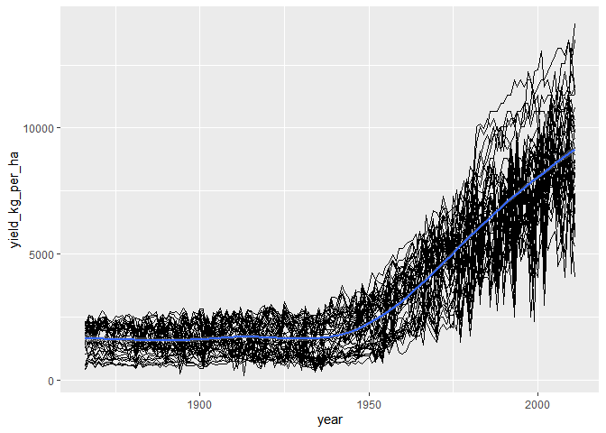
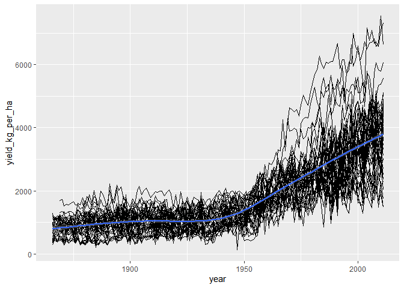
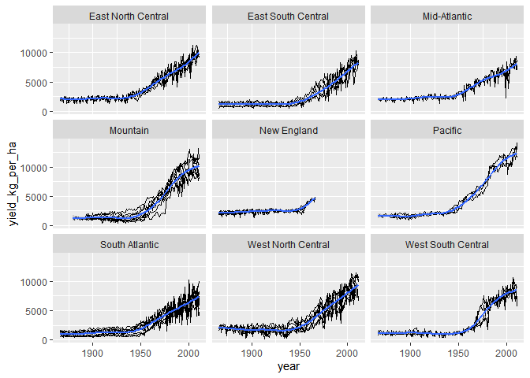
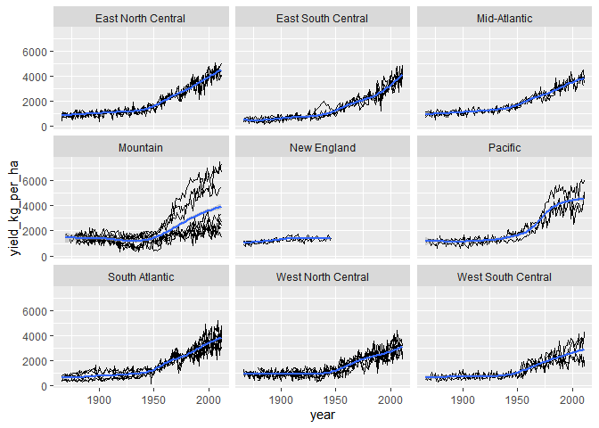
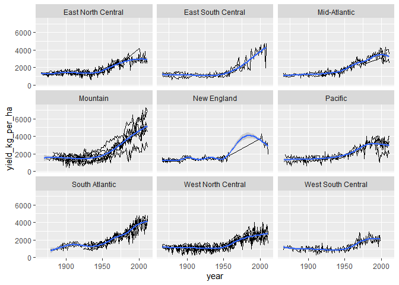

Case study on grain yields
================
Mohamad Osman
2022-07-06

# Section 04: Case study on grain yields

### **`01-Converting areas to metric 1`**

``` r
library(ggplot2)
library(dplyr)
```

    ## 
    ## Attaching package: 'dplyr'

    ## The following objects are masked from 'package:stats':
    ## 
    ##     filter, lag

    ## The following objects are masked from 'package:base':
    ## 
    ##     intersect, setdiff, setequal, union

``` r
library(tidyverse)
```

    ## ── Attaching packages ─────────────────────────────────────── tidyverse 1.3.1 ──

    ## ✔ tibble  3.1.7     ✔ purrr   0.3.4
    ## ✔ tidyr   1.2.0     ✔ stringr 1.4.0
    ## ✔ readr   2.1.2     ✔ forcats 0.5.1

    ## ── Conflicts ────────────────────────────────────────── tidyverse_conflicts() ──
    ## ✖ dplyr::filter() masks stats::filter()
    ## ✖ dplyr::lag()    masks stats::lag()

``` r
library(magrittr)
```

    ## 
    ## Attaching package: 'magrittr'

    ## The following object is masked from 'package:purrr':
    ## 
    ##     set_names

    ## The following object is masked from 'package:tidyr':
    ## 
    ##     extract

``` r
library(mgcv)
```

    ## Loading required package: nlme

    ## 
    ## Attaching package: 'nlme'

    ## The following object is masked from 'package:dplyr':
    ## 
    ##     collapse

    ## This is mgcv 1.8-40. For overview type 'help("mgcv-package")'.

In this chapter, you’ll be working with [**grain yield
data**](https://www.rdocumentation.org/packages/agridat/topics/nass.corn)
from the [**United States Department of Agriculture, National
Agricultural Statistics Service**](https://quickstats.nass.usda.gov/).
Unfortunately, they report all areas in acres. So, the first thing you
need to do is write some utility functions to convert areas in acres to
areas in hectares.

To solve this exercise, you need to know the following:

1.  There are 4840 square yards in an acre.

2.  There are 36 inches in a yard and one inch is 0.0254 meters.

3.  There are 10000 square meters in a hectare.

``` r
# Write a function to convert acres to sq. yards
acres_to_sq_yards <- function(acres) {
  4840 * acres
}
```

Write a function, `yards_to_meters()`, to convert distances in yards to
distances in meters. This should take a single argument, `yards`.

``` r
# Write a function to convert yards to meters
yards_to_meters <- function(yards) {

    36 * yards * 0.0254

}
```

Write a function, `sq_meters_to_hectares()`, to convert areas in square
meters to areas in hectares. This should take a single argument,
`sq_meters`.

``` r
# Write a function to convert sq. meters to hectares
sq_meters_to_hectares <- function(sq_meters) {
    sq_meters/10000 

}
```

### **`02-Converting areas to metric 2`**

You’re almost there with creating a function to convert acres to
hectares. You need another utility function to deal with getting from
square yards to square meters. Then, you can bring everything together
to write the overall acres-to-hectares conversion function. Finally, in
the next exercise you’ll be calculating area conversions in the
denominator of a ratio, so you’ll need a harmonic acre-to-hectare
conversion function.

Free hints: magrittr’s `raise_to_power()` will be useful here. The last
step is similar to Chapter 2’s [**Harmonic
Mean**](https://campus.datacamp.com/courses/introduction-to-function-writing-in-r/all-about-arguments?ex=7).

The three utility functions from the last exercise
(`acres_to_sq_yards()`, `yards_to_meters()`, and
`sq_meters_to_hectares()`) are available, as is your `get_reciprocal()`
from Chapter 2. `magrittr` is loaded.

-   Write a function to convert distance in square yards to square
    meters. It should take the square root of the input, then convert
    yards to meters, then square the result.

-   Write a function to convert areas in acres to hectares. The function
    should convert the input from acres to square yards, then to square
    meters, then to hectares.

-   Write a function to harmonically convert areas in acres to hectares.
    The function should get the reciprocal of the input, then convert
    from acres to hectares, then get the reciprocal again.

``` r
# Write a function to convert sq. yards to sq. meters
sq_yards_to_sq_meters <- function(sq_yards) {
  sq_yards %>%
    # Take the square root
    sqrt() %>%
    # Convert yards to meters
    yards_to_meters() %>%
    # Square it
    raise_to_power(2)
}
```

Write a function to convert areas in acres to hectares. The function
should convert the input from acres to square yards, then to square
meters, then to hectares.

``` r
# Load the function from the previous step
#load_step2()

# Write a function to convert acres to hectares
acres_to_hectares <- function(arces) {
  arces %>%
    # Convert acres to sq yards
    acres_to_sq_yards() %>%
    # Convert sq yards to sq meters
    sq_yards_to_sq_meters() %>%
    # Convert sq meters to hectares
    sq_meters_to_hectares()

}
```

Write a function to harmonically convert areas in acres to hectares. The
function should get the reciprocal of the input, then convert from acres
to hectares, then get the reciprocal again.

``` r
# get reciprocal function
get_reciprocal <- function(x) {
  1 / x
}

# Load the functions from the previous steps
#load_step3()

# Define a harmonic acres to hectares function
harmonic_acres_to_hectares <- function(acres) {
  acres %>% 
    # Get the reciprocal
    get_reciprocal() %>%
    # Convert acres to hectares
    acres_to_hectares() %>% 
    # Get the reciprocal again
    get_reciprocal()
}
```

### **`03-Converting yields to metric`**

The yields in the NASS corn data are also given in US units, namely
bushels per acre. You’ll need to write some more utility functions to
convert this unit to the metric unit of kg per hectare.

Bushels historically meant a volume of 8 gallons, but in the context of
grain, they are now defined as masses. This mass differs for each grain!
To solve this exercise, you need to know these facts.

1.  One pound (lb) is 0.45359237 kilograms (kg).

2.  One bushel is 48 lbs of barley, 56 lbs of corn, or 60 lbs of wheat.

`magrittr` is loaded.

-   Write a function to convert masses in lb to kg. This should take a
    single argument, `lbs`.

``` r
# Write a function to convert lb to kg
lbs_to_kgs <- function(lbs) {
    
    lbs * 0.45359237
}
```

-   Write a function to convert masses in bushels to lbs. This should
    take two arguments, `bushels` and `crop`. It should define a lookup
    vector of scale factors for each crop (barley, corn, wheat), extract
    the scale factor for the crop, then multiply this by the number of
    bushels.

``` r
library(magrittr)
# Write a function to convert bushels to lbs
bushels_to_lbs <- function(bushels, crop) {
  # Define a lookup table of scale factors
  c(barley = 48, corn = 56, wheat = 60) %>%
    # Extract the value for the crop
    magrittr::extract(crop) %>%
    # Multiply by the no. of bushels
    multiply_by(bushels)
}
```

Write a function to convert masses in bushels to kgs. This should take
two arguments, `bushels` and `crop`. It should convert the mass in
bushels to lbs then to kgs.

``` r
# Load fns defined in previous steps
#load_step3()

# Write a function to convert bushels to kg
bushels_to_kgs <- function(bushels, crop) {
  bushels %>%
    # Convert bushels to lbs for this crop
    bushels_to_lbs(crop) %>%
    # Convert lbs to kgs
    lbs_to_kgs()
}
```

Write a function to convert yields in bushels/acre to kg/ha. The
arguments should be `bushels_per_acre` and `crop`. Three choices of
`crop` should be allowed: `"barley"`, `"corn"`, and `"wheat"`. It should
match the `crop` argument, then convert bushels to kgs, then convert
harmonic acres to hectares.

``` r
# Load fns defined in previous steps
# load_step4()

# Write a function to convert bushels/acre to kg/ha
bushels_per_acre_to_kgs_per_hectare <- function(bushels_per_acre, crop = c("barley", "corn", "wheat")) {
  # Match the crop argument
  crop <- match.arg(crop)
  bushels_per_acre %>%
    # Convert bushels to kgs for this crop
    bushels_to_kgs(crop) %>%
    # Convert harmonic acres to ha
    harmonic_acres_to_hectares()
}
```

``` r
bushels_per_acre_to_kgs_per_hectare(15, "corn")
```

    ##    corn 
    ## 941.515

### **`04-Applying the unit conversion`**

Now that you’ve written some functions, it’s time to apply them! The
NASS `corn` dataset is available, and you can fortify it (jargon for
“adding new columns”) with metrics areas and yields.

This fortification process can also be turned into a function, so you’ll
define a function for this, and test it on the NASS `wheat` dataset.

``` r
nass_corn_path = file.path("..", "00_Datasets", "nass.corn.rds")
corn <- readRDS(nass_corn_path)
head(corn)
```

    ##   year       state farmed_area_acres yield_bushels_per_acre
    ## 1 1866     Alabama           1050000                      9
    ## 2 1866    Arkansas            280000                     18
    ## 3 1866  California             42000                     28
    ## 4 1866 Connecticut             57000                     34
    ## 5 1866    Delaware            200000                     23
    ## 6 1866     Florida            125000                      9

``` r
# View the corn dataset
glimpse(corn)
```

    ## Rows: 6,381
    ## Columns: 4
    ## $ year                   <int> 1866, 1866, 1866, 1866, 1866, 1866, 1866, 1866,…
    ## $ state                  <chr> "Alabama", "Arkansas", "California", "Connectic…
    ## $ farmed_area_acres      <dbl> 1050000, 280000, 42000, 57000, 200000, 125000, …
    ## $ yield_bushels_per_acre <dbl> 9.0, 18.0, 28.0, 34.0, 23.0, 9.0, 6.0, 29.0, 36…

``` r
corn %>%
  # Add some columns
  mutate(
    # Convert farmed area from acres to ha
    farmed_area_ha = acres_to_hectares(farmed_area_acres),
    # Convert yield from bushels/acre to kg/ha
    yield_kg_per_ha = bushels_per_acre_to_kgs_per_hectare(
      yield_bushels_per_acre ,
      crop = "corn"
    )
  )
```

    ##      year          state farmed_area_acres yield_bushels_per_acre
    ## 1    1866        Alabama           1050000                    9.0
    ## 2    1866       Arkansas            280000                   18.0
    ## 3    1866     California             42000                   28.0
    ## 4    1866    Connecticut             57000                   34.0
    ## 5    1866       Delaware            200000                   23.0
    ## 6    1866        Florida            125000                    9.0
    ## 7    1866        Georgia           1770000                    6.0
    ## 8    1866       Illinois           4925000                   29.0
    ## 9    1866        Indiana           1950000                   36.5
    ## 10   1866           Iowa           1810000                   32.0
    ## 11   1866         Kansas            217000                   28.0
    ## 12   1866       Kentucky           1940000                   26.5
    ## 13   1866      Louisiana            260000                   11.0
    ## 14   1866          Maine             53000                   30.0
    ## 15   1866       Maryland            605000                   25.0
    ## 16   1866  Massachusetts             70000                   34.0
    ## 17   1866       Michigan            480000                   32.0
    ## 18   1866      Minnesota            120000                   23.0
    ## 19   1866    Mississippi            800000                    9.5
    ## 20   1866       Missouri           1520000                   26.0
    ## 21   1866       Nebraska             72000                   29.5
    ## 22   1866  New Hampshire             41000                   35.0
    ## 23   1866     New Jersey            325000                   31.5
    ## 24   1866       New York            720000                   29.0
    ## 25   1866 North Carolina           1675000                    9.5
    ## 26   1866           Ohio           2500000                   37.0
    ## 27   1866   Pennsylvania           1120000                   35.0
    ## 28   1866   Rhode Island             12000                   31.5
    ## 29   1866 South Carolina            950000                    6.5
    ## 30   1866      Tennessee           1800000                   21.0
    ## 31   1866          Texas            670000                   20.0
    ## 32   1866        Vermont             58000                   34.0
    ## 33   1866       Virginia           1000000                   16.2
    ## 34   1866  West Virginia            300000                   26.0
    ## 35   1866      Wisconsin            500000                   28.5
    ## 36   1867        Alabama           1400000                   13.0
    ## 37   1867       Arkansas            540000                   21.5
    ## 38   1867     California             45000                   27.0
    ## 39   1867    Connecticut             58000                   34.0
    ## 40   1867       Delaware            200000                   14.0
    ## 41   1867        Florida            145000                   11.5
    ## 42   1867        Georgia           1980000                   12.0
    ## 43   1867       Illinois           5075000                   27.0
    ## 44   1867        Indiana           1975000                   29.0
    ## 45   1867           Iowa           1810000                   41.0
    ## 46   1867         Kansas            260000                   38.5
    ## 47   1867       Kentucky           2030000                   21.0
    ## 48   1867      Louisiana            330000                   15.5
    ## 49   1867          Maine             50000                   31.5
    ## 50   1867       Maryland            600000                   24.0
    ## 51   1867  Massachusetts             66000                   35.5
    ## 52   1867       Michigan            500000                   36.0
    ## 53   1867      Minnesota            130000                   35.0
    ## 54   1867    Mississippi           1020000                   16.0
    ## 55   1867       Missouri           1750000                   32.0
    ## 56   1867       Nebraska             90000                   38.0
    ## 57   1867  New Hampshire             40000                   40.0
    ## 58   1867     New Jersey            325000                   33.0
    ## 59   1867       New York            665000                   33.5
    ## 60   1867 North Carolina           1725000                   11.5
    ## 61   1867           Ohio           2400000                   30.0
    ## 62   1867   Pennsylvania           1140000                   33.0
    ## 63   1867   Rhode Island             12000                   30.5
    ## 64   1867 South Carolina            920000                   11.0
    ## 65   1867      Tennessee           2090000                   23.5
    ## 66   1867          Texas            750000                   25.0
    ## 67   1867        Vermont             55000                   39.0
    ## 68   1867       Virginia           1100000                   17.0
    ## 69   1867  West Virginia            330000                   22.5
    ## 70   1867      Wisconsin            510000                   37.5
    ## 71   1868        Alabama           1420000                   12.5
    ## 72   1868       Arkansas            780000                   20.0
    ## 73   1868     California             47000                   30.0
    ## 74   1868    Connecticut             55000                   34.5
    ## 75   1868       Delaware            205000                   21.0
    ## 76   1868        Florida            180000                   10.5
    ## 77   1868        Georgia           2220000                   10.0
    ## 78   1868       Illinois           5650000                   34.2
    ## 79   1868        Indiana           2075000                   34.0
    ## 80   1868           Iowa           1890000                   40.5
    ## 81   1868         Kansas            340000                   20.0
    ## 82   1868       Kentucky           2260000                   28.0
    ## 83   1868      Louisiana            535000                   17.0
    ## 84   1868          Maine             47000                   31.5
    ## 85   1868       Maryland            590000                   23.0
    ## 86   1868  Massachusetts             60000                   36.0
    ## 87   1868       Michigan            560000                   33.0
    ## 88   1868      Minnesota            150000                   37.0
    ## 89   1868    Mississippi           1240000                   16.0
    ## 90   1868       Missouri           1910000                   26.5
    ## 91   1868       Nebraska            115000                   28.0
    ## 92   1868  New Hampshire             39000                   39.0
    ## 93   1868     New Jersey            315000                   33.0
    ## 94   1868       New York            680000                   32.5
    ## 95   1868 North Carolina           1900000                   13.5
    ## 96   1868           Ohio           2350000                   35.0
    ## 97   1868   Pennsylvania           1210000                   35.0
    ## 98   1868   Rhode Island             11000                   33.0
    ## 99   1868 South Carolina           1020000                   11.0
    ## 100  1868      Tennessee           2220000                   23.0
    ## 101  1868          Texas            880000                   22.5
    ## 102  1868        Vermont             57000                   40.5
    ## 103  1868       Virginia           1190000                   18.5
    ## 104  1868  West Virginia            350000                   25.0
    ## 105  1868      Wisconsin            565000                   36.0
    ## 106  1869        Alabama           1430000                   12.0
    ## 107  1869       Arkansas            730000                   18.5
    ## 108  1869     California             47000                   28.0
    ## 109  1869    Connecticut             55000                   29.0
    ## 110  1869       Delaware            205000                   15.0
    ## 111  1869        Florida            205000                   11.0
    ## 112  1869        Georgia           2110000                    8.4
    ## 113  1869       Illinois           5600000                   23.5
    ## 114  1869        Indiana           2050000                   25.5
    ## 115  1869           Iowa           2080000                   33.5
    ## 116  1869         Kansas            445000                   38.5
    ## 117  1869       Kentucky           2370000                   21.2
    ## 118  1869      Louisiana            510000                   15.5
    ## 119  1869          Maine             44000                   24.0
    ## 120  1869       Maryland            595000                   20.0
    ## 121  1869  Massachusetts             53000                   33.5
    ## 122  1869       Michigan            540000                   28.0
    ## 123  1869      Minnesota            156000                   29.0
    ## 124  1869    Mississippi           1210000                   13.2
    ## 125  1869       Missouri           2160000                   30.6
    ## 126  1869       Nebraska            125000                   38.5
    ## 127  1869  New Hampshire             39000                   30.5
    ## 128  1869     New Jersey            330000                   28.0
    ## 129  1869       New York            690000                   27.0
    ## 130  1869 North Carolina           1900000                   10.0
    ## 131  1869           Ohio           2450000                   30.0
    ## 132  1869         Oregon              3000                   25.0
    ## 133  1869   Pennsylvania           1230000                   30.5
    ## 134  1869   Rhode Island             11000                   29.5
    ## 135  1869 South Carolina           1000000                    7.6
    ## 136  1869      Tennessee           2200000                   19.0
    ## 137  1869          Texas            940000                   25.0
    ## 138  1869        Vermont             57000                   34.0
    ## 139  1869       Virginia           1310000                   13.5
    ## 140  1869  West Virginia            378000                   21.5
    ## 141  1869      Wisconsin            575000                   26.5
    ## 142  1870        Alabama           1330000                   13.5
    ## 143  1870       Arkansas            770000                   21.0
    ## 144  1870     California             47000                   25.0
    ## 145  1870    Connecticut             54000                   32.5
    ## 146  1870       Delaware            205000                   18.5
    ## 147  1870        Florida            225000                   10.5
    ## 148  1870        Georgia           2060000                   12.0
    ## 149  1870       Illinois           6350000                   40.0
    ## 150  1870        Indiana           2325000                   39.5
    ## 151  1870           Iowa           2550000                   40.0
    ## 152  1870         Kansas            570000                   28.0
    ## 153  1870       Kentucky           2460000                   28.0
    ## 154  1870      Louisiana            530000                   16.5
    ## 155  1870          Maine             43000                   35.0
    ## 156  1870       Maryland            575000                   22.0
    ## 157  1870  Massachusetts             51000                   31.0
    ## 158  1870       Michigan            570000                   39.0
    ## 159  1870      Minnesota            190000                   31.5
    ## 160  1870    Mississippi           1180000                   14.0
    ## 161  1870       Missouri           2590000                   34.0
    ## 162  1870       Nebraska            155000                   33.5
    ## 163  1870  New Hampshire             39000                   37.0
    ## 164  1870     New Jersey            340000                   33.5
    ## 165  1870       New York            710000                   35.0
    ## 166  1870 North Carolina           1810000                   14.5
    ## 167  1870           Ohio           2600000                   39.0
    ## 168  1870         Oregon              3000                   23.0
    ## 169  1870   Pennsylvania           1260000                   36.0
    ## 170  1870   Rhode Island             11000                   32.5
    ## 171  1870 South Carolina            970000                   11.0
    ## 172  1870      Tennessee           2290000                   24.0
    ## 173  1870          Texas           1000000                   21.0
    ## 174  1870        Vermont             60000                   39.5
    ## 175  1870       Virginia           1390000                   18.5
    ## 176  1870  West Virginia            415000                   26.0
    ## 177  1870      Wisconsin            660000                   38.0
    ## 178  1871        Alabama           1480000                   11.0
    ## 179  1871       Arkansas            930000                   20.0
    ## 180  1871     California             47000                   21.5
    ## 181  1871    Connecticut             52000                   35.0
    ## 182  1871       Delaware            210000                   22.0
    ## 183  1871        Florida            250000                    8.5
    ## 184  1871        Georgia           2160000                    8.5
    ## 185  1871       Illinois           6730000                   33.0
    ## 186  1871        Indiana           2500000                   35.5
    ## 187  1871           Iowa           3060000                   43.5
    ## 188  1871         Kansas            860000                   36.5
    ## 189  1871       Kentucky           2530000                   23.5
    ## 190  1871      Louisiana            600000                   12.5
    ## 191  1871          Maine             40000                   30.5
    ## 192  1871       Maryland            585000                   23.5
    ## 193  1871  Massachusetts             49000                   37.0
    ## 194  1871       Michigan            600000                   33.5
    ## 195  1871      Minnesota            225000                   35.5
    ## 196  1871    Mississippi           1270000                   12.5
    ## 197  1871       Missouri           2980000                   35.5
    ## 198  1871       Nebraska            225000                   38.0
    ## 199  1871  New Hampshire             39000                   40.0
    ## 200  1871     New Jersey            345000                   32.0
    ## 201  1871       New York            710000                   33.0
    ## 202  1871 North Carolina           1990000                   11.5
    ## 203  1871           Ohio           2850000                   39.0
    ## 204  1871         Oregon              4000                   25.0
    ## 205  1871   Pennsylvania           1270000                   35.0
    ## 206  1871   Rhode Island             11000                   31.5
    ## 207  1871 South Carolina           1090000                   10.0
    ## 208  1871      Tennessee           2450000                   21.0
    ## 209  1871          Texas           1160000                   16.0
    ## 210  1871        Vermont             60000                   35.5
    ## 211  1871       Virginia           1470000                   18.0
    ## 212  1871  West Virginia            445000                   23.0
    ## 213  1871      Wisconsin            725000                   37.0
    ## 214  1872        Alabama           1520000                   13.5
    ## 215  1872       Arkansas            930000                   17.5
    ## 216  1872     California             43000                   29.0
    ## 217  1872    Connecticut             48000                   37.0
    ## 218  1872       Delaware            210000                   18.0
    ## 219  1872        Florida            255000                    9.0
    ## 220  1872        Georgia           2140000                   11.0
    ## 221  1872       Illinois           6860000                   39.8
    ## 222  1872        Indiana           2600000                   38.5
    ## 223  1872           Iowa           3360000                   41.0
    ## 224  1872         Kansas           1160000                   36.0
    ## 225  1872       Kentucky           2580000                   27.5
    ## 226  1872      Louisiana            630000                   17.0
    ## 227  1872          Maine             37000                   34.0
    ## 228  1872       Maryland            600000                   22.0
    ## 229  1872  Massachusetts             47000                   37.0
    ## 230  1872       Michigan            680000                   36.0
    ## 231  1872      Minnesota            245000                   33.5
    ## 232  1872    Mississippi           1250000                   16.5
    ## 233  1872       Missouri           3340000                   31.5
    ## 234  1872       Nebraska            295000                   37.0
    ## 235  1872  New Hampshire             39000                   39.0
    ## 236  1872     New Jersey            355000                   34.0
    ## 237  1872       New York            700000                   35.0
    ## 238  1872 North Carolina           1950000                   14.0
    ## 239  1872           Ohio           2800000                   40.0
    ## 240  1872         Oregon              4000                   26.5
    ## 241  1872   Pennsylvania           1300000                   38.0
    ## 242  1872   Rhode Island             11000                   31.5
    ## 243  1872 South Carolina           1110000                   10.5
    ## 244  1872      Tennessee           2500000                   22.5
    ## 245  1872          Texas           1250000                   23.0
    ## 246  1872        Vermont             60000                   41.0
    ## 247  1872       Virginia           1480000                   18.0
    ## 248  1872  West Virginia            460000                   24.5
    ## 249  1872      Wisconsin            735000                   35.0
    ## 250  1873        Alabama           1560000                   12.5
    ## 251  1873       Arkansas            950000                   18.5
    ## 252  1873     California             38000                   31.0
    ## 253  1873    Connecticut             47000                   30.0
    ## 254  1873       Delaware            195000                   16.0
    ## 255  1873        Florida            275000                   10.0
    ## 256  1873        Georgia           2050000                   11.0
    ## 257  1873       Illinois           6850000                   21.0
    ## 258  1873        Indiana           2550000                   30.0
    ## 259  1873           Iowa           3600000                   32.5
    ## 260  1873         Kansas           1371000                   23.5
    ## 261  1873       Kentucky           2560000                   25.5
    ## 262  1873      Louisiana            660000                   15.0
    ## 263  1873          Maine             35000                   27.5
    ## 264  1873       Maryland            630000                   22.5
    ## 265  1873  Massachusetts             44000                   35.0
    ## 266  1873       Michigan            680000                   31.0
    ## 267  1873      Minnesota            240000                   31.0
    ## 268  1873    Mississippi           1230000                   12.5
    ## 269  1873       Missouri           3540000                   23.5
    ## 270  1873       Nebraska            370000                   22.0
    ## 271  1873  New Hampshire             37000                   38.0
    ## 272  1873     New Jersey            335000                   32.0
    ## 273  1873       New York            685000                   31.0
    ## 274  1873 North Carolina           1870000                   13.0
    ## 275  1873           Ohio           2750000                   35.0
    ## 276  1873         Oregon              4000                   26.0
    ## 277  1873   Pennsylvania           1240000                   32.5
    ## 278  1873   Rhode Island             10000                   30.5
    ## 279  1873 South Carolina           1020000                    9.5
    ## 280  1873      Tennessee           2550000                   20.5
    ## 281  1873          Texas           1350000                   16.0
    ## 282  1873        Vermont             58000                   37.5
    ## 283  1873       Virginia           1480000                   18.5
    ## 284  1873  West Virginia            465000                   23.5
    ## 285  1873      Wisconsin            755000                   33.0
    ## 286  1874        Alabama           1750000                   12.5
    ## 287  1874       Arkansas           1030000                   12.5
    ## 288  1874     California             38000                   33.0
    ## 289  1874    Connecticut             48000                   35.5
    ## 290  1874       Delaware            195000                   18.0
    ## 291  1874        Florida            280000                   10.0
    ## 292  1874        Georgia           2220000                   11.0
    ## 293  1874       Illinois           7425000                   24.0
    ## 294  1874        Indiana           2850000                   34.0
    ## 295  1874           Iowa           4150000                   34.0
    ## 296  1874         Kansas           1740000                   10.5
    ## 297  1874       Kentucky           2530000                   22.5
    ## 298  1874      Louisiana            615000                   13.0
    ## 299  1874          Maine             31000                   25.0
    ## 300  1874       Maryland            640000                   21.0
    ## 301  1874  Massachusetts             42000                   32.0
    ## 302  1874       Michigan            740000                   28.0
    ## 303  1874      Minnesota            295000                   29.5
    ## 304  1874    Mississippi           1330000                   13.0
    ## 305  1874       Missouri           4070000                   16.0
    ## 306  1874       Nebraska            380000                   15.0
    ## 307  1874  New Hampshire             35000                   37.0
    ## 308  1874     New Jersey            335000                   25.5
    ## 309  1874       New York            685000                   31.5
    ## 310  1874 North Carolina           1960000                   13.0
    ## 311  1874           Ohio           2900000                   37.0
    ## 312  1874         Oregon              4000                   25.0
    ## 313  1874   Pennsylvania           1270000                   34.0
    ## 314  1874   Rhode Island             11000                   33.0
    ## 315  1874 South Carolina           1080000                   11.0
    ## 316  1874      Tennessee           2600000                   17.5
    ## 317  1874          Texas           1570000                   19.0
    ## 318  1874        Vermont             56000                   36.0
    ## 319  1874       Virginia           1510000                   17.5
    ## 320  1874  West Virginia            460000                   21.5
    ## 321  1874      Wisconsin            765000                   32.0
    ## 322  1875        Alabama           1870000                   13.0
    ## 323  1875       Arkansas           1230000                   21.0
    ## 324  1875     California             51000                   25.0
    ## 325  1875    Connecticut             50000                   35.5
    ## 326  1875       Delaware            200000                   22.0
    ## 327  1875        Florida            290000                    9.5
    ## 328  1875        Georgia           2280000                    9.0
    ## 329  1875       Illinois           8150000                   34.3
    ## 330  1875        Indiana           3175000                   32.0
    ## 331  1875           Iowa           4600000                   35.0
    ## 332  1875         Kansas           2206000                   34.5
    ## 333  1875       Kentucky           2710000                   27.0
    ## 334  1875      Louisiana            675000                   14.5
    ## 335  1875          Maine             28000                   31.5
    ## 336  1875       Maryland            630000                   25.0
    ## 337  1875  Massachusetts             38000                   36.5
    ## 338  1875       Michigan            790000                   36.0
    ## 339  1875      Minnesota            350000                   25.0
    ## 340  1875    Mississippi           1450000                   16.5
    ## 341  1875       Missouri           4760000                   36.0
    ## 342  1875       Nebraska            625000                   31.0
    ## 343  1875  New Hampshire             36000                   40.5
    ## 344  1875     New Jersey            340000                   34.0
    ## 345  1875       New York            725000                   33.0
    ## 346  1875 North Carolina           1990000                   13.5
    ## 347  1875           Ohio           3250000                   34.5
    ## 348  1875         Oregon              5000                   25.0
    ## 349  1875   Pennsylvania           1310000                   38.0
    ## 350  1875   Rhode Island             10000                   31.0
    ## 351  1875 South Carolina           1130000                    9.5
    ## 352  1875      Tennessee           2750000                   23.5
    ## 353  1875          Texas           1740000                   18.0
    ## 354  1875        Vermont             57000                   37.0
    ## 355  1875       Virginia           1540000                   19.5
    ## 356  1875  West Virginia            525000                   25.0
    ## 357  1875      Wisconsin            880000                   23.0
    ## 358  1876        Alabama           1950000                   13.5
    ## 359  1876       Arkansas           1250000                   20.0
    ## 360  1876     California             53000                   26.0
    ## 361  1876    Connecticut             52000                   36.5
    ## 362  1876       Delaware            200000                   20.0
    ## 363  1876        Florida            325000                    9.5
    ## 364  1876        Georgia           2400000                   11.0
    ## 365  1876       Illinois           8500000                   30.0
    ## 366  1876        Indiana           3500000                   35.0
    ## 367  1876           Iowa           5200000                   34.0
    ## 368  1876         Kansas           2105000                   35.0
    ## 369  1876       Kentucky           2820000                   27.0
    ## 370  1876      Louisiana            665000                   15.0
    ## 371  1876          Maine             28000                   31.0
    ## 372  1876       Maryland            645000                   24.0
    ## 373  1876  Massachusetts             45000                   35.5
    ## 374  1876       Michigan            810000                   30.0
    ## 375  1876      Minnesota            350000                   26.0
    ## 376  1876    Mississippi           1450000                   13.5
    ## 377  1876       Missouri           4975000                   28.0
    ## 378  1876       Nebraska            780000                   32.0
    ## 379  1876  New Hampshire             35000                   40.0
    ## 380  1876     New Jersey            350000                   29.5
    ## 381  1876       New York            730000                   30.0
    ## 382  1876 North Carolina           2050000                   12.5
    ## 383  1876           Ohio           3500000                   37.5
    ## 384  1876         Oregon              6000                   27.0
    ## 385  1876   Pennsylvania           1320000                   32.5
    ## 386  1876   Rhode Island             11000                   32.0
    ## 387  1876 South Carolina           1170000                   10.0
    ## 388  1876      Tennessee           2775000                   23.0
    ## 389  1876          Texas           2000000                   25.0
    ## 390  1876        Vermont             57000                   38.0
    ## 391  1876       Virginia           1650000                   18.0
    ## 392  1876  West Virginia            555000                   24.0
    ## 393  1876      Wisconsin            965000                   37.5
    ## 394  1877        Alabama           2010000                   12.0
    ## 395  1877       Arkansas           1240000                   20.0
    ## 396  1877     California             65000                   26.5
    ## 397  1877    Connecticut             55000                   31.5
    ## 398  1877       Delaware            202000                   18.0
    ## 399  1877        Florida            350000                    9.0
    ## 400  1877        Georgia           2500000                    9.5
    ## 401  1877       Illinois           8950000                   27.0
    ## 402  1877        Indiana           3675000                   35.0
    ## 403  1877           Iowa           5800000                   33.5
    ## 404  1877         Kansas           2926000                   34.0
    ## 405  1877       Kentucky           2900000                   26.0
    ## 406  1877      Louisiana            700000                   16.0
    ## 407  1877          Maine             30000                   35.0
    ## 408  1877       Maryland            660000                   22.5
    ## 409  1877  Massachusetts             50000                   38.0
    ## 410  1877       Michigan            890000                   31.0
    ## 411  1877      Minnesota            410000                   26.5
    ## 412  1877    Mississippi           1470000                   14.0
    ## 413  1877       Missouri           5025000                   29.0
    ## 414  1877       Nebraska           1130000                   34.0
    ## 415  1877  New Hampshire             36000                   41.0
    ## 416  1877     New Jersey            350000                   33.0
    ## 417  1877       New York            760000                   33.5
    ## 418  1877 North Carolina           2180000                   13.5
    ## 419  1877           Ohio           3425000                   32.5
    ## 420  1877         Oregon              6000                   25.0
    ## 421  1877   Pennsylvania           1350000                   33.0
    ## 422  1877   Rhode Island             11000                   33.0
    ## 423  1877 South Carolina           1250000                   10.0
    ## 424  1877      Tennessee           2825000                   22.0
    ## 425  1877          Texas           2240000                   20.5
    ## 426  1877        Vermont             63000                   39.0
    ## 427  1877       Virginia           1670000                   17.5
    ## 428  1877  West Virginia            570000                   21.0
    ## 429  1877      Wisconsin           1025000                   32.0
    ## 430  1878        Alabama           2100000                   13.0
    ## 431  1878       Arkansas           1240000                   19.0
    ## 432  1878     California             65000                   28.0
    ## 433  1878    Connecticut             56000                   36.5
    ## 434  1878       Delaware            202000                   18.5
    ## 435  1878        Florida            360000                    9.5
    ## 436  1878        Georgia           2570000                   10.0
    ## 437  1878       Illinois           8425000                   29.0
    ## 438  1878        Indiana           3700000                   32.0
    ## 439  1878           Iowa           6100000                   40.5
    ## 440  1878         Kansas           2745000                   28.5
    ## 441  1878       Kentucky           3020000                   20.0
    ## 442  1878      Louisiana            770000                   16.5
    ## 443  1878          Maine             34000                   36.0
    ## 444  1878       Maryland            675000                   22.5
    ## 445  1878  Massachusetts             48000                   37.0
    ## 446  1878       Michigan            920000                   37.0
    ## 447  1878      Minnesota            405000                   36.5
    ## 448  1878    Mississippi           1550000                   14.0
    ## 449  1878       Missouri           5075000                   26.0
    ## 450  1878       Nebraska           1340000                   41.0
    ## 451  1878  New Hampshire             37000                   37.5
    ## 452  1878     New Jersey            355000                   32.0
    ## 453  1878       New York            765000                   32.5
    ## 454  1878 North Carolina           2330000                   12.0
    ## 455  1878           Ohio           3450000                   36.0
    ## 456  1878         Oregon              6000                   25.0
    ## 457  1878   Pennsylvania           1360000                   30.0
    ## 458  1878   Rhode Island             12000                   32.0
    ## 459  1878 South Carolina           1330000                   10.0
    ## 460  1878      Tennessee           2775000                   21.0
    ## 461  1878          Texas           2470000                   22.5
    ## 462  1878        Vermont             64000                   38.0
    ## 463  1878       Virginia           1750000                   17.5
    ## 464  1878  West Virginia            570000                   24.5
    ## 465  1878      Wisconsin            985000                   35.5
    ## 466  1879        Alabama           2056000                   12.4
    ## 467  1879       Arkansas           1298000                   18.6
    ## 468  1879     California             72000                   28.0
    ## 469  1879       Colorado             23000                   19.8
    ## 470  1879    Connecticut             56000                   33.7
    ## 471  1879       Delaware            202000                   19.3
    ## 472  1879        Florida            360000                    8.8
    ## 473  1879        Georgia           2539000                    9.1
    ## 474  1879       Illinois           9019000                   36.1
    ## 475  1879        Indiana           3678000                   31.4
    ## 476  1879           Iowa           6616000                   41.6
    ## 477  1879         Kansas           3418000                   30.9
    ## 478  1879       Kentucky           3021000                   24.1
    ## 479  1879      Louisiana            743000                   13.3
    ## 480  1879          Maine             31000                   31.0
    ## 481  1879       Maryland            665000                   24.0
    ## 482  1879  Massachusetts             53000                   34.2
    ## 483  1879       Michigan            920000                   35.3
    ## 484  1879      Minnesota            439000                   33.8
    ## 485  1879    Mississippi           1571000                   13.6
    ## 486  1879       Missouri           5588000                   36.2
    ## 487  1879       Nebraska           1631000                   40.1
    ## 488  1879  New Hampshire             37000                   36.9
    ## 489  1879     New Jersey            345000                   32.4
    ## 490  1879       New York            779000                   33.0
    ## 491  1879 North Carolina           2305000                   12.2
    ## 492  1879           Ohio           3282000                   34.1
    ## 493  1879         Oregon              6000                   22.5
    ## 494  1879   Pennsylvania           1373000                   33.4
    ## 495  1879   Rhode Island             12000                   31.4
    ## 496  1879 South Carolina           1303000                    9.0
    ## 497  1879      Tennessee           2905000                   21.6
    ## 498  1879          Texas           2469000                   11.8
    ## 499  1879        Vermont             65000                   36.5
    ## 500  1879       Virginia           1768000                   16.5
    ## 501  1879  West Virginia            566000                   24.9
    ## 502  1879      Wisconsin           1015000                   33.7
    ## 503  1880        Alabama           1830000                   12.0
    ## 504  1880       Arkansas           1340000                   21.0
    ## 505  1880     California             72000                   32.0
    ## 506  1880       Colorado             24000                   18.5
    ## 507  1880    Connecticut             56000                   34.5
    ## 508  1880       Delaware            200000                   20.8
    ## 509  1880        Florida            375000                    9.5
    ## 510  1880        Georgia           2370000                    9.0
    ## 511  1880       Illinois           8840000                   31.0
    ## 512  1880        Indiana           3425000                   25.5
    ## 513  1880           Iowa           6950000                   39.5
    ## 514  1880         Kansas           3726000                   29.5
    ## 515  1880       Kentucky           2960000                   25.0
    ## 516  1880      Louisiana            770000                   15.5
    ## 517  1880          Maine             31000                   31.0
    ## 518  1880       Maryland            665000                   24.0
    ## 519  1880  Massachusetts             54000                   38.0
    ## 520  1880       Michigan            930000                   37.0
    ## 521  1880      Minnesota            495000                   31.0
    ## 522  1880    Mississippi           1550000                   14.5
    ## 523  1880       Missouri           5650000                   28.5
    ## 524  1880       Nebraska           1970000                   31.0
    ## 525  1880  New Hampshire             37000                   40.5
    ## 526  1880     New Jersey            347000                   33.5
    ## 527  1880       New York            800000                   32.5
    ## 528  1880 North Carolina           2260000                   13.5
    ## 529  1880           Ohio           3150000                   39.0
    ## 530  1880         Oregon              6000                   22.0
    ## 531  1880   Pennsylvania           1370000                   37.5
    ## 532  1880   Rhode Island             12000                   32.0
    ## 533  1880 South Carolina           1250000                    9.5
    ## 534  1880      Tennessee           2790000                   21.5
    ## 535  1880          Texas           2770000                   25.0
    ## 536  1880        Vermont             67000                   37.0
    ## 537  1880       Virginia           1810000                   21.0
    ## 538  1880  West Virginia            570000                   24.5
    ## 539  1880      Wisconsin           1023000                   37.0
    ## 540  1881        Alabama           2040000                   11.0
    ## 541  1881       Arkansas           1390000                   15.0
    ## 542  1881     California             71000                   30.0
    ## 543  1881       Colorado             25000                   16.0
    ## 544  1881    Connecticut             56000                   30.5
    ## 545  1881       Delaware            200000                   15.0
    ## 546  1881        Florida            360000                    9.0
    ## 547  1881        Georgia           2280000                    8.0
    ## 548  1881       Illinois           9100000                   21.0
    ## 549  1881        Indiana           3450000                   22.0
    ## 550  1881           Iowa           6530000                   30.0
    ## 551  1881         Kansas           4200000                   18.0
    ## 552  1881       Kentucky           2900000                   17.0
    ## 553  1881      Louisiana            710000                   12.0
    ## 554  1881          Maine             31000                   32.5
    ## 555  1881       Maryland            652000                   19.0
    ## 556  1881  Massachusetts             54000                   32.5
    ## 557  1881       Michigan            980000                   30.5
    ## 558  1881      Minnesota            560000                   31.0
    ## 559  1881    Mississippi           1540000                   11.0
    ## 560  1881       Missouri           5650000                   16.5
    ## 561  1881       Nebraska           2150000                   29.5
    ## 562  1881  New Hampshire             37000                   38.5
    ## 563  1881     New Jersey            337000                   27.0
    ## 564  1881       New York            770000                   26.5
    ## 565  1881 North Carolina           2210000                    9.5
    ## 566  1881           Ohio           3050000                   31.0
    ## 567  1881         Oregon              6000                   22.0
    ## 568  1881   Pennsylvania           1370000                   26.0
    ## 569  1881   Rhode Island             12000                   28.0
    ## 570  1881 South Carolina           1230000                    7.0
    ## 571  1881      Tennessee           2820000                   15.5
    ## 572  1881          Texas           2780000                   12.0
    ## 573  1881        Vermont             66000                   39.5
    ## 574  1881       Virginia           1800000                   15.0
    ## 575  1881  West Virginia            555000                   17.0
    ## 576  1881      Wisconsin           1054000                   31.5
    ## 577  1882        Alabama           2300000                   14.0
    ## 578  1882        Arizona              3000                   21.0
    ## 579  1882       Arkansas           1500000                   21.5
    ## 580  1882     California             72000                   28.0
    ## 581  1882       Colorado             26000                   18.5
    ## 582  1882    Connecticut             57000                   24.5
    ## 583  1882       Delaware            200000                   20.0
    ## 584  1882        Florida            390000                   10.0
    ## 585  1882        Georgia           2560000                   12.5
    ## 586  1882       Illinois           8800000                   25.0
    ## 587  1882        Indiana           3350000                   34.0
    ## 588  1882           Iowa           6740000                   30.5
    ## 589  1882         Kansas           4662000                   33.5
    ## 590  1882       Kentucky           3100000                   27.0
    ## 591  1882      Louisiana            730000                   15.0
    ## 592  1882          Maine             31000                   28.0
    ## 593  1882       Maryland            670000                   26.0
    ## 594  1882  Massachusetts             55000                   27.0
    ## 595  1882       Michigan           1070000                   35.0
    ## 596  1882      Minnesota            750000                   27.0
    ## 597  1882    Mississippi           1630000                   16.0
    ## 598  1882       Missouri           5760000                   33.5
    ## 599  1882       Nebraska           2460000                   38.0
    ## 600  1882  New Hampshire             37000                   25.5
    ## 601  1882     New Jersey            344000                   31.0
    ## 602  1882     New Mexico             34000                   23.5
    ## 603  1882       New York            780000                   28.0
    ## 604  1882 North Carolina           2280000                   14.0
    ## 605  1882   North Dakota              7000                   25.0
    ## 606  1882           Ohio           3100000                   34.0
    ## 607  1882         Oregon              6000                   24.0
    ## 608  1882   Pennsylvania           1390000                   32.0
    ## 609  1882   Rhode Island             12000                   26.0
    ## 610  1882 South Carolina           1325000                   11.0
    ## 611  1882   South Dakota            179000                   25.0
    ## 612  1882      Tennessee           2990000                   24.0
    ## 613  1882          Texas           3120000                   23.0
    ## 614  1882           Utah             13000                   21.0
    ## 615  1882        Vermont             68000                   38.5
    ## 616  1882       Virginia           1870000                   18.5
    ## 617  1882     Washington              4000                   21.5
    ## 618  1882  West Virginia            565000                   23.0
    ## 619  1882      Wisconsin           1117000                   33.0
    ## 620  1883        Alabama           2280000                   11.5
    ## 621  1883        Arizona              3000                   20.0
    ## 622  1883       Arkansas           1540000                   18.0
    ## 623  1883     California             79000                   29.0
    ## 624  1883       Colorado             26000                   19.0
    ## 625  1883    Connecticut             56000                   35.5
    ## 626  1883       Delaware            198000                   19.5
    ## 627  1883        Florida            400000                    9.5
    ## 628  1883        Georgia           2510000                    8.5
    ## 629  1883       Illinois           9050000                   27.3
    ## 630  1883        Indiana           3450000                   29.0
    ## 631  1883           Iowa           7000000                   29.0
    ## 632  1883         Kansas           5129000                   36.5
    ## 633  1883       Kentucky           3150000                   23.0
    ## 634  1883      Louisiana            835000                   14.5
    ## 635  1883          Maine             30000                   32.0
    ## 636  1883       Maryland            670000                   24.5
    ## 637  1883  Massachusetts             56000                   35.0
    ## 638  1883       Michigan           1010000                   24.5
    ## 639  1883      Minnesota            645000                   21.0
    ## 640  1883    Mississippi           1640000                   13.0
    ## 641  1883       Missouri           5880000                   28.0
    ## 642  1883       Nebraska           2990000                   37.5
    ## 643  1883  New Hampshire             38000                   40.0
    ## 644  1883     New Jersey            347000                   33.0
    ## 645  1883     New Mexico             34000                   23.0
    ## 646  1883       New York            770000                   23.5
    ## 647  1883 North Carolina           2300000                   10.0
    ## 648  1883   North Dakota             11000                   20.0
    ## 649  1883           Ohio           3050000                   26.0
    ## 650  1883         Oregon              7000                   24.0
    ## 651  1883   Pennsylvania           1400000                   28.0
    ## 652  1883   Rhode Island             13000                   33.0
    ## 653  1883 South Carolina           1320000                    8.0
    ## 654  1883   South Dakota            259000                   20.0
    ## 655  1883      Tennessee           3075000                   20.5
    ## 656  1883          Texas           3280000                   20.5
    ## 657  1883           Utah             13000                   21.0
    ## 658  1883        Vermont             71000                   37.5
    ## 659  1883       Virginia           1870000                   15.0
    ## 660  1883     Washington              5000                   21.0
    ## 661  1883  West Virginia            555000                   21.5
    ## 662  1883      Wisconsin           1123000                   21.0
    ## 663  1884        Alabama           2320000                   13.0
    ## 664  1884        Arizona              3000                   21.0
    ## 665  1884       Arkansas           1520000                   18.5
    ## 666  1884     California             75000                   35.0
    ## 667  1884       Colorado             28000                   21.0
    ## 668  1884    Connecticut             56000                   38.0
    ## 669  1884       Delaware            196000                   20.0
    ## 670  1884        Florida            405000                    9.5
    ## 671  1884        Georgia           2520000                   10.5
    ## 672  1884       Illinois           8640000                   33.0
    ## 673  1884        Indiana           3525000                   31.0
    ## 674  1884           Iowa           7360000                   39.5
    ## 675  1884         Kansas           4960000                   37.0
    ## 676  1884       Kentucky           3120000                   24.0
    ## 677  1884      Louisiana            755000                   12.5
    ## 678  1884          Maine             28000                   33.0
    ## 679  1884       Maryland            670000                   23.5
    ## 680  1884  Massachusetts             55000                   39.0
    ## 681  1884       Michigan           1060000                   35.5
    ## 682  1884      Minnesota            660000                   32.0
    ## 683  1884    Mississippi           1630000                   13.0
    ## 684  1884       Missouri           6000000                   34.0
    ## 685  1884       Nebraska           3500000                   41.0
    ## 686  1884  New Hampshire             39000                   40.0
    ## 687  1884     New Jersey            344000                   34.0
    ## 688  1884     New Mexico             35000                   22.0
    ## 689  1884       New York            760000                   32.5
    ## 690  1884 North Carolina           2325000                   12.5
    ## 691  1884   North Dakota             14000                   30.0
    ## 692  1884           Ohio           3075000                   33.0
    ## 693  1884         Oregon              8000                   26.5
    ## 694  1884   Pennsylvania           1400000                   33.5
    ## 695  1884   Rhode Island             13000                   30.0
    ## 696  1884 South Carolina           1360000                    9.0
    ## 697  1884   South Dakota            446000                   30.0
    ## 698  1884      Tennessee           3100000                   20.5
    ## 699  1884          Texas           3250000                   19.0
    ## 700  1884           Utah             13000                   17.0
    ## 701  1884        Vermont             73000                   38.5
    ## 702  1884       Virginia           1870000                   16.5
    ## 703  1884     Washington              6000                   23.5
    ## 704  1884  West Virginia            550000                   18.5
    ## 705  1884      Wisconsin           1067000                   36.0
    ## 706  1885        Alabama           2350000                   13.0
    ## 707  1885        Arizona              3000                   22.0
    ## 708  1885       Arkansas           1620000                   20.0
    ## 709  1885     California             76000                   25.0
    ## 710  1885       Colorado             32000                   21.0
    ## 711  1885    Connecticut             57000                   39.0
    ## 712  1885       Delaware            195000                   21.5
    ## 713  1885        Florida            420000                    9.5
    ## 714  1885        Georgia           2500000                   11.0
    ## 715  1885       Illinois           8900000                   34.5
    ## 716  1885        Indiana           3650000                   36.0
    ## 717  1885           Iowa           7580000                   36.5
    ## 718  1885         Kansas           5456000                   32.5
    ## 719  1885       Kentucky           3280000                   25.0
    ## 720  1885      Louisiana            790000                   16.0
    ## 721  1885          Maine             29000                   34.0
    ## 722  1885       Maryland            698000                   24.0
    ## 723  1885  Massachusetts             54000                   39.0
    ## 724  1885       Michigan           1070000                   36.0
    ## 725  1885      Minnesota            720000                   28.0
    ## 726  1885    Mississippi           1660000                   14.5
    ## 727  1885       Missouri           6300000                   31.5
    ## 728  1885       Nebraska           3910000                   40.0
    ## 729  1885  New Hampshire             38000                   43.0
    ## 730  1885     New Jersey            350000                   34.0
    ## 731  1885     New Mexico             32000                   23.5
    ## 732  1885       New York            740000                   33.0
    ## 733  1885 North Carolina           2350000                   11.0
    ## 734  1885   North Dakota             16000                   28.9
    ## 735  1885           Ohio           3275000                   39.0
    ## 736  1885         Oregon              8000                   22.5
    ## 737  1885   Pennsylvania           1420000                   35.0
    ## 738  1885   Rhode Island             13000                   33.0
    ## 739  1885 South Carolina           1380000                   10.5
    ## 740  1885   South Dakota            509000                   29.0
    ## 741  1885      Tennessee           3260000                   21.0
    ## 742  1885          Texas           3350000                   24.0
    ## 743  1885           Utah             14000                   23.5
    ## 744  1885        Vermont             75000                   40.5
    ## 745  1885       Virginia           1970000                   17.0
    ## 746  1885     Washington              6000                   23.0
    ## 747  1885  West Virginia            610000                   24.0
    ## 748  1885      Wisconsin           1088000                   34.0
    ## 749  1886        Alabama           2390000                   12.5
    ## 750  1886        Arizona              3000                   22.0
    ## 751  1886       Arkansas           1680000                   20.5
    ## 752  1886     California             76000                   33.0
    ## 753  1886       Colorado             35000                   20.0
    ## 754  1886    Connecticut             57000                   36.0
    ## 755  1886       Delaware            194000                   19.0
    ## 756  1886        Florida            440000                    9.5
    ## 757  1886        Georgia           2510000                   10.5
    ## 758  1886       Illinois           8900000                   27.8
    ## 759  1886        Indiana           3650000                   34.0
    ## 760  1886           Iowa           7960000                   29.0
    ## 761  1886         Kansas           6301000                   22.0
    ## 762  1886       Kentucky           3230000                   25.5
    ## 763  1886      Louisiana            790000                   15.5
    ## 764  1886          Maine             29000                   32.5
    ## 765  1886       Maryland            691000                   23.5
    ## 766  1886  Massachusetts             55000                   40.0
    ## 767  1886       Michigan           1080000                   33.0
    ## 768  1886      Minnesota            750000                   31.0
    ## 769  1886    Mississippi           1650000                   13.0
    ## 770  1886       Missouri           6480000                   24.0
    ## 771  1886       Nebraska           4380000                   31.0
    ## 772  1886  New Hampshire             38000                   41.0
    ## 773  1886     New Jersey            347000                   31.5
    ## 774  1886     New Mexico             33000                   22.5
    ## 775  1886       New York            730000                   32.0
    ## 776  1886 North Carolina           2400000                   10.5
    ## 777  1886   North Dakota             17000                   21.5
    ## 778  1886           Ohio           3175000                   34.0
    ## 779  1886         Oregon              9000                   25.5
    ## 780  1886   Pennsylvania           1400000                   32.0
    ## 781  1886   Rhode Island             13000                   31.5
    ## 782  1886 South Carolina           1335000                    9.0
    ## 783  1886   South Dakota            636000                   21.5
    ## 784  1886      Tennessee           3230000                   20.5
    ## 785  1886          Texas           3460000                   18.0
    ## 786  1886           Utah             13000                   20.0
    ## 787  1886        Vermont             77000                   41.0
    ## 788  1886       Virginia           1950000                   16.5
    ## 789  1886     Washington              7000                   18.0
    ## 790  1886  West Virginia            600000                   23.5
    ## 791  1886      Wisconsin           1110000                   29.5
    ## 792  1887        Alabama           2460000                   13.5
    ## 793  1887        Arizona              3000                   19.0
    ## 794  1887       Arkansas           1680000                   20.0
    ## 795  1887     California             76000                   30.0
    ## 796  1887       Colorado             40000                   15.0
    ## 797  1887    Connecticut             57000                   38.5
    ## 798  1887       Delaware            192000                   22.5
    ## 799  1887        Florida            455000                    9.5
    ## 800  1887        Georgia           2520000                   10.5
    ## 801  1887       Illinois           8140000                   21.0
    ## 802  1887        Indiana           3700000                   22.0
    ## 803  1887           Iowa           8120000                   30.0
    ## 804  1887         Kansas           5666000                   14.5
    ## 805  1887       Kentucky           3210000                   18.5
    ## 806  1887      Louisiana            825000                   16.0
    ## 807  1887          Maine             30000                   36.0
    ## 808  1887       Maryland            691000                   27.5
    ## 809  1887  Massachusetts             55000                   40.5
    ## 810  1887       Michigan           1100000                   27.5
    ## 811  1887      Minnesota            820000                   27.0
    ## 812  1887    Mississippi           1660000                   15.0
    ## 813  1887       Missouri           6400000                   23.0
    ## 814  1887       Nebraska           4740000                   27.5
    ## 815  1887  New Hampshire             38000                   41.0
    ## 816  1887     New Jersey            350000                   35.0
    ## 817  1887     New Mexico             34000                   21.5
    ## 818  1887       New York            730000                   34.5
    ## 819  1887 North Carolina           2470000                   13.0
    ## 820  1887   North Dakota             15000                   27.0
    ## 821  1887           Ohio           3200000                   31.0
    ## 822  1887         Oregon              9000                   26.0
    ## 823  1887   Pennsylvania           1420000                   36.0
    ## 824  1887   Rhode Island             13000                   34.0
    ## 825  1887 South Carolina           1360000                   10.0
    ## 826  1887   South Dakota            611000                   27.0
    ## 827  1887      Tennessee           3260000                   20.0
    ## 828  1887          Texas           3470000                   20.0
    ## 829  1887           Utah             13000                   21.5
    ## 830  1887        Vermont             76000                   43.0
    ## 831  1887       Virginia           1975000                   18.5
    ## 832  1887     Washington              7000                   22.5
    ## 833  1887  West Virginia            585000                   19.5
    ## 834  1887      Wisconsin           1020000                   29.5
    ## 835  1888        Alabama           2490000                   13.5
    ## 836  1888        Arizona              4000                   20.0
    ## 837  1888       Arkansas           1740000                   19.0
    ## 838  1888     California             75000                   34.0
    ## 839  1888       Colorado             45000                   18.0
    ## 840  1888    Connecticut             56000                   37.0
    ## 841  1888       Delaware            194000                   20.5
    ## 842  1888        Florida            465000                    9.5
    ## 843  1888        Georgia           2520000                   10.0
    ## 844  1888       Illinois           8630000                   40.0
    ## 845  1888        Indiana           3850000                   37.0
    ## 846  1888           Iowa           8440000                   39.5
    ## 847  1888         Kansas           7566000                   26.5
    ## 848  1888       Kentucky           3210000                   26.5
    ## 849  1888      Louisiana            825000                   14.5
    ## 850  1888          Maine             30000                   21.5
    ## 851  1888       Maryland            712000                   27.0
    ## 852  1888  Massachusetts             54000                   36.0
    ## 853  1888       Michigan           1150000                   34.0
    ## 854  1888      Minnesota            870000                   28.0
    ## 855  1888    Mississippi           1690000                   14.0
    ## 856  1888       Missouri           6540000                   31.0
    ## 857  1888       Nebraska           5120000                   38.0
    ## 858  1888  New Hampshire             38000                   29.0
    ## 859  1888     New Jersey            350000                   35.0
    ## 860  1888     New Mexico             34000                   21.0
    ## 861  1888       New York            730000                   31.0
    ## 862  1888 North Carolina           2470000                   10.5
    ## 863  1888   North Dakota             19000                   25.5
    ## 864  1888           Ohio           3450000                   38.5
    ## 865  1888         Oregon             11000                   24.0
    ## 866  1888   Pennsylvania           1420000                   35.0
    ## 867  1888   Rhode Island             13000                   33.5
    ## 868  1888 South Carolina           1355000                    8.0
    ## 869  1888   South Dakota            630000                   25.5
    ## 870  1888      Tennessee           3290000                   21.0
    ## 871  1888          Texas           3550000                   24.0
    ## 872  1888           Utah             13000                   20.0
    ## 873  1888        Vermont             75000                   31.5
    ## 874  1888       Virginia           1960000                   17.5
    ## 875  1888     Washington              8000                   22.0
    ## 876  1888  West Virginia            605000                   24.5
    ## 877  1888      Wisconsin           1177000                   34.5
    ## 878  1889        Alabama           2510000                   14.1
    ## 879  1889        Arizona              4000                   19.1
    ## 880  1889       Arkansas           1740000                   20.6
    ## 881  1889     California             76000                   33.9
    ## 882  1889       Colorado             53000                   19.5
    ## 883  1889    Connecticut             56000                   36.4
    ## 884  1889       Delaware            196000                   17.7
    ## 885  1889        Florida            485000                    9.8
    ## 886  1889        Georgia           2582000                   11.3
    ## 887  1889       Illinois           8900000                   36.8
    ## 888  1889        Indiana           3775000                   30.4
    ## 889  1889           Iowa           8610000                   41.3
    ## 890  1889         Kansas           7319000                   35.5
    ## 891  1889       Kentucky           3120000                   26.5
    ## 892  1889      Louisiana            838000                   15.6
    ## 893  1889          Maine             28000                   35.0
    ## 894  1889       Maryland            705000                   25.4
    ## 895  1889  Massachusetts             53000                   39.1
    ## 896  1889       Michigan           1090000                   28.9
    ## 897  1889      Minnesota            925000                   27.4
    ## 898  1889    Mississippi           1706000                   15.3
    ## 899  1889       Missouri           6800000                   32.4
    ## 900  1889       Nebraska           5480000                   39.4
    ## 901  1889  New Hampshire             37000                   41.6
    ## 902  1889     New Jersey            357000                   32.3
    ## 903  1889     New Mexico             35000                   20.4
    ## 904  1889       New York            725000                   30.6
    ## 905  1889 North Carolina           2370000                   10.9
    ## 906  1889   North Dakota             30000                   15.0
    ## 907  1889           Ohio           3350000                   35.7
    ## 908  1889         Oregon             12000                   19.7
    ## 909  1889   Pennsylvania           1400000                   33.8
    ## 910  1889   Rhode Island             13000                   32.5
    ## 911  1889 South Carolina           1350000                   10.2
    ## 912  1889   South Dakota            786000                   17.5
    ## 913  1889      Tennessee           3090000                   22.8
    ## 914  1889          Texas           3200000                   22.4
    ## 915  1889           Utah             13000                   14.7
    ## 916  1889        Vermont             75000                   40.7
    ## 917  1889       Virginia           1960000                   17.0
    ## 918  1889     Washington             10000                   16.5
    ## 919  1889  West Virginia            600000                   23.2
    ## 920  1889      Wisconsin           1190000                   30.4
    ## 921  1889        Wyoming              2000                   18.0
    ## 922  1890        Alabama           2490000                   10.5
    ## 923  1890        Arizona              4000                   19.0
    ## 924  1890       Arkansas           1670000                   16.5
    ## 925  1890     California             77000                   33.0
    ## 926  1890       Colorado             58000                   18.0
    ## 927  1890    Connecticut             56000                   37.0
    ## 928  1890       Delaware            196000                   22.5
    ## 929  1890        Florida            490000                    8.5
    ## 930  1890        Georgia           2610000                   10.5
    ## 931  1890       Illinois           9300000                   28.0
    ## 932  1890        Indiana           3875000                   25.0
    ## 933  1890           Iowa           8790000                   28.0
    ## 934  1890         Kansas           3807000                   10.5
    ## 935  1890       Kentucky           3080000                   22.5
    ## 936  1890      Louisiana            825000                   14.5
    ## 937  1890          Maine             28000                   33.0
    ## 938  1890       Maryland            712000                   26.0
    ## 939  1890  Massachusetts             52000                   39.0
    ## 940  1890       Michigan           1100000                   30.0
    ## 941  1890      Minnesota            965000                   27.0
    ## 942  1890    Mississippi           1690000                   12.5
    ## 943  1890       Missouri           6860000                   28.0
    ## 944  1890       Nebraska           5525000                   20.0
    ## 945  1890  New Hampshire             36000                   38.0
    ## 946  1890     New Jersey            357000                   36.0
    ## 947  1890     New Mexico             36000                   21.0
    ## 948  1890       New York            690000                   30.5
    ## 949  1890 North Carolina           2420000                   13.0
    ## 950  1890   North Dakota             31000                   13.0
    ## 951  1890           Ohio           3300000                   25.0
    ## 952  1890         Oregon             13000                   21.5
    ## 953  1890   Pennsylvania           1400000                   32.0
    ## 954  1890   Rhode Island             13000                   34.0
    ## 955  1890 South Carolina           1360000                   10.0
    ## 956  1890   South Dakota            850000                   13.5
    ## 957  1890      Tennessee           3090000                   19.0
    ## 958  1890          Texas           3080000                   16.5
    ## 959  1890           Utah             13000                   17.0
    ## 960  1890        Vermont             74000                   38.0
    ## 961  1890       Virginia           1950000                   20.0
    ## 962  1890     Washington             10000                   20.0
    ## 963  1890  West Virginia            600000                   21.0
    ## 964  1890      Wisconsin           1200000                   34.0
    ## 965  1890        Wyoming              2000                   17.0
    ## 966  1891        Alabama           2540000                   14.0
    ## 967  1891        Arizona              4000                   19.0
    ## 968  1891       Arkansas           1770000                   21.0
    ## 969  1891     California             78000                   32.5
    ## 970  1891       Colorado             63000                   21.5
    ## 971  1891    Connecticut             57000                   39.5
    ## 972  1891       Delaware            199000                   24.0
    ## 973  1891        Florida            495000                   10.0
    ## 974  1891        Georgia           2710000                   12.0
    ## 975  1891       Illinois           9700000                   38.0
    ## 976  1891        Indiana           3975000                   36.0
    ## 977  1891           Iowa           9040000                   40.5
    ## 978  1891         Kansas           5386000                   26.5
    ## 979  1891       Kentucky           3170000                   28.5
    ## 980  1891      Louisiana            850000                   16.0
    ## 981  1891          Maine             30000                   37.5
    ## 982  1891       Maryland            726000                   29.0
    ## 983  1891  Massachusetts             56000                   40.5
    ## 984  1891       Michigan           1110000                   33.0
    ## 985  1891      Minnesota            935000                   26.5
    ## 986  1891    Mississippi           1730000                   15.5
    ## 987  1891       Missouri           6800000                   30.0
    ## 988  1891       Nebraska           6150000                   37.5
    ## 989  1891  New Hampshire             38000                   42.0
    ## 990  1891     New Jersey            361000                   37.0
    ## 991  1891     New Mexico             34000                   20.0
    ## 992  1891       New York            745000                   35.0
    ## 993  1891 North Carolina           2430000                   13.0
    ## 994  1891   North Dakota             37000                   16.5
    ## 995  1891           Ohio           3350000                   37.5
    ## 996  1891         Oregon             14000                   25.5
    ## 997  1891   Pennsylvania           1420000                   38.0
    ## 998  1891   Rhode Island             13000                   35.5
    ## 999  1891 South Carolina           1380000                   11.0
    ## 1000 1891   South Dakota            980000                   27.0
    ## 1001 1891      Tennessee           3120000                   23.0
    ## 1002 1891          Texas           3480000                   21.5
    ## 1003 1891           Utah             13000                   19.0
    ## 1004 1891        Vermont             78000                   43.0
    ## 1005 1891       Virginia           1950000                   22.0
    ## 1006 1891     Washington             11000                   20.5
    ## 1007 1891  West Virginia            610000                   26.0
    ## 1008 1891      Wisconsin           1215000                   31.0
    ## 1009 1891        Wyoming              2000                   19.0
    ## 1010 1892        Alabama           2410000                   13.0
    ## 1011 1892        Arizona              5000                   18.0
    ## 1012 1892       Arkansas           1910000                   18.0
    ## 1013 1892     California             81000                   30.5
    ## 1014 1892       Colorado             70000                   22.0
    ## 1015 1892    Connecticut             57000                   39.5
    ## 1016 1892       Delaware            198000                   22.5
    ## 1017 1892        Florida            490000                    9.0
    ## 1018 1892        Georgia           2980000                   11.0
    ## 1019 1892          Idaho              2000                   25.0
    ## 1020 1892       Illinois           8720000                   27.0
    ## 1021 1892        Indiana           3725000                   31.0
    ## 1022 1892           Iowa           7860000                   30.5
    ## 1023 1892         Kansas           5791000                   24.5
    ## 1024 1892       Kentucky           3130000                   23.0
    ## 1025 1892      Louisiana            940000                   16.0
    ## 1026 1892          Maine             30000                   35.5
    ## 1027 1892       Maryland            712000                   26.5
    ## 1028 1892  Massachusetts             57000                   39.5
    ## 1029 1892       Michigan            960000                   30.0
    ## 1030 1892      Minnesota            905000                   27.0
    ## 1031 1892    Mississippi           1970000                   15.0
    ## 1032 1892       Missouri           6250000                   28.0
    ## 1033 1892        Montana              2000                   25.0
    ## 1034 1892       Nebraska           5975000                   32.0
    ## 1035 1892  New Hampshire             38000                   41.5
    ## 1036 1892     New Jersey            354000                   31.5
    ## 1037 1892     New Mexico             30000                   19.0
    ## 1038 1892       New York            735000                   33.0
    ## 1039 1892 North Carolina           2600000                   11.0
    ## 1040 1892   North Dakota             12000                   18.0
    ## 1041 1892           Ohio           3300000                   31.0
    ## 1042 1892         Oregon             14000                   22.0
    ## 1043 1892   Pennsylvania           1360000                   32.0
    ## 1044 1892   Rhode Island             14000                   35.0
    ## 1045 1892 South Carolina           1550000                   10.5
    ## 1046 1892   South Dakota            835000                   27.0
    ## 1047 1892      Tennessee           3180000                   21.5
    ## 1048 1892          Texas           3760000                   22.5
    ## 1049 1892           Utah             11000                   18.0
    ## 1050 1892        Vermont             77000                   42.5
    ## 1051 1892       Virginia           1960000                   16.5
    ## 1052 1892     Washington             11000                   20.0
    ## 1053 1892  West Virginia            625000                   22.0
    ## 1054 1892      Wisconsin           1215000                   31.5
    ## 1055 1892        Wyoming              3000                   17.0
    ## 1056 1893        Alabama           2360000                   11.5
    ## 1057 1893        Arizona              6000                   18.5
    ## 1058 1893       Arkansas           1910000                   17.0
    ## 1059 1893     California             81000                   34.0
    ## 1060 1893       Colorado             70000                   16.0
    ## 1061 1893    Connecticut             57000                   30.0
    ## 1062 1893       Delaware            196000                   20.0
    ## 1063 1893        Florida            505000                    9.0
    ## 1064 1893        Georgia           3070000                   11.0
    ## 1065 1893          Idaho              2000                   19.5
    ## 1066 1893       Illinois           9150000                   26.0
    ## 1067 1893        Indiana           3900000                   24.0
    ## 1068 1893           Iowa           8180000                   37.5
    ## 1069 1893         Kansas           6391000                   21.5
    ## 1070 1893       Kentucky           3140000                   21.0
    ## 1071 1893      Louisiana            970000                   15.0
    ## 1072 1893          Maine             32000                   30.0
    ## 1073 1893       Maryland            705000                   24.0
    ## 1074 1893  Massachusetts             57000                   36.0
    ## 1075 1893       Michigan           1080000                   28.0
    ## 1076 1893      Minnesota           1035000                   28.0
    ## 1077 1893    Mississippi           1950000                   13.5
    ## 1078 1893       Missouri           6500000                   30.5
    ## 1079 1893        Montana              2000                   27.5
    ## 1080 1893       Nebraska           6400000                   26.5
    ## 1081 1893  New Hampshire             38000                   39.0
    ## 1082 1893     New Jersey            340000                   26.0
    ## 1083 1893     New Mexico             29000                   22.0
    ## 1084 1893       New York            740000                   32.0
    ## 1085 1893 North Carolina           2610000                   11.0
    ## 1086 1893   North Dakota             19000                   20.5
    ## 1087 1893           Ohio           3450000                   29.0
    ## 1088 1893         Oregon             15000                   24.0
    ## 1089 1893   Pennsylvania           1390000                   25.0
    ## 1090 1893   Rhode Island             13000                   28.0
    ## 1091 1893 South Carolina           1580000                    8.0
    ## 1092 1893   South Dakota            910000                   30.0
    ## 1093 1893      Tennessee           3180000                   19.5
    ## 1094 1893          Texas           3830000                   18.5
    ## 1095 1893           Utah             12000                   21.5
    ## 1096 1893        Vermont             79000                   43.0
    ## 1097 1893       Virginia           1960000                   17.0
    ## 1098 1893     Washington             10000                   20.5
    ## 1099 1893  West Virginia            650000                   19.0
    ## 1100 1893      Wisconsin           1225000                   34.0
    ## 1101 1893        Wyoming              3000                   15.0
    ## 1102 1894        Alabama           2530000                   15.0
    ## 1103 1894        Arizona              7000                   19.5
    ## 1104 1894       Arkansas           1930000                   19.0
    ## 1105 1894     California             75000                   26.0
    ## 1106 1894       Colorado             72000                   19.5
    ## 1107 1894    Connecticut             59000                   34.5
    ## 1108 1894       Delaware            195000                   21.0
    ## 1109 1894        Florida            515000                    9.5
    ## 1110 1894        Georgia           3040000                   11.5
    ## 1111 1894          Idaho              3000                   28.5
    ## 1112 1894       Illinois           9520000                   31.0
    ## 1113 1894        Indiana           4100000                   30.0
    ## 1114 1894           Iowa           8750000                   15.0
    ## 1115 1894         Kansas           3576000                   11.0
    ## 1116 1894       Kentucky           3290000                   22.5
    ## 1117 1894      Louisiana           1010000                   16.5
    ## 1118 1894          Maine             31000                   40.0
    ## 1119 1894       Maryland            705000                   23.0
    ## 1120 1894  Massachusetts             57000                   34.5
    ## 1121 1894       Michigan           1260000                   25.0
    ## 1122 1894      Minnesota           1100000                   18.5
    ## 1123 1894    Mississippi           2090000                   16.5
    ## 1124 1894       Missouri           7010000                   24.0
    ## 1125 1894        Montana              2000                   33.0
    ## 1126 1894       Nebraska           6825000                    7.0
    ## 1127 1894  New Hampshire             39000                   38.0
    ## 1128 1894     New Jersey            333000                   28.0
    ## 1129 1894     New Mexico             34000                   20.0
    ## 1130 1894       New York            730000                   31.5
    ## 1131 1894 North Carolina           2650000                   15.0
    ## 1132 1894   North Dakota             40000                   18.5
    ## 1133 1894           Ohio           3600000                   30.5
    ## 1134 1894         Oregon             16000                   25.5
    ## 1135 1894   Pennsylvania           1420000                   34.0
    ## 1136 1894   Rhode Island             13000                   32.5
    ## 1137 1894 South Carolina           1620000                   12.0
    ## 1138 1894   South Dakota            375000                    4.0
    ## 1139 1894      Tennessee           3300000                   22.5
    ## 1140 1894          Texas           4060000                   19.0
    ## 1141 1894           Utah             13000                   19.0
    ## 1142 1894        Vermont             81000                   41.0
    ## 1143 1894       Virginia           1980000                   19.5
    ## 1144 1894     Washington             10000                   21.5
    ## 1145 1894  West Virginia            680000                   17.5
    ## 1146 1894      Wisconsin           1320000                   22.0
    ## 1147 1894        Wyoming              3000                   20.0
    ## 1148 1895        Alabama           2780000                   15.5
    ## 1149 1895        Arizona              8000                   20.0
    ## 1150 1895       Arkansas           2260000                   21.5
    ## 1151 1895     California             73000                   34.5
    ## 1152 1895       Colorado            102000                   18.0
    ## 1153 1895    Connecticut             60000                   41.0
    ## 1154 1895       Delaware            193000                   23.0
    ## 1155 1895        Florida            550000                   11.0
    ## 1156 1895        Georgia           3280000                   12.5
    ## 1157 1895          Idaho              5000                   22.5
    ## 1158 1895       Illinois          10000000                   41.0
    ## 1159 1895        Indiana           4300000                   36.0
    ## 1160 1895           Iowa           9070000                   39.0
    ## 1161 1895         Kansas           8400000                   24.5
    ## 1162 1895       Kentucky           3440000                   30.0
    ## 1163 1895      Louisiana           1140000                   17.5
    ## 1164 1895          Maine             31000                   41.0
    ## 1165 1895       Maryland            700000                   27.0
    ## 1166 1895  Massachusetts             59000                   42.5
    ## 1167 1895       Michigan           1470000                   34.0
    ## 1168 1895      Minnesota           1360000                   30.5
    ## 1169 1895    Mississippi           2220000                   16.5
    ## 1170 1895       Missouri           7200000                   37.0
    ## 1171 1895        Montana              2000                   23.0
    ## 1172 1895       Nebraska           7300000                   16.5
    ## 1173 1895  New Hampshire             41000                   42.5
    ## 1174 1895     New Jersey            333000                   30.0
    ## 1175 1895     New Mexico             33000                   22.5
    ## 1176 1895       New York            760000                   36.0
    ## 1177 1895 North Carolina           2720000                   14.0
    ## 1178 1895   North Dakota             97000                   16.0
    ## 1179 1895           Ohio           3775000                   33.5
    ## 1180 1895         Oregon             17000                   25.0
    ## 1181 1895   Pennsylvania           1480000                   33.5
    ## 1182 1895   Rhode Island             13000                   36.0
    ## 1183 1895 South Carolina           1725000                   12.0
    ## 1184 1895   South Dakota           1180000                   11.0
    ## 1185 1895      Tennessee           3540000                   24.5
    ## 1186 1895          Texas           4590000                   25.0
    ## 1187 1895           Utah             13000                   21.0
    ## 1188 1895        Vermont             85000                   45.5
    ## 1189 1895       Virginia           1980000                   19.0
    ## 1190 1895     Washington             11000                   18.0
    ## 1191 1895  West Virginia            700000                   25.0
    ## 1192 1895      Wisconsin           1380000                   35.0
    ## 1193 1895        Wyoming              3000                   14.0
    ## 1194 1896        Alabama           2600000                   12.5
    ## 1195 1896        Arizona             10000                   20.0
    ## 1196 1896       Arkansas           2100000                   14.0
    ## 1197 1896     California             67000                   28.0
    ## 1198 1896       Colorado            102000                   16.0
    ## 1199 1896    Connecticut             60000                   37.5
    ## 1200 1896       Delaware            212000                   26.5
    ## 1201 1896        Florida            500000                    9.0
    ## 1202 1896        Georgia           3150000                   10.5
    ## 1203 1896          Idaho              7000                   28.5
    ## 1204 1896       Illinois           9925000                   42.0
    ## 1205 1896        Indiana           4500000                   39.5
    ## 1206 1896           Iowa           9160000                   43.0
    ## 1207 1896         Kansas           8008000                   28.0
    ## 1208 1896       Kentucky           3390000                   28.0
    ## 1209 1896      Louisiana           1100000                   13.0
    ## 1210 1896          Maine             32000                   36.0
    ## 1211 1896       Maryland            705000                   30.5
    ## 1212 1896  Massachusetts             60000                   43.0
    ## 1213 1896       Michigan           1490000                   39.0
    ## 1214 1896      Minnesota           1405000                   30.5
    ## 1215 1896    Mississippi           2000000                   14.5
    ## 1216 1896       Missouri           7125000                   29.5
    ## 1217 1896        Montana              2000                   33.0
    ## 1218 1896       Nebraska           7425000                   37.5
    ## 1219 1896  New Hampshire             42000                   42.0
    ## 1220 1896     New Jersey            336000                   33.0
    ## 1221 1896     New Mexico             35000                   20.0
    ## 1222 1896       New York            800000                   35.0
    ## 1223 1896 North Carolina           2680000                   12.5
    ## 1224 1896   North Dakota             63000                   20.5
    ## 1225 1896           Ohio           4000000                   42.0
    ## 1226 1896         Oregon             19000                   22.0
    ## 1227 1896   Pennsylvania           1510000                   40.0
    ## 1228 1896   Rhode Island             12000                   36.0
    ## 1229 1896 South Carolina           1690000                   11.0
    ## 1230 1896   South Dakota           1260000                   30.0
    ## 1231 1896      Tennessee           3360000                   21.5
    ## 1232 1896          Texas           3860000                    9.5
    ## 1233 1896           Utah             12000                   20.5
    ## 1234 1896        Vermont             88000                   43.0
    ## 1235 1896       Virginia           1980000                   23.0
    ## 1236 1896     Washington             14000                   24.0
    ## 1237 1896  West Virginia            735000                   27.0
    ## 1238 1896      Wisconsin           1440000                   37.0
    ## 1239 1896        Wyoming              3000                   20.0
    ## 1240 1897        Alabama           2550000                   12.0
    ## 1241 1897        Arizona             11000                   20.0
    ## 1242 1897       Arkansas           2130000                   16.5
    ## 1243 1897     California             68000                   31.5
    ## 1244 1897       Colorado            100000                   19.0
    ## 1245 1897    Connecticut             58000                   34.0
    ## 1246 1897       Delaware            206000                   24.0
    ## 1247 1897        Florida            510000                    9.0
    ## 1248 1897        Georgia           3100000                   11.0
    ## 1249 1897          Idaho              8000                   28.5
    ## 1250 1897       Illinois          10500000                   34.0
    ## 1251 1897        Indiana           4400000                   30.5
    ## 1252 1897           Iowa           9020000                   33.5
    ## 1253 1897         Kansas           8408000                   19.0
    ## 1254 1897       Kentucky           3370000                   22.5
    ## 1255 1897      Louisiana           1180000                   16.0
    ## 1256 1897          Maine             22000                   34.0
    ## 1257 1897       Maryland            700000                   32.0
    ## 1258 1897  Massachusetts             56000                   34.0
    ## 1259 1897       Michigan           1440000                   33.0
    ## 1260 1897      Minnesota           1320000                   28.0
    ## 1261 1897    Mississippi           2000000                   15.0
    ## 1262 1897       Missouri           7500000                   26.0
    ## 1263 1897        Montana              2000                   21.0
    ## 1264 1897       Nebraska           7500000                   30.0
    ## 1265 1897  New Hampshire             34000                   34.0
    ## 1266 1897     New Jersey            325000                   32.5
    ## 1267 1897     New Mexico             37000                   21.0
    ## 1268 1897       New York            780000                   32.0
    ## 1269 1897 North Carolina           2640000                   13.5
    ## 1270 1897   North Dakota             55000                   19.0
    ## 1271 1897           Ohio           3800000                   35.0
    ## 1272 1897         Oregon             20000                   27.0
    ## 1273 1897   Pennsylvania           1480000                   36.0
    ## 1274 1897   Rhode Island             12000                   34.0
    ## 1275 1897 South Carolina           1630000                   10.5
    ## 1276 1897   South Dakota           1070000                   27.0
    ## 1277 1897      Tennessee           3310000                   21.0
    ## 1278 1897          Texas           4280000                   18.5
    ## 1279 1897           Utah             12000                   22.0
    ## 1280 1897        Vermont             82000                   35.0
    ## 1281 1897       Virginia           1950000                   18.0
    ## 1282 1897     Washington             15000                   19.5
    ## 1283 1897  West Virginia            710000                   23.5
    ## 1284 1897      Wisconsin           1560000                   34.0
    ## 1285 1897        Wyoming              4000                   18.0
    ## 1286 1898        Alabama           2650000                   15.5
    ## 1287 1898        Arizona             12000                   19.0
    ## 1288 1898       Arkansas           2190000                   21.0
    ## 1289 1898     California             51000                   25.0
    ## 1290 1898       Colorado             97000                   18.0
    ## 1291 1898    Connecticut             57000                   40.0
    ## 1292 1898       Delaware            200000                   24.0
    ## 1293 1898        Florida            515000                    9.0
    ## 1294 1898        Georgia           3150000                   10.5
    ## 1295 1898          Idaho              9000                   25.5
    ## 1296 1898       Illinois           9760000                   31.0
    ## 1297 1898        Indiana           4375000                   38.5
    ## 1298 1898           Iowa           8660000                   36.0
    ## 1299 1898         Kansas           7315000                   19.0
    ## 1300 1898       Kentucky           3390000                   31.0
    ## 1301 1898      Louisiana           1230000                   18.0
    ## 1302 1898          Maine             24000                   40.0
    ## 1303 1898       Maryland            665000                   26.0
    ## 1304 1898  Massachusetts             56000                   40.0
    ## 1305 1898       Michigan           1430000                   32.0
    ## 1306 1898      Minnesota           1410000                   30.5
    ## 1307 1898    Mississippi           2100000                   18.0
    ## 1308 1898       Missouri           7250000                   30.0
    ## 1309 1898        Montana              3000                   24.0
    ## 1310 1898       Nebraska           7000000                   21.0
    ## 1311 1898  New Hampshire             33000                   43.0
    ## 1312 1898     New Jersey            313000                   35.5
    ## 1313 1898     New Mexico             38000                   20.5
    ## 1314 1898       New York            780000                   34.5
    ## 1315 1898 North Carolina           2680000                   14.5
    ## 1316 1898   North Dakota             73000                   16.5
    ## 1317 1898           Ohio           3900000                   40.0
    ## 1318 1898         Oregon             22000                   21.0
    ## 1319 1898   Pennsylvania           1470000                   37.0
    ## 1320 1898   Rhode Island             11000                   35.0
    ## 1321 1898 South Carolina           1680000                   11.0
    ## 1322 1898   South Dakota           1080000                   28.0
    ## 1323 1898      Tennessee           3260000                   25.0
    ## 1324 1898          Texas           4660000                   25.0
    ## 1325 1898           Utah             12000                   21.0
    ## 1326 1898        Vermont             84000                   43.0
    ## 1327 1898       Virginia           1950000                   22.5
    ## 1328 1898     Washington             15000                   15.0
    ## 1329 1898  West Virginia            720000                   26.0
    ## 1330 1898      Wisconsin           1400000                   36.0
    ## 1331 1898        Wyoming              4000                   16.0
    ## 1332 1899        Alabama           2756000                   12.8
    ## 1333 1899        Arizona             13000                   17.6
    ## 1334 1899       Arkansas           2324000                   19.0
    ## 1335 1899     California             68000                   27.4
    ## 1336 1899       Colorado             93000                   15.0
    ## 1337 1899    Connecticut             59000                   40.3
    ## 1338 1899       Delaware            195000                   24.7
    ## 1339 1899        Florida            572000                    9.3
    ## 1340 1899        Georgia           3488000                    9.8
    ## 1341 1899          Idaho             11000                   24.3
    ## 1342 1899       Illinois          10060000                   38.8
    ## 1343 1899        Indiana           4568000                   39.8
    ## 1344 1899           Iowa           8840000                   39.1
    ## 1345 1899         Kansas           8266000                   27.8
    ## 1346 1899       Kentucky           3338000                   22.3
    ## 1347 1899      Louisiana           1350000                   16.4
    ## 1348 1899          Maine             26000                   38.3
    ## 1349 1899       Maryland            660000                   30.0
    ## 1350 1899  Massachusetts             59000                   39.4
    ## 1351 1899       Michigan           1540000                   29.7
    ## 1352 1899      Minnesota           1442000                   32.8
    ## 1353 1899    Mississippi           2280000                   17.0
    ## 1354 1899       Missouri           7480000                   28.1
    ## 1355 1899        Montana              3000                   23.0
    ## 1356 1899       Nebraska           7380000                   28.8
    ## 1357 1899  New Hampshire             34000                   42.0
    ## 1358 1899     New Jersey            316000                   37.2
    ## 1359 1899     New Mexico             42000                   16.4
    ## 1360 1899       New York            830000                   30.4
    ## 1361 1899 North Carolina           2726000                   12.8
    ## 1362 1899   North Dakota             77000                   20.6
    ## 1363 1899           Ohio           3860000                   39.7
    ## 1364 1899       Oklahoma           2525000                   27.6
    ## 1365 1899         Oregon             23000                   22.0
    ## 1366 1899   Pennsylvania           1520000                   35.0
    ## 1367 1899   Rhode Island             11000                   35.4
    ## 1368 1899 South Carolina           1775000                    9.8
    ## 1369 1899   South Dakota           1225000                   27.1
    ## 1370 1899      Tennessee           3401000                   19.9
    ## 1371 1899          Texas           5036000                   21.9
    ## 1372 1899           Utah             11000                   21.7
    ## 1373 1899        Vermont             87000                   38.3
    ## 1374 1899       Virginia           1919000                   19.2
    ## 1375 1899     Washington             15000                   20.9
    ## 1376 1899  West Virginia            725000                   22.9
    ## 1377 1899      Wisconsin           1558000                   35.6
    ## 1378 1899        Wyoming              4000                   19.2
    ## 1379 1900        Alabama           2630000                   11.0
    ## 1380 1900        Arizona             11000                   17.5
    ## 1381 1900       Arkansas           2280000                   18.0
    ## 1382 1900     California             62000                   25.0
    ## 1383 1900       Colorado             94000                   18.5
    ## 1384 1900    Connecticut             59000                   37.0
    ## 1385 1900       Delaware            195000                   20.0
    ## 1386 1900        Florida            575000                    8.5
    ## 1387 1900        Georgia           3570000                   10.0
    ## 1388 1900          Idaho             10000                   34.0
    ## 1389 1900       Illinois          10460000                   40.0
    ## 1390 1900        Indiana           5025000                   41.5
    ## 1391 1900           Iowa           9100000                   45.0
    ## 1392 1900         Kansas           7472000                   19.0
    ## 1393 1900       Kentucky           3370000                   26.5
    ## 1394 1900      Louisiana           1300000                   15.0
    ## 1395 1900          Maine             27000                   38.5
    ## 1396 1900       Maryland            668000                   24.5
    ## 1397 1900  Massachusetts             60000                   39.0
    ## 1398 1900       Michigan           1570000                   37.0
    ## 1399 1900      Minnesota           1480000                   33.0
    ## 1400 1900    Mississippi           2100000                   11.0
    ## 1401 1900       Missouri           7700000                   29.5
    ## 1402 1900        Montana              3000                   15.0
    ## 1403 1900       Nebraska           7350000                   26.0
    ## 1404 1900  New Hampshire             34000                   42.5
    ## 1405 1900     New Jersey            316000                   33.0
    ## 1406 1900     New Mexico             45000                   18.5
    ## 1407 1900       New York            845000                   34.5
    ## 1408 1900 North Carolina           2700000                   12.0
    ## 1409 1900   North Dakota             88000                   15.0
    ## 1410 1900           Ohio           4000000                   42.5
    ## 1411 1900       Oklahoma           2630000                   26.0
    ## 1412 1900         Oregon             24000                   23.0
    ## 1413 1900   Pennsylvania           1570000                   32.0
    ## 1414 1900   Rhode Island             11000                   33.5
    ## 1415 1900 South Carolina           1740000                    7.0
    ## 1416 1900   South Dakota           1280000                   27.0
    ## 1417 1900      Tennessee           3240000                   20.0
    ## 1418 1900          Texas           4830000                   20.0
    ## 1419 1900           Utah             11000                   22.0
    ## 1420 1900        Vermont             88000                   45.0
    ## 1421 1900       Virginia           1900000                   15.0
    ## 1422 1900     Washington             15000                   20.5
    ## 1423 1900  West Virginia            735000                   26.0
    ## 1424 1900      Wisconsin           1575000                   38.6
    ## 1425 1900        Wyoming              4000                   15.5
    ## 1426 1901        Alabama           2580000                   11.0
    ## 1427 1901        Arizona             12000                   18.5
    ## 1428 1901       Arkansas           2190000                    8.0
    ## 1429 1901     California             63000                   30.5
    ## 1430 1901       Colorado            109000                   17.0
    ## 1431 1901    Connecticut             58000                   39.0
    ## 1432 1901       Delaware            193000                   26.5
    ## 1433 1901        Florida            570000                    9.0
    ## 1434 1901        Georgia           3430000                   10.0
    ## 1435 1901          Idaho             10000                   25.0
    ## 1436 1901       Illinois          10700000                   24.0
    ## 1437 1901        Indiana           5050000                   22.0
    ## 1438 1901           Iowa           9460000                   28.5
    ## 1439 1901         Kansas           6836000                    8.0
    ## 1440 1901       Kentucky           3400000                   16.0
    ## 1441 1901      Louisiana           1260000                   12.0
    ## 1442 1901          Maine             27000                   41.5
    ## 1443 1901       Maryland            670000                   31.5
    ## 1444 1901  Massachusetts             60000                   43.0
    ## 1445 1901       Michigan           1600000                   34.5
    ## 1446 1901      Minnesota           1610000                   27.0
    ## 1447 1901    Mississippi           2120000                   11.0
    ## 1448 1901       Missouri           7550000                   10.0
    ## 1449 1901        Montana              4000                   25.0
    ## 1450 1901       Nebraska           7175000                   14.0
    ## 1451 1901  New Hampshire             33000                   44.5
    ## 1452 1901     New Jersey            297000                   36.5
    ## 1453 1901     New Mexico             49000                   23.0
    ## 1454 1901       New York            790000                   35.0
    ## 1455 1901 North Carolina           2570000                   11.5
    ## 1456 1901   North Dakota            138000                   24.5
    ## 1457 1901           Ohio           3875000                   30.0
    ## 1458 1901       Oklahoma           2760000                    9.5
    ## 1459 1901         Oregon             27000                   21.0
    ## 1460 1901   Pennsylvania           1555000                   38.0
    ## 1461 1901   Rhode Island             11000                   34.0
    ## 1462 1901 South Carolina           1650000                    7.0
    ## 1463 1901   South Dakota           1450000                   21.0
    ## 1464 1901      Tennessee           3320000                   15.0
    ## 1465 1901          Texas           4790000                   13.0
    ## 1466 1901           Utah             11000                   21.5
    ## 1467 1901        Vermont             88000                   45.0
    ## 1468 1901       Virginia           1900000                   21.5
    ## 1469 1901     Washington             16000                   17.5
    ## 1470 1901  West Virginia            720000                   22.0
    ## 1471 1901      Wisconsin           1630000                   26.0
    ## 1472 1901        Wyoming              5000                   19.5
    ## 1473 1902        Alabama           2680000                    8.5
    ## 1474 1902        Arizona             10000                   18.5
    ## 1475 1902       Arkansas           2240000                   21.5
    ## 1476 1902     California             64000                   30.0
    ## 1477 1902       Colorado            131000                   16.5
    ## 1478 1902    Connecticut             60000                   34.0
    ## 1479 1902       Delaware            192000                   26.0
    ## 1480 1902        Florida            590000                    8.5
    ## 1481 1902        Georgia           3430000                    9.0
    ## 1482 1902          Idaho              9000                   30.0
    ## 1483 1902       Illinois          10850000                   41.0
    ## 1484 1902        Indiana           5225000                   39.0
    ## 1485 1902           Iowa           9560000                   38.0
    ## 1486 1902         Kansas           7140000                   30.0
    ## 1487 1902       Kentucky           3500000                   26.0
    ## 1488 1902      Louisiana           1250000                   11.0
    ## 1489 1902          Maine             28000                   24.0
    ## 1490 1902       Maryland            675000                   28.5
    ## 1491 1902  Massachusetts             62000                   35.0
    ## 1492 1902       Michigan           1620000                   26.5
    ## 1493 1902      Minnesota           1800000                   23.0
    ## 1494 1902    Mississippi           2150000                   12.0
    ## 1495 1902       Missouri           7550000                   39.0
    ## 1496 1902        Montana              5000                   27.0
    ## 1497 1902       Nebraska           7350000                   32.5
    ## 1498 1902  New Hampshire             36000                   30.0
    ## 1499 1902     New Jersey            309000                   36.0
    ## 1500 1902     New Mexico             53000                   18.5
    ## 1501 1902       New York            810000                   27.0
    ## 1502 1902 North Carolina           2670000                   13.5
    ## 1503 1902   North Dakota            126000                   18.0
    ## 1504 1902           Ohio           4000000                   40.0
    ## 1505 1902       Oklahoma           3160000                   25.5
    ## 1506 1902         Oregon             28000                   23.0
    ## 1507 1902   Pennsylvania           1570000                   36.0
    ## 1508 1902   Rhode Island             12000                   31.5
    ## 1509 1902 South Carolina           1710000                   12.0
    ## 1510 1902   South Dakota           1660000                   19.0
    ## 1511 1902      Tennessee           3530000                   22.0
    ## 1512 1902          Texas           4880000                   10.0
    ## 1513 1902           Utah             11000                   21.0
    ## 1514 1902        Vermont             88000                   26.0
    ## 1515 1902       Virginia           1920000                   21.5
    ## 1516 1902     Washington             17000                   24.0
    ## 1517 1902  West Virginia            730000                   26.5
    ## 1518 1902      Wisconsin           1680000                   27.0
    ## 1519 1902        Wyoming              6000                   19.0
    ## 1520 1903        Alabama           2690000                   15.0
    ## 1521 1903        Arizona             12000                   22.0
    ## 1522 1903       Arkansas           2150000                   21.0
    ## 1523 1903     California             62000                   30.5
    ## 1524 1903       Colorado            143000                   17.5
    ## 1525 1903    Connecticut             62000                   22.0
    ## 1526 1903       Delaware            198000                   25.0
    ## 1527 1903        Florida            595000                   10.5
    ## 1528 1903        Georgia           3370000                   11.5
    ## 1529 1903          Idaho             10000                   29.0
    ## 1530 1903       Illinois          10550000                   35.5
    ## 1531 1903        Indiana           5150000                   35.0
    ## 1532 1903           Iowa           8410000                   32.5
    ## 1533 1903         Kansas           6707000                   26.0
    ## 1534 1903       Kentucky           3425000                   26.0
    ## 1535 1903      Louisiana           1210000                   18.0
    ## 1536 1903          Maine             29000                   26.0
    ## 1537 1903       Maryland            660000                   26.0
    ## 1538 1903  Massachusetts             59000                   28.0
    ## 1539 1903       Michigan           1620000                   32.5
    ## 1540 1903      Minnesota           1790000                   27.5
    ## 1541 1903    Mississippi           2180000                   18.5
    ## 1542 1903       Missouri           7050000                   29.5
    ## 1543 1903        Montana              5000                   28.0
    ## 1544 1903       Nebraska           7075000                   27.5
    ## 1545 1903  New Hampshire             33000                   26.0
    ## 1546 1903     New Jersey            284000                   22.0
    ## 1547 1903     New Mexico             59000                   20.5
    ## 1548 1903       New York            760000                   28.0
    ## 1549 1903 North Carolina           2540000                   14.0
    ## 1550 1903   North Dakota            136000                   22.0
    ## 1551 1903           Ohio           3900000                   32.5
    ## 1552 1903       Oklahoma           3090000                   25.5
    ## 1553 1903         Oregon             29000                   25.0
    ## 1554 1903   Pennsylvania           1525000                   31.0
    ## 1555 1903   Rhode Island             11000                   29.0
    ## 1556 1903 South Carolina           1640000                   12.5
    ## 1557 1903   South Dakota           1700000                   25.0
    ## 1558 1903      Tennessee           3440000                   24.0
    ## 1559 1903          Texas           4880000                   25.0
    ## 1560 1903           Utah             11000                   22.0
    ## 1561 1903        Vermont             91000                   30.5
    ## 1562 1903       Virginia           1850000                   21.5
    ## 1563 1903     Washington             18000                   23.0
    ## 1564 1903  West Virginia            690000                   21.5
    ## 1565 1903      Wisconsin           1650000                   29.0
    ## 1566 1903        Wyoming              6000                   17.5
    ## 1567 1904        Alabama           2600000                   15.0
    ## 1568 1904        Arizona             10000                   18.0
    ## 1569 1904       Arkansas           2070000                   20.5
    ## 1570 1904     California             59000                   29.0
    ## 1571 1904       Colorado            164000                   19.0
    ## 1572 1904    Connecticut             61000                   38.5
    ## 1573 1904       Delaware            195000                   27.0
    ## 1574 1904        Florida            595000                   10.0
    ## 1575 1904        Georgia           3310000                   12.0
    ## 1576 1904          Idaho              8000                   29.5
    ## 1577 1904       Illinois          10500000                   39.0
    ## 1578 1904        Indiana           5450000                   33.0
    ## 1579 1904           Iowa           9550000                   39.0
    ## 1580 1904         Kansas           6707000                   21.0
    ## 1581 1904       Kentucky           3700000                   27.0
    ## 1582 1904      Louisiana           1170000                   16.5
    ## 1583 1904          Maine             25000                   37.0
    ## 1584 1904       Maryland            665000                   30.5
    ## 1585 1904  Massachusetts             58000                   40.0
    ## 1586 1904       Michigan           1600000                   28.5
    ## 1587 1904      Minnesota           1950000                   25.5
    ## 1588 1904    Mississippi           2050000                   18.5
    ## 1589 1904       Missouri           6650000                   26.0
    ## 1590 1904        Montana              6000                   27.0
    ## 1591 1904       Nebraska           7275000                   33.0
    ## 1592 1904  New Hampshire             31000                   30.0
    ## 1593 1904     New Jersey            284000                   38.5
    ## 1594 1904     New Mexico             56000                   19.0
    ## 1595 1904       New York            770000                   31.0
    ## 1596 1904 North Carolina           2540000                   15.0
    ## 1597 1904   North Dakota            150000                   21.0
    ## 1598 1904           Ohio           3975000                   35.5
    ## 1599 1904       Oklahoma           3600000                   30.0
    ## 1600 1904         Oregon             29000                   26.0
    ## 1601 1904   Pennsylvania           1480000                   34.5
    ## 1602 1904   Rhode Island             11000                   34.0
    ## 1603 1904 South Carolina           1580000                   14.5
    ## 1604 1904   South Dakota           1750000                   23.0
    ## 1605 1904      Tennessee           3420000                   25.0
    ## 1606 1904          Texas           4830000                   23.5
    ## 1607 1904           Utah             10000                   23.5
    ## 1608 1904        Vermont             89000                   42.5
    ## 1609 1904       Virginia           1850000                   23.5
    ## 1610 1904     Washington             19000                   24.0
    ## 1611 1904  West Virginia            690000                   24.5
    ## 1612 1904      Wisconsin           1630000                   29.7
    ## 1613 1904        Wyoming              6000                   20.0
    ## 1614 1905        Alabama           2650000                   14.0
    ## 1615 1905        Arizona             13000                   21.5
    ## 1616 1905       Arkansas           2030000                   18.0
    ## 1617 1905     California             61000                   32.0
    ## 1618 1905       Colorado            180000                   20.0
    ## 1619 1905    Connecticut             61000                   42.0
    ## 1620 1905       Delaware            190000                   28.0
    ## 1621 1905        Florida            615000                    9.5
    ## 1622 1905        Georgia           3480000                   11.0
    ## 1623 1905          Idaho              9000                   29.0
    ## 1624 1905       Illinois          10500000                   42.0
    ## 1625 1905        Indiana           5000000                   42.0
    ## 1626 1905           Iowa           9600000                   41.5
    ## 1627 1905         Kansas           7042000                   28.0
    ## 1628 1905       Kentucky           3550000                   29.0
    ## 1629 1905      Louisiana           1170000                   13.5
    ## 1630 1905          Maine             25000                   42.0
    ## 1631 1905       Maryland            660000                   33.5
    ## 1632 1905  Massachusetts             59000                   42.0
    ## 1633 1905       Michigan           1560000                   34.0
    ## 1634 1905      Minnesota           1940000                   34.0
    ## 1635 1905    Mississippi           2030000                   14.5
    ## 1636 1905       Missouri           7080000                   34.0
    ## 1637 1905        Montana              6000                   27.0
    ## 1638 1905       Nebraska           7200000                   34.0
    ## 1639 1905  New Hampshire             30000                   43.0
    ## 1640 1905     New Jersey            284000                   35.0
    ## 1641 1905     New Mexico             70000                   21.5
    ## 1642 1905       New York            760000                   34.0
    ## 1643 1905 North Carolina           2510000                   13.5
    ## 1644 1905   North Dakota            149000                   27.5
    ## 1645 1905           Ohio           3750000                   39.5
    ## 1646 1905       Oklahoma           3950000                   30.0
    ## 1647 1905         Oregon             30000                   23.0
    ## 1648 1905   Pennsylvania           1480000                   41.0
    ## 1649 1905   Rhode Island             11000                   39.0
    ## 1650 1905 South Carolina           1600000                   11.0
    ## 1651 1905   South Dakota           1830000                   30.5
    ## 1652 1905      Tennessee           3380000                   24.5
    ## 1653 1905          Texas           4980000                   22.0
    ## 1654 1905           Utah             10000                   24.0
    ## 1655 1905        Vermont             86000                   41.5
    ## 1656 1905       Virginia           1850000                   24.5
    ## 1657 1905     Washington             22000                   20.0
    ## 1658 1905  West Virginia            680000                   29.0
    ## 1659 1905      Wisconsin           1565000                   36.5
    ## 1660 1905        Wyoming              8000                   19.0
    ## 1661 1906        Alabama           2590000                   14.5
    ## 1662 1906        Arizona             13000                   22.5
    ## 1663 1906       Arkansas           2030000                   22.0
    ## 1664 1906     California             62000                   31.0
    ## 1665 1906       Colorado            195000                   19.0
    ## 1666 1906    Connecticut             60000                   41.0
    ## 1667 1906       Delaware            190000                   26.0
    ## 1668 1906        Florida            610000                   10.0
    ## 1669 1906        Georgia           3410000                   12.0
    ## 1670 1906          Idaho              9000                   31.5
    ## 1671 1906       Illinois          10500000                   39.0
    ## 1672 1906        Indiana           5075000                   41.0
    ## 1673 1906           Iowa           9650000                   45.5
    ## 1674 1906         Kansas           6819000                   29.0
    ## 1675 1906       Kentucky           3550000                   30.5
    ## 1676 1906      Louisiana           1210000                   16.0
    ## 1677 1906          Maine             24000                   40.0
    ## 1678 1906       Maryland            660000                   31.5
    ## 1679 1906  Massachusetts             59000                   43.0
    ## 1680 1906       Michigan           1580000                   37.0
    ## 1681 1906      Minnesota           1990000                   34.0
    ## 1682 1906    Mississippi           2050000                   18.0
    ## 1683 1906       Missouri           6980000                   32.5
    ## 1684 1906        Montana              7000                   30.0
    ## 1685 1906       Nebraska           7075000                   34.0
    ## 1686 1906  New Hampshire             28000                   41.5
    ## 1687 1906     New Jersey            281000                   36.5
    ## 1688 1906     New Mexico             79000                   22.0
    ## 1689 1906       New York            750000                   35.0
    ## 1690 1906 North Carolina           2490000                   15.0
    ## 1691 1906   North Dakota            150000                   28.0
    ## 1692 1906           Ohio           3900000                   43.0
    ## 1693 1906       Oklahoma           3970000                   33.0
    ## 1694 1906         Oregon             32000                   26.0
    ## 1695 1906   Pennsylvania           1465000                   41.0
    ## 1696 1906   Rhode Island             11000                   37.0
    ## 1697 1906 South Carolina           1560000                   12.5
    ## 1698 1906   South Dakota           1875000                   30.5
    ## 1699 1906      Tennessee           3440000                   28.0
    ## 1700 1906          Texas           5030000                   22.5
    ## 1701 1906           Utah             10000                   23.5
    ## 1702 1906        Vermont             82000                   42.5
    ## 1703 1906       Virginia           1830000                   24.0
    ## 1704 1906     Washington             24000                   25.0
    ## 1705 1906  West Virginia            675000                   28.5
    ## 1706 1906      Wisconsin           1535000                   38.0
    ## 1707 1906        Wyoming              9000                   17.5
    ## 1708 1907        Alabama           2500000                   14.5
    ## 1709 1907        Arizona             15000                   21.5
    ## 1710 1907       Arkansas           2100000                   15.5
    ## 1711 1907     California             60000                   30.5
    ## 1712 1907       Colorado            210000                   18.0
    ## 1713 1907    Connecticut             60000                   30.0
    ## 1714 1907       Delaware            190000                   25.5
    ## 1715 1907        Florida            595000                   10.0
    ## 1716 1907        Georgia           3380000                   12.5
    ## 1717 1907          Idaho             10000                   31.0
    ## 1718 1907       Illinois          10400000                   39.0
    ## 1719 1907        Indiana           4950000                   36.5
    ## 1720 1907           Iowa           9700000                   35.0
    ## 1721 1907         Kansas           7087000                   22.0
    ## 1722 1907       Kentucky           3500000                   27.0
    ## 1723 1907      Louisiana           1220000                   14.0
    ## 1724 1907          Maine             23000                   38.0
    ## 1725 1907       Maryland            650000                   30.5
    ## 1726 1907  Massachusetts             58000                   39.0
    ## 1727 1907       Michigan           1610000                   30.0
    ## 1728 1907      Minnesota           1950000                   27.0
    ## 1729 1907    Mississippi           1990000                   15.5
    ## 1730 1907       Missouri           7080000                   31.0
    ## 1731 1907        Montana              8000                   28.0
    ## 1732 1907       Nebraska           7075000                   24.0
    ## 1733 1907  New Hampshire             27000                   38.5
    ## 1734 1907     New Jersey            278000                   36.0
    ## 1735 1907     New Mexico             84000                   20.0
    ## 1736 1907       New York            730000                   29.5
    ## 1737 1907 North Carolina           2440000                   15.5
    ## 1738 1907   North Dakota            175000                   18.0
    ## 1739 1907           Ohio           3800000                   36.0
    ## 1740 1907       Oklahoma           4740000                   24.5
    ## 1741 1907         Oregon             30000                   26.0
    ## 1742 1907   Pennsylvania           1430000                   33.5
    ## 1743 1907   Rhode Island             10000                   31.5
    ## 1744 1907 South Carolina           1530000                   15.0
    ## 1745 1907   South Dakota           1850000                   21.5
    ## 1746 1907      Tennessee           3350000                   26.0
    ## 1747 1907          Texas           5140000                   22.5
    ## 1748 1907           Utah             10000                   21.5
    ## 1749 1907        Vermont             79000                   40.0
    ## 1750 1907       Virginia           1775000                   23.0
    ## 1751 1907     Washington             26000                   27.5
    ## 1752 1907  West Virginia            640000                   24.0
    ## 1753 1907      Wisconsin           1520000                   28.5
    ## 1754 1907        Wyoming              9000                   16.5
    ## 1755 1908        Alabama           2540000                   14.0
    ## 1756 1908        Arizona             16000                   20.0
    ## 1757 1908       Arkansas           2140000                   19.5
    ## 1758 1908     California             58000                   27.5
    ## 1759 1908       Colorado            260000                   16.0
    ## 1760 1908    Connecticut             61000                   43.0
    ## 1761 1908       Delaware            190000                   26.0
    ## 1762 1908        Florida            580000                   10.0
    ## 1763 1908        Georgia           3350000                   11.0
    ## 1764 1908          Idaho             10000                   29.0
    ## 1765 1908       Illinois           9800000                   35.0
    ## 1766 1908        Indiana           4875000                   30.5
    ## 1767 1908           Iowa           9350000                   38.0
    ## 1768 1908         Kansas           7386000                   22.0
    ## 1769 1908       Kentucky           3400000                   22.0
    ## 1770 1908      Louisiana           1270000                   16.0
    ## 1771 1908          Maine             23000                   42.5
    ## 1772 1908       Maryland            650000                   31.0
    ## 1773 1908  Massachusetts             59000                   44.0
    ## 1774 1908       Michigan           1610000                   30.0
    ## 1775 1908      Minnesota           2010000                   29.0
    ## 1776 1908    Mississippi           2070000                   17.0
    ## 1777 1908       Missouri           6500000                   27.0
    ## 1778 1908        Montana              9000                   25.5
    ## 1779 1908       Nebraska           7150000                   27.0
    ## 1780 1908  New Hampshire             27000                   43.5
    ## 1781 1908     New Jersey            275000                   40.0
    ## 1782 1908     New Mexico             96000                   20.0
    ## 1783 1908       New York            720000                   38.0
    ## 1784 1908 North Carolina           2440000                   14.5
    ## 1785 1908   North Dakota            190000                   23.0
    ## 1786 1908           Ohio           3750000                   38.5
    ## 1787 1908       Oklahoma           4980000                   25.0
    ## 1788 1908         Oregon             32000                   23.0
    ## 1789 1908   Pennsylvania           1415000                   39.0
    ## 1790 1908   Rhode Island             10000                   40.0
    ## 1791 1908 South Carolina           1540000                   12.0
    ## 1792 1908   South Dakota           1940000                   26.0
    ## 1793 1908      Tennessee           3230000                   25.0
    ## 1794 1908          Texas           5190000                   24.0
    ## 1795 1908           Utah             10000                   22.0
    ## 1796 1908        Vermont             80000                   44.5
    ## 1797 1908       Virginia           1800000                   23.5
    ## 1798 1908     Washington             29000                   23.0
    ## 1799 1908  West Virginia            635000                   24.5
    ## 1800 1908      Wisconsin           1520000                   33.5
    ## 1801 1908        Wyoming              9000                   15.0
    ## 1802 1909        Alabama           2589000                   11.9
    ## 1803 1909        Arizona             17000                   19.5
    ## 1804 1909       Arkansas           2287000                   16.5
    ## 1805 1909     California             60000                   29.5
    ## 1806 1909       Colorado            361000                   17.8
    ## 1807 1909    Connecticut             64000                   37.0
    ## 1808 1909       Delaware            189000                   25.6
    ## 1809 1909        Florida            610000                   11.6
    ## 1810 1909        Georgia           3398000                   11.6
    ## 1811 1909          Idaho             10000                   34.6
    ## 1812 1909       Illinois          10173000                   38.8
    ## 1813 1909        Indiana           5095000                   39.9
    ## 1814 1909           Iowa           9401000                   37.1
    ## 1815 1909         Kansas           8109000                   19.1
    ## 1816 1909       Kentucky           3472000                   24.3
    ## 1817 1909      Louisiana           1592000                   16.4
    ## 1818 1909          Maine             24000                   35.0
    ## 1819 1909       Maryland            658000                   27.7
    ## 1820 1909  Massachusetts             60000                   39.5
    ## 1821 1909       Michigan           1670000                   33.3
    ## 1822 1909      Minnesota           2067000                   33.9
    ## 1823 1909    Mississippi           2180000                   13.1
    ## 1824 1909       Missouri           7220000                   26.9
    ## 1825 1909        Montana             10000                   28.8
    ## 1826 1909       Nebraska           7327000                   24.8
    ## 1827 1909         Nevada              1000                   35.5
    ## 1828 1909  New Hampshire             29000                   35.0
    ## 1829 1909     New Jersey            273000                   37.7
    ## 1830 1909     New Mexico            109000                   19.5
    ## 1831 1909       New York            750000                   35.4
    ## 1832 1909 North Carolina           2470000                   13.8
    ## 1833 1909   North Dakota            226000                   26.7
    ## 1834 1909           Ohio           4030000                   40.2
    ## 1835 1909       Oklahoma           5939000                   15.9
    ## 1836 1909         Oregon             34000                   26.1
    ## 1837 1909   Pennsylvania           1460000                   30.1
    ## 1838 1909   Rhode Island             11000                   33.0
    ## 1839 1909 South Carolina           1571000                   13.3
    ## 1840 1909   South Dakota           2068000                   27.3
    ## 1841 1909      Tennessee           3170000                   21.5
    ## 1842 1909          Texas           5164000                   14.7
    ## 1843 1909           Utah              8000                   23.4
    ## 1844 1909        Vermont             84000                   36.0
    ## 1845 1909       Virginia           1860000                   20.6
    ## 1846 1909     Washington             33000                   25.0
    ## 1847 1909  West Virginia            685000                   25.3
    ## 1848 1909      Wisconsin           1570000                   33.7
    ## 1849 1909        Wyoming             12000                   19.0
    ## 1850 1910        Alabama           2740000                   15.5
    ## 1851 1910        Arizona             15000                   18.0
    ## 1852 1910       Arkansas           2290000                   22.0
    ## 1853 1910     California             63000                   33.5
    ## 1854 1910       Colorado            390000                   15.5
    ## 1855 1910    Connecticut             65000                   43.0
    ## 1856 1910       Delaware            186000                   27.0
    ## 1857 1910        Florida            600000                   12.0
    ## 1858 1910        Georgia           3460000                   12.0
    ## 1859 1910          Idaho             10000                   32.0
    ## 1860 1910       Illinois          10150000                   41.0
    ## 1861 1910        Indiana           4950000                   39.0
    ## 1862 1910           Iowa           9530000                   41.5
    ## 1863 1910         Kansas           8950000                   19.0
    ## 1864 1910       Kentucky           3470000                   25.5
    ## 1865 1910      Louisiana           1700000                   18.0
    ## 1866 1910          Maine             24000                   43.0
    ## 1867 1910       Maryland            655000                   30.0
    ## 1868 1910  Massachusetts             61000                   43.5
    ## 1869 1910       Michigan           1700000                   32.0
    ## 1870 1910      Minnesota           2190000                   32.0
    ## 1871 1910    Mississippi           2410000                   18.5
    ## 1872 1910       Missouri           7500000                   33.0
    ## 1873 1910        Montana             16000                   23.0
    ## 1874 1910       Nebraska           7425000                   26.0
    ## 1875 1910         Nevada              1000                   30.0
    ## 1876 1910  New Hampshire             28000                   43.0
    ## 1877 1910     New Jersey            273000                   36.0
    ## 1878 1910     New Mexico            117000                   15.0
    ## 1879 1910       New York            760000                   38.5
    ## 1880 1910 North Carolina           2520000                   17.5
    ## 1881 1910   North Dakota            280000                   14.0
    ## 1882 1910           Ohio           3925000                   36.5
    ## 1883 1910       Oklahoma           5610000                   16.0
    ## 1884 1910         Oregon             35000                   25.0
    ## 1885 1910   Pennsylvania           1460000                   38.5
    ## 1886 1910   Rhode Island             11000                   41.5
    ## 1887 1910 South Carolina           1600000                   16.0
    ## 1888 1910   South Dakota           2150000                   21.0
    ## 1889 1910      Tennessee           3290000                   24.5
    ## 1890 1910          Texas           5320000                   22.0
    ## 1891 1910           Utah              8000                   23.0
    ## 1892 1910        Vermont             85000                   42.0
    ## 1893 1910       Virginia           1920000                   24.0
    ## 1894 1910     Washington             34000                   26.0
    ## 1895 1910  West Virginia            675000                   22.0
    ## 1896 1910      Wisconsin           1600000                   33.0
    ## 1897 1910        Wyoming             15000                    6.0
    ## 1898 1911        Alabama           2750000                   15.0
    ## 1899 1911        Arizona             15000                   19.0
    ## 1900 1911       Arkansas           2230000                   19.0
    ## 1901 1911     California             68000                   33.0
    ## 1902 1911       Colorado            421000                   14.0
    ## 1903 1911    Connecticut             66000                   36.5
    ## 1904 1911       Delaware            186000                   29.0
    ## 1905 1911        Florida            585000                   12.0
    ## 1906 1911        Georgia           3450000                   13.5
    ## 1907 1911          Idaho             12000                   30.0
    ## 1908 1911       Illinois           9800000                   36.0
    ## 1909 1911        Indiana           4950000                   34.5
    ## 1910 1911           Iowa           9850000                   35.5
    ## 1911 1911         Kansas           8157000                   14.5
    ## 1912 1911       Kentucky           3500000                   23.0
    ## 1913 1911      Louisiana           1700000                   15.0
    ## 1914 1911          Maine             26000                   40.0
    ## 1915 1911       Maryland            640000                   33.0
    ## 1916 1911  Massachusetts             60000                   41.5
    ## 1917 1911       Michigan           1700000                   32.0
    ## 1918 1911      Minnesota           2430000                   33.0
    ## 1919 1911    Mississippi           2390000                   18.0
    ## 1920 1911       Missouri           7400000                   26.0
    ## 1921 1911        Montana             20000                   26.5
    ## 1922 1911       Nebraska           7350000                   21.5
    ## 1923 1911         Nevada              1000                   31.5
    ## 1924 1911  New Hampshire             28000                   39.0
    ## 1925 1911     New Jersey            273000                   38.0
    ## 1926 1911     New Mexico            128000                   19.5
    ## 1927 1911       New York            760000                   37.0
    ## 1928 1911 North Carolina           2440000                   16.5
    ## 1929 1911   North Dakota            400000                   23.5
    ## 1930 1911           Ohio           3900000                   39.5
    ## 1931 1911       Oklahoma           5440000                    7.0
    ## 1932 1911         Oregon             39000                   25.5
    ## 1933 1911   Pennsylvania           1435000                   42.0
    ## 1934 1911   Rhode Island             12000                   35.0
    ## 1935 1911 South Carolina           1620000                   14.5
    ## 1936 1911   South Dakota           2350000                   19.5
    ## 1937 1911      Tennessee           3250000                   25.0
    ## 1938 1911          Texas           5210000                   11.0
    ## 1939 1911           Utah             10000                   23.0
    ## 1940 1911        Vermont             86000                   40.0
    ## 1941 1911       Virginia           1870000                   20.5
    ## 1942 1911     Washington             36000                   27.0
    ## 1943 1911  West Virginia            650000                   22.5
    ## 1944 1911      Wisconsin           1680000                   35.0
    ## 1945 1911        Wyoming             19000                   12.0
    ## 1946 1912        Alabama           2770000                   13.5
    ## 1947 1912        Arizona             16000                   21.0
    ## 1948 1912       Arkansas           2290000                   18.5
    ## 1949 1912     California             75000                   32.0
    ## 1950 1912       Colorado            463000                   19.0
    ## 1951 1912    Connecticut             65000                   40.0
    ## 1952 1912       Delaware            180000                   29.0
    ## 1953 1912        Florida            590000                   10.0
    ## 1954 1912        Georgia           3430000                   11.5
    ## 1955 1912          Idaho             13000                   34.0
    ## 1956 1912       Illinois          10000000                   40.0
    ## 1957 1912        Indiana           5050000                   39.5
    ## 1958 1912           Iowa           9920000                   46.0
    ## 1959 1912         Kansas           7575000                   23.0
    ## 1960 1912       Kentucky           3500000                   27.0
    ## 1961 1912      Louisiana           1560000                   16.0
    ## 1962 1912          Maine             24000                   31.0
    ## 1963 1912       Maryland            630000                   33.0
    ## 1964 1912  Massachusetts             57000                   43.0
    ## 1965 1912       Michigan           1635000                   33.0
    ## 1966 1912      Minnesota           2610000                   34.0
    ## 1967 1912    Mississippi           2500000                   17.0
    ## 1968 1912       Missouri           7610000                   32.0
    ## 1969 1912        Montana             24000                   27.5
    ## 1970 1912       Nebraska           7500000                   27.0
    ## 1971 1912         Nevada              1000                   30.0
    ## 1972 1912  New Hampshire             27000                   40.0
    ## 1973 1912     New Jersey            273000                   37.0
    ## 1974 1912     New Mexico            132000                   18.0
    ## 1975 1912       New York            730000                   35.0
    ## 1976 1912 North Carolina           2440000                   15.0
    ## 1977 1912   North Dakota            425000                   26.0
    ## 1978 1912           Ohio           3950000                   41.5
    ## 1979 1912       Oklahoma           4900000                   18.5
    ## 1980 1912         Oregon             40000                   29.5
    ## 1981 1912   Pennsylvania           1450000                   40.0
    ## 1982 1912   Rhode Island             12000                   40.0
    ## 1983 1912 South Carolina           1700000                   14.5
    ## 1984 1912   South Dakota           2650000                   26.5
    ## 1985 1912      Tennessee           3180000                   24.0
    ## 1986 1912          Texas           5130000                   21.0
    ## 1987 1912           Utah             11000                   23.5
    ## 1988 1912        Vermont             82000                   37.0
    ## 1989 1912       Virginia           1820000                   20.0
    ## 1990 1912     Washington             37000                   28.0
    ## 1991 1912  West Virginia            640000                   29.5
    ## 1992 1912      Wisconsin           1710000                   33.7
    ## 1993 1912        Wyoming             24000                   17.5
    ## 1994 1913        Alabama           2750000                   13.0
    ## 1995 1913        Arizona             17000                   19.0
    ## 1996 1913       Arkansas           2260000                   16.5
    ## 1997 1913     California             72000                   30.5
    ## 1998 1913       Colorado            500000                   15.0
    ## 1999 1913    Connecticut             64000                   31.0
    ## 2000 1913       Delaware            178000                   26.5
    ## 2001 1913        Florida            590000                   12.0
    ## 2002 1913        Georgia           3530000                   13.0
    ## 2003 1913          Idaho             15000                   32.0
    ## 2004 1913       Illinois           9850000                   28.0
    ## 2005 1913        Indiana           5100000                   35.5
    ## 2006 1913           Iowa           9720000                   37.5
    ## 2007 1913         Kansas           7320000                    3.0
    ## 2008 1913       Kentucky           3540000                   18.5
    ## 2009 1913      Louisiana           1600000                   17.0
    ## 2010 1913          Maine             23000                   29.5
    ## 2011 1913       Maryland            620000                   29.5
    ## 2012 1913  Massachusetts             55000                   38.5
    ## 2013 1913       Michigan           1685000                   32.0
    ## 2014 1913      Minnesota           2720000                   38.0
    ## 2015 1913    Mississippi           2500000                   17.5
    ## 2016 1913       Missouri           7480000                   17.5
    ## 2017 1913        Montana             30000                   29.0
    ## 2018 1913       Nebraska           7650000                   15.0
    ## 2019 1913         Nevada              1000                   35.0
    ## 2020 1913  New Hampshire             25000                   31.0
    ## 2021 1913     New Jersey            273000                   38.0
    ## 2022 1913     New Mexico            130000                   13.5
    ## 2023 1913       New York            750000                   28.0
    ## 2024 1913 North Carolina           2380000                   18.0
    ## 2025 1913   North Dakota            450000                   29.0
    ## 2026 1913           Ohio           3850000                   37.5
    ## 2027 1913       Oklahoma           4140000                   11.0
    ## 2028 1913         Oregon             42000                   28.5
    ## 2029 1913   Pennsylvania           1465000                   37.0
    ## 2030 1913   Rhode Island             12000                   35.0
    ## 2031 1913 South Carolina           1720000                   16.5
    ## 2032 1913   South Dakota           2825000                   22.5
    ## 2033 1913      Tennessee           3200000                   19.0
    ## 2034 1913          Texas           4780000                   22.0
    ## 2035 1913           Utah             11000                   24.0
    ## 2036 1913        Vermont             82000                   35.0
    ## 2037 1913       Virginia           1800000                   25.0
    ## 2038 1913     Washington             41000                   29.0
    ## 2039 1913  West Virginia            620000                   27.0
    ## 2040 1913      Wisconsin           1710000                   37.8
    ## 2041 1913        Wyoming             30000                   17.5
    ## 2042 1914        Alabama           2800000                   13.0
    ## 2043 1914        Arizona             18000                   20.0
    ## 2044 1914       Arkansas           2160000                   15.0
    ## 2045 1914     California             82000                   36.0
    ## 2046 1914       Colorado            630000                   19.0
    ## 2047 1914    Connecticut             62000                   41.0
    ## 2048 1914       Delaware            178000                   31.0
    ## 2049 1914        Florida            585000                   12.5
    ## 2050 1914        Georgia           3510000                   12.5
    ## 2051 1914          Idaho             21000                   29.0
    ## 2052 1914       Illinois           9650000                   31.0
    ## 2053 1914        Indiana           5150000                   33.0
    ## 2054 1914           Iowa           9850000                   40.5
    ## 2055 1914         Kansas           5850000                   18.5
    ## 2056 1914       Kentucky           3540000                   23.0
    ## 2057 1914      Louisiana           1620000                   15.5
    ## 2058 1914          Maine             23000                   38.0
    ## 2059 1914       Maryland            600000                   33.5
    ## 2060 1914  Massachusetts             53000                   44.5
    ## 2061 1914       Michigan           1750000                   35.0
    ## 2062 1914      Minnesota           3025000                   35.0
    ## 2063 1914    Mississippi           2500000                   16.0
    ## 2064 1914       Missouri           7370000                   22.0
    ## 2065 1914        Montana             53000                   25.0
    ## 2066 1914       Nebraska           7350000                   24.5
    ## 2067 1914         Nevada              1000                   33.0
    ## 2068 1914  New Hampshire             23000                   40.0
    ## 2069 1914     New Jersey            255000                   39.5
    ## 2070 1914     New Mexico            136000                   23.0
    ## 2071 1914       New York            760000                   41.0
    ## 2072 1914 North Carolina           2290000                   18.5
    ## 2073 1914   North Dakota            500000                   28.0
    ## 2074 1914           Ohio           3725000                   39.0
    ## 2075 1914       Oklahoma           3470000                   12.5
    ## 2076 1914         Oregon             45000                   25.0
    ## 2077 1914   Pennsylvania           1465000                   42.5
    ## 2078 1914   Rhode Island             12000                   41.0
    ## 2079 1914 South Carolina           1660000                   16.0
    ## 2080 1914   South Dakota           3150000                   22.0
    ## 2081 1914      Tennessee           3200000                   22.5
    ## 2082 1914          Texas           4400000                   18.0
    ## 2083 1914           Utah             12000                   25.0
    ## 2084 1914        Vermont             80000                   43.5
    ## 2085 1914       Virginia           1750000                   20.0
    ## 2086 1914     Washington             44000                   28.5
    ## 2087 1914  West Virginia            590000                   27.0
    ## 2088 1914      Wisconsin           1760000                   37.0
    ## 2089 1914        Wyoming             38000                   18.0
    ## 2090 1915        Alabama           3170000                   14.5
    ## 2091 1915        Arizona             20000                   19.0
    ## 2092 1915       Arkansas           2390000                   20.5
    ## 2093 1915     California             95000                   38.0
    ## 2094 1915       Colorado            700000                   20.0
    ## 2095 1915    Connecticut             62000                   41.0
    ## 2096 1915       Delaware            183000                   26.5
    ## 2097 1915        Florida            645000                   12.0
    ## 2098 1915        Georgia           3860000                   12.5
    ## 2099 1915          Idaho             24000                   32.0
    ## 2100 1915       Illinois           9500000                   38.0
    ## 2101 1915        Indiana           5250000                   38.5
    ## 2102 1915           Iowa           9900000                   32.5
    ## 2103 1915         Kansas           5550000                   31.0
    ## 2104 1915       Kentucky           3650000                   27.5
    ## 2105 1915      Louisiana           1660000                   17.0
    ## 2106 1915          Maine             23000                   33.0
    ## 2107 1915       Maryland            610000                   31.5
    ## 2108 1915  Massachusetts             51000                   43.5
    ## 2109 1915       Michigan           1750000                   31.0
    ## 2110 1915      Minnesota           3090000                   23.0
    ## 2111 1915    Mississippi           2820000                   17.0
    ## 2112 1915       Missouri           7220000                   29.5
    ## 2113 1915        Montana             64000                   25.0
    ## 2114 1915       Nebraska           7350000                   31.0
    ## 2115 1915         Nevada              1000                   30.0
    ## 2116 1915  New Hampshire             23000                   39.0
    ## 2117 1915     New Jersey            268000                   36.0
    ## 2118 1915     New Mexico            144000                   21.0
    ## 2119 1915       New York            770000                   38.0
    ## 2120 1915 North Carolina           2370000                   19.0
    ## 2121 1915   North Dakota            600000                   11.5
    ## 2122 1915           Ohio           3800000                   40.5
    ## 2123 1915       Oklahoma           3530000                   29.5
    ## 2124 1915         Oregon             49000                   30.0
    ## 2125 1915   Pennsylvania           1520000                   38.5
    ## 2126 1915   Rhode Island             12000                   40.0
    ## 2127 1915 South Carolina           1860000                   15.0
    ## 2128 1915   South Dakota           3250000                   26.0
    ## 2129 1915      Tennessee           3380000                   25.0
    ## 2130 1915          Texas           4930000                   21.5
    ## 2131 1915           Utah             13000                   22.0
    ## 2132 1915        Vermont             82000                   43.0
    ## 2133 1915       Virginia           1850000                   25.5
    ## 2134 1915     Washington             48000                   29.0
    ## 2135 1915  West Virginia            640000                   28.0
    ## 2136 1915      Wisconsin           1800000                   23.0
    ## 2137 1915        Wyoming             46000                   14.0
    ## 2138 1916        Alabama           3200000                   10.0
    ## 2139 1916        Arizona             20000                   21.5
    ## 2140 1916       Arkansas           2300000                   15.0
    ## 2141 1916     California            100000                   32.0
    ## 2142 1916       Colorado            750000                   14.0
    ## 2143 1916    Connecticut             58000                   35.5
    ## 2144 1916       Delaware            185000                   29.0
    ## 2145 1916        Florida            660000                   12.5
    ## 2146 1916        Georgia           3810000                   13.0
    ## 2147 1916          Idaho             23000                   30.0
    ## 2148 1916       Illinois           9550000                   31.0
    ## 2149 1916        Indiana           5350000                   32.5
    ## 2150 1916           Iowa           9800000                   38.0
    ## 2151 1916         Kansas           6950000                   10.0
    ## 2152 1916       Kentucky           3540000                   26.0
    ## 2153 1916      Louisiana           1560000                   17.0
    ## 2154 1916          Maine             17000                   34.5
    ## 2155 1916       Maryland            600000                   35.0
    ## 2156 1916  Massachusetts             44000                   42.0
    ## 2157 1916       Michigan           1650000                   27.0
    ## 2158 1916      Minnesota           2860000                   33.0
    ## 2159 1916    Mississippi           2620000                   12.5
    ## 2160 1916       Missouri           7400000                   19.5
    ## 2161 1916        Montana             67000                   22.0
    ## 2162 1916       Nebraska           7600000                   27.0
    ## 2163 1916         Nevada              1000                   32.0
    ## 2164 1916  New Hampshire             17000                   37.5
    ## 2165 1916     New Jersey            263000                   36.0
    ## 2166 1916     New Mexico            165000                   16.5
    ## 2167 1916       New York            710000                   30.0
    ## 2168 1916 North Carolina           2280000                   16.5
    ## 2169 1916   North Dakota            425000                   23.5
    ## 2170 1916           Ohio           3900000                   31.5
    ## 2171 1916       Oklahoma           3520000                   13.5
    ## 2172 1916         Oregon             59000                   29.0
    ## 2173 1916   Pennsylvania           1450000                   39.0
    ## 2174 1916   Rhode Island             11000                   33.0
    ## 2175 1916 South Carolina           1790000                   15.0
    ## 2176 1916   South Dakota           3000000                   24.5
    ## 2177 1916      Tennessee           3250000                   24.5
    ## 2178 1916          Texas           4700000                   19.0
    ## 2179 1916           Utah             14000                   23.0
    ## 2180 1916        Vermont             71000                   40.0
    ## 2181 1916       Virginia           1820000                   24.0
    ## 2182 1916     Washington             48000                   32.5
    ## 2183 1916  West Virginia            585000                   26.5
    ## 2184 1916      Wisconsin           1720000                   33.5
    ## 2185 1916        Wyoming             48000                   13.5
    ## 2186 1917        Alabama           3830000                   15.5
    ## 2187 1917        Arizona             28000                   19.0
    ## 2188 1917       Arkansas           2475000                   21.5
    ## 2189 1917     California            125000                   32.0
    ## 2190 1917       Colorado            840000                   18.0
    ## 2191 1917    Connecticut             66000                   36.0
    ## 2192 1917       Delaware            205000                   29.0
    ## 2193 1917        Florida            730000                   11.5
    ## 2194 1917        Georgia           4220000                   14.0
    ## 2195 1917          Idaho             24000                   32.5
    ## 2196 1917       Illinois          10100000                   40.0
    ## 2197 1917        Indiana           5875000                   35.5
    ## 2198 1917           Iowa          10500000                   38.5
    ## 2199 1917         Kansas           9156000                   13.0
    ## 2200 1917       Kentucky           3850000                   29.0
    ## 2201 1917      Louisiana           1600000                   14.5
    ## 2202 1917          Maine             23000                   30.0
    ## 2203 1917       Maryland            650000                   35.0
    ## 2204 1917  Massachusetts             54000                   41.5
    ## 2205 1917       Michigan           1750000                   21.5
    ## 2206 1917      Minnesota           3230000                   27.0
    ## 2207 1917    Mississippi           2990000                   18.0
    ## 2208 1917       Missouri           8020000                   33.5
    ## 2209 1917        Montana             81000                   12.5
    ## 2210 1917       Nebraska           8350000                   27.0
    ## 2211 1917         Nevada              2000                   34.0
    ## 2212 1917  New Hampshire             21000                   34.0
    ## 2213 1917     New Jersey            255000                   37.0
    ## 2214 1917     New Mexico            176000                   15.5
    ## 2215 1917       New York            760000                   31.0
    ## 2216 1917 North Carolina           2510000                   20.0
    ## 2217 1917   North Dakota            500000                   11.0
    ## 2218 1917           Ohio           4200000                   37.0
    ## 2219 1917       Oklahoma           3370000                    8.5
    ## 2220 1917         Oregon             64000                   26.0
    ## 2221 1917   Pennsylvania           1575000                   39.0
    ## 2222 1917   Rhode Island             13000                   41.0
    ## 2223 1917 South Carolina           1860000                   18.5
    ## 2224 1917   South Dakota           3350000                   24.0
    ## 2225 1917      Tennessee           3875000                   27.5
    ## 2226 1917          Texas           4750000                   11.0
    ## 2227 1917           Utah             20000                   23.0
    ## 2228 1917        Vermont             83000                   38.0
    ## 2229 1917       Virginia           2040000                   24.5
    ## 2230 1917     Washington             51000                   33.0
    ## 2231 1917  West Virginia            635000                   26.0
    ## 2232 1917      Wisconsin           1950000                   22.0
    ## 2233 1917        Wyoming             61000                   18.0
    ## 2234 1918        Alabama           3620000                   12.5
    ## 2235 1918        Arizona             30000                   18.0
    ## 2236 1918       Arkansas           2500000                   10.5
    ## 2237 1918     California            140000                   34.0
    ## 2238 1918       Colorado            800000                   18.5
    ## 2239 1918    Connecticut             69000                   44.0
    ## 2240 1918       Delaware            195000                   26.0
    ## 2241 1918        Florida            785000                   11.5
    ## 2242 1918        Georgia           4320000                   12.5
    ## 2243 1918          Idaho             37000                   38.0
    ## 2244 1918       Illinois           9650000                   36.5
    ## 2245 1918        Indiana           5350000                   35.0
    ## 2246 1918           Iowa           9800000                   37.0
    ## 2247 1918         Kansas           6130000                    7.0
    ## 2248 1918       Kentucky           3680000                   23.5
    ## 2249 1918      Louisiana           1600000                   13.0
    ## 2250 1918          Maine             25000                   36.0
    ## 2251 1918       Maryland            655000                   31.0
    ## 2252 1918  Massachusetts             59000                   45.5
    ## 2253 1918       Michigan           1650000                   28.0
    ## 2254 1918      Minnesota           3010000                   37.0
    ## 2255 1918    Mississippi           2890000                   15.0
    ## 2256 1918       Missouri           7300000                   20.0
    ## 2257 1918        Montana            100000                   21.0
    ## 2258 1918       Nebraska           7000000                   18.0
    ## 2259 1918         Nevada              2000                   32.0
    ## 2260 1918  New Hampshire             22000                   36.0
    ## 2261 1918     New Jersey            260000                   35.0
    ## 2262 1918     New Mexico            195000                   19.0
    ## 2263 1918       New York            775000                   34.0
    ## 2264 1918 North Carolina           2420000                   19.5
    ## 2265 1918   North Dakota            450000                   19.0
    ## 2266 1918           Ohio           3875000                   36.0
    ## 2267 1918       Oklahoma           2860000                    7.5
    ## 2268 1918         Oregon             68000                   27.5
    ## 2269 1918   Pennsylvania           1590000                   38.0
    ## 2270 1918   Rhode Island             13000                   42.5
    ## 2271 1918 South Carolina           1825000                   16.5
    ## 2272 1918   South Dakota           3240000                   30.0
    ## 2273 1918      Tennessee           3720000                   21.0
    ## 2274 1918          Texas           4750000                   13.0
    ## 2275 1918           Utah             24000                   22.5
    ## 2276 1918        Vermont             75000                   35.0
    ## 2277 1918       Virginia           2000000                   24.5
    ## 2278 1918     Washington             53000                   34.5
    ## 2279 1918  West Virginia            630000                   25.5
    ## 2280 1918      Wisconsin           1885000                   36.0
    ## 2281 1918        Wyoming             68000                   19.0
    ## 2282 1919        Alabama           3334000                   13.5
    ## 2283 1919        Arizona             22000                   21.0
    ## 2284 1919       Arkansas           2292000                   15.0
    ## 2285 1919     California            117000                   30.0
    ## 2286 1919       Colorado            753000                   13.5
    ## 2287 1919    Connecticut             42000                   43.0
    ## 2288 1919       Delaware            171000                   22.0
    ## 2289 1919        Florida            790000                   11.5
    ## 2290 1919        Georgia           4269000                   12.1
    ## 2291 1919          Idaho             23000                   33.5
    ## 2292 1919       Illinois           7908000                   36.0
    ## 2293 1919        Indiana           4457000                   35.6
    ## 2294 1919           Iowa           8869000                   41.6
    ## 2295 1919         Kansas           3676000                   15.5
    ## 2296 1919       Kentucky           3247000                   22.5
    ## 2297 1919      Louisiana           1505000                   14.5
    ## 2298 1919          Maine              7000                   41.0
    ## 2299 1919       Maryland            619000                   34.0
    ## 2300 1919  Massachusetts             29000                   47.0
    ## 2301 1919       Michigan           1269000                   34.5
    ## 2302 1919      Minnesota           2381000                   35.5
    ## 2303 1919    Mississippi           2657000                   14.5
    ## 2304 1919       Missouri           5567000                   26.5
    ## 2305 1919        Montana             19000                    8.5
    ## 2306 1919       Nebraska           6699000                   24.0
    ## 2307 1919         Nevada              1000                   26.9
    ## 2308 1919  New Hampshire             10000                   42.0
    ## 2309 1919     New Jersey            234000                   38.0
    ## 2310 1919     New Mexico            227000                   21.0
    ## 2311 1919       New York            320000                   43.0
    ## 2312 1919 North Carolina           2311000                   18.0
    ## 2313 1919   North Dakota            191000                   28.5
    ## 2314 1919           Ohio           3475000                   41.5
    ## 2315 1919       Oklahoma           2473000                   22.0
    ## 2316 1919         Oregon             32000                   26.5
    ## 2317 1919   Pennsylvania           1346000                   46.0
    ## 2318 1919   Rhode Island              7000                   42.0
    ## 2319 1919 South Carolina           1753000                   16.0
    ## 2320 1919   South Dakota           2756000                   25.5
    ## 2321 1919      Tennessee           3301000                   21.4
    ## 2322 1919          Texas           4695000                   23.0
    ## 2323 1919           Utah             14000                   19.2
    ## 2324 1919        Vermont             21000                   44.0
    ## 2325 1919       Virginia           1805000                   23.3
    ## 2326 1919     Washington             35000                   33.0
    ## 2327 1919  West Virginia            568000                   30.0
    ## 2328 1919      Wisconsin           1151000                   38.0
    ## 2329 1919        Wyoming             39000                   10.0
    ## 2330 1920        Alabama           3005000                   14.5
    ## 2331 1920        Arizona             21000                   13.0
    ## 2332 1920       Arkansas           2230000                   23.4
    ## 2333 1920     California             83000                   33.0
    ## 2334 1920       Colorado            920000                   18.5
    ## 2335 1920    Connecticut             38000                   42.0
    ## 2336 1920       Delaware            159000                   34.0
    ## 2337 1920        Florida            781000                   11.0
    ## 2338 1920        Georgia           4054000                   13.0
    ## 2339 1920          Idaho             27000                   38.0
    ## 2340 1920       Illinois           8425000                   35.0
    ## 2341 1920        Indiana           4638000                   39.5
    ## 2342 1920           Iowa           9229000                   46.0
    ## 2343 1920         Kansas           4607000                   26.2
    ## 2344 1920       Kentucky           3074000                   27.5
    ## 2345 1920      Louisiana           1445000                   18.0
    ## 2346 1920          Maine              5000                   44.0
    ## 2347 1920       Maryland            617000                   32.5
    ## 2348 1920  Massachusetts             22000                   40.0
    ## 2349 1920       Michigan           1206000                   37.5
    ## 2350 1920      Minnesota           2730000                   33.5
    ## 2351 1920    Mississippi           2362000                   15.0
    ## 2352 1920       Missouri           5975000                   31.5
    ## 2353 1920        Montana             38000                   16.0
    ## 2354 1920       Nebraska           7316000                   33.2
    ## 2355 1920         Nevada              1000                   32.0
    ## 2356 1920  New Hampshire              9000                   45.0
    ## 2357 1920     New Jersey            206000                   43.0
    ## 2358 1920     New Mexico            241000                   20.0
    ## 2359 1920       New York            276000                   40.0
    ## 2360 1920 North Carolina           2197000                   20.5
    ## 2361 1920   North Dakota            233000                   22.5
    ## 2362 1920           Ohio           3341000                   40.0
    ## 2363 1920       Oklahoma           2777000                   26.0
    ## 2364 1920         Oregon             27000                   27.5
    ## 2365 1920   Pennsylvania           1253000                   45.0
    ## 2366 1920   Rhode Island              5000                   38.0
    ## 2367 1920 South Carolina           1666000                   17.0
    ## 2368 1920   South Dakota           3151000                   30.0
    ## 2369 1920      Tennessee           3375000                   26.0
    ## 2370 1920          Texas           4794000                   20.0
    ## 2371 1920           Utah             12000                   25.0
    ## 2372 1920        Vermont             19000                   44.0
    ## 2373 1920       Virginia           1736000                   25.5
    ## 2374 1920     Washington             28000                   35.0
    ## 2375 1920  West Virginia            541000                   28.5
    ## 2376 1920      Wisconsin           1204000                   36.0
    ## 2377 1920        Wyoming             50000                   18.5
    ## 2378 1921        Alabama           3393000                   14.0
    ## 2379 1921        Arizona             21000                   19.0
    ## 2380 1921       Arkansas           2459000                   22.0
    ## 2381 1921     California             63000                   30.0
    ## 2382 1921       Colorado            863000                   12.0
    ## 2383 1921    Connecticut             40000                   45.0
    ## 2384 1921       Delaware            170000                   34.0
    ## 2385 1921        Florida            783000                   13.0
    ## 2386 1921        Georgia           4246000                   13.0
    ## 2387 1921          Idaho             22000                   33.0
    ## 2388 1921       Illinois           8217000                   35.0
    ## 2389 1921        Indiana           4420000                   36.0
    ## 2390 1921           Iowa           9226000                   43.0
    ## 2391 1921         Kansas           3988000                   22.8
    ## 2392 1921       Kentucky           2924000                   22.0
    ## 2393 1921      Louisiana           1559000                   17.5
    ## 2394 1921          Maine              4000                   42.0
    ## 2395 1921       Maryland            610000                   33.0
    ## 2396 1921  Massachusetts             22000                   48.0
    ## 2397 1921       Michigan           1194000                   37.5
    ## 2398 1921      Minnesota           2870000                   38.5
    ## 2399 1921    Mississippi           3237000                   16.0
    ## 2400 1921       Missouri           5431000                   30.5
    ## 2401 1921        Montana             48000                   16.0
    ## 2402 1921       Nebraska           7151000                   27.0
    ## 2403 1921         Nevada              1000                   29.1
    ## 2404 1921  New Hampshire              8000                   46.0
    ## 2405 1921     New Jersey            191000                   45.0
    ## 2406 1921     New Mexico            244000                   19.5
    ## 2407 1921       New York            268000                   46.0
    ## 2408 1921 North Carolina           2245000                   17.5
    ## 2409 1921   North Dakota            274000                   26.5
    ## 2410 1921           Ohio           3178000                   39.5
    ## 2411 1921       Oklahoma           3388000                   23.0
    ## 2412 1921         Oregon             26000                   27.5
    ## 2413 1921   Pennsylvania           1217000                   47.0
    ## 2414 1921   Rhode Island              4000                   45.0
    ## 2415 1921 South Carolina           1896000                   15.0
    ## 2416 1921   South Dakota           3266000                   32.0
    ## 2417 1921      Tennessee           3354000                   24.5
    ## 2418 1921          Texas           5947000                   18.0
    ## 2419 1921           Utah              8000                   20.0
    ## 2420 1921        Vermont             17000                   46.0
    ## 2421 1921       Virginia           1625000                   21.0
    ## 2422 1921     Washington             27000                   38.0
    ## 2423 1921  West Virginia            514000                   28.0
    ## 2424 1921      Wisconsin           1212000                   39.0
    ## 2425 1921        Wyoming             68000                   15.0
    ## 2426 1922        Alabama           3127000                   13.0
    ## 2427 1922        Arizona             23000                   17.0
    ## 2428 1922       Arkansas           2199000                   18.0
    ## 2429 1922     California             48000                   33.0
    ## 2430 1922       Colorado            855000                   14.0
    ## 2431 1922    Connecticut             25000                   40.0
    ## 2432 1922       Delaware            158000                   27.0
    ## 2433 1922        Florida            694000                   12.5
    ## 2434 1922        Georgia           4097000                   10.5
    ## 2435 1922          Idaho             28000                   35.0
    ## 2436 1922       Illinois           7313000                   35.5
    ## 2437 1922        Indiana           3884000                   36.0
    ## 2438 1922           Iowa           8787000                   45.0
    ## 2439 1922         Kansas           4461000                   19.0
    ## 2440 1922       Kentucky           2858000                   24.0
    ## 2441 1922      Louisiana           1328000                   16.0
    ## 2442 1922          Maine              3000                   40.0
    ## 2443 1922       Maryland            591000                   34.0
    ## 2444 1922  Massachusetts             16000                   44.0
    ## 2445 1922       Michigan           1007000                   33.5
    ## 2446 1922      Minnesota           2362000                   29.5
    ## 2447 1922    Mississippi           2832000                   15.6
    ## 2448 1922       Missouri           5491000                   28.5
    ## 2449 1922        Montana             57000                   20.0
    ## 2450 1922       Nebraska           6540000                   24.0
    ## 2451 1922         Nevada              1000                   21.1
    ## 2452 1922  New Hampshire              6000                   43.0
    ## 2453 1922     New Jersey            176000                   42.0
    ## 2454 1922     New Mexico            178000                    8.0
    ## 2455 1922       New York            292000                   35.5
    ## 2456 1922 North Carolina           2102000                   18.5
    ## 2457 1922   North Dakota            180000                   26.0
    ## 2458 1922           Ohio           2857000                   37.0
    ## 2459 1922       Oklahoma           3252000                   17.0
    ## 2460 1922         Oregon             20000                   32.0
    ## 2461 1922   Pennsylvania           1161000                   45.0
    ## 2462 1922   Rhode Island              4000                   41.0
    ## 2463 1922 South Carolina           1867000                   14.5
    ## 2464 1922   South Dakota           3090000                   28.5
    ## 2465 1922      Tennessee           3094000                   22.2
    ## 2466 1922          Texas           4748000                   16.0
    ## 2467 1922           Utah              7000                   24.4
    ## 2468 1922        Vermont             14000                   40.0
    ## 2469 1922       Virginia           1507000                   24.5
    ## 2470 1922     Washington             18000                   39.0
    ## 2471 1922  West Virginia            493000                   28.0
    ## 2472 1922      Wisconsin            951000                   36.5
    ## 2473 1922        Wyoming             56000                   19.5
    ## 2474 1923        Alabama           2792000                   13.5
    ## 2475 1923        Arizona             23000                   19.0
    ## 2476 1923       Arkansas           1936000                   15.5
    ## 2477 1923     California             52000                   33.5
    ## 2478 1923       Colorado           1196000                   22.0
    ## 2479 1923    Connecticut             22000                   41.0
    ## 2480 1923       Delaware            152000                   31.0
    ## 2481 1923        Florida            643000                   10.5
    ## 2482 1923        Georgia           3811000                   10.5
    ## 2483 1923          Idaho             36000                   38.5
    ## 2484 1923       Illinois           7670000                   37.5
    ## 2485 1923        Indiana           4463000                   38.0
    ## 2486 1923           Iowa           9006000                   40.5
    ## 2487 1923         Kansas           5022000                   23.0
    ## 2488 1923       Kentucky           3027000                   24.0
    ## 2489 1923      Louisiana           1217000                   14.0
    ## 2490 1923          Maine              2000                   39.0
    ## 2491 1923       Maryland            566000                   35.0
    ## 2492 1923  Massachusetts             12000                   43.0
    ## 2493 1923       Michigan            990000                   32.5
    ## 2494 1923      Minnesota           2952000                   35.0
    ## 2495 1923    Mississippi           2354000                   13.5
    ## 2496 1923       Missouri           5900000                   30.0
    ## 2497 1923        Montana            101000                   20.5
    ## 2498 1923       Nebraska           7914000                   32.0
    ## 2499 1923         Nevada              1000                   23.3
    ## 2500 1923  New Hampshire              4000                   42.0
    ## 2501 1923     New Jersey            171000                   40.0
    ## 2502 1923     New Mexico            174000                   13.5
    ## 2503 1923       New York            241000                   32.4
    ## 2504 1923 North Carolina           2102000                   20.5
    ## 2505 1923   North Dakota            258000                   31.5
    ## 2506 1923           Ohio           3092000                   40.0
    ## 2507 1923       Oklahoma           3047000                   11.0
    ## 2508 1923         Oregon             25000                   35.0
    ## 2509 1923   Pennsylvania           1087000                   41.0
    ## 2510 1923   Rhode Island              3000                   40.0
    ## 2511 1923 South Carolina           1769000                   15.0
    ## 2512 1923   South Dakota           3703000                   32.0
    ## 2513 1923      Tennessee           2897000                   22.5
    ## 2514 1923          Texas           4018000                   16.5
    ## 2515 1923           Utah              8000                   24.9
    ## 2516 1923        Vermont              9000                   35.0
    ## 2517 1923       Virginia           1508000                   25.4
    ## 2518 1923     Washington             17000                   34.0
    ## 2519 1923  West Virginia            467000                   28.0
    ## 2520 1923      Wisconsin            945000                   32.5
    ## 2521 1923        Wyoming             88000                   18.0
    ## 2522 1924        Alabama           2814000                   12.0
    ## 2523 1924        Arizona             17000                   13.3
    ## 2524 1924       Arkansas           2024000                   15.5
    ## 2525 1924     California             37000                   31.0
    ## 2526 1924       Colorado           1104000                    9.5
    ## 2527 1924    Connecticut             18000                   36.0
    ## 2528 1924       Delaware            133000                   24.0
    ## 2529 1924        Florida            589000                   12.0
    ## 2530 1924        Georgia           3860000                   10.5
    ## 2531 1924          Idaho             37000                   31.0
    ## 2532 1924       Illinois           7928000                   33.0
    ## 2533 1924        Indiana           3866000                   28.0
    ## 2534 1924           Iowa           8767000                   28.0
    ## 2535 1924         Kansas           5494000                   21.7
    ## 2536 1924       Kentucky           2894000                   23.0
    ## 2537 1924      Louisiana           1195000                   11.0
    ## 2538 1924          Maine              1000                   40.0
    ## 2539 1924       Maryland            481000                   28.0
    ## 2540 1924  Massachusetts             10000                   40.0
    ## 2541 1924       Michigan            783000                   28.5
    ## 2542 1924      Minnesota           2658000                   26.5
    ## 2543 1924    Mississippi           2152000                   12.0
    ## 2544 1924       Missouri           5706000                   23.5
    ## 2545 1924        Montana             81000                   14.0
    ## 2546 1924       Nebraska           7980000                   21.5
    ## 2547 1924         Nevada              1000                   22.4
    ## 2548 1924  New Hampshire              3000                   41.0
    ## 2549 1924     New Jersey            159000                   33.0
    ## 2550 1924     New Mexico            168000                   13.5
    ## 2551 1924       New York            176000                   34.0
    ## 2552 1924 North Carolina           1999000                   16.0
    ## 2553 1924   North Dakota            253000                   19.5
    ## 2554 1924           Ohio           2749000                   27.5
    ## 2555 1924       Oklahoma           2795000                   18.0
    ## 2556 1924         Oregon             20000                   30.5
    ## 2557 1924   Pennsylvania           1042000                   36.5
    ## 2558 1924   Rhode Island              3000                   40.0
    ## 2559 1924 South Carolina           1596000                   12.1
    ## 2560 1924   South Dakota           3459000                   20.6
    ## 2561 1924      Tennessee           2985000                   21.0
    ## 2562 1924          Texas           3625000                   15.0
    ## 2563 1924           Utah              7000                   23.0
    ## 2564 1924        Vermont              8000                   40.0
    ## 2565 1924       Virginia           1336000                   21.0
    ## 2566 1924     Washington             17000                   30.0
    ## 2567 1924  West Virginia            413000                   23.5
    ## 2568 1924      Wisconsin            590000                   24.5
    ## 2569 1924        Wyoming             86000                   10.5
    ## 2570 1925        Alabama           2676000                   13.0
    ## 2571 1925        Arizona             19000                   16.0
    ## 2572 1925       Arkansas           1984000                   15.0
    ## 2573 1925     California             37000                   35.0
    ## 2574 1925       Colorado           1211000                   13.5
    ## 2575 1925    Connecticut             22000                   44.0
    ## 2576 1925       Delaware            131000                   30.0
    ## 2577 1925        Florida            601000                   13.5
    ## 2578 1925        Georgia           3588000                    9.0
    ## 2579 1925          Idaho             36000                   34.0
    ## 2580 1925       Illinois           8562000                   41.0
    ## 2581 1925        Indiana           4558000                   42.0
    ## 2582 1925           Iowa           9665000                   43.9
    ## 2583 1925         Kansas           5894000                   17.6
    ## 2584 1925       Kentucky           3079000                   23.0
    ## 2585 1925      Louisiana           1207000                   16.0
    ## 2586 1925          Maine              1000                   36.0
    ## 2587 1925       Maryland            515000                   36.5
    ## 2588 1925  Massachusetts             12000                   44.0
    ## 2589 1925       Michigan            867000                   39.0
    ## 2590 1925      Minnesota           2741000                   36.0
    ## 2591 1925    Mississippi           2040000                   15.5
    ## 2592 1925       Missouri           5993000                   27.5
    ## 2593 1925        Montana             58000                   12.5
    ## 2594 1925       Nebraska           8289000                   25.0
    ## 2595 1925         Nevada              1000                   25.0
    ## 2596 1925  New Hampshire              3000                   44.0
    ## 2597 1925     New Jersey            170000                   46.0
    ## 2598 1925     New Mexico            170000                   15.5
    ## 2599 1925       New York            209000                   36.0
    ## 2600 1925 North Carolina           2044000                   17.0
    ## 2601 1925   North Dakota            170000                   20.0
    ## 2602 1925           Ohio           3251000                   47.0
    ## 2603 1925       Oklahoma           2461000                   10.0
    ## 2604 1925         Oregon             22000                   29.0
    ## 2605 1925   Pennsylvania           1115000                   49.5
    ## 2606 1925   Rhode Island              3000                   43.0
    ## 2607 1925 South Carolina           1527000                   12.5
    ## 2608 1925   South Dakota           3237000                   17.5
    ## 2609 1925      Tennessee           3023000                   18.5
    ## 2610 1925          Texas           2528000                   11.5
    ## 2611 1925           Utah              7000                   24.0
    ## 2612 1925        Vermont             10000                   38.0
    ## 2613 1925       Virginia           1566000                   21.0
    ## 2614 1925     Washington             18000                   36.0
    ## 2615 1925  West Virginia            469000                   27.0
    ## 2616 1925      Wisconsin            936000                   40.0
    ## 2617 1925        Wyoming             99000                   18.5
    ## 2618 1926        Alabama           2637000                   14.5
    ## 2619 1926        Arizona             22000                   14.0
    ## 2620 1926       Arkansas           1993000                   19.5
    ## 2621 1926     California             36000                   32.6
    ## 2622 1926       Colorado           1205000                    7.5
    ## 2623 1926    Connecticut             16000                   41.0
    ## 2624 1926       Delaware            134000                   26.0
    ## 2625 1926        Florida            596000                   13.5
    ## 2626 1926        Georgia           3536000                   12.5
    ## 2627 1926          Idaho             27000                   35.5
    ## 2628 1926       Illinois           8287000                   36.0
    ## 2629 1926        Indiana           4337000                   38.0
    ## 2630 1926           Iowa           9515000                   39.0
    ## 2631 1926         Kansas           4561000                   12.0
    ## 2632 1926       Kentucky           2925000                   27.5
    ## 2633 1926      Louisiana           1107000                   15.5
    ## 2634 1926          Maine              1000                   36.0
    ## 2635 1926       Maryland            482000                   32.5
    ## 2636 1926  Massachusetts              7000                   44.0
    ## 2637 1926       Michigan            612000                   34.0
    ## 2638 1926      Minnesota           2757000                   34.0
    ## 2639 1926    Mississippi           2005000                   17.0
    ## 2640 1926       Missouri           5773000                   26.0
    ## 2641 1926        Montana             50000                   11.0
    ## 2642 1926       Nebraska           8185000                   15.5
    ## 2643 1926         Nevada              1000                   24.0
    ## 2644 1926  New Hampshire              3000                   42.0
    ## 2645 1926     New Jersey            158000                   43.0
    ## 2646 1926     New Mexico            189000                   15.0
    ## 2647 1926       New York            128000                   35.0
    ## 2648 1926 North Carolina           2047000                   18.0
    ## 2649 1926   North Dakota            133000                   17.0
    ## 2650 1926           Ohio           3104000                   40.0
    ## 2651 1926       Oklahoma           2303000                   23.0
    ## 2652 1926         Oregon             22000                   30.0
    ## 2653 1926   Pennsylvania           1072000                   44.0
    ## 2654 1926   Rhode Island              2000                   40.0
    ## 2655 1926 South Carolina           1389000                   14.0
    ## 2656 1926   South Dakota           2869000                   19.0
    ## 2657 1926      Tennessee           2887000                   25.2
    ## 2658 1926          Texas           3481000                   21.0
    ## 2659 1926           Utah              6000                   24.0
    ## 2660 1926        Vermont              6000                   43.0
    ## 2661 1926       Virginia           1476000                   23.0
    ## 2662 1926     Washington             14000                   35.5
    ## 2663 1926  West Virginia            448000                   26.0
    ## 2664 1926      Wisconsin            639000                   32.0
    ## 2665 1926        Wyoming             92000                   15.0
    ## 2666 1927        Alabama           2766000                   14.0
    ## 2667 1927        Arizona             24000                   23.0
    ## 2668 1927       Arkansas           1886000                   19.0
    ## 2669 1927     California             35000                   33.0
    ## 2670 1927       Colorado           1212000                   15.5
    ## 2671 1927    Connecticut             15000                   35.0
    ## 2672 1927       Delaware            131000                   29.0
    ## 2673 1927        Florida            601000                   10.5
    ## 2674 1927        Georgia           3534000                   12.1
    ## 2675 1927          Idaho             32000                   32.5
    ## 2676 1927       Illinois           7572000                   32.0
    ## 2677 1927        Indiana           3783000                   31.5
    ## 2678 1927           Iowa           9035000                   35.0
    ## 2679 1927         Kansas           5736000                   27.0
    ## 2680 1927       Kentucky           2692000                   23.0
    ## 2681 1927      Louisiana           1140000                   16.0
    ## 2682 1927          Maine              1000                   37.0
    ## 2683 1927       Maryland            451000                   35.5
    ## 2684 1927  Massachusetts             12000                   42.0
    ## 2685 1927       Michigan            714000                   28.0
    ## 2686 1927      Minnesota           2470000                   31.0
    ## 2687 1927    Mississippi           2029000                   15.5
    ## 2688 1927       Missouri           5099000                   27.0
    ## 2689 1927        Montana             34000                   18.5
    ## 2690 1927       Nebraska           8289000                   32.1
    ## 2691 1927         Nevada              1000                   25.0
    ## 2692 1927  New Hampshire              3000                   41.0
    ## 2693 1927     New Jersey            144000                   40.0
    ## 2694 1927     New Mexico            139000                   13.5
    ## 2695 1927       New York            125000                   34.0
    ## 2696 1927 North Carolina           2014000                   19.0
    ## 2697 1927   North Dakota            143000                   24.5
    ## 2698 1927           Ohio           2849000                   34.0
    ## 2699 1927       Oklahoma           3119000                   23.0
    ## 2700 1927         Oregon             27000                   31.0
    ## 2701 1927   Pennsylvania            911000                   38.0
    ## 2702 1927   Rhode Island              3000                   35.0
    ## 2703 1927 South Carolina           1407000                   15.5
    ## 2704 1927   South Dakota           3784000                   30.0
    ## 2705 1927      Tennessee           2779000                   22.2
    ## 2706 1927          Texas           4754000                   19.0
    ## 2707 1927           Utah              6000                   25.0
    ## 2708 1927        Vermont              7000                   39.0
    ## 2709 1927       Virginia           1417000                   24.5
    ## 2710 1927     Washington             11000                   36.0
    ## 2711 1927  West Virginia            408000                   26.0
    ## 2712 1927      Wisconsin            478000                   29.0
    ## 2713 1927        Wyoming             93000                   18.5
    ## 2714 1928        Alabama           2582000                   12.0
    ## 2715 1928        Arizona             22000                   17.0
    ## 2716 1928       Arkansas           1807000                   17.0
    ## 2717 1928     California             33000                   33.0
    ## 2718 1928       Colorado           1379000                   14.0
    ## 2719 1928    Connecticut             14000                   36.0
    ## 2720 1928       Delaware            132000                   27.0
    ## 2721 1928        Florida            621000                   11.0
    ## 2722 1928        Georgia           3291000                    8.5
    ## 2723 1928          Idaho             16000                   37.0
    ## 2724 1928       Illinois           8345000                   38.0
    ## 2725 1928        Indiana           4204000                   35.2
    ## 2726 1928           Iowa           9752000                   41.5
    ## 2727 1928         Kansas           6303000                   25.0
    ## 2728 1928       Kentucky           2826000                   20.0
    ## 2729 1928      Louisiana           1213000                   15.0
    ## 2730 1928          Maine              1000                   40.0
    ## 2731 1928       Maryland            456000                   31.0
    ## 2732 1928  Massachusetts             10000                   39.0
    ## 2733 1928       Michigan            731000                   32.5
    ## 2734 1928      Minnesota           2694000                   35.0
    ## 2735 1928    Mississippi           1950000                   13.5
    ## 2736 1928       Missouri           5746000                   27.5
    ## 2737 1928        Montana             24000                   15.0
    ## 2738 1928       Nebraska           7982000                   22.0
    ## 2739 1928         Nevada              1000                   25.0
    ## 2740 1928  New Hampshire              3000                   40.0
    ## 2741 1928     New Jersey            137000                   37.0
    ## 2742 1928     New Mexico            211000                   15.0
    ## 2743 1928       New York             97000                   34.0
    ## 2744 1928 North Carolina           1996000                   17.0
    ## 2745 1928   North Dakota            131000                   23.5
    ## 2746 1928           Ohio           3071000                   37.0
    ## 2747 1928       Oklahoma           2945000                   20.5
    ## 2748 1928         Oregon             29000                   33.0
    ## 2749 1928   Pennsylvania            945000                   38.0
    ## 2750 1928   Rhode Island              2000                   40.0
    ## 2751 1928 South Carolina           1351000                   12.0
    ## 2752 1928   South Dakota           3201000                   21.5
    ## 2753 1928      Tennessee           2695000                   19.0
    ## 2754 1928          Texas           4287000                   18.0
    ## 2755 1928           Utah              6000                   29.0
    ## 2756 1928        Vermont              5000                   41.0
    ## 2757 1928       Virginia           1393000                   23.0
    ## 2758 1928     Washington             11000                   38.0
    ## 2759 1928  West Virginia            421000                   26.5
    ## 2760 1928      Wisconsin            691000                   37.5
    ## 2761 1928        Wyoming             69000                   16.0
    ## 2762 1929        Alabama           2590000                   14.0
    ## 2763 1929        Arizona             18000                   14.0
    ## 2764 1929       Arkansas           1757000                   15.6
    ## 2765 1929     California             40000                   34.0
    ## 2766 1929       Colorado           1262000                   15.0
    ## 2767 1929    Connecticut             12000                   42.0
    ## 2768 1929       Delaware            130000                   27.0
    ## 2769 1929        Florida            613000                   10.8
    ## 2770 1929        Georgia           3309000                   12.0
    ## 2771 1929          Idaho             20000                   35.5
    ## 2772 1929       Illinois           7774000                   35.5
    ## 2773 1929        Indiana           3704000                   31.3
    ## 2774 1929           Iowa           9684000                   40.2
    ## 2775 1929         Kansas           5649000                   18.0
    ## 2776 1929       Kentucky           2645000                   23.1
    ## 2777 1929      Louisiana           1170000                   15.8
    ## 2778 1929          Maine              2000                   40.0
    ## 2779 1929       Maryland            463000                   31.5
    ## 2780 1929  Massachusetts              9000                   39.0
    ## 2781 1929       Michigan            577000                   27.1
    ## 2782 1929      Minnesota           2863000                   36.5
    ## 2783 1929    Mississippi           1979000                   17.7
    ## 2784 1929       Missouri           4838000                   23.2
    ## 2785 1929        Montana             22000                   12.0
    ## 2786 1929       Nebraska           8590000                   25.2
    ## 2787 1929         Nevada              1000                   30.5
    ## 2788 1929  New Hampshire              3000                   41.0
    ## 2789 1929     New Jersey            131000                   38.0
    ## 2790 1929     New Mexico            217000                   17.7
    ## 2791 1929       New York            113000                   33.0
    ## 2792 1929 North Carolina           1892000                   19.0
    ## 2793 1929   North Dakota            138000                   16.0
    ## 2794 1929           Ohio           2911000                   35.1
    ## 2795 1929       Oklahoma           2913000                   15.5
    ## 2796 1929         Oregon             25000                   32.0
    ## 2797 1929   Pennsylvania            950000                   37.0
    ## 2798 1929   Rhode Island              2000                   41.0
    ## 2799 1929 South Carolina           1339000                   14.5
    ## 2800 1929   South Dakota           3493000                   24.2
    ## 2801 1929      Tennessee           2693000                   22.7
    ## 2802 1929          Texas           4076000                   16.3
    ## 2803 1929           Utah              7000                   32.0
    ## 2804 1929        Vermont              6000                   39.0
    ## 2805 1929       Virginia           1353000                   24.2
    ## 2806 1929     Washington             10000                   35.5
    ## 2807 1929  West Virginia            409000                   28.5
    ## 2808 1929      Wisconsin            716000                   36.5
    ## 2809 1929        Wyoming             76000                   14.0
    ## 2810 1930        Alabama           2771000                   10.5
    ## 2811 1930        Arizona             19000                   17.0
    ## 2812 1930       Arkansas           1537000                    6.0
    ## 2813 1930     California             43000                   35.0
    ## 2814 1930       Colorado           1237000                   21.8
    ## 2815 1930    Connecticut             12000                   40.0
    ## 2816 1930       Delaware            134000                   20.0
    ## 2817 1930        Florida            622000                    9.0
    ## 2818 1930        Georgia           3454000                   10.5
    ## 2819 1930          Idaho             23000                   38.0
    ## 2820 1930       Illinois           8156000                   27.0
    ## 2821 1930        Indiana           3855000                   28.0
    ## 2822 1930           Iowa           9831000                   34.0
    ## 2823 1930         Kansas           5399000                   12.5
    ## 2824 1930       Kentucky           2673000                   10.0
    ## 2825 1930      Louisiana           1152000                   11.0
    ## 2826 1930          Maine              2000                   39.0
    ## 2827 1930       Maryland            452000                   14.5
    ## 2828 1930  Massachusetts             10000                   45.0
    ## 2829 1930       Michigan            641000                   24.5
    ## 2830 1930      Minnesota           3006000                   33.0
    ## 2831 1930    Mississippi           1960000                   11.0
    ## 2832 1930       Missouri           5412000                   16.0
    ## 2833 1930        Montana             22000                   12.5
    ## 2834 1930       Nebraska           8819000                   25.0
    ## 2835 1930         Nevada              1000                   25.0
    ## 2836 1930  New Hampshire              3000                   43.0
    ## 2837 1930     New Jersey            136000                   35.0
    ## 2838 1930     New Mexico            191000                   14.0
    ## 2839 1930       New York            113000                   30.0
    ## 2840 1930 North Carolina           2153000                   18.0
    ## 2841 1930   North Dakota            155000                   18.0
    ## 2842 1930           Ohio           3002000                   27.5
    ## 2843 1930       Oklahoma           2963000                   11.0
    ## 2844 1930         Oregon             26000                   31.0
    ## 2845 1930   Pennsylvania            867000                   22.0
    ## 2846 1930   Rhode Island              2000                   41.0
    ## 2847 1930 South Carolina           1493000                   14.5
    ## 2848 1930   South Dakota           3663000                   16.5
    ## 2849 1930      Tennessee           2720000                   14.0
    ## 2850 1930          Texas           4444000                   16.0
    ## 2851 1930           Utah              7000                   32.0
    ## 2852 1930        Vermont              6000                   42.0
    ## 2853 1930       Virginia           1212000                   12.0
    ## 2854 1930     Washington             12000                   38.0
    ## 2855 1930  West Virginia            368000                   12.5
    ## 2856 1930      Wisconsin            666000                   35.5
    ## 2857 1930        Wyoming             80000                   18.5
    ## 2858 1931        Alabama           3047000                   14.0
    ## 2859 1931        Arizona             21000                   15.0
    ## 2860 1931       Arkansas           2017000                   22.5
    ## 2861 1931     California             48000                   34.5
    ## 2862 1931       Colorado           1350000                   10.8
    ## 2863 1931    Connecticut             13000                   40.0
    ## 2864 1931       Delaware            142000                   29.0
    ## 2865 1931        Florida            702000                    8.5
    ## 2866 1931        Georgia           3759000                    9.0
    ## 2867 1931          Idaho             26000                   38.0
    ## 2868 1931       Illinois           8894000                   37.0
    ## 2869 1931        Indiana           4409000                   39.0
    ## 2870 1931           Iowa          10037000                   32.9
    ## 2871 1931         Kansas           5515000                   18.0
    ## 2872 1931       Kentucky           2836000                   27.0
    ## 2873 1931      Louisiana           1338000                   16.0
    ## 2874 1931          Maine              2000                   38.0
    ## 2875 1931       Maryland            481000                   35.5
    ## 2876 1931  Massachusetts              9000                   43.0
    ## 2877 1931       Michigan            924000                   31.0
    ## 2878 1931      Minnesota           3085000                   25.0
    ## 2879 1931    Mississippi           2319000                   18.0
    ## 2880 1931       Missouri           5735000                   26.0
    ## 2881 1931        Montana             19000                   13.5
    ## 2882 1931       Nebraska           9148000                   17.0
    ## 2883 1931         Nevada              1000                   24.0
    ## 2884 1931  New Hampshire              3000                   43.0
    ## 2885 1931     New Jersey            148000                   39.0
    ## 2886 1931     New Mexico            221000                   16.0
    ## 2887 1931       New York            133000                   39.0
    ## 2888 1931 North Carolina           2266000                   19.0
    ## 2889 1931   North Dakota            196000                   18.5
    ## 2890 1931           Ohio           3402000                   45.0
    ## 2891 1931       Oklahoma           3153000                   15.0
    ## 2892 1931         Oregon             25000                   32.0
    ## 2893 1931   Pennsylvania            970000                   46.5
    ## 2894 1931   Rhode Island              1000                   43.0
    ## 2895 1931 South Carolina           1587000                   14.5
    ## 2896 1931   South Dakota           2525000                    9.0
    ## 2897 1931      Tennessee           2922000                   24.0
    ## 2898 1931          Texas           4957000                   17.0
    ## 2899 1931           Utah              8000                   22.0
    ## 2900 1931        Vermont              8000                   42.0
    ## 2901 1931       Virginia           1427000                   26.0
    ## 2902 1931     Washington             13000                   36.0
    ## 2903 1931  West Virginia            466000                   28.0
    ## 2904 1931      Wisconsin            751000                   29.0
    ## 2905 1931        Wyoming             72000                   10.5
    ## 2906 1932        Alabama           3165000                   11.5
    ## 2907 1932        Arizona             25000                   15.0
    ## 2908 1932       Arkansas           2075000                   18.0
    ## 2909 1932     California             55000                   34.0
    ## 2910 1932       Colorado           1492000                    7.9
    ## 2911 1932    Connecticut             14000                   39.0
    ## 2912 1932       Delaware            143000                   28.0
    ## 2913 1932        Florida            717000                    8.5
    ## 2914 1932        Georgia           4042000                    9.5
    ## 2915 1932          Idaho             29000                   36.0
    ## 2916 1932       Illinois           9253000                   43.0
    ## 2917 1932        Indiana           4379000                   37.5
    ## 2918 1932           Iowa          10747000                   43.0
    ## 2919 1932         Kansas           6317000                   19.0
    ## 2920 1932       Kentucky           2750000                   23.0
    ## 2921 1932      Louisiana           1480000                   14.2
    ## 2922 1932          Maine              3000                   41.0
    ## 2923 1932       Maryland            478000                   29.5
    ## 2924 1932  Massachusetts              9000                   40.0
    ## 2925 1932       Michigan           1033000                   36.0
    ## 2926 1932      Minnesota           3454000                   37.5
    ## 2927 1932    Mississippi           2510000                   13.5
    ## 2928 1932       Missouri           5877000                   28.0
    ## 2929 1932        Montana             50000                   13.5
    ## 2930 1932       Nebraska          10005000                   25.0
    ## 2931 1932         Nevada              1000                   24.0
    ## 2932 1932  New Hampshire              4000                   40.0
    ## 2933 1932     New Jersey            142000                   40.0
    ## 2934 1932     New Mexico            218000                   12.5
    ## 2935 1932       New York            145000                   35.0
    ## 2936 1932 North Carolina           2220000                   15.0
    ## 2937 1932   North Dakota            295000                   19.0
    ## 2938 1932           Ohio           3383000                   37.0
    ## 2939 1932       Oklahoma           3176000                   20.0
    ## 2940 1932         Oregon             32000                   29.0
    ## 2941 1932   Pennsylvania            960000                   37.0
    ## 2942 1932   Rhode Island              1000                   38.0
    ## 2943 1932 South Carolina           1613000                   11.0
    ## 2944 1932   South Dakota           3576000                   15.5
    ## 2945 1932      Tennessee           2929000                   20.3
    ## 2946 1932          Texas           5506000                   17.5
    ## 2947 1932           Utah              9000                   28.0
    ## 2948 1932        Vermont             10000                   41.0
    ## 2949 1932       Virginia           1342000                   18.0
    ## 2950 1932     Washington             15000                   32.0
    ## 2951 1932  West Virginia            455000                   24.0
    ## 2952 1932      Wisconsin           1000000                   38.0
    ## 2953 1932        Wyoming             79000                   10.5
    ## 2954 1933        Alabama           3141000                   12.2
    ## 2955 1933        Arizona             25000                   18.0
    ## 2956 1933       Arkansas           2052000                   13.5
    ## 2957 1933     California             47000                   32.0
    ## 2958 1933       Colorado           1527000                   11.6
    ## 2959 1933    Connecticut             15000                   37.0
    ## 2960 1933       Delaware            142000                   26.0
    ## 2961 1933        Florida            738000                    8.0
    ## 2962 1933        Georgia           4002000                    9.5
    ## 2963 1933          Idaho             30000                   35.0
    ## 2964 1933       Illinois           8083000                   27.5
    ## 2965 1933        Indiana           4077000                   29.5
    ## 2966 1933           Iowa          10435000                   40.0
    ## 2967 1933         Kansas           5548000                   12.0
    ## 2968 1933       Kentucky           2764000                   24.5
    ## 2969 1933      Louisiana           1407000                   13.0
    ## 2970 1933          Maine              4000                   40.0
    ## 2971 1933       Maryland            503000                   29.0
    ## 2972 1933  Massachusetts              9000                   40.0
    ## 2973 1933       Michigan           1074000                   32.5
    ## 2974 1933      Minnesota           3228000                   31.0
    ## 2975 1933    Mississippi           2485000                   15.0
    ## 2976 1933       Missouri           5417000                   24.0
    ## 2977 1933        Montana             26000                   12.5
    ## 2978 1933       Nebraska           9866000                   22.5
    ## 2979 1933         Nevada              1000                   22.0
    ## 2980 1933  New Hampshire              4000                   41.0
    ## 2981 1933     New Jersey            150000                   36.0
    ## 2982 1933     New Mexico            179000                   14.0
    ## 2983 1933       New York            157000                   31.0
    ## 2984 1933 North Carolina           2320000                   18.0
    ## 2985 1933   North Dakota            291000                   16.0
    ## 2986 1933           Ohio           3402000                   35.0
    ## 2987 1933       Oklahoma           2550000                    7.5
    ## 2988 1933         Oregon             34000                   31.0
    ## 2989 1933   Pennsylvania           1017000                   39.5
    ## 2990 1933   Rhode Island              2000                   41.0
    ## 2991 1933 South Carolina           1592000                   14.5
    ## 2992 1933   South Dakota           2527000                   13.0
    ## 2993 1933      Tennessee           2912000                   23.5
    ## 2994 1933          Texas           5202000                   13.0
    ## 2995 1933           Utah              6000                   23.0
    ## 2996 1933        Vermont             12000                   39.0
    ## 2997 1933       Virginia           1456000                   22.5
    ## 2998 1933     Washington             14000                   34.5
    ## 2999 1933  West Virginia            512000                   27.0
    ## 3000 1933      Wisconsin           1055000                   36.0
    ## 3001 1933        Wyoming             90000                   12.0
    ## 3002 1934        Alabama           3630000                   12.2
    ## 3003 1934        Arizona             23000                   13.5
    ## 3004 1934       Arkansas           2039000                    8.7
    ## 3005 1934     California             39000                   37.0
    ## 3006 1934       Colorado            248000                    6.6
    ## 3007 1934    Connecticut             14000                   38.0
    ## 3008 1934       Delaware            135000                   29.0
    ## 3009 1934        Florida            685000                    8.7
    ## 3010 1934        Georgia           4356000                    8.8
    ## 3011 1934          Idaho             18000                   36.2
    ## 3012 1934       Illinois           6713000                   22.1
    ## 3013 1934        Indiana           3725000                   27.6
    ## 3014 1934           Iowa           5701000                   28.2
    ## 3015 1934         Kansas            172000                    5.2
    ## 3016 1934       Kentucky           2790000                   22.0
    ## 3017 1934      Louisiana           1548000                    9.6
    ## 3018 1934          Maine              3000                   35.0
    ## 3019 1934       Maryland            451000                   29.0
    ## 3020 1934  Massachusetts              9000                   41.0
    ## 3021 1934       Michigan           1031000                   24.5
    ## 3022 1934      Minnesota           1790000                   24.6
    ## 3023 1934    Mississippi           2979000                   13.6
    ## 3024 1934       Missouri           1521000                    9.3
    ## 3025 1934        Montana             13000                   14.1
    ## 3026 1934       Nebraska            999000                    6.2
    ## 3027 1934         Nevada              1000                   30.8
    ## 3028 1934  New Hampshire              4000                   41.0
    ## 3029 1934     New Jersey            152000                   36.5
    ## 3030 1934     New Mexico             70000                   14.0
    ## 3031 1934       New York            167000                   34.5
    ## 3032 1934 North Carolina           2343000                   17.5
    ## 3033 1934   North Dakota             17000                    8.4
    ## 3034 1934           Ohio           3035000                   32.9
    ## 3035 1934       Oklahoma           1353000                    6.4
    ## 3036 1934         Oregon             26000                   30.0
    ## 3037 1934   Pennsylvania           1017000                   39.0
    ## 3038 1934   Rhode Island              2000                   34.0
    ## 3039 1934 South Carolina           1743000                   10.5
    ## 3040 1934   South Dakota            510000                   10.9
    ## 3041 1934      Tennessee           2800000                   21.2
    ## 3042 1934          Texas           4480000                    8.5
    ## 3043 1934           Utah              5000                   17.0
    ## 3044 1934        Vermont             13000                   38.0
    ## 3045 1934       Virginia           1335000                   22.0
    ## 3046 1934     Washington             12000                   26.5
    ## 3047 1934  West Virginia            490000                   24.5
    ## 3048 1934      Wisconsin            999000                   32.5
    ## 3049 1934        Wyoming             39000                    7.2
    ## 3050 1935        Alabama           3688000                   13.0
    ## 3051 1935        Arizona             26000                   12.0
    ## 3052 1935       Arkansas           2149000                   12.0
    ## 3053 1935     California             43000                   35.0
    ## 3054 1935       Colorado            823000                   10.4
    ## 3055 1935    Connecticut             14000                   39.0
    ## 3056 1935       Delaware            138000                   29.0
    ## 3057 1935        Florida            756000                   10.0
    ## 3058 1935        Georgia           4508000                   10.5
    ## 3059 1935          Idaho             18000                   45.5
    ## 3060 1935       Illinois           7711000                   38.5
    ## 3061 1935        Indiana           4016000                   38.0
    ## 3062 1935           Iowa           8962000                   38.0
    ## 3063 1935         Kansas           2409000                    9.5
    ## 3064 1935       Kentucky           2604000                   21.5
    ## 3065 1935      Louisiana           1610000                   16.0
    ## 3066 1935          Maine              3000                   38.0
    ## 3067 1935       Maryland            487000                   34.0
    ## 3068 1935  Massachusetts             10000                   41.0
    ## 3069 1935       Michigan           1267000                   37.5
    ## 3070 1935      Minnesota           3086000                   34.5
    ## 3071 1935    Mississippi           2883000                   13.0
    ## 3072 1935       Missouri           3439000                   19.0
    ## 3073 1935        Montana             32000                   13.5
    ## 3074 1935       Nebraska           6866000                   13.5
    ## 3075 1935         Nevada              1000                   30.0
    ## 3076 1935  New Hampshire              4000                   41.0
    ## 3077 1935     New Jersey            164000                   42.0
    ## 3078 1935     New Mexico            171000                   14.0
    ## 3079 1935       New York            171000                   34.0
    ## 3080 1935 North Carolina           2417000                   19.0
    ## 3081 1935   North Dakota            344000                   20.0
    ## 3082 1935           Ohio           3423000                   44.0
    ## 3083 1935       Oklahoma           1737000                   14.0
    ## 3084 1935         Oregon             30000                   32.0
    ## 3085 1935   Pennsylvania           1100000                   43.0
    ## 3086 1935   Rhode Island              2000                   38.0
    ## 3087 1935 South Carolina           1826000                   12.5
    ## 3088 1935   South Dakota           2794000                   15.0
    ## 3089 1935      Tennessee           2735000                   20.0
    ## 3090 1935          Texas           4862000                   19.5
    ## 3091 1935           Utah             11000                   21.5
    ## 3092 1935        Vermont             13000                   37.0
    ## 3093 1935       Virginia           1421000                   24.5
    ## 3094 1935     Washington             10000                   36.0
    ## 3095 1935  West Virginia            525000                   26.0
    ## 3096 1935      Wisconsin           1102000                   35.0
    ## 3097 1935        Wyoming            140000                   11.5
    ## 3098 1936        Alabama           3376000                   12.5
    ## 3099 1936        Arizona             27000                   15.0
    ## 3100 1936       Arkansas           2103000                   13.0
    ## 3101 1936     California             43000                   36.0
    ## 3102 1936       Colorado            856000                   10.3
    ## 3103 1936    Connecticut             13000                   38.0
    ## 3104 1936       Delaware            138000                   29.0
    ## 3105 1936        Florida            702000                    9.5
    ## 3106 1936        Georgia           4035000                    8.0
    ## 3107 1936          Idaho             32000                   40.0
    ## 3108 1936       Illinois           8168000                   24.0
    ## 3109 1936        Indiana           4184000                   25.6
    ## 3110 1936           Iowa           7445000                   20.0
    ## 3111 1936         Kansas            497000                    6.0
    ## 3112 1936       Kentucky           2780000                   17.0
    ## 3113 1936      Louisiana           1525000                   13.5
    ## 3114 1936          Maine              3000                   39.0
    ## 3115 1936       Maryland            477000                   36.0
    ## 3116 1936  Massachusetts              9000                   42.0
    ## 3117 1936       Michigan           1065000                   26.5
    ## 3118 1936      Minnesota           2613000                   22.0
    ## 3119 1936    Mississippi           2776000                   15.0
    ## 3120 1936       Missouri           2452000                   10.5
    ## 3121 1936        Montana             11000                   14.0
    ## 3122 1936       Nebraska           1842000                    5.5
    ## 3123 1936         Nevada              1000                   30.0
    ## 3124 1936  New Hampshire              3000                   41.0
    ## 3125 1936     New Jersey            148000                   35.0
    ## 3126 1936     New Mexico            140000                   12.5
    ## 3127 1936       New York            142000                   31.0
    ## 3128 1936 North Carolina           2314000                   18.5
    ## 3129 1936   North Dakota             62000                    9.5
    ## 3130 1936           Ohio           3409000                   33.0
    ## 3131 1936       Oklahoma           1503000                    7.0
    ## 3132 1936         Oregon             38000                   32.0
    ## 3133 1936   Pennsylvania           1057000                   41.0
    ## 3134 1936   Rhode Island              2000                   37.0
    ## 3135 1936 South Carolina           1604000                   13.5
    ## 3136 1936   South Dakota            447000                    7.0
    ## 3137 1936      Tennessee           2787000                   21.0
    ## 3138 1936          Texas           4512000                   15.0
    ## 3139 1936           Utah             11000                   26.0
    ## 3140 1936        Vermont             10000                   37.0
    ## 3141 1936       Virginia           1284000                   21.5
    ## 3142 1936     Washington             13000                   34.0
    ## 3143 1936  West Virginia            447000                   23.0
    ## 3144 1936      Wisconsin            661000                   25.0
    ## 3145 1936        Wyoming             66000                   10.5
    ## 3146 1937        Alabama           3287000                   14.5
    ## 3147 1937        Arizona             27000                   13.0
    ## 3148 1937       Arkansas           2111000                   20.0
    ## 3149 1937     California             44000                   36.5
    ## 3150 1937       Colorado            539000                    9.2
    ## 3151 1937    Connecticut             12000                   39.0
    ## 3152 1937       Delaware            139000                   29.0
    ## 3153 1937        Florida            674000                   10.0
    ## 3154 1937        Georgia           4098000                   11.5
    ## 3155 1937          Idaho             35000                   43.0
    ## 3156 1937       Illinois           8769000                   48.0
    ## 3157 1937        Indiana           4498000                   45.0
    ## 3158 1937           Iowa          10240000                   45.0
    ## 3159 1937         Kansas           1719000                   13.0
    ## 3160 1937       Kentucky           2637000                   25.5
    ## 3161 1937      Louisiana           1470000                   17.5
    ## 3162 1937          Maine              2000                   38.0
    ## 3163 1937       Maryland            482000                   36.0
    ## 3164 1937  Massachusetts              8000                   41.0
    ## 3165 1937       Michigan           1193000                   36.0
    ## 3166 1937      Minnesota           3497000                   37.5
    ## 3167 1937    Mississippi           2640000                   17.5
    ## 3168 1937       Missouri           4142000                   27.5
    ## 3169 1937        Montana             43000                   13.0
    ## 3170 1937       Nebraska           5533000                   12.0
    ## 3171 1937         Nevada              1000                   32.0
    ## 3172 1937  New Hampshire              3000                   40.0
    ## 3173 1937     New Jersey            157000                   39.0
    ## 3174 1937     New Mexico            171000                   14.0
    ## 3175 1937       New York            166000                   35.5
    ## 3176 1937 North Carolina           2284000                   19.5
    ## 3177 1937   North Dakota            294000                   21.0
    ## 3178 1937           Ohio           3531000                   43.0
    ## 3179 1937       Oklahoma           1569000                   18.0
    ## 3180 1937         Oregon             41000                   34.0
    ## 3181 1937   Pennsylvania           1094000                   44.0
    ## 3182 1937   Rhode Island              2000                   38.0
    ## 3183 1937 South Carolina           1631000                   14.5
    ## 3184 1937   South Dakota           2191000                   15.5
    ## 3185 1937      Tennessee           2714000                   24.0
    ## 3186 1937          Texas           4501000                   16.0
    ## 3187 1937           Utah             11000                   27.0
    ## 3188 1937        Vermont              8000                   38.0
    ## 3189 1937       Virginia           1376000                   25.5
    ## 3190 1937     Washington             18000                   37.0
    ## 3191 1937  West Virginia            453000                   27.5
    ## 3192 1937      Wisconsin           1042000                   33.0
    ## 3193 1937        Wyoming            125000                   12.0
    ## 3194 1938        Alabama           3564000                   14.0
    ## 3195 1938        Arizona             29000                   12.0
    ## 3196 1938       Arkansas           2228000                   16.5
    ## 3197 1938     California             44000                   36.0
    ## 3198 1938       Colorado            777000                   11.9
    ## 3199 1938    Connecticut             11000                   36.0
    ## 3200 1938       Delaware            139000                   29.0
    ## 3201 1938        Florida            694000                   10.5
    ## 3202 1938        Georgia           4504000                   11.5
    ## 3203 1938          Idaho             29000                   44.5
    ## 3204 1938       Illinois           8073000                   44.0
    ## 3205 1938        Indiana           4003000                   41.0
    ## 3206 1938           Iowa           9844000                   46.0
    ## 3207 1938         Kansas           1944000                   21.0
    ## 3208 1938       Kentucky           2484000                   26.5
    ## 3209 1938      Louisiana           1673000                   16.5
    ## 3210 1938          Maine              3000                   42.0
    ## 3211 1938       Maryland            463000                   36.0
    ## 3212 1938  Massachusetts              8000                   38.0
    ## 3213 1938       Michigan           1240000                   37.5
    ## 3214 1938      Minnesota           3360000                   36.5
    ## 3215 1938    Mississippi           3162000                   16.0
    ## 3216 1938       Missouri           4142000                   26.0
    ## 3217 1938        Montana             55000                   16.0
    ## 3218 1938       Nebraska           6613000                   15.5
    ## 3219 1938         Nevada              1000                   32.0
    ## 3220 1938  New Hampshire              4000                   41.0
    ## 3221 1938     New Jersey            144000                   36.5
    ## 3222 1938     New Mexico            154000                   14.0
    ## 3223 1938       New York            198000                   37.0
    ## 3224 1938 North Carolina           2388000                   19.0
    ## 3225 1938   North Dakota            307000                   19.0
    ## 3226 1938           Ohio           3350000                   44.0
    ## 3227 1938       Oklahoma           1652000                   20.0
    ## 3228 1938         Oregon             32000                   29.0
    ## 3229 1938   Pennsylvania           1080000                   41.0
    ## 3230 1938   Rhode Island              2000                   36.0
    ## 3231 1938 South Carolina           1818000                   14.5
    ## 3232 1938   South Dakota           2231000                   13.5
    ## 3233 1938      Tennessee           2628000                   25.5
    ## 3234 1938          Texas           4725000                   16.0
    ## 3235 1938           Utah             11000                   26.0
    ## 3236 1938        Vermont             10000                   38.0
    ## 3237 1938       Virginia           1287000                   26.0
    ## 3238 1938     Washington             16000                   35.0
    ## 3239 1938  West Virginia            412000                   26.5
    ## 3240 1938      Wisconsin           1164000                   39.0
    ## 3241 1938        Wyoming             88000                   13.5
    ## 3242 1939        Alabama           3425000                    9.1
    ## 3243 1939        Arizona             25000                   10.9
    ## 3244 1939       Arkansas           2186000                   15.4
    ## 3245 1939     California             36000                   33.5
    ## 3246 1939       Colorado            498000                   10.3
    ## 3247 1939    Connecticut             10000                   41.0
    ## 3248 1939       Delaware            140000                   27.0
    ## 3249 1939        Florida            650000                    8.2
    ## 3250 1939        Georgia           4194000                    9.2
    ## 3251 1939          Idaho             34000                   41.9
    ## 3252 1939       Illinois           7589000                   51.0
    ## 3253 1939        Indiana           3963000                   50.0
    ## 3254 1939           Iowa           8960000                   52.2
    ## 3255 1939         Kansas           2095000                   15.2
    ## 3256 1939       Kentucky           2553000                   24.6
    ## 3257 1939      Louisiana           1619000                   14.0
    ## 3258 1939          Maine              5000                   41.0
    ## 3259 1939       Maryland            463000                   34.0
    ## 3260 1939  Massachusetts              8000                   41.0
    ## 3261 1939       Michigan           1272000                   37.9
    ## 3262 1939      Minnesota           3503000                   47.0
    ## 3263 1939    Mississippi           2963000                   12.4
    ## 3264 1939       Missouri           4153000                   30.3
    ## 3265 1939        Montana             49000                   17.7
    ## 3266 1939       Nebraska           5079000                   14.2
    ## 3267 1939         Nevada              2000                   31.7
    ## 3268 1939  New Hampshire              3000                   42.0
    ## 3269 1939     New Jersey            131000                   36.5
    ## 3270 1939     New Mexico            148000                   13.9
    ## 3271 1939       New York            190000                   35.0
    ## 3272 1939 North Carolina           2414000                   21.1
    ## 3273 1939   North Dakota            347000                   19.1
    ## 3274 1939           Ohio           3236000                   49.5
    ## 3275 1939       Oklahoma           1719000                   14.7
    ## 3276 1939         Oregon             34000                   31.7
    ## 3277 1939   Pennsylvania           1076000                   40.5
    ## 3278 1939   Rhode Island              2000                   36.0
    ## 3279 1939 South Carolina           1746000                   14.0
    ## 3280 1939   South Dakota           1975000                   20.7
    ## 3281 1939      Tennessee           2532000                   21.8
    ## 3282 1939          Texas           4323000                   16.1
    ## 3283 1939           Utah              9000                   25.2
    ## 3284 1939        Vermont              8000                   38.0
    ## 3285 1939       Virginia           1307000                   26.5
    ## 3286 1939     Washington             15000                   32.8
    ## 3287 1939  West Virginia            423000                   29.9
    ## 3288 1939      Wisconsin           1137000                   39.7
    ## 3289 1939        Wyoming             58000                   12.7
    ## 3290 1940        Alabama           3452000                   11.5
    ## 3291 1940        Arizona             27000                   11.0
    ## 3292 1940       Arkansas           2105000                   21.0
    ## 3293 1940     California             38000                   35.0
    ## 3294 1940       Colorado            580000                   12.3
    ## 3295 1940    Connecticut              8000                   40.0
    ## 3296 1940       Delaware            137000                   26.0
    ## 3297 1940        Florida            633000                   11.5
    ## 3298 1940        Georgia           4119000                   11.5
    ## 3299 1940          Idaho             36000                   45.0
    ## 3300 1940       Illinois           7324000                   43.0
    ## 3301 1940        Indiana           3737000                   37.0
    ## 3302 1940           Iowa           8624000                   52.5
    ## 3303 1940         Kansas           1959000                   17.5
    ## 3304 1940       Kentucky           2553000                   24.5
    ## 3305 1940      Louisiana           1514000                   15.0
    ## 3306 1940          Maine              3000                   39.0
    ## 3307 1940       Maryland            462000                   34.0
    ## 3308 1940  Massachusetts              6000                   41.0
    ## 3309 1940       Michigan           1220000                   33.5
    ## 3310 1940      Minnesota           3296000                   41.0
    ## 3311 1940    Mississippi           3002000                   14.0
    ## 3312 1940       Missouri           3904000                   31.0
    ## 3313 1940        Montana             53000                   19.5
    ## 3314 1940       Nebraska           4658000                   20.5
    ## 3315 1940         Nevada              2000                   31.0
    ## 3316 1940  New Hampshire              2000                   40.0
    ## 3317 1940     New Jersey            131000                   38.0
    ## 3318 1940     New Mexico            146000                   13.5
    ## 3319 1940       New York            140000                   32.5
    ## 3320 1940 North Carolina           2379000                   19.5
    ## 3321 1940   North Dakota            473000                   24.0
    ## 3322 1940           Ohio           2962000                   38.0
    ## 3323 1940       Oklahoma           1737000                   21.5
    ## 3324 1940         Oregon             32000                   32.0
    ## 3325 1940   Pennsylvania           1029000                   39.0
    ## 3326 1940   Rhode Island              1000                   38.0
    ## 3327 1940 South Carolina           1723000                   14.5
    ## 3328 1940   South Dakota           2174000                   19.0
    ## 3329 1940      Tennessee           2636000                   25.5
    ## 3330 1940          Texas           4565000                   19.5
    ## 3331 1940           Utah             10000                   29.0
    ## 3332 1940        Vermont              4000                   35.0
    ## 3333 1940       Virginia           1267000                   27.0
    ## 3334 1940     Washington             13000                   38.0
    ## 3335 1940  West Virginia            399000                   28.5
    ## 3336 1940      Wisconsin           1113000                   42.0
    ## 3337 1940        Wyoming             55000                   12.0
    ## 3338 1941        Alabama           3214000                   14.5
    ## 3339 1941        Arizona             29000                   11.5
    ## 3340 1941       Arkansas           1978000                   19.0
    ## 3341 1941     California             45000                   35.0
    ## 3342 1941       Colorado            713000                   16.9
    ## 3343 1941    Connecticut              8000                   42.0
    ## 3344 1941       Delaware            133000                   28.0
    ## 3345 1941        Florida            607000                   10.0
    ## 3346 1941        Georgia           3844000                   11.0
    ## 3347 1941          Idaho             41000                   43.0
    ## 3348 1941       Illinois           7451000                   53.0
    ## 3349 1941        Indiana           3796000                   45.0
    ## 3350 1941           Iowa           8616000                   51.0
    ## 3351 1941         Kansas           2314000                   23.0
    ## 3352 1941       Kentucky           2527000                   28.5
    ## 3353 1941      Louisiana           1408000                   14.0
    ## 3354 1941          Maine              3000                   40.0
    ## 3355 1941       Maryland            420000                   35.0
    ## 3356 1941  Massachusetts              6000                   41.0
    ## 3357 1941       Michigan           1185000                   33.0
    ## 3358 1941      Minnesota           3440000                   45.0
    ## 3359 1941    Mississippi           2942000                   17.0
    ## 3360 1941       Missouri           3743000                   29.5
    ## 3361 1941        Montana             62000                   22.5
    ## 3362 1941       Nebraska           6373000                   24.0
    ## 3363 1941         Nevada              2000                   28.0
    ## 3364 1941  New Hampshire              2000                   43.0
    ## 3365 1941     New Jersey            130000                   39.0
    ## 3366 1941     New Mexico            176000                   15.0
    ## 3367 1941       New York            162000                   40.0
    ## 3368 1941 North Carolina           2339000                   22.0
    ## 3369 1941   North Dakota            535000                   23.0
    ## 3370 1941           Ohio           3056000                   49.5
    ## 3371 1941       Oklahoma           1715000                   17.5
    ## 3372 1941         Oregon             33000                   34.5
    ## 3373 1941   Pennsylvania           1018000                   41.5
    ## 3374 1941   Rhode Island              1000                   39.0
    ## 3375 1941 South Carolina           1607000                   13.5
    ## 3376 1941   South Dakota           1973000                   20.0
    ## 3377 1941      Tennessee           2562000                   26.0
    ## 3378 1941          Texas           4401000                   15.0
    ## 3379 1941           Utah              8000                   30.0
    ## 3380 1941        Vermont              4000                   39.0
    ## 3381 1941       Virginia           1195000                   26.0
    ## 3382 1941     Washington             12000                   44.0
    ## 3383 1941  West Virginia            360000                   32.0
    ## 3384 1941      Wisconsin           1147000                   41.0
    ## 3385 1941        Wyoming             68000                   17.0
    ## 3386 1942        Alabama           3047000                   13.5
    ## 3387 1942        Arizona             25000                   11.5
    ## 3388 1942       Arkansas           1822000                   17.5
    ## 3389 1942     California             41000                   36.0
    ## 3390 1942       Colorado            745000                   19.5
    ## 3391 1942    Connecticut              9000                   42.0
    ## 3392 1942       Delaware            132000                   29.0
    ## 3393 1942        Florida            575000                   11.0
    ## 3394 1942        Georgia           3285000                   11.5
    ## 3395 1942          Idaho             37000                   41.0
    ## 3396 1942       Illinois           7443000                   54.0
    ## 3397 1942        Indiana           3853000                   54.0
    ## 3398 1942           Iowa           9133000                   60.0
    ## 3399 1942         Kansas           2939000                   27.0
    ## 3400 1942       Kentucky           2507000                   31.0
    ## 3401 1942      Louisiana           1270000                   17.0
    ## 3402 1942          Maine              3000                   41.0
    ## 3403 1942       Maryland            424000                   36.0
    ## 3404 1942  Massachusetts              6000                   44.0
    ## 3405 1942       Michigan           1313000                   44.0
    ## 3406 1942      Minnesota           3691000                   46.0
    ## 3407 1942    Mississippi           2778000                   17.0
    ## 3408 1942       Missouri           3973000                   36.0
    ## 3409 1942        Montana             47000                   21.5
    ## 3410 1942       Nebraska           6991000                   32.0
    ## 3411 1942         Nevada              2000                   30.0
    ## 3412 1942  New Hampshire              2000                   43.0
    ## 3413 1942     New Jersey            138000                   43.5
    ## 3414 1942     New Mexico            172000                   16.0
    ## 3415 1942       New York            172000                   40.0
    ## 3416 1942 North Carolina           2227000                   20.5
    ## 3417 1942   North Dakota            427000                   25.0
    ## 3418 1942           Ohio           3054000                   56.0
    ## 3419 1942       Oklahoma           1733000                   18.0
    ## 3420 1942         Oregon             24000                   34.5
    ## 3421 1942   Pennsylvania           1010000                   43.0
    ## 3422 1942   Rhode Island              1000                   41.0
    ## 3423 1942 South Carolina           1437000                   14.5
    ## 3424 1942   South Dakota           2680000                   33.0
    ## 3425 1942      Tennessee           2545000                   27.0
    ## 3426 1942          Texas           4615000                   14.5
    ## 3427 1942           Utah              6000                   35.0
    ## 3428 1942        Vermont              4000                   41.0
    ## 3429 1942       Virginia           1213000                   27.0
    ## 3430 1942     Washington             11000                   45.0
    ## 3431 1942  West Virginia            351000                   35.0
    ## 3432 1942      Wisconsin           1252000                   46.0
    ## 3433 1942        Wyoming             48000                   17.5
    ## 3434 1943        Alabama           3128000                   14.5
    ## 3435 1943        Arizona             24000                   11.5
    ## 3436 1943       Arkansas           1670000                   12.5
    ## 3437 1943     California             38000                   39.0
    ## 3438 1943       Colorado            676000                   16.0
    ## 3439 1943    Connecticut             10000                   40.0
    ## 3440 1943       Delaware            130000                   25.0
    ## 3441 1943        Florida            595000                   11.5
    ## 3442 1943        Georgia           3511000                   12.5
    ## 3443 1943          Idaho             17000                   46.0
    ## 3444 1943       Illinois           8023000                   50.0
    ## 3445 1943        Indiana           4114000                   49.0
    ## 3446 1943           Iowa          10127000                   55.0
    ## 3447 1943         Kansas           2987000                   23.0
    ## 3448 1943       Kentucky           2457000                   28.0
    ## 3449 1943      Louisiana           1242000                   16.0
    ## 3450 1943          Maine              3000                   39.0
    ## 3451 1943       Maryland            413000                   26.0
    ## 3452 1943  Massachusetts              7000                   42.0
    ## 3453 1943       Michigan           1043000                   35.5
    ## 3454 1943      Minnesota           4102000                   42.5
    ## 3455 1943    Mississippi           2626000                   15.5
    ## 3456 1943       Missouri           4172000                   31.5
    ## 3457 1943        Montana             34000                   19.5
    ## 3458 1943       Nebraska           7499000                   27.0
    ## 3459 1943         Nevada              2000                   30.0
    ## 3460 1943  New Hampshire              3000                   42.0
    ## 3461 1943     New Jersey            127000                   35.0
    ## 3462 1943     New Mexico            147000                   14.0
    ## 3463 1943       New York            131000                   35.0
    ## 3464 1943 North Carolina           2252000                   22.0
    ## 3465 1943   North Dakota            419000                   23.0
    ## 3466 1943           Ohio           3186000                   51.0
    ## 3467 1943       Oklahoma           1573000                   13.0
    ## 3468 1943         Oregon             22000                   37.5
    ## 3469 1943   Pennsylvania           1024000                   36.5
    ## 3470 1943   Rhode Island              1000                   38.0
    ## 3471 1943 South Carolina           1553000                   16.5
    ## 3472 1943   South Dakota           2799000                   23.5
    ## 3473 1943      Tennessee           2508000                   23.5
    ## 3474 1943          Texas           4572000                   16.0
    ## 3475 1943           Utah              7000                   32.5
    ## 3476 1943        Vermont              4000                   40.0
    ## 3477 1943       Virginia           1225000                   25.0
    ## 3478 1943     Washington             10000                   49.0
    ## 3479 1943  West Virginia            347000                   36.0
    ## 3480 1943      Wisconsin           1302000                   46.0
    ## 3481 1943        Wyoming             44000                   15.0
    ## 3482 1944        Alabama           2847000                   15.2
    ## 3483 1944        Arizona             25000                    9.2
    ## 3484 1944       Arkansas           1547000                   16.5
    ## 3485 1944     California             36000                   35.0
    ## 3486 1944       Colorado            676000                   18.3
    ## 3487 1944    Connecticut             10000                   41.0
    ## 3488 1944       Delaware            139000                   25.5
    ## 3489 1944        Florida            550000                   10.5
    ## 3490 1944        Georgia           3204000                   12.0
    ## 3491 1944          Idaho             19000                   41.6
    ## 3492 1944       Illinois           8804000                   45.4
    ## 3493 1944        Indiana           4410000                   40.1
    ## 3494 1944           Iowa          10397000                   52.5
    ## 3495 1944         Kansas           3372000                   27.6
    ## 3496 1944       Kentucky           2449000                   24.7
    ## 3497 1944      Louisiana           1139000                   14.0
    ## 3498 1944          Maine              2000                   39.0
    ## 3499 1944       Maryland            460000                   35.3
    ## 3500 1944  Massachusetts              7000                   39.0
    ## 3501 1944       Michigan           1400000                   32.4
    ## 3502 1944      Minnesota           4553000                   43.7
    ## 3503 1944    Mississippi           2481000                   16.1
    ## 3504 1944       Missouri           4638000                   33.5
    ## 3505 1944        Montana             28000                   20.3
    ## 3506 1944       Nebraska           8452000                   33.3
    ## 3507 1944         Nevada              1000                   31.8
    ## 3508 1944  New Hampshire              3000                   43.0
    ## 3509 1944     New Jersey            135000                   32.5
    ## 3510 1944     New Mexico            162000                   14.5
    ## 3511 1944       New York            138000                   35.5
    ## 3512 1944 North Carolina           2234000                   22.8
    ## 3513 1944   North Dakota            533000                   27.3
    ## 3514 1944           Ohio           3425000                   40.4
    ## 3515 1944       Oklahoma           1568000                   17.0
    ## 3516 1944         Oregon             14000                   36.1
    ## 3517 1944   Pennsylvania           1118000                   35.6
    ## 3518 1944   Rhode Island              1000                   37.0
    ## 3519 1944 South Carolina           1480000                   16.9
    ## 3520 1944   South Dakota           3460000                   34.3
    ## 3521 1944      Tennessee           2326000                   22.4
    ## 3522 1944          Texas           3750000                   14.4
    ## 3523 1944           Utah              5000                   30.9
    ## 3524 1944        Vermont              4000                   39.5
    ## 3525 1944       Virginia           1190000                   26.0
    ## 3526 1944     Washington              9000                   45.0
    ## 3527 1944  West Virginia            330000                   27.9
    ## 3528 1944      Wisconsin           1439000                   45.9
    ## 3529 1944        Wyoming             32000                   15.2
    ## 3530 1945        Alabama           2719000                   15.5
    ## 3531 1945        Arizona             23000                   12.0
    ## 3532 1945       Arkansas           1335000                   21.0
    ## 3533 1945     California             29000                   34.0
    ## 3534 1945       Colorado            530000                   21.0
    ## 3535 1945    Connecticut              9000                   45.0
    ## 3536 1945       Delaware            136000                   32.5
    ## 3537 1945        Florida            495000                   11.0
    ## 3538 1945        Georgia           3137000                   14.0
    ## 3539 1945          Idaho             16000                   43.0
    ## 3540 1945       Illinois           7756000                   46.5
    ## 3541 1945        Indiana           4190000                   53.0
    ## 3542 1945           Iowa           9924000                   44.5
    ## 3543 1945         Kansas           2757000                   23.5
    ## 3544 1945       Kentucky           2118000                   32.0
    ## 3545 1945      Louisiana           1059000                   18.5
    ## 3546 1945          Maine              2000                   39.0
    ## 3547 1945       Maryland            420000                   41.0
    ## 3548 1945  Massachusetts              5000                   45.0
    ## 3549 1945       Michigan           1306000                   36.0
    ## 3550 1945      Minnesota           4522000                   39.0
    ## 3551 1945    Mississippi           2382000                   19.0
    ## 3552 1945       Missouri           3641000                   28.5
    ## 3553 1945        Montana             14000                   20.5
    ## 3554 1945       Nebraska           8020000                   29.0
    ## 3555 1945         Nevada              1000                   32.0
    ## 3556 1945  New Hampshire              2000                   42.0
    ## 3557 1945     New Jersey            125000                   44.5
    ## 3558 1945     New Mexico            104000                   15.0
    ## 3559 1945       New York            130000                   35.0
    ## 3560 1945 North Carolina           2149000                   25.0
    ## 3561 1945   North Dakota            404000                   22.5
    ## 3562 1945           Ohio           3295000                   50.5
    ## 3563 1945       Oklahoma           1260000                   17.0
    ## 3564 1945         Oregon             11000                   37.0
    ## 3565 1945   Pennsylvania           1053000                   43.5
    ## 3566 1945   Rhode Island              1000                   40.0
    ## 3567 1945 South Carolina           1389000                   17.0
    ## 3568 1945   South Dakota           3437000                   28.0
    ## 3569 1945      Tennessee           2046000                   27.0
    ## 3570 1945          Texas           3207000                   15.5
    ## 3571 1945           Utah              5000                   36.0
    ## 3572 1945        Vermont              3000                   38.0
    ## 3573 1945       Virginia           1071000                   33.0
    ## 3574 1945     Washington              7000                   51.0
    ## 3575 1945  West Virginia            287000                   37.0
    ## 3576 1945      Wisconsin           1367000                   44.0
    ## 3577 1945        Wyoming             29000                   16.5
    ## 3578 1946        Alabama           2531000                   15.5
    ## 3579 1946        Arizona             23000                   12.0
    ## 3580 1946       Arkansas           1435000                   21.0
    ## 3581 1946     California             32000                   35.0
    ## 3582 1946       Colorado            372000                   20.0
    ## 3583 1946    Connecticut              9000                   46.0
    ## 3584 1946       Delaware            134000                   33.0
    ## 3585 1946        Florida            526000                   10.0
    ## 3586 1946        Georgia           2886000                   13.0
    ## 3587 1946          Idaho             17000                   42.5
    ## 3588 1946       Illinois           8553000                   56.0
    ## 3589 1946        Indiana           4398000                   51.0
    ## 3590 1946           Iowa          10600000                   57.0
    ## 3591 1946         Kansas           2469000                   22.0
    ## 3592 1946       Kentucky           2194000                   36.0
    ## 3593 1946      Louisiana            975000                   14.0
    ## 3594 1946          Maine              3000                   37.0
    ## 3595 1946       Maryland            412000                   43.0
    ## 3596 1946  Massachusetts              6000                   46.0
    ## 3597 1946       Michigan           1243000                   29.0
    ## 3598 1946      Minnesota           4323000                   45.5
    ## 3599 1946    Mississippi           2173000                   16.0
    ## 3600 1946       Missouri           4239000                   37.5
    ## 3601 1946        Montana             13000                   21.0
    ## 3602 1946       Nebraska           7418000                   29.5
    ## 3603 1946         Nevada              1000                   35.0
    ## 3604 1946  New Hampshire              3000                   42.0
    ## 3605 1946     New Jersey            125000                   45.0
    ## 3606 1946     New Mexico            105000                   16.0
    ## 3607 1946       New York            153000                   40.0
    ## 3608 1946 North Carolina           2104000                   27.0
    ## 3609 1946   North Dakota            437000                   23.0
    ## 3610 1946           Ohio           3405000                   49.0
    ## 3611 1946       Oklahoma           1317000                   17.5
    ## 3612 1946         Oregon             12000                   36.5
    ## 3613 1946   Pennsylvania           1055000                   43.0
    ## 3614 1946   Rhode Island              1000                   39.0
    ## 3615 1946 South Carolina           1415000                   18.5
    ## 3616 1946   South Dakota           3529000                   31.0
    ## 3617 1946      Tennessee           2106000                   29.5
    ## 3618 1946          Texas           3019000                   16.5
    ## 3619 1946           Utah              5000                   29.0
    ## 3620 1946        Vermont              3000                   41.0
    ## 3621 1946       Virginia           1017000                   36.0
    ## 3622 1946     Washington              7000                   55.0
    ## 3623 1946  West Virginia            284000                   34.0
    ## 3624 1946      Wisconsin           1299000                   46.5
    ## 3625 1946        Wyoming             24000                   18.0
    ## 3626 1947        Alabama           2530000                   15.0
    ## 3627 1947        Arizona             23000                   15.5
    ## 3628 1947       Arkansas           1267000                   17.0
    ## 3629 1947     California             27000                   35.0
    ## 3630 1947       Colorado            397000                   22.0
    ## 3631 1947    Connecticut              9000                   48.0
    ## 3632 1947       Delaware            126000                   33.5
    ## 3633 1947        Florida            492000                   12.0
    ## 3634 1947        Georgia           2651000                   14.0
    ## 3635 1947          Idaho             16000                   49.5
    ## 3636 1947       Illinois           8189000                   39.5
    ## 3637 1947        Indiana           4227000                   43.0
    ## 3638 1947           Iowa           9588000                   31.0
    ## 3639 1947         Kansas           1986000                   18.0
    ## 3640 1947       Kentucky           2127000                   35.0
    ## 3641 1947      Louisiana            941000                   13.5
    ## 3642 1947          Maine              2000                   40.0
    ## 3643 1947       Maryland            413000                   38.0
    ## 3644 1947  Massachusetts              6000                   47.0
    ## 3645 1947       Michigan           1147000                   28.5
    ## 3646 1947      Minnesota           4187000                   38.0
    ## 3647 1947    Mississippi           2211000                   16.5
    ## 3648 1947       Missouri           3777000                   25.0
    ## 3649 1947        Montana             22000                   22.0
    ## 3650 1947       Nebraska           6973000                   20.0
    ## 3651 1947         Nevada              1000                   32.0
    ## 3652 1947  New Hampshire              2000                   45.0
    ## 3653 1947     New Jersey            122000                   43.0
    ## 3654 1947     New Mexico             83000                   14.5
    ## 3655 1947       New York            135000                   35.0
    ## 3656 1947 North Carolina           2110000                   31.5
    ## 3657 1947   North Dakota            523000                   21.0
    ## 3658 1947           Ohio           3098000                   41.0
    ## 3659 1947       Oklahoma           1074000                   18.0
    ## 3660 1947         Oregon             11000                   48.5
    ## 3661 1947   Pennsylvania           1046000                   42.5
    ## 3662 1947   Rhode Island              1000                   44.0
    ## 3663 1947 South Carolina           1355000                   19.5
    ## 3664 1947   South Dakota           3454000                   20.0
    ## 3665 1947      Tennessee           2106000                   28.5
    ## 3666 1947          Texas           2720000                   16.0
    ## 3667 1947           Utah              5000                   38.0
    ## 3668 1947        Vermont              2000                   41.0
    ## 3669 1947       Virginia            976000                   36.0
    ## 3670 1947     Washington              7000                   56.0
    ## 3671 1947  West Virginia            278000                   41.0
    ## 3672 1947      Wisconsin           1338000                   44.5
    ## 3673 1947        Wyoming             21000                   17.5
    ## 3674 1948        Alabama           2412000                   21.0
    ## 3675 1948        Arizona             23000                   15.5
    ## 3676 1948       Arkansas           1227000                   23.0
    ## 3677 1948     California             30000                   36.5
    ## 3678 1948       Colorado            355000                   22.0
    ## 3679 1948    Connecticut              7000                   41.0
    ## 3680 1948       Delaware            122000                   32.0
    ## 3681 1948        Florida            424000                   10.0
    ## 3682 1948        Georgia           2558000                   14.5
    ## 3683 1948          Idaho             17000                   49.0
    ## 3684 1948       Illinois           8965000                   61.0
    ## 3685 1948        Indiana           4504000                   57.0
    ## 3686 1948           Iowa          10732000                   60.5
    ## 3687 1948         Kansas           2281000                   32.5
    ## 3688 1948       Kentucky           2381000                   40.0
    ## 3689 1948      Louisiana            870000                   17.5
    ## 3690 1948          Maine              2000                   32.0
    ## 3691 1948       Maryland            418000                   45.0
    ## 3692 1948  Massachusetts              5000                   41.0
    ## 3693 1948       Michigan           1278000                   40.0
    ## 3694 1948      Minnesota           4387000                   54.0
    ## 3695 1948    Mississippi           2165000                   22.0
    ## 3696 1948       Missouri           4128000                   45.0
    ## 3697 1948        Montana             27000                   22.0
    ## 3698 1948       Nebraska           6945000                   35.0
    ## 3699 1948  New Hampshire              2000                   37.0
    ## 3700 1948     New Jersey            132000                   50.0
    ## 3701 1948     New Mexico             73000                   15.0
    ## 3702 1948       New York            164000                   44.0
    ## 3703 1948 North Carolina           2137000                   30.0
    ## 3704 1948   North Dakota            531000                   28.0
    ## 3705 1948           Ohio           3470000                   58.5
    ## 3706 1948       Oklahoma           1053000                   22.5
    ## 3707 1948         Oregon             11000                   40.0
    ## 3708 1948   Pennsylvania           1098000                   47.5
    ## 3709 1948   Rhode Island              1000                   39.0
    ## 3710 1948 South Carolina           1351000                   19.5
    ## 3711 1948   South Dakota           3323000                   37.0
    ## 3712 1948      Tennessee           2172000                   32.0
    ## 3713 1948          Texas           2411000                   16.0
    ## 3714 1948           Utah              5000                   28.0
    ## 3715 1948        Vermont              2000                   44.0
    ## 3716 1948       Virginia            976000                   42.5
    ## 3717 1948     Washington              6000                   55.0
    ## 3718 1948  West Virginia            269000                   44.0
    ## 3719 1948      Wisconsin           1378000                   48.0
    ## 3720 1948        Wyoming             12000                   20.0
    ## 3721 1949        Alabama           2346000                   20.0
    ## 3722 1949        Arizona             25000                   15.5
    ## 3723 1949       Arkansas           1100000                   22.0
    ## 3724 1949     California             31000                   40.0
    ## 3725 1949       Colorado            482000                   24.6
    ## 3726 1949    Connecticut              6000                   45.0
    ## 3727 1949       Delaware            133000                   33.5
    ## 3728 1949        Florida            344000                   12.5
    ## 3729 1949        Georgia           2635000                   16.5
    ## 3730 1949          Idaho             13000                   54.5
    ## 3731 1949       Illinois           8947000                   54.0
    ## 3732 1949        Indiana           4542000                   50.0
    ## 3733 1949           Iowa          11101000                   47.0
    ## 3734 1949         Kansas           2316000                   27.7
    ## 3735 1949       Kentucky           2303000                   35.5
    ## 3736 1949      Louisiana            727000                   20.0
    ## 3737 1949          Maine              2000                   42.0
    ## 3738 1949       Maryland            402000                   43.0
    ## 3739 1949  Massachusetts              5000                   45.0
    ## 3740 1949       Michigan           1340000                   49.5
    ## 3741 1949      Minnesota           4830000                   44.0
    ## 3742 1949    Mississippi           2011000                   20.5
    ## 3743 1949       Missouri           3930000                   39.0
    ## 3744 1949        Montana              8000                   23.8
    ## 3745 1949       Nebraska           7293000                   31.1
    ## 3746 1949  New Hampshire              2000                   48.0
    ## 3747 1949     New Jersey            117000                   43.3
    ## 3748 1949     New Mexico             75000                   16.5
    ## 3749 1949       New York            170000                   46.0
    ## 3750 1949 North Carolina           2122000                   31.5
    ## 3751 1949   North Dakota            526000                   22.5
    ## 3752 1949           Ohio           3400000                   54.0
    ## 3753 1949       Oklahoma           1063000                   20.0
    ## 3754 1949         Oregon             12000                   43.5
    ## 3755 1949   Pennsylvania           1061000                   47.5
    ## 3756 1949   Rhode Island              1000                   43.0
    ## 3757 1949 South Carolina           1346000                   20.5
    ## 3758 1949   South Dakota           3266000                   23.5
    ## 3759 1949      Tennessee           2039000                   30.5
    ## 3760 1949          Texas           2346000                   21.0
    ## 3761 1949           Utah              5000                   31.3
    ## 3762 1949        Vermont              2000                   48.0
    ## 3763 1949       Virginia            908000                   42.0
    ## 3764 1949     Washington              9000                   52.0
    ## 3765 1949  West Virginia            236000                   44.0
    ## 3766 1949      Wisconsin           1516000                   55.4
    ## 3767 1949        Wyoming             12000                   22.1
    ## 3768 1950        Alabama           2443000                   21.5
    ## 3769 1950        Arizona             25000                   15.0
    ## 3770 1950       Arkansas           1337000                   23.5
    ## 3771 1950     California             42000                   43.0
    ## 3772 1950       Colorado            343000                   24.5
    ## 3773 1950    Connecticut              6000                   47.0
    ## 3774 1950       Delaware            133000                   52.0
    ## 3775 1950        Florida            347000                   14.0
    ## 3776 1950        Georgia           2556000                   16.5
    ## 3777 1950          Idaho             12000                   53.5
    ## 3778 1950       Illinois           8008000                   51.0
    ## 3779 1950        Indiana           4227000                   48.5
    ## 3780 1950           Iowa           9396000                   48.5
    ## 3781 1950         Kansas           2442000                   35.0
    ## 3782 1950       Kentucky           2080000                   37.0
    ## 3783 1950      Louisiana            776000                   20.0
    ## 3784 1950          Maine              2000                   34.0
    ## 3785 1950       Maryland            394000                   48.0
    ## 3786 1950  Massachusetts              5000                   47.0
    ## 3787 1950       Michigan           1193000                   39.0
    ## 3788 1950      Minnesota           3889000                   39.5
    ## 3789 1950    Mississippi           2158000                   23.5
    ## 3790 1950       Missouri           3843000                   44.0
    ## 3791 1950        Montana             12000                   25.0
    ## 3792 1950       Nebraska           6710000                   36.0
    ## 3793 1950  New Hampshire              2000                   48.0
    ## 3794 1950     New Jersey            121000                   54.0
    ## 3795 1950     New Mexico             52000                   16.5
    ## 3796 1950       New York            185000                   45.0
    ## 3797 1950 North Carolina           2163000                   33.0
    ## 3798 1950   North Dakota            425000                   22.0
    ## 3799 1950           Ohio           3155000                   52.0
    ## 3800 1950       Oklahoma           1011000                   23.5
    ## 3801 1950         Oregon             10000                   44.0
    ## 3802 1950   Pennsylvania           1022000                   46.5
    ## 3803 1950   Rhode Island              1000                   43.0
    ## 3804 1950 South Carolina           1403000                   21.5
    ## 3805 1950   South Dakota           3129000                   28.0
    ## 3806 1950      Tennessee           2036000                   32.5
    ## 3807 1950          Texas           2848000                   20.0
    ## 3808 1950           Utah              5000                   50.0
    ## 3809 1950        Vermont              3000                   48.0
    ## 3810 1950       Virginia            899000                   46.0
    ## 3811 1950     Washington              8000                   60.0
    ## 3812 1950  West Virginia            221000                   37.0
    ## 3813 1950      Wisconsin           1304000                   48.0
    ## 3814 1950        Wyoming             16000                   19.0
    ## 3815 1951        Alabama           2281000                   19.0
    ## 3816 1951        Arizona             25000                   10.5
    ## 3817 1951       Arkansas            955000                   23.5
    ## 3818 1951     California             30000                   47.0
    ## 3819 1951       Colorado            340000                   27.5
    ## 3820 1951    Connecticut              6000                   48.0
    ## 3821 1951       Delaware            154000                   47.0
    ## 3822 1951        Florida            361000                   17.5
    ## 3823 1951        Georgia           2454000                   17.0
    ## 3824 1951          Idaho             12000                   55.5
    ## 3825 1951       Illinois           8483000                   55.0
    ## 3826 1951        Indiana           4396000                   53.0
    ## 3827 1951           Iowa           9680000                   43.5
    ## 3828 1951         Kansas           2187000                   24.0
    ## 3829 1951       Kentucky           2104000                   37.5
    ## 3830 1951      Louisiana            666000                   22.0
    ## 3831 1951          Maine              2000                   36.0
    ## 3832 1951       Maryland            437000                   47.0
    ## 3833 1951  Massachusetts              5000                   54.0
    ## 3834 1951       Michigan           1325000                   42.0
    ## 3835 1951      Minnesota           4367000                   40.5
    ## 3836 1951    Mississippi           1746000                   21.5
    ## 3837 1951       Missouri           3689000                   34.0
    ## 3838 1951        Montana              8000                   22.0
    ## 3839 1951       Nebraska           6726000                   28.0
    ## 3840 1951  New Hampshire              2000                   43.0
    ## 3841 1951     New Jersey            135000                   52.5
    ## 3842 1951     New Mexico             31000                   18.0
    ## 3843 1951       New York            172000                   47.0
    ## 3844 1951 North Carolina           2107000                   31.0
    ## 3845 1951   North Dakota            401000                   21.5
    ## 3846 1951           Ohio           3334000                   48.0
    ## 3847 1951       Oklahoma            946000                   21.5
    ## 3848 1951         Oregon             12000                   50.0
    ## 3849 1951   Pennsylvania           1053000                   46.0
    ## 3850 1951   Rhode Island              1000                   41.0
    ## 3851 1951 South Carolina           1263000                   20.0
    ## 3852 1951   South Dakota           2880000                   25.0
    ## 3853 1951      Tennessee           1899000                   30.0
    ## 3854 1951          Texas           2109000                   18.5
    ## 3855 1951           Utah              5000                   41.0
    ## 3856 1951        Vermont              3000                   47.0
    ## 3857 1951       Virginia            868000                   43.0
    ## 3858 1951     Washington              8000                   68.0
    ## 3859 1951  West Virginia            196000                   39.0
    ## 3860 1951      Wisconsin           1317000                   50.0
    ## 3861 1951        Wyoming             10000                   21.0
    ## 3862 1952        Alabama           2179000                   11.0
    ## 3863 1952        Arizona             28000                   12.5
    ## 3864 1952       Arkansas            827000                   15.0
    ## 3865 1952     California             39000                   48.0
    ## 3866 1952       Colorado            212000                   26.0
    ## 3867 1952    Connecticut              5000                   44.0
    ## 3868 1952       Delaware            174000                   49.0
    ## 3869 1952        Florida            375000                   15.5
    ## 3870 1952        Georgia           2282000                   13.0
    ## 3871 1952          Idaho             12000                   58.0
    ## 3872 1952       Illinois           8728000                   58.0
    ## 3873 1952        Indiana           4458000                   50.0
    ## 3874 1952           Iowa          10449000                   62.5
    ## 3875 1952         Kansas           1986000                   22.5
    ## 3876 1952       Kentucky           2003000                   28.0
    ## 3877 1952      Louisiana            593000                   19.0
    ## 3878 1952          Maine              1000                   31.0
    ## 3879 1952       Maryland            463000                   47.0
    ## 3880 1952  Massachusetts              5000                   53.0
    ## 3881 1952       Michigan           1353000                   50.5
    ## 3882 1952      Minnesota           4419000                   52.0
    ## 3883 1952    Mississippi           1632000                   16.0
    ## 3884 1952       Missouri           3905000                   41.0
    ## 3885 1952        Montana              6000                   23.0
    ## 3886 1952       Nebraska           6660000                   38.0
    ## 3887 1952  New Hampshire              1000                   42.0
    ## 3888 1952     New Jersey            145000                   52.5
    ## 3889 1952     New Mexico             30000                   14.5
    ## 3890 1952       New York            233000                   52.0
    ## 3891 1952 North Carolina           2068000                   25.5
    ## 3892 1952   North Dakota            315000                   24.0
    ## 3893 1952           Ohio           3382000                   53.0
    ## 3894 1952       Oklahoma            622000                   13.5
    ## 3895 1952         Oregon             10000                   55.0
    ## 3896 1952   Pennsylvania           1074000                   49.0
    ## 3897 1952   Rhode Island              1000                   45.0
    ## 3898 1952 South Carolina           1187000                   15.0
    ## 3899 1952   South Dakota           3142000                   29.5
    ## 3900 1952      Tennessee           1783000                   20.0
    ## 3901 1952          Texas           1993000                   18.5
    ## 3902 1952           Utah              4000                   46.0
    ## 3903 1952        Vermont              2000                   49.0
    ## 3904 1952       Virginia            847000                   33.0
    ## 3905 1952     Washington              8000                   64.0
    ## 3906 1952  West Virginia            187000                   41.0
    ## 3907 1952      Wisconsin           1514000                   64.0
    ## 3908 1952        Wyoming             11000                   22.0
    ## 3909 1953        Alabama           2040000                   22.0
    ## 3910 1953        Arizona             27000                   15.0
    ## 3911 1953       Arkansas            637000                   17.0
    ## 3912 1953     California             37000                   46.0
    ## 3913 1953       Colorado            237000                   30.0
    ## 3914 1953    Connecticut              4000                   50.0
    ## 3915 1953       Delaware            160000                   52.0
    ## 3916 1953        Florida            330000                   18.0
    ## 3917 1953        Georgia           2328000                   21.5
    ## 3918 1953          Idaho             13000                   55.5
    ## 3919 1953       Illinois           9002000                   54.0
    ## 3920 1953        Indiana           4562000                   51.5
    ## 3921 1953           Iowa          10811000                   53.0
    ## 3922 1953         Kansas           1774000                   22.0
    ## 3923 1953       Kentucky           1894000                   35.5
    ## 3924 1953      Louisiana            500000                   19.0
    ## 3925 1953          Maine              1000                   39.0
    ## 3926 1953       Maryland            435000                   47.0
    ## 3927 1953  Massachusetts              3000                   52.0
    ## 3928 1953       Michigan           1479000                   46.0
    ## 3929 1953      Minnesota           4740000                   49.5
    ## 3930 1953    Mississippi           1492000                   22.5
    ## 3931 1953       Missouri           3420000                   33.5
    ## 3932 1953        Montana             14000                   21.0
    ## 3933 1953       Nebraska           6646000                   29.5
    ## 3934 1953  New Hampshire              1000                   45.0
    ## 3935 1953     New Jersey            139000                   54.5
    ## 3936 1953     New Mexico             22000                   15.5
    ## 3937 1953       New York            239000                   50.0
    ## 3938 1953 North Carolina           2036000                   27.5
    ## 3939 1953   North Dakota            380000                   24.5
    ## 3940 1953           Ohio           3358000                   55.0
    ## 3941 1953       Oklahoma            334000                   15.0
    ## 3942 1953         Oregon             10000                   55.0
    ## 3943 1953   Pennsylvania           1042000                   45.0
    ## 3944 1953   Rhode Island              1000                   47.0
    ## 3945 1953 South Carolina           1116000                   19.5
    ## 3946 1953   South Dakota           3566000                   35.5
    ## 3947 1953      Tennessee           1694000                   29.5
    ## 3948 1953          Texas           1698000                   17.5
    ## 3949 1953           Utah              4000                   55.0
    ## 3950 1953        Vermont              1000                   50.0
    ## 3951 1953       Virginia            773000                   27.0
    ## 3952 1953     Washington             13000                   68.0
    ## 3953 1953  West Virginia            173000                   37.0
    ## 3954 1953      Wisconsin           1545000                   61.5
    ## 3955 1953        Wyoming              7000                   23.0
    ## 3956 1954        Alabama           2121000                   13.0
    ## 3957 1954        Arizona             28000                   16.0
    ## 3958 1954       Arkansas            573000                   11.5
    ## 3959 1954     California            103000                   57.0
    ## 3960 1954       Colorado            219000                   27.0
    ## 3961 1954    Connecticut              4000                   52.0
    ## 3962 1954       Delaware            164000                   37.0
    ## 3963 1954        Florida            346000                   17.0
    ## 3964 1954        Georgia           2188000                   12.0
    ## 3965 1954          Idaho             14000                   61.0
    ## 3966 1954       Illinois           8699000                   50.5
    ## 3967 1954        Indiana           4665000                   55.5
    ## 3968 1954           Iowa          10014000                   54.5
    ## 3969 1954         Kansas           1349000                   24.0
    ## 3970 1954       Kentucky           1976000                   31.0
    ## 3971 1954      Louisiana            575000                   20.0
    ## 3972 1954          Maine              1000                   34.0
    ## 3973 1954       Maryland            435000                   42.5
    ## 3974 1954  Massachusetts              3000                   54.0
    ## 3975 1954       Michigan           1578000                   46.0
    ## 3976 1954      Minnesota           4655000                   51.5
    ## 3977 1954    Mississippi           1564000                   17.0
    ## 3978 1954       Missouri           2978000                   23.0
    ## 3979 1954        Montana              6000                   22.5
    ## 3980 1954       Nebraska           6497000                   29.0
    ## 3981 1954  New Hampshire              1000                   46.0
    ## 3982 1954     New Jersey            142000                   48.0
    ## 3983 1954     New Mexico             30000                   20.5
    ## 3984 1954       New York            238000                   47.5
    ## 3985 1954 North Carolina           1964000                   25.0
    ## 3986 1954   North Dakota            430000                   24.0
    ## 3987 1954           Ohio           3530000                   61.0
    ## 3988 1954       Oklahoma            202000                   12.0
    ## 3989 1954         Oregon             13000                   60.5
    ## 3990 1954   Pennsylvania           1040000                   50.0
    ## 3991 1954   Rhode Island              1000                   36.0
    ## 3992 1954 South Carolina            959000                   10.5
    ## 3993 1954   South Dakota           3371000                   30.5
    ## 3994 1954      Tennessee           1694000                   20.0
    ## 3995 1954          Texas           1736000                   17.5
    ## 3996 1954           Utah              3000                   56.5
    ## 3997 1954        Vermont              1000                   51.0
    ## 3998 1954       Virginia            777000                   34.0
    ## 3999 1954     Washington             23000                   66.0
    ## 4000 1954  West Virginia            180000                   46.5
    ## 4001 1954      Wisconsin           1571000                   61.0
    ## 4002 1954        Wyoming              7000                   33.0
    ## 4003 1955        Alabama           2030000                   29.0
    ## 4004 1955        Arizona             40000                   25.0
    ## 4005 1955       Arkansas            630000                   30.0
    ## 4006 1955     California            184000                   66.0
    ## 4007 1955       Colorado            237000                   32.0
    ## 4008 1955    Connecticut              4000                   47.0
    ## 4009 1955       Delaware            162000                   36.0
    ## 4010 1955        Florida            353000                   20.0
    ## 4011 1955        Georgia           2197000                   24.0
    ## 4012 1955          Idaho             15000                   62.0
    ## 4013 1955       Illinois           8885000                   56.0
    ## 4014 1955        Indiana           4798000                   56.0
    ## 4015 1955           Iowa          10293000                   48.5
    ## 4016 1955         Kansas           1039000                   24.0
    ## 4017 1955       Kentucky           1876000                   41.0
    ## 4018 1955      Louisiana            569000                   29.0
    ## 4019 1955          Maine              1000                   39.0
    ## 4020 1955       Maryland            465000                   40.5
    ## 4021 1955  Massachusetts              3000                   52.0
    ## 4022 1955       Michigan           1639000                   47.0
    ## 4023 1955      Minnesota           5059000                   50.0
    ## 4024 1955    Mississippi           1527000                   30.0
    ## 4025 1955       Missouri           3783000                   40.0
    ## 4026 1955        Montana              9000                   25.0
    ## 4027 1955       Nebraska           4775000                   20.0
    ## 4028 1955  New Hampshire              1000                   51.0
    ## 4029 1955     New Jersey            133000                   28.0
    ## 4030 1955     New Mexico             35000                   21.5
    ## 4031 1955       New York            233000                   49.5
    ## 4032 1955 North Carolina           1973000                   34.0
    ## 4033 1955   North Dakota            505000                   25.0
    ## 4034 1955           Ohio           3556000                   59.0
    ## 4035 1955       Oklahoma            298000                   24.0
    ## 4036 1955         Oregon             20000                   65.0
    ## 4037 1955   Pennsylvania            999000                   46.0
    ## 4038 1955   Rhode Island              1000                   46.0
    ## 4039 1955 South Carolina            980000                   28.0
    ## 4040 1955   South Dakota           3035000                   23.5
    ## 4041 1955      Tennessee           1643000                   34.0
    ## 4042 1955          Texas           1921000                   24.0
    ## 4043 1955           Utah              3000                   43.0
    ## 4044 1955        Vermont              1000                   55.0
    ## 4045 1955       Virginia            744000                   38.0
    ## 4046 1955     Washington             20000                   72.0
    ## 4047 1955  West Virginia            153000                   39.0
    ## 4048 1955      Wisconsin           1617000                   52.5
    ## 4049 1955        Wyoming             18000                   30.0
    ## 4050 1956        Alabama           1989000                   24.0
    ## 4051 1956        Arizona             35000                   30.0
    ## 4052 1956       Arkansas            646000                   27.0
    ## 4053 1956     California            173000                   72.0
    ## 4054 1956       Colorado            204000                   42.0
    ## 4055 1956    Connecticut              4000                   57.0
    ## 4056 1956       Delaware            144000                   62.0
    ## 4057 1956        Florida            333000                   21.0
    ## 4058 1956        Georgia           2131000                   24.0
    ## 4059 1956          Idaho             15000                   71.0
    ## 4060 1956       Illinois           8477000                   68.0
    ## 4061 1956        Indiana           4592000                   62.0
    ## 4062 1956           Iowa           9413000                   53.5
    ## 4063 1956         Kansas            901000                   25.0
    ## 4064 1956       Kentucky           1782000                   46.0
    ## 4065 1956      Louisiana            535000                   26.0
    ## 4066 1956       Maryland            428000                   60.0
    ## 4067 1956  Massachusetts              3000                   53.0
    ## 4068 1956       Michigan           1649000                   51.0
    ## 4069 1956      Minnesota           5035000                   58.5
    ## 4070 1956    Mississippi           1465000                   25.0
    ## 4071 1956       Missouri           3749000                   48.0
    ## 4072 1956        Montana              6000                   26.5
    ## 4073 1956       Nebraska           4037000                   23.5
    ## 4074 1956         Nevada              1000                   50.0
    ## 4075 1956     New Jersey            134000                   70.0
    ## 4076 1956     New Mexico             24000                   22.5
    ## 4077 1956       New York            231000                   54.5
    ## 4078 1956 North Carolina           1834000                   41.0
    ## 4079 1956   North Dakota            465000                   26.5
    ## 4080 1956           Ohio           3347000                   60.0
    ## 4081 1956       Oklahoma            273000                   17.0
    ## 4082 1956         Oregon             17000                   65.0
    ## 4083 1956   Pennsylvania            979000                   56.0
    ## 4084 1956 South Carolina            862000                   21.0
    ## 4085 1956   South Dakota           3178000                   29.5
    ## 4086 1956      Tennessee           1580000                   32.0
    ## 4087 1956          Texas           1593000                   16.5
    ## 4088 1956           Utah              3000                   54.0
    ## 4089 1956        Vermont              1000                   50.0
    ## 4090 1956       Virginia            722000                   48.0
    ## 4091 1956     Washington             19000                   74.0
    ## 4092 1956  West Virginia            136000                   50.0
    ## 4093 1956      Wisconsin           1714000                   68.0
    ## 4094 1956        Wyoming             18000                   39.0
    ## 4095 1957        Alabama           1907000                   25.0
    ## 4096 1957        Arizona             28000                   30.5
    ## 4097 1957       Arkansas            475000                   27.5
    ## 4098 1957     California            216000                   74.0
    ## 4099 1957       Colorado            296000                   48.5
    ## 4100 1957    Connecticut              3000                   57.0
    ## 4101 1957       Delaware            131000                   30.0
    ## 4102 1957        Florida            315000                   23.0
    ## 4103 1957        Georgia           2161000                   25.0
    ## 4104 1957          Idaho             20000                   76.0
    ## 4105 1957       Illinois           7894000                   64.0
    ## 4106 1957        Indiana           4222000                   59.0
    ## 4107 1957           Iowa           9860000                   62.0
    ## 4108 1957         Kansas           1206000                   30.0
    ## 4109 1957       Kentucky           1459000                   41.0
    ## 4110 1957      Louisiana            471000                   22.0
    ## 4111 1957       Maryland            328000                   35.0
    ## 4112 1957  Massachusetts              3000                   57.0
    ## 4113 1957       Michigan           1452000                   50.0
    ## 4114 1957      Minnesota           4992000                   58.0
    ## 4115 1957    Mississippi           1380000                   25.0
    ## 4116 1957       Missouri           3193000                   44.0
    ## 4117 1957        Montana              8000                   31.0
    ## 4118 1957       Nebraska           4718000                   46.5
    ## 4119 1957         Nevada              1000                   50.0
    ## 4120 1957     New Jersey             74000                   30.0
    ## 4121 1957     New Mexico             26000                   28.0
    ## 4122 1957       New York            238000                   56.0
    ## 4123 1957 North Carolina           1721000                   32.5
    ## 4124 1957   North Dakota            511000                   28.5
    ## 4125 1957           Ohio           3014000                   54.0
    ## 4126 1957       Oklahoma            173000                   21.5
    ## 4127 1957         Oregon             19000                   75.5
    ## 4128 1957   Pennsylvania            813000                   46.0
    ## 4129 1957 South Carolina            802000                   26.0
    ## 4130 1957   South Dakota           3542000                   34.5
    ## 4131 1957      Tennessee           1311000                   31.0
    ## 4132 1957          Texas           1625000                   24.0
    ## 4133 1957           Utah              5000                   45.0
    ## 4134 1957        Vermont              1000                   60.0
    ## 4135 1957       Virginia            628000                   26.5
    ## 4136 1957     Washington             23000                   79.0
    ## 4137 1957  West Virginia            101000                   42.0
    ## 4138 1957      Wisconsin           1678000                   64.0
    ## 4139 1957        Wyoming             21000                   44.0
    ## 4140 1958        Alabama           1794000                   31.0
    ## 4141 1958        Arizona             24000                   24.0
    ## 4142 1958       Arkansas            422000                   31.0
    ## 4143 1958     California            176000                   70.0
    ## 4144 1958       Colorado            348000                   47.5
    ## 4145 1958    Connecticut              3000                   67.0
    ## 4146 1958       Delaware            126000                   62.0
    ## 4147 1958        Florida            317000                   25.0
    ## 4148 1958        Georgia           2109000                   30.0
    ## 4149 1958          Idaho             22000                   72.5
    ## 4150 1958       Illinois           8244000                   69.0
    ## 4151 1958        Indiana           4291000                   63.0
    ## 4152 1958           Iowa           9782000                   66.0
    ## 4153 1958         Kansas           1571000                   42.0
    ## 4154 1958       Kentucky           1421000                   47.0
    ## 4155 1958      Louisiana            447000                   27.0
    ## 4156 1958       Maryland            382000                   62.0
    ## 4157 1958  Massachusetts              3000                   64.0
    ## 4158 1958       Michigan           1452000                   56.0
    ## 4159 1958      Minnesota           4841000                   56.0
    ## 4160 1958    Mississippi           1273000                   30.5
    ## 4161 1958       Missouri           3099000                   54.0
    ## 4162 1958        Montana              6000                   34.0
    ## 4163 1958       Nebraska           5415000                   51.0
    ## 4164 1958         Nevada              1000                   50.0
    ## 4165 1958     New Jersey             99000                   74.0
    ## 4166 1958     New Mexico             26000                   28.0
    ## 4167 1958       New York            212000                   55.0
    ## 4168 1958 North Carolina           1708000                   43.0
    ## 4169 1958   North Dakota            375000                   26.0
    ## 4170 1958           Ohio           2998000                   60.0
    ## 4171 1958       Oklahoma            233000                   31.0
    ## 4172 1958         Oregon             25000                   71.0
    ## 4173 1958   Pennsylvania            939000                   66.0
    ## 4174 1958 South Carolina            810000                   30.0
    ## 4175 1958   South Dakota           3266000                   28.0
    ## 4176 1958      Tennessee           1335000                   38.0
    ## 4177 1958          Texas           1658000                   24.5
    ## 4178 1958           Utah              3000                   55.0
    ## 4179 1958        Vermont              1000                   61.0
    ## 4180 1958       Virginia            634000                   53.0
    ## 4181 1958     Washington             42000                   75.0
    ## 4182 1958  West Virginia            109000                   54.0
    ## 4183 1958      Wisconsin           1492000                   56.5
    ## 4184 1958        Wyoming             15000                   51.0
    ## 4185 1959        Alabama           1807000                   26.0
    ## 4186 1959        Arizona             22000                   17.5
    ## 4187 1959       Arkansas            380000                   32.0
    ## 4188 1959     California            167000                   71.0
    ## 4189 1959       Colorado            306000                   51.0
    ## 4190 1959    Connecticut              3000                   66.0
    ## 4191 1959       Delaware            153000                   50.0
    ## 4192 1959        Florida            327000                   26.0
    ## 4193 1959        Georgia           2151000                   27.0
    ## 4194 1959          Idaho             25000                   75.5
    ## 4195 1959       Illinois           9789000                   67.0
    ## 4196 1959        Indiana           5051000                   62.5
    ## 4197 1959           Iowa          12139000                   65.0
    ## 4198 1959         Kansas           1730000                   42.0
    ## 4199 1959       Kentucky           1689000                   45.0
    ## 4200 1959      Louisiana            393000                   31.0
    ## 4201 1959       Maryland            413000                   54.5
    ## 4202 1959  Massachusetts              3000                   63.0
    ## 4203 1959       Michigan           1724000                   57.0
    ## 4204 1959      Minnesota           6019000                   50.5
    ## 4205 1959    Mississippi           1158000                   31.0
    ## 4206 1959       Missouri           4046000                   53.0
    ## 4207 1959        Montana              4000                   48.0
    ## 4208 1959       Nebraska           6558000                   48.5
    ## 4209 1959     New Jersey            111000                   70.0
    ## 4210 1959     New Mexico             22000                   30.0
    ## 4211 1959       New York            229000                   55.5
    ## 4212 1959 North Carolina           1818000                   42.0
    ## 4213 1959   North Dakota            280000                   26.0
    ## 4214 1959           Ohio           3514000                   62.5
    ## 4215 1959       Oklahoma            206000                   32.0
    ## 4216 1959         Oregon             30000                   65.5
    ## 4217 1959   Pennsylvania            960000                   59.5
    ## 4218 1959 South Carolina            745000                   26.0
    ## 4219 1959   South Dakota           2488000                   25.0
    ## 4220 1959      Tennessee           1412000                   39.0
    ## 4221 1959          Texas           1431000                   28.0
    ## 4222 1959           Utah              5000                   65.5
    ## 4223 1959        Vermont              1000                   63.0
    ## 4224 1959       Virginia            653000                   46.0
    ## 4225 1959     Washington             61000                   83.0
    ## 4226 1959  West Virginia            111000                   49.0
    ## 4227 1959      Wisconsin           1935000                   71.0
    ## 4228 1959        Wyoming             22000                   56.5
    ## 4229 1960        Alabama           1705000                   26.0
    ## 4230 1960        Arizona             21000                   16.5
    ## 4231 1960       Arkansas            305000                   31.5
    ## 4232 1960     California            130000                   72.0
    ## 4233 1960       Colorado            251000                   51.5
    ## 4234 1960    Connecticut              3000                   67.0
    ## 4235 1960       Delaware            151000                   62.0
    ## 4236 1960        Florida            307000                   29.0
    ## 4237 1960        Georgia           1850000                   30.5
    ## 4238 1960          Idaho             21000                   76.0
    ## 4239 1960       Illinois           9985000                   68.0
    ## 4240 1960        Indiana           5152000                   68.0
    ## 4241 1960           Iowa          12166000                   63.5
    ## 4242 1960         Kansas           1725000                   45.5
    ## 4243 1960       Kentucky           1529000                   48.0
    ## 4244 1960      Louisiana            338000                   27.0
    ## 4245 1960       Maryland            425000                   60.0
    ## 4246 1960  Massachusetts              2000                   64.0
    ## 4247 1960       Michigan           1672000                   54.0
    ## 4248 1960      Minnesota           5845000                   54.0
    ## 4249 1960    Mississippi           1031000                   27.0
    ## 4250 1960       Missouri           4041000                   52.0
    ## 4251 1960        Montana              3000                   48.0
    ## 4252 1960       Nebraska           6538000                   51.0
    ## 4253 1960     New Jersey            108000                   71.0
    ## 4254 1960     New Mexico             17000                   39.0
    ## 4255 1960       New York            211000                   59.0
    ## 4256 1960 North Carolina           1750000                   48.0
    ## 4257 1960   North Dakota            319000                   28.0
    ## 4258 1960           Ohio           3383000                   68.0
    ## 4259 1960       Oklahoma            206000                   33.5
    ## 4260 1960         Oregon             33000                   69.0
    ## 4261 1960   Pennsylvania            923000                   67.0
    ## 4262 1960 South Carolina            708000                   32.5
    ## 4263 1960   South Dakota           3426000                   35.0
    ## 4264 1960      Tennessee           1354000                   39.0
    ## 4265 1960          Texas           1251000                   22.0
    ## 4266 1960           Utah              3000                   64.0
    ## 4267 1960        Vermont              1000                   62.0
    ## 4268 1960       Virginia            627000                   49.0
    ## 4269 1960     Washington             52000                   83.0
    ## 4270 1960  West Virginia             98000                   52.0
    ## 4271 1960      Wisconsin           1736000                   62.5
    ## 4272 1960        Wyoming             20000                   51.0
    ## 4273 1961        Alabama           1330000                   33.0
    ## 4274 1961        Arizona             21000                   18.0
    ## 4275 1961       Arkansas            238000                   35.5
    ## 4276 1961     California             91000                   72.0
    ## 4277 1961       Colorado            231000                   62.5
    ## 4278 1961    Connecticut              2000                   68.0
    ## 4279 1961       Delaware            118000                   62.0
    ## 4280 1961        Florida            332000                   35.0
    ## 4281 1961        Georgia           1684000                   36.0
    ## 4282 1961          Idaho             23000                   78.0
    ## 4283 1961       Illinois           8188000                   79.0
    ## 4284 1961        Indiana           4019000                   74.0
    ## 4285 1961           Iowa           9976000                   75.5
    ## 4286 1961         Kansas           1225000                   48.0
    ## 4287 1961       Kentucky           1116000                   55.0
    ## 4288 1961      Louisiana            267000                   37.0
    ## 4289 1961       Maryland            369000                   60.0
    ## 4290 1961  Massachusetts              2000                   64.0
    ## 4291 1961       Michigan           1455000                   66.0
    ## 4292 1961      Minnesota           5027000                   64.5
    ## 4293 1961    Mississippi            825000                   39.0
    ## 4294 1961       Missouri           2667000                   62.0
    ## 4295 1961        Montana              3000                   58.0
    ## 4296 1961       Nebraska           5296000                   52.0
    ## 4297 1961     New Jersey             78000                   74.0
    ## 4298 1961     New Mexico             15000                   35.0
    ## 4299 1961       New York            181000                   67.0
    ## 4300 1961 North Carolina           1402000                   48.0
    ## 4301 1961   North Dakota            182000                   32.0
    ## 4302 1961           Ohio           2537000                   74.0
    ## 4303 1961       Oklahoma            154000                   35.0
    ## 4304 1961         Oregon             24000                   68.0
    ## 4305 1961   Pennsylvania            895000                   72.0
    ## 4306 1961 South Carolina            559000                   33.0
    ## 4307 1961   South Dakota           2741000                   36.5
    ## 4308 1961      Tennessee           1002000                   43.0
    ## 4309 1961          Texas           1063000                   30.0
    ## 4310 1961           Utah              3000                   68.0
    ## 4311 1961        Vermont              1000                   64.0
    ## 4312 1961       Virginia            545000                   53.0
    ## 4313 1961     Washington             33000                   86.0
    ## 4314 1961  West Virginia             80000                   53.0
    ## 4315 1961      Wisconsin           1614000                   73.0
    ## 4316 1961        Wyoming             20000                   60.0
    ## 4317 1962        Alabama           1144000                   27.5
    ## 4318 1962        Arizona             17000                   24.0
    ## 4319 1962       Arkansas            207000                   32.5
    ## 4320 1962     California             77000                   77.0
    ## 4321 1962       Colorado            196000                   54.0
    ## 4322 1962    Connecticut              2000                   73.0
    ## 4323 1962       Delaware            123000                   66.0
    ## 4324 1962        Florida            319000                   37.0
    ## 4325 1962        Georgia           1549000                   30.0
    ## 4326 1962          Idaho             23000                   75.0
    ## 4327 1962       Illinois           8270000                   85.0
    ## 4328 1962        Indiana           4140000                   82.0
    ## 4329 1962           Iowa           9677000                   77.0
    ## 4330 1962         Kansas           1298000                   51.0
    ## 4331 1962       Kentucky           1116000                   58.0
    ## 4332 1962      Louisiana            222000                   28.0
    ## 4333 1962       Maryland            354000                   60.0
    ## 4334 1962  Massachusetts              2000                   71.0
    ## 4335 1962       Michigan           1382000                   63.0
    ## 4336 1962      Minnesota           4575000                   59.5
    ## 4337 1962    Mississippi            734000                   27.0
    ## 4338 1962       Missouri           2694000                   58.0
    ## 4339 1962        Montana              4000                   49.0
    ## 4340 1962       Nebraska           5031000                   60.5
    ## 4341 1962     New Jersey             78000                   73.0
    ## 4342 1962     New Mexico             12000                   36.0
    ## 4343 1962       New York            179000                   63.0
    ## 4344 1962 North Carolina           1270000                   56.0
    ## 4345 1962   North Dakota            169000                   31.0
    ## 4346 1962           Ohio           2726000                   76.0
    ## 4347 1962       Oklahoma            123000                   32.5
    ## 4348 1962         Oregon             20000                   73.0
    ## 4349 1962   Pennsylvania            788000                   60.0
    ## 4350 1962 South Carolina            470000                   35.0
    ## 4351 1962   South Dakota           2659000                   42.5
    ## 4352 1962      Tennessee            882000                   41.0
    ## 4353 1962          Texas           1052000                   31.0
    ## 4354 1962           Utah              3000                   63.0
    ## 4355 1962        Vermont              1000                   70.0
    ## 4356 1962       Virginia            496000                   62.0
    ## 4357 1962     Washington             30000                   87.5
    ## 4358 1962  West Virginia             71000                   53.0
    ## 4359 1962      Wisconsin           1533000                   70.0
    ## 4360 1962        Wyoming              8000                   40.0
    ## 4361 1963        Alabama           1133000                   35.5
    ## 4362 1963        Arizona             18000                   25.0
    ## 4363 1963       Arkansas            174000                   34.0
    ## 4364 1963     California             98000                   77.0
    ## 4365 1963       Colorado            178000                   65.0
    ## 4366 1963    Connecticut              2000                   75.0
    ## 4367 1963       Delaware            149000                   53.0
    ## 4368 1963        Florida            335000                   40.0
    ## 4369 1963        Georgia           1549000                   43.0
    ## 4370 1963          Idaho             21000                   80.0
    ## 4371 1963       Illinois           8849000                   87.0
    ## 4372 1963        Indiana           4306000                   87.0
    ## 4373 1963           Iowa          10645000                   80.0
    ## 4374 1963         Kansas           1350000                   46.0
    ## 4375 1963       Kentucky           1094000                   66.0
    ## 4376 1963      Louisiana            233000                   31.0
    ## 4377 1963       Maryland            393000                   52.0
    ## 4378 1963  Massachusetts              2000                   70.0
    ## 4379 1963       Michigan           1493000                   64.0
    ## 4380 1963      Minnesota           5124000                   69.0
    ## 4381 1963    Mississippi            705000                   36.0
    ## 4382 1963       Missouri           3098000                   61.0
    ## 4383 1963        Montana              8000                   50.0
    ## 4384 1963       Nebraska           5031000                   57.0
    ## 4385 1963     New Jersey             62000                   60.0
    ## 4386 1963     New Mexico             13000                   37.0
    ## 4387 1963       New York            200000                   62.0
    ## 4388 1963 North Carolina           1396000                   55.0
    ## 4389 1963   North Dakota            275000                   41.0
    ## 4390 1963           Ohio           2966000                   78.0
    ## 4391 1963       Oklahoma            112000                   28.0
    ## 4392 1963         Oregon             18000                   71.0
    ## 4393 1963   Pennsylvania            812000                   58.0
    ## 4394 1963 South Carolina            489000                   38.0
    ## 4395 1963   South Dakota           3164000                   48.0
    ## 4396 1963      Tennessee            856000                   53.0
    ## 4397 1963          Texas            863000                   28.0
    ## 4398 1963           Utah              2000                   70.0
    ## 4399 1963        Vermont              1000                   69.0
    ## 4400 1963       Virginia            397000                   39.0
    ## 4401 1963     Washington             30000                   88.0
    ## 4402 1963  West Virginia             64000                   48.0
    ## 4403 1963      Wisconsin           1502000                   70.0
    ## 4404 1963        Wyoming             17000                   55.0
    ## 4405 1964        Alabama           1020000                   35.5
    ## 4406 1964        Arizona             21000                   27.0
    ## 4407 1964       Arkansas            132000                   25.5
    ## 4408 1964     California            107000                   82.0
    ## 4409 1964       Colorado            176000                   66.5
    ## 4410 1964    Connecticut              1000                   71.0
    ## 4411 1964       Delaware            158000                   52.0
    ## 4412 1964        Florida            332000                   29.0
    ## 4413 1964        Georgia           1487000                   39.0
    ## 4414 1964          Idaho             20000                   74.5
    ## 4415 1964       Illinois           9253000                   80.0
    ## 4416 1964        Indiana           4435000                   72.0
    ## 4417 1964           Iowa           9738000                   77.5
    ## 4418 1964         Kansas           1040000                   45.0
    ## 4419 1964       Kentucky           1039000                   56.0
    ## 4420 1964      Louisiana            200000                   31.0
    ## 4421 1964       Maryland            409000                   66.5
    ## 4422 1964  Massachusetts              2000                   68.0
    ## 4423 1964       Michigan           1543000                   60.0
    ## 4424 1964      Minnesota           4458000                   58.0
    ## 4425 1964    Mississippi            627000                   38.0
    ## 4426 1964       Missouri           2912000                   53.0
    ## 4427 1964        Montana              4000                   59.0
    ## 4428 1964       Nebraska           3793000                   54.0
    ## 4429 1964     New Jersey             62000                   57.5
    ## 4430 1964     New Mexico             14000                   39.0
    ## 4431 1964       New York            189000                   64.0
    ## 4432 1964 North Carolina           1357000                   59.0
    ## 4433 1964   North Dakota            190000                   30.0
    ## 4434 1964           Ohio           3085000                   65.0
    ## 4435 1964       Oklahoma             70000                   28.0
    ## 4436 1964         Oregon             12000                   68.0
    ## 4437 1964   Pennsylvania            820000                   65.0
    ## 4438 1964 South Carolina            440000                   40.0
    ## 4439 1964   South Dakota           2594000                   31.0
    ## 4440 1964      Tennessee            852000                   49.0
    ## 4441 1964          Texas            734000                   32.0
    ## 4442 1964           Utah              3000                   70.0
    ## 4443 1964        Vermont              1000                   69.0
    ## 4444 1964       Virginia            457000                   56.0
    ## 4445 1964     Washington             24000                   92.0
    ## 4446 1964  West Virginia             57000                   49.5
    ## 4447 1964      Wisconsin           1487000                   71.0
    ## 4448 1964        Wyoming             14000                   57.0
    ## 4449 1965        Alabama            945000                   43.0
    ## 4450 1965        Arizona             20000                   28.0
    ## 4451 1965       Arkansas             98000                   37.0
    ## 4452 1965     California            144000                   89.0
    ## 4453 1965       Colorado            192000                   71.0
    ## 4454 1965    Connecticut              1000                   65.0
    ## 4455 1965       Delaware            199000                   75.0
    ## 4456 1965        Florida            352000                   44.0
    ## 4457 1965        Georgia           1413000                   49.0
    ## 4458 1965          Idaho             20000                   75.0
    ## 4459 1965       Illinois           9777000                   94.0
    ## 4460 1965        Indiana           4701000                   94.0
    ## 4461 1965           Iowa           9933000                   82.0
    ## 4462 1965         Kansas           1050000                   59.0
    ## 4463 1965       Kentucky           1049000                   69.0
    ## 4464 1965      Louisiana            182000                   35.0
    ## 4465 1965       Maryland            474000                   74.0
    ## 4466 1965  Massachusetts              2000                   75.0
    ## 4467 1965       Michigan           1481000                   61.0
    ## 4468 1965      Minnesota           4280000                   61.0
    ## 4469 1965    Mississippi            508000                   38.0
    ## 4470 1965       Missouri           2941000                   75.0
    ## 4471 1965        Montana              3000                   56.0
    ## 4472 1965       Nebraska           3565000                   70.0
    ## 4473 1965     New Jersey             62000                   67.0
    ## 4474 1965     New Mexico             15000                   39.0
    ## 4475 1965       New York            205000                   61.0
    ## 4476 1965 North Carolina           1316000                   70.0
    ## 4477 1965   North Dakota            196000                   37.0
    ## 4478 1965           Ohio           3054000                   74.0
    ## 4479 1965       Oklahoma             52000                   34.0
    ## 4480 1965         Oregon             13000                   69.0
    ## 4481 1965   Pennsylvania            820000                   68.0
    ## 4482 1965 South Carolina            390000                   51.0
    ## 4483 1965   South Dakota           2361000                   39.0
    ## 4484 1965      Tennessee            792000                   56.0
    ## 4485 1965          Texas            587000                   33.0
    ## 4486 1965           Utah              3000                   75.0
    ## 4487 1965        Vermont              1000                   73.0
    ## 4488 1965       Virginia            494000                   68.0
    ## 4489 1965     Washington             23000                   75.0
    ## 4490 1965  West Virginia             58000                   50.0
    ## 4491 1965      Wisconsin           1606000                   76.0
    ## 4492 1965        Wyoming             14000                   50.0
    ## 4493 1966        Alabama            872000                   34.0
    ## 4494 1966        Arizona             19000                   36.0
    ## 4495 1966       Arkansas             76000                   30.5
    ## 4496 1966     California            180000                   92.0
    ## 4497 1966       Colorado            223000                   80.0
    ## 4498 1966    Connecticut              1000                   72.0
    ## 4499 1966       Delaware            209000                   38.0
    ## 4500 1966        Florida            359000                   43.0
    ## 4501 1966        Georgia           1427000                   43.0
    ## 4502 1966          Idaho             18000                   77.0
    ## 4503 1966       Illinois          10342000                   82.0
    ## 4504 1966        Indiana           5077000                   80.0
    ## 4505 1966           Iowa          10132000                   89.0
    ## 4506 1966         Kansas           1029000                   58.0
    ## 4507 1966       Kentucky           1102000                   59.0
    ## 4508 1966      Louisiana            151000                   45.0
    ## 4509 1966       Maryland            446000                   44.0
    ## 4510 1966  Massachusetts              2000                   72.0
    ## 4511 1966       Michigan           1390000                   68.0
    ## 4512 1966      Minnesota           4494000                   76.0
    ## 4513 1966    Mississippi            447000                   36.0
    ## 4514 1966       Missouri           2844000                   64.0
    ## 4515 1966        Montana              5000                   64.0
    ## 4516 1966       Nebraska           4100000                   80.0
    ## 4517 1966     New Jersey             53000                   46.0
    ## 4518 1966     New Mexico             13000                   42.0
    ## 4519 1966       New York            217000                   75.0
    ## 4520 1966 North Carolina           1341000                   45.0
    ## 4521 1966   North Dakota            182000                   45.0
    ## 4522 1966           Ohio           3115000                   84.0
    ## 4523 1966       Oklahoma             37000                   22.0
    ## 4524 1966         Oregon             11000                   74.0
    ## 4525 1966   Pennsylvania            672000                   49.0
    ## 4526 1966 South Carolina            390000                   42.0
    ## 4527 1966   South Dakota           2550000                   44.5
    ## 4528 1966      Tennessee            768000                   52.0
    ## 4529 1966          Texas            528000                   36.0
    ## 4530 1966           Utah              2000                   80.0
    ## 4531 1966        Vermont              1000                   76.0
    ## 4532 1966       Virginia            425000                   46.0
    ## 4533 1966     Washington             21000                   92.0
    ## 4534 1966  West Virginia             47000                   48.0
    ## 4535 1966      Wisconsin           1670000                   88.0
    ## 4536 1966        Wyoming             14000                   65.0
    ## 4537 1967        Alabama            899000                   47.0
    ## 4538 1967        Arizona             21000                   37.0
    ## 4539 1967       Arkansas             62000                   42.0
    ## 4540 1967     California            220000                   84.0
    ## 4541 1967       Colorado            270000                   82.0
    ## 4542 1967       Delaware            211000                   73.0
    ## 4543 1967        Florida            461000                   50.0
    ## 4544 1967        Georgia           1613000                   58.0
    ## 4545 1967          Idaho             22000                   81.0
    ## 4546 1967       Illinois          10788000                  104.0
    ## 4547 1967        Indiana           5382000                   86.0
    ## 4548 1967           Iowa          11145000                   88.5
    ## 4549 1967         Kansas           1060000                   68.0
    ## 4550 1967       Kentucky           1168000                   80.0
    ## 4551 1967      Louisiana            148000                   50.0
    ## 4552 1967       Maryland            526000                   82.0
    ## 4553 1967       Michigan           1390000                   68.0
    ## 4554 1967      Minnesota           4943000                   72.0
    ## 4555 1967    Mississippi            420000                   42.0
    ## 4556 1967       Missouri           2929000                   69.0
    ## 4557 1967        Montana              7000                   68.0
    ## 4558 1967       Nebraska           4510000                   74.0
    ## 4559 1967     New Jersey             72000                   88.0
    ## 4560 1967     New Mexico             16000                   50.0
    ## 4561 1967       New York            291000                   87.0
    ## 4562 1967 North Carolina           1381000                   76.0
    ## 4563 1967   North Dakota            133000                   42.0
    ## 4564 1967           Ohio           3240000                   79.0
    ## 4565 1967       Oklahoma             30000                   40.0
    ## 4566 1967         Oregon              9000                   78.0
    ## 4567 1967   Pennsylvania            921000                   88.0
    ## 4568 1967 South Carolina            425000                   62.0
    ## 4569 1967   South Dakota           2422000                   38.0
    ## 4570 1967      Tennessee            783000                   59.0
    ## 4571 1967          Texas            491000                   38.0
    ## 4572 1967           Utah              3000                   76.0
    ## 4573 1967       Virginia            485000                   73.0
    ## 4574 1967     Washington             18000                   92.0
    ## 4575 1967  West Virginia             56000                   64.0
    ## 4576 1967      Wisconsin           1703000                   83.0
    ## 4577 1967        Wyoming             20000                   70.0
    ## 4578 1968        Alabama            711000                   36.0
    ## 4579 1968        Arizona             17000                   32.0
    ## 4580 1968       Arkansas             51000                   41.0
    ## 4581 1968     California            185000                   95.0
    ## 4582 1968       Colorado            282000                   85.0
    ## 4583 1968       Delaware            177000                   49.0
    ## 4584 1968        Florida            396000                   42.0
    ## 4585 1968        Georgia           1565000                   40.0
    ## 4586 1968          Idaho             24000                   82.0
    ## 4587 1968       Illinois          10088000                   90.0
    ## 4588 1968        Indiana           4736000                   88.0
    ## 4589 1968           Iowa           9775000                   93.0
    ## 4590 1968         Kansas           1134000                   78.0
    ## 4591 1968       Kentucky           1027000                   66.0
    ## 4592 1968      Louisiana            139000                   52.0
    ## 4593 1968       Maryland            484000                   66.0
    ## 4594 1968       Michigan           1250000                   78.0
    ## 4595 1968      Minnesota           4548000                   82.0
    ## 4596 1968    Mississippi            362000                   39.0
    ## 4597 1968       Missouri           2958000                   83.0
    ## 4598 1968        Montana              4000                   75.0
    ## 4599 1968       Nebraska           4239000                   74.0
    ## 4600 1968     New Jersey             54000                   67.0
    ## 4601 1968     New Mexico             20000                   55.0
    ## 4602 1968       New York            259000                   80.0
    ## 4603 1968 North Carolina           1348000                   60.0
    ## 4604 1968   North Dakota            132000                   49.0
    ## 4605 1968           Ohio           2884000                   86.0
    ## 4606 1968       Oklahoma             61000                   62.0
    ## 4607 1968         Oregon              7000                   77.0
    ## 4608 1968   Pennsylvania            810000                   70.0
    ## 4609 1968 South Carolina            430000                   48.0
    ## 4610 1968   South Dakota           2374000                   46.0
    ## 4611 1968      Tennessee            658000                   52.0
    ## 4612 1968          Texas            501000                   52.0
    ## 4613 1968           Utah              3000                   70.0
    ## 4614 1968       Virginia            444000                   71.0
    ## 4615 1968     Washington             20000                   97.0
    ## 4616 1968  West Virginia             47000                   59.0
    ## 4617 1968      Wisconsin           1754000                   95.0
    ## 4618 1968        Wyoming             22000                   75.0
    ## 4619 1969        Alabama            654000                   33.0
    ## 4620 1969        Arizona             20000                   27.0
    ## 4621 1969       Arkansas             43000                   36.0
    ## 4622 1969     California            177000                   92.0
    ## 4623 1969       Colorado            334000                   95.0
    ## 4624 1969       Delaware            180000                   78.0
    ## 4625 1969        Florida            327000                   39.0
    ## 4626 1969        Georgia           1590000                   35.0
    ## 4627 1969          Idaho             28000                   85.0
    ## 4628 1969       Illinois           9698000                  102.0
    ## 4629 1969        Indiana           4620000                  100.0
    ## 4630 1969           Iowa           9549000                   99.0
    ## 4631 1969         Kansas           1208000                   79.0
    ## 4632 1969       Kentucky            945000                   77.0
    ## 4633 1969      Louisiana            121000                   37.0
    ## 4634 1969       Maryland            487000                   81.0
    ## 4635 1969       Michigan           1240000                   78.0
    ## 4636 1969      Minnesota           4022000                   87.0
    ## 4637 1969    Mississippi            274000                   32.0
    ## 4638 1969       Missouri           2700000                   68.0
    ## 4639 1969        Montana              6000                   73.0
    ## 4640 1969       Nebraska           4620000                   94.0
    ## 4641 1969     New Jersey             66000                   81.5
    ## 4642 1969     New Mexico             21000                   56.0
    ## 4643 1969       New York            260000                   85.0
    ## 4644 1969 North Carolina           1281000                   68.0
    ## 4645 1969   North Dakota            130000                   57.0
    ## 4646 1969           Ohio           2773000                   87.0
    ## 4647 1969       Oklahoma             62000                   52.0
    ## 4648 1969         Oregon              9000                   84.0
    ## 4649 1969   Pennsylvania            868000                   88.0
    ## 4650 1969 South Carolina            423000                   50.0
    ## 4651 1969   South Dakota           2346000                   55.0
    ## 4652 1969      Tennessee            605000                   51.0
    ## 4653 1969          Texas            597000                   44.0
    ## 4654 1969           Utah              6000                   85.0
    ## 4655 1969       Virginia            444000                   77.0
    ## 4656 1969     Washington             33000                  107.0
    ## 4657 1969  West Virginia             49000                   71.0
    ## 4658 1969      Wisconsin           1736000                   88.0
    ## 4659 1969        Wyoming             22000                   72.5
    ## 4660 1970        Alabama            555000                   26.5
    ## 4661 1970        Arizona             15000                   24.0
    ## 4662 1970       Arkansas             44000                   36.0
    ## 4663 1970     California            203000                   98.0
    ## 4664 1970       Colorado            400000                   97.0
    ## 4665 1970       Delaware            185000                   76.0
    ## 4666 1970        Florida            291000                   25.0
    ## 4667 1970        Georgia           1563000                   31.0
    ## 4668 1970          Idaho             35000                   81.0
    ## 4669 1970       Illinois           9940000                   74.0
    ## 4670 1970        Indiana           4923000                   76.0
    ## 4671 1970           Iowa          10077000                   86.0
    ## 4672 1970         Kansas           1285000                   64.0
    ## 4673 1970       Kentucky            939000                   50.0
    ## 4674 1970      Louisiana            130000                   43.0
    ## 4675 1970       Maryland            501000                   83.0
    ## 4676 1970       Michigan           1429000                   81.0
    ## 4677 1970      Minnesota           4521000                   85.0
    ## 4678 1970    Mississippi            223000                   28.0
    ## 4679 1970       Missouri           2837000                   61.0
    ## 4680 1970        Montana              4000                   72.0
    ## 4681 1970       Nebraska           4828000                   76.0
    ## 4682 1970     New Jersey             68000                   78.0
    ## 4683 1970     New Mexico             18000                   57.0
    ## 4684 1970       New York            315000                   88.0
    ## 4685 1970 North Carolina           1400000                   50.0
    ## 4686 1970   North Dakota            125000                   51.0
    ## 4687 1970           Ohio           3040000                   79.0
    ## 4688 1970       Oklahoma             62000                   78.0
    ## 4689 1970         Oregon             10000                   78.0
    ## 4690 1970   Pennsylvania            914000                   89.0
    ## 4691 1970 South Carolina            447000                   27.0
    ## 4692 1970   South Dakota           2444000                   41.0
    ## 4693 1970      Tennessee            569000                   45.0
    ## 4694 1970          Texas            557000                   62.0
    ## 4695 1970           Utah             10000                   90.0
    ## 4696 1970       Virginia            467000                   68.0
    ## 4697 1970     Washington             43000                  106.0
    ## 4698 1970  West Virginia             53000                   67.0
    ## 4699 1970      Wisconsin           1858000                   82.0
    ## 4700 1970        Wyoming             30000                   65.0
    ## 4701 1971        Alabama            626000                   45.0
    ## 4702 1971        Arizona             16000                   32.0
    ## 4703 1971       Arkansas             40000                   39.0
    ## 4704 1971     California            250000                   94.0
    ## 4705 1971       Colorado            450000                   86.0
    ## 4706 1971       Delaware            195000                   54.0
    ## 4707 1971        Florida            314000                   49.0
    ## 4708 1971        Georgia           1672000                   54.0
    ## 4709 1971          Idaho             33000                   83.0
    ## 4710 1971       Illinois          10070000                  106.0
    ## 4711 1971        Indiana           5509000                  101.0
    ## 4712 1971           Iowa          11550000                  102.0
    ## 4713 1971         Kansas           1311000                   95.0
    ## 4714 1971       Kentucky           1183000                   77.0
    ## 4715 1971      Louisiana            100000                   45.0
    ## 4716 1971       Maryland            516000                   72.0
    ## 4717 1971       Michigan           1730000                   69.0
    ## 4718 1971      Minnesota           5725000                   83.0
    ## 4719 1971    Mississippi            220000                   39.0
    ## 4720 1971       Missouri           3092000                   88.0
    ## 4721 1971        Montana              7000                   76.0
    ## 4722 1971       Nebraska           5300000                   85.0
    ## 4723 1971     New Jersey             83000                   65.0
    ## 4724 1971     New Mexico             17000                   55.0
    ## 4725 1971       New York            405000                   85.0
    ## 4726 1971 North Carolina           1565000                   57.0
    ## 4727 1971   North Dakota            185000                   58.0
    ## 4728 1971           Ohio           3545000                   91.0
    ## 4729 1971       Oklahoma             62000                   77.0
    ## 4730 1971         Oregon              8000                   85.0
    ## 4731 1971   Pennsylvania           1036000                   75.0
    ## 4732 1971 South Carolina            507000                   54.0
    ## 4733 1971   South Dakota           2626000                   46.0
    ## 4734 1971      Tennessee            675000                   57.0
    ## 4735 1971          Texas            552000                   80.0
    ## 4736 1971           Utah             15000                   78.0
    ## 4737 1971       Virginia            480000                   68.0
    ## 4738 1971     Washington             61000                  102.0
    ## 4739 1971  West Virginia             59000                   69.0
    ## 4740 1971      Wisconsin           2304000                   98.0
    ## 4741 1971        Wyoming             29000                   78.0
    ## 4742 1972        Alabama            545000                   48.0
    ## 4743 1972        Arizona             15000                   35.0
    ## 4744 1972       Arkansas             28000                   40.0
    ## 4745 1972     California            215000                  100.0
    ## 4746 1972       Colorado            415000                  102.0
    ## 4747 1972       Delaware            165000                   84.0
    ## 4748 1972        Florida            307000                   46.0
    ## 4749 1972        Georgia           1490000                   52.0
    ## 4750 1972          Idaho             29000                   87.0
    ## 4751 1972       Illinois           9225000                  110.0
    ## 4752 1972        Indiana           4884000                  104.0
    ## 4753 1972           Iowa          10600000                  116.0
    ## 4754 1972         Kansas           1250000                  104.0
    ## 4755 1972       Kentucky            968000                   86.0
    ## 4756 1972      Louisiana             76000                   53.0
    ## 4757 1972       Maryland            443000                   80.0
    ## 4758 1972       Michigan           1722000                   83.0
    ## 4759 1972      Minnesota           4899000                   93.0
    ## 4760 1972    Mississippi            163000                   45.0
    ## 4761 1972       Missouri           2500000                   91.0
    ## 4762 1972        Montana              6000                   78.0
    ## 4763 1972       Nebraska           5135000                  104.0
    ## 4764 1972     New Jersey             52000                   74.0
    ## 4765 1972     New Mexico             24000                   75.0
    ## 4766 1972       New York            320000                   68.0
    ## 4767 1972 North Carolina           1280000                   80.0
    ## 4768 1972   North Dakota            170000                   67.0
    ## 4769 1972           Ohio           3090000                   92.0
    ## 4770 1972       Oklahoma             84000                   89.0
    ## 4771 1972         Oregon              8000                   81.0
    ## 4772 1972   Pennsylvania            900000                   72.0
    ## 4773 1972 South Carolina            375000                   65.0
    ## 4774 1972   South Dakota           2414000                   64.0
    ## 4775 1972      Tennessee            480000                   70.0
    ## 4776 1972          Texas            460000                   86.0
    ## 4777 1972           Utah              8000                   92.0
    ## 4778 1972       Virginia            502000                   83.0
    ## 4779 1972     Washington             43000                  108.0
    ## 4780 1972  West Virginia             53000                   75.0
    ## 4781 1972      Wisconsin           2143000                   95.0
    ## 4782 1972        Wyoming             27000                   85.0
    ## 4783 1973        Alabama            610000                   46.0
    ## 4784 1973        Arizona              9000                   32.0
    ## 4785 1973       Arkansas             21000                   35.0
    ## 4786 1973     California            235000                  105.0
    ## 4787 1973       Colorado            485000                  100.0
    ## 4788 1973       Delaware            170000                   85.0
    ## 4789 1973        Florida            340000                   43.0
    ## 4790 1973        Georgia           1670000                   48.0
    ## 4791 1973          Idaho             32000                   89.0
    ## 4792 1973       Illinois           9530000                  103.0
    ## 4793 1973        Indiana           5240000                  102.0
    ## 4794 1973           Iowa          11280000                  107.0
    ## 4795 1973         Kansas           1540000                  100.0
    ## 4796 1973       Kentucky           1010000                   85.0
    ## 4797 1973      Louisiana             57000                   42.0
    ## 4798 1973       Maryland            500000                   85.0
    ## 4799 1973       Michigan           1855000                   79.0
    ## 4800 1973      Minnesota           5520000                   93.0
    ## 4801 1973    Mississippi            148000                   39.0
    ## 4802 1973       Missouri           2600000                   88.0
    ## 4803 1973        Montana             11000                   73.0
    ## 4804 1973       Nebraska           5900000                   94.0
    ## 4805 1973     New Jersey             75000                   79.0
    ## 4806 1973     New Mexico             29000                   70.0
    ## 4807 1973       New York            420000                   75.0
    ## 4808 1973 North Carolina           1400000                   82.0
    ## 4809 1973   North Dakota            180000                   56.0
    ## 4810 1973           Ohio           3040000                   80.0
    ## 4811 1973       Oklahoma             93000                   90.0
    ## 4812 1973         Oregon              7000                   90.0
    ## 4813 1973   Pennsylvania           1040000                   78.0
    ## 4814 1973 South Carolina            430000                   58.0
    ## 4815 1973   South Dakota           2710000                   54.0
    ## 4816 1973      Tennessee            533000                   66.0
    ## 4817 1973          Texas            640000                   95.0
    ## 4818 1973           Utah             13000                   88.0
    ## 4819 1973       Virginia            550000                   86.0
    ## 4820 1973     Washington             37000                  108.0
    ## 4821 1973  West Virginia             63000                   83.0
    ## 4822 1973      Wisconsin           2090000                   83.0
    ## 4823 1973        Wyoming             30000                   89.0
    ## 4824 1974        Alabama            630000                   43.0
    ## 4825 1974        Arizona             10000                   34.0
    ## 4826 1974       Arkansas             23000                   44.0
    ## 4827 1974     California            225000                  107.0
    ## 4828 1974       Colorado            540000                   98.0
    ## 4829 1974       Delaware            175000                   72.0
    ## 4830 1974        Florida            376000                   48.0
    ## 4831 1974        Georgia           1880000                   56.0
    ## 4832 1974          Idaho             35000                   86.0
    ## 4833 1974       Illinois           9900000                   82.0
    ## 4834 1974        Indiana           5310000                   73.0
    ## 4835 1974           Iowa          12100000                   80.0
    ## 4836 1974         Kansas           1670000                   79.0
    ## 4837 1974       Kentucky           1075000                   82.0
    ## 4838 1974      Louisiana             55000                   48.0
    ## 4839 1974       Maryland            535000                   86.0
    ## 4840 1974       Michigan           1975000                   60.0
    ## 4841 1974      Minnesota           5900000                   62.0
    ## 4842 1974    Mississippi            144000                   41.0
    ## 4843 1974       Missouri           2710000                   54.0
    ## 4844 1974        Montana             13000                   65.0
    ## 4845 1974       Nebraska           5700000                   70.0
    ## 4846 1974     New Jersey             87000                   83.0
    ## 4847 1974     New Mexico             49000                   77.0
    ## 4848 1974       New York            525000                   78.0
    ## 4849 1974 North Carolina           1570000                   75.0
    ## 4850 1974   North Dakota            170000                   48.0
    ## 4851 1974           Ohio           3540000                   75.0
    ## 4852 1974       Oklahoma            104000                   88.0
    ## 4853 1974         Oregon              8000                   92.0
    ## 4854 1974   Pennsylvania           1100000                   81.0
    ## 4855 1974 South Carolina            539000                   62.0
    ## 4856 1974   South Dakota           2330000                   33.0
    ## 4857 1974      Tennessee            548000                   61.0
    ## 4858 1974          Texas            880000                   92.0
    ## 4859 1974           Utah             14000                   80.0
    ## 4860 1974       Virginia            570000                   80.0
    ## 4861 1974     Washington             25000                   99.0
    ## 4862 1974  West Virginia             66000                   76.0
    ## 4863 1974      Wisconsin           2270000                   71.0
    ## 4864 1974        Wyoming             29000                   71.0
    ## 4865 1975        Alabama            660000                   50.0
    ## 4866 1975        Arizona             12000                   33.0
    ## 4867 1975       Arkansas             38000                   50.0
    ## 4868 1975     California            254000                  109.0
    ## 4869 1975       Colorado            560000                   92.0
    ## 4870 1975       Delaware            170000                   92.0
    ## 4871 1975        Florida            375000                   45.0
    ## 4872 1975        Georgia           1880000                   55.0
    ## 4873 1975          Idaho             33000                   83.0
    ## 4874 1975       Illinois          10810000                  116.0
    ## 4875 1975        Indiana           5630000                   98.0
    ## 4876 1975           Iowa          12420000                   90.0
    ## 4877 1975         Kansas           1640000                   86.0
    ## 4878 1975       Kentucky           1140000                   77.0
    ## 4879 1975      Louisiana             45000                   50.0
    ## 4880 1975       Maryland            550000                   92.0
    ## 4881 1975       Michigan           2200000                   80.0
    ## 4882 1975      Minnesota           5820000                   70.0
    ## 4883 1975    Mississippi            145000                   41.0
    ## 4884 1975       Missouri           2700000                   63.0
    ## 4885 1975        Montana             10000                   73.0
    ## 4886 1975       Nebraska           5920000                   85.0
    ## 4887 1975     New Jersey             90000                   81.0
    ## 4888 1975     New Mexico             75000                  100.0
    ## 4889 1975       New York            545000                   87.0
    ## 4890 1975 North Carolina           1590000                   67.0
    ## 4891 1975   North Dakota            140000                   51.0
    ## 4892 1975           Ohio           3340000                   93.0
    ## 4893 1975       Oklahoma             91000                   80.0
    ## 4894 1975         Oregon              8000                   85.0
    ## 4895 1975   Pennsylvania           1080000                   82.0
    ## 4896 1975 South Carolina            550000                   68.0
    ## 4897 1975   South Dakota           2250000                   37.0
    ## 4898 1975      Tennessee            615000                   60.0
    ## 4899 1975          Texas           1150000                  103.0
    ## 4900 1975           Utah             15000                   86.0
    ## 4901 1975       Virginia            565000                   88.0
    ## 4902 1975     Washington             34000                  104.0
    ## 4903 1975  West Virginia             65000                   85.0
    ## 4904 1975      Wisconsin           2390000                   83.0
    ## 4905 1975        Wyoming             20000                   80.0
    ## 4906 1976        Alabama            800000                   60.0
    ## 4907 1976        Arizona             28000                   60.0
    ## 4908 1976       Arkansas             45000                   56.0
    ## 4909 1976     California            290000                  110.0
    ## 4910 1976       Colorado            630000                  102.0
    ## 4911 1976       Delaware            195000                   88.0
    ## 4912 1976        Florida            480000                   60.0
    ## 4913 1976        Georgia           2160000                   62.0
    ## 4914 1976          Idaho             41000                   85.0
    ## 4915 1976       Illinois          11590000                  107.0
    ## 4916 1976        Indiana           6300000                  110.0
    ## 4917 1976           Iowa          12900000                   91.0
    ## 4918 1976         Kansas           1790000                   96.0
    ## 4919 1976       Kentucky           1360000                  102.0
    ## 4920 1976      Louisiana             71000                   66.0
    ## 4921 1976       Maryland            630000                   92.0
    ## 4922 1976       Michigan           2340000                   69.0
    ## 4923 1976      Minnesota           5600000                   59.0
    ## 4924 1976    Mississippi            172000                   47.0
    ## 4925 1976       Missouri           2850000                   61.0
    ## 4926 1976        Montana             11000                   75.0
    ## 4927 1976       Nebraska           6100000                   85.0
    ## 4928 1976     New Jersey            115000                   86.0
    ## 4929 1976     New Mexico             96000                  105.0
    ## 4930 1976       New York            573000                   81.0
    ## 4931 1976 North Carolina           1880000                   80.0
    ## 4932 1976   North Dakota            204000                   40.0
    ## 4933 1976           Ohio           3820000                  103.0
    ## 4934 1976       Oklahoma            106000                   95.0
    ## 4935 1976         Oregon             10000                   95.0
    ## 4936 1976   Pennsylvania           1180000                   90.0
    ## 4937 1976 South Carolina            667000                   78.0
    ## 4938 1976   South Dakota           1200000                   31.0
    ## 4939 1976      Tennessee            715000                   82.0
    ## 4940 1976          Texas           1550000                  120.0
    ## 4941 1976           Utah             15000                   90.0
    ## 4942 1976       Virginia            645000                   78.0
    ## 4943 1976     Washington             44000                  107.0
    ## 4944 1976  West Virginia             61000                   88.0
    ## 4945 1976      Wisconsin           2220000                   68.0
    ## 4946 1976        Wyoming             22000                   87.0
    ## 4947 1977        Alabama            375000                   29.0
    ## 4948 1977        Arizona             50000                  100.0
    ## 4949 1977       Arkansas             43000                   53.0
    ## 4950 1977     California            247000                  116.0
    ## 4951 1977       Colorado            695000                  116.0
    ## 4952 1977       Delaware            173000                   56.0
    ## 4953 1977        Florida            299000                   35.0
    ## 4954 1977        Georgia           1000000                   24.0
    ## 4955 1977          Idaho             40000                   86.0
    ## 4956 1977       Illinois          11280000                  105.0
    ## 4957 1977        Indiana           6210000                  102.0
    ## 4958 1977           Iowa          12700000                   86.0
    ## 4959 1977         Kansas           1680000                   96.0
    ## 4960 1977       Kentucky           1470000                   90.0
    ## 4961 1977      Louisiana             65000                   52.0
    ## 4962 1977       Maryland            600000                   72.0
    ## 4963 1977       Michigan           2490000                   85.0
    ## 4964 1977      Minnesota           6000000                  100.0
    ## 4965 1977    Mississippi            160000                   36.0
    ## 4966 1977       Missouri           2650000                   76.0
    ## 4967 1977        Montana             11000                   68.0
    ## 4968 1977       Nebraska           6550000                   99.0
    ## 4969 1977     New Jersey             99000                   70.0
    ## 4970 1977     New Mexico            114000                   90.0
    ## 4971 1977       New York            640000                   87.0
    ## 4972 1977 North Carolina           1740000                   51.0
    ## 4973 1977   North Dakota            260000                   73.0
    ## 4974 1977           Ohio           3620000                  105.0
    ## 4975 1977       Oklahoma             95000                   82.0
    ## 4976 1977         Oregon             12000                   95.0
    ## 4977 1977   Pennsylvania           1210000                   92.0
    ## 4978 1977 South Carolina            690000                   39.0
    ## 4979 1977   South Dakota           2150000                   59.0
    ## 4980 1977      Tennessee            730000                   68.0
    ## 4981 1977          Texas           1650000                   98.0
    ## 4982 1977           Utah             13000                   89.0
    ## 4983 1977       Virginia            605000                   55.0
    ## 4984 1977     Washington             64000                  119.0
    ## 4985 1977  West Virginia             54000                   74.0
    ## 4986 1977      Wisconsin           3050000                  104.0
    ## 4987 1977        Wyoming             30000                   85.0
    ## 4988 1978        Alabama            544000                   50.0
    ## 4989 1978        Arizona             50000                  115.0
    ## 4990 1978       Arkansas             30000                   60.0
    ## 4991 1978     California            281000                  126.0
    ## 4992 1978       Colorado            730000                  110.0
    ## 4993 1978       Delaware            157000                   96.0
    ## 4994 1978        Florida            342000                   52.0
    ## 4995 1978        Georgia           1500000                   50.0
    ## 4996 1978          Idaho             58000                   87.0
    ## 4997 1978       Illinois          11170000                  111.0
    ## 4998 1978        Indiana           6200000                  108.0
    ## 4999 1978           Iowa          12850000                  115.0
    ## 5000 1978         Kansas           1500000                  102.0
    ## 5001 1978       Kentucky           1410000                   85.0
    ## 5002 1978      Louisiana             47000                   59.0
    ## 5003 1978       Maryland            590000                   97.0
    ## 5004 1978       Michigan           2400000                   81.0
    ## 5005 1978      Minnesota           6190000                  104.0
    ## 5006 1978    Mississippi            135000                   56.0
    ## 5007 1978       Missouri           2300000                   87.0
    ## 5008 1978        Montana             10000                   72.0
    ## 5009 1978       Nebraska           6750000                  113.0
    ## 5010 1978     New Jersey            103000                   91.0
    ## 5011 1978     New Mexico             72000                  106.0
    ## 5012 1978       New York            600000                   86.0
    ## 5013 1978 North Carolina           1600000                   76.0
    ## 5014 1978   North Dakota            300000                   79.0
    ## 5015 1978           Ohio           3610000                  105.0
    ## 5016 1978       Oklahoma             65000                   65.0
    ## 5017 1978         Oregon             13000                  102.0
    ## 5018 1978   Pennsylvania           1220000                   95.0
    ## 5019 1978 South Carolina            550000                   57.0
    ## 5020 1978   South Dakota           2650000                   67.0
    ## 5021 1978      Tennessee            660000                   69.0
    ## 5022 1978          Texas           1440000                  100.0
    ## 5023 1978           Utah             16000                   90.0
    ## 5024 1978       Virginia            630000                   83.0
    ## 5025 1978     Washington             65000                  114.0
    ## 5026 1978  West Virginia             58000                   77.0
    ## 5027 1978      Wisconsin           3000000                   98.0
    ## 5028 1978        Wyoming             34000                   81.0
    ## 5029 1979        Alabama            502000                   61.0
    ## 5030 1979        Arizona             45000                  115.0
    ## 5031 1979       Arkansas             35000                   58.0
    ## 5032 1979     California            260000                  117.0
    ## 5033 1979       Colorado            760000                  127.0
    ## 5034 1979       Delaware            159000                  102.0
    ## 5035 1979        Florida            339000                   53.0
    ## 5036 1979        Georgia           1550000                   65.0
    ## 5037 1979          Idaho             50000                   88.0
    ## 5038 1979       Illinois          11050000                  127.0
    ## 5039 1979        Indiana           6030000                  112.0
    ## 5040 1979           Iowa          13100000                  127.0
    ## 5041 1979         Kansas           1470000                  117.0
    ## 5042 1979       Kentucky           1300000                  102.0
    ## 5043 1979      Louisiana             41000                   54.0
    ## 5044 1979       Maryland            595000                   99.0
    ## 5045 1979       Michigan           2500000                   95.0
    ## 5046 1979      Minnesota           6060000                  100.0
    ## 5047 1979    Mississippi            110000                   52.0
    ## 5048 1979       Missouri           2330000                  103.0
    ## 5049 1979        Montana             10000                   77.0
    ## 5050 1979       Nebraska           7150000                  115.0
    ## 5051 1979     New Jersey             95000                   90.0
    ## 5052 1979     New Mexico             74000                  114.0
    ## 5053 1979       New York            650000                   92.0
    ## 5054 1979 North Carolina           1690000                   76.0
    ## 5055 1979   North Dakota            313000                   76.0
    ## 5056 1979           Ohio           3630000                  115.0
    ## 5057 1979       Oklahoma             75000                  110.0
    ## 5058 1979         Oregon             12000                  105.0
    ## 5059 1979   Pennsylvania           1280000                   95.0
    ## 5060 1979 South Carolina            509000                   80.0
    ## 5061 1979   South Dakota           2850000                   74.0
    ## 5062 1979      Tennessee            620000                   85.0
    ## 5063 1979          Texas           1260000                  105.0
    ## 5064 1979           Utah             16000                   94.0
    ## 5065 1979       Virginia            615000                   83.0
    ## 5066 1979     Washington             97000                  123.0
    ## 5067 1979  West Virginia             59000                   89.0
    ## 5068 1979      Wisconsin           3080000                  103.0
    ## 5069 1979        Wyoming             29000                   87.0
    ## 5070 1980        Alabama            423000                   36.0
    ## 5071 1980        Arizona             35000                  100.0
    ## 5072 1980       Arkansas             37000                   28.0
    ## 5073 1980     California            270000                  135.0
    ## 5074 1980       Colorado            760000                  118.0
    ## 5075 1980       Delaware            177000                   72.0
    ## 5076 1980        Florida            328000                   49.0
    ## 5077 1980        Georgia           1300000                   42.0
    ## 5078 1980          Idaho             50000                  105.0
    ## 5079 1980       Illinois          11440000                   93.0
    ## 5080 1980        Indiana           6280000                   96.0
    ## 5081 1980           Iowa          13300000                  110.0
    ## 5082 1980         Kansas           1180000                   94.0
    ## 5083 1980       Kentucky           1480000                   70.0
    ## 5084 1980      Louisiana             30000                   46.0
    ## 5085 1980       Maryland            640000                   72.0
    ## 5086 1980       Michigan           2560000                   95.0
    ## 5087 1980      Minnesota           6290000                   97.0
    ## 5088 1980    Mississippi             88000                   28.0
    ## 5089 1980       Missouri           2070000                   53.0
    ## 5090 1980        Montana              8000                   74.0
    ## 5091 1980       Nebraska           7100000                   85.0
    ## 5092 1980     New Jersey            118000                   75.0
    ## 5093 1980     New Mexico             75000                   90.0
    ## 5094 1980       New York            730000                   93.0
    ## 5095 1980 North Carolina           1730000                   60.0
    ## 5096 1980   North Dakota            290000                   58.0
    ## 5097 1980           Ohio           3900000                  113.0
    ## 5098 1980       Oklahoma             75000                   70.0
    ## 5099 1980         Oregon             13000                  110.0
    ## 5100 1980   Pennsylvania           1280000                   75.0
    ## 5101 1980 South Carolina            515000                   48.0
    ## 5102 1980   South Dakota           2300000                   53.0
    ## 5103 1980      Tennessee            640000                   46.0
    ## 5104 1980          Texas           1300000                   90.0
    ## 5105 1980           Utah             15000                  100.0
    ## 5106 1980       Virginia            595000                   55.0
    ## 5107 1980     Washington             88000                  125.0
    ## 5108 1980  West Virginia             64000                   89.0
    ## 5109 1980      Wisconsin           3350000                  104.0
    ## 5110 1980        Wyoming             37000                   97.0
    ## 5111 1981        Alabama            530000                   55.0
    ## 5112 1981        Arizona             30000                  130.0
    ## 5113 1981       Arkansas             49000                   65.0
    ## 5114 1981     California            275000                  130.0
    ## 5115 1981       Colorado            770000                  135.0
    ## 5116 1981       Delaware            181000                   85.0
    ## 5117 1981        Florida            327000                   57.0
    ## 5118 1981        Georgia           1380000                   50.0
    ## 5119 1981          Idaho             65000                  115.0
    ## 5120 1981       Illinois          11320000                  126.0
    ## 5121 1981        Indiana           6000000                  108.0
    ## 5122 1981           Iowa          13850000                  125.0
    ## 5123 1981         Kansas           1175000                  126.0
    ## 5124 1981       Kentucky           1490000                   98.0
    ## 5125 1981      Louisiana             33000                   75.0
    ## 5126 1981       Maryland            680000                  102.0
    ## 5127 1981       Michigan           2800000                   96.0
    ## 5128 1981      Minnesota           6770000                  110.0
    ## 5129 1981    Mississippi            115000                   56.0
    ## 5130 1981       Missouri           1940000                  107.0
    ## 5131 1981        Montana             10000                   85.0
    ## 5132 1981       Nebraska           6880000                  115.0
    ## 5133 1981     New Jersey            130000                   99.0
    ## 5134 1981     New Mexico             65000                  128.0
    ## 5135 1981       New York            830000                   93.0
    ## 5136 1981 North Carolina           1830000                   77.0
    ## 5137 1981   North Dakota            513000                   81.0
    ## 5138 1981           Ohio           3750000                   96.0
    ## 5139 1981       Oklahoma             50000                   90.0
    ## 5140 1981         Oregon             22000                  135.0
    ## 5141 1981   Pennsylvania           1400000                   96.0
    ## 5142 1981 South Carolina            570000                   58.0
    ## 5143 1981   South Dakota           2580000                   70.0
    ## 5144 1981      Tennessee            640000                   84.0
    ## 5145 1981          Texas           1090000                  117.0
    ## 5146 1981           Utah             15000                  110.0
    ## 5147 1981       Virginia            625000                   90.0
    ## 5148 1981     Washington            114000                  130.0
    ## 5149 1981  West Virginia             84000                   92.0
    ## 5150 1981      Wisconsin           3500000                  108.0
    ## 5151 1981        Wyoming             46000                  110.0
    ## 5152 1982        Alabama            380000                   66.0
    ## 5153 1982        Arizona             18000                  132.0
    ## 5154 1982       Arkansas             30000                   90.0
    ## 5155 1982     California            330000                  130.0
    ## 5156 1982       Colorado            790000                  129.0
    ## 5157 1982       Delaware            177000                  102.0
    ## 5158 1982        Florida            210000                   66.0
    ## 5159 1982        Georgia            815000                   85.0
    ## 5160 1982          Idaho             71000                  120.0
    ## 5161 1982       Illinois          11440000                  131.0
    ## 5162 1982        Indiana           6270000                  126.0
    ## 5163 1982           Iowa          13150000                  120.0
    ## 5164 1982         Kansas           1220000                  114.0
    ## 5165 1982       Kentucky           1490000                  103.0
    ## 5166 1982      Louisiana             40000                   80.0
    ## 5167 1982       Maryland            640000                  103.0
    ## 5168 1982       Michigan           2740000                  107.0
    ## 5169 1982      Minnesota           6500000                  113.0
    ## 5170 1982    Mississippi             90000                   62.0
    ## 5171 1982       Missouri           1970000                  101.0
    ## 5172 1982        Montana             14000                  100.0
    ## 5173 1982       Nebraska           6800000                  110.0
    ## 5174 1982     New Jersey            114000                  100.0
    ## 5175 1982     New Mexico             65000                  125.0
    ## 5176 1982       New York            765000                   92.0
    ## 5177 1982 North Carolina           1570000                   99.0
    ## 5178 1982   North Dakota            520000                   68.0
    ## 5179 1982           Ohio           4000000                  114.0
    ## 5180 1982       Oklahoma             45000                  100.0
    ## 5181 1982         Oregon             39000                  160.0
    ## 5182 1982   Pennsylvania           1300000                   97.0
    ## 5183 1982 South Carolina            380000                   88.0
    ## 5184 1982   South Dakota           2690000                   72.0
    ## 5185 1982      Tennessee            630000                   90.0
    ## 5186 1982          Texas           1140000                  105.0
    ## 5187 1982           Utah             17000                  118.0
    ## 5188 1982       Virginia            620000                  101.0
    ## 5189 1982     Washington            160000                  150.0
    ## 5190 1982  West Virginia             80000                   98.0
    ## 5191 1982      Wisconsin           3350000                  108.0
    ## 5192 1982        Wyoming             49000                  105.0
    ## 5193 1983        Alabama            305000                   59.0
    ## 5194 1983        Arizona             13000                  145.0
    ## 5195 1983       Arkansas             33000                   80.0
    ## 5196 1983     California            260000                  128.0
    ## 5197 1983       Colorado            610000                  122.0
    ## 5198 1983       Delaware            145000                   75.0
    ## 5199 1983        Florida            122000                   67.0
    ## 5200 1983        Georgia            735000                   75.0
    ## 5201 1983          Idaho             65000                  119.0
    ## 5202 1983       Illinois           7900000                   79.0
    ## 5203 1983        Indiana           4670000                   73.0
    ## 5204 1983           Iowa           8550000                   87.0
    ## 5205 1983         Kansas            920000                   93.0
    ## 5206 1983       Kentucky            960000                   48.0
    ## 5207 1983      Louisiana             56000                   90.0
    ## 5208 1983       Maryland            545000                   68.0
    ## 5209 1983       Michigan           1800000                   92.0
    ## 5210 1983      Minnesota           4370000                   84.0
    ## 5211 1983    Mississippi             55000                   64.0
    ## 5212 1983       Missouri           1430000                   51.0
    ## 5213 1983        Montana             13000                  105.0
    ## 5214 1983       Nebraska           4850000                   97.0
    ## 5215 1983     New Jersey             90000                   68.0
    ## 5216 1983     New Mexico             50000                  140.0
    ## 5217 1983       New York            600000                   90.0
    ## 5218 1983 North Carolina           1280000                   60.0
    ## 5219 1983   North Dakota            435000                   67.0
    ## 5220 1983           Ohio           2800000                   80.0
    ## 5221 1983       Oklahoma             37000                  112.0
    ## 5222 1983         Oregon             33000                  162.0
    ## 5223 1983   Pennsylvania           1050000                   69.0
    ## 5224 1983 South Carolina            275000                   62.0
    ## 5225 1983   South Dakota           1970000                   53.0
    ## 5226 1983      Tennessee            480000                   48.0
    ## 5227 1983          Texas           1080000                   97.0
    ## 5228 1983           Utah             14000                  110.0
    ## 5229 1983       Virginia            340000                   48.0
    ## 5230 1983     Washington            110000                  160.0
    ## 5231 1983  West Virginia             60000                   78.0
    ## 5232 1983      Wisconsin           2300000                   97.0
    ## 5233 1983        Wyoming             68000                  104.0
    ## 5234 1984        Alabama            385000                   65.0
    ## 5235 1984        Arizona             18000                  135.0
    ## 5236 1984       Arkansas             49000                   95.0
    ## 5237 1984     California            375000                  136.0
    ## 5238 1984       Colorado            680000                  134.0
    ## 5239 1984       Delaware            150000                  113.0
    ## 5240 1984        Florida            210000                   65.0
    ## 5241 1984        Georgia            985000                   82.0
    ## 5242 1984          Idaho             75000                  118.0
    ## 5243 1984       Illinois          10940000                  114.0
    ## 5244 1984        Indiana           6030000                  117.0
    ## 5245 1984           Iowa          12900000                  112.0
    ## 5246 1984         Kansas            955000                  125.0
    ## 5247 1984       Kentucky           1460000                  100.0
    ## 5248 1984      Louisiana             82000                  115.0
    ## 5249 1984       Maryland            590000                  118.0
    ## 5250 1984       Michigan           2620000                   84.0
    ## 5251 1984      Minnesota           6440000                  107.0
    ## 5252 1984    Mississippi             70000                   70.0
    ## 5253 1984       Missouri           1930000                   80.0
    ## 5254 1984        Montana             15000                   92.0
    ## 5255 1984       Nebraska           6950000                  116.0
    ## 5256 1984     New Jersey             99000                  107.0
    ## 5257 1984     New Mexico             63000                  150.0
    ## 5258 1984       New York            670000                   91.0
    ## 5259 1984 North Carolina           1620000                   90.0
    ## 5260 1984   North Dakota            630000                   66.0
    ## 5261 1984           Ohio           3900000                  118.0
    ## 5262 1984       Oklahoma             50000                  105.0
    ## 5263 1984         Oregon             42000                  159.0
    ## 5264 1984   Pennsylvania           1350000                  110.0
    ## 5265 1984 South Carolina            447000                   78.0
    ## 5266 1984   South Dakota           2780000                   67.0
    ## 5267 1984      Tennessee            690000                   95.0
    ## 5268 1984          Texas           1550000                   93.0
    ## 5269 1984           Utah             16000                  118.0
    ## 5270 1984       Virginia            540000                  104.0
    ## 5271 1984     Washington            150000                  155.0
    ## 5272 1984  West Virginia             81000                  100.0
    ## 5273 1984      Wisconsin           3250000                  106.0
    ## 5274 1984        Wyoming             60000                  100.0
    ## 5275 1985        Alabama            325000                   75.0
    ## 5276 1985        Arizona             14000                  130.0
    ## 5277 1985       Arkansas             73000                  108.0
    ## 5278 1985     California            320000                  145.0
    ## 5279 1985       Colorado            745000                  139.0
    ## 5280 1985       Delaware            175000                  109.0
    ## 5281 1985        Florida            190000                   65.0
    ## 5282 1985        Georgia            975000                   84.0
    ## 5283 1985          Idaho             80000                  125.0
    ## 5284 1985       Illinois          11370000                  135.0
    ## 5285 1985        Indiana           6150000                  123.0
    ## 5286 1985           Iowa          13550000                  126.0
    ## 5287 1985         Kansas           1170000                  130.0
    ## 5288 1985       Kentucky           1560000                  102.0
    ## 5289 1985      Louisiana            205000                  114.0
    ## 5290 1985       Maryland            640000                  110.0
    ## 5291 1985       Michigan           2730000                  105.0
    ## 5292 1985      Minnesota           6300000                  115.0
    ## 5293 1985    Mississippi            115000                   68.0
    ## 5294 1985       Missouri           2480000                  110.0
    ## 5295 1985        Montana             11000                   95.0
    ## 5296 1985       Nebraska           7450000                  128.0
    ## 5297 1985     New Jersey            109000                  110.0
    ## 5298 1985     New Mexico             65000                  155.0
    ## 5299 1985       New York            720000                   95.0
    ## 5300 1985 North Carolina           1625000                   79.0
    ## 5301 1985   North Dakota            560000                   72.0
    ## 5302 1985           Ohio           4030000                  127.0
    ## 5303 1985       Oklahoma             55000                  106.0
    ## 5304 1985         Oregon             40000                  165.0
    ## 5305 1985   Pennsylvania           1380000                  110.0
    ## 5306 1985 South Carolina            520000                   88.0
    ## 5307 1985   South Dakota           3000000                   84.0
    ## 5308 1985      Tennessee            810000                   98.0
    ## 5309 1985          Texas           1490000                  105.0
    ## 5310 1985           Utah             16000                  115.0
    ## 5311 1985       Virginia            550000                   99.0
    ## 5312 1985     Washington            135000                  160.0
    ## 5313 1985  West Virginia             73000                  105.0
    ## 5314 1985      Wisconsin           3350000                  107.0
    ## 5315 1985        Wyoming             53000                   98.0
    ## 5316 1986        Alabama            270000                   57.0
    ## 5317 1986        Arizona             15000                  140.0
    ## 5318 1986       Arkansas             80000                  106.0
    ## 5319 1986     California            250000                  152.0
    ## 5320 1986       Colorado            710000                  145.0
    ## 5321 1986       Delaware            169000                   83.0
    ## 5322 1986        Florida            160000                   62.0
    ## 5323 1986        Georgia            730000                   58.0
    ## 5324 1986          Idaho             60000                  130.0
    ## 5325 1986       Illinois          10400000                  135.0
    ## 5326 1986        Indiana           5700000                  122.0
    ## 5327 1986           Iowa          12050000                  135.0
    ## 5328 1986         Kansas           1335000                  136.0
    ## 5329 1986       Kentucky           1520000                   92.0
    ## 5330 1986      Louisiana            385000                  116.0
    ## 5331 1986       Maryland            580000                   73.0
    ## 5332 1986       Michigan           2450000                  105.0
    ## 5333 1986      Minnesota           5600000                  122.0
    ## 5334 1986    Mississippi            170000                   75.0
    ## 5335 1986       Missouri           2420000                  116.0
    ## 5336 1986        Montana             13000                  115.0
    ## 5337 1986       Nebraska           7000000                  128.0
    ## 5338 1986     New Jersey             94000                  107.0
    ## 5339 1986     New Mexico             62000                  150.0
    ## 5340 1986       New York            650000                   99.0
    ## 5341 1986 North Carolina           1360000                   69.0
    ## 5342 1986   North Dakota            530000                   93.0
    ## 5343 1986           Ohio           3720000                  128.0
    ## 5344 1986       Oklahoma             45000                  118.0
    ## 5345 1986         Oregon             30000                  160.0
    ## 5346 1986   Pennsylvania           1240000                  103.0
    ## 5347 1986 South Carolina            460000                   46.0
    ## 5348 1986   South Dakota           2800000                   82.0
    ## 5349 1986      Tennessee            770000                   74.0
    ## 5350 1986          Texas           1330000                  112.0
    ## 5351 1986           Utah             18000                  125.0
    ## 5352 1986       Virginia            400000                   54.0
    ## 5353 1986     Washington            120000                  170.0
    ## 5354 1986  West Virginia             60000                   90.0
    ## 5355 1986      Wisconsin           3100000                  118.0
    ## 5356 1986        Wyoming             51000                  114.0
    ## 5357 1987        Alabama            250000                   72.0
    ## 5358 1987        Arizona             15000                  140.0
    ## 5359 1987       Arkansas             65000                  115.0
    ## 5360 1987     California            221000                  160.0
    ## 5361 1987       Colorado            690000                  155.0
    ## 5362 1987       Delaware            148000                   75.0
    ## 5363 1987        Florida            105000                   69.0
    ## 5364 1987        Georgia            610000                   84.0
    ## 5365 1987          Idaho             50000                  130.0
    ## 5366 1987       Illinois           9200000                  132.0
    ## 5367 1987        Indiana           4880000                  135.0
    ## 5368 1987           Iowa          10150000                  130.0
    ## 5369 1987         Kansas           1230000                  120.0
    ## 5370 1987       Kentucky           1140000                  104.0
    ## 5371 1987      Louisiana            211000                  102.0
    ## 5372 1987       Maryland            460000                   78.0
    ## 5373 1987       Michigan           1980000                   97.0
    ## 5374 1987      Minnesota           4800000                  127.0
    ## 5375 1987    Mississippi            150000                   80.0
    ## 5376 1987       Missouri           2150000                  113.0
    ## 5377 1987        Montana             15000                  105.0
    ## 5378 1987       Nebraska           6200000                  131.0
    ## 5379 1987     New Jersey             85000                  104.0
    ## 5380 1987     New Mexico             49000                  155.0
    ## 5381 1987       New York            600000                  109.0
    ## 5382 1987 North Carolina           1100000                   68.0
    ## 5383 1987   North Dakota            500000                   93.0
    ## 5384 1987           Ohio           3100000                  120.0
    ## 5385 1987       Oklahoma             66000                  107.0
    ## 5386 1987         Oregon             24000                  165.0
    ## 5387 1987   Pennsylvania           1090000                   93.0
    ## 5388 1987 South Carolina            375000                   78.0
    ## 5389 1987   South Dakota           2650000                   83.0
    ## 5390 1987      Tennessee            580000                   91.0
    ## 5391 1987          Texas           1250000                  107.0
    ## 5392 1987           Utah             20000                  140.0
    ## 5393 1987       Virginia            325000                   63.0
    ## 5394 1987     Washington             80000                  170.0
    ## 5395 1987  West Virginia             50000                   72.0
    ## 5396 1987      Wisconsin           2800000                  118.0
    ## 5397 1987        Wyoming             41000                  111.0
    ## 5398 1988        Alabama            170000                   44.0
    ## 5399 1988        Arizona             13000                  155.0
    ## 5400 1988       Arkansas             60000                  100.0
    ## 5401 1988     California            187000                  145.0
    ## 5402 1988       Colorado            800000                  160.0
    ## 5403 1988       Delaware            140000                   70.0
    ## 5404 1988        Florida             65000                   58.0
    ## 5405 1988        Georgia            500000                   62.0
    ## 5406 1988          Idaho             50000                  130.0
    ## 5407 1988       Illinois           9600000                   73.0
    ## 5408 1988        Indiana           5000000                   83.0
    ## 5409 1988           Iowa          10700000                   84.0
    ## 5410 1988         Kansas           1150000                  125.0
    ## 5411 1988       Kentucky           1100000                   73.0
    ## 5412 1988      Louisiana            125000                   95.0
    ## 5413 1988       Maryland            420000                   65.0
    ## 5414 1988       Michigan           1600000                   70.0
    ## 5415 1988      Minnesota           4700000                   74.0
    ## 5416 1988    Mississippi            150000                   60.0
    ## 5417 1988       Missouri           2020000                   76.0
    ## 5418 1988        Montana             20000                  110.0
    ## 5419 1988       Nebraska           6600000                  124.0
    ## 5420 1988     New Jersey             79000                   70.0
    ## 5421 1988     New Mexico             55000                  155.0
    ## 5422 1988       New York            540000                   85.0
    ## 5423 1988 North Carolina            970000                   84.0
    ## 5424 1988   North Dakota            380000                   58.0
    ## 5425 1988           Ohio           3000000                   85.0
    ## 5426 1988       Oklahoma             72000                   95.0
    ## 5427 1988         Oregon             19000                  158.0
    ## 5428 1988   Pennsylvania            910000                   65.0
    ## 5429 1988 South Carolina            335000                   58.0
    ## 5430 1988   South Dakota           2400000                   55.0
    ## 5431 1988      Tennessee            530000                   73.0
    ## 5432 1988          Texas           1350000                   96.0
    ## 5433 1988           Utah             22000                  124.0
    ## 5434 1988       Virginia            295000                   79.0
    ## 5435 1988     Washington             80000                  170.0
    ## 5436 1988  West Virginia             40000                   58.0
    ## 5437 1988      Wisconsin           1950000                   67.0
    ## 5438 1988        Wyoming             53000                  122.0
    ## 5439 1989        Alabama            180000                   81.0
    ## 5440 1989        Arizona             13000                  145.0
    ## 5441 1989       Arkansas             58000                  122.0
    ## 5442 1989     California            185000                  160.0
    ## 5443 1989       Colorado            930000                  145.0
    ## 5444 1989       Delaware            133000                  100.0
    ## 5445 1989        Florida             80000                   74.0
    ## 5446 1989        Georgia            550000                   95.0
    ## 5447 1989          Idaho             50000                  125.0
    ## 5448 1989       Illinois          10750000                  123.0
    ## 5449 1989        Indiana           5200000                  133.0
    ## 5450 1989           Iowa          12250000                  118.0
    ## 5451 1989         Kansas           1240000                  125.0
    ## 5452 1989       Kentucky           1180000                  116.0
    ## 5453 1989      Louisiana            142000                   95.0
    ## 5454 1989       Maryland            400000                  110.0
    ## 5455 1989       Michigan           1970000                  113.0
    ## 5456 1989      Minnesota           5600000                  125.0
    ## 5457 1989    Mississippi            140000                   70.0
    ## 5458 1989       Missouri           2290000                   96.0
    ## 5459 1989        Montana              4000                   80.0
    ## 5460 1989       Nebraska           7000000                  121.0
    ## 5461 1989     New Jersey             71000                  102.0
    ## 5462 1989     New Mexico             60000                  160.0
    ## 5463 1989       New York            570000                   93.0
    ## 5464 1989 North Carolina            950000                   93.0
    ## 5465 1989   North Dakota            465000                   75.0
    ## 5466 1989           Ohio           2980000                  117.0
    ## 5467 1989       Oklahoma             78000                  120.0
    ## 5468 1989         Oregon             22000                  160.0
    ## 5469 1989   Pennsylvania            960000                  103.0
    ## 5470 1989 South Carolina            340000                   91.0
    ## 5471 1989   South Dakota           2650000                   72.0
    ## 5472 1989      Tennessee            530000                  107.0
    ## 5473 1989          Texas           1400000                  106.0
    ## 5474 1989           Utah             20000                  132.0
    ## 5475 1989       Virginia            365000                  110.0
    ## 5476 1989     Washington             90000                  175.0
    ## 5477 1989  West Virginia             46000                   95.0
    ## 5478 1989      Wisconsin           2800000                  111.0
    ## 5479 1989        Wyoming             41000                   95.0
    ## 5480 1990        Alabama            240000                   58.0
    ## 5481 1990        Arizona              7000                  160.0
    ## 5482 1990       Arkansas             73000                   95.0
    ## 5483 1990     California            160000                  160.0
    ## 5484 1990       Colorado            830000                  155.0
    ## 5485 1990       Delaware            172000                  115.0
    ## 5486 1990        Florida             75000                   71.0
    ## 5487 1990        Georgia            550000                   68.0
    ## 5488 1990          Idaho             30000                  130.0
    ## 5489 1990       Illinois          10400000                  127.0
    ## 5490 1990        Indiana           5450000                  129.0
    ## 5491 1990           Iowa          12400000                  126.0
    ## 5492 1990         Kansas           1450000                  130.0
    ## 5493 1990       Kentucky           1200000                  100.0
    ## 5494 1990      Louisiana            186000                  116.0
    ## 5495 1990       Maryland            450000                  118.0
    ## 5496 1990       Michigan           2070000                  115.0
    ## 5497 1990      Minnesota           6150000                  124.0
    ## 5498 1990    Mississippi            140000                   80.0
    ## 5499 1990       Missouri           1960000                  105.0
    ## 5500 1990        Montana              9000                   95.0
    ## 5501 1990       Nebraska           7300000                  128.0
    ## 5502 1990     New Jersey             75000                  118.0
    ## 5503 1990     New Mexico             55000                  145.0
    ## 5504 1990       New York            620000                   98.0
    ## 5505 1990 North Carolina           1070000                   68.0
    ## 5506 1990   North Dakota            460000                   80.0
    ## 5507 1990           Ohio           3450000                  121.0
    ## 5508 1990       Oklahoma             88000                  114.0
    ## 5509 1990         Oregon             18000                  150.0
    ## 5510 1990   Pennsylvania            970000                  113.0
    ## 5511 1990 South Carolina            320000                   48.0
    ## 5512 1990   South Dakota           3000000                   78.0
    ## 5513 1990      Tennessee            510000                   86.0
    ## 5514 1990          Texas           1450000                   90.0
    ## 5515 1990           Utah             19000                  140.0
    ## 5516 1990       Virginia            365000                  100.0
    ## 5517 1990     Washington             80000                  175.0
    ## 5518 1990  West Virginia             50000                  105.0
    ## 5519 1990      Wisconsin           3000000                  118.0
    ## 5520 1990        Wyoming             50000                  120.0
    ## 5521 1991        Alabama            210000                   80.0
    ## 5522 1991        Arizona              5000                  170.0
    ## 5523 1991       Arkansas             80000                  100.0
    ## 5524 1991     California            115000                  160.0
    ## 5525 1991       Colorado            870000                  153.0
    ## 5526 1991       Delaware            169000                  106.0
    ## 5527 1991        Florida             75000                   68.0
    ## 5528 1991        Georgia            550000                  100.0
    ## 5529 1991          Idaho             63000                  125.0
    ## 5530 1991       Illinois          11000000                  107.0
    ## 5531 1991        Indiana           5550000                   92.0
    ## 5532 1991           Iowa          12200000                  117.0
    ## 5533 1991         Kansas           1650000                  125.0
    ## 5534 1991       Kentucky           1250000                   89.0
    ## 5535 1991      Louisiana            247000                   85.0
    ## 5536 1991       Maryland            450000                   95.0
    ## 5537 1991       Michigan           2300000                  110.0
    ## 5538 1991      Minnesota           6000000                  120.0
    ## 5539 1991    Mississippi            150000                   75.0
    ## 5540 1991       Missouri           2200000                   97.0
    ## 5541 1991        Montana             15000                  120.0
    ## 5542 1991       Nebraska           7800000                  127.0
    ## 5543 1991     New Jersey             77000                  110.0
    ## 5544 1991     New Mexico             60000                  165.0
    ## 5545 1991       New York            600000                   98.0
    ## 5546 1991 North Carolina            950000                   90.0
    ## 5547 1991   North Dakota            570000                   90.0
    ## 5548 1991           Ohio           3400000                   96.0
    ## 5549 1991       Oklahoma             95000                  115.0
    ## 5550 1991         Oregon             15000                  146.0
    ## 5551 1991   Pennsylvania            860000                   75.0
    ## 5552 1991 South Carolina            255000                   85.0
    ## 5553 1991   South Dakota           3250000                   74.0
    ## 5554 1991      Tennessee            510000                   86.0
    ## 5555 1991          Texas           1500000                  110.0
    ## 5556 1991           Utah             21000                  140.0
    ## 5557 1991       Virginia            335000                   84.0
    ## 5558 1991     Washington             88000                  180.0
    ## 5559 1991  West Virginia             38000                   75.0
    ## 5560 1991      Wisconsin           3200000                  119.0
    ## 5561 1991        Wyoming             49000                  119.0
    ## 5562 1992        Alabama            295000                   94.0
    ## 5563 1992        Arizona             11000                  170.0
    ## 5564 1992       Arkansas             95000                  130.0
    ## 5565 1992     California            150000                  165.0
    ## 5566 1992       Colorado            880000                  148.0
    ## 5567 1992       Delaware            161000                  119.0
    ## 5568 1992        Florida            110000                   75.0
    ## 5569 1992        Georgia            690000                  100.0
    ## 5570 1992          Idaho             33000                  130.0
    ## 5571 1992       Illinois          11050000                  149.0
    ## 5572 1992        Indiana           5970000                  147.0
    ## 5573 1992           Iowa          12950000                  147.0
    ## 5574 1992         Kansas           1730000                  150.0
    ## 5575 1992       Kentucky           1300000                  132.0
    ## 5576 1992      Louisiana            309000                  120.0
    ## 5577 1992       Maryland            470000                  124.0
    ## 5578 1992       Michigan           2300000                  105.0
    ## 5579 1992      Minnesota           6500000                  114.0
    ## 5580 1992    Mississippi            300000                   90.0
    ## 5581 1992       Missouri           2400000                  135.0
    ## 5582 1992        Montana             25000                  110.0
    ## 5583 1992       Nebraska           7900000                  135.0
    ## 5584 1992     New Jersey             82000                  120.0
    ## 5585 1992     New Mexico             71000                  160.0
    ## 5586 1992       New York            550000                   92.0
    ## 5587 1992 North Carolina           1040000                   95.0
    ## 5588 1992   North Dakota            580000                   63.0
    ## 5589 1992           Ohio           3550000                  143.0
    ## 5590 1992       Oklahoma            135000                  135.0
    ## 5591 1992         Oregon             15000                  150.0
    ## 5592 1992   Pennsylvania            990000                  120.0
    ## 5593 1992 South Carolina            350000                   88.0
    ## 5594 1992   South Dakota           3300000                   84.0
    ## 5595 1992      Tennessee            640000                  124.0
    ## 5596 1992          Texas           1620000                  125.0
    ## 5597 1992           Utah             24000                  135.0
    ## 5598 1992       Virginia            360000                  116.0
    ## 5599 1992     Washington             88000                  180.0
    ## 5600 1992  West Virginia             50000                  108.0
    ## 5601 1992      Wisconsin           2950000                  104.0
    ## 5602 1992        Wyoming             53000                   98.0
    ## 5603 1993        Alabama            250000                   55.0
    ## 5604 1993        Arizona             10000                  160.0
    ## 5605 1993       Arkansas             90000                   91.0
    ## 5606 1993     California            170000                  165.0
    ## 5607 1993       Colorado            890000                  120.0
    ## 5608 1993       Delaware            160000                   85.0
    ## 5609 1993        Florida            100000                   65.0
    ## 5610 1993        Georgia            560000                   70.0
    ## 5611 1993          Idaho             45000                  125.0
    ## 5612 1993       Illinois          10000000                  130.0
    ## 5613 1993        Indiana           5400000                  132.0
    ## 5614 1993           Iowa          11000000                   80.0
    ## 5615 1993         Kansas           1800000                  120.0
    ## 5616 1993       Kentucky           1220000                  104.0
    ## 5617 1993      Louisiana            210000                   95.0
    ## 5618 1993       Maryland            420000                   78.0
    ## 5619 1993       Michigan           2050000                  110.0
    ## 5620 1993      Minnesota           4600000                   70.0
    ## 5621 1993    Mississippi            190000                   78.0
    ## 5622 1993       Missouri           1850000                   90.0
    ## 5623 1993        Montana             20000                  105.0
    ## 5624 1993       Nebraska           7550000                  104.0
    ## 5625 1993     New Jersey             80000                   96.0
    ## 5626 1993     New Mexico             85000                  165.0
    ## 5627 1993       New York            540000                  105.0
    ## 5628 1993 North Carolina            850000                   65.0
    ## 5629 1993   North Dakota            365000                   45.0
    ## 5630 1993           Ohio           3280000                  110.0
    ## 5631 1993       Oklahoma            145000                  105.0
    ## 5632 1993         Oregon             19000                  155.0
    ## 5633 1993   Pennsylvania            970000                   96.0
    ## 5634 1993 South Carolina            240000                   40.0
    ## 5635 1993   South Dakota           2550000                   63.0
    ## 5636 1993      Tennessee            550000                   84.0
    ## 5637 1993          Texas           1850000                  115.0
    ## 5638 1993           Utah             22000                  130.0
    ## 5639 1993       Virginia            285000                   60.0
    ## 5640 1993     Washington             80000                  190.0
    ## 5641 1993  West Virginia             43000                   85.0
    ## 5642 1993      Wisconsin           2350000                   92.0
    ## 5643 1993        Wyoming             44000                   80.0
    ## 5644 1994        Alabama            260000                   96.0
    ## 5645 1994        Arizona             15000                  170.0
    ## 5646 1994       Arkansas             90000                  120.0
    ## 5647 1994     California            180000                  170.0
    ## 5648 1994       Colorado            840000                  150.0
    ## 5649 1994       Delaware            150000                  125.0
    ## 5650 1994        Florida             80000                   85.0
    ## 5651 1994        Georgia            540000                  106.0
    ## 5652 1994          Idaho             35000                  140.0
    ## 5653 1994       Illinois          11450000                  156.0
    ## 5654 1994        Indiana           5960000                  144.0
    ## 5655 1994           Iowa          12600000                  152.0
    ## 5656 1994         Kansas           2100000                  143.0
    ## 5657 1994       Kentucky           1220000                  128.0
    ## 5658 1994      Louisiana            306000                  115.0
    ## 5659 1994       Maryland            390000                  118.0
    ## 5660 1994       Michigan           2180000                  117.0
    ## 5661 1994      Minnesota           6450000                  142.0
    ## 5662 1994    Mississippi            265000                  100.0
    ## 5663 1994       Missouri           2300000                  118.0
    ## 5664 1994        Montana             17000                  135.0
    ## 5665 1994       Nebraska           8250000                  139.0
    ## 5666 1994     New Jersey             81000                  119.0
    ## 5667 1994     New Mexico             85000                  150.0
    ## 5668 1994       New York            570000                  116.0
    ## 5669 1994 North Carolina            900000                   91.0
    ## 5670 1994   North Dakota            520000                  100.0
    ## 5671 1994           Ohio           3500000                  139.0
    ## 5672 1994       Oklahoma            165000                  107.0
    ## 5673 1994         Oregon             20000                  170.0
    ## 5674 1994   Pennsylvania           1030000                  120.0
    ## 5675 1994 South Carolina            345000                   85.0
    ## 5676 1994   South Dakota           3350000                  108.0
    ## 5677 1994      Tennessee            570000                  116.0
    ## 5678 1994          Texas           2040000                  117.0
    ## 5679 1994           Utah             22000                  130.0
    ## 5680 1994       Virginia            350000                   98.0
    ## 5681 1994     Washington            105000                  185.0
    ## 5682 1994  West Virginia             35000                  105.0
    ## 5683 1994      Wisconsin           3100000                  141.0
    ## 5684 1994        Wyoming             48000                  122.0
    ## 5685 1995        Alabama            220000                   75.0
    ## 5686 1995        Arizona             22000                  170.0
    ## 5687 1995       Arkansas             85000                  115.0
    ## 5688 1995     California            150000                  160.0
    ## 5689 1995       Colorado            830000                  111.0
    ## 5690 1995       Delaware            144000                  105.0
    ## 5691 1995        Florida             60000                   90.0
    ## 5692 1995        Georgia            350000                   90.0
    ## 5693 1995          Idaho             35000                  140.0
    ## 5694 1995       Illinois          10000000                  113.0
    ## 5695 1995        Indiana           5300000                  113.0
    ## 5696 1995           Iowa          11600000                  123.0
    ## 5697 1995         Kansas           1970000                  124.0
    ## 5698 1995       Kentucky           1140000                  108.0
    ## 5699 1995      Louisiana            221000                  105.0
    ## 5700 1995       Maryland            400000                  105.0
    ## 5701 1995       Michigan           2170000                  115.0
    ## 5702 1995      Minnesota           6150000                  119.0
    ## 5703 1995    Mississippi            275000                   95.0
    ## 5704 1995       Missouri           1470000                  102.0
    ## 5705 1995        Montana             16000                  120.0
    ## 5706 1995       Nebraska           7700000                  111.0
    ## 5707 1995     New Jersey             78000                   93.0
    ## 5708 1995     New Mexico             73000                  160.0
    ## 5709 1995       New York            620000                  105.0
    ## 5710 1995 North Carolina            700000                  107.0
    ## 5711 1995   North Dakota            510000                   79.0
    ## 5712 1995           Ohio           3100000                  121.0
    ## 5713 1995       Oklahoma            130000                  125.0
    ## 5714 1995         Oregon             21000                  160.0
    ## 5715 1995   Pennsylvania            980000                   96.0
    ## 5716 1995 South Carolina            265000                   91.0
    ## 5717 1995   South Dakota           2450000                   79.0
    ## 5718 1995      Tennessee            540000                  118.0
    ## 5719 1995          Texas           1900000                  114.0
    ## 5720 1995           Utah             20000                  100.0
    ## 5721 1995       Virginia            275000                  111.0
    ## 5722 1995     Washington            102000                  190.0
    ## 5723 1995  West Virginia             40000                  100.0
    ## 5724 1995      Wisconsin           3050000                  114.0
    ## 5725 1995        Wyoming             48000                  104.0
    ## 5726 1996        Alabama            270000                   82.0
    ## 5727 1996        Arizona             40000                  175.0
    ## 5728 1996       Arkansas            230000                  125.0
    ## 5729 1996     California            220000                  160.0
    ## 5730 1996       Colorado            890000                  142.0
    ## 5731 1996       Delaware            154000                  143.0
    ## 5732 1996        Florida            112000                   88.0
    ## 5733 1996        Georgia            525000                   95.0
    ## 5734 1996          Idaho             40000                  135.0
    ## 5735 1996       Illinois          10800000                  136.0
    ## 5736 1996        Indiana           5450000                  123.0
    ## 5737 1996           Iowa          12400000                  138.0
    ## 5738 1996         Kansas           2350000                  152.0
    ## 5739 1996       Kentucky           1200000                  124.0
    ## 5740 1996      Louisiana            523000                  125.0
    ## 5741 1996       Maryland            465000                  139.0
    ## 5742 1996       Michigan           2250000                   94.0
    ## 5743 1996      Minnesota           6950000                  125.0
    ## 5744 1996    Mississippi            595000                  102.0
    ## 5745 1996       Missouri           2540000                  134.0
    ## 5746 1996        Montana             15000                  137.0
    ## 5747 1996       Nebraska           8250000                  143.0
    ## 5748 1996     New Jersey             94000                  126.0
    ## 5749 1996     New Mexico             84000                  175.0
    ## 5750 1996       New York            630000                  103.0
    ## 5751 1996 North Carolina            900000                   95.0
    ## 5752 1996   North Dakota            600000                   91.0
    ## 5753 1996           Ohio           2800000                  111.0
    ## 5754 1996       Oklahoma            170000                  145.0
    ## 5755 1996         Oregon             37000                  165.0
    ## 5756 1996   Pennsylvania           1070000                  119.0
    ## 5757 1996 South Carolina            380000                   79.0
    ## 5758 1996   South Dakota           3650000                  100.0
    ## 5759 1996      Tennessee            650000                  116.0
    ## 5760 1996          Texas           1770000                  112.0
    ## 5761 1996           Utah             20000                  139.0
    ## 5762 1996       Virginia            310000                  126.0
    ## 5763 1996     Washington            120000                  185.0
    ## 5764 1996  West Virginia             40000                  105.0
    ## 5765 1996      Wisconsin           3000000                  111.0
    ## 5766 1996        Wyoming             50000                  123.0
    ## 5767 1997        Alabama            250000                   87.0
    ## 5768 1997        Arizona             40000                  165.0
    ## 5769 1997       Arkansas            185000                  125.0
    ## 5770 1997     California            265000                  170.0
    ## 5771 1997       Colorado            980000                  146.0
    ## 5772 1997       Delaware            160000                  105.0
    ## 5773 1997        Florida             75000                   80.0
    ## 5774 1997        Georgia            450000                  105.0
    ## 5775 1997          Idaho             43000                  155.0
    ## 5776 1997       Illinois          11050000                  129.0
    ## 5777 1997        Indiana           5750000                  122.0
    ## 5778 1997           Iowa          11900000                  138.0
    ## 5779 1997         Kansas           2600000                  143.0
    ## 5780 1997       Kentucky           1150000                  103.0
    ## 5781 1997      Louisiana            417000                  117.0
    ## 5782 1997       Maryland            410000                   90.0
    ## 5783 1997       Michigan           2180000                  117.0
    ## 5784 1997      Minnesota           6450000                  132.0
    ## 5785 1997    Mississippi            433000                  107.0
    ## 5786 1997       Missouri           2600000                  115.0
    ## 5787 1997        Montana             14000                  135.0
    ## 5788 1997       Nebraska           8600000                  132.0
    ## 5789 1997     New Jersey             94000                  108.0
    ## 5790 1997     New Mexico             85000                  175.0
    ## 5791 1997       New York            600000                  110.0
    ## 5792 1997 North Carolina            870000                   89.0
    ## 5793 1997   North Dakota            590000                   99.0
    ## 5794 1997           Ohio           3550000                  134.0
    ## 5795 1997       Oklahoma            170000                  138.0
    ## 5796 1997         Oregon             27000                  195.0
    ## 5797 1997   Pennsylvania           1010000                   98.0
    ## 5798 1997 South Carolina            325000                   95.0
    ## 5799 1997   South Dakota           3400000                   96.0
    ## 5800 1997      Tennessee            620000                  102.0
    ## 5801 1997          Texas           1750000                  138.0
    ## 5802 1997           Utah             20000                  147.0
    ## 5803 1997       Virginia            325000                   93.0
    ## 5804 1997     Washington             95000                  190.0
    ## 5805 1997  West Virginia             36000                   95.0
    ## 5806 1997      Wisconsin           3050000                  132.0
    ## 5807 1997        Wyoming             52000                  135.0
    ## 5808 1998        Alabama            200000                   63.0
    ## 5809 1998        Arizona             30000                  175.0
    ## 5810 1998       Arkansas            215000                  100.0
    ## 5811 1998     California            245000                  160.0
    ## 5812 1998       Colorado           1070000                  145.0
    ## 5813 1998       Delaware            155000                  100.0
    ## 5814 1998        Florida             55000                   62.0
    ## 5815 1998        Georgia            265000                   85.0
    ## 5816 1998          Idaho             52000                  150.0
    ## 5817 1998       Illinois          10450000                  141.0
    ## 5818 1998        Indiana           5550000                  137.0
    ## 5819 1998           Iowa          12200000                  145.0
    ## 5820 1998         Kansas           2850000                  147.0
    ## 5821 1998       Kentucky           1180000                  115.0
    ## 5822 1998      Louisiana            540000                   81.0
    ## 5823 1998       Maryland            400000                  109.0
    ## 5824 1998       Michigan           2050000                  111.0
    ## 5825 1998      Minnesota           6750000                  153.0
    ## 5826 1998    Mississippi            500000                   86.0
    ## 5827 1998       Missouri           2500000                  114.0
    ## 5828 1998        Montana             18000                  115.0
    ## 5829 1998       Nebraska           8550000                  145.0
    ## 5830 1998     New Jersey             98000                   92.0
    ## 5831 1998     New Mexico             85000                  165.0
    ## 5832 1998       New York            580000                  114.0
    ## 5833 1998 North Carolina            770000                   70.0
    ## 5834 1998   North Dakota            825000                  107.0
    ## 5835 1998           Ohio           3340000                  141.0
    ## 5836 1998       Oklahoma            220000                  130.0
    ## 5837 1998         Oregon             33000                  190.0
    ## 5838 1998   Pennsylvania           1050000                  111.0
    ## 5839 1998 South Carolina            275000                   40.0
    ## 5840 1998   South Dakota           3550000                  121.0
    ## 5841 1998      Tennessee            620000                   96.0
    ## 5842 1998          Texas           1850000                  100.0
    ## 5843 1998           Utah             24000                  141.0
    ## 5844 1998       Virginia            300000                   84.0
    ## 5845 1998     Washington            100000                  190.0
    ## 5846 1998  West Virginia             34000                   80.0
    ## 5847 1998      Wisconsin           2950000                  137.0
    ## 5848 1998        Wyoming             60000                  127.0
    ## 5849 1999        Alabama            200000                  103.0
    ## 5850 1999        Arizona             30000                  195.0
    ## 5851 1999       Arkansas            100000                  130.0
    ## 5852 1999     California            185000                  170.0
    ## 5853 1999       Colorado           1120000                  142.0
    ## 5854 1999       Delaware            154000                   89.0
    ## 5855 1999        Florida             40000                   93.0
    ## 5856 1999        Georgia            300000                  103.0
    ## 5857 1999          Idaho             55000                  155.0
    ## 5858 1999       Illinois          10650000                  140.0
    ## 5859 1999        Indiana           5670000                  132.0
    ## 5860 1999           Iowa          11800000                  149.0
    ## 5861 1999         Kansas           2980000                  141.0
    ## 5862 1999       Kentucky           1180000                  105.0
    ## 5863 1999      Louisiana            330000                  121.0
    ## 5864 1999       Maryland            360000                   93.0
    ## 5865 1999       Michigan           1950000                  130.0
    ## 5866 1999      Minnesota           6600000                  150.0
    ## 5867 1999    Mississippi            310000                  117.0
    ## 5868 1999       Missouri           2550000                   97.0
    ## 5869 1999        Montana             18000                  110.0
    ## 5870 1999       Nebraska           8300000                  139.0
    ## 5871 1999     New Jersey             60000                   37.0
    ## 5872 1999     New Mexico             83000                  180.0
    ## 5873 1999       New York            590000                  101.0
    ## 5874 1999 North Carolina            640000                   80.0
    ## 5875 1999   North Dakota            655000                  117.0
    ## 5876 1999           Ohio           3200000                  126.0
    ## 5877 1999       Oklahoma            280000                  145.0
    ## 5878 1999         Oregon             30000                  175.0
    ## 5879 1999   Pennsylvania            880000                   70.0
    ## 5880 1999 South Carolina            275000                   70.0
    ## 5881 1999   South Dakota           3250000                  113.0
    ## 5882 1999      Tennessee            570000                  102.0
    ## 5883 1999          Texas           1770000                  129.0
    ## 5884 1999           Utah             20000                  143.0
    ## 5885 1999       Virginia            280000                   78.0
    ## 5886 1999     Washington            100000                  180.0
    ## 5887 1999  West Virginia             20000                   65.0
    ## 5888 1999      Wisconsin           2850000                  143.0
    ## 5889 1999        Wyoming             52000                  118.0
    ## 5890 2000        Alabama            165000                   65.0
    ## 5891 2000        Arizona             33000                  196.0
    ## 5892 2000       Arkansas            175000                  130.0
    ## 5893 2000     California            205000                  170.0
    ## 5894 2000       Colorado           1150000                  126.0
    ## 5895 2000       Delaware            155000                  162.0
    ## 5896 2000        Florida             25000                   75.0
    ## 5897 2000        Georgia            240000                  107.0
    ## 5898 2000          Idaho             57000                  160.0
    ## 5899 2000       Illinois          11050000                  151.0
    ## 5900 2000        Indiana           5550000                  146.0
    ## 5901 2000           Iowa          12000000                  144.0
    ## 5902 2000         Kansas           3170000                  130.0
    ## 5903 2000       Kentucky           1230000                  130.0
    ## 5904 2000      Louisiana            370000                  116.0
    ## 5905 2000       Maryland            405000                  155.0
    ## 5906 2000       Michigan           1950000                  124.0
    ## 5907 2000      Minnesota           6650000                  145.0
    ## 5908 2000    Mississippi            365000                  100.0
    ## 5909 2000       Missouri           2770000                  143.0
    ## 5910 2000        Montana             16000                  140.0
    ## 5911 2000       Nebraska           8050000                  126.0
    ## 5912 2000     New Jersey             75000                  134.0
    ## 5913 2000     New Mexico             66000                  160.0
    ## 5914 2000       New York            450000                   98.0
    ## 5915 2000 North Carolina            640000                  116.0
    ## 5916 2000   North Dakota            930000                  112.0
    ## 5917 2000           Ohio           3300000                  147.0
    ## 5918 2000       Oklahoma            240000                  140.0
    ## 5919 2000         Oregon             27000                  180.0
    ## 5920 2000   Pennsylvania           1080000                  127.0
    ## 5921 2000 South Carolina            280000                   65.0
    ## 5922 2000   South Dakota           3800000                  112.0
    ## 5923 2000      Tennessee            580000                  114.0
    ## 5924 2000          Texas           1900000                  124.0
    ## 5925 2000           Utah             18000                  144.0
    ## 5926 2000       Virginia            330000                  146.0
    ## 5927 2000     Washington            100000                  185.0
    ## 5928 2000  West Virginia             35000                  130.0
    ## 5929 2000      Wisconsin           2750000                  132.0
    ## 5930 2000        Wyoming             58000                  132.0
    ## 5931 2001        Alabama            150000                  107.0
    ## 5932 2001        Arizona             28000                  208.0
    ## 5933 2001       Arkansas            185000                  145.0
    ## 5934 2001     California            160000                  170.0
    ## 5935 2001       Colorado           1070000                  140.0
    ## 5936 2001       Delaware            162000                  146.0
    ## 5937 2001        Florida             26000                   87.0
    ## 5938 2001        Georgia            220000                  134.0
    ## 5939 2001          Idaho             45000                  150.0
    ## 5940 2001       Illinois          10850000                  152.0
    ## 5941 2001        Indiana           5670000                  156.0
    ## 5942 2001           Iowa          11400000                  146.0
    ## 5943 2001         Kansas           3050000                  127.0
    ## 5944 2001       Kentucky           1100000                  142.0
    ## 5945 2001      Louisiana            307000                  148.0
    ## 5946 2001       Maryland            410000                  136.0
    ## 5947 2001       Michigan           1900000                  105.0
    ## 5948 2001      Minnesota           6200000                  130.0
    ## 5949 2001    Mississippi            385000                  130.0
    ## 5950 2001       Missouri           2600000                  133.0
    ## 5951 2001        Montana             13000                  148.0
    ## 5952 2001       Nebraska           7750000                  147.0
    ## 5953 2001     New Jersey             66000                  112.0
    ## 5954 2001     New Mexico             46000                  180.0
    ## 5955 2001       New York            540000                  105.0
    ## 5956 2001 North Carolina            625000                  125.0
    ## 5957 2001   North Dakota            705000                  115.0
    ## 5958 2001           Ohio           3170000                  138.0
    ## 5959 2001       Oklahoma            210000                  125.0
    ## 5960 2001         Oregon             18000                  140.0
    ## 5961 2001   Pennsylvania            960000                   98.0
    ## 5962 2001 South Carolina            240000                  108.0
    ## 5963 2001   South Dakota           3400000                  109.0
    ## 5964 2001      Tennessee            610000                  132.0
    ## 5965 2001          Texas           1420000                  118.0
    ## 5966 2001           Utah             15000                  142.0
    ## 5967 2001       Virginia            330000                  123.0
    ## 5968 2001     Washington             55000                  190.0
    ## 5969 2001  West Virginia             26000                  120.0
    ## 5970 2001      Wisconsin           2600000                  127.0
    ## 5971 2001        Wyoming             51000                  125.0
    ## 5972 2002        Alabama            180000                   88.0
    ## 5973 2002        Arizona             28000                  185.0
    ## 5974 2002       Arkansas            255000                  134.0
    ## 5975 2002     California            150000                  170.0
    ## 5976 2002       Colorado            720000                  150.0
    ## 5977 2002       Delaware            167000                   84.0
    ## 5978 2002        Florida             37000                   96.0
    ## 5979 2002        Georgia            290000                  110.0
    ## 5980 2002          Idaho             45000                  155.0
    ## 5981 2002       Illinois          10900000                  135.0
    ## 5982 2002        Indiana           5220000                  121.0
    ## 5983 2002           Iowa          11850000                  163.0
    ## 5984 2002         Kansas           2600000                  116.0
    ## 5985 2002       Kentucky           1070000                  104.0
    ## 5986 2002      Louisiana            540000                  121.0
    ## 5987 2002       Maryland            425000                   74.0
    ## 5988 2002       Michigan           2000000                  117.0
    ## 5989 2002      Minnesota           6700000                  157.0
    ## 5990 2002    Mississippi            530000                  120.0
    ## 5991 2002       Missouri           2700000                  105.0
    ## 5992 2002        Montana             13000                  140.0
    ## 5993 2002       Nebraska           7350000                  128.0
    ## 5994 2002     New Jersey             70000                   61.0
    ## 5995 2002     New Mexico             49000                  175.0
    ## 5996 2002       New York            460000                   97.0
    ## 5997 2002 North Carolina            680000                   83.0
    ## 5998 2002   North Dakota            995000                  114.0
    ## 5999 2002           Ohio           2970000                   89.0
    ## 6000 2002       Oklahoma            190000                  130.0
    ## 6001 2002         Oregon             20000                  160.0
    ## 6002 2002   Pennsylvania            840000                   68.0
    ## 6003 2002 South Carolina            260000                   47.0
    ## 6004 2002   South Dakota           3250000                   95.0
    ## 6005 2002      Tennessee            610000                  107.0
    ## 6006 2002          Texas           1790000                  113.0
    ## 6007 2002           Utah             16000                  142.0
    ## 6008 2002       Virginia            325000                   68.0
    ## 6009 2002     Washington             70000                  190.0
    ## 6010 2002  West Virginia             30000                  105.0
    ## 6011 2002      Wisconsin           2900000                  135.0
    ## 6012 2002        Wyoming             35000                  119.0
    ## 6013 2003        Alabama            190000                  122.0
    ## 6014 2003        Arizona             22000                  190.0
    ## 6015 2003       Arkansas            350000                  140.0
    ## 6016 2003     California            140000                  160.0
    ## 6017 2003       Colorado            890000                  135.0
    ## 6018 2003       Delaware            162000                  123.0
    ## 6019 2003        Florida             39000                   82.0
    ## 6020 2003        Georgia            290000                  126.0
    ## 6021 2003          Idaho             50000                  140.0
    ## 6022 2003       Illinois          11050000                  164.0
    ## 6023 2003        Indiana           5390000                  146.0
    ## 6024 2003           Iowa          11900000                  157.0
    ## 6025 2003         Kansas           2500000                  120.0
    ## 6026 2003       Kentucky           1080000                  137.0
    ## 6027 2003      Louisiana            500000                  134.0
    ## 6028 2003       Maryland            410000                  123.0
    ## 6029 2003       Michigan           2030000                  128.0
    ## 6030 2003      Minnesota           6650000                  146.0
    ## 6031 2003    Mississippi            530000                  133.0
    ## 6032 2003       Missouri           2800000                  108.0
    ## 6033 2003        Montana             17000                  140.0
    ## 6034 2003       Nebraska           7700000                  146.0
    ## 6035 2003     New Jersey             61000                  113.0
    ## 6036 2003     New Mexico             48000                  180.0
    ## 6037 2003       New York            440000                  121.0
    ## 6038 2003 North Carolina            680000                  106.0
    ## 6039 2003   North Dakota           1170000                  112.0
    ## 6040 2003           Ohio           3070000                  156.0
    ## 6041 2003       Oklahoma            190000                  125.0
    ## 6042 2003         Oregon             30000                  170.0
    ## 6043 2003   Pennsylvania            890000                  115.0
    ## 6044 2003 South Carolina            215000                  105.0
    ## 6045 2003   South Dakota           3850000                  111.0
    ## 6046 2003      Tennessee            620000                  131.0
    ## 6047 2003          Texas           1650000                  118.0
    ## 6048 2003           Utah             13000                  155.0
    ## 6049 2003       Virginia            330000                  115.0
    ## 6050 2003     Washington             70000                  195.0
    ## 6051 2003  West Virginia             27000                  115.0
    ## 6052 2003      Wisconsin           2850000                  129.0
    ## 6053 2003        Wyoming             50000                  129.0
    ## 6054 2004        Alabama            195000                  123.0
    ## 6055 2004        Arizona             27000                  180.0
    ## 6056 2004       Arkansas            305000                  140.0
    ## 6057 2004     California            150000                  175.0
    ## 6058 2004       Colorado           1040000                  135.0
    ## 6059 2004       Delaware            153000                  152.0
    ## 6060 2004        Florida             32000                   90.0
    ## 6061 2004        Georgia            280000                  128.0
    ## 6062 2004          Idaho             75000                  175.0
    ## 6063 2004       Illinois          11600000                  180.0
    ## 6064 2004        Indiana           5530000                  168.0
    ## 6065 2004           Iowa          12400000                  181.0
    ## 6066 2004         Kansas           2880000                  150.0
    ## 6067 2004       Kentucky           1140000                  152.0
    ## 6068 2004      Louisiana            410000                  135.0
    ## 6069 2004       Maryland            425000                  153.0
    ## 6070 2004       Michigan           1920000                  134.0
    ## 6071 2004      Minnesota           7050000                  159.0
    ## 6072 2004    Mississippi            440000                  133.0
    ## 6073 2004       Missouri           2880000                  162.0
    ## 6074 2004        Montana             15000                  143.0
    ## 6075 2004       Nebraska           7950000                  166.0
    ## 6076 2004     New Jersey             72000                  143.0
    ## 6077 2004     New Mexico             58000                  180.0
    ## 6078 2004       New York            500000                  122.0
    ## 6079 2004 North Carolina            740000                  117.0
    ## 6080 2004   North Dakota           1150000                  105.0
    ## 6081 2004           Ohio           3110000                  158.0
    ## 6082 2004       Oklahoma            200000                  150.0
    ## 6083 2004         Oregon             28000                  170.0
    ## 6084 2004   Pennsylvania            980000                  140.0
    ## 6085 2004 South Carolina            295000                  100.0
    ## 6086 2004   South Dakota           4150000                  130.0
    ## 6087 2004      Tennessee            615000                  140.0
    ## 6088 2004          Texas           1680000                  139.0
    ## 6089 2004           Utah             12000                  155.0
    ## 6090 2004       Virginia            360000                  145.0
    ## 6091 2004     Washington            105000                  200.0
    ## 6092 2004  West Virginia             29000                  131.0
    ## 6093 2004      Wisconsin           2600000                  136.0
    ## 6094 2004        Wyoming             50000                  131.0
    ## 6095 2005        Alabama            200000                  119.0
    ## 6096 2005        Arizona             22000                  195.0
    ## 6097 2005       Arkansas            230000                  131.0
    ## 6098 2005     California            130000                  172.0
    ## 6099 2005       Colorado            950000                  148.0
    ## 6100 2005       Delaware            154000                  143.0
    ## 6101 2005        Florida             28000                   94.0
    ## 6102 2005        Georgia            230000                  128.0
    ## 6103 2005          Idaho             60000                  170.0
    ## 6104 2005       Illinois          11950000                  143.0
    ## 6105 2005        Indiana           5770000                  154.0
    ## 6106 2005           Iowa          12500000                  173.0
    ## 6107 2005         Kansas           3450000                  135.0
    ## 6108 2005       Kentucky           1180000                  132.0
    ## 6109 2005      Louisiana            330000                  136.0
    ## 6110 2005       Maryland            400000                  135.0
    ## 6111 2005       Michigan           2010000                  143.0
    ## 6112 2005      Minnesota           6850000                  174.0
    ## 6113 2005    Mississippi            365000                  126.0
    ## 6114 2005       Missouri           2970000                  111.0
    ## 6115 2005        Montana             17000                  148.0
    ## 6116 2005       Nebraska           8250000                  154.0
    ## 6117 2005     New Jersey             62000                  122.0
    ## 6118 2005     New Mexico             55000                  175.0
    ## 6119 2005       New York            460000                  124.0
    ## 6120 2005 North Carolina            700000                  120.0
    ## 6121 2005   North Dakota           1200000                  129.0
    ## 6122 2005           Ohio           3250000                  143.0
    ## 6123 2005       Oklahoma            250000                  115.0
    ## 6124 2005         Oregon             25000                  160.0
    ## 6125 2005   Pennsylvania            960000                  122.0
    ## 6126 2005 South Carolina            285000                  114.0
    ## 6127 2005   South Dakota           3950000                  119.0
    ## 6128 2005      Tennessee            595000                  130.0
    ## 6129 2005          Texas           1850000                  114.0
    ## 6130 2005           Utah             12000                  163.0
    ## 6131 2005       Virginia            360000                  118.0
    ## 6132 2005     Washington             80000                  205.0
    ## 6133 2005  West Virginia             28000                  109.0
    ## 6134 2005      Wisconsin           2900000                  148.0
    ## 6135 2005        Wyoming             49000                  140.0
    ## 6136 2006        Alabama            165000                   72.0
    ## 6137 2006        Arizona             18000                  170.0
    ## 6138 2006       Arkansas            180000                  146.0
    ## 6139 2006     California            110000                  165.0
    ## 6140 2006       Colorado            860000                  156.0
    ## 6141 2006       Delaware            161000                  145.0
    ## 6142 2006        Florida             30000                   82.0
    ## 6143 2006        Georgia            225000                  110.0
    ## 6144 2006          Idaho             65000                  170.0
    ## 6145 2006       Illinois          11150000                  163.0
    ## 6146 2006        Indiana           5380000                  157.0
    ## 6147 2006           Iowa          12350000                  166.0
    ## 6148 2006         Kansas           3000000                  115.0
    ## 6149 2006       Kentucky           1040000                  146.0
    ## 6150 2006      Louisiana            290000                  140.0
    ## 6151 2006       Maryland            425000                  140.0
    ## 6152 2006       Michigan           1950000                  147.0
    ## 6153 2006      Minnesota           6850000                  161.0
    ## 6154 2006    Mississippi            325000                  107.0
    ## 6155 2006       Missouri           2630000                  138.0
    ## 6156 2006        Montana             18000                  146.0
    ## 6157 2006       Nebraska           7750000                  152.0
    ## 6158 2006     New Jersey             64000                  129.0
    ## 6159 2006     New Mexico             45000                  185.0
    ## 6160 2006       New York            480000                  129.0
    ## 6161 2006 North Carolina            740000                  132.0
    ## 6162 2006   North Dakota           1400000                  111.0
    ## 6163 2006           Ohio           2960000                  159.0
    ## 6164 2006       Oklahoma            220000                  105.0
    ## 6165 2006         Oregon             29000                  180.0
    ## 6166 2006   Pennsylvania            960000                  122.0
    ## 6167 2006 South Carolina            290000                  110.0
    ## 6168 2006   South Dakota           3220000                   97.0
    ## 6169 2006      Tennessee            500000                  125.0
    ## 6170 2006          Texas           1450000                  121.0
    ## 6171 2006           Utah             17000                  157.0
    ## 6172 2006       Virginia            345000                  120.0
    ## 6173 2006     Washington             75000                  210.0
    ## 6174 2006  West Virginia             26000                  120.0
    ## 6175 2006      Wisconsin           2800000                  143.0
    ## 6176 2006        Wyoming             45000                  129.0
    ## 6177 2007        Alabama            280000                   78.0
    ## 6178 2007        Arizona             22000                  185.0
    ## 6179 2007       Arkansas            590000                  169.0
    ## 6180 2007     California            190000                  182.0
    ## 6181 2007       Colorado           1060000                  140.0
    ## 6182 2007       Delaware            185000                   99.0
    ## 6183 2007        Florida             35000                   90.0
    ## 6184 2007        Georgia            450000                  127.0
    ## 6185 2007          Idaho            105000                  170.0
    ## 6186 2007       Illinois          13050000                  175.0
    ## 6187 2007        Indiana           6370000                  154.0
    ## 6188 2007           Iowa          13900000                  171.0
    ## 6189 2007         Kansas           3680000                  138.0
    ## 6190 2007       Kentucky           1340000                  128.0
    ## 6191 2007      Louisiana            730000                  163.0
    ## 6192 2007       Maryland            465000                  101.0
    ## 6193 2007       Michigan           2340000                  123.0
    ## 6194 2007      Minnesota           7850000                  146.0
    ## 6195 2007    Mississippi            910000                  148.0
    ## 6196 2007       Missouri           3270000                  140.0
    ## 6197 2007        Montana             38000                  140.0
    ## 6198 2007       Nebraska           9200000                  160.0
    ## 6199 2007     New Jersey             82000                  124.0
    ## 6200 2007     New Mexico             54000                  180.0
    ## 6201 2007       New York            550000                  128.0
    ## 6202 2007 North Carolina           1010000                  100.0
    ## 6203 2007   North Dakota           2350000                  116.0
    ## 6204 2007           Ohio           3610000                  150.0
    ## 6205 2007       Oklahoma            270000                  145.0
    ## 6206 2007         Oregon             35000                  200.0
    ## 6207 2007   Pennsylvania            980000                  124.0
    ## 6208 2007 South Carolina            370000                   97.0
    ## 6209 2007   South Dakota           4480000                  121.0
    ## 6210 2007      Tennessee            790000                  106.0
    ## 6211 2007          Texas           1970000                  148.0
    ## 6212 2007           Utah             22000                  150.0
    ## 6213 2007       Virginia            405000                   86.0
    ## 6214 2007     Washington            115000                  210.0
    ## 6215 2007  West Virginia             27000                  111.0
    ## 6216 2007      Wisconsin           3280000                  135.0
    ## 6217 2007        Wyoming             60000                  129.0
    ## 6218 2008        Alabama            235000                  104.0
    ## 6219 2008        Arizona             15000                  165.0
    ## 6220 2008       Arkansas            430000                  155.0
    ## 6221 2008     California            170000                  195.0
    ## 6222 2008       Colorado           1010000                  137.0
    ## 6223 2008       Delaware            152000                  125.0
    ## 6224 2008        Florida             35000                  105.0
    ## 6225 2008        Georgia            310000                  140.0
    ## 6226 2008          Idaho             80000                  170.0
    ## 6227 2008       Illinois          11900000                  179.0
    ## 6228 2008        Indiana           5460000                  160.0
    ## 6229 2008           Iowa          12800000                  171.0
    ## 6230 2008         Kansas           3630000                  134.0
    ## 6231 2008       Kentucky           1120000                  136.0
    ## 6232 2008      Louisiana            510000                  144.0
    ## 6233 2008       Maryland            400000                  121.0
    ## 6234 2008       Michigan           2140000                  138.0
    ## 6235 2008      Minnesota           7200000                  164.0
    ## 6236 2008    Mississippi            700000                  140.0
    ## 6237 2008       Missouri           2650000                  144.0
    ## 6238 2008        Montana             35000                  136.0
    ## 6239 2008       Nebraska           8550000                  163.0
    ## 6240 2008     New Jersey             74000                  116.0
    ## 6241 2008     New Mexico             55000                  180.0
    ## 6242 2008       New York            640000                  144.0
    ## 6243 2008 North Carolina            830000                   78.0
    ## 6244 2008   North Dakota           2300000                  124.0
    ## 6245 2008           Ohio           3120000                  135.0
    ## 6246 2008       Oklahoma            320000                  115.0
    ## 6247 2008         Oregon             33000                  200.0
    ## 6248 2008   Pennsylvania            880000                  133.0
    ## 6249 2008 South Carolina            315000                   65.0
    ## 6250 2008   South Dakota           4400000                  133.0
    ## 6251 2008      Tennessee            630000                  118.0
    ## 6252 2008          Texas           2030000                  125.0
    ## 6253 2008           Utah             23000                  157.0
    ## 6254 2008       Virginia            340000                  108.0
    ## 6255 2008     Washington             90000                  205.0
    ## 6256 2008  West Virginia             26000                  130.0
    ## 6257 2008      Wisconsin           2880000                  137.0
    ## 6258 2008        Wyoming             52000                  134.0
    ## 6259 2009        Alabama            250000                  108.0
    ## 6260 2009        Arizona             20000                  175.0
    ## 6261 2009       Arkansas            410000                  148.0
    ## 6262 2009     California            160000                  180.0
    ## 6263 2009       Colorado            990000                  153.0
    ## 6264 2009       Delaware            163000                  145.0
    ## 6265 2009        Florida             37000                  100.0
    ## 6266 2009        Georgia            370000                  140.0
    ## 6267 2009          Idaho             80000                  180.0
    ## 6268 2009       Illinois          11800000                  174.0
    ## 6269 2009        Indiana           5460000                  171.0
    ## 6270 2009           Iowa          13300000                  182.0
    ## 6271 2009         Kansas           3860000                  155.0
    ## 6272 2009       Kentucky           1150000                  165.0
    ## 6273 2009      Louisiana            610000                  132.0
    ## 6274 2009       Maryland            425000                  145.0
    ## 6275 2009       Michigan           2090000                  148.0
    ## 6276 2009      Minnesota           7150000                  174.0
    ## 6277 2009    Mississippi            695000                  126.0
    ## 6278 2009       Missouri           2920000                  153.0
    ## 6279 2009        Montana             26000                  152.0
    ## 6280 2009       Nebraska           8850000                  178.0
    ## 6281 2009     New Jersey             70000                  143.0
    ## 6282 2009     New Mexico             50000                  185.0
    ## 6283 2009       New York            595000                  134.0
    ## 6284 2009 North Carolina            800000                  117.0
    ## 6285 2009   North Dakota           1740000                  115.0
    ## 6286 2009           Ohio           3140000                  174.0
    ## 6287 2009       Oklahoma            320000                  105.0
    ## 6288 2009         Oregon             32000                  215.0
    ## 6289 2009   Pennsylvania            920000                  143.0
    ## 6290 2009 South Carolina            320000                  111.0
    ## 6291 2009   South Dakota           4680000                  151.0
    ## 6292 2009      Tennessee            590000                  148.0
    ## 6293 2009          Texas           1960000                  130.0
    ## 6294 2009           Utah             17000                  155.0
    ## 6295 2009       Virginia            330000                  131.0
    ## 6296 2009     Washington            105000                  215.0
    ## 6297 2009  West Virginia             30000                  126.0
    ## 6298 2009      Wisconsin           2930000                  153.0
    ## 6299 2009        Wyoming             45000                  140.0
    ## 6300 2010        Alabama            250000                  116.0
    ## 6301 2010        Arizona             22000                  210.0
    ## 6302 2010       Arkansas            380000                  150.0
    ## 6303 2010     California            180000                  195.0
    ## 6304 2010       Colorado           1210000                  151.0
    ## 6305 2010       Delaware            173000                  115.0
    ## 6306 2010        Florida             25000                  105.0
    ## 6307 2010        Georgia            245000                  145.0
    ## 6308 2010          Idaho            110000                  180.0
    ## 6309 2010       Illinois          12400000                  157.0
    ## 6310 2010        Indiana           5720000                  157.0
    ## 6311 2010           Iowa          13050000                  165.0
    ## 6312 2010         Kansas           4650000                  125.0
    ## 6313 2010       Kentucky           1230000                  124.0
    ## 6314 2010      Louisiana            500000                  140.0
    ## 6315 2010       Maryland            430000                  106.0
    ## 6316 2010       Michigan           2100000                  150.0
    ## 6317 2010      Minnesota           7300000                  177.0
    ## 6318 2010    Mississippi            670000                  136.0
    ## 6319 2010       Missouri           3000000                  123.0
    ## 6320 2010        Montana             34000                  135.0
    ## 6321 2010       Nebraska           8850000                  166.0
    ## 6322 2010     New Jersey             71000                  114.0
    ## 6323 2010     New Mexico             66000                  180.0
    ## 6324 2010       New York            590000                  150.0
    ## 6325 2010 North Carolina            840000                   91.0
    ## 6326 2010   North Dakota           1880000                  132.0
    ## 6327 2010           Ohio           3270000                  163.0
    ## 6328 2010       Oklahoma            340000                  130.0
    ## 6329 2010         Oregon             38000                  200.0
    ## 6330 2010   Pennsylvania            910000                  128.0
    ## 6331 2010 South Carolina            335000                   91.0
    ## 6332 2010   South Dakota           4220000                  135.0
    ## 6333 2010      Tennessee            640000                  117.0
    ## 6334 2010          Texas           2080000                  145.0
    ## 6335 2010           Utah             23000                  172.0
    ## 6336 2010       Virginia            310000                   67.0
    ## 6337 2010     Washington            125000                  205.0
    ## 6338 2010  West Virginia             29000                   90.0
    ## 6339 2010      Wisconsin           3100000                  162.0
    ## 6340 2010        Wyoming             50000                  121.0
    ## 6341 2011        Alabama            250000                  114.0
    ## 6342 2011        Arizona             32000                  180.0
    ## 6343 2011       Arkansas            520000                  142.0
    ## 6344 2011     California            150000                  185.0
    ## 6345 2011       Colorado           1300000                  133.0
    ## 6346 2011       Delaware            182000                  130.0
    ## 6347 2011        Florida             30000                  100.0
    ## 6348 2011        Georgia            270000                  158.0
    ## 6349 2011          Idaho            120000                  185.0
    ## 6350 2011       Illinois          12400000                  157.0
    ## 6351 2011        Indiana           5750000                  146.0
    ## 6352 2011           Iowa          13700000                  172.0
    ## 6353 2011         Kansas           4200000                  107.0
    ## 6354 2011       Kentucky           1300000                  139.0
    ## 6355 2011      Louisiana            570000                  135.0
    ## 6356 2011       Maryland            430000                  109.0
    ## 6357 2011       Michigan           2190000                  153.0
    ## 6358 2011      Minnesota           7700000                  156.0
    ## 6359 2011    Mississippi            740000                  128.0
    ## 6360 2011       Missouri           3070000                  114.0
    ## 6361 2011        Montana             36000                  130.0
    ## 6362 2011       Nebraska           9600000                  160.0
    ## 6363 2011     New Jersey             81000                  123.0
    ## 6364 2011     New Mexico             43000                  180.0
    ## 6365 2011       New York            620000                  133.0
    ## 6366 2011 North Carolina            815000                   84.0
    ## 6367 2011   North Dakota           2060000                  105.0
    ## 6368 2011           Ohio           3220000                  158.0
    ## 6369 2011       Oklahoma            190000                   90.0
    ## 6370 2011         Oregon             51000                  215.0
    ## 6371 2011   Pennsylvania            960000                  111.0
    ## 6372 2011 South Carolina            330000                   65.0
    ## 6373 2011   South Dakota           4950000                  132.0
    ## 6374 2011      Tennessee            735000                  131.0
    ## 6375 2011          Texas           1470000                   93.0
    ## 6376 2011           Utah             30000                  164.0
    ## 6377 2011       Virginia            340000                  118.0
    ## 6378 2011     Washington            125000                  225.0
    ## 6379 2011  West Virginia             31000                  114.0
    ## 6380 2011      Wisconsin           3320000                  156.0
    ## 6381 2011        Wyoming             70000                  130.0
    ##      farmed_area_ha yield_kg_per_ha
    ## 1       424919.9244        564.9090
    ## 2       113311.9798       1129.8180
    ## 3        16996.7970       1757.4946
    ## 4        23067.0816       2134.1006
    ## 5        80937.1284       1443.6563
    ## 6        50585.7053        564.9090
    ## 7       716293.5868        376.6060
    ## 8      1993076.7880       1820.2623
    ## 9       789137.0024       2291.0198
    ## 10      732481.0125       2008.5653
    ## 11       87816.7844       1757.4946
    ## 12      785090.1459       1663.3431
    ## 13      105218.2670        690.4443
    ## 14       21448.3390       1883.0299
    ## 15      244834.8136       1569.1916
    ## 16       28327.9950       2134.1006
    ## 17      194249.1083       2008.5653
    ## 18       48562.2771       1443.6563
    ## 19      323748.5138        596.2928
    ## 20      615122.1762       1631.9593
    ## 21       29137.3662       1851.6461
    ## 22       16592.1113       2196.8683
    ## 23      131522.8337       1977.1814
    ## 24      291373.6624       1820.2623
    ## 25      677848.4508        596.2928
    ## 26     1011714.1056       2322.4036
    ## 27      453247.9193       2196.8683
    ## 28        4856.2277       1977.1814
    ## 29      384451.3601        407.9898
    ## 30      728434.1560       1318.1210
    ## 31      271139.3803       1255.3533
    ## 32       23471.7672       2134.1006
    ## 33      404685.6422       1016.8362
    ## 34      121405.6927       1631.9593
    ## 35      202342.8211       1788.8784
    ## 36      566559.8991        815.9796
    ## 37      218530.2468       1349.5048
    ## 38       18210.8539       1694.7269
    ## 39       23471.7672       2134.1006
    ## 40       80937.1284        878.7473
    ## 41       58679.4181        721.8281
    ## 42      801277.5716        753.2120
    ## 43     2053779.6344       1694.7269
    ## 44      799254.1434       1820.2623
    ## 45      732481.0125       2573.4743
    ## 46      105218.2670       2416.5551
    ## 47      821511.8537       1318.1210
    ## 48      133546.2619        972.8988
    ## 49       20234.2821       1977.1814
    ## 50      242811.3853       1506.4240
    ## 51       26709.2524       2228.2521
    ## 52      202342.8211       2259.6359
    ## 53       52609.1335       2196.8683
    ## 54      412779.3551       1004.2826
    ## 55      708199.8739       2008.5653
    ## 56       36421.7078       2385.1713
    ## 57       16187.4257       2510.7066
    ## 58      131522.8337       2071.3329
    ## 59      269115.9521       2102.7168
    ## 60      698082.7329        721.8281
    ## 61      971245.5414       1883.0299
    ## 62      461341.6322       2071.3329
    ## 63        4856.2277       1914.4138
    ## 64      372310.7909        690.4443
    ## 65      845792.9923       1475.0401
    ## 66      303514.2317       1569.1916
    ## 67       22257.7103       2447.9389
    ## 68      445154.2065       1067.0503
    ## 69      133546.2619       1412.2725
    ## 70      206389.6775       2353.7874
    ## 71      574653.6120        784.5958
    ## 72      315654.8009       1255.3533
    ## 73       19020.2252       1883.0299
    ## 74       22257.7103       2165.4844
    ## 75       82960.5567       1318.1210
    ## 76       72843.4156        659.0605
    ## 77      898402.1258        627.6766
    ## 78     2286473.8787       2146.6541
    ## 79      839722.7076       2134.1006
    ## 80      764855.8638       2542.0904
    ## 81      137593.1184       1255.3533
    ## 82      914589.5515       1757.4946
    ## 83      216506.8186       1067.0503
    ## 84       19020.2252       1977.1814
    ## 85      238764.5289       1443.6563
    ## 86       24281.1385       2259.6359
    ## 87      226623.9597       2071.3329
    ## 88       60702.8463       2322.4036
    ## 89      501810.1964       1004.2826
    ## 90      772949.5767       1663.3431
    ## 91       46538.8489       1757.4946
    ## 92       15782.7400       2447.9389
    ## 93      127475.9773       2071.3329
    ## 94      275186.2367       2039.9491
    ## 95      768902.7203        847.3635
    ## 96      951011.2593       2196.8683
    ## 97      489669.6271       2196.8683
    ## 98        4451.5421       2071.3329
    ## 99      412779.3551        690.4443
    ## 100     898402.1258       1443.6563
    ## 101     356123.3652       1412.2725
    ## 102      23067.0816       2542.0904
    ## 103     481575.9143       1161.2018
    ## 104     141639.9748       1569.1916
    ## 105     228647.3879       2259.6359
    ## 106     578700.4684        753.2120
    ## 107     295420.5188       1161.2018
    ## 108      19020.2252       1757.4946
    ## 109      22257.7103       1820.2623
    ## 110      82960.5567        941.5150
    ## 111      82960.5567        690.4443
    ## 112     853886.7051        527.2484
    ## 113    2266239.5965       1475.0401
    ## 114     829605.5666       1600.5755
    ## 115     841746.1359       2102.7168
    ## 116     180085.1108       2416.5551
    ## 117     959104.9721       1330.6745
    ## 118     206389.6775        972.8988
    ## 119      17806.1683       1506.4240
    ## 120     240787.9571       1255.3533
    ## 121      21448.3390       2102.7168
    ## 122     218530.2468       1757.4946
    ## 123      63130.9602       1820.2623
    ## 124     489669.6271        828.5332
    ## 125     874120.9872       1920.6905
    ## 126      50585.7053       2416.5551
    ## 127      15782.7400       1914.4138
    ## 128     133546.2619       1757.4946
    ## 129     279233.0931       1694.7269
    ## 130     768902.7203        627.6766
    ## 131     991479.8235       1883.0299
    ## 132       1214.0569       1569.1916
    ## 133     497763.3400       1914.4138
    ## 134       4451.5421       1851.6461
    ## 135     404685.6422        477.0343
    ## 136     890308.4129       1192.5856
    ## 137     380404.5037       1569.1916
    ## 138      23067.0816       2134.1006
    ## 139     530138.1913        847.3635
    ## 140     152971.1728       1349.5048
    ## 141     232694.2443       1663.3431
    ## 142     538231.9042        847.3635
    ## 143     311607.9445       1318.1210
    ## 144      19020.2252       1569.1916
    ## 145      21853.0247       2039.9491
    ## 146      82960.5567       1161.2018
    ## 147      91054.2695        659.0605
    ## 148     833652.4230        753.2120
    ## 149    2569753.8282       2510.7066
    ## 150     940894.1182       2479.3228
    ## 151    1031948.3877       2510.7066
    ## 152     230670.8161       1757.4946
    ## 153     995526.6799       1757.4946
    ## 154     214483.3904       1035.6665
    ## 155      17401.4826       2196.8683
    ## 156     232694.2443       1380.8886
    ## 157      20638.9678       1945.7976
    ## 158     230670.8161       2447.9389
    ## 159      76890.2720       1977.1814
    ## 160     477529.0578        878.7473
    ## 161    1048135.8134       2134.1006
    ## 162      62726.2745       2102.7168
    ## 163      15782.7400       2322.4036
    ## 164     137593.1184       2102.7168
    ## 165     287326.8060       2196.8683
    ## 166     732481.0125        910.1311
    ## 167    1052182.6698       2447.9389
    ## 168       1214.0569       1443.6563
    ## 169     509903.9092       2259.6359
    ## 170       4451.5421       2039.9491
    ## 171     392545.0730        690.4443
    ## 172     926730.1207       1506.4240
    ## 173     404685.6422       1318.1210
    ## 174      24281.1385       2479.3228
    ## 175     562513.0427       1161.2018
    ## 176     167944.5415       1631.9593
    ## 177     267092.5239       2385.1713
    ## 178     598934.7505        690.4443
    ## 179     376357.6473       1255.3533
    ## 180      19020.2252       1349.5048
    ## 181      21043.6534       2196.8683
    ## 182      84983.9849       1380.8886
    ## 183     101171.4106        533.5252
    ## 184     874120.9872        533.5252
    ## 185    2723534.3723       2071.3329
    ## 186    1011714.1056       2228.2521
    ## 187    1238338.0653       2730.3934
    ## 188     348029.6523       2291.0198
    ## 189    1023854.6749       1475.0401
    ## 190     242811.3853        784.5958
    ## 191      16187.4257       1914.4138
    ## 192     236741.1007       1475.0401
    ## 193      19829.5965       2322.4036
    ## 194     242811.3853       2102.7168
    ## 195      91054.2695       2228.2521
    ## 196     513950.7656        784.5958
    ## 197    1205963.2139       2228.2521
    ## 198      91054.2695       2385.1713
    ## 199      15782.7400       2510.7066
    ## 200     139616.5466       2008.5653
    ## 201     287326.8060       2071.3329
    ## 202     805324.4281        721.8281
    ## 203    1153354.0804       2447.9389
    ## 204       1618.7426       1569.1916
    ## 205     513950.7656       2196.8683
    ## 206       4451.5421       1977.1814
    ## 207     441107.3500        627.6766
    ## 208     991479.8235       1318.1210
    ## 209     469435.3450       1004.2826
    ## 210      24281.1385       2228.2521
    ## 211     594887.8941       1129.8180
    ## 212     180085.1108       1443.6563
    ## 213     293397.0906       2322.4036
    ## 214     615122.1762        847.3635
    ## 215     376357.6473       1098.4341
    ## 216      17401.4826       1820.2623
    ## 217      19424.9108       2322.4036
    ## 218      84983.9849       1129.8180
    ## 219     103194.8388        564.9090
    ## 220     866027.2744        690.4443
    ## 221    2776143.5058       2498.1531
    ## 222    1052182.6698       2416.5551
    ## 223    1359743.7579       2573.4743
    ## 224     469435.3450       2259.6359
    ## 225    1044088.9570       1726.1108
    ## 226     254951.9546       1067.0503
    ## 227      14973.3688       2134.1006
    ## 228     242811.3853       1380.8886
    ## 229      19020.2252       2322.4036
    ## 230     275186.2367       2259.6359
    ## 231      99147.9823       2102.7168
    ## 232     505857.0528       1035.6665
    ## 233    1351650.0451       1977.1814
    ## 234     119382.2645       2322.4036
    ## 235      15782.7400       2447.9389
    ## 236     143663.4030       2134.1006
    ## 237     283279.9496       2196.8683
    ## 238     789137.0024        878.7473
    ## 239    1133119.7983       2510.7066
    ## 240       1618.7426       1663.3431
    ## 241     526091.3349       2385.1713
    ## 242       4451.5421       1977.1814
    ## 243     449201.0629        659.0605
    ## 244    1011714.1056       1412.2725
    ## 245     505857.0528       1443.6563
    ## 246      24281.1385       2573.4743
    ## 247     598934.7505       1129.8180
    ## 248     186155.3954       1537.8078
    ## 249     297443.9470       2196.8683
    ## 250     631309.6019        784.5958
    ## 251     384451.3601       1161.2018
    ## 252      15378.0544       1945.7976
    ## 253      19020.2252       1883.0299
    ## 254      78913.7002       1004.2826
    ## 255     111288.5516        627.6766
    ## 256     829605.5666        690.4443
    ## 257    2772096.6493       1318.1210
    ## 258    1031948.3877       1883.0299
    ## 259    1456868.3121       2039.9491
    ## 260     554824.0155       1475.0401
    ## 261    1035995.2441       1600.5755
    ## 262     267092.5239        941.5150
    ## 263      14163.9975       1726.1108
    ## 264     254951.9546       1412.2725
    ## 265      17806.1683       2196.8683
    ## 266     275186.2367       1945.7976
    ## 267      97124.5541       1945.7976
    ## 268     497763.3400        784.5958
    ## 269    1432587.1735       1475.0401
    ## 270     149733.6876       1380.8886
    ## 271      14973.3688       2385.1713
    ## 272     135569.6902       2008.5653
    ## 273     277209.6649       1945.7976
    ## 274     756762.1510        815.9796
    ## 275    1112885.5162       2196.8683
    ## 276       1618.7426       1631.9593
    ## 277     501810.1964       2039.9491
    ## 278       4046.8564       1914.4138
    ## 279     412779.3551        596.2928
    ## 280    1031948.3877       1286.7371
    ## 281     546325.6170       1004.2826
    ## 282      23471.7672       2353.7874
    ## 283     598934.7505       1161.2018
    ## 284     188178.8236       1475.0401
    ## 285     305537.6599       2071.3329
    ## 286     708199.8739        784.5958
    ## 287     416826.2115        784.5958
    ## 288      15378.0544       2071.3329
    ## 289      19424.9108       2228.2521
    ## 290      78913.7002       1129.8180
    ## 291     113311.9798        627.6766
    ## 292     898402.1258        690.4443
    ## 293    3004790.8936       1506.4240
    ## 294    1153354.0804       2134.1006
    ## 295    1679445.4153       2134.1006
    ## 296     704153.0175        659.0605
    ## 297    1023854.6749       1412.2725
    ## 298     248881.6700        815.9796
    ## 299      12545.2549       1569.1916
    ## 300     258998.8110       1318.1210
    ## 301      16996.7970       2008.5653
    ## 302     299467.3753       1757.4946
    ## 303     119382.2645       1851.6461
    ## 304     538231.9042        815.9796
    ## 305    1647070.5639       1004.2826
    ## 306     153780.5441        941.5150
    ## 307      14163.9975       2322.4036
    ## 308     135569.6902       1600.5755
    ## 309     277209.6649       1977.1814
    ## 310     793183.8588        815.9796
    ## 311    1173588.3625       2322.4036
    ## 312       1618.7426       1569.1916
    ## 313     513950.7656       2134.1006
    ## 314       4451.5421       2071.3329
    ## 315     437060.4936        690.4443
    ## 316    1052182.6698       1098.4341
    ## 317     635356.4583       1192.5856
    ## 318      22662.3960       2259.6359
    ## 319     611075.3198       1098.4341
    ## 320     186155.3954       1349.5048
    ## 321     309584.5163       2008.5653
    ## 322     756762.1510        815.9796
    ## 323     497763.3400       1318.1210
    ## 324      20638.9678       1569.1916
    ## 325      20234.2821       2228.2521
    ## 326      80937.1284       1380.8886
    ## 327     117358.8362        596.2928
    ## 328     922683.2643        564.9090
    ## 329    3298187.9843       2152.9309
    ## 330    1284876.9141       2008.5653
    ## 331    1861553.9543       2196.8683
    ## 332     892736.5268       2165.4844
    ## 333    1096698.0905       1694.7269
    ## 334     273162.8085        910.1311
    ## 335      11331.1980       1977.1814
    ## 336     254951.9546       1569.1916
    ## 337      15378.0544       2291.0198
    ## 338     319701.6574       2259.6359
    ## 339     141639.9748       1569.1916
    ## 340     586794.1812       1035.6665
    ## 341    1926303.6571       2259.6359
    ## 342     252928.5264       1945.7976
    ## 343      14568.6831       2542.0904
    ## 344     137593.1184       2134.1006
    ## 345     293397.0906       2071.3329
    ## 346     805324.4281        847.3635
    ## 347    1315228.3373       2165.4844
    ## 348       2023.4282       1569.1916
    ## 349     530138.1913       2385.1713
    ## 350       4046.8564       1945.7976
    ## 351     457294.7757        596.2928
    ## 352    1112885.5162       1475.0401
    ## 353     704153.0175       1129.8180
    ## 354      23067.0816       2322.4036
    ## 355     623215.8890       1223.9695
    ## 356     212459.9622       1569.1916
    ## 357     356123.3652       1443.6563
    ## 358     789137.0024        847.3635
    ## 359     505857.0528       1255.3533
    ## 360      21448.3390       1631.9593
    ## 361      21043.6534       2291.0198
    ## 362      80937.1284       1255.3533
    ## 363     131522.8337        596.2928
    ## 364     971245.5414        690.4443
    ## 365    3439827.9590       1883.0299
    ## 366    1416399.7478       2196.8683
    ## 367    2104365.3396       2134.1006
    ## 368     851863.2769       2196.8683
    ## 369    1141213.5111       1694.7269
    ## 370     269115.9521        941.5150
    ## 371      11331.1980       1945.7976
    ## 372     261022.2392       1506.4240
    ## 373      18210.8539       2228.2521
    ## 374     327795.3702       1883.0299
    ## 375     141639.9748       1631.9593
    ## 376     586794.1812        847.3635
    ## 377    2013311.0701       1757.4946
    ## 378     315654.8009       2008.5653
    ## 379      14163.9975       2510.7066
    ## 380     141639.9748       1851.6461
    ## 381     295420.5188       1883.0299
    ## 382     829605.5666        784.5958
    ## 383    1416399.7478       2353.7874
    ## 384       2428.1139       1694.7269
    ## 385     534185.0478       2039.9491
    ## 386       4451.5421       2008.5653
    ## 387     473482.2014        627.6766
    ## 388    1123002.6572       1443.6563
    ## 389     809371.2845       1569.1916
    ## 390      23067.0816       2385.1713
    ## 391     667731.3097       1129.8180
    ## 392     224600.5314       1506.4240
    ## 393     390521.6448       2353.7874
    ## 394     813418.1409        753.2120
    ## 395     501810.1964       1255.3533
    ## 396      26304.5667       1663.3431
    ## 397      22257.7103       1977.1814
    ## 398      81746.4997       1129.8180
    ## 399     141639.9748        564.9090
    ## 400    1011714.1056        596.2928
    ## 401    3621936.4980       1694.7269
    ## 402    1487219.7352       2196.8683
    ## 403    2347176.7250       2102.7168
    ## 404    1184110.1892       2134.1006
    ## 405    1173588.3625       1631.9593
    ## 406     283279.9496       1004.2826
    ## 407      12140.5693       2196.8683
    ## 408     267092.5239       1412.2725
    ## 409      20234.2821       2385.1713
    ## 410     360170.2216       1945.7976
    ## 411     165921.1133       1663.3431
    ## 412     594887.8941        878.7473
    ## 413    2033545.3523       1820.2623
    ## 414     457294.7757       2134.1006
    ## 415      14568.6831       2573.4743
    ## 416     141639.9748       2071.3329
    ## 417     307561.0881       2102.7168
    ## 418     882214.7001        847.3635
    ## 419    1386048.3247       2039.9491
    ## 420       2428.1139       1569.1916
    ## 421     546325.6170       2071.3329
    ## 422       4451.5421       2071.3329
    ## 423     505857.0528        627.6766
    ## 424    1143236.9393       1380.8886
    ## 425     906495.8386       1286.7371
    ## 426      25495.1955       2447.9389
    ## 427     675825.0225       1098.4341
    ## 428     230670.8161       1318.1210
    ## 429     414802.7833       2008.5653
    ## 430     849839.8487        815.9796
    ## 431     501810.1964       1192.5856
    ## 432      26304.5667       1757.4946
    ## 433      22662.3960       2291.0198
    ## 434      81746.4997       1161.2018
    ## 435     145686.8312        596.2928
    ## 436    1040042.1006        627.6766
    ## 437    3409476.5359       1820.2623
    ## 438    1497336.8763       2008.5653
    ## 439    2468582.4177       2542.0904
    ## 440    1110862.0879       1788.8784
    ## 441    1222150.6396       1255.3533
    ## 442     311607.9445       1035.6665
    ## 443      13759.3118       2259.6359
    ## 444     273162.8085       1412.2725
    ## 445      19424.9108       2322.4036
    ## 446     372310.7909       2322.4036
    ## 447     163897.6851       2291.0198
    ## 448     627262.7455        878.7473
    ## 449    2053779.6344       1631.9593
    ## 450     542278.7606       2573.4743
    ## 451      14973.3688       2353.7874
    ## 452     143663.4030       2008.5653
    ## 453     309584.5163       2039.9491
    ## 454     942917.5464        753.2120
    ## 455    1396165.4657       2259.6359
    ## 456       2428.1139       1569.1916
    ## 457     550372.4734       1883.0299
    ## 458       4856.2277       2008.5653
    ## 459     538231.9042        627.6766
    ## 460    1123002.6572       1318.1210
    ## 461     999573.5363       1412.2725
    ## 462      25899.8811       2385.1713
    ## 463     708199.8739       1098.4341
    ## 464     230670.8161       1537.8078
    ## 465     398615.3576       2228.2521
    ## 466     832033.6804        778.3190
    ## 467     525281.9636       1167.4786
    ## 468      29137.3662       1757.4946
    ## 469       9307.7698       1242.7998
    ## 470      22662.3960       2115.2703
    ## 471      81746.4997       1211.4159
    ## 472     145686.8312        552.3554
    ## 473    1027496.8456        571.1857
    ## 474    3649859.8074       2265.9127
    ## 475    1488433.7922       1970.9047
    ## 476    2677400.2091       2611.1349
    ## 477    1383215.5252       1939.5208
    ## 478    1222555.3252       1512.7007
    ## 479     300681.4322        834.8099
    ## 480      12545.2549       1945.7976
    ## 481     269115.9521       1506.4240
    ## 482      21448.3390       2146.6541
    ## 483     372310.7909       2215.6986
    ## 484     177656.9969       2121.5471
    ## 485     635761.1440        853.6402
    ## 486    2261383.3688       2272.1895
    ## 487     660042.2825       2516.9834
    ## 488      14973.3688       2316.1268
    ## 489     139616.5466       2033.6723
    ## 490     315250.1153       2071.3329
    ## 491     932800.4054        765.7655
    ## 492    1328178.2778       2140.3774
    ## 493       2428.1139       1412.2725
    ## 494     555633.3868       2096.4400
    ## 495       4856.2277       1970.9047
    ## 496     527305.3918        564.9090
    ## 497    1175611.7907       1355.7816
    ## 498     999168.8507        740.6584
    ## 499      26304.5667       2291.0198
    ## 500     715484.2155       1035.6665
    ## 501     229052.0735       1562.9149
    ## 502     410755.9269       2115.2703
    ## 503     740574.7253        753.2120
    ## 504     542278.7606       1318.1210
    ## 505      29137.3662       2008.5653
    ## 506       9712.4554       1161.2018
    ## 507      22662.3960       2165.4844
    ## 508      80937.1284       1305.5674
    ## 509     151757.1158        596.2928
    ## 510     959104.9721        564.9090
    ## 511    3577421.0774       1945.7976
    ## 512    1386048.3247       1600.5755
    ## 513    2812565.2136       2479.3228
    ## 514    1507858.7030       1851.6461
    ## 515    1197869.5010       1569.1916
    ## 516     311607.9445        972.8988
    ## 517      12545.2549       1945.7976
    ## 518     269115.9521       1506.4240
    ## 519      21853.0247       2385.1713
    ## 520     376357.6473       2322.4036
    ## 521     200319.3929       1945.7976
    ## 522     627262.7455        910.1311
    ## 523    2286473.8787       1788.8784
    ## 524     797230.7152       1945.7976
    ## 525      14973.3688       2542.0904
    ## 526     140425.9179       2102.7168
    ## 527     323748.5138       2039.9491
    ## 528     914589.5515        847.3635
    ## 529    1274759.7731       2447.9389
    ## 530       2428.1139       1380.8886
    ## 531     554419.3299       2353.7874
    ## 532       4856.2277       2008.5653
    ## 533     505857.0528        596.2928
    ## 534    1129072.9418       1349.5048
    ## 535    1120979.2290       1569.1916
    ## 536      27113.9380       2322.4036
    ## 537     732481.0125       1318.1210
    ## 538     230670.8161       1537.8078
    ## 539     413993.4120       2322.4036
    ## 540     825558.7102        690.4443
    ## 541     562513.0427        941.5150
    ## 542      28732.6806       1883.0299
    ## 543      10117.1411       1004.2826
    ## 544      22662.3960       1914.4138
    ## 545      80937.1284        941.5150
    ## 546     145686.8312        564.9090
    ## 547     922683.2643        502.1413
    ## 548    3682639.3444       1318.1210
    ## 549    1396165.4657       1380.8886
    ## 550    2642597.2438       1883.0299
    ## 551    1699679.6974       1129.8180
    ## 552    1173588.3625       1067.0503
    ## 553     287326.8060        753.2120
    ## 554      12545.2549       2039.9491
    ## 555     263855.0387       1192.5856
    ## 556      21853.0247       2039.9491
    ## 557     396591.9294       1914.4138
    ## 558     226623.9597       1945.7976
    ## 559     623215.8890        690.4443
    ## 560    2286473.8787       1035.6665
    ## 561     870074.1308       1851.6461
    ## 562      14973.3688       2416.5551
    ## 563     136379.0614       1694.7269
    ## 564     311607.9445       1663.3431
    ## 565     894355.2694        596.2928
    ## 566    1234291.2088       1945.7976
    ## 567       2428.1139       1380.8886
    ## 568     554419.3299       1631.9593
    ## 569       4856.2277       1757.4946
    ## 570     497763.3400        439.3737
    ## 571    1141213.5111        972.8988
    ## 572    1125026.0854        753.2120
    ## 573      26709.2524       2479.3228
    ## 574     728434.1560        941.5150
    ## 575     224600.5314       1067.0503
    ## 576     426538.6669       1977.1814
    ## 577     930776.9772        878.7473
    ## 578       1214.0569       1318.1210
    ## 579     607028.4634       1349.5048
    ## 580      29137.3662       1757.4946
    ## 581      10521.8267       1161.2018
    ## 582      23067.0816       1537.8078
    ## 583      80937.1284       1255.3533
    ## 584     157827.4005        627.6766
    ## 585    1035995.2441        784.5958
    ## 586    3561233.6517       1569.1916
    ## 587    1355696.9015       2134.1006
    ## 588    2727581.2287       1914.4138
    ## 589    1886644.4641       2102.7168
    ## 590    1254525.4909       1694.7269
    ## 591     295420.5188        941.5150
    ## 592      12545.2549       1757.4946
    ## 593     271139.3803       1631.9593
    ## 594      22257.7103       1694.7269
    ## 595     433013.6372       2196.8683
    ## 596     303514.2317       1694.7269
    ## 597     659637.5969       1004.2826
    ## 598    2330989.2993       2102.7168
    ## 599     995526.6799       2385.1713
    ## 600      14973.3688       1600.5755
    ## 601     139211.8609       1945.7976
    ## 602      13759.3118       1475.0401
    ## 603     315654.8009       1757.4946
    ## 604     922683.2643        878.7473
    ## 605       2832.7995       1569.1916
    ## 606    1254525.4909       2134.1006
    ## 607       2428.1139       1506.4240
    ## 608     562513.0427       2008.5653
    ## 609       4856.2277       1631.9593
    ## 610     536208.4760        690.4443
    ## 611      72438.7300       1569.1916
    ## 612    1210010.0703       1506.4240
    ## 613    1262619.2038       1443.6563
    ## 614       5260.9133       1318.1210
    ## 615      27518.6237       2416.5551
    ## 616     756762.1510       1161.2018
    ## 617       1618.7426       1349.5048
    ## 618     228647.3879       1443.6563
    ## 619     452033.8624       2071.3329
    ## 620     922683.2643        721.8281
    ## 621       1214.0569       1255.3533
    ## 622     623215.8890       1129.8180
    ## 623      31970.1657       1820.2623
    ## 624      10521.8267       1192.5856
    ## 625      22662.3960       2228.2521
    ## 626      80127.7572       1223.9695
    ## 627     161874.2569        596.2928
    ## 628    1015760.9620        533.5252
    ## 629    3662405.0623       1713.5572
    ## 630    1396165.4657       1820.2623
    ## 631    2832799.4957       1820.2623
    ## 632    2075632.6590       2291.0198
    ## 633    1274759.7731       1443.6563
    ## 634     337912.5113        910.1311
    ## 635      12140.5693       2008.5653
    ## 636     271139.3803       1537.8078
    ## 637      22662.3960       2196.8683
    ## 638     408732.4987       1537.8078
    ## 639     261022.2392       1318.1210
    ## 640     663684.4533        815.9796
    ## 641    2379551.5764       1757.4946
    ## 642    1210010.0703       2353.7874
    ## 643      15378.0544       2510.7066
    ## 644     140425.9179       2071.3329
    ## 645      13759.3118       1443.6563
    ## 646     311607.9445       1475.0401
    ## 647     930776.9772        627.6766
    ## 648       4451.5421       1255.3533
    ## 649    1234291.2088       1631.9593
    ## 650       2832.7995       1506.4240
    ## 651     566559.8991       1757.4946
    ## 652       5260.9133       2071.3329
    ## 653     534185.0478        502.1413
    ## 654     104813.5813       1255.3533
    ## 655    1244408.3499       1286.7371
    ## 656    1327368.9065       1286.7371
    ## 657       5260.9133       1318.1210
    ## 658      28732.6806       2353.7874
    ## 659     756762.1510        941.5150
    ## 660       2023.4282       1318.1210
    ## 661     224600.5314       1349.5048
    ## 662     454461.9762       1318.1210
    ## 663     938870.6900        815.9796
    ## 664       1214.0569       1318.1210
    ## 665     615122.1762       1161.2018
    ## 666      30351.4232       2196.8683
    ## 667      11331.1980       1318.1210
    ## 668      22662.3960       2385.1713
    ## 669      79318.3859       1255.3533
    ## 670     163897.6851        596.2928
    ## 671    1019807.8184        659.0605
    ## 672    3496483.9490       2071.3329
    ## 673    1426516.8889       1945.7976
    ## 674    2978486.3269       2479.3228
    ## 675    2007240.7855       2322.4036
    ## 676    1262619.2038       1506.4240
    ## 677     305537.6599        784.5958
    ## 678      11331.1980       2071.3329
    ## 679     271139.3803       1475.0401
    ## 680      22257.7103       2447.9389
    ## 681     428966.7808       2228.2521
    ## 682     267092.5239       2008.5653
    ## 683     659637.5969        815.9796
    ## 684    2428113.8534       2134.1006
    ## 685    1416399.7478       2573.4743
    ## 686      15782.7400       2510.7066
    ## 687     139211.8609       2134.1006
    ## 688      14163.9975       1380.8886
    ## 689     307561.0881       2039.9491
    ## 690     940894.1182        784.5958
    ## 691       5665.5990       1883.0299
    ## 692    1244408.3499       2071.3329
    ## 693       3237.4851       1663.3431
    ## 694     566559.8991       2102.7168
    ## 695       5260.9133       1883.0299
    ## 696     550372.4734        564.9090
    ## 697     180489.7964       1883.0299
    ## 698    1254525.4909       1286.7371
    ## 699    1315228.3373       1192.5856
    ## 700       5260.9133       1067.0503
    ## 701      29542.0519       2416.5551
    ## 702     756762.1510       1035.6665
    ## 703       2428.1139       1475.0401
    ## 704     222577.1032       1161.2018
    ## 705     431799.5803       2259.6359
    ## 706     951011.2593        815.9796
    ## 707       1214.0569       1380.8886
    ## 708     655590.7404       1255.3533
    ## 709      30756.1088       1569.1916
    ## 710      12949.9406       1318.1210
    ## 711      23067.0816       2447.9389
    ## 712      78913.7002       1349.5048
    ## 713     169967.9697        596.2928
    ## 714    1011714.1056        690.4443
    ## 715    3601702.2159       2165.4844
    ## 716    1477102.5942       2259.6359
    ## 717    3067517.1682       2291.0198
    ## 718    2207964.8641       2039.9491
    ## 719    1327368.9065       1569.1916
    ## 720     319701.6574       1004.2826
    ## 721      11735.8836       2134.1006
    ## 722     282470.5783       1506.4240
    ## 723      21853.0247       2447.9389
    ## 724     433013.6372       2259.6359
    ## 725     291373.6624       1757.4946
    ## 726     671778.1661        910.1311
    ## 727    2549519.5461       1977.1814
    ## 728    1582320.8612       2510.7066
    ## 729      15378.0544       2699.0096
    ## 730     141639.9748       2134.1006
    ## 731      12949.9406       1475.0401
    ## 732     299467.3753       2071.3329
    ## 733     951011.2593        690.4443
    ## 734       6474.9703       1813.9855
    ## 735    1325345.4783       2447.9389
    ## 736       3237.4851       1412.2725
    ## 737     574653.6120       2196.8683
    ## 738       5260.9133       2071.3329
    ## 739     558466.1863        659.0605
    ## 740     205984.9919       1820.2623
    ## 741    1319275.1937       1318.1210
    ## 742    1355696.9015       1506.4240
    ## 743       5665.5990       1475.0401
    ## 744      30351.4232       2542.0904
    ## 745     797230.7152       1067.0503
    ## 746       2428.1139       1443.6563
    ## 747     246858.2418       1506.4240
    ## 748     440297.9788       2134.1006
    ## 749     967198.6850        784.5958
    ## 750       1214.0569       1380.8886
    ## 751     679871.8790       1286.7371
    ## 752      30756.1088       2071.3329
    ## 753      14163.9975       1255.3533
    ## 754      23067.0816       2259.6359
    ## 755      78509.0146       1192.5856
    ## 756     178061.6826        596.2928
    ## 757    1015760.9620        659.0605
    ## 758    3601702.2159       1744.9411
    ## 759    1477102.5942       2134.1006
    ## 760    3221297.7122       1820.2623
    ## 761    2549924.2318       1380.8886
    ## 762    1307134.6244       1600.5755
    ## 763     319701.6574        972.8988
    ## 764      11735.8836       2039.9491
    ## 765     279637.7788       1475.0401
    ## 766      22257.7103       2510.7066
    ## 767     437060.4936       2071.3329
    ## 768     303514.2317       1945.7976
    ## 769     667731.3097        815.9796
    ## 770    2622362.9617       1506.4240
    ## 771    1772523.1130       1945.7976
    ## 772      15378.0544       2573.4743
    ## 773     140425.9179       1977.1814
    ## 774      13354.6262       1412.2725
    ## 775     295420.5188       2008.5653
    ## 776     971245.5414        659.0605
    ## 777       6879.6559       1349.5048
    ## 778    1284876.9141       2134.1006
    ## 779       3642.1708       1600.5755
    ## 780     566559.8991       2008.5653
    ## 781       5260.9133       1977.1814
    ## 782     540255.3324        564.9090
    ## 783     257380.0685       1349.5048
    ## 784    1307134.6244       1286.7371
    ## 785    1400212.3222       1129.8180
    ## 786       5260.9133       1255.3533
    ## 787      31160.7945       2573.4743
    ## 788     789137.0024       1035.6665
    ## 789       2832.7995       1129.8180
    ## 790     242811.3853       1475.0401
    ## 791     449201.0629       1851.6461
    ## 792     995526.6799        847.3635
    ## 793       1214.0569       1192.5856
    ## 794     679871.8790       1255.3533
    ## 795      30756.1088       1883.0299
    ## 796      16187.4257        941.5150
    ## 797      23067.0816       2416.5551
    ## 798      77699.6433       1412.2725
    ## 799     184131.9672        596.2928
    ## 800    1019807.8184        659.0605
    ## 801    3294141.1278       1318.1210
    ## 802    1497336.8763       1380.8886
    ## 803    3286047.4150       1883.0299
    ## 804    2292948.8489        910.1311
    ## 805    1299040.9116       1161.2018
    ## 806     333865.6548       1004.2826
    ## 807      12140.5693       2259.6359
    ## 808     279637.7788       1726.1108
    ## 809      22257.7103       2542.0904
    ## 810     445154.2065       1726.1108
    ## 811     331842.2266       1694.7269
    ## 812     671778.1661        941.5150
    ## 813    2589988.1103       1443.6563
    ## 814    1918209.9442       1726.1108
    ## 815      15378.0544       2573.4743
    ## 816     141639.9748       2196.8683
    ## 817      13759.3118       1349.5048
    ## 818     295420.5188       2165.4844
    ## 819     999573.5363        815.9796
    ## 820       6070.2846       1694.7269
    ## 821    1294994.0552       1945.7976
    ## 822       3642.1708       1631.9593
    ## 823     574653.6120       2259.6359
    ## 824       5260.9133       2134.1006
    ## 825     550372.4734        627.6766
    ## 826     247262.9274       1694.7269
    ## 827    1319275.1937       1255.3533
    ## 828    1404259.1786       1255.3533
    ## 829       5260.9133       1349.5048
    ## 830      30756.1088       2699.0096
    ## 831     799254.1434       1161.2018
    ## 832       2832.7995       1412.2725
    ## 833     236741.1007       1223.9695
    ## 834     412779.3551       1851.6461
    ## 835    1007667.2492        847.3635
    ## 836       1618.7426       1255.3533
    ## 837     704153.0175       1192.5856
    ## 838      30351.4232       2134.1006
    ## 839      18210.8539       1129.8180
    ## 840      22662.3960       2322.4036
    ## 841      78509.0146       1286.7371
    ## 842     188178.8236        596.2928
    ## 843    1019807.8184        627.6766
    ## 844    3492437.0925       2510.7066
    ## 845    1558039.7226       2322.4036
    ## 846    3415546.8205       2479.3228
    ## 847    3061851.5692       1663.3431
    ## 848    1299040.9116       1663.3431
    ## 849     333865.6548        910.1311
    ## 850      12140.5693       1349.5048
    ## 851     288136.1773       1694.7269
    ## 852      21853.0247       2259.6359
    ## 853     465388.4886       2134.1006
    ## 854     352076.5087       1757.4946
    ## 855     683918.7354        878.7473
    ## 856    2646644.1002       1945.7976
    ## 857    2071990.4883       2385.1713
    ## 858      15378.0544       1820.2623
    ## 859     141639.9748       2196.8683
    ## 860      13759.3118       1318.1210
    ## 861     295420.5188       1945.7976
    ## 862     999573.5363        659.0605
    ## 863       7689.0272       1600.5755
    ## 864    1396165.4657       2416.5551
    ## 865       4451.5421       1506.4240
    ## 866     574653.6120       2196.8683
    ## 867       5260.9133       2102.7168
    ## 868     548349.0452        502.1413
    ## 869     254951.9546       1600.5755
    ## 870    1331415.7630       1318.1210
    ## 871    1436634.0300       1506.4240
    ## 872       5260.9133       1255.3533
    ## 873      30351.4232       1977.1814
    ## 874     793183.8588       1098.4341
    ## 875       3237.4851       1380.8886
    ## 876     244834.8136       1537.8078
    ## 877     476315.0009       2165.4844
    ## 878    1015760.9620        885.0241
    ## 879       1618.7426       1198.8624
    ## 880     704153.0175       1293.0139
    ## 881      30756.1088       2127.8238
    ## 882      21448.3390       1223.9695
    ## 883      22662.3960       2284.7430
    ## 884      79318.3859       1110.9877
    ## 885     196272.5365        615.1231
    ## 886    1044898.3283        709.2746
    ## 887    3601702.2159       2309.8501
    ## 888    1527688.2995       1908.1370
    ## 889    3484343.3797       2592.3046
    ## 890    2961894.2156       2228.2521
    ## 891    1262619.2038       1663.3431
    ## 892     339126.5682        979.1756
    ## 893      11331.1980       2196.8683
    ## 894     285303.3778       1594.2987
    ## 895      21448.3390       2454.2157
    ## 896     441107.3500       1813.9855
    ## 897     374334.2191       1719.8340
    ## 898     690393.7057        960.3453
    ## 899    2751862.3672       2033.6723
    ## 900    2217677.3195       2473.0460
    ## 901      14973.3688       2611.1349
    ## 902     144472.7743       2027.3956
    ## 903      14163.9975       1280.4604
    ## 904     293397.0906       1920.6905
    ## 905     959104.9721        684.1675
    ## 906      12140.5693        941.5150
    ## 907    1355696.9015       2240.8056
    ## 908       4856.2277       1236.5230
    ## 909     566559.8991       2121.5471
    ## 910       5260.9133       2039.9491
    ## 911     546325.6170        640.2302
    ## 912     318082.9148       1098.4341
    ## 913    1250478.6345       1431.1028
    ## 914    1294994.0552       1405.9957
    ## 915       5260.9133        922.6847
    ## 916      30351.4232       2554.6440
    ## 917     793183.8588       1067.0503
    ## 918       4046.8564       1035.6665
    ## 919     242811.3853       1456.2098
    ## 920     481575.9143       1908.1370
    ## 921        809.3713       1129.8180
    ## 922    1007667.2492        659.0605
    ## 923       1618.7426       1192.5856
    ## 924     675825.0225       1035.6665
    ## 925      31160.7945       2071.3329
    ## 926      23471.7672       1129.8180
    ## 927      22662.3960       2322.4036
    ## 928      79318.3859       1412.2725
    ## 929     198295.9647        533.5252
    ## 930    1056229.5262        659.0605
    ## 931    3763576.4728       1757.4946
    ## 932    1568156.8637       1569.1916
    ## 933    3557186.7953       1757.4946
    ## 934    1540638.2400        659.0605
    ## 935    1246431.7781       1412.2725
    ## 936     333865.6548        910.1311
    ## 937      11331.1980       2071.3329
    ## 938     288136.1773       1631.9593
    ## 939      21043.6534       2447.9389
    ## 940     445154.2065       1883.0299
    ## 941     390521.6448       1694.7269
    ## 942     683918.7354        784.5958
    ## 943    2776143.5058       1757.4946
    ## 944    2235888.1734       1255.3533
    ## 945      14568.6831       2385.1713
    ## 946     144472.7743       2259.6359
    ## 947      14568.6831       1318.1210
    ## 948     279233.0931       1914.4138
    ## 949     979339.2542        815.9796
    ## 950      12545.2549        815.9796
    ## 951    1335462.6194       1569.1916
    ## 952       5260.9133       1349.5048
    ## 953     566559.8991       2008.5653
    ## 954       5260.9133       2134.1006
    ## 955     550372.4734        627.6766
    ## 956     343982.7959        847.3635
    ## 957    1250478.6345       1192.5856
    ## 958    1246431.7781       1035.6665
    ## 959       5260.9133       1067.0503
    ## 960      29946.7375       2385.1713
    ## 961     789137.0024       1255.3533
    ## 962       4046.8564       1255.3533
    ## 963     242811.3853       1318.1210
    ## 964     485622.7707       2134.1006
    ## 965        809.3713       1067.0503
    ## 966    1027901.5313        878.7473
    ## 967       1618.7426       1192.5856
    ## 968     716293.5868       1318.1210
    ## 969      31565.4801       2039.9491
    ## 970      25495.1955       1349.5048
    ## 971      23067.0816       2479.3228
    ## 972      80532.4428       1506.4240
    ## 973     200319.3929        627.6766
    ## 974    1096698.0905        753.2120
    ## 975    3925450.7297       2385.1713
    ## 976    1608625.4279       2259.6359
    ## 977    3658358.2058       2542.0904
    ## 978    2179636.8691       1663.3431
    ## 979    1282853.4859       1788.8784
    ## 980     343982.7959       1004.2826
    ## 981      12140.5693       2353.7874
    ## 982     293801.7763       1820.2623
    ## 983      22662.3960       2542.0904
    ## 984     449201.0629       2071.3329
    ## 985     378381.0755       1663.3431
    ## 986     700106.1611        972.8988
    ## 987    2751862.3672       1883.0299
    ## 988    2488816.6998       2353.7874
    ## 989      15378.0544       2636.2419
    ## 990     146091.5168       2322.4036
    ## 991      13759.3118       1255.3533
    ## 992     301490.8035       2196.8683
    ## 993     983386.1106        815.9796
    ## 994      14973.3688       1035.6665
    ## 995    1355696.9015       2353.7874
    ## 996       5665.5990       1600.5755
    ## 997     574653.6120       2385.1713
    ## 998       5260.9133       2228.2521
    ## 999     558466.1863        690.4443
    ## 1000    396591.9294       1694.7269
    ## 1001   1262619.2038       1443.6563
    ## 1002   1408306.0350       1349.5048
    ## 1003      5260.9133       1192.5856
    ## 1004     31565.4801       2699.0096
    ## 1005    789137.0024       1380.8886
    ## 1006      4451.5421       1286.7371
    ## 1007    246858.2418       1631.9593
    ## 1008    491693.0553       1945.7976
    ## 1009       809.3713       1192.5856
    ## 1010    975292.3978        815.9796
    ## 1011      2023.4282       1129.8180
    ## 1012    772949.5767       1129.8180
    ## 1013     32779.5370       1914.4138
    ## 1014     28327.9950       1380.8886
    ## 1015     23067.0816       2479.3228
    ## 1016     80127.7572       1412.2725
    ## 1017    198295.9647        564.9090
    ## 1018   1205963.2139        690.4443
    ## 1019       809.3713       1569.1916
    ## 1020   3528858.8003       1694.7269
    ## 1021   1507454.0173       1945.7976
    ## 1022   3180829.1480       1914.4138
    ## 1023   2343534.5542       1537.8078
    ## 1024   1266666.0602       1443.6563
    ## 1025    380404.5037       1004.2826
    ## 1026     12140.5693       2228.2521
    ## 1027    288136.1773       1663.3431
    ## 1028     23067.0816       2479.3228
    ## 1029    388498.2166       1883.0299
    ## 1030    366240.5062       1694.7269
    ## 1031    797230.7152        941.5150
    ## 1032   2529285.2640       1757.4946
    ## 1033       809.3713       1569.1916
    ## 1034   2417996.7124       2008.5653
    ## 1035     15378.0544       2604.8581
    ## 1036    143258.7174       1977.1814
    ## 1037     12140.5693       1192.5856
    ## 1038    297443.9470       2071.3329
    ## 1039   1052182.6698        690.4443
    ## 1040      4856.2277       1129.8180
    ## 1041   1335462.6194       1945.7976
    ## 1042      5665.5990       1380.8886
    ## 1043    550372.4734       2008.5653
    ## 1044      5665.5990       2196.8683
    ## 1045    627262.7455        659.0605
    ## 1046    337912.5113       1694.7269
    ## 1047   1286900.3423       1349.5048
    ## 1048   1521618.0148       1412.2725
    ## 1049      4451.5421       1129.8180
    ## 1050     31160.7945       2667.6258
    ## 1051    793183.8588       1035.6665
    ## 1052      4451.5421       1255.3533
    ## 1053    252928.5264       1380.8886
    ## 1054    491693.0553       1977.1814
    ## 1055      1214.0569       1067.0503
    ## 1056    955058.1157        721.8281
    ## 1057      2428.1139       1161.2018
    ## 1058    772949.5767       1067.0503
    ## 1059     32779.5370       2134.1006
    ## 1060     28327.9950       1004.2826
    ## 1061     23067.0816       1883.0299
    ## 1062     79318.3859       1255.3533
    ## 1063    204366.2493        564.9090
    ## 1064   1242384.9217        690.4443
    ## 1065       809.3713       1223.9695
    ## 1066   3702873.6265       1631.9593
    ## 1067   1578274.0047       1506.4240
    ## 1068   3310328.5535       2353.7874
    ## 1069   2586345.9396       1349.5048
    ## 1070   1270712.9166       1318.1210
    ## 1071    392545.0730        941.5150
    ## 1072     12949.9406       1883.0299
    ## 1073    285303.3778       1506.4240
    ## 1074     23067.0816       2259.6359
    ## 1075    437060.4936       1757.4946
    ## 1076    418849.6397       1757.4946
    ## 1077    789137.0024        847.3635
    ## 1078   2630456.6746       1914.4138
    ## 1079       809.3713       1726.1108
    ## 1080   2589988.1103       1663.3431
    ## 1081     15378.0544       2447.9389
    ## 1082    137593.1184       1631.9593
    ## 1083     11735.8836       1380.8886
    ## 1084    299467.3753       2008.5653
    ## 1085   1056229.5262        690.4443
    ## 1086      7689.0272       1286.7371
    ## 1087   1396165.4657       1820.2623
    ## 1088      6070.2846       1506.4240
    ## 1089    562513.0427       1569.1916
    ## 1090      5260.9133       1757.4946
    ## 1091    639403.3147        502.1413
    ## 1092    368263.9344       1883.0299
    ## 1093   1286900.3423       1223.9695
    ## 1094   1549946.0098       1161.2018
    ## 1095      4856.2277       1349.5048
    ## 1096     31970.1657       2699.0096
    ## 1097    793183.8588       1067.0503
    ## 1098      4046.8564       1286.7371
    ## 1099    263045.6675       1192.5856
    ## 1100    495739.9117       2134.1006
    ## 1101      1214.0569        941.5150
    ## 1102   1023854.6749        941.5150
    ## 1103      2832.7995       1223.9695
    ## 1104    781043.2895       1192.5856
    ## 1105     30351.4232       1631.9593
    ## 1106     29137.3662       1223.9695
    ## 1107     23876.4529       2165.4844
    ## 1108     78913.7002       1318.1210
    ## 1109    208413.1058        596.2928
    ## 1110   1230244.3524        721.8281
    ## 1111      1214.0569       1788.8784
    ## 1112   3852607.3141       1945.7976
    ## 1113   1659211.1332       1883.0299
    ## 1114   3540999.3696        941.5150
    ## 1115   1447155.8567        690.4443
    ## 1116   1331415.7630       1412.2725
    ## 1117    408732.4987       1035.6665
    ## 1118     12545.2549       2510.7066
    ## 1119    285303.3778       1443.6563
    ## 1120     23067.0816       2165.4844
    ## 1121    509903.9092       1569.1916
    ## 1122    445154.2065       1161.2018
    ## 1123    845792.9923       1035.6665
    ## 1124   2836846.3521       1506.4240
    ## 1125       809.3713       2071.3329
    ## 1126   2761979.5083        439.3737
    ## 1127     15782.7400       2385.1713
    ## 1128    134760.3189       1757.4946
    ## 1129     13759.3118       1255.3533
    ## 1130    295420.5188       1977.1814
    ## 1131   1072416.9519        941.5150
    ## 1132     16187.4257       1161.2018
    ## 1133   1456868.3121       1914.4138
    ## 1134      6474.9703       1600.5755
    ## 1135    574653.6120       2134.1006
    ## 1136      5260.9133       2039.9491
    ## 1137    655590.7404        753.2120
    ## 1138    151757.1158        251.0707
    ## 1139   1335462.6194       1412.2725
    ## 1140   1643023.7075       1192.5856
    ## 1141      5260.9133       1192.5856
    ## 1142     32779.5370       2573.4743
    ## 1143    801277.5716       1223.9695
    ## 1144      4046.8564       1349.5048
    ## 1145    275186.2367       1098.4341
    ## 1146    534185.0478       1380.8886
    ## 1147      1214.0569       1255.3533
    ## 1148   1125026.0854        972.8988
    ## 1149      3237.4851       1255.3533
    ## 1150    914589.5515       1349.5048
    ## 1151     29542.0519       2165.4844
    ## 1152     41277.9355       1129.8180
    ## 1153     24281.1385       2573.4743
    ## 1154     78104.3290       1443.6563
    ## 1155    222577.1032        690.4443
    ## 1156   1327368.9065        784.5958
    ## 1157      2023.4282       1412.2725
    ## 1158   4046856.4224       2573.4743
    ## 1159   1740148.2616       2259.6359
    ## 1160   3670498.7751       2447.9389
    ## 1161   3399359.3948       1537.8078
    ## 1162   1392118.6093       1883.0299
    ## 1163    461341.6322       1098.4341
    ## 1164     12545.2549       2573.4743
    ## 1165    283279.9496       1694.7269
    ## 1166     23876.4529       2667.6258
    ## 1167    594887.8941       2134.1006
    ## 1168    550372.4734       1914.4138
    ## 1169    898402.1258       1035.6665
    ## 1170   2913736.6241       2322.4036
    ## 1171       809.3713       1443.6563
    ## 1172   2954205.1884       1035.6665
    ## 1173     16592.1113       2667.6258
    ## 1174    134760.3189       1883.0299
    ## 1175     13354.6262       1412.2725
    ## 1176    307561.0881       2259.6359
    ## 1177   1100744.9469        878.7473
    ## 1178     39254.5073       1004.2826
    ## 1179   1527688.2995       2102.7168
    ## 1180      6879.6559       1569.1916
    ## 1181    598934.7505       2102.7168
    ## 1182      5260.9133       2259.6359
    ## 1183    698082.7329        753.2120
    ## 1184    477529.0578        690.4443
    ## 1185   1432587.1735       1537.8078
    ## 1186   1857507.0979       1569.1916
    ## 1187      5260.9133       1318.1210
    ## 1188     34398.2796       2855.9287
    ## 1189    801277.5716       1192.5856
    ## 1190      4451.5421       1129.8180
    ## 1191    283279.9496       1569.1916
    ## 1192    558466.1863       2196.8683
    ## 1193      1214.0569        878.7473
    ## 1194   1052182.6698        784.5958
    ## 1195      4046.8564       1255.3533
    ## 1196    849839.8487        878.7473
    ## 1197     27113.9380       1757.4946
    ## 1198     41277.9355       1004.2826
    ## 1199     24281.1385       2353.7874
    ## 1200     85793.3562       1663.3431
    ## 1201    202342.8211        564.9090
    ## 1202   1274759.7731        659.0605
    ## 1203      2832.7995       1788.8784
    ## 1204   4016504.9992       2636.2419
    ## 1205   1821085.3901       2479.3228
    ## 1206   3706920.4829       2699.0096
    ## 1207   3240722.6231       1757.4946
    ## 1208   1371884.3272       1757.4946
    ## 1209    445154.2065        815.9796
    ## 1210     12949.9406       2259.6359
    ## 1211    285303.3778       1914.4138
    ## 1212     24281.1385       2699.0096
    ## 1213    602981.6069       2447.9389
    ## 1214    568583.3273       1914.4138
    ## 1215    809371.2845        910.1311
    ## 1216   2883385.2010       1851.6461
    ## 1217       809.3713       2071.3329
    ## 1218   3004790.8936       2353.7874
    ## 1219     16996.7970       2636.2419
    ## 1220    135974.3758       2071.3329
    ## 1221     14163.9975       1255.3533
    ## 1222    323748.5138       2196.8683
    ## 1223   1084557.5212        784.5958
    ## 1224     25495.1955       1286.7371
    ## 1225   1618742.5690       2636.2419
    ## 1226      7689.0272       1380.8886
    ## 1227    611075.3198       2510.7066
    ## 1228      4856.2277       2259.6359
    ## 1229    683918.7354        690.4443
    ## 1230    509903.9092       1883.0299
    ## 1231   1359743.7579       1349.5048
    ## 1232   1562086.5790        596.2928
    ## 1233      4856.2277       1286.7371
    ## 1234     35612.3365       2699.0096
    ## 1235    801277.5716       1443.6563
    ## 1236      5665.5990       1506.4240
    ## 1237    297443.9470       1694.7269
    ## 1238    582747.3248       2322.4036
    ## 1239      1214.0569       1255.3533
    ## 1240   1031948.3877        753.2120
    ## 1241      4451.5421       1255.3533
    ## 1242    861980.4180       1035.6665
    ## 1243     27518.6237       1977.1814
    ## 1244     40468.5642       1192.5856
    ## 1245     23471.7672       2134.1006
    ## 1246     83365.2423       1506.4240
    ## 1247    206389.6775        564.9090
    ## 1248   1254525.4909        690.4443
    ## 1249      3237.4851       1788.8784
    ## 1250   4249199.2435       2134.1006
    ## 1251   1780616.8259       1914.4138
    ## 1252   3650264.4930       2102.7168
    ## 1253   3402596.8800       1192.5856
    ## 1254   1363790.6143       1412.2725
    ## 1255    477529.0578       1004.2826
    ## 1256      8903.0841       2134.1006
    ## 1257    283279.9496       2008.5653
    ## 1258     22662.3960       2134.1006
    ## 1259    582747.3248       2071.3329
    ## 1260    534185.0478       1757.4946
    ## 1261    809371.2845        941.5150
    ## 1262   3035142.3168       1631.9593
    ## 1263       809.3713       1318.1210
    ## 1264   3035142.3168       1883.0299
    ## 1265     13759.3118       2134.1006
    ## 1266    131522.8337       2039.9491
    ## 1267     14973.3688       1318.1210
    ## 1268    315654.8009       2008.5653
    ## 1269   1068370.0955        847.3635
    ## 1270     22257.7103       1192.5856
    ## 1271   1537805.4405       2196.8683
    ## 1272      8093.7128       1694.7269
    ## 1273    598934.7505       2259.6359
    ## 1274      4856.2277       2134.1006
    ## 1275    659637.5969        659.0605
    ## 1276    433013.6372       1694.7269
    ## 1277   1339509.4758       1318.1210
    ## 1278   1732054.5488       1161.2018
    ## 1279      4856.2277       1380.8886
    ## 1280     33184.2227       2196.8683
    ## 1281    789137.0024       1129.8180
    ## 1282      6070.2846       1223.9695
    ## 1283    287326.8060       1475.0401
    ## 1284    631309.6019       2134.1006
    ## 1285      1618.7426       1129.8180
    ## 1286   1072416.9519        972.8988
    ## 1287      4856.2277       1192.5856
    ## 1288    886261.5565       1318.1210
    ## 1289     20638.9678       1569.1916
    ## 1290     39254.5073       1129.8180
    ## 1291     23067.0816       2510.7066
    ## 1292     80937.1284       1506.4240
    ## 1293    208413.1058        564.9090
    ## 1294   1274759.7731        659.0605
    ## 1295      3642.1708       1600.5755
    ## 1296   3949731.8683       1945.7976
    ## 1297   1770499.6848       2416.5551
    ## 1298   3504577.6618       2259.6359
    ## 1299   2960275.4730       1192.5856
    ## 1300   1371884.3272       1945.7976
    ## 1301    497763.3400       1129.8180
    ## 1302      9712.4554       2510.7066
    ## 1303    269115.9521       1631.9593
    ## 1304     22662.3960       2510.7066
    ## 1305    578700.4684       2008.5653
    ## 1306    570606.7556       1914.4138
    ## 1307    849839.8487       1129.8180
    ## 1308   2933970.9062       1883.0299
    ## 1309      1214.0569       1506.4240
    ## 1310   2832799.4957       1318.1210
    ## 1311     13354.6262       2699.0096
    ## 1312    126666.6060       2228.2521
    ## 1313     15378.0544       1286.7371
    ## 1314    315654.8009       2165.4844
    ## 1315   1084557.5212        910.1311
    ## 1316     29542.0519       1035.6665
    ## 1317   1578274.0047       2510.7066
    ## 1318      8903.0841       1318.1210
    ## 1319    594887.8941       2322.4036
    ## 1320      4451.5421       2196.8683
    ## 1321    679871.8790        690.4443
    ## 1322    437060.4936       1757.4946
    ## 1323   1319275.1937       1569.1916
    ## 1324   1885835.0928       1569.1916
    ## 1325      4856.2277       1318.1210
    ## 1326     33993.5939       2699.0096
    ## 1327    789137.0024       1412.2725
    ## 1328      6070.2846        941.5150
    ## 1329    291373.6624       1631.9593
    ## 1330    566559.8991       2259.6359
    ## 1331      1618.7426       1004.2826
    ## 1332   1115313.6300        803.4261
    ## 1333      5260.9133       1104.7109
    ## 1334    940489.4326       1192.5856
    ## 1335     27518.6237       1719.8340
    ## 1336     37635.7647        941.5150
    ## 1337     23876.4529       2529.5369
    ## 1338     78913.7002       1550.3613
    ## 1339    231480.1874        583.7393
    ## 1340   1411543.5201        615.1231
    ## 1341      4451.5421       1525.2543
    ## 1342   4071137.5609       2435.3854
    ## 1343   1848604.0138       2498.1531
    ## 1344   3577421.0774       2454.2157
    ## 1345   3345131.5188       1744.9411
    ## 1346   1350840.6738       1399.7189
    ## 1347    546325.6170       1029.3897
    ## 1348     10521.8267       2404.0016
    ## 1349    267092.5239       1883.0299
    ## 1350     23876.4529       2473.0460
    ## 1351    623215.8890       1864.1996
    ## 1352    583556.6961       2058.7794
    ## 1353    922683.2643       1067.0503
    ## 1354   3027048.6040       1763.7714
    ## 1355      1214.0569       1443.6563
    ## 1356   2986580.0397       1807.7087
    ## 1357     13759.3118       2636.2419
    ## 1358    127880.6629       2334.9571
    ## 1359     16996.7970       1029.3897
    ## 1360    335889.0831       1908.1370
    ## 1361   1103173.0607        803.4261
    ## 1362     31160.7945       1293.0139
    ## 1363   1562086.5790       2491.8763
    ## 1364   1021831.2467       1732.3875
    ## 1365      9307.7698       1380.8886
    ## 1366    615122.1762       2196.8683
    ## 1367      4451.5421       2221.9753
    ## 1368    718317.0150        615.1231
    ## 1369    495739.9117       1701.0037
    ## 1370   1376335.8693       1249.0765
    ## 1371   2037996.8943       1374.6119
    ## 1372      4451.5421       1362.0583
    ## 1373     35207.6509       2404.0016
    ## 1374    776591.7475       1205.1392
    ## 1375      6070.2846       1311.8442
    ## 1376    293397.0906       1437.3795
    ## 1377    630500.2306       2234.5289
    ## 1378      1618.7426       1205.1392
    ## 1379   1064323.2391        690.4443
    ## 1380      4451.5421       1098.4341
    ## 1381    922683.2643       1129.8180
    ## 1382     25090.5098       1569.1916
    ## 1383     38040.4504       1161.2018
    ## 1384     23876.4529       2322.4036
    ## 1385     78913.7002       1255.3533
    ## 1386    232694.2443        533.5252
    ## 1387   1444727.7428        627.6766
    ## 1388      4046.8564       2134.1006
    ## 1389   4233011.8178       2510.7066
    ## 1390   2033545.3523       2604.8581
    ## 1391   3682639.3444       2824.5449
    ## 1392   3023811.1188       1192.5856
    ## 1393   1363790.6143       1663.3431
    ## 1394    526091.3349        941.5150
    ## 1395     10926.5123       2416.5551
    ## 1396    270330.0090       1537.8078
    ## 1397     24281.1385       2447.9389
    ## 1398    635356.4583       2322.4036
    ## 1399    598934.7505       2071.3329
    ## 1400    849839.8487        690.4443
    ## 1401   3116079.4452       1851.6461
    ## 1402      1214.0569        941.5150
    ## 1403   2974439.4705       1631.9593
    ## 1404     13759.3118       2667.6258
    ## 1405    127880.6629       2071.3329
    ## 1406     18210.8539       1161.2018
    ## 1407    341959.3677       2165.4844
    ## 1408   1092651.2340        753.2120
    ## 1409     35612.3365        941.5150
    ## 1410   1618742.5690       2667.6258
    ## 1411   1064323.2391       1631.9593
    ## 1412      9712.4554       1443.6563
    ## 1413    635356.4583       2008.5653
    ## 1414      4451.5421       2102.7168
    ## 1415    704153.0175        439.3737
    ## 1416    517997.6221       1694.7269
    ## 1417   1311181.4809       1255.3533
    ## 1418   1954631.6520       1255.3533
    ## 1419      4451.5421       1380.8886
    ## 1420     35612.3365       2824.5449
    ## 1421    768902.7203        941.5150
    ## 1422      6070.2846       1286.7371
    ## 1423    297443.9470       1631.9593
    ## 1424    637379.8865       2422.8319
    ## 1425      1618.7426        972.8988
    ## 1426   1044088.9570        690.4443
    ## 1427      4856.2277       1161.2018
    ## 1428    886261.5565        502.1413
    ## 1429     25495.1955       1914.4138
    ## 1430     44110.7350       1067.0503
    ## 1431     23471.7672       2447.9389
    ## 1432     78104.3290       1663.3431
    ## 1433    230670.8161        564.9090
    ## 1434   1388071.7529        627.6766
    ## 1435      4046.8564       1569.1916
    ## 1436   4330136.3720       1506.4240
    ## 1437   2043662.4933       1380.8886
    ## 1438   3828326.1756       1788.8784
    ## 1439   2766431.0504        502.1413
    ## 1440   1375931.1836       1004.2826
    ## 1441    509903.9092        753.2120
    ## 1442     10926.5123       2604.8581
    ## 1443    271139.3803       1977.1814
    ## 1444     24281.1385       2699.0096
    ## 1445    647497.0276       2165.4844
    ## 1446    651543.8840       1694.7269
    ## 1447    857933.5615        690.4443
    ## 1448   3055376.5989        627.6766
    ## 1449      1618.7426       1569.1916
    ## 1450   2903619.4831        878.7473
    ## 1451     13354.6262       2793.1611
    ## 1452    120191.6357       2291.0198
    ## 1453     19829.5965       1443.6563
    ## 1454    319701.6574       2196.8683
    ## 1455   1040042.1006        721.8281
    ## 1456     55846.6186       1537.8078
    ## 1457   1568156.8637       1883.0299
    ## 1458   1116932.3726        596.2928
    ## 1459     10926.5123       1318.1210
    ## 1460    629286.1737       2385.1713
    ## 1461      4451.5421       2134.1006
    ## 1462    667731.3097        439.3737
    ## 1463    586794.1812       1318.1210
    ## 1464   1343556.3322        941.5150
    ## 1465   1938444.2263        815.9796
    ## 1466      4451.5421       1349.5048
    ## 1467     35612.3365       2824.5449
    ## 1468    768902.7203       1349.5048
    ## 1469      6474.9703       1098.4341
    ## 1470    291373.6624       1380.8886
    ## 1471    659637.5969       1631.9593
    ## 1472      2023.4282       1223.9695
    ## 1473   1084557.5212        533.5252
    ## 1474      4046.8564       1161.2018
    ## 1475    906495.8386       1349.5048
    ## 1476     25899.8811       1883.0299
    ## 1477     53013.8191       1035.6665
    ## 1478     24281.1385       2134.1006
    ## 1479     77699.6433       1631.9593
    ## 1480    238764.5289        533.5252
    ## 1481   1388071.7529        564.9090
    ## 1482      3642.1708       1883.0299
    ## 1483   4390839.2183       2573.4743
    ## 1484   2114482.4807       2447.9389
    ## 1485   3868794.7398       2385.1713
    ## 1486   2889455.4856       1883.0299
    ## 1487   1416399.7478       1631.9593
    ## 1488    505857.0528        690.4443
    ## 1489     11331.1980       1506.4240
    ## 1490    273162.8085       1788.8784
    ## 1491     25090.5098       2196.8683
    ## 1492    655590.7404       1663.3431
    ## 1493    728434.1560       1443.6563
    ## 1494    870074.1308        753.2120
    ## 1495   3055376.5989       2447.9389
    ## 1496      2023.4282       1694.7269
    ## 1497   2974439.4705       2039.9491
    ## 1498     14568.6831       1883.0299
    ## 1499    125047.8635       2259.6359
    ## 1500     21448.3390       1161.2018
    ## 1501    327795.3702       1694.7269
    ## 1502   1080510.6648        847.3635
    ## 1503     50990.3909       1129.8180
    ## 1504   1618742.5690       2510.7066
    ## 1505   1278806.6295       1600.5755
    ## 1506     11331.1980       1443.6563
    ## 1507    635356.4583       2259.6359
    ## 1508      4856.2277       1977.1814
    ## 1509    692012.4482        753.2120
    ## 1510    671778.1661       1192.5856
    ## 1511   1428540.3171       1380.8886
    ## 1512   1974865.9341        627.6766
    ## 1513      4451.5421       1318.1210
    ## 1514     35612.3365       1631.9593
    ## 1515    776996.4331       1349.5048
    ## 1516      6879.6559       1506.4240
    ## 1517    295420.5188       1663.3431
    ## 1518    679871.8790       1694.7269
    ## 1519      2428.1139       1192.5856
    ## 1520   1088604.3776        941.5150
    ## 1521      4856.2277       1380.8886
    ## 1522    870074.1308       1318.1210
    ## 1523     25090.5098       1914.4138
    ## 1524     57870.0468       1098.4341
    ## 1525     25090.5098       1380.8886
    ## 1526     80127.7572       1569.1916
    ## 1527    240787.9571        659.0605
    ## 1528   1363790.6143        721.8281
    ## 1529      4046.8564       1820.2623
    ## 1530   4269433.5256       2228.2521
    ## 1531   2084131.0575       2196.8683
    ## 1532   3403406.2512       2039.9491
    ## 1533   2714226.6025       1631.9593
    ## 1534   1386048.3247       1631.9593
    ## 1535    489669.6271       1129.8180
    ## 1536     11735.8836       1631.9593
    ## 1537    267092.5239       1631.9593
    ## 1538     23876.4529       1757.4946
    ## 1539    655590.7404       2039.9491
    ## 1540    724387.2996       1726.1108
    ## 1541    882214.7001       1161.2018
    ## 1542   2853033.7778       1851.6461
    ## 1543      2023.4282       1757.4946
    ## 1544   2863150.9188       1726.1108
    ## 1545     13354.6262       1631.9593
    ## 1546    114930.7224       1380.8886
    ## 1547     23876.4529       1286.7371
    ## 1548    307561.0881       1757.4946
    ## 1549   1027901.5313        878.7473
    ## 1550     55037.2473       1380.8886
    ## 1551   1578274.0047       2039.9491
    ## 1552   1250478.6345       1600.5755
    ## 1553     11735.8836       1569.1916
    ## 1554    617145.6044       1945.7976
    ## 1555      4451.5421       1820.2623
    ## 1556    663684.4533        784.5958
    ## 1557    687965.5918       1569.1916
    ## 1558   1392118.6093       1506.4240
    ## 1559   1974865.9341       1569.1916
    ## 1560      4451.5421       1380.8886
    ## 1561     36826.3934       1914.4138
    ## 1562    748668.4381       1349.5048
    ## 1563      7284.3416       1443.6563
    ## 1564    279233.0931       1349.5048
    ## 1565    667731.3097       1820.2623
    ## 1566      2428.1139       1098.4341
    ## 1567   1052182.6698        941.5150
    ## 1568      4046.8564       1129.8180
    ## 1569    837699.2794       1286.7371
    ## 1570     23876.4529       1820.2623
    ## 1571     66368.4453       1192.5856
    ## 1572     24685.8242       2416.5551
    ## 1573     78913.7002       1694.7269
    ## 1574    240787.9571        627.6766
    ## 1575   1339509.4758        753.2120
    ## 1576      3237.4851       1851.6461
    ## 1577   4249199.2435       2447.9389
    ## 1578   2205536.7502       2071.3329
    ## 1579   3864747.8834       2447.9389
    ## 1580   2714226.6025       1318.1210
    ## 1581   1497336.8763       1694.7269
    ## 1582    473482.2014       1035.6665
    ## 1583     10117.1411       2322.4036
    ## 1584    269115.9521       1914.4138
    ## 1585     23471.7672       2510.7066
    ## 1586    647497.0276       1788.8784
    ## 1587    789137.0024       1600.5755
    ## 1588    829605.5666       1161.2018
    ## 1589   2691159.5209       1631.9593
    ## 1590      2428.1139       1694.7269
    ## 1591   2944088.0473       2071.3329
    ## 1592     12545.2549       1883.0299
    ## 1593    114930.7224       2416.5551
    ## 1594     22662.3960       1192.5856
    ## 1595    311607.9445       1945.7976
    ## 1596   1027901.5313        941.5150
    ## 1597     60702.8463       1318.1210
    ## 1598   1608625.4279       2228.2521
    ## 1599   1456868.3121       1883.0299
    ## 1600     11735.8836       1631.9593
    ## 1601    598934.7505       2165.4844
    ## 1602      4451.5421       2134.1006
    ## 1603    639403.3147        910.1311
    ## 1604    708199.8739       1443.6563
    ## 1605   1384024.8965       1569.1916
    ## 1606   1954631.6520       1475.0401
    ## 1607      4046.8564       1475.0401
    ## 1608     36017.0222       2667.6258
    ## 1609    748668.4381       1475.0401
    ## 1610      7689.0272       1506.4240
    ## 1611    279233.0931       1537.8078
    ## 1612    659637.5969       1864.1996
    ## 1613      2428.1139       1255.3533
    ## 1614   1072416.9519        878.7473
    ## 1615      5260.9133       1349.5048
    ## 1616    821511.8537       1129.8180
    ## 1617     24685.8242       2008.5653
    ## 1618     72843.4156       1255.3533
    ## 1619     24685.8242       2636.2419
    ## 1620     76890.2720       1757.4946
    ## 1621    248881.6700        596.2928
    ## 1622   1408306.0350        690.4443
    ## 1623      3642.1708       1820.2623
    ## 1624   4249199.2435       2636.2419
    ## 1625   2023428.2112       2636.2419
    ## 1626   3884982.1655       2604.8581
    ## 1627   2849796.2927       1757.4946
    ## 1628   1436634.0300       1820.2623
    ## 1629    473482.2014        847.3635
    ## 1630     10117.1411       2636.2419
    ## 1631    267092.5239       2102.7168
    ## 1632     23876.4529       2636.2419
    ## 1633    631309.6019       2134.1006
    ## 1634    785090.1459       2134.1006
    ## 1635    821511.8537        910.1311
    ## 1636   2865174.3471       2134.1006
    ## 1637      2428.1139       1694.7269
    ## 1638   2913736.6241       2134.1006
    ## 1639     12140.5693       2699.0096
    ## 1640    114930.7224       2196.8683
    ## 1641     28327.9950       1349.5048
    ## 1642    307561.0881       2134.1006
    ## 1643   1015760.9620        847.3635
    ## 1644     60298.1607       1726.1108
    ## 1645   1517571.1584       2479.3228
    ## 1646   1598508.2868       1883.0299
    ## 1647     12140.5693       1443.6563
    ## 1648    598934.7505       2573.4743
    ## 1649      4451.5421       2447.9389
    ## 1650    647497.0276        690.4443
    ## 1651    740574.7253       1914.4138
    ## 1652   1367837.4708       1537.8078
    ## 1653   2015334.4984       1380.8886
    ## 1654      4046.8564       1506.4240
    ## 1655     34802.9652       2604.8581
    ## 1656    748668.4381       1537.8078
    ## 1657      8903.0841       1255.3533
    ## 1658    275186.2367       1820.2623
    ## 1659    633333.0301       2291.0198
    ## 1660      3237.4851       1192.5856
    ## 1661   1048135.8134        910.1311
    ## 1662      5260.9133       1412.2725
    ## 1663    821511.8537       1380.8886
    ## 1664     25090.5098       1945.7976
    ## 1665     78913.7002       1192.5856
    ## 1666     24281.1385       2573.4743
    ## 1667     76890.2720       1631.9593
    ## 1668    246858.2418        627.6766
    ## 1669   1379978.0400        753.2120
    ## 1670      3642.1708       1977.1814
    ## 1671   4249199.2435       2447.9389
    ## 1672   2053779.6344       2573.4743
    ## 1673   3905216.4476       2855.9287
    ## 1674   2759551.3944       1820.2623
    ## 1675   1436634.0300       1914.4138
    ## 1676    489669.6271       1004.2826
    ## 1677      9712.4554       2510.7066
    ## 1678    267092.5239       1977.1814
    ## 1679     23876.4529       2699.0096
    ## 1680    639403.3147       2322.4036
    ## 1681    805324.4281       2134.1006
    ## 1682    829605.5666       1129.8180
    ## 1683   2824705.7828       2039.9491
    ## 1684      2832.7995       1883.0299
    ## 1685   2863150.9188       2134.1006
    ## 1686     11331.1980       2604.8581
    ## 1687    113716.6655       2291.0198
    ## 1688     31970.1657       1380.8886
    ## 1689    303514.2317       2196.8683
    ## 1690   1007667.2492        941.5150
    ## 1691     60702.8463       1757.4946
    ## 1692   1578274.0047       2699.0096
    ## 1693   1606601.9997       2071.3329
    ## 1694     12949.9406       1631.9593
    ## 1695    592864.4659       2573.4743
    ## 1696      4451.5421       2322.4036
    ## 1697    631309.6019        784.5958
    ## 1698    758785.5792       1914.4138
    ## 1699   1392118.6093       1757.4946
    ## 1700   2035568.7805       1412.2725
    ## 1701      4046.8564       1475.0401
    ## 1702     33184.2227       2667.6258
    ## 1703    740574.7253       1506.4240
    ## 1704      9712.4554       1569.1916
    ## 1705    273162.8085       1788.8784
    ## 1706    621192.4608       2385.1713
    ## 1707      3642.1708       1098.4341
    ## 1708   1011714.1056        910.1311
    ## 1709      6070.2846       1349.5048
    ## 1710    849839.8487        972.8988
    ## 1711     24281.1385       1914.4138
    ## 1712     84983.9849       1129.8180
    ## 1713     24281.1385       1883.0299
    ## 1714     76890.2720       1600.5755
    ## 1715    240787.9571        627.6766
    ## 1716   1367837.4708        784.5958
    ## 1717      4046.8564       1945.7976
    ## 1718   4208730.6793       2447.9389
    ## 1719   2003193.9291       2291.0198
    ## 1720   3925450.7297       2196.8683
    ## 1721   2868007.1466       1380.8886
    ## 1722   1416399.7478       1694.7269
    ## 1723    493716.4835        878.7473
    ## 1724      9307.7698       2385.1713
    ## 1725    263045.6675       1914.4138
    ## 1726     23471.7672       2447.9389
    ## 1727    651543.8840       1883.0299
    ## 1728    789137.0024       1694.7269
    ## 1729    805324.4281        972.8988
    ## 1730   2865174.3471       1945.7976
    ## 1731      3237.4851       1757.4946
    ## 1732   2863150.9188       1506.4240
    ## 1733     10926.5123       2416.5551
    ## 1734    112502.6085       2259.6359
    ## 1735     33993.5939       1255.3533
    ## 1736    295420.5188       1851.6461
    ## 1737    987432.9671        972.8988
    ## 1738     70819.9874       1129.8180
    ## 1739   1537805.4405       2259.6359
    ## 1740   1918209.9442       1537.8078
    ## 1741     12140.5693       1631.9593
    ## 1742    578700.4684       2102.7168
    ## 1743      4046.8564       1977.1814
    ## 1744    619169.0326        941.5150
    ## 1745    748668.4381       1349.5048
    ## 1746   1355696.9015       1631.9593
    ## 1747   2080084.2011       1412.2725
    ## 1748      4046.8564       1349.5048
    ## 1749     31970.1657       2510.7066
    ## 1750    718317.0150       1443.6563
    ## 1751     10521.8267       1726.1108
    ## 1752    258998.8110       1506.4240
    ## 1753    615122.1762       1788.8784
    ## 1754      3642.1708       1035.6665
    ## 1755   1027901.5313        878.7473
    ## 1756      6474.9703       1255.3533
    ## 1757    866027.2744       1223.9695
    ## 1758     23471.7672       1726.1108
    ## 1759    105218.2670       1004.2826
    ## 1760     24685.8242       2699.0096
    ## 1761     76890.2720       1631.9593
    ## 1762    234717.6725        627.6766
    ## 1763   1355696.9015        690.4443
    ## 1764      4046.8564       1820.2623
    ## 1765   3965919.2940       2196.8683
    ## 1766   1972842.5059       1914.4138
    ## 1767   3783810.7549       2385.1713
    ## 1768   2989008.1536       1380.8886
    ## 1769   1375931.1836       1380.8886
    ## 1770    513950.7656       1004.2826
    ## 1771      9307.7698       2667.6258
    ## 1772    263045.6675       1945.7976
    ## 1773     23876.4529       2761.7772
    ## 1774    651543.8840       1883.0299
    ## 1775    813418.1409       1820.2623
    ## 1776    837699.2794       1067.0503
    ## 1777   2630456.6746       1694.7269
    ## 1778      3642.1708       1600.5755
    ## 1779   2893502.3420       1694.7269
    ## 1780     10926.5123       2730.3934
    ## 1781    111288.5516       2510.7066
    ## 1782     38849.8217       1255.3533
    ## 1783    291373.6624       2385.1713
    ## 1784    987432.9671        910.1311
    ## 1785     76890.2720       1443.6563
    ## 1786   1517571.1584       2416.5551
    ## 1787   2015334.4984       1569.1916
    ## 1788     12949.9406       1443.6563
    ## 1789    572630.1838       2447.9389
    ## 1790      4046.8564       2510.7066
    ## 1791    623215.8890        753.2120
    ## 1792    785090.1459       1631.9593
    ## 1793   1307134.6244       1569.1916
    ## 1794   2100318.4832       1506.4240
    ## 1795      4046.8564       1380.8886
    ## 1796     32374.8514       2793.1611
    ## 1797    728434.1560       1475.0401
    ## 1798     11735.8836       1443.6563
    ## 1799    256975.3828       1537.8078
    ## 1800    615122.1762       2102.7168
    ## 1801      3642.1708        941.5150
    ## 1802   1047731.1278        746.9352
    ## 1803      6879.6559       1223.9695
    ## 1804    925516.0638       1035.6665
    ## 1805     24281.1385       1851.6461
    ## 1806    146091.5168       1117.2644
    ## 1807     25899.8811       2322.4036
    ## 1808     76485.5864       1606.8522
    ## 1809    246858.2418        728.1049
    ## 1810   1375121.8123        728.1049
    ## 1811      4046.8564       2171.7612
    ## 1812   4116867.0385       2435.3854
    ## 1813   2061873.3472       2504.4298
    ## 1814   3804449.7227       2328.6804
    ## 1815   3281595.8729       1198.8624
    ## 1816   1405068.5499       1525.2543
    ## 1817    644259.5424       1029.3897
    ## 1818      9712.4554       2196.8683
    ## 1819    266283.1526       1738.6643
    ## 1820     24281.1385       2479.3228
    ## 1821    675825.0225       2090.1632
    ## 1822    836485.2225       2127.8238
    ## 1823    882214.7001        822.2564
    ## 1824   2921830.3370       1688.4502
    ## 1825      4046.8564       1807.7087
    ## 1826   2965131.7007       1556.6381
    ## 1827       404.6856       2228.2521
    ## 1828     11735.8836       2196.8683
    ## 1829    110479.1803       2366.3410
    ## 1830     44110.7350       1223.9695
    ## 1831    303514.2317       2221.9753
    ## 1832    999573.5363        866.1938
    ## 1833     91458.9551       1675.8966
    ## 1834   1630883.1382       2523.2601
    ## 1835   2403428.0293        998.0059
    ## 1836     13759.3118       1638.2360
    ## 1837    590841.0377       1889.3067
    ## 1838      4451.5421       2071.3329
    ## 1839    635761.1440        834.8099
    ## 1840    836889.9082       1713.5572
    ## 1841   1282853.4859       1349.5048
    ## 1842   2089796.6565        922.6847
    ## 1843      3237.4851       1468.7634
    ## 1844     33993.5939       2259.6359
    ## 1845    752715.2946       1293.0139
    ## 1846     13354.6262       1569.1916
    ## 1847    277209.6649       1588.0219
    ## 1848    635356.4583       2115.2703
    ## 1849      4856.2277       1192.5856
    ## 1850   1108838.6597        972.8988
    ## 1851      6070.2846       1129.8180
    ## 1852    926730.1207       1380.8886
    ## 1853     25495.1955       2102.7168
    ## 1854    157827.4005        972.8988
    ## 1855     26304.5667       2699.0096
    ## 1856     75271.5295       1694.7269
    ## 1857    242811.3853        753.2120
    ## 1858   1400212.3222        753.2120
    ## 1859      4046.8564       2008.5653
    ## 1860   4107559.2687       2573.4743
    ## 1861   2003193.9291       2447.9389
    ## 1862   3856654.1705       2604.8581
    ## 1863   3621936.4980       1192.5856
    ## 1864   1404259.1786       1600.5755
    ## 1865    687965.5918       1129.8180
    ## 1866      9712.4554       2699.0096
    ## 1867    265069.0957       1883.0299
    ## 1868     24685.8242       2730.3934
    ## 1869    687965.5918       2008.5653
    ## 1870    886261.5565       2008.5653
    ## 1871    975292.3978       1161.2018
    ## 1872   3035142.3168       2071.3329
    ## 1873      6474.9703       1443.6563
    ## 1874   3004790.8936       1631.9593
    ## 1875       404.6856       1883.0299
    ## 1876     11331.1980       2699.0096
    ## 1877    110479.1803       2259.6359
    ## 1878     47348.2201        941.5150
    ## 1879    307561.0881       2416.5551
    ## 1880   1019807.8184       1098.4341
    ## 1881    113311.9798        878.7473
    ## 1882   1588391.1458       2291.0198
    ## 1883   2270286.4530       1004.2826
    ## 1884     14163.9975       1569.1916
    ## 1885    590841.0377       2416.5551
    ## 1886      4451.5421       2604.8581
    ## 1887    647497.0276       1004.2826
    ## 1888    870074.1308       1318.1210
    ## 1889   1331415.7630       1537.8078
    ## 1890   2152927.6167       1380.8886
    ## 1891      3237.4851       1443.6563
    ## 1892     34398.2796       2636.2419
    ## 1893    776996.4331       1506.4240
    ## 1894     13759.3118       1631.9593
    ## 1895    273162.8085       1380.8886
    ## 1896    647497.0276       2071.3329
    ## 1897      6070.2846        376.6060
    ## 1898   1112885.5162        941.5150
    ## 1899      6070.2846       1192.5856
    ## 1900    902448.9822       1192.5856
    ## 1901     27518.6237       2071.3329
    ## 1902    170372.6554        878.7473
    ## 1903     26709.2524       2291.0198
    ## 1904     75271.5295       1820.2623
    ## 1905    236741.1007        753.2120
    ## 1906   1396165.4657        847.3635
    ## 1907      4856.2277       1883.0299
    ## 1908   3965919.2940       2259.6359
    ## 1909   2003193.9291       2165.4844
    ## 1910   3986153.5761       2228.2521
    ## 1911   3301020.7838        910.1311
    ## 1912   1416399.7478       1443.6563
    ## 1913    687965.5918        941.5150
    ## 1914     10521.8267       2510.7066
    ## 1915    258998.8110       2071.3329
    ## 1916     24281.1385       2604.8581
    ## 1917    687965.5918       2008.5653
    ## 1918    983386.1106       2071.3329
    ## 1919    967198.6850       1129.8180
    ## 1920   2994673.7526       1631.9593
    ## 1921      8093.7128       1663.3431
    ## 1922   2974439.4705       1349.5048
    ## 1923       404.6856       1977.1814
    ## 1924     11331.1980       2447.9389
    ## 1925    110479.1803       2385.1713
    ## 1926     51799.7622       1223.9695
    ## 1927    307561.0881       2322.4036
    ## 1928    987432.9671       1035.6665
    ## 1929    161874.2569       1475.0401
    ## 1930   1578274.0047       2479.3228
    ## 1931   2201489.8938        439.3737
    ## 1932     15782.7400       1600.5755
    ## 1933    580723.8966       2636.2419
    ## 1934      4856.2277       2196.8683
    ## 1935    655590.7404        910.1311
    ## 1936    951011.2593       1223.9695
    ## 1937   1315228.3373       1569.1916
    ## 1938   2108412.1961        690.4443
    ## 1939      4046.8564       1443.6563
    ## 1940     34802.9652       2510.7066
    ## 1941    756762.1510       1286.7371
    ## 1942     14568.6831       1694.7269
    ## 1943    263045.6675       1412.2725
    ## 1944    679871.8790       2196.8683
    ## 1945      7689.0272        753.2120
    ## 1946   1120979.2290        847.3635
    ## 1947      6474.9703       1318.1210
    ## 1948    926730.1207       1161.2018
    ## 1949     30351.4232       2008.5653
    ## 1950    187369.4524       1192.5856
    ## 1951     26304.5667       2510.7066
    ## 1952     72843.4156       1820.2623
    ## 1953    238764.5289        627.6766
    ## 1954   1388071.7529        721.8281
    ## 1955      5260.9133       2134.1006
    ## 1956   4046856.4224       2510.7066
    ## 1957   2043662.4933       2479.3228
    ## 1958   4014481.5710       2887.3126
    ## 1959   3065493.7400       1443.6563
    ## 1960   1416399.7478       1694.7269
    ## 1961    631309.6019       1004.2826
    ## 1962      9712.4554       1945.7976
    ## 1963    254951.9546       2071.3329
    ## 1964     23067.0816       2699.0096
    ## 1965    661661.0251       2071.3329
    ## 1966   1056229.5262       2134.1006
    ## 1967   1011714.1056       1067.0503
    ## 1968   3079657.7374       2008.5653
    ## 1969      9712.4554       1726.1108
    ## 1970   3035142.3168       1694.7269
    ## 1971       404.6856       1883.0299
    ## 1972     10926.5123       2510.7066
    ## 1973    110479.1803       2322.4036
    ## 1974     53418.5048       1129.8180
    ## 1975    295420.5188       2196.8683
    ## 1976    987432.9671        941.5150
    ## 1977    171991.3980       1631.9593
    ## 1978   1598508.2868       2604.8581
    ## 1979   1982959.6470       1161.2018
    ## 1980     16187.4257       1851.6461
    ## 1981    586794.1812       2510.7066
    ## 1982      4856.2277       2510.7066
    ## 1983    687965.5918        910.1311
    ## 1984   1072416.9519       1663.3431
    ## 1985   1286900.3423       1506.4240
    ## 1986   2076037.3447       1318.1210
    ## 1987      4451.5421       1475.0401
    ## 1988     33184.2227       2322.4036
    ## 1989    736527.8689       1255.3533
    ## 1990     14973.3688       1757.4946
    ## 1991    258998.8110       1851.6461
    ## 1992    692012.4482       2115.2703
    ## 1993      9712.4554       1098.4341
    ## 1994   1112885.5162        815.9796
    ## 1995      6879.6559       1192.5856
    ## 1996    914589.5515       1035.6665
    ## 1997     29137.3662       1914.4138
    ## 1998    202342.8211        941.5150
    ## 1999     25899.8811       1945.7976
    ## 2000     72034.0443       1663.3431
    ## 2001    238764.5289        753.2120
    ## 2002   1428540.3171        815.9796
    ## 2003      6070.2846       2008.5653
    ## 2004   3986153.5761       1757.4946
    ## 2005   2063896.7754       2228.2521
    ## 2006   3933544.4426       2353.7874
    ## 2007   2962298.9012        188.3030
    ## 2008   1432587.1735       1161.2018
    ## 2009    647497.0276       1067.0503
    ## 2010      9307.7698       1851.6461
    ## 2011    250905.0982       1851.6461
    ## 2012     22257.7103       2416.5551
    ## 2013    681895.3072       2008.5653
    ## 2014   1100744.9469       2385.1713
    ## 2015   1011714.1056       1098.4341
    ## 2016   3027048.6040       1098.4341
    ## 2017     12140.5693       1820.2623
    ## 2018   3095845.1631        941.5150
    ## 2019       404.6856       2196.8683
    ## 2020     10117.1411       1945.7976
    ## 2021    110479.1803       2385.1713
    ## 2022     52609.1335        847.3635
    ## 2023    303514.2317       1757.4946
    ## 2024    963151.8285       1129.8180
    ## 2025    182108.5390       1820.2623
    ## 2026   1558039.7226       2353.7874
    ## 2027   1675398.5589        690.4443
    ## 2028     16996.7970       1788.8784
    ## 2029    592864.4659       2322.4036
    ## 2030      4856.2277       2196.8683
    ## 2031    696059.3047       1035.6665
    ## 2032   1143236.9393       1412.2725
    ## 2033   1294994.0552       1192.5856
    ## 2034   1934397.3699       1380.8886
    ## 2035      4451.5421       1506.4240
    ## 2036     33184.2227       2196.8683
    ## 2037    728434.1560       1569.1916
    ## 2038     16592.1113       1820.2623
    ## 2039    250905.0982       1694.7269
    ## 2040    692012.4482       2372.6177
    ## 2041     12140.5693       1098.4341
    ## 2042   1133119.7983        815.9796
    ## 2043      7284.3416       1255.3533
    ## 2044    874120.9872        941.5150
    ## 2045     33184.2227       2259.6359
    ## 2046    254951.9546       1192.5856
    ## 2047     25090.5098       2573.4743
    ## 2048     72034.0443       1945.7976
    ## 2049    236741.1007        784.5958
    ## 2050   1420446.6043        784.5958
    ## 2051      8498.3985       1820.2623
    ## 2052   3905216.4476       1945.7976
    ## 2053   2084131.0575       2071.3329
    ## 2054   3986153.5761       2542.0904
    ## 2055   2367411.0071       1161.2018
    ## 2056   1432587.1735       1443.6563
    ## 2057    655590.7404        972.8988
    ## 2058      9307.7698       2385.1713
    ## 2059    242811.3853       2102.7168
    ## 2060     21448.3390       2793.1611
    ## 2061    708199.8739       2196.8683
    ## 2062   1224174.0678       2196.8683
    ## 2063   1011714.1056       1004.2826
    ## 2064   2982533.1833       1380.8886
    ## 2065     21448.3390       1569.1916
    ## 2066   2974439.4705       1537.8078
    ## 2067       404.6856       2071.3329
    ## 2068      9307.7698       2510.7066
    ## 2069    103194.8388       2479.3228
    ## 2070     55037.2473       1443.6563
    ## 2071    307561.0881       2573.4743
    ## 2072    926730.1207       1161.2018
    ## 2073    202342.8211       1757.4946
    ## 2074   1507454.0173       2447.9389
    ## 2075   1404259.1786        784.5958
    ## 2076     18210.8539       1569.1916
    ## 2077    592864.4659       2667.6258
    ## 2078      4856.2277       2573.4743
    ## 2079    671778.1661       1004.2826
    ## 2080   1274759.7731       1380.8886
    ## 2081   1294994.0552       1412.2725
    ## 2082   1780616.8259       1129.8180
    ## 2083      4856.2277       1569.1916
    ## 2084     32374.8514       2730.3934
    ## 2085    708199.8739       1255.3533
    ## 2086     17806.1683       1788.8784
    ## 2087    238764.5289       1694.7269
    ## 2088    712246.7303       2322.4036
    ## 2089     15378.0544       1129.8180
    ## 2090   1282853.4859        910.1311
    ## 2091      8093.7128       1192.5856
    ## 2092    967198.6850       1286.7371
    ## 2093     38445.1360       2385.1713
    ## 2094    283279.9496       1255.3533
    ## 2095     25090.5098       2573.4743
    ## 2096     74057.4725       1663.3431
    ## 2097    261022.2392        753.2120
    ## 2098   1562086.5790        784.5958
    ## 2099      9712.4554       2008.5653
    ## 2100   3844513.6013       2385.1713
    ## 2101   2124599.6218       2416.5551
    ## 2102   4006387.8582       2039.9491
    ## 2103   2246005.3144       1945.7976
    ## 2104   1477102.5942       1726.1108
    ## 2105    671778.1661       1067.0503
    ## 2106      9307.7698       2071.3329
    ## 2107    246858.2418       1977.1814
    ## 2108     20638.9678       2730.3934
    ## 2109    708199.8739       1945.7976
    ## 2110   1250478.6345       1443.6563
    ## 2111   1141213.5111       1067.0503
    ## 2112   2921830.3370       1851.6461
    ## 2113     25899.8811       1569.1916
    ## 2114   2974439.4705       1945.7976
    ## 2115       404.6856       1883.0299
    ## 2116      9307.7698       2447.9389
    ## 2117    108455.7521       2259.6359
    ## 2118     58274.7325       1318.1210
    ## 2119    311607.9445       2385.1713
    ## 2120    959104.9721       1192.5856
    ## 2121    242811.3853        721.8281
    ## 2122   1537805.4405       2542.0904
    ## 2123   1428540.3171       1851.6461
    ## 2124     19829.5965       1883.0299
    ## 2125    615122.1762       2416.5551
    ## 2126      4856.2277       2510.7066
    ## 2127    752715.2946        941.5150
    ## 2128   1315228.3373       1631.9593
    ## 2129   1367837.4708       1569.1916
    ## 2130   1995100.2162       1349.5048
    ## 2131      5260.9133       1380.8886
    ## 2132     33184.2227       2699.0096
    ## 2133    748668.4381       1600.5755
    ## 2134     19424.9108       1820.2623
    ## 2135    258998.8110       1757.4946
    ## 2136    728434.1560       1443.6563
    ## 2137     18615.5395        878.7473
    ## 2138   1294994.0552        627.6766
    ## 2139      8093.7128       1349.5048
    ## 2140    930776.9772        941.5150
    ## 2141     40468.5642       2008.5653
    ## 2142    303514.2317        878.7473
    ## 2143     23471.7672       2228.2521
    ## 2144     74866.8438       1820.2623
    ## 2145    267092.5239        784.5958
    ## 2146   1541852.2969        815.9796
    ## 2147      9307.7698       1883.0299
    ## 2148   3864747.8834       1945.7976
    ## 2149   2165068.1860       2039.9491
    ## 2150   3965919.2940       2385.1713
    ## 2151   2812565.2136        627.6766
    ## 2152   1432587.1735       1631.9593
    ## 2153    631309.6019       1067.0503
    ## 2154      6879.6559       2165.4844
    ## 2155    242811.3853       2196.8683
    ## 2156     17806.1683       2636.2419
    ## 2157    667731.3097       1694.7269
    ## 2158   1157400.9368       2071.3329
    ## 2159   1060276.3827        784.5958
    ## 2160   2994673.7526       1223.9695
    ## 2161     27113.9380       1380.8886
    ## 2162   3075610.8810       1694.7269
    ## 2163       404.6856       2008.5653
    ## 2164      6879.6559       2353.7874
    ## 2165    106432.3239       2259.6359
    ## 2166     66773.1310       1035.6665
    ## 2167    287326.8060       1883.0299
    ## 2168    922683.2643       1035.6665
    ## 2169    171991.3980       1475.0401
    ## 2170   1578274.0047       1977.1814
    ## 2171   1424493.4607        847.3635
    ## 2172     23876.4529       1820.2623
    ## 2173    586794.1812       2447.9389
    ## 2174      4451.5421       2071.3329
    ## 2175    724387.2996        941.5150
    ## 2176   1214056.9267       1537.8078
    ## 2177   1315228.3373       1537.8078
    ## 2178   1902022.5185       1192.5856
    ## 2179      5665.5990       1443.6563
    ## 2180     28732.6806       2510.7066
    ## 2181    736527.8689       1506.4240
    ## 2182     19424.9108       2039.9491
    ## 2183    236741.1007       1663.3431
    ## 2184    696059.3047       2102.7168
    ## 2185     19424.9108        847.3635
    ## 2186   1549946.0098        972.8988
    ## 2187     11331.1980       1192.5856
    ## 2188   1001596.9645       1349.5048
    ## 2189     50585.7053       2008.5653
    ## 2190    339935.9395       1129.8180
    ## 2191     26709.2524       2259.6359
    ## 2192     82960.5567       1820.2623
    ## 2193    295420.5188        721.8281
    ## 2194   1707773.4103        878.7473
    ## 2195      9712.4554       2039.9491
    ## 2196   4087324.9866       2510.7066
    ## 2197   2377528.1482       2228.2521
    ## 2198   4249199.2435       2416.5551
    ## 2199   3705301.7403        815.9796
    ## 2200   1558039.7226       1820.2623
    ## 2201    647497.0276        910.1311
    ## 2202      9307.7698       1883.0299
    ## 2203    263045.6675       2196.8683
    ## 2204     21853.0247       2604.8581
    ## 2205    708199.8739       1349.5048
    ## 2206   1307134.6244       1694.7269
    ## 2207   1210010.0703       1129.8180
    ## 2208   3245578.8508       2102.7168
    ## 2209     32779.5370        784.5958
    ## 2210   3379125.1127       1694.7269
    ## 2211       809.3713       2134.1006
    ## 2212      8498.3985       2134.1006
    ## 2213    103194.8388       2322.4036
    ## 2214     71224.6730        972.8988
    ## 2215    307561.0881       1945.7976
    ## 2216   1015760.9620       1255.3533
    ## 2217    202342.8211        690.4443
    ## 2218   1699679.6974       2322.4036
    ## 2219   1363790.6143        533.5252
    ## 2220     25899.8811       1631.9593
    ## 2221    637379.8865       2447.9389
    ## 2222      5260.9133       2573.4743
    ## 2223    752715.2946       1161.2018
    ## 2224   1355696.9015       1506.4240
    ## 2225   1568156.8637       1726.1108
    ## 2226   1922256.8006        690.4443
    ## 2227      8093.7128       1443.6563
    ## 2228     33588.9083       2385.1713
    ## 2229    825558.7102       1537.8078
    ## 2230     20638.9678       2071.3329
    ## 2231    256975.3828       1631.9593
    ## 2232    789137.0024       1380.8886
    ## 2233     24685.8242       1129.8180
    ## 2234   1464962.0249        784.5958
    ## 2235     12140.5693       1129.8180
    ## 2236   1011714.1056        659.0605
    ## 2237     56655.9899       2134.1006
    ## 2238    323748.5138       1161.2018
    ## 2239     27923.3093       2761.7772
    ## 2240     78913.7002       1631.9593
    ## 2241    317678.2292        721.8281
    ## 2242   1748241.9745        784.5958
    ## 2243     14973.3688       2385.1713
    ## 2244   3905216.4476       2291.0198
    ## 2245   2165068.1860       2196.8683
    ## 2246   3965919.2940       2322.4036
    ## 2247   2480722.9869        439.3737
    ## 2248   1489243.1634       1475.0401
    ## 2249    647497.0276        815.9796
    ## 2250     10117.1411       2259.6359
    ## 2251    265069.0957       1945.7976
    ## 2252     23876.4529       2855.9287
    ## 2253    667731.3097       1757.4946
    ## 2254   1218103.7831       2322.4036
    ## 2255   1169541.5061        941.5150
    ## 2256   2954205.1884       1255.3533
    ## 2257     40468.5642       1318.1210
    ## 2258   2832799.4957       1129.8180
    ## 2259       809.3713       2008.5653
    ## 2260      8903.0841       2259.6359
    ## 2261    105218.2670       2196.8683
    ## 2262     78913.7002       1192.5856
    ## 2263    313631.3727       2134.1006
    ## 2264    979339.2542       1223.9695
    ## 2265    182108.5390       1192.5856
    ## 2266   1568156.8637       2259.6359
    ## 2267   1157400.9368        470.7575
    ## 2268     27518.6237       1726.1108
    ## 2269    643450.1712       2385.1713
    ## 2270      5260.9133       2667.6258
    ## 2271    738551.2971       1035.6665
    ## 2272   1311181.4809       1883.0299
    ## 2273   1505430.5891       1318.1210
    ## 2274   1922256.8006        815.9796
    ## 2275      9712.4554       1412.2725
    ## 2276     30351.4232       2196.8683
    ## 2277    809371.2845       1537.8078
    ## 2278     21448.3390       2165.4844
    ## 2279    254951.9546       1600.5755
    ## 2280    762832.4356       2259.6359
    ## 2281     27518.6237       1192.5856
    ## 2282   1349221.9312        847.3635
    ## 2283      8903.0841       1318.1210
    ## 2284    927539.4920        941.5150
    ## 2285     47348.2201       1883.0299
    ## 2286    304728.2886        847.3635
    ## 2287     16996.7970       2699.0096
    ## 2288     69201.2448       1380.8886
    ## 2289    319701.6574        721.8281
    ## 2290   1727603.0067        759.4887
    ## 2291      9307.7698       2102.7168
    ## 2292   3200254.0588       2259.6359
    ## 2293   1803683.9075       2234.5289
    ## 2294   3589156.9610       2611.1349
    ## 2295   1487624.4209        972.8988
    ## 2296   1314014.2804       1412.2725
    ## 2297    609051.8916        910.1311
    ## 2298      2832.7995       2573.4743
    ## 2299    250500.4125       2134.1006
    ## 2300     11735.8836       2950.0802
    ## 2301    513546.0800       2165.4844
    ## 2302    963556.5142       2228.2521
    ## 2303   1075249.7514        910.1311
    ## 2304   2252884.9704       1663.3431
    ## 2305      7689.0272        533.5252
    ## 2306   2710989.1174       1506.4240
    ## 2307       404.6856       1688.4502
    ## 2308      4046.8564       2636.2419
    ## 2309     94696.4403       2385.1713
    ## 2310     91863.6408       1318.1210
    ## 2311    129499.4055       2699.0096
    ## 2312    935228.5192       1129.8180
    ## 2313     77294.9577       1788.8784
    ## 2314   1406282.6068       2604.8581
    ## 2315   1000787.5933       1380.8886
    ## 2316     12949.9406       1663.3431
    ## 2317    544706.8745       2887.3126
    ## 2318      2832.7995       2636.2419
    ## 2319    709413.9308       1004.2826
    ## 2320   1115313.6300       1600.5755
    ## 2321   1335867.3050       1343.2280
    ## 2322   1899999.0903       1443.6563
    ## 2323      5665.5990       1205.1392
    ## 2324      8498.3985       2761.7772
    ## 2325    730457.5842       1462.4866
    ## 2326     14163.9975       2071.3329
    ## 2327    229861.4448       1883.0299
    ## 2328    465793.1742       2385.1713
    ## 2329     15782.7400        627.6766
    ## 2330   1216080.3549        910.1311
    ## 2331      8498.3985        815.9796
    ## 2332    902448.9822       1468.7634
    ## 2333     33588.9083       2071.3329
    ## 2334    372310.7909       1161.2018
    ## 2335     15378.0544       2636.2419
    ## 2336     64345.0171       2134.1006
    ## 2337    316059.4866        690.4443
    ## 2338   1640595.5936        815.9796
    ## 2339     10926.5123       2385.1713
    ## 2340   3409476.5359       2196.8683
    ## 2341   1876932.0087       2479.3228
    ## 2342   3734843.7922       2887.3126
    ## 2343   1864386.7538       1644.5128
    ## 2344   1244003.6642       1726.1108
    ## 2345    584770.7530       1129.8180
    ## 2346      2023.4282       2761.7772
    ## 2347    249691.0413       2039.9491
    ## 2348      8903.0841       2510.7066
    ## 2349    488050.8845       2353.7874
    ## 2350   1104791.8033       2102.7168
    ## 2351    955867.4870        941.5150
    ## 2352   2417996.7124       1977.1814
    ## 2353     15378.0544       1004.2826
    ## 2354   2960680.1586       2083.8865
    ## 2355       404.6856       2008.5653
    ## 2356      3642.1708       2824.5449
    ## 2357     83365.2423       2699.0096
    ## 2358     97529.2398       1255.3533
    ## 2359    111693.2373       2510.7066
    ## 2360    889094.3560       1286.7371
    ## 2361     94291.7546       1412.2725
    ## 2362   1352054.7307       2510.7066
    ## 2363   1123812.0285       1631.9593
    ## 2364     10926.5123       1726.1108
    ## 2365    507071.1097       2824.5449
    ## 2366      2023.4282       2385.1713
    ## 2367    674206.2800       1067.0503
    ## 2368   1275164.4587       1883.0299
    ## 2369   1365814.0426       1631.9593
    ## 2370   1940062.9689       1255.3533
    ## 2371      4856.2277       1569.1916
    ## 2372      7689.0272       2761.7772
    ## 2373    702534.2749       1600.5755
    ## 2374     11331.1980       2196.8683
    ## 2375    218934.9325       1788.8784
    ## 2376    487241.5133       2259.6359
    ## 2377     20234.2821       1161.2018
    ## 2378   1373098.3841        878.7473
    ## 2379      8498.3985       1192.5856
    ## 2380    995121.9943       1380.8886
    ## 2381     25495.1955       1883.0299
    ## 2382    349243.7093        753.2120
    ## 2383     16187.4257       2824.5449
    ## 2384     68796.5592       2134.1006
    ## 2385    316868.8579        815.9796
    ## 2386   1718295.2370        815.9796
    ## 2387      8903.0841       2071.3329
    ## 2388   3325301.9223       2196.8683
    ## 2389   1788710.5387       2259.6359
    ## 2390   3733629.7353       2699.0096
    ## 2391   1613886.3413       1431.1028
    ## 2392   1183300.8179       1380.8886
    ## 2393    630904.9163       1098.4341
    ## 2394      1618.7426       2636.2419
    ## 2395    246858.2418       2071.3329
    ## 2396      8903.0841       3012.8479
    ## 2397    483194.6568       2353.7874
    ## 2398   1161447.7932       2416.5551
    ## 2399   1309967.4239       1004.2826
    ## 2400   2197847.7230       1914.4138
    ## 2401     19424.9108       1004.2826
    ## 2402   2893907.0277       1694.7269
    ## 2403       404.6856       1826.5390
    ## 2404      3237.4851       2887.3126
    ## 2405     77294.9577       2824.5449
    ## 2406     98743.2967       1223.9695
    ## 2407    108455.7521       2887.3126
    ## 2408    908519.2668       1098.4341
    ## 2409    110883.8660       1663.3431
    ## 2410   1286090.9710       2479.3228
    ## 2411   1371074.9559       1443.6563
    ## 2412     10521.8267       1726.1108
    ## 2413    492502.4266       2950.0802
    ## 2414      1618.7426       2824.5449
    ## 2415    767283.9777        941.5150
    ## 2416   1321703.3076       2008.5653
    ## 2417   1357315.6441       1537.8078
    ## 2418   2406665.5144       1129.8180
    ## 2419      3237.4851       1255.3533
    ## 2420      6879.6559       2887.3126
    ## 2421    657614.1686       1318.1210
    ## 2422     10926.5123       2385.1713
    ## 2423    208008.4201       1757.4946
    ## 2424    490478.9984       2447.9389
    ## 2425     27518.6237        941.5150
    ## 2426   1265452.0033        815.9796
    ## 2427      9307.7698       1067.0503
    ## 2428    889903.7273       1129.8180
    ## 2429     19424.9108       2071.3329
    ## 2430    346006.2241        878.7473
    ## 2431     10117.1411       2510.7066
    ## 2432     63940.3315       1694.7269
    ## 2433    280851.8357        784.5958
    ## 2434   1657997.0763        659.0605
    ## 2435     11331.1980       2196.8683
    ## 2436   2959466.1017       2228.2521
    ## 2437   1571799.0345       2259.6359
    ## 2438   3555972.7384       2824.5449
    ## 2439   1805302.6500       1192.5856
    ## 2440   1156591.5655       1506.4240
    ## 2441    537422.5329       1004.2826
    ## 2442      1214.0569       2510.7066
    ## 2443    239169.2146       2134.1006
    ## 2444      6474.9703       2761.7772
    ## 2445    407518.4417       2102.7168
    ## 2446    955867.4870       1851.6461
    ## 2447   1146069.7388        979.1756
    ## 2448   2222128.8615       1788.8784
    ## 2449     23067.0816       1255.3533
    ## 2450   2646644.1002       1506.4240
    ## 2451       404.6856       1324.3977
    ## 2452      2428.1139       2699.0096
    ## 2453     71224.6730       2636.2419
    ## 2454     72034.0443        502.1413
    ## 2455    118168.2075       2228.2521
    ## 2456    850649.2200       1161.2018
    ## 2457     72843.4156       1631.9593
    ## 2458   1156186.8799       2322.4036
    ## 2459   1316037.7086       1067.0503
    ## 2460      8093.7128       2008.5653
    ## 2461    469840.0306       2824.5449
    ## 2462      1618.7426       2573.4743
    ## 2463    755548.0941        910.1311
    ## 2464   1250478.6345       1788.8784
    ## 2465   1252097.3771       1393.4422
    ## 2466   1921447.4294       1004.2826
    ## 2467      2832.7995       1531.5310
    ## 2468      5665.5990       2510.7066
    ## 2469    609861.2629       1537.8078
    ## 2470      7284.3416       2447.9389
    ## 2471    199510.0216       1757.4946
    ## 2472    384856.0458       2291.0198
    ## 2473     22662.3960       1223.9695
    ## 2474   1129882.3131        847.3635
    ## 2475      9307.7698       1192.5856
    ## 2476    783471.4034        972.8988
    ## 2477     21043.6534       2102.7168
    ## 2478    484004.0281       1380.8886
    ## 2479      8903.0841       2573.4743
    ## 2480     61512.2176       1945.7976
    ## 2481    260212.8680        659.0605
    ## 2482   1542256.9826        659.0605
    ## 2483     14568.6831       2416.5551
    ## 2484   3103938.8760       2353.7874
    ## 2485   1806112.0213       2385.1713
    ## 2486   3644598.8940       2542.0904
    ## 2487   2032331.2953       1443.6563
    ## 2488   1224983.4391       1506.4240
    ## 2489    492502.4266        878.7473
    ## 2490       809.3713       2447.9389
    ## 2491    229052.0735       2196.8683
    ## 2492      4856.2277       2699.0096
    ## 2493    400638.7858       2039.9491
    ## 2494   1194632.0159       2196.8683
    ## 2495    952630.0018        847.3635
    ## 2496   2387645.2892       1883.0299
    ## 2497     40873.2499       1286.7371
    ## 2498   3202682.1727       2008.5653
    ## 2499       404.6856       1462.4866
    ## 2500      1618.7426       2636.2419
    ## 2501     69201.2448       2510.7066
    ## 2502     70415.3017        847.3635
    ## 2503     97529.2398       2033.6723
    ## 2504    850649.2200       1286.7371
    ## 2505    104408.8957       1977.1814
    ## 2506   1251288.0058       2510.7066
    ## 2507   1233077.1519        690.4443
    ## 2508     10117.1411       2196.8683
    ## 2509    439893.2931       2573.4743
    ## 2510      1214.0569       2510.7066
    ## 2511    715888.9011        941.5150
    ## 2512   1498550.9332       2008.5653
    ## 2513   1172374.3056       1412.2725
    ## 2514   1626026.9105       1035.6665
    ## 2515      3237.4851       1562.9149
    ## 2516      3642.1708       2196.8683
    ## 2517    610265.9485       1594.2987
    ## 2518      6879.6559       2134.1006
    ## 2519    188988.1949       1757.4946
    ## 2520    382427.9319       2039.9491
    ## 2521     35612.3365       1129.8180
    ## 2522   1138785.3973        753.2120
    ## 2523      6879.6559        834.8099
    ## 2524    819083.7399        972.8988
    ## 2525     14973.3688       1945.7976
    ## 2526    446772.9490        596.2928
    ## 2527      7284.3416       2259.6359
    ## 2528     53823.1904       1506.4240
    ## 2529    238359.8433        753.2120
    ## 2530   1562086.5790        659.0605
    ## 2531     14973.3688       1945.7976
    ## 2532   3208347.7717       2071.3329
    ## 2533   1564514.6929       1757.4946
    ## 2534   3547879.0255       1757.4946
    ## 2535   2223342.9185       1362.0583
    ## 2536   1171160.2486       1443.6563
    ## 2537    483599.3425        690.4443
    ## 2538       404.6856       2510.7066
    ## 2539    194653.7939       1757.4946
    ## 2540      4046.8564       2510.7066
    ## 2541    316868.8579       1788.8784
    ## 2542   1075654.4371       1663.3431
    ## 2543    870883.5021        753.2120
    ## 2544   2309136.2746       1475.0401
    ## 2545     32779.5370        878.7473
    ## 2546   3229391.4251       1349.5048
    ## 2547       404.6856       1405.9957
    ## 2548      1214.0569       2573.4743
    ## 2549     64345.0171       2071.3329
    ## 2550     67987.1879        847.3635
    ## 2551     71224.6730       2134.1006
    ## 2552    808966.5988       1004.2826
    ## 2553    102385.4675       1223.9695
    ## 2554   1112480.8305       1726.1108
    ## 2555   1131096.3701       1129.8180
    ## 2556      8093.7128       1914.4138
    ## 2557    421682.4392       2291.0198
    ## 2558      1214.0569       2510.7066
    ## 2559    645878.2850        759.4887
    ## 2560   1399807.6365       1293.0139
    ## 2561   1207986.6421       1318.1210
    ## 2562   1466985.4531        941.5150
    ## 2563      2832.7995       1443.6563
    ## 2564      3237.4851       2510.7066
    ## 2565    540660.0180       1318.1210
    ## 2566      6879.6559       1883.0299
    ## 2567    167135.1702       1475.0401
    ## 2568    238764.5289       1537.8078
    ## 2569     34802.9652        659.0605
    ## 2570   1082938.7786        815.9796
    ## 2571      7689.0272       1004.2826
    ## 2572    802896.3142        941.5150
    ## 2573     14973.3688       2196.8683
    ## 2574    490074.3128        847.3635
    ## 2575      8903.0841       2761.7772
    ## 2576     53013.8191       1883.0299
    ## 2577    243216.0710        847.3635
    ## 2578   1452012.0844        564.9090
    ## 2579     14568.6831       2134.1006
    ## 2580   3464918.4689       2573.4743
    ## 2581   1844557.1573       2636.2419
    ## 2582   3911286.7322       2755.5005
    ## 2583   2385217.1754       1104.7109
    ## 2584   1246027.0925       1443.6563
    ## 2585    488455.5702       1004.2826
    ## 2586       404.6856       2259.6359
    ## 2587    208413.1058       2291.0198
    ## 2588      4856.2277       2761.7772
    ## 2589    350862.4518       2447.9389
    ## 2590   1109243.3454       2259.6359
    ## 2591    825558.7102        972.8988
    ## 2592   2425281.0539       1726.1108
    ## 2593     23471.7672        784.5958
    ## 2594   3354439.2885       1569.1916
    ## 2595       404.6856       1569.1916
    ## 2596      1214.0569       2761.7772
    ## 2597     68796.5592       2887.3126
    ## 2598     68796.5592        972.8988
    ## 2599     84579.2992       2259.6359
    ## 2600    827177.4527       1067.0503
    ## 2601     68796.5592       1255.3533
    ## 2602   1315633.0229       2950.0802
    ## 2603    995931.3656        627.6766
    ## 2604      8903.0841       1820.2623
    ## 2605    451224.4911       3106.9994
    ## 2606      1214.0569       2699.0096
    ## 2607    617954.9757        784.5958
    ## 2608   1309967.4239       1098.4341
    ## 2609   1223364.6965       1161.2018
    ## 2610   1023045.3036        721.8281
    ## 2611      2832.7995       1506.4240
    ## 2612      4046.8564       2385.1713
    ## 2613    633737.7157       1318.1210
    ## 2614      7284.3416       2259.6359
    ## 2615    189797.5662       1694.7269
    ## 2616    378785.7611       2510.7066
    ## 2617     40063.8786       1161.2018
    ## 2618   1067156.0386        910.1311
    ## 2619      8903.0841        878.7473
    ## 2620    806538.4850       1223.9695
    ## 2621     14568.6831       2046.2259
    ## 2622    487646.1989        470.7575
    ## 2623      6474.9703       2573.4743
    ## 2624     54227.8761       1631.9593
    ## 2625    241192.6428        847.3635
    ## 2626   1430968.4310        784.5958
    ## 2627     10926.5123       2228.2521
    ## 2628   3353629.9172       2259.6359
    ## 2629   1755121.6304       2385.1713
    ## 2630   3850583.8859       2447.9389
    ## 2631   1845771.2143        753.2120
    ## 2632   1183705.5036       1726.1108
    ## 2633    447987.0060        972.8988
    ## 2634       404.6856       2259.6359
    ## 2635    195058.4796       2039.9491
    ## 2636      2832.7995       2761.7772
    ## 2637    247667.6131       2134.1006
    ## 2638   1115718.3157       2134.1006
    ## 2639    811394.7127       1067.0503
    ## 2640   2336250.2127       1631.9593
    ## 2641     20234.2821        690.4443
    ## 2642   3312351.9817        972.8988
    ## 2643       404.6856       1506.4240
    ## 2644      1214.0569       2636.2419
    ## 2645     63940.3315       2699.0096
    ## 2646     76485.5864        941.5150
    ## 2647     51799.7622       2196.8683
    ## 2648    828391.5097       1129.8180
    ## 2649     53823.1904       1067.0503
    ## 2650   1256144.2335       2510.7066
    ## 2651    931991.0341       1443.6563
    ## 2652      8903.0841       1883.0299
    ## 2653    433823.0085       2761.7772
    ## 2654       809.3713       2510.7066
    ## 2655    562108.3571        878.7473
    ## 2656   1161043.1076       1192.5856
    ## 2657   1168327.4491       1581.7452
    ## 2658   1408710.7206       1318.1210
    ## 2659      2428.1139       1506.4240
    ## 2660      2428.1139       2699.0096
    ## 2661    597316.0079       1443.6563
    ## 2662      5665.5990       2228.2521
    ## 2663    181299.1677       1631.9593
    ## 2664    258594.1254       2008.5653
    ## 2665     37231.0791        941.5150
    ## 2666   1119360.4864        878.7473
    ## 2667      9712.4554       1443.6563
    ## 2668    763237.1213       1192.5856
    ## 2669     14163.9975       2071.3329
    ## 2670    490478.9984        972.8988
    ## 2671      6070.2846       2196.8683
    ## 2672     53013.8191       1820.2623
    ## 2673    243216.0710        659.0605
    ## 2674   1430159.0597        759.4887
    ## 2675     12949.9406       2039.9491
    ## 2676   3064279.6830       2008.5653
    ## 2677   1530925.7846       1977.1814
    ## 2678   3656334.7776       2196.8683
    ## 2679   2321276.8439       1694.7269
    ## 2680   1089413.7489       1443.6563
    ## 2681    461341.6322       1004.2826
    ## 2682       404.6856       2322.4036
    ## 2683    182513.2247       2228.2521
    ## 2684      4856.2277       2636.2419
    ## 2685    288945.5486       1757.4946
    ## 2686    999573.5363       1945.7976
    ## 2687    821107.1681        972.8988
    ## 2688   2063492.0898       1694.7269
    ## 2689     13759.3118       1161.2018
    ## 2690   3354439.2885       2014.8420
    ## 2691       404.6856       1569.1916
    ## 2692      1214.0569       2573.4743
    ## 2693     58274.7325       2510.7066
    ## 2694     56251.3043        847.3635
    ## 2695     50585.7053       2134.1006
    ## 2696    815036.8835       1192.5856
    ## 2697     57870.0468       1537.8078
    ## 2698   1152949.3947       2134.1006
    ## 2699   1262214.5181       1443.6563
    ## 2700     10926.5123       1945.7976
    ## 2701    368668.6201       2385.1713
    ## 2702      1214.0569       2196.8683
    ## 2703    569392.6986        972.8988
    ## 2704   1531330.4702       1883.0299
    ## 2705   1124621.3998       1393.4422
    ## 2706   1923875.5432       1192.5856
    ## 2707      2428.1139       1569.1916
    ## 2708      2832.7995       2447.9389
    ## 2709    573439.5551       1537.8078
    ## 2710      4451.5421       2259.6359
    ## 2711    165111.7420       1631.9593
    ## 2712    193439.7370       1820.2623
    ## 2713     37635.7647       1161.2018
    ## 2714   1044898.3283        753.2120
    ## 2715      8903.0841       1067.0503
    ## 2716    731266.9555       1067.0503
    ## 2717     13354.6262       2071.3329
    ## 2718    558061.5006        878.7473
    ## 2719      5665.5990       2259.6359
    ## 2720     53418.5048       1694.7269
    ## 2721    251309.7838        690.4443
    ## 2722   1331820.4486        533.5252
    ## 2723      6474.9703       2322.4036
    ## 2724   3377101.6845       2385.1713
    ## 2725   1701298.4400       2209.4218
    ## 2726   3946494.3831       2604.8581
    ## 2727   2550733.6030       1569.1916
    ## 2728   1143641.6250       1255.3533
    ## 2729    490883.6840        941.5150
    ## 2730       404.6856       2510.7066
    ## 2731    184536.6529       1945.7976
    ## 2732      4046.8564       2447.9389
    ## 2733    295825.2045       2039.9491
    ## 2734   1090223.1202       2196.8683
    ## 2735    789137.0024        847.3635
    ## 2736   2325323.7003       1726.1108
    ## 2737      9712.4554        941.5150
    ## 2738   3230200.7964       1380.8886
    ## 2739       404.6856       1569.1916
    ## 2740      1214.0569       2510.7066
    ## 2741     55441.9330       2322.4036
    ## 2742     85388.6705        941.5150
    ## 2743     39254.5073       2134.1006
    ## 2744    807752.5419       1067.0503
    ## 2745     53013.8191       1475.0401
    ## 2746   1242789.6073       2322.4036
    ## 2747   1191799.2164       1286.7371
    ## 2748     11735.8836       2071.3329
    ## 2749    382427.9319       2385.1713
    ## 2750       809.3713       2510.7066
    ## 2751    546730.3027        753.2120
    ## 2752   1295398.7408       1349.5048
    ## 2753   1090627.8058       1192.5856
    ## 2754   1734887.3483       1129.8180
    ## 2755      2428.1139       1820.2623
    ## 2756      2023.4282       2573.4743
    ## 2757    563727.0996       1443.6563
    ## 2758      4451.5421       2385.1713
    ## 2759    170372.6554       1663.3431
    ## 2760    279637.7788       2353.7874
    ## 2761     27923.3093       1004.2826
    ## 2762   1048135.8134        878.7473
    ## 2763      7284.3416        878.7473
    ## 2764    711032.6734        979.1756
    ## 2765     16187.4257       2134.1006
    ## 2766    510713.2805        941.5150
    ## 2767      4856.2277       2636.2419
    ## 2768     52609.1335       1694.7269
    ## 2769    248072.2987        677.8908
    ## 2770   1339104.7902        753.2120
    ## 2771      8093.7128       2228.2521
    ## 2772   3146026.1828       2228.2521
    ## 2773   1498955.6189       1964.6279
    ## 2774   3918975.7595       2523.2601
    ## 2775   2286069.1930       1129.8180
    ## 2776   1070393.5237       1449.9331
    ## 2777    473482.2014        991.7291
    ## 2778       809.3713       2510.7066
    ## 2779    187369.4524       1977.1814
    ## 2780      3642.1708       2447.9389
    ## 2781    233503.6156       1701.0037
    ## 2782   1158614.9937       2291.0198
    ## 2783    800872.8860       1110.9877
    ## 2784   1957869.1372       1456.2098
    ## 2785      8903.0841        753.2120
    ## 2786   3476249.6668       1581.7452
    ## 2787       404.6856       1914.4138
    ## 2788      1214.0569       2573.4743
    ## 2789     53013.8191       2385.1713
    ## 2790     87816.7844       1110.9877
    ## 2791     45729.4776       2071.3329
    ## 2792    765665.2351       1192.5856
    ## 2793     55846.6186       1004.2826
    ## 2794   1178039.9046       2203.1450
    ## 2795   1178849.2758        972.8988
    ## 2796     10117.1411       2008.5653
    ## 2797    384451.3601       2322.4036
    ## 2798       809.3713       2573.4743
    ## 2799    541874.0750        910.1311
    ## 2800   1413566.9483       1518.9775
    ## 2801   1089818.4346       1424.8260
    ## 2802   1649498.6778       1023.1129
    ## 2803      2832.7995       2008.5653
    ## 2804      2428.1139       2447.9389
    ## 2805    547539.6740       1518.9775
    ## 2806      4046.8564       2228.2521
    ## 2807    165516.4277       1788.8784
    ## 2808    289754.9198       2291.0198
    ## 2809     30756.1088        878.7473
    ## 2810   1121383.9146        659.0605
    ## 2811      7689.0272       1067.0503
    ## 2812    622001.8321        376.6060
    ## 2813     17401.4826       2196.8683
    ## 2814    500596.1395       1368.3351
    ## 2815      4856.2277       2510.7066
    ## 2816     54227.8761       1255.3533
    ## 2817    251714.4695        564.9090
    ## 2818   1397784.2083        659.0605
    ## 2819      9307.7698       2385.1713
    ## 2820   3300616.0981       1694.7269
    ## 2821   1560063.1508       1757.4946
    ## 2822   3978464.5489       2134.1006
    ## 2823   2184897.7825        784.5958
    ## 2824   1081724.7217        627.6766
    ## 2825    466197.8599        690.4443
    ## 2826       809.3713       2447.9389
    ## 2827    182917.9103        910.1311
    ## 2828      4046.8564       2824.5449
    ## 2829    259403.4967       1537.8078
    ## 2830   1216485.0406       2071.3329
    ## 2831    793183.8588        690.4443
    ## 2832   2190158.6958       1004.2826
    ## 2833      8903.0841        784.5958
    ## 2834   3568922.6789       1569.1916
    ## 2835       404.6856       1569.1916
    ## 2836      1214.0569       2699.0096
    ## 2837     55037.2473       2196.8683
    ## 2838     77294.9577        878.7473
    ## 2839     45729.4776       1883.0299
    ## 2840    871288.1877       1129.8180
    ## 2841     62726.2745       1129.8180
    ## 2842   1214866.2980       1726.1108
    ## 2843   1199083.5580        690.4443
    ## 2844     10521.8267       1945.7976
    ## 2845    350862.4518       1380.8886
    ## 2846       809.3713       2573.4743
    ## 2847    604195.6639        910.1311
    ## 2848   1482363.5075       1035.6665
    ## 2849   1100744.9469        878.7473
    ## 2850   1798422.9941       1004.2826
    ## 2851      2832.7995       2008.5653
    ## 2852      2428.1139       2636.2419
    ## 2853    490478.9984        753.2120
    ## 2854      4856.2277       2385.1713
    ## 2855    148924.3163        784.5958
    ## 2856    269520.6377       2228.2521
    ## 2857     32374.8514       1161.2018
    ## 2858   1233077.1519        878.7473
    ## 2859      8498.3985        941.5150
    ## 2860    816250.9404       1412.2725
    ## 2861     19424.9108       2165.4844
    ## 2862    546325.6170        677.8908
    ## 2863      5260.9133       2510.7066
    ## 2864     57465.3612       1820.2623
    ## 2865    284089.3209        533.5252
    ## 2866   1521213.3292        564.9090
    ## 2867     10521.8267       2385.1713
    ## 2868   3599274.1021       2322.4036
    ## 2869   1784258.9966       2447.9389
    ## 2870   4061829.7912       2065.0562
    ## 2871   2231841.3170       1129.8180
    ## 2872   1147688.4814       1694.7269
    ## 2873    541469.3893       1004.2826
    ## 2874       809.3713       2385.1713
    ## 2875    194653.7939       2228.2521
    ## 2876      3642.1708       2699.0096
    ## 2877    373929.5334       1945.7976
    ## 2878   1248455.2063       1569.1916
    ## 2879    938466.0044       1129.8180
    ## 2880   2320872.1582       1631.9593
    ## 2881      7689.0272        847.3635
    ## 2882   3702064.2552       1067.0503
    ## 2883       404.6856       1506.4240
    ## 2884      1214.0569       2699.0096
    ## 2885     59893.4751       2447.9389
    ## 2886     89435.5269       1004.2826
    ## 2887     53823.1904       2447.9389
    ## 2888    917017.6653       1192.5856
    ## 2889     79318.3859       1161.2018
    ## 2890   1376740.5549       2824.5449
    ## 2891   1275973.8300        941.5150
    ## 2892     10117.1411       2008.5653
    ## 2893    392545.0730       2918.6964
    ## 2894       404.6856       2699.0096
    ## 2895    642236.1142        910.1311
    ## 2896   1021831.2467        564.9090
    ## 2897   1182491.4466       1506.4240
    ## 2898   2006026.7286       1067.0503
    ## 2899      3237.4851       1380.8886
    ## 2900      3237.4851       2636.2419
    ## 2901    577486.4115       1631.9593
    ## 2902      5260.9133       2259.6359
    ## 2903    188583.5093       1757.4946
    ## 2904    303918.9173       1820.2623
    ## 2905     29137.3662        659.0605
    ## 2906   1280830.0577        721.8281
    ## 2907     10117.1411        941.5150
    ## 2908    839722.7076       1129.8180
    ## 2909     22257.7103       2134.1006
    ## 2910    603790.9782        495.8646
    ## 2911      5665.5990       2447.9389
    ## 2912     57870.0468       1757.4946
    ## 2913    290159.6055        533.5252
    ## 2914   1635739.3659        596.2928
    ## 2915     11735.8836       2259.6359
    ## 2916   3744556.2476       2699.0096
    ## 2917   1772118.4274       2353.7874
    ## 2918   4349156.5972       2699.0096
    ## 2919   2556399.2020       1192.5856
    ## 2920   1112885.5162       1443.6563
    ## 2921    598934.7505        891.3008
    ## 2922      1214.0569       2573.4743
    ## 2923    193439.7370       1851.6461
    ## 2924      3642.1708       2510.7066
    ## 2925    418040.2684       2259.6359
    ## 2926   1397784.2083       2353.7874
    ## 2927   1015760.9620        847.3635
    ## 2928   2378337.5194       1757.4946
    ## 2929     20234.2821        847.3635
    ## 2930   4048879.8506       1569.1916
    ## 2931       404.6856       1506.4240
    ## 2932      1618.7426       2510.7066
    ## 2933     57465.3612       2510.7066
    ## 2934     88221.4700        784.5958
    ## 2935     58679.4181       2196.8683
    ## 2936    898402.1258        941.5150
    ## 2937    119382.2645       1192.5856
    ## 2938   1369051.5277       2322.4036
    ## 2939   1285281.5998       1255.3533
    ## 2940     12949.9406       1820.2623
    ## 2941    388498.2166       2322.4036
    ## 2942       404.6856       2385.1713
    ## 2943    652757.9409        690.4443
    ## 2944   1447155.8567        972.8988
    ## 2945   1185324.2461       1274.1836
    ## 2946   2228199.1462       1098.4341
    ## 2947      3642.1708       1757.4946
    ## 2948      4046.8564       2573.4743
    ## 2949    543088.1319       1129.8180
    ## 2950      6070.2846       2008.5653
    ## 2951    184131.9672       1506.4240
    ## 2952    404685.6422       2385.1713
    ## 2953     31970.1657        659.0605
    ## 2954   1271117.6023        765.7655
    ## 2955     10117.1411       1129.8180
    ## 2956    830414.9379        847.3635
    ## 2957     19020.2252       2008.5653
    ## 2958    617954.9757        728.1049
    ## 2959      6070.2846       2322.4036
    ## 2960     57465.3612       1631.9593
    ## 2961    298658.0040        502.1413
    ## 2962   1619551.9402        596.2928
    ## 2963     12140.5693       2196.8683
    ## 2964   3271074.0462       1726.1108
    ## 2965   1649903.3634       1851.6461
    ## 2966   4222894.6768       2510.7066
    ## 2967   2245195.9431        753.2120
    ## 2968   1118551.1152       1537.8078
    ## 2969    569392.6986        815.9796
    ## 2970      1618.7426       2510.7066
    ## 2971    203556.8780       1820.2623
    ## 2972      3642.1708       2510.7066
    ## 2973    434632.3798       2039.9491
    ## 2974   1306325.2532       1945.7976
    ## 2975   1005643.8210        941.5150
    ## 2976   2192182.1240       1506.4240
    ## 2977     10521.8267        784.5958
    ## 2978   3992628.5463       1412.2725
    ## 2979       404.6856       1380.8886
    ## 2980      1618.7426       2573.4743
    ## 2981     60702.8463       2259.6359
    ## 2982     72438.7300        878.7473
    ## 2983     63535.6458       1945.7976
    ## 2984    938870.6900       1129.8180
    ## 2985    117763.5219       1004.2826
    ## 2986   1376740.5549       2196.8683
    ## 2987   1031948.3877        470.7575
    ## 2988     13759.3118       1945.7976
    ## 2989    411565.2982       2479.3228
    ## 2990       809.3713       2573.4743
    ## 2991    644259.5424        910.1311
    ## 2992   1022640.6179        815.9796
    ## 2993   1178444.5902       1475.0401
    ## 2994   2105174.7109        815.9796
    ## 2995      2428.1139       1443.6563
    ## 2996      4856.2277       2447.9389
    ## 2997    589222.2951       1412.2725
    ## 2998      5665.5990       2165.4844
    ## 2999    207199.0488       1694.7269
    ## 3000    426943.3526       2259.6359
    ## 3001     36421.7078        753.2120
    ## 3002   1469008.8813        765.7655
    ## 3003      9307.7698        847.3635
    ## 3004    825154.0245        546.0787
    ## 3005     15782.7400       2322.4036
    ## 3006    100362.0393        414.2666
    ## 3007      5665.5990       2385.1713
    ## 3008     54632.5617       1820.2623
    ## 3009    277209.6649        546.0787
    ## 3010   1762810.6576        552.3554
    ## 3011      7284.3416       2272.1895
    ## 3012   2716654.7164       1387.1654
    ## 3013   1507454.0173       1732.3875
    ## 3014   2307112.8464       1770.0481
    ## 3015     69605.9305        326.3919
    ## 3016   1129072.9418       1380.8886
    ## 3017    626453.3742        602.5696
    ## 3018      1214.0569       2196.8683
    ## 3019    182513.2247       1820.2623
    ## 3020      3642.1708       2573.4743
    ## 3021    417230.8971       1537.8078
    ## 3022    724387.2996       1544.0846
    ## 3023   1205558.5282        853.6402
    ## 3024    615526.8618        583.7393
    ## 3025      5260.9133        885.0241
    ## 3026    404280.9566        389.1595
    ## 3027       404.6856       1933.2441
    ## 3028      1618.7426       2573.4743
    ## 3029     61512.2176       2291.0198
    ## 3030     28327.9950        878.7473
    ## 3031     67582.5023       2165.4844
    ## 3032    948178.4598       1098.4341
    ## 3033      6879.6559        527.2484
    ## 3034   1228220.9242       2065.0562
    ## 3035    547539.6740        401.7131
    ## 3036     10521.8267       1883.0299
    ## 3037    411565.2982       2447.9389
    ## 3038       809.3713       2134.1006
    ## 3039    705367.0744        659.0605
    ## 3040    206389.6775        684.1675
    ## 3041   1133119.7983       1330.6745
    ## 3042   1812991.6772        533.5252
    ## 3043      2023.4282       1067.0503
    ## 3044      5260.9133       2385.1713
    ## 3045    540255.3324       1380.8886
    ## 3046      4856.2277       1663.3431
    ## 3047    198295.9647       1537.8078
    ## 3048    404280.9566       2039.9491
    ## 3049     15782.7400        451.9272
    ## 3050   1492480.6486        815.9796
    ## 3051     10521.8267        753.2120
    ## 3052    869669.4452        753.2120
    ## 3053     17401.4826       2196.8683
    ## 3054    333056.2836        652.7837
    ## 3055      5665.5990       2447.9389
    ## 3056     55846.6186       1820.2623
    ## 3057    305942.3455        627.6766
    ## 3058   1824322.8752        659.0605
    ## 3059      7284.3416       2855.9287
    ## 3060   3120530.9873       2416.5551
    ## 3061   1625217.5392       2385.1713
    ## 3062   3626792.7258       2385.1713
    ## 3063    974887.7122        596.2928
    ## 3064   1053801.4124       1349.5048
    ## 3065    651543.8840       1004.2826
    ## 3066      1214.0569       2385.1713
    ## 3067    197081.9078       2134.1006
    ## 3068      4046.8564       2573.4743
    ## 3069    512736.7087       2353.7874
    ## 3070   1248859.8920       2165.4844
    ## 3071   1166708.7066        815.9796
    ## 3072   1391713.9237       1192.5856
    ## 3073     12949.9406        847.3635
    ## 3074   2778571.6196        847.3635
    ## 3075       404.6856       1883.0299
    ## 3076      1618.7426       2573.4743
    ## 3077     66368.4453       2636.2419
    ## 3078     69201.2448        878.7473
    ## 3079     69201.2448       2134.1006
    ## 3080    978125.1973       1192.5856
    ## 3081    139211.8609       1255.3533
    ## 3082   1385238.9534       2761.7772
    ## 3083    702938.9606        878.7473
    ## 3084     12140.5693       2008.5653
    ## 3085    445154.2065       2699.0096
    ## 3086       809.3713       2385.1713
    ## 3087    738955.9827        784.5958
    ## 3088   1130691.6844        941.5150
    ## 3089   1106815.2315       1255.3533
    ## 3090   1967581.5926       1223.9695
    ## 3091      4451.5421       1349.5048
    ## 3092      5260.9133       2322.4036
    ## 3093    575058.2976       1537.8078
    ## 3094      4046.8564       2259.6359
    ## 3095    212459.9622       1631.9593
    ## 3096    445963.5777       2196.8683
    ## 3097     56655.9899        721.8281
    ## 3098   1366218.7282        784.5958
    ## 3099     10926.5123        941.5150
    ## 3100    851053.9056        815.9796
    ## 3101     17401.4826       2259.6359
    ## 3102    346410.9098        646.5069
    ## 3103      5260.9133       2385.1713
    ## 3104     55846.6186       1820.2623
    ## 3105    284089.3209        596.2928
    ## 3106   1632906.5664        502.1413
    ## 3107     12949.9406       2510.7066
    ## 3108   3305472.3258       1506.4240
    ## 3109   1693204.7271       1606.8522
    ## 3110   3012884.6065       1255.3533
    ## 3111    201128.7642        376.6060
    ## 3112   1125026.0854       1067.0503
    ## 3113    617145.6044        847.3635
    ## 3114      1214.0569       2447.9389
    ## 3115    193035.0513       2259.6359
    ## 3116      3642.1708       2636.2419
    ## 3117    430990.2090       1663.3431
    ## 3118   1057443.5832       1380.8886
    ## 3119   1123407.3429        941.5150
    ## 3120    992289.1948        659.0605
    ## 3121      4451.5421        878.7473
    ## 3122    745430.9530        345.2222
    ## 3123       404.6856       1883.0299
    ## 3124      1214.0569       2573.4743
    ## 3125     59893.4751       2196.8683
    ## 3126     56655.9899        784.5958
    ## 3127     57465.3612       1945.7976
    ## 3128    936442.5761       1161.2018
    ## 3129     25090.5098        596.2928
    ## 3130   1379573.3544       2071.3329
    ## 3131    608242.5203        439.3737
    ## 3132     15378.0544       2008.5653
    ## 3133    427752.7238       2573.4743
    ## 3134       809.3713       2322.4036
    ## 3135    649115.7702        847.3635
    ## 3136    180894.4821        439.3737
    ## 3137   1127858.8849       1318.1210
    ## 3138   1825941.6178        941.5150
    ## 3139      4451.5421       1631.9593
    ## 3140      4046.8564       2322.4036
    ## 3141    519616.3646       1349.5048
    ## 3142      5260.9133       2134.1006
    ## 3143    180894.4821       1443.6563
    ## 3144    267497.2095       1569.1916
    ## 3145     26709.2524        659.0605
    ## 3146   1330201.7060        910.1311
    ## 3147     10926.5123        815.9796
    ## 3148    854291.3908       1255.3533
    ## 3149     17806.1683       2291.0198
    ## 3150    218125.5612        577.4625
    ## 3151      4856.2277       2447.9389
    ## 3152     56251.3043       1820.2623
    ## 3153    272758.1229        627.6766
    ## 3154   1658401.7619        721.8281
    ## 3155     14163.9975       2699.0096
    ## 3156   3548688.3968       3012.8479
    ## 3157   1820276.0188       2824.5449
    ## 3158   4143980.9765       2824.5449
    ## 3159    695654.6190        815.9796
    ## 3160   1067156.0386       1600.5755
    ## 3161    594887.8941       1098.4341
    ## 3162       809.3713       2385.1713
    ## 3163    195058.4796       2259.6359
    ## 3164      3237.4851       2573.4743
    ## 3165    482789.9712       2259.6359
    ## 3166   1415185.6909       2353.7874
    ## 3167   1068370.0955       1098.4341
    ## 3168   1676207.9302       1726.1108
    ## 3169     17401.4826        815.9796
    ## 3170   2239125.6585        753.2120
    ## 3171       404.6856       2008.5653
    ## 3172      1214.0569       2510.7066
    ## 3173     63535.6458       2447.9389
    ## 3174     69201.2448        878.7473
    ## 3175     67177.8166       2228.2521
    ## 3176    924302.0069       1223.9695
    ## 3177    118977.5788       1318.1210
    ## 3178   1428945.0027       2699.0096
    ## 3179    634951.7727       1129.8180
    ## 3180     16592.1113       2134.1006
    ## 3181    442726.0926       2761.7772
    ## 3182       809.3713       2385.1713
    ## 3183    660042.2825        910.1311
    ## 3184    886666.2421        972.8988
    ## 3185   1098316.8330       1506.4240
    ## 3186   1821490.0757       1004.2826
    ## 3187      4451.5421       1694.7269
    ## 3188      3237.4851       2385.1713
    ## 3189    556847.4437       1600.5755
    ## 3190      7284.3416       2322.4036
    ## 3191    183322.5959       1726.1108
    ## 3192    421682.4392       2071.3329
    ## 3193     50585.7053        753.2120
    ## 3194   1442299.6289        878.7473
    ## 3195     11735.8836        753.2120
    ## 3196    901639.6109       1035.6665
    ## 3197     17806.1683       2259.6359
    ## 3198    314440.7440        746.9352
    ## 3199      4451.5421       2259.6359
    ## 3200     56251.3043       1820.2623
    ## 3201    280851.8357        659.0605
    ## 3202   1822704.1326        721.8281
    ## 3203     11735.8836       2793.1611
    ## 3204   3267027.1898       2761.7772
    ## 3205   1619956.6259       2573.4743
    ## 3206   3983725.4622       2887.3126
    ## 3207    786708.8885       1318.1210
    ## 3208   1005239.1353       1663.3431
    ## 3209    677039.0795       1035.6665
    ## 3210      1214.0569       2636.2419
    ## 3211    187369.4524       2259.6359
    ## 3212      3237.4851       2385.1713
    ## 3213    501810.1964       2353.7874
    ## 3214   1359743.7579       2291.0198
    ## 3215   1279616.0008       1004.2826
    ## 3216   1676207.9302       1631.9593
    ## 3217     22257.7103       1004.2826
    ## 3218   2676186.1521        972.8988
    ## 3219       404.6856       2008.5653
    ## 3220      1618.7426       2573.4743
    ## 3221     58274.7325       2291.0198
    ## 3222     62321.5889        878.7473
    ## 3223     80127.7572       2322.4036
    ## 3224    966389.3137       1192.5856
    ## 3225    124238.4922       1192.5856
    ## 3226   1355696.9015       2761.7772
    ## 3227    668540.6810       1255.3533
    ## 3228     12949.9406       1820.2623
    ## 3229    437060.4936       2573.4743
    ## 3230       809.3713       2259.6359
    ## 3231    735718.4976        910.1311
    ## 3232    902853.6678        847.3635
    ## 3233   1063513.8678       1600.5755
    ## 3234   1912139.6596       1004.2826
    ## 3235      4451.5421       1631.9593
    ## 3236      4046.8564       2385.1713
    ## 3237    520830.4216       1631.9593
    ## 3238      6474.9703       2196.8683
    ## 3239    166730.4846       1663.3431
    ## 3240    471054.0876       2447.9389
    ## 3241     35612.3365        847.3635
    ## 3242   1386048.3247        571.1857
    ## 3243     10117.1411        684.1675
    ## 3244    884642.8139        966.6220
    ## 3245     14568.6831       2102.7168
    ## 3246    201533.4498        646.5069
    ## 3247      4046.8564       2573.4743
    ## 3248     56655.9899       1694.7269
    ## 3249    263045.6675        514.6949
    ## 3250   1697251.5836        577.4625
    ## 3251     13759.3118       2629.9652
    ## 3252   3071159.3390       3201.1509
    ## 3253   1603769.2002       3138.3832
    ## 3254   3625983.3545       3276.4721
    ## 3255    847816.4205        954.0685
    ## 3256   1033162.4446       1544.0846
    ## 3257    655186.0548        878.7473
    ## 3258      2023.4282       2573.4743
    ## 3259    187369.4524       2134.1006
    ## 3260      3237.4851       2573.4743
    ## 3261    514760.1369       2378.8945
    ## 3262   1417613.8048       2950.0802
    ## 3263   1199083.5580        778.3190
    ## 3264   1680659.4722       1901.8602
    ## 3265     19829.5965       1110.9877
    ## 3266   2055398.3769        891.3008
    ## 3267       809.3713       1989.7350
    ## 3268      1214.0569       2636.2419
    ## 3269     53013.8191       2291.0198
    ## 3270     59893.4751        872.4705
    ## 3271     76890.2720       2196.8683
    ## 3272    976911.1404       1324.3977
    ## 3273    140425.9179       1198.8624
    ## 3274   1309562.7383       3106.9994
    ## 3275    695654.6190        922.6847
    ## 3276     13759.3118       1989.7350
    ## 3277    435441.7511       2542.0904
    ## 3278       809.3713       2259.6359
    ## 3279    706581.1314        878.7473
    ## 3280    799254.1434       1299.2907
    ## 3281   1024664.0462       1368.3351
    ## 3282   1749456.0314       1010.5594
    ## 3283      3642.1708       1581.7452
    ## 3284      3237.4851       2385.1713
    ## 3285    528924.1344       1663.3431
    ## 3286      6070.2846       2058.7794
    ## 3287    171182.0267       1876.7532
    ## 3288    460127.5752       2491.8763
    ## 3289     23471.7672        797.1493
    ## 3290   1396974.8370        721.8281
    ## 3291     10926.5123        690.4443
    ## 3292    851863.2769       1318.1210
    ## 3293     15378.0544       2196.8683
    ## 3294    234717.6725        772.0423
    ## 3295      3237.4851       2510.7066
    ## 3296     55441.9330       1631.9593
    ## 3297    256166.0115        721.8281
    ## 3298   1666900.1604        721.8281
    ## 3299     14568.6831       2824.5449
    ## 3300   2963917.6438       2699.0096
    ## 3301   1512310.2451       2322.4036
    ## 3302   3490008.9787       3295.3024
    ## 3303    792779.1731       1098.4341
    ## 3304   1033162.4446       1537.8078
    ## 3305    612694.0624        941.5150
    ## 3306      1214.0569       2447.9389
    ## 3307    186964.7667       2134.1006
    ## 3308      2428.1139       2573.4743
    ## 3309    493716.4835       2102.7168
    ## 3310   1333843.8768       2573.4743
    ## 3311   1214866.2980        878.7473
    ## 3312   1579892.7473       1945.7976
    ## 3313     21448.3390       1223.9695
    ## 3314   1885025.7216       1286.7371
    ## 3315       809.3713       1945.7976
    ## 3316       809.3713       2510.7066
    ## 3317     53013.8191       2385.1713
    ## 3318     59084.1038        847.3635
    ## 3319     56655.9899       2039.9491
    ## 3320    962747.1429       1223.9695
    ## 3321    191416.3088       1506.4240
    ## 3322   1198678.8723       2385.1713
    ## 3323    702938.9606       1349.5048
    ## 3324     12949.9406       2008.5653
    ## 3325    416421.5259       2447.9389
    ## 3326       404.6856       2385.1713
    ## 3327    697273.3616        910.1311
    ## 3328    879786.5862       1192.5856
    ## 3329   1066751.3529       1600.5755
    ## 3330   1847389.9568       1223.9695
    ## 3331      4046.8564       1820.2623
    ## 3332      1618.7426       2196.8683
    ## 3333    512736.7087       1694.7269
    ## 3334      5260.9133       2385.1713
    ## 3335    161469.5713       1788.8784
    ## 3336    450415.1198       2636.2419
    ## 3337     22257.7103        753.2120
    ## 3338   1300659.6542        910.1311
    ## 3339     11735.8836        721.8281
    ## 3340    800468.2004       1192.5856
    ## 3341     18210.8539       2196.8683
    ## 3342    288540.8629       1060.7735
    ## 3343      3237.4851       2636.2419
    ## 3344     53823.1904       1757.4946
    ## 3345    245644.1848        627.6766
    ## 3346   1555611.6088        690.4443
    ## 3347     16592.1113       2699.0096
    ## 3348   3015312.7203       3326.6862
    ## 3349   1536186.6979       2824.5449
    ## 3350   3486771.4935       3201.1509
    ## 3351    936442.5761       1443.6563
    ## 3352   1022640.6179       1788.8784
    ## 3353    569797.3843        878.7473
    ## 3354      1214.0569       2510.7066
    ## 3355    169967.9697       2196.8683
    ## 3356      2428.1139       2573.4743
    ## 3357    479552.4861       2071.3329
    ## 3358   1392118.6093       2824.5449
    ## 3359   1190585.1595       1067.0503
    ## 3360   1514738.3589       1851.6461
    ## 3361     25090.5098       1412.2725
    ## 3362   2579061.5980       1506.4240
    ## 3363       809.3713       1757.4946
    ## 3364       809.3713       2699.0096
    ## 3365     52609.1335       2447.9389
    ## 3366     71224.6730        941.5150
    ## 3367     65559.0740       2510.7066
    ## 3368    946559.7172       1380.8886
    ## 3369    216506.8186       1443.6563
    ## 3370   1236719.3227       3106.9994
    ## 3371    694035.8764       1098.4341
    ## 3372     13354.6262       2165.4844
    ## 3373    411969.9838       2604.8581
    ## 3374       404.6856       2447.9389
    ## 3375    650329.8271        847.3635
    ## 3376    798444.7721       1255.3533
    ## 3377   1036804.6154       1631.9593
    ## 3378   1781021.5115        941.5150
    ## 3379      3237.4851       1883.0299
    ## 3380      1618.7426       2447.9389
    ## 3381    483599.3425       1631.9593
    ## 3382      4856.2277       2761.7772
    ## 3383    145686.8312       2008.5653
    ## 3384    464174.4316       2573.4743
    ## 3385     27518.6237       1067.0503
    ## 3386   1233077.1519        847.3635
    ## 3387     10117.1411        721.8281
    ## 3388    737337.2402       1098.4341
    ## 3389     16592.1113       2259.6359
    ## 3390    301490.8035       1223.9695
    ## 3391      3642.1708       2636.2419
    ## 3392     53418.5048       1820.2623
    ## 3393    232694.2443        690.4443
    ## 3394   1329392.3348        721.8281
    ## 3395     14973.3688       2573.4743
    ## 3396   3012075.2352       3389.4539
    ## 3397   1559253.7796       3389.4539
    ## 3398   3695993.9706       3766.0599
    ## 3399   1189371.1025       1694.7269
    ## 3400   1014546.9051       1945.7976
    ## 3401    513950.7656       1067.0503
    ## 3402      1214.0569       2573.4743
    ## 3403    171586.7123       2259.6359
    ## 3404      2428.1139       2761.7772
    ## 3405    531352.2483       2761.7772
    ## 3406   1493694.7055       2887.3126
    ## 3407   1124216.7141       1067.0503
    ## 3408   1607816.0566       2259.6359
    ## 3409     19020.2252       1349.5048
    ## 3410   2829157.3249       2008.5653
    ## 3411       809.3713       1883.0299
    ## 3412       809.3713       2699.0096
    ## 3413     55846.6186       2730.3934
    ## 3414     69605.9305       1004.2826
    ## 3415     69605.9305       2510.7066
    ## 3416    901234.9253       1286.7371
    ## 3417    172800.7692       1569.1916
    ## 3418   1235909.9514       3514.9892
    ## 3419    701320.2180       1129.8180
    ## 3420      9712.4554       2165.4844
    ## 3421    408732.4987       2699.0096
    ## 3422       404.6856       2573.4743
    ## 3423    581533.2679        910.1311
    ## 3424   1084557.5212       2071.3329
    ## 3425   1029924.9595       1694.7269
    ## 3426   1867624.2389        910.1311
    ## 3427      2428.1139       2196.8683
    ## 3428      1618.7426       2573.4743
    ## 3429    490883.6840       1694.7269
    ## 3430      4451.5421       2824.5449
    ## 3431    142044.6604       2196.8683
    ## 3432    506666.4241       2887.3126
    ## 3433     19424.9108       1098.4341
    ## 3434   1265856.6889        910.1311
    ## 3435      9712.4554        721.8281
    ## 3436    675825.0225        784.5958
    ## 3437     15378.0544       2447.9389
    ## 3438    273567.4942       1004.2826
    ## 3439      4046.8564       2510.7066
    ## 3440     52609.1335       1569.1916
    ## 3441    240787.9571        721.8281
    ## 3442   1420851.2899        784.5958
    ## 3443      6879.6559       2887.3126
    ## 3444   3246792.9077       3138.3832
    ## 3445   1664876.7322       3075.6156
    ## 3446   4098251.4990       3452.2216
    ## 3447   1208796.0134       1443.6563
    ## 3448    994312.6230       1757.4946
    ## 3449    502619.5677       1004.2826
    ## 3450      1214.0569       2447.9389
    ## 3451    167135.1702       1631.9593
    ## 3452      2832.7995       2636.2419
    ## 3453    422087.1249       2228.2521
    ## 3454   1660020.5045       2667.6258
    ## 3455   1062704.4965        972.8988
    ## 3456   1688348.4994       1977.1814
    ## 3457     13759.3118       1223.9695
    ## 3458   3034737.6312       1694.7269
    ## 3459       809.3713       1883.0299
    ## 3460      1214.0569       2636.2419
    ## 3461     51395.0766       2196.8683
    ## 3462     59488.7894        878.7473
    ## 3463     53013.8191       2196.8683
    ## 3464    911352.0663       1380.8886
    ## 3465    169563.2841       1443.6563
    ## 3466   1289328.4562       3201.1509
    ## 3467    636570.5152        815.9796
    ## 3468      8903.0841       2353.7874
    ## 3469    414398.0977       2291.0198
    ## 3470       404.6856       2385.1713
    ## 3471    628476.8024       1035.6665
    ## 3472   1132715.1126       1475.0401
    ## 3473   1014951.5907       1475.0401
    ## 3474   1850222.7563       1004.2826
    ## 3475      2832.7995       2039.9491
    ## 3476      1618.7426       2510.7066
    ## 3477    495739.9117       1569.1916
    ## 3478      4046.8564       3075.6156
    ## 3479    140425.9179       2259.6359
    ## 3480    526900.7062       2887.3126
    ## 3481     17806.1683        941.5150
    ## 3482   1152140.0235        954.0685
    ## 3483     10117.1411        577.4625
    ## 3484    626048.6885       1035.6665
    ## 3485     14568.6831       2196.8683
    ## 3486    273567.4942       1148.6483
    ## 3487      4046.8564       2573.4743
    ## 3488     56251.3043       1600.5755
    ## 3489    222577.1032        659.0605
    ## 3490   1296612.7977        753.2120
    ## 3491      7689.0272       2611.1349
    ## 3492   3562852.3943       2849.6520
    ## 3493   1784663.6823       2516.9834
    ## 3494   4207516.6224       3295.3024
    ## 3495   1364599.9856       1732.3875
    ## 3496    991075.1378       1550.3613
    ## 3497    460936.9465        878.7473
    ## 3498       809.3713       2447.9389
    ## 3499    186155.3954       2215.6986
    ## 3500      2832.7995       2447.9389
    ## 3501    566559.8991       2033.6723
    ## 3502   1842533.7291       2742.9469
    ## 3503   1004025.0784       1010.5594
    ## 3504   1876932.0087       2102.7168
    ## 3505     11331.1980       1274.1836
    ## 3506   3420403.0482       2090.1632
    ## 3507       404.6856       1996.0117
    ## 3508      1214.0569       2699.0096
    ## 3509     54632.5617       2039.9491
    ## 3510     65559.0740        910.1311
    ## 3511     55846.6186       2228.2521
    ## 3512    904067.7248       1431.1028
    ## 3513    215697.4473       1713.5572
    ## 3514   1386048.3247       2535.8137
    ## 3515    634547.0870       1067.0503
    ## 3516      5665.5990       2265.9127
    ## 3517    452438.5480       2234.5289
    ## 3518       404.6856       2322.4036
    ## 3519    598934.7505       1060.7735
    ## 3520   1400212.3222       2152.9309
    ## 3521    941298.8039       1405.9957
    ## 3522   1517571.1584        903.8544
    ## 3523      2023.4282       1939.5208
    ## 3524      1618.7426       2479.3228
    ## 3525    481575.9143       1631.9593
    ## 3526      3642.1708       2824.5449
    ## 3527    133546.2619       1751.2178
    ## 3528    582342.6392       2881.0358
    ## 3529     12949.9406        954.0685
    ## 3530   1100340.2613        972.8988
    ## 3531      9307.7698        753.2120
    ## 3532    540255.3324       1318.1210
    ## 3533     11735.8836       2134.1006
    ## 3534    214483.3904       1318.1210
    ## 3535      3642.1708       2824.5449
    ## 3536     55037.2473       2039.9491
    ## 3537    200319.3929        690.4443
    ## 3538   1269498.8597        878.7473
    ## 3539      6474.9703       2699.0096
    ## 3540   3138741.8412       2918.6964
    ## 3541   1695632.8410       3326.6862
    ## 3542   4016100.3136       2793.1611
    ## 3543   1115718.3157       1475.0401
    ## 3544    857124.1903       2008.5653
    ## 3545    428562.0951       1161.2018
    ## 3546       809.3713       2447.9389
    ## 3547    169967.9697       2573.4743
    ## 3548      2023.4282       2824.5449
    ## 3549    528519.4488       2259.6359
    ## 3550   1829988.4742       2447.9389
    ## 3551    963961.1998       1192.5856
    ## 3552   1473460.4234       1788.8784
    ## 3553      5665.5990       1286.7371
    ## 3554   3245578.8508       1820.2623
    ## 3555       404.6856       2008.5653
    ## 3556       809.3713       2636.2419
    ## 3557     50585.7053       2793.1611
    ## 3558     42087.3068        941.5150
    ## 3559     52609.1335       2196.8683
    ## 3560    869669.4452       1569.1916
    ## 3561    163492.9995       1412.2725
    ## 3562   1333439.1912       3169.7671
    ## 3563    509903.9092       1067.0503
    ## 3564      4451.5421       2322.4036
    ## 3565    426133.9813       2730.3934
    ## 3566       404.6856       2510.7066
    ## 3567    562108.3571       1067.0503
    ## 3568   1390904.5524       1757.4946
    ## 3569    827986.8240       1694.7269
    ## 3570   1297826.8547        972.8988
    ## 3571      2023.4282       2259.6359
    ## 3572      1214.0569       2385.1713
    ## 3573    433418.3228       2071.3329
    ## 3574      2832.7995       3201.1509
    ## 3575    116144.7793       2322.4036
    ## 3576    553205.2729       2761.7772
    ## 3577     11735.8836       1035.6665
    ## 3578   1024259.3605        972.8988
    ## 3579      9307.7698        753.2120
    ## 3580    580723.8966       1318.1210
    ## 3581     12949.9406       2196.8683
    ## 3582    150543.0589       1255.3533
    ## 3583      3642.1708       2887.3126
    ## 3584     54227.8761       2071.3329
    ## 3585    212864.6478        627.6766
    ## 3586   1167922.7635        815.9796
    ## 3587      6879.6559       2667.6258
    ## 3588   3461276.2981       3514.9892
    ## 3589   1779807.4546       3201.1509
    ## 3590   4289667.8077       3577.7569
    ## 3591    999168.8507       1380.8886
    ## 3592    887880.2991       2259.6359
    ## 3593    394568.5012        878.7473
    ## 3594      1214.0569       2322.4036
    ## 3595    166730.4846       2699.0096
    ## 3596      2428.1139       2887.3126
    ## 3597    503024.2533       1820.2623
    ## 3598   1749456.0314       2855.9287
    ## 3599    879381.9006       1004.2826
    ## 3600   1715462.4375       2353.7874
    ## 3601      5260.9133       1318.1210
    ## 3602   3001958.0941       1851.6461
    ## 3603       404.6856       2196.8683
    ## 3604      1214.0569       2636.2419
    ## 3605     50585.7053       2824.5449
    ## 3606     42491.9924       1004.2826
    ## 3607     61916.9033       2510.7066
    ## 3608    851458.5913       1694.7269
    ## 3609    176847.6257       1443.6563
    ## 3610   1377954.6118       3075.6156
    ## 3611    532970.9908       1098.4341
    ## 3612      4856.2277       2291.0198
    ## 3613    426943.3526       2699.0096
    ## 3614       404.6856       2447.9389
    ## 3615    572630.1838       1161.2018
    ## 3616   1428135.6315       1945.7976
    ## 3617    852267.9626       1851.6461
    ## 3618   1221745.9539       1035.6665
    ## 3619      2023.4282       1820.2623
    ## 3620      1214.0569       2573.4743
    ## 3621    411565.2982       2259.6359
    ## 3622      2832.7995       3452.2216
    ## 3623    114930.7224       2134.1006
    ## 3624    525686.6493       2918.6964
    ## 3625      9712.4554       1129.8180
    ## 3626   1023854.6749        941.5150
    ## 3627      9307.7698        972.8988
    ## 3628    512736.7087       1067.0503
    ## 3629     10926.5123       2196.8683
    ## 3630    160660.2000       1380.8886
    ## 3631      3642.1708       3012.8479
    ## 3632     50990.3909       2102.7168
    ## 3633    199105.3360        753.2120
    ## 3634   1072821.6376        878.7473
    ## 3635      6474.9703       3106.9994
    ## 3636   3313970.7243       2479.3228
    ## 3637   1710606.2097       2699.0096
    ## 3638   3880125.9378       1945.7976
    ## 3639    803705.6855       1129.8180
    ## 3640    860766.3610       2196.8683
    ## 3641    380809.1893        847.3635
    ## 3642       809.3713       2510.7066
    ## 3643    167135.1702       2385.1713
    ## 3644      2428.1139       2950.0802
    ## 3645    464174.4316       1788.8784
    ## 3646   1694418.7841       2385.1713
    ## 3647    894759.9550       1035.6665
    ## 3648   1528497.6707       1569.1916
    ## 3649      8903.0841       1380.8886
    ## 3650   2821872.9833       1255.3533
    ## 3651       404.6856       2008.5653
    ## 3652       809.3713       2824.5449
    ## 3653     49371.6484       2699.0096
    ## 3654     33588.9083        910.1311
    ## 3655     54632.5617       2196.8683
    ## 3656    853886.7051       1977.1814
    ## 3657    211650.5909       1318.1210
    ## 3658   1253716.1197       2573.4743
    ## 3659    434632.3798       1129.8180
    ## 3660      4451.5421       3044.2317
    ## 3661    423301.1818       2667.6258
    ## 3662       404.6856       2761.7772
    ## 3663    548349.0452       1223.9695
    ## 3664   1397784.2083       1255.3533
    ## 3665    852267.9626       1788.8784
    ## 3666   1100744.9469       1004.2826
    ## 3667      2023.4282       2385.1713
    ## 3668       809.3713       2573.4743
    ## 3669    394973.1868       2259.6359
    ## 3670      2832.7995       3514.9892
    ## 3671    112502.6085       2573.4743
    ## 3672    541469.3893       2793.1611
    ## 3673      8498.3985       1098.4341
    ## 3674    976101.7691       1318.1210
    ## 3675      9307.7698        972.8988
    ## 3676    496549.2830       1443.6563
    ## 3677     12140.5693       2291.0198
    ## 3678    143663.4030       1380.8886
    ## 3679      2832.7995       2573.4743
    ## 3680     49371.6484       2008.5653
    ## 3681    171586.7123        627.6766
    ## 3682   1035185.8728        910.1311
    ## 3683      6879.6559       3075.6156
    ## 3684   3628006.7827       3828.8275
    ## 3685   1822704.1326       3577.7569
    ## 3686   4343086.3125       3797.4437
    ## 3687    923087.9499       2039.9491
    ## 3688    963556.5142       2510.7066
    ## 3689    352076.5087       1098.4341
    ## 3690       809.3713       2008.5653
    ## 3691    169158.5985       2824.5449
    ## 3692      2023.4282       2573.4743
    ## 3693    517188.2508       2510.7066
    ## 3694   1775355.9125       3389.4539
    ## 3695    876144.4154       1380.8886
    ## 3696   1670542.3312       2824.5449
    ## 3697     10926.5123       1380.8886
    ## 3698   2810541.7854       2196.8683
    ## 3699       809.3713       2322.4036
    ## 3700     53418.5048       3138.3832
    ## 3701     29542.0519        941.5150
    ## 3702     66368.4453       2761.7772
    ## 3703    864813.2175       1883.0299
    ## 3704    214888.0760       1757.4946
    ## 3705   1404259.1786       3671.9084
    ## 3706    426133.9813       1412.2725
    ## 3707      4451.5421       2510.7066
    ## 3708    444344.8352       2981.4641
    ## 3709       404.6856       2447.9389
    ## 3710    546730.3027       1223.9695
    ## 3711   1344770.3892       2322.4036
    ## 3712    878977.2149       2008.5653
    ## 3713    975697.0834       1004.2826
    ## 3714      2023.4282       1757.4946
    ## 3715       809.3713       2761.7772
    ## 3716    394973.1868       2667.6258
    ## 3717      2428.1139       3452.2216
    ## 3718    108860.4378       2761.7772
    ## 3719    557656.8150       3012.8479
    ## 3720      4856.2277       1255.3533
    ## 3721    949392.5167       1255.3533
    ## 3722     10117.1411        972.8988
    ## 3723    445154.2065       1380.8886
    ## 3724     12545.2549       2510.7066
    ## 3725    195058.4796       1544.0846
    ## 3726      2428.1139       2824.5449
    ## 3727     53823.1904       2102.7168
    ## 3728    139211.8609        784.5958
    ## 3729   1066346.6673       1035.6665
    ## 3730      5260.9133       3420.8377
    ## 3731   3620722.4411       3389.4539
    ## 3732   1838082.1871       3138.3832
    ## 3733   4492415.3145       2950.0802
    ## 3734    937251.9474       1738.6643
    ## 3735    931991.0341       2228.2521
    ## 3736    294206.4619       1255.3533
    ## 3737       809.3713       2636.2419
    ## 3738    162683.6282       2699.0096
    ## 3739      2023.4282       2824.5449
    ## 3740    542278.7606       3106.9994
    ## 3741   1954631.6520       2761.7772
    ## 3742    813822.8265       1286.7371
    ## 3743   1590414.5740       2447.9389
    ## 3744      3237.4851       1493.8704
    ## 3745   2951372.3889       1952.0744
    ## 3746       809.3713       3012.8479
    ## 3747     47348.2201       2717.8399
    ## 3748     30351.4232       1035.6665
    ## 3749     68796.5592       2887.3126
    ## 3750    858742.9328       1977.1814
    ## 3751    212864.6478       1412.2725
    ## 3752   1375931.1836       3389.4539
    ## 3753    430180.8377       1255.3533
    ## 3754      4856.2277       2730.3934
    ## 3755    429371.4664       2981.4641
    ## 3756       404.6856       2699.0096
    ## 3757    544706.8745       1286.7371
    ## 3758   1321703.3076       1475.0401
    ## 3759    825154.0245       1914.4138
    ## 3760    949392.5167       1318.1210
    ## 3761      2023.4282       1964.6279
    ## 3762       809.3713       3012.8479
    ## 3763    367454.5632       2636.2419
    ## 3764      3642.1708       3263.9186
    ## 3765     95505.8116       2761.7772
    ## 3766    613503.4336       3477.3286
    ## 3767      4856.2277       1387.1654
    ## 3768    988647.0240       1349.5048
    ## 3769     10117.1411        941.5150
    ## 3770    541064.7037       1475.0401
    ## 3771     16996.7970       2699.0096
    ## 3772    138807.1753       1537.8078
    ## 3773      2428.1139       2950.0802
    ## 3774     53823.1904       3263.9186
    ## 3775    140425.9179        878.7473
    ## 3776   1034376.5016       1035.6665
    ## 3777      4856.2277       3358.0701
    ## 3778   3240722.6231       3201.1509
    ## 3779   1710606.2097       3044.2317
    ## 3780   3802426.2945       3044.2317
    ## 3781    988242.3384       2196.8683
    ## 3782    841746.1359       2322.4036
    ## 3783    314036.0584       1255.3533
    ## 3784       809.3713       2134.1006
    ## 3785    159446.1430       3012.8479
    ## 3786      2023.4282       2950.0802
    ## 3787    482789.9712       2447.9389
    ## 3788   1573822.4627       2479.3228
    ## 3789    873311.6160       1475.0401
    ## 3790   1555206.9231       2761.7772
    ## 3791      4856.2277       1569.1916
    ## 3792   2715440.6594       2259.6359
    ## 3793       809.3713       3012.8479
    ## 3794     48966.9627       3389.4539
    ## 3795     21043.6534       1035.6665
    ## 3796     74866.8438       2824.5449
    ## 3797    875335.0442       2071.3329
    ## 3798    171991.3980       1380.8886
    ## 3799   1276783.2013       3263.9186
    ## 3800    409137.1843       1475.0401
    ## 3801      4046.8564       2761.7772
    ## 3802    413588.7264       2918.6964
    ## 3803       404.6856       2699.0096
    ## 3804    567773.9561       1349.5048
    ## 3805   1266261.3746       1757.4946
    ## 3806    823939.9676       2039.9491
    ## 3807   1152544.7091       1255.3533
    ## 3808      2023.4282       3138.3832
    ## 3809      1214.0569       3012.8479
    ## 3810    363812.3924       2887.3126
    ## 3811      3237.4851       3766.0599
    ## 3812     89435.5269       2322.4036
    ## 3813    527710.0775       3012.8479
    ## 3814      6474.9703       1192.5856
    ## 3815    923087.9499       1192.5856
    ## 3816     10117.1411        659.0605
    ## 3817    386474.7883       1475.0401
    ## 3818     12140.5693       2950.0802
    ## 3819    137593.1184       1726.1108
    ## 3820      2428.1139       3012.8479
    ## 3821     62321.5889       2950.0802
    ## 3822    146091.5168       1098.4341
    ## 3823    993098.5661       1067.0503
    ## 3824      4856.2277       3483.6054
    ## 3825   3432948.3031       3452.2216
    ## 3826   1778998.0833       3326.6862
    ## 3827   3917357.0169       2730.3934
    ## 3828    885047.4996       1506.4240
    ## 3829    851458.5913       2353.7874
    ## 3830    269520.6377       1380.8886
    ## 3831       809.3713       2259.6359
    ## 3832    176847.6257       2950.0802
    ## 3833      2023.4282       3389.4539
    ## 3834    536208.4760       2636.2419
    ## 3835   1767262.1997       2542.0904
    ## 3836    706581.1314       1349.5048
    ## 3837   1492885.3342       2134.1006
    ## 3838      3237.4851       1380.8886
    ## 3839   2721915.6297       1757.4946
    ## 3840       809.3713       2699.0096
    ## 3841     54632.5617       3295.3024
    ## 3842     12545.2549       1129.8180
    ## 3843     69605.9305       2950.0802
    ## 3844    852672.6482       1945.7976
    ## 3845    162278.9425       1349.5048
    ## 3846   1349221.9312       3012.8479
    ## 3847    382832.6176       1349.5048
    ## 3848      4856.2277       3138.3832
    ## 3849    426133.9813       2887.3126
    ## 3850       404.6856       2573.4743
    ## 3851    511117.9661       1255.3533
    ## 3852   1165494.6497       1569.1916
    ## 3853    768498.0346       1883.0299
    ## 3854    853482.0195       1161.2018
    ## 3855      2023.4282       2573.4743
    ## 3856      1214.0569       2950.0802
    ## 3857    351267.1375       2699.0096
    ## 3858      3237.4851       4268.2012
    ## 3859     79318.3859       2447.9389
    ## 3860    532970.9908       3138.3832
    ## 3861      4046.8564       1318.1210
    ## 3862    881810.0144        690.4443
    ## 3863     11331.1980        784.5958
    ## 3864    334675.0261        941.5150
    ## 3865     15782.7400       3012.8479
    ## 3866     85793.3562       1631.9593
    ## 3867      2023.4282       2761.7772
    ## 3868     70415.3017       3075.6156
    ## 3869    151757.1158        972.8988
    ## 3870    923492.6356        815.9796
    ## 3871      4856.2277       3640.5246
    ## 3872   3532096.2855       3640.5246
    ## 3873   1804088.5931       3138.3832
    ## 3874   4228560.2758       3922.9790
    ## 3875    803705.6855       1412.2725
    ## 3876    810585.3414       1757.4946
    ## 3877    239978.5858       1192.5856
    ## 3878       404.6856       1945.7976
    ## 3879    187369.4524       2950.0802
    ## 3880      2023.4282       3326.6862
    ## 3881    547539.6740       3169.7671
    ## 3882   1788305.8531       3263.9186
    ## 3883    660446.9681       1004.2826
    ## 3884   1580297.4329       2573.4743
    ## 3885      2428.1139       1443.6563
    ## 3886   2695206.3773       2385.1713
    ## 3887       404.6856       2636.2419
    ## 3888     58679.4181       3295.3024
    ## 3889     12140.5693        910.1311
    ## 3890     94291.7546       3263.9186
    ## 3891    836889.9082       1600.5755
    ## 3892    127475.9773       1506.4240
    ## 3893   1368646.8421       3326.6862
    ## 3894    251714.4695        847.3635
    ## 3895      4046.8564       3452.2216
    ## 3896    434632.3798       3075.6156
    ## 3897       404.6856       2824.5449
    ## 3898    480361.8573        941.5150
    ## 3899   1271522.2879       1851.6461
    ## 3900    721554.5001       1255.3533
    ## 3901    806538.4850       1161.2018
    ## 3902      1618.7426       2887.3126
    ## 3903       809.3713       3075.6156
    ## 3904    342768.7390       2071.3329
    ## 3905      3237.4851       4017.1305
    ## 3906     75676.2151       2573.4743
    ## 3907    612694.0624       4017.1305
    ## 3908      4451.5421       1380.8886
    ## 3909    825558.7102       1380.8886
    ## 3910     10926.5123        941.5150
    ## 3911    257784.7541       1067.0503
    ## 3912     14973.3688       2887.3126
    ## 3913     95910.4972       1883.0299
    ## 3914      1618.7426       3138.3832
    ## 3915     64749.7028       3263.9186
    ## 3916    133546.2619       1129.8180
    ## 3917    942108.1751       1349.5048
    ## 3918      5260.9133       3483.6054
    ## 3919   3642980.1514       3389.4539
    ## 3920   1846175.8999       3232.5347
    ## 3921   4375056.4783       3326.6862
    ## 3922    717912.3293       1380.8886
    ## 3923    766474.6064       2228.2521
    ## 3924    202342.8211       1192.5856
    ## 3925       404.6856       2447.9389
    ## 3926    176038.2544       2950.0802
    ## 3927      1214.0569       3263.9186
    ## 3928    598530.0649       2887.3126
    ## 3929   1918209.9442       3106.9994
    ## 3930    603790.9782       1412.2725
    ## 3931   1384024.8965       2102.7168
    ## 3932      5665.5990       1318.1210
    ## 3933   2689540.7783       1851.6461
    ## 3934       404.6856       2824.5449
    ## 3935     56251.3043       3420.8377
    ## 3936      8903.0841        972.8988
    ## 3937     96719.8685       3138.3832
    ## 3938    823939.9676       1726.1108
    ## 3939    153780.5441       1537.8078
    ## 3940   1358934.3866       3452.2216
    ## 3941    135165.0045        941.5150
    ## 3942      4046.8564       3452.2216
    ## 3943    421682.4392       2824.5449
    ## 3944       404.6856       2950.0802
    ## 3945    451629.1767       1223.9695
    ## 3946   1443109.0002       2228.2521
    ## 3947    685537.4780       1851.6461
    ## 3948    687156.2205       1098.4341
    ## 3949      1618.7426       3452.2216
    ## 3950       404.6856       3138.3832
    ## 3951    312822.0015       1694.7269
    ## 3952      5260.9133       4268.2012
    ## 3953     70010.6161       2322.4036
    ## 3954    625239.3173       3860.2114
    ## 3955      2832.7995       1443.6563
    ## 3956    858338.2472        815.9796
    ## 3957     11331.1980       1004.2826
    ## 3958    231884.8730        721.8281
    ## 3959     41682.6212       3577.7569
    ## 3960     88626.1557       1694.7269
    ## 3961      1618.7426       3263.9186
    ## 3962     66368.4453       2322.4036
    ## 3963    140021.2322       1067.0503
    ## 3964    885452.1852        753.2120
    ## 3965      5665.5990       3828.8275
    ## 3966   3520360.4018       3169.7671
    ## 3967   1887858.5210       3483.6054
    ## 3968   4052522.0214       3420.8377
    ## 3969    545920.9314       1506.4240
    ## 3970    799658.8291       1945.7976
    ## 3971    232694.2443       1255.3533
    ## 3972       404.6856       2134.1006
    ## 3973    176038.2544       2667.6258
    ## 3974      1214.0569       3389.4539
    ## 3975    638593.9435       2887.3126
    ## 3976   1883811.6646       3232.5347
    ## 3977    632928.3445       1067.0503
    ## 3978   1205153.8426       1443.6563
    ## 3979      2428.1139       1412.2725
    ## 3980   2629242.6176       1820.2623
    ## 3981       404.6856       2887.3126
    ## 3982     57465.3612       3012.8479
    ## 3983     12140.5693       1286.7371
    ## 3984     96315.1829       2981.4641
    ## 3985    794802.6014       1569.1916
    ## 3986    174014.8262       1506.4240
    ## 3987   1428540.3171       3828.8275
    ## 3988     81746.4997        753.2120
    ## 3989      5260.9133       3797.4437
    ## 3990    420873.0679       3138.3832
    ## 3991       404.6856       2259.6359
    ## 3992    388093.5309        659.0605
    ## 3993   1364195.3000       1914.4138
    ## 3994    685537.4780       1255.3533
    ## 3995    702534.2749       1098.4341
    ## 3996      1214.0569       3546.3731
    ## 3997       404.6856       3201.1509
    ## 3998    314440.7440       2134.1006
    ## 3999      9307.7698       4142.6659
    ## 4000     72843.4156       2918.6964
    ## 4001    635761.1440       3828.8275
    ## 4002      2832.7995       2071.3329
    ## 4003    821511.8537       1820.2623
    ## 4004     16187.4257       1569.1916
    ## 4005    254951.9546       1883.0299
    ## 4006     74462.1582       4142.6659
    ## 4007     95910.4972       2008.5653
    ## 4008      1618.7426       2950.0802
    ## 4009     65559.0740       2259.6359
    ## 4010    142854.0317       1255.3533
    ## 4011    889094.3560       1506.4240
    ## 4012      6070.2846       3891.5952
    ## 4013   3595631.9313       3514.9892
    ## 4014   1941681.7115       3514.9892
    ## 4015   4165429.3156       3044.2317
    ## 4016    420468.3823       1506.4240
    ## 4017    759190.2648       2573.4743
    ## 4018    230266.1304       1820.2623
    ## 4019       404.6856       2447.9389
    ## 4020    188178.8236       2542.0904
    ## 4021      1214.0569       3263.9186
    ## 4022    663279.7676       2950.0802
    ## 4023   2047304.6641       3138.3832
    ## 4024    617954.9757       1883.0299
    ## 4025   1530925.7846       2510.7066
    ## 4026      3642.1708       1569.1916
    ## 4027   1932373.9417       1255.3533
    ## 4028       404.6856       3201.1509
    ## 4029     53823.1904       1757.4946
    ## 4030     14163.9975       1349.5048
    ## 4031     94291.7546       3106.9994
    ## 4032    798444.7721       2134.1006
    ## 4033    204366.2493       1569.1916
    ## 4034   1439062.1438       3703.2922
    ## 4035    120596.3214       1506.4240
    ## 4036      8093.7128       4079.8982
    ## 4037    404280.9566       2887.3126
    ## 4038       404.6856       2887.3126
    ## 4039    396591.9294       1757.4946
    ## 4040   1228220.9242       1475.0401
    ## 4041    664898.5102       2134.1006
    ## 4042    777401.1187       1506.4240
    ## 4043      1214.0569       2699.0096
    ## 4044       404.6856       3452.2216
    ## 4045    301086.1178       2385.1713
    ## 4046      8093.7128       4519.2719
    ## 4047     61916.9033       2447.9389
    ## 4048    654376.6835       3295.3024
    ## 4049      7284.3416       1883.0299
    ## 4050    804919.7424       1506.4240
    ## 4051     14163.9975       1883.0299
    ## 4052    261426.9249       1694.7269
    ## 4053     70010.6161       4519.2719
    ## 4054     82555.8710       2636.2419
    ## 4055      1618.7426       3577.7569
    ## 4056     58274.7325       3891.5952
    ## 4057    134760.3189       1318.1210
    ## 4058    862385.1036       1506.4240
    ## 4059      6070.2846       4456.5042
    ## 4060   3430520.1893       4268.2012
    ## 4061   1858316.4692       3891.5952
    ## 4062   3809305.9504       3358.0701
    ## 4063    364621.7637       1569.1916
    ## 4064    721149.8145       2887.3126
    ## 4065    216506.8186       1631.9593
    ## 4066    173205.4549       3766.0599
    ## 4067      1214.0569       3326.6862
    ## 4068    667326.6241       3201.1509
    ## 4069   2037592.2087       3671.9084
    ## 4070    592864.4659       1569.1916
    ## 4071   1517166.4728       3012.8479
    ## 4072      2428.1139       1663.3431
    ## 4073   1633715.9377       1475.0401
    ## 4074       404.6856       3138.3832
    ## 4075     54227.8761       4393.7365
    ## 4076      9712.4554       1412.2725
    ## 4077     93482.3834       3420.8377
    ## 4078    742193.4679       2573.4743
    ## 4079    188178.8236       1663.3431
    ## 4080   1354482.8446       3766.0599
    ## 4081    110479.1803       1067.0503
    ## 4082      6879.6559       4079.8982
    ## 4083    396187.2438       3514.9892
    ## 4084    348839.0236       1318.1210
    ## 4085   1286090.9710       1851.6461
    ## 4086    639403.3147       2008.5653
    ## 4087    644664.2281       1035.6665
    ## 4088      1214.0569       3389.4539
    ## 4089       404.6856       3138.3832
    ## 4090    292183.0337       3012.8479
    ## 4091      7689.0272       4644.8072
    ## 4092     55037.2473       3138.3832
    ## 4093    693631.1908       4268.2012
    ## 4094      7284.3416       2447.9389
    ## 4095    771735.5198       1569.1916
    ## 4096     11331.1980       1914.4138
    ## 4097    192225.6801       1726.1108
    ## 4098     87412.0987       4644.8072
    ## 4099    119786.9501       3044.2317
    ## 4100      1214.0569       3577.7569
    ## 4101     53013.8191       1883.0299
    ## 4102    127475.9773       1443.6563
    ## 4103    874525.6729       1569.1916
    ## 4104      8093.7128       4770.3425
    ## 4105   3194588.4598       4017.1305
    ## 4106   1708582.7815       3703.2922
    ## 4107   3990200.4325       3891.5952
    ## 4108    488050.8845       1883.0299
    ## 4109    590436.3520       2573.4743
    ## 4110    190606.9375       1380.8886
    ## 4111    132736.8907       2196.8683
    ## 4112      1214.0569       3577.7569
    ## 4113    587603.5525       3138.3832
    ## 4114   2020190.7261       3640.5246
    ## 4115    558466.1863       1569.1916
    ## 4116   1292161.2557       2761.7772
    ## 4117      3237.4851       1945.7976
    ## 4118   1909306.8601       2918.6964
    ## 4119       404.6856       3138.3832
    ## 4120     29946.7375       1883.0299
    ## 4121     10521.8267       1757.4946
    ## 4122     96315.1829       3514.9892
    ## 4123    696463.9903       2039.9491
    ## 4124    206794.3632       1788.8784
    ## 4125   1219722.5257       3389.4539
    ## 4126     70010.6161       1349.5048
    ## 4127      7689.0272       4738.9587
    ## 4128    329009.4271       2887.3126
    ## 4129    324557.8851       1631.9593
    ## 4130   1433396.5448       2165.4844
    ## 4131    530542.8770       1945.7976
    ## 4132    657614.1686       1506.4240
    ## 4133      2023.4282       2824.5449
    ## 4134       404.6856       3766.0599
    ## 4135    254142.5833       1663.3431
    ## 4136      9307.7698       4958.6455
    ## 4137     40873.2499       2636.2419
    ## 4138    679062.5077       4017.1305
    ## 4139      8498.3985       2761.7772
    ## 4140    726006.0422       1945.7976
    ## 4141      9712.4554       1506.4240
    ## 4142    170777.3410       1945.7976
    ## 4143     71224.6730       4393.7365
    ## 4144    140830.6035       2981.4641
    ## 4145      1214.0569       4205.4335
    ## 4146     50990.3909       3891.5952
    ## 4147    128285.3486       1569.1916
    ## 4148    853482.0195       1883.0299
    ## 4149      8903.0841       4550.6557
    ## 4150   3336228.4346       4330.9689
    ## 4151   1736506.0909       3954.3629
    ## 4152   3958634.9524       4142.6659
    ## 4153    635761.1440       2636.2419
    ## 4154    575058.2976       2950.0802
    ## 4155    180894.4821       1694.7269
    ## 4156    154589.9153       3891.5952
    ## 4157      1214.0569       4017.1305
    ## 4158    587603.5525       3514.9892
    ## 4159   1959083.1941       3514.9892
    ## 4160    515164.8226       1914.4138
    ## 4161   1254120.8053       3389.4539
    ## 4162      2428.1139       2134.1006
    ## 4163   2191372.7527       3201.1509
    ## 4164       404.6856       3138.3832
    ## 4165     40063.8786       4644.8072
    ## 4166     10521.8267       1757.4946
    ## 4167     85793.3562       3452.2216
    ## 4168    691203.0769       2699.0096
    ## 4169    151757.1158       1631.9593
    ## 4170   1213247.5554       3766.0599
    ## 4171     94291.7546       1945.7976
    ## 4172     10117.1411       4456.5042
    ## 4173    379999.8181       4142.6659
    ## 4174    327795.3702       1883.0299
    ## 4175   1321703.3076       1757.4946
    ## 4176    540255.3324       2385.1713
    ## 4177    670968.7948       1537.8078
    ## 4178      1214.0569       3452.2216
    ## 4179       404.6856       3828.8275
    ## 4180    256570.6972       3326.6862
    ## 4181     16996.7970       4707.5749
    ## 4182     44110.7350       3389.4539
    ## 4183    603790.9782       3546.3731
    ## 4184      6070.2846       3201.1509
    ## 4185    731266.9555       1631.9593
    ## 4186      8903.0841       1098.4341
    ## 4187    153780.5441       2008.5653
    ## 4188     67582.5023       4456.5042
    ## 4189    123833.8065       3201.1509
    ## 4190      1214.0569       4142.6659
    ## 4191     61916.9033       3138.3832
    ## 4192    132332.2050       1631.9593
    ## 4193    870478.8165       1694.7269
    ## 4194     10117.1411       4738.9587
    ## 4195   3961467.7519       4205.4335
    ## 4196   2044067.1790       3922.9790
    ## 4197   4912479.0112       4079.8982
    ## 4198    700106.1611       2636.2419
    ## 4199    683514.0497       2824.5449
    ## 4200    159041.4574       1945.7976
    ## 4201    167135.1702       3420.8377
    ## 4202      1214.0569       3954.3629
    ## 4203    697678.0472       3577.7569
    ## 4204   2435802.8806       3169.7671
    ## 4205    468625.9737       1945.7976
    ## 4206   1637358.1085       3326.6862
    ## 4207      1618.7426       3012.8479
    ## 4208   2653928.4418       3044.2317
    ## 4209     44920.1063       4393.7365
    ## 4210      8903.0841       1883.0299
    ## 4211     92673.0121       3483.6054
    ## 4212    735718.4976       2636.2419
    ## 4213    113311.9798       1631.9593
    ## 4214   1422065.3468       3922.9790
    ## 4215     83365.2423       2008.5653
    ## 4216     12140.5693       4111.2820
    ## 4217    388498.2166       3734.6761
    ## 4218    301490.8035       1631.9593
    ## 4219   1006857.8779       1569.1916
    ## 4220    571416.1268       2447.9389
    ## 4221    579105.1540       1757.4946
    ## 4222      2023.4282       4111.2820
    ## 4223       404.6856       3954.3629
    ## 4224    264259.7244       2887.3126
    ## 4225     24685.8242       5209.7162
    ## 4226     44920.1063       3075.6156
    ## 4227    783066.7177       4456.5042
    ## 4228      8903.0841       3546.3731
    ## 4229    689989.0200       1631.9593
    ## 4230      8498.3985       1035.6665
    ## 4231    123429.1209       1977.1814
    ## 4232     52609.1335       4519.2719
    ## 4233    101576.0962       3232.5347
    ## 4234      1214.0569       4205.4335
    ## 4235     61107.5320       3891.5952
    ## 4236    124238.4922       1820.2623
    ## 4237    748668.4381       1914.4138
    ## 4238      8498.3985       4770.3425
    ## 4239   4040786.1378       4268.2012
    ## 4240   2084940.4288       4268.2012
    ## 4241   4923405.5235       3985.7467
    ## 4242    698082.7329       2855.9287
    ## 4243    618764.3470       3012.8479
    ## 4244    136783.7471       1694.7269
    ## 4245    171991.3980       3766.0599
    ## 4246       809.3713       4017.1305
    ## 4247    676634.3938       3389.4539
    ## 4248   2365387.5789       3389.4539
    ## 4249    417230.8971       1694.7269
    ## 4250   1635334.6803       3263.9186
    ## 4251      1214.0569       3012.8479
    ## 4252   2645834.7290       3201.1509
    ## 4253     43706.0494       4456.5042
    ## 4254      6879.6559       2447.9389
    ## 4255     85388.6705       3703.2922
    ## 4256    708199.8739       3012.8479
    ## 4257    129094.7199       1757.4946
    ## 4258   1369051.5277       4268.2012
    ## 4259     83365.2423       2102.7168
    ## 4260     13354.6262       4330.9689
    ## 4261    373524.8478       4205.4335
    ## 4262    286517.4347       2039.9491
    ## 4263   1386453.0103       2196.8683
    ## 4264    547944.3596       2447.9389
    ## 4265    506261.7384       1380.8886
    ## 4266      1214.0569       4017.1305
    ## 4267       404.6856       3891.5952
    ## 4268    253737.8977       3075.6156
    ## 4269     21043.6534       5209.7162
    ## 4270     39659.1929       3263.9186
    ## 4271    702534.2749       3922.9790
    ## 4272      8093.7128       3201.1509
    ## 4273    538231.9042       2071.3329
    ## 4274      8498.3985       1129.8180
    ## 4275     96315.1829       2228.2521
    ## 4276     36826.3934       4519.2719
    ## 4277     93482.3834       3922.9790
    ## 4278       809.3713       4268.2012
    ## 4279     47752.9058       3891.5952
    ## 4280    134355.6332       2196.8683
    ## 4281    681490.6215       2259.6359
    ## 4282      9307.7698       4895.8779
    ## 4283   3313566.0387       4958.6455
    ## 4284   1626431.5962       4644.8072
    ## 4285   4037143.9670       4738.9587
    ## 4286    495739.9117       3012.8479
    ## 4287    451629.1767       3452.2216
    ## 4288    108051.0665       2322.4036
    ## 4289    149329.0020       3766.0599
    ## 4290       809.3713       4017.1305
    ## 4291    588817.6095       4142.6659
    ## 4292   2034354.7235       4048.5144
    ## 4293    333865.6548       2447.9389
    ## 4294   1079296.6079       3891.5952
    ## 4295      1214.0569       3640.5246
    ## 4296   2143215.1613       3263.9186
    ## 4297     31565.4801       4644.8072
    ## 4298      6070.2846       2196.8683
    ## 4299     73248.1012       4205.4335
    ## 4300    567369.2704       3012.8479
    ## 4301     73652.7869       2008.5653
    ## 4302   1026687.4744       4644.8072
    ## 4303     62321.5889       2196.8683
    ## 4304      9712.4554       4268.2012
    ## 4305    362193.6498       4519.2719
    ## 4306    226219.2740       2071.3329
    ## 4307   1109243.3454       2291.0198
    ## 4308    405495.0135       2699.0096
    ## 4309    430180.8377       1883.0299
    ## 4310      1214.0569       4268.2012
    ## 4311       404.6856       4017.1305
    ## 4312    220553.6750       3326.6862
    ## 4313     13354.6262       5398.0192
    ## 4314     32374.8514       3326.6862
    ## 4315    653162.6266       4582.0395
    ## 4316      8093.7128       3766.0599
    ## 4317    462960.3747       1726.1108
    ## 4318      6879.6559       1506.4240
    ## 4319     83769.9279       2039.9491
    ## 4320     31160.7945       4833.1102
    ## 4321     79318.3859       3389.4539
    ## 4322       809.3713       4582.0395
    ## 4323     49776.3340       4142.6659
    ## 4324    129094.7199       2322.4036
    ## 4325    626858.0598       1883.0299
    ## 4326      9307.7698       4707.5749
    ## 4327   3346750.2613       5335.2515
    ## 4328   1675398.5589       5146.9485
    ## 4329   3916142.9600       4833.1102
    ## 4330    525281.9636       3201.1509
    ## 4331    451629.1767       3640.5246
    ## 4332     89840.2126       1757.4946
    ## 4333    143258.7174       3766.0599
    ## 4334       809.3713       4456.5042
    ## 4335    559275.5576       3954.3629
    ## 4336   1851436.8132       3734.6761
    ## 4337    297039.2614       1694.7269
    ## 4338   1090223.1202       3640.5246
    ## 4339      1618.7426       3075.6156
    ## 4340   2035973.4661       3797.4437
    ## 4341     31565.4801       4582.0395
    ## 4342      4856.2277       2259.6359
    ## 4343     72438.7300       3954.3629
    ## 4344    513950.7656       3514.9892
    ## 4345     68391.8735       1945.7976
    ## 4346   1103173.0607       4770.3425
    ## 4347     49776.3340       2039.9491
    ## 4348      8093.7128       4582.0395
    ## 4349    318892.2861       3766.0599
    ## 4350    190202.2519       2196.8683
    ## 4351   1076059.1227       2667.6258
    ## 4352    356932.7365       2573.4743
    ## 4353    425729.2956       1945.7976
    ## 4354      1214.0569       3954.3629
    ## 4355       404.6856       4393.7365
    ## 4356    200724.0786       3891.5952
    ## 4357     12140.5693       5492.1707
    ## 4358     28732.6806       3326.6862
    ## 4359    620383.0896       4393.7365
    ## 4360      3237.4851       2510.7066
    ## 4361    458508.8327       2228.2521
    ## 4362      7284.3416       1569.1916
    ## 4363     70415.3017       2134.1006
    ## 4364     39659.1929       4833.1102
    ## 4365     72034.0443       4079.8982
    ## 4366       809.3713       4707.5749
    ## 4367     60298.1607       3326.6862
    ## 4368    135569.6902       2510.7066
    ## 4369    626858.0598       2699.0096
    ## 4370      8498.3985       5021.4132
    ## 4371   3581063.2482       5460.7868
    ## 4372   1742576.3755       5460.7868
    ## 4373   4307878.6616       5021.4132
    ## 4374    546325.6170       2887.3126
    ## 4375    442726.0926       4142.6659
    ## 4376     94291.7546       1945.7976
    ## 4377    159041.4574       3263.9186
    ## 4378       809.3713       4393.7365
    ## 4379    604195.6639       4017.1305
    ## 4380   2073609.2308       4330.9689
    ## 4381    285303.3778       2259.6359
    ## 4382   1253716.1197       3828.8275
    ## 4383      3237.4851       3138.3832
    ## 4384   2035973.4661       3577.7569
    ## 4385     25090.5098       3766.0599
    ## 4386      5260.9133       2322.4036
    ## 4387     80937.1284       3891.5952
    ## 4388    564941.1566       3452.2216
    ## 4389    111288.5516       2573.4743
    ## 4390   1200297.6149       4895.8779
    ## 4391     45324.7919       1757.4946
    ## 4392      7284.3416       4456.5042
    ## 4393    328604.7415       3640.5246
    ## 4394    197891.2791       2385.1713
    ## 4395   1280425.3720       3012.8479
    ## 4396    346410.9098       3326.6862
    ## 4397    349243.7093       1757.4946
    ## 4398       809.3713       4393.7365
    ## 4399       404.6856       4330.9689
    ## 4400    160660.2000       2447.9389
    ## 4401     12140.5693       5523.5545
    ## 4402     25899.8811       3012.8479
    ## 4403    607837.8346       4393.7365
    ## 4404      6879.6559       3452.2216
    ## 4405    412779.3551       2228.2521
    ## 4406      8498.3985       1694.7269
    ## 4407     53418.5048       1600.5755
    ## 4408     43301.3637       5146.9485
    ## 4409     71224.6730       4174.0497
    ## 4410       404.6856       4456.5042
    ## 4411     63940.3315       3263.9186
    ## 4412    134355.6332       1820.2623
    ## 4413    601767.5500       2447.9389
    ## 4414      8093.7128       4676.1910
    ## 4415   3744556.2476       5021.4132
    ## 4416   1794780.8233       4519.2719
    ## 4417   3940828.7841       4864.4940
    ## 4418    420873.0679       2824.5449
    ## 4419    420468.3823       3514.9892
    ## 4420     80937.1284       1945.7976
    ## 4421    165516.4277       4174.0497
    ## 4422       809.3713       4268.2012
    ## 4423    624429.9460       3766.0599
    ## 4424   1804088.5931       3640.5246
    ## 4425    253737.8977       2385.1713
    ## 4426   1178444.5902       3326.6862
    ## 4427      1618.7426       3703.2922
    ## 4428   1534972.6410       3389.4539
    ## 4429     25090.5098       3609.1407
    ## 4430      5665.5990       2447.9389
    ## 4431     76485.5864       4017.1305
    ## 4432    549158.4165       3703.2922
    ## 4433     76890.2720       1883.0299
    ## 4434   1248455.2063       4079.8982
    ## 4435     28327.9950       1757.4946
    ## 4436      4856.2277       4268.2012
    ## 4437    331842.2266       4079.8982
    ## 4438    178061.6826       2510.7066
    ## 4439   1049754.5560       1945.7976
    ## 4440    344792.1672       3075.6156
    ## 4441    297039.2614       2008.5653
    ## 4442      1214.0569       4393.7365
    ## 4443       404.6856       4330.9689
    ## 4444    184941.3385       3514.9892
    ## 4445      9712.4554       5774.6252
    ## 4446     23067.0816       3106.9994
    ## 4447    601767.5500       4456.5042
    ## 4448      5665.5990       3577.7569
    ## 4449    382427.9319       2699.0096
    ## 4450      8093.7128       1757.4946
    ## 4451     39659.1929       2322.4036
    ## 4452     58274.7325       5586.3222
    ## 4453     77699.6433       4456.5042
    ## 4454       404.6856       4079.8982
    ## 4455     80532.4428       4707.5749
    ## 4456    142449.3461       2761.7772
    ## 4457    571820.8125       3075.6156
    ## 4458      8093.7128       4707.5749
    ## 4459   3956611.5242       5900.1605
    ## 4460   1902427.2042       5900.1605
    ## 4461   4019742.4844       5146.9485
    ## 4462    424919.9244       3703.2922
    ## 4463    424515.2387       4330.9689
    ## 4464     73652.7869       2196.8683
    ## 4465    191820.9944       4644.8072
    ## 4466       809.3713       4707.5749
    ## 4467    599339.4362       3828.8275
    ## 4468   1732054.5488       3828.8275
    ## 4469    205580.3063       2385.1713
    ## 4470   1190180.4738       4707.5749
    ## 4471      1214.0569       3514.9892
    ## 4472   1442704.3146       4393.7365
    ## 4473     25090.5098       4205.4335
    ## 4474      6070.2846       2447.9389
    ## 4475     82960.5567       3828.8275
    ## 4476    532566.3052       4393.7365
    ## 4477     79318.3859       2322.4036
    ## 4478   1235909.9514       4644.8072
    ## 4479     21043.6534       2134.1006
    ## 4480      5260.9133       4330.9689
    ## 4481    331842.2266       4268.2012
    ## 4482    157827.4005       3201.1509
    ## 4483    955462.8013       2447.9389
    ## 4484    320511.0287       3514.9892
    ## 4485    237550.4720       2071.3329
    ## 4486      1214.0569       4707.5749
    ## 4487       404.6856       4582.0395
    ## 4488    199914.7073       4268.2012
    ## 4489      9307.7698       4707.5749
    ## 4490     23471.7672       3138.3832
    ## 4491    649925.1414       4770.3425
    ## 4492      5665.5990       3138.3832
    ## 4493    352885.8800       2134.1006
    ## 4494      7689.0272       2259.6359
    ## 4495     30756.1088       1914.4138
    ## 4496     72843.4156       5774.6252
    ## 4497     90244.8982       5021.4132
    ## 4498       404.6856       4519.2719
    ## 4499     84579.2992       2385.1713
    ## 4500    145282.1456       2699.0096
    ## 4501    577486.4115       2699.0096
    ## 4502      7284.3416       4833.1102
    ## 4503   4185258.9120       5146.9485
    ## 4504   2054589.0057       5021.4132
    ## 4505   4100274.9272       5586.3222
    ## 4506    416421.5259       3640.5246
    ## 4507    445963.5777       3703.2922
    ## 4508     61107.5320       2824.5449
    ## 4509    180489.7964       2761.7772
    ## 4510       809.3713       4519.2719
    ## 4511    562513.0427       4268.2012
    ## 4512   1818657.2762       4770.3425
    ## 4513    180894.4821       2259.6359
    ## 4514   1150925.9665       4017.1305
    ## 4515      2023.4282       4017.1305
    ## 4516   1659211.1332       5021.4132
    ## 4517     21448.3390       2887.3126
    ## 4518      5260.9133       2636.2419
    ## 4519     87816.7844       4707.5749
    ## 4520    542683.4462       2824.5449
    ## 4521     73652.7869       2824.5449
    ## 4522   1260595.7756       5272.4838
    ## 4523     14973.3688       1380.8886
    ## 4524      4451.5421       4644.8072
    ## 4525    271948.7516       3075.6156
    ## 4526    157827.4005       2636.2419
    ## 4527   1031948.3877       2793.1611
    ## 4528    310798.5732       3263.9186
    ## 4529    213674.0191       2259.6359
    ## 4530       809.3713       5021.4132
    ## 4531       404.6856       4770.3425
    ## 4532    171991.3980       2887.3126
    ## 4533      8498.3985       5774.6252
    ## 4534     19020.2252       3012.8479
    ## 4535    675825.0225       5523.5545
    ## 4536      5665.5990       4079.8982
    ## 4537    363812.3924       2950.0802
    ## 4538      8498.3985       2322.4036
    ## 4539     25090.5098       2636.2419
    ## 4540     89030.8413       5272.4838
    ## 4541    109265.1234       5146.9485
    ## 4542     85388.6705       4582.0395
    ## 4543    186560.0811       3138.3832
    ## 4544    652757.9409       3640.5246
    ## 4545      8903.0841       5084.1808
    ## 4546   4365748.7085       6527.8371
    ## 4547   2178018.1265       5398.0192
    ## 4548   4510221.4828       5554.9383
    ## 4549    428966.7808       4268.2012
    ## 4550    472672.8301       5021.4132
    ## 4551     59893.4751       3138.3832
    ## 4552    212864.6478       5146.9485
    ## 4553    562513.0427       4268.2012
    ## 4554   2000361.1296       4519.2719
    ## 4555    169967.9697       2636.2419
    ## 4556   1185324.2461       4330.9689
    ## 4557      2832.7995       4268.2012
    ## 4558   1825132.2465       4644.8072
    ## 4559     29137.3662       5523.5545
    ## 4560      6474.9703       3138.3832
    ## 4561    117763.5219       5460.7868
    ## 4562    558870.8719       4770.3425
    ## 4563     53823.1904       2636.2419
    ## 4564   1311181.4809       4958.6455
    ## 4565     12140.5693       2510.7066
    ## 4566      3642.1708       4895.8779
    ## 4567    372715.4765       5523.5545
    ## 4568    171991.3980       3891.5952
    ## 4569    980148.6255       2385.1713
    ## 4570    316868.8579       3703.2922
    ## 4571    198700.6503       2385.1713
    ## 4572      1214.0569       4770.3425
    ## 4573    196272.5365       4582.0395
    ## 4574      7284.3416       5774.6252
    ## 4575     22662.3960       4017.1305
    ## 4576    689179.6487       5209.7162
    ## 4577      8093.7128       4393.7365
    ## 4578    287731.4916       2259.6359
    ## 4579      6879.6559       2008.5653
    ## 4580     20638.9678       2573.4743
    ## 4581     74866.8438       5962.9282
    ## 4582    114121.3511       5335.2515
    ## 4583     71629.3587       3075.6156
    ## 4584    160255.5143       2636.2419
    ## 4585    633333.0301       2510.7066
    ## 4586      9712.4554       5146.9485
    ## 4587   4082468.7589       5649.0898
    ## 4588   1916591.2016       5523.5545
    ## 4589   3955802.1529       5837.3928
    ## 4590    458913.5183       4895.8779
    ## 4591    415612.1546       4142.6659
    ## 4592     56251.3043       3263.9186
    ## 4593    195867.8508       4142.6659
    ## 4594    505857.0528       4895.8779
    ## 4595   1840510.3009       5146.9485
    ## 4596    146496.2025       2447.9389
    ## 4597   1197060.1297       5209.7162
    ## 4598      1618.7426       4707.5749
    ## 4599   1715462.4375       4644.8072
    ## 4600     21853.0247       4205.4335
    ## 4601      8093.7128       3452.2216
    ## 4602    104813.5813       5021.4132
    ## 4603    545516.2457       3766.0599
    ## 4604     53418.5048       3075.6156
    ## 4605   1167113.3922       5398.0192
    ## 4606     24685.8242       3891.5952
    ## 4607      2832.7995       4833.1102
    ## 4608    327795.3702       4393.7365
    ## 4609    174014.8262       3012.8479
    ## 4610    960723.7147       2887.3126
    ## 4611    266283.1526       3263.9186
    ## 4612    202747.5068       3263.9186
    ## 4613      1214.0569       4393.7365
    ## 4614    179680.4252       4456.5042
    ## 4615      8093.7128       6088.4635
    ## 4616     19020.2252       3703.2922
    ## 4617    709818.6165       5962.9282
    ## 4618      8903.0841       4707.5749
    ## 4619    264664.4100       2071.3329
    ## 4620      8093.7128       1694.7269
    ## 4621     17401.4826       2259.6359
    ## 4622     71629.3587       5774.6252
    ## 4623    135165.0045       5962.9282
    ## 4624     72843.4156       4895.8779
    ## 4625    132332.2050       2447.9389
    ## 4626    643450.1712       2196.8683
    ## 4627     11331.1980       5335.2515
    ## 4628   3924641.3584       6402.3018
    ## 4629   1869647.6671       6276.7665
    ## 4630   3864343.1977       6213.9988
    ## 4631    488860.2558       4958.6455
    ## 4632    382427.9319       4833.1102
    ## 4633     48966.9627       2322.4036
    ## 4634    197081.9078       5084.1808
    ## 4635    501810.1964       4895.8779
    ## 4636   1627645.6531       5460.7868
    ## 4637    110883.8660       2008.5653
    ## 4638   1092651.2340       4268.2012
    ## 4639      2428.1139       4582.0395
    ## 4640   1869647.6671       5900.1605
    ## 4641     26709.2524       5115.5647
    ## 4642      8498.3985       3514.9892
    ## 4643    105218.2670       5335.2515
    ## 4644    518402.3077       4268.2012
    ## 4645     52609.1335       3577.7569
    ## 4646   1122193.2859       5460.7868
    ## 4647     25090.5098       3263.9186
    ## 4648      3642.1708       5272.4838
    ## 4649    351267.1375       5523.5545
    ## 4650    171182.0267       3138.3832
    ## 4651    949392.5167       3452.2216
    ## 4652    244834.8136       3201.1509
    ## 4653    241597.3284       2761.7772
    ## 4654      2428.1139       5335.2515
    ## 4655    179680.4252       4833.1102
    ## 4656     13354.6262       6716.1401
    ## 4657     19829.5965       4456.5042
    ## 4658    702534.2749       5523.5545
    ## 4659      8903.0841       4550.6557
    ## 4660    224600.5314       1663.3431
    ## 4661      6070.2846       1506.4240
    ## 4662     17806.1683       2259.6359
    ## 4663     82151.1854       6151.2311
    ## 4664    161874.2569       6088.4635
    ## 4665     74866.8438       4770.3425
    ## 4666    117763.5219       1569.1916
    ## 4667    632523.6588       1945.7976
    ## 4668     14163.9975       5084.1808
    ## 4669   4022575.2839       4644.8072
    ## 4670   1992267.4167       4770.3425
    ## 4671   4078017.2169       5398.0192
    ## 4672    520021.0503       4017.1305
    ## 4673    379999.8181       3138.3832
    ## 4674     52609.1335       2699.0096
    ## 4675    202747.5068       5209.7162
    ## 4676    578295.7828       5084.1808
    ## 4677   1829583.7886       5335.2515
    ## 4678     90244.8982       1757.4946
    ## 4679   1148093.1670       3828.8275
    ## 4680      1618.7426       4519.2719
    ## 4681   1953822.2807       4770.3425
    ## 4682     27518.6237       4895.8779
    ## 4683      7284.3416       3577.7569
    ## 4684    127475.9773       5523.5545
    ## 4685    566559.8991       3138.3832
    ## 4686     50585.7053       3201.1509
    ## 4687   1230244.3524       4958.6455
    ## 4688     25090.5098       4895.8779
    ## 4689      4046.8564       4895.8779
    ## 4690    369882.6770       5586.3222
    ## 4691    180894.4821       1694.7269
    ## 4692    989051.7096       2573.4743
    ## 4693    230266.1304       2824.5449
    ## 4694    225409.9027       3891.5952
    ## 4695      4046.8564       5649.0898
    ## 4696    188988.1949       4268.2012
    ## 4697     17401.4826       6653.3725
    ## 4698     21448.3390       4205.4335
    ## 4699    751905.9233       5146.9485
    ## 4700     12140.5693       4079.8982
    ## 4701    253333.2120       2824.5449
    ## 4702      6474.9703       2008.5653
    ## 4703     16187.4257       2447.9389
    ## 4704    101171.4106       5900.1605
    ## 4705    182108.5390       5398.0192
    ## 4706     78913.7002       3389.4539
    ## 4707    127071.2917       3075.6156
    ## 4708    676634.3938       3389.4539
    ## 4709     13354.6262       5209.7162
    ## 4710   4075184.4174       6653.3725
    ## 4711   2229413.2031       6339.5341
    ## 4712   4674119.1679       6402.3018
    ## 4713    530542.8770       5962.9282
    ## 4714    478743.1148       4833.1102
    ## 4715     40468.5642       2824.5449
    ## 4716    208817.7914       4519.2719
    ## 4717    700106.1611       4330.9689
    ## 4718   2316825.3018       5209.7162
    ## 4719     89030.8413       2447.9389
    ## 4720   1251288.0058       5523.5545
    ## 4721      2832.7995       4770.3425
    ## 4722   2144833.9039       5335.2515
    ## 4723     33588.9083       4079.8982
    ## 4724      6879.6559       3452.2216
    ## 4725    163897.6851       5335.2515
    ## 4726    633333.0301       3577.7569
    ## 4727     74866.8438       3640.5246
    ## 4728   1434610.6017       5711.8575
    ## 4729     25090.5098       4833.1102
    ## 4730      3237.4851       5335.2515
    ## 4731    419254.3254       4707.5749
    ## 4732    205175.6206       3389.4539
    ## 4733   1062704.4965       2887.3126
    ## 4734    273162.8085       3577.7569
    ## 4735    223386.4745       5021.4132
    ## 4736      6070.2846       4895.8779
    ## 4737    194249.1083       4268.2012
    ## 4738     24685.8242       6402.3018
    ## 4739     23876.4529       4330.9689
    ## 4740    932395.7197       6151.2311
    ## 4741     11735.8836       4895.8779
    ## 4742    220553.6750       3012.8479
    ## 4743      6070.2846       2196.8683
    ## 4744     11331.1980       2510.7066
    ## 4745     87007.4131       6276.7665
    ## 4746    167944.5415       6402.3018
    ## 4747     66773.1310       5272.4838
    ## 4748    124238.4922       2887.3126
    ## 4749    602981.6069       3263.9186
    ## 4750     11735.8836       5460.7868
    ## 4751   3733225.0497       6904.4431
    ## 4752   1976484.6767       6527.8371
    ## 4753   4289667.8077       7281.0491
    ## 4754    505857.0528       6527.8371
    ## 4755    391735.7017       5398.0192
    ## 4756     30756.1088       3326.6862
    ## 4757    179275.7395       5021.4132
    ## 4758    696868.6759       5209.7162
    ## 4759   1982554.9613       5837.3928
    ## 4760     65963.7597       2824.5449
    ## 4761   1011714.1056       5711.8575
    ## 4762      2428.1139       4895.8779
    ## 4763   2078060.7729       6527.8371
    ## 4764     21043.6534       4644.8072
    ## 4765      9712.4554       4707.5749
    ## 4766    129499.4055       4268.2012
    ## 4767    517997.6221       5021.4132
    ## 4768     68796.5592       4205.4335
    ## 4769   1250478.6345       5774.6252
    ## 4770     33993.5939       5586.3222
    ## 4771      3237.4851       5084.1808
    ## 4772    364217.0780       4519.2719
    ## 4773    151757.1158       4079.8982
    ## 4774    976911.1404       4017.1305
    ## 4775    194249.1083       4393.7365
    ## 4776    186155.3954       5398.0192
    ## 4777      3237.4851       5774.6252
    ## 4778    203152.1924       5209.7162
    ## 4779     17401.4826       6778.9078
    ## 4780     21448.3390       4707.5749
    ## 4781    867241.3313       5962.9282
    ## 4782     10926.5123       5335.2515
    ## 4783    246858.2418       2887.3126
    ## 4784      3642.1708       2008.5653
    ## 4785      8498.3985       2196.8683
    ## 4786     95101.1259       6590.6048
    ## 4787    196272.5365       6276.7665
    ## 4788     68796.5592       5335.2515
    ## 4789    137593.1184       2699.0096
    ## 4790    675825.0225       3012.8479
    ## 4791     12949.9406       5586.3222
    ## 4792   3856654.1705       6465.0695
    ## 4793   2120552.7653       6402.3018
    ## 4794   4564854.0445       6716.1401
    ## 4795    623215.8890       6276.7665
    ## 4796    408732.4987       5335.2515
    ## 4797     23067.0816       2636.2419
    ## 4798    202342.8211       5335.2515
    ## 4799    750691.8664       4958.6455
    ## 4800   2233864.7452       5837.3928
    ## 4801     59893.4751       2447.9389
    ## 4802   1052182.6698       5523.5545
    ## 4803      4451.5421       4582.0395
    ## 4804   2387645.2892       5900.1605
    ## 4805     30351.4232       4958.6455
    ## 4806     11735.8836       4393.7365
    ## 4807    169967.9697       4707.5749
    ## 4808    566559.8991       5146.9485
    ## 4809     72843.4156       3514.9892
    ## 4810   1230244.3524       5021.4132
    ## 4811     37635.7647       5649.0898
    ## 4812      2832.7995       5649.0898
    ## 4813    420873.0679       4895.8779
    ## 4814    174014.8262       3640.5246
    ## 4815   1096698.0905       3389.4539
    ## 4816    215697.4473       4142.6659
    ## 4817    258998.8110       5962.9282
    ## 4818      5260.9133       5523.5545
    ## 4819    222577.1032       5398.0192
    ## 4820     14973.3688       6778.9078
    ## 4821     25495.1955       5209.7162
    ## 4822    845792.9923       5209.7162
    ## 4823     12140.5693       5586.3222
    ## 4824    254951.9546       2699.0096
    ## 4825      4046.8564       2134.1006
    ## 4826      9307.7698       2761.7772
    ## 4827     91054.2695       6716.1401
    ## 4828    218530.2468       6151.2311
    ## 4829     70819.9874       4519.2719
    ## 4830    152161.8015       3012.8479
    ## 4831    760809.0074       3514.9892
    ## 4832     14163.9975       5398.0192
    ## 4833   4006387.8582       5146.9485
    ## 4834   2148880.7603       4582.0395
    ## 4835   4896696.2711       5021.4132
    ## 4836    675825.0225       4958.6455
    ## 4837    435037.0654       5146.9485
    ## 4838     22257.7103       3012.8479
    ## 4839    216506.8186       5398.0192
    ## 4840    799254.1434       3766.0599
    ## 4841   2387645.2892       3891.5952
    ## 4842     58274.7325       2573.4743
    ## 4843   1096698.0905       3389.4539
    ## 4844      5260.9133       4079.8982
    ## 4845   2306708.1608       4393.7365
    ## 4846     35207.6509       5209.7162
    ## 4847     19829.5965       4833.1102
    ## 4848    212459.9622       4895.8779
    ## 4849    635356.4583       4707.5749
    ## 4850     68796.5592       3012.8479
    ## 4851   1432587.1735       4707.5749
    ## 4852     42087.3068       5523.5545
    ## 4853      3237.4851       5774.6252
    ## 4854    445154.2065       5084.1808
    ## 4855    218125.5612       3891.5952
    ## 4856    942917.5464       2071.3329
    ## 4857    221767.7319       3828.8275
    ## 4858    356123.3652       5774.6252
    ## 4859      5665.5990       5021.4132
    ## 4860    230670.8161       5021.4132
    ## 4861     10117.1411       6213.9988
    ## 4862     26709.2524       4770.3425
    ## 4863    918636.4079       4456.5042
    ## 4864     11735.8836       4456.5042
    ## 4865    267092.5239       3138.3832
    ## 4866      4856.2277       2071.3329
    ## 4867     15378.0544       3138.3832
    ## 4868    102790.1531       6841.6755
    ## 4869    226623.9597       5774.6252
    ## 4870     68796.5592       5774.6252
    ## 4871    151757.1158       2824.5449
    ## 4872    760809.0074       3452.2216
    ## 4873     13354.6262       5209.7162
    ## 4874   4374651.7926       7281.0491
    ## 4875   2278380.1658       6151.2311
    ## 4876   5026195.6766       5649.0898
    ## 4877    663684.4533       5398.0192
    ## 4878    461341.6322       4833.1102
    ## 4879     18210.8539       3138.3832
    ## 4880    222577.1032       5774.6252
    ## 4881    890308.4129       5021.4132
    ## 4882   2355270.4378       4393.7365
    ## 4883     58679.4181       2573.4743
    ## 4884   1092651.2340       3954.3629
    ## 4885      4046.8564       4582.0395
    ## 4886   2395739.0021       5335.2515
    ## 4887     36421.7078       5084.1808
    ## 4888     30351.4232       6276.7665
    ## 4889    220553.6750       5460.7868
    ## 4890    643450.1712       4205.4335
    ## 4891     56655.9899       3201.1509
    ## 4892   1351650.0451       5837.3928
    ## 4893     36826.3934       5021.4132
    ## 4894      3237.4851       5335.2515
    ## 4895    437060.4936       5146.9485
    ## 4896    222577.1032       4268.2012
    ## 4897    910542.6950       2322.4036
    ## 4898    248881.6700       3766.0599
    ## 4899    465388.4886       6465.0695
    ## 4900      6070.2846       5398.0192
    ## 4901    228647.3879       5523.5545
    ## 4902     13759.3118       6527.8371
    ## 4903     26304.5667       5335.2515
    ## 4904    967198.6850       5209.7162
    ## 4905      8093.7128       5021.4132
    ## 4906    323748.5138       3766.0599
    ## 4907     11331.1980       3766.0599
    ## 4908     18210.8539       3514.9892
    ## 4909    117358.8362       6904.4431
    ## 4910    254951.9546       6402.3018
    ## 4911     78913.7002       5523.5545
    ## 4912    194249.1083       3766.0599
    ## 4913    874120.9872       3891.5952
    ## 4914     16592.1113       5335.2515
    ## 4915   4690306.5936       6716.1401
    ## 4916   2549519.5461       6904.4431
    ## 4917   5220444.7849       5711.8575
    ## 4918    724387.2996       6025.6958
    ## 4919    550372.4734       6402.3018
    ## 4920     28732.6806       4142.6659
    ## 4921    254951.9546       5774.6252
    ## 4922    946964.4028       4330.9689
    ## 4923   2266239.5965       3703.2922
    ## 4924     69605.9305       2950.0802
    ## 4925   1153354.0804       3828.8275
    ## 4926      4451.5421       4707.5749
    ## 4927   2468582.4177       5335.2515
    ## 4928     46538.8489       5398.0192
    ## 4929     38849.8217       6590.6048
    ## 4930    231884.8730       5084.1808
    ## 4931    760809.0074       5021.4132
    ## 4932     82555.8710       2510.7066
    ## 4933   1545899.1534       6465.0695
    ## 4934     42896.6781       5962.9282
    ## 4935      4046.8564       5962.9282
    ## 4936    477529.0578       5649.0898
    ## 4937    269925.3234       4895.8779
    ## 4938    485622.7707       1945.7976
    ## 4939    289350.2342       5146.9485
    ## 4940    627262.7455       7532.1198
    ## 4941      6070.2846       5649.0898
    ## 4942    261022.2392       4895.8779
    ## 4943     17806.1683       6716.1401
    ## 4944     24685.8242       5523.5545
    ## 4945    898402.1258       4268.2012
    ## 4946      8903.0841       5460.7868
    ## 4947    151757.1158       1820.2623
    ## 4948     20234.2821       6276.7665
    ## 4949     17401.4826       3326.6862
    ## 4950     99957.3536       7281.0491
    ## 4951    281256.5214       7281.0491
    ## 4952     70010.6161       3514.9892
    ## 4953    121001.0070       2196.8683
    ## 4954    404685.6422       1506.4240
    ## 4955     16187.4257       5398.0192
    ## 4956   4564854.0445       6590.6048
    ## 4957   2513097.8383       6402.3018
    ## 4958   5139507.6564       5398.0192
    ## 4959    679871.8790       6025.6958
    ## 4960    594887.8941       5649.0898
    ## 4961     26304.5667       3263.9186
    ## 4962    242811.3853       4519.2719
    ## 4963   1007667.2492       5335.2515
    ## 4964   2428113.8534       6276.7665
    ## 4965     64749.7028       2259.6359
    ## 4966   1072416.9519       4770.3425
    ## 4967      4451.5421       4268.2012
    ## 4968   2650690.9567       6213.9988
    ## 4969     40063.8786       4393.7365
    ## 4970     46134.1632       5649.0898
    ## 4971    258998.8110       5460.7868
    ## 4972    704153.0175       3201.1509
    ## 4973    105218.2670       4582.0395
    ## 4974   1464962.0249       6590.6048
    ## 4975     38445.1360       5146.9485
    ## 4976      4856.2277       5962.9282
    ## 4977    489669.6271       5774.6252
    ## 4978    279233.0931       2447.9389
    ## 4979    870074.1308       3703.2922
    ## 4980    295420.5188       4268.2012
    ## 4981    667731.3097       6151.2311
    ## 4982      5260.9133       5586.3222
    ## 4983    244834.8136       3452.2216
    ## 4984     25899.8811       7469.3521
    ## 4985     21853.0247       4644.8072
    ## 4986   1234291.2088       6527.8371
    ## 4987     12140.5693       5335.2515
    ## 4988    220148.9894       3138.3832
    ## 4989     20234.2821       7218.2814
    ## 4990     12140.5693       3766.0599
    ## 4991    113716.6655       7908.7258
    ## 4992    295420.5188       6904.4431
    ## 4993     63535.6458       6025.6958
    ## 4994    138402.4896       3263.9186
    ## 4995    607028.4634       3138.3832
    ## 4996     23471.7672       5460.7868
    ## 4997   4520338.6238       6967.2108
    ## 4998   2509050.9819       6778.9078
    ## 4999   5200210.5028       7218.2814
    ## 5000    607028.4634       6402.3018
    ## 5001    570606.7556       5335.2515
    ## 5002     19020.2252       3703.2922
    ## 5003    238764.5289       6088.4635
    ## 5004    971245.5414       5084.1808
    ## 5005   2505004.1255       6527.8371
    ## 5006     54632.5617       3514.9892
    ## 5007    930776.9772       5460.7868
    ## 5008      4046.8564       4519.2719
    ## 5009   2731628.0851       7092.7461
    ## 5010     41682.6212       5711.8575
    ## 5011     29137.3662       6653.3725
    ## 5012    242811.3853       5398.0192
    ## 5013    647497.0276       4770.3425
    ## 5014    121405.6927       4958.6455
    ## 5015   1460915.1685       6590.6048
    ## 5016     26304.5667       4079.8982
    ## 5017      5260.9133       6402.3018
    ## 5018    493716.4835       5962.9282
    ## 5019    222577.1032       3577.7569
    ## 5020   1072416.9519       4205.4335
    ## 5021    267092.5239       4330.9689
    ## 5022    582747.3248       6276.7665
    ## 5023      6474.9703       5649.0898
    ## 5024    254951.9546       5209.7162
    ## 5025     26304.5667       7155.5138
    ## 5026     23471.7672       4833.1102
    ## 5027   1214056.9267       6151.2311
    ## 5028     13759.3118       5084.1808
    ## 5029    203152.1924       3828.8275
    ## 5030     18210.8539       7218.2814
    ## 5031     14163.9975       3640.5246
    ## 5032    105218.2670       7343.8168
    ## 5033    307561.0881       7971.4934
    ## 5034     64345.0171       6402.3018
    ## 5035    137188.4327       3326.6862
    ## 5036    627262.7455       4079.8982
    ## 5037     20234.2821       5523.5545
    ## 5038   4471776.3468       7971.4934
    ## 5039   2440254.4227       7029.9785
    ## 5040   5301381.9133       7971.4934
    ## 5041    594887.8941       7343.8168
    ## 5042    526091.3349       6402.3018
    ## 5043     16592.1113       3389.4539
    ## 5044    240787.9571       6213.9988
    ## 5045   1011714.1056       5962.9282
    ## 5046   2452394.9920       6276.7665
    ## 5047     44515.4206       3263.9186
    ## 5048    942917.5464       6465.0695
    ## 5049      4046.8564       4833.1102
    ## 5050   2893502.3420       7218.2814
    ## 5051     38445.1360       5649.0898
    ## 5052     29946.7375       7155.5138
    ## 5053    263045.6675       5774.6252
    ## 5054    683918.7354       4770.3425
    ## 5055    126666.6060       4770.3425
    ## 5056   1469008.8813       7218.2814
    ## 5057     30351.4232       6904.4431
    ## 5058      4856.2277       6590.6048
    ## 5059    517997.6221       5962.9282
    ## 5060    205984.9919       5021.4132
    ## 5061   1153354.0804       4644.8072
    ## 5062    250905.0982       5335.2515
    ## 5063    509903.9092       6590.6048
    ## 5064      6474.9703       5900.1605
    ## 5065    248881.6700       5209.7162
    ## 5066     39254.5073       7720.4228
    ## 5067     23876.4529       5586.3222
    ## 5068   1246431.7781       6465.0695
    ## 5069     11735.8836       5460.7868
    ## 5070    171182.0267       2259.6359
    ## 5071     14163.9975       6276.7665
    ## 5072     14973.3688       1757.4946
    ## 5073    109265.1234       8473.6347
    ## 5074    307561.0881       7406.5844
    ## 5075     71629.3587       4519.2719
    ## 5076    132736.8907       3075.6156
    ## 5077    526091.3349       2636.2419
    ## 5078     20234.2821       6590.6048
    ## 5079   4629603.7472       5837.3928
    ## 5080   2541425.8333       6025.6958
    ## 5081   5382319.0418       6904.4431
    ## 5082    477529.0578       5900.1605
    ## 5083    598934.7505       4393.7365
    ## 5084     12140.5693       2887.3126
    ## 5085    258998.8110       4519.2719
    ## 5086   1035995.2441       5962.9282
    ## 5087   2545472.6897       6088.4635
    ## 5088     35612.3365       1757.4946
    ## 5089    837699.2794       3326.6862
    ## 5090      3237.4851       4644.8072
    ## 5091   2873268.0599       5335.2515
    ## 5092     47752.9058       4707.5749
    ## 5093     30351.4232       5649.0898
    ## 5094    295420.5188       5837.3928
    ## 5095    700106.1611       3766.0599
    ## 5096    117358.8362       3640.5246
    ## 5097   1578274.0047       7092.7461
    ## 5098     30351.4232       4393.7365
    ## 5099      5260.9133       6904.4431
    ## 5100    517997.6221       4707.5749
    ## 5101    208413.1058       3012.8479
    ## 5102    930776.9772       3326.6862
    ## 5103    258998.8110       2887.3126
    ## 5104    526091.3349       5649.0898
    ## 5105      6070.2846       6276.7665
    ## 5106    240787.9571       3452.2216
    ## 5107     35612.3365       7845.9581
    ## 5108     25899.8811       5586.3222
    ## 5109   1355696.9015       6527.8371
    ## 5110     14973.3688       6088.4635
    ## 5111    214483.3904       3452.2216
    ## 5112     12140.5693       8159.7964
    ## 5113     19829.5965       4079.8982
    ## 5114    111288.5516       8159.7964
    ## 5115    311607.9445       8473.6347
    ## 5116     73248.1012       5335.2515
    ## 5117    132332.2050       3577.7569
    ## 5118    558466.1863       3138.3832
    ## 5119     26304.5667       7218.2814
    ## 5120   4581041.4702       7908.7258
    ## 5121   2428113.8534       6778.9078
    ## 5122   5604896.1450       7845.9581
    ## 5123    475505.6296       7908.7258
    ## 5124    602981.6069       6151.2311
    ## 5125     13354.6262       4707.5749
    ## 5126    275186.2367       6402.3018
    ## 5127   1133119.7983       6025.6958
    ## 5128   2739721.7980       6904.4431
    ## 5129     46538.8489       3514.9892
    ## 5130    785090.1459       6716.1401
    ## 5131      4046.8564       5335.2515
    ## 5132   2784237.2186       7218.2814
    ## 5133     52609.1335       6213.9988
    ## 5134     26304.5667       8034.2611
    ## 5135    335889.0831       5837.3928
    ## 5136    740574.7253       4833.1102
    ## 5137    207603.7345       5084.1808
    ## 5138   1517571.1584       6025.6958
    ## 5139     20234.2821       5649.0898
    ## 5140      8903.0841       8473.6347
    ## 5141    566559.8991       6025.6958
    ## 5142    230670.8161       3640.5246
    ## 5143   1044088.9570       4393.7365
    ## 5144    258998.8110       5272.4838
    ## 5145    441107.3500       7343.8168
    ## 5146      6070.2846       6904.4431
    ## 5147    252928.5264       5649.0898
    ## 5148     46134.1632       8159.7964
    ## 5149     33993.5939       5774.6252
    ## 5150   1416399.7478       6778.9078
    ## 5151     18615.5395       6904.4431
    ## 5152    153780.5441       4142.6659
    ## 5153      7284.3416       8285.3317
    ## 5154     12140.5693       5649.0898
    ## 5155    133546.2619       8159.7964
    ## 5156    319701.6574       8097.0288
    ## 5157     71629.3587       6402.3018
    ## 5158     84983.9849       4142.6659
    ## 5159    329818.7984       5335.2515
    ## 5160     28732.6806       7532.1198
    ## 5161   4629603.7472       8222.5641
    ## 5162   2537378.9768       7908.7258
    ## 5163   5321616.1955       7532.1198
    ## 5164    493716.4835       7155.5138
    ## 5165    602981.6069       6465.0695
    ## 5166     16187.4257       5021.4132
    ## 5167    258998.8110       6465.0695
    ## 5168   1108838.6597       6716.1401
    ## 5169   2630456.6746       7092.7461
    ## 5170     36421.7078       3891.5952
    ## 5171    797230.7152       6339.5341
    ## 5172      5665.5990       6276.7665
    ## 5173   2751862.3672       6904.4431
    ## 5174     46134.1632       6276.7665
    ## 5175     26304.5667       7845.9581
    ## 5176    309584.5163       5774.6252
    ## 5177    635356.4583       6213.9988
    ## 5178    210436.5340       4268.2012
    ## 5179   1618742.5690       7155.5138
    ## 5180     18210.8539       6276.7665
    ## 5181     15782.7400      10042.8264
    ## 5182    526091.3349       6088.4635
    ## 5183    153780.5441       5523.5545
    ## 5184   1088604.3776       4519.2719
    ## 5185    254951.9546       5649.0898
    ## 5186    461341.6322       6590.6048
    ## 5187      6879.6559       7406.5844
    ## 5188    250905.0982       6339.5341
    ## 5189     64749.7028       9415.1497
    ## 5190     32374.8514       6151.2311
    ## 5191   1355696.9015       6778.9078
    ## 5192     19829.5965       6590.6048
    ## 5193    123429.1209       3703.2922
    ## 5194      5260.9133       9101.3114
    ## 5195     13354.6262       5021.4132
    ## 5196    105218.2670       8034.2611
    ## 5197    246858.2418       7657.6551
    ## 5198     58679.4181       4707.5749
    ## 5199     49371.6484       4205.4335
    ## 5200    297443.9470       4707.5749
    ## 5201     26304.5667       7469.3521
    ## 5202   3197016.5737       4958.6455
    ## 5203   1889881.9493       4582.0395
    ## 5204   3460062.2412       5460.7868
    ## 5205    372310.7909       5837.3928
    ## 5206    388498.2166       3012.8479
    ## 5207     22662.3960       5649.0898
    ## 5208    220553.6750       4268.2012
    ## 5209    728434.1560       5774.6252
    ## 5210   1768476.2566       5272.4838
    ## 5211     22257.7103       4017.1305
    ## 5212    578700.4684       3201.1509
    ## 5213      5260.9133       6590.6048
    ## 5214   1962725.3649       6088.4635
    ## 5215     36421.7078       4268.2012
    ## 5216     20234.2821       8787.4731
    ## 5217    242811.3853       5649.0898
    ## 5218    517997.6221       3766.0599
    ## 5219    176038.2544       4205.4335
    ## 5220   1133119.7983       5021.4132
    ## 5221     14973.3688       7029.9785
    ## 5222     13354.6262      10168.3617
    ## 5223    424919.9244       4330.9689
    ## 5224    111288.5516       3891.5952
    ## 5225    797230.7152       3326.6862
    ## 5226    194249.1083       3012.8479
    ## 5227    437060.4936       6088.4635
    ## 5228      5665.5990       6904.4431
    ## 5229    137593.1184       3012.8479
    ## 5230     44515.4206      10042.8264
    ## 5231     24281.1385       4895.8779
    ## 5232    930776.9772       6088.4635
    ## 5233     27518.6237       6527.8371
    ## 5234    155803.9723       4079.8982
    ## 5235      7284.3416       8473.6347
    ## 5236     19829.5965       5962.9282
    ## 5237    151757.1158       8536.4024
    ## 5238    275186.2367       8410.8671
    ## 5239     60702.8463       7092.7461
    ## 5240     84983.9849       4079.8982
    ## 5241    398615.3576       5146.9485
    ## 5242     30351.4232       7406.5844
    ## 5243   4427260.9261       7155.5138
    ## 5244   2440254.4227       7343.8168
    ## 5245   5220444.7849       7029.9785
    ## 5246    386474.7883       7845.9581
    ## 5247    590841.0377       6276.7665
    ## 5248     33184.2227       7218.2814
    ## 5249    238764.5289       7406.5844
    ## 5250   1060276.3827       5272.4838
    ## 5251   2606175.5360       6716.1401
    ## 5252     28327.9950       4393.7365
    ## 5253    781043.2895       5021.4132
    ## 5254      6070.2846       5774.6252
    ## 5255   2812565.2136       7281.0491
    ## 5256     40063.8786       6716.1401
    ## 5257     25495.1955       9415.1497
    ## 5258    271139.3803       5711.8575
    ## 5259    655590.7404       5649.0898
    ## 5260    254951.9546       4142.6659
    ## 5261   1578274.0047       7406.5844
    ## 5262     20234.2821       6590.6048
    ## 5263     16996.7970       9980.0587
    ## 5264    546325.6170       6904.4431
    ## 5265    180894.4821       4895.8779
    ## 5266   1125026.0854       4205.4335
    ## 5267    279233.0931       5962.9282
    ## 5268    627262.7455       5837.3928
    ## 5269      6474.9703       7406.5844
    ## 5270    218530.2468       6527.8371
    ## 5271     60702.8463       9728.9880
    ## 5272     32779.5370       6276.7665
    ## 5273   1315228.3373       6653.3725
    ## 5274     24281.1385       6276.7665
    ## 5275    131522.8337       4707.5749
    ## 5276      5665.5990       8159.7964
    ## 5277     29542.0519       6778.9078
    ## 5278    129499.4055       9101.3114
    ## 5279    301490.8035       8724.7054
    ## 5280     70819.9874       6841.6755
    ## 5281     76890.2720       4079.8982
    ## 5282    394568.5012       5272.4838
    ## 5283     32374.8514       7845.9581
    ## 5284   4601275.7523       8473.6347
    ## 5285   2488816.6998       7720.4228
    ## 5286   5483490.4524       7908.7258
    ## 5287    473482.2014       8159.7964
    ## 5288    631309.6019       6402.3018
    ## 5289     82960.5567       7155.5138
    ## 5290    258998.8110       6904.4431
    ## 5291   1104791.8033       6590.6048
    ## 5292   2549519.5461       7218.2814
    ## 5293     46538.8489       4268.2012
    ## 5294   1003620.3928       6904.4431
    ## 5295      4451.5421       5962.9282
    ## 5296   3014908.0347       8034.2611
    ## 5297     44110.7350       6904.4431
    ## 5298     26304.5667       9728.9880
    ## 5299    291373.6624       5962.9282
    ## 5300    657614.1686       4958.6455
    ## 5301    226623.9597       4519.2719
    ## 5302   1630883.1382       7971.4934
    ## 5303     22257.7103       6653.3725
    ## 5304     16187.4257      10356.6647
    ## 5305    558466.1863       6904.4431
    ## 5306    210436.5340       5523.5545
    ## 5307   1214056.9267       5272.4838
    ## 5308    327795.3702       6151.2311
    ## 5309    602981.6069       6590.6048
    ## 5310      6474.9703       7218.2814
    ## 5311    222577.1032       6213.9988
    ## 5312     54632.5617      10042.8264
    ## 5313     29542.0519       6590.6048
    ## 5314   1355696.9015       6716.1401
    ## 5315     21448.3390       6151.2311
    ## 5316    109265.1234       3577.7569
    ## 5317      6070.2846       8787.4731
    ## 5318     32374.8514       6653.3725
    ## 5319    101171.4106       9540.6850
    ## 5320    287326.8060       9101.3114
    ## 5321     68391.8735       5209.7162
    ## 5322     64749.7028       3891.5952
    ## 5323    295420.5188       3640.5246
    ## 5324     24281.1385       8159.7964
    ## 5325   4208730.6793       8473.6347
    ## 5326   2306708.1608       7657.6551
    ## 5327   4876461.9890       8473.6347
    ## 5328    540255.3324       8536.4024
    ## 5329    615122.1762       5774.6252
    ## 5330    155803.9723       7281.0491
    ## 5331    234717.6725       4582.0395
    ## 5332    991479.8235       6590.6048
    ## 5333   2266239.5965       7657.6551
    ## 5334     68796.5592       4707.5749
    ## 5335    979339.2542       7281.0491
    ## 5336      5260.9133       7218.2814
    ## 5337   2832799.4957       8034.2611
    ## 5338     38040.4504       6716.1401
    ## 5339     25090.5098       9415.1497
    ## 5340    263045.6675       6213.9988
    ## 5341    550372.4734       4330.9689
    ## 5342    214483.3904       5837.3928
    ## 5343   1505430.5891       8034.2611
    ## 5344     18210.8539       7406.5844
    ## 5345     12140.5693      10042.8264
    ## 5346    501810.1964       6465.0695
    ## 5347    186155.3954       2887.3126
    ## 5348   1133119.7983       5146.9485
    ## 5349    311607.9445       4644.8072
    ## 5350    538231.9042       7029.9785
    ## 5351      7284.3416       7845.9581
    ## 5352    161874.2569       3389.4539
    ## 5353     48562.2771      10670.5030
    ## 5354     24281.1385       5649.0898
    ## 5355   1254525.4909       7406.5844
    ## 5356     20638.9678       7155.5138
    ## 5357    101171.4106       4519.2719
    ## 5358      6070.2846       8787.4731
    ## 5359     26304.5667       7218.2814
    ## 5360     89435.5269      10042.8264
    ## 5361    279233.0931       9728.9880
    ## 5362     59893.4751       4707.5749
    ## 5363     42491.9924       4330.9689
    ## 5364    246858.2418       5272.4838
    ## 5365     20234.2821       8159.7964
    ## 5366   3723107.9086       8285.3317
    ## 5367   1974865.9341       8473.6347
    ## 5368   4107559.2687       8159.7964
    ## 5369    497763.3400       7532.1198
    ## 5370    461341.6322       6527.8371
    ## 5371     85388.6705       6402.3018
    ## 5372    186155.3954       4895.8779
    ## 5373    801277.5716       6088.4635
    ## 5374   1942491.0828       7971.4934
    ## 5375     60702.8463       5021.4132
    ## 5376    870074.1308       7092.7461
    ## 5377      6070.2846       6590.6048
    ## 5378   2509050.9819       8222.5641
    ## 5379     34398.2796       6527.8371
    ## 5380     19829.5965       9728.9880
    ## 5381    242811.3853       6841.6755
    ## 5382    445154.2065       4268.2012
    ## 5383    202342.8211       5837.3928
    ## 5384   1254525.4909       7532.1198
    ## 5385     26709.2524       6716.1401
    ## 5386      9712.4554      10356.6647
    ## 5387    441107.3500       5837.3928
    ## 5388    151757.1158       4895.8779
    ## 5389   1072416.9519       5209.7162
    ## 5390    234717.6725       5711.8575
    ## 5391    505857.0528       6716.1401
    ## 5392      8093.7128       8787.4731
    ## 5393    131522.8337       3954.3629
    ## 5394     32374.8514      10670.5030
    ## 5395     20234.2821       4519.2719
    ## 5396   1133119.7983       7406.5844
    ## 5397     16592.1113       6967.2108
    ## 5398     68796.5592       2761.7772
    ## 5399      5260.9133       9728.9880
    ## 5400     24281.1385       6276.7665
    ## 5401     75676.2151       9101.3114
    ## 5402    323748.5138      10042.8264
    ## 5403     56655.9899       4393.7365
    ## 5404     26304.5667       3640.5246
    ## 5405    202342.8211       3891.5952
    ## 5406     20234.2821       8159.7964
    ## 5407   3884982.1655       4582.0395
    ## 5408   2023428.2112       5209.7162
    ## 5409   4330136.3720       5272.4838
    ## 5410    465388.4886       7845.9581
    ## 5411    445154.2065       4582.0395
    ## 5412     50585.7053       5962.9282
    ## 5413    169967.9697       4079.8982
    ## 5414    647497.0276       4393.7365
    ## 5415   1902022.5185       4644.8072
    ## 5416     60702.8463       3766.0599
    ## 5417    817464.9973       4770.3425
    ## 5418      8093.7128       6904.4431
    ## 5419   2670925.2388       7783.1904
    ## 5420     31970.1657       4393.7365
    ## 5421     22257.7103       9728.9880
    ## 5422    218530.2468       5335.2515
    ## 5423    392545.0730       5272.4838
    ## 5424    153780.5441       3640.5246
    ## 5425   1214056.9267       5335.2515
    ## 5426     29137.3662       5962.9282
    ## 5427      7689.0272       9917.2910
    ## 5428    368263.9344       4079.8982
    ## 5429    135569.6902       3640.5246
    ## 5430    971245.5414       3452.2216
    ## 5431    214483.3904       4582.0395
    ## 5432    546325.6170       6025.6958
    ## 5433      8903.0841       7783.1904
    ## 5434    119382.2645       4958.6455
    ## 5435     32374.8514      10670.5030
    ## 5436     16187.4257       3640.5246
    ## 5437    789137.0024       4205.4335
    ## 5438     21448.3390       7657.6551
    ## 5439     72843.4156       5084.1808
    ## 5440      5260.9133       9101.3114
    ## 5441     23471.7672       7657.6551
    ## 5442     74866.8438      10042.8264
    ## 5443    376357.6473       9101.3114
    ## 5444     53823.1904       6276.7665
    ## 5445     32374.8514       4644.8072
    ## 5446    222577.1032       5962.9282
    ## 5447     20234.2821       7845.9581
    ## 5448   4350370.6541       7720.4228
    ## 5449   2104365.3396       8348.0994
    ## 5450   4957399.1174       7406.5844
    ## 5451    501810.1964       7845.9581
    ## 5452    477529.0578       7281.0491
    ## 5453     57465.3612       5962.9282
    ## 5454    161874.2569       6904.4431
    ## 5455    797230.7152       7092.7461
    ## 5456   2266239.5965       7845.9581
    ## 5457     56655.9899       4393.7365
    ## 5458    926730.1207       6025.6958
    ## 5459      1618.7426       5021.4132
    ## 5460   2832799.4957       7594.8874
    ## 5461     28732.6806       6402.3018
    ## 5462     24281.1385      10042.8264
    ## 5463    230670.8161       5837.3928
    ## 5464    384451.3601       5837.3928
    ## 5465    188178.8236       4707.5749
    ## 5466   1205963.2139       7343.8168
    ## 5467     31565.4801       7532.1198
    ## 5468      8903.0841      10042.8264
    ## 5469    388498.2166       6465.0695
    ## 5470    137593.1184       5711.8575
    ## 5471   1072416.9519       4519.2719
    ## 5472    214483.3904       6716.1401
    ## 5473    566559.8991       6653.3725
    ## 5474      8093.7128       8285.3317
    ## 5475    147710.2594       6904.4431
    ## 5476     36421.7078      10984.3413
    ## 5477     18615.5395       5962.9282
    ## 5478   1133119.7983       6967.2108
    ## 5479     16592.1113       5962.9282
    ## 5480     97124.5541       3640.5246
    ## 5481      2832.7995      10042.8264
    ## 5482     29542.0519       5962.9282
    ## 5483     64749.7028      10042.8264
    ## 5484    335889.0831       9728.9880
    ## 5485     69605.9305       7218.2814
    ## 5486     30351.4232       4456.5042
    ## 5487    222577.1032       4268.2012
    ## 5488     12140.5693       8159.7964
    ## 5489   4208730.6793       7971.4934
    ## 5490   2205536.7502       8097.0288
    ## 5491   5018101.9638       7908.7258
    ## 5492    586794.1812       8159.7964
    ## 5493    485622.7707       6276.7665
    ## 5494     75271.5295       7281.0491
    ## 5495    182108.5390       7406.5844
    ## 5496    837699.2794       7218.2814
    ## 5497   2488816.6998       7783.1904
    ## 5498     56655.9899       5021.4132
    ## 5499    793183.8588       6590.6048
    ## 5500      3642.1708       5962.9282
    ## 5501   2954205.1884       8034.2611
    ## 5502     30351.4232       7406.5844
    ## 5503     22257.7103       9101.3114
    ## 5504    250905.0982       6151.2311
    ## 5505    433013.6372       4268.2012
    ## 5506    186155.3954       5021.4132
    ## 5507   1396165.4657       7594.8874
    ## 5508     35612.3365       7155.5138
    ## 5509      7284.3416       9415.1497
    ## 5510    392545.0730       7092.7461
    ## 5511    129499.4055       3012.8479
    ## 5512   1214056.9267       4895.8779
    ## 5513    206389.6775       5398.0192
    ## 5514    586794.1812       5649.0898
    ## 5515      7689.0272       8787.4731
    ## 5516    147710.2594       6276.7665
    ## 5517     32374.8514      10984.3413
    ## 5518     20234.2821       6590.6048
    ## 5519   1214056.9267       7406.5844
    ## 5520     20234.2821       7532.1198
    ## 5521     84983.9849       5021.4132
    ## 5522      2023.4282      10670.5030
    ## 5523     32374.8514       6276.7665
    ## 5524     46538.8489      10042.8264
    ## 5525    352076.5087       9603.4527
    ## 5526     68391.8735       6653.3725
    ## 5527     30351.4232       4268.2012
    ## 5528    222577.1032       6276.7665
    ## 5529     25495.1955       7845.9581
    ## 5530   4451542.0646       6716.1401
    ## 5531   2246005.3144       5774.6252
    ## 5532   4937164.8353       7343.8168
    ## 5533    667731.3097       7845.9581
    ## 5534    505857.0528       5586.3222
    ## 5535     99957.3536       5335.2515
    ## 5536    182108.5390       5962.9282
    ## 5537    930776.9772       6904.4431
    ## 5538   2428113.8534       7532.1198
    ## 5539     60702.8463       4707.5749
    ## 5540    890308.4129       6088.4635
    ## 5541      6070.2846       7532.1198
    ## 5542   3156548.0095       7971.4934
    ## 5543     31160.7945       6904.4431
    ## 5544     24281.1385      10356.6647
    ## 5545    242811.3853       6151.2311
    ## 5546    384451.3601       5649.0898
    ## 5547    230670.8161       5649.0898
    ## 5548   1375931.1836       6025.6958
    ## 5549     38445.1360       7218.2814
    ## 5550      6070.2846       9164.0791
    ## 5551    348029.6523       4707.5749
    ## 5552    103194.8388       5335.2515
    ## 5553   1315228.3373       4644.8072
    ## 5554    206389.6775       5398.0192
    ## 5555    607028.4634       6904.4431
    ## 5556      8498.3985       8787.4731
    ## 5557    135569.6902       5272.4838
    ## 5558     35612.3365      11298.1797
    ## 5559     15378.0544       4707.5749
    ## 5560   1294994.0552       7469.3521
    ## 5561     19829.5965       7469.3521
    ## 5562    119382.2645       5900.1605
    ## 5563      4451.5421      10670.5030
    ## 5564     38445.1360       8159.7964
    ## 5565     60702.8463      10356.6647
    ## 5566    356123.3652       9289.6144
    ## 5567     65154.3884       7469.3521
    ## 5568     44515.4206       4707.5749
    ## 5569    279233.0931       6276.7665
    ## 5570     13354.6262       8159.7964
    ## 5571   4471776.3468       9352.3820
    ## 5572   2415973.2842       9226.8467
    ## 5573   5240679.0670       9226.8467
    ## 5574    700106.1611       9415.1497
    ## 5575    526091.3349       8285.3317
    ## 5576    125047.8635       7532.1198
    ## 5577    190202.2519       7783.1904
    ## 5578    930776.9772       6590.6048
    ## 5579   2630456.6746       7155.5138
    ## 5580    121405.6927       5649.0898
    ## 5581    971245.5414       8473.6347
    ## 5582     10117.1411       6904.4431
    ## 5583   3197016.5737       8473.6347
    ## 5584     33184.2227       7532.1198
    ## 5585     28732.6806      10042.8264
    ## 5586    222577.1032       5774.6252
    ## 5587    420873.0679       5962.9282
    ## 5588    234717.6725       3954.3629
    ## 5589   1436634.0300       8975.7761
    ## 5590     54632.5617       8473.6347
    ## 5591      6070.2846       9415.1497
    ## 5592    400638.7858       7532.1198
    ## 5593    141639.9748       5523.5545
    ## 5594   1335462.6194       5272.4838
    ## 5595    258998.8110       7783.1904
    ## 5596    655590.7404       7845.9581
    ## 5597      9712.4554       8473.6347
    ## 5598    145686.8312       7281.0491
    ## 5599     35612.3365      11298.1797
    ## 5600     20234.2821       6778.9078
    ## 5601   1193822.6446       6527.8371
    ## 5602     21448.3390       6151.2311
    ## 5603    101171.4106       3452.2216
    ## 5604      4046.8564      10042.8264
    ## 5605     36421.7078       5711.8575
    ## 5606     68796.5592      10356.6647
    ## 5607    360170.2216       7532.1198
    ## 5608     64749.7028       5335.2515
    ## 5609     40468.5642       4079.8982
    ## 5610    226623.9597       4393.7365
    ## 5611     18210.8539       7845.9581
    ## 5612   4046856.4224       8159.7964
    ## 5613   2185302.4681       8285.3317
    ## 5614   4451542.0646       5021.4132
    ## 5615    728434.1560       7532.1198
    ## 5616    493716.4835       6527.8371
    ## 5617     84983.9849       5962.9282
    ## 5618    169967.9697       4895.8779
    ## 5619    829605.5666       6904.4431
    ## 5620   1861553.9543       4393.7365
    ## 5621     76890.2720       4895.8779
    ## 5622    748668.4381       5649.0898
    ## 5623      8093.7128       6590.6048
    ## 5624   3055376.5989       6527.8371
    ## 5625     32374.8514       6025.6958
    ## 5626     34398.2796      10356.6647
    ## 5627    218530.2468       6590.6048
    ## 5628    343982.7959       4079.8982
    ## 5629    147710.2594       2824.5449
    ## 5630   1327368.9065       6904.4431
    ## 5631     58679.4181       6590.6048
    ## 5632      7689.0272       9728.9880
    ## 5633    392545.0730       6025.6958
    ## 5634     97124.5541       2510.7066
    ## 5635   1031948.3877       3954.3629
    ## 5636    222577.1032       5272.4838
    ## 5637    748668.4381       7218.2814
    ## 5638      8903.0841       8159.7964
    ## 5639    115335.4080       3766.0599
    ## 5640     32374.8514      11925.8563
    ## 5641     17401.4826       5335.2515
    ## 5642    951011.2593       5774.6252
    ## 5643     17806.1683       5021.4132
    ## 5644    105218.2670       6025.6958
    ## 5645      6070.2846      10670.5030
    ## 5646     36421.7078       7532.1198
    ## 5647     72843.4156      10670.5030
    ## 5648    339935.9395       9415.1497
    ## 5649     60702.8463       7845.9581
    ## 5650     32374.8514       5335.2515
    ## 5651    218530.2468       6653.3725
    ## 5652     14163.9975       8787.4731
    ## 5653   4633650.6036       9791.7557
    ## 5654   2411926.4278       9038.5437
    ## 5655   5099039.0922       9540.6850
    ## 5656    849839.8487       8975.7761
    ## 5657    493716.4835       8034.2611
    ## 5658    123833.8065       7218.2814
    ## 5659    157827.4005       7406.5844
    ## 5660    882214.7001       7343.8168
    ## 5661   2610222.3924       8913.0084
    ## 5662    107241.6952       6276.7665
    ## 5663    930776.9772       7406.5844
    ## 5664      6879.6559       8473.6347
    ## 5665   3338656.5485       8724.7054
    ## 5666     32779.5370       7469.3521
    ## 5667     34398.2796       9415.1497
    ## 5668    230670.8161       7281.0491
    ## 5669    364217.0780       5711.8575
    ## 5670    210436.5340       6276.7665
    ## 5671   1416399.7478       8724.7054
    ## 5672     66773.1310       6716.1401
    ## 5673      8093.7128      10670.5030
    ## 5674    416826.2115       7532.1198
    ## 5675    139616.5466       5335.2515
    ## 5676   1355696.9015       6778.9078
    ## 5677    230670.8161       7281.0491
    ## 5678    825558.7102       7343.8168
    ## 5679      8903.0841       8159.7964
    ## 5680    141639.9748       6151.2311
    ## 5681     42491.9924      11612.0180
    ## 5682     14163.9975       6590.6048
    ## 5683   1254525.4909       8850.2407
    ## 5684     19424.9108       7657.6551
    ## 5685     89030.8413       4707.5749
    ## 5686      8903.0841      10670.5030
    ## 5687     34398.2796       7218.2814
    ## 5688     60702.8463      10042.8264
    ## 5689    335889.0831       6967.2108
    ## 5690     58274.7325       6590.6048
    ## 5691     24281.1385       5649.0898
    ## 5692    141639.9748       5649.0898
    ## 5693     14163.9975       8787.4731
    ## 5694   4046856.4224       7092.7461
    ## 5695   2144833.9039       7092.7461
    ## 5696   4694353.4500       7720.4228
    ## 5697    797230.7152       7783.1904
    ## 5698    461341.6322       6778.9078
    ## 5699     89435.5269       6590.6048
    ## 5700    161874.2569       6590.6048
    ## 5701    878167.8437       7218.2814
    ## 5702   2488816.6998       7469.3521
    ## 5703    111288.5516       5962.9282
    ## 5704    594887.8941       6402.3018
    ## 5705      6474.9703       7532.1198
    ## 5706   3116079.4452       6967.2108
    ## 5707     31565.4801       5837.3928
    ## 5708     29542.0519      10042.8264
    ## 5709    250905.0982       6590.6048
    ## 5710    283279.9496       6716.1401
    ## 5711    206389.6775       4958.6455
    ## 5712   1254525.4909       7594.8874
    ## 5713     52609.1335       7845.9581
    ## 5714      8498.3985      10042.8264
    ## 5715    396591.9294       6025.6958
    ## 5716    107241.6952       5711.8575
    ## 5717    991479.8235       4958.6455
    ## 5718    218530.2468       7406.5844
    ## 5719    768902.7203       7155.5138
    ## 5720      8093.7128       6276.7665
    ## 5721    111288.5516       6967.2108
    ## 5722     41277.9355      11925.8563
    ## 5723     16187.4257       6276.7665
    ## 5724   1234291.2088       7155.5138
    ## 5725     19424.9108       6527.8371
    ## 5726    109265.1234       5146.9485
    ## 5727     16187.4257      10984.3413
    ## 5728     93077.6977       7845.9581
    ## 5729     89030.8413      10042.8264
    ## 5730    360170.2216       8913.0084
    ## 5731     62321.5889       8975.7761
    ## 5732     45324.7919       5523.5545
    ## 5733    212459.9622       5962.9282
    ## 5734     16187.4257       8473.6347
    ## 5735   4370604.9362       8536.4024
    ## 5736   2205536.7502       7720.4228
    ## 5737   5018101.9638       8661.9377
    ## 5738    951011.2593       9540.6850
    ## 5739    485622.7707       7783.1904
    ## 5740    211650.5909       7845.9581
    ## 5741    188178.8236       8724.7054
    ## 5742    910542.6950       5900.1605
    ## 5743   2812565.2136       7845.9581
    ## 5744    240787.9571       6402.3018
    ## 5745   1027901.5313       8410.8671
    ## 5746      6070.2846       8599.1701
    ## 5747   3338656.5485       8975.7761
    ## 5748     38040.4504       7908.7258
    ## 5749     33993.5939      10984.3413
    ## 5750    254951.9546       6465.0695
    ## 5751    364217.0780       5962.9282
    ## 5752    242811.3853       5711.8575
    ## 5753   1133119.7983       6967.2108
    ## 5754     68796.5592       9101.3114
    ## 5755     14973.3688      10356.6647
    ## 5756    433013.6372       7469.3521
    ## 5757    153780.5441       4958.6455
    ## 5758   1477102.5942       6276.7665
    ## 5759    263045.6675       7281.0491
    ## 5760    716293.5868       7029.9785
    ## 5761      8093.7128       8724.7054
    ## 5762    125452.5491       7908.7258
    ## 5763     48562.2771      11612.0180
    ## 5764     16187.4257       6590.6048
    ## 5765   1214056.9267       6967.2108
    ## 5766     20234.2821       7720.4228
    ## 5767    101171.4106       5460.7868
    ## 5768     16187.4257      10356.6647
    ## 5769     74866.8438       7845.9581
    ## 5770    107241.6952      10670.5030
    ## 5771    396591.9294       9164.0791
    ## 5772     64749.7028       6590.6048
    ## 5773     30351.4232       5021.4132
    ## 5774    182108.5390       6590.6048
    ## 5775     17401.4826       9728.9880
    ## 5776   4471776.3468       8097.0288
    ## 5777   2326942.4429       7657.6551
    ## 5778   4815759.1427       8661.9377
    ## 5779   1052182.6698       8975.7761
    ## 5780    465388.4886       6465.0695
    ## 5781    168753.9128       7343.8168
    ## 5782    165921.1133       5649.0898
    ## 5783    882214.7001       7343.8168
    ## 5784   2610222.3924       8285.3317
    ## 5785    175228.8831       6716.1401
    ## 5786   1052182.6698       7218.2814
    ## 5787      5665.5990       8473.6347
    ## 5788   3480296.5233       8285.3317
    ## 5789     38040.4504       6778.9078
    ## 5790     34398.2796      10984.3413
    ## 5791    242811.3853       6904.4431
    ## 5792    352076.5087       5586.3222
    ## 5793    238764.5289       6213.9988
    ## 5794   1436634.0300       8410.8671
    ## 5795     68796.5592       8661.9377
    ## 5796     10926.5123      12239.6946
    ## 5797    408732.4987       6151.2311
    ## 5798    131522.8337       5962.9282
    ## 5799   1375931.1836       6025.6958
    ## 5800    250905.0982       6402.3018
    ## 5801    708199.8739       8661.9377
    ## 5802      8093.7128       9226.8467
    ## 5803    131522.8337       5837.3928
    ## 5804     38445.1360      11925.8563
    ## 5805     14568.6831       5962.9282
    ## 5806   1234291.2088       8285.3317
    ## 5807     21043.6534       8473.6347
    ## 5808     80937.1284       3954.3629
    ## 5809     12140.5693      10984.3413
    ## 5810     87007.4131       6276.7665
    ## 5811     99147.9823      10042.8264
    ## 5812    433013.6372       9101.3114
    ## 5813     62726.2745       6276.7665
    ## 5814     22257.7103       3891.5952
    ## 5815    107241.6952       5335.2515
    ## 5816     21043.6534       9415.1497
    ## 5817   4228964.9614       8850.2407
    ## 5818   2246005.3144       8599.1701
    ## 5819   4937164.8353       9101.3114
    ## 5820   1153354.0804       9226.8467
    ## 5821    477529.0578       7218.2814
    ## 5822    218530.2468       5084.1808
    ## 5823    161874.2569       6841.6755
    ## 5824    829605.5666       6967.2108
    ## 5825   2731628.0851       9603.4527
    ## 5826    202342.8211       5398.0192
    ## 5827   1011714.1056       7155.5138
    ## 5828      7284.3416       7218.2814
    ## 5829   3460062.2412       9101.3114
    ## 5830     39659.1929       5774.6252
    ## 5831     34398.2796      10356.6647
    ## 5832    234717.6725       7155.5138
    ## 5833    311607.9445       4393.7365
    ## 5834    333865.6548       6716.1401
    ## 5835   1351650.0451       8850.2407
    ## 5836     89030.8413       8159.7964
    ## 5837     13354.6262      11925.8563
    ## 5838    424919.9244       6967.2108
    ## 5839    111288.5516       2510.7066
    ## 5840   1436634.0300       7594.8874
    ## 5841    250905.0982       6025.6958
    ## 5842    748668.4381       6276.7665
    ## 5843      9712.4554       8850.2407
    ## 5844    121405.6927       5272.4838
    ## 5845     40468.5642      11925.8563
    ## 5846     13759.3118       5021.4132
    ## 5847   1193822.6446       8599.1701
    ## 5848     24281.1385       7971.4934
    ## 5849     80937.1284       6465.0695
    ## 5850     12140.5693      12239.6946
    ## 5851     40468.5642       8159.7964
    ## 5852     74866.8438      10670.5030
    ## 5853    453247.9193       8913.0084
    ## 5854     62321.5889       5586.3222
    ## 5855     16187.4257       5837.3928
    ## 5856    121405.6927       6465.0695
    ## 5857     22257.7103       9728.9880
    ## 5858   4309902.0899       8787.4731
    ## 5859   2294567.5915       8285.3317
    ## 5860   4775290.5784       9352.3820
    ## 5861   1205963.2139       8850.2407
    ## 5862    477529.0578       6590.6048
    ## 5863    133546.2619       7594.8874
    ## 5864    145686.8312       5837.3928
    ## 5865    789137.0024       8159.7964
    ## 5866   2670925.2388       9415.1497
    ## 5867    125452.5491       7343.8168
    ## 5868   1031948.3877       6088.4635
    ## 5869      7284.3416       6904.4431
    ## 5870   3358890.8306       8724.7054
    ## 5871     24281.1385       2322.4036
    ## 5872     33588.9083      11298.1797
    ## 5873    238764.5289       6339.5341
    ## 5874    258998.8110       5021.4132
    ## 5875    265069.0957       7343.8168
    ## 5876   1294994.0552       7908.7258
    ## 5877    113311.9798       9101.3114
    ## 5878     12140.5693      10984.3413
    ## 5879    356123.3652       4393.7365
    ## 5880    111288.5516       4393.7365
    ## 5881   1315228.3373       7092.7461
    ## 5882    230670.8161       6402.3018
    ## 5883    716293.5868       8097.0288
    ## 5884      8093.7128       8975.7761
    ## 5885    113311.9798       4895.8779
    ## 5886     40468.5642      11298.1797
    ## 5887      8093.7128       4079.8982
    ## 5888   1153354.0804       8975.7761
    ## 5889     21043.6534       7406.5844
    ## 5890     66773.1310       4079.8982
    ## 5891     13354.6262      12302.4623
    ## 5892     70819.9874       8159.7964
    ## 5893     82960.5567      10670.5030
    ## 5894    465388.4886       7908.7258
    ## 5895     62726.2745      10168.3617
    ## 5896     10117.1411       4707.5749
    ## 5897     97124.5541       6716.1401
    ## 5898     23067.0816      10042.8264
    ## 5899   4471776.3468       9477.9174
    ## 5900   2246005.3144       9164.0791
    ## 5901   4856227.7069       9038.5437
    ## 5902   1282853.4859       8159.7964
    ## 5903    497763.3400       8159.7964
    ## 5904    149733.6876       7281.0491
    ## 5905    163897.6851       9728.9880
    ## 5906    789137.0024       7783.1904
    ## 5907   2691159.5209       9101.3114
    ## 5908    147710.2594       6276.7665
    ## 5909   1120979.2290       8975.7761
    ## 5910      6474.9703       8787.4731
    ## 5911   3257719.4200       7908.7258
    ## 5912     30351.4232       8410.8671
    ## 5913     26709.2524      10042.8264
    ## 5914    182108.5390       6151.2311
    ## 5915    258998.8110       7281.0491
    ## 5916    376357.6473       7029.9785
    ## 5917   1335462.6194       9226.8467
    ## 5918     97124.5541       8787.4731
    ## 5919     10926.5123      11298.1797
    ## 5920    437060.4936       7971.4934
    ## 5921    113311.9798       4079.8982
    ## 5922   1537805.4405       7029.9785
    ## 5923    234717.6725       7155.5138
    ## 5924    768902.7203       7783.1904
    ## 5925      7284.3416       9038.5437
    ## 5926    133546.2619       9164.0791
    ## 5927     40468.5642      11612.0180
    ## 5928     14163.9975       8159.7964
    ## 5929   1112885.5162       8285.3317
    ## 5930     23471.7672       8285.3317
    ## 5931     60702.8463       6716.1401
    ## 5932     11331.1980      13055.6743
    ## 5933     74866.8438       9101.3114
    ## 5934     64749.7028      10670.5030
    ## 5935    433013.6372       8787.4731
    ## 5936     65559.0740       9164.0791
    ## 5937     10521.8267       5460.7868
    ## 5938     89030.8413       8410.8671
    ## 5939     18210.8539       9415.1497
    ## 5940   4390839.2183       9540.6850
    ## 5941   2294567.5915       9791.7557
    ## 5942   4613416.3215       9164.0791
    ## 5943   1234291.2088       7971.4934
    ## 5944    445154.2065       8913.0084
    ## 5945    124238.4922       9289.6144
    ## 5946    165921.1133       8536.4024
    ## 5947    768902.7203       6590.6048
    ## 5948   2509050.9819       8159.7964
    ## 5949    155803.9723       8159.7964
    ## 5950   1052182.6698       8348.0994
    ## 5951      5260.9133       9289.6144
    ## 5952   3136313.7274       9226.8467
    ## 5953     26709.2524       7029.9785
    ## 5954     18615.5395      11298.1797
    ## 5955    218530.2468       6590.6048
    ## 5956    252928.5264       7845.9581
    ## 5957    285303.3778       7218.2814
    ## 5958   1282853.4859       8661.9377
    ## 5959     84983.9849       7845.9581
    ## 5960      7284.3416       8787.4731
    ## 5961    388498.2166       6151.2311
    ## 5962     97124.5541       6778.9078
    ## 5963   1375931.1836       6841.6755
    ## 5964    246858.2418       8285.3317
    ## 5965    574653.6120       7406.5844
    ## 5966      6070.2846       8913.0084
    ## 5967    133546.2619       7720.4228
    ## 5968     22257.7103      11925.8563
    ## 5969     10521.8267       7532.1198
    ## 5970   1052182.6698       7971.4934
    ## 5971     20638.9678       7845.9581
    ## 5972     72843.4156       5523.5545
    ## 5973     11331.1980      11612.0180
    ## 5974    103194.8388       8410.8671
    ## 5975     60702.8463      10670.5030
    ## 5976    291373.6624       9415.1497
    ## 5977     67582.5023       5272.4838
    ## 5978     14973.3688       6025.6958
    ## 5979    117358.8362       6904.4431
    ## 5980     18210.8539       9728.9880
    ## 5981   4411073.5004       8473.6347
    ## 5982   2112459.0525       7594.8874
    ## 5983   4795524.8605      10231.1294
    ## 5984   1052182.6698       7281.0491
    ## 5985    433013.6372       6527.8371
    ## 5986    218530.2468       7594.8874
    ## 5987    171991.3980       4644.8072
    ## 5988    809371.2845       7343.8168
    ## 5989   2711393.8030       9854.5234
    ## 5990    214483.3904       7532.1198
    ## 5991   1092651.2340       6590.6048
    ## 5992      5260.9133       8787.4731
    ## 5993   2974439.4705       8034.2611
    ## 5994     28327.9950       3828.8275
    ## 5995     19829.5965      10984.3413
    ## 5996    186155.3954       6088.4635
    ## 5997    275186.2367       5209.7162
    ## 5998    402662.2140       7155.5138
    ## 5999   1201916.3575       5586.3222
    ## 6000     76890.2720       8159.7964
    ## 6001      8093.7128      10042.8264
    ## 6002    339935.9395       4268.2012
    ## 6003    105218.2670       2950.0802
    ## 6004   1315228.3373       5962.9282
    ## 6005    246858.2418       6716.1401
    ## 6006    724387.2996       7092.7461
    ## 6007      6474.9703       8913.0084
    ## 6008    131522.8337       4268.2012
    ## 6009     28327.9950      11925.8563
    ## 6010     12140.5693       6590.6048
    ## 6011   1173588.3625       8473.6347
    ## 6012     14163.9975       7469.3521
    ## 6013     76890.2720       7657.6551
    ## 6014      8903.0841      11925.8563
    ## 6015    141639.9748       8787.4731
    ## 6016     56655.9899      10042.8264
    ## 6017    360170.2216       8473.6347
    ## 6018     65559.0740       7720.4228
    ## 6019     15782.7400       5146.9485
    ## 6020    117358.8362       7908.7258
    ## 6021     20234.2821       8787.4731
    ## 6022   4471776.3468      10293.8970
    ## 6023   2181255.6117       9164.0791
    ## 6024   4815759.1427       9854.5234
    ## 6025   1011714.1056       7532.1198
    ## 6026    437060.4936       8599.1701
    ## 6027    202342.8211       8410.8671
    ## 6028    165921.1133       7720.4228
    ## 6029    821511.8537       8034.2611
    ## 6030   2691159.5209       9164.0791
    ## 6031    214483.3904       8348.0994
    ## 6032   1133119.7983       6778.9078
    ## 6033      6879.6559       8787.4731
    ## 6034   3116079.4452       9164.0791
    ## 6035     24685.8242       7092.7461
    ## 6036     19424.9108      11298.1797
    ## 6037    178061.6826       7594.8874
    ## 6038    275186.2367       6653.3725
    ## 6039    473482.2014       7029.9785
    ## 6040   1242384.9217       9791.7557
    ## 6041     76890.2720       7845.9581
    ## 6042     12140.5693      10670.5030
    ## 6043    360170.2216       7218.2814
    ## 6044     87007.4131       6590.6048
    ## 6045   1558039.7226       6967.2108
    ## 6046    250905.0982       8222.5641
    ## 6047    667731.3097       7406.5844
    ## 6048      5260.9133       9728.9880
    ## 6049    133546.2619       7218.2814
    ## 6050     28327.9950      12239.6946
    ## 6051     10926.5123       7218.2814
    ## 6052   1153354.0804       8097.0288
    ## 6053     20234.2821       8097.0288
    ## 6054     78913.7002       7720.4228
    ## 6055     10926.5123      11298.1797
    ## 6056    123429.1209       8787.4731
    ## 6057     60702.8463      10984.3413
    ## 6058    420873.0679       8473.6347
    ## 6059     61916.9033       9540.6850
    ## 6060     12949.9406       5649.0898
    ## 6061    113311.9798       8034.2611
    ## 6062     30351.4232      10984.3413
    ## 6063   4694353.4500      11298.1797
    ## 6064   2237911.6016      10544.9677
    ## 6065   5018101.9638      11360.9473
    ## 6066   1165494.6497       9415.1497
    ## 6067    461341.6322       9540.6850
    ## 6068    165921.1133       8473.6347
    ## 6069    171991.3980       9603.4527
    ## 6070    776996.4331       8410.8671
    ## 6071   2853033.7778       9980.0587
    ## 6072    178061.6826       8348.0994
    ## 6073   1165494.6497      10168.3617
    ## 6074      6070.2846       8975.7761
    ## 6075   3217250.8558      10419.4323
    ## 6076     29137.3662       8975.7761
    ## 6077     23471.7672      11298.1797
    ## 6078    202342.8211       7657.6551
    ## 6079    299467.3753       7343.8168
    ## 6080    465388.4886       6590.6048
    ## 6081   1258572.3474       9917.2910
    ## 6082     80937.1284       9415.1497
    ## 6083     11331.1980      10670.5030
    ## 6084    396591.9294       8787.4731
    ## 6085    119382.2645       6276.7665
    ## 6086   1679445.4153       8159.7964
    ## 6087    248881.6700       8787.4731
    ## 6088    679871.8790       8724.7054
    ## 6089      4856.2277       9728.9880
    ## 6090    145686.8312       9101.3114
    ## 6091     42491.9924      12553.5329
    ## 6092     11735.8836       8222.5641
    ## 6093   1052182.6698       8536.4024
    ## 6094     20234.2821       8222.5641
    ## 6095     80937.1284       7469.3521
    ## 6096      8903.0841      12239.6946
    ## 6097     93077.6977       8222.5641
    ## 6098     52609.1335      10796.0383
    ## 6099    384451.3601       9289.6144
    ## 6100     62321.5889       8975.7761
    ## 6101     11331.1980       5900.1605
    ## 6102     93077.6977       8034.2611
    ## 6103     24281.1385      10670.5030
    ## 6104   4835993.4248       8975.7761
    ## 6105   2335036.1557       9666.2204
    ## 6106   5058570.5280      10858.8060
    ## 6107   1396165.4657       8473.6347
    ## 6108    477529.0578       8285.3317
    ## 6109    133546.2619       8536.4024
    ## 6110    161874.2569       8473.6347
    ## 6111    813418.1409       8975.7761
    ## 6112   2772096.6493      10921.5737
    ## 6113    147710.2594       7908.7258
    ## 6114   1201916.3575       6967.2108
    ## 6115      6879.6559       9289.6144
    ## 6116   3338656.5485       9666.2204
    ## 6117     25090.5098       7657.6551
    ## 6118     22257.7103      10984.3413
    ## 6119    186155.3954       7783.1904
    ## 6120    283279.9496       7532.1198
    ## 6121    485622.7707       8097.0288
    ## 6122   1315228.3373       8975.7761
    ## 6123    101171.4106       7218.2814
    ## 6124     10117.1411      10042.8264
    ## 6125    388498.2166       7657.6551
    ## 6126    115335.4080       7155.5138
    ## 6127   1598508.2868       7469.3521
    ## 6128    240787.9571       8159.7964
    ## 6129    748668.4381       7155.5138
    ## 6130      4856.2277      10231.1294
    ## 6131    145686.8312       7406.5844
    ## 6132     32374.8514      12867.3713
    ## 6133     11331.1980       6841.6755
    ## 6134   1173588.3625       9289.6144
    ## 6135     19829.5965       8787.4731
    ## 6136     66773.1310       4519.2719
    ## 6137      7284.3416      10670.5030
    ## 6138     72843.4156       9164.0791
    ## 6139     44515.4206      10356.6647
    ## 6140    348029.6523       9791.7557
    ## 6141     65154.3884       9101.3114
    ## 6142     12140.5693       5146.9485
    ## 6143     91054.2695       6904.4431
    ## 6144     26304.5667      10670.5030
    ## 6145   4512244.9110      10231.1294
    ## 6146   2177208.7553       9854.5234
    ## 6147   4997867.6817      10419.4323
    ## 6148   1214056.9267       7218.2814
    ## 6149    420873.0679       9164.0791
    ## 6150    117358.8362       8787.4731
    ## 6151    171991.3980       8787.4731
    ## 6152    789137.0024       9226.8467
    ## 6153   2772096.6493      10105.5940
    ## 6154    131522.8337       6716.1401
    ## 6155   1064323.2391       8661.9377
    ## 6156      7284.3416       9164.0791
    ## 6157   3136313.7274       9540.6850
    ## 6158     25899.8811       8097.0288
    ## 6159     18210.8539      11612.0180
    ## 6160    194249.1083       8097.0288
    ## 6161    299467.3753       8285.3317
    ## 6162    566559.8991       6967.2108
    ## 6163   1197869.5010       9980.0587
    ## 6164     89030.8413       6590.6048
    ## 6165     11735.8836      11298.1797
    ## 6166    388498.2166       7657.6551
    ## 6167    117358.8362       6904.4431
    ## 6168   1303087.7680       6088.4635
    ## 6169    202342.8211       7845.9581
    ## 6170    586794.1812       7594.8874
    ## 6171      6879.6559       9854.5234
    ## 6172    139616.5466       7532.1198
    ## 6173     30351.4232      13181.2096
    ## 6174     10521.8267       7532.1198
    ## 6175   1133119.7983       8975.7761
    ## 6176     18210.8539       8097.0288
    ## 6177    113311.9798       4895.8779
    ## 6178      8903.0841      11612.0180
    ## 6179    238764.5289      10607.7353
    ## 6180     76890.2720      11423.7150
    ## 6181    428966.7808       8787.4731
    ## 6182     74866.8438       6213.9988
    ## 6183     14163.9975       5649.0898
    ## 6184    182108.5390       7971.4934
    ## 6185     42491.9924      10670.5030
    ## 6186   5281147.6312      10984.3413
    ## 6187   2577847.5411       9666.2204
    ## 6188   5625130.4271      10733.2707
    ## 6189   1489243.1634       8661.9377
    ## 6190    542278.7606       8034.2611
    ## 6191    295420.5188      10231.1294
    ## 6192    188178.8236       6339.5341
    ## 6193    946964.4028       7720.4228
    ## 6194   3176782.2916       9164.0791
    ## 6195    368263.9344       9289.6144
    ## 6196   1323322.0501       8787.4731
    ## 6197     15378.0544       8787.4731
    ## 6198   3723107.9086      10042.8264
    ## 6199     33184.2227       7783.1904
    ## 6200     21853.0247      11298.1797
    ## 6201    222577.1032       8034.2611
    ## 6202    408732.4987       6276.7665
    ## 6203    951011.2593       7281.0491
    ## 6204   1460915.1685       9415.1497
    ## 6205    109265.1234       9101.3114
    ## 6206     14163.9975      12553.5329
    ## 6207    396591.9294       7783.1904
    ## 6208    149733.6876       6088.4635
    ## 6209   1812991.6772       7594.8874
    ## 6210    319701.6574       6653.3725
    ## 6211    797230.7152       9289.6144
    ## 6212      8903.0841       9415.1497
    ## 6213    163897.6851       5398.0192
    ## 6214     46538.8489      13181.2096
    ## 6215     10926.5123       6967.2108
    ## 6216   1327368.9065       8473.6347
    ## 6217     24281.1385       8097.0288
    ## 6218     95101.1259       6527.8371
    ## 6219      6070.2846      10356.6647
    ## 6220    174014.8262       9728.9880
    ## 6221     68796.5592      12239.6946
    ## 6222    408732.4987       8599.1701
    ## 6223     61512.2176       7845.9581
    ## 6224     14163.9975       6590.6048
    ## 6225    125452.5491       8787.4731
    ## 6226     32374.8514      10670.5030
    ## 6227   4815759.1427      11235.4120
    ## 6228   2209583.6066      10042.8264
    ## 6229   5179976.2207      10733.2707
    ## 6230   1469008.8813       8410.8671
    ## 6231    453247.9193       8536.4024
    ## 6232    206389.6775       9038.5437
    ## 6233    161874.2569       7594.8874
    ## 6234    866027.2744       8661.9377
    ## 6235   2913736.6241      10293.8970
    ## 6236    283279.9496       8787.4731
    ## 6237   1072416.9519       9038.5437
    ## 6238     14163.9975       8536.4024
    ## 6239   3460062.2412      10231.1294
    ## 6240     29946.7375       7281.0491
    ## 6241     22257.7103      11298.1797
    ## 6242    258998.8110       9038.5437
    ## 6243    335889.0831       4895.8779
    ## 6244    930776.9772       7783.1904
    ## 6245   1262619.2038       8473.6347
    ## 6246    129499.4055       7218.2814
    ## 6247     13354.6262      12553.5329
    ## 6248    356123.3652       8348.0994
    ## 6249    127475.9773       4079.8982
    ## 6250   1780616.8259       8348.0994
    ## 6251    254951.9546       7406.5844
    ## 6252    821511.8537       7845.9581
    ## 6253      9307.7698       9854.5234
    ## 6254    137593.1184       6778.9078
    ## 6255     36421.7078      12867.3713
    ## 6256     10521.8267       8159.7964
    ## 6257   1165494.6497       8599.1701
    ## 6258     21043.6534       8410.8671
    ## 6259    101171.4106       6778.9078
    ## 6260      8093.7128      10984.3413
    ## 6261    165921.1133       9289.6144
    ## 6262     64749.7028      11298.1797
    ## 6263    400638.7858       9603.4527
    ## 6264     65963.7597       9101.3114
    ## 6265     14973.3688       6276.7665
    ## 6266    149733.6876       8787.4731
    ## 6267     32374.8514      11298.1797
    ## 6268   4775290.5784      10921.5737
    ## 6269   2209583.6066      10733.2707
    ## 6270   5382319.0418      11423.7150
    ## 6271   1562086.5790       9728.9880
    ## 6272    465388.4886      10356.6647
    ## 6273    246858.2418       8285.3317
    ## 6274    171991.3980       9101.3114
    ## 6275    845792.9923       9289.6144
    ## 6276   2893502.3420      10921.5737
    ## 6277    281256.5214       7908.7258
    ## 6278   1181682.0753       9603.4527
    ## 6279     10521.8267       9540.6850
    ## 6280   3581467.9338      11172.6443
    ## 6281     28327.9950       8975.7761
    ## 6282     20234.2821      11612.0180
    ## 6283    240787.9571       8410.8671
    ## 6284    323748.5138       7343.8168
    ## 6285    704153.0175       7218.2814
    ## 6286   1270712.9166      10921.5737
    ## 6287    129499.4055       6590.6048
    ## 6288     12949.9406      13495.0479
    ## 6289    372310.7909       8975.7761
    ## 6290    129499.4055       6967.2108
    ## 6291   1893928.8057       9477.9174
    ## 6292    238764.5289       9289.6144
    ## 6293    793183.8588       8159.7964
    ## 6294      6879.6559       9728.9880
    ## 6295    133546.2619       8222.5641
    ## 6296     42491.9924      13495.0479
    ## 6297     12140.5693       7908.7258
    ## 6298   1185728.9318       9603.4527
    ## 6299     18210.8539       8787.4731
    ## 6300    101171.4106       7281.0491
    ## 6301      8903.0841      13181.2096
    ## 6302    153780.5441       9415.1497
    ## 6303     72843.4156      12239.6946
    ## 6304    489669.6271       9477.9174
    ## 6305     70010.6161       7218.2814
    ## 6306     10117.1411       6590.6048
    ## 6307     99147.9823       9101.3114
    ## 6308     44515.4206      11298.1797
    ## 6309   5018101.9638       9854.5234
    ## 6310   2314801.8736       9854.5234
    ## 6311   5281147.6312      10356.6647
    ## 6312   1881788.2364       7845.9581
    ## 6313    497763.3400       7783.1904
    ## 6314    202342.8211       8787.4731
    ## 6315    174014.8262       6653.3725
    ## 6316    849839.8487       9415.1497
    ## 6317   2954205.1884      11109.8767
    ## 6318    271139.3803       8536.4024
    ## 6319   1214056.9267       7720.4228
    ## 6320     13759.3118       8473.6347
    ## 6321   3581467.9338      10419.4323
    ## 6322     28732.6806       7155.5138
    ## 6323     26709.2524      11298.1797
    ## 6324    238764.5289       9415.1497
    ## 6325    339935.9395       5711.8575
    ## 6326    760809.0074       8285.3317
    ## 6327   1323322.0501      10231.1294
    ## 6328    137593.1184       8159.7964
    ## 6329     15378.0544      12553.5329
    ## 6330    368263.9344       8034.2611
    ## 6331    135569.6902       5711.8575
    ## 6332   1707773.4103       8473.6347
    ## 6333    258998.8110       7343.8168
    ## 6334    841746.1359       9101.3114
    ## 6335      9307.7698      10796.0383
    ## 6336    125452.5491       4205.4335
    ## 6337     50585.7053      12867.3713
    ## 6338     11735.8836       5649.0898
    ## 6339   1254525.4909      10168.3617
    ## 6340     20234.2821       7594.8874
    ## 6341    101171.4106       7155.5138
    ## 6342     12949.9406      11298.1797
    ## 6343    210436.5340       8913.0084
    ## 6344     60702.8463      11612.0180
    ## 6345    526091.3349       8348.0994
    ## 6346     73652.7869       8159.7964
    ## 6347     12140.5693       6276.7665
    ## 6348    109265.1234       9917.2910
    ## 6349     48562.2771      11612.0180
    ## 6350   5018101.9638       9854.5234
    ## 6351   2326942.4429       9164.0791
    ## 6352   5544193.2987      10796.0383
    ## 6353   1699679.6974       6716.1401
    ## 6354    526091.3349       8724.7054
    ## 6355    230670.8161       8473.6347
    ## 6356    174014.8262       6841.6755
    ## 6357    886261.5565       9603.4527
    ## 6358   3116079.4452       9791.7557
    ## 6359    299467.3753       8034.2611
    ## 6360   1242384.9217       7155.5138
    ## 6361     14568.6831       8159.7964
    ## 6362   3884982.1655      10042.8264
    ## 6363     32779.5370       7720.4228
    ## 6364     17401.4826      11298.1797
    ## 6365    250905.0982       8348.0994
    ## 6366    329818.7984       5272.4838
    ## 6367    833652.4230       6590.6048
    ## 6368   1303087.7680       9917.2910
    ## 6369     76890.2720       5649.0898
    ## 6370     20638.9678      13495.0479
    ## 6371    388498.2166       6967.2108
    ## 6372    133546.2619       4079.8982
    ## 6373   2003193.9291       8285.3317
    ## 6374    297443.9470       8222.5641
    ## 6375    594887.8941       5837.3928
    ## 6376     12140.5693      10293.8970
    ## 6377    137593.1184       7406.5844
    ## 6378     50585.7053      14122.7246
    ## 6379     12545.2549       7155.5138
    ## 6380   1343556.3322       9791.7557
    ## 6381     28327.9950       8159.7964

1.  Wrap the mutation code into a function called
    `fortify_with_metric_units` that takes two arguments, `data` and
    `crop` with no defaults. (In the function body, swap `corn` for the
    `data` argument and pass the function’s local `crop` variable to the
    `crop` argument.)

2.  Use `fortify_with_metric_units()` on the `wheat` dataset.

``` r
wheat_path = file.path("..", "00_Datasets", "nass.wheat.rds")
wheat <- readRDS(wheat_path)
```

``` r
# Wrap this code into a function
fortify_with_metric_units <- function(data, crop) {
  data %>%
    mutate(
      farmed_area_ha = acres_to_hectares(farmed_area_acres),
      yield_kg_per_ha = bushels_per_acre_to_kgs_per_hectare(
        yield_bushels_per_acre, 
        crop = crop
      )
    )
}

# Try it on the wheat dataset
wheat <- fortify_with_metric_units(wheat, "wheat")
corn <- fortify_with_metric_units(corn, "corn")
```

### **`05-Plotting yields over time`**

Now that the units have been dealt with, it’s time to explore the
datasets. An obvious question to ask about each crop is, “how do the
yields change over time in each US state?” Let’s draw a line plot to
find out!

`ggplot2` is loaded, and `corn` and `wheat` datasets are available with
metric units.

1.  Using the `corn` dataset, plot `yield_kg_per_ha` versus `year`. Add
    a line layer grouped by `state` and a smooth trend layer.

``` r
# Using corn, plot yield (kg/ha) vs. year
ggplot2::ggplot(corn, aes(year, yield_kg_per_ha)) +
  # Add a line layer, grouped by state
  geom_line(aes(group = state)) +
  # Add a smooth trend layer
  geom_smooth()
```

    ## `geom_smooth()` using method = 'gam' and formula 'y ~ s(x, bs = "cs")'

<!-- -->

-   Turn the plotting code into a function, `plot_yield_vs_year()`. This
    should accept a single argument, `data`.

``` r
# Wrap this plotting code into a function
plot_yield_vs_year <- function(data) {
  ggplot(data, aes(year, yield_kg_per_ha)) +
    geom_line(aes(group = state)) +
    geom_smooth()
}

# Test it on the wheat dataset
plot_yield_vs_year(wheat)
```

    ## `geom_smooth()` using method = 'gam' and formula 'y ~ s(x, bs = "cs")'

<!-- -->

### **`06-A nation divided`**

The USA has a varied climate, so we might expect yields to differ
between states. Rather than trying to reason about 50 states separately,
we can use the USA Census Regions to get 9 groups.

The “Corn Belt”, where most US corn is grown is in the “West North
Central” and “East North Central” regions. The “Wheat Belt” is in the
“West South Central” region.

`dplyr` is loaded, the `corn` and `wheat` datasets are available, as is
`usa_census_regions`.

-   Inner join `corn` to `usa_census_regions` by `"state"`.

``` r
usa_census_file <- file.path("..", "00_Datasets", "usa_census_regions.txt")
usa_census_regions <- read.delim(usa_census_file, sep = "\t", header = TRUE)
```

``` r
# Inner join the corn dataset to usa_census_regions by state
head(corn) %>%
  inner_join(usa_census_regions, by = "state")
```

    ##   year       state farmed_area_acres yield_bushels_per_acre farmed_area_ha
    ## 1 1866     Alabama           1050000                      9      424919.92
    ## 2 1866    Arkansas            280000                     18      113311.98
    ## 3 1866  California             42000                     28       16996.80
    ## 4 1866 Connecticut             57000                     34       23067.08
    ## 5 1866    Delaware            200000                     23       80937.13
    ## 6 1866     Florida            125000                      9       50585.71
    ##   yield_kg_per_ha      census_region
    ## 1         564.909 East South Central
    ## 2        1129.818 West South Central
    ## 3        1757.495            Pacific
    ## 4        2134.101        New England
    ## 5        1443.656     South Atlantic
    ## 6         564.909     South Atlantic

-   Turn the code into a function, `fortify_with_census_region()`. This
    should accept a single argument, `data`.

``` r
# Wrap this code into a function
fortify_with_census_region <- function(data) {
  data %>%
    inner_join(usa_census_regions, by = "state")
}

# Try it on the wheat dataset
# fortify_with_census_region(wheat)
head(fortify_with_census_region(wheat))
```

    ##   year       state farmed_area_acres yield_bushels_per_acre farmed_area_ha
    ## 1 1866     Alabama            125000                    5.0     50585.7053
    ## 2 1866    Arkansas             50000                    6.5     20234.2821
    ## 3 1866  California            650000                   18.0    263045.6675
    ## 4 1866 Connecticut              2000                   17.5       809.3713
    ## 5 1866    Delaware             59000                   11.0     23876.4529
    ## 6 1866     Georgia            245000                    4.0     99147.9823
    ##   yield_kg_per_ha      census_region
    ## 1        336.2553 East South Central
    ## 2        437.1320 West South Central
    ## 3       1210.5192            Pacific
    ## 4       1176.8937        New England
    ## 5        739.7618     South Atlantic
    ## 6        269.0043     South Atlantic

### 

### `07-Plotting yields over time by region`

So far, you have used a function to plot yields over time for each crop,
and you’ve added a `census_region` column to the crop datasets. Now you
are ready to look at how the yields change over time in each region of
the USA.

`ggplot2` is loaded. `corn` and `wheat` have been fortified with census
regions. `plot_yield_vs_year()` is available.

-   Use the function you wrote to plot yield versus year for the `corn`
    dataset, then facet the plot, wrapped by `census_region`.

``` r
# Plot yield vs. year for the corn dataset
corn <- corn %>%
  inner_join(usa_census_regions, by = "state")

plot_yield_vs_year(corn) +
  # Facet, wrapped by census region
  facet_wrap(vars(census_region))
```

    ## `geom_smooth()` using method = 'gam' and formula 'y ~ s(x, bs = "cs")'

<!-- -->

-   Turn the code into a function, `plot_yield_vs_year_by_region()`,
    that should take a single argument, `data`.

``` r
wheat <- wheat %>%
  inner_join(usa_census_regions, by = "state") 


# Wrap this code into a function
plot_yield_vs_year_by_region <- function(data){
  plot_yield_vs_year(data) +
    facet_wrap(vars(census_region))
}

# Try it on the wheat dataset
plot_yield_vs_year_by_region(wheat)
```

    ## `geom_smooth()` using method = 'gam' and formula 'y ~ s(x, bs = "cs")'

<!-- -->

### **`08-Running a model`**

The smooth trend line you saw in the plots of yield over time use a
generalized additive model (GAM) to determine where the line should lie.
This sort of model is ideal for fitting nonlinear curves. So we can make
predictions about future yields, let’s explicitly run the model. The
syntax for running this GAM takes the following form.

    gam(response ~ s(explanatory_var1) + explanatory_var2, data = dataset)

Here, `s()` means “make the variable smooth”, where smooth very roughly
means nonlinear.

`mgcv` and `dplyr` are loaded; the `corn` and `wheat` datasets are
available.

-   Run a GAM of `yield_kg_per_ha` versus smoothed year and census
    region, using the `corn` dataset.

``` r
# Run a generalized additive model of yield vs. smoothed year and census region
corn_model <- gam(yield_kg_per_ha ~ s(year) + census_region, data = corn)
corn_model
```

    ## 
    ## Family: gaussian 
    ## Link function: identity 
    ## 
    ## Formula:
    ## yield_kg_per_ha ~ s(year) + census_region
    ## 
    ## Estimated degrees of freedom:
    ## 7.64  total = 16.64 
    ## 
    ## GCV score: 836963

-   Wrap the modeling code into a function,
    `run_gam_yield_vs_year_by_region`. This should take a single
    argument, `data`, with no default.

``` r
# Wrap the model code into a function
run_gam_yield_vs_year_by_region <- function(data){
  gam(yield_kg_per_ha ~ s(year) + census_region, data = data)
}

# Try it on the wheat dataset
wheat_model <- run_gam_yield_vs_year_by_region(wheat)
wheat_model
```

    ## 
    ## Family: gaussian 
    ## Link function: identity 
    ## 
    ## Formula:
    ## yield_kg_per_ha ~ s(year) + census_region
    ## 
    ## Estimated degrees of freedom:
    ## 7.03  total = 16.03 
    ## 
    ## GCV score: 316685.5

### **`09-Making yield predictions`**

The fun part of modeling is using the models to make predictions. You
can do this using a call to `predict()`, in the following form.

    predict(model, cases_to_predict, type = "response")

`mgcv` and `dplyr` are loaded; GAMs of the corn and wheat datasets are
available as `corn_model` and `wheat_model`. A character vector of
census regions is stored as `census_regions`.

-   In `predict_this`, set the prediction year to 2050.

-   Predict the yield using `corn_model` and the cases specified in
    `predict_this`.

-   Mutate `predict_this` to add the prediction vector as a new column
    named `pred_yield_kg_per_ha`.

``` r
census_regions <- c("New England", "Mid-Atlantic", "East North Central", "West North Central", "South Atlantic", "East South Central", "West South Central", "Mountain","Pacific")   

# Make predictions in 2050  
predict_this <- data.frame(
  year = 2050,
  census_region = census_regions
) 

# Predict the yield
pred_yield_kg_per_ha <- predict(corn_model, predict_this, type = "response")

predict_this %>%
  # Add the prediction as a column of predict_this 
  mutate(pred_yield_kg_per_ha = pred_yield_kg_per_ha)
```

    ##   year      census_region pred_yield_kg_per_ha
    ## 1 2050        New England             13971.80
    ## 2 2050       Mid-Atlantic             13483.19
    ## 3 2050 East North Central             13858.74
    ## 4 2050 West North Central             13262.68
    ## 5 2050     South Atlantic             12517.50
    ## 6 2050 East South Central             12481.83
    ## 7 2050 West South Central             12616.83
    ## 8 2050           Mountain             13360.67
    ## 9 2050            Pacific             14396.33

-   Wrap the script into a function, `predict_yields`. It should take
    two arguments, `model` and `year`, with no defaults. *Remember to
    update 2050 to the `year` argument.* Try `predict_yields()` on
    `wheat_model` with `year` set to `2050`.

``` r
# Wrap this prediction code into a function
predict_yields <- function(model, year){
  predict_this <- data.frame(
    year = year,
    census_region = census_regions
  ) 
  pred_yield_kg_per_ha <- predict(model, predict_this, type = "response")
  predict_this %>%
    mutate(pred_yield_kg_per_ha = pred_yield_kg_per_ha)
}

# Try it on the wheat dataset
predict_yields(wheat_model, 2050)
```

    ##   year      census_region pred_yield_kg_per_ha
    ## 1 2050        New England             5506.308
    ## 2 2050       Mid-Atlantic             5425.554
    ## 3 2050 East North Central             5470.007
    ## 4 2050 West North Central             4984.050
    ## 5 2050     South Atlantic             5079.523
    ## 6 2050 East South Central             4985.757
    ## 7 2050 West South Central             4764.289
    ## 8 2050           Mountain             5457.741
    ## 9 2050            Pacific             5707.724

### **`10-Do it all over again`**

Hopefully, by now, you’ve realized that the real benefit to writing
functions is that you can reuse your code easily. Now you are going to
rerun the whole analysis from this chapter on a new crop, barley. Since
all the infrastructure is in place, that’s less effort than it sounds!

Barley prefers a cooler climate compared to corn and wheat and is
commonly grown in the US mountain states of Idaho and Montana.

`dplyr` and `ggplot2`, and `mgcv` are loaded;
`fortify_with_metric_units()`, `fortify_with_census_region()`,
`plot_yield_vs_year_by_region()`, `run_gam_yield_vs_year_by_region()`,
and `predict_yields()` are available.

-   Fortify the `barley` data with metric units, then with census
    regions.

``` r
barley_path <- file.path("..", "00_Datasets", "nass.barley.rds")
barley <- readRDS(barley_path)
```

``` r
fortified_barley <- barley %>% 
  # Fortify with metric units
  fortify_with_metric_units("barley") %>%
  # Fortify with census regions
  fortify_with_census_region()

# See the result
glimpse(fortified_barley)
```

    ## Rows: 4,839
    ## Columns: 7
    ## $ year                   <int> 1866, 1866, 1866, 1866, 1866, 1866, 1866, 1866,…
    ## $ state                  <chr> "Connecticut", "Illinois", "Indiana", "Iowa", "…
    ## $ farmed_area_acres      <dbl> 1000, 96000, 11000, 66000, 2000, 10000, 34000, …
    ## $ yield_bushels_per_acre <dbl> 22.5, 23.4, 23.0, 22.0, 23.0, 23.5, 21.5, 25.5,…
    ## $ farmed_area_ha         <dbl> 404.6856, 38849.8217, 4451.5421, 26709.2524, 80…
    ## $ yield_kg_per_ha        <dbl> 1210.5192, 1258.9400, 1237.4197, 1183.6188, 123…
    ## $ census_region          <chr> "New England", "East North Central", "East Nort…

-   Using the fortified barley data, plot the yield versus year by
    census region.

``` r
# Plot yield vs. year by region
plot_yield_vs_year_by_region(fortified_barley)
```

    ## `geom_smooth()` using method = 'gam' and formula 'y ~ s(x, bs = "cs")'

<!-- -->

-   Using the fortified barley data, run a GAM of yield versus year by
    census region, then predict the yields in 2050.

``` r
fortified_barley %>% 
  # Run a GAM of yield vs. year by region
  run_gam_yield_vs_year_by_region()  %>% 
  # Make predictions of yields in 2050
  predict_yields(year = 2050)
```

    ##   year      census_region pred_yield_kg_per_ha
    ## 1 2050        New England             4229.927
    ## 2 2050       Mid-Atlantic             4247.439
    ## 3 2050 East North Central             4210.503
    ## 4 2050 West North Central             3843.945
    ## 5 2050     South Atlantic             4248.425
    ## 6 2050 East South Central             4015.834
    ## 7 2050 West South Central             3638.759
    ## 8 2050           Mountain             4638.785
    ## 9 2050            Pacific             4267.937

### `The End`

  

  

  

  

[  
](javascript:void(0))  

  
