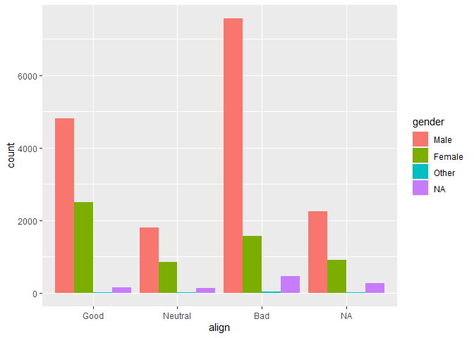
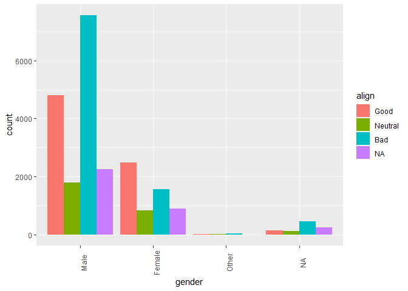
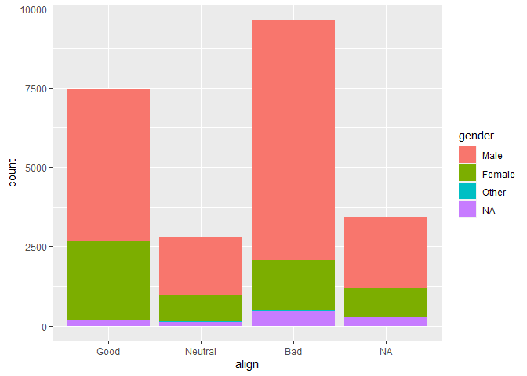
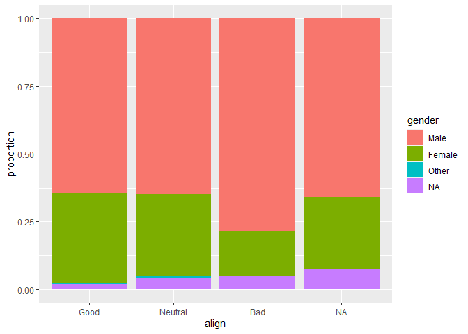
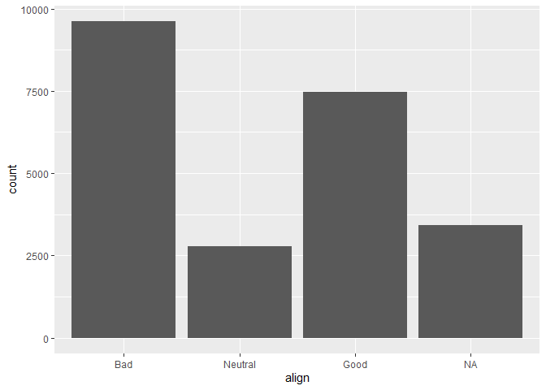
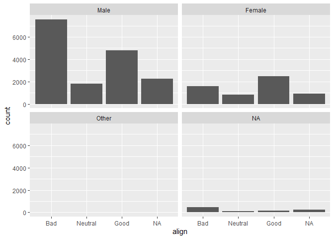
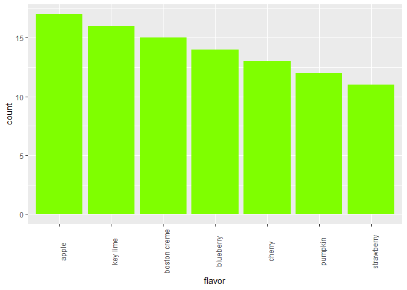

Exploring Categorical Data
================
Mohamad Osman
2022-07-08

# Section 01: **Exploring Categorical Data**

### **`01-Contingency table review`**

In this chapter you’ll continue working with the `comics` dataset
introduced in the video. This is a collection of characteristics on all
of the superheroes created by Marvel and DC comics in the last 80 years.

Let’s start by creating a contingency table, which is a useful way to
represent the total counts of observations that fall into each
combination of the levels of categorical variables.

``` r
library(readr)

url_csv <- "https://assets.datacamp.com/production/repositories/537/datasets/8860af2c0ef67fc77a8c704a73bbb93a395debcf/comics.csv"

comics <- read_csv(url_csv, col_types = "ffffffffiff")
```

``` r
# Print the comics data
head(comics,3)
```

    ## # A tibble: 3 × 11
    ##   name       id    align eye   hair  gender gsm   alive appearances first_appear
    ##   <fct>      <fct> <fct> <fct> <fct> <fct>  <fct> <fct>       <int> <fct>       
    ## 1 "Spider-M… Secr… Good  Haze… Brow… Male   NA    Livi…        4043 Aug-62      
    ## 2 "Captain … Publ… Good  Blue… Whit… Male   NA    Livi…        3360 Mar-41      
    ## 3 "Wolverin… Publ… Neut… Blue… Blac… Male   NA    Livi…        3061 Oct-74      
    ## # … with 1 more variable: publisher <fct>

``` r
# Check levels of align
levels(comics$align)
```

    ## [1] "Good"               "Neutral"            "Bad"               
    ## [4] "NA"                 "Reformed Criminals"

``` r
# Check the levels of gender
levels(comics$gender)
```

    ## [1] "Male"   "Female" "Other"  "NA"

``` r
# Create a 2-way contingency table
tab <- table(comics$align, comics$gender)
tab
```

    ##                     
    ##                      Male Female Other   NA
    ##   Good               4809   2490    17  152
    ##   Neutral            1799    836    17  121
    ##   Bad                7561   1573    32  449
    ##   NA                 2250    904     2  257
    ##   Reformed Criminals    2      1     0    0

### **`02-Dropping levels`**

The contingency table from the last exercise revealed that there are
some levels that have very low counts. To simplify the analysis, it
often helps to drop such levels.

In R, this requires two steps: first filtering out any rows with the
levels that have very low counts, then removing these levels from the
factor variable with `droplevels()`. This is because the `droplevels()`
function would keep levels that have just 1 or 2 counts; it only drops
levels that don’t exist in a dataset.

The contingency table from the last exercise is available in your
workspace as `tab`

-   Load the `dplyr` package.

-   Print `tab` to find out which level of `align` has the fewest total
    entries.

-   Use `filter()` to filter out all rows of `comics` with that level,
    then drop the unused level with `droplevels()`. Save the simplified
    dataset as `comics_filtered`

``` r
# Load dplyr
library(dplyr)
```

    ## 
    ## Attaching package: 'dplyr'

    ## The following objects are masked from 'package:stats':
    ## 
    ##     filter, lag

    ## The following objects are masked from 'package:base':
    ## 
    ##     intersect, setdiff, setequal, union

``` r
# Print tab
print(tab)
```

    ##                     
    ##                      Male Female Other   NA
    ##   Good               4809   2490    17  152
    ##   Neutral            1799    836    17  121
    ##   Bad                7561   1573    32  449
    ##   NA                 2250    904     2  257
    ##   Reformed Criminals    2      1     0    0

``` r
# Remove align level
comics_filtered <- comics %>%
  filter(align != "Reformed Criminals") %>%
  droplevels()

# See the result
head(comics_filtered)
```

    ## # A tibble: 6 × 11
    ##   name       id    align eye   hair  gender gsm   alive appearances first_appear
    ##   <fct>      <fct> <fct> <fct> <fct> <fct>  <fct> <fct>       <int> <fct>       
    ## 1 "Spider-M… Secr… Good  Haze… Brow… Male   NA    Livi…        4043 Aug-62      
    ## 2 "Captain … Publ… Good  Blue… Whit… Male   NA    Livi…        3360 Mar-41      
    ## 3 "Wolverin… Publ… Neut… Blue… Blac… Male   NA    Livi…        3061 Oct-74      
    ## 4 "Iron Man… Publ… Good  Blue… Blac… Male   NA    Livi…        2961 Mar-63      
    ## 5 "Thor (Th… No D… Good  Blue… Blon… Male   NA    Livi…        2258 Nov-50      
    ## 6 "Benjamin… Publ… Good  Blue… No H… Male   NA    Livi…        2255 Nov-61      
    ## # … with 1 more variable: publisher <fct>

``` r
comics <- comics_filtered 
```

### **`03-Side-by-side bar charts`**

While a contingency table represents the counts numerically, it’s often
more useful to represent them graphically.

Here you’ll construct two side-by-side bar charts of the `comics` data.
This shows that there can often be two or more options for presenting
the same data. Passing the argument `position = "dodge"` to `geom_bar()`
says that you want a side-by-side (i.e. not stacked) bar chart.

-   Load the `ggplot2` package.

-   Create a side-by-side bar chart with `align` on the x-axis and
    `gender` as the `fill` aesthetic.

-   Create another side-by-side bar chart with `gender` on the x-axis
    and `align` as the `fill` aesthetic. Rotate the axis labels 90
    degrees to help readability.

``` r
# Load ggplot2
library(ggplot2)

# Create side-by-side bar chart of gender by alignment
ggplot(comics, aes(x = align, fill = gender)) + 
  geom_bar(position = "dodge")
```

<!-- -->

``` r
# Create side-by-side bar chart of alignment by gender
ggplot(comics, aes(x = gender, fill = align)) + 
  geom_bar(position = "dodge") +
  theme(axis.text.x = element_text(angle = 90))
```

<!-- -->

### **`04-Conditional proportions`**

The following code generates tables of joint and conditional
proportions, respectively:

``` r
tab <- table(comics$align, comics$gender)
options(scipen = 999, digits = 3) # Print fewer digits
prop.table(tab)     # Joint proportions
```

    ##          
    ##               Male   Female    Other       NA
    ##   Good    0.206670 0.107009 0.000731 0.006532
    ##   Neutral 0.077313 0.035928 0.000731 0.005200
    ##   Bad     0.324939 0.067601 0.001375 0.019296
    ##   NA      0.096695 0.038850 0.000086 0.011045

``` r
prop.table(tab, 1)  # Conditional on rows
```

    ##          
    ##               Male   Female    Other       NA
    ##   Good    0.643948 0.333423 0.002276 0.020354
    ##   Neutral 0.648756 0.301479 0.006131 0.043635
    ##   Bad     0.786375 0.163599 0.003328 0.046698
    ##   NA      0.659244 0.264870 0.000586 0.075300

``` r
prop.table(tab, 2)  # Conditional on columns
```

    ##          
    ##             Male Female  Other     NA
    ##   Good    0.2929 0.4291 0.2500 0.1553
    ##   Neutral 0.1096 0.1441 0.2500 0.1236
    ##   Bad     0.4605 0.2711 0.4706 0.4586
    ##   NA      0.1370 0.1558 0.0294 0.2625

Go ahead and run it in the console. Approximately what proportion of all
female characters are good?

Ans. 0.29 -\> 29%

### **`05-Counts vs. proportions (2)`**

Bar charts can tell dramatically different stories depending on whether
they represent counts or proportions and, if proportions, what the
proportions are conditioned on. To demonstrate this difference, you’ll
construct two bar charts in this exercise: one of counts and one of
proportions.

-   Create a stacked bar chart of `gender` *counts* with `align` on the
    x-axis.

-   Create a stacked bar chart of `gender` *proportions* with `align` on
    the x-axis by setting the `position` argument to `geom_bar()` equal
    to `"fill"`.

``` r
# Plot of gender by align
ggplot(comics, aes(x = align, fill = gender)) +
  geom_bar()
```

<!-- -->

``` r
# Plot proportion of gender, conditional on align
ggplot(comics, aes(x = align, fill = gender)) + 
  geom_bar(position = "fill") +
  ylab("proportion")
```

<!-- -->

### `06-Marginal bar chart`

If you are interested in the distribution of alignment of *all*
superheroes, it makes sense to construct a bar chart for just that
single variable.

You can improve the interpretability of the plot, though, by
implementing some sensible ordering. Superheroes that are `"Neutral"`
show an alignment between `"Good"` and `"Bad"`, so it makes sense to put
that bar in the middle.

-   Reorder the levels of `align` using the
    [**`factor()`**](https://www.rdocumentation.org/packages/base/topics/factor)
    function so that printing them reads `"Bad"`, `"Neutral"`, then
    `"Good"`.

-   Create a bar chart of counts of the `align` variable.

``` r
# Change the order of the levels in align
comics$align <- factor(comics$align, 
                       levels = c("Bad", "Neutral", "Good"))

# Create plot of align
ggplot(comics, aes(x = align)) + 
  geom_bar()
```

<!-- -->

### **`07-Conditional bar chart`**

Now, if you want to break down the distribution of alignment based on
gender, you’re looking for conditional distributions.

You could make these by creating multiple filtered datasets (one for
each gender) or by faceting the plot of alignment based on gender. As a
point of comparison, we’ve provided your plot of the marginal
distribution of alignment from the last exercise.

Create a bar chart of `align` faceted by `gender`.

``` r
# Plot of alignment broken down by gender
ggplot(comics, aes(x = align)) + 
  geom_bar() +
  facet_wrap(~ gender)
```

<!-- -->

### `08-Improve pie chart`

The pie chart is a very common way to represent the distribution of a
single categorical variable, but they can be more difficult to interpret
than bar charts.

This is a pie chart of a dataset called `pies` that contains the
favorite pie flavors of 98 people. Improve the representation of these
data by constructing a *bar chart* that is ordered in descending order
of count.

``` r
pies_path <- file.path("..", "00_Datasets", "flavor.txt")
pies <- read.delim(pies_path)
head(pies)
```

    ##   flavor
    ## 1 cherry
    ## 2 cherry
    ## 3 cherry
    ## 4 cherry
    ## 5 cherry
    ## 6 cherry

-   Use the code provided to reorder the levels of `flavor` so that
    they’re in descending order by count.

-   Create a bar chart of `flavor` and orient the labels vertically so
    that they’re easier to read. The default coloring may look drab by
    comparison, so change the `fill` of the bars to `"chartreuse"`.

``` r
# Put levels of flavor in descending order
lev <- c("apple", "key lime", "boston creme", "blueberry", "cherry", "pumpkin", "strawberry")
pies$flavor <- factor(pies$flavor, levels = lev)

# Create bar chart of flavor
ggplot(pies, aes(x = flavor)) + 
  geom_bar(fill = "chartreuse") + 
  theme(axis.text.x = element_text(angle = 90))
```

<!-- -->

### 

`The End`
