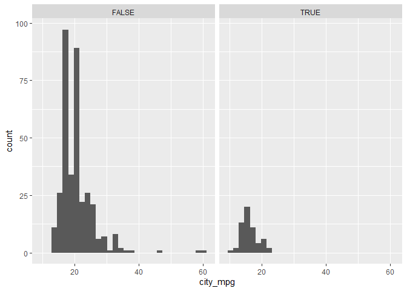
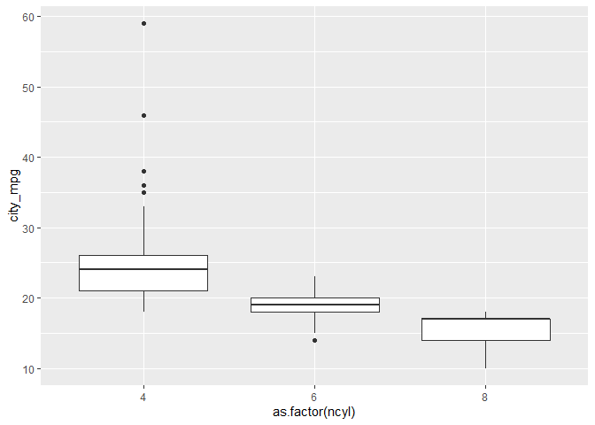
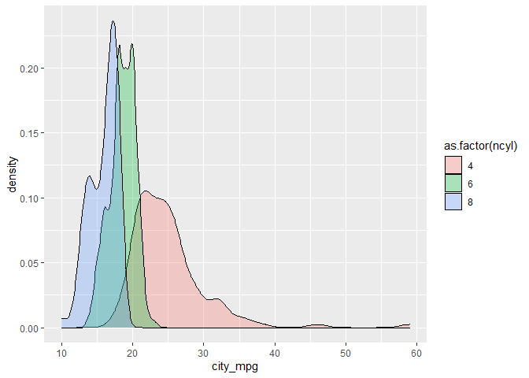
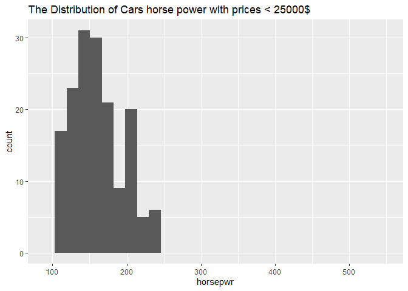
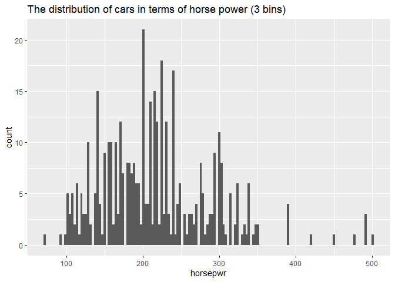
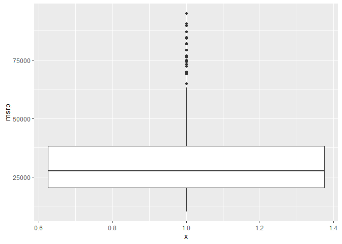
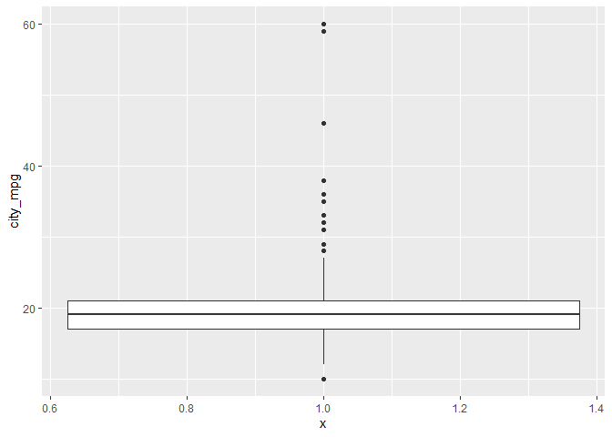
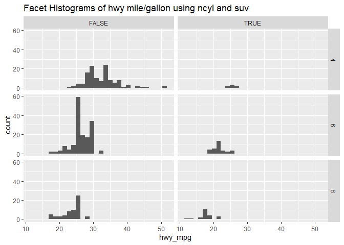

Exploring Numerical Data
================
Mohamad Osman
2022-07-09

# **`Section 02: Exploring Numerical Data`**

### **`01-Faceted histogram`**

In this chapter, you’ll be working with the `cars` dataset, which
records characteristics on all of the new models of cars for sale in the
US in a certain year. You will investigate the distribution of mileage
across a categorical variable, but before you get there, you’ll want to
familiarize yourself with the dataset.

The `cars` dataset has been loaded in your workspace.

``` r
library(readr)
library(dplyr)
```

    ## 
    ## Attaching package: 'dplyr'

    ## The following objects are masked from 'package:stats':
    ## 
    ##     filter, lag

    ## The following objects are masked from 'package:base':
    ## 
    ##     intersect, setdiff, setequal, union

``` r
url_csv <- "https://assets.datacamp.com/production/repositories/537/datasets/c0366d5da5ee8dce49919a5443685cf2e50c6a96/cars04.csv"

cars <- read_csv(url_csv)
```

    ## Rows: 428 Columns: 19

    ## ── Column specification ────────────────────────────────────────────────────────
    ## Delimiter: ","
    ## chr  (1): name
    ## dbl (11): msrp, dealer_cost, eng_size, ncyl, horsepwr, city_mpg, hwy_mpg, we...
    ## lgl  (7): sports_car, suv, wagon, minivan, pickup, all_wheel, rear_wheel
    ## 
    ## ℹ Use `spec()` to retrieve the full column specification for this data.
    ## ℹ Specify the column types or set `show_col_types = FALSE` to quiet this message.

``` r
head(cars,3)
```

    ## # A tibble: 3 × 19
    ##   name          sports_car suv   wagon minivan pickup all_wheel rear_wheel  msrp
    ##   <chr>         <lgl>      <lgl> <lgl> <lgl>   <lgl>  <lgl>     <lgl>      <dbl>
    ## 1 Chevrolet Av… FALSE      FALSE FALSE FALSE   FALSE  FALSE     FALSE      11690
    ## 2 Chevrolet Av… FALSE      FALSE FALSE FALSE   FALSE  FALSE     FALSE      12585
    ## 3 Chevrolet Ca… FALSE      FALSE FALSE FALSE   FALSE  FALSE     FALSE      14610
    ## # … with 10 more variables: dealer_cost <dbl>, eng_size <dbl>, ncyl <dbl>,
    ## #   horsepwr <dbl>, city_mpg <dbl>, hwy_mpg <dbl>, weight <dbl>,
    ## #   wheel_base <dbl>, length <dbl>, width <dbl>

-   Load the `ggplot2` package.

-   View the size of the data and the variable types using `str()`.

-   Plot a histogram of `city_mpg` faceted by `suv`, a logical variable
    indicating whether the car is an SUV or not.

``` r
# Load package
library(ggplot2)

# Learn data structure
str(cars)
```

    ## spec_tbl_df [428 × 19] (S3: spec_tbl_df/tbl_df/tbl/data.frame)
    ##  $ name       : chr [1:428] "Chevrolet Aveo 4dr" "Chevrolet Aveo LS 4dr hatch" "Chevrolet Cavalier 2dr" "Chevrolet Cavalier 4dr" ...
    ##  $ sports_car : logi [1:428] FALSE FALSE FALSE FALSE FALSE FALSE ...
    ##  $ suv        : logi [1:428] FALSE FALSE FALSE FALSE FALSE FALSE ...
    ##  $ wagon      : logi [1:428] FALSE FALSE FALSE FALSE FALSE FALSE ...
    ##  $ minivan    : logi [1:428] FALSE FALSE FALSE FALSE FALSE FALSE ...
    ##  $ pickup     : logi [1:428] FALSE FALSE FALSE FALSE FALSE FALSE ...
    ##  $ all_wheel  : logi [1:428] FALSE FALSE FALSE FALSE FALSE FALSE ...
    ##  $ rear_wheel : logi [1:428] FALSE FALSE FALSE FALSE FALSE FALSE ...
    ##  $ msrp       : num [1:428] 11690 12585 14610 14810 16385 ...
    ##  $ dealer_cost: num [1:428] 10965 11802 13697 13884 15357 ...
    ##  $ eng_size   : num [1:428] 1.6 1.6 2.2 2.2 2.2 2 2 2 2 2 ...
    ##  $ ncyl       : num [1:428] 4 4 4 4 4 4 4 4 4 4 ...
    ##  $ horsepwr   : num [1:428] 103 103 140 140 140 132 132 130 110 130 ...
    ##  $ city_mpg   : num [1:428] 28 28 26 26 26 29 29 26 27 26 ...
    ##  $ hwy_mpg    : num [1:428] 34 34 37 37 37 36 36 33 36 33 ...
    ##  $ weight     : num [1:428] 2370 2348 2617 2676 2617 ...
    ##  $ wheel_base : num [1:428] 98 98 104 104 104 105 105 103 103 103 ...
    ##  $ length     : num [1:428] 167 153 183 183 183 174 174 168 168 168 ...
    ##  $ width      : num [1:428] 66 66 69 68 69 67 67 67 67 67 ...
    ##  - attr(*, "spec")=
    ##   .. cols(
    ##   ..   name = col_character(),
    ##   ..   sports_car = col_logical(),
    ##   ..   suv = col_logical(),
    ##   ..   wagon = col_logical(),
    ##   ..   minivan = col_logical(),
    ##   ..   pickup = col_logical(),
    ##   ..   all_wheel = col_logical(),
    ##   ..   rear_wheel = col_logical(),
    ##   ..   msrp = col_double(),
    ##   ..   dealer_cost = col_double(),
    ##   ..   eng_size = col_double(),
    ##   ..   ncyl = col_double(),
    ##   ..   horsepwr = col_double(),
    ##   ..   city_mpg = col_double(),
    ##   ..   hwy_mpg = col_double(),
    ##   ..   weight = col_double(),
    ##   ..   wheel_base = col_double(),
    ##   ..   length = col_double(),
    ##   ..   width = col_double()
    ##   .. )
    ##  - attr(*, "problems")=<externalptr>

``` r
# Create faceted histogram
ggplot(cars, aes(x = city_mpg)) +
  geom_histogram() +
  facet_wrap(~ suv)
```

    ## `stat_bin()` using `bins = 30`. Pick better value with `binwidth`.

    ## Warning: Removed 14 rows containing non-finite values (stat_bin).

<!-- -->

### **`02-Boxplots and density plots`**

The mileage of a car tends to be associated with the size of its engine
(as measured by the number of cylinders). To explore the relationship
between these two variables, you could stick to using histograms, but in
this exercise you’ll try your hand at two alternatives: the box plot and
the density plot.

A quick look at `unique(cars$ncyl)` shows that there are more possible
levels of `ncyl` than you might think. Here, restrict your attention to
the most common levels.

-   Filter `cars` to include only cars with 4, 6, or 8 cylinders and
    save the result as `common_cyl`. The `%in%` operator may prove
    useful here.

-   Create side-by-side box plots of `city_mpg` separated out by `ncyl`.

-   Create overlaid density plots of `city_mpg` colored by `ncyl`.

``` r
# Filter cars with 4, 6, 8 cylinders
common_cyl <- filter(cars, ncyl %in% c(4,6,8))

# Create box plots of city mpg by ncyl
ggplot(common_cyl, aes(x = as.factor(ncyl), y = city_mpg)) +
  geom_boxplot()
```

    ## Warning: Removed 11 rows containing non-finite values (stat_boxplot).

<!-- -->

``` r
# Create overlaid density plots for same data
ggplot(common_cyl, aes(x = city_mpg, fill = as.factor(ncyl))) +
  geom_density(alpha = .3)
```

    ## Warning: Removed 11 rows containing non-finite values (stat_density).

<!-- -->

-   The highest mileage cars have 4 cylinders.

-   The typical 4 cylinder car gets better mileage than the typical 6
    cylinder car, which gets better mileage than the typical 8 cylinder
    car.

-   Most of the 4 cylinder cars get better mileage than even the most
    efficient 8 cylinder cars.

### 

**`03-Marginal and conditional histograms`**

Now, turn your attention to a new variable: `horsepwr`. The goal is to
get a sense of the marginal distribution of this variable and then
compare it to the distribution of horsepower conditional on the price of
the car being less than $25,000.

You’ll be making two plots using the “data pipeline” paradigm, where you
start with the raw data and end with the plot.

-   Create a histogram of the distribution of `horsepwr` across all cars
    and add an appropriate title. Start by piping in the raw dataset.

-   Create a second histogram of the distribution of horsepower, but
    only for those cars that have an `msrp` less than $25,000. Keep the
    limits of the x-axis so that they’re similar to that of the first
    plot, and add a descriptive title.

``` r
# Create hist of horsepwr
cars %>%
  ggplot(aes(horsepwr)) +
  geom_histogram() +
  ggtitle("The Distribution of cars in terms of hores power")
```

    ## `stat_bin()` using `bins = 30`. Pick better value with `binwidth`.

<!-- -->

``` r
# Create hist of horsepwr for affordable cars
cars %>% 
  filter(msrp < 25000) %>%
  ggplot(aes(horsepwr)) +
  geom_histogram() +
  xlim(c(90, 550)) +
  ggtitle("The Distribution of Cars horse power with prices < 25000$ ")
```

    ## `stat_bin()` using `bins = 30`. Pick better value with `binwidth`.

    ## Warning: Removed 1 rows containing non-finite values (stat_bin).

    ## Warning: Removed 2 rows containing missing values (geom_bar).

<!-- -->

### **`04-Three binwidths`**

Before you take these plots for granted, it’s a good idea to see how
things change when you alter the binwidth. The binwidth determines how
smooth your distribution will appear: the smaller the binwidth, the more
jagged your distribution becomes. It’s good practice to consider several
binwidths in order to detect different types of structure in your data.

Create the following three plots, adding a title to each to indicate the
binwidth used:

-   A histogram of horsepower (i.e. `horsepwr`) with a `binwidth` of 3.

-   A second histogram of horsepower with a `binwidth` of 30.

-   A third histogram of horsepower with a `binwidth` of 60.

``` r
# Create hist of horsepwr with binwidth of 3
cars %>%
  ggplot(aes(horsepwr)) +
  geom_histogram(binwidth = 3) +
  ggtitle("The distribution of cars in terms of horse power (3 bins)")
```

<!-- -->

``` r
# Create hist of horsepwr with binwidth of 30
cars %>%
  ggplot(aes(horsepwr)) +
  geom_histogram(binwidth = 30) +
  ggtitle("The distribution of cars in terms of horse power (30 bins)")
```

<!-- -->

``` r
# Create hist of horsepwr with binwidth of 60
cars %>%
  ggplot(aes(horsepwr)) +
  geom_histogram(binwidth = 60) +
  ggtitle("The distribution of cars in terms of horse power (60 bins)")
```

<!-- -->

### **`05-Three binwidths interpretation`**

What feature is present in Plot A that’s not found in B or C?

-   There is a tendency for cars to have horsepower right at 200 or 300
    horsepower.

### **`06-Box plots for outliers`**

In addition to indicating the center and spread of a distribution, a box
plot provides a graphical means to detect outliers. You can apply this
method to the `msrp` column (manufacturer’s suggested retail price) to
detect if there are unusually expensive or cheap cars.

-   Construct a box plot of `msrp`.

-   Exclude the largest 3-5 outliers by filtering the rows to retain
    cars less than $100,000. Save this reduced dataset as `cars_no_out`.

-   Construct a similar box plot of `msrp` using this reduced dataset.
    Compare the two plots.

``` r
# Construct box plot of msrp
cars %>%
  ggplot(aes(x = 1, y = msrp)) +
  geom_boxplot()
```

<!-- -->

``` r
# Exclude outliers from data
cars_no_out <- cars %>%
  filter(msrp < 100000)

# Construct box plot of msrp using the reduced dataset
cars_no_out %>%
  ggplot(aes(x = 1, y = msrp)) +
  geom_boxplot()
```

<!-- -->

### **`07-Plot selection`**

Consider two other columns in the `cars` dataset: `city_mpg` and
`width`. Which is the most appropriate plot for displaying the important
features of their distributions? Remember, both density plots and box
plots display the central tendency and spread of the data, but the box
plot is more robust to outliers.

Use density plots or box plots to construct the following
visualizations. For each variable, try both plots and submit the one
that is better at capturing the important structure.

-   Display the distribution of `city_mpg`.

-   Display the distribution of `width`.

``` r
# Create plot of city_mpg
cars %>%
  ggplot(aes(x = 1, y = city_mpg)) +
  geom_boxplot()
```

    ## Warning: Removed 14 rows containing non-finite values (stat_boxplot).

<!-- -->

``` r
# Create plot of width
cars %>% 
  ggplot(aes(x = width)) +
  geom_density()
```

    ## Warning: Removed 28 rows containing non-finite values (stat_density).

<!-- -->

### **`08-3 variable plot`**

Faceting is a valuable technique for looking at several conditional
distributions at the same time. If the faceted distributions are laid
out in a grid, you can consider the association between a variable and
two others, one on the rows of the grid and the other on the columns.

``` r
# Facet hists using hwy mileage and ncyl
common_cyl %>%
  ggplot(aes(x = hwy_mpg)) +
  geom_histogram() +
  facet_grid(ncyl ~ suv) +
  ggtitle("Facet Histograms of hwy mile/gallon using ncyl and suv")
```

    ## `stat_bin()` using `bins = 30`. Pick better value with `binwidth`.

    ## Warning: Removed 11 rows containing non-finite values (stat_bin).

<!-- -->

-   Across both SUVs and non-SUVs, mileage tends to decrease as the
    number of cylinders increases.

### **`The End`**
