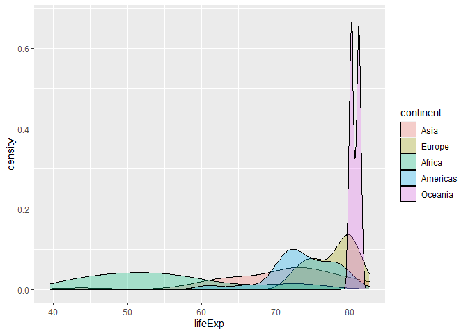

Numerical Summaries
================
Mohamad Osman
2022-07-10

# Section 03: Numerical Summaries

### **`01-Calculate center measures`**

Throughout this chapter, you will use data from `gapminder`, which
tracks demographic data in countries of the world over time. To learn
more about it, you can bring up the help file with `?gapminder`.

For this exercise, focus on how the life expectancy differs from
continent to continent. This requires that you conduct your analysis not
at the country level, but aggregated up to the continent level. This is
made possible by the one-two punch of `group_by()` and `summarize()`, a
very powerful syntax for carrying out the same analysis on different
subsets of the full dataset.

``` r
library(readr)
library(dplyr)
```

    ## 
    ## Attaching package: 'dplyr'

    ## The following objects are masked from 'package:stats':
    ## 
    ##     filter, lag

    ## The following objects are masked from 'package:base':
    ## 
    ##     intersect, setdiff, setequal, union

``` r
library(ggplot2)
```

``` r
gapminder_path <- file.path("..", "00_Datasets", "gapminder.txt")
gapminder <- read_delim(gapminder_path, col_types = c("ffidid"))
head(gapminder,3)
```

    ## # A tibble: 3 × 6
    ##   country     continent  year lifeExp      pop gdpPercap
    ##   <fct>       <fct>     <int>   <dbl>    <int>     <dbl>
    ## 1 Afghanistan Asia       1952    28.8  8425333       779
    ## 2 Afghanistan Asia       1957    30.3  9240934       821
    ## 3 Afghanistan Asia       1962    32   10267083       853

-   Create a dataset called `gap2007` that contains only data from the
    year 2007.

-   Using `gap2007`, calculate the mean and median life expectancy for
    each continent. Don’t worry about naming the new columns produced by
    `summarize()`.

Confirm the trends that you see in the medians by generating
side-by-side box plots of life expectancy for each continent.

``` r
# Create dataset of 2007 data
gap2007 <- filter(gapminder, year == 2007)

# Compute groupwise mean and median lifeExp
gap2007 %>%
  group_by(continent) %>%
  summarize(mean(lifeExp),
            median(lifeExp))
```

    ## # A tibble: 5 × 3
    ##   continent `mean(lifeExp)` `median(lifeExp)`
    ##   <fct>               <dbl>             <dbl>
    ## 1 Asia                 70.7              72.4
    ## 2 Europe               77.6              78.6
    ## 3 Africa               54.8              52.9
    ## 4 Americas             73.6              72.9
    ## 5 Oceania              80.7              80.7

``` r
# Generate box plots of lifeExp for each continent
gap2007 %>%
  ggplot(aes(x = continent, y = lifeExp)) +
  geom_boxplot()
```

<!-- -->

### **`02-Calculate spread measures`**

The `gap2007` dataset that you created in an earlier exercise is
available in your workspace.

-   For each continent in `gap2007`, summarize life expectancies using
    the `sd()`, the `IQR()`, and the count of countries, `n()`. No need
    to name the new columns produced here. The `n()` function within
    your `summarize()` call does not take any arguments.

-   Graphically compare the spread of these distributions by
    constructing overlaid density plots of life expectancy broken down
    by continent.

``` r
gap2007 <- filter(gapminder, year == 2007)


# Compute groupwise measures of spread
gap2007 %>%
  group_by(continent) %>%
  summarize(sd(lifeExp),
            IQR(lifeExp),
            n())
```

    ## # A tibble: 5 × 4
    ##   continent `sd(lifeExp)` `IQR(lifeExp)` `n()`
    ##   <fct>             <dbl>          <dbl> <int>
    ## 1 Asia              7.96           10.1     33
    ## 2 Europe            2.98            4.72    30
    ## 3 Africa            9.63           11.5     52
    ## 4 Americas          4.44            4.60    25
    ## 5 Oceania           0.707           0.5      2

``` r
# Generate overlaid density plots
gap2007 %>%
  ggplot(aes(x = lifeExp, fill = continent)) +
  geom_density(alpha = 0.3)
```

<!-- -->

### 

### **`03-Choose measures for center and spread`**

Using the shapes of the density plots, calculate the most appropriate
measures of center and spread for the following:

-   The distribution of life expectancy in the countries of the
    Americas. Note you’ll need to apply a filter here.

-   The distribution of country *populations* across the entire
    `gap2007` dataset.

``` r
# Compute stats for lifeExp in Americas
gap2007 %>%
  filter(continent == "Americas") %>%
  summarize(mean(lifeExp),
            sd(lifeExp))
```

    ## # A tibble: 1 × 2
    ##   `mean(lifeExp)` `sd(lifeExp)`
    ##             <dbl>         <dbl>
    ## 1            73.6          4.44

``` r
# Compute stats for population
gap2007 %>%
  summarize(median(pop),
            IQR(pop))
```

    ## # A tibble: 1 × 2
    ##   `median(pop)` `IQR(pop)`
    ##           <dbl>      <dbl>
    ## 1      10517531  26702008.

### **`04-Transformations`**

Highly skewed distributions can make it very difficult to learn anything
from a visualization. Transformations can be helpful in revealing the
more subtle structure.

Here you’ll focus on the population variable, which exhibits strong
right skew, and transform it with the natural logarithm function
(`log()` in R).

Using the `gap2007` data:

-   Create a density plot of the population variable.

-   Mutate a new column called `log_pop` that is the natural log of the
    population and save it back into `gap2007`.

-   Create a density plot of your transformed variable.

``` r
# Create density plot of old variable
gap2007 %>%
  ggplot(aes(x = pop)) +
  geom_density()
```

<!-- -->

``` r
# Transform the skewed pop variable
gap2007 <- gap2007 %>%
  mutate(log_pop = log(pop))

# Create density plot of new variable
gap2007 %>%
  ggplot(aes(x = log_pop)) +
  geom_density()
```

<!-- -->

### 

**`05-Identify outliers`**

Consider the distribution, shown here, of the life expectancies of the
countries in Asia. The box plot identifies one clear outlier: a country
with a notably low life expectancy. Do you have a guess as to which
country this might be? Test your guess in the console using either
`min()` or `filter()`, then proceed to building a plot with that country
removed.

`gap2007` is still available in your workspace.

-   Apply a filter so that it only contains observations from Asia, then
    create a new variable called `is_outlier` that is `TRUE` for
    countries with life expectancy less than 50. Assign the result to
    `gap_asia`.

-   Filter `gap_asia` to remove all outliers, then create another box
    plot of the remaining life expectancies.

``` r
# Filter for Asia, add column indicating outliers
gap_asia <- gap2007 %>%
  filter(continent == "Asia") %>%
  mutate(is_outlier = lifeExp < 50)

# Remove outliers, create box plot of lifeExp
gap_asia %>%
  filter(!is_outlier) %>%
  ggplot(aes(x = 1, y = lifeExp)) +
  geom_boxplot()
```

<!-- -->

### `The End`

  

  
