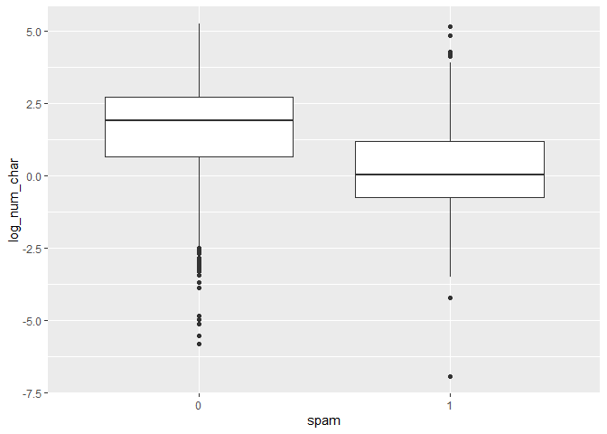
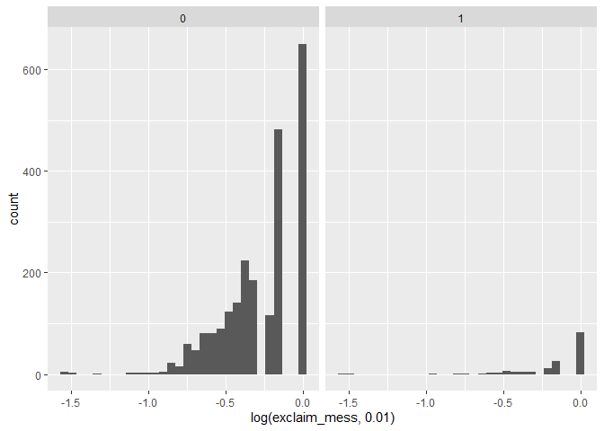
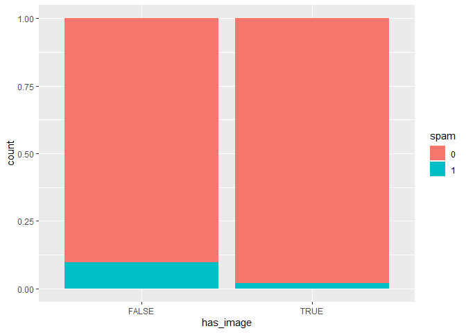
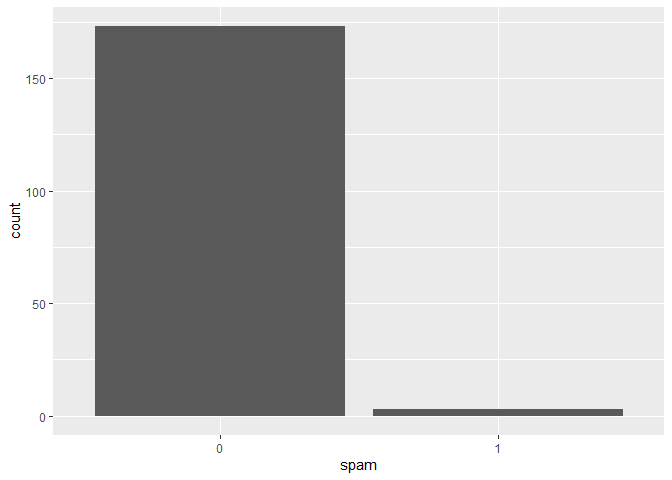
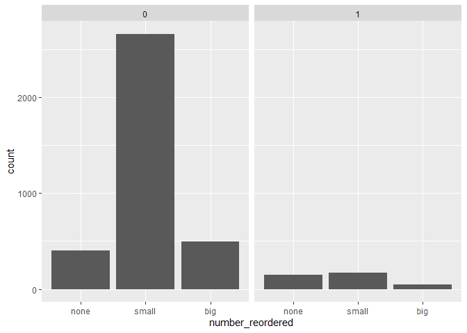

Case Study
================
Mohamad Osman
2022-07-10

# **`Section 04: Case Study`**

### **`01-Spam and num_char`**

Is there an association between spam and the length of an email? You
could imagine a story either way:

-   *Spam is more likely to be a short message tempting me to click on a
    link*, or

-   *My normal email is likely shorter since I exchange brief emails
    with my friends all the time*.

Here, you’ll use the `email` dataset to settle that question. Begin by
bringing up the help file and learning about all the variables with
`?email`.

As you explore the association between spam and the length of an email,
use this opportunity to try out linking a `dplyr` chain with the layers
in a `ggplot2` object

Using the `email` dataset

-   Load the packages `ggplot2`, `dplyr`, and `openintro`.

-   Compute appropriate measures of the center and spread of `num_char`
    for both spam and not-spam using `group_by()` and `summarize()`. No
    need to name the new columns created by `summarize()`.

-   Construct side-by-side box plots to visualize the association
    between the same two variables. It will be useful to `mutate()` a
    new column containing a log-transformed version of `num_char`.

``` r
# Load packages
library(dplyr)
```

    ## 
    ## Attaching package: 'dplyr'

    ## The following objects are masked from 'package:stats':
    ## 
    ##     filter, lag

    ## The following objects are masked from 'package:base':
    ## 
    ##     intersect, setdiff, setequal, union

``` r
library(ggplot2)
library(openintro)
```

    ## Warning: package 'openintro' was built under R version 4.2.1

    ## Loading required package: airports

    ## Warning: package 'airports' was built under R version 4.2.1

    ## Loading required package: cherryblossom

    ## Warning: package 'cherryblossom' was built under R version 4.2.1

    ## Loading required package: usdata

    ## Warning: package 'usdata' was built under R version 4.2.1

``` r
# Compute summary statistics
email %>%
  group_by(spam) %>%
  summarize(median(num_char),
            IQR(num_char))
```

    ## # A tibble: 2 × 3
    ##   spam  `median(num_char)` `IQR(num_char)`
    ##   <fct>              <dbl>           <dbl>
    ## 1 0                   6.83           13.6 
    ## 2 1                   1.05            2.82

``` r
# Create plot
email %>%
  mutate(log_num_char = log(num_char)) %>%
  ggplot(aes(x = spam, y = log_num_char)) +
  geom_boxplot()
```

<!-- -->

### **`02-Spam and !!!`**

Let’s look at a more obvious indicator of spam: exclamation marks.
`exclaim_mess` contains the number of exclamation marks in each message.
Using summary statistics and visualization, see if there is a
relationship between this variable and whether or not a message is spam.

Experiment with different types of plots until you find one that is the
most informative. Recall that you’ve seen:

-   Side-by-side box plots

-   Faceted histograms

-   Overlaid density plots

The `email` dataset is still available in your workspace.

-   Calculate appropriate measures of the center and spread of
    `exclaim_mess` for both spam and not-spam using `group_by()` and
    `summarize()`.

-   Construct an appropriate plot to visualize the association between
    the same two variables, adding in a log-transformation step if
    necessary.

-   If you decide to use a log transformation, remember that `log(0)` is
    `-Inf` in R, which isn’t a very useful value! You can get around
    this by adding a small number (like `0.01`) to the quantity inside
    the `log()` function. This way, your value is never zero. This small
    shift to the right won’t affect your results.

``` r
# Compute center and spread for exclaim_mess by spam
email %>%
    group_by(spam) %>%
    summarise(IQR(exclaim_mess),
              median(exclaim_mess))
```

    ## # A tibble: 2 × 3
    ##   spam  `IQR(exclaim_mess)` `median(exclaim_mess)`
    ##   <fct>               <dbl>                  <dbl>
    ## 1 0                       5                      1
    ## 2 1                       1                      0

``` r
# Create plot for spam and exclaim_mess
email %>% 
    group_by(spam )%>%
    ggplot(aes(x = log(exclaim_mess, 0.01))) +
    geom_histogram() + 
    facet_wrap(~ spam)
```

    ## `stat_bin()` using `bins = 30`. Pick better value with `binwidth`.

    ## Warning: Removed 1435 rows containing non-finite values (stat_bin).

<!-- -->

### **`03-Collapsing levels`**

If it was difficult to work with the heavy skew of `exclaim_mess`, the
number of images attached to each email (`image`) poses even more of a
challenge. Run the following code at the console to get a sense of its
distribution:

    table(email$image)

Recall that this tabulates the number of cases in each category (so
there were 3811 emails with 0 images, for example). Given the very low
counts at the higher number of images, let’s collapse `image` into a
categorical variable that indicates whether or not the email had at
least one image. In this exercise, you’ll create this new variable and
explore its association with spam.

Starting with `email`, form a continuous chain that links together the
following tasks:

-   Create a new variable called `has_image` that is `TRUE` where the
    number of images is greater than zero and `FALSE` otherwise.

-   Create an appropriate plot with `email` to visualize the
    relationship between `has_image` and `spam`.

``` r
# Create plot of proportion of spam by image
email %>%
  mutate(has_image = image > 0) %>%
  ggplot(aes(x = has_image, fill = spam)) +
  geom_bar(position = "fill")
```

<!-- -->

### **`04-Data Integrity`**

In the process of exploring a dataset, you’ll sometimes come across
something that will lead you to question how the data were compiled. For
example, the variable `num_char` contains the number of characters in
the email, in thousands, so it could take decimal values, but it
certainly shouldn’t take negative values.

You can formulate a test to ensure this variable is behaving as we
expect:

    email$num_char < 0

If you run this code at the console, you’ll get a long vector of logical
values indicating for each case in the dataset whether that condition is
`TRUE`. Here, the first 1000 values all appear to be `FALSE`. To verify
that *all* of the cases indeed have non-negative values for `num_char`,
we can take the *sum* of this vector:

    sum(email$num_char < 0)

This is a handy shortcut. When you do arithmetic on logical values, R
treats `TRUE` as `1` and `FALSE` as `0`. Since the sum over the whole
vector is zero, you learn that every case in the dataset took a value of
`FALSE` in the test. That is, the `num_char` column is behaving as we
expect and taking only non-negative values.

Consider the variables `image` and `attach`. You can read about them
with `?email`, but the help file is ambiguous: do attached images count
as attached files in this dataset?

Design a simple test to determine if images count as attached files.
This involves creating a logical condition to compare the values of the
two variables, then using `sum()` to assess every case in the dataset.
Recall that the logical operators are `<` for *less than*, `<=` for
*less than or equal to*, `>` for *greater than*, `>=` for *greater than
or equal to*, and `==` for *equal to*.

``` r
# Test if images count as attachments
sum(email$image > email$attach)
```

    ## [1] 0

### **`05-Answering questions with chains`**

When you have a specific question about a dataset, you can find your way
to an answer by carefully constructing the appropriate chain of R code.
For example, consider the following question: “Within non-spam emails,
is the typical length of emails shorter for those that were sent to
multiple people?”

This can be answered with the following chain:

    email %>%
       filter(spam == "not-spam") %>%
       group_by(to_multiple) %>%
       summarize(median(num_char))

The code makes it clear that you are using `num_char` to measure the
length of an email and `median()` as the measure of what is typical. If
you run this code, you’ll learn that the answer to the question is
“yes”: the typical length of non-spam sent to multiple people is a bit
lower than those sent to only one person.

This chain concluded with summary statistics, but others might end in a
plot; it all depends on the question that you’re trying to answer.

Build a chain to answer each of the following questions, both about the
variable `dollar`.

-   For emails containing the word “dollar”, does the typical spam email
    contain a greater number of occurrences of the word than the typical
    non-spam email? Create a summary statistic that answers this
    question.

-   If you encounter an email with greater than 10 occurrences of the
    word `dollar`, is it more likely to be spam or not-spam? Create a
    bar chart that answers this question.

``` r
# Question 1
email %>%
  filter(dollar > 0) %>%
  group_by(spam) %>%
  summarize(median(dollar))
```

    ## # A tibble: 2 × 2
    ##   spam  `median(dollar)`
    ##   <fct>            <dbl>
    ## 1 0                    4
    ## 2 1                    2

``` r
# Question 2
email %>%
  filter(dollar > 10) %>%
  ggplot(aes(x = spam)) +
  geom_bar()
```

<!-- -->

### `06-What's in a number?`

Turn your attention to the variable called `number`. Read more about it
by pulling up the help file with `?email`.

To explore the association between this variable and `spam`, select and
construct an informative plot. For illustrating relationships between
categorical variables, you’ve seen

-   Faceted bar charts

-   Side-by-side bar charts

-   Stacked and normalized bar charts.

Let’s practice constructing a faceted bar chart.

-   Reorder the levels of `number` so that they preserve the natural
    ordering of `"none"`, then `"small"`, then `"big"`, saving to a
    `number_reordered` column.

-   Construct a faceted bar chart of the association between `number`
    and `spam`

``` r
# Reorder levels
email$number_reordered <- factor(email$number, 
                                levels = c("none", "small", "big"))

# Construct plot of number_reordered
ggplot(email, aes(x = number_reordered)) +
  geom_bar() +
  facet_wrap(~ spam)
```

<!-- -->

  
