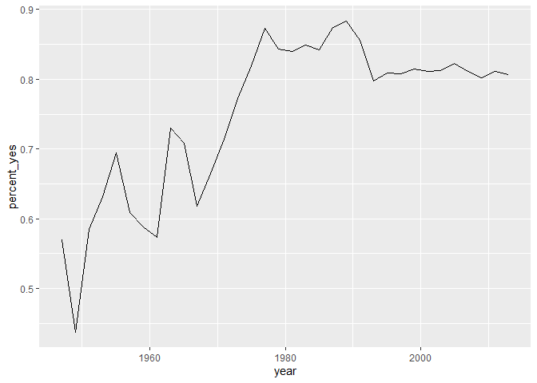
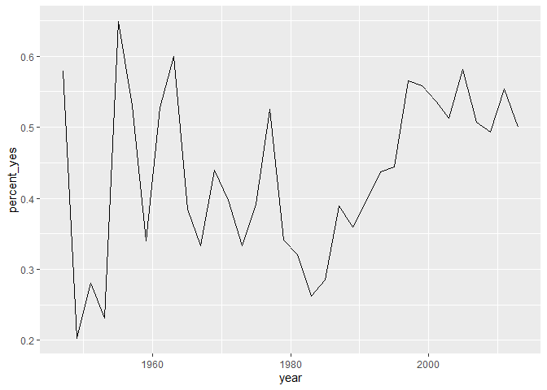
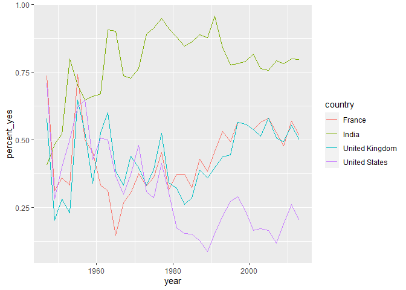
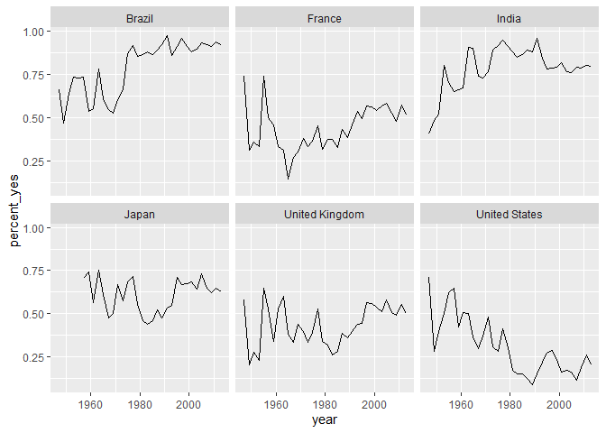
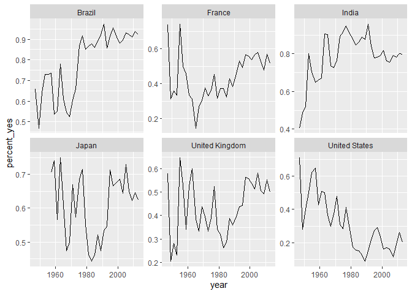

Data visualization with ggplot2
================
Mohamad Osman
2022-07-14

# Section 02: **Data visualization with ggplot2**

### **`01-Plotting a line over time`**

In the last chapter, you learned how to `summarize()` the votes dataset
by year, particularly the percentage of votes in each year that were
“yes”.

You’ll now use the `ggplot2` package to turn your results into a
visualization of the percentage of “yes” votes over time.

``` r
library(dplyr)
```

    ## 
    ## Attaching package: 'dplyr'

    ## The following objects are masked from 'package:stats':
    ## 
    ##     filter, lag

    ## The following objects are masked from 'package:base':
    ## 
    ##     intersect, setdiff, setequal, union

``` r
library(countrycode)

votes_file <- file.path("..", "00_Datasets", "votes.rds")
votes <- readRDS(votes_file)

# Add a country column within the mutate: votes_processed
votes_processed <- votes %>%
  filter(vote <= 3) %>%
  mutate(year = session + 1945, 
         country = countrycode(ccode, "cown", "country.name"))
```

    ## Warning in countrycode_convert(sourcevar = sourcevar, origin = origin, destination = dest, : Some values were not matched unambiguously: 260

The `by_year` dataset has the number of votes and percentage of “yes”
votes each year.

-   Load the `ggplot2` package.

-   Use `ggplot()` with the `geom_line` layer to create a line plot with
    `year` on the x-axis and `percent_yes` on the y-axis.

``` r
# Define by_year
by_year <- votes_processed %>%
  group_by(year) %>%
  summarize(total = n(),
            percent_yes = mean(vote == 1))

# Load the ggplot2 package
library(ggplot2)

# Create line plot
ggplot(by_year, aes(x = year, y = percent_yes)) +
  geom_line()
```

<!-- -->

### 

**`02-Other ggplot2 layers`**

A line plot is one way to display this data. You could also choose to
display it as a scatter plot, with each year represented as a single
point. This requires changing the *layer* (i.e. `geom_line()` to
`geom_point()`).

You can also add additional layers to your graph, such as a smoothing
curve with `geom_smooth()`.

-   Change the plot to a scatter plot and add a smoothing curve.

``` r
# Change to scatter plot and add smoothing curve
ggplot(by_year, aes(year, percent_yes)) +
  geom_point() + 
  geom_smooth()
```

    ## `geom_smooth()` using method = 'loess' and formula 'y ~ x'

<!-- -->

### `03-Summarizing by year and country`

You’re more interested in trends of voting within specific countries
than you are in the overall trend. So instead of summarizing just by
year, summarize by both year *and* country, constructing a dataset that
shows what fraction of the time each country votes “yes” in each year.

Change the code in the editor to group by both year and country rather
than just by year. Save the result as `by_year_country`.

``` r
# Group by year and country: by_year_country
by_year_country <- votes_processed %>%
  group_by(year, country) %>%
  summarize(total = n(),
            percent_yes = mean(vote == 1))
```

    ## `summarise()` has grouped output by 'year'. You can override using the
    ## `.groups` argument.

``` r
head(by_year_country)
```

    ## # A tibble: 6 × 4
    ## # Groups:   year [1]
    ##    year country     total percent_yes
    ##   <dbl> <chr>       <int>       <dbl>
    ## 1  1947 Afghanistan    34       0.382
    ## 2  1947 Argentina      38       0.579
    ## 3  1947 Australia      38       0.553
    ## 4  1947 Belarus        38       0.5  
    ## 5  1947 Belgium        38       0.605
    ## 6  1947 Bolivia        37       0.595

### **`04-Plotting just the UK over time`**

Now that you have the percentage of time that each country voted “yes”
within each year, you can plot the trend for a particular country. In
this case, you’ll look at the trend for just the United Kingdom.

This will involve using `filter()` on your data before giving it to
`ggplot2`.

-   Print the `by_year_country` dataset.

-   Create a filtered version of the dataset called `UK_by_year`.

-   Create a line plot of the percentage of “yes” votes over time for
    the United Kingdom.

``` r
# Start with by_year_country dataset
by_year_country <- votes_processed %>%
  group_by(year, country) %>%
  summarize(total = n(),
            percent_yes = mean(vote == 1))
```

    ## `summarise()` has grouped output by 'year'. You can override using the
    ## `.groups` argument.

``` r
# Print by_year_country
by_year_country
```

    ## # A tibble: 4,744 × 4
    ## # Groups:   year [34]
    ##     year country     total percent_yes
    ##    <dbl> <chr>       <int>       <dbl>
    ##  1  1947 Afghanistan    34       0.382
    ##  2  1947 Argentina      38       0.579
    ##  3  1947 Australia      38       0.553
    ##  4  1947 Belarus        38       0.5  
    ##  5  1947 Belgium        38       0.605
    ##  6  1947 Bolivia        37       0.595
    ##  7  1947 Brazil         38       0.658
    ##  8  1947 Canada         38       0.605
    ##  9  1947 Chile          38       0.658
    ## 10  1947 Colombia       35       0.543
    ## # … with 4,734 more rows

``` r
# Create a filtered version: UK_by_year
UK_by_year <- by_year_country %>%
    filter(country == "United Kingdom")

# Line plot of percent_yes over time for UK only
ggplot(UK_by_year, aes(x = year, y = percent_yes)) +
  geom_line()
```

<!-- -->

### **`05-Plotting multiple countries`**

Plotting just one country at a time is interesting, but you really want
to compare trends *between* countries. For example, suppose you want to
compare voting trends for the United States, the UK, France, and India.

You’ll have to filter to include all *four* of these countries and use
another aesthetic (not just x- and y-axes) to distinguish the countries
on the resulting visualization. Instead, you’ll use the color aesthetic
to represent different countries.

-   Show the trend for each of these countries on the same graph, using
    color to distinguish each country.

``` r
# Vector of four countries to examine
countries <- c("United States", "United Kingdom",
               "France", "India")

# Filter by_year_country: filtered_4_countries
filtered_4_countries <- by_year_country %>%
    filter(country %in% countries)

# Line plot of % yes in four countries
ggplot(filtered_4_countries, aes(x = year, y = percent_yes,
                                 color = country)) +
  geom_line()
```

<!-- -->

### **`06-Faceting the time series`**

Now you’ll take a look at six countries. While in the previous exercise
you used color to represent distinct countries, this gets a little too
crowded with six.

Instead, you will *facet*, giving each country its own sub-plot. To do
so, you add a `facet_wrap()` step after all of your layers.

-   Create a filtered version that contains these six countries called
    `filtered_6_countries`.

-   Use the filtered dataset (containing summarized data for six
    countries) to create a plot with one facet for each country.

``` r
# Vector of six countries to examine
countries <- c("United States", "United Kingdom",
               "France", "Japan", "Brazil", "India")

# Filtered by_year_country: filtered_6_countries
filtered_6_countries <- by_year_country %>%
    filter(country %in% countries)

# Line plot of % yes over time faceted by country
ggplot(filtered_6_countries, aes(x = year, y = percent_yes)) +
  geom_line() + 
  facet_wrap(~ country)
```

<!-- -->

### **`07-Faceting with free y-axis`**

In the previous plot, all six graphs had the same axis limits. This made
the changes over time hard to examine for plots with relatively little
change.

Instead, you may want to let the plot choose a different y-axis for each
facet.

Change the faceted plot so that the y-axis is freely chosen for each
facet, rather than being the same for all six.

``` r
# Vector of six countries to examine
countries <- c("United States", "United Kingdom",
               "France", "Japan", "Brazil", "India")

# Filtered by_year_country: filtered_6_countries
filtered_6_countries <- by_year_country %>%
  filter(country %in% countries)

# Line plot of % yes over time faceted by country
ggplot(filtered_6_countries, aes(year, percent_yes)) +
  geom_line() +
  facet_wrap(~ country, scales = "free_y")
```

<!-- -->

### `08-Choose your own countries`

The purpose of an exploratory data analysis is to ask questions and
answer them with data. Now it’s your turn to ask the questions.

You’ll choose some countries whose history you are interested in and add
them to the graph. If you want to look up the full list of countries,
enter `by_country$country` in the console.

-   Add *three* more countries to the `countries` vector and therefore
    to the faceted graph.

``` r
# Add three more countries to this list
countries <- c("United States", "United Kingdom",
               "France", "Japan", "Brazil", "India", 
               "Saudi Arabia", "Syrian Arab Republic",
               "Germany")

# Filtered by_year_country: filtered_countries
filtered_countries <- by_year_country %>%
  filter(country %in% countries)

# Line plot of % yes over time faceted by country
ggplot(filtered_countries, aes(year, percent_yes)) +
  geom_line() +
  facet_wrap(~ country, scales = "free_y")
```

<!-- -->

### **`The End`**

### 
