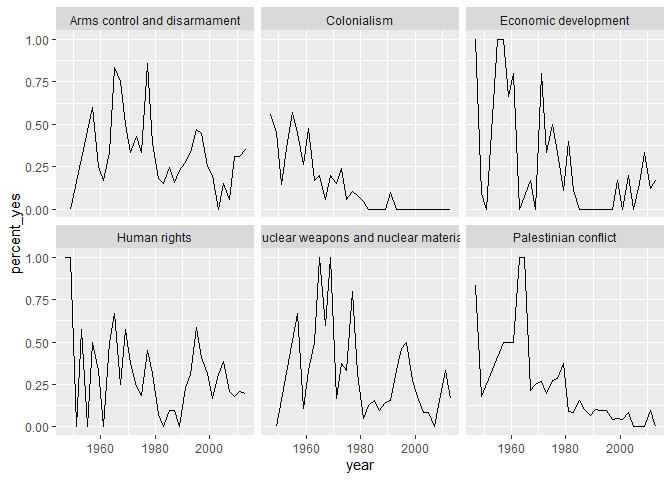

Joining and tidying
================
Mohamad Osman
2022-07-15

# Section 04: **Joining and tidying**

``` r
library(countrycode)
```

    ## Warning: package 'countrycode' was built under R version 4.2.1

``` r
library(dplyr)
```

    ## 
    ## Attaching package: 'dplyr'

    ## The following objects are masked from 'package:stats':
    ## 
    ##     filter, lag

    ## The following objects are masked from 'package:base':
    ## 
    ##     intersect, setdiff, setequal, union

``` r
description_file <- file.path("..", "00_Datasets", "descriptions.rds")
descriptions <- readRDS(description_file)

votes_file <- file.path("..", "00_Datasets", "votes.rds")
votes <- readRDS(votes_file)

# Add a country column within the mutate: votes_processed
votes_processed <- votes %>%
  filter(vote <= 3) %>%
  mutate(year = session + 1945, 
         country = countrycode(ccode, "cown", "country.name"))
```

    ## Warning in countrycode_convert(sourcevar = sourcevar, origin = origin, destination = dest, : Some values were not matched unambiguously: 260

### **`01-Joining datasets with inner_join`**

In the first chapter, you created the `votes_processed` dataset,
containing information about each country’s votes. You’ll now combine
that with the new `descriptions` dataset, which includes topic
information about each country, so that you can analyze votes within
particular topics.

To do this, you’ll make use of the `inner_join()` function from `dplyr`.

``` r
# Load dplyr package
#library(dplyr)

# Print the votes_processed dataset
votes_processed
```

    ## # A tibble: 353,547 × 6
    ##     rcid session  vote ccode  year country           
    ##    <dbl>   <dbl> <dbl> <int> <dbl> <chr>             
    ##  1    46       2     1     2  1947 United States     
    ##  2    46       2     1    20  1947 Canada            
    ##  3    46       2     1    40  1947 Cuba              
    ##  4    46       2     1    41  1947 Haiti             
    ##  5    46       2     1    42  1947 Dominican Republic
    ##  6    46       2     1    70  1947 Mexico            
    ##  7    46       2     1    90  1947 Guatemala         
    ##  8    46       2     1    91  1947 Honduras          
    ##  9    46       2     1    92  1947 El Salvador       
    ## 10    46       2     1    93  1947 Nicaragua         
    ## # … with 353,537 more rows

``` r
# Print the descriptions dataset
descriptions
```

    ## # A tibble: 2,589 × 10
    ##     rcid session date                unres      me    nu    di    hr    co    ec
    ##    <dbl>   <dbl> <dttm>              <chr>   <dbl> <dbl> <dbl> <dbl> <dbl> <dbl>
    ##  1    46       2 1947-09-04 00:00:00 R/2/299     0     0     0     0     0     0
    ##  2    47       2 1947-10-05 00:00:00 R/2/355     0     0     0     1     0     0
    ##  3    48       2 1947-10-06 00:00:00 R/2/461     0     0     0     0     0     0
    ##  4    49       2 1947-10-06 00:00:00 R/2/463     0     0     0     0     0     0
    ##  5    50       2 1947-10-06 00:00:00 R/2/465     0     0     0     0     0     0
    ##  6    51       2 1947-10-02 00:00:00 R/2/561     0     0     0     0     1     0
    ##  7    52       2 1947-11-06 00:00:00 R/2/650     0     0     0     0     1     0
    ##  8    53       2 1947-11-06 00:00:00 R/2/651     0     0     0     0     1     0
    ##  9    54       2 1947-11-06 00:00:00 R/2/651     0     0     0     0     1     0
    ## 10    55       2 1947-11-06 00:00:00 R/2/667     0     0     0     0     1     0
    ## # … with 2,579 more rows

``` r
# Join them together based on the "rcid" and "session" columns
votes_joined <- votes_processed %>%
    inner_join(descriptions, by = c("rcid", "session"))
```

### **`02-Filtering the joined dataset`**

There are six columns in the `descriptions` dataset (and therefore in
the new joined dataset) that describe the topic of a resolution:

1.  **me**: Palestinian conflict

2.  **nu**: Nuclear weapons and nuclear material

3.  **di**: Arms control and disarmament

4.  **hr**: Human rights

5.  **co**: Colonialism

6.  **ec**: Economic development

Each contains a `1` if the resolution is related to this topic and a `0`
otherwise.

-   Filter the `votes_joined` dataset for votes relating to colonialism.

``` r
# Filter for votes related to colonialism
votes_joined %>%
    filter(co >= 1)
```

    ## # A tibble: 60,962 × 14
    ##     rcid session  vote ccode  year country date                unres    me    nu
    ##    <dbl>   <dbl> <dbl> <int> <dbl> <chr>   <dttm>              <chr> <dbl> <dbl>
    ##  1    51       2     3     2  1947 United… 1947-10-02 00:00:00 R/2/…     0     0
    ##  2    51       2     3    20  1947 Canada  1947-10-02 00:00:00 R/2/…     0     0
    ##  3    51       2     2    40  1947 Cuba    1947-10-02 00:00:00 R/2/…     0     0
    ##  4    51       2     1    41  1947 Haiti   1947-10-02 00:00:00 R/2/…     0     0
    ##  5    51       2     3    42  1947 Domini… 1947-10-02 00:00:00 R/2/…     0     0
    ##  6    51       2     2    70  1947 Mexico  1947-10-02 00:00:00 R/2/…     0     0
    ##  7    51       2     2    90  1947 Guatem… 1947-10-02 00:00:00 R/2/…     0     0
    ##  8    51       2     2    92  1947 El Sal… 1947-10-02 00:00:00 R/2/…     0     0
    ##  9    51       2     3    93  1947 Nicara… 1947-10-02 00:00:00 R/2/…     0     0
    ## 10    51       2     2    95  1947 Panama  1947-10-02 00:00:00 R/2/…     0     0
    ## # … with 60,952 more rows, and 4 more variables: di <dbl>, hr <dbl>, co <dbl>,
    ## #   ec <dbl>

### **`03-Visualizing colonialism votes`**

In an earlier exercise, you graphed the percentage of votes each year
where the US voted “yes”. Now you’ll create that same graph, but only
for votes related to colonialism.

-   Load the `ggplot2` package.

-   Filter the `votes_joined` dataset for only votes by the United
    States relating to colonialism, then `summarize()` the percentage of
    votes that are “yes” within each `year`. Name the resulting column
    `percent_yes` and save the entire data frame as `US_co_by_year`.

-   Add a `geom_line()` layer to your `ggplot()` call to create a line
    graph of the percentage of “yes” votes on colonialism
    (`percent_yes`) cast by the US over time.

``` r
# Load the ggplot2 package
library(ggplot2)

# Filter, then summarize by year: US_co_by_year
US_co_by_year <- votes_joined %>%
    filter(country == "United States",
           co > 0) %>%
    group_by(year) %>%
    summarize(percent_yes = mean(vote == 1))

    
# Graph the % of "yes" votes over time
ggplot(US_co_by_year, aes(year, percent_yes)) +
  geom_line()
```

<!-- -->

### **`04-Using gather to tidy a dataset`**

In order to represent the joined vote-topic data in a tidy form so we
can analyze and graph by topic, we need to transform the data so that
each row has one combination of country-vote-topic. This will change the
data from having six columns (`me`, `nu`, `di`, `hr`, `co`, `ec`) to
having two columns (`topic` and `has_topic`).

-   Load the `tidyr` package.

-   Gather the six topic columns in `votes_joined` into one column
    called `topic` (containing one of `me`, `nu`, etc.) and a column
    called `has_topic` (containing 0 or 1). Print the result without
    saving it.

-   You don’t actually care about the cases where `has_topic` is 0.
    Perform the `gather()` operation again, but this time also filter
    for only the rows where the topic in `topic` describes the vote.
    Save the result as `votes_gathered`.

``` r
# Load the tidyr package
library(tidyr)
```

    ## Warning: package 'tidyr' was built under R version 4.2.1

``` r
# Gather the six me/nu/di/hr/co/ec columns
votes_joined %>%
    gather(topic, has_topic, me:ec) %>%
    head()
```

    ## # A tibble: 6 × 10
    ##    rcid session  vote ccode  year country        date                unres topic
    ##   <dbl>   <dbl> <dbl> <int> <dbl> <chr>          <dttm>              <chr> <chr>
    ## 1    46       2     1     2  1947 United States  1947-09-04 00:00:00 R/2/… me   
    ## 2    46       2     1    20  1947 Canada         1947-09-04 00:00:00 R/2/… me   
    ## 3    46       2     1    40  1947 Cuba           1947-09-04 00:00:00 R/2/… me   
    ## 4    46       2     1    41  1947 Haiti          1947-09-04 00:00:00 R/2/… me   
    ## 5    46       2     1    42  1947 Dominican Rep… 1947-09-04 00:00:00 R/2/… me   
    ## 6    46       2     1    70  1947 Mexico         1947-09-04 00:00:00 R/2/… me   
    ## # … with 1 more variable: has_topic <dbl>

``` r
# Perform gather again, then filter
votes_gathered <- votes_joined %>%
    gather(topic, has_topic, me:ec) %>%
    filter(has_topic == 1)

head(votes_gathered)
```

    ## # A tibble: 6 × 10
    ##    rcid session  vote ccode  year country        date                unres topic
    ##   <dbl>   <dbl> <dbl> <int> <dbl> <chr>          <dttm>              <chr> <chr>
    ## 1    77       2     1     2  1947 United States  1947-11-06 00:00:00 R/2/… me   
    ## 2    77       2     1    20  1947 Canada         1947-11-06 00:00:00 R/2/… me   
    ## 3    77       2     3    40  1947 Cuba           1947-11-06 00:00:00 R/2/… me   
    ## 4    77       2     1    41  1947 Haiti          1947-11-06 00:00:00 R/2/… me   
    ## 5    77       2     1    42  1947 Dominican Rep… 1947-11-06 00:00:00 R/2/… me   
    ## 6    77       2     2    70  1947 Mexico         1947-11-06 00:00:00 R/2/… me   
    ## # … with 1 more variable: has_topic <dbl>

### **`05-Recoding the topics`**

There’s one more step of data cleaning to make this more interpretable.
Right now, topics are represented by two-letter codes:

1.  **me**: Palestinian conflict

2.  **nu**: Nuclear weapons and nuclear material

3.  **di**: Arms control and disarmament

4.  **hr**: Human rights

5.  **co**: Colonialism

6.  **ec**: Economic development

So that you can interpret the data more easily, recode the data to
replace these codes with their full name. You can do that with `dplyr`’s
`recode()` function, which replaces values with ones you specify:

    example <- c("apple", "banana", "apple", "orange")
    recode(example,
           apple = "plum",
           banana = "grape"

-   Use the `recode()` function from `dplyr` in a `mutate()` to replace
    each two-letter code in the `votes_gathered` data frame with the
    corresponding full name. Save this as `votes_tidied`.

``` r
# Replace the two-letter codes in topic: votes_tidied
votes_tidied <- votes_gathered %>%
  mutate(topic = recode(topic,
                        me = "Palestinian conflict",
                        nu = "Nuclear weapons and nuclear material",
                        di = "Arms control and disarmament",
                        hr = "Human rights",
                        co = "Colonialism",
                        ec = "Economic development"))
```

### **`06-Summarize by country, year, and topic`**

In previous exercises, you summarized the votes dataset by country, by
year, and by country-year combination.

Now that you have `topic` as an additional variable, you can summarize
the votes for each combination of country, year, *and* topic (e.g. for
the United States in 2013 on the topic of nuclear weapons.)

-   Print the `votes_tidied` dataset to the console.

-   In a single `summarize()` call, compute both the total number of
    votes (`total`) and the percentage of “yes” votes (`percent_yes`)
    for each combination of country, year, and topic. Save this as
    `by_country_year_topic`. Make sure that you `ungroup()` after
    summarizing.

-   Print the `by_country_year_topic` dataset to the console.

``` r
# Print votes_tidied
votes_tidied
```

    ## # A tibble: 350,032 × 10
    ##     rcid session  vote ccode  year country       date                unres topic
    ##    <dbl>   <dbl> <dbl> <int> <dbl> <chr>         <dttm>              <chr> <chr>
    ##  1    77       2     1     2  1947 United States 1947-11-06 00:00:00 R/2/… Pale…
    ##  2    77       2     1    20  1947 Canada        1947-11-06 00:00:00 R/2/… Pale…
    ##  3    77       2     3    40  1947 Cuba          1947-11-06 00:00:00 R/2/… Pale…
    ##  4    77       2     1    41  1947 Haiti         1947-11-06 00:00:00 R/2/… Pale…
    ##  5    77       2     1    42  1947 Dominican Re… 1947-11-06 00:00:00 R/2/… Pale…
    ##  6    77       2     2    70  1947 Mexico        1947-11-06 00:00:00 R/2/… Pale…
    ##  7    77       2     1    90  1947 Guatemala     1947-11-06 00:00:00 R/2/… Pale…
    ##  8    77       2     2    91  1947 Honduras      1947-11-06 00:00:00 R/2/… Pale…
    ##  9    77       2     2    92  1947 El Salvador   1947-11-06 00:00:00 R/2/… Pale…
    ## 10    77       2     1    93  1947 Nicaragua     1947-11-06 00:00:00 R/2/… Pale…
    ## # … with 350,022 more rows, and 1 more variable: has_topic <dbl>

``` r
# Summarize the percentage "yes" per country-year-topic
by_country_year_topic <- votes_tidied %>%
        group_by(country, year, topic)  %>%
        summarise(total = n(),
                  percent_yes = mean(vote == 1)) %>%
        ungroup()
```

    ## `summarise()` has grouped output by 'country', 'year'. You can override using
    ## the `.groups` argument.

``` r
# Print by_country_year_topic
by_country_year_topic
```

    ## # A tibble: 26,968 × 5
    ##    country      year topic                                total percent_yes
    ##    <chr>       <dbl> <chr>                                <int>       <dbl>
    ##  1 Afghanistan  1947 Colonialism                              8       0.5  
    ##  2 Afghanistan  1947 Economic development                     1       0    
    ##  3 Afghanistan  1947 Human rights                             1       0    
    ##  4 Afghanistan  1947 Palestinian conflict                     6       0    
    ##  5 Afghanistan  1949 Arms control and disarmament             3       0    
    ##  6 Afghanistan  1949 Colonialism                             22       0.864
    ##  7 Afghanistan  1949 Economic development                     1       1    
    ##  8 Afghanistan  1949 Human rights                             3       0    
    ##  9 Afghanistan  1949 Nuclear weapons and nuclear material     3       0    
    ## 10 Afghanistan  1949 Palestinian conflict                    11       0.818
    ## # … with 26,958 more rows

### **`07-Visualizing trends in topics for one country`**

You can now visualize the trends in percentage “yes” over time for all
six topics side-by-side. Here, you’ll visualize them just for the United
States.

-   Load the `ggplot2` package.

-   Filter the `by_country_year_topic` dataset for just the United
    States and save the result as `US_by_country_year_topic`.

-   Use this dataset to graph the percentage “yes” over time for the
    United States, faceting by topic.

``` r
# Load the ggplot2 package
library(ggplot2)

# Filter by_country_year_topic for just the US
US_by_country_year_topic <- by_country_year_topic %>%
    filter(country == "United States")

# Plot % yes over time for the US, faceting by topic
ggplot(US_by_country_year_topic, aes(year, percent_yes)) +
    geom_line() +
    facet_wrap(~ topic)
```

<!-- -->

### **`08-Nesting by topic and country`**

In the last chapter, you constructed a linear model for each country by
nesting the data in each country, fitting a model to each dataset, then
tidying each model with `broom` and unnesting the coefficients. The code
looked something like this:

    country_coefficients <- by_year_country %>%
      nest(-country) %>%
      mutate(model = map(data, ~ lm(percent_yes ~ year, data = .)),
             tidied = map(model, tidy)) %>%
      unnest(tidied)

Now, you’ll again be modeling change in “percentage” yes over time, but
instead of fitting one model for each country, you’ll fit one for each
combination of country and topic.

-   Load the `purrr`, `tidyr`, and `broom` packages.

-   Print the `by_country_year_topic` dataset to the console.

-   Fit a linear model within each country and topic in this dataset,
    saving the result as `country_topic_coefficients`. You can use the
    provided code as a starting point.

-   Print the `country_topic_coefficients` dataset to the console.

``` r
# Load purrr, tidyr, and broom
library(purrr)
library(tidyr)
library(broom)

# Print by_country_year_topic
by_country_year_topic
```

    ## # A tibble: 26,968 × 5
    ##    country      year topic                                total percent_yes
    ##    <chr>       <dbl> <chr>                                <int>       <dbl>
    ##  1 Afghanistan  1947 Colonialism                              8       0.5  
    ##  2 Afghanistan  1947 Economic development                     1       0    
    ##  3 Afghanistan  1947 Human rights                             1       0    
    ##  4 Afghanistan  1947 Palestinian conflict                     6       0    
    ##  5 Afghanistan  1949 Arms control and disarmament             3       0    
    ##  6 Afghanistan  1949 Colonialism                             22       0.864
    ##  7 Afghanistan  1949 Economic development                     1       1    
    ##  8 Afghanistan  1949 Human rights                             3       0    
    ##  9 Afghanistan  1949 Nuclear weapons and nuclear material     3       0    
    ## 10 Afghanistan  1949 Palestinian conflict                    11       0.818
    ## # … with 26,958 more rows

``` r
# Fit model on the by_country_year_topic dataset
country_topic_coefficients <- by_country_year_topic %>%
        nest(-country, -topic) %>%
        mutate(model = map(data,  ~ lm(percent_yes ~ year, data = .)),
               tidied = map(model, tidy)) %>%
        unnest(tidied)
```

    ## Warning: All elements of `...` must be named.
    ## Did you want `data = c(-country, -topic)`?

    ## Warning in summary.lm(x): essentially perfect fit: summary may be unreliable

    ## Warning in summary.lm(x): essentially perfect fit: summary may be unreliable

    ## Warning in summary.lm(x): essentially perfect fit: summary may be unreliable

    ## Warning in summary.lm(x): essentially perfect fit: summary may be unreliable

    ## Warning in summary.lm(x): essentially perfect fit: summary may be unreliable

    ## Warning in summary.lm(x): essentially perfect fit: summary may be unreliable

    ## Warning in summary.lm(x): essentially perfect fit: summary may be unreliable

    ## Warning in summary.lm(x): essentially perfect fit: summary may be unreliable

    ## Warning in summary.lm(x): essentially perfect fit: summary may be unreliable

    ## Warning in summary.lm(x): essentially perfect fit: summary may be unreliable

    ## Warning in summary.lm(x): essentially perfect fit: summary may be unreliable

    ## Warning in summary.lm(x): essentially perfect fit: summary may be unreliable

    ## Warning in summary.lm(x): essentially perfect fit: summary may be unreliable

    ## Warning in summary.lm(x): essentially perfect fit: summary may be unreliable

``` r
# Print country_topic_coefficients
country_topic_coefficients
```

    ## # A tibble: 2,384 × 9
    ##    country     topic   data     model term  estimate std.error statistic p.value
    ##    <chr>       <chr>   <list>   <lis> <chr>    <dbl>     <dbl>     <dbl>   <dbl>
    ##  1 Afghanistan Coloni… <tibble> <lm>  (Int… -9.20e+0  1.96         -4.70 4.76e-5
    ##  2 Afghanistan Coloni… <tibble> <lm>  year   5.11e-3  0.000989      5.17 1.23e-5
    ##  3 Afghanistan Econom… <tibble> <lm>  (Int… -1.15e+1  3.62         -3.17 3.49e-3
    ##  4 Afghanistan Econom… <tibble> <lm>  year   6.24e-3  0.00183       3.42 1.85e-3
    ##  5 Afghanistan Human … <tibble> <lm>  (Int… -7.27e+0  4.37         -1.66 1.06e-1
    ##  6 Afghanistan Human … <tibble> <lm>  year   4.08e-3  0.00221       1.85 7.43e-2
    ##  7 Afghanistan Palest… <tibble> <lm>  (Int… -1.33e+1  3.57         -3.73 8.66e-4
    ##  8 Afghanistan Palest… <tibble> <lm>  year   7.17e-3  0.00180       3.98 4.42e-4
    ##  9 Afghanistan Arms c… <tibble> <lm>  (Int… -1.38e+1  4.13         -3.33 2.53e-3
    ## 10 Afghanistan Arms c… <tibble> <lm>  year   7.37e-3  0.00208       3.54 1.49e-3
    ## # … with 2,374 more rows

### `09-Interpreting tidy models`

Now you have both the slope and intercept terms for each model. Just as
you did in the last chapter with the tidied coefficients, you’ll need to
filter for only the slope terms.

You’ll also have to extract only cases that are statistically
significant, which means adjusting the p-value for the number of models,
and then filtering to include only significant changes.

-   Filter the `country_topic_coefficients` data to include only the
    slope term.

-   Add a `p.adjusted` column containing adjusted p-values (using the
    `p.adjust()` function).

-   Filter for only adjusted p-values less than .05.

-   Save the result as `country_topic_filtered`.

``` r
# Create country_topic_filtered
country_topic_filtered <- country_topic_coefficients %>%
    filter(term == "year") %>%
    mutate(p.adjusted = p.adjust(p.value)) %>%
    filter(p.adjusted < 0.05)
```

### 

**`10-Checking models visually`**

In the last exercise, you found that over its history, Vanuatu (an
island nation in the Pacific Ocean) sharply changed its pattern of
voting on the topic of Palestinian conflict.

Let’s examine this country’s voting patterns more closely. Recall that
the `by_country_year_topic` dataset contained one row for each
combination of country, year, and topic. You can use that to create a
plot of Vanuatu’s voting, faceted by topic.

-   Filter the `by_country_year_topic` variable for only Vanuatu’s votes
    to create a `vanuatu_by_country_year_topic` object.

-   Create a plot with `year` on the x-axis and `percent_yes` on the
    y-axis, and facet by topic.

``` r
# Create vanuatu_by_country_year_topic
vanuatu_by_country_year_topic <- by_country_year_topic %>%
  filter(country == "Vanuatu")

# Plot of percentage "yes" over time, faceted by topic
ggplot(vanuatu_by_country_year_topic, aes(year, percent_yes)) +
  geom_line() +
  facet_wrap(~ topic)
```

<!-- -->

### `The End`
