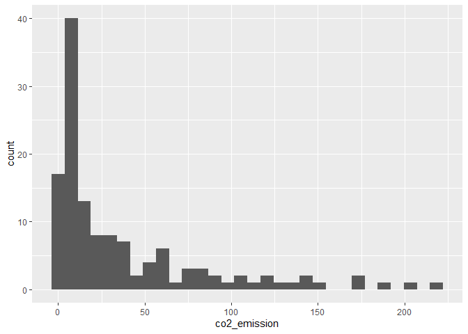
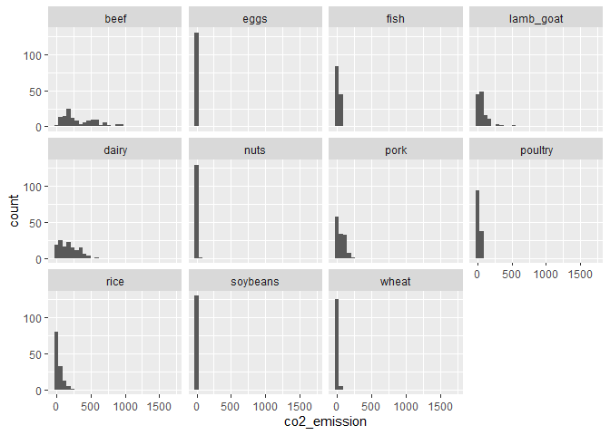

Summary Statistics
================
Mohamad Osman
2022-07-17

# Section 01: **Summary Statistics**

### **`01-Mean and median`**

In this chapter, you’ll be working with the [**2018 Food Carbon
Footprint
Index**](https://www.nu3.de/blogs/nutrition/food-carbon-footprint-index-2018)
from nu3. The `food_consumption` dataset contains information about the
kilograms of food consumed per person per year in each country in each
food category (`consumption`) as well as information about the carbon
footprint of that food category (`co2_emissions`) measured in kilograms
of carbon dioxide, or CO2, per person per year in each country.

In this exercise, you’ll compute measures of center to compare food
consumption in the US and Belgium using your `dplyr` skills.

`dplyr` is loaded for you and `food_consumption` is available.

``` r
library(dplyr)
```

    ## 
    ## Attaching package: 'dplyr'

    ## The following objects are masked from 'package:stats':
    ## 
    ##     filter, lag

    ## The following objects are masked from 'package:base':
    ## 
    ##     intersect, setdiff, setequal, union

``` r
library(ggplot2)

food_consumption_file <- file.path("..", "00_Datasets", "food_consumption.rds")
food_consumption <- readRDS(food_consumption_file)
head(food_consumption, 3)
```

    ## # A tibble: 3 × 4
    ##   country   food_category consumption co2_emission
    ##   <chr>     <fct>               <dbl>        <dbl>
    ## 1 Argentina pork                 10.5         37.2
    ## 2 Argentina poultry              38.7         41.5
    ## 3 Argentina beef                 55.5       1712

-   Create two data frames: one that holds the rows of
    `food_consumption` for `"Belgium"` and the another that holds rows
    for `"USA"`. Call these `belgium_consumption` and `usa_consumption`.

-   Calculate the mean and median of kilograms of food consumed per
    person per year for both countries.

``` r
# Filter for Belgium
belgium_consumption <- food_consumption %>%
  filter(country == "Belgium")

# Filter for USA
usa_consumption <- food_consumption %>%
  filter(country == "USA")

# Calculate mean and median consumption in Belgium
mean(belgium_consumption$consumption)
```

    ## [1] 42.13273

``` r
median(belgium_consumption$consumption)
```

    ## [1] 12.59

``` r
# Calculate mean and median consumption in USA
mean(usa_consumption$consumption)
```

    ## [1] 44.65

``` r
median(usa_consumption$consumption)
```

    ## [1] 14.58

-   Filter `food_consumption` for rows with data about Belgium and the
    USA.

-   Group the filtered data by `country`.

-   Calculate the mean and median of the kilograms of food consumed per
    person per year in each country. Call these columns
    `mean_consumption` and `median_consumption`.

``` r
food_consumption %>%
  # Filter for Belgium and USA
  filter(country %in% c("Belgium", "USA")) %>%
  # Group by country
  group_by(country) %>%
  # Get mean_consumption and median_consumption
  summarise(mean_consumption = mean(consumption),
      median_consumption = median(consumption))
```

    ## # A tibble: 2 × 3
    ##   country mean_consumption median_consumption
    ##   <chr>              <dbl>              <dbl>
    ## 1 Belgium             42.1               12.6
    ## 2 USA                 44.6               14.6

### **`02-Mean vs. median`**

In the video, you learned that the mean is the sum of all the data
points divided by the total number of data points, and the median is the
middle value of the dataset where 50% of the data is less than the
median, and 50% of the data is greater than the median. In this
exercise, you’ll compare these two measures of center.

`dplyr` and `ggplot2` are loaded and `food_consumption` is available.

-   Filter `food_consumption` to get the rows where `food_category` is
    `"rice"`.

-   Create a histogram using `ggplot2` of `co2_emission` for rice.

``` r
food_consumption %>%
  # Filter for rice food category
  filter(food_category == "rice") %>%
  # Create histogram of co2_emission
  ggplot(aes(co2_emission)) +
    geom_histogram()
```

    ## `stat_bin()` using `bins = 30`. Pick better value with `binwidth`.

<!-- -->

Take a look at the histogram of the CO2 emissions for rice you just
plotted. Which of the following terms best describes the shape of the
data?

`Ans: Right-skewed`

-   Filter `food_consumption` to get the rows where `food_category` is
    `"rice"`.

-   Summarize the data to get the mean and median of `co2_emission`,
    calling them `mean_co2` and `median_co2`.

``` r
food_consumption %>%
  # Filter for rice food category
  filter(food_category == "rice") %>% 
  # Get mean_co2 and median_co2
  summarise(mean_co2 = mean(co2_emission),
            median_co2 = median(co2_emission))
```

    ## # A tibble: 1 × 2
    ##   mean_co2 median_co2
    ##      <dbl>      <dbl>
    ## 1     37.6       15.2

-   Given the skew of this data, what measure of central tendency best
    summarizes the kilograms of CO

Possible Answers

-   Mean

-   Median (the right answer !)

-   Both mean and median

### 

**`03-Quartiles, quantiles, and quintiles`**

Quantiles are a great way of summarizing numerical data since they can
be used to measure center and spread, as well as to get a sense of where
a data point stands in relation to the rest of the dataset. For example,
you might want to give a discount to the 10% most active users on a
website.

In this exercise, you’ll calculate quartiles, quintiles, and deciles,
which split up a dataset into 4, 5, and 10 pieces, respectively.

The `dplyr` package is loaded and `food_consumption` is available.

-   Calculate the quartiles of the `co2_emission` column of
    `food_consumption`.

-   Calculate the six quantiles that split up the data into 5 pieces
    (quintiles) of the `co2_emission` column of `food_consumption`.

-   Calculate the eleven quantiles of `co2_emission` that split up the
    data into ten pieces (deciles).

``` r
# Calculate the quartiles of co2_emission
quantile(food_consumption$co2_emission)
```

    ##        0%       25%       50%       75%      100% 
    ##    0.0000    5.2100   16.5300   62.5975 1712.0000

``` r
# Calculate the quintiles of co2_emission
quantile(food_consumption$co2_emission, seq(0,1,0.2))
```

    ##       0%      20%      40%      60%      80%     100% 
    ##    0.000    3.540   11.026   25.590   99.978 1712.000

``` r
# Calculate the deciles of co2_emission
quantile(food_consumption$co2_emission, seq(0,1,0.1))
```

    ##       0%      10%      20%      30%      40%      50%      60%      70% 
    ##    0.000    0.668    3.540    7.040   11.026   16.530   25.590   44.271 
    ##      80%      90%     100% 
    ##   99.978  203.629 1712.000

### **`04-Variance and standard deviation`**

-   Calculate the variance and standard deviation of `co2_emission` for
    each `food_category` by grouping by and summarizing variance as
    `var_co2` and standard deviation as `sd_co2`.

-   Create a histogram of `co2_emission` for each `food_category` using
    `facet_wrap()`.

``` r
# Calculate variance and sd of co2_emission for each food_category
food_consumption %>% 
  group_by(food_category) %>% 
  summarise(var_co2 = var(co2_emission),
     sd_co2 = sd(co2_emission))
```

    ## # A tibble: 11 × 3
    ##    food_category   var_co2  sd_co2
    ##    <fct>             <dbl>   <dbl>
    ##  1 beef          88748.    298.   
    ##  2 eggs             21.4     4.62 
    ##  3 fish            922.     30.4  
    ##  4 lamb_goat     16476.    128.   
    ##  5 dairy         17672.    133.   
    ##  6 nuts             35.6     5.97 
    ##  7 pork           3095.     55.6  
    ##  8 poultry         245.     15.7  
    ##  9 rice           2281.     47.8  
    ## 10 soybeans          0.880   0.938
    ## 11 wheat            71.0     8.43

``` r
# Plot food_consumption with co2_emission on x-axis
ggplot(food_consumption, aes(x = co2_emission)) +
  # Create a histogram
  geom_histogram() +
  # Create a separate sub-graph for each food_category
  facet_wrap(~ food_category)
```

    ## `stat_bin()` using `bins = 30`. Pick better value with `binwidth`.

<!-- -->

Superb spread measurement! Beef has the biggest amount of variation in
its CO2 emissions, while eggs, nuts, and soybeans have relatively small
amounts of variation.

### **`05-Finding outliers using IQR`**

Outliers can have big effects on statistics like mean, as well as
statistics that rely on the mean, such as variance and standard
deviation. Interquartile range, or IQR, is another way of measuring
spread that’s less influenced by outliers. IQR is also often used to
find outliers. If a value is less than Q1−1.5×IQR or greater than
Q3+1.5×IQR, it’s considered an outlier. In fact, this is how the lengths
of the whiskers in a `ggplot2` box plot are calculated.

<figure>

<figcaption>Diagram of a box plot showing median, quartiles, and
outliers</figcaption>
</figure>

In this exercise, you’ll calculate IQR and use it to find some outliers.
Both `dplyr` and `ggplot2` are loaded and `food_consumption` is
available.

-   Calculate the total `co2_emission` per country by grouping by
    country and taking the sum of `co2_emission`. Call the sum
    `total_emission` and store the resulting data frame as
    `emissions_by_country`.

``` r
# Calculate total co2_emission per country: emissions_by_country
emissions_by_country <- food_consumption %>%
  group_by(country) %>%
  summarise(total_emission = sum(co2_emission))

emissions_by_country
```

    ## # A tibble: 130 × 2
    ##    country    total_emission
    ##    <chr>               <dbl>
    ##  1 Albania             1778.
    ##  2 Algeria              708.
    ##  3 Angola               413.
    ##  4 Argentina           2172.
    ##  5 Armenia             1110.
    ##  6 Australia           1939.
    ##  7 Austria             1211.
    ##  8 Bahamas             1193.
    ##  9 Bangladesh           374.
    ## 10 Barbados             889.
    ## # … with 120 more rows

-   Compute the first and third quartiles of `total_emission` and store
    these as `q1` and `q3`.

-   Calculate the interquartile range of `total_emission` and store it
    as `iqr`.

``` r
# Compute the first and third quartiles and IQR of total_emission
q1 <- quantile(emissions_by_country$total_emission, 0.25)
q3 <- quantile(emissions_by_country$total_emission, 0.75)
iqr <- q3 - q1
```

-   Calculate the lower and upper cutoffs for outliers of
    `total_emission`, and store these as `lower` and `upper`.

``` r
# Calculate the lower and upper cutoffs for outliers
lower <- q1 - 1.5 * iqr
upper <- q3 + 1.5 * iqr
```

-   Use `filter()` to get countries with a `total_emission` greater than
    the `upper` cutoff **or** a `total_emission` less than the `lower`
    cutoff.

``` r
# Filter emissions_by_country to find outliers
emissions_by_country %>%
  filter(total_emission < lower | total_emission > upper)
```

    ## # A tibble: 1 × 2
    ##   country   total_emission
    ##   <chr>              <dbl>
    ## 1 Argentina          2172.

Outstanding outlier detection! It looks like Argentina has a
substantially higher amount of CO2 emissions per person than other
countries in the world.

### **`The End`**
