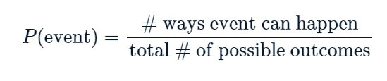

# Section 02: Random Numbers and Probability

### **`01-Calculating probabilities`**

```{r}
library(dplyr)
library(readr)
library(ggplot2)
```

You're in charge of the sales team, and it's time for performance reviews, starting with Amir. As part of the review, you want to randomly select a few of the deals that he's worked on over the past year so that you can look at them more deeply. Before you start selecting deals, you'll first figure out what the chances are of selecting certain deals.



Recall that the probability of an event can be calculated byP(event)=# ways event can happentotal \# of possible outcomes

`dplyr` is loaded and `amir_deals` is available.

-   Count the number of deals Amir worked on for each `product` type

```{r}
amir_deals_file <- file.path("..", "00_Datasets", "amir_deals.txt")
amir_deals <- read.delim(amir_deals_file)
```

```{r}
# Count the deals for each product
amir_deals %>%
  count(product) 
```

-   Create a new column called `prob` by dividing `n` by the total number of deals Amir worked on.

```{r}
# Calculate probability of picking a deal with each product
amir_deals %>%
  count(product) %>%
  mutate(prob = n/sum(n))
```

If you randomly select one of Amir's deals, what's the probability that the deal will involve `Product C`? Answer: Product C.

### **`02-Sampling deals`**

In the previous exercise, you counted the deals Amir worked on. Now it's time to randomly pick five deals so that you can reach out to each customer and ask if they were satisfied with the service they received. You'll try doing this both with and without replacement.

Additionally, you want to make sure this is done randomly and that it can be reproduced in case you get asked how you chose the deals, so you'll need to set the random seed before sampling from the deals.

`dplyr` is loaded and `amir_deals` is available.

-   Set the random seed to `31`.

-   Take a sample of 5 deals **without** replacement.

```{r}
# Set random seed to 31
set.seed(31)

# Sample 5 deals without replacement
amir_deals %>%
  sample_n(5, replace = FALSE)
  
```

-   Take a sample of 5 deals **with** replacement.

```{r}
# Set random seed to 31
set.seed(31)

# Sample 5 deals with replacement
amir_deals %>%
  sample_n(5, replace = TRUE)
```

-   What type of sampling is better to use for this situation?

`Answer:` Without replacement

### **`03-Creating a probability distribution`**

A new restaurant opened a few months ago, and the restaurant's management wants to optimize its seating space based on the size of the groups that come most often. On one night, there are 10 groups of people waiting to be seated at the restaurant, but instead of being called in the order they arrived, they will be called randomly. In this exercise, you'll investigate the probability of groups of different sizes getting picked first. Data on each of the ten groups is contained in the `restaurant_groups` data frame.

Remember that expected value can be calculated by multiplying each possible outcome with its corresponding probability and taking the sum. The `restaurant_groups` data is available and `dplyr` and `ggplot2` are loaded.

-   Create a histogram of the `group_size` column of `restaurant_groups`, setting the number of bins to `5`.

```{r}
group_id <- c("A","B","C","D","E","F","G","H","I","J")
group_size <- c(2,4,6,2,2,2,3,2,4,2)
restaurant_groups <- data.frame(group_id, group_size)
```

```{r}
# Create a histogram of group_size
ggplot(restaurant_groups, aes(x = group_size)) +
  geom_histogram(bins = 5)

```

-   Count the number of each `group_size` in `restaurant_groups`, then add a column called `probability` that contains the probability of randomly selecting a group of each size. Store this in a new data frame called `size_distribution`.

```{r}
# Create probability distribution
size_distribution <- restaurant_groups %>%
  # Count number of each group size
  count(group_size) %>%
  # Calculate probability
  mutate(probability = n / sum(n))

size_distribution
```

-   Calculate the expected value of the `size_distribution`, which represents the expected group size.

```{r}
# Calculate expected group size
expected_val <- sum(size_distribution$group_size *
                    size_distribution$probability)
expected_val
```

-   Calculate the probability of randomly picking a group of 4 or more people by filtering and summarizing.

```{r}
# Create probability distribution
size_distribution <- restaurant_groups %>%
  count(group_size) %>%
  mutate(probability = n / sum(n))

# Calculate probability of picking group of 4 or more
size_distribution %>%
  # Filter for groups of 4 or larger
  filter(group_size >= 4) %>%
  # Calculate prob_4_or_more by taking sum of probabilities
  summarise(prob_4_or_more = sum(probability))
```

### **`04-Data back-ups`**

The sales software used at your company is set to automatically back itself up, but no one knows exactly what time the back-ups happen. It is known, however, that back-ups happen exactly every 30 minutes. Amir comes back from sales meetings at random times to update the data on the client he just met with. He wants to know how long he'll have to wait for his newly-entered data to get backed up. Use your new knowledge of continuous uniform distributions to model this situation and answer Amir's questions.

-   To model how long Amir will wait for a back-up using a continuous uniform distribution, save his lowest possible wait time as `min` and his longest possible wait time as `max`. Remember that back-ups happen every 30 minutes.

-   Calculate the probability that Amir has to wait less than 5 minutes, and store in a variable called `prob_less_than_5`.

```{r}
# Min and max wait times for back-up that happens every 30 min
min <- 0
max <- 30

# Calculate probability of waiting less than 5 mins
prob_less_than_5 <- punif(5, min=min, max=max)
prob_less_than_5
```

-   Calculate the probability that Amir has to wait more than 5 minutes, and store in a variable called `prob_greater_than_5`.

```{r}
# Min and max wait times for back-up that happens every 30 min
min <- 0
max <- 30

# Calculate probability of waiting more than 5 mins
prob_greater_than_5 <- punif(5, min=min,max=max, lower.tail =FALSE)
prob_greater_than_5
```

-   Calculate the probability that Amir has to wait between 10 and 20 minutes, and store in a variable called `prob_between_10_and_20`.

```{r}
# Min and max wait times for back-up that happens every 30 min
min <- 0
max <- 30

# Calculate probability of waiting 10-20 mins
prob_between_10_and_20 <- punif(20, min=min, max=max)- punif(10, min=min, max=max)
prob_between_10_and_20
```

### 
**`05-Simulating wait times`**

To give Amir a better idea of how long he'll have to wait, you'll simulate Amir waiting 1000 times and create a histogram to show him what he should expect. Recall from the last exercise that his minimum wait time is 0 minutes and his maximum wait time is 30 minutes.

A data frame called `wait_times` is available and `dplyr` and `ggplot2` are loaded.

```{r}
simulation_nb <- seq(1,1000,1)
wait_times <- data.frame(simulation_nb)
```

```{r}
# Set random seed to 334
set.seed(334)

# Generate 1000 wait times between 0 and 30 mins, save in time column
wait_times %>%
  mutate(time = runif(1000, min = 0, max = 30)) %>%
  # Create a histogram of simulated times
  ggplot(aes(x = time)) +
  geom_histogram(bins = 30)
```

### `The End` 

[\

](javascript:void(0))


\

\


\

\


\

\


