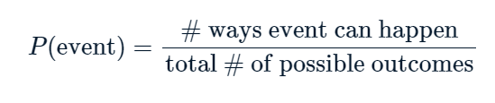
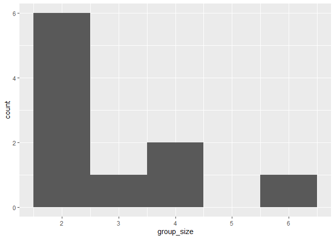
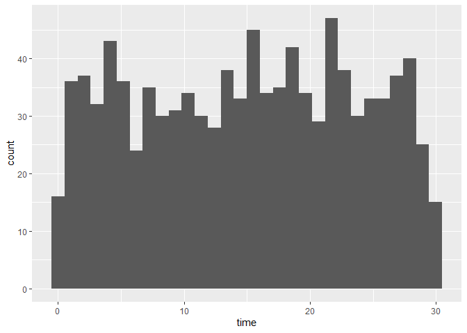

Random Numbers and Probability
================
Mohamad Osman
2022-07-17

# Section 02: Random Numbers and Probability

### **`01-Calculating probabilities`**

``` r
library(dplyr)
```

    ## 
    ## Attaching package: 'dplyr'

    ## The following objects are masked from 'package:stats':
    ## 
    ##     filter, lag

    ## The following objects are masked from 'package:base':
    ## 
    ##     intersect, setdiff, setequal, union

``` r
library(readr)
library(ggplot2)
```

You’re in charge of the sales team, and it’s time for performance
reviews, starting with Amir. As part of the review, you want to randomly
select a few of the deals that he’s worked on over the past year so that
you can look at them more deeply. Before you start selecting deals,
you’ll first figure out what the chances are of selecting certain deals.



Recall that the probability of an event can be calculated byP(event)=#
ways event can happentotal \# of possible outcomes

`dplyr` is loaded and `amir_deals` is available.

-   Count the number of deals Amir worked on for each `product` type

``` r
amir_deals_file <- file.path("..", "00_Datasets", "amir_deals.txt")
amir_deals <- read.delim(amir_deals_file)
```

``` r
# Count the deals for each product
amir_deals %>%
  count(product) 
```

    ##      product  n
    ## 1  Product A 23
    ## 2  Product B 62
    ## 3  Product C 15
    ## 4  Product D 40
    ## 5  Product E  5
    ## 6  Product F 11
    ## 7  Product G  2
    ## 8  Product H  8
    ## 9  Product I  7
    ## 10 Product J  2
    ## 11 Product N  3

-   Create a new column called `prob` by dividing `n` by the total
    number of deals Amir worked on.

``` r
# Calculate probability of picking a deal with each product
amir_deals %>%
  count(product) %>%
  mutate(prob = n/sum(n))
```

    ##      product  n       prob
    ## 1  Product A 23 0.12921348
    ## 2  Product B 62 0.34831461
    ## 3  Product C 15 0.08426966
    ## 4  Product D 40 0.22471910
    ## 5  Product E  5 0.02808989
    ## 6  Product F 11 0.06179775
    ## 7  Product G  2 0.01123596
    ## 8  Product H  8 0.04494382
    ## 9  Product I  7 0.03932584
    ## 10 Product J  2 0.01123596
    ## 11 Product N  3 0.01685393

If you randomly select one of Amir’s deals, what’s the probability that
the deal will involve `Product C`? Answer: Product C.

### **`02-Sampling deals`**

In the previous exercise, you counted the deals Amir worked on. Now it’s
time to randomly pick five deals so that you can reach out to each
customer and ask if they were satisfied with the service they received.
You’ll try doing this both with and without replacement.

Additionally, you want to make sure this is done randomly and that it
can be reproduced in case you get asked how you chose the deals, so
you’ll need to set the random seed before sampling from the deals.

`dplyr` is loaded and `amir_deals` is available.

-   Set the random seed to `31`.

-   Take a sample of 5 deals **without** replacement.

``` r
# Set random seed to 31
set.seed(31)

# Sample 5 deals without replacement
amir_deals %>%
  sample_n(5, replace = FALSE)
```

    ##     product  client status  amount num_users
    ## 1 Product D Current   Lost 3086.88        55
    ## 2 Product C Current   Lost 3727.66        19
    ## 3 Product D Current   Lost 4274.80         9
    ## 4 Product B Current    Won 4965.08         9
    ## 5 Product A Current    Won 5827.35        50

-   Take a sample of 5 deals **with** replacement.

``` r
# Set random seed to 31
set.seed(31)

# Sample 5 deals with replacement
amir_deals %>%
  sample_n(5, replace = TRUE)
```

    ##     product  client status  amount num_users
    ## 1 Product D Current   Lost 3086.88        55
    ## 2 Product C Current   Lost 3727.66        19
    ## 3 Product D Current   Lost 4274.80         9
    ## 4 Product B Current    Won 4965.08         9
    ## 5 Product A Current    Won 5827.35        50

-   What type of sampling is better to use for this situation?

`Answer:` Without replacement

### **`03-Creating a probability distribution`**

A new restaurant opened a few months ago, and the restaurant’s
management wants to optimize its seating space based on the size of the
groups that come most often. On one night, there are 10 groups of people
waiting to be seated at the restaurant, but instead of being called in
the order they arrived, they will be called randomly. In this exercise,
you’ll investigate the probability of groups of different sizes getting
picked first. Data on each of the ten groups is contained in the
`restaurant_groups` data frame.

Remember that expected value can be calculated by multiplying each
possible outcome with its corresponding probability and taking the sum.
The `restaurant_groups` data is available and `dplyr` and `ggplot2` are
loaded.

-   Create a histogram of the `group_size` column of
    `restaurant_groups`, setting the number of bins to `5`.

``` r
group_id <- c("A","B","C","D","E","F","G","H","I","J")
group_size <- c(2,4,6,2,2,2,3,2,4,2)
restaurant_groups <- data.frame(group_id, group_size)
```

``` r
# Create a histogram of group_size
ggplot(restaurant_groups, aes(x = group_size)) +
  geom_histogram(bins = 5)
```

<!-- -->

-   Count the number of each `group_size` in `restaurant_groups`, then
    add a column called `probability` that contains the probability of
    randomly selecting a group of each size. Store this in a new data
    frame called `size_distribution`.

``` r
# Create probability distribution
size_distribution <- restaurant_groups %>%
  # Count number of each group size
  count(group_size) %>%
  # Calculate probability
  mutate(probability = n / sum(n))

size_distribution
```

    ##   group_size n probability
    ## 1          2 6         0.6
    ## 2          3 1         0.1
    ## 3          4 2         0.2
    ## 4          6 1         0.1

-   Calculate the expected value of the `size_distribution`, which
    represents the expected group size.

``` r
# Calculate expected group size
expected_val <- sum(size_distribution$group_size *
                    size_distribution$probability)
expected_val
```

    ## [1] 2.9

-   Calculate the probability of randomly picking a group of 4 or more
    people by filtering and summarizing.

``` r
# Create probability distribution
size_distribution <- restaurant_groups %>%
  count(group_size) %>%
  mutate(probability = n / sum(n))

# Calculate probability of picking group of 4 or more
size_distribution %>%
  # Filter for groups of 4 or larger
  filter(group_size >= 4) %>%
  # Calculate prob_4_or_more by taking sum of probabilities
  summarise(prob_4_or_more = sum(probability))
```

    ##   prob_4_or_more
    ## 1            0.3

### **`04-Data back-ups`**

The sales software used at your company is set to automatically back
itself up, but no one knows exactly what time the back-ups happen. It is
known, however, that back-ups happen exactly every 30 minutes. Amir
comes back from sales meetings at random times to update the data on the
client he just met with. He wants to know how long he’ll have to wait
for his newly-entered data to get backed up. Use your new knowledge of
continuous uniform distributions to model this situation and answer
Amir’s questions.

-   To model how long Amir will wait for a back-up using a continuous
    uniform distribution, save his lowest possible wait time as `min`
    and his longest possible wait time as `max`. Remember that back-ups
    happen every 30 minutes.

-   Calculate the probability that Amir has to wait less than 5 minutes,
    and store in a variable called `prob_less_than_5`.

``` r
# Min and max wait times for back-up that happens every 30 min
min <- 0
max <- 30

# Calculate probability of waiting less than 5 mins
prob_less_than_5 <- punif(5, min=min, max=max)
prob_less_than_5
```

    ## [1] 0.1666667

-   Calculate the probability that Amir has to wait more than 5 minutes,
    and store in a variable called `prob_greater_than_5`.

``` r
# Min and max wait times for back-up that happens every 30 min
min <- 0
max <- 30

# Calculate probability of waiting more than 5 mins
prob_greater_than_5 <- punif(5, min=min,max=max, lower.tail =FALSE)
prob_greater_than_5
```

    ## [1] 0.8333333

-   Calculate the probability that Amir has to wait between 10 and 20
    minutes, and store in a variable called `prob_between_10_and_20`.

``` r
# Min and max wait times for back-up that happens every 30 min
min <- 0
max <- 30

# Calculate probability of waiting 10-20 mins
prob_between_10_and_20 <- punif(20, min=min, max=max)- punif(10, min=min, max=max)
prob_between_10_and_20
```

    ## [1] 0.3333333

### **`05-Simulating wait times`**

To give Amir a better idea of how long he’ll have to wait, you’ll
simulate Amir waiting 1000 times and create a histogram to show him what
he should expect. Recall from the last exercise that his minimum wait
time is 0 minutes and his maximum wait time is 30 minutes.

A data frame called `wait_times` is available and `dplyr` and `ggplot2`
are loaded.

``` r
simulation_nb <- seq(1,1000,1)
wait_times <- data.frame(simulation_nb)
```

``` r
# Set random seed to 334
set.seed(334)

# Generate 1000 wait times between 0 and 30 mins, save in time column
wait_times %>%
  mutate(time = runif(1000, min = 0, max = 30)) %>%
  # Create a histogram of simulated times
  ggplot(aes(x = time)) +
  geom_histogram(bins = 30)
```

<!-- -->

### 06-**Simulating sales deals**

Assume that Amir usually works on 3 deals per week, and overall, he wins
30% of deals he works on. Each deal has a binary outcome: it’s either
lost, or won, so you can model his sales deals with a binomial
distribution. In this exercise, you’ll help Amir simulate a year’s worth
of his deals so he can better understand his performance.

-   Set the random seed to 10 and simulate a single deal.

``` r
# Set random seed to 10
set.seed(10)

# Simulate a single deal
rbinom(1, 1, 0.3)
```

    ## [1] 0

-   Simulate a typical week of Amir’s deals, or one week of 3 deals.

``` r
# Set random seed to 10
set.seed(10)

# Simulate 1 week of 3 deals
rbinom(1, 3, 0.3)
```

    ## [1] 1

-   Simulate a year’s worth of Amir’s deals, or 52 weeks of 3 deals
    each, and store in `deals`.

-   Calculate the mean number of deals he won per week.

``` r
# Set random seed to 10
set.seed(10)

# Simulate 52 weeks of 3 deals
deals <- rbinom(52, 3, 0.3)

# Calculate mean deals won per week
mean(deals)
```

    ## [1] 0.8076923

### **`07-Calculating binomial probabilities`**

Just as in the last exercise, assume that Amir wins 30% of deals. He
wants to get an idea of how likely he is to close a certain number of
deals each week. In this exercise, you’ll calculate what the chances are
of him closing different numbers of deals using the binomial
distribution.

-   What’s the probability that Amir closes all 3 deals in a week?

``` r
# Probability of closing 3 out of 3 deals
dbinom(3, 3, 0.3)
```

    ## [1] 0.027

-   What’s the probability that Amir closes 1 or fewer deals in a week?

``` r
# Probability of closing <= 1 deal out of 3 deals
pbinom(1, 3, 0.3)
```

    ## [1] 0.784

-   What’s the probability that Amir closes more than 1 deal?

``` r
# Probability of closing > 1 deal out of 3 deals
pbinom(1, 3, 0.3, lower.tail = FALSE)
```

    ## [1] 0.216

### **`08-How many sales will be won?`**

Now Amir wants to know how many deals he can expect to close each week
if his win rate changes. Luckily, you can use your binomial distribution
knowledge to help him calculate the expected value in different
situations. Recall from the video that the expected value of a binomial
distribution can be calculated by n×p.

-   Calculate the expected number of sales out of the **3** he works on
    that Amir will win each week if he maintains his 30% win rate.

-   Calculate the expected number of sales out of the 3 he works on that
    he’ll win if his win rate drops to 25%.

-   Calculate the expected number of sales out of the 3 he works on that
    he’ll win if his win rate rises to 35%.

``` r
# Expected number won with 30% win rate
won_30pct <- 3  * 0.3
won_30pct
```

    ## [1] 0.9

``` r
# Expected number won with 25% win rate
won_25pct <- 3  * 0.25
won_25pct
```

    ## [1] 0.75

``` r
# Expected number won with 35% win rate
won_35pct <- 3  * 0.35
won_35pct
```

    ## [1] 1.05

Excellent expectation experimentation! If Amir’s win rate goes up by 5%,
he can expect to close more than 1 deal on average each week.

### `The End`
