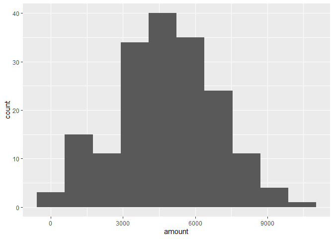
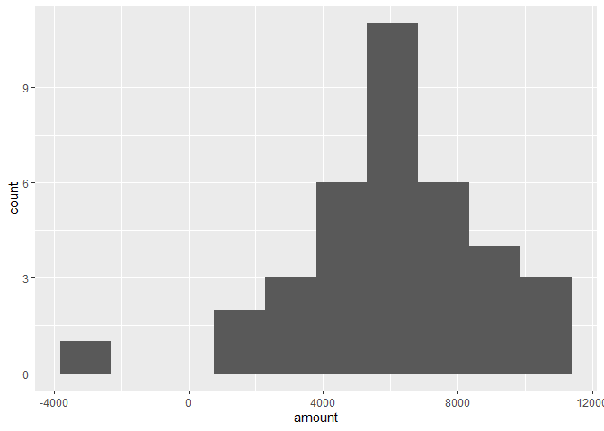
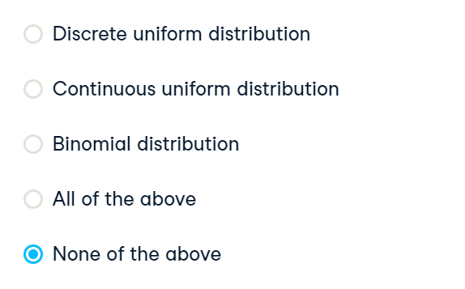
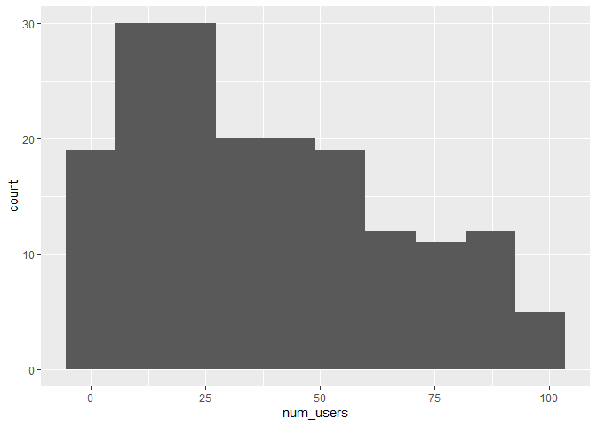
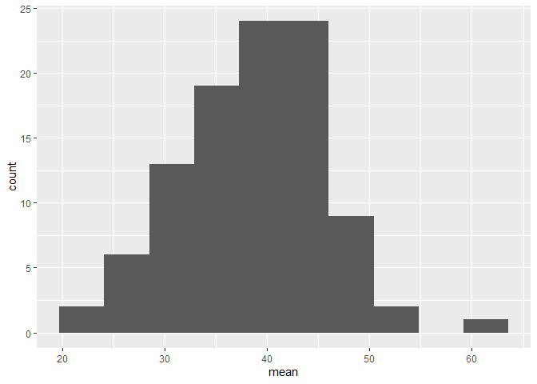

More Distributions and the Central Limit Theorem
================
Mohamad Osman
2022-07-18

# **Section 03: More Distributions and the Central Limit Theorem**

### **`01-Distribution of Amir's sales`**

Since each deal Amir worked on (both won and lost) was different, each
was worth a different amount of money. These values are stored in the
`amount` column of `amir_deals` As part of Amir’s performance review,
you want to be able to estimate the probability of him selling different
amounts, but before you can do this, you’ll need to determine what kind
of distribution the `amount` variable follows.

Both `dplyr` and `ggplot2` are loaded and `amir_deals` is available.

``` r
library(dplyr)
```

    ## 
    ## Attaching package: 'dplyr'

    ## The following objects are masked from 'package:stats':
    ## 
    ##     filter, lag

    ## The following objects are masked from 'package:base':
    ## 
    ##     intersect, setdiff, setequal, union

``` r
library(readr)
library(ggplot2)

amir_deals_file <- file.path("..", "00_Datasets", "amir_deals.txt")
amir_deals <- read.delim(amir_deals_file)
```

-   Create a histogram with 10 bins to visualize the distribution of the
    `amount`.

``` r
# Histogram of amount with 10 bins
ggplot(amir_deals, aes(x = amount)) + 
    geom_histogram(bins = 10)
```

<!-- -->

### **`02-Probabilities from the normal distribution`**

Since each deal Amir worked on (both won and lost) was different, each
was worth a different amount of money. These values are stored in the
`amount` column of `amir_deals` and follow a normal distribution with a
mean of 5000 dollars and a standard deviation of 2000 dollars. As part
of his performance metrics, you want to calculate the probability of
Amir closing a deal worth various amounts.

-   What’s the probability of Amir closing a deal worth less than $7500?

``` r
# Probability of deal < 7500
pnorm(7500, mean = 5000, sd = 2000)
```

    ## [1] 0.8943502

-   What’s the probability of Amir closing a deal worth more than $1000?

``` r
# Probability of deal > 1000
pnorm(1000, mean = 5000, sd = 2000, lower.tail = FALSE)
```

    ## [1] 0.9772499

-   What’s the probability of Amir closing a deal worth between $3000
    and $7000?

``` r
# Probability of deal between 3000 and 7000
pnorm(7000, mean = 5000, sd = 2000) - pnorm(3000, mean = 5000, sd = 2000)
```

    ## [1] 0.6826895

-   What amount will 75% of Amir’s sales be *more than*?

``` r
# Calculate amount that 75% of deals will be more than
qnorm(0.75, mean = 5000, sd = 2000, lower.tail = FALSE)
```

    ## [1] 3651.02

### `03-Simulating sales under new market conditions`

The company’s financial analyst is predicting that next quarter, the
worth of each sale will increase by 20% and the volatility, or standard
deviation, of each sale’s worth will increase by 30%. To see what Amir’s
sales might look like next quarter under these new market conditions,
you’ll simulate new sales amounts using the normal distribution and
store these in the `new_sales` data frame, which has already been
created for you.

In addition, `dplyr` and `ggplot2` are loaded.

-   Currently, Amir’s average sale amount is $5000. Calculate what his
    new average amount will be if it increases by 20% and store this in
    `new_mean`.

-   Amir’s current standard deviation is $2000. Calculate what his new
    standard deviation will be if it increases by 30% and store this in
    `new_sd`.

-   Add a new column called `amount` to the data frame `new_sales`,
    which contains 36 simulated amounts from a normal distribution with
    a mean of `new_mean` and a standard deviation of `new_sd`.

-   Plot the distribution of the `new_sales` `amount`s using a histogram
    with 10 bins.

``` r
new_sales_file <- file.path("..", "00_Datasets", "new_sales.txt")
new_sales <- read.delim(new_sales_file)
```

``` r
# Calculate new average amount
new_mean <- 6000

# Calculate new standard deviation
new_sd <- 2600

# Simulate 36 sales
new_sales <- new_sales %>% 
  mutate(amount = rnorm(36, mean = new_mean, sd = new_sd))

# Create histogram with 10 bins
ggplot(new_sales, aes(x = amount)) +
  geom_histogram(bins = 10)
```

<!-- -->

### **`04-Which market is better?`**

The key metric that the company uses to evaluate salespeople is the
percent of sales they make over $1000 since the time put into each sale
is usually worth a bit more than that, so the higher this metric, the
better the salesperson is performing.

Recall that Amir’s current sales amounts have a mean of $5000 and a
standard deviation of $2000, and Amir’s predicted amounts in next
quarter’s market have a mean of $6000 and a standard deviation of $2600.

Based only on the metric of **percent of sales over $1000**, does Amir
perform better in the current market or the predicted market?

`Answer:` Great work! In the current market, Amir makes sales over $1000
about 97.7% of the time, and about 97.3% of the time in the predicted
market, so there’s not much of a difference. However, his average sale
amount is higher in the predicted market, so the company may want to
consider other metrics as well.

### **`05-Visualizing sampling distributions`**

On the right, try creating *sampling distributions* of different summary
statistics from samples of different distributions. Which distribution
does the central limit theorem **not** apply to?

`Answer:`



### 

### **`06-The CLT in action`**

The central limit theorem states that a sampling distribution of a
sample statistic approaches the normal distribution as you take more
samples, no matter the original distribution being sampled from.

In this exercise, you’ll focus on the sample mean and see the central
limit theorem in action while examining the `num_users` column of
`amir_deals` more closely, which contains the number of people who
intend to use the product Amir is selling.

Both `dplyr` and `ggplot2` are loaded and `amir_deals` is available.

-   Create a histogram of the `num_users` column of `amir_deals`. Use 10
    bins.

``` r
# Create a histogram of num_users
ggplot(amir_deals, aes(x = num_users)) + 
     geom_histogram(bins = 10)
```

<!-- -->

-   Set the seed to `104`.

-   Take a sample of size `20` with replacement from the `num_users`
    column of `amir_deals`, and take the mean.

``` r
# Set seed to 104
set.seed(104)

# Sample 20 num_users with replacement from amir_deals
sample(amir_deals$num_users, 20, replace = TRUE) %>%
  # Take mean
  mean()
```

    ## [1] 30.35

-   Repeat this 100 times and store as `sample_means`. This will take
    100 different samples and calculate the mean of each.

-   A data frame called `samples` has been created for you with a column
    `mean`, which contains the values from `sample_means`. Create a
    histogram of the `mean` column with 10 bins.

``` r
# Set seed to 104
set.seed(104)

# Sample 20 num_users from amir_deals and take mean
sample(amir_deals$num_users, size = 20, replace = TRUE) %>%
  mean()
```

    ## [1] 30.35

``` r
# Repeat the above 100 times
sample_means <- replicate(100, sample(amir_deals$num_users, size = 20, replace = TRUE) %>% mean())

# Create data frame for plotting
samples <- data.frame(mean = sample_means)

# Histogram of sample means
ggplot(samples, aes(mean)) +
  geom_histogram(bins = 10)
```

<!-- -->

### **`07-The mean of means`**

You want to know what the average number of users (`num_users`) is per
deal, but you want to know this number for the entire company so that
you can see if Amir’s deals have more or fewer users than the company’s
average deal. The problem is that over the past year, the company has
worked on more than ten thousand deals, so it’s not realistic to compile
all the data. Instead, you’ll estimate the mean by taking several random
samples of deals, since this is much easier than collecting data from
everyone in the company.

The user data for all the company’s deals is available in `all_deals`.

-   Set the random seed to `321`.

-   Take 30 samples of size 20 from `all_deals$num_users` and take the
    mean of each sample. Store the sample means in `sample_means`.

-   Take the mean of `sample_means`.

-   Take the mean of the `num_users` column of `amir_deals`.

``` r
all_deals_file <- file.path("..", "00_Datasets", "all_deals.txt")
all_deals <- read.delim(all_deals_file)
```

``` r
# Set seed to 321
set.seed(321)

# Take 30 samples of 20 values of num_users, take mean of each sample
sample_means <- replicate(30, sample(all_deals$num_users, size = 20) %>% mean())

# Calculate mean of sample_means
mean(sample_means)
```

    ## [1] 37.02667

``` r
# Calculate mean of num_users in amir_deals
mean(amir_deals$num_users)
```

    ## [1] 37.65169

### **`08-Tracking lead responses`**

Your company uses sales software to keep track of new sales leads. It
organizes them into a queue so that anyone can follow up on one when
they have a bit of free time. Since the number of lead responses is a
countable outcome over a period of time, this scenario corresponds to a
Poisson distribution. On average, Amir responds to 4 leads each day. In
this exercise, you’ll calculate probabilities of Amir responding to
different numbers of leads.

-   What’s the probability that Amir responds to 5 leads in a day, given
    that he responds to an average of 4?

``` r
# Probability of 5 responses
dpois(5, lambda = 4)
```

    ## [1] 0.1562935

-   Amir’s coworker responds to an average of 5.5 leads per day. What is
    the probability that she answers 5 leads in a day?

``` r
# Probability of 5 responses from coworker
dpois(5, lambda = 5.5 )
```

    ## [1] 0.1714007

-   What’s the probability that Amir responds to 2 or fewer leads in a
    day?

``` r
# Probability of 2 or fewer responses
ppois(2, lambda = 4)
```

    ## [1] 0.2381033

-   What’s the probability that Amir responds to more than 10 leads in a
    day?

``` r
# Probability of > 10 responses
ppois(10, lambda = 4, lower.tail = FALSE)
```

    ## [1] 0.002839766

### **`09-Modeling time between leads`**

To further evaluate Amir’s performance, you want to know how much time
it takes him to respond to a lead after he opens it. On average, it
takes 2.5 hours for him to respond. In this exercise, you’ll calculate
probabilities of different amounts of time passing between Amir
receiving a lead and sending a response.

-   What’s the probability it takes Amir less than an hour to respond to
    a lead?

``` r
# Probability response takes < 1 hour
pexp(1, rate = 1/2.5)
```

    ## [1] 0.32968

-   What’s the probability it takes Amir more than 4 hours to respond to
    a lead?

``` r
# Probability response takes > 4 hours
pexp(4, rate = 1/2.5, lower.tail = FALSE)
```

    ## [1] 0.2018965

-   What’s the probability it takes Amir 3-4 hours to respond to a lead?

``` r
# Probability response takes 3-4 hours
pexp(4, rate = 1/2.5) - pexp(3, rate = 1/2.5)
```

    ## [1] 0.09929769

### **`The End`**

### 
