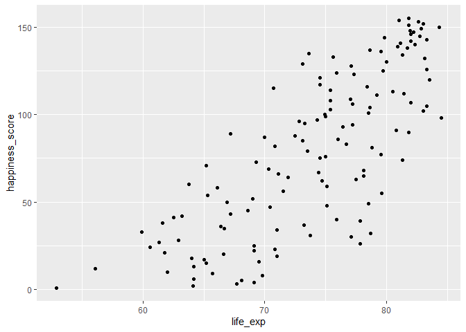
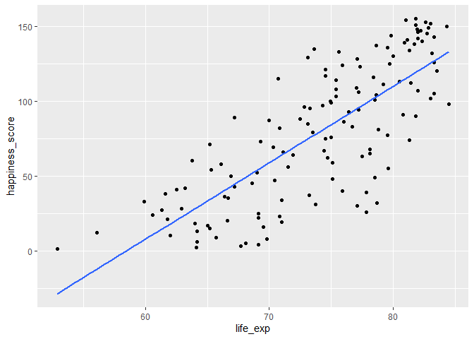
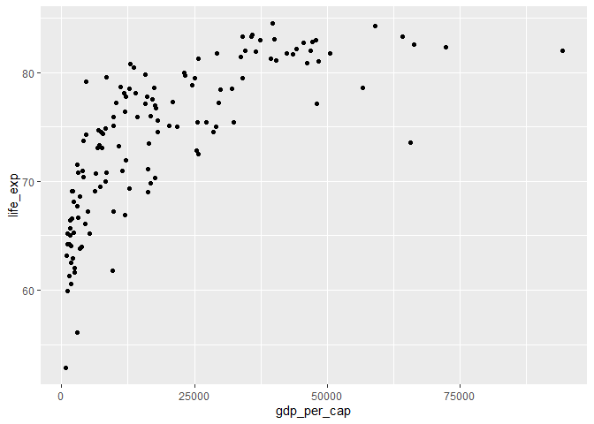
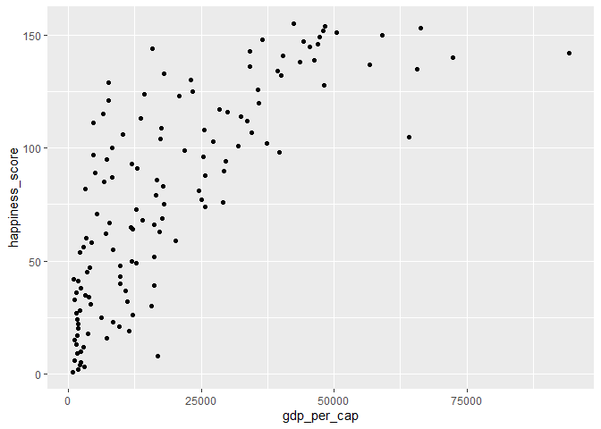
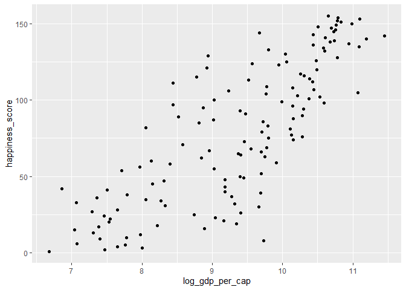
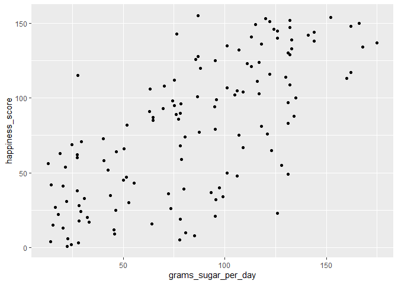
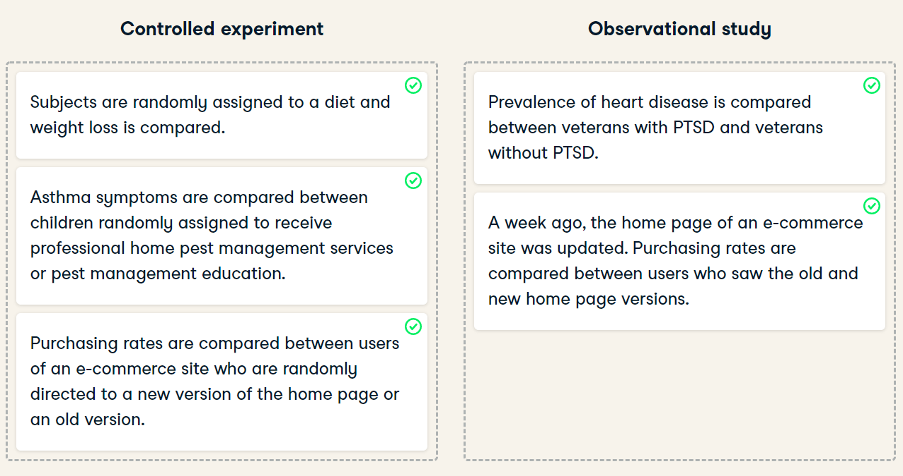

Correlation and Experimental Design
================
Mohamad Osman
2022-07-19

# Section 04: Correlation and Experimental Design

### **`01-Relationships between variables`**

In this chapter, you’ll be working with a dataset `world_happiness`
containing results from the [**2019 World Happiness
Report**](https://worldhappiness.report/ed/2019/). The report scores
various countries based on how happy people in that country are. It also
ranks each country on various societal aspects such as social support,
freedom, corruption, and others. The dataset also includes the GDP per
capita and life expectancy for each country.

In this exercise, you’ll examine the relationship between a country’s
life expectancy (`life_exp`) and happiness score (`happiness_score`)
both visually and quantitatively. Both `dplyr` and `ggplot2` are loaded
and `world_happiness` is available.

``` r
library(dplyr)
```

    ## 
    ## Attaching package: 'dplyr'

    ## The following objects are masked from 'package:stats':
    ## 
    ##     filter, lag

    ## The following objects are masked from 'package:base':
    ## 
    ##     intersect, setdiff, setequal, union

``` r
library(ggplot2)
```

``` r
file_path <- file.path("..", "00_Datasets", "world_happiness_sugar.rds")
world_happiness <- readRDS(file_path)
head(world_happiness,3)
```

    ##   country social_support freedom corruption generosity gdp_per_cap life_exp
    ## 1 Finland              2       5          4         47       42400     81.8
    ## 2 Denmark              4       6          3         22       48300     81.0
    ## 3  Norway              3       3          8         11       66300     82.6
    ##   happiness_score grams_sugar_per_day
    ## 1             155                86.8
    ## 2             154               152.0
    ## 3             153               120.0

-   Create a scatterplot of `happiness_score` vs. `life_exp` using
    `ggplot2`.

``` r
# Create a scatterplot of happiness_score vs. life_exp
ggplot(world_happiness, aes(life_exp, happiness_score)) + 
    geom_point()
```

<!-- -->

-   Add a linear trendline to the scatterplot, setting `se` to `FALSE`.

``` r
# Add a linear trendline to scatterplot
ggplot(world_happiness, aes(life_exp, happiness_score)) +
  geom_point() +
  geom_smooth(method = "lm", se = FALSE)
```

    ## `geom_smooth()` using formula 'y ~ x'

<!-- -->

-   Based on the scatterplot, which is most likely the correlation
    between `life_exp` and `happiness_score`?

`Answer: approximately 0.8`

-   Calculate the correlation between `life_exp` and `happiness_score`.

``` r
# Add a linear trendline to scatterplot
ggplot(world_happiness, aes(life_exp, happiness_score)) +
  geom_point() +
  geom_smooth(method = "lm", se = FALSE)
```

    ## `geom_smooth()` using formula 'y ~ x'

<!-- -->

``` r
# Correlation between life_exp and happiness_score
cor(world_happiness$life_exp, world_happiness$happiness_score)
```

    ## [1] 0.7737615

### **`02-What can't correlation measure?`**

While the correlation coefficient is a convenient way to quantify the
strength of a relationship between two variables, it’s far from perfect.
In this exercise, you’ll explore one of the caveats of the correlation
coefficient by examining the relationship between a country’s GDP per
capita (`gdp_per_cap`) and happiness score.

Both `dplyr` and `ggplot2` are loaded and `world_happiness` is
available.

-   Create a scatterplot showing the relationship between `gdp_per_cap`
    (on the x-axis) and `life_exp` (on the y-axis).

-   Calculate the correlation between `gdp_per_cap` and `life_exp`.

``` r
# Scatterplot of gdp_per_cap and life_exp
ggplot(world_happiness, aes(gdp_per_cap, life_exp)) +
  geom_point()
```

<!-- -->

``` r
# Correlation between gdp_per_cap and life_exp
cor(world_happiness$gdp_per_cap, world_happiness$life_exp)
```

    ## [1] 0.7235027

### **`03-Transforming variables`**

When variables have skewed distributions, they often require a
transformation in order to form a linear relationship with another
variable so that correlation can be computed. In this exercise, you’ll
perform a transformation yourself.

Both `dplyr` and `ggplot2` are loaded and `world_happiness` is
available.

``` r
# Scatterplot of happiness_score vs. gdp_per_cap
ggplot(world_happiness, aes(gdp_per_cap, happiness_score)) + 
    geom_point()
```

<!-- -->

``` r
# Calculate correlation
cor(world_happiness$gdp_per_cap, world_happiness$happiness_score)
```

    ## [1] 0.7601853

-   Add a new column to `world_happiness` called `log_gdp_per_cap` that
    contains the log of `gdp_per_cap`.

-   Create a scatterplot of `happiness_score` versus `log_gdp_per_cap`.

-   Calculate the correlation between `happiness_score` and
    `log_gdp_per_cap`.

``` r
# Create log_gdp_per_cap column
world_happiness <- world_happiness %>%
  mutate(log_gdp_per_cap = log(gdp_per_cap))

# Scatterplot of happiness_score vs. log_gdp_per_cap
ggplot(world_happiness, aes(log_gdp_per_cap, happiness_score)) +
  geom_point()
```

<!-- -->

``` r
# Calculate correlation
cor(world_happiness$log_gdp_per_cap, world_happiness$happiness_score)
```

    ## [1] 0.7965484

### **`04-Does sugar improve happiness?`**

A new column has been added to `world_happiness` called
`grams_sugar_per_day`, which contains the average amount of sugar eaten
per person per day in each country. In this exercise, you’ll examine the
effect of a country’s average sugar consumption on its happiness score.

Both `dplyr` and `ggplot2` are loaded and `world_happiness` is
available.

-   Create a scatterplot showing the relationship between
    `grams_sugar_per_day` (on the x-axis) and `happiness_score` (on the
    y-axis).

-   Calculate the correlation between `grams_sugar_per_day` and
    `happiness_score`

``` r
# Scatterplot of grams_sugar_per_day and happiness_score
ggplot(world_happiness, aes(grams_sugar_per_day, happiness_score)) + 
    geom_point()
```

<!-- -->

``` r
# Correlation between grams_sugar_per_day and happiness_score
cor(world_happiness$grams_sugar_per_day, world_happiness$happiness_score)
```

    ## [1] 0.69391

-   Based on this data, which statement about sugar consumption and
    happiness scores is true?

`Answer:` Increased sugar consumption is associated with a higher
happiness score.

### **`05-Study types`**



### **`06-Longitudinal vs. cross-sectional studies`**

A company manufactures thermometers, and they want to study the
relationship between a thermometer’s age and its accuracy. To do this,
they take a sample of 100 different thermometers of different ages and
test how accurate they are. Is this data longitudinal or
cross-sectional?

-   Answer: Cross-sectional

### **`The End`**

  

  

  
