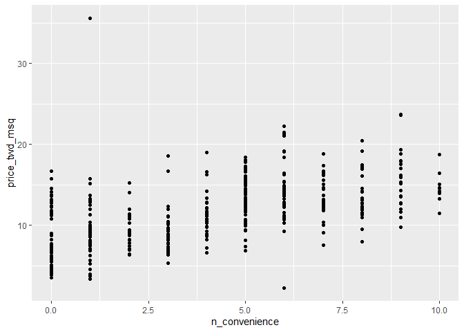
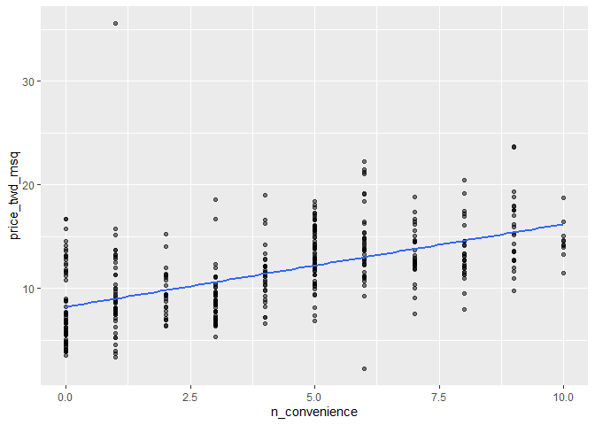
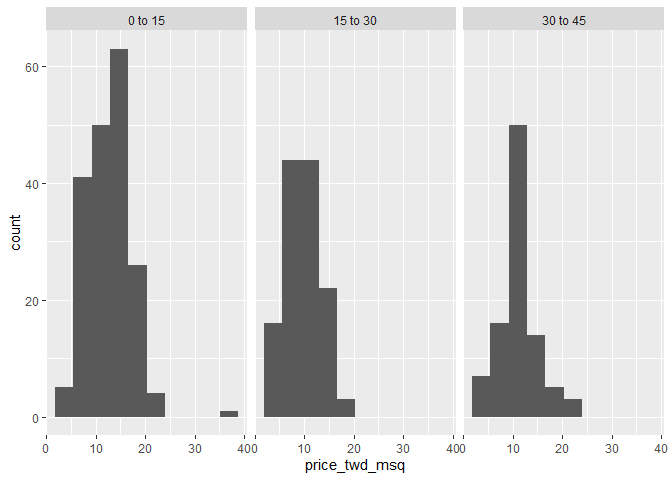

Simple Linear Regression
================
Mohamad Osman
2022-07-19

# Section 01: Simple Linear Regression

### `01-Visualizing two variables`

``` r
library(dplyr)
```

    ## 
    ## Attaching package: 'dplyr'

    ## The following objects are masked from 'package:stats':
    ## 
    ##     filter, lag

    ## The following objects are masked from 'package:base':
    ## 
    ##     intersect, setdiff, setequal, union

``` r
library(ggplot2)
library(fst)

file_path <- file.path("..", "00_Datasets", "taiwan_real_estate.fst")
taiwan_real_estate <- read_fst(file_path)
taiwan_real_estate$house_age_years <- as.factor(taiwan_real_estate$house_age_years)
head(taiwan_real_estate, 3)
```

    ##   dist_to_mrt_m n_convenience house_age_years price_twd_msq
    ## 1      84.87882            10        30 to 45      11.46747
    ## 2     306.59470             9        15 to 30      12.76853
    ## 3     561.98450             5         0 to 15      14.31165

Before you can run any statistical models, it’s usually a good idea to
visualize your dataset. Here, we’ll look at the relationship between
house price per area and the number of nearby convenience stores, using
the Taiwan real estate dataset.

One challenge in this dataset is that the number of convenience stores
contains integer data, causing points to overlap. To solve this, you
will make the points transparent.

`taiwan_real_estate` is available, `ggplot2` is loaded, and its black
and white theme has been set.

-   Using `taiwan_real_estate`, draw a scatter plot of `price_twd_msq`
    (y-axis) versus `n_convenience` (x-axis).

``` r
# Draw a scatter plot of n_convenience vs. price_twd_msq
ggplot(taiwan_real_estate, aes(n_convenience, price_twd_msq)) + 

geom_point()
```

<!-- -->

-   Update the plot to make the points 50% transparent by setting
    `alpha` to `0.5`.

-   Update the plot by adding a trend line, calculated using a linear
    regression. You can omit the confidence ribbon.

``` r
# Add a linear trend line without a confidence ribbon
ggplot(taiwan_real_estate, aes(n_convenience, price_twd_msq)) +
  geom_point(alpha = 0.5) +
  geom_smooth(method = "lm", 
              se = FALSE)
```

    ## `geom_smooth()` using formula 'y ~ x'

<!-- -->

### `02-Linear regression with lm()`

While ggplot can display a linear regression trend line using
`geom_smooth()`, it doesn’t give you access to the intercept and slope
as variables, or allow you to work with the model results as variables.
That means that sometimes you’ll need to run a linear regression
yourself.

Time to run your first model!

`taiwan_real_estate` is available. *TWD* is an abbreviation for Taiwan
dollars.

-   Run a linear regression with `price_twd_msq` as the response
    variable, `n_convenience` as the explanatory variable, and
    `taiwan_real_estate` as the dataset.

``` r
# Run a linear regression of price_twd_msq vs. n_convenience
lm(price_twd_msq ~ n_convenience, data = taiwan_real_estate)
```

    ## 
    ## Call:
    ## lm(formula = price_twd_msq ~ n_convenience, data = taiwan_real_estate)
    ## 
    ## Coefficients:
    ##   (Intercept)  n_convenience  
    ##        8.2242         0.7981

-   The model had an `(Intercept)` coefficient of `8.2242`. What does
    this mean?

    `Answer:` On average, a house with zero convenience stores nearby
    had a price of 8.2242 TWD per square meter.

-   The model had an `n_convenience` coefficient of `0.7981`. What does
    this mean? `Answer:` If you increase the number of nearby
    convenience stores by one, then the expected increase in house price
    is `0.7981` TWD per square meter.

### **`03-Visualizing numeric vs. categorical`**

If the explanatory variable is categorical, the scatter plot that you
used before to visualize the data doesn’t make sense. Instead, a good
option is to draw a histogram for each category.

The Taiwan real estate dataset has a categorical variable in the form of
the age of each house. The ages have been split into 3 groups: 0 to 15
years, 15 to 30 years, and 30 to 45 years.

`taiwan_real_estate` is available and `ggplot2` is loaded.

-   Using `taiwan_real_estate`, plot a histogram of `price_twd_msq` with
    `10` bins.

-   Facet the plot by `house_age_years` to give 3 panels.

``` r
# Using taiwan_real_estate, plot price_twd_msq
ggplot(taiwan_real_estate, aes(price_twd_msq)) +
  # Make it a histogram with 10 bins
  geom_histogram(bins = 10) +
  # Facet the plot so each house age group gets its own panel
  facet_wrap(~ house_age_years)
```

<!-- -->

### `04-Calculating means by category`

A good way to explore categorical variables is to calculate summary
statistics such as the mean for each category. Here, you’ll look at
grouped means for the house prices in the Taiwan real estate dataset.

`taiwan_real_estate` is available and `dplyr` is loaded.

-   Group `taiwan_real_estate` by `house_age_years`.

-   Summarize to calculate the mean `price_twd_msq` for each group,
    naming the column `mean_by_group`.

-   Assign the result to `summary_stats` and *look at the numbers*.

``` r
summary_stats <- taiwan_real_estate %>% 
  # Group by house age
  group_by(house_age_years) %>% 
  # Summarize to calculate the mean house price/area
  summarise(mean_by_group = mean(price_twd_msq))

# See the result
summary_stats
```

    ## # A tibble: 3 × 2
    ##   house_age_years mean_by_group
    ##   <ord>                   <dbl>
    ## 1 0 to 15                 12.6 
    ## 2 15 to 30                 9.88
    ## 3 30 to 45                11.4

### **`05-lm() with a categorical explanatory variable`**

Linear regressions also work with categorical explanatory variables. In
this case, the code to run the model is the same, but the coefficients
returned by the model are different. Here you’ll run a linear regression
on the Taiwan real estate dataset.

`taiwan_real_estate` is available.

-   Run a linear regression with `price_twd_msq` as the response
    variable, `house_age_years` as the explanatory variable, and
    `taiwan_real_estate` as the dataset. Assign to `mdl_price_vs_age`.

``` r
# Update the model formula to remove the intercept
mdl_price_vs_age_no_intercept <- lm(
  price_twd_msq ~ house_age_years, 
  data = taiwan_real_estate
)

# See the result
mdl_price_vs_age_no_intercept
```

    ## 
    ## Call:
    ## lm(formula = price_twd_msq ~ house_age_years, data = taiwan_real_estate)
    ## 
    ## Coefficients:
    ##       (Intercept)  house_age_years.L  house_age_years.Q  
    ##           11.3025            -0.8798             1.7462

-   Update the model formula so that no intercept is included in the
    model. Assign to `mdl_price_vs_age_no_intercept`.

``` r
# Update the model formula to remove the intercept
mdl_price_vs_age_no_intercept <- lm(
  price_twd_msq ~ house_age_years + 0, 
  data = taiwan_real_estate
)

# See the result
mdl_price_vs_age_no_intercept
```

    ## 
    ## Call:
    ## lm(formula = price_twd_msq ~ house_age_years + 0, data = taiwan_real_estate)
    ## 
    ## Coefficients:
    ##  house_age_years0 to 15  house_age_years15 to 30  house_age_years30 to 45  
    ##                  12.637                    9.877                   11.393

### `The End`

  

  

  

  

  

  
