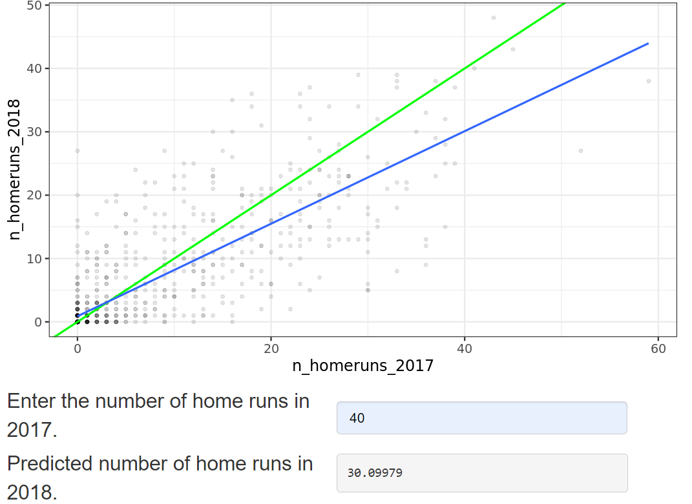

# Section 02: Predictions and model objects

```{r}
library(dplyr)
library(ggplot2)
library(fst)

file_path <- file.path("..", "00_Datasets", "taiwan_real_estate.fst")
taiwan_real_estate <- read_fst(file_path)
taiwan_real_estate$house_age_years <- as.factor(taiwan_real_estate$house_age_years)
head(taiwan_real_estate, 3)
```

### **`01-Predicting house prices`**

Perhaps the most useful feature of statistical models like linear regression is that you can make predictions. That is, you specify values for each of the explanatory variables, feed them to the model, and you get a prediction for the corresponding response variable. The code flow is as follows.

    explanatory_data <- tibble(
      explanatory_var = some_values
    )
    explanatory_data %>%
      mutate(
        response_var = predict(model, explanatory_data)
      )

Here, you'll make predictions for the house prices in the Taiwan real estate dataset.

`taiwan_real_estate` is available. The linear regression model of house price versus number of convenience stores is available as `mdl_price_vs_conv` (*print it and read the call to see how it was made*); and `dplyr` is loaded.

```{r}
mdl_price_vs_conv <- lm(formula = price_twd_msq ~ n_convenience, data = taiwan_real_estate)
```

-   Create a tibble of explanatory data, where the number of convenience stores,`n_convenience`, takes the integer values from zero to ten.

```{=html}
<!-- -->
```
-   Use the model `mdl_price_vs_conv` to make predictions from `explanatory_data`.

```{r}
# Create a tibble with n_convenience column from zero to ten
explanatory_data <- tibble(
  n_convenience = 0:10
)

# Use mdl_price_vs_conv to predict with explanatory_data
predict(mdl_price_vs_conv, explanatory_data)
```

Create a tibble of predictions named `prediction_data`.

-   Start with `explanatory_data`.

-   Add an extra column, `price_twd_msq`, containing the predictions.

```{r}
# Create a tibble with n_convenience column from zero to ten
explanatory_data <- tibble(
  n_convenience = 0:10
)

# Edit this, so predictions are stored in prediction_data
prediction_data <- explanatory_data %>%
  mutate(price_twd_msq = predict(mdl_price_vs_conv, explanatory_data))


# See the result
prediction_data
```

### **`02-Visualizing predictions`**

The prediction data you calculated contains a column of explanatory variable values and a column of response variable values. That means you can plot it on the same scatter plot of response versus explanatory data values.

`prediction_data` is available and `ggplot2` is loaded. The code for the scatter plot with linear trend line you drew in Chapter 1 is shown.

-   Extend the plotting code to include the point predictions in `prediction_data`. Color the points yellow.

```{r}
# Add to the plot
ggplot(taiwan_real_estate, aes(n_convenience, price_twd_msq)) +
  geom_point() +
  geom_smooth(method = "lm", se = FALSE) +
  # Add a point layer of prediction data, colored yellow
  geom_point( 
        data = prediction_data, 
        color = "yellow"
  )
```

### **`03-The limits of prediction`**

In the last exercise you made predictions on some sensible, could-happen-in-real-life, situations. That is, the cases when the number of nearby convenience stores were between zero and ten. To test the limits of the model's ability to predict, try some impossible situations.

Use the console to try predicting house prices from `mdl_price_vs_conv` when there are `-1` convenience stores. Do the same for `2.5` convenience stores. What happens in each case?

`mdl_price_vs_conv` is available and `dplyr` is loaded.

-   Create some impossible explanatory data. Define a tibble with one column, n_convenience, set to minus one, assigning to `minus_one`. Create another with `n_convenience` set to two point five, assigning to `two_pt_five`.

```{r}
minus_one <- tibble(n_convenience = -1)
two_pt_five <- tibble(n_convenience = 2.5)
```

-   Try making predictions on your two impossible cases. What happens?

```{r}
predict(mdl_price_vs_conv, minus_one)
predict(mdl_price_vs_conv, two_pt_five)
```

`Answer:` The model successfully gives a prediction about cases that are impossible in real life.\

### **`04-Extracting model elements`**

The variable returned by `lm()` that contains the model object has many elements. In order to perform further analysis on the model results, you need to extract the useful bits of it. The model coefficients, the fitted values, and the residuals are perhaps the most important bits of the linear model object.

`mdl_price_vs_conv` is available.

-   Print the coefficients of `mdl_price_vs_conv`.

```{r}
# Get the model coefficients of mdl_price_vs_conv
coefficients(mdl_price_vs_conv)
```

-   Print the fitted values of `mdl_price_vs_conv`.

```{r}
# Get the fitted values of mdl_price_vs_conv
fitted(mdl_price_vs_conv)
```

-   Print the residuals of `mdl_price_vs_conv`.

```{r}
# Get the residuals of mdl_price_vs_conv
residuals(mdl_price_vs_conv)
```

-   Print a summary of `mdl_price_vs_conv`.

```{r}
# Print a summary of mdl_price_vs_conv
summary(mdl_price_vs_conv)
```

### **`05-Manually predicting house prices`**

You can manually calculate the predictions from the model coefficients. When making predictions in real life, it is better to use `predict()`, but doing this manually is helpful to reassure yourself that predictions aren't magic---they are simply arithmetic.

In fact, for a simple linear regression, the predicted value is just the intercept plus the slope times the explanatory variable.


response=intercept+slope∗explanatory

`mdl_price_vs_conv` and `explanatory_data` are available, and `dplyr` is loaded.

-   Get the coefficients of `mdl_price_vs_conv`, assigning to `coeffs`.

-   Get the intercept, which is the first element of `coeffs`, assigning to `intercept`.

-   Get the slope, which is the second element of `coeffs`, assigning to `slope`.

-   Manually predict `price_twd_msq` using the intercept, slope, and `n_convenience`.

```{r}
# Get the coefficients of mdl_price_vs_conv
coeffs <- coefficients(mdl_price_vs_conv)

# Get the intercept
intercept <- coeffs[1]

# Get the slope
slope <- coeffs[2]

explanatory_data %>% 
  mutate(
    # Manually calculate the predictions
    price_twd_msq = intercept + slope * n_convenience
  )

# Compare to the results from predict()
predict(mdl_price_vs_conv, explanatory_data)
```

### 
**`06-Using broom`**

Many programming tasks are easier if you keep all your data inside data frames. This is particularly true if you are a tidyverse fan, where `dplyr` and `ggplot2` require you to use data frames. The `broom` package contains functions that decompose models into three data frames: one for the coefficient-level elements (the coefficients themselves, as well as p-values for each coefficient), the observation-level elements (like fitted values and residuals), and the model-level elements (mostly performance metrics).

The functions in `broom` are generic. That is, they work with many model types, not just linear regression model objects. They also work with logistic regression model objects (as you'll see in Chapter 4), and many other types of model.

`mdl_price_vs_conv` is available and `broom` is loaded.

-   Tidy the model to print the coefficient-level elements of `mdl_price_vs_conv`.

```{r}
library(broom)
# Get the coefficient-level elements of the model
tidy(mdl_price_vs_conv)
```

-   Augment the model to print the observation-level elements of `mdl_price_vs_conv`.

```{r}
# Get the observation-level elements of the model
augment(mdl_price_vs_conv)
```

-   Glance at the model to print the model-level elements of `mdl_price_vs_conv`.

```{r}
# Get the model-level elements of the model
glance(mdl_price_vs_conv) 
```

### **`07-Home run!`**

Regression to the mean is an important concept in many areas, including sports.

Here you can see a dataset of baseball batting data in 2017 and 2018. Each point represents a player, and more home runs is better. A naive prediction might be that the performance in 2018 would be that it is the same as the performance in 2017. That is, a linear regression would lie on the "y equals x" line.

Explore the plot and make predictions. What does regression to the mean say about the number of home runs in 2018 for a player who was very successful in 2017?

{width="418"}

**`Answer:`**
Someone who hit 40 home runs in 2017 is predicted to hit 10 fewer home runs the next year because regression to the mean states that, on average, extremely high values are not sustained.

### `08-Plotting consecutive portfolio returns`

Regression to the mean is also an important concept in investing. Here you'll look at the annual returns from investing in companies in the Standard and Poor 500 index (S&P 500), in 2018 and 2019.

The `sp500_yearly_returns` dataset contains three columns:

| variable    | meaning                                               |
|:------------|:------------------------------------------------------|
| symbol      | Stock ticker symbol uniquely identifying the company. |
| return_2018 | A measure of investment performance in 2018.          |
| return_2019 | A measure of investment performance in 2019.          |

A positive number for the return means the investment increased in value; negative means it lost value.

Just as with baseball home runs, a naive prediction might be that the investment performance stays the same from year to year, lying on the "y equals x" line.

`sp500_yearly_returns` is available and `ggplot2` is loaded.

-   Using `sp500_yearly_returns`, draw a scatter plot of `return_2019` vs. `return_2018`.

-   Add an "A-B line", colored `"green"`, with size `1`.

-   Add a smooth trend line made with the linear regression method, and no standard error ribbon.

-   Fix the coordinates so distances along the x and y axes appear the same.

\

\

\

\


\

\

\

\


\


\

