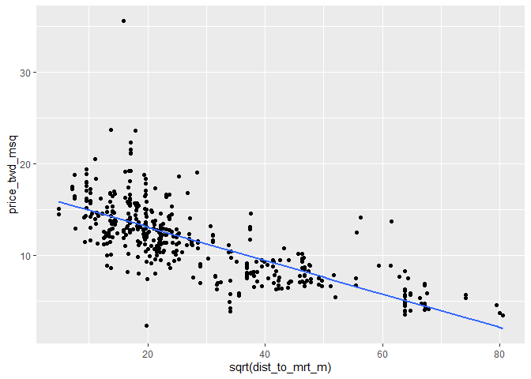

Predictions and model objects
================
Mohamad Osman
2022-07-19

# Section 02: Predictions and model objects

``` r
library(dplyr)
```

    ## 
    ## Attaching package: 'dplyr'

    ## The following objects are masked from 'package:stats':
    ## 
    ##     filter, lag

    ## The following objects are masked from 'package:base':
    ## 
    ##     intersect, setdiff, setequal, union

``` r
library(ggplot2)
library(fst)

file_path <- file.path("..", "00_Datasets", "taiwan_real_estate.fst")
taiwan_real_estate <- read_fst(file_path)
taiwan_real_estate$house_age_years <- as.factor(taiwan_real_estate$house_age_years)
head(taiwan_real_estate, 3)
```

    ##   dist_to_mrt_m n_convenience house_age_years price_twd_msq
    ## 1      84.87882            10        30 to 45      11.46747
    ## 2     306.59470             9        15 to 30      12.76853
    ## 3     561.98450             5         0 to 15      14.31165

### **`01-Predicting house prices`**

Perhaps the most useful feature of statistical models like linear
regression is that you can make predictions. That is, you specify values
for each of the explanatory variables, feed them to the model, and you
get a prediction for the corresponding response variable. The code flow
is as follows.

    explanatory_data <- tibble(
      explanatory_var = some_values
    )
    explanatory_data %>%
      mutate(
        response_var = predict(model, explanatory_data)
      )

Here, you’ll make predictions for the house prices in the Taiwan real
estate dataset.

`taiwan_real_estate` is available. The linear regression model of house
price versus number of convenience stores is available as
`mdl_price_vs_conv` (*print it and read the call to see how it was
made*); and `dplyr` is loaded.

``` r
mdl_price_vs_conv <- lm(formula = price_twd_msq ~ n_convenience, data = taiwan_real_estate)
```

-   Create a tibble of explanatory data, where the number of convenience
    stores,`n_convenience`, takes the integer values from zero to ten.

<!-- -->

-   Use the model `mdl_price_vs_conv` to make predictions from
    `explanatory_data`.

``` r
# Create a tibble with n_convenience column from zero to ten
explanatory_data <- tibble(
  n_convenience = 0:10
)

# Use mdl_price_vs_conv to predict with explanatory_data
predict(mdl_price_vs_conv, explanatory_data)
```

    ##         1         2         3         4         5         6         7         8 
    ##  8.224237  9.022317  9.820397 10.618477 11.416556 12.214636 13.012716 13.810795 
    ##         9        10        11 
    ## 14.608875 15.406955 16.205035

Create a tibble of predictions named `prediction_data`.

-   Start with `explanatory_data`.

-   Add an extra column, `price_twd_msq`, containing the predictions.

``` r
# Create a tibble with n_convenience column from zero to ten
explanatory_data <- tibble(
  n_convenience = 0:10
)

# Edit this, so predictions are stored in prediction_data
prediction_data <- explanatory_data %>%
  mutate(price_twd_msq = predict(mdl_price_vs_conv, explanatory_data))


# See the result
prediction_data
```

    ## # A tibble: 11 × 2
    ##    n_convenience price_twd_msq
    ##            <int>         <dbl>
    ##  1             0          8.22
    ##  2             1          9.02
    ##  3             2          9.82
    ##  4             3         10.6 
    ##  5             4         11.4 
    ##  6             5         12.2 
    ##  7             6         13.0 
    ##  8             7         13.8 
    ##  9             8         14.6 
    ## 10             9         15.4 
    ## 11            10         16.2

### **`02-Visualizing predictions`**

The prediction data you calculated contains a column of explanatory
variable values and a column of response variable values. That means you
can plot it on the same scatter plot of response versus explanatory data
values.

`prediction_data` is available and `ggplot2` is loaded. The code for the
scatter plot with linear trend line you drew in Chapter 1 is shown.

-   Extend the plotting code to include the point predictions in
    `prediction_data`. Color the points yellow.

``` r
# Add to the plot
ggplot(taiwan_real_estate, aes(n_convenience, price_twd_msq)) +
  geom_point() +
  geom_smooth(method = "lm", se = FALSE) +
  # Add a point layer of prediction data, colored yellow
  geom_point( 
        data = prediction_data, 
        color = "yellow"
  )
```

    ## `geom_smooth()` using formula 'y ~ x'

<!-- -->

### **`03-The limits of prediction`**

In the last exercise you made predictions on some sensible,
could-happen-in-real-life, situations. That is, the cases when the
number of nearby convenience stores were between zero and ten. To test
the limits of the model’s ability to predict, try some impossible
situations.

Use the console to try predicting house prices from `mdl_price_vs_conv`
when there are `-1` convenience stores. Do the same for `2.5`
convenience stores. What happens in each case?

`mdl_price_vs_conv` is available and `dplyr` is loaded.

-   Create some impossible explanatory data. Define a tibble with one
    column, n_convenience, set to minus one, assigning to `minus_one`.
    Create another with `n_convenience` set to two point five, assigning
    to `two_pt_five`.

``` r
minus_one <- tibble(n_convenience = -1)
two_pt_five <- tibble(n_convenience = 2.5)
```

-   Try making predictions on your two impossible cases. What happens?

``` r
predict(mdl_price_vs_conv, minus_one)
```

    ##        1 
    ## 7.426158

``` r
predict(mdl_price_vs_conv, two_pt_five)
```

    ##        1 
    ## 10.21944

`Answer:` The model successfully gives a prediction about cases that are
impossible in real life.  

### **`04-Extracting model elements`**

The variable returned by `lm()` that contains the model object has many
elements. In order to perform further analysis on the model results, you
need to extract the useful bits of it. The model coefficients, the
fitted values, and the residuals are perhaps the most important bits of
the linear model object.

`mdl_price_vs_conv` is available.

-   Print the coefficients of `mdl_price_vs_conv`.

``` r
# Get the model coefficients of mdl_price_vs_conv
coefficients(mdl_price_vs_conv)
```

    ##   (Intercept) n_convenience 
    ##     8.2242375     0.7980797

-   Print the fitted values of `mdl_price_vs_conv`.

``` r
# Get the fitted values of mdl_price_vs_conv
fitted(mdl_price_vs_conv)
```

    ##         1         2         3         4         5         6         7         8 
    ## 16.205035 15.406955 12.214636 12.214636 12.214636 10.618477 13.810795 13.012716 
    ##         9        10        11        12        13        14        15        16 
    ##  9.022317 10.618477  9.022317 15.406955 12.214636 11.416556 11.416556  9.820397 
    ##        17        18        19        20        21        22        23        24 
    ## 13.012716  9.022317 14.608875 13.810795 10.618477 13.810795  9.022317 13.810795 
    ##        25        26        27        28        29        30        31        32 
    ## 11.416556  9.820397 12.214636 12.214636 11.416556 12.214636  8.224237 13.810795 
    ##        33        34        35        36        37        38        39        40 
    ##  9.022317 13.012716 13.810795  8.224237  9.820397  9.022317 13.012716 12.214636 
    ##        41        42        43        44        45        46        47        48 
    ##  8.224237  8.224237 12.214636 13.012716 11.416556 14.608875 15.406955 10.618477 
    ##        49        50        51        52        53        54        55        56 
    ##  8.224237  9.022317 11.416556  9.022317 10.618477 12.214636 12.214636  8.224237 
    ##        57        58        59        60        61        62        63        64 
    ## 14.608875 13.810795  9.022317 12.214636  9.820397 13.012716 10.618477 11.416556 
    ##        65        66        67        68        69        70        71        72 
    ##  8.224237 14.608875 13.012716 12.214636 13.012716 12.214636 15.406955 10.618477 
    ##        73        74        75        76        77        78        79        80 
    ## 14.608875  8.224237 16.205035  9.022317 10.618477 10.618477  9.820397  9.022317 
    ##        81        82        83        84        85        86        87        88 
    ## 11.416556 13.012716 13.810795 10.618477 13.810795 15.406955  9.022317  8.224237 
    ##        89        90        91        92        93        94        95        96 
    ##  8.224237  8.224237  9.022317  8.224237 11.416556  8.224237 12.214636 12.214636 
    ##        97        98        99       100       101       102       103       104 
    ## 15.406955 10.618477 12.214636 15.406955 11.416556  9.022317 13.012716 13.012716 
    ##       105       106       107       108       109       110       111       112 
    ## 13.012716 13.012716 14.608875  9.022317  9.820397 10.618477 12.214636 13.810795 
    ##       113       114       115       116       117       118       119       120 
    ## 10.618477 13.012716 14.608875  9.820397  9.022317  8.224237 10.618477 12.214636 
    ##       121       122       123       124       125       126       127       128 
    ## 12.214636 12.214636 11.416556  8.224237 13.810795 13.012716 11.416556 12.214636 
    ##       129       130       131       132       133       134       135       136 
    ## 13.012716 13.810795 14.608875 10.618477 12.214636 14.608875 13.012716  8.224237 
    ##       137       138       139       140       141       142       143       144 
    ## 12.214636 13.012716  8.224237 12.214636 12.214636 10.618477 12.214636 12.214636 
    ##       145       146       147       148       149       150       151       152 
    ##  9.022317 12.214636  8.224237 14.608875  8.224237 14.608875 13.810795 15.406955 
    ##       153       154       155       156       157       158       159       160 
    ##  9.022317 13.012716  8.224237  8.224237  8.224237 11.416556 12.214636 11.416556 
    ##       161       162       163       164       165       166       167       168 
    ## 14.608875 10.618477  8.224237 12.214636  8.224237  9.022317 13.012716 14.608875 
    ##       169       170       171       172       173       174       175       176 
    ## 12.214636  9.022317  8.224237 12.214636 15.406955 11.416556 13.810795 10.618477 
    ##       177       178       179       180       181       182       183       184 
    ##  8.224237 15.406955 11.416556  9.022317  8.224237 14.608875 10.618477  8.224237 
    ##       185       186       187       188       189       190       191       192 
    ##  8.224237 10.618477 10.618477  8.224237 14.608875  8.224237 14.608875  9.820397 
    ##       193       194       195       196       197       198       199       200 
    ## 13.810795 12.214636  8.224237 12.214636  9.820397 14.608875 13.810795 14.608875 
    ##       201       202       203       204       205       206       207       208 
    ##  8.224237 12.214636 10.618477 12.214636  9.022317 10.618477 16.205035 10.618477 
    ##       209       210       211       212       213       214       215       216 
    ##  9.022317 14.608875 12.214636  9.022317  9.820397 15.406955 10.618477 14.608875 
    ##       217       218       219       220       221       222       223       224 
    ##  9.022317 13.012716 12.214636 14.608875 15.406955  8.224237 16.205035  8.224237 
    ##       225       226       227       228       229       230       231       232 
    ## 13.012716 13.012716  8.224237 14.608875  8.224237  8.224237 10.618477  8.224237 
    ##       233       234       235       236       237       238       239       240 
    ##  9.022317 15.406955 11.416556 13.810795 16.205035  8.224237  8.224237  8.224237 
    ##       241       242       243       244       245       246       247       248 
    ##  9.820397 13.810795 10.618477 14.608875 10.618477 12.214636 13.012716  8.224237 
    ##       249       250       251       252       253       254       255       256 
    ##  8.224237  9.022317 13.810795  8.224237 15.406955  9.820397 12.214636  9.022317 
    ##       257       258       259       260       261       262       263       264 
    ##  9.022317  9.022317 13.012716  8.224237 11.416556 10.618477 12.214636 10.618477 
    ##       265       266       267       268       269       270       271       272 
    ## 13.810795 11.416556 10.618477 12.214636 12.214636  8.224237  9.022317 14.608875 
    ##       273       274       275       276       277       278       279       280 
    ## 12.214636  9.022317 13.810795 13.810795 12.214636 10.618477 13.012716 10.618477 
    ##       281       282       283       284       285       286       287       288 
    ## 13.012716 15.406955  9.022317  9.820397 13.810795 10.618477 15.406955 12.214636 
    ##       289       290       291       292       293       294       295       296 
    ## 13.012716 12.214636  8.224237 13.810795 12.214636 13.810795 13.012716 10.618477 
    ##       297       298       299       300       301       302       303       304 
    ## 11.416556 11.416556  8.224237 16.205035 11.416556  8.224237 10.618477  8.224237 
    ##       305       306       307       308       309       310       311       312 
    ## 10.618477 12.214636  9.022317  8.224237 12.214636  8.224237  9.820397 11.416556 
    ##       313       314       315       316       317       318       319       320 
    ## 15.406955 12.214636 13.012716  9.820397 13.810795  9.820397 16.205035 12.214636 
    ##       321       322       323       324       325       326       327       328 
    ##  8.224237 11.416556  9.022317 13.012716  9.820397 14.608875 13.810795 10.618477 
    ##       329       330       331       332       333       334       335       336 
    ## 10.618477  8.224237  8.224237  8.224237  9.820397 12.214636 12.214636 13.012716 
    ##       337       338       339       340       341       342       343       344 
    ##  9.820397 12.214636 15.406955 12.214636  8.224237  9.820397 15.406955 14.608875 
    ##       345       346       347       348       349       350       351       352 
    ##  8.224237  8.224237  9.820397  9.022317 13.012716 12.214636 12.214636 10.618477 
    ##       353       354       355       356       357       358       359       360 
    ## 10.618477 10.618477  9.022317 12.214636  9.022317 15.406955 13.012716  8.224237 
    ##       361       362       363       364       365       366       367       368 
    ## 16.205035 14.608875 11.416556 16.205035 13.810795 11.416556  9.022317  9.820397 
    ##       369       370       371       372       373       374       375       376 
    ##  9.022317 10.618477 12.214636 12.214636 13.810795  9.022317 12.214636  8.224237 
    ##       377       378       379       380       381       382       383       384 
    ##  9.820397 14.608875 14.608875 13.012716 12.214636 15.406955  8.224237 11.416556 
    ##       385       386       387       388       389       390       391       392 
    ##  8.224237 16.205035  8.224237 10.618477 11.416556 14.608875 15.406955  9.022317 
    ##       393       394       395       396       397       398       399       400 
    ## 13.012716 11.416556  9.022317 11.416556  9.022317 11.416556  9.820397  9.022317 
    ##       401       402       403       404       405       406       407       408 
    ## 12.214636 10.618477  9.022317 15.406955 12.214636 13.012716 13.810795  8.224237 
    ##       409       410       411       412       413       414 
    ## 10.618477  8.224237 15.406955 13.810795 12.214636 15.406955

-   Print the residuals of `mdl_price_vs_conv`.

``` r
# Get the residuals of mdl_price_vs_conv
residuals(mdl_price_vs_conv)
```

    ##             1             2             3             4             5 
    ##  -4.737561094  -2.638422376   2.097012981   4.366301937   0.826211165 
    ##             6             7             8             9            10 
    ##  -0.905919870  -1.617149478   1.117390148  -3.333966186  -3.931638479 
    ##            11            12            13            14            15 
    ##   3.504157868   2.172470211  -0.323561906  -4.215346032  -1.038341493 
    ##            16            17            18            19            20 
    ##   5.459482085   8.197571691   2.293870425  -1.810085473   0.621882292 
    ##            21            22            23            24            25 
    ##  -1.753121081   1.801912549  -1.579049393   0.682396664   0.323231880 
    ##            26            27            28            29            30 
    ##  -1.650956644   4.789902542  -2.048221512   2.804321139   5.062217217 
    ##            31            32            33            34            35 
    ##  -1.537399329  -6.246498949   1.325640471   1.904076986   2.860914062 
    ##            36            37            38            39            40 
    ##   0.035974348  -2.891501273  -1.367249091   1.419962009   1.764183934 
    ##            41            42            43            44            45 
    ##  -3.413344866  -2.717429586  -1.715392466  -2.695015299   4.892066979 
    ##            46            47            48            49            50 
    ##  -3.020372916  -2.698936748   7.989692838  -4.169774518  -5.028368607 
    ##            51            52            53            54            55 
    ##   1.957119929  -2.759079650  -2.449036361  -0.444590650   3.428329168 
    ##            56            57            58            59            60 
    ##  -4.079002960  -1.931114217   2.376799085  -2.184193115   0.614410863 
    ##            61            62            63            64            65 
    ##  -3.375616251   6.109825851  -2.237236058   5.224896026  -0.569169374 
    ##            66            67            68            69            70 
    ##  -1.204941751   2.327677591   4.971445659  -2.059614391   0.493382118 
    ##            71            72            73            74            75 
    ##   2.444784886   1.726455319  -3.625516638  -2.172800236   0.254874610 
    ##            76            77            78            79            80 
    ##  -0.096447275   0.516167875  -2.872636966  -0.803755434  -1.004162858 
    ##            81            82            83            84            85 
    ##   0.777089672  -1.878071274   0.742911036  -5.262954666  -0.588405151 
    ##            86            87            88            89            90 
    ##  -0.036304373  -0.852876927  -2.687172400   6.299211866  -0.569169374 
    ##            91            92            93            94            95 
    ##   4.714445312   4.846866935  -4.820489753  -3.352830494   0.190810258 
    ##            96            97            98            99           100 
    ##   3.458586354   2.596070816  -0.149490218   3.216528866   3.413014841 
    ##           101           102           103           104           105 
    ##   0.141688764   0.932297051   3.447193476   0.814818287  -3.784273998 
    ##           106           107           108           109           110 
    ##   8.469886366  -0.357740541  -0.973905672   0.497303568  -2.025435755 
    ##           111           112           113           114           115 
    ##   3.398071982  -1.889464153  -3.629066618 -10.713169610   1.518204996 
    ##           116           117           118           119           120 
    ##   4.218937456  -5.330940467  -4.290803262  -1.359777662   5.818646869 
    ##           121           122           123           124           125 
    ##  -2.744136792   2.308813283  -1.582970843   5.542782214   3.556829342 
    ##           126           127           128           129           130 
    ##   1.692276683   7.615213726   4.426816309   5.353396199  -1.405349176 
    ##           131           132           133           134           135 
    ##  -3.262430405  -1.329520476  -0.868191255  -2.657286683  -0.244183226 
    ##           136           137           138           139           140 
    ##  -1.930742748   1.945727050   1.329190450   4.937638493   0.644668049 
    ##           141           142           143           144           145 
    ##   3.337557610  -1.874149825  -0.868191255  -0.081504417  -0.429276322 
    ##           146           147           148           149           150 
    ##   1.552383631   7.570013682  -1.537770798   5.421753470  -2.596772311 
    ##           151           152           153           154           155 
    ##   0.863939781  -1.881992724  -0.277990392  -0.637526645  -1.960999934 
    ##           156           157           158           159           160 
    ##  -3.504116424  -2.687172400  -0.644998074  -0.293304720  -0.100368725 
    ##           161           162           163           164           165 
    ##   2.879778370   1.363369086  -4.714403867   4.578102239   8.477729264 
    ##           166           167           168           169           170 
    ##   0.236381772   9.256573204  -1.477256426  -0.898448441  -1.911878440 
    ##           171           172           173           174           175 
    ##  -3.867202657   5.576589380   2.172470211  -0.796284005  -0.134547360 
    ##           176           177           178           179           180 
    ##   0.425396317  -2.414857725  -2.698936748  -0.312169027   3.867244101 
    ##           181           182           183           184           185 
    ##  -3.534373610   2.304891834  -3.477780687  -2.535886469  -1.628170887 
    ##           186           187           188           189           190 
    ##  -4.113181595  -2.842379780  -1.567656515  -1.204941751  -2.021514306 
    ##           191           192           193           194           195 
    ##  -1.810085473   1.616819453  -0.890977012   2.702156702   0.641118069 
    ##           196           197           198           199           200 
    ##  -1.745649652   1.253733220  -0.024911494  -1.980235711  -5.047604384 
    ##           201           202           203           204           205 
    ##  -0.508655002   1.673412376  -1.087462987   1.733926748  -0.973905672 
    ##           206           207           208           209           210 
    ##  -4.143438781  -2.891872743  -0.270518963  -1.094934416  -2.233686078 
    ##           211           212           213           214           215 
    ##   3.579615099   4.139558776  -0.410412015   2.142213025  -4.294724712 
    ##           216           217           218           219           220 
    ##  -0.055168680   2.989785705  -0.667783831   1.038011468  -2.445486381 
    ##           221           222           223           224           225 
    ##   8.284421800   3.424779189  -1.530299369   4.574552260   0.905589845 
    ##           226           227           228           229           230 
    ##   1.813305428  -4.351317634  -2.445486381   5.875611261  -2.475372097 
    ##           231           232           233           234           235 
    ##  -0.512576451  -3.776431099  -3.757566791  -5.603626612  -4.185088846 
    ##           236           237           238           239           240 
    ##  -1.919721339   2.524163566   3.576065119   4.060180096   0.762146813 
    ##           241           242           243           244           245 
    ##  -1.106327294  -1.284320431  -0.512576451  -0.024911494  -4.052667223 
    ##           246           247           248           249           250 
    ##   0.130295885  -0.728298203  -1.234827468  -1.476884957  -4.483739257 
    ##           251           252           253           254           255 
    ##  -4.733639645  -4.048745774   0.538582163  -1.983785691   3.458586354 
    ##           256           257           258           259           260 
    ##  -3.757566791  -1.004162858   4.260587520   6.140083037   0.489832139 
    ##           261           262           263           264           265 
    ##  -2.127600192  -3.235723199   3.821672587  -1.026948615  -1.526377920 
    ##           266           267           268           269           270 
    ##   0.111431578  -3.447523501   0.221067444  -0.081504417  -1.265084654 
    ##           271           272           273           274           275 
    ##  26.529876477  -6.590720874   0.039524327  -0.156961647  -1.405349176 
    ##           276           277           278           279           280 
    ##   1.227026014  -1.927192768  -2.237236058   0.300446123  -1.208491731 
    ##           281           282           283           284           285 
    ##   0.724046729  -1.851735538  -1.276477532  -2.709958157  -3.402323457 
    ##           286           287           288           289           290 
    ##   6.113747301   1.627840862  -2.260021815   2.418449149   1.249811771 
    ##           291           292           293           294           295 
    ##   2.970921397   2.649113759  -4.801625446  -0.951491384  -1.484727855 
    ##           296           297           298           299           300 
    ##  -4.022410037  -1.098855865  -2.793258286  -3.171287377  -2.256471835 
    ##           301           302           303           304           305 
    ##  -0.251654655   2.577577978  -3.598809432   3.394522003  -1.722863895 
    ##           306           307           308           309           310 
    ##   4.426816309   6.166790244  -0.750712491   3.821672587  -2.445114911 
    ##           311           312           313           314           315 
    ##  -2.346871924   1.351976207   8.193650241   0.735439607  -0.425726342 
    ##           316           317           318           319           320 
    ##  -1.560185086  -1.102777315   1.526047895  -1.136955950  -4.075452980 
    ##           321           322           323           324           325 
    ##  -2.596400842  -0.009597166   0.992811424  -0.153411668  -0.349897642 
    ##           326           327           328           329           330 
    ##  -3.080887289   4.978917088   0.485910689  -3.477780687  -2.414857725 
    ##           331           332           333           334           335 
    ##  -4.351317634  -3.504116424   2.161448802  -0.595876580  -5.315997609 
    ##           336           337           338           339           340 
    ##  -1.968842833   0.951161359  -2.865165537  -4.423596355   3.034985749 
    ##           341           342           343           344           345 
    ##   4.756095376   1.374761964   0.780639651  -0.509026472   4.241723213 
    ##           346           347           348           349           350 
    ##   3.243236072  -0.501183573  -5.633512328   3.235393173   2.006241423 
    ##           351           352           353           354           355 
    ##   0.584153677  -1.964921383  -2.842379780  -1.147977359   0.085095841 
    ##           356           357           358           359           360 
    ##   6.151475916   4.684188126  -1.821478352   0.633275170  -0.750712491 
    ##           361           362           363           364           365 
    ##  -1.953899974   4.543923604   0.686318113  -1.681585300  -3.795666876 
    ##           366           367           368           369           370 
    ##  -2.490686425  -1.518535021  -3.496644995   4.018530032  -3.719838176 
    ##           371           372           373           374           375 
    ##   0.523639305   3.428329168  -1.254063245   6.771933965   2.762671075 
    ##           376           377           378           379           380 
    ##  -1.023027165  -0.591955131   2.577206509  -3.292687591   8.076542946 
    ##           381           382           383           384           385 
    ##   3.912444146  -1.095305886   0.641118069   0.777089672  -4.321060448 
    ##           386           387           388           389           390 
    ##  -2.105185905   8.507986450  -2.872636966  -3.156344519   5.875239792 
    ##           391           392           393           394           395 
    ##  -3.727681075   0.448182074  -2.331929066   0.777089672  -1.548792207 
    ##           396           397           398           399           400 
    ##   1.442747765   0.629725191  -1.673742401  -2.861244087   2.263613239 
    ##           401           402           403           404           405 
    ##  -1.473334977  -2.237236058  -0.399019136  -3.394852028   0.251324630 
    ##           406           407           408           409           410 
    ##  -1.757042530  -1.556635106  -1.476884957  -2.116207314  -3.564630796 
    ##           411           412           413           414 
    ##  -0.278361861  -1.526377920   3.670386657   3.927387004

-   Print a summary of `mdl_price_vs_conv`.

``` r
# Print a summary of mdl_price_vs_conv
summary(mdl_price_vs_conv)
```

    ## 
    ## Call:
    ## lm(formula = price_twd_msq ~ n_convenience, data = taiwan_real_estate)
    ## 
    ## Residuals:
    ##      Min       1Q   Median       3Q      Max 
    ## -10.7132  -2.2213  -0.5409   1.8105  26.5299 
    ## 
    ## Coefficients:
    ##               Estimate Std. Error t value Pr(>|t|)    
    ## (Intercept)    8.22424    0.28500   28.86   <2e-16 ***
    ## n_convenience  0.79808    0.05653   14.12   <2e-16 ***
    ## ---
    ## Signif. codes:  0 '***' 0.001 '**' 0.01 '*' 0.05 '.' 0.1 ' ' 1
    ## 
    ## Residual standard error: 3.384 on 412 degrees of freedom
    ## Multiple R-squared:  0.326,  Adjusted R-squared:  0.3244 
    ## F-statistic: 199.3 on 1 and 412 DF,  p-value: < 2.2e-16

### **`05-Manually predicting house prices`**

You can manually calculate the predictions from the model coefficients.
When making predictions in real life, it is better to use `predict()`,
but doing this manually is helpful to reassure yourself that predictions
aren’t magic—they are simply arithmetic.

In fact, for a simple linear regression, the predicted value is just the
intercept plus the slope times the explanatory variable.


response=intercept+slope∗explanatory

`mdl_price_vs_conv` and `explanatory_data` are available, and `dplyr` is
loaded.

-   Get the coefficients of `mdl_price_vs_conv`, assigning to `coeffs`.

-   Get the intercept, which is the first element of `coeffs`, assigning
    to `intercept`.

-   Get the slope, which is the second element of `coeffs`, assigning to
    `slope`.

-   Manually predict `price_twd_msq` using the intercept, slope, and
    `n_convenience`.

``` r
# Get the coefficients of mdl_price_vs_conv
coeffs <- coefficients(mdl_price_vs_conv)

# Get the intercept
intercept <- coeffs[1]

# Get the slope
slope <- coeffs[2]

explanatory_data %>% 
  mutate(
    # Manually calculate the predictions
    price_twd_msq = intercept + slope * n_convenience
  )
```

    ## # A tibble: 11 × 2
    ##    n_convenience price_twd_msq
    ##            <int>         <dbl>
    ##  1             0          8.22
    ##  2             1          9.02
    ##  3             2          9.82
    ##  4             3         10.6 
    ##  5             4         11.4 
    ##  6             5         12.2 
    ##  7             6         13.0 
    ##  8             7         13.8 
    ##  9             8         14.6 
    ## 10             9         15.4 
    ## 11            10         16.2

``` r
# Compare to the results from predict()
predict(mdl_price_vs_conv, explanatory_data)
```

    ##         1         2         3         4         5         6         7         8 
    ##  8.224237  9.022317  9.820397 10.618477 11.416556 12.214636 13.012716 13.810795 
    ##         9        10        11 
    ## 14.608875 15.406955 16.205035

### 

### **`06-Using broom`**

Many programming tasks are easier if you keep all your data inside data
frames. This is particularly true if you are a tidyverse fan, where
`dplyr` and `ggplot2` require you to use data frames. The `broom`
package contains functions that decompose models into three data frames:
one for the coefficient-level elements (the coefficients themselves, as
well as p-values for each coefficient), the observation-level elements
(like fitted values and residuals), and the model-level elements (mostly
performance metrics).

The functions in `broom` are generic. That is, they work with many model
types, not just linear regression model objects. They also work with
logistic regression model objects (as you’ll see in Chapter 4), and many
other types of model.

`mdl_price_vs_conv` is available and `broom` is loaded.

-   Tidy the model to print the coefficient-level elements of
    `mdl_price_vs_conv`.

``` r
library(broom)
# Get the coefficient-level elements of the model
tidy(mdl_price_vs_conv)
```

    ## # A tibble: 2 × 5
    ##   term          estimate std.error statistic   p.value
    ##   <chr>            <dbl>     <dbl>     <dbl>     <dbl>
    ## 1 (Intercept)      8.22     0.285       28.9 5.81e-101
    ## 2 n_convenience    0.798    0.0565      14.1 3.41e- 37

-   Augment the model to print the observation-level elements of
    `mdl_price_vs_conv`.

``` r
# Get the observation-level elements of the model
augment(mdl_price_vs_conv)
```

    ## # A tibble: 414 × 8
    ##    price_twd_msq n_convenience .fitted .resid    .hat .sigma  .cooksd .std.resid
    ##            <dbl>         <dbl>   <dbl>  <dbl>   <dbl>  <dbl>    <dbl>      <dbl>
    ##  1         11.5             10   16.2  -4.74  0.0121    3.38  1.22e-2     -1.41 
    ##  2         12.8              9   15.4  -2.64  0.00913   3.39  2.83e-3     -0.783
    ##  3         14.3              5   12.2   2.10  0.00264   3.39  5.10e-4      0.621
    ##  4         16.6              5   12.2   4.37  0.00264   3.38  2.21e-3      1.29 
    ##  5         13.0              5   12.2   0.826 0.00264   3.39  7.92e-5      0.244
    ##  6          9.71             3   10.6  -0.906 0.00275   3.39  9.91e-5     -0.268
    ##  7         12.2              7   13.8  -1.62  0.00477   3.39  5.50e-4     -0.479
    ##  8         14.1              6   13.0   1.12  0.00343   3.39  1.88e-4      0.331
    ##  9          5.69             1    9.02 -3.33  0.00509   3.38  2.49e-3     -0.988
    ## 10          6.69             3   10.6  -3.93  0.00275   3.38  1.87e-3     -1.16 
    ## # … with 404 more rows

-   Glance at the model to print the model-level elements of
    `mdl_price_vs_conv`.

``` r
# Get the model-level elements of the model
glance(mdl_price_vs_conv) 
```

    ## # A tibble: 1 × 12
    ##   r.squared adj.r.squared sigma statistic  p.value    df logLik   AIC   BIC
    ##       <dbl>         <dbl> <dbl>     <dbl>    <dbl> <dbl>  <dbl> <dbl> <dbl>
    ## 1     0.326         0.324  3.38      199. 3.41e-37     1 -1091. 2188. 2200.
    ## # … with 3 more variables: deviance <dbl>, df.residual <int>, nobs <int>

### **`07-Home run!`**

Regression to the mean is an important concept in many areas, including
sports.

Here you can see a dataset of baseball batting data in 2017 and 2018.
Each point represents a player, and more home runs is better. A naive
prediction might be that the performance in 2018 would be that it is the
same as the performance in 2017. That is, a linear regression would lie
on the “y equals x” line.

Explore the plot and make predictions. What does regression to the mean
say about the number of home runs in 2018 for a player who was very
successful in 2017?


**`Answer:`** Someone who hit 40 home runs in 2017 is predicted to hit
10 fewer home runs the next year because regression to the mean states
that, on average, extremely high values are not sustained.

### `08-Plotting consecutive portfolio returns`

Regression to the mean is also an important concept in investing. Here
you’ll look at the annual returns from investing in companies in the
Standard and Poor 500 index (S&P 500), in 2018 and 2019.

The `sp500_yearly_returns` dataset contains three columns:

| variable    | meaning                                               |
|:------------|:------------------------------------------------------|
| symbol      | Stock ticker symbol uniquely identifying the company. |
| return_2018 | A measure of investment performance in 2018.          |
| return_2019 | A measure of investment performance in 2019.          |

A positive number for the return means the investment increased in
value; negative means it lost value.

Just as with baseball home runs, a naive prediction might be that the
investment performance stays the same from year to year, lying on the “y
equals x” line.

`sp500_yearly_returns` is available and `ggplot2` is loaded.

-   Using `sp500_yearly_returns`, draw a scatter plot of `return_2019`
    vs. `return_2018`.

-   Add an “A-B line”, colored `"green"`, with size `1`.

-   Add a smooth trend line made with the linear regression method, and
    no standard error ribbon.

-   Fix the coordinates so distances along the x and y axes appear the
    same.

``` r
file_path <- file.path("..", "00_Datasets", "sp500_yearly_returns.txt")
sp500_yearly_returns <- read.delim(file_path)
```

``` r
# Using sp500_yearly_returns, plot return_2019 vs. return_2018
ggplot(sp500_yearly_returns, aes(return_2018, return_2019)) +
  # Make it a scatter plot
  geom_point() +
  # Add a line at y = x, colored green, size 1
  geom_abline(color = "green", size = 1) +
  # Add a linear regression trend line, no std. error ribbon
  geom_smooth(method = "lm", se = FALSE) +
  # Fix the coordinate ratio
  coord_fixed()
```

    ## `geom_smooth()` using formula 'y ~ x'

<!-- -->

### `09-Modeling consecutive returns`

Let’s quantify the relationship between returns in 2019 and 2018 by
running a linear regression and making predictions. By looking at
companies with extremely high or extremely low returns in 2018, we can
see if their performance was similar in 2019.

`sp500_yearly_returns` is available and `dplyr` is loaded.

-   Run a linear regression on `return_2019` versus `return_2018` using
    `sp500_yearly_returns`. Assign to `mdl_returns`.

``` r
# Run a linear regression on return_2019 vs. return_2018 using sp500_yearly_returns
mdl_returns <- lm(return_2019 ~ return_2018, data = sp500_yearly_returns)

# See the result
mdl_returns
```

    ## 
    ## Call:
    ## lm(formula = return_2019 ~ return_2018, data = sp500_yearly_returns)
    ## 
    ## Coefficients:
    ## (Intercept)  return_2018  
    ##     0.31127      0.04691

-   Create a data frame (or tibble) named `explanatory_data`. Give it
    one column with 2018 returns set to a vector containing `-1`, `0`,
    and `1`.

-   Use `mdl_returns` to predict with `explanatory_data`.

``` r
# Run a linear regression on return_2019 vs. return_2018 using sp500_yearly_returns
mdl_returns <- lm(
  return_2019 ~ return_2018, 
  data = sp500_yearly_returns
)

# Create a data frame with return_2018 at -1, 0, and 1 
explanatory_data <- tibble(return_2018 = c(-1, 0, 1))


# Use mdl_returns to predict with explanatory_data
predict(mdl_returns, explanatory_data)
```

    ##         1         2         3 
    ## 0.2643603 0.3112714 0.3581826

### **`10-Transforming the explanatory variable`**

If there is no straight line relationship between the response variable
and the explanatory variable, it is sometimes possible to create one by
transforming one or both of the variables. Here, you’ll look at
transforming the explanatory variable.

You’ll take another look at the Taiwan real estate dataset, this time
using the distance to the nearest MRT (metro) station as the explanatory
variable. You’ll use code to make every commuter’s dream come true:
shortening the distance to the metro station by taking the square root.
Take that, geography!

`taiwan_real_estate` is available and `ggplot2` and `tibble` are loaded.

-   *Run the code provided, and look at the plot.*

-   Edit the plot so the x aesthetic is square root transformed.

-   *Look at the new plot. Notice how the numbers on the x-axis have
    changed. This is a different line to what was shown before. Do the
    points track the line more closely?*

``` r
# Run the code to see the plot
# Edit so x-axis is square root of dist_to_mrt_m
ggplot(taiwan_real_estate, aes(dist_to_mrt_m, price_twd_msq)) +
  geom_point() +
  geom_smooth(method = "lm", se = FALSE)
```

    ## `geom_smooth()` using formula 'y ~ x'

<!-- -->

``` r
# Run the code to see the plot
# Edit so x-axis is square root of dist_to_mrt_m
ggplot(taiwan_real_estate, aes(sqrt(dist_to_mrt_m), price_twd_msq)) +
  geom_point() +
  geom_smooth(method = "lm", se = FALSE)
```

    ## `geom_smooth()` using formula 'y ~ x'

<!-- -->

-   Run a linear regression of `price_twd_msq` versus the square root of
    `dist_to_mrt_m` using `taiwan_real_estate`.

``` r
# Run a linear regression of price_twd_msq vs. square root of dist_to_mrt_m using taiwan_real_estate
mdl_price_vs_dist <- lm(price_twd_msq ~ sqrt(dist_to_mrt_m), data = taiwan_real_estate)


# See the result
mdl_price_vs_dist
```

    ## 
    ## Call:
    ## lm(formula = price_twd_msq ~ sqrt(dist_to_mrt_m), data = taiwan_real_estate)
    ## 
    ## Coefficients:
    ##         (Intercept)  sqrt(dist_to_mrt_m)  
    ##             16.7098              -0.1828

-   Create a data frame of prediction data named `prediction_data`.
    Start with `explanatory_data`, and add a column named after the
    response variable. Predict values using `mdl_price_vs_dist` and
    `explanatory_data`.

``` r
# Run a linear regression of price_twd_msq vs. square root of dist_to_mrt_m using taiwan_real_estate
mdl_price_vs_dist <- lm(
  price_twd_msq ~ sqrt(dist_to_mrt_m), 
  data = taiwan_real_estate
)

explanatory_data <- tibble(
  dist_to_mrt_m = seq(0, 80, 10) ^ 2
)

# Use mdl_price_vs_dist to predict explanatory_data
prediction_data <- explanatory_data %>% 
  mutate(
  mdl_price_vs_dist = predict(mdl_price_vs_dist, explanatory_data)
  )


# See the result
prediction_data
```

    ## # A tibble: 9 × 2
    ##   dist_to_mrt_m mdl_price_vs_dist
    ##           <dbl>             <dbl>
    ## 1             0             16.7 
    ## 2           100             14.9 
    ## 3           400             13.1 
    ## 4           900             11.2 
    ## 5          1600              9.40
    ## 6          2500              7.57
    ## 7          3600              5.74
    ## 8          4900              3.91
    ## 9          6400              2.08

-   Edit the plot to add a layer of points from `prediction_data`,
    colored `"green"`, size `5`.

``` r
# From previous steps
mdl_price_vs_dist <- lm(
  price_twd_msq ~ sqrt(dist_to_mrt_m), 
  data = taiwan_real_estate
)
explanatory_data <- tibble(
  dist_to_mrt_m = seq(0, 80, 10) ^ 2
)
prediction_data <- explanatory_data %>% 
  mutate(
    price_twd_msq = predict(mdl_price_vs_dist, explanatory_data)
  )

ggplot(taiwan_real_estate, aes(sqrt(dist_to_mrt_m), price_twd_msq)) +
  geom_point() +
  geom_smooth(method = "lm", se = FALSE) +
  # Add points from prediction_data, colored green, size 5
  geom_point(data = prediction_data, color = "green", size = 5)
```

    ## `geom_smooth()` using formula 'y ~ x'

<!-- -->

### **`11-Transforming the response variable too`**

The response variable can be transformed too, but this means you need an
extra step at the end to undo that transformation. That is, you “back
transform” the predictions.

In the video, you saw the first step of the digital advertising
workflow: spending money to buy ads, and counting how many people see
them (the “impressions”). The next step is determining how many people
click on the advert after seeing it.

`ad_conversion` is available and `ggplot2` and `tibble` are loaded.

-   *Run the code provided, and look at the plot.*

-   Edit the plot so the x and y aesthetics are transformed by raising
    them to the power `0.25`.

-   *Look at the new plot. Do the points track the line more closely?*

``` r
file_path <- file.path("..", "00_Datasets", "ad_conversion.fst")
ad_conversion <- read_fst(file_path)


# Run the code to see the plot
# Edit to raise x, y aesthetics to power 0.25
ggplot(ad_conversion, aes(n_impressions, n_clicks)) +
  geom_point() +
  geom_smooth(method = "lm", se = FALSE)
```

    ## `geom_smooth()` using formula 'y ~ x'

<!-- -->

``` r
# Run the code to see the plot
# Edit to raise x, y aesthetics to power 0.25
ggplot(ad_conversion, aes(I(n_impressions ^ 0.25), I(n_clicks ^ 0.25))) +
  geom_point() +
  geom_smooth(method = "lm", se = FALSE)
```

    ## `geom_smooth()` using formula 'y ~ x'

<!-- -->

-   Run a linear regression of `n_clicks` to the power `0.25` versus
    `n_impressions` to the power `0.25` using `ad_conversion`. *Each
    variable in the formula needs to be specified “as is”, using `I()`.*

``` r
# Run a linear regression of n_clicks to the power 0.25 vs. n_impressions to the power 0.25 using ad_conversion
mdl_click_vs_impression <- lm(I(n_clicks ^ 0.25) ~ I(n_impressions ^ 0.25), data = ad_conversion)
```

-   Complete the code for the prediction data. Use
    `mdl_click_vs_impression` to predict `n_clicks` to the power `0.25`
    from `explanatory_data`.

-   Back transform by raising `n_clicks_025` to the power `4` to get
    `n_clicks`.

-   Edit the plot to add a layer of points from `prediction_data`,
    colored `"green"`.

``` r
# From previous steps
mdl_click_vs_impression <- lm(
  I(n_clicks ^ 0.25) ~ I(n_impressions ^ 0.25),
  data = ad_conversion
)
explanatory_data <- tibble(
  n_impressions = seq(0, 3e6, 5e5)
)
prediction_data <- explanatory_data %>% 
  mutate(
    n_clicks_025 = predict(mdl_click_vs_impression, explanatory_data),
    n_clicks = n_clicks_025 ^ 4
  )

ggplot(ad_conversion, aes(n_impressions ^ 0.25, n_clicks ^ 0.25)) +
  geom_point() +
  geom_smooth(method = "lm", se = FALSE) +
  # Add points from prediction_data, colored green
  geom_point(data = prediction_data, color = "green")
```

    ## `geom_smooth()` using formula 'y ~ x'

<!-- -->

### `The End`

  

  

  

  

  

  

  

  

  
