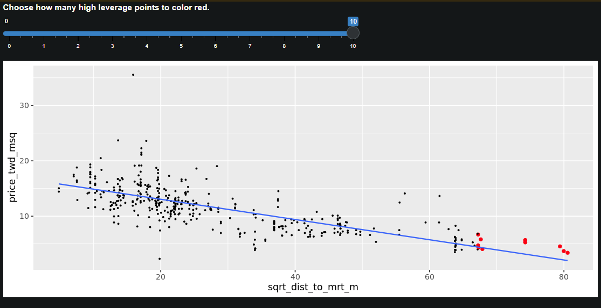
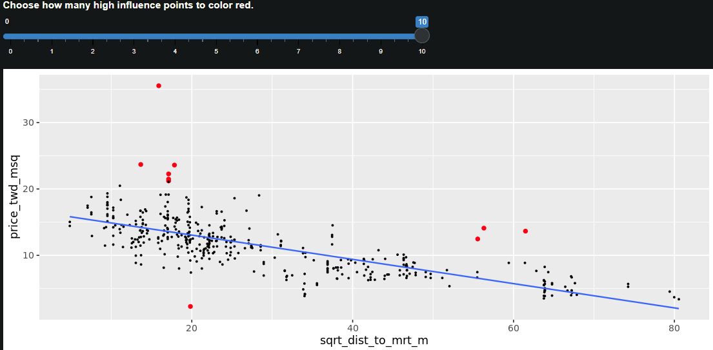

# Section 04: Assessing model fit

### **`01-Coefficient of determination`**

The coefficient of determination is a measure of how well the linear regression line fits the observed values. For simple linear regression, it is equal to the square of the correlation between the explanatory and response variables.

Here, you'll take another look at the second stage of the advertising pipeline: modeling the click response to impressions. Two models are available: `mdl_click_vs_impression_orig` models `n_clicks` versus `n_impressions`. `mdl_click_vs_impression_trans` is the transformed model you saw in Chapter 2. It models `n_clicks ^ 0.25` versus `n_impressions ^ 0.25`.

`broom` is loaded.

```{r}
library(dplyr)
library(broom)
library(fst)

file_path <- file.path("..", "00_Datasets", "ad_conversion.fst")
ad_conversion <- read_fst(file_path)

mdl_click_vs_impression_orig <- lm(formula = n_clicks ~ n_impressions, data = ad_conversion)
mdl_click_vs_impression_trans <- lm(formula = I(n_clicks^0.25) ~ I(n_impressions^0.25), data = ad_conversion)
```

-   Print a summary of `mdl_click_vs_impression_orig`. Do the same for `mdl_click_vs_impression_trans`.

```{r}
# Print a summary of mdl_click_vs_impression_orig
summary(mdl_click_vs_impression_orig)

strrep("***",50)

# Print a summary of mdl_click_vs_impression_trans
summary(mdl_click_vs_impression_trans)
```

-   Get the coefficient of determination for `mdl_click_vs_impression_orig` by glancing at the model, then pulling the `r.squared` value.

-   Do the same for `mdl_click_vs_impression_trans`.

```{r}
# Get coeff of determination for mdl_click_vs_impression_orig
mdl_click_vs_impression_orig %>% 
  # Get the model-level details
  glance() %>% 
  # Pull out r.squared
  pull(r.squared)

# Do the same for the transformed model
mdl_click_vs_impression_trans %>%
  # Get the model-level details
  glance() %>% 
  # Pull out r.squared
  pull(r.squared)
```

-   `mdl_click_vs_impression_orig` has a coefficient of determination of `0.89`. Which statement about the model is true?

The number of impressions explains 89% of the variability in the number of clicks.

-   Which model does the coefficient of determination suggest gives a better fit?

The transformed model, `mdl_click_vs_impression_trans`. 94.4%

### **`02-Residual standard error`**

Residual standard error (RSE) is a measure of the typical size of the residuals. Equivalently, it's a measure of how badly wrong you can expect predictions to be. Smaller numbers are better, with zero being a perfect fit to the data.

Again, you'll look at the models from the advertising pipeline, `mdl_click_vs_impression_orig` and `mdl_click_vs_impression_trans`. `broom` is loaded.

-   Get the residual standard error for `mdl_click_vs_impression_orig` by glancing at the model, then pulling the `sigma` value.

-   Do the same for `mdl_click_vs_impression_trans`.

```{r}
# Get RSE for mdl_click_vs_impression_orig
mdl_click_vs_impression_orig %>% 
  # Get the model-level details
  glance() %>% 
  # Pull out sigma
  pull(sigma)

# Do the same for the transformed model
mdl_click_vs_impression_trans %>%
  # Get the model-level details
  glance() %>%
  # Pull out sigma
  pull(sigma)
```

-   The typical difference between observed number of clicks and predicted number of clicks is `20`.

-   Which model does the RSE suggest gives more accurate predictions?

Rapid RSE wrangling! RSE is a measure of accuracy for regression models. It even works on other other statistical model types like regression trees, so you can compare accuracy across different classes of models.

[**`Notes:`**]{.underline}

-   Dapper diagnosis! In a good model, the residuals should have a trend line close to zero.

-   You have Q-Q juju! If the residuals from the model are normally distributed, then the points will track the line on the Q-Q plot. In this case, neither model is perfect, but the transformed model is closer.

-   Skillful scale-location analysis! In a good model, the size of the residuals shouldn't change much as the fitted values change.

### 

**`03-Drawing diagnostic plots`**

It's time for you to draw these diagnostic plots yourself. Let's go back to the Taiwan real estate dataset and the model of house prices versus number of convenience stores.

Recall that `autoplot()` lets you specify which diagnostic plots you are interested in.

-   `1` residuals vs. fitted values

-   `2` Q-Q plot

-   `3` scale-location

`mdl_price_vs_conv` is available, and `ggplot2` and `ggfortify` are loaded.

```{r}
library(ggplot2)
library(ggfortify)
```

-   Plot the three diagnostic plots (numbered `1` to `3`) for `mdl_price_vs_conv`. Use a layout of three rows and one column.

```{r}
file_path <- file.path("..", "00_Datasets", "taiwan_real_estate.fst")
taiwan_real_estate <- read_fst(file_path)
```

```{r}
mdl_price_vs_conv <- lm(formula = price_twd_msq ~ n_convenience, data = taiwan_real_estate)


# Plot the three diagnostics for mdl_price_vs_conv
autoplot(mdl_price_vs_conv, which = 1:3, nrow = 3, ncol = 1)
```

### **`04-Leverage`**

Leverage measures how unusual or extreme the explanatory variables are for each observation. Very roughly, a high leverage means that the explanatory variable has values that are different to other points in the dataset. In the case of simple linear regression, where there is only one explanatory value, this typically means values with a very high or very low explanatory value.

Here, you'll look at highly leveraged values in the model of house price versus the square root of distance from the nearest MRT station in the Taiwan real estate dataset.

Guess which observations you think will have a high leverage, then move the slider to find out.

{width="688"}

-   Which statement is true?

`Answer:` Observations with a large distance to the nearest MRT station have the highest leverage, because most of the observations have a short distance, so long distances are more extreme.

Lovely leveraging! Highly leveraged points are the ones with explanatory variables that are furthest away from the others.

### 

**`05-Influence`**

*Influence* measures how much a model would change if each observation was left out of the model calculations, one at a time. That is, it measures how different the prediction line would look if you ran a linear regression on all data points except that point, compared to running a linear regression on the whole dataset.

The standard metric for influence is *Cook's distance*, which calculates influence based on the size of the residual and the leverage of the point.

Here you can see the same model as last time: house price versus the square root of distance from the nearest MRT station in the Taiwan real estate dataset.

Guess which observations you think will have a high influence, then move the slider to find out.

 Which statement is true?

`Answer:`

Observations with predictions far away from the trend line have high influence, because they have large residuals and are far away from other observations.

Impressive influence interpretation! The majority of the influential houses were those with prices that were much higher than the model predicted (and one with a price that was much lower).

### **`06-Extracting leverage and influence`**

In the last few exercises you explored which observations had the highest leverage and influence. Now you'll extract those values from an augmented version of the model, and visualize them.

`mdl_price_vs_dist` is available. `dplyr`, `ggplot2` and `ggfortify` are loaded.

-   Augment `mdl_price_vs_dist`, then arrange observations by descending influence (`.hat`), and get the head of the results.

```{r}
mdl_price_vs_dist <- lm(formula = price_twd_msq ~ sqrt(dist_to_mrt_m), data = taiwan_real_estate)


mdl_price_vs_dist %>% 
  # Augment the model
  augment() %>% 
  # Arrange rows by descending leverage
  arrange(desc(.hat)) %>% 
  # Get the head of the dataset
  head()
```

-   Augment `mdl_price_vs_dist`, then arrange observations by descending influence (`.cooksd`), and get the head of the results.

```{r}
mdl_price_vs_dist %>% 
  # Augment the model
  augment() %>% 
  # Arrange rows by descending Cook's distance
  arrange(desc(.cooksd)) %>% 
  # Get the head of the dataset
  head()
```

-   Plot the three outlier diagnostic plots (numbered `4` to `6`) for `mdl_price_vs_dist`. Use a layout of three rows and one column.

```{r}
# Plot the three outlier diagnostics for mdl_price_vs_dist
autoplot(mdl_price_vs_dist, which = 4:6, nrow = 3, ncol = 1)
```

Delightful outlier diagnosing! Leverage and influence are important concepts for determining your model is overly affected by some unusual data points.

### `The End`

\

\

\

\

\

\

\

\
