Simple logistic regression
================
Mohamad Osman
2022-07-21

# Section 04: **Simple logistic regression**

### **`01-Exploring the explanatory variables`**

When the response variable is logical, all the points lie on the y
equals zero and y equals one lines, making it difficult to see what is
happening. In the video, until you saw the trend line, it wasn’t clear
how the explanatory variable was distributed on each line. This can be
solved with a histogram of the explanatory variable, faceted on the
response.

You will use these histograms to get to know the financial services
churn dataset seen in the video.

`churn` is available and `ggplot2` is loaded.

``` r
library(dplyr)
```

    ## 
    ## Attaching package: 'dplyr'

    ## The following objects are masked from 'package:stats':
    ## 
    ##     filter, lag

    ## The following objects are masked from 'package:base':
    ## 
    ##     intersect, setdiff, setequal, union

``` r
library(fst)
library(ggplot2)


file_path <- file.path("..", "00_Datasets", "churn.fst")
churn <- read_fst(file_path)
head(churn, 3)
```

    ##   has_churned time_since_first_purchase time_since_last_purchase
    ## 1           0                -1.0892210               -0.7213215
    ## 2           0                 1.1829830                3.6344354
    ## 3           0                -0.8461564               -0.4275823

-   Using `churn`, plot `time_since_last_purchase` as a histogram with
    binwidth `0.25` faceted in a grid with `has_churned` on each row.

``` r
# Using churn, plot time_since_last_purchase
ggplot(churn, aes(x = time_since_last_purchase)) +
  # as a histogram with binwidth 0.25
  geom_histogram(binwidth = 0.25) +
  # faceted in a grid with has_churned on each row
  facet_grid(rows = vars(has_churned))
```

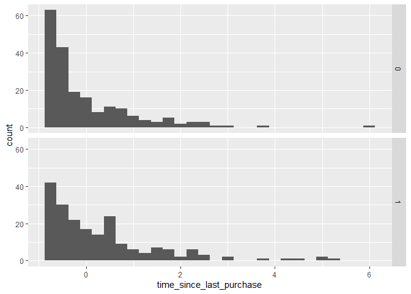<!-- -->

-   Redraw the plot with `time_since_first_purchase`. That is, using
    `churn`, plot `time_since_first_purchase` as a histogram with
    binwidth `0.25` faceted in a grid with `has_churned` on each row.

``` r
# Redraw the plot with time_since_first_purchase
ggplot(churn, aes(time_since_first_purchase)) +
    geom_histogram(binwidth = 0.25) + 
    facet_grid(rows = vars(has_churned))
```

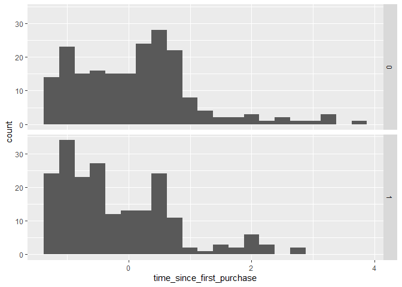<!-- -->

High five for the histograms! In the `time_since_last_purchase` plot,
the distribution of churned customers was further right than the
distribution of non-churned customers (churners typically have a longer
time since their last purchase). For `time_since_first_purchase` the
opposite is true: churners have a shorter length of relationship.

### **`02-Visualizing linear and logistic models`**

As with linear regressions, ggplot2 will draw model predictions for a
logistic regression without you having to worry about the modeling code
yourself. To see how the predictions differ for linear and logistic
regressions, try drawing both trend lines side by side. Spoiler: you
should see a linear (straight line) trend from the linear model, and a
logistic (S-shaped) trend from the logistic model.

`churn` is available and `ggplot2` is loaded.

-   Using `churn` plot `has_churned` vs. `time_since_first_purchase` as
    a scatter plot, adding a red linear regression trend line (without a
    standard error ribbon).

``` r
# Using churn plot has_churned vs. time_since_first_purchase
ggplot(churn, aes(time_since_first_purchase, has_churned)) +
  # Make it a scatter plot
  geom_point() +
  # Add an lm trend line, no std error ribbon, colored red
  geom_smooth(method = "lm", se = FALSE, color = "red")
```

    ## `geom_smooth()` using formula 'y ~ x'

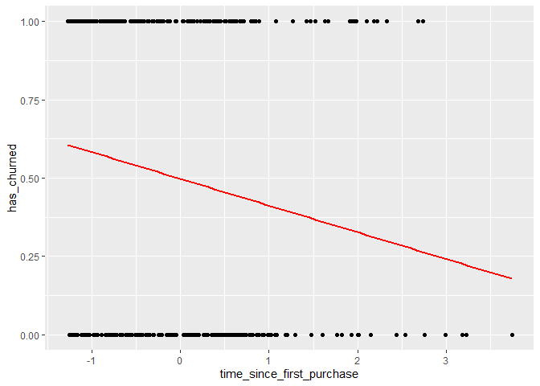<!-- -->

-   Update the plot by adding a second trend line from logistic
    regression. (No standard error ribbon again).

``` r
ggplot(churn, aes(time_since_first_purchase, has_churned)) +
  geom_point() +
  geom_smooth(method = "lm", se = FALSE, color = "red") +
  # Add a glm trend line, no std error ribbon, binomial family
  geom_smooth(method = "glm", se = FALSE, method.args = list(family = binomial))
```

    ## `geom_smooth()` using formula 'y ~ x'
    ## `geom_smooth()` using formula 'y ~ x'

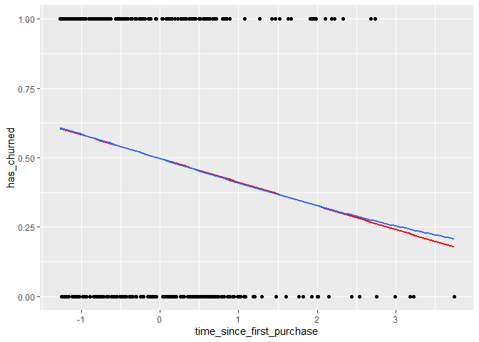<!-- -->

### **`03-Logistic regression with glm()`**

Linear regression and logistic regression are special cases of a broader
type of models called *generalized linear models* (“GLMs”). A linear
regression makes the assumption that the residuals follow a Gaussian
(normal) distribution. By contrast, a logistic regression assumes that
residuals follow a binomial distribution.

Here, you’ll model how the length of relationship with a customer
affects churn.

`churn` is available.

-   Fit a logistic regression of `has_churned` versus
    `time_since_first_purchase` using the `churn` dataset. Assign to
    `mdl_churn_vs_relationship`.

``` r
# Fit a logistic regression of churn vs. length of relationship using the churn dataset
mdl_churn_vs_relationship <- glm(has_churned ~ time_since_first_purchase, data = churn, family = binomial)


# See the result
mdl_churn_vs_relationship
```

    ## 
    ## Call:  glm(formula = has_churned ~ time_since_first_purchase, family = binomial, 
    ##     data = churn)
    ## 
    ## Coefficients:
    ##               (Intercept)  time_since_first_purchase  
    ##                  -0.01518                   -0.35479  
    ## 
    ## Degrees of Freedom: 399 Total (i.e. Null);  398 Residual
    ## Null Deviance:       554.5 
    ## Residual Deviance: 543.7     AIC: 547.7

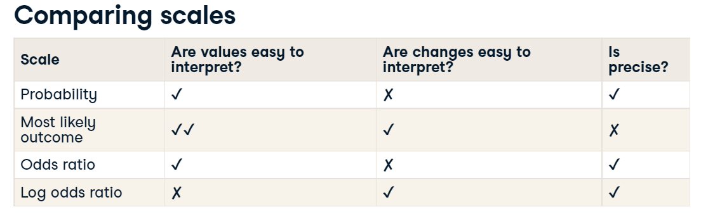

### **`04-Probabilities`**

There are four main ways of expressing the prediction from a logistic
regression model—we’ll look at each of them over the next four
exercises. Firstly, since the response variable is either “yes” or “no”,
you can make a prediction of the probability of a “yes”. Here, you’ll
calculate and visualize these probabilities.

Three variables are available:

-   `mdl_churn_vs_relationship` is the logistic regression model of
    `has_churned` versus `time_since_first_purchase`.

-   `explanatory_data` is a data frame of explanatory values.

-   `plt_churn_vs_relationship` is a scatter plot of `has_churned`
    versus `time_since_first_purchase` with a smooth glm line.

    `Questions:`

-   Use the model, `mdl_churn_vs_relationship`, and the explanatory
    data, `explanatory_data`, to predict the probability of churning.
    Assign the predictions to the `has_churned` column of a data frame,
    `prediction_data`. *Remember to set the prediction* `type`.

``` r
  explanatory_data <- tibble(time_since_first_purchase = seq(-1.5, 4, 0.25))

# Make a data frame of predicted probabilities
prediction_data <- explanatory_data %>% 
  mutate(has_churned = predict(mdl_churn_vs_relationship, explanatory_data, type = "response"))


# See the result
prediction_data
```

    ## # A tibble: 23 × 2
    ##    time_since_first_purchase has_churned
    ##                        <dbl>       <dbl>
    ##  1                     -1.5        0.626
    ##  2                     -1.25       0.605
    ##  3                     -1          0.584
    ##  4                     -0.75       0.562
    ##  5                     -0.5        0.540
    ##  6                     -0.25       0.518
    ##  7                      0          0.496
    ##  8                      0.25       0.474
    ##  9                      0.5        0.452
    ## 10                      0.75       0.430
    ## # … with 13 more rows

-   Update the `plt_churn_vs_relationship` plot to add points from
    `prediction_data`, colored yellow with size of 2.

``` r
plt_churn_vs_relationship  <- ggplot(churn, aes(time_since_first_purchase, has_churned)) +
  geom_point() +
  # Add a glm trend line, no std error ribbon, binomial family
  geom_smooth(method = "glm", se = FALSE, method.args = list(family = binomial))

# Update the plot
plt_churn_vs_relationship +
  # Add points from prediction_data, colored yellow, size 2
  geom_point(
      data = prediction_data, 
      color = "yellow",
      size = 2
  )
```

    ## `geom_smooth()` using formula 'y ~ x'

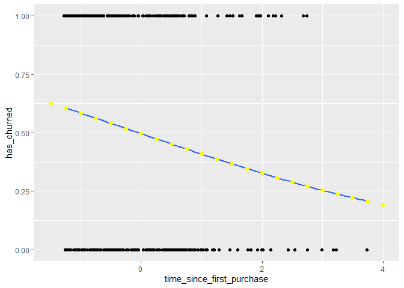<!-- -->

### **`05-Most likely outcome`**

When explaining your results to a non-technical audience, you may wish
to side-step talking about probabilities and simply explain the most
likely outcome. That is, rather than saying there is a 60% chance of a
customer churning, you say that the most likely outcome is that the
customer will churn. The tradeoff here is easier interpretation at the
cost of nuance.

`mdl_churn_vs_relationship`, `explanatory_data`, and
`plt_churn_vs_relationship` are available and `dplyr` is loaded.

-   Update `prediction_data` to add a column of the most likely churn
    outcome, `most_likely_outcome`.

``` r
# Update the data frame
prediction_data <- explanatory_data %>% 
  mutate(   
    has_churned = predict(mdl_churn_vs_relationship, explanatory_data, type = "response"),
    # Add the most likely churn outcome
    most_likely_outcome = round(has_churned)
  )

# See the result
prediction_data
```

    ## # A tibble: 23 × 3
    ##    time_since_first_purchase has_churned most_likely_outcome
    ##                        <dbl>       <dbl>               <dbl>
    ##  1                     -1.5        0.626                   1
    ##  2                     -1.25       0.605                   1
    ##  3                     -1          0.584                   1
    ##  4                     -0.75       0.562                   1
    ##  5                     -0.5        0.540                   1
    ##  6                     -0.25       0.518                   1
    ##  7                      0          0.496                   0
    ##  8                      0.25       0.474                   0
    ##  9                      0.5        0.452                   0
    ## 10                      0.75       0.430                   0
    ## # … with 13 more rows

-   Update `plt_churn_vs_relationship`, adding yellow points of size 2
    with `most_likely_outcome` as the y aesthetic, using
    `prediction_data`.

``` r
# Update the data frame
prediction_data <- explanatory_data %>% 
  mutate(   
    has_churned = predict(mdl_churn_vs_relationship, explanatory_data, type = "response"),
    most_likely_outcome = round(has_churned)
  )

# Update the plot
plt_churn_vs_relationship +
  # Add most likely outcome points from prediction_data, colored yellow, size 2
  geom_point(data = prediction_data,
            aes(y = most_likely_outcome), 
            color = "yellow", 
            size = 2)
```

    ## `geom_smooth()` using formula 'y ~ x'

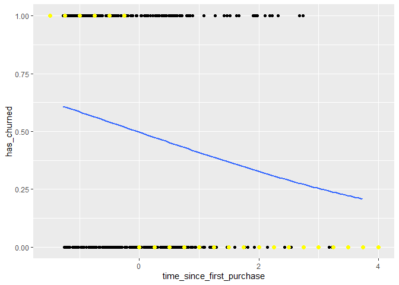<!-- -->

### **`06-Odds ratio`**

Odds ratios compare the probability of something happening with the
probability of it not happening. This is sometimes easier to reason
about than probabilities, particularly when you want to make decisions
about choices. For example, if a customer has a 20% chance of churning,
it maybe more intuitive to say “the chance of them not churning is four
times higher than the chance of them churning”.

`mdl_churn_vs_relationship`, `explanatory_data`, and
`plt_churn_vs_relationship` are available and `dplyr` is loaded.

-   Update `prediction_data` to add a column, `odds_ratio`, of the odds
    ratios.

``` r
# Update the data frame
prediction_data <- explanatory_data %>% 
  mutate(   
    has_churned = predict(
      mdl_churn_vs_relationship, explanatory_data, 
      type = "response"
    ),
    # Add the odds ratio
    odds_ratio = has_churned / (1 - has_churned)
  )

# See the result
prediction_data
```

    ## # A tibble: 23 × 3
    ##    time_since_first_purchase has_churned odds_ratio
    ##                        <dbl>       <dbl>      <dbl>
    ##  1                     -1.5        0.626      1.68 
    ##  2                     -1.25       0.605      1.53 
    ##  3                     -1          0.584      1.40 
    ##  4                     -0.75       0.562      1.29 
    ##  5                     -0.5        0.540      1.18 
    ##  6                     -0.25       0.518      1.08 
    ##  7                      0          0.496      0.985
    ##  8                      0.25       0.474      0.901
    ##  9                      0.5        0.452      0.825
    ## 10                      0.75       0.430      0.755
    ## # … with 13 more rows

-   Using `prediction_data`, draw a line plot of `odds_ratio` versus
    `time_since_first_purchase`. Add a dotted horizontal line at
    `odds_ratio` equal to `1`.

``` r
# From previous step
prediction_data <- explanatory_data %>% 
  mutate(   
    has_churned = predict(mdl_churn_vs_relationship, explanatory_data, type = "response"),
    odds_ratio = has_churned / (1 - has_churned)
  )

# Using prediction_data, plot odds_ratio vs. time_since_first_purchase
ggplot(prediction_data, aes(time_since_first_purchase, odds_ratio)) +
  # Make it a line plot
  geom_line() +
  # Add a dotted horizontal line at y = 1
  geom_hline(yintercept =1, linetype ="dotted")
```

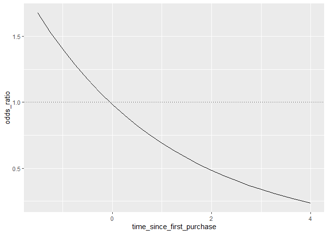<!-- -->

### **`07-Log odds ratio`**

One downside to probabilities and odds ratios for logistic regression
predictions is that the prediction lines for each are curved. This makes
it harder to reason about what happens to the prediction when you make a
change to the explanatory variable. The logarithm of the odds ratio (the
“log odds ratio”) does have a linear relationship between predicted
response and explanatory variable. That means that as the explanatory
variable changes, you don’t see dramatic changes in the response
metric - only linear changes.

Since the actual values of log odds ratio are less intuitive than
(linear) odds ratio, for visualization purposes it’s usually better to
plot the odds ratio and apply a log transformation to the y-axis scale.

`mdl_churn_vs_relationship`, `explanatory_data`, and
`plt_churn_vs_relationship` are available and `dplyr` is loaded.

-   Update `prediction_data` to add the log odds ratio calculated two
    ways. Calculate it from the `odds_ratio`, then directly using
    `predict()`.

``` r
# Update the data frame
prediction_data <- explanatory_data %>% 
  mutate(   
    has_churned = predict(mdl_churn_vs_relationship, explanatory_data, type = "response"),
    odds_ratio = has_churned / (1 - has_churned),
    # Add the log odds ratio from odds_ratio
    log_odds_ratio = log(odds_ratio),
    # Add the log odds ratio using predict()
    log_odds_ratio2 = predict(mdl_churn_vs_relationship, explanatory_data)
  )

# See the result
prediction_data
```

    ## # A tibble: 23 × 5
    ##    time_since_first_purch… has_churned odds_ratio log_odds_ratio log_odds_ratio2
    ##                      <dbl>       <dbl>      <dbl>          <dbl>           <dbl>
    ##  1                   -1.5        0.626      1.68          0.517           0.517 
    ##  2                   -1.25       0.605      1.53          0.428           0.428 
    ##  3                   -1          0.584      1.40          0.340           0.340 
    ##  4                   -0.75       0.562      1.29          0.251           0.251 
    ##  5                   -0.5        0.540      1.18          0.162           0.162 
    ##  6                   -0.25       0.518      1.08          0.0735          0.0735
    ##  7                    0          0.496      0.985        -0.0152         -0.0152
    ##  8                    0.25       0.474      0.901        -0.104          -0.104 
    ##  9                    0.5        0.452      0.825        -0.193          -0.193 
    ## 10                    0.75       0.430      0.755        -0.281          -0.281 
    ## # … with 13 more rows

-   Update the plot to use a logarithmic y-scale.

``` r
# Update the data frame
prediction_data <- explanatory_data %>% 
  mutate(   
    has_churned = predict(mdl_churn_vs_relationship, explanatory_data, type = "response"),
    odds_ratio = has_churned / (1 - has_churned),
    log_odds_ratio = log(odds_ratio)
  )

# Update the plot
ggplot(prediction_data, aes(time_since_first_purchase, odds_ratio)) +
  geom_line() +
  geom_hline(yintercept = 1, linetype = "dotted") +
  # Use a logarithmic y-scale
  scale_y_log10()
```

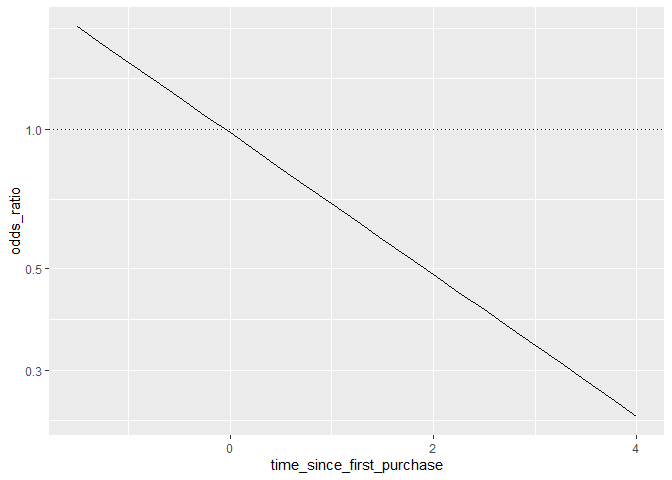<!-- -->

### **`08-Calculating the confusion matrix`**

A *confusion matrix* (occasionally called a *confusion table*) is the
basis of all performance metrics for models with a categorical response
(such as a logistic regression). It contains the counts of each actual
response-predicted response pair. In this case, where there are two
possible responses (churn or not churn), there are four overall
outcomes.

1.  The customer churned and the model predicted that.

2.  The customer churned but the model didn’t predict that.

3.  The customer didn’t churn but the model predicted they did.

4.  The customer didn’t churn and the model predicted that.

`churn` and `mdl_churn_vs_relationship` are available.

-   Get the actual responses from the `has_churned` column of the
    dataset. Assign to `actual_response`.

-   Get the “most likely” predicted responses from the model. Assign to
    `predicted_response`.

-   Create a table of counts from the actual and predicted response
    vectors. Assign to `outcomes`.

``` r
# Get the actual responses from the dataset
actual_response <- churn$has_churned

# Get the "most likely" responses from the model
predicted_response <- round(fitted(mdl_churn_vs_relationship))

# Create a table of counts
outcomes <- table(predicted_response, actual_response)

# See the result
outcomes
```

    ##                   actual_response
    ## predicted_response   0   1
    ##                  0 112  76
    ##                  1  88 124

### **`09-Measuring logistic model performance`**

Having the confusion matrix as a table object is OK, but a little hard
to program with. By converting this to a `yardstick` confusion matrix
object, you get methods for plotting and extracting performance metrics.

The confusion matrix, `outcomes` is available as a table object.
`ggplot2` and `yardstick` are loaded, and the `yardstick.event_first`
option is set to `FALSE`.

-   Convert `outcomes` to a yardstick confusion matrix. Assign to
    `confusion`.

-   Automatically plot `confusion`.

-   Get performance metrics from `confusion`, remembering that the
    positive response is in the second column.

``` r
library(yardstick)
```

    ## For binary classification, the first factor level is assumed to be the event.
    ## Use the argument `event_level = "second"` to alter this as needed.

``` r
# Convert outcomes to a yardstick confusion matrix
confusion <- conf_mat(outcomes)

# Plot the confusion matrix
autoplot(confusion)
```

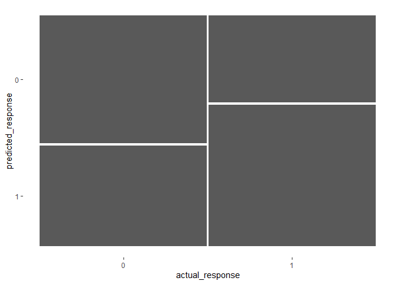<!-- -->

``` r
# Get performance metrics for the confusion matrix
summary(confusion, event_level = "second")
```

    ## # A tibble: 13 × 3
    ##    .metric              .estimator .estimate
    ##    <chr>                <chr>          <dbl>
    ##  1 accuracy             binary         0.59 
    ##  2 kap                  binary         0.18 
    ##  3 sens                 binary         0.62 
    ##  4 spec                 binary         0.56 
    ##  5 ppv                  binary         0.585
    ##  6 npv                  binary         0.596
    ##  7 mcc                  binary         0.180
    ##  8 j_index              binary         0.180
    ##  9 bal_accuracy         binary         0.59 
    ## 10 detection_prevalence binary         0.53 
    ## 11 precision            binary         0.585
    ## 12 recall               binary         0.62 
    ## 13 f_meas               binary         0.602

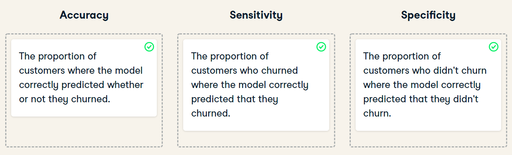

### **`The End`**
