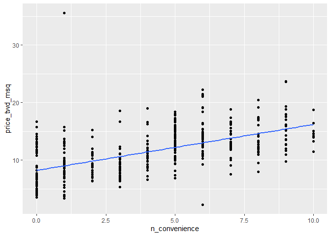
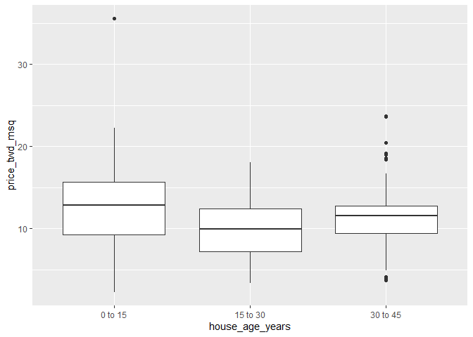
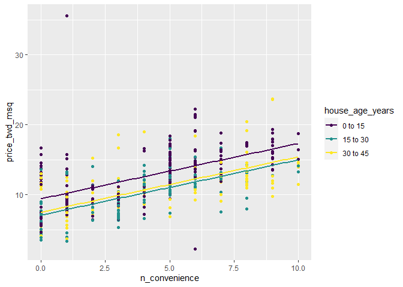
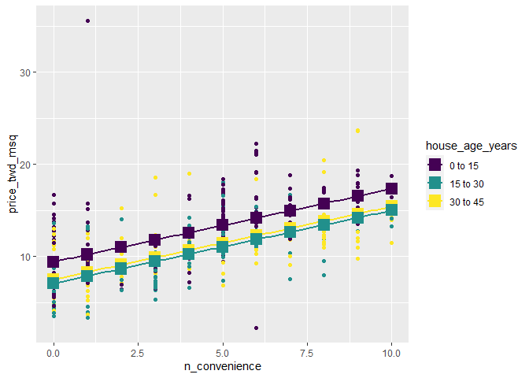

Parallel Slopes
================
Mohamad Osman
2022-07-21

# Section 01: **Parallel Slopes**

### `01-Fitting a parallel slopes linear regression`

In [**Introduction to Regression in
R**](https://learn.datacamp.com/courses/introduction-to-regression-in-r),
you learned to fit linear regression models with a single explanatory
variable. In many cases, using only one explanatory variable limits the
accuracy of predictions. That means that to truly master linear
regression, you need to be able to include multiple explanatory
variables.

The case when there is one numeric explanatory variable and one
categorical explanatory variable is sometimes called a “parallel slopes”
linear regression due to the shape of the predictions—more on that in
the next exercise.

Here, you’ll revisit the Taiwan real estate dataset. Recall the meaning
of each variable.

``` r
library(ggplot2)
library(fst)
library(dplyr)
```

    ## 
    ## Attaching package: 'dplyr'

    ## The following objects are masked from 'package:stats':
    ## 
    ##     filter, lag

    ## The following objects are masked from 'package:base':
    ## 
    ##     intersect, setdiff, setequal, union

``` r
library(broom)

file_path <- file.path("..", "00_Datasets", "taiwan_real_estate.fst")
taiwan_real_estate <- read_fst(file_path)
taiwan_real_estate$house_age_years <- as.factor(taiwan_real_estate$house_age_years)
head(taiwan_real_estate, 3)
```

    ##   dist_to_mrt_m n_convenience house_age_years price_twd_msq
    ## 1      84.87882            10        30 to 45      11.46747
    ## 2     306.59470             9        15 to 30      12.76853
    ## 3     561.98450             5         0 to 15      14.31165

| Variable                | Meaning                                                             |
|:------------------------|:--------------------------------------------------------------------|
| `dist_to_mrt_station_m` | Distance to nearest MRT metro station, in meters.                   |
| `n_convenience`         | No. of convenience stores in walking distance.                      |
| `house_age_years`       | The age of the house, in years, in 3 groups.                        |
| `price_twd_msq`         | House price per unit area, in New Taiwan dollars per meter squared. |

`taiwan_real_estate` is available.

-   Using the `taiwan_real_estate` dataset, model the house price (in
    TWD per square meter) versus the number of nearby convenience
    stores.

``` r
# Fit a linear regr'n of price_twd_msq vs. n_convenience
mdl_price_vs_conv <- lm(price_twd_msq ~ n_convenience, data = taiwan_real_estate)

# See the result
mdl_price_vs_conv
```

    ## 
    ## Call:
    ## lm(formula = price_twd_msq ~ n_convenience, data = taiwan_real_estate)
    ## 
    ## Coefficients:
    ##   (Intercept)  n_convenience  
    ##        8.2242         0.7981

-   Model the house price (in TWD per square meter) versus the house age
    (in years). Don’t include an intercept term.

``` r
# Fit a linear regr'n of price_twd_msq vs. house_age_years, no intercept
mdl_price_vs_age <- lm(price_twd_msq ~ house_age_years + 0, data = taiwan_real_estate)

# See the result
mdl_price_vs_age
```

    ## 
    ## Call:
    ## lm(formula = price_twd_msq ~ house_age_years + 0, data = taiwan_real_estate)
    ## 
    ## Coefficients:
    ##  house_age_years0 to 15  house_age_years15 to 30  house_age_years30 to 45  
    ##                  12.637                    9.877                   11.393

-   Model the house price (in TWD per square meter) versus the number of
    nearby convenience stores plus the house age (in years). Don’t
    include an intercept term.

``` r
# Fit a linear regr'n of price_twd_msq vs. n_convenience plus house_age_years, no intercept
mdl_price_vs_both <- lm(price_twd_msq ~ n_convenience + house_age_years + 0, data = taiwan_real_estate)

# See the result
mdl_price_vs_both
```

    ## 
    ## Call:
    ## lm(formula = price_twd_msq ~ n_convenience + house_age_years + 
    ##     0, data = taiwan_real_estate)
    ## 
    ## Coefficients:
    ##           n_convenience   house_age_years0 to 15  house_age_years15 to 30  
    ##                  0.7915                   9.4133                   7.0852  
    ## house_age_years30 to 45  
    ##                  7.5110

### **`02-Interpreting parallel slopes coefficients`**

For linear regression with a single numeric explanatory variable, there
is an intercept coefficient and a slope coefficient. For linear
regression with a single categorical explanatory variable, there is an
intercept coefficient for each category.

In the “parallel slopes” case, where you have a numeric and a
categorical explanatory variable, what do the coefficients mean?

`taiwan_real_estate` and `mdl_price_vs_both` are available.

Look at the coefficients of `mdl_price_vs_both`. What is the meaning of
the `n_convenience` coefficient?

``` r
coefficients(mdl_price_vs_both)
```

    ##           n_convenience  house_age_years0 to 15 house_age_years15 to 30 
    ##               0.7914571               9.4133247               7.0851694 
    ## house_age_years30 to 45 
    ##               7.5109583

For each additional nearby convenience store, the expected house price,
in TWD per square meter, increases by `0.79`.

-   What is the meaning of the `"0 to 15 years"` coefficient?

What is the meaning of the `"0 to 15 years"` coefficient?

-   For a house aged 0 to 15 years with zero nearby convenience stores,
    the expected house price is `9.41` TWD per square meter.

### **`03-Visualizing each explanatory variable`**

Being able to see the predictions made by a model makes it easier to
understand. In the case where there is only one explanatory variable,
ggplot lets you do this without any manual calculation or messing about.

To visualize the relationship between a numeric explanatory variable and
the numeric response, you can draw a scatter plot with a linear trend
line.

To visualize the relationship between a categorical explanatory variable
and the numeric response, you can draw a box plot.

`taiwan_real_estate` is available and `ggplot2` is loaded.

-   Using the `taiwan_real_estate` dataset, plot the house price versus
    the number of nearby convenience stores.

-   Make it a scatter plot.

-   Add a smooth linear regression trend line without a standard error
    ribbon.

``` r
# Using taiwan_real_estate, plot price_twd_msq vs. n_convenience
ggplot(taiwan_real_estate, aes(n_convenience ,price_twd_msq)) +
  # Add a point layer
  geom_point() +
  # Add a smooth trend line using linear regr'n, no ribbon
  geom_smooth(method = "lm", se = FALSE)
```

    ## `geom_smooth()` using formula 'y ~ x'

<!-- -->

-   Using the `taiwan_real_estate` dataset, plot the house price versus
    the house age.

-   Make it a box plot.

``` r
# Using taiwan_real_estate, plot price_twd_msq vs. house_age_years
ggplot(taiwan_real_estate, aes(house_age_years, price_twd_msq)) +
  # Add a box plot layer
  geom_boxplot()
```

<!-- -->

### **`04-Visualizing parallel slopes`**

The two plots in the previous exercise gave very different predictions:
one gave a predicted response that increased linearly with a numeric
variable; the other gave a fixed response for each category. The only
sensible way to reconcile these two conflicting predictions is to
incorporate both explanatory variables in the model at once.

When it comes to a linear regression model with a numeric and a
categorical explanatory variable, `ggplot2` doesn’t have an easy, “out
of the box” way to show the predictions. Fortunately, the `moderndive`
package includes an extra geom, `geom_parallel_slopes()` to make it
simple.

`taiwan_real_estate` is available; `ggplot2` and `moderndive` are
loaded.

-   Using the `taiwan_real_estate` dataset, plot house prices versus the
    number of nearby convenience stores, colored by house age.

-   Make it a scatter plot.

-   Add parallel slopes, without a standard error ribbon.

``` r
library(moderndive)

# Using taiwan_real_estate, plot price_twd_msq vs. n_convenience colored by house_age_years
ggplot(taiwan_real_estate, aes(n_convenience , price_twd_msq,
color = house_age_years)) +
  # Add a point layer
  geom_point() +
  # Add parallel slopes, no ribbon
  geom_parallel_slopes(se = FALSE)
```

<!-- -->

Parallel slope paradise! The “parallel slope” model name comes from the
fact that the prediction for each category is a slope, and all those
slopes are parallel.

### **`05-Predicting with a parallel slopes model`**

While ggplot can automatically show you model predictions, in order to
get those values to program with, you’ll need to do the calculations
yourself.

Just as with the case of a single explanatory variable, the workflow has
two steps: create a data frame of explanatory variables, then add a
column of predictions. To make sure you’ve got the right answer, you can
add your predictions to the ggplot with the `geom_parallel_slopes()`
lines.

`taiwan_real_estate` and `mdl_price_vs_both` are available; `dplyr`,
`tidyr`, and `ggplot2` are loaded.

note: `expand_grid` is deprecated and it is replaced by `expand.grid`.

``` r
# Make a grid of explanatory data
# note expand_grid is replaced by expand.replace
explanatory_data <- expand.grid(
  # Set n_convenience to zero to ten
  n_convenience = seq(0,10,1),
  # Set house_age_years to the unique values of that variable
  house_age_years = unique(taiwan_real_estate$house_age_years)
)

# See the result
explanatory_data
```

    ##    n_convenience house_age_years
    ## 1              0        30 to 45
    ## 2              1        30 to 45
    ## 3              2        30 to 45
    ## 4              3        30 to 45
    ## 5              4        30 to 45
    ## 6              5        30 to 45
    ## 7              6        30 to 45
    ## 8              7        30 to 45
    ## 9              8        30 to 45
    ## 10             9        30 to 45
    ## 11            10        30 to 45
    ## 12             0        15 to 30
    ## 13             1        15 to 30
    ## 14             2        15 to 30
    ## 15             3        15 to 30
    ## 16             4        15 to 30
    ## 17             5        15 to 30
    ## 18             6        15 to 30
    ## 19             7        15 to 30
    ## 20             8        15 to 30
    ## 21             9        15 to 30
    ## 22            10        15 to 30
    ## 23             0         0 to 15
    ## 24             1         0 to 15
    ## 25             2         0 to 15
    ## 26             3         0 to 15
    ## 27             4         0 to 15
    ## 28             5         0 to 15
    ## 29             6         0 to 15
    ## 30             7         0 to 15
    ## 31             8         0 to 15
    ## 32             9         0 to 15
    ## 33            10         0 to 15

-   Add a column to the `explanatory_data` named for the response
    variable, assigning to `prediction_data`.

-   The response column contain predictions made using
    `mdl_price_vs_both` and `explanatory_data`.

``` r
# From previous step
explanatory_data <- expand.grid(
  n_convenience = 0:10,
  house_age_years = unique(taiwan_real_estate$house_age_years)
)

# Add predictions to the data frame
prediction_data <- explanatory_data %>% 
  mutate(price_twd_msq = predict(mdl_price_vs_both, explanatory_data))

# See the result
prediction_data
```

    ##    n_convenience house_age_years price_twd_msq
    ## 1              0        30 to 45      7.510958
    ## 2              1        30 to 45      8.302415
    ## 3              2        30 to 45      9.093873
    ## 4              3        30 to 45      9.885330
    ## 5              4        30 to 45     10.676787
    ## 6              5        30 to 45     11.468244
    ## 7              6        30 to 45     12.259701
    ## 8              7        30 to 45     13.051158
    ## 9              8        30 to 45     13.842615
    ## 10             9        30 to 45     14.634072
    ## 11            10        30 to 45     15.425530
    ## 12             0        15 to 30      7.085169
    ## 13             1        15 to 30      7.876627
    ## 14             2        15 to 30      8.668084
    ## 15             3        15 to 30      9.459541
    ## 16             4        15 to 30     10.250998
    ## 17             5        15 to 30     11.042455
    ## 18             6        15 to 30     11.833912
    ## 19             7        15 to 30     12.625369
    ## 20             8        15 to 30     13.416826
    ## 21             9        15 to 30     14.208284
    ## 22            10        15 to 30     14.999741
    ## 23             0         0 to 15      9.413325
    ## 24             1         0 to 15     10.204782
    ## 25             2         0 to 15     10.996239
    ## 26             3         0 to 15     11.787696
    ## 27             4         0 to 15     12.579153
    ## 28             5         0 to 15     13.370610
    ## 29             6         0 to 15     14.162067
    ## 30             7         0 to 15     14.953525
    ## 31             8         0 to 15     15.744982
    ## 32             9         0 to 15     16.536439
    ## 33            10         0 to 15     17.327896

-   Update the plot to add a point layer of predictions. Use the
    `prediction_data`, set the point size to 5, and the point shape to
    15.

``` r
# From previous steps
explanatory_data <- expand.grid(
  n_convenience = 0:10,
  house_age_years = unique(taiwan_real_estate$house_age_years)
)
prediction_data <- explanatory_data %>% 
  mutate(
    price_twd_msq = predict(mdl_price_vs_both, explanatory_data)
  )

taiwan_real_estate %>% 
  ggplot(aes(n_convenience, price_twd_msq, color = house_age_years)) +
  geom_point() +
  geom_parallel_slopes(se = FALSE) +
  # Add points using prediction_data, with size 5 and shape 15
  geom_point(data = prediction_data, size = 5, shape = 15)
```

<!-- -->

### **`06-Manually calculating predictions`**

As with simple linear regression, you can manually calculate the
predictions from the model coefficients. The only change for the
parallel slopes case is that the intercept is different for each
category of the categorical explanatory variable. That means you need to
consider the case when each each category occurs separately.

`taiwan_real_estate`, `mdl_price_vs_both`, and `explanatory_data` are
available; `dplyr` is loaded.

-   Get the coefficients from `mdl_price_vs_both`, assigning to
    `coeffs`.

-   Assign each of the elements of `coeffs` to the appropriate variable.

``` r
# Get the coefficients from mdl_price_vs_both
coeffs <- coefficients(mdl_price_vs_both)

# Extract the slope coefficient
slope <- coeffs[1]

# Extract the intercept coefficient for 0 to 15
intercept_0_15 <- coeffs[2]

# Extract the intercept coefficient for 15 to 30
intercept_15_30 <- coeffs[3]

# Extract the intercept coefficient for 30 to 45
intercept_30_45 <- coeffs[4]
```

Add columns to `explanatory_data`.

-   To choose the `intercept`, in the case when `house_age_years` is
    `"0 to 15"`, choose `intercept_0_15`. In the case when
    `house_age_years` is `"15 to 30"`, choose `intercept_15_30`. Do
    likewise for `"30 to 45"`

-   Manually calculate the predictions as the intercept plus the slope
    times `n_convenience`.

``` r
# From previous step
coeffs <- coefficients(mdl_price_vs_both)
slope <- coeffs[1]
intercept_0_15 <- coeffs[2]
intercept_15_30 <- coeffs[3]
intercept_30_45 <- coeffs[4]

prediction_data <- explanatory_data %>% 
  mutate(
    # Consider the 3 cases to choose the intercept
    intercept = case_when(
        house_age_years == "0 to 15" ~ intercept_0_15,
        house_age_years == "15 to 30" ~ intercept_15_30, 
        house_age_years =="30 to 45" ~ intercept_30_45
    ),
    
    # Manually calculate the predictions
    price_twd_msq = intercept + slope * n_convenience
  )

# See the results
prediction_data
```

    ##    n_convenience house_age_years intercept price_twd_msq
    ## 1              0        30 to 45  7.510958      7.510958
    ## 2              1        30 to 45  7.510958      8.302415
    ## 3              2        30 to 45  7.510958      9.093873
    ## 4              3        30 to 45  7.510958      9.885330
    ## 5              4        30 to 45  7.510958     10.676787
    ## 6              5        30 to 45  7.510958     11.468244
    ## 7              6        30 to 45  7.510958     12.259701
    ## 8              7        30 to 45  7.510958     13.051158
    ## 9              8        30 to 45  7.510958     13.842615
    ## 10             9        30 to 45  7.510958     14.634072
    ## 11            10        30 to 45  7.510958     15.425530
    ## 12             0        15 to 30  7.085169      7.085169
    ## 13             1        15 to 30  7.085169      7.876627
    ## 14             2        15 to 30  7.085169      8.668084
    ## 15             3        15 to 30  7.085169      9.459541
    ## 16             4        15 to 30  7.085169     10.250998
    ## 17             5        15 to 30  7.085169     11.042455
    ## 18             6        15 to 30  7.085169     11.833912
    ## 19             7        15 to 30  7.085169     12.625369
    ## 20             8        15 to 30  7.085169     13.416826
    ## 21             9        15 to 30  7.085169     14.208284
    ## 22            10        15 to 30  7.085169     14.999741
    ## 23             0         0 to 15  9.413325      9.413325
    ## 24             1         0 to 15  9.413325     10.204782
    ## 25             2         0 to 15  9.413325     10.996239
    ## 26             3         0 to 15  9.413325     11.787696
    ## 27             4         0 to 15  9.413325     12.579153
    ## 28             5         0 to 15  9.413325     13.370610
    ## 29             6         0 to 15  9.413325     14.162067
    ## 30             7         0 to 15  9.413325     14.953525
    ## 31             8         0 to 15  9.413325     15.744982
    ## 32             9         0 to 15  9.413325     16.536439
    ## 33            10         0 to 15  9.413325     17.327896

### **`07-Comparing coefficients of determination`**

Recall that the coefficient of determination is a measure of how well
the linear regression line fits the observed values. An important
motivation for including several explanatory variables in a linear
regression is that you can improve the fit compared to considering only
a single explanatory variable.

Here you’ll compare the coefficient of determination for the three
Taiwan house price models, to see which gives the best result.

`mdl_price_vs_conv`, `mdl_price_vs_age`, and `mdl_price_vs_both` are
available; `dplyr` and `broom` are loaded.

-   Get the unadjusted and adjusted coefficients of determination for
    `mdl_price_vs_conv` by glancing at the model, then selecting the
    `r.squared` and `adj.r.squared` values.

-   Do the same for `mdl_price_vs_age` and `mdl_price_vs_both`.

``` r
mdl_price_vs_conv %>% 
  # Get the model-level coefficients
  glance() %>% 
  # Select the coeffs of determination
  select(r.squared, adj.r.squared)
```

    ## # A tibble: 1 × 2
    ##   r.squared adj.r.squared
    ##       <dbl>         <dbl>
    ## 1     0.326         0.324

``` r
# Get the coeffs of determination for mdl_price_vs_age
mdl_price_vs_age %>% 
  glance() %>% 
  select(r.squared, adj.r.squared)
```

    ## # A tibble: 1 × 2
    ##   r.squared adj.r.squared
    ##       <dbl>         <dbl>
    ## 1     0.896         0.895

``` r
# Get the coeffs of determination for mdl_price_vs_both
mdl_price_vs_both %>% 
  glance() %>% 
  select(r.squared, adj.r.squared)
```

    ## # A tibble: 1 × 2
    ##   r.squared adj.r.squared
    ##       <dbl>         <dbl>
    ## 1     0.931         0.931

Which model does the adjusted coefficient of determination suggest gives
a better fit?

-   `mdl_price_vs_both`.

### **`08-Comparing residual standard error`**

The other common metric for assessing model fit is the residual standard
error (RSE), which measures the typical size of the residuals.

In the last exercise you saw how including both explanatory variables
into the model increased the coefficient of determination. How do you
think using both explanatory variables will change the RSE?

`mdl_price_vs_conv`, `mdl_price_vs_age`, and `mdl_price_vs_both` are
available; `dplyr` and `broom` are loaded.

-   Get the residual standard error for `mdl_price_vs_conv` by glancing
    at the model, then pulling the `sigma` value.

-   Do the same for `mdl_price_vs_age`.

-   Do the same for `mdl_price_vs_both`.

``` r
mdl_price_vs_conv %>% 
  # Get the model-level coefficients
  glance %>% 
  # Pull out the RSE
  pull(sigma)
```

    ## [1] 3.383888

``` r
# Get the RSE for mdl_price_vs_age
mdl_price_vs_age %>% 
  glance() %>%
  pull(sigma)
```

    ## [1] 3.950184

``` r
# Get the RSE for mdl_price_vs_both
mdl_price_vs_both %>% 
  glance() %>%
  pull(sigma)
```

    ## [1] 3.21346

-   Which model does the RSE suggest gives more accurate predictions?

    -   `mdl_price_vs_both`. with residual 3.21

### `The End`

  

  

  

  

  

  
