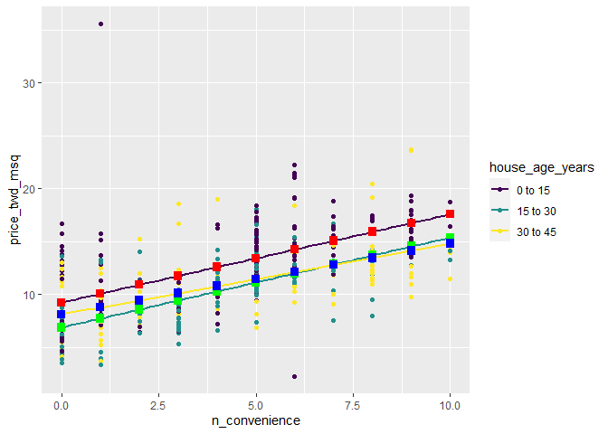
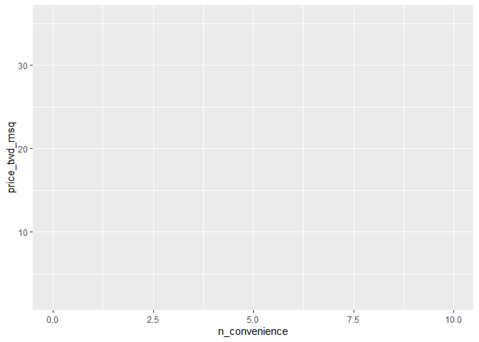
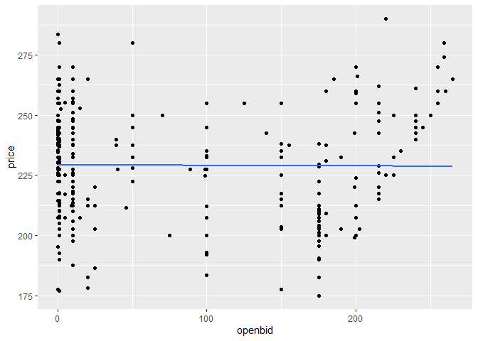
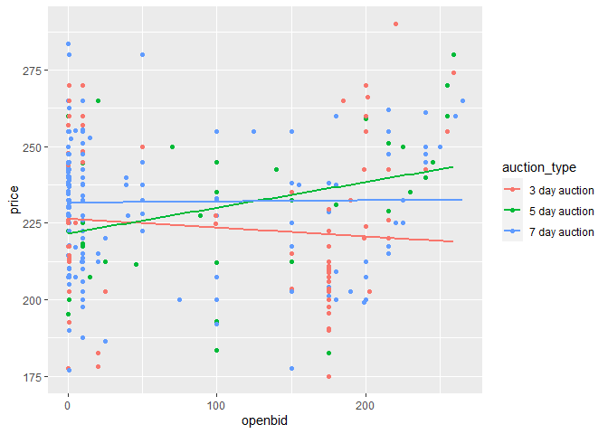

Interactions
================
Mohamad Osman
2022-07-21

# Section 02: Interactions

### **`01-One model per category`**

The model you ran on the whole dataset fits some parts of the data
better than others. It’s worth taking a look at what happens when you
run a linear model on different parts of the dataset separately, to see
if each model agrees or disagrees with the others.

`taiwan_real_estate` is available; `dplyr` is loaded.

-   Filter `taiwan_real_estate` for rows where `house_age_years` is
    `"0 to 15"`, assigning to `taiwan_0_to_15`.

-   Repeat this for the `"15 to 30"` and `"30 to 45"` house age
    categories.

``` r
library(ggplot2)
library(fst)
```

    ## Warning: package 'fst' was built under R version 4.2.1

``` r
library(dplyr)
```

    ## 
    ## Attaching package: 'dplyr'

    ## The following objects are masked from 'package:stats':
    ## 
    ##     filter, lag

    ## The following objects are masked from 'package:base':
    ## 
    ##     intersect, setdiff, setequal, union

``` r
library(broom)

file_path <- file.path("..", "00_Datasets", "taiwan_real_estate.fst")
taiwan_real_estate <- read_fst(file_path)
```

    ## Warning: package 'fstcore' was built under R version 4.2.1

``` r
taiwan_real_estate$house_age_years <- as.factor(taiwan_real_estate$house_age_years)
head(taiwan_real_estate, 3)
```

    ##   dist_to_mrt_m n_convenience house_age_years price_twd_msq
    ## 1      84.87882            10        30 to 45      11.46747
    ## 2     306.59470             9        15 to 30      12.76853
    ## 3     561.98450             5         0 to 15      14.31165

``` r
# Filter for rows where house age is 0 to 15 years
taiwan_0_to_15 <- taiwan_real_estate %>%
    filter(house_age_years  == "0 to 15")


# Filter for rows where house age is 15 to 30 years
taiwan_15_to_30 <- taiwan_real_estate %>%
    filter(house_age_years  == "15 to 30")


# Filter for rows where house age is 30 to 45 years
taiwan_30_to_45 <- taiwan_real_estate %>%
    filter(house_age_years  == "30 to 45")
```

-   Run a linear regression of `price_twd_msq` versus `n_convenience`
    using the `taiwan_0_to_15` dataset.

-   Repeat this for `taiwan_15_to_30` and `taiwan_30_to_45`.

``` r
mdl_all_ages <- lm(price_twd_msq ~ n_convenience, data = taiwan_real_estate)


# Model price vs. no. convenience stores using 0 to 15 data
mdl_0_to_15 <- lm(price_twd_msq ~ n_convenience, data = taiwan_0_to_15)

# Model price vs. no. convenience stores using 15 to 30 data
mdl_15_to_30 <- lm(price_twd_msq ~ n_convenience, data = taiwan_15_to_30)

# Model price vs. no. convenience stores using 30 to 45 data
mdl_30_to_45 <- lm(price_twd_msq ~ n_convenience, data = taiwan_30_to_45)

# See the results
mdl_0_to_15
```

    ## 
    ## Call:
    ## lm(formula = price_twd_msq ~ n_convenience, data = taiwan_0_to_15)
    ## 
    ## Coefficients:
    ##   (Intercept)  n_convenience  
    ##        9.2417         0.8336

``` r
mdl_15_to_30
```

    ## 
    ## Call:
    ## lm(formula = price_twd_msq ~ n_convenience, data = taiwan_15_to_30)
    ## 
    ## Coefficients:
    ##   (Intercept)  n_convenience  
    ##        6.8719         0.8519

``` r
mdl_30_to_45
```

    ## 
    ## Call:
    ## lm(formula = price_twd_msq ~ n_convenience, data = taiwan_30_to_45)
    ## 
    ## Coefficients:
    ##   (Intercept)  n_convenience  
    ##        8.1131         0.6687

### **`02-Predicting multiple models`**

In order to see what each of the models for individual categories are
doing, it’s helpful to make predictions from them. The flow is exactly
the same as the flow for making predictions on the whole model, though
remember that you only have a single explanatory variable in these
models (so `expand_grid()` isn’t needed.)

The models `mdl_0_to_15`, `mdl_15_to_30` and `mdl_30_to_45` are
available; `dplyr` is loaded.

-   Create a tibble of explanatory data, setting `n_convenience` to a
    vector from zero to ten, assigning to `explanatory_data_0_to_15`.

``` r
# Create a tibble of explanatory data, setting no. of conv stores to 0 to 10
explanatory_data <- tibble(n_convenience = seq(0,10,1))
```

-   Add a column of predictions named `price_twd_msq` to
    `explanatory_data`, using `mdl_0_to_15` and `explanatory_data`.
    Assign to `prediction_data_0_to_15`.

-   Repeat this for the 15 to 30 year and 30 to 45 year house age
    categories.

``` r
# From previous step
explanatory_data <- tibble(
  n_convenience = 0:10
)

# Add column of predictions using "0 to 15" model and explanatory data 
prediction_data_0_to_15 <- explanatory_data %>% 
  mutate(price_twd_msq = predict(mdl_0_to_15, explanatory_data))

# Same again, with "15 to 30"
prediction_data_15_to_30 <- explanatory_data %>% 
  mutate(price_twd_msq = predict(mdl_15_to_30, explanatory_data))

# Same again, with "30 to 45"
prediction_data_30_to_45 <- explanatory_data %>% 
  mutate(price_twd_msq = predict(mdl_30_to_45, explanatory_data))
```

### 

### **`03-Visualizing multiple models`**

In the last two exercises, you ran models for each category of house
ages separately, then calculated predictions for each model. Now it’s
time to visualize those predictions to see how they compare.

When you use `geom_smooth()` in a ggplot with an aesthetic that splits
the dataset into groups and draws a line for each group (like the
`color` aesthetic), you get multiple trend lines. This is the same as
running a model on each group separately, so we get a chance to test our
predictions against ggplot’s.

`taiwan_real_estate`, `prediction_data_0_to_15`,
`prediction_data_15_to_30`, and `prediction_data_30_to_45` are
available; `ggplot2` is loaded.

-   Using `taiwan_real_estate`, plot `price_twd_msq` versus
    `n_convenience` colored by `house_age_years`.

-   Add a point layer.

-   Add smooth trend lines for each color using the linear regression
    method and turning off the standard error ribbon.

-   Extend the plot by adding the prediction points from
    `prediction_data_0_to_15`. Color them red, with size 3 and shape 15.

-   Add prediction points from `prediction_data_15_to_30`, colored
    green, size 3, and shape 15.

-   Add prediction points from `prediction_data_30_to_45`, colored blue,
    size 3, and shape 15.

``` r
# Extend the plot to include prediction points
ggplot(taiwan_real_estate, aes(n_convenience, price_twd_msq, color = house_age_years)) +
  geom_point() +
  geom_smooth(method = "lm", se = FALSE) +
  # Add points using prediction_data_0_to_15, colored red, size 3, shape 15
  geom_point(data = prediction_data_0_to_15, size = 3, shape = 15, color = "red") +
  # Add points using prediction_data_15_to_30, colored green, size 3, shape 15
  geom_point(data = prediction_data_15_to_30, size = 3, shape = 15, color = "green") +
  # Add points using prediction_data_30_to_45, colored blue, size 3, shape 15
    geom_point(data = prediction_data_30_to_45, size = 3, shape = 15, color = "blue")
```

    ## `geom_smooth()` using formula 'y ~ x'

<!-- -->

Three cheers for three trend lines! It’s a good sign that our
predictions match those of ggplot’s. Notice that the 30 to 45 year house
age group has a much shallower slope compared to the other lines.

### **`04-Assessing model performance`**

To test which approach is best—the whole dataset model or the models for
each house age category—you need to calculate some metrics. Here’s,
you’ll compare the coefficient of determination and the residual
standard error for each model.

Four models of price versus no. of convenience stores (`mdl_all_ages`,
`mdl_0_to_15`, `mdl_15_to_30`, and `mdl_30_to_45`) are available;
`dplyr` and `broom` are loaded.

-   Get the coefficient of determination for `mdl_all_ages`,
    `mdl_0_to_15`, `mdl_15_to_30`, and `mdl_30_to_45`.

``` r
# Get the coeff. of determination for mdl_all_ages
mdl_all_ages %>%
    glance() %>%
    pull(r.squared)
```

    ## [1] 0.3260466

``` r
# Get the coeff. of determination for mdl_0_to_15
mdl_0_to_15 %>%
    glance() %>%
    pull(r.squared)
```

    ## [1] 0.3120536

``` r
# Get the coeff. of determination for mdl_15_to_30
mdl_15_to_30 %>%
    glance() %>%
    pull(r.squared)
```

    ## [1] 0.4424605

``` r
# Get the coeff. of determination for mdl_30_to_45
mdl_30_to_45 %>%
    glance() %>%
    pull(r.squared)
```

    ## [1] 0.3125713

-   Get the residual standard error for `mdl_all_ages`, `mdl_0_to_15`,
    `mdl_15_to_30`, and `mdl_30_to_45`.

``` r
# Get the RSE for mdl_all
mdl_all_ages %>%
    glance() %>%
    pull(sigma)
```

    ## [1] 3.383888

``` r
# Get the RSE for mdl_0_to_15
mdl_0_to_15 %>%
    glance() %>%
    pull(sigma)
```

    ## [1] 3.564127

``` r
# Get the RSE for mdl_15_to_30
mdl_15_to_30 %>%
    glance() %>%
    pull(sigma)
```

    ## [1] 2.585273

``` r
# Get the RSE for mdl_30_to_45
mdl_30_to_45 %>%
    glance() %>%
    pull(sigma)
```

    ## [1] 3.239037

-   the best model in terms of performance is `mdl_15_to_30`

### 

05-**Specifying an interaction**

So far you used a single parallel slopes model, which gave an OK fit for
the whole dataset, then three separate models for each house age
category, which gave a better fit for each individual category, but was
clunky because you had three separate models to work with and explain.
Ideally, you’d have a single model that had all the predictive power of
the individual models.

Defining this single model is achieved through adding interactions
between explanatory variables. R’s formula syntax is flexible, and gives
you a couple of options, depending on whether you prefer concise code
that is quick to type and to read, or explicit code that describes what
you are doing in detail.

`taiwan_real_estate` is available.

-   Fit a linear regression of `price_twd_msq` versus `n_convenience`
    and `house_age_years` and their interaction, using the “times”
    syntax to implicitly generate the interaction.

``` r
# Model price vs both with an interaction using "times" syntax
lm(price_twd_msq ~ n_convenience * house_age_years, data = taiwan_real_estate)
```

    ## 
    ## Call:
    ## lm(formula = price_twd_msq ~ n_convenience * house_age_years, 
    ##     data = taiwan_real_estate)
    ## 
    ## Coefficients:
    ##                     (Intercept)                    n_convenience  
    ##                         8.07558                          0.78473  
    ##               house_age_years.L                house_age_years.Q  
    ##                        -0.79803                          1.47418  
    ## n_convenience:house_age_years.L  n_convenience:house_age_years.Q  
    ##                        -0.11659                         -0.08228

-   Fit a linear regression of `price_twd_msq` versus `n_convenience`
    and `house_age_years` and their interaction, using the “colon”
    syntax to explicitly generate the interaction.

``` r
# Model price vs both with an interaction using "colon" syntax
lm(price_twd_msq ~ n_convenience + house_age_years + n_convenience:house_age_years, data = taiwan_real_estate)
```

    ## 
    ## Call:
    ## lm(formula = price_twd_msq ~ n_convenience + house_age_years + 
    ##     n_convenience:house_age_years, data = taiwan_real_estate)
    ## 
    ## Coefficients:
    ##                     (Intercept)                    n_convenience  
    ##                         8.07558                          0.78473  
    ##               house_age_years.L                house_age_years.Q  
    ##                        -0.79803                          1.47418  
    ## n_convenience:house_age_years.L  n_convenience:house_age_years.Q  
    ##                        -0.11659                         -0.08228

Which statement about the coefficients of `mdl_readable_inter` is true?

``` r
# From previous step
mdl_readable_inter <- lm(
  price_twd_msq ~ house_age_years + n_convenience:house_age_years + 0, 
  data = taiwan_real_estate
)

# Look at the coefficients
coefficients(mdl_readable_inter)
```

    ##                house_age_years0 to 15               house_age_years15 to 30 
    ##                             9.2417022                             6.8719186 
    ##               house_age_years30 to 45  house_age_years0 to 15:n_convenience 
    ##                             8.1131235                             0.8335867 
    ## house_age_years15 to 30:n_convenience house_age_years30 to 45:n_convenience 
    ##                             0.8519172                             0.6686981

-   The expected increase in house price for each nearby convenience
    store is lowest for the 30 to 45 year age group.

### 06-**Predicting with interactions**

As with every other regression model you’ve created, the fun part is
making predictions. Fortunately, the code flow for this case is the same
as the one without interactions—R can handle calculating the
interactions without any extra prompting from you. The only thing you
need to remember is the trick for getting combinations of explanatory
variables.

`mdl_price_vs_both_inter` is available; `dplyr` and `ggplot2` are
loaded.

Make a grid of explanatory data, formed from combinations of the
following variables.

-   `n_convenience` should take the numbers zero to ten.

-   `house_age_years` should take the unique values of the
    `house_age_years` column of `taiwan_real_estate`.

``` r
# Make a grid of explanatory data
explanatory_data <- expand.grid(
  # Set n_convenience to zero to ten
  n_convenience = seq(0,10,1),
  # Set house_age_years to the unique values of that variable
  house_age_years = unique(taiwan_real_estate$house_age_years)
)

# See the result
explanatory_data
```

    ##    n_convenience house_age_years
    ## 1              0        30 to 45
    ## 2              1        30 to 45
    ## 3              2        30 to 45
    ## 4              3        30 to 45
    ## 5              4        30 to 45
    ## 6              5        30 to 45
    ## 7              6        30 to 45
    ## 8              7        30 to 45
    ## 9              8        30 to 45
    ## 10             9        30 to 45
    ## 11            10        30 to 45
    ## 12             0        15 to 30
    ## 13             1        15 to 30
    ## 14             2        15 to 30
    ## 15             3        15 to 30
    ## 16             4        15 to 30
    ## 17             5        15 to 30
    ## 18             6        15 to 30
    ## 19             7        15 to 30
    ## 20             8        15 to 30
    ## 21             9        15 to 30
    ## 22            10        15 to 30
    ## 23             0         0 to 15
    ## 24             1         0 to 15
    ## 25             2         0 to 15
    ## 26             3         0 to 15
    ## 27             4         0 to 15
    ## 28             5         0 to 15
    ## 29             6         0 to 15
    ## 30             7         0 to 15
    ## 31             8         0 to 15
    ## 32             9         0 to 15
    ## 33            10         0 to 15

-   Add a column to the `explanatory_data`, assigning to
    `prediction_data`.

-   The column should be named after the response variable, and contain
    predictions made using `mdl_price_vs_both_inter` and
    `explanatory_data`.

``` r
# Linear Regression Model 
mdl_price_vs_both_inter <- lm(formula = price_twd_msq ~ house_age_years + n_convenience:house_age_years + 0, data = taiwan_real_estate)

# From previous step
explanatory_data <- expand.grid(
  n_convenience = 0:10,
  house_age_years = unique(taiwan_real_estate$house_age_years)
)

# Add predictions to the data frame
prediction_data <- explanatory_data %>%
    mutate(
      price_twd_msq = predict(mdl_price_vs_both_inter, explanatory_data)
      
   )


# See the result
prediction_data
```

    ##    n_convenience house_age_years price_twd_msq
    ## 1              0        30 to 45      8.113123
    ## 2              1        30 to 45      8.781822
    ## 3              2        30 to 45      9.450520
    ## 4              3        30 to 45     10.119218
    ## 5              4        30 to 45     10.787916
    ## 6              5        30 to 45     11.456614
    ## 7              6        30 to 45     12.125312
    ## 8              7        30 to 45     12.794010
    ## 9              8        30 to 45     13.462709
    ## 10             9        30 to 45     14.131407
    ## 11            10        30 to 45     14.800105
    ## 12             0        15 to 30      6.871919
    ## 13             1        15 to 30      7.723836
    ## 14             2        15 to 30      8.575753
    ## 15             3        15 to 30      9.427670
    ## 16             4        15 to 30     10.279588
    ## 17             5        15 to 30     11.131505
    ## 18             6        15 to 30     11.983422
    ## 19             7        15 to 30     12.835339
    ## 20             8        15 to 30     13.687257
    ## 21             9        15 to 30     14.539174
    ## 22            10        15 to 30     15.391091
    ## 23             0         0 to 15      9.241702
    ## 24             1         0 to 15     10.075289
    ## 25             2         0 to 15     10.908876
    ## 26             3         0 to 15     11.742462
    ## 27             4         0 to 15     12.576049
    ## 28             5         0 to 15     13.409636
    ## 29             6         0 to 15     14.243222
    ## 30             7         0 to 15     15.076809
    ## 31             8         0 to 15     15.910396
    ## 32             9         0 to 15     16.743982
    ## 33            10         0 to 15     17.577569

-   Using `taiwan_real_estate`, plot `price_twd_msq` versus
    `n_convenience`, colored by `house_age_years`.

-   Add a point layer.

-   Add smooth trend lines using linear regression, no standard error
    ribbon.

-   Add another point layer using `prediction_data`, with `size` `5` and
    `shape` `15`.

``` r
# From previous step
explanatory_data <- expand.grid(
  n_convenience = 0:10,
  house_age_years = unique(taiwan_real_estate$house_age_years)
)
prediction_data <- explanatory_data %>% 
  mutate(
    price_twd_msq = predict(mdl_price_vs_both_inter, explanatory_data)
  )

# Using taiwan_real_estate, plot price vs. no. of convenience stores, colored by house age
ggplot(taiwan_real_estate, aes(x = n_convenience,y = price_twd_msq, color = house_age_years))
```

<!-- -->

``` r
  # Make it a scatter plot
  geom_point()
```

    ## geom_point: na.rm = FALSE
    ## stat_identity: na.rm = FALSE
    ## position_identity

``` r
  # Add linear regression trend lines, no ribbon
  geom_smooth(method = "lm", se = FALSE)
```

    ## geom_smooth: na.rm = FALSE, orientation = NA, se = FALSE
    ## stat_smooth: na.rm = FALSE, orientation = NA, se = FALSE, method = lm
    ## position_identity

``` r
  # Add points from prediction_data, size 5, shape 15
  geom_point(data = prediction_data, size = 5, shape = 15)
```

    ## geom_point: na.rm = FALSE
    ## stat_identity: na.rm = FALSE
    ## position_identity

### **`07-Manually calculating predictions with interactions`**

In order to understand how `predict()` works, it’s time to calculate the
predictions manually again. For this model, there are three separate
lines to calculate for, and in each one, the prediction is an intercept
plus a slope times the numeric explanatory value. The tricky part is
getting the right intercept and the right slope for each case.

`mdl_price_vs_both_inter` and `explanatory_data` are available; `dplyr`
and `tidyr` are available.

-   Get the coefficients from `mdl_price_vs_both_inter`, assigning to
    `coeffs`.

-   Get the three intercept coefficients from `coeffs`, assigning to
    `intercept_0_15`, `intercept_15_30`, and `intercept_30_45`.

-   Get the three slope coefficients from `coeffs`, assigning to
    `slope_0_15`, `slope_15_30`, and `slope_30_45`.

``` r
# Get the coefficients from mdl_price_vs_both_inter
coeffs <- coefficients(mdl_price_vs_both_inter)

# Get the intercept for 0 to 15 year age group
intercept_0_15 <- coeffs[1]

# Get the intercept for 15 to 30 year age group
intercept_15_30 <- coeffs[2]

# Get the intercept for 30 to 45 year age group
intercept_30_45 <- coeffs[3]

# Get the slope for 0 to 15 year age group
slope_0_15 <- coeffs[4]

# Get the slope for 15 to 30 year age group
slope_15_30 <- coeffs[5]

# Get the slope for 30 to 45 year age group
slope_30_45 <- coeffs[6]
```

Add a `price_twd_msq` column to `explanatory_data` containing the
predictions.

-   In the case when `house_age_years` is `"0 to 15"`, choose the
    appropriate intercept plus the appropriate slope times the number of
    nearby convenience stores.

-   Do likewise for the cases where the house age is `"15 to 30"` and
    `"30 to 45"`.

``` r
# From previous step
coeffs <- coefficients(mdl_price_vs_both_inter)
intercept_0_15 <- coeffs[1]
intercept_15_30 <- coeffs[2]
intercept_30_45 <- coeffs[3]
slope_0_15 <- coeffs[4]
slope_15_30 <- coeffs[5]
slope_30_45 <- coeffs[6]

prediction_data <- explanatory_data %>% 
  mutate(
    # Consider the 3 cases to choose the price
    price_twd_msq = case_when(
      house_age_years == "0 to 15" ~ intercept_0_15 + slope_0_15 * n_convenience,
      house_age_years == "15 to 30" ~ intercept_15_30 + slope_15_30 * n_convenience,
      house_age_years == "30 to 45" ~ intercept_30_45 + slope_30_45 * n_convenience
    )
        
  )

# See the result
prediction_data
```

    ##    n_convenience house_age_years price_twd_msq
    ## 1              0        30 to 45      8.113123
    ## 2              1        30 to 45      8.781822
    ## 3              2        30 to 45      9.450520
    ## 4              3        30 to 45     10.119218
    ## 5              4        30 to 45     10.787916
    ## 6              5        30 to 45     11.456614
    ## 7              6        30 to 45     12.125312
    ## 8              7        30 to 45     12.794010
    ## 9              8        30 to 45     13.462709
    ## 10             9        30 to 45     14.131407
    ## 11            10        30 to 45     14.800105
    ## 12             0        15 to 30      6.871919
    ## 13             1        15 to 30      7.723836
    ## 14             2        15 to 30      8.575753
    ## 15             3        15 to 30      9.427670
    ## 16             4        15 to 30     10.279588
    ## 17             5        15 to 30     11.131505
    ## 18             6        15 to 30     11.983422
    ## 19             7        15 to 30     12.835339
    ## 20             8        15 to 30     13.687257
    ## 21             9        15 to 30     14.539174
    ## 22            10        15 to 30     15.391091
    ## 23             0         0 to 15      9.241702
    ## 24             1         0 to 15     10.075289
    ## 25             2         0 to 15     10.908876
    ## 26             3         0 to 15     11.742462
    ## 27             4         0 to 15     12.576049
    ## 28             5         0 to 15     13.409636
    ## 29             6         0 to 15     14.243222
    ## 30             7         0 to 15     15.076809
    ## 31             8         0 to 15     15.910396
    ## 32             9         0 to 15     16.743982
    ## 33            10         0 to 15     17.577569

### **`08-Modeling eBay auctions`**

Sometimes modeling a whole dataset suggests trends that disagree with
models on separate parts of that dataset. This is known as Simpson’s
paradox. In the most extreme case, you may see a positive slope on the
whole dataset, and negative slopes on every subset of that dataset (or
the other way around).

Over the next few exercises, you’ll look at [**eBay
auctions**](http://www.modelingonlineauctions.com/datasets) of Palm
Pilot M515 PDA models.

| variable       | meaning                        |
|:---------------|:-------------------------------|
| `price`        | Final sale price, USD          |
| `openbid`      | The opening bid, USD           |
| `auction_type` | How long did the auction last? |

`auctions` is available; `dplyr` and `ggplot2` are loaded.

-   Look at the structure of the `auctions` dataset and familiarize
    yourself with its columns.

-   Fit a linear regression model of `price` versus `openbid`, using the
    `auctions` dataset. *Look at the coefficients.*

``` r
file_path <- file.path("..", "00_Datasets", "auctions.txt")
auctions <- read.delim(file_path)

# Take a glimpse at the dataset
glimpse(auctions)
```

    ## Rows: 343
    ## Columns: 3
    ## $ price        <dbl> 260.00, 256.86, 260.00, 238.02, 231.50, 251.11, 247.50, 2…
    ## $ openbid      <dbl> 0.01, 0.01, 0.01, 0.01, 1.00, 9.99, 215.00, 155.00, 50.00…
    ## $ auction_type <chr> "7 day auction", "3 day auction", "5 day auction", "7 day…

``` r
# Model price vs. opening bid using auctions
mdl_price_vs_openbid <- lm(price ~ openbid, data = auctions)

# See the result
mdl_price_vs_openbid
```

    ## 
    ## Call:
    ## lm(formula = price ~ openbid, data = auctions)
    ## 
    ## Coefficients:
    ## (Intercept)      openbid  
    ##  229.245667    -0.002098

-   Using auctions, plot `price` versus `openbid` as a scatter plot with
    linear regression trend lines (no ribbon). *Look at the trend line.*

``` r
# Using auctions, plot price vs. opening bid as a scatter plot with linear regression trend lines
ggplot(auctions, aes(openbid, price)) +
    geom_point() +
    geom_smooth(method = "lm", se = FALSE)
```

    ## `geom_smooth()` using formula 'y ~ x'

<!-- -->

Amazing auction modeling! The slope coefficient is small enough that it
might as well be zero. That is, opening bid appears to have no effect on
the final sale price for Palm Pilots.

### `09-Modeling each auction type`

You just saw that the opening bid price appeared not to affect the final
sale price of Palm Pilots in the eBay auctions. Now let’s look at what
happens when you model the three auction types (3 day, 5 day, and 7 day)
separately.

`auctions` is available; `dplyr` and `ggplot2` are loaded.

-   Fit a linear regression model of `price` versus `openbid` and
    `auction_type`, with an interaction, using the `auctions` dataset.
    *Look at the coefficients.*

``` r
# Fit linear regression of price vs. opening bid and auction type, with an interaction.
mdl_price_vs_both <- lm(price ~ openbid + auction_type + openbid:auction_type , data = auctions)

# See the result
mdl_price_vs_both
```

    ## 
    ## Call:
    ## lm(formula = price ~ openbid + auction_type + openbid:auction_type, 
    ##     data = auctions)
    ## 
    ## Coefficients:
    ##                       (Intercept)                            openbid  
    ##                         226.36900                           -0.02903  
    ##         auction_type5 day auction          auction_type7 day auction  
    ##                          -4.76968                            5.23386  
    ## openbid:auction_type5 day auction  openbid:auction_type7 day auction  
    ##                           0.11304                            0.03271

-   Using `auctions`, plot `price` versus `openbid`, colored by
    `auction_type`, as a scatter plot with linear regression trend lines
    (no ribbon). *Look at the trend lines.*

``` r
# Using auctions, plot price vs. opening bid colored by auction type as a scatter plot with linear regr'n trend lines
ggplot(auctions, aes(openbid, price, color = auction_type)) +
    geom_point() +
    geom_smooth(method = "lm", se = FALSE) 
```

    ## `geom_smooth()` using formula 'y ~ x'

<!-- -->

-   Which statement about the model resolves Simpson’s Paradox?

    -   The two models disagree, and the best model to take advice from
        depends upon the question we are trying to answer.

Super Simpson solving! Interpreting models is a subtle art, and your
conclusions need to be based on the question you are trying to answer.
Here, the answer to ‘Does opening bid affect final sale price?’ is *no*
overall, but the answer to ‘Does opening bid price affect final sale
price for any type of auction?’ is *yes, for 5 day auctions*.

### `The End`
