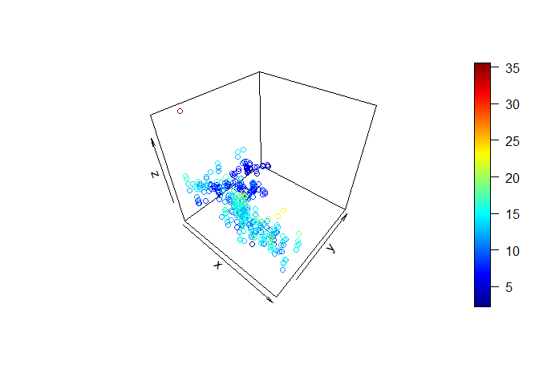
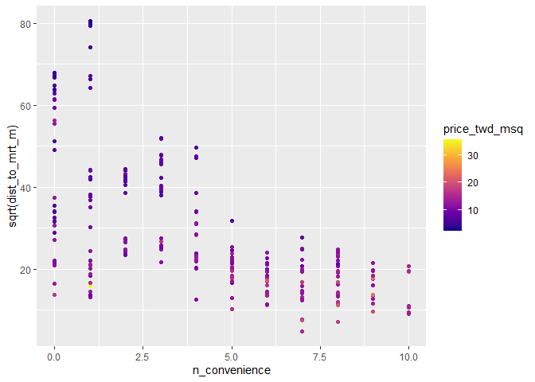
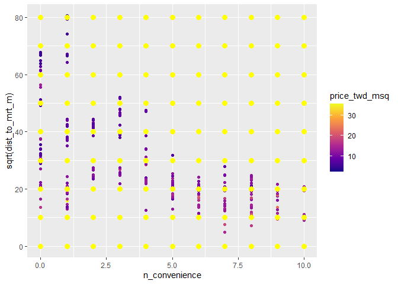
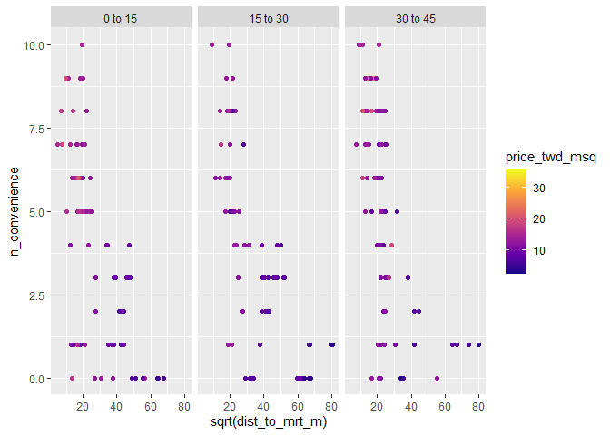
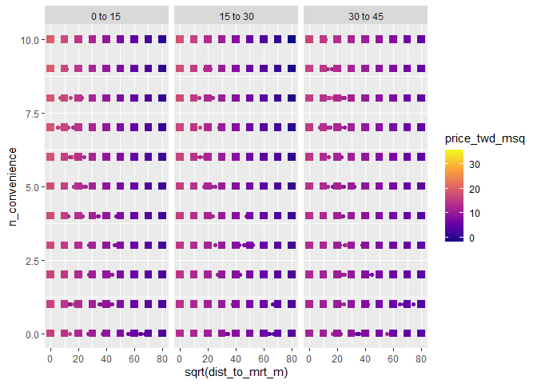

Multiple Linear Regression
================
Mohamad Osman
2022-07-24

# Section 03: Multiple Linear Regression

### **`01-3D visualizations`**

Since computer screens and paper are both two-dimensional objects, most
plots are best suited to visualizing two variables at once. For the case
of three continuous variables, you can draw a 3D scatter plot, but
perspective problems usually make it difficult to interpret. There are
some “flat” alternatives that provide easier interpretation, though they
require a little thinking about to make.

`taiwan_real_estate` is available; `magrittr`, `plot3D` and `ggplot2`
are loaded.

``` r
library(ggplot2)
library(plot3D)
```

    ## Warning: package 'plot3D' was built under R version 4.2.1

``` r
library(fst)
```

    ## Warning: package 'fst' was built under R version 4.2.1

``` r
library(dplyr)
```

    ## 
    ## Attaching package: 'dplyr'

    ## The following objects are masked from 'package:stats':
    ## 
    ##     filter, lag

    ## The following objects are masked from 'package:base':
    ## 
    ##     intersect, setdiff, setequal, union

``` r
library(magrittr)

file_path <- file.path("..", "00_Datasets", "taiwan_real_estate.fst")
taiwan_real_estate <- read_fst(file_path)
```

    ## Warning: package 'fstcore' was built under R version 4.2.1

-   With the `taiwan_real_estate` dataset, draw a 3D scatter plot of the
    number of nearby convenience stores on the x-axis, the
    **square-root** of the distance to the nearest MRT stop on the
    y-axis, and the house price on the z-axis.

``` r
# With taiwan_real_estate, draw a 3D scatter plot of no. of conv. stores, sqrt dist to MRT, and price
taiwan_real_estate %$%
    scatter3D(n_convenience, sqrt(dist_to_mrt_m),price_twd_msq)
```

<!-- -->

-   With the `taiwan_real_estate` dataset, draw a scatter plot of the
    square-root of the distance to the nearest MRT stop versus the
    number of nearby convenience stores, colored by house price.

-   Use the continuous viridis color scale, using the `"plasma"` option.

``` r
# Using taiwan_real_estate, plot sqrt dist to MRT vs. no. of conv stores, colored by price
ggplot(taiwan_real_estate, aes(n_convenience, sqrt(dist_to_mrt_m), color = price_twd_msq)) + 
  # Make it a scatter plot
  geom_point() +
  # Use the continuous viridis plasma color scale
  scale_color_viridis_c(option = "plasma")
```

<!-- -->

### **`02-Modeling 2 numeric explanatory variables`**

You already saw how to make a model and predictions with a numeric and a
categorical explanatory variable. The code for modeling and predicting
with two numeric explanatory variables in the same, other than a slight
difference in how to specify the explanatory variables to make
predictions against.

Here you’ll model and predict the house prices against the number of
nearby convenience stores and the square-root of the distance to the
nearest MRT station.

`taiwan_real_estate` is available; `dplyr`, `tidyr` and `ggplot2` are
loaded.

-   Fit a linear regression of house price versus the number of
    convenience stores and the square-root of the distance to the
    nearest MRT stations, without an interaction, using the
    `taiwan_real_estate` dataset.

``` r
# Fit a linear regression of price vs. no. of conv. stores and sqrt dist. to nearest MRT, no interaction
mdl_price_vs_conv_dist <- lm(price_twd_msq ~ n_convenience + sqrt(dist_to_mrt_m),
                            data = taiwan_real_estate)


# See the result
mdl_price_vs_conv_dist
```

    ## 
    ## Call:
    ## lm(formula = price_twd_msq ~ n_convenience + sqrt(dist_to_mrt_m), 
    ##     data = taiwan_real_estate)
    ## 
    ## Coefficients:
    ##         (Intercept)        n_convenience  sqrt(dist_to_mrt_m)  
    ##             15.1038               0.2142              -0.1573

-   Create expanded grid of explanatory variables with number of
    convenience stores from 0 to 10 and the distance to the nearest MRT
    station as a sequence from 0 to 80 in steps of 10, all squared (0,
    100, 400, …, 6400). Assign to `explanatory_data`.

-   Add a column of predictions to `explanatory_data` using
    `mdl_price_vs_conv_dist` and `explanatory_data`. Assign to
    `prediction_data`.

``` r
library(tidyr)
```

    ## Warning: package 'tidyr' was built under R version 4.2.1

    ## 
    ## Attaching package: 'tidyr'

    ## The following object is masked from 'package:magrittr':
    ## 
    ##     extract

``` r
# From previous step 
mdl_price_vs_conv_dist <- lm(price_twd_msq ~ n_convenience + sqrt(dist_to_mrt_m), data = taiwan_real_estate)

# Create expanded grid of explanatory variables with no. of conv. stores and  dist. to nearest MRT
explanatory_data <- expand.grid(n_convenience = 0:10, 
                                dist_to_mrt_m = seq(0,80,10) ^ 2
                                )


# Add predictions using mdl_price_vs_conv_dist and explanatory_data
prediction_data <- explanatory_data %>%
        mutate(price_twd_msq = predict(mdl_price_vs_conv_dist, explanatory_data))


# See the result
prediction_data
```

    ##    n_convenience dist_to_mrt_m price_twd_msq
    ## 1              0             0     15.103790
    ## 2              1             0     15.318010
    ## 3              2             0     15.532231
    ## 4              3             0     15.746452
    ## 5              4             0     15.960672
    ## 6              5             0     16.174893
    ## 7              6             0     16.389114
    ## 8              7             0     16.603334
    ## 9              8             0     16.817555
    ## 10             9             0     17.031776
    ## 11            10             0     17.245996
    ## 12             0           100     13.530787
    ## 13             1           100     13.745007
    ## 14             2           100     13.959228
    ## 15             3           100     14.173449
    ## 16             4           100     14.387669
    ## 17             5           100     14.601890
    ## 18             6           100     14.816111
    ## 19             7           100     15.030331
    ## 20             8           100     15.244552
    ## 21             9           100     15.458773
    ## 22            10           100     15.672993
    ## 23             0           400     11.957784
    ## 24             1           400     12.172004
    ## 25             2           400     12.386225
    ## 26             3           400     12.600446
    ## 27             4           400     12.814666
    ## 28             5           400     13.028887
    ## 29             6           400     13.243108
    ## 30             7           400     13.457328
    ## 31             8           400     13.671549
    ## 32             9           400     13.885770
    ## 33            10           400     14.099990
    ## 34             0           900     10.384781
    ## 35             1           900     10.599001
    ## 36             2           900     10.813222
    ## 37             3           900     11.027443
    ## 38             4           900     11.241663
    ## 39             5           900     11.455884
    ## 40             6           900     11.670105
    ## 41             7           900     11.884325
    ## 42             8           900     12.098546
    ## 43             9           900     12.312767
    ## 44            10           900     12.526987
    ## 45             0          1600      8.811778
    ## 46             1          1600      9.025998
    ## 47             2          1600      9.240219
    ## 48             3          1600      9.454440
    ## 49             4          1600      9.668660
    ## 50             5          1600      9.882881
    ## 51             6          1600     10.097102
    ## 52             7          1600     10.311322
    ## 53             8          1600     10.525543
    ## 54             9          1600     10.739764
    ## 55            10          1600     10.953984
    ## 56             0          2500      7.238775
    ## 57             1          2500      7.452995
    ## 58             2          2500      7.667216
    ## 59             3          2500      7.881437
    ## 60             4          2500      8.095657
    ## 61             5          2500      8.309878
    ## 62             6          2500      8.524099
    ## 63             7          2500      8.738319
    ## 64             8          2500      8.952540
    ## 65             9          2500      9.166761
    ## 66            10          2500      9.380981
    ## 67             0          3600      5.665772
    ## 68             1          3600      5.879992
    ## 69             2          3600      6.094213
    ## 70             3          3600      6.308434
    ## 71             4          3600      6.522654
    ## 72             5          3600      6.736875
    ## 73             6          3600      6.951096
    ## 74             7          3600      7.165316
    ## 75             8          3600      7.379537
    ## 76             9          3600      7.593758
    ## 77            10          3600      7.807978
    ## 78             0          4900      4.092769
    ## 79             1          4900      4.306989
    ## 80             2          4900      4.521210
    ## 81             3          4900      4.735431
    ## 82             4          4900      4.949651
    ## 83             5          4900      5.163872
    ## 84             6          4900      5.378093
    ## 85             7          4900      5.592313
    ## 86             8          4900      5.806534
    ## 87             9          4900      6.020755
    ## 88            10          4900      6.234975
    ## 89             0          6400      2.519766
    ## 90             1          6400      2.733986
    ## 91             2          6400      2.948207
    ## 92             3          6400      3.162428
    ## 93             4          6400      3.376648
    ## 94             5          6400      3.590869
    ## 95             6          6400      3.805090
    ## 96             7          6400      4.019310
    ## 97             8          6400      4.233531
    ## 98             9          6400      4.447752
    ## 99            10          6400      4.661972

-   Extend the plot to add a layer of points using the prediction data,
    colored yellow, with size 3.

``` r
# From previous steps
mdl_price_vs_conv_dist <- lm(price_twd_msq ~ n_convenience + sqrt(dist_to_mrt_m), data = taiwan_real_estate)
explanatory_data <- expand_grid(n_convenience = 0:10, dist_to_mrt_m = seq(0, 80, 10) ^ 2)
prediction_data <- explanatory_data %>% 
  mutate(price_twd_msq = predict(mdl_price_vs_conv_dist, explanatory_data))

# Add predictions to plot
ggplot(
  taiwan_real_estate, 
  aes(n_convenience, sqrt(dist_to_mrt_m), color = price_twd_msq)
) + 
  geom_point() +
  scale_color_viridis_c(option = "plasma")+
  # Add prediction points colored yellow, size 3
  geom_point(data = prediction_data, color = "yellow", size = 3)
```

<!-- -->

Nice numeric modeling! The modeling and prediction flow for two numeric
variables is just as it was for the previous case that included a
categorical variable. R automatically handles this different scenario.

### **`03-Including an interaction`**

Just as in the case with one numeric and one categorical explanatory
variable, it is possible that numeric explanatory variables can
interact. With this model structure, you’ll get a third slope
coefficient: one for each explanatory variable and one for the
interaction.

Here you’ll run and predict the same model as in the previous exercise,
but this time including an interaction between the explanatory
variables.

`taiwan_real_estate` is available; `dplyr`, `tidyr` and `ggplot2` are
loaded.

-   Fit a linear regression of house price versus the number of
    convenience stores and the square-root of the distance to the
    nearest MRT stations, *with* an interaction, using the
    `taiwan_real_estate` dataset.

``` r
# Fit a linear regression of price vs. no. of conv. stores and sqrt dist. to nearest MRT, with interaction
mdl_price_vs_conv_dist <- lm(price_twd_msq ~ n_convenience * sqrt(dist_to_mrt_m), data =taiwan_real_estate)


# See the result
mdl_price_vs_conv_dist
```

    ## 
    ## Call:
    ## lm(formula = price_twd_msq ~ n_convenience * sqrt(dist_to_mrt_m), 
    ##     data = taiwan_real_estate)
    ## 
    ## Coefficients:
    ##                       (Intercept)                      n_convenience  
    ##                          14.73733                            0.42425  
    ##               sqrt(dist_to_mrt_m)  n_convenience:sqrt(dist_to_mrt_m)  
    ##                          -0.14121                           -0.01124

-   Create expanded grid of explanatory variables with number of
    convenience stores from 0 to 10 and the distance to the nearest MRT
    station as a sequence from 0 to 80 in steps of 10, all squared (0,
    100, 400, …, 6400). Assign to `explanatory_data`.

-   Add a column of predictions to `explanatory_data` using
    `mdl_price_vs_conv_dist` and `explanatory_data`. Assign to
    `prediction_data`.

``` r
# From previous step 
mdl_price_vs_conv_dist <- lm(price_twd_msq ~ n_convenience * sqrt(dist_to_mrt_m), data = taiwan_real_estate)

# Create expanded grid of explanatory variables with no. of conv. stores and  dist. to nearest MRT
explanatory_data <- expand_grid(
    n_convenience = 0:10,
    dist_to_mrt_m = seq(0,80,10) ^ 2


)

# Add predictions using mdl_price_vs_conv_dist and explanatory_data
prediction_data <- explanatory_data %>%
        mutate(price_twd_msq = predict(mdl_price_vs_conv_dist, explanatory_data))


# See the result
prediction_data
```

    ## # A tibble: 99 × 3
    ##    n_convenience dist_to_mrt_m price_twd_msq
    ##            <int>         <dbl>         <dbl>
    ##  1             0             0         14.7 
    ##  2             0           100         13.3 
    ##  3             0           400         11.9 
    ##  4             0           900         10.5 
    ##  5             0          1600          9.09
    ##  6             0          2500          7.68
    ##  7             0          3600          6.26
    ##  8             0          4900          4.85
    ##  9             0          6400          3.44
    ## 10             1             0         15.2 
    ## # … with 89 more rows

-   Extend the plot to add a layer of points using the prediction data,
    colored yellow, with size 3.

``` r
# From previous steps
mdl_price_vs_conv_dist <- lm(price_twd_msq ~ n_convenience * sqrt(dist_to_mrt_m), data = taiwan_real_estate)
explanatory_data <- expand_grid(n_convenience = 0:10, dist_to_mrt_m = seq(0, 80, 10) ^ 2)
prediction_data <- explanatory_data %>% 
  mutate(price_twd_msq = predict(mdl_price_vs_conv_dist, explanatory_data))

# Add predictions to plot
ggplot(
  taiwan_real_estate, 
  aes(n_convenience, sqrt(dist_to_mrt_m), color = price_twd_msq)
) + 
  geom_point() +
  scale_color_viridis_c(option = "plasma") +
  # Add prediction points colored yellow, size 3
  geom_point(data = prediction_data, color = "yellow", size = 3)
```

<!-- -->

### \*\* `04-Visualizing many variables`\*\*

As you begin to consider more variables, plotting them all at the same
time becomes increasingly difficult. In addition to using x and y scales
for two numeric variables, you can use color for a third numeric
variable, and you can use faceting for categorical variables. And that’s
about your limit before the plots become to difficult to interpret.
There are some specialist plot types like correlation heatmaps and
parallel coordinates plots that will handle more variables, but they
give you much less information about each variable, and they aren’t
great for visualizing model predictions.

Here you’ll push the limits of the scatter plot by showing the house
price, the distance to the MRT station, the number of nearby convenience
stores, and the house age, all together in one plot.

`taiwan_real_estate` is available; `ggplot2` is loaded.

-   Using the `taiwan_real_estate` dataset, draw a scatter plot of
    `n_convenience` versus the square root of `dist_to_mrt_m`, colored
    by `price_twd_msq`.

-   Use the continuous viridis plasma color scale.

-   Facet the plot, wrapping by `house_age_years`.

``` r
# Using taiwan_real_estate, no. of conv. stores vs. sqrt of dist. to MRT, colored by plot house price
ggplot(taiwan_real_estate, aes(sqrt(dist_to_mrt_m),n_convenience, color = price_twd_msq)) +
  # Make it a scatter plot
  geom_point() +
  # Use the continuous viridis plasma color scale
  scale_color_viridis_c(option = "plasma") +
  # Facet, wrapped by house age
  facet_wrap(~ house_age_years)
```

<!-- -->

### 

**`05-Different levels of interaction`**

Once you have three explanatory variables, the number of options for
specifying interactions increases. You can specify no interactions. You
can specify 2-way interactions, which gives you model coefficients for
each pair of variables. The third option is to specify all the
interactions, which means the three 2-way interactions and and
interaction between all three explanatory variables.

As the number of explanatory variables increases further, the number of
interaction possibilities rapidly increases.

`taiwan_real_estate` is available.

-   Fit a linear regression of house price versus `n_convenience`, the
    square-root of `dist_to_mrt_m`, and `house_age_years`. Don’t include
    a global intercept, and don’t include any interactions.

``` r
# Model price vs. no. of conv. stores, sqrt dist. to MRT station & house age, no global intercept, no interactions
mdl_price_vs_all_no_inter <- lm(price_twd_msq ~ n_convenience + sqrt(dist_to_mrt_m) + house_age_years + 0, data = taiwan_real_estate)


# See the result
mdl_price_vs_all_no_inter
```

    ## 
    ## Call:
    ## lm(formula = price_twd_msq ~ n_convenience + sqrt(dist_to_mrt_m) + 
    ##     house_age_years + 0, data = taiwan_real_estate)
    ## 
    ## Coefficients:
    ##           n_convenience      sqrt(dist_to_mrt_m)   house_age_years0 to 15  
    ##                  0.2577                  -0.1481                  15.4745  
    ## house_age_years15 to 30  house_age_years30 to 45  
    ##                 14.1301                  13.7655

-   Fit a linear regression of house price versus the square-root of
    `dist_to_mrt_m`, `n_convenience`, and `house_age_years`. Don’t
    include a global intercept, but do include 2-way and 3-way
    interactions between the explanatory variables.

``` r
# Model price vs. sqrt dist. to MRT station, no. of conv. stores & house age, no global intercept, 3-way interactions
mdl_price_vs_all_3_way_inter <- lm(price_twd_msq ~ sqrt(dist_to_mrt_m) + n_convenience + house_age_years + sqrt(dist_to_mrt_m):n_convenience + sqrt(dist_to_mrt_m):house_age_years + n_convenience:house_age_years + sqrt(dist_to_mrt_m):n_convenience:house_age_years + 0 , data = taiwan_real_estate
)

# See the result
mdl_price_vs_all_3_way_inter
```

    ## 
    ## Call:
    ## lm(formula = price_twd_msq ~ sqrt(dist_to_mrt_m) + n_convenience + 
    ##     house_age_years + sqrt(dist_to_mrt_m):n_convenience + sqrt(dist_to_mrt_m):house_age_years + 
    ##     n_convenience:house_age_years + sqrt(dist_to_mrt_m):n_convenience:house_age_years + 
    ##     0, data = taiwan_real_estate)
    ## 
    ## Coefficients:
    ##                                 sqrt(dist_to_mrt_m)  
    ##                                           -0.130311  
    ##                                       n_convenience  
    ##                                            0.423346  
    ##                              house_age_years0 to 15  
    ##                                           16.046849  
    ##                             house_age_years15 to 30  
    ##                                           13.760066  
    ##                             house_age_years30 to 45  
    ##                                           12.088773  
    ##                   sqrt(dist_to_mrt_m):n_convenience  
    ##                                           -0.008200  
    ##               sqrt(dist_to_mrt_m):house_age_years.L  
    ##                                            0.043333  
    ##               sqrt(dist_to_mrt_m):house_age_years.Q  
    ##                                           -0.004881  
    ##                     n_convenience:house_age_years.L  
    ##                                            0.047178  
    ##                     n_convenience:house_age_years.Q  
    ##                                           -0.036750  
    ## sqrt(dist_to_mrt_m):n_convenience:house_age_years.L  
    ##                                            0.003112  
    ## sqrt(dist_to_mrt_m):n_convenience:house_age_years.Q  
    ##                                            0.004917

-   Fit a linear regression of house price versus the square-root of
    `dist_to_mrt_m`, `n_convenience`, and `house_age_years`. Don’t
    include a global intercept, but do include 2-way (not 3-way)
    interactions between the explanatory variables.

``` r
# Model price vs. sqrt dist. to MRT station, no. of conv. stores & house age, no global intercept, 2-way interactions
mdl_price_vs_all_2_way_inter <- lm(price_twd_msq  ~ (sqrt(dist_to_mrt_m) + n_convenience + house_age_years) ^ 2 + 0, data = taiwan_real_estate
)


# See the result
mdl_price_vs_all_2_way_inter
```

    ## 
    ## Call:
    ## lm(formula = price_twd_msq ~ (sqrt(dist_to_mrt_m) + n_convenience + 
    ##     house_age_years)^2 + 0, data = taiwan_real_estate)
    ## 
    ## Coefficients:
    ##                   sqrt(dist_to_mrt_m)                          n_convenience  
    ##                             -0.128758                               0.430422  
    ##                house_age_years0 to 15                house_age_years15 to 30  
    ##                             16.026633                              13.880791  
    ##               house_age_years30 to 45      sqrt(dist_to_mrt_m):n_convenience  
    ##                             11.926904                              -0.008956  
    ## sqrt(dist_to_mrt_m):house_age_years.L  sqrt(dist_to_mrt_m):house_age_years.Q  
    ##                              0.048223                               0.002040  
    ##       n_convenience:house_age_years.L        n_convenience:house_age_years.Q  
    ##                              0.101411                               0.064178

### **`06-Predicting again`**

You’ve followed the prediction workflow several times now with different
combinations of explanatory variables. Time to try it once more on the
model with three explanatory variables. Here, you’ll use the model with
3-way interactions, though the code is the same when using any of the
three models from the previous exercise.

`taiwan_real_estate` and `mdl_price_vs_all_3_way_inter` are available;
`dplyr`, `tidyr` and `ggplot2` are loaded.

Make a grid of explanatory data, formed from combinations of the
following variables.

-   `dist_to_mrt_m` should take a sequence from zero to eighty in steps
    of ten, all squared (0, 100, 400, …, 6400).

-   `n_convenience` should take the numbers zero to ten.

-   `house_age_years` should take the unique values of the
    `house_age_years` column of `taiwan_real_estate`.

``` r
# Make a grid of explanatory data
explanatory_data <- expand_grid(
  # Set dist_to_mrt_m a seq from 0 to 80 by 10s, squared
  dist_to_mrt_m = seq(0,80,10) ^ 2,
  # Set n_convenience to 0 to 10
  n_convenience = 0:10,
  # Set house_age_years to the unique values of that variable
  house_age_years = unique(taiwan_real_estate$house_age_years)
)

# See the result
explanatory_data
```

    ## # A tibble: 297 × 3
    ##    dist_to_mrt_m n_convenience house_age_years
    ##            <dbl>         <int> <ord>          
    ##  1             0             0 30 to 45       
    ##  2             0             0 15 to 30       
    ##  3             0             0 0 to 15        
    ##  4             0             1 30 to 45       
    ##  5             0             1 15 to 30       
    ##  6             0             1 0 to 15        
    ##  7             0             2 30 to 45       
    ##  8             0             2 15 to 30       
    ##  9             0             2 0 to 15        
    ## 10             0             3 30 to 45       
    ## # … with 287 more rows

-   Add a column to the `explanatory_data`, assigning to
    `prediction_data`.

-   The column should be named after the response variable, and contain
    predictions made using `mdl_price_vs_all_3_way_inter` and
    `explanatory_data`.

``` r
# From previous step
explanatory_data <- expand_grid(
  dist_to_mrt_m = seq(0, 80, 10) ^ 2,
  n_convenience = 0:10,
  house_age_years = unique(taiwan_real_estate$house_age_years)
)

# Add predictions to the data frame
prediction_data <- explanatory_data %>%
      mutate(price_twd_msq = predict(mdl_price_vs_all_3_way_inter, explanatory_data))


# See the result
prediction_data
```

    ## # A tibble: 297 × 4
    ##    dist_to_mrt_m n_convenience house_age_years price_twd_msq
    ##            <dbl>         <int> <ord>                   <dbl>
    ##  1             0             0 30 to 45                 12.1
    ##  2             0             0 15 to 30                 13.8
    ##  3             0             0 0 to 15                  16.0
    ##  4             0             1 30 to 45                 12.5
    ##  5             0             1 15 to 30                 14.2
    ##  6             0             1 0 to 15                  16.4
    ##  7             0             2 30 to 45                 13.0
    ##  8             0             2 15 to 30                 14.7
    ##  9             0             2 0 to 15                  16.8
    ## 10             0             3 30 to 45                 13.4
    ## # … with 287 more rows

-   Extend the plot to include predictions as points from
    `prediction_data`, with size 3 and shape 15.

-   *Look at the plot. What do the prediction points tell you?*

``` r
# From previous step
explanatory_data <- expand_grid(
  dist_to_mrt_m = seq(0, 80, 10) ^ 2,
  n_convenience = 0:10,
  house_age_years = unique(taiwan_real_estate$house_age_years)
)
prediction_data <- explanatory_data %>% 
  mutate(price_twd_msq = predict(mdl_price_vs_all_3_way_inter, explanatory_data))

# Extend the plot
ggplot(
  taiwan_real_estate, 
  aes(sqrt(dist_to_mrt_m), n_convenience, color = price_twd_msq)
) +
  geom_point() +
  scale_color_viridis_c(option = "plasma") +
  facet_wrap(vars(house_age_years)) +
  # Add points from prediction data, size 3, shape 15
  geom_point(data = prediction_data, size = 3, shape = 15)
```

<!-- -->

### **`07-Linear regression algorithm`**

To truly understand linear regression, it is helpful to know how the
algorithm works. The code for `lm()` is hundreds of lines because it has
to work with any formula and any dataset. However, in the case of simple
linear regression for a single dataset, you can implement a linear
regression algorithm in just a few lines of code.

The workflow is

1.  Write a script to calculate the sum of squares.

2.  Turn this into a function.

3.  Use R’s general purpose optimization function find the coefficients
    that minimize this.

The explanatory values (the `n_convenience` column of
`taiwan_real_estate`) are available as `x_actual`. The response values
(the `price_twd_msq` column of `taiwan_real_estate`) are available as
`y_actual`.

-   Set the intercept to ten.

-   Set the slope to one.

-   Calculate the predicted y-values as the intercept plus the slope
    times the actual x-values.

-   Calculate the differences between actual and predicted y-values.

-   Calculate the sum of squares. Get the sum of the differences in
    y-values, squaring each value.

``` r
file_path <- file.path("..", "00_Datasets", "x_y_actual.txt")
x_y_actual <- read.delim(file_path)
x_actual <- x_y_actual$x_actual
y_actual <- x_y_actual$y_actual
```

``` r
# Set the intercept to 10
intercept <- 10

# Set the slope to 1
slope <- 1

# Calculate the predicted y values
y_pred <- intercept + slope * x_actual

# Calculate the differences between actual and predicted
y_diff <- y_actual - y_pred

# Calculate the sum of squares
sum(y_diff ^ 2)
```

    ## [1] 7668.444

Complete the function body.

-   Get the intercept from the first element of `coeffs`.

-   Get the slope from the second element of `coeffs`.

-   Calculate the predicted y-values as the intercept plus the slope
    times the actual x-values.

-   Calculate the differences between actual and predicted y-values.

-   Calculate the sum of squares. Get the sum of the differences in
    y-values, squaring each value.

``` r
calc_sum_of_squares <- function(coeffs) {
  # Get the intercept coeff
  intercept <- coeffs[1]

  # Get the slope coeff
  slope <- coeffs[2]

  # Calculate the predicted y values
  y_pred <- intercept + slope * x_actual

  # Calculate the differences between actual and predicted
  y_diff <- y_actual - y_pred

  # Calculate the sum of squares
  sum(y_diff ^ 2)
}
```

Optimize the sum of squares metric.

-   Call an optimization function.

-   Initially guess that the intercept is zero and the slope is zero by
    passing a named vector of parameters.

-   Use `calc_sum_of_squares` as the optimization function.

``` r
# From previous step
calc_sum_of_squares <- function(coeffs) {
  intercept <- coeffs[1]
  slope <- coeffs[2]
  y_pred <- intercept + slope * x_actual
  y_diff <- y_actual - y_pred
  sum(y_diff ^ 2)
}

# Optimize the metric
optim(
  # Initially guess 0 intercept and 0 slope
  par = c(intercept = 0, slope = 0), 
  # Use calc_sum_of_squares as the optimization fn
  fn = calc_sum_of_squares
)
```

    ## $par
    ## intercept     slope 
    ## 8.2226488 0.7985403 
    ## 
    ## $value
    ## [1] 4717.955
    ## 
    ## $counts
    ## function gradient 
    ##       87       NA 
    ## 
    ## $convergence
    ## [1] 0
    ## 
    ## $message
    ## NULL

``` r
# Compare the coefficients to those calculated by lm()
lm(price_twd_msq ~ n_convenience, data = taiwan_real_estate)
```

    ## 
    ## Call:
    ## lm(formula = price_twd_msq ~ n_convenience, data = taiwan_real_estate)
    ## 
    ## Coefficients:
    ##   (Intercept)  n_convenience  
    ##        8.2242         0.7981

### `The End`
