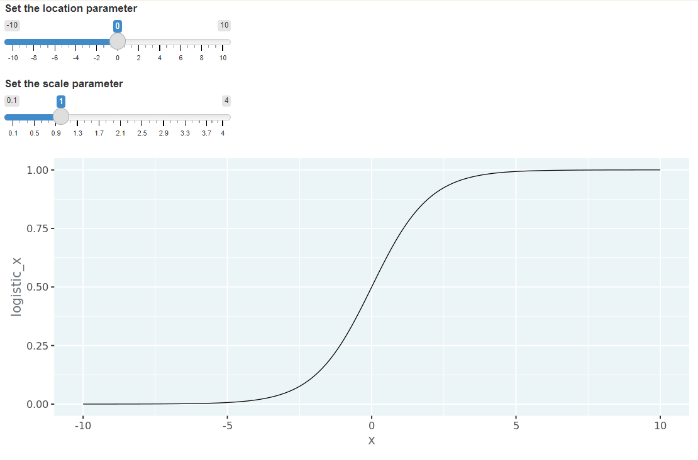

Multiple Logistic Regression
================
Mohamad Osman
2022-07-24

# Section 04:Multiple Logistic Regression

### **01-Visualizing multiple explanatory variables**

Logistic regression also supports multiple explanatory variables.
Plotting has similar issues as the linear regression case: it quickly
becomes difficult to include more numeric variables in the plot. Here
we’ll look at the case of two numeric explanatory variables, and the
solution is basically the same as before: use color to denote the
response.

Here there are only two possible values of response (zero and one), and
later when we add predicted responses, the values all lie between zero
and one. Once you include predicted responses, the most important thing
to determine from the plot is whether the predictions are close to zero,
or close to one. That means that a 2-color gradient split at 0.5 is
really useful: responses above 0.5 are one color, and responses below
0.5 are another color.

The bank churn dataset is available as `churn`; `ggplot2` is loaded.

-   Using the `churn` dataset, plot the recency of purchase,
    `time_since_last_purchase`, versus the length of customer
    relationship, `time_since_first_purchase`, colored by whether or not
    the customer churned, `has_churned`.

-   Add a point layer, with transparency set to `0.5`.

-   Use a 2-color gradient, with midpoint `0.5`.

-   Use the black and white theme.

``` r
library(ggplot2)
library(fst)
library(dplyr)
```

    ## 
    ## Attaching package: 'dplyr'

    ## The following objects are masked from 'package:stats':
    ## 
    ##     filter, lag

    ## The following objects are masked from 'package:base':
    ## 
    ##     intersect, setdiff, setequal, union

``` r
library(yardstick)
```

    ## For binary classification, the first factor level is assumed to be the event.
    ## Use the argument `event_level = "second"` to alter this as needed.

``` r
file_path <- file.path("..", "00_Datasets", "churn.fst")
churn <- read_fst(file_path)
head(churn)
```

    ##   has_churned time_since_first_purchase time_since_last_purchase
    ## 1           0               -1.08922097               -0.7213215
    ## 2           0                1.18298297                3.6344354
    ## 3           0               -0.84615637               -0.4275823
    ## 4           0                0.08694165               -0.5356717
    ## 5           0               -1.16664155               -0.6726400
    ## 6           0                0.49339968               -0.7700030

``` r
# Using churn, plot recency vs. length of relationship colored by churn status
ggplot(churn, aes(time_since_first_purchase, time_since_last_purchase, color = has_churned)) +
  # Make it a scatter plot, with transparency 0.5
  geom_point(alpha = 0.5) +
  # Use a 2-color gradient split at 0.5
  scale_color_gradient2(midpoint = 0.5) +
  # Use the black and white theme
  theme_bw()
```

<!-- -->

### **`02-Logistic regression with 2 explanatory variables`**

To include multiple explanatory variables in logistic regression models,
the syntax is the same as for linear regressions. The only change is the
same as in the simple case: you run a *generalized* linear model with a
binomial error family.

Here you’ll fit a model of churn status with both of the explanatory
variables from the dataset: the length of customer relationship and the
recency of purchase.

`churn` is available.

-   Fit a logistic regression of churn status, `has_churned` versus
    length of customer relationship, `time_since_first_purchase` and
    recency of purchase, `time_since_last_purchase`, and an interaction
    between the explanatory variables.

``` r
# Fit a logistic regression of churn status vs. length of relationship, recency, and an interaction
mdl_churn_vs_both_inter <- glm(has_churned ~ time_since_first_purchase * time_since_last_purchase, data = churn, family = binomial)


# See the result
mdl_churn_vs_both_inter
```

    ## 
    ## Call:  glm(formula = has_churned ~ time_since_first_purchase * time_since_last_purchase, 
    ##     family = binomial, data = churn)
    ## 
    ## Coefficients:
    ##                                        (Intercept)  
    ##                                            -0.1505  
    ##                          time_since_first_purchase  
    ##                                            -0.6376  
    ##                           time_since_last_purchase  
    ##                                             0.4233  
    ## time_since_first_purchase:time_since_last_purchase  
    ##                                             0.1123  
    ## 
    ## Degrees of Freedom: 399 Total (i.e. Null);  396 Residual
    ## Null Deviance:       554.5 
    ## Residual Deviance: 519.8     AIC: 527.8

### 

**`03-Logistic regression prediction`**

As with linear regression, the joy of logistic regression is that you
can make predictions. Let’s step through the prediction flow one more
time!

`churn` and `mdl_churn_vs_both_inter` are available; `dplyr`, `tidyr`
and `ggplot2` are loaded.

``` r
# Make a grid of explanatory data
explanatory_data <- expand.grid(
  # Set len. relationship to seq from -2 to 4 in steps of 0.1
  time_since_first_purchase = seq(-2, 4, 0.1),
  # Set recency to seq from -1 to 6 in steps of 0.1
  time_since_last_purchase = seq(-1, 6, 0.1)
)

# See the result
explanatory_data
```

    ##      time_since_first_purchase time_since_last_purchase
    ## 1                         -2.0                     -1.0
    ## 2                         -1.9                     -1.0
    ## 3                         -1.8                     -1.0
    ## 4                         -1.7                     -1.0
    ## 5                         -1.6                     -1.0
    ## 6                         -1.5                     -1.0
    ## 7                         -1.4                     -1.0
    ## 8                         -1.3                     -1.0
    ## 9                         -1.2                     -1.0
    ## 10                        -1.1                     -1.0
    ## 11                        -1.0                     -1.0
    ## 12                        -0.9                     -1.0
    ## 13                        -0.8                     -1.0
    ## 14                        -0.7                     -1.0
    ## 15                        -0.6                     -1.0
    ## 16                        -0.5                     -1.0
    ## 17                        -0.4                     -1.0
    ## 18                        -0.3                     -1.0
    ## 19                        -0.2                     -1.0
    ## 20                        -0.1                     -1.0
    ## 21                         0.0                     -1.0
    ## 22                         0.1                     -1.0
    ## 23                         0.2                     -1.0
    ## 24                         0.3                     -1.0
    ## 25                         0.4                     -1.0
    ## 26                         0.5                     -1.0
    ## 27                         0.6                     -1.0
    ## 28                         0.7                     -1.0
    ## 29                         0.8                     -1.0
    ## 30                         0.9                     -1.0
    ## 31                         1.0                     -1.0
    ## 32                         1.1                     -1.0
    ## 33                         1.2                     -1.0
    ## 34                         1.3                     -1.0
    ## 35                         1.4                     -1.0
    ## 36                         1.5                     -1.0
    ## 37                         1.6                     -1.0
    ## 38                         1.7                     -1.0
    ## 39                         1.8                     -1.0
    ## 40                         1.9                     -1.0
    ## 41                         2.0                     -1.0
    ## 42                         2.1                     -1.0
    ## 43                         2.2                     -1.0
    ## 44                         2.3                     -1.0
    ## 45                         2.4                     -1.0
    ## 46                         2.5                     -1.0
    ## 47                         2.6                     -1.0
    ## 48                         2.7                     -1.0
    ## 49                         2.8                     -1.0
    ## 50                         2.9                     -1.0
    ## 51                         3.0                     -1.0
    ## 52                         3.1                     -1.0
    ## 53                         3.2                     -1.0
    ## 54                         3.3                     -1.0
    ## 55                         3.4                     -1.0
    ## 56                         3.5                     -1.0
    ## 57                         3.6                     -1.0
    ## 58                         3.7                     -1.0
    ## 59                         3.8                     -1.0
    ## 60                         3.9                     -1.0
    ## 61                         4.0                     -1.0
    ## 62                        -2.0                     -0.9
    ## 63                        -1.9                     -0.9
    ## 64                        -1.8                     -0.9
    ## 65                        -1.7                     -0.9
    ## 66                        -1.6                     -0.9
    ## 67                        -1.5                     -0.9
    ## 68                        -1.4                     -0.9
    ## 69                        -1.3                     -0.9
    ## 70                        -1.2                     -0.9
    ## 71                        -1.1                     -0.9
    ## 72                        -1.0                     -0.9
    ## 73                        -0.9                     -0.9
    ## 74                        -0.8                     -0.9
    ## 75                        -0.7                     -0.9
    ## 76                        -0.6                     -0.9
    ## 77                        -0.5                     -0.9
    ## 78                        -0.4                     -0.9
    ## 79                        -0.3                     -0.9
    ## 80                        -0.2                     -0.9
    ## 81                        -0.1                     -0.9
    ## 82                         0.0                     -0.9
    ## 83                         0.1                     -0.9
    ## 84                         0.2                     -0.9
    ## 85                         0.3                     -0.9
    ## 86                         0.4                     -0.9
    ## 87                         0.5                     -0.9
    ## 88                         0.6                     -0.9
    ## 89                         0.7                     -0.9
    ## 90                         0.8                     -0.9
    ## 91                         0.9                     -0.9
    ## 92                         1.0                     -0.9
    ## 93                         1.1                     -0.9
    ## 94                         1.2                     -0.9
    ## 95                         1.3                     -0.9
    ## 96                         1.4                     -0.9
    ## 97                         1.5                     -0.9
    ## 98                         1.6                     -0.9
    ## 99                         1.7                     -0.9
    ## 100                        1.8                     -0.9
    ## 101                        1.9                     -0.9
    ## 102                        2.0                     -0.9
    ## 103                        2.1                     -0.9
    ## 104                        2.2                     -0.9
    ## 105                        2.3                     -0.9
    ## 106                        2.4                     -0.9
    ## 107                        2.5                     -0.9
    ## 108                        2.6                     -0.9
    ## 109                        2.7                     -0.9
    ## 110                        2.8                     -0.9
    ## 111                        2.9                     -0.9
    ## 112                        3.0                     -0.9
    ## 113                        3.1                     -0.9
    ## 114                        3.2                     -0.9
    ## 115                        3.3                     -0.9
    ## 116                        3.4                     -0.9
    ## 117                        3.5                     -0.9
    ## 118                        3.6                     -0.9
    ## 119                        3.7                     -0.9
    ## 120                        3.8                     -0.9
    ## 121                        3.9                     -0.9
    ## 122                        4.0                     -0.9
    ## 123                       -2.0                     -0.8
    ## 124                       -1.9                     -0.8
    ## 125                       -1.8                     -0.8
    ## 126                       -1.7                     -0.8
    ## 127                       -1.6                     -0.8
    ## 128                       -1.5                     -0.8
    ## 129                       -1.4                     -0.8
    ## 130                       -1.3                     -0.8
    ## 131                       -1.2                     -0.8
    ## 132                       -1.1                     -0.8
    ## 133                       -1.0                     -0.8
    ## 134                       -0.9                     -0.8
    ## 135                       -0.8                     -0.8
    ## 136                       -0.7                     -0.8
    ## 137                       -0.6                     -0.8
    ## 138                       -0.5                     -0.8
    ## 139                       -0.4                     -0.8
    ## 140                       -0.3                     -0.8
    ## 141                       -0.2                     -0.8
    ## 142                       -0.1                     -0.8
    ## 143                        0.0                     -0.8
    ## 144                        0.1                     -0.8
    ## 145                        0.2                     -0.8
    ## 146                        0.3                     -0.8
    ## 147                        0.4                     -0.8
    ## 148                        0.5                     -0.8
    ## 149                        0.6                     -0.8
    ## 150                        0.7                     -0.8
    ## 151                        0.8                     -0.8
    ## 152                        0.9                     -0.8
    ## 153                        1.0                     -0.8
    ## 154                        1.1                     -0.8
    ## 155                        1.2                     -0.8
    ## 156                        1.3                     -0.8
    ## 157                        1.4                     -0.8
    ## 158                        1.5                     -0.8
    ## 159                        1.6                     -0.8
    ## 160                        1.7                     -0.8
    ## 161                        1.8                     -0.8
    ## 162                        1.9                     -0.8
    ## 163                        2.0                     -0.8
    ## 164                        2.1                     -0.8
    ## 165                        2.2                     -0.8
    ## 166                        2.3                     -0.8
    ## 167                        2.4                     -0.8
    ## 168                        2.5                     -0.8
    ## 169                        2.6                     -0.8
    ## 170                        2.7                     -0.8
    ## 171                        2.8                     -0.8
    ## 172                        2.9                     -0.8
    ## 173                        3.0                     -0.8
    ## 174                        3.1                     -0.8
    ## 175                        3.2                     -0.8
    ## 176                        3.3                     -0.8
    ## 177                        3.4                     -0.8
    ## 178                        3.5                     -0.8
    ## 179                        3.6                     -0.8
    ## 180                        3.7                     -0.8
    ## 181                        3.8                     -0.8
    ## 182                        3.9                     -0.8
    ## 183                        4.0                     -0.8
    ## 184                       -2.0                     -0.7
    ## 185                       -1.9                     -0.7
    ## 186                       -1.8                     -0.7
    ## 187                       -1.7                     -0.7
    ## 188                       -1.6                     -0.7
    ## 189                       -1.5                     -0.7
    ## 190                       -1.4                     -0.7
    ## 191                       -1.3                     -0.7
    ## 192                       -1.2                     -0.7
    ## 193                       -1.1                     -0.7
    ## 194                       -1.0                     -0.7
    ## 195                       -0.9                     -0.7
    ## 196                       -0.8                     -0.7
    ## 197                       -0.7                     -0.7
    ## 198                       -0.6                     -0.7
    ## 199                       -0.5                     -0.7
    ## 200                       -0.4                     -0.7
    ## 201                       -0.3                     -0.7
    ## 202                       -0.2                     -0.7
    ## 203                       -0.1                     -0.7
    ## 204                        0.0                     -0.7
    ## 205                        0.1                     -0.7
    ## 206                        0.2                     -0.7
    ## 207                        0.3                     -0.7
    ## 208                        0.4                     -0.7
    ## 209                        0.5                     -0.7
    ## 210                        0.6                     -0.7
    ## 211                        0.7                     -0.7
    ## 212                        0.8                     -0.7
    ## 213                        0.9                     -0.7
    ## 214                        1.0                     -0.7
    ## 215                        1.1                     -0.7
    ## 216                        1.2                     -0.7
    ## 217                        1.3                     -0.7
    ## 218                        1.4                     -0.7
    ## 219                        1.5                     -0.7
    ## 220                        1.6                     -0.7
    ## 221                        1.7                     -0.7
    ## 222                        1.8                     -0.7
    ## 223                        1.9                     -0.7
    ## 224                        2.0                     -0.7
    ## 225                        2.1                     -0.7
    ## 226                        2.2                     -0.7
    ## 227                        2.3                     -0.7
    ## 228                        2.4                     -0.7
    ## 229                        2.5                     -0.7
    ## 230                        2.6                     -0.7
    ## 231                        2.7                     -0.7
    ## 232                        2.8                     -0.7
    ## 233                        2.9                     -0.7
    ## 234                        3.0                     -0.7
    ## 235                        3.1                     -0.7
    ## 236                        3.2                     -0.7
    ## 237                        3.3                     -0.7
    ## 238                        3.4                     -0.7
    ## 239                        3.5                     -0.7
    ## 240                        3.6                     -0.7
    ## 241                        3.7                     -0.7
    ## 242                        3.8                     -0.7
    ## 243                        3.9                     -0.7
    ## 244                        4.0                     -0.7
    ## 245                       -2.0                     -0.6
    ## 246                       -1.9                     -0.6
    ## 247                       -1.8                     -0.6
    ## 248                       -1.7                     -0.6
    ## 249                       -1.6                     -0.6
    ## 250                       -1.5                     -0.6
    ## 251                       -1.4                     -0.6
    ## 252                       -1.3                     -0.6
    ## 253                       -1.2                     -0.6
    ## 254                       -1.1                     -0.6
    ## 255                       -1.0                     -0.6
    ## 256                       -0.9                     -0.6
    ## 257                       -0.8                     -0.6
    ## 258                       -0.7                     -0.6
    ## 259                       -0.6                     -0.6
    ## 260                       -0.5                     -0.6
    ## 261                       -0.4                     -0.6
    ## 262                       -0.3                     -0.6
    ## 263                       -0.2                     -0.6
    ## 264                       -0.1                     -0.6
    ## 265                        0.0                     -0.6
    ## 266                        0.1                     -0.6
    ## 267                        0.2                     -0.6
    ## 268                        0.3                     -0.6
    ## 269                        0.4                     -0.6
    ## 270                        0.5                     -0.6
    ## 271                        0.6                     -0.6
    ## 272                        0.7                     -0.6
    ## 273                        0.8                     -0.6
    ## 274                        0.9                     -0.6
    ## 275                        1.0                     -0.6
    ## 276                        1.1                     -0.6
    ## 277                        1.2                     -0.6
    ## 278                        1.3                     -0.6
    ## 279                        1.4                     -0.6
    ## 280                        1.5                     -0.6
    ## 281                        1.6                     -0.6
    ## 282                        1.7                     -0.6
    ## 283                        1.8                     -0.6
    ## 284                        1.9                     -0.6
    ## 285                        2.0                     -0.6
    ## 286                        2.1                     -0.6
    ## 287                        2.2                     -0.6
    ## 288                        2.3                     -0.6
    ## 289                        2.4                     -0.6
    ## 290                        2.5                     -0.6
    ## 291                        2.6                     -0.6
    ## 292                        2.7                     -0.6
    ## 293                        2.8                     -0.6
    ## 294                        2.9                     -0.6
    ## 295                        3.0                     -0.6
    ## 296                        3.1                     -0.6
    ## 297                        3.2                     -0.6
    ## 298                        3.3                     -0.6
    ## 299                        3.4                     -0.6
    ## 300                        3.5                     -0.6
    ## 301                        3.6                     -0.6
    ## 302                        3.7                     -0.6
    ## 303                        3.8                     -0.6
    ## 304                        3.9                     -0.6
    ## 305                        4.0                     -0.6
    ## 306                       -2.0                     -0.5
    ## 307                       -1.9                     -0.5
    ## 308                       -1.8                     -0.5
    ## 309                       -1.7                     -0.5
    ## 310                       -1.6                     -0.5
    ## 311                       -1.5                     -0.5
    ## 312                       -1.4                     -0.5
    ## 313                       -1.3                     -0.5
    ## 314                       -1.2                     -0.5
    ## 315                       -1.1                     -0.5
    ## 316                       -1.0                     -0.5
    ## 317                       -0.9                     -0.5
    ## 318                       -0.8                     -0.5
    ## 319                       -0.7                     -0.5
    ## 320                       -0.6                     -0.5
    ## 321                       -0.5                     -0.5
    ## 322                       -0.4                     -0.5
    ## 323                       -0.3                     -0.5
    ## 324                       -0.2                     -0.5
    ## 325                       -0.1                     -0.5
    ## 326                        0.0                     -0.5
    ## 327                        0.1                     -0.5
    ## 328                        0.2                     -0.5
    ## 329                        0.3                     -0.5
    ## 330                        0.4                     -0.5
    ## 331                        0.5                     -0.5
    ## 332                        0.6                     -0.5
    ## 333                        0.7                     -0.5
    ## 334                        0.8                     -0.5
    ## 335                        0.9                     -0.5
    ## 336                        1.0                     -0.5
    ## 337                        1.1                     -0.5
    ## 338                        1.2                     -0.5
    ## 339                        1.3                     -0.5
    ## 340                        1.4                     -0.5
    ## 341                        1.5                     -0.5
    ## 342                        1.6                     -0.5
    ## 343                        1.7                     -0.5
    ## 344                        1.8                     -0.5
    ## 345                        1.9                     -0.5
    ## 346                        2.0                     -0.5
    ## 347                        2.1                     -0.5
    ## 348                        2.2                     -0.5
    ## 349                        2.3                     -0.5
    ## 350                        2.4                     -0.5
    ## 351                        2.5                     -0.5
    ## 352                        2.6                     -0.5
    ## 353                        2.7                     -0.5
    ## 354                        2.8                     -0.5
    ## 355                        2.9                     -0.5
    ## 356                        3.0                     -0.5
    ## 357                        3.1                     -0.5
    ## 358                        3.2                     -0.5
    ## 359                        3.3                     -0.5
    ## 360                        3.4                     -0.5
    ## 361                        3.5                     -0.5
    ## 362                        3.6                     -0.5
    ## 363                        3.7                     -0.5
    ## 364                        3.8                     -0.5
    ## 365                        3.9                     -0.5
    ## 366                        4.0                     -0.5
    ## 367                       -2.0                     -0.4
    ## 368                       -1.9                     -0.4
    ## 369                       -1.8                     -0.4
    ## 370                       -1.7                     -0.4
    ## 371                       -1.6                     -0.4
    ## 372                       -1.5                     -0.4
    ## 373                       -1.4                     -0.4
    ## 374                       -1.3                     -0.4
    ## 375                       -1.2                     -0.4
    ## 376                       -1.1                     -0.4
    ## 377                       -1.0                     -0.4
    ## 378                       -0.9                     -0.4
    ## 379                       -0.8                     -0.4
    ## 380                       -0.7                     -0.4
    ## 381                       -0.6                     -0.4
    ## 382                       -0.5                     -0.4
    ## 383                       -0.4                     -0.4
    ## 384                       -0.3                     -0.4
    ## 385                       -0.2                     -0.4
    ## 386                       -0.1                     -0.4
    ## 387                        0.0                     -0.4
    ## 388                        0.1                     -0.4
    ## 389                        0.2                     -0.4
    ## 390                        0.3                     -0.4
    ## 391                        0.4                     -0.4
    ## 392                        0.5                     -0.4
    ## 393                        0.6                     -0.4
    ## 394                        0.7                     -0.4
    ## 395                        0.8                     -0.4
    ## 396                        0.9                     -0.4
    ## 397                        1.0                     -0.4
    ## 398                        1.1                     -0.4
    ## 399                        1.2                     -0.4
    ## 400                        1.3                     -0.4
    ## 401                        1.4                     -0.4
    ## 402                        1.5                     -0.4
    ## 403                        1.6                     -0.4
    ## 404                        1.7                     -0.4
    ## 405                        1.8                     -0.4
    ## 406                        1.9                     -0.4
    ## 407                        2.0                     -0.4
    ## 408                        2.1                     -0.4
    ## 409                        2.2                     -0.4
    ## 410                        2.3                     -0.4
    ## 411                        2.4                     -0.4
    ## 412                        2.5                     -0.4
    ## 413                        2.6                     -0.4
    ## 414                        2.7                     -0.4
    ## 415                        2.8                     -0.4
    ## 416                        2.9                     -0.4
    ## 417                        3.0                     -0.4
    ## 418                        3.1                     -0.4
    ## 419                        3.2                     -0.4
    ## 420                        3.3                     -0.4
    ## 421                        3.4                     -0.4
    ## 422                        3.5                     -0.4
    ## 423                        3.6                     -0.4
    ## 424                        3.7                     -0.4
    ## 425                        3.8                     -0.4
    ## 426                        3.9                     -0.4
    ## 427                        4.0                     -0.4
    ## 428                       -2.0                     -0.3
    ## 429                       -1.9                     -0.3
    ## 430                       -1.8                     -0.3
    ## 431                       -1.7                     -0.3
    ## 432                       -1.6                     -0.3
    ## 433                       -1.5                     -0.3
    ## 434                       -1.4                     -0.3
    ## 435                       -1.3                     -0.3
    ## 436                       -1.2                     -0.3
    ## 437                       -1.1                     -0.3
    ## 438                       -1.0                     -0.3
    ## 439                       -0.9                     -0.3
    ## 440                       -0.8                     -0.3
    ## 441                       -0.7                     -0.3
    ## 442                       -0.6                     -0.3
    ## 443                       -0.5                     -0.3
    ## 444                       -0.4                     -0.3
    ## 445                       -0.3                     -0.3
    ## 446                       -0.2                     -0.3
    ## 447                       -0.1                     -0.3
    ## 448                        0.0                     -0.3
    ## 449                        0.1                     -0.3
    ## 450                        0.2                     -0.3
    ## 451                        0.3                     -0.3
    ## 452                        0.4                     -0.3
    ## 453                        0.5                     -0.3
    ## 454                        0.6                     -0.3
    ## 455                        0.7                     -0.3
    ## 456                        0.8                     -0.3
    ## 457                        0.9                     -0.3
    ## 458                        1.0                     -0.3
    ## 459                        1.1                     -0.3
    ## 460                        1.2                     -0.3
    ## 461                        1.3                     -0.3
    ## 462                        1.4                     -0.3
    ## 463                        1.5                     -0.3
    ## 464                        1.6                     -0.3
    ## 465                        1.7                     -0.3
    ## 466                        1.8                     -0.3
    ## 467                        1.9                     -0.3
    ## 468                        2.0                     -0.3
    ## 469                        2.1                     -0.3
    ## 470                        2.2                     -0.3
    ## 471                        2.3                     -0.3
    ## 472                        2.4                     -0.3
    ## 473                        2.5                     -0.3
    ## 474                        2.6                     -0.3
    ## 475                        2.7                     -0.3
    ## 476                        2.8                     -0.3
    ## 477                        2.9                     -0.3
    ## 478                        3.0                     -0.3
    ## 479                        3.1                     -0.3
    ## 480                        3.2                     -0.3
    ## 481                        3.3                     -0.3
    ## 482                        3.4                     -0.3
    ## 483                        3.5                     -0.3
    ## 484                        3.6                     -0.3
    ## 485                        3.7                     -0.3
    ## 486                        3.8                     -0.3
    ## 487                        3.9                     -0.3
    ## 488                        4.0                     -0.3
    ## 489                       -2.0                     -0.2
    ## 490                       -1.9                     -0.2
    ## 491                       -1.8                     -0.2
    ## 492                       -1.7                     -0.2
    ## 493                       -1.6                     -0.2
    ## 494                       -1.5                     -0.2
    ## 495                       -1.4                     -0.2
    ## 496                       -1.3                     -0.2
    ## 497                       -1.2                     -0.2
    ## 498                       -1.1                     -0.2
    ## 499                       -1.0                     -0.2
    ## 500                       -0.9                     -0.2
    ## 501                       -0.8                     -0.2
    ## 502                       -0.7                     -0.2
    ## 503                       -0.6                     -0.2
    ## 504                       -0.5                     -0.2
    ## 505                       -0.4                     -0.2
    ## 506                       -0.3                     -0.2
    ## 507                       -0.2                     -0.2
    ## 508                       -0.1                     -0.2
    ## 509                        0.0                     -0.2
    ## 510                        0.1                     -0.2
    ## 511                        0.2                     -0.2
    ## 512                        0.3                     -0.2
    ## 513                        0.4                     -0.2
    ## 514                        0.5                     -0.2
    ## 515                        0.6                     -0.2
    ## 516                        0.7                     -0.2
    ## 517                        0.8                     -0.2
    ## 518                        0.9                     -0.2
    ## 519                        1.0                     -0.2
    ## 520                        1.1                     -0.2
    ## 521                        1.2                     -0.2
    ## 522                        1.3                     -0.2
    ## 523                        1.4                     -0.2
    ## 524                        1.5                     -0.2
    ## 525                        1.6                     -0.2
    ## 526                        1.7                     -0.2
    ## 527                        1.8                     -0.2
    ## 528                        1.9                     -0.2
    ## 529                        2.0                     -0.2
    ## 530                        2.1                     -0.2
    ## 531                        2.2                     -0.2
    ## 532                        2.3                     -0.2
    ## 533                        2.4                     -0.2
    ## 534                        2.5                     -0.2
    ## 535                        2.6                     -0.2
    ## 536                        2.7                     -0.2
    ## 537                        2.8                     -0.2
    ## 538                        2.9                     -0.2
    ## 539                        3.0                     -0.2
    ## 540                        3.1                     -0.2
    ## 541                        3.2                     -0.2
    ## 542                        3.3                     -0.2
    ## 543                        3.4                     -0.2
    ## 544                        3.5                     -0.2
    ## 545                        3.6                     -0.2
    ## 546                        3.7                     -0.2
    ## 547                        3.8                     -0.2
    ## 548                        3.9                     -0.2
    ## 549                        4.0                     -0.2
    ## 550                       -2.0                     -0.1
    ## 551                       -1.9                     -0.1
    ## 552                       -1.8                     -0.1
    ## 553                       -1.7                     -0.1
    ## 554                       -1.6                     -0.1
    ## 555                       -1.5                     -0.1
    ## 556                       -1.4                     -0.1
    ## 557                       -1.3                     -0.1
    ## 558                       -1.2                     -0.1
    ## 559                       -1.1                     -0.1
    ## 560                       -1.0                     -0.1
    ## 561                       -0.9                     -0.1
    ## 562                       -0.8                     -0.1
    ## 563                       -0.7                     -0.1
    ## 564                       -0.6                     -0.1
    ## 565                       -0.5                     -0.1
    ## 566                       -0.4                     -0.1
    ## 567                       -0.3                     -0.1
    ## 568                       -0.2                     -0.1
    ## 569                       -0.1                     -0.1
    ## 570                        0.0                     -0.1
    ## 571                        0.1                     -0.1
    ## 572                        0.2                     -0.1
    ## 573                        0.3                     -0.1
    ## 574                        0.4                     -0.1
    ## 575                        0.5                     -0.1
    ## 576                        0.6                     -0.1
    ## 577                        0.7                     -0.1
    ## 578                        0.8                     -0.1
    ## 579                        0.9                     -0.1
    ## 580                        1.0                     -0.1
    ## 581                        1.1                     -0.1
    ## 582                        1.2                     -0.1
    ## 583                        1.3                     -0.1
    ## 584                        1.4                     -0.1
    ## 585                        1.5                     -0.1
    ## 586                        1.6                     -0.1
    ## 587                        1.7                     -0.1
    ## 588                        1.8                     -0.1
    ## 589                        1.9                     -0.1
    ## 590                        2.0                     -0.1
    ## 591                        2.1                     -0.1
    ## 592                        2.2                     -0.1
    ## 593                        2.3                     -0.1
    ## 594                        2.4                     -0.1
    ## 595                        2.5                     -0.1
    ## 596                        2.6                     -0.1
    ## 597                        2.7                     -0.1
    ## 598                        2.8                     -0.1
    ## 599                        2.9                     -0.1
    ## 600                        3.0                     -0.1
    ## 601                        3.1                     -0.1
    ## 602                        3.2                     -0.1
    ## 603                        3.3                     -0.1
    ## 604                        3.4                     -0.1
    ## 605                        3.5                     -0.1
    ## 606                        3.6                     -0.1
    ## 607                        3.7                     -0.1
    ## 608                        3.8                     -0.1
    ## 609                        3.9                     -0.1
    ## 610                        4.0                     -0.1
    ## 611                       -2.0                      0.0
    ## 612                       -1.9                      0.0
    ## 613                       -1.8                      0.0
    ## 614                       -1.7                      0.0
    ## 615                       -1.6                      0.0
    ## 616                       -1.5                      0.0
    ## 617                       -1.4                      0.0
    ## 618                       -1.3                      0.0
    ## 619                       -1.2                      0.0
    ## 620                       -1.1                      0.0
    ## 621                       -1.0                      0.0
    ## 622                       -0.9                      0.0
    ## 623                       -0.8                      0.0
    ## 624                       -0.7                      0.0
    ## 625                       -0.6                      0.0
    ## 626                       -0.5                      0.0
    ## 627                       -0.4                      0.0
    ## 628                       -0.3                      0.0
    ## 629                       -0.2                      0.0
    ## 630                       -0.1                      0.0
    ## 631                        0.0                      0.0
    ## 632                        0.1                      0.0
    ## 633                        0.2                      0.0
    ## 634                        0.3                      0.0
    ## 635                        0.4                      0.0
    ## 636                        0.5                      0.0
    ## 637                        0.6                      0.0
    ## 638                        0.7                      0.0
    ## 639                        0.8                      0.0
    ## 640                        0.9                      0.0
    ## 641                        1.0                      0.0
    ## 642                        1.1                      0.0
    ## 643                        1.2                      0.0
    ## 644                        1.3                      0.0
    ## 645                        1.4                      0.0
    ## 646                        1.5                      0.0
    ## 647                        1.6                      0.0
    ## 648                        1.7                      0.0
    ## 649                        1.8                      0.0
    ## 650                        1.9                      0.0
    ## 651                        2.0                      0.0
    ## 652                        2.1                      0.0
    ## 653                        2.2                      0.0
    ## 654                        2.3                      0.0
    ## 655                        2.4                      0.0
    ## 656                        2.5                      0.0
    ## 657                        2.6                      0.0
    ## 658                        2.7                      0.0
    ## 659                        2.8                      0.0
    ## 660                        2.9                      0.0
    ## 661                        3.0                      0.0
    ## 662                        3.1                      0.0
    ## 663                        3.2                      0.0
    ## 664                        3.3                      0.0
    ## 665                        3.4                      0.0
    ## 666                        3.5                      0.0
    ## 667                        3.6                      0.0
    ## 668                        3.7                      0.0
    ## 669                        3.8                      0.0
    ## 670                        3.9                      0.0
    ## 671                        4.0                      0.0
    ## 672                       -2.0                      0.1
    ## 673                       -1.9                      0.1
    ## 674                       -1.8                      0.1
    ## 675                       -1.7                      0.1
    ## 676                       -1.6                      0.1
    ## 677                       -1.5                      0.1
    ## 678                       -1.4                      0.1
    ## 679                       -1.3                      0.1
    ## 680                       -1.2                      0.1
    ## 681                       -1.1                      0.1
    ## 682                       -1.0                      0.1
    ## 683                       -0.9                      0.1
    ## 684                       -0.8                      0.1
    ## 685                       -0.7                      0.1
    ## 686                       -0.6                      0.1
    ## 687                       -0.5                      0.1
    ## 688                       -0.4                      0.1
    ## 689                       -0.3                      0.1
    ## 690                       -0.2                      0.1
    ## 691                       -0.1                      0.1
    ## 692                        0.0                      0.1
    ## 693                        0.1                      0.1
    ## 694                        0.2                      0.1
    ## 695                        0.3                      0.1
    ## 696                        0.4                      0.1
    ## 697                        0.5                      0.1
    ## 698                        0.6                      0.1
    ## 699                        0.7                      0.1
    ## 700                        0.8                      0.1
    ## 701                        0.9                      0.1
    ## 702                        1.0                      0.1
    ## 703                        1.1                      0.1
    ## 704                        1.2                      0.1
    ## 705                        1.3                      0.1
    ## 706                        1.4                      0.1
    ## 707                        1.5                      0.1
    ## 708                        1.6                      0.1
    ## 709                        1.7                      0.1
    ## 710                        1.8                      0.1
    ## 711                        1.9                      0.1
    ## 712                        2.0                      0.1
    ## 713                        2.1                      0.1
    ## 714                        2.2                      0.1
    ## 715                        2.3                      0.1
    ## 716                        2.4                      0.1
    ## 717                        2.5                      0.1
    ## 718                        2.6                      0.1
    ## 719                        2.7                      0.1
    ## 720                        2.8                      0.1
    ## 721                        2.9                      0.1
    ## 722                        3.0                      0.1
    ## 723                        3.1                      0.1
    ## 724                        3.2                      0.1
    ## 725                        3.3                      0.1
    ## 726                        3.4                      0.1
    ## 727                        3.5                      0.1
    ## 728                        3.6                      0.1
    ## 729                        3.7                      0.1
    ## 730                        3.8                      0.1
    ## 731                        3.9                      0.1
    ## 732                        4.0                      0.1
    ## 733                       -2.0                      0.2
    ## 734                       -1.9                      0.2
    ## 735                       -1.8                      0.2
    ## 736                       -1.7                      0.2
    ## 737                       -1.6                      0.2
    ## 738                       -1.5                      0.2
    ## 739                       -1.4                      0.2
    ## 740                       -1.3                      0.2
    ## 741                       -1.2                      0.2
    ## 742                       -1.1                      0.2
    ## 743                       -1.0                      0.2
    ## 744                       -0.9                      0.2
    ## 745                       -0.8                      0.2
    ## 746                       -0.7                      0.2
    ## 747                       -0.6                      0.2
    ## 748                       -0.5                      0.2
    ## 749                       -0.4                      0.2
    ## 750                       -0.3                      0.2
    ## 751                       -0.2                      0.2
    ## 752                       -0.1                      0.2
    ## 753                        0.0                      0.2
    ## 754                        0.1                      0.2
    ## 755                        0.2                      0.2
    ## 756                        0.3                      0.2
    ## 757                        0.4                      0.2
    ## 758                        0.5                      0.2
    ## 759                        0.6                      0.2
    ## 760                        0.7                      0.2
    ## 761                        0.8                      0.2
    ## 762                        0.9                      0.2
    ## 763                        1.0                      0.2
    ## 764                        1.1                      0.2
    ## 765                        1.2                      0.2
    ## 766                        1.3                      0.2
    ## 767                        1.4                      0.2
    ## 768                        1.5                      0.2
    ## 769                        1.6                      0.2
    ## 770                        1.7                      0.2
    ## 771                        1.8                      0.2
    ## 772                        1.9                      0.2
    ## 773                        2.0                      0.2
    ## 774                        2.1                      0.2
    ## 775                        2.2                      0.2
    ## 776                        2.3                      0.2
    ## 777                        2.4                      0.2
    ## 778                        2.5                      0.2
    ## 779                        2.6                      0.2
    ## 780                        2.7                      0.2
    ## 781                        2.8                      0.2
    ## 782                        2.9                      0.2
    ## 783                        3.0                      0.2
    ## 784                        3.1                      0.2
    ## 785                        3.2                      0.2
    ## 786                        3.3                      0.2
    ## 787                        3.4                      0.2
    ## 788                        3.5                      0.2
    ## 789                        3.6                      0.2
    ## 790                        3.7                      0.2
    ## 791                        3.8                      0.2
    ## 792                        3.9                      0.2
    ## 793                        4.0                      0.2
    ## 794                       -2.0                      0.3
    ## 795                       -1.9                      0.3
    ## 796                       -1.8                      0.3
    ## 797                       -1.7                      0.3
    ## 798                       -1.6                      0.3
    ## 799                       -1.5                      0.3
    ## 800                       -1.4                      0.3
    ## 801                       -1.3                      0.3
    ## 802                       -1.2                      0.3
    ## 803                       -1.1                      0.3
    ## 804                       -1.0                      0.3
    ## 805                       -0.9                      0.3
    ## 806                       -0.8                      0.3
    ## 807                       -0.7                      0.3
    ## 808                       -0.6                      0.3
    ## 809                       -0.5                      0.3
    ## 810                       -0.4                      0.3
    ## 811                       -0.3                      0.3
    ## 812                       -0.2                      0.3
    ## 813                       -0.1                      0.3
    ## 814                        0.0                      0.3
    ## 815                        0.1                      0.3
    ## 816                        0.2                      0.3
    ## 817                        0.3                      0.3
    ## 818                        0.4                      0.3
    ## 819                        0.5                      0.3
    ## 820                        0.6                      0.3
    ## 821                        0.7                      0.3
    ## 822                        0.8                      0.3
    ## 823                        0.9                      0.3
    ## 824                        1.0                      0.3
    ## 825                        1.1                      0.3
    ## 826                        1.2                      0.3
    ## 827                        1.3                      0.3
    ## 828                        1.4                      0.3
    ## 829                        1.5                      0.3
    ## 830                        1.6                      0.3
    ## 831                        1.7                      0.3
    ## 832                        1.8                      0.3
    ## 833                        1.9                      0.3
    ## 834                        2.0                      0.3
    ## 835                        2.1                      0.3
    ## 836                        2.2                      0.3
    ## 837                        2.3                      0.3
    ## 838                        2.4                      0.3
    ## 839                        2.5                      0.3
    ## 840                        2.6                      0.3
    ## 841                        2.7                      0.3
    ## 842                        2.8                      0.3
    ## 843                        2.9                      0.3
    ## 844                        3.0                      0.3
    ## 845                        3.1                      0.3
    ## 846                        3.2                      0.3
    ## 847                        3.3                      0.3
    ## 848                        3.4                      0.3
    ## 849                        3.5                      0.3
    ## 850                        3.6                      0.3
    ## 851                        3.7                      0.3
    ## 852                        3.8                      0.3
    ## 853                        3.9                      0.3
    ## 854                        4.0                      0.3
    ## 855                       -2.0                      0.4
    ## 856                       -1.9                      0.4
    ## 857                       -1.8                      0.4
    ## 858                       -1.7                      0.4
    ## 859                       -1.6                      0.4
    ## 860                       -1.5                      0.4
    ## 861                       -1.4                      0.4
    ## 862                       -1.3                      0.4
    ## 863                       -1.2                      0.4
    ## 864                       -1.1                      0.4
    ## 865                       -1.0                      0.4
    ## 866                       -0.9                      0.4
    ## 867                       -0.8                      0.4
    ## 868                       -0.7                      0.4
    ## 869                       -0.6                      0.4
    ## 870                       -0.5                      0.4
    ## 871                       -0.4                      0.4
    ## 872                       -0.3                      0.4
    ## 873                       -0.2                      0.4
    ## 874                       -0.1                      0.4
    ## 875                        0.0                      0.4
    ## 876                        0.1                      0.4
    ## 877                        0.2                      0.4
    ## 878                        0.3                      0.4
    ## 879                        0.4                      0.4
    ## 880                        0.5                      0.4
    ## 881                        0.6                      0.4
    ## 882                        0.7                      0.4
    ## 883                        0.8                      0.4
    ## 884                        0.9                      0.4
    ## 885                        1.0                      0.4
    ## 886                        1.1                      0.4
    ## 887                        1.2                      0.4
    ## 888                        1.3                      0.4
    ## 889                        1.4                      0.4
    ## 890                        1.5                      0.4
    ## 891                        1.6                      0.4
    ## 892                        1.7                      0.4
    ## 893                        1.8                      0.4
    ## 894                        1.9                      0.4
    ## 895                        2.0                      0.4
    ## 896                        2.1                      0.4
    ## 897                        2.2                      0.4
    ## 898                        2.3                      0.4
    ## 899                        2.4                      0.4
    ## 900                        2.5                      0.4
    ## 901                        2.6                      0.4
    ## 902                        2.7                      0.4
    ## 903                        2.8                      0.4
    ## 904                        2.9                      0.4
    ## 905                        3.0                      0.4
    ## 906                        3.1                      0.4
    ## 907                        3.2                      0.4
    ## 908                        3.3                      0.4
    ## 909                        3.4                      0.4
    ## 910                        3.5                      0.4
    ## 911                        3.6                      0.4
    ## 912                        3.7                      0.4
    ## 913                        3.8                      0.4
    ## 914                        3.9                      0.4
    ## 915                        4.0                      0.4
    ## 916                       -2.0                      0.5
    ## 917                       -1.9                      0.5
    ## 918                       -1.8                      0.5
    ## 919                       -1.7                      0.5
    ## 920                       -1.6                      0.5
    ## 921                       -1.5                      0.5
    ## 922                       -1.4                      0.5
    ## 923                       -1.3                      0.5
    ## 924                       -1.2                      0.5
    ## 925                       -1.1                      0.5
    ## 926                       -1.0                      0.5
    ## 927                       -0.9                      0.5
    ## 928                       -0.8                      0.5
    ## 929                       -0.7                      0.5
    ## 930                       -0.6                      0.5
    ## 931                       -0.5                      0.5
    ## 932                       -0.4                      0.5
    ## 933                       -0.3                      0.5
    ## 934                       -0.2                      0.5
    ## 935                       -0.1                      0.5
    ## 936                        0.0                      0.5
    ## 937                        0.1                      0.5
    ## 938                        0.2                      0.5
    ## 939                        0.3                      0.5
    ## 940                        0.4                      0.5
    ## 941                        0.5                      0.5
    ## 942                        0.6                      0.5
    ## 943                        0.7                      0.5
    ## 944                        0.8                      0.5
    ## 945                        0.9                      0.5
    ## 946                        1.0                      0.5
    ## 947                        1.1                      0.5
    ## 948                        1.2                      0.5
    ## 949                        1.3                      0.5
    ## 950                        1.4                      0.5
    ## 951                        1.5                      0.5
    ## 952                        1.6                      0.5
    ## 953                        1.7                      0.5
    ## 954                        1.8                      0.5
    ## 955                        1.9                      0.5
    ## 956                        2.0                      0.5
    ## 957                        2.1                      0.5
    ## 958                        2.2                      0.5
    ## 959                        2.3                      0.5
    ## 960                        2.4                      0.5
    ## 961                        2.5                      0.5
    ## 962                        2.6                      0.5
    ## 963                        2.7                      0.5
    ## 964                        2.8                      0.5
    ## 965                        2.9                      0.5
    ## 966                        3.0                      0.5
    ## 967                        3.1                      0.5
    ## 968                        3.2                      0.5
    ## 969                        3.3                      0.5
    ## 970                        3.4                      0.5
    ## 971                        3.5                      0.5
    ## 972                        3.6                      0.5
    ## 973                        3.7                      0.5
    ## 974                        3.8                      0.5
    ## 975                        3.9                      0.5
    ## 976                        4.0                      0.5
    ## 977                       -2.0                      0.6
    ## 978                       -1.9                      0.6
    ## 979                       -1.8                      0.6
    ## 980                       -1.7                      0.6
    ## 981                       -1.6                      0.6
    ## 982                       -1.5                      0.6
    ## 983                       -1.4                      0.6
    ## 984                       -1.3                      0.6
    ## 985                       -1.2                      0.6
    ## 986                       -1.1                      0.6
    ## 987                       -1.0                      0.6
    ## 988                       -0.9                      0.6
    ## 989                       -0.8                      0.6
    ## 990                       -0.7                      0.6
    ## 991                       -0.6                      0.6
    ## 992                       -0.5                      0.6
    ## 993                       -0.4                      0.6
    ## 994                       -0.3                      0.6
    ## 995                       -0.2                      0.6
    ## 996                       -0.1                      0.6
    ## 997                        0.0                      0.6
    ## 998                        0.1                      0.6
    ## 999                        0.2                      0.6
    ## 1000                       0.3                      0.6
    ## 1001                       0.4                      0.6
    ## 1002                       0.5                      0.6
    ## 1003                       0.6                      0.6
    ## 1004                       0.7                      0.6
    ## 1005                       0.8                      0.6
    ## 1006                       0.9                      0.6
    ## 1007                       1.0                      0.6
    ## 1008                       1.1                      0.6
    ## 1009                       1.2                      0.6
    ## 1010                       1.3                      0.6
    ## 1011                       1.4                      0.6
    ## 1012                       1.5                      0.6
    ## 1013                       1.6                      0.6
    ## 1014                       1.7                      0.6
    ## 1015                       1.8                      0.6
    ## 1016                       1.9                      0.6
    ## 1017                       2.0                      0.6
    ## 1018                       2.1                      0.6
    ## 1019                       2.2                      0.6
    ## 1020                       2.3                      0.6
    ## 1021                       2.4                      0.6
    ## 1022                       2.5                      0.6
    ## 1023                       2.6                      0.6
    ## 1024                       2.7                      0.6
    ## 1025                       2.8                      0.6
    ## 1026                       2.9                      0.6
    ## 1027                       3.0                      0.6
    ## 1028                       3.1                      0.6
    ## 1029                       3.2                      0.6
    ## 1030                       3.3                      0.6
    ## 1031                       3.4                      0.6
    ## 1032                       3.5                      0.6
    ## 1033                       3.6                      0.6
    ## 1034                       3.7                      0.6
    ## 1035                       3.8                      0.6
    ## 1036                       3.9                      0.6
    ## 1037                       4.0                      0.6
    ## 1038                      -2.0                      0.7
    ## 1039                      -1.9                      0.7
    ## 1040                      -1.8                      0.7
    ## 1041                      -1.7                      0.7
    ## 1042                      -1.6                      0.7
    ## 1043                      -1.5                      0.7
    ## 1044                      -1.4                      0.7
    ## 1045                      -1.3                      0.7
    ## 1046                      -1.2                      0.7
    ## 1047                      -1.1                      0.7
    ## 1048                      -1.0                      0.7
    ## 1049                      -0.9                      0.7
    ## 1050                      -0.8                      0.7
    ## 1051                      -0.7                      0.7
    ## 1052                      -0.6                      0.7
    ## 1053                      -0.5                      0.7
    ## 1054                      -0.4                      0.7
    ## 1055                      -0.3                      0.7
    ## 1056                      -0.2                      0.7
    ## 1057                      -0.1                      0.7
    ## 1058                       0.0                      0.7
    ## 1059                       0.1                      0.7
    ## 1060                       0.2                      0.7
    ## 1061                       0.3                      0.7
    ## 1062                       0.4                      0.7
    ## 1063                       0.5                      0.7
    ## 1064                       0.6                      0.7
    ## 1065                       0.7                      0.7
    ## 1066                       0.8                      0.7
    ## 1067                       0.9                      0.7
    ## 1068                       1.0                      0.7
    ## 1069                       1.1                      0.7
    ## 1070                       1.2                      0.7
    ## 1071                       1.3                      0.7
    ## 1072                       1.4                      0.7
    ## 1073                       1.5                      0.7
    ## 1074                       1.6                      0.7
    ## 1075                       1.7                      0.7
    ## 1076                       1.8                      0.7
    ## 1077                       1.9                      0.7
    ## 1078                       2.0                      0.7
    ## 1079                       2.1                      0.7
    ## 1080                       2.2                      0.7
    ## 1081                       2.3                      0.7
    ## 1082                       2.4                      0.7
    ## 1083                       2.5                      0.7
    ## 1084                       2.6                      0.7
    ## 1085                       2.7                      0.7
    ## 1086                       2.8                      0.7
    ## 1087                       2.9                      0.7
    ## 1088                       3.0                      0.7
    ## 1089                       3.1                      0.7
    ## 1090                       3.2                      0.7
    ## 1091                       3.3                      0.7
    ## 1092                       3.4                      0.7
    ## 1093                       3.5                      0.7
    ## 1094                       3.6                      0.7
    ## 1095                       3.7                      0.7
    ## 1096                       3.8                      0.7
    ## 1097                       3.9                      0.7
    ## 1098                       4.0                      0.7
    ## 1099                      -2.0                      0.8
    ## 1100                      -1.9                      0.8
    ## 1101                      -1.8                      0.8
    ## 1102                      -1.7                      0.8
    ## 1103                      -1.6                      0.8
    ## 1104                      -1.5                      0.8
    ## 1105                      -1.4                      0.8
    ## 1106                      -1.3                      0.8
    ## 1107                      -1.2                      0.8
    ## 1108                      -1.1                      0.8
    ## 1109                      -1.0                      0.8
    ## 1110                      -0.9                      0.8
    ## 1111                      -0.8                      0.8
    ## 1112                      -0.7                      0.8
    ## 1113                      -0.6                      0.8
    ## 1114                      -0.5                      0.8
    ## 1115                      -0.4                      0.8
    ## 1116                      -0.3                      0.8
    ## 1117                      -0.2                      0.8
    ## 1118                      -0.1                      0.8
    ## 1119                       0.0                      0.8
    ## 1120                       0.1                      0.8
    ## 1121                       0.2                      0.8
    ## 1122                       0.3                      0.8
    ## 1123                       0.4                      0.8
    ## 1124                       0.5                      0.8
    ## 1125                       0.6                      0.8
    ## 1126                       0.7                      0.8
    ## 1127                       0.8                      0.8
    ## 1128                       0.9                      0.8
    ## 1129                       1.0                      0.8
    ## 1130                       1.1                      0.8
    ## 1131                       1.2                      0.8
    ## 1132                       1.3                      0.8
    ## 1133                       1.4                      0.8
    ## 1134                       1.5                      0.8
    ## 1135                       1.6                      0.8
    ## 1136                       1.7                      0.8
    ## 1137                       1.8                      0.8
    ## 1138                       1.9                      0.8
    ## 1139                       2.0                      0.8
    ## 1140                       2.1                      0.8
    ## 1141                       2.2                      0.8
    ## 1142                       2.3                      0.8
    ## 1143                       2.4                      0.8
    ## 1144                       2.5                      0.8
    ## 1145                       2.6                      0.8
    ## 1146                       2.7                      0.8
    ## 1147                       2.8                      0.8
    ## 1148                       2.9                      0.8
    ## 1149                       3.0                      0.8
    ## 1150                       3.1                      0.8
    ## 1151                       3.2                      0.8
    ## 1152                       3.3                      0.8
    ## 1153                       3.4                      0.8
    ## 1154                       3.5                      0.8
    ## 1155                       3.6                      0.8
    ## 1156                       3.7                      0.8
    ## 1157                       3.8                      0.8
    ## 1158                       3.9                      0.8
    ## 1159                       4.0                      0.8
    ## 1160                      -2.0                      0.9
    ## 1161                      -1.9                      0.9
    ## 1162                      -1.8                      0.9
    ## 1163                      -1.7                      0.9
    ## 1164                      -1.6                      0.9
    ## 1165                      -1.5                      0.9
    ## 1166                      -1.4                      0.9
    ## 1167                      -1.3                      0.9
    ## 1168                      -1.2                      0.9
    ## 1169                      -1.1                      0.9
    ## 1170                      -1.0                      0.9
    ## 1171                      -0.9                      0.9
    ## 1172                      -0.8                      0.9
    ## 1173                      -0.7                      0.9
    ## 1174                      -0.6                      0.9
    ## 1175                      -0.5                      0.9
    ## 1176                      -0.4                      0.9
    ## 1177                      -0.3                      0.9
    ## 1178                      -0.2                      0.9
    ## 1179                      -0.1                      0.9
    ## 1180                       0.0                      0.9
    ## 1181                       0.1                      0.9
    ## 1182                       0.2                      0.9
    ## 1183                       0.3                      0.9
    ## 1184                       0.4                      0.9
    ## 1185                       0.5                      0.9
    ## 1186                       0.6                      0.9
    ## 1187                       0.7                      0.9
    ## 1188                       0.8                      0.9
    ## 1189                       0.9                      0.9
    ## 1190                       1.0                      0.9
    ## 1191                       1.1                      0.9
    ## 1192                       1.2                      0.9
    ## 1193                       1.3                      0.9
    ## 1194                       1.4                      0.9
    ## 1195                       1.5                      0.9
    ## 1196                       1.6                      0.9
    ## 1197                       1.7                      0.9
    ## 1198                       1.8                      0.9
    ## 1199                       1.9                      0.9
    ## 1200                       2.0                      0.9
    ## 1201                       2.1                      0.9
    ## 1202                       2.2                      0.9
    ## 1203                       2.3                      0.9
    ## 1204                       2.4                      0.9
    ## 1205                       2.5                      0.9
    ## 1206                       2.6                      0.9
    ## 1207                       2.7                      0.9
    ## 1208                       2.8                      0.9
    ## 1209                       2.9                      0.9
    ## 1210                       3.0                      0.9
    ## 1211                       3.1                      0.9
    ## 1212                       3.2                      0.9
    ## 1213                       3.3                      0.9
    ## 1214                       3.4                      0.9
    ## 1215                       3.5                      0.9
    ## 1216                       3.6                      0.9
    ## 1217                       3.7                      0.9
    ## 1218                       3.8                      0.9
    ## 1219                       3.9                      0.9
    ## 1220                       4.0                      0.9
    ## 1221                      -2.0                      1.0
    ## 1222                      -1.9                      1.0
    ## 1223                      -1.8                      1.0
    ## 1224                      -1.7                      1.0
    ## 1225                      -1.6                      1.0
    ## 1226                      -1.5                      1.0
    ## 1227                      -1.4                      1.0
    ## 1228                      -1.3                      1.0
    ## 1229                      -1.2                      1.0
    ## 1230                      -1.1                      1.0
    ## 1231                      -1.0                      1.0
    ## 1232                      -0.9                      1.0
    ## 1233                      -0.8                      1.0
    ## 1234                      -0.7                      1.0
    ## 1235                      -0.6                      1.0
    ## 1236                      -0.5                      1.0
    ## 1237                      -0.4                      1.0
    ## 1238                      -0.3                      1.0
    ## 1239                      -0.2                      1.0
    ## 1240                      -0.1                      1.0
    ## 1241                       0.0                      1.0
    ## 1242                       0.1                      1.0
    ## 1243                       0.2                      1.0
    ## 1244                       0.3                      1.0
    ## 1245                       0.4                      1.0
    ## 1246                       0.5                      1.0
    ## 1247                       0.6                      1.0
    ## 1248                       0.7                      1.0
    ## 1249                       0.8                      1.0
    ## 1250                       0.9                      1.0
    ## 1251                       1.0                      1.0
    ## 1252                       1.1                      1.0
    ## 1253                       1.2                      1.0
    ## 1254                       1.3                      1.0
    ## 1255                       1.4                      1.0
    ## 1256                       1.5                      1.0
    ## 1257                       1.6                      1.0
    ## 1258                       1.7                      1.0
    ## 1259                       1.8                      1.0
    ## 1260                       1.9                      1.0
    ## 1261                       2.0                      1.0
    ## 1262                       2.1                      1.0
    ## 1263                       2.2                      1.0
    ## 1264                       2.3                      1.0
    ## 1265                       2.4                      1.0
    ## 1266                       2.5                      1.0
    ## 1267                       2.6                      1.0
    ## 1268                       2.7                      1.0
    ## 1269                       2.8                      1.0
    ## 1270                       2.9                      1.0
    ## 1271                       3.0                      1.0
    ## 1272                       3.1                      1.0
    ## 1273                       3.2                      1.0
    ## 1274                       3.3                      1.0
    ## 1275                       3.4                      1.0
    ## 1276                       3.5                      1.0
    ## 1277                       3.6                      1.0
    ## 1278                       3.7                      1.0
    ## 1279                       3.8                      1.0
    ## 1280                       3.9                      1.0
    ## 1281                       4.0                      1.0
    ## 1282                      -2.0                      1.1
    ## 1283                      -1.9                      1.1
    ## 1284                      -1.8                      1.1
    ## 1285                      -1.7                      1.1
    ## 1286                      -1.6                      1.1
    ## 1287                      -1.5                      1.1
    ## 1288                      -1.4                      1.1
    ## 1289                      -1.3                      1.1
    ## 1290                      -1.2                      1.1
    ## 1291                      -1.1                      1.1
    ## 1292                      -1.0                      1.1
    ## 1293                      -0.9                      1.1
    ## 1294                      -0.8                      1.1
    ## 1295                      -0.7                      1.1
    ## 1296                      -0.6                      1.1
    ## 1297                      -0.5                      1.1
    ## 1298                      -0.4                      1.1
    ## 1299                      -0.3                      1.1
    ## 1300                      -0.2                      1.1
    ## 1301                      -0.1                      1.1
    ## 1302                       0.0                      1.1
    ## 1303                       0.1                      1.1
    ## 1304                       0.2                      1.1
    ## 1305                       0.3                      1.1
    ## 1306                       0.4                      1.1
    ## 1307                       0.5                      1.1
    ## 1308                       0.6                      1.1
    ## 1309                       0.7                      1.1
    ## 1310                       0.8                      1.1
    ## 1311                       0.9                      1.1
    ## 1312                       1.0                      1.1
    ## 1313                       1.1                      1.1
    ## 1314                       1.2                      1.1
    ## 1315                       1.3                      1.1
    ## 1316                       1.4                      1.1
    ## 1317                       1.5                      1.1
    ## 1318                       1.6                      1.1
    ## 1319                       1.7                      1.1
    ## 1320                       1.8                      1.1
    ## 1321                       1.9                      1.1
    ## 1322                       2.0                      1.1
    ## 1323                       2.1                      1.1
    ## 1324                       2.2                      1.1
    ## 1325                       2.3                      1.1
    ## 1326                       2.4                      1.1
    ## 1327                       2.5                      1.1
    ## 1328                       2.6                      1.1
    ## 1329                       2.7                      1.1
    ## 1330                       2.8                      1.1
    ## 1331                       2.9                      1.1
    ## 1332                       3.0                      1.1
    ## 1333                       3.1                      1.1
    ## 1334                       3.2                      1.1
    ## 1335                       3.3                      1.1
    ## 1336                       3.4                      1.1
    ## 1337                       3.5                      1.1
    ## 1338                       3.6                      1.1
    ## 1339                       3.7                      1.1
    ## 1340                       3.8                      1.1
    ## 1341                       3.9                      1.1
    ## 1342                       4.0                      1.1
    ## 1343                      -2.0                      1.2
    ## 1344                      -1.9                      1.2
    ## 1345                      -1.8                      1.2
    ## 1346                      -1.7                      1.2
    ## 1347                      -1.6                      1.2
    ## 1348                      -1.5                      1.2
    ## 1349                      -1.4                      1.2
    ## 1350                      -1.3                      1.2
    ## 1351                      -1.2                      1.2
    ## 1352                      -1.1                      1.2
    ## 1353                      -1.0                      1.2
    ## 1354                      -0.9                      1.2
    ## 1355                      -0.8                      1.2
    ## 1356                      -0.7                      1.2
    ## 1357                      -0.6                      1.2
    ## 1358                      -0.5                      1.2
    ## 1359                      -0.4                      1.2
    ## 1360                      -0.3                      1.2
    ## 1361                      -0.2                      1.2
    ## 1362                      -0.1                      1.2
    ## 1363                       0.0                      1.2
    ## 1364                       0.1                      1.2
    ## 1365                       0.2                      1.2
    ## 1366                       0.3                      1.2
    ## 1367                       0.4                      1.2
    ## 1368                       0.5                      1.2
    ## 1369                       0.6                      1.2
    ## 1370                       0.7                      1.2
    ## 1371                       0.8                      1.2
    ## 1372                       0.9                      1.2
    ## 1373                       1.0                      1.2
    ## 1374                       1.1                      1.2
    ## 1375                       1.2                      1.2
    ## 1376                       1.3                      1.2
    ## 1377                       1.4                      1.2
    ## 1378                       1.5                      1.2
    ## 1379                       1.6                      1.2
    ## 1380                       1.7                      1.2
    ## 1381                       1.8                      1.2
    ## 1382                       1.9                      1.2
    ## 1383                       2.0                      1.2
    ## 1384                       2.1                      1.2
    ## 1385                       2.2                      1.2
    ## 1386                       2.3                      1.2
    ## 1387                       2.4                      1.2
    ## 1388                       2.5                      1.2
    ## 1389                       2.6                      1.2
    ## 1390                       2.7                      1.2
    ## 1391                       2.8                      1.2
    ## 1392                       2.9                      1.2
    ## 1393                       3.0                      1.2
    ## 1394                       3.1                      1.2
    ## 1395                       3.2                      1.2
    ## 1396                       3.3                      1.2
    ## 1397                       3.4                      1.2
    ## 1398                       3.5                      1.2
    ## 1399                       3.6                      1.2
    ## 1400                       3.7                      1.2
    ## 1401                       3.8                      1.2
    ## 1402                       3.9                      1.2
    ## 1403                       4.0                      1.2
    ## 1404                      -2.0                      1.3
    ## 1405                      -1.9                      1.3
    ## 1406                      -1.8                      1.3
    ## 1407                      -1.7                      1.3
    ## 1408                      -1.6                      1.3
    ## 1409                      -1.5                      1.3
    ## 1410                      -1.4                      1.3
    ## 1411                      -1.3                      1.3
    ## 1412                      -1.2                      1.3
    ## 1413                      -1.1                      1.3
    ## 1414                      -1.0                      1.3
    ## 1415                      -0.9                      1.3
    ## 1416                      -0.8                      1.3
    ## 1417                      -0.7                      1.3
    ## 1418                      -0.6                      1.3
    ## 1419                      -0.5                      1.3
    ## 1420                      -0.4                      1.3
    ## 1421                      -0.3                      1.3
    ## 1422                      -0.2                      1.3
    ## 1423                      -0.1                      1.3
    ## 1424                       0.0                      1.3
    ## 1425                       0.1                      1.3
    ## 1426                       0.2                      1.3
    ## 1427                       0.3                      1.3
    ## 1428                       0.4                      1.3
    ## 1429                       0.5                      1.3
    ## 1430                       0.6                      1.3
    ## 1431                       0.7                      1.3
    ## 1432                       0.8                      1.3
    ## 1433                       0.9                      1.3
    ## 1434                       1.0                      1.3
    ## 1435                       1.1                      1.3
    ## 1436                       1.2                      1.3
    ## 1437                       1.3                      1.3
    ## 1438                       1.4                      1.3
    ## 1439                       1.5                      1.3
    ## 1440                       1.6                      1.3
    ## 1441                       1.7                      1.3
    ## 1442                       1.8                      1.3
    ## 1443                       1.9                      1.3
    ## 1444                       2.0                      1.3
    ## 1445                       2.1                      1.3
    ## 1446                       2.2                      1.3
    ## 1447                       2.3                      1.3
    ## 1448                       2.4                      1.3
    ## 1449                       2.5                      1.3
    ## 1450                       2.6                      1.3
    ## 1451                       2.7                      1.3
    ## 1452                       2.8                      1.3
    ## 1453                       2.9                      1.3
    ## 1454                       3.0                      1.3
    ## 1455                       3.1                      1.3
    ## 1456                       3.2                      1.3
    ## 1457                       3.3                      1.3
    ## 1458                       3.4                      1.3
    ## 1459                       3.5                      1.3
    ## 1460                       3.6                      1.3
    ## 1461                       3.7                      1.3
    ## 1462                       3.8                      1.3
    ## 1463                       3.9                      1.3
    ## 1464                       4.0                      1.3
    ## 1465                      -2.0                      1.4
    ## 1466                      -1.9                      1.4
    ## 1467                      -1.8                      1.4
    ## 1468                      -1.7                      1.4
    ## 1469                      -1.6                      1.4
    ## 1470                      -1.5                      1.4
    ## 1471                      -1.4                      1.4
    ## 1472                      -1.3                      1.4
    ## 1473                      -1.2                      1.4
    ## 1474                      -1.1                      1.4
    ## 1475                      -1.0                      1.4
    ## 1476                      -0.9                      1.4
    ## 1477                      -0.8                      1.4
    ## 1478                      -0.7                      1.4
    ## 1479                      -0.6                      1.4
    ## 1480                      -0.5                      1.4
    ## 1481                      -0.4                      1.4
    ## 1482                      -0.3                      1.4
    ## 1483                      -0.2                      1.4
    ## 1484                      -0.1                      1.4
    ## 1485                       0.0                      1.4
    ## 1486                       0.1                      1.4
    ## 1487                       0.2                      1.4
    ## 1488                       0.3                      1.4
    ## 1489                       0.4                      1.4
    ## 1490                       0.5                      1.4
    ## 1491                       0.6                      1.4
    ## 1492                       0.7                      1.4
    ## 1493                       0.8                      1.4
    ## 1494                       0.9                      1.4
    ## 1495                       1.0                      1.4
    ## 1496                       1.1                      1.4
    ## 1497                       1.2                      1.4
    ## 1498                       1.3                      1.4
    ## 1499                       1.4                      1.4
    ## 1500                       1.5                      1.4
    ## 1501                       1.6                      1.4
    ## 1502                       1.7                      1.4
    ## 1503                       1.8                      1.4
    ## 1504                       1.9                      1.4
    ## 1505                       2.0                      1.4
    ## 1506                       2.1                      1.4
    ## 1507                       2.2                      1.4
    ## 1508                       2.3                      1.4
    ## 1509                       2.4                      1.4
    ## 1510                       2.5                      1.4
    ## 1511                       2.6                      1.4
    ## 1512                       2.7                      1.4
    ## 1513                       2.8                      1.4
    ## 1514                       2.9                      1.4
    ## 1515                       3.0                      1.4
    ## 1516                       3.1                      1.4
    ## 1517                       3.2                      1.4
    ## 1518                       3.3                      1.4
    ## 1519                       3.4                      1.4
    ## 1520                       3.5                      1.4
    ## 1521                       3.6                      1.4
    ## 1522                       3.7                      1.4
    ## 1523                       3.8                      1.4
    ## 1524                       3.9                      1.4
    ## 1525                       4.0                      1.4
    ## 1526                      -2.0                      1.5
    ## 1527                      -1.9                      1.5
    ## 1528                      -1.8                      1.5
    ## 1529                      -1.7                      1.5
    ## 1530                      -1.6                      1.5
    ## 1531                      -1.5                      1.5
    ## 1532                      -1.4                      1.5
    ## 1533                      -1.3                      1.5
    ## 1534                      -1.2                      1.5
    ## 1535                      -1.1                      1.5
    ## 1536                      -1.0                      1.5
    ## 1537                      -0.9                      1.5
    ## 1538                      -0.8                      1.5
    ## 1539                      -0.7                      1.5
    ## 1540                      -0.6                      1.5
    ## 1541                      -0.5                      1.5
    ## 1542                      -0.4                      1.5
    ## 1543                      -0.3                      1.5
    ## 1544                      -0.2                      1.5
    ## 1545                      -0.1                      1.5
    ## 1546                       0.0                      1.5
    ## 1547                       0.1                      1.5
    ## 1548                       0.2                      1.5
    ## 1549                       0.3                      1.5
    ## 1550                       0.4                      1.5
    ## 1551                       0.5                      1.5
    ## 1552                       0.6                      1.5
    ## 1553                       0.7                      1.5
    ## 1554                       0.8                      1.5
    ## 1555                       0.9                      1.5
    ## 1556                       1.0                      1.5
    ## 1557                       1.1                      1.5
    ## 1558                       1.2                      1.5
    ## 1559                       1.3                      1.5
    ## 1560                       1.4                      1.5
    ## 1561                       1.5                      1.5
    ## 1562                       1.6                      1.5
    ## 1563                       1.7                      1.5
    ## 1564                       1.8                      1.5
    ## 1565                       1.9                      1.5
    ## 1566                       2.0                      1.5
    ## 1567                       2.1                      1.5
    ## 1568                       2.2                      1.5
    ## 1569                       2.3                      1.5
    ## 1570                       2.4                      1.5
    ## 1571                       2.5                      1.5
    ## 1572                       2.6                      1.5
    ## 1573                       2.7                      1.5
    ## 1574                       2.8                      1.5
    ## 1575                       2.9                      1.5
    ## 1576                       3.0                      1.5
    ## 1577                       3.1                      1.5
    ## 1578                       3.2                      1.5
    ## 1579                       3.3                      1.5
    ## 1580                       3.4                      1.5
    ## 1581                       3.5                      1.5
    ## 1582                       3.6                      1.5
    ## 1583                       3.7                      1.5
    ## 1584                       3.8                      1.5
    ## 1585                       3.9                      1.5
    ## 1586                       4.0                      1.5
    ## 1587                      -2.0                      1.6
    ## 1588                      -1.9                      1.6
    ## 1589                      -1.8                      1.6
    ## 1590                      -1.7                      1.6
    ## 1591                      -1.6                      1.6
    ## 1592                      -1.5                      1.6
    ## 1593                      -1.4                      1.6
    ## 1594                      -1.3                      1.6
    ## 1595                      -1.2                      1.6
    ## 1596                      -1.1                      1.6
    ## 1597                      -1.0                      1.6
    ## 1598                      -0.9                      1.6
    ## 1599                      -0.8                      1.6
    ## 1600                      -0.7                      1.6
    ## 1601                      -0.6                      1.6
    ## 1602                      -0.5                      1.6
    ## 1603                      -0.4                      1.6
    ## 1604                      -0.3                      1.6
    ## 1605                      -0.2                      1.6
    ## 1606                      -0.1                      1.6
    ## 1607                       0.0                      1.6
    ## 1608                       0.1                      1.6
    ## 1609                       0.2                      1.6
    ## 1610                       0.3                      1.6
    ## 1611                       0.4                      1.6
    ## 1612                       0.5                      1.6
    ## 1613                       0.6                      1.6
    ## 1614                       0.7                      1.6
    ## 1615                       0.8                      1.6
    ## 1616                       0.9                      1.6
    ## 1617                       1.0                      1.6
    ## 1618                       1.1                      1.6
    ## 1619                       1.2                      1.6
    ## 1620                       1.3                      1.6
    ## 1621                       1.4                      1.6
    ## 1622                       1.5                      1.6
    ## 1623                       1.6                      1.6
    ## 1624                       1.7                      1.6
    ## 1625                       1.8                      1.6
    ## 1626                       1.9                      1.6
    ## 1627                       2.0                      1.6
    ## 1628                       2.1                      1.6
    ## 1629                       2.2                      1.6
    ## 1630                       2.3                      1.6
    ## 1631                       2.4                      1.6
    ## 1632                       2.5                      1.6
    ## 1633                       2.6                      1.6
    ## 1634                       2.7                      1.6
    ## 1635                       2.8                      1.6
    ## 1636                       2.9                      1.6
    ## 1637                       3.0                      1.6
    ## 1638                       3.1                      1.6
    ## 1639                       3.2                      1.6
    ## 1640                       3.3                      1.6
    ## 1641                       3.4                      1.6
    ## 1642                       3.5                      1.6
    ## 1643                       3.6                      1.6
    ## 1644                       3.7                      1.6
    ## 1645                       3.8                      1.6
    ## 1646                       3.9                      1.6
    ## 1647                       4.0                      1.6
    ## 1648                      -2.0                      1.7
    ## 1649                      -1.9                      1.7
    ## 1650                      -1.8                      1.7
    ## 1651                      -1.7                      1.7
    ## 1652                      -1.6                      1.7
    ## 1653                      -1.5                      1.7
    ## 1654                      -1.4                      1.7
    ## 1655                      -1.3                      1.7
    ## 1656                      -1.2                      1.7
    ## 1657                      -1.1                      1.7
    ## 1658                      -1.0                      1.7
    ## 1659                      -0.9                      1.7
    ## 1660                      -0.8                      1.7
    ## 1661                      -0.7                      1.7
    ## 1662                      -0.6                      1.7
    ## 1663                      -0.5                      1.7
    ## 1664                      -0.4                      1.7
    ## 1665                      -0.3                      1.7
    ## 1666                      -0.2                      1.7
    ## 1667                      -0.1                      1.7
    ## 1668                       0.0                      1.7
    ## 1669                       0.1                      1.7
    ## 1670                       0.2                      1.7
    ## 1671                       0.3                      1.7
    ## 1672                       0.4                      1.7
    ## 1673                       0.5                      1.7
    ## 1674                       0.6                      1.7
    ## 1675                       0.7                      1.7
    ## 1676                       0.8                      1.7
    ## 1677                       0.9                      1.7
    ## 1678                       1.0                      1.7
    ## 1679                       1.1                      1.7
    ## 1680                       1.2                      1.7
    ## 1681                       1.3                      1.7
    ## 1682                       1.4                      1.7
    ## 1683                       1.5                      1.7
    ## 1684                       1.6                      1.7
    ## 1685                       1.7                      1.7
    ## 1686                       1.8                      1.7
    ## 1687                       1.9                      1.7
    ## 1688                       2.0                      1.7
    ## 1689                       2.1                      1.7
    ## 1690                       2.2                      1.7
    ## 1691                       2.3                      1.7
    ## 1692                       2.4                      1.7
    ## 1693                       2.5                      1.7
    ## 1694                       2.6                      1.7
    ## 1695                       2.7                      1.7
    ## 1696                       2.8                      1.7
    ## 1697                       2.9                      1.7
    ## 1698                       3.0                      1.7
    ## 1699                       3.1                      1.7
    ## 1700                       3.2                      1.7
    ## 1701                       3.3                      1.7
    ## 1702                       3.4                      1.7
    ## 1703                       3.5                      1.7
    ## 1704                       3.6                      1.7
    ## 1705                       3.7                      1.7
    ## 1706                       3.8                      1.7
    ## 1707                       3.9                      1.7
    ## 1708                       4.0                      1.7
    ## 1709                      -2.0                      1.8
    ## 1710                      -1.9                      1.8
    ## 1711                      -1.8                      1.8
    ## 1712                      -1.7                      1.8
    ## 1713                      -1.6                      1.8
    ## 1714                      -1.5                      1.8
    ## 1715                      -1.4                      1.8
    ## 1716                      -1.3                      1.8
    ## 1717                      -1.2                      1.8
    ## 1718                      -1.1                      1.8
    ## 1719                      -1.0                      1.8
    ## 1720                      -0.9                      1.8
    ## 1721                      -0.8                      1.8
    ## 1722                      -0.7                      1.8
    ## 1723                      -0.6                      1.8
    ## 1724                      -0.5                      1.8
    ## 1725                      -0.4                      1.8
    ## 1726                      -0.3                      1.8
    ## 1727                      -0.2                      1.8
    ## 1728                      -0.1                      1.8
    ## 1729                       0.0                      1.8
    ## 1730                       0.1                      1.8
    ## 1731                       0.2                      1.8
    ## 1732                       0.3                      1.8
    ## 1733                       0.4                      1.8
    ## 1734                       0.5                      1.8
    ## 1735                       0.6                      1.8
    ## 1736                       0.7                      1.8
    ## 1737                       0.8                      1.8
    ## 1738                       0.9                      1.8
    ## 1739                       1.0                      1.8
    ## 1740                       1.1                      1.8
    ## 1741                       1.2                      1.8
    ## 1742                       1.3                      1.8
    ## 1743                       1.4                      1.8
    ## 1744                       1.5                      1.8
    ## 1745                       1.6                      1.8
    ## 1746                       1.7                      1.8
    ## 1747                       1.8                      1.8
    ## 1748                       1.9                      1.8
    ## 1749                       2.0                      1.8
    ## 1750                       2.1                      1.8
    ## 1751                       2.2                      1.8
    ## 1752                       2.3                      1.8
    ## 1753                       2.4                      1.8
    ## 1754                       2.5                      1.8
    ## 1755                       2.6                      1.8
    ## 1756                       2.7                      1.8
    ## 1757                       2.8                      1.8
    ## 1758                       2.9                      1.8
    ## 1759                       3.0                      1.8
    ## 1760                       3.1                      1.8
    ## 1761                       3.2                      1.8
    ## 1762                       3.3                      1.8
    ## 1763                       3.4                      1.8
    ## 1764                       3.5                      1.8
    ## 1765                       3.6                      1.8
    ## 1766                       3.7                      1.8
    ## 1767                       3.8                      1.8
    ## 1768                       3.9                      1.8
    ## 1769                       4.0                      1.8
    ## 1770                      -2.0                      1.9
    ## 1771                      -1.9                      1.9
    ## 1772                      -1.8                      1.9
    ## 1773                      -1.7                      1.9
    ## 1774                      -1.6                      1.9
    ## 1775                      -1.5                      1.9
    ## 1776                      -1.4                      1.9
    ## 1777                      -1.3                      1.9
    ## 1778                      -1.2                      1.9
    ## 1779                      -1.1                      1.9
    ## 1780                      -1.0                      1.9
    ## 1781                      -0.9                      1.9
    ## 1782                      -0.8                      1.9
    ## 1783                      -0.7                      1.9
    ## 1784                      -0.6                      1.9
    ## 1785                      -0.5                      1.9
    ## 1786                      -0.4                      1.9
    ## 1787                      -0.3                      1.9
    ## 1788                      -0.2                      1.9
    ## 1789                      -0.1                      1.9
    ## 1790                       0.0                      1.9
    ## 1791                       0.1                      1.9
    ## 1792                       0.2                      1.9
    ## 1793                       0.3                      1.9
    ## 1794                       0.4                      1.9
    ## 1795                       0.5                      1.9
    ## 1796                       0.6                      1.9
    ## 1797                       0.7                      1.9
    ## 1798                       0.8                      1.9
    ## 1799                       0.9                      1.9
    ## 1800                       1.0                      1.9
    ## 1801                       1.1                      1.9
    ## 1802                       1.2                      1.9
    ## 1803                       1.3                      1.9
    ## 1804                       1.4                      1.9
    ## 1805                       1.5                      1.9
    ## 1806                       1.6                      1.9
    ## 1807                       1.7                      1.9
    ## 1808                       1.8                      1.9
    ## 1809                       1.9                      1.9
    ## 1810                       2.0                      1.9
    ## 1811                       2.1                      1.9
    ## 1812                       2.2                      1.9
    ## 1813                       2.3                      1.9
    ## 1814                       2.4                      1.9
    ## 1815                       2.5                      1.9
    ## 1816                       2.6                      1.9
    ## 1817                       2.7                      1.9
    ## 1818                       2.8                      1.9
    ## 1819                       2.9                      1.9
    ## 1820                       3.0                      1.9
    ## 1821                       3.1                      1.9
    ## 1822                       3.2                      1.9
    ## 1823                       3.3                      1.9
    ## 1824                       3.4                      1.9
    ## 1825                       3.5                      1.9
    ## 1826                       3.6                      1.9
    ## 1827                       3.7                      1.9
    ## 1828                       3.8                      1.9
    ## 1829                       3.9                      1.9
    ## 1830                       4.0                      1.9
    ## 1831                      -2.0                      2.0
    ## 1832                      -1.9                      2.0
    ## 1833                      -1.8                      2.0
    ## 1834                      -1.7                      2.0
    ## 1835                      -1.6                      2.0
    ## 1836                      -1.5                      2.0
    ## 1837                      -1.4                      2.0
    ## 1838                      -1.3                      2.0
    ## 1839                      -1.2                      2.0
    ## 1840                      -1.1                      2.0
    ## 1841                      -1.0                      2.0
    ## 1842                      -0.9                      2.0
    ## 1843                      -0.8                      2.0
    ## 1844                      -0.7                      2.0
    ## 1845                      -0.6                      2.0
    ## 1846                      -0.5                      2.0
    ## 1847                      -0.4                      2.0
    ## 1848                      -0.3                      2.0
    ## 1849                      -0.2                      2.0
    ## 1850                      -0.1                      2.0
    ## 1851                       0.0                      2.0
    ## 1852                       0.1                      2.0
    ## 1853                       0.2                      2.0
    ## 1854                       0.3                      2.0
    ## 1855                       0.4                      2.0
    ## 1856                       0.5                      2.0
    ## 1857                       0.6                      2.0
    ## 1858                       0.7                      2.0
    ## 1859                       0.8                      2.0
    ## 1860                       0.9                      2.0
    ## 1861                       1.0                      2.0
    ## 1862                       1.1                      2.0
    ## 1863                       1.2                      2.0
    ## 1864                       1.3                      2.0
    ## 1865                       1.4                      2.0
    ## 1866                       1.5                      2.0
    ## 1867                       1.6                      2.0
    ## 1868                       1.7                      2.0
    ## 1869                       1.8                      2.0
    ## 1870                       1.9                      2.0
    ## 1871                       2.0                      2.0
    ## 1872                       2.1                      2.0
    ## 1873                       2.2                      2.0
    ## 1874                       2.3                      2.0
    ## 1875                       2.4                      2.0
    ## 1876                       2.5                      2.0
    ## 1877                       2.6                      2.0
    ## 1878                       2.7                      2.0
    ## 1879                       2.8                      2.0
    ## 1880                       2.9                      2.0
    ## 1881                       3.0                      2.0
    ## 1882                       3.1                      2.0
    ## 1883                       3.2                      2.0
    ## 1884                       3.3                      2.0
    ## 1885                       3.4                      2.0
    ## 1886                       3.5                      2.0
    ## 1887                       3.6                      2.0
    ## 1888                       3.7                      2.0
    ## 1889                       3.8                      2.0
    ## 1890                       3.9                      2.0
    ## 1891                       4.0                      2.0
    ## 1892                      -2.0                      2.1
    ## 1893                      -1.9                      2.1
    ## 1894                      -1.8                      2.1
    ## 1895                      -1.7                      2.1
    ## 1896                      -1.6                      2.1
    ## 1897                      -1.5                      2.1
    ## 1898                      -1.4                      2.1
    ## 1899                      -1.3                      2.1
    ## 1900                      -1.2                      2.1
    ## 1901                      -1.1                      2.1
    ## 1902                      -1.0                      2.1
    ## 1903                      -0.9                      2.1
    ## 1904                      -0.8                      2.1
    ## 1905                      -0.7                      2.1
    ## 1906                      -0.6                      2.1
    ## 1907                      -0.5                      2.1
    ## 1908                      -0.4                      2.1
    ## 1909                      -0.3                      2.1
    ## 1910                      -0.2                      2.1
    ## 1911                      -0.1                      2.1
    ## 1912                       0.0                      2.1
    ## 1913                       0.1                      2.1
    ## 1914                       0.2                      2.1
    ## 1915                       0.3                      2.1
    ## 1916                       0.4                      2.1
    ## 1917                       0.5                      2.1
    ## 1918                       0.6                      2.1
    ## 1919                       0.7                      2.1
    ## 1920                       0.8                      2.1
    ## 1921                       0.9                      2.1
    ## 1922                       1.0                      2.1
    ## 1923                       1.1                      2.1
    ## 1924                       1.2                      2.1
    ## 1925                       1.3                      2.1
    ## 1926                       1.4                      2.1
    ## 1927                       1.5                      2.1
    ## 1928                       1.6                      2.1
    ## 1929                       1.7                      2.1
    ## 1930                       1.8                      2.1
    ## 1931                       1.9                      2.1
    ## 1932                       2.0                      2.1
    ## 1933                       2.1                      2.1
    ## 1934                       2.2                      2.1
    ## 1935                       2.3                      2.1
    ## 1936                       2.4                      2.1
    ## 1937                       2.5                      2.1
    ## 1938                       2.6                      2.1
    ## 1939                       2.7                      2.1
    ## 1940                       2.8                      2.1
    ## 1941                       2.9                      2.1
    ## 1942                       3.0                      2.1
    ## 1943                       3.1                      2.1
    ## 1944                       3.2                      2.1
    ## 1945                       3.3                      2.1
    ## 1946                       3.4                      2.1
    ## 1947                       3.5                      2.1
    ## 1948                       3.6                      2.1
    ## 1949                       3.7                      2.1
    ## 1950                       3.8                      2.1
    ## 1951                       3.9                      2.1
    ## 1952                       4.0                      2.1
    ## 1953                      -2.0                      2.2
    ## 1954                      -1.9                      2.2
    ## 1955                      -1.8                      2.2
    ## 1956                      -1.7                      2.2
    ## 1957                      -1.6                      2.2
    ## 1958                      -1.5                      2.2
    ## 1959                      -1.4                      2.2
    ## 1960                      -1.3                      2.2
    ## 1961                      -1.2                      2.2
    ## 1962                      -1.1                      2.2
    ## 1963                      -1.0                      2.2
    ## 1964                      -0.9                      2.2
    ## 1965                      -0.8                      2.2
    ## 1966                      -0.7                      2.2
    ## 1967                      -0.6                      2.2
    ## 1968                      -0.5                      2.2
    ## 1969                      -0.4                      2.2
    ## 1970                      -0.3                      2.2
    ## 1971                      -0.2                      2.2
    ## 1972                      -0.1                      2.2
    ## 1973                       0.0                      2.2
    ## 1974                       0.1                      2.2
    ## 1975                       0.2                      2.2
    ## 1976                       0.3                      2.2
    ## 1977                       0.4                      2.2
    ## 1978                       0.5                      2.2
    ## 1979                       0.6                      2.2
    ## 1980                       0.7                      2.2
    ## 1981                       0.8                      2.2
    ## 1982                       0.9                      2.2
    ## 1983                       1.0                      2.2
    ## 1984                       1.1                      2.2
    ## 1985                       1.2                      2.2
    ## 1986                       1.3                      2.2
    ## 1987                       1.4                      2.2
    ## 1988                       1.5                      2.2
    ## 1989                       1.6                      2.2
    ## 1990                       1.7                      2.2
    ## 1991                       1.8                      2.2
    ## 1992                       1.9                      2.2
    ## 1993                       2.0                      2.2
    ## 1994                       2.1                      2.2
    ## 1995                       2.2                      2.2
    ## 1996                       2.3                      2.2
    ## 1997                       2.4                      2.2
    ## 1998                       2.5                      2.2
    ## 1999                       2.6                      2.2
    ## 2000                       2.7                      2.2
    ## 2001                       2.8                      2.2
    ## 2002                       2.9                      2.2
    ## 2003                       3.0                      2.2
    ## 2004                       3.1                      2.2
    ## 2005                       3.2                      2.2
    ## 2006                       3.3                      2.2
    ## 2007                       3.4                      2.2
    ## 2008                       3.5                      2.2
    ## 2009                       3.6                      2.2
    ## 2010                       3.7                      2.2
    ## 2011                       3.8                      2.2
    ## 2012                       3.9                      2.2
    ## 2013                       4.0                      2.2
    ## 2014                      -2.0                      2.3
    ## 2015                      -1.9                      2.3
    ## 2016                      -1.8                      2.3
    ## 2017                      -1.7                      2.3
    ## 2018                      -1.6                      2.3
    ## 2019                      -1.5                      2.3
    ## 2020                      -1.4                      2.3
    ## 2021                      -1.3                      2.3
    ## 2022                      -1.2                      2.3
    ## 2023                      -1.1                      2.3
    ## 2024                      -1.0                      2.3
    ## 2025                      -0.9                      2.3
    ## 2026                      -0.8                      2.3
    ## 2027                      -0.7                      2.3
    ## 2028                      -0.6                      2.3
    ## 2029                      -0.5                      2.3
    ## 2030                      -0.4                      2.3
    ## 2031                      -0.3                      2.3
    ## 2032                      -0.2                      2.3
    ## 2033                      -0.1                      2.3
    ## 2034                       0.0                      2.3
    ## 2035                       0.1                      2.3
    ## 2036                       0.2                      2.3
    ## 2037                       0.3                      2.3
    ## 2038                       0.4                      2.3
    ## 2039                       0.5                      2.3
    ## 2040                       0.6                      2.3
    ## 2041                       0.7                      2.3
    ## 2042                       0.8                      2.3
    ## 2043                       0.9                      2.3
    ## 2044                       1.0                      2.3
    ## 2045                       1.1                      2.3
    ## 2046                       1.2                      2.3
    ## 2047                       1.3                      2.3
    ## 2048                       1.4                      2.3
    ## 2049                       1.5                      2.3
    ## 2050                       1.6                      2.3
    ## 2051                       1.7                      2.3
    ## 2052                       1.8                      2.3
    ## 2053                       1.9                      2.3
    ## 2054                       2.0                      2.3
    ## 2055                       2.1                      2.3
    ## 2056                       2.2                      2.3
    ## 2057                       2.3                      2.3
    ## 2058                       2.4                      2.3
    ## 2059                       2.5                      2.3
    ## 2060                       2.6                      2.3
    ## 2061                       2.7                      2.3
    ## 2062                       2.8                      2.3
    ## 2063                       2.9                      2.3
    ## 2064                       3.0                      2.3
    ## 2065                       3.1                      2.3
    ## 2066                       3.2                      2.3
    ## 2067                       3.3                      2.3
    ## 2068                       3.4                      2.3
    ## 2069                       3.5                      2.3
    ## 2070                       3.6                      2.3
    ## 2071                       3.7                      2.3
    ## 2072                       3.8                      2.3
    ## 2073                       3.9                      2.3
    ## 2074                       4.0                      2.3
    ## 2075                      -2.0                      2.4
    ## 2076                      -1.9                      2.4
    ## 2077                      -1.8                      2.4
    ## 2078                      -1.7                      2.4
    ## 2079                      -1.6                      2.4
    ## 2080                      -1.5                      2.4
    ## 2081                      -1.4                      2.4
    ## 2082                      -1.3                      2.4
    ## 2083                      -1.2                      2.4
    ## 2084                      -1.1                      2.4
    ## 2085                      -1.0                      2.4
    ## 2086                      -0.9                      2.4
    ## 2087                      -0.8                      2.4
    ## 2088                      -0.7                      2.4
    ## 2089                      -0.6                      2.4
    ## 2090                      -0.5                      2.4
    ## 2091                      -0.4                      2.4
    ## 2092                      -0.3                      2.4
    ## 2093                      -0.2                      2.4
    ## 2094                      -0.1                      2.4
    ## 2095                       0.0                      2.4
    ## 2096                       0.1                      2.4
    ## 2097                       0.2                      2.4
    ## 2098                       0.3                      2.4
    ## 2099                       0.4                      2.4
    ## 2100                       0.5                      2.4
    ## 2101                       0.6                      2.4
    ## 2102                       0.7                      2.4
    ## 2103                       0.8                      2.4
    ## 2104                       0.9                      2.4
    ## 2105                       1.0                      2.4
    ## 2106                       1.1                      2.4
    ## 2107                       1.2                      2.4
    ## 2108                       1.3                      2.4
    ## 2109                       1.4                      2.4
    ## 2110                       1.5                      2.4
    ## 2111                       1.6                      2.4
    ## 2112                       1.7                      2.4
    ## 2113                       1.8                      2.4
    ## 2114                       1.9                      2.4
    ## 2115                       2.0                      2.4
    ## 2116                       2.1                      2.4
    ## 2117                       2.2                      2.4
    ## 2118                       2.3                      2.4
    ## 2119                       2.4                      2.4
    ## 2120                       2.5                      2.4
    ## 2121                       2.6                      2.4
    ## 2122                       2.7                      2.4
    ## 2123                       2.8                      2.4
    ## 2124                       2.9                      2.4
    ## 2125                       3.0                      2.4
    ## 2126                       3.1                      2.4
    ## 2127                       3.2                      2.4
    ## 2128                       3.3                      2.4
    ## 2129                       3.4                      2.4
    ## 2130                       3.5                      2.4
    ## 2131                       3.6                      2.4
    ## 2132                       3.7                      2.4
    ## 2133                       3.8                      2.4
    ## 2134                       3.9                      2.4
    ## 2135                       4.0                      2.4
    ## 2136                      -2.0                      2.5
    ## 2137                      -1.9                      2.5
    ## 2138                      -1.8                      2.5
    ## 2139                      -1.7                      2.5
    ## 2140                      -1.6                      2.5
    ## 2141                      -1.5                      2.5
    ## 2142                      -1.4                      2.5
    ## 2143                      -1.3                      2.5
    ## 2144                      -1.2                      2.5
    ## 2145                      -1.1                      2.5
    ## 2146                      -1.0                      2.5
    ## 2147                      -0.9                      2.5
    ## 2148                      -0.8                      2.5
    ## 2149                      -0.7                      2.5
    ## 2150                      -0.6                      2.5
    ## 2151                      -0.5                      2.5
    ## 2152                      -0.4                      2.5
    ## 2153                      -0.3                      2.5
    ## 2154                      -0.2                      2.5
    ## 2155                      -0.1                      2.5
    ## 2156                       0.0                      2.5
    ## 2157                       0.1                      2.5
    ## 2158                       0.2                      2.5
    ## 2159                       0.3                      2.5
    ## 2160                       0.4                      2.5
    ## 2161                       0.5                      2.5
    ## 2162                       0.6                      2.5
    ## 2163                       0.7                      2.5
    ## 2164                       0.8                      2.5
    ## 2165                       0.9                      2.5
    ## 2166                       1.0                      2.5
    ## 2167                       1.1                      2.5
    ## 2168                       1.2                      2.5
    ## 2169                       1.3                      2.5
    ## 2170                       1.4                      2.5
    ## 2171                       1.5                      2.5
    ## 2172                       1.6                      2.5
    ## 2173                       1.7                      2.5
    ## 2174                       1.8                      2.5
    ## 2175                       1.9                      2.5
    ## 2176                       2.0                      2.5
    ## 2177                       2.1                      2.5
    ## 2178                       2.2                      2.5
    ## 2179                       2.3                      2.5
    ## 2180                       2.4                      2.5
    ## 2181                       2.5                      2.5
    ## 2182                       2.6                      2.5
    ## 2183                       2.7                      2.5
    ## 2184                       2.8                      2.5
    ## 2185                       2.9                      2.5
    ## 2186                       3.0                      2.5
    ## 2187                       3.1                      2.5
    ## 2188                       3.2                      2.5
    ## 2189                       3.3                      2.5
    ## 2190                       3.4                      2.5
    ## 2191                       3.5                      2.5
    ## 2192                       3.6                      2.5
    ## 2193                       3.7                      2.5
    ## 2194                       3.8                      2.5
    ## 2195                       3.9                      2.5
    ## 2196                       4.0                      2.5
    ## 2197                      -2.0                      2.6
    ## 2198                      -1.9                      2.6
    ## 2199                      -1.8                      2.6
    ## 2200                      -1.7                      2.6
    ## 2201                      -1.6                      2.6
    ## 2202                      -1.5                      2.6
    ## 2203                      -1.4                      2.6
    ## 2204                      -1.3                      2.6
    ## 2205                      -1.2                      2.6
    ## 2206                      -1.1                      2.6
    ## 2207                      -1.0                      2.6
    ## 2208                      -0.9                      2.6
    ## 2209                      -0.8                      2.6
    ## 2210                      -0.7                      2.6
    ## 2211                      -0.6                      2.6
    ## 2212                      -0.5                      2.6
    ## 2213                      -0.4                      2.6
    ## 2214                      -0.3                      2.6
    ## 2215                      -0.2                      2.6
    ## 2216                      -0.1                      2.6
    ## 2217                       0.0                      2.6
    ## 2218                       0.1                      2.6
    ## 2219                       0.2                      2.6
    ## 2220                       0.3                      2.6
    ## 2221                       0.4                      2.6
    ## 2222                       0.5                      2.6
    ## 2223                       0.6                      2.6
    ## 2224                       0.7                      2.6
    ## 2225                       0.8                      2.6
    ## 2226                       0.9                      2.6
    ## 2227                       1.0                      2.6
    ## 2228                       1.1                      2.6
    ## 2229                       1.2                      2.6
    ## 2230                       1.3                      2.6
    ## 2231                       1.4                      2.6
    ## 2232                       1.5                      2.6
    ## 2233                       1.6                      2.6
    ## 2234                       1.7                      2.6
    ## 2235                       1.8                      2.6
    ## 2236                       1.9                      2.6
    ## 2237                       2.0                      2.6
    ## 2238                       2.1                      2.6
    ## 2239                       2.2                      2.6
    ## 2240                       2.3                      2.6
    ## 2241                       2.4                      2.6
    ## 2242                       2.5                      2.6
    ## 2243                       2.6                      2.6
    ## 2244                       2.7                      2.6
    ## 2245                       2.8                      2.6
    ## 2246                       2.9                      2.6
    ## 2247                       3.0                      2.6
    ## 2248                       3.1                      2.6
    ## 2249                       3.2                      2.6
    ## 2250                       3.3                      2.6
    ## 2251                       3.4                      2.6
    ## 2252                       3.5                      2.6
    ## 2253                       3.6                      2.6
    ## 2254                       3.7                      2.6
    ## 2255                       3.8                      2.6
    ## 2256                       3.9                      2.6
    ## 2257                       4.0                      2.6
    ## 2258                      -2.0                      2.7
    ## 2259                      -1.9                      2.7
    ## 2260                      -1.8                      2.7
    ## 2261                      -1.7                      2.7
    ## 2262                      -1.6                      2.7
    ## 2263                      -1.5                      2.7
    ## 2264                      -1.4                      2.7
    ## 2265                      -1.3                      2.7
    ## 2266                      -1.2                      2.7
    ## 2267                      -1.1                      2.7
    ## 2268                      -1.0                      2.7
    ## 2269                      -0.9                      2.7
    ## 2270                      -0.8                      2.7
    ## 2271                      -0.7                      2.7
    ## 2272                      -0.6                      2.7
    ## 2273                      -0.5                      2.7
    ## 2274                      -0.4                      2.7
    ## 2275                      -0.3                      2.7
    ## 2276                      -0.2                      2.7
    ## 2277                      -0.1                      2.7
    ## 2278                       0.0                      2.7
    ## 2279                       0.1                      2.7
    ## 2280                       0.2                      2.7
    ## 2281                       0.3                      2.7
    ## 2282                       0.4                      2.7
    ## 2283                       0.5                      2.7
    ## 2284                       0.6                      2.7
    ## 2285                       0.7                      2.7
    ## 2286                       0.8                      2.7
    ## 2287                       0.9                      2.7
    ## 2288                       1.0                      2.7
    ## 2289                       1.1                      2.7
    ## 2290                       1.2                      2.7
    ## 2291                       1.3                      2.7
    ## 2292                       1.4                      2.7
    ## 2293                       1.5                      2.7
    ## 2294                       1.6                      2.7
    ## 2295                       1.7                      2.7
    ## 2296                       1.8                      2.7
    ## 2297                       1.9                      2.7
    ## 2298                       2.0                      2.7
    ## 2299                       2.1                      2.7
    ## 2300                       2.2                      2.7
    ## 2301                       2.3                      2.7
    ## 2302                       2.4                      2.7
    ## 2303                       2.5                      2.7
    ## 2304                       2.6                      2.7
    ## 2305                       2.7                      2.7
    ## 2306                       2.8                      2.7
    ## 2307                       2.9                      2.7
    ## 2308                       3.0                      2.7
    ## 2309                       3.1                      2.7
    ## 2310                       3.2                      2.7
    ## 2311                       3.3                      2.7
    ## 2312                       3.4                      2.7
    ## 2313                       3.5                      2.7
    ## 2314                       3.6                      2.7
    ## 2315                       3.7                      2.7
    ## 2316                       3.8                      2.7
    ## 2317                       3.9                      2.7
    ## 2318                       4.0                      2.7
    ## 2319                      -2.0                      2.8
    ## 2320                      -1.9                      2.8
    ## 2321                      -1.8                      2.8
    ## 2322                      -1.7                      2.8
    ## 2323                      -1.6                      2.8
    ## 2324                      -1.5                      2.8
    ## 2325                      -1.4                      2.8
    ## 2326                      -1.3                      2.8
    ## 2327                      -1.2                      2.8
    ## 2328                      -1.1                      2.8
    ## 2329                      -1.0                      2.8
    ## 2330                      -0.9                      2.8
    ## 2331                      -0.8                      2.8
    ## 2332                      -0.7                      2.8
    ## 2333                      -0.6                      2.8
    ## 2334                      -0.5                      2.8
    ## 2335                      -0.4                      2.8
    ## 2336                      -0.3                      2.8
    ## 2337                      -0.2                      2.8
    ## 2338                      -0.1                      2.8
    ## 2339                       0.0                      2.8
    ## 2340                       0.1                      2.8
    ## 2341                       0.2                      2.8
    ## 2342                       0.3                      2.8
    ## 2343                       0.4                      2.8
    ## 2344                       0.5                      2.8
    ## 2345                       0.6                      2.8
    ## 2346                       0.7                      2.8
    ## 2347                       0.8                      2.8
    ## 2348                       0.9                      2.8
    ## 2349                       1.0                      2.8
    ## 2350                       1.1                      2.8
    ## 2351                       1.2                      2.8
    ## 2352                       1.3                      2.8
    ## 2353                       1.4                      2.8
    ## 2354                       1.5                      2.8
    ## 2355                       1.6                      2.8
    ## 2356                       1.7                      2.8
    ## 2357                       1.8                      2.8
    ## 2358                       1.9                      2.8
    ## 2359                       2.0                      2.8
    ## 2360                       2.1                      2.8
    ## 2361                       2.2                      2.8
    ## 2362                       2.3                      2.8
    ## 2363                       2.4                      2.8
    ## 2364                       2.5                      2.8
    ## 2365                       2.6                      2.8
    ## 2366                       2.7                      2.8
    ## 2367                       2.8                      2.8
    ## 2368                       2.9                      2.8
    ## 2369                       3.0                      2.8
    ## 2370                       3.1                      2.8
    ## 2371                       3.2                      2.8
    ## 2372                       3.3                      2.8
    ## 2373                       3.4                      2.8
    ## 2374                       3.5                      2.8
    ## 2375                       3.6                      2.8
    ## 2376                       3.7                      2.8
    ## 2377                       3.8                      2.8
    ## 2378                       3.9                      2.8
    ## 2379                       4.0                      2.8
    ## 2380                      -2.0                      2.9
    ## 2381                      -1.9                      2.9
    ## 2382                      -1.8                      2.9
    ## 2383                      -1.7                      2.9
    ## 2384                      -1.6                      2.9
    ## 2385                      -1.5                      2.9
    ## 2386                      -1.4                      2.9
    ## 2387                      -1.3                      2.9
    ## 2388                      -1.2                      2.9
    ## 2389                      -1.1                      2.9
    ## 2390                      -1.0                      2.9
    ## 2391                      -0.9                      2.9
    ## 2392                      -0.8                      2.9
    ## 2393                      -0.7                      2.9
    ## 2394                      -0.6                      2.9
    ## 2395                      -0.5                      2.9
    ## 2396                      -0.4                      2.9
    ## 2397                      -0.3                      2.9
    ## 2398                      -0.2                      2.9
    ## 2399                      -0.1                      2.9
    ## 2400                       0.0                      2.9
    ## 2401                       0.1                      2.9
    ## 2402                       0.2                      2.9
    ## 2403                       0.3                      2.9
    ## 2404                       0.4                      2.9
    ## 2405                       0.5                      2.9
    ## 2406                       0.6                      2.9
    ## 2407                       0.7                      2.9
    ## 2408                       0.8                      2.9
    ## 2409                       0.9                      2.9
    ## 2410                       1.0                      2.9
    ## 2411                       1.1                      2.9
    ## 2412                       1.2                      2.9
    ## 2413                       1.3                      2.9
    ## 2414                       1.4                      2.9
    ## 2415                       1.5                      2.9
    ## 2416                       1.6                      2.9
    ## 2417                       1.7                      2.9
    ## 2418                       1.8                      2.9
    ## 2419                       1.9                      2.9
    ## 2420                       2.0                      2.9
    ## 2421                       2.1                      2.9
    ## 2422                       2.2                      2.9
    ## 2423                       2.3                      2.9
    ## 2424                       2.4                      2.9
    ## 2425                       2.5                      2.9
    ## 2426                       2.6                      2.9
    ## 2427                       2.7                      2.9
    ## 2428                       2.8                      2.9
    ## 2429                       2.9                      2.9
    ## 2430                       3.0                      2.9
    ## 2431                       3.1                      2.9
    ## 2432                       3.2                      2.9
    ## 2433                       3.3                      2.9
    ## 2434                       3.4                      2.9
    ## 2435                       3.5                      2.9
    ## 2436                       3.6                      2.9
    ## 2437                       3.7                      2.9
    ## 2438                       3.8                      2.9
    ## 2439                       3.9                      2.9
    ## 2440                       4.0                      2.9
    ## 2441                      -2.0                      3.0
    ## 2442                      -1.9                      3.0
    ## 2443                      -1.8                      3.0
    ## 2444                      -1.7                      3.0
    ## 2445                      -1.6                      3.0
    ## 2446                      -1.5                      3.0
    ## 2447                      -1.4                      3.0
    ## 2448                      -1.3                      3.0
    ## 2449                      -1.2                      3.0
    ## 2450                      -1.1                      3.0
    ## 2451                      -1.0                      3.0
    ## 2452                      -0.9                      3.0
    ## 2453                      -0.8                      3.0
    ## 2454                      -0.7                      3.0
    ## 2455                      -0.6                      3.0
    ## 2456                      -0.5                      3.0
    ## 2457                      -0.4                      3.0
    ## 2458                      -0.3                      3.0
    ## 2459                      -0.2                      3.0
    ## 2460                      -0.1                      3.0
    ## 2461                       0.0                      3.0
    ## 2462                       0.1                      3.0
    ## 2463                       0.2                      3.0
    ## 2464                       0.3                      3.0
    ## 2465                       0.4                      3.0
    ## 2466                       0.5                      3.0
    ## 2467                       0.6                      3.0
    ## 2468                       0.7                      3.0
    ## 2469                       0.8                      3.0
    ## 2470                       0.9                      3.0
    ## 2471                       1.0                      3.0
    ## 2472                       1.1                      3.0
    ## 2473                       1.2                      3.0
    ## 2474                       1.3                      3.0
    ## 2475                       1.4                      3.0
    ## 2476                       1.5                      3.0
    ## 2477                       1.6                      3.0
    ## 2478                       1.7                      3.0
    ## 2479                       1.8                      3.0
    ## 2480                       1.9                      3.0
    ## 2481                       2.0                      3.0
    ## 2482                       2.1                      3.0
    ## 2483                       2.2                      3.0
    ## 2484                       2.3                      3.0
    ## 2485                       2.4                      3.0
    ## 2486                       2.5                      3.0
    ## 2487                       2.6                      3.0
    ## 2488                       2.7                      3.0
    ## 2489                       2.8                      3.0
    ## 2490                       2.9                      3.0
    ## 2491                       3.0                      3.0
    ## 2492                       3.1                      3.0
    ## 2493                       3.2                      3.0
    ## 2494                       3.3                      3.0
    ## 2495                       3.4                      3.0
    ## 2496                       3.5                      3.0
    ## 2497                       3.6                      3.0
    ## 2498                       3.7                      3.0
    ## 2499                       3.8                      3.0
    ## 2500                       3.9                      3.0
    ## 2501                       4.0                      3.0
    ## 2502                      -2.0                      3.1
    ## 2503                      -1.9                      3.1
    ## 2504                      -1.8                      3.1
    ## 2505                      -1.7                      3.1
    ## 2506                      -1.6                      3.1
    ## 2507                      -1.5                      3.1
    ## 2508                      -1.4                      3.1
    ## 2509                      -1.3                      3.1
    ## 2510                      -1.2                      3.1
    ## 2511                      -1.1                      3.1
    ## 2512                      -1.0                      3.1
    ## 2513                      -0.9                      3.1
    ## 2514                      -0.8                      3.1
    ## 2515                      -0.7                      3.1
    ## 2516                      -0.6                      3.1
    ## 2517                      -0.5                      3.1
    ## 2518                      -0.4                      3.1
    ## 2519                      -0.3                      3.1
    ## 2520                      -0.2                      3.1
    ## 2521                      -0.1                      3.1
    ## 2522                       0.0                      3.1
    ## 2523                       0.1                      3.1
    ## 2524                       0.2                      3.1
    ## 2525                       0.3                      3.1
    ## 2526                       0.4                      3.1
    ## 2527                       0.5                      3.1
    ## 2528                       0.6                      3.1
    ## 2529                       0.7                      3.1
    ## 2530                       0.8                      3.1
    ## 2531                       0.9                      3.1
    ## 2532                       1.0                      3.1
    ## 2533                       1.1                      3.1
    ## 2534                       1.2                      3.1
    ## 2535                       1.3                      3.1
    ## 2536                       1.4                      3.1
    ## 2537                       1.5                      3.1
    ## 2538                       1.6                      3.1
    ## 2539                       1.7                      3.1
    ## 2540                       1.8                      3.1
    ## 2541                       1.9                      3.1
    ## 2542                       2.0                      3.1
    ## 2543                       2.1                      3.1
    ## 2544                       2.2                      3.1
    ## 2545                       2.3                      3.1
    ## 2546                       2.4                      3.1
    ## 2547                       2.5                      3.1
    ## 2548                       2.6                      3.1
    ## 2549                       2.7                      3.1
    ## 2550                       2.8                      3.1
    ## 2551                       2.9                      3.1
    ## 2552                       3.0                      3.1
    ## 2553                       3.1                      3.1
    ## 2554                       3.2                      3.1
    ## 2555                       3.3                      3.1
    ## 2556                       3.4                      3.1
    ## 2557                       3.5                      3.1
    ## 2558                       3.6                      3.1
    ## 2559                       3.7                      3.1
    ## 2560                       3.8                      3.1
    ## 2561                       3.9                      3.1
    ## 2562                       4.0                      3.1
    ## 2563                      -2.0                      3.2
    ## 2564                      -1.9                      3.2
    ## 2565                      -1.8                      3.2
    ## 2566                      -1.7                      3.2
    ## 2567                      -1.6                      3.2
    ## 2568                      -1.5                      3.2
    ## 2569                      -1.4                      3.2
    ## 2570                      -1.3                      3.2
    ## 2571                      -1.2                      3.2
    ## 2572                      -1.1                      3.2
    ## 2573                      -1.0                      3.2
    ## 2574                      -0.9                      3.2
    ## 2575                      -0.8                      3.2
    ## 2576                      -0.7                      3.2
    ## 2577                      -0.6                      3.2
    ## 2578                      -0.5                      3.2
    ## 2579                      -0.4                      3.2
    ## 2580                      -0.3                      3.2
    ## 2581                      -0.2                      3.2
    ## 2582                      -0.1                      3.2
    ## 2583                       0.0                      3.2
    ## 2584                       0.1                      3.2
    ## 2585                       0.2                      3.2
    ## 2586                       0.3                      3.2
    ## 2587                       0.4                      3.2
    ## 2588                       0.5                      3.2
    ## 2589                       0.6                      3.2
    ## 2590                       0.7                      3.2
    ## 2591                       0.8                      3.2
    ## 2592                       0.9                      3.2
    ## 2593                       1.0                      3.2
    ## 2594                       1.1                      3.2
    ## 2595                       1.2                      3.2
    ## 2596                       1.3                      3.2
    ## 2597                       1.4                      3.2
    ## 2598                       1.5                      3.2
    ## 2599                       1.6                      3.2
    ## 2600                       1.7                      3.2
    ## 2601                       1.8                      3.2
    ## 2602                       1.9                      3.2
    ## 2603                       2.0                      3.2
    ## 2604                       2.1                      3.2
    ## 2605                       2.2                      3.2
    ## 2606                       2.3                      3.2
    ## 2607                       2.4                      3.2
    ## 2608                       2.5                      3.2
    ## 2609                       2.6                      3.2
    ## 2610                       2.7                      3.2
    ## 2611                       2.8                      3.2
    ## 2612                       2.9                      3.2
    ## 2613                       3.0                      3.2
    ## 2614                       3.1                      3.2
    ## 2615                       3.2                      3.2
    ## 2616                       3.3                      3.2
    ## 2617                       3.4                      3.2
    ## 2618                       3.5                      3.2
    ## 2619                       3.6                      3.2
    ## 2620                       3.7                      3.2
    ## 2621                       3.8                      3.2
    ## 2622                       3.9                      3.2
    ## 2623                       4.0                      3.2
    ## 2624                      -2.0                      3.3
    ## 2625                      -1.9                      3.3
    ## 2626                      -1.8                      3.3
    ## 2627                      -1.7                      3.3
    ## 2628                      -1.6                      3.3
    ## 2629                      -1.5                      3.3
    ## 2630                      -1.4                      3.3
    ## 2631                      -1.3                      3.3
    ## 2632                      -1.2                      3.3
    ## 2633                      -1.1                      3.3
    ## 2634                      -1.0                      3.3
    ## 2635                      -0.9                      3.3
    ## 2636                      -0.8                      3.3
    ## 2637                      -0.7                      3.3
    ## 2638                      -0.6                      3.3
    ## 2639                      -0.5                      3.3
    ## 2640                      -0.4                      3.3
    ## 2641                      -0.3                      3.3
    ## 2642                      -0.2                      3.3
    ## 2643                      -0.1                      3.3
    ## 2644                       0.0                      3.3
    ## 2645                       0.1                      3.3
    ## 2646                       0.2                      3.3
    ## 2647                       0.3                      3.3
    ## 2648                       0.4                      3.3
    ## 2649                       0.5                      3.3
    ## 2650                       0.6                      3.3
    ## 2651                       0.7                      3.3
    ## 2652                       0.8                      3.3
    ## 2653                       0.9                      3.3
    ## 2654                       1.0                      3.3
    ## 2655                       1.1                      3.3
    ## 2656                       1.2                      3.3
    ## 2657                       1.3                      3.3
    ## 2658                       1.4                      3.3
    ## 2659                       1.5                      3.3
    ## 2660                       1.6                      3.3
    ## 2661                       1.7                      3.3
    ## 2662                       1.8                      3.3
    ## 2663                       1.9                      3.3
    ## 2664                       2.0                      3.3
    ## 2665                       2.1                      3.3
    ## 2666                       2.2                      3.3
    ## 2667                       2.3                      3.3
    ## 2668                       2.4                      3.3
    ## 2669                       2.5                      3.3
    ## 2670                       2.6                      3.3
    ## 2671                       2.7                      3.3
    ## 2672                       2.8                      3.3
    ## 2673                       2.9                      3.3
    ## 2674                       3.0                      3.3
    ## 2675                       3.1                      3.3
    ## 2676                       3.2                      3.3
    ## 2677                       3.3                      3.3
    ## 2678                       3.4                      3.3
    ## 2679                       3.5                      3.3
    ## 2680                       3.6                      3.3
    ## 2681                       3.7                      3.3
    ## 2682                       3.8                      3.3
    ## 2683                       3.9                      3.3
    ## 2684                       4.0                      3.3
    ## 2685                      -2.0                      3.4
    ## 2686                      -1.9                      3.4
    ## 2687                      -1.8                      3.4
    ## 2688                      -1.7                      3.4
    ## 2689                      -1.6                      3.4
    ## 2690                      -1.5                      3.4
    ## 2691                      -1.4                      3.4
    ## 2692                      -1.3                      3.4
    ## 2693                      -1.2                      3.4
    ## 2694                      -1.1                      3.4
    ## 2695                      -1.0                      3.4
    ## 2696                      -0.9                      3.4
    ## 2697                      -0.8                      3.4
    ## 2698                      -0.7                      3.4
    ## 2699                      -0.6                      3.4
    ## 2700                      -0.5                      3.4
    ## 2701                      -0.4                      3.4
    ## 2702                      -0.3                      3.4
    ## 2703                      -0.2                      3.4
    ## 2704                      -0.1                      3.4
    ## 2705                       0.0                      3.4
    ## 2706                       0.1                      3.4
    ## 2707                       0.2                      3.4
    ## 2708                       0.3                      3.4
    ## 2709                       0.4                      3.4
    ## 2710                       0.5                      3.4
    ## 2711                       0.6                      3.4
    ## 2712                       0.7                      3.4
    ## 2713                       0.8                      3.4
    ## 2714                       0.9                      3.4
    ## 2715                       1.0                      3.4
    ## 2716                       1.1                      3.4
    ## 2717                       1.2                      3.4
    ## 2718                       1.3                      3.4
    ## 2719                       1.4                      3.4
    ## 2720                       1.5                      3.4
    ## 2721                       1.6                      3.4
    ## 2722                       1.7                      3.4
    ## 2723                       1.8                      3.4
    ## 2724                       1.9                      3.4
    ## 2725                       2.0                      3.4
    ## 2726                       2.1                      3.4
    ## 2727                       2.2                      3.4
    ## 2728                       2.3                      3.4
    ## 2729                       2.4                      3.4
    ## 2730                       2.5                      3.4
    ## 2731                       2.6                      3.4
    ## 2732                       2.7                      3.4
    ## 2733                       2.8                      3.4
    ## 2734                       2.9                      3.4
    ## 2735                       3.0                      3.4
    ## 2736                       3.1                      3.4
    ## 2737                       3.2                      3.4
    ## 2738                       3.3                      3.4
    ## 2739                       3.4                      3.4
    ## 2740                       3.5                      3.4
    ## 2741                       3.6                      3.4
    ## 2742                       3.7                      3.4
    ## 2743                       3.8                      3.4
    ## 2744                       3.9                      3.4
    ## 2745                       4.0                      3.4
    ## 2746                      -2.0                      3.5
    ## 2747                      -1.9                      3.5
    ## 2748                      -1.8                      3.5
    ## 2749                      -1.7                      3.5
    ## 2750                      -1.6                      3.5
    ## 2751                      -1.5                      3.5
    ## 2752                      -1.4                      3.5
    ## 2753                      -1.3                      3.5
    ## 2754                      -1.2                      3.5
    ## 2755                      -1.1                      3.5
    ## 2756                      -1.0                      3.5
    ## 2757                      -0.9                      3.5
    ## 2758                      -0.8                      3.5
    ## 2759                      -0.7                      3.5
    ## 2760                      -0.6                      3.5
    ## 2761                      -0.5                      3.5
    ## 2762                      -0.4                      3.5
    ## 2763                      -0.3                      3.5
    ## 2764                      -0.2                      3.5
    ## 2765                      -0.1                      3.5
    ## 2766                       0.0                      3.5
    ## 2767                       0.1                      3.5
    ## 2768                       0.2                      3.5
    ## 2769                       0.3                      3.5
    ## 2770                       0.4                      3.5
    ## 2771                       0.5                      3.5
    ## 2772                       0.6                      3.5
    ## 2773                       0.7                      3.5
    ## 2774                       0.8                      3.5
    ## 2775                       0.9                      3.5
    ## 2776                       1.0                      3.5
    ## 2777                       1.1                      3.5
    ## 2778                       1.2                      3.5
    ## 2779                       1.3                      3.5
    ## 2780                       1.4                      3.5
    ## 2781                       1.5                      3.5
    ## 2782                       1.6                      3.5
    ## 2783                       1.7                      3.5
    ## 2784                       1.8                      3.5
    ## 2785                       1.9                      3.5
    ## 2786                       2.0                      3.5
    ## 2787                       2.1                      3.5
    ## 2788                       2.2                      3.5
    ## 2789                       2.3                      3.5
    ## 2790                       2.4                      3.5
    ## 2791                       2.5                      3.5
    ## 2792                       2.6                      3.5
    ## 2793                       2.7                      3.5
    ## 2794                       2.8                      3.5
    ## 2795                       2.9                      3.5
    ## 2796                       3.0                      3.5
    ## 2797                       3.1                      3.5
    ## 2798                       3.2                      3.5
    ## 2799                       3.3                      3.5
    ## 2800                       3.4                      3.5
    ## 2801                       3.5                      3.5
    ## 2802                       3.6                      3.5
    ## 2803                       3.7                      3.5
    ## 2804                       3.8                      3.5
    ## 2805                       3.9                      3.5
    ## 2806                       4.0                      3.5
    ## 2807                      -2.0                      3.6
    ## 2808                      -1.9                      3.6
    ## 2809                      -1.8                      3.6
    ## 2810                      -1.7                      3.6
    ## 2811                      -1.6                      3.6
    ## 2812                      -1.5                      3.6
    ## 2813                      -1.4                      3.6
    ## 2814                      -1.3                      3.6
    ## 2815                      -1.2                      3.6
    ## 2816                      -1.1                      3.6
    ## 2817                      -1.0                      3.6
    ## 2818                      -0.9                      3.6
    ## 2819                      -0.8                      3.6
    ## 2820                      -0.7                      3.6
    ## 2821                      -0.6                      3.6
    ## 2822                      -0.5                      3.6
    ## 2823                      -0.4                      3.6
    ## 2824                      -0.3                      3.6
    ## 2825                      -0.2                      3.6
    ## 2826                      -0.1                      3.6
    ## 2827                       0.0                      3.6
    ## 2828                       0.1                      3.6
    ## 2829                       0.2                      3.6
    ## 2830                       0.3                      3.6
    ## 2831                       0.4                      3.6
    ## 2832                       0.5                      3.6
    ## 2833                       0.6                      3.6
    ## 2834                       0.7                      3.6
    ## 2835                       0.8                      3.6
    ## 2836                       0.9                      3.6
    ## 2837                       1.0                      3.6
    ## 2838                       1.1                      3.6
    ## 2839                       1.2                      3.6
    ## 2840                       1.3                      3.6
    ## 2841                       1.4                      3.6
    ## 2842                       1.5                      3.6
    ## 2843                       1.6                      3.6
    ## 2844                       1.7                      3.6
    ## 2845                       1.8                      3.6
    ## 2846                       1.9                      3.6
    ## 2847                       2.0                      3.6
    ## 2848                       2.1                      3.6
    ## 2849                       2.2                      3.6
    ## 2850                       2.3                      3.6
    ## 2851                       2.4                      3.6
    ## 2852                       2.5                      3.6
    ## 2853                       2.6                      3.6
    ## 2854                       2.7                      3.6
    ## 2855                       2.8                      3.6
    ## 2856                       2.9                      3.6
    ## 2857                       3.0                      3.6
    ## 2858                       3.1                      3.6
    ## 2859                       3.2                      3.6
    ## 2860                       3.3                      3.6
    ## 2861                       3.4                      3.6
    ## 2862                       3.5                      3.6
    ## 2863                       3.6                      3.6
    ## 2864                       3.7                      3.6
    ## 2865                       3.8                      3.6
    ## 2866                       3.9                      3.6
    ## 2867                       4.0                      3.6
    ## 2868                      -2.0                      3.7
    ## 2869                      -1.9                      3.7
    ## 2870                      -1.8                      3.7
    ## 2871                      -1.7                      3.7
    ## 2872                      -1.6                      3.7
    ## 2873                      -1.5                      3.7
    ## 2874                      -1.4                      3.7
    ## 2875                      -1.3                      3.7
    ## 2876                      -1.2                      3.7
    ## 2877                      -1.1                      3.7
    ## 2878                      -1.0                      3.7
    ## 2879                      -0.9                      3.7
    ## 2880                      -0.8                      3.7
    ## 2881                      -0.7                      3.7
    ## 2882                      -0.6                      3.7
    ## 2883                      -0.5                      3.7
    ## 2884                      -0.4                      3.7
    ## 2885                      -0.3                      3.7
    ## 2886                      -0.2                      3.7
    ## 2887                      -0.1                      3.7
    ## 2888                       0.0                      3.7
    ## 2889                       0.1                      3.7
    ## 2890                       0.2                      3.7
    ## 2891                       0.3                      3.7
    ## 2892                       0.4                      3.7
    ## 2893                       0.5                      3.7
    ## 2894                       0.6                      3.7
    ## 2895                       0.7                      3.7
    ## 2896                       0.8                      3.7
    ## 2897                       0.9                      3.7
    ## 2898                       1.0                      3.7
    ## 2899                       1.1                      3.7
    ## 2900                       1.2                      3.7
    ## 2901                       1.3                      3.7
    ## 2902                       1.4                      3.7
    ## 2903                       1.5                      3.7
    ## 2904                       1.6                      3.7
    ## 2905                       1.7                      3.7
    ## 2906                       1.8                      3.7
    ## 2907                       1.9                      3.7
    ## 2908                       2.0                      3.7
    ## 2909                       2.1                      3.7
    ## 2910                       2.2                      3.7
    ## 2911                       2.3                      3.7
    ## 2912                       2.4                      3.7
    ## 2913                       2.5                      3.7
    ## 2914                       2.6                      3.7
    ## 2915                       2.7                      3.7
    ## 2916                       2.8                      3.7
    ## 2917                       2.9                      3.7
    ## 2918                       3.0                      3.7
    ## 2919                       3.1                      3.7
    ## 2920                       3.2                      3.7
    ## 2921                       3.3                      3.7
    ## 2922                       3.4                      3.7
    ## 2923                       3.5                      3.7
    ## 2924                       3.6                      3.7
    ## 2925                       3.7                      3.7
    ## 2926                       3.8                      3.7
    ## 2927                       3.9                      3.7
    ## 2928                       4.0                      3.7
    ## 2929                      -2.0                      3.8
    ## 2930                      -1.9                      3.8
    ## 2931                      -1.8                      3.8
    ## 2932                      -1.7                      3.8
    ## 2933                      -1.6                      3.8
    ## 2934                      -1.5                      3.8
    ## 2935                      -1.4                      3.8
    ## 2936                      -1.3                      3.8
    ## 2937                      -1.2                      3.8
    ## 2938                      -1.1                      3.8
    ## 2939                      -1.0                      3.8
    ## 2940                      -0.9                      3.8
    ## 2941                      -0.8                      3.8
    ## 2942                      -0.7                      3.8
    ## 2943                      -0.6                      3.8
    ## 2944                      -0.5                      3.8
    ## 2945                      -0.4                      3.8
    ## 2946                      -0.3                      3.8
    ## 2947                      -0.2                      3.8
    ## 2948                      -0.1                      3.8
    ## 2949                       0.0                      3.8
    ## 2950                       0.1                      3.8
    ## 2951                       0.2                      3.8
    ## 2952                       0.3                      3.8
    ## 2953                       0.4                      3.8
    ## 2954                       0.5                      3.8
    ## 2955                       0.6                      3.8
    ## 2956                       0.7                      3.8
    ## 2957                       0.8                      3.8
    ## 2958                       0.9                      3.8
    ## 2959                       1.0                      3.8
    ## 2960                       1.1                      3.8
    ## 2961                       1.2                      3.8
    ## 2962                       1.3                      3.8
    ## 2963                       1.4                      3.8
    ## 2964                       1.5                      3.8
    ## 2965                       1.6                      3.8
    ## 2966                       1.7                      3.8
    ## 2967                       1.8                      3.8
    ## 2968                       1.9                      3.8
    ## 2969                       2.0                      3.8
    ## 2970                       2.1                      3.8
    ## 2971                       2.2                      3.8
    ## 2972                       2.3                      3.8
    ## 2973                       2.4                      3.8
    ## 2974                       2.5                      3.8
    ## 2975                       2.6                      3.8
    ## 2976                       2.7                      3.8
    ## 2977                       2.8                      3.8
    ## 2978                       2.9                      3.8
    ## 2979                       3.0                      3.8
    ## 2980                       3.1                      3.8
    ## 2981                       3.2                      3.8
    ## 2982                       3.3                      3.8
    ## 2983                       3.4                      3.8
    ## 2984                       3.5                      3.8
    ## 2985                       3.6                      3.8
    ## 2986                       3.7                      3.8
    ## 2987                       3.8                      3.8
    ## 2988                       3.9                      3.8
    ## 2989                       4.0                      3.8
    ## 2990                      -2.0                      3.9
    ## 2991                      -1.9                      3.9
    ## 2992                      -1.8                      3.9
    ## 2993                      -1.7                      3.9
    ## 2994                      -1.6                      3.9
    ## 2995                      -1.5                      3.9
    ## 2996                      -1.4                      3.9
    ## 2997                      -1.3                      3.9
    ## 2998                      -1.2                      3.9
    ## 2999                      -1.1                      3.9
    ## 3000                      -1.0                      3.9
    ## 3001                      -0.9                      3.9
    ## 3002                      -0.8                      3.9
    ## 3003                      -0.7                      3.9
    ## 3004                      -0.6                      3.9
    ## 3005                      -0.5                      3.9
    ## 3006                      -0.4                      3.9
    ## 3007                      -0.3                      3.9
    ## 3008                      -0.2                      3.9
    ## 3009                      -0.1                      3.9
    ## 3010                       0.0                      3.9
    ## 3011                       0.1                      3.9
    ## 3012                       0.2                      3.9
    ## 3013                       0.3                      3.9
    ## 3014                       0.4                      3.9
    ## 3015                       0.5                      3.9
    ## 3016                       0.6                      3.9
    ## 3017                       0.7                      3.9
    ## 3018                       0.8                      3.9
    ## 3019                       0.9                      3.9
    ## 3020                       1.0                      3.9
    ## 3021                       1.1                      3.9
    ## 3022                       1.2                      3.9
    ## 3023                       1.3                      3.9
    ## 3024                       1.4                      3.9
    ## 3025                       1.5                      3.9
    ## 3026                       1.6                      3.9
    ## 3027                       1.7                      3.9
    ## 3028                       1.8                      3.9
    ## 3029                       1.9                      3.9
    ## 3030                       2.0                      3.9
    ## 3031                       2.1                      3.9
    ## 3032                       2.2                      3.9
    ## 3033                       2.3                      3.9
    ## 3034                       2.4                      3.9
    ## 3035                       2.5                      3.9
    ## 3036                       2.6                      3.9
    ## 3037                       2.7                      3.9
    ## 3038                       2.8                      3.9
    ## 3039                       2.9                      3.9
    ## 3040                       3.0                      3.9
    ## 3041                       3.1                      3.9
    ## 3042                       3.2                      3.9
    ## 3043                       3.3                      3.9
    ## 3044                       3.4                      3.9
    ## 3045                       3.5                      3.9
    ## 3046                       3.6                      3.9
    ## 3047                       3.7                      3.9
    ## 3048                       3.8                      3.9
    ## 3049                       3.9                      3.9
    ## 3050                       4.0                      3.9
    ## 3051                      -2.0                      4.0
    ## 3052                      -1.9                      4.0
    ## 3053                      -1.8                      4.0
    ## 3054                      -1.7                      4.0
    ## 3055                      -1.6                      4.0
    ## 3056                      -1.5                      4.0
    ## 3057                      -1.4                      4.0
    ## 3058                      -1.3                      4.0
    ## 3059                      -1.2                      4.0
    ## 3060                      -1.1                      4.0
    ## 3061                      -1.0                      4.0
    ## 3062                      -0.9                      4.0
    ## 3063                      -0.8                      4.0
    ## 3064                      -0.7                      4.0
    ## 3065                      -0.6                      4.0
    ## 3066                      -0.5                      4.0
    ## 3067                      -0.4                      4.0
    ## 3068                      -0.3                      4.0
    ## 3069                      -0.2                      4.0
    ## 3070                      -0.1                      4.0
    ## 3071                       0.0                      4.0
    ## 3072                       0.1                      4.0
    ## 3073                       0.2                      4.0
    ## 3074                       0.3                      4.0
    ## 3075                       0.4                      4.0
    ## 3076                       0.5                      4.0
    ## 3077                       0.6                      4.0
    ## 3078                       0.7                      4.0
    ## 3079                       0.8                      4.0
    ## 3080                       0.9                      4.0
    ## 3081                       1.0                      4.0
    ## 3082                       1.1                      4.0
    ## 3083                       1.2                      4.0
    ## 3084                       1.3                      4.0
    ## 3085                       1.4                      4.0
    ## 3086                       1.5                      4.0
    ## 3087                       1.6                      4.0
    ## 3088                       1.7                      4.0
    ## 3089                       1.8                      4.0
    ## 3090                       1.9                      4.0
    ## 3091                       2.0                      4.0
    ## 3092                       2.1                      4.0
    ## 3093                       2.2                      4.0
    ## 3094                       2.3                      4.0
    ## 3095                       2.4                      4.0
    ## 3096                       2.5                      4.0
    ## 3097                       2.6                      4.0
    ## 3098                       2.7                      4.0
    ## 3099                       2.8                      4.0
    ## 3100                       2.9                      4.0
    ## 3101                       3.0                      4.0
    ## 3102                       3.1                      4.0
    ## 3103                       3.2                      4.0
    ## 3104                       3.3                      4.0
    ## 3105                       3.4                      4.0
    ## 3106                       3.5                      4.0
    ## 3107                       3.6                      4.0
    ## 3108                       3.7                      4.0
    ## 3109                       3.8                      4.0
    ## 3110                       3.9                      4.0
    ## 3111                       4.0                      4.0
    ## 3112                      -2.0                      4.1
    ## 3113                      -1.9                      4.1
    ## 3114                      -1.8                      4.1
    ## 3115                      -1.7                      4.1
    ## 3116                      -1.6                      4.1
    ## 3117                      -1.5                      4.1
    ## 3118                      -1.4                      4.1
    ## 3119                      -1.3                      4.1
    ## 3120                      -1.2                      4.1
    ## 3121                      -1.1                      4.1
    ## 3122                      -1.0                      4.1
    ## 3123                      -0.9                      4.1
    ## 3124                      -0.8                      4.1
    ## 3125                      -0.7                      4.1
    ## 3126                      -0.6                      4.1
    ## 3127                      -0.5                      4.1
    ## 3128                      -0.4                      4.1
    ## 3129                      -0.3                      4.1
    ## 3130                      -0.2                      4.1
    ## 3131                      -0.1                      4.1
    ## 3132                       0.0                      4.1
    ## 3133                       0.1                      4.1
    ## 3134                       0.2                      4.1
    ## 3135                       0.3                      4.1
    ## 3136                       0.4                      4.1
    ## 3137                       0.5                      4.1
    ## 3138                       0.6                      4.1
    ## 3139                       0.7                      4.1
    ## 3140                       0.8                      4.1
    ## 3141                       0.9                      4.1
    ## 3142                       1.0                      4.1
    ## 3143                       1.1                      4.1
    ## 3144                       1.2                      4.1
    ## 3145                       1.3                      4.1
    ## 3146                       1.4                      4.1
    ## 3147                       1.5                      4.1
    ## 3148                       1.6                      4.1
    ## 3149                       1.7                      4.1
    ## 3150                       1.8                      4.1
    ## 3151                       1.9                      4.1
    ## 3152                       2.0                      4.1
    ## 3153                       2.1                      4.1
    ## 3154                       2.2                      4.1
    ## 3155                       2.3                      4.1
    ## 3156                       2.4                      4.1
    ## 3157                       2.5                      4.1
    ## 3158                       2.6                      4.1
    ## 3159                       2.7                      4.1
    ## 3160                       2.8                      4.1
    ## 3161                       2.9                      4.1
    ## 3162                       3.0                      4.1
    ## 3163                       3.1                      4.1
    ## 3164                       3.2                      4.1
    ## 3165                       3.3                      4.1
    ## 3166                       3.4                      4.1
    ## 3167                       3.5                      4.1
    ## 3168                       3.6                      4.1
    ## 3169                       3.7                      4.1
    ## 3170                       3.8                      4.1
    ## 3171                       3.9                      4.1
    ## 3172                       4.0                      4.1
    ## 3173                      -2.0                      4.2
    ## 3174                      -1.9                      4.2
    ## 3175                      -1.8                      4.2
    ## 3176                      -1.7                      4.2
    ## 3177                      -1.6                      4.2
    ## 3178                      -1.5                      4.2
    ## 3179                      -1.4                      4.2
    ## 3180                      -1.3                      4.2
    ## 3181                      -1.2                      4.2
    ## 3182                      -1.1                      4.2
    ## 3183                      -1.0                      4.2
    ## 3184                      -0.9                      4.2
    ## 3185                      -0.8                      4.2
    ## 3186                      -0.7                      4.2
    ## 3187                      -0.6                      4.2
    ## 3188                      -0.5                      4.2
    ## 3189                      -0.4                      4.2
    ## 3190                      -0.3                      4.2
    ## 3191                      -0.2                      4.2
    ## 3192                      -0.1                      4.2
    ## 3193                       0.0                      4.2
    ## 3194                       0.1                      4.2
    ## 3195                       0.2                      4.2
    ## 3196                       0.3                      4.2
    ## 3197                       0.4                      4.2
    ## 3198                       0.5                      4.2
    ## 3199                       0.6                      4.2
    ## 3200                       0.7                      4.2
    ## 3201                       0.8                      4.2
    ## 3202                       0.9                      4.2
    ## 3203                       1.0                      4.2
    ## 3204                       1.1                      4.2
    ## 3205                       1.2                      4.2
    ## 3206                       1.3                      4.2
    ## 3207                       1.4                      4.2
    ## 3208                       1.5                      4.2
    ## 3209                       1.6                      4.2
    ## 3210                       1.7                      4.2
    ## 3211                       1.8                      4.2
    ## 3212                       1.9                      4.2
    ## 3213                       2.0                      4.2
    ## 3214                       2.1                      4.2
    ## 3215                       2.2                      4.2
    ## 3216                       2.3                      4.2
    ## 3217                       2.4                      4.2
    ## 3218                       2.5                      4.2
    ## 3219                       2.6                      4.2
    ## 3220                       2.7                      4.2
    ## 3221                       2.8                      4.2
    ## 3222                       2.9                      4.2
    ## 3223                       3.0                      4.2
    ## 3224                       3.1                      4.2
    ## 3225                       3.2                      4.2
    ## 3226                       3.3                      4.2
    ## 3227                       3.4                      4.2
    ## 3228                       3.5                      4.2
    ## 3229                       3.6                      4.2
    ## 3230                       3.7                      4.2
    ## 3231                       3.8                      4.2
    ## 3232                       3.9                      4.2
    ## 3233                       4.0                      4.2
    ## 3234                      -2.0                      4.3
    ## 3235                      -1.9                      4.3
    ## 3236                      -1.8                      4.3
    ## 3237                      -1.7                      4.3
    ## 3238                      -1.6                      4.3
    ## 3239                      -1.5                      4.3
    ## 3240                      -1.4                      4.3
    ## 3241                      -1.3                      4.3
    ## 3242                      -1.2                      4.3
    ## 3243                      -1.1                      4.3
    ## 3244                      -1.0                      4.3
    ## 3245                      -0.9                      4.3
    ## 3246                      -0.8                      4.3
    ## 3247                      -0.7                      4.3
    ## 3248                      -0.6                      4.3
    ## 3249                      -0.5                      4.3
    ## 3250                      -0.4                      4.3
    ## 3251                      -0.3                      4.3
    ## 3252                      -0.2                      4.3
    ## 3253                      -0.1                      4.3
    ## 3254                       0.0                      4.3
    ## 3255                       0.1                      4.3
    ## 3256                       0.2                      4.3
    ## 3257                       0.3                      4.3
    ## 3258                       0.4                      4.3
    ## 3259                       0.5                      4.3
    ## 3260                       0.6                      4.3
    ## 3261                       0.7                      4.3
    ## 3262                       0.8                      4.3
    ## 3263                       0.9                      4.3
    ## 3264                       1.0                      4.3
    ## 3265                       1.1                      4.3
    ## 3266                       1.2                      4.3
    ## 3267                       1.3                      4.3
    ## 3268                       1.4                      4.3
    ## 3269                       1.5                      4.3
    ## 3270                       1.6                      4.3
    ## 3271                       1.7                      4.3
    ## 3272                       1.8                      4.3
    ## 3273                       1.9                      4.3
    ## 3274                       2.0                      4.3
    ## 3275                       2.1                      4.3
    ## 3276                       2.2                      4.3
    ## 3277                       2.3                      4.3
    ## 3278                       2.4                      4.3
    ## 3279                       2.5                      4.3
    ## 3280                       2.6                      4.3
    ## 3281                       2.7                      4.3
    ## 3282                       2.8                      4.3
    ## 3283                       2.9                      4.3
    ## 3284                       3.0                      4.3
    ## 3285                       3.1                      4.3
    ## 3286                       3.2                      4.3
    ## 3287                       3.3                      4.3
    ## 3288                       3.4                      4.3
    ## 3289                       3.5                      4.3
    ## 3290                       3.6                      4.3
    ## 3291                       3.7                      4.3
    ## 3292                       3.8                      4.3
    ## 3293                       3.9                      4.3
    ## 3294                       4.0                      4.3
    ## 3295                      -2.0                      4.4
    ## 3296                      -1.9                      4.4
    ## 3297                      -1.8                      4.4
    ## 3298                      -1.7                      4.4
    ## 3299                      -1.6                      4.4
    ## 3300                      -1.5                      4.4
    ## 3301                      -1.4                      4.4
    ## 3302                      -1.3                      4.4
    ## 3303                      -1.2                      4.4
    ## 3304                      -1.1                      4.4
    ## 3305                      -1.0                      4.4
    ## 3306                      -0.9                      4.4
    ## 3307                      -0.8                      4.4
    ## 3308                      -0.7                      4.4
    ## 3309                      -0.6                      4.4
    ## 3310                      -0.5                      4.4
    ## 3311                      -0.4                      4.4
    ## 3312                      -0.3                      4.4
    ## 3313                      -0.2                      4.4
    ## 3314                      -0.1                      4.4
    ## 3315                       0.0                      4.4
    ## 3316                       0.1                      4.4
    ## 3317                       0.2                      4.4
    ## 3318                       0.3                      4.4
    ## 3319                       0.4                      4.4
    ## 3320                       0.5                      4.4
    ## 3321                       0.6                      4.4
    ## 3322                       0.7                      4.4
    ## 3323                       0.8                      4.4
    ## 3324                       0.9                      4.4
    ## 3325                       1.0                      4.4
    ## 3326                       1.1                      4.4
    ## 3327                       1.2                      4.4
    ## 3328                       1.3                      4.4
    ## 3329                       1.4                      4.4
    ## 3330                       1.5                      4.4
    ## 3331                       1.6                      4.4
    ## 3332                       1.7                      4.4
    ## 3333                       1.8                      4.4
    ## 3334                       1.9                      4.4
    ## 3335                       2.0                      4.4
    ## 3336                       2.1                      4.4
    ## 3337                       2.2                      4.4
    ## 3338                       2.3                      4.4
    ## 3339                       2.4                      4.4
    ## 3340                       2.5                      4.4
    ## 3341                       2.6                      4.4
    ## 3342                       2.7                      4.4
    ## 3343                       2.8                      4.4
    ## 3344                       2.9                      4.4
    ## 3345                       3.0                      4.4
    ## 3346                       3.1                      4.4
    ## 3347                       3.2                      4.4
    ## 3348                       3.3                      4.4
    ## 3349                       3.4                      4.4
    ## 3350                       3.5                      4.4
    ## 3351                       3.6                      4.4
    ## 3352                       3.7                      4.4
    ## 3353                       3.8                      4.4
    ## 3354                       3.9                      4.4
    ## 3355                       4.0                      4.4
    ## 3356                      -2.0                      4.5
    ## 3357                      -1.9                      4.5
    ## 3358                      -1.8                      4.5
    ## 3359                      -1.7                      4.5
    ## 3360                      -1.6                      4.5
    ## 3361                      -1.5                      4.5
    ## 3362                      -1.4                      4.5
    ## 3363                      -1.3                      4.5
    ## 3364                      -1.2                      4.5
    ## 3365                      -1.1                      4.5
    ## 3366                      -1.0                      4.5
    ## 3367                      -0.9                      4.5
    ## 3368                      -0.8                      4.5
    ## 3369                      -0.7                      4.5
    ## 3370                      -0.6                      4.5
    ## 3371                      -0.5                      4.5
    ## 3372                      -0.4                      4.5
    ## 3373                      -0.3                      4.5
    ## 3374                      -0.2                      4.5
    ## 3375                      -0.1                      4.5
    ## 3376                       0.0                      4.5
    ## 3377                       0.1                      4.5
    ## 3378                       0.2                      4.5
    ## 3379                       0.3                      4.5
    ## 3380                       0.4                      4.5
    ## 3381                       0.5                      4.5
    ## 3382                       0.6                      4.5
    ## 3383                       0.7                      4.5
    ## 3384                       0.8                      4.5
    ## 3385                       0.9                      4.5
    ## 3386                       1.0                      4.5
    ## 3387                       1.1                      4.5
    ## 3388                       1.2                      4.5
    ## 3389                       1.3                      4.5
    ## 3390                       1.4                      4.5
    ## 3391                       1.5                      4.5
    ## 3392                       1.6                      4.5
    ## 3393                       1.7                      4.5
    ## 3394                       1.8                      4.5
    ## 3395                       1.9                      4.5
    ## 3396                       2.0                      4.5
    ## 3397                       2.1                      4.5
    ## 3398                       2.2                      4.5
    ## 3399                       2.3                      4.5
    ## 3400                       2.4                      4.5
    ## 3401                       2.5                      4.5
    ## 3402                       2.6                      4.5
    ## 3403                       2.7                      4.5
    ## 3404                       2.8                      4.5
    ## 3405                       2.9                      4.5
    ## 3406                       3.0                      4.5
    ## 3407                       3.1                      4.5
    ## 3408                       3.2                      4.5
    ## 3409                       3.3                      4.5
    ## 3410                       3.4                      4.5
    ## 3411                       3.5                      4.5
    ## 3412                       3.6                      4.5
    ## 3413                       3.7                      4.5
    ## 3414                       3.8                      4.5
    ## 3415                       3.9                      4.5
    ## 3416                       4.0                      4.5
    ## 3417                      -2.0                      4.6
    ## 3418                      -1.9                      4.6
    ## 3419                      -1.8                      4.6
    ## 3420                      -1.7                      4.6
    ## 3421                      -1.6                      4.6
    ## 3422                      -1.5                      4.6
    ## 3423                      -1.4                      4.6
    ## 3424                      -1.3                      4.6
    ## 3425                      -1.2                      4.6
    ## 3426                      -1.1                      4.6
    ## 3427                      -1.0                      4.6
    ## 3428                      -0.9                      4.6
    ## 3429                      -0.8                      4.6
    ## 3430                      -0.7                      4.6
    ## 3431                      -0.6                      4.6
    ## 3432                      -0.5                      4.6
    ## 3433                      -0.4                      4.6
    ## 3434                      -0.3                      4.6
    ## 3435                      -0.2                      4.6
    ## 3436                      -0.1                      4.6
    ## 3437                       0.0                      4.6
    ## 3438                       0.1                      4.6
    ## 3439                       0.2                      4.6
    ## 3440                       0.3                      4.6
    ## 3441                       0.4                      4.6
    ## 3442                       0.5                      4.6
    ## 3443                       0.6                      4.6
    ## 3444                       0.7                      4.6
    ## 3445                       0.8                      4.6
    ## 3446                       0.9                      4.6
    ## 3447                       1.0                      4.6
    ## 3448                       1.1                      4.6
    ## 3449                       1.2                      4.6
    ## 3450                       1.3                      4.6
    ## 3451                       1.4                      4.6
    ## 3452                       1.5                      4.6
    ## 3453                       1.6                      4.6
    ## 3454                       1.7                      4.6
    ## 3455                       1.8                      4.6
    ## 3456                       1.9                      4.6
    ## 3457                       2.0                      4.6
    ## 3458                       2.1                      4.6
    ## 3459                       2.2                      4.6
    ## 3460                       2.3                      4.6
    ## 3461                       2.4                      4.6
    ## 3462                       2.5                      4.6
    ## 3463                       2.6                      4.6
    ## 3464                       2.7                      4.6
    ## 3465                       2.8                      4.6
    ## 3466                       2.9                      4.6
    ## 3467                       3.0                      4.6
    ## 3468                       3.1                      4.6
    ## 3469                       3.2                      4.6
    ## 3470                       3.3                      4.6
    ## 3471                       3.4                      4.6
    ## 3472                       3.5                      4.6
    ## 3473                       3.6                      4.6
    ## 3474                       3.7                      4.6
    ## 3475                       3.8                      4.6
    ## 3476                       3.9                      4.6
    ## 3477                       4.0                      4.6
    ## 3478                      -2.0                      4.7
    ## 3479                      -1.9                      4.7
    ## 3480                      -1.8                      4.7
    ## 3481                      -1.7                      4.7
    ## 3482                      -1.6                      4.7
    ## 3483                      -1.5                      4.7
    ## 3484                      -1.4                      4.7
    ## 3485                      -1.3                      4.7
    ## 3486                      -1.2                      4.7
    ## 3487                      -1.1                      4.7
    ## 3488                      -1.0                      4.7
    ## 3489                      -0.9                      4.7
    ## 3490                      -0.8                      4.7
    ## 3491                      -0.7                      4.7
    ## 3492                      -0.6                      4.7
    ## 3493                      -0.5                      4.7
    ## 3494                      -0.4                      4.7
    ## 3495                      -0.3                      4.7
    ## 3496                      -0.2                      4.7
    ## 3497                      -0.1                      4.7
    ## 3498                       0.0                      4.7
    ## 3499                       0.1                      4.7
    ## 3500                       0.2                      4.7
    ## 3501                       0.3                      4.7
    ## 3502                       0.4                      4.7
    ## 3503                       0.5                      4.7
    ## 3504                       0.6                      4.7
    ## 3505                       0.7                      4.7
    ## 3506                       0.8                      4.7
    ## 3507                       0.9                      4.7
    ## 3508                       1.0                      4.7
    ## 3509                       1.1                      4.7
    ## 3510                       1.2                      4.7
    ## 3511                       1.3                      4.7
    ## 3512                       1.4                      4.7
    ## 3513                       1.5                      4.7
    ## 3514                       1.6                      4.7
    ## 3515                       1.7                      4.7
    ## 3516                       1.8                      4.7
    ## 3517                       1.9                      4.7
    ## 3518                       2.0                      4.7
    ## 3519                       2.1                      4.7
    ## 3520                       2.2                      4.7
    ## 3521                       2.3                      4.7
    ## 3522                       2.4                      4.7
    ## 3523                       2.5                      4.7
    ## 3524                       2.6                      4.7
    ## 3525                       2.7                      4.7
    ## 3526                       2.8                      4.7
    ## 3527                       2.9                      4.7
    ## 3528                       3.0                      4.7
    ## 3529                       3.1                      4.7
    ## 3530                       3.2                      4.7
    ## 3531                       3.3                      4.7
    ## 3532                       3.4                      4.7
    ## 3533                       3.5                      4.7
    ## 3534                       3.6                      4.7
    ## 3535                       3.7                      4.7
    ## 3536                       3.8                      4.7
    ## 3537                       3.9                      4.7
    ## 3538                       4.0                      4.7
    ## 3539                      -2.0                      4.8
    ## 3540                      -1.9                      4.8
    ## 3541                      -1.8                      4.8
    ## 3542                      -1.7                      4.8
    ## 3543                      -1.6                      4.8
    ## 3544                      -1.5                      4.8
    ## 3545                      -1.4                      4.8
    ## 3546                      -1.3                      4.8
    ## 3547                      -1.2                      4.8
    ## 3548                      -1.1                      4.8
    ## 3549                      -1.0                      4.8
    ## 3550                      -0.9                      4.8
    ## 3551                      -0.8                      4.8
    ## 3552                      -0.7                      4.8
    ## 3553                      -0.6                      4.8
    ## 3554                      -0.5                      4.8
    ## 3555                      -0.4                      4.8
    ## 3556                      -0.3                      4.8
    ## 3557                      -0.2                      4.8
    ## 3558                      -0.1                      4.8
    ## 3559                       0.0                      4.8
    ## 3560                       0.1                      4.8
    ## 3561                       0.2                      4.8
    ## 3562                       0.3                      4.8
    ## 3563                       0.4                      4.8
    ## 3564                       0.5                      4.8
    ## 3565                       0.6                      4.8
    ## 3566                       0.7                      4.8
    ## 3567                       0.8                      4.8
    ## 3568                       0.9                      4.8
    ## 3569                       1.0                      4.8
    ## 3570                       1.1                      4.8
    ## 3571                       1.2                      4.8
    ## 3572                       1.3                      4.8
    ## 3573                       1.4                      4.8
    ## 3574                       1.5                      4.8
    ## 3575                       1.6                      4.8
    ## 3576                       1.7                      4.8
    ## 3577                       1.8                      4.8
    ## 3578                       1.9                      4.8
    ## 3579                       2.0                      4.8
    ## 3580                       2.1                      4.8
    ## 3581                       2.2                      4.8
    ## 3582                       2.3                      4.8
    ## 3583                       2.4                      4.8
    ## 3584                       2.5                      4.8
    ## 3585                       2.6                      4.8
    ## 3586                       2.7                      4.8
    ## 3587                       2.8                      4.8
    ## 3588                       2.9                      4.8
    ## 3589                       3.0                      4.8
    ## 3590                       3.1                      4.8
    ## 3591                       3.2                      4.8
    ## 3592                       3.3                      4.8
    ## 3593                       3.4                      4.8
    ## 3594                       3.5                      4.8
    ## 3595                       3.6                      4.8
    ## 3596                       3.7                      4.8
    ## 3597                       3.8                      4.8
    ## 3598                       3.9                      4.8
    ## 3599                       4.0                      4.8
    ## 3600                      -2.0                      4.9
    ## 3601                      -1.9                      4.9
    ## 3602                      -1.8                      4.9
    ## 3603                      -1.7                      4.9
    ## 3604                      -1.6                      4.9
    ## 3605                      -1.5                      4.9
    ## 3606                      -1.4                      4.9
    ## 3607                      -1.3                      4.9
    ## 3608                      -1.2                      4.9
    ## 3609                      -1.1                      4.9
    ## 3610                      -1.0                      4.9
    ## 3611                      -0.9                      4.9
    ## 3612                      -0.8                      4.9
    ## 3613                      -0.7                      4.9
    ## 3614                      -0.6                      4.9
    ## 3615                      -0.5                      4.9
    ## 3616                      -0.4                      4.9
    ## 3617                      -0.3                      4.9
    ## 3618                      -0.2                      4.9
    ## 3619                      -0.1                      4.9
    ## 3620                       0.0                      4.9
    ## 3621                       0.1                      4.9
    ## 3622                       0.2                      4.9
    ## 3623                       0.3                      4.9
    ## 3624                       0.4                      4.9
    ## 3625                       0.5                      4.9
    ## 3626                       0.6                      4.9
    ## 3627                       0.7                      4.9
    ## 3628                       0.8                      4.9
    ## 3629                       0.9                      4.9
    ## 3630                       1.0                      4.9
    ## 3631                       1.1                      4.9
    ## 3632                       1.2                      4.9
    ## 3633                       1.3                      4.9
    ## 3634                       1.4                      4.9
    ## 3635                       1.5                      4.9
    ## 3636                       1.6                      4.9
    ## 3637                       1.7                      4.9
    ## 3638                       1.8                      4.9
    ## 3639                       1.9                      4.9
    ## 3640                       2.0                      4.9
    ## 3641                       2.1                      4.9
    ## 3642                       2.2                      4.9
    ## 3643                       2.3                      4.9
    ## 3644                       2.4                      4.9
    ## 3645                       2.5                      4.9
    ## 3646                       2.6                      4.9
    ## 3647                       2.7                      4.9
    ## 3648                       2.8                      4.9
    ## 3649                       2.9                      4.9
    ## 3650                       3.0                      4.9
    ## 3651                       3.1                      4.9
    ## 3652                       3.2                      4.9
    ## 3653                       3.3                      4.9
    ## 3654                       3.4                      4.9
    ## 3655                       3.5                      4.9
    ## 3656                       3.6                      4.9
    ## 3657                       3.7                      4.9
    ## 3658                       3.8                      4.9
    ## 3659                       3.9                      4.9
    ## 3660                       4.0                      4.9
    ## 3661                      -2.0                      5.0
    ## 3662                      -1.9                      5.0
    ## 3663                      -1.8                      5.0
    ## 3664                      -1.7                      5.0
    ## 3665                      -1.6                      5.0
    ## 3666                      -1.5                      5.0
    ## 3667                      -1.4                      5.0
    ## 3668                      -1.3                      5.0
    ## 3669                      -1.2                      5.0
    ## 3670                      -1.1                      5.0
    ## 3671                      -1.0                      5.0
    ## 3672                      -0.9                      5.0
    ## 3673                      -0.8                      5.0
    ## 3674                      -0.7                      5.0
    ## 3675                      -0.6                      5.0
    ## 3676                      -0.5                      5.0
    ## 3677                      -0.4                      5.0
    ## 3678                      -0.3                      5.0
    ## 3679                      -0.2                      5.0
    ## 3680                      -0.1                      5.0
    ## 3681                       0.0                      5.0
    ## 3682                       0.1                      5.0
    ## 3683                       0.2                      5.0
    ## 3684                       0.3                      5.0
    ## 3685                       0.4                      5.0
    ## 3686                       0.5                      5.0
    ## 3687                       0.6                      5.0
    ## 3688                       0.7                      5.0
    ## 3689                       0.8                      5.0
    ## 3690                       0.9                      5.0
    ## 3691                       1.0                      5.0
    ## 3692                       1.1                      5.0
    ## 3693                       1.2                      5.0
    ## 3694                       1.3                      5.0
    ## 3695                       1.4                      5.0
    ## 3696                       1.5                      5.0
    ## 3697                       1.6                      5.0
    ## 3698                       1.7                      5.0
    ## 3699                       1.8                      5.0
    ## 3700                       1.9                      5.0
    ## 3701                       2.0                      5.0
    ## 3702                       2.1                      5.0
    ## 3703                       2.2                      5.0
    ## 3704                       2.3                      5.0
    ## 3705                       2.4                      5.0
    ## 3706                       2.5                      5.0
    ## 3707                       2.6                      5.0
    ## 3708                       2.7                      5.0
    ## 3709                       2.8                      5.0
    ## 3710                       2.9                      5.0
    ## 3711                       3.0                      5.0
    ## 3712                       3.1                      5.0
    ## 3713                       3.2                      5.0
    ## 3714                       3.3                      5.0
    ## 3715                       3.4                      5.0
    ## 3716                       3.5                      5.0
    ## 3717                       3.6                      5.0
    ## 3718                       3.7                      5.0
    ## 3719                       3.8                      5.0
    ## 3720                       3.9                      5.0
    ## 3721                       4.0                      5.0
    ## 3722                      -2.0                      5.1
    ## 3723                      -1.9                      5.1
    ## 3724                      -1.8                      5.1
    ## 3725                      -1.7                      5.1
    ## 3726                      -1.6                      5.1
    ## 3727                      -1.5                      5.1
    ## 3728                      -1.4                      5.1
    ## 3729                      -1.3                      5.1
    ## 3730                      -1.2                      5.1
    ## 3731                      -1.1                      5.1
    ## 3732                      -1.0                      5.1
    ## 3733                      -0.9                      5.1
    ## 3734                      -0.8                      5.1
    ## 3735                      -0.7                      5.1
    ## 3736                      -0.6                      5.1
    ## 3737                      -0.5                      5.1
    ## 3738                      -0.4                      5.1
    ## 3739                      -0.3                      5.1
    ## 3740                      -0.2                      5.1
    ## 3741                      -0.1                      5.1
    ## 3742                       0.0                      5.1
    ## 3743                       0.1                      5.1
    ## 3744                       0.2                      5.1
    ## 3745                       0.3                      5.1
    ## 3746                       0.4                      5.1
    ## 3747                       0.5                      5.1
    ## 3748                       0.6                      5.1
    ## 3749                       0.7                      5.1
    ## 3750                       0.8                      5.1
    ## 3751                       0.9                      5.1
    ## 3752                       1.0                      5.1
    ## 3753                       1.1                      5.1
    ## 3754                       1.2                      5.1
    ## 3755                       1.3                      5.1
    ## 3756                       1.4                      5.1
    ## 3757                       1.5                      5.1
    ## 3758                       1.6                      5.1
    ## 3759                       1.7                      5.1
    ## 3760                       1.8                      5.1
    ## 3761                       1.9                      5.1
    ## 3762                       2.0                      5.1
    ## 3763                       2.1                      5.1
    ## 3764                       2.2                      5.1
    ## 3765                       2.3                      5.1
    ## 3766                       2.4                      5.1
    ## 3767                       2.5                      5.1
    ## 3768                       2.6                      5.1
    ## 3769                       2.7                      5.1
    ## 3770                       2.8                      5.1
    ## 3771                       2.9                      5.1
    ## 3772                       3.0                      5.1
    ## 3773                       3.1                      5.1
    ## 3774                       3.2                      5.1
    ## 3775                       3.3                      5.1
    ## 3776                       3.4                      5.1
    ## 3777                       3.5                      5.1
    ## 3778                       3.6                      5.1
    ## 3779                       3.7                      5.1
    ## 3780                       3.8                      5.1
    ## 3781                       3.9                      5.1
    ## 3782                       4.0                      5.1
    ## 3783                      -2.0                      5.2
    ## 3784                      -1.9                      5.2
    ## 3785                      -1.8                      5.2
    ## 3786                      -1.7                      5.2
    ## 3787                      -1.6                      5.2
    ## 3788                      -1.5                      5.2
    ## 3789                      -1.4                      5.2
    ## 3790                      -1.3                      5.2
    ## 3791                      -1.2                      5.2
    ## 3792                      -1.1                      5.2
    ## 3793                      -1.0                      5.2
    ## 3794                      -0.9                      5.2
    ## 3795                      -0.8                      5.2
    ## 3796                      -0.7                      5.2
    ## 3797                      -0.6                      5.2
    ## 3798                      -0.5                      5.2
    ## 3799                      -0.4                      5.2
    ## 3800                      -0.3                      5.2
    ## 3801                      -0.2                      5.2
    ## 3802                      -0.1                      5.2
    ## 3803                       0.0                      5.2
    ## 3804                       0.1                      5.2
    ## 3805                       0.2                      5.2
    ## 3806                       0.3                      5.2
    ## 3807                       0.4                      5.2
    ## 3808                       0.5                      5.2
    ## 3809                       0.6                      5.2
    ## 3810                       0.7                      5.2
    ## 3811                       0.8                      5.2
    ## 3812                       0.9                      5.2
    ## 3813                       1.0                      5.2
    ## 3814                       1.1                      5.2
    ## 3815                       1.2                      5.2
    ## 3816                       1.3                      5.2
    ## 3817                       1.4                      5.2
    ## 3818                       1.5                      5.2
    ## 3819                       1.6                      5.2
    ## 3820                       1.7                      5.2
    ## 3821                       1.8                      5.2
    ## 3822                       1.9                      5.2
    ## 3823                       2.0                      5.2
    ## 3824                       2.1                      5.2
    ## 3825                       2.2                      5.2
    ## 3826                       2.3                      5.2
    ## 3827                       2.4                      5.2
    ## 3828                       2.5                      5.2
    ## 3829                       2.6                      5.2
    ## 3830                       2.7                      5.2
    ## 3831                       2.8                      5.2
    ## 3832                       2.9                      5.2
    ## 3833                       3.0                      5.2
    ## 3834                       3.1                      5.2
    ## 3835                       3.2                      5.2
    ## 3836                       3.3                      5.2
    ## 3837                       3.4                      5.2
    ## 3838                       3.5                      5.2
    ## 3839                       3.6                      5.2
    ## 3840                       3.7                      5.2
    ## 3841                       3.8                      5.2
    ## 3842                       3.9                      5.2
    ## 3843                       4.0                      5.2
    ## 3844                      -2.0                      5.3
    ## 3845                      -1.9                      5.3
    ## 3846                      -1.8                      5.3
    ## 3847                      -1.7                      5.3
    ## 3848                      -1.6                      5.3
    ## 3849                      -1.5                      5.3
    ## 3850                      -1.4                      5.3
    ## 3851                      -1.3                      5.3
    ## 3852                      -1.2                      5.3
    ## 3853                      -1.1                      5.3
    ## 3854                      -1.0                      5.3
    ## 3855                      -0.9                      5.3
    ## 3856                      -0.8                      5.3
    ## 3857                      -0.7                      5.3
    ## 3858                      -0.6                      5.3
    ## 3859                      -0.5                      5.3
    ## 3860                      -0.4                      5.3
    ## 3861                      -0.3                      5.3
    ## 3862                      -0.2                      5.3
    ## 3863                      -0.1                      5.3
    ## 3864                       0.0                      5.3
    ## 3865                       0.1                      5.3
    ## 3866                       0.2                      5.3
    ## 3867                       0.3                      5.3
    ## 3868                       0.4                      5.3
    ## 3869                       0.5                      5.3
    ## 3870                       0.6                      5.3
    ## 3871                       0.7                      5.3
    ## 3872                       0.8                      5.3
    ## 3873                       0.9                      5.3
    ## 3874                       1.0                      5.3
    ## 3875                       1.1                      5.3
    ## 3876                       1.2                      5.3
    ## 3877                       1.3                      5.3
    ## 3878                       1.4                      5.3
    ## 3879                       1.5                      5.3
    ## 3880                       1.6                      5.3
    ## 3881                       1.7                      5.3
    ## 3882                       1.8                      5.3
    ## 3883                       1.9                      5.3
    ## 3884                       2.0                      5.3
    ## 3885                       2.1                      5.3
    ## 3886                       2.2                      5.3
    ## 3887                       2.3                      5.3
    ## 3888                       2.4                      5.3
    ## 3889                       2.5                      5.3
    ## 3890                       2.6                      5.3
    ## 3891                       2.7                      5.3
    ## 3892                       2.8                      5.3
    ## 3893                       2.9                      5.3
    ## 3894                       3.0                      5.3
    ## 3895                       3.1                      5.3
    ## 3896                       3.2                      5.3
    ## 3897                       3.3                      5.3
    ## 3898                       3.4                      5.3
    ## 3899                       3.5                      5.3
    ## 3900                       3.6                      5.3
    ## 3901                       3.7                      5.3
    ## 3902                       3.8                      5.3
    ## 3903                       3.9                      5.3
    ## 3904                       4.0                      5.3
    ## 3905                      -2.0                      5.4
    ## 3906                      -1.9                      5.4
    ## 3907                      -1.8                      5.4
    ## 3908                      -1.7                      5.4
    ## 3909                      -1.6                      5.4
    ## 3910                      -1.5                      5.4
    ## 3911                      -1.4                      5.4
    ## 3912                      -1.3                      5.4
    ## 3913                      -1.2                      5.4
    ## 3914                      -1.1                      5.4
    ## 3915                      -1.0                      5.4
    ## 3916                      -0.9                      5.4
    ## 3917                      -0.8                      5.4
    ## 3918                      -0.7                      5.4
    ## 3919                      -0.6                      5.4
    ## 3920                      -0.5                      5.4
    ## 3921                      -0.4                      5.4
    ## 3922                      -0.3                      5.4
    ## 3923                      -0.2                      5.4
    ## 3924                      -0.1                      5.4
    ## 3925                       0.0                      5.4
    ## 3926                       0.1                      5.4
    ## 3927                       0.2                      5.4
    ## 3928                       0.3                      5.4
    ## 3929                       0.4                      5.4
    ## 3930                       0.5                      5.4
    ## 3931                       0.6                      5.4
    ## 3932                       0.7                      5.4
    ## 3933                       0.8                      5.4
    ## 3934                       0.9                      5.4
    ## 3935                       1.0                      5.4
    ## 3936                       1.1                      5.4
    ## 3937                       1.2                      5.4
    ## 3938                       1.3                      5.4
    ## 3939                       1.4                      5.4
    ## 3940                       1.5                      5.4
    ## 3941                       1.6                      5.4
    ## 3942                       1.7                      5.4
    ## 3943                       1.8                      5.4
    ## 3944                       1.9                      5.4
    ## 3945                       2.0                      5.4
    ## 3946                       2.1                      5.4
    ## 3947                       2.2                      5.4
    ## 3948                       2.3                      5.4
    ## 3949                       2.4                      5.4
    ## 3950                       2.5                      5.4
    ## 3951                       2.6                      5.4
    ## 3952                       2.7                      5.4
    ## 3953                       2.8                      5.4
    ## 3954                       2.9                      5.4
    ## 3955                       3.0                      5.4
    ## 3956                       3.1                      5.4
    ## 3957                       3.2                      5.4
    ## 3958                       3.3                      5.4
    ## 3959                       3.4                      5.4
    ## 3960                       3.5                      5.4
    ## 3961                       3.6                      5.4
    ## 3962                       3.7                      5.4
    ## 3963                       3.8                      5.4
    ## 3964                       3.9                      5.4
    ## 3965                       4.0                      5.4
    ## 3966                      -2.0                      5.5
    ## 3967                      -1.9                      5.5
    ## 3968                      -1.8                      5.5
    ## 3969                      -1.7                      5.5
    ## 3970                      -1.6                      5.5
    ## 3971                      -1.5                      5.5
    ## 3972                      -1.4                      5.5
    ## 3973                      -1.3                      5.5
    ## 3974                      -1.2                      5.5
    ## 3975                      -1.1                      5.5
    ## 3976                      -1.0                      5.5
    ## 3977                      -0.9                      5.5
    ## 3978                      -0.8                      5.5
    ## 3979                      -0.7                      5.5
    ## 3980                      -0.6                      5.5
    ## 3981                      -0.5                      5.5
    ## 3982                      -0.4                      5.5
    ## 3983                      -0.3                      5.5
    ## 3984                      -0.2                      5.5
    ## 3985                      -0.1                      5.5
    ## 3986                       0.0                      5.5
    ## 3987                       0.1                      5.5
    ## 3988                       0.2                      5.5
    ## 3989                       0.3                      5.5
    ## 3990                       0.4                      5.5
    ## 3991                       0.5                      5.5
    ## 3992                       0.6                      5.5
    ## 3993                       0.7                      5.5
    ## 3994                       0.8                      5.5
    ## 3995                       0.9                      5.5
    ## 3996                       1.0                      5.5
    ## 3997                       1.1                      5.5
    ## 3998                       1.2                      5.5
    ## 3999                       1.3                      5.5
    ## 4000                       1.4                      5.5
    ## 4001                       1.5                      5.5
    ## 4002                       1.6                      5.5
    ## 4003                       1.7                      5.5
    ## 4004                       1.8                      5.5
    ## 4005                       1.9                      5.5
    ## 4006                       2.0                      5.5
    ## 4007                       2.1                      5.5
    ## 4008                       2.2                      5.5
    ## 4009                       2.3                      5.5
    ## 4010                       2.4                      5.5
    ## 4011                       2.5                      5.5
    ## 4012                       2.6                      5.5
    ## 4013                       2.7                      5.5
    ## 4014                       2.8                      5.5
    ## 4015                       2.9                      5.5
    ## 4016                       3.0                      5.5
    ## 4017                       3.1                      5.5
    ## 4018                       3.2                      5.5
    ## 4019                       3.3                      5.5
    ## 4020                       3.4                      5.5
    ## 4021                       3.5                      5.5
    ## 4022                       3.6                      5.5
    ## 4023                       3.7                      5.5
    ## 4024                       3.8                      5.5
    ## 4025                       3.9                      5.5
    ## 4026                       4.0                      5.5
    ## 4027                      -2.0                      5.6
    ## 4028                      -1.9                      5.6
    ## 4029                      -1.8                      5.6
    ## 4030                      -1.7                      5.6
    ## 4031                      -1.6                      5.6
    ## 4032                      -1.5                      5.6
    ## 4033                      -1.4                      5.6
    ## 4034                      -1.3                      5.6
    ## 4035                      -1.2                      5.6
    ## 4036                      -1.1                      5.6
    ## 4037                      -1.0                      5.6
    ## 4038                      -0.9                      5.6
    ## 4039                      -0.8                      5.6
    ## 4040                      -0.7                      5.6
    ## 4041                      -0.6                      5.6
    ## 4042                      -0.5                      5.6
    ## 4043                      -0.4                      5.6
    ## 4044                      -0.3                      5.6
    ## 4045                      -0.2                      5.6
    ## 4046                      -0.1                      5.6
    ## 4047                       0.0                      5.6
    ## 4048                       0.1                      5.6
    ## 4049                       0.2                      5.6
    ## 4050                       0.3                      5.6
    ## 4051                       0.4                      5.6
    ## 4052                       0.5                      5.6
    ## 4053                       0.6                      5.6
    ## 4054                       0.7                      5.6
    ## 4055                       0.8                      5.6
    ## 4056                       0.9                      5.6
    ## 4057                       1.0                      5.6
    ## 4058                       1.1                      5.6
    ## 4059                       1.2                      5.6
    ## 4060                       1.3                      5.6
    ## 4061                       1.4                      5.6
    ## 4062                       1.5                      5.6
    ## 4063                       1.6                      5.6
    ## 4064                       1.7                      5.6
    ## 4065                       1.8                      5.6
    ## 4066                       1.9                      5.6
    ## 4067                       2.0                      5.6
    ## 4068                       2.1                      5.6
    ## 4069                       2.2                      5.6
    ## 4070                       2.3                      5.6
    ## 4071                       2.4                      5.6
    ## 4072                       2.5                      5.6
    ## 4073                       2.6                      5.6
    ## 4074                       2.7                      5.6
    ## 4075                       2.8                      5.6
    ## 4076                       2.9                      5.6
    ## 4077                       3.0                      5.6
    ## 4078                       3.1                      5.6
    ## 4079                       3.2                      5.6
    ## 4080                       3.3                      5.6
    ## 4081                       3.4                      5.6
    ## 4082                       3.5                      5.6
    ## 4083                       3.6                      5.6
    ## 4084                       3.7                      5.6
    ## 4085                       3.8                      5.6
    ## 4086                       3.9                      5.6
    ## 4087                       4.0                      5.6
    ## 4088                      -2.0                      5.7
    ## 4089                      -1.9                      5.7
    ## 4090                      -1.8                      5.7
    ## 4091                      -1.7                      5.7
    ## 4092                      -1.6                      5.7
    ## 4093                      -1.5                      5.7
    ## 4094                      -1.4                      5.7
    ## 4095                      -1.3                      5.7
    ## 4096                      -1.2                      5.7
    ## 4097                      -1.1                      5.7
    ## 4098                      -1.0                      5.7
    ## 4099                      -0.9                      5.7
    ## 4100                      -0.8                      5.7
    ## 4101                      -0.7                      5.7
    ## 4102                      -0.6                      5.7
    ## 4103                      -0.5                      5.7
    ## 4104                      -0.4                      5.7
    ## 4105                      -0.3                      5.7
    ## 4106                      -0.2                      5.7
    ## 4107                      -0.1                      5.7
    ## 4108                       0.0                      5.7
    ## 4109                       0.1                      5.7
    ## 4110                       0.2                      5.7
    ## 4111                       0.3                      5.7
    ## 4112                       0.4                      5.7
    ## 4113                       0.5                      5.7
    ## 4114                       0.6                      5.7
    ## 4115                       0.7                      5.7
    ## 4116                       0.8                      5.7
    ## 4117                       0.9                      5.7
    ## 4118                       1.0                      5.7
    ## 4119                       1.1                      5.7
    ## 4120                       1.2                      5.7
    ## 4121                       1.3                      5.7
    ## 4122                       1.4                      5.7
    ## 4123                       1.5                      5.7
    ## 4124                       1.6                      5.7
    ## 4125                       1.7                      5.7
    ## 4126                       1.8                      5.7
    ## 4127                       1.9                      5.7
    ## 4128                       2.0                      5.7
    ## 4129                       2.1                      5.7
    ## 4130                       2.2                      5.7
    ## 4131                       2.3                      5.7
    ## 4132                       2.4                      5.7
    ## 4133                       2.5                      5.7
    ## 4134                       2.6                      5.7
    ## 4135                       2.7                      5.7
    ## 4136                       2.8                      5.7
    ## 4137                       2.9                      5.7
    ## 4138                       3.0                      5.7
    ## 4139                       3.1                      5.7
    ## 4140                       3.2                      5.7
    ## 4141                       3.3                      5.7
    ## 4142                       3.4                      5.7
    ## 4143                       3.5                      5.7
    ## 4144                       3.6                      5.7
    ## 4145                       3.7                      5.7
    ## 4146                       3.8                      5.7
    ## 4147                       3.9                      5.7
    ## 4148                       4.0                      5.7
    ## 4149                      -2.0                      5.8
    ## 4150                      -1.9                      5.8
    ## 4151                      -1.8                      5.8
    ## 4152                      -1.7                      5.8
    ## 4153                      -1.6                      5.8
    ## 4154                      -1.5                      5.8
    ## 4155                      -1.4                      5.8
    ## 4156                      -1.3                      5.8
    ## 4157                      -1.2                      5.8
    ## 4158                      -1.1                      5.8
    ## 4159                      -1.0                      5.8
    ## 4160                      -0.9                      5.8
    ## 4161                      -0.8                      5.8
    ## 4162                      -0.7                      5.8
    ## 4163                      -0.6                      5.8
    ## 4164                      -0.5                      5.8
    ## 4165                      -0.4                      5.8
    ## 4166                      -0.3                      5.8
    ## 4167                      -0.2                      5.8
    ## 4168                      -0.1                      5.8
    ## 4169                       0.0                      5.8
    ## 4170                       0.1                      5.8
    ## 4171                       0.2                      5.8
    ## 4172                       0.3                      5.8
    ## 4173                       0.4                      5.8
    ## 4174                       0.5                      5.8
    ## 4175                       0.6                      5.8
    ## 4176                       0.7                      5.8
    ## 4177                       0.8                      5.8
    ## 4178                       0.9                      5.8
    ## 4179                       1.0                      5.8
    ## 4180                       1.1                      5.8
    ## 4181                       1.2                      5.8
    ## 4182                       1.3                      5.8
    ## 4183                       1.4                      5.8
    ## 4184                       1.5                      5.8
    ## 4185                       1.6                      5.8
    ## 4186                       1.7                      5.8
    ## 4187                       1.8                      5.8
    ## 4188                       1.9                      5.8
    ## 4189                       2.0                      5.8
    ## 4190                       2.1                      5.8
    ## 4191                       2.2                      5.8
    ## 4192                       2.3                      5.8
    ## 4193                       2.4                      5.8
    ## 4194                       2.5                      5.8
    ## 4195                       2.6                      5.8
    ## 4196                       2.7                      5.8
    ## 4197                       2.8                      5.8
    ## 4198                       2.9                      5.8
    ## 4199                       3.0                      5.8
    ## 4200                       3.1                      5.8
    ## 4201                       3.2                      5.8
    ## 4202                       3.3                      5.8
    ## 4203                       3.4                      5.8
    ## 4204                       3.5                      5.8
    ## 4205                       3.6                      5.8
    ## 4206                       3.7                      5.8
    ## 4207                       3.8                      5.8
    ## 4208                       3.9                      5.8
    ## 4209                       4.0                      5.8
    ## 4210                      -2.0                      5.9
    ## 4211                      -1.9                      5.9
    ## 4212                      -1.8                      5.9
    ## 4213                      -1.7                      5.9
    ## 4214                      -1.6                      5.9
    ## 4215                      -1.5                      5.9
    ## 4216                      -1.4                      5.9
    ## 4217                      -1.3                      5.9
    ## 4218                      -1.2                      5.9
    ## 4219                      -1.1                      5.9
    ## 4220                      -1.0                      5.9
    ## 4221                      -0.9                      5.9
    ## 4222                      -0.8                      5.9
    ## 4223                      -0.7                      5.9
    ## 4224                      -0.6                      5.9
    ## 4225                      -0.5                      5.9
    ## 4226                      -0.4                      5.9
    ## 4227                      -0.3                      5.9
    ## 4228                      -0.2                      5.9
    ## 4229                      -0.1                      5.9
    ## 4230                       0.0                      5.9
    ## 4231                       0.1                      5.9
    ## 4232                       0.2                      5.9
    ## 4233                       0.3                      5.9
    ## 4234                       0.4                      5.9
    ## 4235                       0.5                      5.9
    ## 4236                       0.6                      5.9
    ## 4237                       0.7                      5.9
    ## 4238                       0.8                      5.9
    ## 4239                       0.9                      5.9
    ## 4240                       1.0                      5.9
    ## 4241                       1.1                      5.9
    ## 4242                       1.2                      5.9
    ## 4243                       1.3                      5.9
    ## 4244                       1.4                      5.9
    ## 4245                       1.5                      5.9
    ## 4246                       1.6                      5.9
    ## 4247                       1.7                      5.9
    ## 4248                       1.8                      5.9
    ## 4249                       1.9                      5.9
    ## 4250                       2.0                      5.9
    ## 4251                       2.1                      5.9
    ## 4252                       2.2                      5.9
    ## 4253                       2.3                      5.9
    ## 4254                       2.4                      5.9
    ## 4255                       2.5                      5.9
    ## 4256                       2.6                      5.9
    ## 4257                       2.7                      5.9
    ## 4258                       2.8                      5.9
    ## 4259                       2.9                      5.9
    ## 4260                       3.0                      5.9
    ## 4261                       3.1                      5.9
    ## 4262                       3.2                      5.9
    ## 4263                       3.3                      5.9
    ## 4264                       3.4                      5.9
    ## 4265                       3.5                      5.9
    ## 4266                       3.6                      5.9
    ## 4267                       3.7                      5.9
    ## 4268                       3.8                      5.9
    ## 4269                       3.9                      5.9
    ## 4270                       4.0                      5.9
    ## 4271                      -2.0                      6.0
    ## 4272                      -1.9                      6.0
    ## 4273                      -1.8                      6.0
    ## 4274                      -1.7                      6.0
    ## 4275                      -1.6                      6.0
    ## 4276                      -1.5                      6.0
    ## 4277                      -1.4                      6.0
    ## 4278                      -1.3                      6.0
    ## 4279                      -1.2                      6.0
    ## 4280                      -1.1                      6.0
    ## 4281                      -1.0                      6.0
    ## 4282                      -0.9                      6.0
    ## 4283                      -0.8                      6.0
    ## 4284                      -0.7                      6.0
    ## 4285                      -0.6                      6.0
    ## 4286                      -0.5                      6.0
    ## 4287                      -0.4                      6.0
    ## 4288                      -0.3                      6.0
    ## 4289                      -0.2                      6.0
    ## 4290                      -0.1                      6.0
    ## 4291                       0.0                      6.0
    ## 4292                       0.1                      6.0
    ## 4293                       0.2                      6.0
    ## 4294                       0.3                      6.0
    ## 4295                       0.4                      6.0
    ## 4296                       0.5                      6.0
    ## 4297                       0.6                      6.0
    ## 4298                       0.7                      6.0
    ## 4299                       0.8                      6.0
    ## 4300                       0.9                      6.0
    ## 4301                       1.0                      6.0
    ## 4302                       1.1                      6.0
    ## 4303                       1.2                      6.0
    ## 4304                       1.3                      6.0
    ## 4305                       1.4                      6.0
    ## 4306                       1.5                      6.0
    ## 4307                       1.6                      6.0
    ## 4308                       1.7                      6.0
    ## 4309                       1.8                      6.0
    ## 4310                       1.9                      6.0
    ## 4311                       2.0                      6.0
    ## 4312                       2.1                      6.0
    ## 4313                       2.2                      6.0
    ## 4314                       2.3                      6.0
    ## 4315                       2.4                      6.0
    ## 4316                       2.5                      6.0
    ## 4317                       2.6                      6.0
    ## 4318                       2.7                      6.0
    ## 4319                       2.8                      6.0
    ## 4320                       2.9                      6.0
    ## 4321                       3.0                      6.0
    ## 4322                       3.1                      6.0
    ## 4323                       3.2                      6.0
    ## 4324                       3.3                      6.0
    ## 4325                       3.4                      6.0
    ## 4326                       3.5                      6.0
    ## 4327                       3.6                      6.0
    ## 4328                       3.7                      6.0
    ## 4329                       3.8                      6.0
    ## 4330                       3.9                      6.0
    ## 4331                       4.0                      6.0

-   Add a column to `explanatory_data` named `has_churned` containing
    predictions using `mdl_churn_vs_both_inter` and `explanatory_data`
    with type `"response"`.

``` r
# Add a column of predictions using mdl_churn_vs_both_inter and explanatory_data with type response
prediction_data <- explanatory_data %>%
    mutate(has_churned = predict(mdl_churn_vs_both_inter, explanatory_data, type = "response"))


# See the result
prediction_data
```

    ##      time_since_first_purchase time_since_last_purchase has_churned
    ## 1                         -2.0                     -1.0  0.71625605
    ## 2                         -1.9                     -1.0  0.70077191
    ## 3                         -1.8                     -1.0  0.68481461
    ## 4                         -1.7                     -1.0  0.66840900
    ## 5                         -1.6                     -1.0  0.65158393
    ## 6                         -1.5                     -1.0  0.63437213
    ## 7                         -1.4                     -1.0  0.61681010
    ## 8                         -1.3                     -1.0  0.59893783
    ## 9                         -1.2                     -1.0  0.58079850
    ## 10                        -1.1                     -1.0  0.56243813
    ## 11                        -1.0                     -1.0  0.54390509
    ## 12                        -0.9                     -1.0  0.52524968
    ## 13                        -0.8                     -1.0  0.50652351
    ## 14                        -0.7                     -1.0  0.48777903
    ## 15                        -0.6                     -1.0  0.46906885
    ## 16                        -0.5                     -1.0  0.45044523
    ## 17                        -0.4                     -1.0  0.43195944
    ## 18                        -0.3                     -1.0  0.41366125
    ## 19                        -0.2                     -1.0  0.39559837
    ## 20                        -0.1                     -1.0  0.37781599
    ## 21                         0.0                     -1.0  0.36035636
    ## 22                         0.1                     -1.0  0.34325844
    ## 23                         0.2                     -1.0  0.32655761
    ## 24                         0.3                     -1.0  0.31028542
    ## 25                         0.4                     -1.0  0.29446953
    ## 26                         0.5                     -1.0  0.27913354
    ## 27                         0.6                     -1.0  0.26429706
    ## 28                         0.7                     -1.0  0.24997570
    ## 29                         0.8                     -1.0  0.23618124
    ## 30                         0.9                     -1.0  0.22292175
    ## 31                         1.0                     -1.0  0.21020181
    ## 32                         1.1                     -1.0  0.19802271
    ## 33                         1.2                     -1.0  0.18638275
    ## 34                         1.3                     -1.0  0.17527745
    ## 35                         1.4                     -1.0  0.16469990
    ## 36                         1.5                     -1.0  0.15464099
    ## 37                         1.6                     -1.0  0.14508970
    ## 38                         1.7                     -1.0  0.13603342
    ## 39                         1.8                     -1.0  0.12745813
    ## 40                         1.9                     -1.0  0.11934875
    ## 41                         2.0                     -1.0  0.11168926
    ## 42                         2.1                     -1.0  0.10446304
    ## 43                         2.2                     -1.0  0.09765295
    ## 44                         2.3                     -1.0  0.09124159
    ## 45                         2.4                     -1.0  0.08521141
    ## 46                         2.5                     -1.0  0.07954488
    ## 47                         2.6                     -1.0  0.07422460
    ## 48                         2.7                     -1.0  0.06923340
    ## 49                         2.8                     -1.0  0.06455442
    ## 50                         2.9                     -1.0  0.06017122
    ## 51                         3.0                     -1.0  0.05606780
    ## 52                         3.1                     -1.0  0.05222866
    ## 53                         3.2                     -1.0  0.04863886
    ## 54                         3.3                     -1.0  0.04528400
    ## 55                         3.4                     -1.0  0.04215029
    ## 56                         3.5                     -1.0  0.03922453
    ## 57                         3.6                     -1.0  0.03649411
    ## 58                         3.7                     -1.0  0.03394705
    ## 59                         3.8                     -1.0  0.03157193
    ## 60                         3.9                     -1.0  0.02935793
    ## 61                         4.0                     -1.0  0.02729482
    ## 62                        -2.0                     -0.9  0.72027857
    ## 63                        -1.9                     -0.9  0.70515694
    ## 64                        -1.8                     -0.9  0.68957016
    ## 65                        -1.7                     -0.9  0.67354086
    ## 66                        -1.6                     -0.9  0.65709546
    ## 67                        -1.5                     -0.9  0.64026409
    ## 68                        -1.4                     -0.9  0.62308045
    ## 69                        -1.3                     -0.9  0.60558164
    ## 70                        -1.2                     -0.9  0.58780787
    ## 71                        -1.1                     -0.9  0.56980213
    ## 72                        -1.0                     -0.9  0.55160984
    ## 73                        -0.9                     -0.9  0.53327837
    ## 74                        -0.8                     -0.9  0.51485660
    ## 75                        -0.7                     -0.9  0.49639437
    ## 76                        -0.6                     -0.9  0.47794197
    ## 77                        -0.5                     -0.9  0.45954958
    ## 78                        -0.4                     -0.9  0.44126672
    ## 79                        -0.3                     -0.9  0.42314174
    ## 80                        -0.2                     -0.9  0.40522130
    ## 81                        -0.1                     -0.9  0.38754993
    ## 82                         0.0                     -0.9  0.37016958
    ## 83                         0.1                     -0.9  0.35311927
    ## 84                         0.2                     -0.9  0.33643481
    ## 85                         0.3                     -0.9  0.32014852
    ## 86                         0.4                     -0.9  0.30428909
    ## 87                         0.5                     -0.9  0.28888146
    ## 88                         0.6                     -0.9  0.27394680
    ## 89                         0.7                     -0.9  0.25950248
    ## 90                         0.8                     -0.9  0.24556218
    ## 91                         0.9                     -0.9  0.23213598
    ## 92                         1.0                     -0.9  0.21923055
    ## 93                         1.1                     -0.9  0.20684931
    ## 94                         1.2                     -0.9  0.19499269
    ## 95                         1.3                     -0.9  0.18365831
    ## 96                         1.4                     -0.9  0.17284131
    ## 97                         1.5                     -0.9  0.16253457
    ## 98                         1.6                     -0.9  0.15272894
    ## 99                         1.7                     -0.9  0.14341358
    ## 100                        1.8                     -0.9  0.13457614
    ## 101                        1.9                     -0.9  0.12620305
    ## 102                        2.0                     -0.9  0.11827971
    ## 103                        2.1                     -0.9  0.11079075
    ## 104                        2.2                     -0.9  0.10372018
    ## 105                        2.3                     -0.9  0.09705160
    ## 106                        2.4                     -0.9  0.09076835
    ## 107                        2.5                     -0.9  0.08485366
    ## 108                        2.6                     -0.9  0.07929077
    ## 109                        2.7                     -0.9  0.07406306
    ## 110                        2.8                     -0.9  0.06915413
    ## 111                        2.9                     -0.9  0.06454789
    ## 112                        3.0                     -0.9  0.06022861
    ## 113                        3.1                     -0.9  0.05618100
    ## 114                        3.2                     -0.9  0.05239024
    ## 115                        3.3                     -0.9  0.04884202
    ## 116                        3.4                     -0.9  0.04552257
    ## 117                        3.5                     -0.9  0.04241865
    ## 118                        3.6                     -0.9  0.03951761
    ## 119                        3.7                     -0.9  0.03680735
    ## 120                        3.8                     -0.9  0.03427634
    ## 121                        3.9                     -0.9  0.03191360
    ## 122                        4.0                     -0.9  0.02970872
    ## 123                       -2.0                     -0.8  0.72426602
    ## 124                       -1.9                     -0.8  0.70950435
    ## 125                       -1.8                     -0.8  0.69428599
    ## 126                       -1.7                     -0.8  0.67863148
    ## 127                       -1.6                     -0.8  0.66256495
    ## 128                       -1.5                     -0.8  0.64611406
    ## 129                       -1.4                     -0.8  0.62930986
    ## 130                       -1.3                     -0.8  0.61218666
    ## 131                       -1.2                     -0.8  0.59478180
    ## 132                       -1.1                     -0.8  0.57713537
    ## 133                       -1.0                     -0.8  0.55928989
    ## 134                       -0.9                     -0.8  0.54128987
    ## 135                       -0.8                     -0.8  0.52318144
    ## 136                       -0.7                     -0.8  0.50501186
    ## 137                       -0.6                     -0.8  0.48682904
    ## 138                       -0.5                     -0.8  0.46868101
    ## 139                       -0.4                     -0.8  0.45061545
    ## 140                       -0.3                     -0.8  0.43267916
    ## 141                       -0.2                     -0.8  0.41491762
    ## 142                       -0.1                     -0.8  0.39737449
    ## 143                        0.0                     -0.8  0.38009124
    ## 144                        0.1                     -0.8  0.36310676
    ## 145                        0.2                     -0.8  0.34645707
    ## 146                        0.3                     -0.8  0.33017504
    ## 147                        0.4                     -0.8  0.31429022
    ## 148                        0.5                     -0.8  0.29882868
    ## 149                        0.6                     -0.8  0.28381295
    ## 150                        0.7                     -0.8  0.26926200
    ## 151                        0.8                     -0.8  0.25519124
    ## 152                        0.9                     -0.8  0.24161265
    ## 153                        1.0                     -0.8  0.22853488
    ## 154                        1.1                     -0.8  0.21596340
    ## 155                        1.2                     -0.8  0.20390068
    ## 156                        1.3                     -0.8  0.19234644
    ## 157                        1.4                     -0.8  0.18129783
    ## 158                        1.5                     -0.8  0.17074969
    ## 159                        1.6                     -0.8  0.16069479
    ## 160                        1.7                     -0.8  0.15112409
    ## 161                        1.8                     -0.8  0.14202695
    ## 162                        1.9                     -0.8  0.13339137
    ## 163                        2.0                     -0.8  0.12520423
    ## 164                        2.1                     -0.8  0.11745149
    ## 165                        2.2                     -0.8  0.11011838
    ## 166                        2.3                     -0.8  0.10318957
    ## 167                        2.4                     -0.8  0.09664939
    ## 168                        2.5                     -0.8  0.09048191
    ## 169                        2.6                     -0.8  0.08467110
    ## 170                        2.7                     -0.8  0.07920097
    ## 171                        2.8                     -0.8  0.07405564
    ## 172                        2.9                     -0.8  0.06921945
    ## 173                        3.0                     -0.8  0.06467703
    ## 174                        3.1                     -0.8  0.06041335
    ## 175                        3.2                     -0.8  0.05641379
    ## 176                        3.3                     -0.8  0.05266417
    ## 177                        3.4                     -0.8  0.04915080
    ## 178                        3.5                     -0.8  0.04586046
    ## 179                        3.6                     -0.8  0.04278048
    ## 180                        3.7                     -0.8  0.03989871
    ## 181                        3.8                     -0.8  0.03720351
    ## 182                        3.9                     -0.8  0.03468379
    ## 183                        4.0                     -0.8  0.03232900
    ## 184                       -2.0                     -0.7  0.72821808
    ## 185                       -1.9                     -0.7  0.71381368
    ## 186                       -1.8                     -0.7  0.69896145
    ## 187                       -1.7                     -0.7  0.68368000
    ## 188                       -1.6                     -0.7  0.66799129
    ## 189                       -1.5                     -0.7  0.65192063
    ## 190                       -1.4                     -0.7  0.63549654
    ## 191                       -1.3                     -0.7  0.61875070
    ## 192                       -1.2                     -0.7  0.60171769
    ## 193                       -1.1                     -0.7  0.58443478
    ## 194                       -1.0                     -0.7  0.56694167
    ## 195                       -0.9                     -0.7  0.54928007
    ## 196                       -0.8                     -0.7  0.53149342
    ## 197                       -0.7                     -0.7  0.51362638
    ## 198                       -0.6                     -0.7  0.49572444
    ## 199                       -0.5                     -0.7  0.47783346
    ## 200                       -0.4                     -0.7  0.45999917
    ## 201                       -0.3                     -0.7  0.44226674
    ## 202                       -0.2                     -0.7  0.42468029
    ## 203                       -0.1                     -0.7  0.40728247
    ## 204                        0.0                     -0.7  0.39011410
    ## 205                        0.1                     -0.7  0.37321375
    ## 206                        0.2                     -0.7  0.35661743
    ## 207                        0.3                     -0.7  0.34035837
    ## 208                        0.4                     -0.7  0.32446676
    ## 209                        0.5                     -0.7  0.30896960
    ## 210                        0.6                     -0.7  0.29389061
    ## 211                        0.7                     -0.7  0.27925014
    ## 212                        0.8                     -0.7  0.26506521
    ## 213                        0.9                     -0.7  0.25134956
    ## 214                        1.0                     -0.7  0.23811367
    ## 215                        1.1                     -0.7  0.22536496
    ## 216                        1.2                     -0.7  0.21310790
    ## 217                        1.3                     -0.7  0.20134420
    ## 218                        1.4                     -0.7  0.19007301
    ## 219                        1.5                     -0.7  0.17929114
    ## 220                        1.6                     -0.7  0.16899325
    ## 221                        1.7                     -0.7  0.15917212
    ## 222                        1.8                     -0.7  0.14981886
    ## 223                        1.9                     -0.7  0.14092309
    ## 224                        2.0                     -0.7  0.13247323
    ## 225                        2.1                     -0.7  0.12445662
    ## 226                        2.2                     -0.7  0.11685979
    ## 227                        2.3                     -0.7  0.10966859
    ## 228                        2.4                     -0.7  0.10286837
    ## 229                        2.5                     -0.7  0.09644413
    ## 230                        2.6                     -0.7  0.09038067
    ## 231                        2.7                     -0.7  0.08466271
    ## 232                        2.8                     -0.7  0.07927496
    ## 233                        2.9                     -0.7  0.07420229
    ## 234                        3.0                     -0.7  0.06942973
    ## 235                        3.1                     -0.7  0.06494260
    ## 236                        3.2                     -0.7  0.06072655
    ## 237                        3.3                     -0.7  0.05676758
    ## 238                        3.4                     -0.7  0.05305213
    ## 239                        3.5                     -0.7  0.04956708
    ## 240                        3.6                     -0.7  0.04629977
    ## 241                        3.7                     -0.7  0.04323804
    ## 242                        3.8                     -0.7  0.04037020
    ## 243                        3.9                     -0.7  0.03768509
    ## 244                        4.0                     -0.7  0.03517202
    ## 245                       -2.0                     -0.6  0.73213444
    ## 246                       -1.9                     -0.6  0.71808448
    ## 247                       -1.8                     -0.6  0.70359593
    ## 248                       -1.7                     -0.6  0.68868559
    ## 249                       -1.6                     -0.6  0.67337338
    ## 250                       -1.5                     -0.6  0.65768239
    ## 251                       -1.4                     -0.6  0.64163877
    ## 252                       -1.3                     -0.6  0.62527165
    ## 253                       -1.2                     -0.6  0.60861298
    ## 254                       -1.1                     -0.6  0.59169733
    ## 255                       -1.0                     -0.6  0.57456165
    ## 256                       -0.9                     -0.6  0.55724494
    ## 257                       -0.8                     -0.6  0.53978796
    ## 258                       -0.7                     -0.6  0.52223280
    ## 259                       -0.6                     -0.6  0.50462255
    ## 260                       -0.5                     -0.6  0.48700082
    ## 261                       -0.4                     -0.6  0.46941135
    ## 262                       -0.3                     -0.6  0.45189754
    ## 263                       -0.2                     -0.6  0.43450207
    ## 264                       -0.1                     -0.6  0.41726645
    ## 265                        0.0                     -0.6  0.40023063
    ## 266                        0.1                     -0.6  0.38343270
    ## 267                        0.2                     -0.6  0.36690848
    ## 268                        0.3                     -0.6  0.35069135
    ## 269                        0.4                     -0.6  0.33481193
    ## 270                        0.5                     -0.6  0.31929795
    ## 271                        0.6                     -0.6  0.30417412
    ## 272                        0.7                     -0.6  0.28946201
    ## 273                        0.8                     -0.6  0.27518009
    ## 274                        0.9                     -0.6  0.26134364
    ## 275                        1.0                     -0.6  0.24796490
    ## 276                        1.1                     -0.6  0.23505310
    ## 277                        1.2                     -0.6  0.22261462
    ## 278                        1.3                     -0.6  0.21065309
    ## 279                        1.4                     -0.6  0.19916960
    ## 280                        1.5                     -0.6  0.18816290
    ## 281                        1.6                     -0.6  0.17762955
    ## 282                        1.7                     -0.6  0.16756415
    ## 283                        1.8                     -0.6  0.15795955
    ## 284                        1.9                     -0.6  0.14880706
    ## 285                        2.0                     -0.6  0.14009666
    ## 286                        2.1                     -0.6  0.13181716
    ## 287                        2.2                     -0.6  0.12395643
    ## 288                        2.3                     -0.6  0.11650156
    ## 289                        2.4                     -0.6  0.10943903
    ## 290                        2.5                     -0.6  0.10275484
    ## 291                        2.6                     -0.6  0.09643470
    ## 292                        2.7                     -0.6  0.09046409
    ## 293                        2.8                     -0.6  0.08482844
    ## 294                        2.9                     -0.6  0.07951319
    ## 295                        3.0                     -0.6  0.07450386
    ## 296                        3.1                     -0.6  0.06978620
    ## 297                        3.2                     -0.6  0.06534618
    ## 298                        3.3                     -0.6  0.06117006
    ## 299                        3.4                     -0.6  0.05724449
    ## 300                        3.5                     -0.6  0.05355647
    ## 301                        3.6                     -0.6  0.05009342
    ## 302                        3.7                     -0.6  0.04684322
    ## 303                        3.8                     -0.6  0.04379418
    ## 304                        3.9                     -0.6  0.04093508
    ## 305                        4.0                     -0.6  0.03825517
    ## 306                       -2.0                     -0.5  0.73601482
    ## 307                       -1.9                     -0.5  0.72231634
    ## 308                       -1.8                     -0.5  0.70818886
    ## 309                       -1.7                     -0.5  0.69364746
    ## 310                       -1.6                     -0.5  0.67871019
    ## 311                       -1.5                     -0.5  0.66339803
    ## 312                       -1.4                     -0.5  0.64773487
    ## 313                       -1.3                     -0.5  0.63174744
    ## 314                       -1.2                     -0.5  0.61546518
    ## 315                       -1.1                     -0.5  0.59892006
    ## 316                       -1.0                     -0.5  0.58214637
    ## 317                       -0.9                     -0.5  0.56518048
    ## 318                       -0.8                     -0.5  0.54806051
    ## 319                       -0.7                     -0.5  0.53082604
    ## 320                       -0.6                     -0.5  0.51351773
    ## 321                       -0.5                     -0.5  0.49617694
    ## 322                       -0.4                     -0.5  0.47884533
    ## 323                       -0.3                     -0.5  0.46156451
    ## 324                       -0.2                     -0.5  0.44437556
    ## 325                       -0.1                     -0.5  0.42731872
    ## 326                        0.0                     -0.5  0.41043296
    ## 327                        0.1                     -0.5  0.39375567
    ## 328                        0.2                     -0.5  0.37732234
    ## 329                        0.3                     -0.5  0.36116626
    ## 330                        0.4                     -0.5  0.34531832
    ## 331                        0.5                     -0.5  0.32980677
    ## 332                        0.6                     -0.5  0.31465711
    ## 333                        0.7                     -0.5  0.29989195
    ## 334                        0.8                     -0.5  0.28553098
    ## 335                        0.9                     -0.5  0.27159094
    ## 336                        1.0                     -0.5  0.25808563
    ## 337                        1.1                     -0.5  0.24502598
    ## 338                        1.2                     -0.5  0.23242016
    ## 339                        1.3                     -0.5  0.22027365
    ## 340                        1.4                     -0.5  0.20858943
    ## 341                        1.5                     -0.5  0.19736810
    ## 342                        1.6                     -0.5  0.18660810
    ## 343                        1.7                     -0.5  0.17630585
    ## 344                        1.8                     -0.5  0.16645597
    ## 345                        1.9                     -0.5  0.15705147
    ## 346                        2.0                     -0.5  0.14808391
    ## 347                        2.1                     -0.5  0.13954363
    ## 348                        2.2                     -0.5  0.13141990
    ## 349                        2.3                     -0.5  0.12370111
    ## 350                        2.4                     -0.5  0.11637494
    ## 351                        2.5                     -0.5  0.10942848
    ## 352                        2.6                     -0.5  0.10284839
    ## 353                        2.7                     -0.5  0.09662104
    ## 354                        2.8                     -0.5  0.09073262
    ## 355                        2.9                     -0.5  0.08516923
    ## 356                        3.0                     -0.5  0.07991698
    ## 357                        3.1                     -0.5  0.07496209
    ## 358                        3.2                     -0.5  0.07029093
    ## 359                        3.3                     -0.5  0.06589012
    ## 360                        3.4                     -0.5  0.06174654
    ## 361                        3.5                     -0.5  0.05784740
    ## 362                        3.6                     -0.5  0.05418025
    ## 363                        3.7                     -0.5  0.05073307
    ## 364                        3.8                     -0.5  0.04749419
    ## 365                        3.9                     -0.5  0.04445241
    ## 366                        4.0                     -0.5  0.04159693
    ## 367                       -2.0                     -0.4  0.73985897
    ## 368                       -1.9                     -0.4  0.72650887
    ## 369                       -1.8                     -0.4  0.71273967
    ## 370                       -1.7                     -0.4  0.69856487
    ## 371                       -1.6                     -0.4  0.68400072
    ## 372                       -1.5                     -0.4  0.66906625
    ## 373                       -1.4                     -0.4  0.65378322
    ## 374                       -1.3                     -0.4  0.63817608
    ## 375                       -1.2                     -0.4  0.62227188
    ## 376                       -1.1                     -0.4  0.60610008
    ## 377                       -1.0                     -0.4  0.58969244
    ## 378                       -0.9                     -0.4  0.57308276
    ## 379                       -0.8                     -0.4  0.55630660
    ## 380                       -0.7                     -0.4  0.53940105
    ## 381                       -0.6                     -0.4  0.52240436
    ## 382                       -0.5                     -0.4  0.50535563
    ## 383                       -0.4                     -0.4  0.48829443
    ## 384                       -0.3                     -0.4  0.47126047
    ## 385                       -0.2                     -0.4  0.45429317
    ## 386                       -0.1                     -0.4  0.43743137
    ## 387                        0.0                     -0.4  0.42071292
    ## 388                        0.1                     -0.4  0.40417438
    ## 389                        0.2                     -0.4  0.38785069
    ## 390                        0.3                     -0.4  0.37177491
    ## 391                        0.4                     -0.4  0.35597797
    ## 392                        0.5                     -0.4  0.34048846
    ## 393                        0.6                     -0.4  0.32533247
    ## 394                        0.7                     -0.4  0.31053345
    ## 395                        0.8                     -0.4  0.29611216
    ## 396                        0.9                     -0.4  0.28208659
    ## 397                        1.0                     -0.4  0.26847197
    ## 398                        1.1                     -0.4  0.25528079
    ## 399                        1.2                     -0.4  0.24252287
    ## 400                        1.3                     -0.4  0.23020545
    ## 401                        1.4                     -0.4  0.21833330
    ## 402                        1.5                     -0.4  0.20690885
    ## 403                        1.6                     -0.4  0.19593235
    ## 404                        1.7                     -0.4  0.18540203
    ## 405                        1.8                     -0.4  0.17531426
    ## 406                        1.9                     -0.4  0.16566374
    ## 407                        2.0                     -0.4  0.15644368
    ## 408                        2.1                     -0.4  0.14764596
    ## 409                        2.2                     -0.4  0.13926131
    ## 410                        2.3                     -0.4  0.13127947
    ## 411                        2.4                     -0.4  0.12368938
    ## 412                        2.5                     -0.4  0.11647928
    ## 413                        2.6                     -0.4  0.10963689
    ## 414                        2.7                     -0.4  0.10314951
    ## 415                        2.8                     -0.4  0.09700418
    ## 416                        2.9                     -0.4  0.09118775
    ## 417                        3.0                     -0.4  0.08568698
    ## 418                        3.1                     -0.4  0.08048864
    ## 419                        3.2                     -0.4  0.07557961
    ## 420                        3.3                     -0.4  0.07094687
    ## 421                        3.4                     -0.4  0.06657766
    ## 422                        3.5                     -0.4  0.06245942
    ## 423                        3.6                     -0.4  0.05857994
    ## 424                        3.7                     -0.4  0.05492731
    ## 425                        3.8                     -0.4  0.05148997
    ## 426                        3.9                     -0.4  0.04825675
    ## 427                        4.0                     -0.4  0.04521688
    ## 428                       -2.0                     -0.3  0.74366663
    ## 429                       -1.9                     -0.3  0.73066170
    ## 430                       -1.8                     -0.3  0.71724784
    ## 431                       -1.7                     -0.3  0.70343709
    ## 432                       -1.6                     -0.3  0.68924402
    ## 433                       -1.5                     -0.3  0.67468583
    ## 434                       -1.4                     -0.3  0.65978227
    ## 435                       -1.3                     -0.3  0.64455564
    ## 436                       -1.2                     -0.3  0.62903071
    ## 437                       -1.1                     -0.3  0.61323457
    ## 438                       -1.0                     -0.3  0.59719653
    ## 439                       -0.9                     -0.3  0.58094790
    ## 440                       -0.8                     -0.3  0.56452178
    ## 441                       -0.7                     -0.3  0.54795279
    ## 442                       -0.6                     -0.3  0.53127682
    ## 443                       -0.5                     -0.3  0.51453071
    ## 444                       -0.4                     -0.3  0.49775190
    ## 445                       -0.3                     -0.3  0.48097816
    ## 446                       -0.2                     -0.3  0.46424718
    ## 447                       -0.1                     -0.3  0.44759630
    ## 448                        0.0                     -0.3  0.43106211
    ## 449                        0.1                     -0.3  0.41468020
    ## 450                        0.2                     -0.3  0.39848482
    ## 451                        0.3                     -0.3  0.38250859
    ## 452                        0.4                     -0.3  0.36678232
    ## 453                        0.5                     -0.3  0.35133474
    ## 454                        0.6                     -0.3  0.33619234
    ## 455                        0.7                     -0.3  0.32137923
    ## 456                        0.8                     -0.3  0.30691702
    ## 457                        0.9                     -0.3  0.29282480
    ## 458                        1.0                     -0.3  0.27911905
    ## 459                        1.1                     -0.3  0.26581367
    ## 460                        1.2                     -0.3  0.25292002
    ## 461                        1.3                     -0.3  0.24044697
    ## 462                        1.4                     -0.3  0.22840098
    ## 463                        1.5                     -0.3  0.21678623
    ## 464                        1.6                     -0.3  0.20560474
    ## 465                        1.7                     -0.3  0.19485649
    ## 466                        1.8                     -0.3  0.18453959
    ## 467                        1.9                     -0.3  0.17465044
    ## 468                        2.0                     -0.3  0.16518389
    ## 469                        2.1                     -0.3  0.15613338
    ## 470                        2.2                     -0.3  0.14749114
    ## 471                        2.3                     -0.3  0.13924833
    ## 472                        2.4                     -0.3  0.13139519
    ## 473                        2.5                     -0.3  0.12392117
    ## 474                        2.6                     -0.3  0.11681511
    ## 475                        2.7                     -0.3  0.11006535
    ## 476                        2.8                     -0.3  0.10365982
    ## 477                        2.9                     -0.3  0.09758620
    ## 478                        3.0                     -0.3  0.09183199
    ## 479                        3.1                     -0.3  0.08638459
    ## 480                        3.2                     -0.3  0.08123143
    ## 481                        3.3                     -0.3  0.07635998
    ## 482                        3.4                     -0.3  0.07175785
    ## 483                        3.5                     -0.3  0.06741285
    ## 484                        3.6                     -0.3  0.06331299
    ## 485                        3.7                     -0.3  0.05944658
    ## 486                        3.8                     -0.3  0.05580222
    ## 487                        3.9                     -0.3  0.05236884
    ## 488                        4.0                     -0.3  0.04913571
    ## 489                       -2.0                     -0.2  0.74743758
    ## 490                       -1.9                     -0.2  0.73477450
    ## 491                       -1.8                     -0.2  0.72171290
    ## 492                       -1.7                     -0.2  0.70826344
    ## 493                       -1.6                     -0.2  0.69443919
    ## 494                       -1.5                     -0.2  0.68025559
    ## 495                       -1.4                     -0.2  0.66573052
    ## 496                       -1.3                     -0.2  0.65088425
    ## 497                       -1.2                     -0.2  0.63573939
    ## 498                       -1.1                     -0.2  0.62032078
    ## 499                       -1.0                     -0.2  0.60465538
    ## 500                       -0.9                     -0.2  0.58877212
    ## 501                       -0.8                     -0.2  0.57270168
    ## 502                       -0.7                     -0.2  0.55647631
    ## 503                       -0.6                     -0.2  0.54012956
    ## 504                       -0.5                     -0.2  0.52369601
    ## 505                       -0.4                     -0.2  0.50721098
    ## 506                       -0.3                     -0.2  0.49071026
    ## 507                       -0.2                     -0.2  0.47422976
    ## 508                       -0.1                     -0.2  0.45780521
    ## 509                        0.0                     -0.2  0.44147187
    ## 510                        0.1                     -0.2  0.42526420
    ## 511                        0.2                     -0.2  0.40921560
    ## 512                        0.3                     -0.2  0.39335813
    ## 513                        0.4                     -0.2  0.37772227
    ## 514                        0.5                     -0.2  0.36233671
    ## 515                        0.6                     -0.2  0.34722815
    ## 516                        0.7                     -0.2  0.33242116
    ## 517                        0.8                     -0.2  0.31793805
    ## 518                        0.9                     -0.2  0.30379880
    ## 519                        1.0                     -0.2  0.29002097
    ## 520                        1.1                     -0.2  0.27661971
    ## 521                        1.2                     -0.2  0.26360779
    ## 522                        1.3                     -0.2  0.25099556
    ## 523                        1.4                     -0.2  0.23879108
    ## 524                        1.5                     -0.2  0.22700018
    ## 525                        1.6                     -0.2  0.21562657
    ## 526                        1.7                     -0.2  0.20467194
    ## 527                        1.8                     -0.2  0.19413609
    ## 528                        1.9                     -0.2  0.18401712
    ## 529                        2.0                     -0.2  0.17431149
    ## 530                        2.1                     -0.2  0.16501424
    ## 531                        2.2                     -0.2  0.15611912
    ## 532                        2.3                     -0.2  0.14761872
    ## 533                        2.4                     -0.2  0.13950464
    ## 534                        2.5                     -0.2  0.13176761
    ## 535                        2.6                     -0.2  0.12439766
    ## 536                        2.7                     -0.2  0.11738418
    ## 537                        2.8                     -0.2  0.11071613
    ## 538                        2.9                     -0.2  0.10438206
    ## 539                        3.0                     -0.2  0.09837027
    ## 540                        3.1                     -0.2  0.09266891
    ## 541                        3.2                     -0.2  0.08726600
    ## 542                        3.3                     -0.2  0.08214958
    ## 543                        3.4                     -0.2  0.07730772
    ## 544                        3.5                     -0.2  0.07272864
    ## 545                        3.6                     -0.2  0.06840067
    ## 546                        3.7                     -0.2  0.06431239
    ## 547                        3.8                     -0.2  0.06045261
    ## 548                        3.9                     -0.2  0.05681041
    ## 549                        4.0                     -0.2  0.05337519
    ## 550                       -2.0                     -0.1  0.75117162
    ## 551                       -1.9                     -0.1  0.73884694
    ## 552                       -1.8                     -0.1  0.72613436
    ## 553                       -1.7                     -0.1  0.71304330
    ## 554                       -1.6                     -0.1  0.69958535
    ## 555                       -1.5                     -0.1  0.68577439
    ## 556                       -1.4                     -0.1  0.67162653
    ## 557                       -1.3                     -0.1  0.65716012
    ## 558                       -1.2                     -0.1  0.64239573
    ## 559                       -1.1                     -0.1  0.62735606
    ## 560                       -1.0                     -0.1  0.61206584
    ## 561                       -0.9                     -0.1  0.59655170
    ## 562                       -0.8                     -0.1  0.58084202
    ## 563                       -0.7                     -0.1  0.56496671
    ## 564                       -0.6                     -0.1  0.54895704
    ## 565                       -0.5                     -0.1  0.53284537
    ## 566                       -0.4                     -0.1  0.51666490
    ## 567                       -0.3                     -0.1  0.50044941
    ## 568                       -0.2                     -0.1  0.48423298
    ## 569                       -0.1                     -0.1  0.46804968
    ## 570                        0.0                     -0.1  0.45193332
    ## 571                        0.1                     -0.1  0.43591715
    ## 572                        0.2                     -0.1  0.42003357
    ## 573                        0.3                     -0.1  0.40431391
    ## 574                        0.4                     -0.1  0.38878818
    ## 575                        0.5                     -0.1  0.37348484
    ## 576                        0.6                     -0.1  0.35843062
    ## 577                        0.7                     -0.1  0.34365036
    ## 578                        0.8                     -0.1  0.32916689
    ## 579                        0.9                     -0.1  0.31500087
    ## 580                        1.0                     -0.1  0.30117080
    ## 581                        1.1                     -0.1  0.28769291
    ## 582                        1.2                     -0.1  0.27458120
    ## 583                        1.3                     -0.1  0.26184738
    ## 584                        1.4                     -0.1  0.24950099
    ## 585                        1.5                     -0.1  0.23754941
    ## 586                        1.6                     -0.1  0.22599792
    ## 587                        1.7                     -0.1  0.21484988
    ## 588                        1.8                     -0.1  0.20410673
    ## 589                        1.9                     -0.1  0.19376820
    ## 590                        2.0                     -0.1  0.18383239
    ## 591                        2.1                     -0.1  0.17429591
    ## 592                        2.2                     -0.1  0.16515403
    ## 593                        2.3                     -0.1  0.15640083
    ## 594                        2.4                     -0.1  0.14802929
    ## 595                        2.5                     -0.1  0.14003147
    ## 596                        2.6                     -0.1  0.13239861
    ## 597                        2.7                     -0.1  0.12512126
    ## 598                        2.8                     -0.1  0.11818943
    ## 599                        2.9                     -0.1  0.11159265
    ## 600                        3.0                     -0.1  0.10532009
    ## 601                        3.1                     -0.1  0.09936067
    ## 602                        3.2                     -0.1  0.09370314
    ## 603                        3.3                     -0.1  0.08833616
    ## 604                        3.4                     -0.1  0.08324834
    ## 605                        3.5                     -0.1  0.07842834
    ## 606                        3.6                     -0.1  0.07386494
    ## 607                        3.7                     -0.1  0.06954702
    ## 608                        3.8                     -0.1  0.06546367
    ## 609                        3.9                     -0.1  0.06160420
    ## 610                        4.0                     -0.1  0.05795816
    ## 611                       -2.0                      0.0  0.75486856
    ## 612                       -1.9                      0.0  0.74287873
    ## 613                       -1.8                      0.0  0.73051181
    ## 614                       -1.7                      0.0  0.71777604
    ## 615                       -1.6                      0.0  0.70468171
    ## 616                       -1.5                      0.0  0.69124118
    ## 617                       -1.4                      0.0  0.67746893
    ## 618                       -1.3                      0.0  0.66338151
    ## 619                       -1.2                      0.0  0.64899759
    ## 620                       -1.1                      0.0  0.63433782
    ## 621                       -1.0                      0.0  0.61942482
    ## 622                       -0.9                      0.0  0.60428303
    ## 623                       -0.8                      0.0  0.58893859
    ## 624                       -0.7                      0.0  0.57341918
    ## 625                       -0.6                      0.0  0.55775382
    ## 626                       -0.5                      0.0  0.54197270
    ## 627                       -0.4                      0.0  0.52610691
    ## 628                       -0.3                      0.0  0.51018822
    ## 629                       -0.2                      0.0  0.49424885
    ## 630                       -0.1                      0.0  0.47832116
    ## 631                        0.0                      0.0  0.46243743
    ## 632                        0.1                      0.0  0.44662957
    ## 633                        0.2                      0.0  0.43092891
    ## 634                        0.3                      0.0  0.41536590
    ## 635                        0.4                      0.0  0.39996990
    ## 636                        0.5                      0.0  0.38476900
    ## 637                        0.6                      0.0  0.36978977
    ## 638                        0.7                      0.0  0.35505714
    ## 639                        0.8                      0.0  0.34059426
    ## 640                        0.9                      0.0  0.32642233
    ## 641                        1.0                      0.0  0.31256057
    ## 642                        1.1                      0.0  0.29902614
    ## 643                        1.2                      0.0  0.28583410
    ## 644                        1.3                      0.0  0.27299738
    ## 645                        1.4                      0.0  0.26052685
    ## 646                        1.5                      0.0  0.24843132
    ## 647                        1.6                      0.0  0.23671758
    ## 648                        1.7                      0.0  0.22539052
    ## 649                        1.8                      0.0  0.21445318
    ## 650                        1.9                      0.0  0.20390687
    ## 651                        2.0                      0.0  0.19375129
    ## 652                        2.1                      0.0  0.18398461
    ## 653                        2.2                      0.0  0.17460364
    ## 654                        2.3                      0.0  0.16560391
    ## 655                        2.4                      0.0  0.15697983
    ## 656                        2.5                      0.0  0.14872482
    ## 657                        2.6                      0.0  0.14083139
    ## 658                        2.7                      0.0  0.13329130
    ## 659                        2.8                      0.0  0.12609565
    ## 660                        2.9                      0.0  0.11923502
    ## 661                        3.0                      0.0  0.11269953
    ## 662                        3.1                      0.0  0.10647895
    ## 663                        3.2                      0.0  0.10056281
    ## 664                        3.3                      0.0  0.09494045
    ## 665                        3.4                      0.0  0.08960112
    ## 666                        3.5                      0.0  0.08453401
    ## 667                        3.6                      0.0  0.07972837
    ## 668                        3.7                      0.0  0.07517349
    ## 669                        3.8                      0.0  0.07085879
    ## 670                        3.9                      0.0  0.06677386
    ## 671                        4.0                      0.0  0.06290848
    ## 672                       -2.0                      0.1  0.75852824
    ## 673                       -1.9                      0.1  0.74686960
    ## 674                       -1.8                      0.1  0.73484483
    ## 675                       -1.7                      0.1  0.72246111
    ## 676                       -1.6                      0.1  0.70972748
    ## 677                       -1.5                      0.1  0.69665493
    ## 678                       -1.4                      0.1  0.68325640
    ## 679                       -1.3                      0.1  0.66954678
    ## 680                       -1.2                      0.1  0.65554292
    ## 681                       -1.1                      0.1  0.64126357
    ## 682                       -1.0                      0.1  0.62672934
    ## 683                       -0.9                      0.1  0.61196257
    ## 684                       -0.8                      0.1  0.59698728
    ## 685                       -0.7                      0.1  0.58182897
    ## 686                       -0.6                      0.1  0.56651451
    ## 687                       -0.5                      0.1  0.55107194
    ## 688                       -0.4                      0.1  0.53553028
    ## 689                       -0.3                      0.1  0.51991931
    ## 690                       -0.2                      0.1  0.50426934
    ## 691                       -0.1                      0.1  0.48861100
    ## 692                        0.0                      0.1  0.47297498
    ## 693                        0.1                      0.1  0.45739179
    ## 694                        0.2                      0.1  0.44189154
    ## 695                        0.3                      0.1  0.42650369
    ## 696                        0.4                      0.1  0.41125683
    ## 697                        0.5                      0.1  0.39617849
    ## 698                        0.6                      0.1  0.38129495
    ## 699                        0.7                      0.1  0.36663105
    ## 700                        0.8                      0.1  0.35221006
    ## 701                        0.9                      0.1  0.33805354
    ## 702                        1.0                      0.1  0.32418127
    ## 703                        1.1                      0.1  0.31061115
    ## 704                        1.2                      0.1  0.29735912
    ## 705                        1.3                      0.1  0.28443921
    ## 706                        1.4                      0.1  0.27186346
    ## 707                        1.5                      0.1  0.25964196
    ## 708                        1.6                      0.1  0.24778292
    ## 709                        1.7                      0.1  0.23629265
    ## 710                        1.8                      0.1  0.22517571
    ## 711                        1.9                      0.1  0.21443494
    ## 712                        2.0                      0.1  0.20407156
    ## 713                        2.1                      0.1  0.19408529
    ## 714                        2.2                      0.1  0.18447444
    ## 715                        2.3                      0.1  0.17523602
    ## 716                        2.4                      0.1  0.16636588
    ## 717                        2.5                      0.1  0.15785879
    ## 718                        2.6                      0.1  0.14970859
    ## 719                        2.7                      0.1  0.14190828
    ## 720                        2.8                      0.1  0.13445012
    ## 721                        2.9                      0.1  0.12732577
    ## 722                        3.0                      0.1  0.12052637
    ## 723                        3.1                      0.1  0.11404261
    ## 724                        3.2                      0.1  0.10786487
    ## 725                        3.3                      0.1  0.10198326
    ## 726                        3.4                      0.1  0.09638771
    ## 727                        3.5                      0.1  0.09106804
    ## 728                        3.6                      0.1  0.08601402
    ## 729                        3.7                      0.1  0.08121542
    ## 730                        3.8                      0.1  0.07666207
    ## 731                        3.9                      0.1  0.07234390
    ## 732                        4.0                      0.1  0.06825099
    ## 733                       -2.0                      0.2  0.76215048
    ## 734                       -1.9                      0.2  0.75081930
    ## 735                       -1.8                      0.2  0.73913307
    ## 736                       -1.7                      0.2  0.72709798
    ## 737                       -1.6                      0.2  0.71472194
    ## 738                       -1.5                      0.2  0.70201468
    ## 739                       -1.4                      0.2  0.68898770
    ## 740                       -1.3                      0.2  0.67565434
    ## 741                       -1.2                      0.2  0.66202976
    ## 742                       -1.1                      0.2  0.64813091
    ## 743                       -1.0                      0.2  0.63397650
    ## 744                       -0.9                      0.2  0.61958690
    ## 745                       -0.8                      0.2  0.60498407
    ## 746                       -0.7                      0.2  0.59019146
    ## 747                       -0.6                      0.2  0.57523382
    ## 748                       -0.5                      0.2  0.56013713
    ## 749                       -0.4                      0.2  0.54492835
    ## 750                       -0.3                      0.2  0.52963530
    ## 751                       -0.2                      0.2  0.51428640
    ## 752                       -0.1                      0.2  0.49891050
    ## 753                        0.0                      0.2  0.48353667
    ## 754                        0.1                      0.2  0.46819393
    ## 755                        0.2                      0.2  0.45291110
    ## 756                        0.3                      0.2  0.43771653
    ## 757                        0.4                      0.2  0.42263792
    ## 758                        0.5                      0.2  0.40770212
    ## 759                        0.6                      0.2  0.39293491
    ## 760                        0.7                      0.2  0.37836090
    ## 761                        0.8                      0.2  0.36400332
    ## 762                        0.9                      0.2  0.34988392
    ## 763                        1.0                      0.2  0.33602284
    ## 764                        1.1                      0.2  0.32243853
    ## 765                        1.2                      0.2  0.30914769
    ## 766                        1.3                      0.2  0.29616524
    ## 767                        1.4                      0.2  0.28350424
    ## 768                        1.5                      0.2  0.27117597
    ## 769                        1.6                      0.2  0.25918986
    ## 770                        1.7                      0.2  0.24755359
    ## 771                        1.8                      0.2  0.23627312
    ## 772                        1.9                      0.2  0.22535272
    ## 773                        2.0                      0.2  0.21479510
    ## 774                        2.1                      0.2  0.20460146
    ## 775                        2.2                      0.2  0.19477159
    ## 776                        2.3                      0.2  0.18530396
    ## 777                        2.4                      0.2  0.17619584
    ## 778                        2.5                      0.2  0.16744339
    ## 779                        2.6                      0.2  0.15904178
    ## 780                        2.7                      0.2  0.15098528
    ## 781                        2.8                      0.2  0.14326736
    ## 782                        2.9                      0.2  0.13588083
    ## 783                        3.0                      0.2  0.12881786
    ## 784                        3.1                      0.2  0.12207015
    ## 785                        3.2                      0.2  0.11562899
    ## 786                        3.3                      0.2  0.10948532
    ## 787                        3.4                      0.2  0.10362983
    ## 788                        3.5                      0.2  0.09805302
    ## 789                        3.6                      0.2  0.09274527
    ## 790                        3.7                      0.2  0.08769691
    ## 791                        3.8                      0.2  0.08289822
    ## 792                        3.9                      0.2  0.07833957
    ## 793                        4.0                      0.2  0.07401138
    ## 794                       -2.0                      0.3  0.76573518
    ## 795                       -1.9                      0.3  0.75472762
    ## 796                       -1.8                      0.3  0.74337617
    ## 797                       -1.7                      0.3  0.73168614
    ## 798                       -1.6                      0.3  0.71966441
    ## 799                       -1.5                      0.3  0.70731951
    ## 800                       -1.4                      0.3  0.69466163
    ## 801                       -1.3                      0.3  0.68170267
    ## 802                       -1.2                      0.3  0.66845622
    ## 803                       -1.1                      0.3  0.65493753
    ## 804                       -1.0                      0.3  0.64116352
    ## 805                       -0.9                      0.3  0.62715269
    ## 806                       -0.8                      0.3  0.61292508
    ## 807                       -0.7                      0.3  0.59850211
    ## 808                       -0.6                      0.3  0.58390656
    ## 809                       -0.5                      0.3  0.56916237
    ## 810                       -0.4                      0.3  0.55429453
    ## 811                       -0.3                      0.3  0.53932888
    ## 812                       -0.2                      0.3  0.52429199
    ## 813                       -0.1                      0.3  0.50921093
    ## 814                        0.0                      0.3  0.49411308
    ## 815                        0.1                      0.3  0.47902596
    ## 816                        0.2                      0.3  0.46397701
    ## 817                        0.3                      0.3  0.44899337
    ## 818                        0.4                      0.3  0.43410175
    ## 819                        0.5                      0.3  0.41932815
    ## 820                        0.6                      0.3  0.40469778
    ## 821                        0.7                      0.3  0.39023481
    ## 822                        0.8                      0.3  0.37596229
    ## 823                        0.9                      0.3  0.36190196
    ## 824                        1.0                      0.3  0.34807416
    ## 825                        1.1                      0.3  0.33449774
    ## 826                        1.2                      0.3  0.32118997
    ## 827                        1.3                      0.3  0.30816648
    ## 828                        1.4                      0.3  0.29544123
    ## 829                        1.5                      0.3  0.28302647
    ## 830                        1.6                      0.3  0.27093279
    ## 831                        1.7                      0.3  0.25916908
    ## 832                        1.8                      0.3  0.24774257
    ## 833                        1.9                      0.3  0.23665891
    ## 834                        2.0                      0.3  0.22592219
    ## 835                        2.1                      0.3  0.21553505
    ## 836                        2.2                      0.3  0.20549868
    ## 837                        2.3                      0.3  0.19581301
    ## 838                        2.4                      0.3  0.18647669
    ## 839                        2.5                      0.3  0.17748729
    ## 840                        2.6                      0.3  0.16884129
    ## 841                        2.7                      0.3  0.16053426
    ## 842                        2.8                      0.3  0.15256093
    ## 843                        2.9                      0.3  0.14491524
    ## 844                        3.0                      0.3  0.13759052
    ## 845                        3.1                      0.3  0.13057948
    ## 846                        3.2                      0.3  0.12387438
    ## 847                        3.3                      0.3  0.11746706
    ## 848                        3.4                      0.3  0.11134904
    ## 849                        3.5                      0.3  0.10551156
    ## 850                        3.6                      0.3  0.09994570
    ## 851                        3.7                      0.3  0.09464237
    ## 852                        3.8                      0.3  0.08959244
    ## 853                        3.9                      0.3  0.08478673
    ## 854                        4.0                      0.3  0.08021609
    ## 855                       -2.0                      0.4  0.76928220
    ## 856                       -1.9                      0.4  0.75859434
    ## 857                       -1.8                      0.4  0.74757383
    ## 858                       -1.7                      0.4  0.73622516
    ## 859                       -1.6                      0.4  0.72455426
    ## 860                       -1.5                      0.4  0.71256857
    ## 861                       -1.4                      0.4  0.70027709
    ## 862                       -1.3                      0.4  0.68769036
    ## 863                       -1.2                      0.4  0.67482050
    ## 864                       -1.1                      0.4  0.66168120
    ## 865                       -1.0                      0.4  0.64828771
    ## 866                       -0.9                      0.4  0.63465674
    ## 867                       -0.8                      0.4  0.62080650
    ## 868                       -0.7                      0.4  0.60675653
    ## 869                       -0.6                      0.4  0.59252766
    ## 870                       -0.5                      0.4  0.57814190
    ## 871                       -0.4                      0.4  0.56362230
    ## 872                       -0.3                      0.4  0.54899281
    ## 873                       -0.2                      0.4  0.53427813
    ## 874                       -0.1                      0.4  0.51950354
    ## 875                        0.0                      0.4  0.50469477
    ## 876                        0.1                      0.4  0.48987775
    ## 877                        0.2                      0.4  0.47507850
    ## 878                        0.3                      0.4  0.46032290
    ## 879                        0.4                      0.4  0.44563651
    ## 880                        0.5                      0.4  0.43104445
    ## 881                        0.6                      0.4  0.41657114
    ## 882                        0.7                      0.4  0.40224024
    ## 883                        0.8                      0.4  0.38807442
    ## 884                        0.9                      0.4  0.37409526
    ## 885                        1.0                      0.4  0.36032315
    ## 886                        1.1                      0.4  0.34677715
    ## 887                        1.2                      0.4  0.33347491
    ## 888                        1.3                      0.4  0.32043264
    ## 889                        1.4                      0.4  0.30766500
    ## 890                        1.5                      0.4  0.29518510
    ## 891                        1.6                      0.4  0.28300451
    ## 892                        1.7                      0.4  0.27113318
    ## 893                        1.8                      0.4  0.25957954
    ## 894                        1.9                      0.4  0.24835048
    ## 895                        2.0                      0.4  0.23745139
    ## 896                        2.1                      0.4  0.22688624
    ## 897                        2.2                      0.4  0.21665761
    ## 898                        2.3                      0.4  0.20676678
    ## 899                        2.4                      0.4  0.19721382
    ## 900                        2.5                      0.4  0.18799761
    ## 901                        2.6                      0.4  0.17911600
    ## 902                        2.7                      0.4  0.17056584
    ## 903                        2.8                      0.4  0.16234311
    ## 904                        2.9                      0.4  0.15444298
    ## 905                        3.0                      0.4  0.14685989
    ## 906                        3.1                      0.4  0.13958766
    ## 907                        3.2                      0.4  0.13261956
    ## 908                        3.3                      0.4  0.12594839
    ## 909                        3.4                      0.4  0.11956653
    ## 910                        3.5                      0.4  0.11346607
    ## 911                        3.6                      0.4  0.10763881
    ## 912                        3.7                      0.4  0.10207637
    ## 913                        3.8                      0.4  0.09677020
    ## 914                        3.9                      0.4  0.09171168
    ## 915                        4.0                      0.4  0.08689215
    ## 916                       -2.0                      0.5  0.77279145
    ## 917                       -1.9                      0.5  0.76241929
    ## 918                       -1.8                      0.5  0.75172576
    ## 919                       -1.7                      0.5  0.74071460
    ## 920                       -1.6                      0.5  0.72939088
    ## 921                       -1.5                      0.5  0.71776106
    ## 922                       -1.4                      0.5  0.70583300
    ## 923                       -1.3                      0.5  0.69361603
    ## 924                       -1.2                      0.5  0.68112089
    ## 925                       -1.1                      0.5  0.66835982
    ## 926                       -1.0                      0.5  0.65534648
    ## 927                       -0.9                      0.5  0.64209595
    ## 928                       -0.8                      0.5  0.62862468
    ## 929                       -0.7                      0.5  0.61495042
    ## 930                       -0.6                      0.5  0.60109217
    ## 931                       -0.5                      0.5  0.58707006
    ## 932                       -0.4                      0.5  0.57290528
    ## 933                       -0.3                      0.5  0.55861992
    ## 934                       -0.2                      0.5  0.54423686
    ## 935                       -0.1                      0.5  0.52977963
    ## 936                        0.0                      0.5  0.51527225
    ## 937                        0.1                      0.5  0.50073909
    ## 938                        0.2                      0.5  0.48620468
    ## 939                        0.3                      0.5  0.47169357
    ## 940                        0.4                      0.5  0.45723013
    ## 941                        0.5                      0.5  0.44283845
    ## 942                        0.6                      0.5  0.42854209
    ## 943                        0.7                      0.5  0.41436403
    ## 944                        0.8                      0.5  0.40032643
    ## 945                        0.9                      0.5  0.38645058
    ## 946                        1.0                      0.5  0.37275673
    ## 947                        1.1                      0.5  0.35926398
    ## 948                        1.2                      0.5  0.34599023
    ## 949                        1.3                      0.5  0.33295206
    ## 950                        1.4                      0.5  0.32016470
    ## 951                        1.5                      0.5  0.30764194
    ## 952                        1.6                      0.5  0.29539616
    ## 953                        1.7                      0.5  0.28343828
    ## 954                        1.8                      0.5  0.27177776
    ## 955                        1.9                      0.5  0.26042260
    ## 956                        2.0                      0.5  0.24937940
    ## 957                        2.1                      0.5  0.23865338
    ## 958                        2.2                      0.5  0.22824840
    ## 959                        2.3                      0.5  0.21816708
    ## 960                        2.4                      0.5  0.20841079
    ## 961                        2.5                      0.5  0.19897975
    ## 962                        2.6                      0.5  0.18987313
    ## 963                        2.7                      0.5  0.18108905
    ## 964                        2.8                      0.5  0.17262476
    ## 965                        2.9                      0.5  0.16447664
    ## 966                        3.0                      0.5  0.15664031
    ## 967                        3.1                      0.5  0.14911071
    ## 968                        3.2                      0.5  0.14188215
    ## 969                        3.3                      0.5  0.13494844
    ## 970                        3.4                      0.5  0.12830292
    ## 971                        3.5                      0.5  0.12193852
    ## 972                        3.6                      0.5  0.11584787
    ## 973                        3.7                      0.5  0.11002332
    ## 974                        3.8                      0.5  0.10445702
    ## 975                        3.9                      0.5  0.09914095
    ## 976                        4.0                      0.5  0.09406702
    ## 977                       -2.0                      0.6  0.77626285
    ## 978                       -1.9                      0.6  0.76620232
    ## 979                       -1.8                      0.6  0.75583170
    ## 980                       -1.7                      0.6  0.74515407
    ## 981                       -1.6                      0.6  0.73417373
    ## 982                       -1.5                      0.6  0.72289622
    ## 983                       -1.4                      0.6  0.71132838
    ## 984                       -1.3                      0.6  0.69947840
    ## 985                       -1.2                      0.6  0.68735577
    ## 986                       -1.1                      0.6  0.67497137
    ## 987                       -1.0                      0.6  0.66233738
    ## 988                       -0.9                      0.6  0.64946735
    ## 989                       -0.8                      0.6  0.63637608
    ## 990                       -0.7                      0.6  0.62307964
    ## 991                       -0.6                      0.6  0.60959527
    ## 992                       -0.5                      0.6  0.59594133
    ## 993                       -0.4                      0.6  0.58213719
    ## 994                       -0.3                      0.6  0.56820316
    ## 995                       -0.2                      0.6  0.55416034
    ## 996                       -0.1                      0.6  0.54003053
    ## 997                        0.0                      0.6  0.52583607
    ## 998                        0.1                      0.6  0.51159973
    ## 999                        0.2                      0.6  0.49734455
    ## 1000                       0.3                      0.6  0.48309369
    ## 1001                       0.4                      0.6  0.46887027
    ## 1002                       0.5                      0.6  0.45469725
    ## 1003                       0.6                      0.6  0.44059726
    ## 1004                       0.7                      0.6  0.42659245
    ## 1005                       0.8                      0.6  0.41270438
    ## 1006                       0.9                      0.6  0.39895387
    ## 1007                       1.0                      0.6  0.38536088
    ## 1008                       1.1                      0.6  0.37194443
    ## 1009                       1.2                      0.6  0.35872246
    ## 1010                       1.3                      0.6  0.34571179
    ## 1011                       1.4                      0.6  0.33292802
    ## 1012                       1.5                      0.6  0.32038550
    ## 1013                       1.6                      0.6  0.30809725
    ## 1014                       1.7                      0.6  0.29607499
    ## 1015                       1.8                      0.6  0.28432907
    ## 1016                       1.9                      0.6  0.27286850
    ## 1017                       2.0                      0.6  0.26170095
    ## 1018                       2.1                      0.6  0.25083279
    ## 1019                       2.2                      0.6  0.24026909
    ## 1020                       2.3                      0.6  0.23001368
    ## 1021                       2.4                      0.6  0.22006921
    ## 1022                       2.5                      0.6  0.21043718
    ## 1023                       2.6                      0.6  0.20111801
    ## 1024                       2.7                      0.6  0.19211113
    ## 1025                       2.8                      0.6  0.18341500
    ## 1026                       2.9                      0.6  0.17502723
    ## 1027                       3.0                      0.6  0.16694462
    ## 1028                       3.1                      0.6  0.15916325
    ## 1029                       3.2                      0.6  0.15167854
    ## 1030                       3.3                      0.6  0.14448531
    ## 1031                       3.4                      0.6  0.13757790
    ## 1032                       3.5                      0.6  0.13095016
    ## 1033                       3.6                      0.6  0.12459558
    ## 1034                       3.7                      0.6  0.11850732
    ## 1035                       3.8                      0.6  0.11267826
    ## 1036                       3.9                      0.6  0.10710109
    ## 1037                       4.0                      0.6  0.10176830
    ## 1038                      -2.0                      0.7  0.77969634
    ## 1039                      -1.9                      0.7  0.76994329
    ## 1040                      -1.8                      0.7  0.75989143
    ## 1041                      -1.7                      0.7  0.74954324
    ## 1042                      -1.6                      0.7  0.73890231
    ## 1043                      -1.5                      0.7  0.72797336
    ## 1044                      -1.4                      0.7  0.71676230
    ## 1045                      -1.3                      0.7  0.70527626
    ## 1046                      -1.2                      0.7  0.69352360
    ## 1047                      -1.1                      0.7  0.68151391
    ## 1048                      -1.0                      0.7  0.66925804
    ## 1049                      -0.9                      0.7  0.65676808
    ## 1050                      -0.8                      0.7  0.64405730
    ## 1051                      -0.7                      0.7  0.63114017
    ## 1052                      -0.6                      0.7  0.61803229
    ## 1053                      -0.5                      0.7  0.60475032
    ## 1054                      -0.4                      0.7  0.59131190
    ## 1055                      -0.3                      0.7  0.57773561
    ## 1056                      -0.2                      0.7  0.56404083
    ## 1057                      -0.1                      0.7  0.55024767
    ## 1058                       0.0                      0.7  0.53637681
    ## 1059                       0.1                      0.7  0.52244943
    ## 1060                       0.2                      0.7  0.50848706
    ## 1061                       0.3                      0.7  0.49451143
    ## 1062                       0.4                      0.7  0.48054438
    ## 1063                       0.5                      0.7  0.46660767
    ## 1064                       0.6                      0.7  0.45272288
    ## 1065                       0.7                      0.7  0.43891128
    ## 1066                       0.8                      0.7  0.42519368
    ## 1067                       0.9                      0.7  0.41159031
    ## 1068                       1.0                      0.7  0.39812071
    ## 1069                       1.1                      0.7  0.38480365
    ## 1070                       1.2                      0.7  0.37165697
    ## 1071                       1.3                      0.7  0.35869756
    ## 1072                       1.4                      0.7  0.34594125
    ## 1073                       1.5                      0.7  0.33340274
    ## 1074                       1.6                      0.7  0.32109558
    ## 1075                       1.7                      0.7  0.30903211
    ## 1076                       1.8                      0.7  0.29722344
    ## 1077                       1.9                      0.7  0.28567945
    ## 1078                       2.0                      0.7  0.27440874
    ## 1079                       2.1                      0.7  0.26341872
    ## 1080                       2.2                      0.7  0.25271554
    ## 1081                       2.3                      0.7  0.24230420
    ## 1082                       2.4                      0.7  0.23218851
    ## 1083                       2.5                      0.7  0.22237119
    ## 1084                       2.6                      0.7  0.21285388
    ## 1085                       2.7                      0.7  0.20363725
    ## 1086                       2.8                      0.7  0.19472097
    ## 1087                       2.9                      0.7  0.18610386
    ## 1088                       3.0                      0.7  0.17778389
    ## 1089                       3.1                      0.7  0.16975830
    ## 1090                       3.2                      0.7  0.16202362
    ## 1091                       3.3                      0.7  0.15457573
    ## 1092                       3.4                      0.7  0.14740998
    ## 1093                       3.5                      0.7  0.14052121
    ## 1094                       3.6                      0.7  0.13390380
    ## 1095                       3.7                      0.7  0.12755177
    ## 1096                       3.8                      0.7  0.12145880
    ## 1097                       3.9                      0.7  0.11561832
    ## 1098                       4.0                      0.7  0.11002351
    ## 1099                      -2.0                      0.8  0.78309185
    ## 1100                      -1.9                      0.8  0.77364208
    ## 1101                      -1.8                      0.8  0.76390474
    ## 1102                      -1.7                      0.8  0.75388178
    ## 1103                      -1.6                      0.8  0.74357615
    ## 1104                      -1.5                      0.8  0.73299183
    ## 1105                      -1.4                      0.8  0.72213388
    ## 1106                      -1.3                      0.8  0.71100848
    ## 1107                      -1.2                      0.8  0.69962292
    ## 1108                      -1.1                      0.8  0.68798564
    ## 1109                      -1.0                      0.8  0.67610622
    ## 1110                      -0.9                      0.8  0.66399542
    ## 1111                      -0.8                      0.8  0.65166508
    ## 1112                      -0.7                      0.8  0.63912817
    ## 1113                      -0.6                      0.8  0.62639873
    ## 1114                      -0.5                      0.8  0.61349181
    ## 1115                      -0.4                      0.8  0.60042344
    ## 1116                      -0.3                      0.8  0.58721050
    ## 1117                      -0.2                      0.8  0.57387074
    ## 1118                      -0.1                      0.8  0.56042259
    ## 1119                       0.0                      0.8  0.54688514
    ## 1120                       0.1                      0.8  0.53327799
    ## 1121                       0.2                      0.8  0.51962114
    ## 1122                       0.3                      0.8  0.50593491
    ## 1123                       0.4                      0.8  0.49223977
    ## 1124                       0.5                      0.8  0.47855627
    ## 1125                       0.6                      0.8  0.46490488
    ## 1126                       0.7                      0.8  0.45130587
    ## 1127                       0.8                      0.8  0.43777920
    ## 1128                       0.9                      0.8  0.42434441
    ## 1129                       1.0                      0.8  0.41102051
    ## 1130                       1.1                      0.8  0.39782584
    ## 1131                       1.2                      0.8  0.38477802
    ## 1132                       1.3                      0.8  0.37189386
    ## 1133                       1.4                      0.8  0.35918923
    ## 1134                       1.5                      0.8  0.34667908
    ## 1135                       1.6                      0.8  0.33437727
    ## 1136                       1.7                      0.8  0.32229665
    ## 1137                       1.8                      0.8  0.31044892
    ## 1138                       1.9                      0.8  0.29884466
    ## 1139                       2.0                      0.8  0.28749331
    ## 1140                       2.1                      0.8  0.27640317
    ## 1141                       2.2                      0.8  0.26558136
    ## 1142                       2.3                      0.8  0.25503392
    ## 1143                       2.4                      0.8  0.24476576
    ## 1144                       2.5                      0.8  0.23478073
    ## 1145                       2.6                      0.8  0.22508163
    ## 1146                       2.7                      0.8  0.21567029
    ## 1147                       2.8                      0.8  0.20654757
    ## 1148                       2.9                      0.8  0.19771347
    ## 1149                       3.0                      0.8  0.18916712
    ## 1150                       3.1                      0.8  0.18090689
    ## 1151                       3.2                      0.8  0.17293044
    ## 1152                       3.3                      0.8  0.16523472
    ## 1153                       3.4                      0.8  0.15781614
    ## 1154                       3.5                      0.8  0.15067051
    ## 1155                       3.6                      0.8  0.14379318
    ## 1156                       3.7                      0.8  0.13717906
    ## 1157                       3.8                      0.8  0.13082269
    ## 1158                       3.9                      0.8  0.12471828
    ## 1159                       4.0                      0.8  0.11885975
    ## 1160                      -2.0                      0.9  0.78644937
    ## 1161                      -1.9                      0.9  0.77729860
    ## 1162                      -1.8                      0.9  0.76787146
    ## 1163                      -1.7                      0.9  0.75816942
    ## 1164                      -1.6                      0.9  0.74819484
    ## 1165                      -1.5                      0.9  0.73795105
    ## 1166                      -1.4                      0.9  0.72744234
    ## 1167                      -1.3                      0.9  0.71667400
    ## 1168                      -1.2                      0.9  0.70565237
    ## 1169                      -1.1                      0.9  0.69438483
    ## 1170                      -1.0                      0.9  0.68287980
    ## 1171                      -0.9                      0.9  0.67114677
    ## 1172                      -0.8                      0.9  0.65919629
    ## 1173                      -0.7                      0.9  0.64703992
    ## 1174                      -0.6                      0.9  0.63469024
    ## 1175                      -0.5                      0.9  0.62216077
    ## 1176                      -0.4                      0.9  0.60946600
    ## 1177                      -0.3                      0.9  0.59662123
    ## 1178                      -0.2                      0.9  0.58364261
    ## 1179                      -0.1                      0.9  0.57054699
    ## 1180                       0.0                      0.9  0.55735186
    ## 1181                       0.1                      0.9  0.54407528
    ## 1182                       0.2                      0.9  0.53073576
    ## 1183                       0.3                      0.9  0.51735218
    ## 1184                       0.4                      0.9  0.50394366
    ## 1185                       0.5                      0.9  0.49052947
    ## 1186                       0.6                      0.9  0.47712890
    ## 1187                       0.7                      0.9  0.46376117
    ## 1188                       0.8                      0.9  0.45044532
    ## 1189                       0.9                      0.9  0.43720008
    ## 1190                       1.0                      0.9  0.42404380
    ## 1191                       1.1                      0.9  0.41099430
    ## 1192                       1.2                      0.9  0.39806884
    ## 1193                       1.3                      0.9  0.38528397
    ## 1194                       1.4                      0.9  0.37265550
    ## 1195                       1.5                      0.9  0.36019841
    ## 1196                       1.6                      0.9  0.34792680
    ## 1197                       1.7                      0.9  0.33585380
    ## 1198                       1.8                      0.9  0.32399158
    ## 1199                       1.9                      0.9  0.31235129
    ## 1200                       2.0                      0.9  0.30094303
    ## 1201                       2.1                      0.9  0.28977585
    ## 1202                       2.2                      0.9  0.27885776
    ## 1203                       2.3                      0.9  0.26819570
    ## 1204                       2.4                      0.9  0.25779556
    ## 1205                       2.5                      0.9  0.24766224
    ## 1206                       2.6                      0.9  0.23779961
    ## 1207                       2.7                      0.9  0.22821061
    ## 1208                       2.8                      0.9  0.21889722
    ## 1209                       2.9                      0.9  0.20986057
    ## 1210                       3.0                      0.9  0.20110093
    ## 1211                       3.1                      0.9  0.19261779
    ## 1212                       3.2                      0.9  0.18440989
    ## 1213                       3.3                      0.9  0.17647530
    ## 1214                       3.4                      0.9  0.16881145
    ## 1215                       3.5                      0.9  0.16141518
    ## 1216                       3.6                      0.9  0.15428283
    ## 1217                       3.7                      0.9  0.14741022
    ## 1218                       3.8                      0.9  0.14079280
    ## 1219                       3.9                      0.9  0.13442560
    ## 1220                       4.0                      0.9  0.12830335
    ## 1221                      -2.0                      1.0  0.78976886
    ## 1222                      -1.9                      1.0  0.78091279
    ## 1223                      -1.8                      1.0  0.77179145
    ## 1224                      -1.7                      1.0  0.76240590
    ## 1225                      -1.6                      1.0  0.75275800
    ## 1226                      -1.5                      1.0  0.74285047
    ## 1227                      -1.4                      1.0  0.73268691
    ## 1228                      -1.3                      1.0  0.72227183
    ## 1229                      -1.2                      1.0  0.71161069
    ## 1230                      -1.1                      1.0  0.70070987
    ## 1231                      -1.0                      1.0  0.68957675
    ## 1232                      -0.9                      1.0  0.67821969
    ## 1233                      -0.8                      1.0  0.66664797
    ## 1234                      -0.7                      1.0  0.65487188
    ## 1235                      -0.6                      1.0  0.64290263
    ## 1236                      -0.5                      1.0  0.63075232
    ## 1237                      -0.4                      1.0  0.61843397
    ## 1238                      -0.3                      1.0  0.60596139
    ## 1239                      -0.2                      1.0  0.59334919
    ## 1240                      -0.1                      1.0  0.58061270
    ## 1241                       0.0                      1.0  0.56776788
    ## 1242                       0.1                      1.0  0.55483130
    ## 1243                       0.2                      1.0  0.54181998
    ## 1244                       0.3                      1.0  0.52875138
    ## 1245                       0.4                      1.0  0.51564324
    ## 1246                       0.5                      1.0  0.50251354
    ## 1247                       0.6                      1.0  0.48938037
    ## 1248                       0.7                      1.0  0.47626185
    ## 1249                       0.8                      1.0  0.46317600
    ## 1250                       0.9                      1.0  0.45014067
    ## 1251                       1.0                      1.0  0.43717345
    ## 1252                       1.1                      1.0  0.42429153
    ## 1253                       1.2                      1.0  0.41151166
    ## 1254                       1.3                      1.0  0.39885005
    ## 1255                       1.4                      1.0  0.38632226
    ## 1256                       1.5                      1.0  0.37394320
    ## 1257                       1.6                      1.0  0.36172700
    ## 1258                       1.7                      1.0  0.34968697
    ## 1259                       1.8                      1.0  0.33783557
    ## 1260                       1.9                      1.0  0.32618437
    ## 1261                       2.0                      1.0  0.31474400
    ## 1262                       2.1                      1.0  0.30352413
    ## 1263                       2.2                      1.0  0.29253349
    ## 1264                       2.3                      1.0  0.28177980
    ## 1265                       2.4                      1.0  0.27126985
    ## 1266                       2.5                      1.0  0.26100944
    ## 1267                       2.6                      1.0  0.25100345
    ## 1268                       2.7                      1.0  0.24125581
    ## 1269                       2.8                      1.0  0.23176959
    ## 1270                       2.9                      1.0  0.22254695
    ## 1271                       3.0                      1.0  0.21358928
    ## 1272                       3.1                      1.0  0.20489714
    ## 1273                       3.2                      1.0  0.19647035
    ## 1274                       3.3                      1.0  0.18830805
    ## 1275                       3.4                      1.0  0.18040872
    ## 1276                       3.5                      1.0  0.17277022
    ## 1277                       3.6                      1.0  0.16538988
    ## 1278                       3.7                      1.0  0.15826448
    ## 1279                       3.8                      1.0  0.15139039
    ## 1280                       3.9                      1.0  0.14476351
    ## 1281                       4.0                      1.0  0.13837942
    ## 1282                      -2.0                      1.1  0.79305034
    ## 1283                      -1.9                      1.1  0.78448458
    ## 1284                      -1.8                      1.1  0.77566458
    ## 1285                      -1.7                      1.1  0.76659101
    ## 1286                      -1.6                      1.1  0.75726529
    ## 1287                      -1.5                      1.1  0.74768961
    ## 1288                      -1.4                      1.1  0.73786694
    ## 1289                      -1.3                      1.1  0.72780108
    ## 1290                      -1.2                      1.1  0.71749667
    ## 1291                      -1.1                      1.1  0.70695925
    ## 1292                      -1.0                      1.1  0.69619520
    ## 1293                      -0.9                      1.1  0.68521183
    ## 1294                      -0.8                      1.1  0.67401729
    ## 1295                      -0.7                      1.1  0.66262067
    ## 1296                      -0.6                      1.1  0.65103191
    ## 1297                      -0.5                      1.1  0.63926178
    ## 1298                      -0.4                      1.1  0.62732193
    ## 1299                      -0.3                      1.1  0.61522475
    ## 1300                      -0.2                      1.1  0.60298341
    ## 1301                      -0.1                      1.1  0.59061177
    ## 1302                       0.0                      1.1  0.57812433
    ## 1303                       0.1                      1.1  0.56553620
    ## 1304                       0.2                      1.1  0.55286296
    ## 1305                       0.3                      1.1  0.54012066
    ## 1306                       0.4                      1.1  0.52732569
    ## 1307                       0.5                      1.1  0.51449472
    ## 1308                       0.6                      1.1  0.50164461
    ## 1309                       0.7                      1.1  0.48879234
    ## 1310                       0.8                      1.1  0.47595486
    ## 1311                       0.9                      1.1  0.46314908
    ## 1312                       1.0                      1.1  0.45039173
    ## 1313                       1.1                      1.1  0.43769928
    ## 1314                       1.2                      1.1  0.42508786
    ## 1315                       1.3                      1.1  0.41257320
    ## 1316                       1.4                      1.1  0.40017053
    ## 1317                       1.5                      1.1  0.38789450
    ## 1318                       1.6                      1.1  0.37575915
    ## 1319                       1.7                      1.1  0.36377782
    ## 1320                       1.8                      1.1  0.35196313
    ## 1321                       1.9                      1.1  0.34032689
    ## 1322                       2.0                      1.1  0.32888012
    ## 1323                       2.1                      1.1  0.31763298
    ## 1324                       2.2                      1.1  0.30659475
    ## 1325                       2.3                      1.1  0.29577385
    ## 1326                       2.4                      1.1  0.28517779
    ## 1327                       2.5                      1.1  0.27481320
    ## 1328                       2.6                      1.1  0.26468582
    ## 1329                       2.7                      1.1  0.25480053
    ## 1330                       2.8                      1.1  0.24516133
    ## 1331                       2.9                      1.1  0.23577141
    ## 1332                       3.0                      1.1  0.22663315
    ## 1333                       3.1                      1.1  0.21774817
    ## 1334                       3.2                      1.1  0.20911733
    ## 1335                       3.3                      1.1  0.20074080
    ## 1336                       3.4                      1.1  0.19261808
    ## 1337                       3.5                      1.1  0.18474807
    ## 1338                       3.6                      1.1  0.17712907
    ## 1339                       3.7                      1.1  0.16975885
    ## 1340                       3.8                      1.1  0.16263468
    ## 1341                       3.9                      1.1  0.15575340
    ## 1342                       4.0                      1.1  0.14911144
    ## 1343                      -2.0                      1.2  0.79629380
    ## 1344                      -1.9                      1.2  0.78801395
    ## 1345                      -1.8                      1.2  0.77949075
    ## 1346                      -1.7                      1.2  0.77072457
    ## 1347                      -1.6                      1.2  0.76171643
    ## 1348                      -1.5                      1.2  0.75246803
    ## 1349                      -1.4                      1.2  0.74298180
    ## 1350                      -1.3                      1.2  0.73326089
    ## 1351                      -1.2                      1.2  0.72330924
    ## 1352                      -1.1                      1.2  0.71313156
    ## 1353                      -1.0                      1.2  0.70273337
    ## 1354                      -0.9                      1.2  0.69212100
    ## 1355                      -0.8                      1.2  0.68130158
    ## 1356                      -0.7                      1.2  0.67028308
    ## 1357                      -0.6                      1.2  0.65907426
    ## 1358                      -0.5                      1.2  0.64768468
    ## 1359                      -0.4                      1.2  0.63612467
    ## 1360                      -0.3                      1.2  0.62440532
    ## 1361                      -0.2                      1.2  0.61253842
    ## 1362                      -0.1                      1.2  0.60053646
    ## 1363                       0.0                      1.2  0.58841253
    ## 1364                       0.1                      1.2  0.57618032
    ## 1365                       0.2                      1.2  0.56385403
    ## 1366                       0.3                      1.2  0.55144834
    ## 1367                       0.4                      1.2  0.53897829
    ## 1368                       0.5                      1.2  0.52645926
    ## 1369                       0.6                      1.2  0.51390688
    ## 1370                       0.7                      1.2  0.50133693
    ## 1371                       0.8                      1.2  0.48876529
    ## 1372                       0.9                      1.2  0.47620785
    ## 1373                       1.0                      1.2  0.46368041
    ## 1374                       1.1                      1.2  0.45119865
    ## 1375                       1.2                      1.2  0.43877800
    ## 1376                       1.3                      1.2  0.42643359
    ## 1377                       1.4                      1.2  0.41418017
    ## 1378                       1.5                      1.2  0.40203204
    ## 1379                       1.6                      1.2  0.39000302
    ## 1380                       1.7                      1.2  0.37810634
    ## 1381                       1.8                      1.2  0.36635460
    ## 1382                       1.9                      1.2  0.35475975
    ## 1383                       2.0                      1.2  0.34333304
    ## 1384                       2.1                      1.2  0.33208495
    ## 1385                       2.2                      1.2  0.32102521
    ## 1386                       2.3                      1.2  0.31016276
    ## 1387                       2.4                      1.2  0.29950574
    ## 1388                       2.5                      1.2  0.28906144
    ## 1389                       2.6                      1.2  0.27883638
    ## 1390                       2.7                      1.2  0.26883624
    ## 1391                       2.8                      1.2  0.25906591
    ## 1392                       2.9                      1.2  0.24952948
    ## 1393                       3.0                      1.2  0.24023028
    ## 1394                       3.1                      1.2  0.23117088
    ## 1395                       3.2                      1.2  0.22235313
    ## 1396                       3.3                      1.2  0.21377821
    ## 1397                       3.4                      1.2  0.20544661
    ## 1398                       3.5                      1.2  0.19735821
    ## 1399                       3.6                      1.2  0.18951229
    ## 1400                       3.7                      1.2  0.18190760
    ## 1401                       3.8                      1.2  0.17454235
    ## 1402                       3.9                      1.2  0.16741429
    ## 1403                       4.0                      1.2  0.16052071
    ## 1404                      -2.0                      1.3  0.79949929
    ## 1405                      -1.9                      1.3  0.79150088
    ## 1406                      -1.8                      1.3  0.78326990
    ## 1407                      -1.7                      1.3  0.77480644
    ## 1408                      -1.6                      1.3  0.76611115
    ## 1409                      -1.5                      1.3  0.75718534
    ## 1410                      -1.4                      1.3  0.74803093
    ## 1411                      -1.3                      1.3  0.73865052
    ## 1412                      -1.2                      1.3  0.72904738
    ## 1413                      -1.1                      1.3  0.71922550
    ## 1414                      -1.0                      1.3  0.70918961
    ## 1415                      -0.9                      1.3  0.69894516
    ## 1416                      -0.8                      1.3  0.68849833
    ## 1417                      -0.7                      1.3  0.67785607
    ## 1418                      -0.6                      1.3  0.66702607
    ## 1419                      -0.5                      1.3  0.65601673
    ## 1420                      -0.4                      1.3  0.64483721
    ## 1421                      -0.3                      1.3  0.63349734
    ## 1422                      -0.2                      1.3  0.62200763
    ## 1423                      -0.1                      1.3  0.61037927
    ## 1424                       0.0                      1.3  0.59862401
    ## 1425                       0.1                      1.3  0.58675421
    ## 1426                       0.2                      1.3  0.57478272
    ## 1427                       0.3                      1.3  0.56272289
    ## 1428                       0.4                      1.3  0.55058845
    ## 1429                       0.5                      1.3  0.53839350
    ## 1430                       0.6                      1.3  0.52615243
    ## 1431                       0.7                      1.3  0.51387984
    ## 1432                       0.8                      1.3  0.50159049
    ## 1433                       0.9                      1.3  0.48929922
    ## 1434                       1.0                      1.3  0.47702088
    ## 1435                       1.1                      1.3  0.46477024
    ## 1436                       1.2                      1.3  0.45256197
    ## 1437                       1.3                      1.3  0.44041051
    ## 1438                       1.4                      1.3  0.42833004
    ## 1439                       1.5                      1.3  0.41633439
    ## 1440                       1.6                      1.3  0.40443702
    ## 1441                       1.7                      1.3  0.39265092
    ## 1442                       1.8                      1.3  0.38098857
    ## 1443                       1.9                      1.3  0.36946189
    ## 1444                       2.0                      1.3  0.35808221
    ## 1445                       2.1                      1.3  0.34686022
    ## 1446                       2.2                      1.3  0.33580594
    ## 1447                       2.3                      1.3  0.32492869
    ## 1448                       2.4                      1.3  0.31423709
    ## 1449                       2.5                      1.3  0.30373899
    ## 1450                       2.6                      1.3  0.29344155
    ## 1451                       2.7                      1.3  0.28335113
    ## 1452                       2.8                      1.3  0.27347340
    ## 1453                       2.9                      1.3  0.26381324
    ## 1454                       3.0                      1.3  0.25437485
    ## 1455                       3.1                      1.3  0.24516168
    ## 1456                       3.2                      1.3  0.23617651
    ## 1457                       3.3                      1.3  0.22742142
    ## 1458                       3.4                      1.3  0.21889788
    ## 1459                       3.5                      1.3  0.21060671
    ## 1460                       3.6                      1.3  0.20254815
    ## 1461                       3.7                      1.3  0.19472187
    ## 1462                       3.8                      1.3  0.18712704
    ## 1463                       3.9                      1.3  0.17976230
    ## 1464                       4.0                      1.3  0.17262586
    ## 1465                      -2.0                      1.4  0.80266683
    ## 1466                      -1.9                      1.4  0.79494539
    ## 1467                      -1.8                      1.4  0.78700198
    ## 1468                      -1.7                      1.4  0.77883648
    ## 1469                      -1.6                      1.4  0.77044925
    ## 1470                      -1.5                      1.4  0.76184121
    ## 1471                      -1.4                      1.4  0.75301385
    ## 1472                      -1.3                      1.4  0.74396927
    ## 1473                      -1.2                      1.4  0.73471016
    ## 1474                      -1.1                      1.4  0.72523987
    ## 1475                      -1.0                      1.4  0.71556238
    ## 1476                      -0.9                      1.4  0.70568237
    ## 1477                      -0.8                      1.4  0.69560517
    ## 1478                      -0.7                      1.4  0.68533678
    ## 1479                      -0.6                      1.4  0.67488389
    ## 1480                      -0.5                      1.4  0.66425388
    ## 1481                      -0.4                      1.4  0.65345478
    ## 1482                      -0.3                      1.4  0.64249527
    ## 1483                      -0.2                      1.4  0.63138469
    ## 1484                      -0.1                      1.4  0.62013296
    ## 1485                       0.0                      1.4  0.60875061
    ## 1486                       0.1                      1.4  0.59724869
    ## 1487                       0.2                      1.4  0.58563881
    ## 1488                       0.3                      1.4  0.57393300
    ## 1489                       0.4                      1.4  0.56214375
    ## 1490                       0.5                      1.4  0.55028389
    ## 1491                       0.6                      1.4  0.53836660
    ## 1492                       0.7                      1.4  0.52640529
    ## 1493                       0.8                      1.4  0.51441360
    ## 1494                       0.9                      1.4  0.50240529
    ## 1495                       1.0                      1.4  0.49039421
    ## 1496                       1.1                      1.4  0.47839421
    ## 1497                       1.2                      1.4  0.46641909
    ## 1498                       1.3                      1.4  0.45448255
    ## 1499                       1.4                      1.4  0.44259809
    ## 1500                       1.5                      1.4  0.43077900
    ## 1501                       1.6                      1.4  0.41903825
    ## 1502                       1.7                      1.4  0.40738848
    ## 1503                       1.8                      1.4  0.39584191
    ## 1504                       1.9                      1.4  0.38441032
    ## 1505                       2.0                      1.4  0.37310498
    ## 1506                       2.1                      1.4  0.36193665
    ## 1507                       2.2                      1.4  0.35091549
    ## 1508                       2.3                      1.4  0.34005107
    ## 1509                       2.4                      1.4  0.32935234
    ## 1510                       2.5                      1.4  0.31882760
    ## 1511                       2.6                      1.4  0.30848448
    ## 1512                       2.7                      1.4  0.29832995
    ## 1513                       2.8                      1.4  0.28837029
    ## 1514                       2.9                      1.4  0.27861110
    ## 1515                       3.0                      1.4  0.26905732
    ## 1516                       3.1                      1.4  0.25971320
    ## 1517                       3.2                      1.4  0.25058234
    ## 1518                       3.3                      1.4  0.24166770
    ## 1519                       3.4                      1.4  0.23297162
    ## 1520                       3.5                      1.4  0.22449582
    ## 1521                       3.6                      1.4  0.21624145
    ## 1522                       3.7                      1.4  0.20820909
    ## 1523                       3.8                      1.4  0.20039880
    ## 1524                       3.9                      1.4  0.19281016
    ## 1525                       4.0                      1.4  0.18544223
    ## 1526                      -2.0                      1.5  0.80579649
    ## 1527                      -1.9                      1.5  0.79834748
    ## 1528                      -1.8                      1.5  0.79068697
    ## 1529                      -1.7                      1.5  0.78281462
    ## 1530                      -1.6                      1.5  0.77473054
    ## 1531                      -1.5                      1.5  0.76643534
    ## 1532                      -1.4                      1.5  0.75793012
    ## 1533                      -1.3                      1.5  0.74921653
    ## 1534                      -1.2                      1.5  0.74029675
    ## 1535                      -1.1                      1.5  0.73117355
    ## 1536                      -1.0                      1.5  0.72185028
    ## 1537                      -0.9                      1.5  0.71233088
    ## 1538                      -0.8                      1.5  0.70261990
    ## 1539                      -0.7                      1.5  0.69272251
    ## 1540                      -0.6                      1.5  0.68264451
    ## 1541                      -0.5                      1.5  0.67239229
    ## 1542                      -0.4                      1.5  0.66197287
    ## 1543                      -0.3                      1.5  0.65139387
    ## 1544                      -0.2                      1.5  0.64066351
    ## 1545                      -0.1                      1.5  0.62979058
    ## 1546                       0.0                      1.5  0.61878441
    ## 1547                       0.1                      1.5  0.60765488
    ## 1548                       0.2                      1.5  0.59641235
    ## 1549                       0.3                      1.5  0.58506764
    ## 1550                       0.4                      1.5  0.57363202
    ## 1551                       0.5                      1.5  0.56211710
    ## 1552                       0.6                      1.5  0.55053488
    ## 1553                       0.7                      1.5  0.53889760
    ## 1554                       0.8                      1.5  0.52721776
    ## 1555                       0.9                      1.5  0.51550806
    ## 1556                       1.0                      1.5  0.50378131
    ## 1557                       1.1                      1.5  0.49205039
    ## 1558                       1.2                      1.5  0.48032822
    ## 1559                       1.3                      1.5  0.46862767
    ## 1560                       1.4                      1.5  0.45696151
    ## 1561                       1.5                      1.5  0.44534237
    ## 1562                       1.6                      1.5  0.43378268
    ## 1563                       1.7                      1.5  0.42229459
    ## 1564                       1.8                      1.5  0.41088996
    ## 1565                       1.9                      1.5  0.39958029
    ## 1566                       2.0                      1.5  0.38837670
    ## 1567                       2.1                      1.5  0.37728984
    ## 1568                       2.2                      1.5  0.36632992
    ## 1569                       2.3                      1.5  0.35550661
    ## 1570                       2.4                      1.5  0.34482906
    ## 1571                       2.5                      1.5  0.33430586
    ## 1572                       2.6                      1.5  0.32394501
    ## 1573                       2.7                      1.5  0.31375392
    ## 1574                       2.8                      1.5  0.30373940
    ## 1575                       2.9                      1.5  0.29390763
    ## 1576                       3.0                      1.5  0.28426417
    ## 1577                       3.1                      1.5  0.27481397
    ## 1578                       3.2                      1.5  0.26556137
    ## 1579                       3.3                      1.5  0.25651011
    ## 1580                       3.4                      1.5  0.24766331
    ## 1581                       3.5                      1.5  0.23902354
    ## 1582                       3.6                      1.5  0.23059279
    ## 1583                       3.7                      1.5  0.22237251
    ## 1584                       3.8                      1.5  0.21436363
    ## 1585                       3.9                      1.5  0.20656657
    ## 1586                       4.0                      1.5  0.19898128
    ## 1587                      -2.0                      1.6  0.80888832
    ## 1588                      -1.9                      1.6  0.80170721
    ## 1589                      -1.8                      1.6  0.79432487
    ## 1590                      -1.7                      1.6  0.78674080
    ## 1591                      -1.6                      1.6  0.77895490
    ## 1592                      -1.5                      1.6  0.77096749
    ## 1593                      -1.4                      1.6  0.76277936
    ## 1594                      -1.3                      1.6  0.75439175
    ## 1595                      -1.2                      1.6  0.74580640
    ## 1596                      -1.1                      1.6  0.73702556
    ## 1597                      -1.0                      1.6  0.72805200
    ## 1598                      -0.9                      1.6  0.71888902
    ## 1599                      -0.8                      1.6  0.70954048
    ## 1600                      -0.7                      1.6  0.70001078
    ## 1601                      -0.6                      1.6  0.69030488
    ## 1602                      -0.5                      1.6  0.68042833
    ## 1603                      -0.4                      1.6  0.67038719
    ## 1604                      -0.3                      1.6  0.66018812
    ## 1605                      -0.2                      1.6  0.64983830
    ## 1606                      -0.1                      1.6  0.63934546
    ## 1607                       0.0                      1.6  0.62871784
    ## 1608                       0.1                      1.6  0.61796418
    ## 1609                       0.2                      1.6  0.60709370
    ## 1610                       0.3                      1.6  0.59611607
    ## 1611                       0.4                      1.6  0.58504136
    ## 1612                       0.5                      1.6  0.57388006
    ## 1613                       0.6                      1.6  0.56264298
    ## 1614                       0.7                      1.6  0.55134123
    ## 1615                       0.8                      1.6  0.53998622
    ## 1616                       0.9                      1.6  0.52858954
    ## 1617                       1.0                      1.6  0.51716298
    ## 1618                       1.1                      1.6  0.50571844
    ## 1619                       1.2                      1.6  0.49426791
    ## 1620                       1.3                      1.6  0.48282339
    ## 1621                       1.4                      1.6  0.47139686
    ## 1622                       1.5                      1.6  0.46000022
    ## 1623                       1.6                      1.6  0.44864526
    ## 1624                       1.7                      1.6  0.43734359
    ## 1625                       1.8                      1.6  0.42610659
    ## 1626                       1.9                      1.6  0.41494538
    ## 1627                       2.0                      1.6  0.40387079
    ## 1628                       2.1                      1.6  0.39289328
    ## 1629                       2.2                      1.6  0.38202293
    ## 1630                       2.3                      1.6  0.37126942
    ## 1631                       2.4                      1.6  0.36064195
    ## 1632                       2.5                      1.6  0.35014928
    ## 1633                       2.6                      1.6  0.33979964
    ## 1634                       2.7                      1.6  0.32960075
    ## 1635                       2.8                      1.6  0.31955980
    ## 1636                       2.9                      1.6  0.30968345
    ## 1637                       3.0                      1.6  0.29997776
    ## 1638                       3.1                      1.6  0.29044827
    ## 1639                       3.2                      1.6  0.28109995
    ## 1640                       3.3                      1.6  0.27193720
    ## 1641                       3.4                      1.6  0.26296386
    ## 1642                       3.5                      1.6  0.25418325
    ## 1643                       3.6                      1.6  0.24559814
    ## 1644                       3.7                      1.6  0.23721077
    ## 1645                       3.8                      1.6  0.22902287
    ## 1646                       3.9                      1.6  0.22103570
    ## 1647                       4.0                      1.6  0.21325004
    ## 1648                      -2.0                      1.7  0.81194243
    ## 1649                      -1.9                      1.7  0.80502463
    ## 1650                      -1.8                      1.7  0.79791570
    ## 1651                      -1.7                      1.7  0.79061499
    ## 1652                      -1.6                      1.7  0.78312221
    ## 1653                      -1.5                      1.7  0.77543746
    ## 1654                      -1.4                      1.7  0.76756124
    ## 1655                      -1.3                      1.7  0.75949445
    ## 1656                      -1.2                      1.7  0.75123843
    ## 1657                      -1.1                      1.7  0.74279499
    ## 1658                      -1.0                      1.7  0.73416636
    ## 1659                      -0.9                      1.7  0.72535530
    ## 1660                      -0.8                      1.7  0.71636502
    ## 1661                      -0.7                      1.7  0.70719924
    ## 1662                      -0.6                      1.7  0.69786219
    ## 1663                      -0.5                      1.7  0.68835861
    ## 1664                      -0.4                      1.7  0.67869372
    ## 1665                      -0.3                      1.7  0.66887329
    ## 1666                      -0.2                      1.7  0.65890355
    ## 1667                      -0.1                      1.7  0.64879125
    ## 1668                       0.0                      1.7  0.63854362
    ## 1669                       0.1                      1.7  0.62816835
    ## 1670                       0.2                      1.7  0.61767358
    ## 1671                       0.3                      1.7  0.60706788
    ## 1672                       0.4                      1.7  0.59636024
    ## 1673                       0.5                      1.7  0.58556001
    ## 1674                       0.6                      1.7  0.57467689
    ## 1675                       0.7                      1.7  0.56372093
    ## 1676                       0.8                      1.7  0.55270240
    ## 1677                       0.9                      1.7  0.54163187
    ## 1678                       1.0                      1.7  0.53052009
    ## 1679                       1.1                      1.7  0.51937796
    ## 1680                       1.2                      1.7  0.50821652
    ## 1681                       1.3                      1.7  0.49704689
    ## 1682                       1.4                      1.7  0.48588020
    ## 1683                       1.5                      1.7  0.47472759
    ## 1684                       1.6                      1.7  0.46360014
    ## 1685                       1.7                      1.7  0.45250881
    ## 1686                       1.8                      1.7  0.44146445
    ## 1687                       1.9                      1.7  0.43047771
    ## 1688                       2.0                      1.7  0.41955899
    ## 1689                       2.1                      1.7  0.40871848
    ## 1690                       2.2                      1.7  0.39796601
    ## 1691                       2.3                      1.7  0.38731113
    ## 1692                       2.4                      1.7  0.37676299
    ## 1693                       2.5                      1.7  0.36633036
    ## 1694                       2.6                      1.7  0.35602159
    ## 1695                       2.7                      1.7  0.34584459
    ## 1696                       2.8                      1.7  0.33580680
    ## 1697                       2.9                      1.7  0.32591519
    ## 1698                       3.0                      1.7  0.31617626
    ## 1699                       3.1                      1.7  0.30659598
    ## 1700                       3.2                      1.7  0.29717983
    ## 1701                       3.3                      1.7  0.28793278
    ## 1702                       3.4                      1.7  0.27885931
    ## 1703                       3.5                      1.7  0.26996335
    ## 1704                       3.6                      1.7  0.26124838
    ## 1705                       3.7                      1.7  0.25271736
    ## 1706                       3.8                      1.7  0.24437276
    ## 1707                       3.9                      1.7  0.23621660
    ## 1708                       4.0                      1.7  0.22825043
    ## 1709                      -2.0                      1.8  0.81495889
    ## 1710                      -1.9                      1.8  0.80829983
    ## 1711                      -1.8                      1.8  0.80145951
    ## 1712                      -1.7                      1.8  0.79443718
    ## 1713                      -1.6                      1.8  0.78723242
    ## 1714                      -1.5                      1.8  0.77984511
    ## 1715                      -1.4                      1.8  0.77227551
    ## 1716                      -1.3                      1.8  0.76452423
    ## 1717                      -1.2                      1.8  0.75659228
    ## 1718                      -1.1                      1.8  0.74848103
    ## 1719                      -1.0                      1.8  0.74019231
    ## 1720                      -0.9                      1.8  0.73172834
    ## 1721                      -0.8                      1.8  0.72309179
    ## 1722                      -0.7                      1.8  0.71428576
    ## 1723                      -0.6                      1.8  0.70531381
    ## 1724                      -0.5                      1.8  0.69617997
    ## 1725                      -0.4                      1.8  0.68688870
    ## 1726                      -0.3                      1.8  0.67744494
    ## 1727                      -0.2                      1.8  0.66785407
    ## 1728                      -0.1                      1.8  0.65812195
    ## 1729                       0.0                      1.8  0.64825485
    ## 1730                       0.1                      1.8  0.63825951
    ## 1731                       0.2                      1.8  0.62814306
    ## 1732                       0.3                      1.8  0.61791307
    ## 1733                       0.4                      1.8  0.60757746
    ## 1734                       0.5                      1.8  0.59714454
    ## 1735                       0.6                      1.8  0.58662297
    ## 1736                       0.7                      1.8  0.57602171
    ## 1737                       0.8                      1.8  0.56535002
    ## 1738                       0.9                      1.8  0.55461740
    ## 1739                       1.0                      1.8  0.54383361
    ## 1740                       1.1                      1.8  0.53300856
    ## 1741                       1.2                      1.8  0.52215235
    ## 1742                       1.3                      1.8  0.51127516
    ## 1743                       1.4                      1.8  0.50038729
    ## 1744                       1.5                      1.8  0.48949905
    ## 1745                       1.6                      1.8  0.47862077
    ## 1746                       1.7                      1.8  0.46776273
    ## 1747                       1.8                      1.8  0.45693513
    ## 1748                       1.9                      1.8  0.44614807
    ## 1749                       2.0                      1.8  0.43541149
    ## 1750                       2.1                      1.8  0.42473515
    ## 1751                       2.2                      1.8  0.41412857
    ## 1752                       2.3                      1.8  0.40360103
    ## 1753                       2.4                      1.8  0.39316152
    ## 1754                       2.5                      1.8  0.38281871
    ## 1755                       2.6                      1.8  0.37258093
    ## 1756                       2.7                      1.8  0.36245615
    ## 1757                       2.8                      1.8  0.35245196
    ## 1758                       2.9                      1.8  0.34257551
    ## 1759                       3.0                      1.8  0.33283358
    ## 1760                       3.1                      1.8  0.32323247
    ## 1761                       3.2                      1.8  0.31377806
    ## 1762                       3.3                      1.8  0.30447577
    ## 1763                       3.4                      1.8  0.29533058
    ## 1764                       3.5                      1.8  0.28634698
    ## 1765                       3.6                      1.8  0.27752902
    ## 1766                       3.7                      1.8  0.26888031
    ## 1767                       3.8                      1.8  0.26040397
    ## 1768                       3.9                      1.8  0.25210270
    ## 1769                       4.0                      1.8  0.24397877
    ## 1770                      -2.0                      1.9  0.81793782
    ## 1771                      -1.9                      1.9  0.81153289
    ## 1772                      -1.8                      1.9  0.80495636
    ## 1773                      -1.7                      1.9  0.79820741
    ## 1774                      -1.6                      1.9  0.79128549
    ## 1775                      -1.5                      1.9  0.78419032
    ## 1776                      -1.4                      1.9  0.77692196
    ## 1777                      -1.3                      1.9  0.76948076
    ## 1778                      -1.2                      1.9  0.76186742
    ## 1779                      -1.1                      1.9  0.75408300
    ## 1780                      -1.0                      1.9  0.74612890
    ## 1781                      -0.9                      1.9  0.73800691
    ## 1782                      -0.8                      1.9  0.72971921
    ## 1783                      -0.7                      1.9  0.72126836
    ## 1784                      -0.6                      1.9  0.71265732
    ## 1785                      -0.5                      1.9  0.70388947
    ## 1786                      -0.4                      1.9  0.69496860
    ## 1787                      -0.3                      1.9  0.68589889
    ## 1788                      -0.2                      1.9  0.67668497
    ## 1789                      -0.1                      1.9  0.66733186
    ## 1790                       0.0                      1.9  0.65784498
    ## 1791                       0.1                      1.9  0.64823017
    ## 1792                       0.2                      1.9  0.63849365
    ## 1793                       0.3                      1.9  0.62864203
    ## 1794                       0.4                      1.9  0.61868227
    ## 1795                       0.5                      1.9  0.60862169
    ## 1796                       0.6                      1.9  0.59846795
    ## 1797                       0.7                      1.9  0.58822901
    ## 1798                       0.8                      1.9  0.57791311
    ## 1799                       0.9                      1.9  0.56752879
    ## 1800                       1.0                      1.9  0.55708479
    ## 1801                       1.1                      1.9  0.54659007
    ## 1802                       1.2                      1.9  0.53605378
    ## 1803                       1.3                      1.9  0.52548520
    ## 1804                       1.4                      1.9  0.51489374
    ## 1805                       1.5                      1.9  0.50428888
    ## 1806                       1.6                      1.9  0.49368016
    ## 1807                       1.7                      1.9  0.48307714
    ## 1808                       1.8                      1.9  0.47248932
    ## 1809                       1.9                      1.9  0.46192620
    ## 1810                       2.0                      1.9  0.45139715
    ## 1811                       2.1                      1.9  0.44091144
    ## 1812                       2.2                      1.9  0.43047818
    ## 1813                       2.3                      1.9  0.42010628
    ## 1814                       2.4                      1.9  0.40980447
    ## 1815                       2.5                      1.9  0.39958121
    ## 1816                       2.6                      1.9  0.38944470
    ## 1817                       2.7                      1.9  0.37940284
    ## 1818                       2.8                      1.9  0.36946323
    ## 1819                       2.9                      1.9  0.35963311
    ## 1820                       3.0                      1.9  0.34991940
    ## 1821                       3.1                      1.9  0.34032861
    ## 1822                       3.2                      1.9  0.33086691
    ## 1823                       3.3                      1.9  0.32154004
    ## 1824                       3.4                      1.9  0.31235335
    ## 1825                       3.5                      1.9  0.30331180
    ## 1826                       3.6                      1.9  0.29441990
    ## 1827                       3.7                      1.9  0.28568180
    ## 1828                       3.8                      1.9  0.27710118
    ## 1829                       3.9                      1.9  0.26868135
    ## 1830                       4.0                      1.9  0.26042519
    ## 1831                      -2.0                      2.0  0.82087933
    ## 1832                      -1.9                      2.0  0.81472392
    ## 1833                      -1.8                      2.0  0.80840635
    ## 1834                      -1.7                      2.0  0.80192574
    ## 1835                      -1.6                      2.0  0.79528143
    ## 1836                      -1.5                      2.0  0.78847304
    ## 1837                      -1.4                      2.0  0.78150042
    ## 1838                      -1.3                      2.0  0.77436374
    ## 1839                      -1.2                      2.0  0.76706343
    ## 1840                      -1.1                      2.0  0.75960026
    ## 1841                      -1.0                      2.0  0.75197529
    ## 1842                      -0.9                      2.0  0.74418991
    ## 1843                      -0.8                      2.0  0.73624588
    ## 1844                      -0.7                      2.0  0.72814526
    ## 1845                      -0.6                      2.0  0.71989051
    ## 1846                      -0.5                      2.0  0.71148442
    ## 1847                      -0.4                      2.0  0.70293016
    ## 1848                      -0.3                      2.0  0.69423128
    ## 1849                      -0.2                      2.0  0.68539168
    ## 1850                      -0.1                      2.0  0.67641565
    ## 1851                       0.0                      2.0  0.66730783
    ## 1852                       0.1                      2.0  0.65807324
    ## 1853                       0.2                      2.0  0.64871726
    ## 1854                       0.3                      2.0  0.63924561
    ## 1855                       0.4                      2.0  0.62966438
    ## 1856                       0.5                      2.0  0.61997995
    ## 1857                       0.6                      2.0  0.61019905
    ## 1858                       0.7                      2.0  0.60032870
    ## 1859                       0.8                      2.0  0.59037619
    ## 1860                       0.9                      2.0  0.58034909
    ## 1861                       1.0                      2.0  0.57025521
    ## 1862                       1.1                      2.0  0.56010257
    ## 1863                       1.2                      2.0  0.54989940
    ## 1864                       1.3                      2.0  0.53965407
    ## 1865                       1.4                      2.0  0.52937513
    ## 1866                       1.5                      2.0  0.51907120
    ## 1867                       1.6                      2.0  0.50875103
    ## 1868                       1.7                      2.0  0.49842340
    ## 1869                       1.8                      2.0  0.48809711
    ## 1870                       1.9                      2.0  0.47778097
    ## 1871                       2.0                      2.0  0.46748376
    ## 1872                       2.1                      2.0  0.45721416
    ## 1873                       2.2                      2.0  0.44698080
    ## 1874                       2.3                      2.0  0.43679217
    ## 1875                       2.4                      2.0  0.42665661
    ## 1876                       2.5                      2.0  0.41658228
    ## 1877                       2.6                      2.0  0.40657713
    ## 1878                       2.7                      2.0  0.39664892
    ## 1879                       2.8                      2.0  0.38680511
    ## 1880                       2.9                      2.0  0.37705293
    ## 1881                       3.0                      2.0  0.36739931
    ## 1882                       3.1                      2.0  0.35785087
    ## 1883                       3.2                      2.0  0.34841391
    ## 1884                       3.3                      2.0  0.33909440
    ## 1885                       3.4                      2.0  0.32989796
    ## 1886                       3.5                      2.0  0.32082985
    ## 1887                       3.6                      2.0  0.31189499
    ## 1888                       3.7                      2.0  0.30309792
    ## 1889                       3.8                      2.0  0.29444279
    ## 1890                       3.9                      2.0  0.28593341
    ## 1891                       4.0                      2.0  0.27757321
    ## 1892                      -2.0                      2.1  0.82378355
    ## 1893                      -1.9                      2.1  0.81787304
    ## 1894                      -1.8                      2.1  0.81180958
    ## 1895                      -1.7                      2.1  0.80559223
    ## 1896                      -1.6                      2.1  0.79922028
    ## 1897                      -1.5                      2.1  0.79269323
    ## 1898                      -1.4                      2.1  0.78601080
    ## 1899                      -1.3                      2.1  0.77917297
    ## 1900                      -1.2                      2.1  0.77217998
    ## 1901                      -1.1                      2.1  0.76503232
    ## 1902                      -1.0                      2.1  0.75773076
    ## 1903                      -0.9                      2.1  0.75027637
    ## 1904                      -0.8                      2.1  0.74267052
    ## 1905                      -0.7                      2.1  0.73491485
    ## 1906                      -0.6                      2.1  0.72701136
    ## 1907                      -0.5                      2.1  0.71896234
    ## 1908                      -0.4                      2.1  0.71077041
    ## 1909                      -0.3                      2.1  0.70243853
    ## 1910                      -0.2                      2.1  0.69396996
    ## 1911                      -0.1                      2.1  0.68536834
    ## 1912                       0.0                      2.1  0.67663760
    ## 1913                       0.1                      2.1  0.66778203
    ## 1914                       0.2                      2.1  0.65880623
    ## 1915                       0.3                      2.1  0.64971513
    ## 1916                       0.4                      2.1  0.64051398
    ## 1917                       0.5                      2.1  0.63120832
    ## 1918                       0.6                      2.1  0.62180401
    ## 1919                       0.7                      2.1  0.61230718
    ## 1920                       0.8                      2.1  0.60272424
    ## 1921                       0.9                      2.1  0.59306186
    ## 1922                       1.0                      2.1  0.58332693
    ## 1923                       1.1                      2.1  0.57352658
    ## 1924                       1.2                      2.1  0.56366815
    ## 1925                       1.3                      2.1  0.55375915
    ## 1926                       1.4                      2.1  0.54380723
    ## 1927                       1.5                      2.1  0.53382022
    ## 1928                       1.6                      2.1  0.52380602
    ## 1929                       1.7                      2.1  0.51377264
    ## 1930                       1.8                      2.1  0.50372815
    ## 1931                       1.9                      2.1  0.49368064
    ## 1932                       2.0                      2.1  0.48363824
    ## 1933                       2.1                      2.1  0.47360904
    ## 1934                       2.2                      2.1  0.46360109
    ## 1935                       2.3                      2.1  0.45362237
    ## 1936                       2.4                      2.1  0.44368078
    ## 1937                       2.5                      2.1  0.43378409
    ## 1938                       2.6                      2.1  0.42393993
    ## 1939                       2.7                      2.1  0.41415577
    ## 1940                       2.8                      2.1  0.40443887
    ## 1941                       2.9                      2.1  0.39479633
    ## 1942                       3.0                      2.1  0.38523497
    ## 1943                       3.1                      2.1  0.37576140
    ## 1944                       3.2                      2.1  0.36638196
    ## 1945                       3.3                      2.1  0.35710270
    ## 1946                       3.4                      2.1  0.34792941
    ## 1947                       3.5                      2.1  0.33886756
    ## 1948                       3.6                      2.1  0.32992231
    ## 1949                       3.7                      2.1  0.32109851
    ## 1950                       3.8                      2.1  0.31240068
    ## 1951                       3.9                      2.1  0.30383301
    ## 1952                       4.0                      2.1  0.29539936
    ## 1953                      -2.0                      2.2  0.82665063
    ## 1954                      -1.9                      2.2  0.82098040
    ## 1955                      -1.8                      2.2  0.81516618
    ## 1956                      -1.7                      2.2  0.80920700
    ## 1957                      -1.6                      2.2  0.80310211
    ## 1958                      -1.5                      2.2  0.79685091
    ## 1959                      -1.4                      2.2  0.79045303
    ## 1960                      -1.3                      2.2  0.78390830
    ## 1961                      -1.2                      2.2  0.77721677
    ## 1962                      -1.1                      2.2  0.77037873
    ## 1963                      -1.0                      2.2  0.76339470
    ## 1964                      -0.9                      2.2  0.75626545
    ## 1965                      -0.8                      2.2  0.74899202
    ## 1966                      -0.7                      2.2  0.74157570
    ## 1967                      -0.6                      2.2  0.73401808
    ## 1968                      -0.5                      2.2  0.72632100
    ## 1969                      -0.4                      2.2  0.71848661
    ## 1970                      -0.3                      2.2  0.71051734
    ## 1971                      -0.2                      2.2  0.70241590
    ## 1972                      -0.1                      2.2  0.69418532
    ## 1973                       0.0                      2.2  0.68582893
    ## 1974                       0.1                      2.2  0.67735032
    ## 1975                       0.2                      2.2  0.66875341
    ## 1976                       0.3                      2.2  0.66004240
    ## 1977                       0.4                      2.2  0.65122179
    ## 1978                       0.5                      2.2  0.64229634
    ## 1979                       0.6                      2.2  0.63327112
    ## 1980                       0.7                      2.2  0.62415142
    ## 1981                       0.8                      2.2  0.61494284
    ## 1982                       0.9                      2.2  0.60565119
    ## 1983                       1.0                      2.2  0.59628253
    ## 1984                       1.1                      2.2  0.58684312
    ## 1985                       1.2                      2.2  0.57733945
    ## 1986                       1.3                      2.2  0.56777818
    ## 1987                       1.4                      2.2  0.55816615
    ## 1988                       1.5                      2.2  0.54851034
    ## 1989                       1.6                      2.2  0.53881786
    ## 1990                       1.7                      2.2  0.52909594
    ## 1991                       1.8                      2.2  0.51935189
    ## 1992                       1.9                      2.2  0.50959311
    ## 1993                       2.0                      2.2  0.49982700
    ## 1994                       2.1                      2.2  0.49006103
    ## 1995                       2.2                      2.2  0.48030264
    ## 1996                       2.3                      2.2  0.47055925
    ## 1997                       2.4                      2.2  0.46083825
    ## 1998                       2.5                      2.2  0.45114695
    ## 1999                       2.6                      2.2  0.44149256
    ## 2000                       2.7                      2.2  0.43188221
    ## 2001                       2.8                      2.2  0.42232287
    ## 2002                       2.9                      2.2  0.41282136
    ## 2003                       3.0                      2.2  0.40338435
    ## 2004                       3.1                      2.2  0.39401831
    ## 2005                       3.2                      2.2  0.38472950
    ## 2006                       3.3                      2.2  0.37552397
    ## 2007                       3.4                      2.2  0.36640753
    ## 2008                       3.5                      2.2  0.35738575
    ## 2009                       3.6                      2.2  0.34846393
    ## 2010                       3.7                      2.2  0.33964712
    ## 2011                       3.8                      2.2  0.33094008
    ## 2012                       3.9                      2.2  0.32234729
    ## 2013                       4.0                      2.2  0.31387295
    ## 2014                      -2.0                      2.3  0.82948072
    ## 2015                      -1.9                      2.3  0.82404616
    ## 2016                      -1.8                      2.3  0.81847630
    ## 2017                      -1.7                      2.3  0.81277019
    ## 2018                      -1.6                      2.3  0.80692702
    ## 2019                      -1.5                      2.3  0.80094615
    ## 2020                      -1.4                      2.3  0.79482712
    ## 2021                      -1.3                      2.3  0.78856965
    ## 2022                      -1.2                      2.3  0.78217363
    ## 2023                      -1.1                      2.3  0.77563917
    ## 2024                      -1.0                      2.3  0.76896659
    ## 2025                      -0.9                      2.3  0.76215642
    ## 2026                      -0.8                      2.3  0.75520941
    ## 2027                      -0.7                      2.3  0.74812654
    ## 2028                      -0.6                      2.3  0.74090905
    ## 2029                      -0.5                      2.3  0.73355839
    ## 2030                      -0.4                      2.3  0.72607629
    ## 2031                      -0.3                      2.3  0.71846472
    ## 2032                      -0.2                      2.3  0.71072591
    ## 2033                      -0.1                      2.3  0.70286235
    ## 2034                       0.0                      2.3  0.69487680
    ## 2035                       0.1                      2.3  0.68677228
    ## 2036                       0.2                      2.3  0.67855208
    ## 2037                       0.3                      2.3  0.67021974
    ## 2038                       0.4                      2.3  0.66177907
    ## 2039                       0.5                      2.3  0.65323414
    ## 2040                       0.6                      2.3  0.64458926
    ## 2041                       0.7                      2.3  0.63584901
    ## 2042                       0.8                      2.3  0.62701820
    ## 2043                       0.9                      2.3  0.61810185
    ## 2044                       1.0                      2.3  0.60910524
    ## 2045                       1.1                      2.3  0.60003383
    ## 2046                       1.2                      2.3  0.59089329
    ## 2047                       1.3                      2.3  0.58168949
    ## 2048                       1.4                      2.3  0.57242847
    ## 2049                       1.5                      2.3  0.56311640
    ## 2050                       1.6                      2.3  0.55375962
    ## 2051                       1.7                      2.3  0.54436460
    ## 2052                       1.8                      2.3  0.53493789
    ## 2053                       1.9                      2.3  0.52548615
    ## 2054                       2.0                      2.3  0.51601612
    ## 2055                       2.1                      2.3  0.50653458
    ## 2056                       2.2                      2.3  0.49704833
    ## 2057                       2.3                      2.3  0.48756420
    ## 2058                       2.4                      2.3  0.47808902
    ## 2059                       2.5                      2.3  0.46862958
    ## 2060                       2.6                      2.3  0.45919263
    ## 2061                       2.7                      2.3  0.44978486
    ## 2062                       2.8                      2.3  0.44041288
    ## 2063                       2.9                      2.3  0.43108317
    ## 2064                       3.0                      2.3  0.42180213
    ## 2065                       3.1                      2.3  0.41257599
    ## 2066                       3.2                      2.3  0.40341087
    ## 2067                       3.3                      2.3  0.39431267
    ## 2068                       3.4                      2.3  0.38528715
    ## 2069                       3.5                      2.3  0.37633986
    ## 2070                       3.6                      2.3  0.36747613
    ## 2071                       3.7                      2.3  0.35870109
    ## 2072                       3.8                      2.3  0.35001965
    ## 2073                       3.9                      2.3  0.34143644
    ## 2074                       4.0                      2.3  0.33295590
    ## 2075                      -2.0                      2.4  0.83227397
    ## 2076                      -1.9                      2.4  0.82707047
    ## 2077                      -1.8                      2.4  0.82174010
    ## 2078                      -1.7                      2.4  0.81628193
    ## 2079                      -1.6                      2.4  0.81069514
    ## 2080                      -1.5                      2.4  0.80497904
    ## 2081                      -1.4                      2.4  0.79913311
    ## 2082                      -1.3                      2.4  0.79315697
    ## 2083                      -1.2                      2.4  0.78705041
    ## 2084                      -1.1                      2.4  0.78081339
    ## 2085                      -1.0                      2.4  0.77444604
    ## 2086                      -0.9                      2.4  0.76794870
    ## 2087                      -0.8                      2.4  0.76132187
    ## 2088                      -0.7                      2.4  0.75456628
    ## 2089                      -0.6                      2.4  0.74768285
    ## 2090                      -0.5                      2.4  0.74067272
    ## 2091                      -0.4                      2.4  0.73353723
    ## 2092                      -0.3                      2.4  0.72627797
    ## 2093                      -0.2                      2.4  0.71889672
    ## 2094                      -0.1                      2.4  0.71139553
    ## 2095                       0.0                      2.4  0.70377665
    ## 2096                       0.1                      2.4  0.69604258
    ## 2097                       0.2                      2.4  0.68819604
    ## 2098                       0.3                      2.4  0.68024000
    ## 2099                       0.4                      2.4  0.67217765
    ## 2100                       0.5                      2.4  0.66401243
    ## 2101                       0.6                      2.4  0.65574799
    ## 2102                       0.7                      2.4  0.64738822
    ## 2103                       0.8                      2.4  0.63893721
    ## 2104                       0.9                      2.4  0.63039930
    ## 2105                       1.0                      2.4  0.62177901
    ## 2106                       1.1                      2.4  0.61308106
    ## 2107                       1.2                      2.4  0.60431038
    ## 2108                       1.3                      2.4  0.59547207
    ## 2109                       1.4                      2.4  0.58657140
    ## 2110                       1.5                      2.4  0.57761381
    ## 2111                       1.6                      2.4  0.56860487
    ## 2112                       1.7                      2.4  0.55955031
    ## 2113                       1.8                      2.4  0.55045595
    ## 2114                       1.9                      2.4  0.54132773
    ## 2115                       2.0                      2.4  0.53217170
    ## 2116                       2.1                      2.4  0.52299394
    ## 2117                       2.2                      2.4  0.51380064
    ## 2118                       2.3                      2.4  0.50459798
    ## 2119                       2.4                      2.4  0.49539221
    ## 2120                       2.5                      2.4  0.48618956
    ## 2121                       2.6                      2.4  0.47699627
    ## 2122                       2.7                      2.4  0.46781854
    ## 2123                       2.8                      2.4  0.45866253
    ## 2124                       2.9                      2.4  0.44953435
    ## 2125                       3.0                      2.4  0.44044003
    ## 2126                       3.1                      2.4  0.43138551
    ## 2127                       3.2                      2.4  0.42237662
    ## 2128                       3.3                      2.4  0.41341909
    ## 2129                       3.4                      2.4  0.40451848
    ## 2130                       3.5                      2.4  0.39568024
    ## 2131                       3.6                      2.4  0.38690963
    ## 2132                       3.7                      2.4  0.37821177
    ## 2133                       3.8                      2.4  0.36959156
    ## 2134                       3.9                      2.4  0.36105374
    ## 2135                       4.0                      2.4  0.35260283
    ## 2136                      -2.0                      2.5  0.83503058
    ## 2137                      -1.9                      2.5  0.83005351
    ## 2138                      -1.8                      2.5  0.82495777
    ## 2139                      -1.7                      2.5  0.81974242
    ## 2140                      -1.6                      2.5  0.81440663
    ## 2141                      -1.5                      2.5  0.80894971
    ## 2142                      -1.4                      2.5  0.80337108
    ## 2143                      -1.3                      2.5  0.79767030
    ## 2144                      -1.2                      2.5  0.79184706
    ## 2145                      -1.1                      2.5  0.78590121
    ## 2146                      -1.0                      2.5  0.77983274
    ## 2147                      -0.9                      2.5  0.77364181
    ## 2148                      -0.8                      2.5  0.76732873
    ## 2149                      -0.7                      2.5  0.76089400
    ## 2150                      -0.6                      2.5  0.75433828
    ## 2151                      -0.5                      2.5  0.74766243
    ## 2152                      -0.4                      2.5  0.74086749
    ## 2153                      -0.3                      2.5  0.73395467
    ## 2154                      -0.2                      2.5  0.72692542
    ## 2155                      -0.1                      2.5  0.71978136
    ## 2156                       0.0                      2.5  0.71252431
    ## 2157                       0.1                      2.5  0.70515630
    ## 2158                       0.2                      2.5  0.69767957
    ## 2159                       0.3                      2.5  0.69009658
    ## 2160                       0.4                      2.5  0.68240996
    ## 2161                       0.5                      2.5  0.67462258
    ## 2162                       0.6                      2.5  0.66673750
    ## 2163                       0.7                      2.5  0.65875800
    ## 2164                       0.8                      2.5  0.65068754
    ## 2165                       0.9                      2.5  0.64252978
    ## 2166                       1.0                      2.5  0.63428858
    ## 2167                       1.1                      2.5  0.62596799
    ## 2168                       1.2                      2.5  0.61757223
    ## 2169                       1.3                      2.5  0.60910569
    ## 2170                       1.4                      2.5  0.60057295
    ## 2171                       1.5                      2.5  0.59197872
    ## 2172                       1.6                      2.5  0.58332786
    ## 2173                       1.7                      2.5  0.57462539
    ## 2174                       1.8                      2.5  0.56587642
    ## 2175                       1.9                      2.5  0.55708621
    ## 2176                       2.0                      2.5  0.54826010
    ## 2177                       2.1                      2.5  0.53940352
    ## 2178                       2.2                      2.5  0.53052200
    ## 2179                       2.3                      2.5  0.52162110
    ## 2180                       2.4                      2.5  0.51270645
    ## 2181                       2.5                      2.5  0.50378371
    ## 2182                       2.6                      2.5  0.49485855
    ## 2183                       2.7                      2.5  0.48593668
    ## 2184                       2.8                      2.5  0.47702375
    ## 2185                       2.9                      2.5  0.46812544
    ## 2186                       3.0                      2.5  0.45924735
    ## 2187                       3.1                      2.5  0.45039506
    ## 2188                       3.2                      2.5  0.44157406
    ## 2189                       3.3                      2.5  0.43278978
    ## 2190                       3.4                      2.5  0.42404755
    ## 2191                       3.5                      2.5  0.41535260
    ## 2192                       3.6                      2.5  0.40671004
    ## 2193                       3.7                      2.5  0.39812485
    ## 2194                       3.8                      2.5  0.38960188
    ## 2195                       3.9                      2.5  0.38114582
    ## 2196                       4.0                      2.5  0.37276122
    ## 2197                      -2.0                      2.6  0.83775070
    ## 2198                      -1.9                      2.6  0.83299549
    ## 2199                      -1.8                      2.6  0.82812951
    ## 2200                      -1.7                      2.6  0.82315184
    ## 2201                      -1.6                      2.6  0.81806169
    ## 2202                      -1.5                      2.6  0.81285833
    ## 2203                      -1.4                      2.6  0.80754118
    ## 2204                      -1.3                      2.6  0.80210972
    ## 2205                      -1.2                      2.6  0.79656360
    ## 2206                      -1.1                      2.6  0.79090257
    ## 2207                      -1.0                      2.6  0.78512649
    ## 2208                      -0.9                      2.6  0.77923540
    ## 2209                      -0.8                      2.6  0.77322944
    ## 2210                      -0.7                      2.6  0.76710893
    ## 2211                      -0.6                      2.6  0.76087430
    ## 2212                      -0.5                      2.6  0.75452619
    ## 2213                      -0.4                      2.6  0.74806535
    ## 2214                      -0.3                      2.6  0.74149272
    ## 2215                      -0.2                      2.6  0.73480940
    ## 2216                      -0.1                      2.6  0.72801668
    ## 2217                       0.0                      2.6  0.72111600
    ## 2218                       0.1                      2.6  0.71410900
    ## 2219                       0.2                      2.6  0.70699747
    ## 2220                       0.3                      2.6  0.69978342
    ## 2221                       0.4                      2.6  0.69246901
    ## 2222                       0.5                      2.6  0.68505659
    ## 2223                       0.6                      2.6  0.67754871
    ## 2224                       0.7                      2.6  0.66994808
    ## 2225                       0.8                      2.6  0.66225760
    ## 2226                       0.9                      2.6  0.65448034
    ## 2227                       1.0                      2.6  0.64661955
    ## 2228                       1.1                      2.6  0.63867866
    ## 2229                       1.2                      2.6  0.63066125
    ## 2230                       1.3                      2.6  0.62257107
    ## 2231                       1.4                      2.6  0.61441202
    ## 2232                       1.5                      2.6  0.60618817
    ## 2233                       1.6                      2.6  0.59790371
    ## 2234                       1.7                      2.6  0.58956297
    ## 2235                       1.8                      2.6  0.58117041
    ## 2236                       1.9                      2.6  0.57273061
    ## 2237                       2.0                      2.6  0.56424826
    ## 2238                       2.1                      2.6  0.55572813
    ## 2239                       2.2                      2.6  0.54717511
    ## 2240                       2.3                      2.6  0.53859414
    ## 2241                       2.4                      2.6  0.52999024
    ## 2242                       2.5                      2.6  0.52136848
    ## 2243                       2.6                      2.6  0.51273397
    ## 2244                       2.7                      2.6  0.50409185
    ## 2245                       2.8                      2.6  0.49544729
    ## 2246                       2.9                      2.6  0.48680545
    ## 2247                       3.0                      2.6  0.47817149
    ## 2248                       3.1                      2.6  0.46955055
    ## 2249                       3.2                      2.6  0.46094774
    ## 2250                       3.3                      2.6  0.45236814
    ## 2251                       3.4                      2.6  0.44381675
    ## 2252                       3.5                      2.6  0.43529852
    ## 2253                       3.6                      2.6  0.42681831
    ## 2254                       3.7                      2.6  0.41838091
    ## 2255                       3.8                      2.6  0.40999100
    ## 2256                       3.9                      2.6  0.40165315
    ## 2257                       4.0                      2.6  0.39337181
    ## 2258                      -2.0                      2.7  0.84043455
    ## 2259                      -1.9                      2.7  0.83589661
    ## 2260                      -1.8                      2.7  0.83125553
    ## 2261                      -1.7                      2.7  0.82651043
    ## 2262                      -1.6                      2.7  0.82166053
    ## 2263                      -1.5                      2.7  0.81670511
    ## 2264                      -1.4                      2.7  0.81164356
    ## 2265                      -1.3                      2.7  0.80647537
    ## 2266                      -1.2                      2.7  0.80120010
    ## 2267                      -1.1                      2.7  0.79581744
    ## 2268                      -1.0                      2.7  0.79032718
    ## 2269                      -0.9                      2.7  0.78472923
    ## 2270                      -0.8                      2.7  0.77902360
    ## 2271                      -0.7                      2.7  0.77321046
    ## 2272                      -0.6                      2.7  0.76729008
    ## 2273                      -0.5                      2.7  0.76126286
    ## 2274                      -0.4                      2.7  0.75512935
    ## 2275                      -0.3                      2.7  0.74889025
    ## 2276                      -0.2                      2.7  0.74254638
    ## 2277                      -0.1                      2.7  0.73609871
    ## 2278                       0.0                      2.7  0.72954838
    ## 2279                       0.1                      2.7  0.72289668
    ## 2280                       0.2                      2.7  0.71614502
    ## 2281                       0.3                      2.7  0.70929502
    ## 2282                       0.4                      2.7  0.70234842
    ## 2283                       0.5                      2.7  0.69530713
    ## 2284                       0.6                      2.7  0.68817322
    ## 2285                       0.7                      2.7  0.68094893
    ## 2286                       0.8                      2.7  0.67363664
    ## 2287                       0.9                      2.7  0.66623891
    ## 2288                       1.0                      2.7  0.65875843
    ## 2289                       1.1                      2.7  0.65119807
    ## 2290                       1.2                      2.7  0.64356084
    ## 2291                       1.3                      2.7  0.63584990
    ## 2292                       1.4                      2.7  0.62806856
    ## 2293                       1.5                      2.7  0.62022024
    ## 2294                       1.6                      2.7  0.61230855
    ## 2295                       1.7                      2.7  0.60433718
    ## 2296                       1.8                      2.7  0.59630997
    ## 2297                       1.9                      2.7  0.58823087
    ## 2298                       2.0                      2.7  0.58010393
    ## 2299                       2.1                      2.7  0.57193332
    ## 2300                       2.2                      2.7  0.56372329
    ## 2301                       2.3                      2.7  0.55547818
    ## 2302                       2.4                      2.7  0.54720241
    ## 2303                       2.5                      2.7  0.53890046
    ## 2304                       2.6                      2.7  0.53057688
    ## 2305                       2.7                      2.7  0.52223625
    ## 2306                       2.8                      2.7  0.51388320
    ## 2307                       2.9                      2.7  0.50552239
    ## 2308                       3.0                      2.7  0.49715849
    ## 2309                       3.1                      2.7  0.48879618
    ## 2310                       3.2                      2.7  0.48044013
    ## 2311                       3.3                      2.7  0.47209502
    ## 2312                       3.4                      2.7  0.46376547
    ## 2313                       3.5                      2.7  0.45545609
    ## 2314                       3.6                      2.7  0.44717143
    ## 2315                       3.7                      2.7  0.43891601
    ## 2316                       3.8                      2.7  0.43069426
    ## 2317                       3.9                      2.7  0.42251055
    ## 2318                       4.0                      2.7  0.41436915
    ## 2319                      -2.0                      2.8  0.84308232
    ## 2320                      -1.9                      2.8  0.83875709
    ## 2321                      -1.8                      2.8  0.83433607
    ## 2322                      -1.7                      2.8  0.82981842
    ## 2323                      -1.6                      2.8  0.82520339
    ## 2324                      -1.5                      2.8  0.82049028
    ## 2325                      -1.4                      2.8  0.81567847
    ## 2326                      -1.3                      2.8  0.81076743
    ## 2327                      -1.2                      2.8  0.80575670
    ## 2328                      -1.1                      2.8  0.80064591
    ## 2329                      -1.0                      2.8  0.79543479
    ## 2330                      -0.9                      2.8  0.79012316
    ## 2331                      -0.8                      2.8  0.78471094
    ## 2332                      -0.7                      2.8  0.77919815
    ## 2333                      -0.6                      2.8  0.77358494
    ## 2334                      -0.5                      2.8  0.76787153
    ## 2335                      -0.4                      2.8  0.76205829
    ## 2336                      -0.3                      2.8  0.75614571
    ## 2337                      -0.2                      2.8  0.75013438
    ## 2338                      -0.1                      2.8  0.74402503
    ## 2339                       0.0                      2.8  0.73781850
    ## 2340                       0.1                      2.8  0.73151580
    ## 2341                       0.2                      2.8  0.72511803
    ## 2342                       0.3                      2.8  0.71862644
    ## 2343                       0.4                      2.8  0.71204243
    ## 2344                       0.5                      2.8  0.70536753
    ## 2345                       0.6                      2.8  0.69860339
    ## 2346                       0.7                      2.8  0.69175182
    ## 2347                       0.8                      2.8  0.68481477
    ## 2348                       0.9                      2.8  0.67779432
    ## 2349                       1.0                      2.8  0.67069269
    ## 2350                       1.1                      2.8  0.66351224
    ## 2351                       1.2                      2.8  0.65625547
    ## 2352                       1.3                      2.8  0.64892501
    ## 2353                       1.4                      2.8  0.64152361
    ## 2354                       1.5                      2.8  0.63405417
    ## 2355                       1.6                      2.8  0.62651969
    ## 2356                       1.7                      2.8  0.61892333
    ## 2357                       1.8                      2.8  0.61126832
    ## 2358                       1.9                      2.8  0.60355804
    ## 2359                       2.0                      2.8  0.59579596
    ## 2360                       2.1                      2.8  0.58798564
    ## 2361                       2.2                      2.8  0.58013076
    ## 2362                       2.3                      2.8  0.57223508
    ## 2363                       2.4                      2.8  0.56430243
    ## 2364                       2.5                      2.8  0.55633673
    ## 2365                       2.6                      2.8  0.54834195
    ## 2366                       2.7                      2.8  0.54032215
    ## 2367                       2.8                      2.8  0.53228141
    ## 2368                       2.9                      2.8  0.52422386
    ## 2369                       3.0                      2.8  0.51615369
    ## 2370                       3.1                      2.8  0.50807508
    ## 2371                       3.2                      2.8  0.49999225
    ## 2372                       3.3                      2.8  0.49190943
    ## 2373                       3.4                      2.8  0.48383083
    ## 2374                       3.5                      2.8  0.47576068
    ## 2375                       3.6                      2.8  0.46770316
    ## 2376                       3.7                      2.8  0.45966246
    ## 2377                       3.8                      2.8  0.45164270
    ## 2378                       3.9                      2.8  0.44364797
    ## 2379                       4.0                      2.8  0.43568233
    ## 2380                      -2.0                      2.9  0.84569422
    ## 2381                      -1.9                      2.9  0.84157716
    ## 2382                      -1.8                      2.9  0.83737137
    ## 2383                      -1.7                      2.9  0.83307607
    ## 2384                      -1.6                      2.9  0.82869054
    ## 2385                      -1.5                      2.9  0.82421410
    ## 2386                      -1.4                      2.9  0.81964614
    ## 2387                      -1.3                      2.9  0.81498613
    ## 2388                      -1.2                      2.9  0.81023359
    ## 2389                      -1.1                      2.9  0.80538812
    ## 2390                      -1.0                      2.9  0.80044939
    ## 2391                      -0.9                      2.9  0.79541718
    ## 2392                      -0.8                      2.9  0.79029130
    ## 2393                      -0.7                      2.9  0.78507170
    ## 2394                      -0.6                      2.9  0.77975839
    ## 2395                      -0.5                      2.9  0.77435149
    ## 2396                      -0.4                      2.9  0.76885119
    ## 2397                      -0.3                      2.9  0.76325781
    ## 2398                      -0.2                      2.9  0.75757175
    ## 2399                      -0.1                      2.9  0.75179355
    ## 2400                       0.0                      2.9  0.74592380
    ## 2401                       0.1                      2.9  0.73996326
    ## 2402                       0.2                      2.9  0.73391277
    ## 2403                       0.3                      2.9  0.72777329
    ## 2404                       0.4                      2.9  0.72154590
    ## 2405                       0.5                      2.9  0.71523180
    ## 2406                       0.6                      2.9  0.70883229
    ## 2407                       0.7                      2.9  0.70234882
    ## 2408                       0.8                      2.9  0.69578294
    ## 2409                       0.9                      2.9  0.68913633
    ## 2410                       1.0                      2.9  0.68241079
    ## 2411                       1.1                      2.9  0.67560823
    ## 2412                       1.2                      2.9  0.66873070
    ## 2413                       1.3                      2.9  0.66178036
    ## 2414                       1.4                      2.9  0.65475947
    ## 2415                       1.5                      2.9  0.64767043
    ## 2416                       1.6                      2.9  0.64051575
    ## 2417                       1.7                      2.9  0.63329804
    ## 2418                       1.8                      2.9  0.62602002
    ## 2419                       1.9                      2.9  0.61868453
    ## 2420                       2.0                      2.9  0.61129450
    ## 2421                       2.1                      2.9  0.60385295
    ## 2422                       2.2                      2.9  0.59636301
    ## 2423                       2.3                      2.9  0.58882788
    ## 2424                       2.4                      2.9  0.58125085
    ## 2425                       2.5                      2.9  0.57363530
    ## 2426                       2.6                      2.9  0.56598467
    ## 2427                       2.7                      2.9  0.55830246
    ## 2428                       2.8                      2.9  0.55059225
    ## 2429                       2.9                      2.9  0.54285765
    ## 2430                       3.0                      2.9  0.53510233
    ## 2431                       3.1                      2.9  0.52732999
    ## 2432                       3.2                      2.9  0.51954439
    ## 2433                       3.3                      2.9  0.51174929
    ## 2434                       3.4                      2.9  0.50394846
    ## 2435                       3.5                      2.9  0.49614572
    ## 2436                       3.6                      2.9  0.48834485
    ## 2437                       3.7                      2.9  0.48054965
    ## 2438                       3.8                      2.9  0.47276391
    ## 2439                       3.9                      2.9  0.46499140
    ## 2440                       4.0                      2.9  0.45723585
    ## 2441                      -2.0                      3.0  0.84827047
    ## 2442                      -1.9                      3.0  0.84435705
    ## 2443                      -1.8                      3.0  0.84036170
    ## 2444                      -1.7                      3.0  0.83628367
    ## 2445                      -1.6                      3.0  0.83212228
    ## 2446                      -1.5                      3.0  0.82787688
    ## 2447                      -1.4                      3.0  0.82354689
    ## 2448                      -1.3                      3.0  0.81913177
    ## 2449                      -1.2                      3.0  0.81463104
    ## 2450                      -1.1                      3.0  0.81004428
    ## 2451                      -1.0                      3.0  0.80537115
    ## 2452                      -0.9                      3.0  0.80061135
    ## 2453                      -0.8                      3.0  0.79576467
    ## 2454                      -0.7                      3.0  0.79083095
    ## 2455                      -0.6                      3.0  0.78581013
    ## 2456                      -0.5                      3.0  0.78070221
    ## 2457                      -0.4                      3.0  0.77550728
    ## 2458                      -0.3                      3.0  0.77022551
    ## 2459                      -0.2                      3.0  0.76485715
    ## 2460                      -0.1                      3.0  0.75940254
    ## 2461                       0.0                      3.0  0.75386212
    ## 2462                       0.1                      3.0  0.74823642
    ## 2463                       0.2                      3.0  0.74252605
    ## 2464                       0.3                      3.0  0.73673173
    ## 2465                       0.4                      3.0  0.73085428
    ## 2466                       0.5                      3.0  0.72489461
    ## 2467                       0.6                      3.0  0.71885375
    ## 2468                       0.7                      3.0  0.71273280
    ## 2469                       0.8                      3.0  0.70653299
    ## 2470                       0.9                      3.0  0.70025566
    ## 2471                       1.0                      3.0  0.69390222
    ## 2472                       1.1                      3.0  0.68747421
    ## 2473                       1.2                      3.0  0.68097328
    ## 2474                       1.3                      3.0  0.67440117
    ## 2475                       1.4                      3.0  0.66775972
    ## 2476                       1.5                      3.0  0.66105089
    ## 2477                       1.6                      3.0  0.65427673
    ## 2478                       1.7                      3.0  0.64743939
    ## 2479                       1.8                      3.0  0.64054111
    ## 2480                       1.9                      3.0  0.63358425
    ## 2481                       2.0                      3.0  0.62657125
    ## 2482                       2.1                      3.0  0.61950463
    ## 2483                       2.2                      3.0  0.61238700
    ## 2484                       2.3                      3.0  0.60522108
    ## 2485                       2.4                      3.0  0.59800965
    ## 2486                       2.5                      3.0  0.59075555
    ## 2487                       2.6                      3.0  0.58346174
    ## 2488                       2.7                      3.0  0.57613120
    ## 2489                       2.8                      3.0  0.56876700
    ## 2490                       2.9                      3.0  0.56137227
    ## 2491                       3.0                      3.0  0.55395017
    ## 2492                       3.1                      3.0  0.54650395
    ## 2493                       3.2                      3.0  0.53903685
    ## 2494                       3.3                      3.0  0.53155220
    ## 2495                       3.4                      3.0  0.52405332
    ## 2496                       3.5                      3.0  0.51654358
    ## 2497                       3.6                      3.0  0.50902636
    ## 2498                       3.7                      3.0  0.50150506
    ## 2499                       3.8                      3.0  0.49398307
    ## 2500                       3.9                      3.0  0.48646381
    ## 2501                       4.0                      3.0  0.47895067
    ## 2502                      -2.0                      3.1  0.85081129
    ## 2503                      -1.9                      3.1  0.84709704
    ## 2504                      -1.8                      3.1  0.84330734
    ## 2505                      -1.7                      3.1  0.83944151
    ## 2506                      -1.6                      3.1  0.83549892
    ## 2507                      -1.5                      3.1  0.83147895
    ## 2508                      -1.4                      3.1  0.82738103
    ## 2509                      -1.3                      3.1  0.82320466
    ## 2510                      -1.2                      3.1  0.81894935
    ## 2511                      -1.1                      3.1  0.81461469
    ## 2512                      -1.0                      3.1  0.81020030
    ## 2513                      -0.9                      3.1  0.80570587
    ## 2514                      -0.8                      3.1  0.80113113
    ## 2515                      -0.7                      3.1  0.79647588
    ## 2516                      -0.6                      3.1  0.79173999
    ## 2517                      -0.5                      3.1  0.78692339
    ## 2518                      -0.4                      3.1  0.78202605
    ## 2519                      -0.3                      3.1  0.77704804
    ## 2520                      -0.2                      3.1  0.77198950
    ## 2521                      -0.1                      3.1  0.76685062
    ## 2522                       0.0                      3.1  0.76163168
    ## 2523                       0.1                      3.1  0.75633303
    ## 2524                       0.2                      3.1  0.75095512
    ## 2525                       0.3                      3.1  0.74549846
    ## 2526                       0.4                      3.1  0.73996363
    ## 2527                       0.5                      3.1  0.73435133
    ## 2528                       0.6                      3.1  0.72866232
    ## 2529                       0.7                      3.1  0.72289745
    ## 2530                       0.8                      3.1  0.71705765
    ## 2531                       0.9                      3.1  0.71114396
    ## 2532                       1.0                      3.1  0.70515750
    ## 2533                       1.1                      3.1  0.69909946
    ## 2534                       1.2                      3.1  0.69297114
    ## 2535                       1.3                      3.1  0.68677393
    ## 2536                       1.4                      3.1  0.68050931
    ## 2537                       1.5                      3.1  0.67417884
    ## 2538                       1.6                      3.1  0.66778416
    ## 2539                       1.7                      3.1  0.66132703
    ## 2540                       1.8                      3.1  0.65480927
    ## 2541                       1.9                      3.1  0.64823280
    ## 2542                       2.0                      3.1  0.64159961
    ## 2543                       2.1                      3.1  0.63491178
    ## 2544                       2.2                      3.1  0.62817149
    ## 2545                       2.3                      3.1  0.62138096
    ## 2546                       2.4                      3.1  0.61454251
    ## 2547                       2.5                      3.1  0.60765854
    ## 2548                       2.6                      3.1  0.60073150
    ## 2549                       2.7                      3.1  0.59376392
    ## 2550                       2.8                      3.1  0.58675840
    ## 2551                       2.9                      3.1  0.57971757
    ## 2552                       3.0                      3.1  0.57264416
    ## 2553                       3.1                      3.1  0.56554092
    ## 2554                       3.2                      3.1  0.55841065
    ## 2555                       3.3                      3.1  0.55125622
    ## 2556                       3.4                      3.1  0.54408052
    ## 2557                       3.5                      3.1  0.53688647
    ## 2558                       3.6                      3.1  0.52967703
    ## 2559                       3.7                      3.1  0.52245518
    ## 2560                       3.8                      3.1  0.51522393
    ## 2561                       3.9                      3.1  0.50798631
    ## 2562                       4.0                      3.1  0.50074533
    ## 2563                      -2.0                      3.2  0.85331693
    ## 2564                      -1.9                      3.2  0.84979736
    ## 2565                      -1.8                      3.2  0.84620857
    ## 2566                      -1.7                      3.2  0.84254991
    ## 2567                      -1.6                      3.2  0.83882079
    ## 2568                      -1.5                      3.2  0.83502065
    ## 2569                      -1.4                      3.2  0.83114895
    ## 2570                      -1.3                      3.2  0.82720518
    ## 2571                      -1.2                      3.2  0.82318890
    ## 2572                      -1.1                      3.2  0.81909969
    ## 2573                      -1.0                      3.2  0.81493716
    ## 2574                      -0.9                      3.2  0.81070099
    ## 2575                      -0.8                      3.2  0.80639088
    ## 2576                      -0.7                      3.2  0.80200661
    ## 2577                      -0.6                      3.2  0.79754798
    ## 2578                      -0.5                      3.2  0.79301486
    ## 2579                      -0.4                      3.2  0.78840717
    ## 2580                      -0.3                      3.2  0.78372488
    ## 2581                      -0.2                      3.2  0.77896803
    ## 2582                      -0.1                      3.2  0.77413670
    ## 2583                       0.0                      3.2  0.76923105
    ## 2584                       0.1                      3.2  0.76425131
    ## 2585                       0.2                      3.2  0.75919774
    ## 2586                       0.3                      3.2  0.75407070
    ## 2587                       0.4                      3.2  0.74887061
    ## 2588                       0.5                      3.2  0.74359796
    ## 2589                       0.6                      3.2  0.73825329
    ## 2590                       0.7                      3.2  0.73283724
    ## 2591                       0.8                      3.2  0.72735052
    ## 2592                       0.9                      3.2  0.72179388
    ## 2593                       1.0                      3.2  0.71616820
    ## 2594                       1.1                      3.2  0.71047439
    ## 2595                       1.2                      3.2  0.70471345
    ## 2596                       1.3                      3.2  0.69888646
    ## 2597                       1.4                      3.2  0.69299458
    ## 2598                       1.5                      3.2  0.68703904
    ## 2599                       1.6                      3.2  0.68102115
    ## 2600                       1.7                      3.2  0.67494228
    ## 2601                       1.8                      3.2  0.66880391
    ## 2602                       1.9                      3.2  0.66260757
    ## 2603                       2.0                      3.2  0.65635487
    ## 2604                       2.1                      3.2  0.65004749
    ## 2605                       2.2                      3.2  0.64368719
    ## 2606                       2.3                      3.2  0.63727579
    ## 2607                       2.4                      3.2  0.63081520
    ## 2608                       2.5                      3.2  0.62430737
    ## 2609                       2.6                      3.2  0.61775434
    ## 2610                       2.7                      3.2  0.61115820
    ## 2611                       2.8                      3.2  0.60452110
    ## 2612                       2.9                      3.2  0.59784526
    ## 2613                       3.0                      3.2  0.59113295
    ## 2614                       3.1                      3.2  0.58438649
    ## 2615                       3.2                      3.2  0.57760825
    ## 2616                       3.3                      3.2  0.57080066
    ## 2617                       3.4                      3.2  0.56396617
    ## 2618                       3.5                      3.2  0.55710730
    ## 2619                       3.6                      3.2  0.55022658
    ## 2620                       3.7                      3.2  0.54332659
    ## 2621                       3.8                      3.2  0.53640993
    ## 2622                       3.9                      3.2  0.52947924
    ## 2623                       4.0                      3.2  0.52253716
    ## 2624                      -2.0                      3.3  0.85578761
    ## 2625                      -1.9                      3.3  0.85245830
    ## 2626                      -1.8                      3.3  0.84906569
    ## 2627                      -1.7                      3.3  0.84560920
    ## 2628                      -1.6                      3.3  0.84208827
    ## 2629                      -1.5                      3.3  0.83850238
    ## 2630                      -1.4                      3.3  0.83485103
    ## 2631                      -1.3                      3.3  0.83113376
    ## 2632                      -1.2                      3.3  0.82735011
    ## 2633                      -1.1                      3.3  0.82349969
    ## 2634                      -1.0                      3.3  0.81958213
    ## 2635                      -0.9                      3.3  0.81559708
    ## 2636                      -0.8                      3.3  0.81154425
    ## 2637                      -0.7                      3.3  0.80742338
    ## 2638                      -0.6                      3.3  0.80323425
    ## 2639                      -0.5                      3.3  0.79897668
    ## 2640                      -0.4                      3.3  0.79465054
    ## 2641                      -0.3                      3.3  0.79025574
    ## 2642                      -0.2                      3.3  0.78579224
    ## 2643                      -0.1                      3.3  0.78126004
    ## 2644                       0.0                      3.3  0.77665920
    ## 2645                       0.1                      3.3  0.77198984
    ## 2646                       0.2                      3.3  0.76725210
    ## 2647                       0.3                      3.3  0.76244622
    ## 2648                       0.4                      3.3  0.75757246
    ## 2649                       0.5                      3.3  0.75263115
    ## 2650                       0.6                      3.3  0.74762267
    ## 2651                       0.7                      3.3  0.74254748
    ## 2652                       0.8                      3.3  0.73740607
    ## 2653                       0.9                      3.3  0.73219902
    ## 2654                       1.0                      3.3  0.72692695
    ## 2655                       1.1                      3.3  0.72159055
    ## 2656                       1.2                      3.3  0.71619059
    ## 2657                       1.3                      3.3  0.71072788
    ## 2658                       1.4                      3.3  0.70520330
    ## 2659                       1.5                      3.3  0.69961781
    ## 2660                       1.6                      3.3  0.69397241
    ## 2661                       1.7                      3.3  0.68826819
    ## 2662                       1.8                      3.3  0.68250629
    ## 2663                       1.9                      3.3  0.67668791
    ## 2664                       2.0                      3.3  0.67081434
    ## 2665                       2.1                      3.3  0.66488690
    ## 2666                       2.2                      3.3  0.65890700
    ## 2667                       2.3                      3.3  0.65287611
    ## 2668                       2.4                      3.3  0.64679574
    ## 2669                       2.5                      3.3  0.64066749
    ## 2670                       2.6                      3.3  0.63449299
    ## 2671                       2.7                      3.3  0.62827396
    ## 2672                       2.8                      3.3  0.62201215
    ## 2673                       2.9                      3.3  0.61570937
    ## 2674                       3.0                      3.3  0.60936751
    ## 2675                       3.1                      3.3  0.60298846
    ## 2676                       3.2                      3.3  0.59657421
    ## 2677                       3.3                      3.3  0.59012678
    ## 2678                       3.4                      3.3  0.58364821
    ## 2679                       3.5                      3.3  0.57714062
    ## 2680                       3.6                      3.3  0.57060615
    ## 2681                       3.7                      3.3  0.56404697
    ## 2682                       3.8                      3.3  0.55746531
    ## 2683                       3.9                      3.3  0.55086340
    ## 2684                       4.0                      3.3  0.54424353
    ## 2685                      -2.0                      3.4  0.85822359
    ## 2686                      -1.9                      3.4  0.85508015
    ## 2687                      -1.8                      3.4  0.85187903
    ## 2688                      -1.7                      3.4  0.84861972
    ## 2689                      -1.6                      3.4  0.84530172
    ## 2690                      -1.5                      3.4  0.84192454
    ## 2691                      -1.4                      3.4  0.83848772
    ## 2692                      -1.3                      3.4  0.83499082
    ## 2693                      -1.2                      3.4  0.83143344
    ## 2694                      -1.1                      3.4  0.82781517
    ## 2695                      -1.0                      3.4  0.82413567
    ## 2696                      -0.9                      3.4  0.82039460
    ## 2697                      -0.8                      3.4  0.81659165
    ## 2698                      -0.7                      3.4  0.81272657
    ## 2699                      -0.6                      3.4  0.80879910
    ## 2700                      -0.5                      3.4  0.80480905
    ## 2701                      -0.4                      3.4  0.80075625
    ## 2702                      -0.3                      3.4  0.79664056
    ## 2703                      -0.2                      3.4  0.79246189
    ## 2704                      -0.1                      3.4  0.78822018
    ## 2705                       0.0                      3.4  0.78391541
    ## 2706                       0.1                      3.4  0.77954762
    ## 2707                       0.2                      3.4  0.77511687
    ## 2708                       0.3                      3.4  0.77062326
    ## 2709                       0.4                      3.4  0.76606697
    ## 2710                       0.5                      3.4  0.76144819
    ## 2711                       0.6                      3.4  0.75676717
    ## 2712                       0.7                      3.4  0.75202421
    ## 2713                       0.8                      3.4  0.74721965
    ## 2714                       0.9                      3.4  0.74235390
    ## 2715                       1.0                      3.4  0.73742740
    ## 2716                       1.1                      3.4  0.73244065
    ## 2717                       1.2                      3.4  0.72739421
    ## 2718                       1.3                      3.4  0.72228867
    ## 2719                       1.4                      3.4  0.71712470
    ## 2720                       1.5                      3.4  0.71190301
    ## 2721                       1.6                      3.4  0.70662436
    ## 2722                       1.7                      3.4  0.70128957
    ## 2723                       1.8                      3.4  0.69589952
    ## 2724                       1.9                      3.4  0.69045515
    ## 2725                       2.0                      3.4  0.68495742
    ## 2726                       2.1                      3.4  0.67940740
    ## 2727                       2.2                      3.4  0.67380616
    ## 2728                       2.3                      3.4  0.66815486
    ## 2729                       2.4                      3.4  0.66245470
    ## 2730                       2.5                      3.4  0.65670693
    ## 2731                       2.6                      3.4  0.65091286
    ## 2732                       2.7                      3.4  0.64507386
    ## 2733                       2.8                      3.4  0.63919132
    ## 2734                       2.9                      3.4  0.63326672
    ## 2735                       3.0                      3.4  0.62730156
    ## 2736                       3.1                      3.4  0.62129739
    ## 2737                       3.2                      3.4  0.61525583
    ## 2738                       3.3                      3.4  0.60917850
    ## 2739                       3.4                      3.4  0.60306712
    ## 2740                       3.5                      3.4  0.59692340
    ## 2741                       3.6                      3.4  0.59074912
    ## 2742                       3.7                      3.4  0.58454609
    ## 2743                       3.8                      3.4  0.57831615
    ## 2744                       3.9                      3.4  0.57206119
    ## 2745                       4.0                      3.4  0.56578310
    ## 2746                      -2.0                      3.5  0.86062513
    ## 2747                      -1.9                      3.5  0.85766318
    ## 2748                      -1.8                      3.5  0.85464891
    ## 2749                      -1.7                      3.5  0.85158185
    ## 2750                      -1.6                      3.5  0.84846155
    ## 2751                      -1.5                      3.5  0.84528757
    ## 2752                      -1.4                      3.5  0.84205948
    ## 2753                      -1.3                      3.5  0.83877689
    ## 2754                      -1.2                      3.5  0.83543940
    ## 2755                      -1.1                      3.5  0.83204666
    ## 2756                      -1.0                      3.5  0.82859832
    ## 2757                      -0.9                      3.5  0.82509406
    ## 2758                      -0.8                      3.5  0.82153360
    ## 2759                      -0.7                      3.5  0.81791664
    ## 2760                      -0.6                      3.5  0.81424296
    ## 2761                      -0.5                      3.5  0.81051233
    ## 2762                      -0.4                      3.5  0.80672457
    ## 2763                      -0.3                      3.5  0.80287950
    ## 2764                      -0.2                      3.5  0.79897699
    ## 2765                      -0.1                      3.5  0.79501695
    ## 2766                       0.0                      3.5  0.79099931
    ## 2767                       0.1                      3.5  0.78692403
    ## 2768                       0.2                      3.5  0.78279111
    ## 2769                       0.3                      3.5  0.77860057
    ## 2770                       0.4                      3.5  0.77435249
    ## 2771                       0.5                      3.5  0.77004698
    ## 2772                       0.6                      3.5  0.76568417
    ## 2773                       0.7                      3.5  0.76126425
    ## 2774                       0.8                      3.5  0.75678745
    ## 2775                       0.9                      3.5  0.75225401
    ## 2776                       1.0                      3.5  0.74766424
    ## 2777                       1.1                      3.5  0.74301849
    ## 2778                       1.2                      3.5  0.73831715
    ## 2779                       1.3                      3.5  0.73356064
    ## 2780                       1.4                      3.5  0.72874944
    ## 2781                       1.5                      3.5  0.72388405
    ## 2782                       1.6                      3.5  0.71896506
    ## 2783                       1.7                      3.5  0.71399305
    ## 2784                       1.8                      3.5  0.70896869
    ## 2785                       1.9                      3.5  0.70389267
    ## 2786                       2.0                      3.5  0.69876574
    ## 2787                       2.1                      3.5  0.69358867
    ## 2788                       2.2                      3.5  0.68836232
    ## 2789                       2.3                      3.5  0.68308755
    ## 2790                       2.4                      3.5  0.67776529
    ## 2791                       2.5                      3.5  0.67239652
    ## 2792                       2.6                      3.5  0.66698225
    ## 2793                       2.7                      3.5  0.66152354
    ## 2794                       2.8                      3.5  0.65602150
    ## 2795                       2.9                      3.5  0.65047728
    ## 2796                       3.0                      3.5  0.64489206
    ## 2797                       3.1                      3.5  0.63926710
    ## 2798                       3.2                      3.5  0.63360365
    ## 2799                       3.3                      3.5  0.62790305
    ## 2800                       3.4                      3.5  0.62216664
    ## 2801                       3.5                      3.5  0.61639583
    ## 2802                       3.6                      3.5  0.61059204
    ## 2803                       3.7                      3.5  0.60475674
    ## 2804                       3.8                      3.5  0.59889145
    ## 2805                       3.9                      3.5  0.59299769
    ## 2806                       4.0                      3.5  0.58707705
    ## 2807                      -2.0                      3.6  0.86299248
    ## 2808                      -1.9                      3.6  0.86020769
    ## 2809                      -1.8                      3.6  0.85737566
    ## 2810                      -1.7                      3.6  0.85449595
    ## 2811                      -1.6                      3.6  0.85156817
    ## 2812                      -1.5                      3.6  0.84859191
    ## 2813                      -1.4                      3.6  0.84556680
    ## 2814                      -1.3                      3.6  0.84249246
    ## 2815                      -1.2                      3.6  0.83936855
    ## 2816                      -1.1                      3.6  0.83619473
    ## 2817                      -1.0                      3.6  0.83297068
    ## 2818                      -0.9                      3.6  0.82969609
    ## 2819                      -0.8                      3.6  0.82637069
    ## 2820                      -0.7                      3.6  0.82299421
    ## 2821                      -0.6                      3.6  0.81956641
    ## 2822                      -0.5                      3.6  0.81608705
    ## 2823                      -0.4                      3.6  0.81255595
    ## 2824                      -0.3                      3.6  0.80897293
    ## 2825                      -0.2                      3.6  0.80533782
    ## 2826                      -0.1                      3.6  0.80165049
    ## 2827                       0.0                      3.6  0.79791085
    ## 2828                       0.1                      3.6  0.79411881
    ## 2829                       0.2                      3.6  0.79027432
    ## 2830                       0.3                      3.6  0.78637735
    ## 2831                       0.4                      3.6  0.78242790
    ## 2832                       0.5                      3.6  0.77842601
    ## 2833                       0.6                      3.6  0.77437174
    ## 2834                       0.7                      3.6  0.77026518
    ## 2835                       0.8                      3.6  0.76610645
    ## 2836                       0.9                      3.6  0.76189571
    ## 2837                       1.0                      3.6  0.75763315
    ## 2838                       1.1                      3.6  0.75331899
    ## 2839                       1.2                      3.6  0.74895348
    ## 2840                       1.3                      3.6  0.74453691
    ## 2841                       1.4                      3.6  0.74006961
    ## 2842                       1.5                      3.6  0.73555193
    ## 2843                       1.6                      3.6  0.73098428
    ## 2844                       1.7                      3.6  0.72636709
    ## 2845                       1.8                      3.6  0.72170082
    ## 2846                       1.9                      3.6  0.71698597
    ## 2847                       2.0                      3.6  0.71222311
    ## 2848                       2.1                      3.6  0.70741279
    ## 2849                       2.2                      3.6  0.70255565
    ## 2850                       2.3                      3.6  0.69765234
    ## 2851                       2.4                      3.6  0.69270356
    ## 2852                       2.5                      3.6  0.68771003
    ## 2853                       2.6                      3.6  0.68267253
    ## 2854                       2.7                      3.6  0.67759187
    ## 2855                       2.8                      3.6  0.67246889
    ## 2856                       2.9                      3.6  0.66730448
    ## 2857                       3.0                      3.6  0.66209955
    ## 2858                       3.1                      3.6  0.65685506
    ## 2859                       3.2                      3.6  0.65157202
    ## 2860                       3.3                      3.6  0.64625143
    ## 2861                       3.4                      3.6  0.64089439
    ## 2862                       3.5                      3.6  0.63550197
    ## 2863                       3.6                      3.6  0.63007531
    ## 2864                       3.7                      3.6  0.62461559
    ## 2865                       3.8                      3.6  0.61912400
    ## 2866                       3.9                      3.6  0.61360176
    ## 2867                       4.0                      3.6  0.60805015
    ## 2868                      -2.0                      3.7  0.86532592
    ## 2869                      -1.9                      3.7  0.86271400
    ## 2870                      -1.8                      3.7  0.86005963
    ## 2871                      -1.7                      3.7  0.85736242
    ## 2872                      -1.6                      3.7  0.85462201
    ## 2873                      -1.5                      3.7  0.85183805
    ## 2874                      -1.4                      3.7  0.84901020
    ## 2875                      -1.3                      3.7  0.84613812
    ## 2876                      -1.2                      3.7  0.84322150
    ## 2877                      -1.1                      3.7  0.84026002
    ## 2878                      -1.0                      3.7  0.83725341
    ## 2879                      -0.9                      3.7  0.83420137
    ## 2880                      -0.8                      3.7  0.83110364
    ## 2881                      -0.7                      3.7  0.82795997
    ## 2882                      -0.6                      3.7  0.82477012
    ## 2883                      -0.5                      3.7  0.82153388
    ## 2884                      -0.4                      3.7  0.81825104
    ## 2885                      -0.3                      3.7  0.81492141
    ## 2886                      -0.2                      3.7  0.81154484
    ## 2887                      -0.1                      3.7  0.80812117
    ## 2888                       0.0                      3.7  0.80465028
    ## 2889                       0.1                      3.7  0.80113204
    ## 2890                       0.2                      3.7  0.79756639
    ## 2891                       0.3                      3.7  0.79395325
    ## 2892                       0.4                      3.7  0.79029258
    ## 2893                       0.5                      3.7  0.78658435
    ## 2894                       0.6                      3.7  0.78282857
    ## 2895                       0.7                      3.7  0.77902526
    ## 2896                       0.8                      3.7  0.77517447
    ## 2897                       0.9                      3.7  0.77127628
    ## 2898                       1.0                      3.7  0.76733079
    ## 2899                       1.1                      3.7  0.76333812
    ## 2900                       1.2                      3.7  0.75929843
    ## 2901                       1.3                      3.7  0.75521189
    ## 2902                       1.4                      3.7  0.75107872
    ## 2903                       1.5                      3.7  0.74689915
    ## 2904                       1.6                      3.7  0.74267345
    ## 2905                       1.7                      3.7  0.73840191
    ## 2906                       1.8                      3.7  0.73408485
    ## 2907                       1.9                      3.7  0.72972262
    ## 2908                       2.0                      3.7  0.72531561
    ## 2909                       2.1                      3.7  0.72086423
    ## 2910                       2.2                      3.7  0.71636892
    ## 2911                       2.3                      3.7  0.71183015
    ## 2912                       2.4                      3.7  0.70724844
    ## 2913                       2.5                      3.7  0.70262431
    ## 2914                       2.6                      3.7  0.69795834
    ## 2915                       2.7                      3.7  0.69325111
    ## 2916                       2.8                      3.7  0.68850327
    ## 2917                       2.9                      3.7  0.68371547
    ## 2918                       3.0                      3.7  0.67888840
    ## 2919                       3.1                      3.7  0.67402278
    ## 2920                       3.2                      3.7  0.66911937
    ## 2921                       3.3                      3.7  0.66417895
    ## 2922                       3.4                      3.7  0.65920233
    ## 2923                       3.5                      3.7  0.65419037
    ## 2924                       3.6                      3.7  0.64914392
    ## 2925                       3.7                      3.7  0.64406390
    ## 2926                       3.8                      3.7  0.63895124
    ## 2927                       3.9                      3.7  0.63380689
    ## 2928                       4.0                      3.7  0.62863185
    ## 2929                      -2.0                      3.8  0.86762570
    ## 2930                      -1.9                      3.8  0.86518242
    ## 2931                      -1.8                      3.8  0.86270118
    ## 2932                      -1.7                      3.8  0.86018166
    ## 2933                      -1.6                      3.8  0.85762353
    ## 2934                      -1.5                      3.8  0.85502648
    ## 2935                      -1.4                      3.8  0.85239022
    ## 2936                      -1.3                      3.8  0.84971444
    ## 2937                      -1.2                      3.8  0.84699887
    ## 2938                      -1.1                      3.8  0.84424322
    ## 2939                      -1.0                      3.8  0.84144723
    ## 2940                      -0.9                      3.8  0.83861064
    ## 2941                      -0.8                      3.8  0.83573321
    ## 2942                      -0.7                      3.8  0.83281471
    ## 2943                      -0.6                      3.8  0.82985492
    ## 2944                      -0.5                      3.8  0.82685361
    ## 2945                      -0.4                      3.8  0.82381061
    ## 2946                      -0.3                      3.8  0.82072572
    ## 2947                      -0.2                      3.8  0.81759878
    ## 2948                      -0.1                      3.8  0.81442962
    ## 2949                       0.0                      3.8  0.81121812
    ## 2950                       0.1                      3.8  0.80796415
    ## 2951                       0.2                      3.8  0.80466759
    ## 2952                       0.3                      3.8  0.80132836
    ## 2953                       0.4                      3.8  0.79794638
    ## 2954                       0.5                      3.8  0.79452159
    ## 2955                       0.6                      3.8  0.79105395
    ## 2956                       0.7                      3.8  0.78754343
    ## 2957                       0.8                      3.8  0.78399005
    ## 2958                       0.9                      3.8  0.78039380
    ## 2959                       1.0                      3.8  0.77675473
    ## 2960                       1.1                      3.8  0.77307290
    ## 2961                       1.2                      3.8  0.76934837
    ## 2962                       1.3                      3.8  0.76558125
    ## 2963                       1.4                      3.8  0.76177165
    ## 2964                       1.5                      3.8  0.75791972
    ## 2965                       1.6                      3.8  0.75402562
    ## 2966                       1.7                      3.8  0.75008953
    ## 2967                       1.8                      3.8  0.74611167
    ## 2968                       1.9                      3.8  0.74209226
    ## 2969                       2.0                      3.8  0.73803155
    ## 2970                       2.1                      3.8  0.73392984
    ## 2971                       2.2                      3.8  0.72978742
    ## 2972                       2.3                      3.8  0.72560462
    ## 2973                       2.4                      3.8  0.72138179
    ## 2974                       2.5                      3.8  0.71711930
    ## 2975                       2.6                      3.8  0.71281757
    ## 2976                       2.7                      3.8  0.70847701
    ## 2977                       2.8                      3.8  0.70409809
    ## 2978                       2.9                      3.8  0.69968126
    ## 2979                       3.0                      3.8  0.69522705
    ## 2980                       3.1                      3.8  0.69073598
    ## 2981                       3.2                      3.8  0.68620859
    ## 2982                       3.3                      3.8  0.68164548
    ## 2983                       3.4                      3.8  0.67704724
    ## 2984                       3.5                      3.8  0.67241450
    ## 2985                       3.6                      3.8  0.66774792
    ## 2986                       3.7                      3.8  0.66304817
    ## 2987                       3.8                      3.8  0.65831596
    ## 2988                       3.9                      3.8  0.65355202
    ## 2989                       4.0                      3.8  0.64875709
    ## 2990                      -2.0                      3.9  0.86989212
    ## 2991                      -1.9                      3.9  0.86761327
    ## 2992                      -1.8                      3.9  0.86530068
    ## 2993                      -1.7                      3.9  0.86295408
    ## 2994                      -1.6                      3.9  0.86057319
    ## 2995                      -1.5                      3.9  0.85815773
    ## 2996                      -1.4                      3.9  0.85570744
    ## 2997                      -1.3                      3.9  0.85322206
    ## 2998                      -1.2                      3.9  0.85070134
    ## 2999                      -1.1                      3.9  0.84814504
    ## 3000                      -1.0                      3.9  0.84555291
    ## 3001                      -0.9                      3.9  0.84292473
    ## 3002                      -0.8                      3.9  0.84026028
    ## 3003                      -0.7                      3.9  0.83755934
    ## 3004                      -0.6                      3.9  0.83482171
    ## 3005                      -0.5                      3.9  0.83204719
    ## 3006                      -0.4                      3.9  0.82923561
    ## 3007                      -0.3                      3.9  0.82638677
    ## 3008                      -0.2                      3.9  0.82350053
    ## 3009                      -0.1                      3.9  0.82057672
    ## 3010                       0.0                      3.9  0.81761520
    ## 3011                       0.1                      3.9  0.81461585
    ## 3012                       0.2                      3.9  0.81157854
    ## 3013                       0.3                      3.9  0.80850316
    ## 3014                       0.4                      3.9  0.80538962
    ## 3015                       0.5                      3.9  0.80223784
    ## 3016                       0.6                      3.9  0.79904776
    ## 3017                       0.7                      3.9  0.79581931
    ## 3018                       0.8                      3.9  0.79255246
    ## 3019                       0.9                      3.9  0.78924719
    ## 3020                       1.0                      3.9  0.78590347
    ## 3021                       1.1                      3.9  0.78252133
    ## 3022                       1.2                      3.9  0.77910077
    ## 3023                       1.3                      3.9  0.77564184
    ## 3024                       1.4                      3.9  0.77214459
    ## 3025                       1.5                      3.9  0.76860909
    ## 3026                       1.6                      3.9  0.76503542
    ## 3027                       1.7                      3.9  0.76142369
    ## 3028                       1.8                      3.9  0.75777402
    ## 3029                       1.9                      3.9  0.75408656
    ## 3030                       2.0                      3.9  0.75036145
    ## 3031                       2.1                      3.9  0.74659887
    ## 3032                       2.2                      3.9  0.74279902
    ## 3033                       2.3                      3.9  0.73896211
    ## 3034                       2.4                      3.9  0.73508838
    ## 3035                       2.5                      3.9  0.73117808
    ## 3036                       2.6                      3.9  0.72723147
    ## 3037                       2.7                      3.9  0.72324886
    ## 3038                       2.8                      3.9  0.71923054
    ## 3039                       2.9                      3.9  0.71517686
    ## 3040                       3.0                      3.9  0.71108816
    ## 3041                       3.1                      3.9  0.70696482
    ## 3042                       3.2                      3.9  0.70280722
    ## 3043                       3.3                      3.9  0.69861579
    ## 3044                       3.4                      3.9  0.69439094
    ## 3045                       3.5                      3.9  0.69013314
    ## 3046                       3.6                      3.9  0.68584285
    ## 3047                       3.7                      3.9  0.68152058
    ## 3048                       3.8                      3.9  0.67716683
    ## 3049                       3.9                      3.9  0.67278214
    ## 3050                       4.0                      3.9  0.66836706
    ## 3051                      -2.0                      4.0  0.87212546
    ## 3052                      -1.9                      4.0  0.87000687
    ## 3053                      -1.8                      4.0  0.86785851
    ## 3054                      -1.7                      4.0  0.86568012
    ## 3055                      -1.6                      4.0  0.86347146
    ## 3056                      -1.5                      4.0  0.86123232
    ## 3057                      -1.4                      4.0  0.85896244
    ## 3058                      -1.3                      4.0  0.85666162
    ## 3059                      -1.2                      4.0  0.85432963
    ## 3060                      -1.1                      4.0  0.85196626
    ## 3061                      -1.0                      4.0  0.84957129
    ## 3062                      -0.9                      4.0  0.84714453
    ## 3063                      -0.8                      4.0  0.84468577
    ## 3064                      -0.7                      4.0  0.84219483
    ## 3065                      -0.6                      4.0  0.83967153
    ## 3066                      -0.5                      4.0  0.83711568
    ## 3067                      -0.4                      4.0  0.83452712
    ## 3068                      -0.3                      4.0  0.83190568
    ## 3069                      -0.2                      4.0  0.82925121
    ## 3070                      -0.1                      4.0  0.82656356
    ## 3071                       0.0                      4.0  0.82384259
    ## 3072                       0.1                      4.0  0.82108817
    ## 3073                       0.2                      4.0  0.81830018
    ## 3074                       0.3                      4.0  0.81547851
    ## 3075                       0.4                      4.0  0.81262306
    ## 3076                       0.5                      4.0  0.80973373
    ## 3077                       0.6                      4.0  0.80681044
    ## 3078                       0.7                      4.0  0.80385311
    ## 3079                       0.8                      4.0  0.80086169
    ## 3080                       0.9                      4.0  0.79783611
    ## 3081                       1.0                      4.0  0.79477635
    ## 3082                       1.1                      4.0  0.79168237
    ## 3083                       1.2                      4.0  0.78855416
    ## 3084                       1.3                      4.0  0.78539170
    ## 3085                       1.4                      4.0  0.78219501
    ## 3086                       1.5                      4.0  0.77896411
    ## 3087                       1.6                      4.0  0.77569902
    ## 3088                       1.7                      4.0  0.77239979
    ## 3089                       1.8                      4.0  0.76906648
    ## 3090                       1.9                      4.0  0.76569916
    ## 3091                       2.0                      4.0  0.76229792
    ## 3092                       2.1                      4.0  0.75886285
    ## 3093                       2.2                      4.0  0.75539407
    ## 3094                       2.3                      4.0  0.75189171
    ## 3095                       2.4                      4.0  0.74835590
    ## 3096                       2.5                      4.0  0.74478681
    ## 3097                       2.6                      4.0  0.74118461
    ## 3098                       2.7                      4.0  0.73754948
    ## 3099                       2.8                      4.0  0.73388162
    ## 3100                       2.9                      4.0  0.73018125
    ## 3101                       3.0                      4.0  0.72644861
    ## 3102                       3.1                      4.0  0.72268395
    ## 3103                       3.2                      4.0  0.71888752
    ## 3104                       3.3                      4.0  0.71505962
    ## 3105                       3.4                      4.0  0.71120052
    ## 3106                       3.5                      4.0  0.70731056
    ## 3107                       3.6                      4.0  0.70339005
    ## 3108                       3.7                      4.0  0.69943935
    ## 3109                       3.8                      4.0  0.69545880
    ## 3110                       3.9                      4.0  0.69144880
    ## 3111                       4.0                      4.0  0.68740972
    ## 3112                      -2.0                      4.1  0.87432599
    ## 3113                      -1.9                      4.1  0.87236356
    ## 3114                      -1.8                      4.1  0.87037503
    ## 3115                      -1.7                      4.1  0.86836020
    ## 3116                      -1.6                      4.1  0.86631885
    ## 3117                      -1.5                      4.1  0.86425080
    ## 3118                      -1.4                      4.1  0.86215585
    ## 3119                      -1.3                      4.1  0.86003380
    ## 3120                      -1.2                      4.1  0.85788447
    ## 3121                      -1.1                      4.1  0.85570768
    ## 3122                      -1.0                      4.1  0.85350323
    ## 3123                      -0.9                      4.1  0.85127096
    ## 3124                      -0.8                      4.1  0.84901069
    ## 3125                      -0.7                      4.1  0.84672225
    ## 3126                      -0.6                      4.1  0.84440549
    ## 3127                      -0.5                      4.1  0.84206025
    ## 3128                      -0.4                      4.1  0.83968636
    ## 3129                      -0.3                      4.1  0.83728369
    ## 3130                      -0.2                      4.1  0.83485209
    ## 3131                      -0.1                      4.1  0.83239143
    ## 3132                       0.0                      4.1  0.82990158
    ## 3133                       0.1                      4.1  0.82738240
    ## 3134                       0.2                      4.1  0.82483380
    ## 3135                       0.3                      4.1  0.82225565
    ## 3136                       0.4                      4.1  0.81964785
    ## 3137                       0.5                      4.1  0.81701030
    ## 3138                       0.6                      4.1  0.81434292
    ## 3139                       0.7                      4.1  0.81164562
    ## 3140                       0.8                      4.1  0.80891833
    ## 3141                       0.9                      4.1  0.80616098
    ## 3142                       1.0                      4.1  0.80337351
    ## 3143                       1.1                      4.1  0.80055587
    ## 3144                       1.2                      4.1  0.79770803
    ## 3145                       1.3                      4.1  0.79482994
    ## 3146                       1.4                      4.1  0.79192159
    ## 3147                       1.5                      4.1  0.78898295
    ## 3148                       1.6                      4.1  0.78601403
    ## 3149                       1.7                      4.1  0.78301482
    ## 3150                       1.8                      4.1  0.77998534
    ## 3151                       1.9                      4.1  0.77692562
    ## 3152                       2.0                      4.1  0.77383568
    ## 3153                       2.1                      4.1  0.77071557
    ## 3154                       2.2                      4.1  0.76756535
    ## 3155                       2.3                      4.1  0.76438508
    ## 3156                       2.4                      4.1  0.76117483
    ## 3157                       2.5                      4.1  0.75793470
    ## 3158                       2.6                      4.1  0.75466478
    ## 3159                       2.7                      4.1  0.75136517
    ## 3160                       2.8                      4.1  0.74803600
    ## 3161                       2.9                      4.1  0.74467740
    ## 3162                       3.0                      4.1  0.74128952
    ## 3163                       3.1                      4.1  0.73787251
    ## 3164                       3.2                      4.1  0.73442654
    ## 3165                       3.3                      4.1  0.73095178
    ## 3166                       3.4                      4.1  0.72744843
    ## 3167                       3.5                      4.1  0.72391669
    ## 3168                       3.6                      4.1  0.72035678
    ## 3169                       3.7                      4.1  0.71676893
    ## 3170                       3.8                      4.1  0.71315337
    ## 3171                       3.9                      4.1  0.70951037
    ## 3172                       4.0                      4.1  0.70584018
    ## 3173                      -2.0                      4.2  0.87649403
    ## 3174                      -1.9                      4.2  0.87468368
    ## 3175                      -1.8                      4.2  0.87285066
    ## 3176                      -1.7                      4.2  0.87099477
    ## 3177                      -1.6                      4.2  0.86911586
    ## 3178                      -1.5                      4.2  0.86721375
    ## 3179                      -1.4                      4.2  0.86528829
    ## 3180                      -1.3                      4.2  0.86333931
    ## 3181                      -1.2                      4.2  0.86136664
    ## 3182                      -1.1                      4.2  0.85937014
    ## 3183                      -1.0                      4.2  0.85734965
    ## 3184                      -0.9                      4.2  0.85530502
    ## 3185                      -0.8                      4.2  0.85323610
    ## 3186                      -0.7                      4.2  0.85114274
    ## 3187                      -0.6                      4.2  0.84902481
    ## 3188                      -0.5                      4.2  0.84688217
    ## 3189                      -0.4                      4.2  0.84471467
    ## 3190                      -0.3                      4.2  0.84252221
    ## 3191                      -0.2                      4.2  0.84030464
    ## 3192                      -0.1                      4.2  0.83806184
    ## 3193                       0.0                      4.2  0.83579370
    ## 3194                       0.1                      4.2  0.83350011
    ## 3195                       0.2                      4.2  0.83118094
    ## 3196                       0.3                      4.2  0.82883611
    ## 3197                       0.4                      4.2  0.82646551
    ## 3198                       0.5                      4.2  0.82406905
    ## 3199                       0.6                      4.2  0.82164663
    ## 3200                       0.7                      4.2  0.81919818
    ## 3201                       0.8                      4.2  0.81672361
    ## 3202                       0.9                      4.2  0.81422286
    ## 3203                       1.0                      4.2  0.81169585
    ## 3204                       1.1                      4.2  0.80914252
    ## 3205                       1.2                      4.2  0.80656282
    ## 3206                       1.3                      4.2  0.80395670
    ## 3207                       1.4                      4.2  0.80132412
    ## 3208                       1.5                      4.2  0.79866504
    ## 3209                       1.6                      4.2  0.79597944
    ## 3210                       1.7                      4.2  0.79326728
    ## 3211                       1.8                      4.2  0.79052856
    ## 3212                       1.9                      4.2  0.78776326
    ## 3213                       2.0                      4.2  0.78497138
    ## 3214                       2.1                      4.2  0.78215294
    ## 3215                       2.2                      4.2  0.77930794
    ## 3216                       2.3                      4.2  0.77643641
    ## 3217                       2.4                      4.2  0.77353837
    ## 3218                       2.5                      4.2  0.77061386
    ## 3219                       2.6                      4.2  0.76766293
    ## 3220                       2.7                      4.2  0.76468562
    ## 3221                       2.8                      4.2  0.76168201
    ## 3222                       2.9                      4.2  0.75865217
    ## 3223                       3.0                      4.2  0.75559616
    ## 3224                       3.1                      4.2  0.75251408
    ## 3225                       3.2                      4.2  0.74940602
    ## 3226                       3.3                      4.2  0.74627209
    ## 3227                       3.4                      4.2  0.74311240
    ## 3228                       3.5                      4.2  0.73992708
    ## 3229                       3.6                      4.2  0.73671625
    ## 3230                       3.7                      4.2  0.73348006
    ## 3231                       3.8                      4.2  0.73021866
    ## 3232                       3.9                      4.2  0.72693221
    ## 3233                       4.0                      4.2  0.72362088
    ## 3234                      -2.0                      4.3  0.87862985
    ## 3235                      -1.9                      4.3  0.87696758
    ## 3236                      -1.8                      4.3  0.87528578
    ## 3237                      -1.7                      4.3  0.87358430
    ## 3238                      -1.6                      4.3  0.87186300
    ## 3239                      -1.5                      4.3  0.87012175
    ## 3240                      -1.4                      4.3  0.86836042
    ## 3241                      -1.3                      4.3  0.86657886
    ## 3242                      -1.2                      4.3  0.86477694
    ## 3243                      -1.1                      4.3  0.86295454
    ## 3244                      -1.0                      4.3  0.86111152
    ## 3245                      -0.9                      4.3  0.85924775
    ## 3246                      -0.8                      4.3  0.85736312
    ## 3247                      -0.7                      4.3  0.85545750
    ## 3248                      -0.6                      4.3  0.85353078
    ## 3249                      -0.5                      4.3  0.85158282
    ## 3250                      -0.4                      4.3  0.84961352
    ## 3251                      -0.3                      4.3  0.84762277
    ## 3252                      -0.2                      4.3  0.84561045
    ## 3253                      -0.1                      4.3  0.84357646
    ## 3254                       0.0                      4.3  0.84152070
    ## 3255                       0.1                      4.3  0.83944306
    ## 3256                       0.2                      4.3  0.83734345
    ## 3257                       0.3                      4.3  0.83522178
    ## 3258                       0.4                      4.3  0.83307794
    ## 3259                       0.5                      4.3  0.83091186
    ## 3260                       0.6                      4.3  0.82872345
    ## 3261                       0.7                      4.3  0.82651263
    ## 3262                       0.8                      4.3  0.82427933
    ## 3263                       0.9                      4.3  0.82202346
    ## 3264                       1.0                      4.3  0.81974497
    ## 3265                       1.1                      4.3  0.81744379
    ## 3266                       1.2                      4.3  0.81511985
    ## 3267                       1.3                      4.3  0.81277311
    ## 3268                       1.4                      4.3  0.81040351
    ## 3269                       1.5                      4.3  0.80801100
    ## 3270                       1.6                      4.3  0.80559554
    ## 3271                       1.7                      4.3  0.80315710
    ## 3272                       1.8                      4.3  0.80069563
    ## 3273                       1.9                      4.3  0.79821113
    ## 3274                       2.0                      4.3  0.79570355
    ## 3275                       2.1                      4.3  0.79317288
    ## 3276                       2.2                      4.3  0.79061912
    ## 3277                       2.3                      4.3  0.78804225
    ## 3278                       2.4                      4.3  0.78544227
    ## 3279                       2.5                      4.3  0.78281919
    ## 3280                       2.6                      4.3  0.78017302
    ## 3281                       2.7                      4.3  0.77750377
    ## 3282                       2.8                      4.3  0.77481146
    ## 3283                       2.9                      4.3  0.77209613
    ## 3284                       3.0                      4.3  0.76935779
    ## 3285                       3.1                      4.3  0.76659651
    ## 3286                       3.2                      4.3  0.76381231
    ## 3287                       3.3                      4.3  0.76100526
    ## 3288                       3.4                      4.3  0.75817540
    ## 3289                       3.5                      4.3  0.75532281
    ## 3290                       3.6                      4.3  0.75244756
    ## 3291                       3.7                      4.3  0.74954973
    ## 3292                       3.8                      4.3  0.74662940
    ## 3293                       3.9                      4.3  0.74368665
    ## 3294                       4.0                      4.3  0.74072160
    ## 3295                      -2.0                      4.4  0.88073376
    ## 3296                      -1.9                      4.4  0.87921560
    ## 3297                      -1.8                      4.4  0.87768079
    ## 3298                      -1.7                      4.4  0.87612923
    ## 3299                      -1.6                      4.4  0.87456080
    ## 3300                      -1.5                      4.4  0.87297540
    ## 3301                      -1.4                      4.4  0.87137290
    ## 3302                      -1.3                      4.4  0.86975320
    ## 3303                      -1.2                      4.4  0.86811619
    ## 3304                      -1.1                      4.4  0.86646177
    ## 3305                      -1.0                      4.4  0.86478982
    ## 3306                      -0.9                      4.4  0.86310025
    ## 3307                      -0.8                      4.4  0.86139295
    ## 3308                      -0.7                      4.4  0.85966782
    ## 3309                      -0.6                      4.4  0.85792476
    ## 3310                      -0.5                      4.4  0.85616367
    ## 3311                      -0.4                      4.4  0.85438446
    ## 3312                      -0.3                      4.4  0.85258703
    ## 3313                      -0.2                      4.4  0.85077129
    ## 3314                      -0.1                      4.4  0.84893714
    ## 3315                       0.0                      4.4  0.84708451
    ## 3316                       0.1                      4.4  0.84521329
    ## 3317                       0.2                      4.4  0.84332341
    ## 3318                       0.3                      4.4  0.84141479
    ## 3319                       0.4                      4.4  0.83948734
    ## 3320                       0.5                      4.4  0.83754099
    ## 3321                       0.6                      4.4  0.83557566
    ## 3322                       0.7                      4.4  0.83359128
    ## 3323                       0.8                      4.4  0.83158778
    ## 3324                       0.9                      4.4  0.82956509
    ## 3325                       1.0                      4.4  0.82752314
    ## 3326                       1.1                      4.4  0.82546188
    ## 3327                       1.2                      4.4  0.82338124
    ## 3328                       1.3                      4.4  0.82128116
    ## 3329                       1.4                      4.4  0.81916160
    ## 3330                       1.5                      4.4  0.81702251
    ## 3331                       1.6                      4.4  0.81486382
    ## 3332                       1.7                      4.4  0.81268552
    ## 3333                       1.8                      4.4  0.81048754
    ## 3334                       1.9                      4.4  0.80826985
    ## 3335                       2.0                      4.4  0.80603242
    ## 3336                       2.1                      4.4  0.80377523
    ## 3337                       2.2                      4.4  0.80149823
    ## 3338                       2.3                      4.4  0.79920141
    ## 3339                       2.4                      4.4  0.79688476
    ## 3340                       2.5                      4.4  0.79454824
    ## 3341                       2.6                      4.4  0.79219186
    ## 3342                       2.7                      4.4  0.78981560
    ## 3343                       2.8                      4.4  0.78741946
    ## 3344                       2.9                      4.4  0.78500343
    ## 3345                       3.0                      4.4  0.78256754
    ## 3346                       3.1                      4.4  0.78011177
    ## 3347                       3.2                      4.4  0.77763615
    ## 3348                       3.3                      4.4  0.77514069
    ## 3349                       3.4                      4.4  0.77262541
    ## 3350                       3.5                      4.4  0.77009035
    ## 3351                       3.6                      4.4  0.76753552
    ## 3352                       3.7                      4.4  0.76496097
    ## 3353                       3.8                      4.4  0.76236673
    ## 3354                       3.9                      4.4  0.75975285
    ## 3355                       4.0                      4.4  0.75711938
    ## 3356                      -2.0                      4.5  0.88280607
    ## 3357                      -1.9                      4.5  0.88142809
    ## 3358                      -1.8                      4.5  0.88003612
    ## 3359                      -1.7                      4.5  0.87863005
    ## 3360                      -1.6                      4.5  0.87720981
    ## 3361                      -1.5                      4.5  0.87577529
    ## 3362                      -1.4                      4.5  0.87432642
    ## 3363                      -1.3                      4.5  0.87286310
    ## 3364                      -1.2                      4.5  0.87138524
    ## 3365                      -1.1                      4.5  0.86989277
    ## 3366                      -1.0                      4.5  0.86838560
    ## 3367                      -0.9                      4.5  0.86686364
    ## 3368                      -0.8                      4.5  0.86532681
    ## 3369                      -0.7                      4.5  0.86377503
    ## 3370                      -0.6                      4.5  0.86220821
    ## 3371                      -0.5                      4.5  0.86062628
    ## 3372                      -0.4                      4.5  0.85902916
    ## 3373                      -0.3                      4.5  0.85741677
    ## 3374                      -0.2                      4.5  0.85578903
    ## 3375                      -0.1                      4.5  0.85414587
    ## 3376                       0.0                      4.5  0.85248722
    ## 3377                       0.1                      4.5  0.85081300
    ## 3378                       0.2                      4.5  0.84912314
    ## 3379                       0.3                      4.5  0.84741757
    ## 3380                       0.4                      4.5  0.84569623
    ## 3381                       0.5                      4.5  0.84395904
    ## 3382                       0.6                      4.5  0.84220594
    ## 3383                       0.7                      4.5  0.84043687
    ## 3384                       0.8                      4.5  0.83865177
    ## 3385                       0.9                      4.5  0.83685057
    ## 3386                       1.0                      4.5  0.83503322
    ## 3387                       1.1                      4.5  0.83319966
    ## 3388                       1.2                      4.5  0.83134984
    ## 3389                       1.3                      4.5  0.82948370
    ## 3390                       1.4                      4.5  0.82760120
    ## 3391                       1.5                      4.5  0.82570228
    ## 3392                       1.6                      4.5  0.82378689
    ## 3393                       1.7                      4.5  0.82185500
    ## 3394                       1.8                      4.5  0.81990656
    ## 3395                       1.9                      4.5  0.81794153
    ## 3396                       2.0                      4.5  0.81595987
    ## 3397                       2.1                      4.5  0.81396155
    ## 3398                       2.2                      4.5  0.81194653
    ## 3399                       2.3                      4.5  0.80991478
    ## 3400                       2.4                      4.5  0.80786628
    ## 3401                       2.5                      4.5  0.80580099
    ## 3402                       2.6                      4.5  0.80371890
    ## 3403                       2.7                      4.5  0.80161998
    ## 3404                       2.8                      4.5  0.79950421
    ## 3405                       2.9                      4.5  0.79737158
    ## 3406                       3.0                      4.5  0.79522208
    ## 3407                       3.1                      4.5  0.79305569
    ## 3408                       3.2                      4.5  0.79087242
    ## 3409                       3.3                      4.5  0.78867224
    ## 3410                       3.4                      4.5  0.78645517
    ## 3411                       3.5                      4.5  0.78422120
    ## 3412                       3.6                      4.5  0.78197035
    ## 3413                       3.7                      4.5  0.77970260
    ## 3414                       3.8                      4.5  0.77741799
    ## 3415                       3.9                      4.5  0.77511651
    ## 3416                       4.0                      4.5  0.77279820
    ## 3417                      -2.0                      4.6  0.88484708
    ## 3418                      -1.9                      4.6  0.88360543
    ## 3419                      -1.8                      4.6  0.88235217
    ## 3420                      -1.7                      4.6  0.88108724
    ## 3421                      -1.6                      4.6  0.87981056
    ## 3422                      -1.5                      4.6  0.87852206
    ## 3423                      -1.4                      4.6  0.87722167
    ## 3424                      -1.3                      4.6  0.87590933
    ## 3425                      -1.2                      4.6  0.87458497
    ## 3426                      -1.1                      4.6  0.87324852
    ## 3427                      -1.0                      4.6  0.87189992
    ## 3428                      -0.9                      4.6  0.87053909
    ## 3429                      -0.8                      4.6  0.86916598
    ## 3430                      -0.7                      4.6  0.86778051
    ## 3431                      -0.6                      4.6  0.86638263
    ## 3432                      -0.5                      4.6  0.86497227
    ## 3433                      -0.4                      4.6  0.86354937
    ## 3434                      -0.3                      4.6  0.86211386
    ## 3435                      -0.2                      4.6  0.86066569
    ## 3436                      -0.1                      4.6  0.85920479
    ## 3437                       0.0                      4.6  0.85773111
    ## 3438                       0.1                      4.6  0.85624458
    ## 3439                       0.2                      4.6  0.85474515
    ## 3440                       0.3                      4.6  0.85323277
    ## 3441                       0.4                      4.6  0.85170736
    ## 3442                       0.5                      4.6  0.85016889
    ## 3443                       0.6                      4.6  0.84861729
    ## 3444                       0.7                      4.6  0.84705252
    ## 3445                       0.8                      4.6  0.84547451
    ## 3446                       0.9                      4.6  0.84388323
    ## 3447                       1.0                      4.6  0.84227862
    ## 3448                       1.1                      4.6  0.84066063
    ## 3449                       1.2                      4.6  0.83902921
    ## 3450                       1.3                      4.6  0.83738432
    ## 3451                       1.4                      4.6  0.83572591
    ## 3452                       1.5                      4.6  0.83405394
    ## 3453                       1.6                      4.6  0.83236837
    ## 3454                       1.7                      4.6  0.83066915
    ## 3455                       1.8                      4.6  0.82895625
    ## 3456                       1.9                      4.6  0.82722962
    ## 3457                       2.0                      4.6  0.82548923
    ## 3458                       2.1                      4.6  0.82373505
    ## 3459                       2.2                      4.6  0.82196704
    ## 3460                       2.3                      4.6  0.82018516
    ## 3461                       2.4                      4.6  0.81838939
    ## 3462                       2.5                      4.6  0.81657970
    ## 3463                       2.6                      4.6  0.81475606
    ## 3464                       2.7                      4.6  0.81291843
    ## 3465                       2.8                      4.6  0.81106681
    ## 3466                       2.9                      4.6  0.80920116
    ## 3467                       3.0                      4.6  0.80732147
    ## 3468                       3.1                      4.6  0.80542771
    ## 3469                       3.2                      4.6  0.80351986
    ## 3470                       3.3                      4.6  0.80159792
    ## 3471                       3.4                      4.6  0.79966187
    ## 3472                       3.5                      4.6  0.79771169
    ## 3473                       3.6                      4.6  0.79574737
    ## 3474                       3.7                      4.6  0.79376891
    ## 3475                       3.8                      4.6  0.79177631
    ## 3476                       3.9                      4.6  0.78976955
    ## 3477                       4.0                      4.6  0.78774863
    ## 3478                      -2.0                      4.7  0.88685709
    ## 3479                      -1.9                      4.7  0.88574796
    ## 3480                      -1.8                      4.7  0.88462937
    ## 3481                      -1.7                      4.7  0.88350127
    ## 3482                      -1.6                      4.7  0.88236361
    ## 3483                      -1.5                      4.7  0.88121633
    ## 3484                      -1.4                      4.7  0.88005938
    ## 3485                      -1.3                      4.7  0.87889271
    ## 3486                      -1.2                      4.7  0.87771627
    ## 3487                      -1.1                      4.7  0.87653001
    ## 3488                      -1.0                      4.7  0.87533387
    ## 3489                      -0.9                      4.7  0.87412781
    ## 3490                      -0.8                      4.7  0.87291178
    ## 3491                      -0.7                      4.7  0.87168572
    ## 3492                      -0.6                      4.7  0.87044959
    ## 3493                      -0.5                      4.7  0.86920334
    ## 3494                      -0.4                      4.7  0.86794692
    ## 3495                      -0.3                      4.7  0.86668028
    ## 3496                      -0.2                      4.7  0.86540337
    ## 3497                      -0.1                      4.7  0.86411616
    ## 3498                       0.0                      4.7  0.86281858
    ## 3499                       0.1                      4.7  0.86151060
    ## 3500                       0.2                      4.7  0.86019217
    ## 3501                       0.3                      4.7  0.85886324
    ## 3502                       0.4                      4.7  0.85752378
    ## 3503                       0.5                      4.7  0.85617373
    ## 3504                       0.6                      4.7  0.85481305
    ## 3505                       0.7                      4.7  0.85344171
    ## 3506                       0.8                      4.7  0.85205965
    ## 3507                       0.9                      4.7  0.85066684
    ## 3508                       1.0                      4.7  0.84926324
    ## 3509                       1.1                      4.7  0.84784880
    ## 3510                       1.2                      4.7  0.84642350
    ## 3511                       1.3                      4.7  0.84498728
    ## 3512                       1.4                      4.7  0.84354011
    ## 3513                       1.5                      4.7  0.84208196
    ## 3514                       1.6                      4.7  0.84061279
    ## 3515                       1.7                      4.7  0.83913256
    ## 3516                       1.8                      4.7  0.83764123
    ## 3517                       1.9                      4.7  0.83613878
    ## 3518                       2.0                      4.7  0.83462518
    ## 3519                       2.1                      4.7  0.83310038
    ## 3520                       2.2                      4.7  0.83156436
    ## 3521                       2.3                      4.7  0.83001709
    ## 3522                       2.4                      4.7  0.82845854
    ## 3523                       2.5                      4.7  0.82688867
    ## 3524                       2.6                      4.7  0.82530748
    ## 3525                       2.7                      4.7  0.82371491
    ## 3526                       2.8                      4.7  0.82211096
    ## 3527                       2.9                      4.7  0.82049559
    ## 3528                       3.0                      4.7  0.81886879
    ## 3529                       3.1                      4.7  0.81723053
    ## 3530                       3.2                      4.7  0.81558079
    ## 3531                       3.3                      4.7  0.81391954
    ## 3532                       3.4                      4.7  0.81224678
    ## 3533                       3.5                      4.7  0.81056248
    ## 3534                       3.6                      4.7  0.80886663
    ## 3535                       3.7                      4.7  0.80715921
    ## 3536                       3.8                      4.7  0.80544020
    ## 3537                       3.9                      4.7  0.80370960
    ## 3538                       4.0                      4.7  0.80196738
    ## 3539                      -2.0                      4.8  0.88883643
    ## 3540                      -1.9                      4.8  0.88785606
    ## 3541                      -1.8                      4.8  0.88686815
    ## 3542                      -1.7                      4.8  0.88587265
    ## 3543                      -1.6                      4.8  0.88486952
    ## 3544                      -1.5                      4.8  0.88385874
    ## 3545                      -1.4                      4.8  0.88284026
    ## 3546                      -1.3                      4.8  0.88181404
    ## 3547                      -1.2                      4.8  0.88078004
    ## 3548                      -1.1                      4.8  0.87973823
    ## 3549                      -1.0                      4.8  0.87868858
    ## 3550                      -0.9                      4.8  0.87763103
    ## 3551                      -0.8                      4.8  0.87656556
    ## 3552                      -0.7                      4.8  0.87549213
    ## 3553                      -0.6                      4.8  0.87441070
    ## 3554                      -0.5                      4.8  0.87332124
    ## 3555                      -0.4                      4.8  0.87222371
    ## 3556                      -0.3                      4.8  0.87111808
    ## 3557                      -0.2                      4.8  0.87000430
    ## 3558                      -0.1                      4.8  0.86888234
    ## 3559                       0.0                      4.8  0.86775218
    ## 3560                       0.1                      4.8  0.86661377
    ## 3561                       0.2                      4.8  0.86546708
    ## 3562                       0.3                      4.8  0.86431207
    ## 3563                       0.4                      4.8  0.86314871
    ## 3564                       0.5                      4.8  0.86197698
    ## 3565                       0.6                      4.8  0.86079683
    ## 3566                       0.7                      4.8  0.85960823
    ## 3567                       0.8                      4.8  0.85841115
    ## 3568                       0.9                      4.8  0.85720556
    ## 3569                       1.0                      4.8  0.85599143
    ## 3570                       1.1                      4.8  0.85476873
    ## 3571                       1.2                      4.8  0.85353742
    ## 3572                       1.3                      4.8  0.85229747
    ## 3573                       1.4                      4.8  0.85104886
    ## 3574                       1.5                      4.8  0.84979155
    ## 3575                       1.6                      4.8  0.84852552
    ## 3576                       1.7                      4.8  0.84725073
    ## 3577                       1.8                      4.8  0.84596717
    ## 3578                       1.9                      4.8  0.84467480
    ## 3579                       2.0                      4.8  0.84337359
    ## 3580                       2.1                      4.8  0.84206352
    ## 3581                       2.2                      4.8  0.84074456
    ## 3582                       2.3                      4.8  0.83941668
    ## 3583                       2.4                      4.8  0.83807987
    ## 3584                       2.5                      4.8  0.83673409
    ## 3585                       2.6                      4.8  0.83537932
    ## 3586                       2.7                      4.8  0.83401554
    ## 3587                       2.8                      4.8  0.83264273
    ## 3588                       2.9                      4.8  0.83126086
    ## 3589                       3.0                      4.8  0.82986991
    ## 3590                       3.1                      4.8  0.82846987
    ## 3591                       3.2                      4.8  0.82706070
    ## 3592                       3.3                      4.8  0.82564239
    ## 3593                       3.4                      4.8  0.82421492
    ## 3594                       3.5                      4.8  0.82277827
    ## 3595                       3.6                      4.8  0.82133243
    ## 3596                       3.7                      4.8  0.81987737
    ## 3597                       3.8                      4.8  0.81841309
    ## 3598                       3.9                      4.8  0.81693956
    ## 3599                       4.0                      4.8  0.81545676
    ## 3600                      -2.0                      4.9  0.89078541
    ## 3601                      -1.9                      4.9  0.88993010
    ## 3602                      -1.8                      4.9  0.88906893
    ## 3603                      -1.7                      4.9  0.88820186
    ## 3604                      -1.6                      4.9  0.88732888
    ## 3605                      -1.5                      4.9  0.88644995
    ## 3606                      -1.4                      4.9  0.88556504
    ## 3607                      -1.3                      4.9  0.88467414
    ## 3608                      -1.2                      4.9  0.88377722
    ## 3609                      -1.1                      4.9  0.88287424
    ## 3610                      -1.0                      4.9  0.88196518
    ## 3611                      -0.9                      4.9  0.88105002
    ## 3612                      -0.8                      4.9  0.88012873
    ## 3613                      -0.7                      4.9  0.87920128
    ## 3614                      -0.6                      4.9  0.87826764
    ## 3615                      -0.5                      4.9  0.87732780
    ## 3616                      -0.4                      4.9  0.87638172
    ## 3617                      -0.3                      4.9  0.87542938
    ## 3618                      -0.2                      4.9  0.87447076
    ## 3619                      -0.1                      4.9  0.87350583
    ## 3620                       0.0                      4.9  0.87253456
    ## 3621                       0.1                      4.9  0.87155692
    ## 3622                       0.2                      4.9  0.87057290
    ## 3623                       0.3                      4.9  0.86958248
    ## 3624                       0.4                      4.9  0.86858561
    ## 3625                       0.5                      4.9  0.86758229
    ## 3626                       0.6                      4.9  0.86657248
    ## 3627                       0.7                      4.9  0.86555617
    ## 3628                       0.8                      4.9  0.86453332
    ## 3629                       0.9                      4.9  0.86350392
    ## 3630                       1.0                      4.9  0.86246795
    ## 3631                       1.1                      4.9  0.86142537
    ## 3632                       1.2                      4.9  0.86037616
    ## 3633                       1.3                      4.9  0.85932032
    ## 3634                       1.4                      4.9  0.85825780
    ## 3635                       1.5                      4.9  0.85718859
    ## 3636                       1.6                      4.9  0.85611267
    ## 3637                       1.7                      4.9  0.85503001
    ## 3638                       1.8                      4.9  0.85394059
    ## 3639                       1.9                      4.9  0.85284440
    ## 3640                       2.0                      4.9  0.85174141
    ## 3641                       2.1                      4.9  0.85063160
    ## 3642                       2.2                      4.9  0.84951495
    ## 3643                       2.3                      4.9  0.84839144
    ## 3644                       2.4                      4.9  0.84726105
    ## 3645                       2.5                      4.9  0.84612376
    ## 3646                       2.6                      4.9  0.84497955
    ## 3647                       2.7                      4.9  0.84382841
    ## 3648                       2.8                      4.9  0.84267031
    ## 3649                       2.9                      4.9  0.84150523
    ## 3650                       3.0                      4.9  0.84033316
    ## 3651                       3.1                      4.9  0.83915408
    ## 3652                       3.2                      4.9  0.83796797
    ## 3653                       3.3                      4.9  0.83677481
    ## 3654                       3.4                      4.9  0.83557460
    ## 3655                       3.5                      4.9  0.83436730
    ## 3656                       3.6                      4.9  0.83315291
    ## 3657                       3.7                      4.9  0.83193141
    ## 3658                       3.8                      4.9  0.83070279
    ## 3659                       3.9                      4.9  0.82946702
    ## 3660                       4.0                      4.9  0.82822410
    ## 3661                      -2.0                      5.0  0.89270434
    ## 3662                      -1.9                      5.0  0.89197045
    ## 3663                      -1.8                      5.0  0.89123214
    ## 3664                      -1.7                      5.0  0.89048941
    ## 3665                      -1.6                      5.0  0.88974224
    ## 3666                      -1.5                      5.0  0.88899060
    ## 3667                      -1.4                      5.0  0.88823448
    ## 3668                      -1.3                      5.0  0.88747387
    ## 3669                      -1.2                      5.0  0.88670874
    ## 3670                      -1.1                      5.0  0.88593907
    ## 3671                      -1.0                      5.0  0.88516485
    ## 3672                      -0.9                      5.0  0.88438607
    ## 3673                      -0.8                      5.0  0.88360269
    ## 3674                      -0.7                      5.0  0.88281471
    ## 3675                      -0.6                      5.0  0.88202211
    ## 3676                      -0.5                      5.0  0.88122487
    ## 3677                      -0.4                      5.0  0.88042298
    ## 3678                      -0.3                      5.0  0.87961640
    ## 3679                      -0.2                      5.0  0.87880514
    ## 3680                      -0.1                      5.0  0.87798917
    ## 3681                       0.0                      5.0  0.87716847
    ## 3682                       0.1                      5.0  0.87634303
    ## 3683                       0.2                      5.0  0.87551283
    ## 3684                       0.3                      5.0  0.87467785
    ## 3685                       0.4                      5.0  0.87383808
    ## 3686                       0.5                      5.0  0.87299350
    ## 3687                       0.6                      5.0  0.87214409
    ## 3688                       0.7                      5.0  0.87128984
    ## 3689                       0.8                      5.0  0.87043073
    ## 3690                       0.9                      5.0  0.86956675
    ## 3691                       1.0                      5.0  0.86869787
    ## 3692                       1.1                      5.0  0.86782408
    ## 3693                       1.2                      5.0  0.86694537
    ## 3694                       1.3                      5.0  0.86606172
    ## 3695                       1.4                      5.0  0.86517311
    ## 3696                       1.5                      5.0  0.86427954
    ## 3697                       1.6                      5.0  0.86338097
    ## 3698                       1.7                      5.0  0.86247740
    ## 3699                       1.8                      5.0  0.86156882
    ## 3700                       1.9                      5.0  0.86065520
    ## 3701                       2.0                      5.0  0.85973653
    ## 3702                       2.1                      5.0  0.85881280
    ## 3703                       2.2                      5.0  0.85788399
    ## 3704                       2.3                      5.0  0.85695009
    ## 3705                       2.4                      5.0  0.85601109
    ## 3706                       2.5                      5.0  0.85506696
    ## 3707                       2.6                      5.0  0.85411769
    ## 3708                       2.7                      5.0  0.85316328
    ## 3709                       2.8                      5.0  0.85220370
    ## 3710                       2.9                      5.0  0.85123895
    ## 3711                       3.0                      5.0  0.85026900
    ## 3712                       3.1                      5.0  0.84929385
    ## 3713                       3.2                      5.0  0.84831348
    ## 3714                       3.3                      5.0  0.84732789
    ## 3715                       3.4                      5.0  0.84633704
    ## 3716                       3.5                      5.0  0.84534094
    ## 3717                       3.6                      5.0  0.84433957
    ## 3718                       3.7                      5.0  0.84333292
    ## 3719                       3.8                      5.0  0.84232098
    ## 3720                       3.9                      5.0  0.84130372
    ## 3721                       4.0                      5.0  0.84028115
    ## 3722                      -2.0                      5.1  0.89459355
    ## 3723                      -1.9                      5.1  0.89397748
    ## 3724                      -1.8                      5.1  0.89335824
    ## 3725                      -1.7                      5.1  0.89273581
    ## 3726                      -1.6                      5.1  0.89211019
    ## 3727                      -1.5                      5.1  0.89148137
    ## 3728                      -1.4                      5.1  0.89084933
    ## 3729                      -1.3                      5.1  0.89021406
    ## 3730                      -1.2                      5.1  0.88957555
    ## 3731                      -1.1                      5.1  0.88893379
    ## 3732                      -1.0                      5.1  0.88828877
    ## 3733                      -0.9                      5.1  0.88764048
    ## 3734                      -0.8                      5.1  0.88698891
    ## 3735                      -0.7                      5.1  0.88633404
    ## 3736                      -0.6                      5.1  0.88567586
    ## 3737                      -0.5                      5.1  0.88501437
    ## 3738                      -0.4                      5.1  0.88434955
    ## 3739                      -0.3                      5.1  0.88368139
    ## 3740                      -0.2                      5.1  0.88300988
    ## 3741                      -0.1                      5.1  0.88233501
    ## 3742                       0.0                      5.1  0.88165677
    ## 3743                       0.1                      5.1  0.88097515
    ## 3744                       0.2                      5.1  0.88029014
    ## 3745                       0.3                      5.1  0.87960172
    ## 3746                       0.4                      5.1  0.87890988
    ## 3747                       0.5                      5.1  0.87821463
    ## 3748                       0.6                      5.1  0.87751593
    ## 3749                       0.7                      5.1  0.87681379
    ## 3750                       0.8                      5.1  0.87610820
    ## 3751                       0.9                      5.1  0.87539913
    ## 3752                       1.0                      5.1  0.87468659
    ## 3753                       1.1                      5.1  0.87397056
    ## 3754                       1.2                      5.1  0.87325103
    ## 3755                       1.3                      5.1  0.87252800
    ## 3756                       1.4                      5.1  0.87180144
    ## 3757                       1.5                      5.1  0.87107136
    ## 3758                       1.6                      5.1  0.87033773
    ## 3759                       1.7                      5.1  0.86960056
    ## 3760                       1.8                      5.1  0.86885982
    ## 3761                       1.9                      5.1  0.86811552
    ## 3762                       2.0                      5.1  0.86736764
    ## 3763                       2.1                      5.1  0.86661617
    ## 3764                       2.2                      5.1  0.86586109
    ## 3765                       2.3                      5.1  0.86510241
    ## 3766                       2.4                      5.1  0.86434011
    ## 3767                       2.5                      5.1  0.86357419
    ## 3768                       2.6                      5.1  0.86280462
    ## 3769                       2.7                      5.1  0.86203141
    ## 3770                       2.8                      5.1  0.86125454
    ## 3771                       2.9                      5.1  0.86047400
    ## 3772                       3.0                      5.1  0.85968979
    ## 3773                       3.1                      5.1  0.85890189
    ## 3774                       3.2                      5.1  0.85811030
    ## 3775                       3.3                      5.1  0.85731501
    ## 3776                       3.4                      5.1  0.85651600
    ## 3777                       3.5                      5.1  0.85571327
    ## 3778                       3.6                      5.1  0.85490682
    ## 3779                       3.7                      5.1  0.85409662
    ## 3780                       3.8                      5.1  0.85328267
    ## 3781                       3.9                      5.1  0.85246497
    ## 3782                       4.0                      5.1  0.85164351
    ## 3783                      -2.0                      5.2  0.89645335
    ## 3784                      -1.9                      5.2  0.89595157
    ## 3785                      -1.8                      5.2  0.89544764
    ## 3786                      -1.7                      5.2  0.89494157
    ## 3787                      -1.6                      5.2  0.89443332
    ## 3788                      -1.5                      5.2  0.89392292
    ## 3789                      -1.4                      5.2  0.89341034
    ## 3790                      -1.3                      5.2  0.89289557
    ## 3791                      -1.2                      5.2  0.89237863
    ## 3792                      -1.1                      5.2  0.89185948
    ## 3793                      -1.0                      5.2  0.89133814
    ## 3794                      -0.9                      5.2  0.89081460
    ## 3795                      -0.8                      5.2  0.89028884
    ## 3796                      -0.7                      5.2  0.88976086
    ## 3797                      -0.6                      5.2  0.88923066
    ## 3798                      -0.5                      5.2  0.88869823
    ## 3799                      -0.4                      5.2  0.88816356
    ## 3800                      -0.3                      5.2  0.88762665
    ## 3801                      -0.2                      5.2  0.88708749
    ## 3802                      -0.1                      5.2  0.88654607
    ## 3803                       0.0                      5.2  0.88600238
    ## 3804                       0.1                      5.2  0.88545643
    ## 3805                       0.2                      5.2  0.88490821
    ## 3806                       0.3                      5.2  0.88435770
    ## 3807                       0.4                      5.2  0.88380491
    ## 3808                       0.5                      5.2  0.88324982
    ## 3809                       0.6                      5.2  0.88269243
    ## 3810                       0.7                      5.2  0.88213274
    ## 3811                       0.8                      5.2  0.88157073
    ## 3812                       0.9                      5.2  0.88100641
    ## 3813                       1.0                      5.2  0.88043976
    ## 3814                       1.1                      5.2  0.87987078
    ## 3815                       1.2                      5.2  0.87929947
    ## 3816                       1.3                      5.2  0.87872581
    ## 3817                       1.4                      5.2  0.87814980
    ## 3818                       1.5                      5.2  0.87757144
    ## 3819                       1.6                      5.2  0.87699072
    ## 3820                       1.7                      5.2  0.87640763
    ## 3821                       1.8                      5.2  0.87582217
    ## 3822                       1.9                      5.2  0.87523433
    ## 3823                       2.0                      5.2  0.87464411
    ## 3824                       2.1                      5.2  0.87405149
    ## 3825                       2.2                      5.2  0.87345648
    ## 3826                       2.3                      5.2  0.87285907
    ## 3827                       2.4                      5.2  0.87225925
    ## 3828                       2.5                      5.2  0.87165701
    ## 3829                       2.6                      5.2  0.87105236
    ## 3830                       2.7                      5.2  0.87044528
    ## 3831                       2.8                      5.2  0.86983577
    ## 3832                       2.9                      5.2  0.86922382
    ## 3833                       3.0                      5.2  0.86860943
    ## 3834                       3.1                      5.2  0.86799260
    ## 3835                       3.2                      5.2  0.86737331
    ## 3836                       3.3                      5.2  0.86675156
    ## 3837                       3.4                      5.2  0.86612734
    ## 3838                       3.5                      5.2  0.86550066
    ## 3839                       3.6                      5.2  0.86487149
    ## 3840                       3.7                      5.2  0.86423985
    ## 3841                       3.8                      5.2  0.86360572
    ## 3842                       3.9                      5.2  0.86296910
    ## 3843                       4.0                      5.2  0.86232998
    ## 3844                      -2.0                      5.3  0.89828406
    ## 3845                      -1.9                      5.3  0.89789310
    ## 3846                      -1.8                      5.3  0.89750081
    ## 3847                      -1.7                      5.3  0.89710719
    ## 3848                      -1.6                      5.3  0.89671223
    ## 3849                      -1.5                      5.3  0.89631592
    ## 3850                      -1.4                      5.3  0.89591828
    ## 3851                      -1.3                      5.3  0.89551928
    ## 3852                      -1.2                      5.3  0.89511894
    ## 3853                      -1.1                      5.3  0.89471724
    ## 3854                      -1.0                      5.3  0.89431418
    ## 3855                      -0.9                      5.3  0.89390976
    ## 3856                      -0.8                      5.3  0.89350399
    ## 3857                      -0.7                      5.3  0.89309684
    ## 3858                      -0.6                      5.3  0.89268833
    ## 3859                      -0.5                      5.3  0.89227844
    ## 3860                      -0.4                      5.3  0.89186717
    ## 3861                      -0.3                      5.3  0.89145453
    ## 3862                      -0.2                      5.3  0.89104050
    ## 3863                      -0.1                      5.3  0.89062509
    ## 3864                       0.0                      5.3  0.89020829
    ## 3865                       0.1                      5.3  0.88979010
    ## 3866                       0.2                      5.3  0.88937052
    ## 3867                       0.3                      5.3  0.88894953
    ## 3868                       0.4                      5.3  0.88852715
    ## 3869                       0.5                      5.3  0.88810336
    ## 3870                       0.6                      5.3  0.88767816
    ## 3871                       0.7                      5.3  0.88725155
    ## 3872                       0.8                      5.3  0.88682353
    ## 3873                       0.9                      5.3  0.88639409
    ## 3874                       1.0                      5.3  0.88596324
    ## 3875                       1.1                      5.3  0.88553095
    ## 3876                       1.2                      5.3  0.88509725
    ## 3877                       1.3                      5.3  0.88466211
    ## 3878                       1.4                      5.3  0.88422554
    ## 3879                       1.5                      5.3  0.88378754
    ## 3880                       1.6                      5.3  0.88334809
    ## 3881                       1.7                      5.3  0.88290721
    ## 3882                       1.8                      5.3  0.88246488
    ## 3883                       1.9                      5.3  0.88202110
    ## 3884                       2.0                      5.3  0.88157588
    ## 3885                       2.1                      5.3  0.88112920
    ## 3886                       2.2                      5.3  0.88068106
    ## 3887                       2.3                      5.3  0.88023146
    ## 3888                       2.4                      5.3  0.87978040
    ## 3889                       2.5                      5.3  0.87932787
    ## 3890                       2.6                      5.3  0.87887388
    ## 3891                       2.7                      5.3  0.87841841
    ## 3892                       2.8                      5.3  0.87796147
    ## 3893                       2.9                      5.3  0.87750305
    ## 3894                       3.0                      5.3  0.87704315
    ## 3895                       3.1                      5.3  0.87658176
    ## 3896                       3.2                      5.3  0.87611889
    ## 3897                       3.3                      5.3  0.87565453
    ## 3898                       3.4                      5.3  0.87518868
    ## 3899                       3.5                      5.3  0.87472133
    ## 3900                       3.6                      5.3  0.87425248
    ## 3901                       3.7                      5.3  0.87378213
    ## 3902                       3.8                      5.3  0.87331028
    ## 3903                       3.9                      5.3  0.87283692
    ## 3904                       4.0                      5.3  0.87236205
    ## 3905                      -2.0                      5.4  0.90008602
    ## 3906                      -1.9                      5.4  0.89980246
    ## 3907                      -1.8                      5.4  0.89951819
    ## 3908                      -1.7                      5.4  0.89923320
    ## 3909                      -1.6                      5.4  0.89894749
    ## 3910                      -1.5                      5.4  0.89866106
    ## 3911                      -1.4                      5.4  0.89837392
    ## 3912                      -1.3                      5.4  0.89808605
    ## 3913                      -1.2                      5.4  0.89779746
    ## 3914                      -1.1                      5.4  0.89750815
    ## 3915                      -1.0                      5.4  0.89721811
    ## 3916                      -0.9                      5.4  0.89692734
    ## 3917                      -0.8                      5.4  0.89663585
    ## 3918                      -0.7                      5.4  0.89634363
    ## 3919                      -0.6                      5.4  0.89605067
    ## 3920                      -0.5                      5.4  0.89575699
    ## 3921                      -0.4                      5.4  0.89546257
    ## 3922                      -0.3                      5.4  0.89516742
    ## 3923                      -0.2                      5.4  0.89487153
    ## 3924                      -0.1                      5.4  0.89457491
    ## 3925                       0.0                      5.4  0.89427755
    ## 3926                       0.1                      5.4  0.89397944
    ## 3927                       0.2                      5.4  0.89368060
    ## 3928                       0.3                      5.4  0.89338102
    ## 3929                       0.4                      5.4  0.89308069
    ## 3930                       0.5                      5.4  0.89277962
    ## 3931                       0.6                      5.4  0.89247780
    ## 3932                       0.7                      5.4  0.89217524
    ## 3933                       0.8                      5.4  0.89187193
    ## 3934                       0.9                      5.4  0.89156786
    ## 3935                       1.0                      5.4  0.89126305
    ## 3936                       1.1                      5.4  0.89095749
    ## 3937                       1.2                      5.4  0.89065117
    ## 3938                       1.3                      5.4  0.89034409
    ## 3939                       1.4                      5.4  0.89003627
    ## 3940                       1.5                      5.4  0.88972768
    ## 3941                       1.6                      5.4  0.88941834
    ## 3942                       1.7                      5.4  0.88910823
    ## 3943                       1.8                      5.4  0.88879737
    ## 3944                       1.9                      5.4  0.88848574
    ## 3945                       2.0                      5.4  0.88817335
    ## 3946                       2.1                      5.4  0.88786020
    ## 3947                       2.2                      5.4  0.88754627
    ## 3948                       2.3                      5.4  0.88723159
    ## 3949                       2.4                      5.4  0.88691613
    ## 3950                       2.5                      5.4  0.88659990
    ## 3951                       2.6                      5.4  0.88628291
    ## 3952                       2.7                      5.4  0.88596514
    ## 3953                       2.8                      5.4  0.88564659
    ## 3954                       2.9                      5.4  0.88532728
    ## 3955                       3.0                      5.4  0.88500718
    ## 3956                       3.1                      5.4  0.88468631
    ## 3957                       3.2                      5.4  0.88436467
    ## 3958                       3.3                      5.4  0.88404224
    ## 3959                       3.4                      5.4  0.88371903
    ## 3960                       3.5                      5.4  0.88339504
    ## 3961                       3.6                      5.4  0.88307026
    ## 3962                       3.7                      5.4  0.88274470
    ## 3963                       3.8                      5.4  0.88241836
    ## 3964                       3.9                      5.4  0.88209123
    ## 3965                       4.0                      5.4  0.88176331
    ## 3966                      -2.0                      5.5  0.90185954
    ## 3967                      -1.9                      5.5  0.90168002
    ## 3968                      -1.8                      5.5  0.90150021
    ## 3969                      -1.7                      5.5  0.90132011
    ## 3970                      -1.6                      5.5  0.90113971
    ## 3971                      -1.5                      5.5  0.90095903
    ## 3972                      -1.4                      5.5  0.90077804
    ## 3973                      -1.3                      5.5  0.90059676
    ## 3974                      -1.2                      5.5  0.90041519
    ## 3975                      -1.1                      5.5  0.90023332
    ## 3976                      -1.0                      5.5  0.90005116
    ## 3977                      -0.9                      5.5  0.89986870
    ## 3978                      -0.8                      5.5  0.89968595
    ## 3979                      -0.7                      5.5  0.89950290
    ## 3980                      -0.6                      5.5  0.89931955
    ## 3981                      -0.5                      5.5  0.89913591
    ## 3982                      -0.4                      5.5  0.89895197
    ## 3983                      -0.3                      5.5  0.89876773
    ## 3984                      -0.2                      5.5  0.89858319
    ## 3985                      -0.1                      5.5  0.89839836
    ## 3986                       0.0                      5.5  0.89821322
    ## 3987                       0.1                      5.5  0.89802779
    ## 3988                       0.2                      5.5  0.89784206
    ## 3989                       0.3                      5.5  0.89765602
    ## 3990                       0.4                      5.5  0.89746969
    ## 3991                       0.5                      5.5  0.89728306
    ## 3992                       0.6                      5.5  0.89709612
    ## 3993                       0.7                      5.5  0.89690889
    ## 3994                       0.8                      5.5  0.89672135
    ## 3995                       0.9                      5.5  0.89653352
    ## 3996                       1.0                      5.5  0.89634538
    ## 3997                       1.1                      5.5  0.89615693
    ## 3998                       1.2                      5.5  0.89596819
    ## 3999                       1.3                      5.5  0.89577914
    ## 4000                       1.4                      5.5  0.89558979
    ## 4001                       1.5                      5.5  0.89540013
    ## 4002                       1.6                      5.5  0.89521017
    ## 4003                       1.7                      5.5  0.89501991
    ## 4004                       1.8                      5.5  0.89482934
    ## 4005                       1.9                      5.5  0.89463846
    ## 4006                       2.0                      5.5  0.89444728
    ## 4007                       2.1                      5.5  0.89425580
    ## 4008                       2.2                      5.5  0.89406400
    ## 4009                       2.3                      5.5  0.89387190
    ## 4010                       2.4                      5.5  0.89367950
    ## 4011                       2.5                      5.5  0.89348679
    ## 4012                       2.6                      5.5  0.89329376
    ## 4013                       2.7                      5.5  0.89310044
    ## 4014                       2.8                      5.5  0.89290680
    ## 4015                       2.9                      5.5  0.89271285
    ## 4016                       3.0                      5.5  0.89251860
    ## 4017                       3.1                      5.5  0.89232403
    ## 4018                       3.2                      5.5  0.89212916
    ## 4019                       3.3                      5.5  0.89193398
    ## 4020                       3.4                      5.5  0.89173848
    ## 4021                       3.5                      5.5  0.89154268
    ## 4022                       3.6                      5.5  0.89134656
    ## 4023                       3.7                      5.5  0.89115014
    ## 4024                       3.8                      5.5  0.89095340
    ## 4025                       3.9                      5.5  0.89075635
    ## 4026                       4.0                      5.5  0.89055899
    ## 4027                      -2.0                      5.6  0.90360495
    ## 4028                      -1.9                      5.6  0.90352618
    ## 4029                      -1.8                      5.6  0.90344734
    ## 4030                      -1.7                      5.6  0.90336845
    ## 4031                      -1.6                      5.6  0.90328950
    ## 4032                      -1.5                      5.6  0.90321049
    ## 4033                      -1.4                      5.6  0.90313142
    ## 4034                      -1.3                      5.6  0.90305230
    ## 4035                      -1.2                      5.6  0.90297312
    ## 4036                      -1.1                      5.6  0.90289388
    ## 4037                      -1.0                      5.6  0.90281458
    ## 4038                      -0.9                      5.6  0.90273523
    ## 4039                      -0.8                      5.6  0.90265582
    ## 4040                      -0.7                      5.6  0.90257635
    ## 4041                      -0.6                      5.6  0.90249682
    ## 4042                      -0.5                      5.6  0.90241724
    ## 4043                      -0.4                      5.6  0.90233759
    ## 4044                      -0.3                      5.6  0.90225789
    ## 4045                      -0.2                      5.6  0.90217813
    ## 4046                      -0.1                      5.6  0.90209831
    ## 4047                       0.0                      5.6  0.90201844
    ## 4048                       0.1                      5.6  0.90193850
    ## 4049                       0.2                      5.6  0.90185851
    ## 4050                       0.3                      5.6  0.90177846
    ## 4051                       0.4                      5.6  0.90169836
    ## 4052                       0.5                      5.6  0.90161819
    ## 4053                       0.6                      5.6  0.90153796
    ## 4054                       0.7                      5.6  0.90145768
    ## 4055                       0.8                      5.6  0.90137734
    ## 4056                       0.9                      5.6  0.90129694
    ## 4057                       1.0                      5.6  0.90121648
    ## 4058                       1.1                      5.6  0.90113597
    ## 4059                       1.2                      5.6  0.90105539
    ## 4060                       1.3                      5.6  0.90097476
    ## 4061                       1.4                      5.6  0.90089407
    ## 4062                       1.5                      5.6  0.90081332
    ## 4063                       1.6                      5.6  0.90073251
    ## 4064                       1.7                      5.6  0.90065164
    ## 4065                       1.8                      5.6  0.90057072
    ## 4066                       1.9                      5.6  0.90048973
    ## 4067                       2.0                      5.6  0.90040869
    ## 4068                       2.1                      5.6  0.90032759
    ## 4069                       2.2                      5.6  0.90024643
    ## 4070                       2.3                      5.6  0.90016521
    ## 4071                       2.4                      5.6  0.90008393
    ## 4072                       2.5                      5.6  0.90000259
    ## 4073                       2.6                      5.6  0.89992120
    ## 4074                       2.7                      5.6  0.89983974
    ## 4075                       2.8                      5.6  0.89975823
    ## 4076                       2.9                      5.6  0.89967666
    ## 4077                       3.0                      5.6  0.89959503
    ## 4078                       3.1                      5.6  0.89951334
    ## 4079                       3.2                      5.6  0.89943159
    ## 4080                       3.3                      5.6  0.89934978
    ## 4081                       3.4                      5.6  0.89926791
    ## 4082                       3.5                      5.6  0.89918598
    ## 4083                       3.6                      5.6  0.89910400
    ## 4084                       3.7                      5.6  0.89902195
    ## 4085                       3.8                      5.6  0.89893985
    ## 4086                       3.9                      5.6  0.89885769
    ## 4087                       4.0                      5.6  0.89877546
    ## 4088                      -2.0                      5.7  0.90532258
    ## 4089                      -1.9                      5.7  0.90534130
    ## 4090                      -1.8                      5.7  0.90536002
    ## 4091                      -1.7                      5.7  0.90537873
    ## 4092                      -1.6                      5.7  0.90539744
    ## 4093                      -1.5                      5.7  0.90541614
    ## 4094                      -1.4                      5.7  0.90543485
    ## 4095                      -1.3                      5.7  0.90545355
    ## 4096                      -1.2                      5.7  0.90547224
    ## 4097                      -1.1                      5.7  0.90549093
    ## 4098                      -1.0                      5.7  0.90550962
    ## 4099                      -0.9                      5.7  0.90552831
    ## 4100                      -0.8                      5.7  0.90554699
    ## 4101                      -0.7                      5.7  0.90556567
    ## 4102                      -0.6                      5.7  0.90558435
    ## 4103                      -0.5                      5.7  0.90560302
    ## 4104                      -0.4                      5.7  0.90562169
    ## 4105                      -0.3                      5.7  0.90564036
    ## 4106                      -0.2                      5.7  0.90565902
    ## 4107                      -0.1                      5.7  0.90567768
    ## 4108                       0.0                      5.7  0.90569634
    ## 4109                       0.1                      5.7  0.90571499
    ## 4110                       0.2                      5.7  0.90573364
    ## 4111                       0.3                      5.7  0.90575228
    ## 4112                       0.4                      5.7  0.90577093
    ## 4113                       0.5                      5.7  0.90578957
    ## 4114                       0.6                      5.7  0.90580820
    ## 4115                       0.7                      5.7  0.90582684
    ## 4116                       0.8                      5.7  0.90584547
    ## 4117                       0.9                      5.7  0.90586409
    ## 4118                       1.0                      5.7  0.90588272
    ## 4119                       1.1                      5.7  0.90590134
    ## 4120                       1.2                      5.7  0.90591995
    ## 4121                       1.3                      5.7  0.90593857
    ## 4122                       1.4                      5.7  0.90595718
    ## 4123                       1.5                      5.7  0.90597578
    ## 4124                       1.6                      5.7  0.90599439
    ## 4125                       1.7                      5.7  0.90601299
    ## 4126                       1.8                      5.7  0.90603158
    ## 4127                       1.9                      5.7  0.90605018
    ## 4128                       2.0                      5.7  0.90606877
    ## 4129                       2.1                      5.7  0.90608735
    ## 4130                       2.2                      5.7  0.90610594
    ## 4131                       2.3                      5.7  0.90612452
    ## 4132                       2.4                      5.7  0.90614309
    ## 4133                       2.5                      5.7  0.90616167
    ## 4134                       2.6                      5.7  0.90618024
    ## 4135                       2.7                      5.7  0.90619881
    ## 4136                       2.8                      5.7  0.90621737
    ## 4137                       2.9                      5.7  0.90623593
    ## 4138                       3.0                      5.7  0.90625449
    ## 4139                       3.1                      5.7  0.90627304
    ## 4140                       3.2                      5.7  0.90629159
    ## 4141                       3.3                      5.7  0.90631014
    ## 4142                       3.4                      5.7  0.90632868
    ## 4143                       3.5                      5.7  0.90634722
    ## 4144                       3.6                      5.7  0.90636576
    ## 4145                       3.7                      5.7  0.90638430
    ## 4146                       3.8                      5.7  0.90640283
    ## 4147                       3.9                      5.7  0.90642136
    ## 4148                       4.0                      5.7  0.90643988
    ## 4149                      -2.0                      5.8  0.90701275
    ## 4150                      -1.9                      5.8  0.90712579
    ## 4151                      -1.8                      5.8  0.90723869
    ## 4152                      -1.7                      5.8  0.90735148
    ## 4153                      -1.6                      5.8  0.90746414
    ## 4154                      -1.5                      5.8  0.90757668
    ## 4155                      -1.4                      5.8  0.90768910
    ## 4156                      -1.3                      5.8  0.90780139
    ## 4157                      -1.2                      5.8  0.90791356
    ## 4158                      -1.1                      5.8  0.90802561
    ## 4159                      -1.0                      5.8  0.90813753
    ## 4160                      -0.9                      5.8  0.90824934
    ## 4161                      -0.8                      5.8  0.90836102
    ## 4162                      -0.7                      5.8  0.90847257
    ## 4163                      -0.6                      5.8  0.90858401
    ## 4164                      -0.5                      5.8  0.90869532
    ## 4165                      -0.4                      5.8  0.90880652
    ## 4166                      -0.3                      5.8  0.90891759
    ## 4167                      -0.2                      5.8  0.90902853
    ## 4168                      -0.1                      5.8  0.90913936
    ## 4169                       0.0                      5.8  0.90925007
    ## 4170                       0.1                      5.8  0.90936065
    ## 4171                       0.2                      5.8  0.90947111
    ## 4172                       0.3                      5.8  0.90958145
    ## 4173                       0.4                      5.8  0.90969167
    ## 4174                       0.5                      5.8  0.90980177
    ## 4175                       0.6                      5.8  0.90991175
    ## 4176                       0.7                      5.8  0.91002161
    ## 4177                       0.8                      5.8  0.91013135
    ## 4178                       0.9                      5.8  0.91024096
    ## 4179                       1.0                      5.8  0.91035046
    ## 4180                       1.1                      5.8  0.91045983
    ## 4181                       1.2                      5.8  0.91056909
    ## 4182                       1.3                      5.8  0.91067822
    ## 4183                       1.4                      5.8  0.91078724
    ## 4184                       1.5                      5.8  0.91089613
    ## 4185                       1.6                      5.8  0.91100490
    ## 4186                       1.7                      5.8  0.91111356
    ## 4187                       1.8                      5.8  0.91122209
    ## 4188                       1.9                      5.8  0.91133051
    ## 4189                       2.0                      5.8  0.91143880
    ## 4190                       2.1                      5.8  0.91154698
    ## 4191                       2.2                      5.8  0.91165504
    ## 4192                       2.3                      5.8  0.91176297
    ## 4193                       2.4                      5.8  0.91187079
    ## 4194                       2.5                      5.8  0.91197849
    ## 4195                       2.6                      5.8  0.91208607
    ## 4196                       2.7                      5.8  0.91219354
    ## 4197                       2.8                      5.8  0.91230088
    ## 4198                       2.9                      5.8  0.91240810
    ## 4199                       3.0                      5.8  0.91251521
    ## 4200                       3.1                      5.8  0.91262220
    ## 4201                       3.2                      5.8  0.91272906
    ## 4202                       3.3                      5.8  0.91283582
    ## 4203                       3.4                      5.8  0.91294245
    ## 4204                       3.5                      5.8  0.91304896
    ## 4205                       3.6                      5.8  0.91315536
    ## 4206                       3.7                      5.8  0.91326164
    ## 4207                       3.8                      5.8  0.91336780
    ## 4208                       3.9                      5.8  0.91347384
    ## 4209                       4.0                      5.8  0.91357977
    ## 4210                      -2.0                      5.9  0.90867580
    ## 4211                      -1.9                      5.9  0.90888002
    ## 4212                      -1.8                      5.9  0.90908382
    ## 4213                      -1.7                      5.9  0.90928722
    ## 4214                      -1.6                      5.9  0.90949021
    ## 4215                      -1.5                      5.9  0.90969279
    ## 4216                      -1.4                      5.9  0.90989496
    ## 4217                      -1.3                      5.9  0.91009672
    ## 4218                      -1.2                      5.9  0.91029807
    ## 4219                      -1.1                      5.9  0.91049902
    ## 4220                      -1.0                      5.9  0.91069956
    ## 4221                      -0.9                      5.9  0.91089970
    ## 4222                      -0.8                      5.9  0.91109943
    ## 4223                      -0.7                      5.9  0.91129876
    ## 4224                      -0.6                      5.9  0.91149768
    ## 4225                      -0.5                      5.9  0.91169620
    ## 4226                      -0.4                      5.9  0.91189432
    ## 4227                      -0.3                      5.9  0.91209204
    ## 4228                      -0.2                      5.9  0.91228936
    ## 4229                      -0.1                      5.9  0.91248627
    ## 4230                       0.0                      5.9  0.91268279
    ## 4231                       0.1                      5.9  0.91287891
    ## 4232                       0.2                      5.9  0.91307463
    ## 4233                       0.3                      5.9  0.91326995
    ## 4234                       0.4                      5.9  0.91346487
    ## 4235                       0.5                      5.9  0.91365940
    ## 4236                       0.6                      5.9  0.91385353
    ## 4237                       0.7                      5.9  0.91404726
    ## 4238                       0.8                      5.9  0.91424060
    ## 4239                       0.9                      5.9  0.91443355
    ## 4240                       1.0                      5.9  0.91462610
    ## 4241                       1.1                      5.9  0.91481826
    ## 4242                       1.2                      5.9  0.91501003
    ## 4243                       1.3                      5.9  0.91520140
    ## 4244                       1.4                      5.9  0.91539239
    ## 4245                       1.5                      5.9  0.91558298
    ## 4246                       1.6                      5.9  0.91577319
    ## 4247                       1.7                      5.9  0.91596300
    ## 4248                       1.8                      5.9  0.91615243
    ## 4249                       1.9                      5.9  0.91634147
    ## 4250                       2.0                      5.9  0.91653012
    ## 4251                       2.1                      5.9  0.91671838
    ## 4252                       2.2                      5.9  0.91690626
    ## 4253                       2.3                      5.9  0.91709375
    ## 4254                       2.4                      5.9  0.91728086
    ## 4255                       2.5                      5.9  0.91746759
    ## 4256                       2.6                      5.9  0.91765393
    ## 4257                       2.7                      5.9  0.91783988
    ## 4258                       2.8                      5.9  0.91802546
    ## 4259                       2.9                      5.9  0.91821065
    ## 4260                       3.0                      5.9  0.91839546
    ## 4261                       3.1                      5.9  0.91857989
    ## 4262                       3.2                      5.9  0.91876394
    ## 4263                       3.3                      5.9  0.91894761
    ## 4264                       3.4                      5.9  0.91913091
    ## 4265                       3.5                      5.9  0.91931382
    ## 4266                       3.6                      5.9  0.91949636
    ## 4267                       3.7                      5.9  0.91967852
    ## 4268                       3.8                      5.9  0.91986030
    ## 4269                       3.9                      5.9  0.92004171
    ## 4270                       4.0                      5.9  0.92022275
    ## 4271                      -2.0                      6.0  0.91031204
    ## 4272                      -1.9                      6.0  0.91060438
    ## 4273                      -1.8                      6.0  0.91089586
    ## 4274                      -1.7                      6.0  0.91118648
    ## 4275                      -1.6                      6.0  0.91147624
    ## 4276                      -1.5                      6.0  0.91176515
    ## 4277                      -1.4                      6.0  0.91205321
    ## 4278                      -1.3                      6.0  0.91234042
    ## 4279                      -1.2                      6.0  0.91262678
    ## 4280                      -1.1                      6.0  0.91291230
    ## 4281                      -1.0                      6.0  0.91319697
    ## 4282                      -0.9                      6.0  0.91348080
    ## 4283                      -0.8                      6.0  0.91376378
    ## 4284                      -0.7                      6.0  0.91404593
    ## 4285                      -0.6                      6.0  0.91432725
    ## 4286                      -0.5                      6.0  0.91460772
    ## 4287                      -0.4                      6.0  0.91488737
    ## 4288                      -0.3                      6.0  0.91516618
    ## 4289                      -0.2                      6.0  0.91544417
    ## 4290                      -0.1                      6.0  0.91572133
    ## 4291                       0.0                      6.0  0.91599766
    ## 4292                       0.1                      6.0  0.91627317
    ## 4293                       0.2                      6.0  0.91654786
    ## 4294                       0.3                      6.0  0.91682173
    ## 4295                       0.4                      6.0  0.91709478
    ## 4296                       0.5                      6.0  0.91736702
    ## 4297                       0.6                      6.0  0.91763844
    ## 4298                       0.7                      6.0  0.91790905
    ## 4299                       0.8                      6.0  0.91817886
    ## 4300                       0.9                      6.0  0.91844785
    ## 4301                       1.0                      6.0  0.91871604
    ## 4302                       1.1                      6.0  0.91898342
    ## 4303                       1.2                      6.0  0.91925000
    ## 4304                       1.3                      6.0  0.91951578
    ## 4305                       1.4                      6.0  0.91978076
    ## 4306                       1.5                      6.0  0.92004495
    ## 4307                       1.6                      6.0  0.92030834
    ## 4308                       1.7                      6.0  0.92057094
    ## 4309                       1.8                      6.0  0.92083274
    ## 4310                       1.9                      6.0  0.92109376
    ## 4311                       2.0                      6.0  0.92135399
    ## 4312                       2.1                      6.0  0.92161344
    ## 4313                       2.2                      6.0  0.92187210
    ## 4314                       2.3                      6.0  0.92212998
    ## 4315                       2.4                      6.0  0.92238709
    ## 4316                       2.5                      6.0  0.92264341
    ## 4317                       2.6                      6.0  0.92289896
    ## 4318                       2.7                      6.0  0.92315373
    ## 4319                       2.8                      6.0  0.92340773
    ## 4320                       2.9                      6.0  0.92366097
    ## 4321                       3.0                      6.0  0.92391343
    ## 4322                       3.1                      6.0  0.92416513
    ## 4323                       3.2                      6.0  0.92441606
    ## 4324                       3.3                      6.0  0.92466623
    ## 4325                       3.4                      6.0  0.92491564
    ## 4326                       3.5                      6.0  0.92516429
    ## 4327                       3.6                      6.0  0.92541219
    ## 4328                       3.7                      6.0  0.92565932
    ## 4329                       3.8                      6.0  0.92590571
    ## 4330                       3.9                      6.0  0.92615134
    ## 4331                       4.0                      6.0  0.92639623

-   Extend the plot by adding points from `prediction_data` with size 3
    and shape 15.

``` r
# Extend the plot
ggplot(
  churn, 
  aes(time_since_first_purchase, time_since_last_purchase, color = has_churned)
) +
  geom_point(alpha = 0.5) +
  scale_color_gradient2(midpoint = 0.5) +
  theme_bw() +
  # Add points from prediction_data with size 3 and shape 15
  geom_point(data = prediction_data, size = 3, shape = 15)
```

<!-- -->

Painless probability predictions! The prediction workflow should be
familiar now: you’ve seen it many times before. The only thing to
remember here is to set the prediction type to `"response"`.

### **`04-Confusion matrix`**

When the response variable has just two outcomes, like the case of
churn, the measures of success for the model are “how many cases where
the customer churned did the model correctly predict?” and “how many
cases where the customer didn’t churn did the model correctly predict?”.
These can be found by generating a confusion matrix and calculating
summary metrics on it. A mosaic plot is the natural way to visualize the
results.

`churn` and `mdl_churn_vs_both_inter` are available; `dplyr` and
`yardstick` are loaded.

-   Get the actual responses from the `churn` dataset.

-   Get the predicted responses from the rounded, fitted values of
    `mdl_churn_vs_both_inter`.

-   Create a table of the actual and predicted response values.

-   Convert the table to a `conf_mat` confusion matrix object.

``` r
# Get the actual responses from churn
actual_response <- churn$has_churned

# Get the predicted responses from the model
predicted_response <- round(fitted(mdl_churn_vs_both_inter))

# Get a table of these values
outcomes <- table(predicted_response, actual_response)

# Convert the table to a conf_mat object
confusion <- conf_mat(outcomes)

# See the result
confusion
```

    ##                   actual_response
    ## predicted_response   0   1
    ##                  0 102  53
    ##                  1  98 147

-   “Automatically” plot the confusion matrix, `confusion`.

-   Get summary metrics from the confusion matrix. Remember that the
    churn event is in the second row/column of the matrix.

``` r
# From previous step
actual_response <- churn$has_churned
predicted_response <- round(fitted(mdl_churn_vs_both_inter))
outcomes <- table(predicted_response, actual_response)
confusion <- conf_mat(outcomes)

# "Automatically" plot the confusion matrix
autoplot(confusion)
```

<!-- -->

``` r
# Get summary metrics
summary(confusion, event_level = "second")
```

    ## # A tibble: 13 × 3
    ##    .metric              .estimator .estimate
    ##    <chr>                <chr>          <dbl>
    ##  1 accuracy             binary         0.622
    ##  2 kap                  binary         0.245
    ##  3 sens                 binary         0.735
    ##  4 spec                 binary         0.51 
    ##  5 ppv                  binary         0.6  
    ##  6 npv                  binary         0.658
    ##  7 mcc                  binary         0.251
    ##  8 j_index              binary         0.245
    ##  9 bal_accuracy         binary         0.622
    ## 10 detection_prevalence binary         0.612
    ## 11 precision            binary         0.6  
    ## 12 recall               binary         0.735
    ## 13 f_meas               binary         0.661

### 

`05-Cumulative distribution function`


Understanding the logistic distribution is key to understanding logistic
regression. Like the normal (Gaussian) distribution, it is a probability
distribution of a single continuous variable. Here you’ll visualize the
*cumulative distribution function* (CDF) for the logistic distribution.
That is, if you have a logistically distributed variable, `x`, and a
possible value, `xval`, that `x` could take, then the CDF gives the
probability that `x` is less than `xval`.

The logistic distribution’s CDF is calculated with the logistic function
(hence the name). The plot of this has an S-shape, known as a *sigmoid
curve*. An important property of this function is that it takes an input
that can be any number from minus infinity to infinity, and returns a
value between zero and one.

`ggplot2` is loaded.

Create a tibble containing three columns.

-   `x` values as a sequence from minus ten to ten in steps of `0.1`.

-   `logistic_x` made from `x` transformed with the logistic
    distribution CDF.

-   `logistic_x_man` made from `x` transformed with a logistic function
    calculated from the equation cdf(x)=1(1+exp(−x)).

-   Check that both logistic transformations (`logistic_x` and
    `logistic_x_man`) have the same values with `all.equal()`.

``` r
logistic_distn_cdf <- tibble(
  # Make a seq from -10 to 10 in steps of 0.1
  x = seq(-10, 10, 0.1),
  # Transform x with built-in logistic CDF
  logistic_x = plogis(x),
  # Transform x with manual logistic
  logistic_x_man = 1 / (1 + exp(-x))
) 

# Check that each logistic function gives the same results
all.equal(
  logistic_distn_cdf$logistic_x, 
  logistic_distn_cdf$logistic_x_man
)
```

    ## [1] TRUE

-   Using the `logistic_distn_cdf` dataset, plot `logistic_x` versus `x`
    as a line plot.

``` r
# From previous step
logistic_distn_cdf <- tibble(
  x = seq(-10, 10, 0.1),
  logistic_x = plogis(x),
  logistic_x_man = 1 / (1 + exp(-x))
)

# Using logistic_distn_cdf, plot logistic_x vs. x
ggplot(logistic_distn_cdf, aes(x, logistic_x)) +
  # Make it a line plot
  geom_line()
```

<!-- -->

### **`06-Inverse cumulative distribution function`**

The logistic function (logistic distribution CDF) has another important
property: each x input value is transformed to a unique value. That
means that the transformation can be reversed. The *logit function* is
the name for the *inverse logistic function*, which is also the
*logistic distribution inverse cumulative distribution function*. (All
three terms mean exactly the same thing.)

The logit function takes values between zero and one, and returns values
between minus infinity and infinity.

`dplyr` and `ggplot2` are loaded.

Create a tibble containing three columns.

-   `x` values as a sequence from minus `0.001` to `0.999` in steps of
    `0.001`.

-   `logit_p` made from `p` transformed with the logistic distribution
    inverse CDF.

-   `logit_p_man` made from `p` transformed with the equation
    log(p(1−p)).

-   Check that both logit transformations (`logit_p` and `logit_p_man`)
    have the same values with `all.equal()`.

``` r
logistic_distn_inv_cdf <- tibble(
  # Make a seq from 0.001 to 0.999 in steps of 0.001
  p = seq(0.001, 0.999, 0.001),
  # Transform with built-in logistic inverse CDF
  logit_p = qlogis(p),
  # Transform with manual logit
  logit_p_man = log(p/(1-p))
) 

# Check that each logistic function gives the same results
all.equal(
  logistic_distn_inv_cdf$logit_p,
  logistic_distn_inv_cdf$logit_p_man
)
```

    ## [1] TRUE

-   Using the `logistic_distn_inv_cdf` dataset, plot `logit_p` versus
    `p` as a line plot.

``` r
# From previous step
logistic_distn_inv_cdf <- tibble(
  p = seq(0.001, 0.999, 0.001),
  logit_p = qlogis(p),
  logit_p_man = log(p / (1 - p))
)

# Using logistic_distn_inv_cdf, plot logit_p vs. p
ggplot(logistic_distn_inv_cdf, aes(p, logit_p)) +
  # Make it a line plot
  geom_line()
```

<!-- -->

Incredible inversing! The inverse CDF is the “opposite” transformation
to the CDF. If you flip the x and y axes on this plot, you get the same
plot you saw in the previous exercise.

### **`07-binomial family argument`**

The big difference between running a linear regression with `lm()` and
running a logistic regression with `glm()` is that you have to set
`glm()`’s `family` argument to `binomial`. `binomial()` is a function
that returns a list of other functions that tell `glm()` how to perform
calculations in the regression. The two most interesting functions are
`linkinv` and `linkfun`, which are used for transforming variables from
the whole number line (minus infinity to infinity) to probabilities
(zero to one) and back again.

A vector of values, `x`, and a vector of probabilities, `p`, are
available.

-   Examine the structure of the `binomial()` function. *Notice that it
    contains two elements that are functions,* `binomial()$linkinv`*,
    and* `binomial()$linkfun`.

-   Call `binomial()$linkinv()` on `x`, assigning to `linkinv_x`.

-   Check that `linkinv_x` and `plogis()` of `x` give the same results
    with `all.equal()`.

-   Call `binomial()$linkfun()` on `p`, assigning to `linkfun_p`.

-   Check that `linkfun_p` and `qlogis()` of `p` give the same results.

``` r
x_file_path <- file.path("..", "00_Datasets", "x_values_co21.txt")
p_file_path <- file.path("..", "00_Datasets", "p_values_co21.txt")

x <- read.delim(x_file_path)$x
p <- read.delim(p_file_path)$p
```

``` r
# Look at the structure of binomial() function
str(binomial())
```

    ## List of 12
    ##  $ family    : chr "binomial"
    ##  $ link      : chr "logit"
    ##  $ linkfun   :function (mu)  
    ##  $ linkinv   :function (eta)  
    ##  $ variance  :function (mu)  
    ##  $ dev.resids:function (y, mu, wt)  
    ##  $ aic       :function (y, n, mu, wt, dev)  
    ##  $ mu.eta    :function (eta)  
    ##  $ initialize: language {     if (NCOL(y) == 1) { ...
    ##  $ validmu   :function (mu)  
    ##  $ valideta  :function (eta)  
    ##  $ simulate  :function (object, nsim)  
    ##  - attr(*, "class")= chr "family"

``` r
# Call the link inverse on x
linkinv_x <- binomial()$linkinv(x)

# Check linkinv_x and plogis() of x give same results 
all.equal(
    linkinv_x, 
    plogis(x)
)
```

    ## [1] TRUE

``` r
# Call the link fun on p
linkfun_p <- binomial()$linkfun(p)

# Check linkfun_p and qlogis() of p give same results  
all.equal(
    linkfun_p,
    qlogis(p)
)
```

    ## [1] TRUE

Terrific transforming! The `binomial()` family object contains `linkinv`
and `linkfun` functions that correspond to the logistic distribution CDF
and inverse CDF respectively. These are used to translate between
numbers and probabilities.

### 

**`08-Logistic distribution parameters`**

The logistic distribution CDF is not just a single curve. In the same
way that the normal distribution has mean and standard deviation
parameters that affect the CDF curve, the logistic distribution has
*location* and *scale* parameters. Here, you’ll visualize how changing
those parameters changes the CDF curve.

How do changes to the parameters change the CDF curve?



 As \`location\` increases, the
logistic CDF curve moves rightwards. As \`scale\` increases, the
steepness of the slope decreases.

### 

**`09-Likelihood & log-likelihood`**

Linear regression tries to optimize a “sum of squares” metric in order
to find the best fit. That metric isn’t applicable to logistic
regression. Instead, logistic regression tries to optimize a metric
called *likelihood*, or a related metric called *log-likelihood*.

The dashboard shows churn status versus line time since last purchase
from the `churn` dataset. The blue dotted line is the logistic
regression prediction line calculated by ggplot2’s `geom_smooth()`.
(That is, it’s the “best fit” line.) The black solid line shows a
prediction line calculated from the intercept and slope coefficients you
specify as `plogis(intercept + slope * time_since_last_purchase)`.

Change the intercept and slope coefficients and watch how the likelihood
and log-likelihood values change.

As you get closer to the best fit line, what statement is true about
likelihood and log-likelihood?

 Both likelihood
and log-likelihood increase to a maximum value.

It seems likely that you know what you are doing! Logistic regression
chooses the prediction line that gives you the maximum likelihood value.
It also gives maximum log-likelihood.

### **`10-Logistic regression algorithm`**

Let’s dig into the internals and implement a logistic regression
algorithm. Since R’s `glm()` function is very complex, you’ll stick to
implementing simple logistic regression for a single dataset.

Rather than using sum of squares as the metric, we want to use
likelihood. However, log-likelihood is more computationally stable, so
we’ll use that instead. Actually, there is one more change: since we
want to maximize log-likelihood, but `optim()` defaults to finding
minimum values, it is easier to calculate the *negative* log-likelihood.
The log-likelihood value for each observation is  


The log-likelihood value for each observation is
log(ypred)∗yactual+log(1−ypred)∗(1−yactual)

The metric to calculate is minus the sum of these log-likelihood
contributions.

The explanatory values (the `time_since_last_purchase` column of
`churn`) are available as `x_actual`. The response values (the
`has_churned` column of `churn`) are available as `y_actual`.

``` r
file_path <- file.path("..", "00_Datasets", "x_y_actual_LR.txt")

x_actual <- read.delim(file_path)$x_actual
y_actual <- read.delim(file_path)$y_actual
```

-   Set the intercept to one.

-   Set the slope to `0.5`.

-   Calculate the predicted y-values as the intercept plus the slope
    times the actual x-values, all transformed with the logistic
    distribution CDF.

-   Calculate the log-likelihood for each term as the log of the
    predicted y-values times the actual y-values, plus the log of one
    minus the predicted y-values times one minus the actual y-values.

-   Calculate minus the sum of the log-likelihoods for each term.

``` r
# Set the intercept to 1
intercept <- 1

# Set the slope to 0.5
slope <- 0.5

# Calculate the predicted y values
y_pred <- plogis(intercept + slope * x_actual)

# Calculate the log-likelihood for each term
log_likelihoods <- log(y_pred) * y_actual + log(1 - y_pred) * (1 - y_actual)

# Calculate minus the sum of the log-likelihoods for each term
-sum(log_likelihoods)
```

    ## [1] 326.2599

Complete the function body.

-   Get the intercept from the first element of `coeffs`.

-   Get the slope from the second element of `coeffs`.

-   Calculate the predicted y-values as the intercept plus the slope
    times the actual x-values, transformed with the logistic
    distribution CDF.

-   Calculate the log-likelihood for each term as the log of the
    predicted y-values times the actual y-values, plus the log of one
    minus the predicted y-values times one minus the actual y-values.

-   Calculate minus the sum of the log-likelihoods for each term.

``` r
calc_neg_log_likelihood <- function(coeffs) {
  # Get the intercept coeff
  intercept <- coeffs[1]

  # Get the slope coeff
  slope <- coeffs[2]

  # Calculate the predicted y values
  y_pred <- plogis(intercept + slope * x_actual)

  # Calculate the log-likelihood for each term
  log_likelihoods <- log(y_pred) * y_actual + log(1 - y_pred) * (1 - y_actual)

  # Calculate minus the sum of the log-likelihoods for each term
  -sum(log_likelihoods)
}
```

Optimize the sum of squares metric.

-   Call an optimization function.

-   Initially guess that the intercept is zero and the slope is one.

-   Use `calc_neg_log_likelihood` as the optimization function.

``` r
# From previous step
calc_neg_log_likelihood <- function(coeffs) {
  intercept <- coeffs[1]
  slope <- coeffs[2]
  y_pred <- plogis(intercept + slope * x_actual)
  log_likelihoods <- log(y_pred) * y_actual + log(1 - y_pred) * (1 - y_actual)
  -sum(log_likelihoods)
}

# Optimize the metric
optim(
  # Initially guess 0 intercept and 1 slope
  par = c(intercept = 0, slope = 1),
  # Use calc_neg_log_likelihood as the optimization fn 
  fn = calc_neg_log_likelihood
)
```

    ## $par
    ##   intercept       slope 
    ## -0.03511161  0.26935046 
    ## 
    ## $value
    ## [1] 273.1984
    ## 
    ## $counts
    ## function gradient 
    ##       57       NA 
    ## 
    ## $convergence
    ## [1] 0
    ## 
    ## $message
    ## NULL

``` r
# Compare the coefficients to those calculated by glm()
glm(has_churned ~ time_since_last_purchase, data = churn, family = binomial)
```

    ## 
    ## Call:  glm(formula = has_churned ~ time_since_last_purchase, family = binomial, 
    ##     data = churn)
    ## 
    ## Coefficients:
    ##              (Intercept)  time_since_last_purchase  
    ##                 -0.03502                   0.26921  
    ## 
    ## Degrees of Freedom: 399 Total (i.e. Null);  398 Residual
    ## Null Deviance:       554.5 
    ## Residual Deviance: 546.4     AIC: 550.4

### 

`The End`
