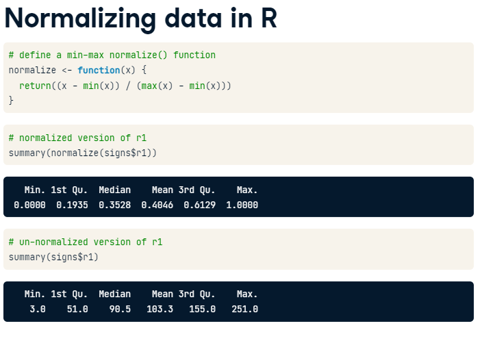

k-Nearest Neighbors (kNN)
================
Mohamad Osman
2022-07-25

# Section 01: k-Nearest Neighbors (kNN)

### **`01-Recognizing a road sign with kNN`**

After several trips with a human behind the wheel, it is time for the
self-driving car to attempt the test course alone.

As it begins to drive away, its camera captures the following image:

<figure>

<figcaption>Stop Sign</figcaption>
</figure>

Can you apply a kNN classifier to help the car recognize this sign?

The dataset `signs` is loaded in your workspace along with the data
frame `next_sign`, which holds the observation you want to classify.

``` r
library(dplyr)
```

    ## 
    ## Attaching package: 'dplyr'

    ## The following objects are masked from 'package:stats':
    ## 
    ##     filter, lag

    ## The following objects are masked from 'package:base':
    ## 
    ##     intersect, setdiff, setequal, union

``` r
library(readr)
library(ggplot2)

URL <- "https://assets.datacamp.com/production/repositories/718/datasets/c274ea22cc3d7e12d7bb9fdc9c2bdabe9ab025f4/knn_traffic_signs.csv"

signs <- read_csv(URL)
```

    ## Rows: 206 Columns: 51

    ## ── Column specification ────────────────────────────────────────────────────────
    ## Delimiter: ","
    ## chr  (2): sample, sign_type
    ## dbl (49): id, r1, g1, b1, r2, g2, b2, r3, g3, b3, r4, g4, b4, r5, g5, b5, r6...
    ## 
    ## ℹ Use `spec()` to retrieve the full column specification for this data.
    ## ℹ Specify the column types or set `show_col_types = FALSE` to quiet this message.

``` r
test_signs <- signs %>%
         filter(sample == "test")
drops <- c("id", "sample")
test_signs <- test_signs[ ,!(names(test_signs) %in% drops)]
test_signs
```

    ## # A tibble: 59 × 49
    ##    sign_type     r1    g1    b1    r2    g2    b2    r3    g3    b3    r4    g4
    ##    <chr>      <dbl> <dbl> <dbl> <dbl> <dbl> <dbl> <dbl> <dbl> <dbl> <dbl> <dbl>
    ##  1 pedestrian   118   105    69   244   245    67   132   123    12   138   123
    ##  2 pedestrian   221   244   237    52    45    26   205   233   229   203   230
    ##  3 pedestrian    44    50    43    98    69    25   170   182   172   170   182
    ##  4 pedestrian    78   106   102    98   125    82    65    91    75   100   122
    ##  5 pedestrian   163   181   172    53    51    36   170   181   171    44    51
    ##  6 pedestrian   117   137   132   116   105    67    58    53    27    37    49
    ##  7 pedestrian   204   227   224    27    44    11   140   163   140    69    83
    ##  8 pedestrian    69    74    60    35    52     4    62    68    58   148   156
    ##  9 pedestrian   186   213   210    30    51    18   181   212   187   146   170
    ## 10 pedestrian    77    94    89   147   180   100   125   156    84    51    59
    ## # … with 49 more rows, and 37 more variables: b4 <dbl>, r5 <dbl>, g5 <dbl>,
    ## #   b5 <dbl>, r6 <dbl>, g6 <dbl>, b6 <dbl>, r7 <dbl>, g7 <dbl>, b7 <dbl>,
    ## #   r8 <dbl>, g8 <dbl>, b8 <dbl>, r9 <dbl>, g9 <dbl>, b9 <dbl>, r10 <dbl>,
    ## #   g10 <dbl>, b10 <dbl>, r11 <dbl>, g11 <dbl>, b11 <dbl>, r12 <dbl>,
    ## #   g12 <dbl>, b12 <dbl>, r13 <dbl>, g13 <dbl>, b13 <dbl>, r14 <dbl>,
    ## #   g14 <dbl>, b14 <dbl>, r15 <dbl>, g15 <dbl>, b15 <dbl>, r16 <dbl>,
    ## #   g16 <dbl>, b16 <dbl>

``` r
signs <- signs %>%
         filter(sample == "train")
drops <- c("id", "sample")
signs <- signs[ ,!(names(signs) %in% drops)]
signs
```

    ## # A tibble: 146 × 49
    ##    sign_type     r1    g1    b1    r2    g2    b2    r3    g3    b3    r4    g4
    ##    <chr>      <dbl> <dbl> <dbl> <dbl> <dbl> <dbl> <dbl> <dbl> <dbl> <dbl> <dbl>
    ##  1 pedestrian   155   228   251   135   188   101   156   227   245   145   211
    ##  2 pedestrian   142   217   242   166   204    44   142   217   242   147   219
    ##  3 pedestrian    57    54    50   187   201    68    51    51    45    59    62
    ##  4 pedestrian    22    35    41   171   178    26    19    27    29    19    27
    ##  5 pedestrian   169   179   170   231   254    27    97   107    99   123   147
    ##  6 pedestrian    75    67    60   131    89    53   214   144    75   156   169
    ##  7 pedestrian   136   149   157   200   203   107   150   167   134   171   218
    ##  8 pedestrian   149   225   241    34    45     1   155   226   238   147   222
    ##  9 pedestrian    13    34    28     5    21    11   123   154   140    21    46
    ## 10 pedestrian   123   124   107    83    61    26   116   124   115    67    67
    ## # … with 136 more rows, and 37 more variables: b4 <dbl>, r5 <dbl>, g5 <dbl>,
    ## #   b5 <dbl>, r6 <dbl>, g6 <dbl>, b6 <dbl>, r7 <dbl>, g7 <dbl>, b7 <dbl>,
    ## #   r8 <dbl>, g8 <dbl>, b8 <dbl>, r9 <dbl>, g9 <dbl>, b9 <dbl>, r10 <dbl>,
    ## #   g10 <dbl>, b10 <dbl>, r11 <dbl>, g11 <dbl>, b11 <dbl>, r12 <dbl>,
    ## #   g12 <dbl>, b12 <dbl>, r13 <dbl>, g13 <dbl>, b13 <dbl>, r14 <dbl>,
    ## #   g14 <dbl>, b14 <dbl>, r15 <dbl>, g15 <dbl>, b15 <dbl>, r16 <dbl>,
    ## #   g16 <dbl>, b16 <dbl>

``` r
values <- c(204, 227, 220, 196, 59, 51, 202, 67, 59, 204, 227, 220, 236, 250, 234, 242, 252, 235, 205, 148, 131, 190, 50, 43, 179, 70, 57, 242, 229, 212, 190, 50,  43, 193,  51,  44, 170, 197, 196, 190, 50,  43, 190,  47, 41, 165, 195, 196)

cols_names <- c("r1","g1","b1","r2","g2","b2","r3","g3","b3","r4","g4","b4","r5","g5","b5","r6","g6","b6","r7","g7","b7","r8","g8","b8","r9","g9","b9","r10","g10","b10","r11","g11","b11","r12","g12","b12","r13","g13","b13","r14","g14","b14","r15","g15","b15","r16","g16","b16")


next_sign <- data.frame(matrix(values, ncol = 48, nrow = 1))
colnames(next_sign) <- cols_names
next_sign
```

    ##    r1  g1  b1  r2 g2 b2  r3 g3 b3  r4  g4  b4  r5  g5  b5  r6  g6  b6  r7  g7
    ## 1 204 227 220 196 59 51 202 67 59 204 227 220 236 250 234 242 252 235 205 148
    ##    b7  r8 g8 b8  r9 g9 b9 r10 g10 b10 r11 g11 b11 r12 g12 b12 r13 g13 b13 r14
    ## 1 131 190 50 43 179 70 57 242 229 212 190  50  43 193  51  44 170 197 196 190
    ##   g14 b14 r15 g15 b15 r16 g16 b16
    ## 1  50  43 190  47  41 165 195 196

-   Load the `class` package.

-   Create a vector of sign labels to use with kNN by extracting the
    column `sign_type` from `signs`.

-   Identify the `next_sign` using the `knn()` function.

    -   Set the `train` argument equal to the `signs` data frame
        *without* the first column.

    -   Set the `test` argument equal to the data frame `next_sign`.

    -   Use the vector of labels you created as the `cl` argument.

``` r
# Load the 'class' package
library(class)

# Create a vector of labels
sign_types <- signs$sign_type

# Classify the next sign observed
knn(train = signs[-1], test = next_sign, cl = sign_types)
```

    ## [1] stop
    ## Levels: pedestrian speed stop

### **`02-Thinking like kNN`**

With your help, the test car successfully identified the sign and
stopped safely at the intersection.

How did the `knn()` function correctly classify the stop sign?

`Ans` : The sign was in some way similar to another stop sign

### 

**`03-Exploring the traffic sign dataset`**

To better understand how the `knn()` function was able to classify the
stop sign, it may help to examine the training dataset it used.

Each previously observed street sign was divided into a 4x4 grid, and
the red, green, and blue level for each of the 16 center pixels is
recorded as illustrated here.

<figure>

<figcaption>Stop Sign Data Encoding</figcaption>
</figure>

The result is a dataset that records the `sign_type` as well as 16 x 3 =
48 color properties of each sign.

-   Use the `str()` function to examine the `signs` dataset.

-   Use `table()` to count the number of observations of each sign type
    by passing it the column containing the labels.

-   Run the provided `aggregate()` command to see whether the average
    red level might vary by sign type.

``` r
# Examine the structure of the signs dataset
str(signs)
```

    ## tibble [146 × 49] (S3: tbl_df/tbl/data.frame)
    ##  $ sign_type: chr [1:146] "pedestrian" "pedestrian" "pedestrian" "pedestrian" ...
    ##  $ r1       : num [1:146] 155 142 57 22 169 75 136 149 13 123 ...
    ##  $ g1       : num [1:146] 228 217 54 35 179 67 149 225 34 124 ...
    ##  $ b1       : num [1:146] 251 242 50 41 170 60 157 241 28 107 ...
    ##  $ r2       : num [1:146] 135 166 187 171 231 131 200 34 5 83 ...
    ##  $ g2       : num [1:146] 188 204 201 178 254 89 203 45 21 61 ...
    ##  $ b2       : num [1:146] 101 44 68 26 27 53 107 1 11 26 ...
    ##  $ r3       : num [1:146] 156 142 51 19 97 214 150 155 123 116 ...
    ##  $ g3       : num [1:146] 227 217 51 27 107 144 167 226 154 124 ...
    ##  $ b3       : num [1:146] 245 242 45 29 99 75 134 238 140 115 ...
    ##  $ r4       : num [1:146] 145 147 59 19 123 156 171 147 21 67 ...
    ##  $ g4       : num [1:146] 211 219 62 27 147 169 218 222 46 67 ...
    ##  $ b4       : num [1:146] 228 242 65 29 152 190 252 242 41 52 ...
    ##  $ r5       : num [1:146] 166 164 156 42 221 67 171 170 36 70 ...
    ##  $ g5       : num [1:146] 233 228 171 37 236 50 158 191 60 53 ...
    ##  $ b5       : num [1:146] 245 229 50 3 117 36 108 113 26 26 ...
    ##  $ r6       : num [1:146] 212 84 254 217 205 37 157 26 75 26 ...
    ##  $ g6       : num [1:146] 254 116 255 228 225 36 186 37 108 26 ...
    ##  $ b6       : num [1:146] 52 17 36 19 80 42 11 12 44 21 ...
    ##  $ r7       : num [1:146] 212 217 211 221 235 44 26 34 13 52 ...
    ##  $ g7       : num [1:146] 254 254 226 235 254 42 35 45 27 45 ...
    ##  $ b7       : num [1:146] 11 26 70 20 60 44 10 19 25 27 ...
    ##  $ r8       : num [1:146] 188 155 78 181 90 192 180 221 133 117 ...
    ##  $ g8       : num [1:146] 229 203 73 183 110 131 211 249 163 109 ...
    ##  $ b8       : num [1:146] 117 128 64 73 9 73 236 184 126 83 ...
    ##  $ r9       : num [1:146] 170 213 220 237 216 123 129 226 83 110 ...
    ##  $ g9       : num [1:146] 216 253 234 234 236 74 109 246 125 74 ...
    ##  $ b9       : num [1:146] 120 51 59 44 66 22 73 59 19 12 ...
    ##  $ r10      : num [1:146] 211 217 254 251 229 36 161 30 13 98 ...
    ##  $ g10      : num [1:146] 254 255 255 254 255 34 190 40 27 70 ...
    ##  $ b10      : num [1:146] 3 21 51 2 12 37 10 34 25 26 ...
    ##  $ r11      : num [1:146] 212 217 253 235 235 44 161 34 9 20 ...
    ##  $ g11      : num [1:146] 254 255 255 243 254 42 190 44 23 21 ...
    ##  $ b11      : num [1:146] 19 21 44 12 60 44 6 35 18 20 ...
    ##  $ r12      : num [1:146] 172 158 66 19 163 197 187 241 85 113 ...
    ##  $ g12      : num [1:146] 235 225 68 27 168 114 215 255 128 76 ...
    ##  $ b12      : num [1:146] 244 237 68 29 152 21 236 54 21 14 ...
    ##  $ r13      : num [1:146] 172 164 69 20 124 171 141 205 83 106 ...
    ##  $ g13      : num [1:146] 235 227 65 29 117 102 142 229 125 69 ...
    ##  $ b13      : num [1:146] 244 237 59 34 91 26 140 46 19 9 ...
    ##  $ r14      : num [1:146] 172 182 76 64 188 197 189 226 85 102 ...
    ##  $ g14      : num [1:146] 228 228 84 61 205 114 171 246 128 67 ...
    ##  $ b14      : num [1:146] 235 143 22 4 78 21 140 59 21 6 ...
    ##  $ r15      : num [1:146] 177 171 82 211 125 123 214 235 85 106 ...
    ##  $ g15      : num [1:146] 235 228 93 222 147 74 221 252 128 69 ...
    ##  $ b15      : num [1:146] 244 196 17 78 20 22 201 67 21 9 ...
    ##  $ r16      : num [1:146] 22 164 58 19 160 180 188 237 83 43 ...
    ##  $ g16      : num [1:146] 52 227 60 27 183 107 211 254 125 29 ...
    ##  $ b16      : num [1:146] 53 237 60 29 187 26 227 53 19 11 ...

``` r
# Count the number of signs of each type
table(signs$sign_type)
```

    ## 
    ## pedestrian      speed       stop 
    ##         46         49         51

``` r
# Check r10's average red level by sign type
aggregate(r10 ~ sign_type, data = signs, mean)
```

    ##    sign_type       r10
    ## 1 pedestrian 113.71739
    ## 2      speed  80.63265
    ## 3       stop 132.39216

### **`04-Classifying a collection of road signs`**

Now that the autonomous vehicle has successfully stopped on its own,
your team feels confident allowing the car to continue the test course.

The test course includes 59 additional road signs divided into three
types:

  

At the conclusion of the trial, you are asked to measure the car’s
overall performance at recognizing these signs.

The `class` package and the dataset `signs` are already loaded in your
workspace. So is the data frame `test_signs`, which holds a set of
observations you’ll test your model on.

-   Classify the `test_signs` data using `knn()`.

    -   Set `train` equal to the observations in `signs` *without*
        labels.

    -   Use `test_signs` for the `test` argument, again without labels.

    -   For the `cl` argument, use the vector of labels provided for
        you.

-   Use `table()` to explore the classifier’s performance at identifying
    the three sign types (the confusion matrix).

    -   Create the vector `signs_actual` by extracting the labels from
        `test_signs`.

    -   Pass the vector of predictions and the vector of actual signs to
        `table()` to cross tabulate them.

-   Compute the overall accuracy of the kNN learner using the `mean()`
    function.

``` r
# Use kNN to identify the test road signs
sign_types <- signs$sign_type
signs_pred <- knn(train = signs[-1], test = test_signs[-1], cl = sign_types)

# Create a confusion matrix of the predicted versus actual values
signs_actual <- test_signs$sign_type
table(signs_pred, signs_actual)
```

    ##             signs_actual
    ## signs_pred   pedestrian speed stop
    ##   pedestrian         19     2    0
    ##   speed               0    17    0
    ##   stop                0     2   19

``` r
# Compute the accuracy
mean(signs_pred == signs_actual)
```

    ## [1] 0.9322034

### `05-Understanding the impact of 'k'`

There is a complex relationship between k and classification accuracy.
Bigger is not always better.

Which of these is a valid reason for keeping k as small as possible (but
no smaller)?

`Answer:` A smaller k may utilize more subtle patterns

### 

`06-Testing other 'k' values`

By default, the `knn()` function in the `class` package uses only the
single nearest neighbor.

Setting a `k` parameter allows the algorithm to consider additional
nearby neighbors. This enlarges the collection of neighbors which will
vote on the predicted class.

Compare `k` values of 1, 7, and 15 to examine the impact on traffic sign
classification accuracy.

The `class` package is already loaded in your workspace along with the
datasets `signs`, `signs_test`, and `sign_types`. The object
`signs_actual` holds the true values of the signs.

-   Compute the accuracy of the default `k = 1` model using the given
    code, then find the accuracy of the model using `mean()` to compare
    `signs_actual` and the model’s predictions.

-   Modify the `knn()` function call by setting `k = 7` and again find
    accuracy value.

-   Revise the code once more by setting `k = 15`, plus find the
    accuracy value one more time.

``` r
signs_test <- test_signs

# Compute the accuracy of the baseline model (default k = 1)
k_1 <- knn(train = signs[-1], test = signs_test[-1], cl = sign_types)
mean(k_1 == signs_actual)
```

    ## [1] 0.9322034

``` r
# Modify the above to set k = 7
k_7 <- knn(train = signs[-1], test = signs_test[-1], cl = sign_types, k = 7)
mean(k_7 == signs_actual)
```

    ## [1] 0.9491525

``` r
# Set k = 15 and compare to the above
k_15 <- knn(train = signs[-1], test = signs_test[-1], cl = sign_types, k = 15)
mean(k_15 == signs_actual)
```

    ## [1] 0.8813559

### **`07-Seeing how the neighbors voted`**

When multiple nearest neighbors hold a vote, it can sometimes be useful
to examine whether the voters were unanimous or widely separated.

For example, knowing more about the voters’ confidence in the
classification could allow an autonomous vehicle to use caution in the
case there is *any chance at all* that a stop sign is ahead.

In this exercise, you will learn how to obtain the voting results from
the `knn()` function.

The `class` package has already been loaded in your workspace along with
the datasets `signs`, `sign_types`, and `signs_test`.

-   Build a kNN model with the `prob = TRUE` parameter to compute the
    vote proportions. Set `k = 7`.

-   Use the `attr()` function to obtain the vote proportions for the
    predicted class. These are stored in the attribute `"prob"`.

-   Examine the first several vote outcomes and percentages using the
    `head()` function to see how the confidence varies from sign to
    sign.

``` r
# Use the prob parameter to get the proportion of votes for the winning class
sign_pred <-  knn(train = signs[-1], test = signs_test[-1], cl = sign_types, k = 7, prob = TRUE)

# Get the "prob" attribute from the predicted classes
sign_prob <- attr(sign_pred, "prob")

# Examine the first several predictions
print("------------------------")
```

    ## [1] "------------------------"

``` r
head(sign_pred)
```

    ## [1] pedestrian pedestrian pedestrian stop       pedestrian pedestrian
    ## Levels: pedestrian speed stop

``` r
# Examine the proportion of votes for the winning class
print("------------------------")
```

    ## [1] "------------------------"

``` r
head(sign_prob)
```

    ## [1] 0.5714286 0.5714286 0.8571429 0.5714286 0.8571429 0.5714286

### **`08-Why normalize data?`**



Before applying kNN to a classification task, it is common practice to
rescale the data using a technique like **min-max normalization**. What
is the purpose of this step?

`Answer:` To ensure all data elements may contribute equal shares to
distance.

Yes! Rescaling reduces the influence of extreme values on kNN’s distance
function.

### **`The End`**
