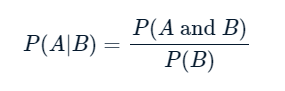

# Section 02: **Naive Bayes**

### **`01-Computing probabilities`**

The `where9am` data frame contains 91 days (thirteen weeks) worth of data in which Brett recorded his `location` at 9am each day as well as whether the `daytype` was a weekend or weekday.

Using the conditional probability formula below, you can compute the probability that Brett is working in the office, given that it is a weekday.

P(A\|B)=P(A and B)P(B)

{width="238"}

Calculations like these are the basis of the Naive Bayes destination prediction model you'll develop in later exercises.

```{r}
library(dplyr)
library(readr)
```

```{r}
file_path <- file.path("..", "00_Datasets", "where9am.txt")
where9am <- read.delim(file_path)

locations_data_URL <- "https://assets.datacamp.com/production/repositories/718/datasets/571628c39048df59c40c9dcfba146a2cf7a4a0e3/locations.csv"
locations <- read_csv(locations_data_URL)


head(where9am)
head(locations)
```

-   Find P(office) using `nrow()` and `subset()` to count rows in the dataset and save the result as `p_A`.

-   Find P(weekday), using `nrow()` and `subset()` again, and save the result as `p_B`.

-   Use `nrow()` and `subset()` a final time to find P(office and weekday). Save the result as `p_AB`.

-   Compute P(office \| weekday) and save the result as `p_A_given_B`.

-   Print the value of `p_A_given_B`.

```{r}

```

\
