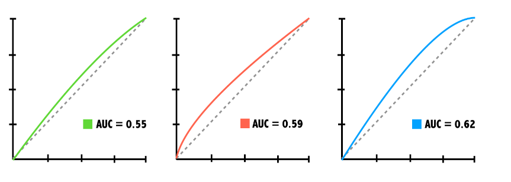

# Section 03: Logistic Regression

### **`01-Building simple logistic regression models`**

```{r}
library(dplyr)
library(readr)
```

The `donors` dataset contains 93,462 examples of people mailed in a fundraising solicitation for paralyzed military veterans. The `donated` column is `1` if the person made a donation in response to the mailing and `0` otherwise. This binary outcome will be the *dependent* variable for the logistic regression model.

The remaining columns are features of the prospective donors that may influence their donation behavior. These are the model's *independent variables*.

When building a regression model, it is often helpful to form a hypothesis about which independent variables will be predictive of the dependent variable. The `bad_address` column, which is set to `1` for an invalid mailing address and `0` otherwise, seems like it might reduce the chances of a donation. Similarly, one might suspect that religious interest (`interest_religion`) and interest in veterans affairs (`interest_veterans`) would be associated with greater charitable giving.

In this exercise, you will use these three factors to create a simple model of donation behavior. The dataset `donors` is available for you to use.

```{r}
donors_URL <- "https://assets.datacamp.com/production/repositories/718/datasets/9055dac929e4515286728a2a5dae9f25f0e4eff6/donors.csv"

donors <- read_csv(donors_URL)
head(donors)
```

-   Examine `donors` using the `str()` function.

-   Count the number of occurrences of each level of the `donated` variable using the `table()` function.

-   Fit a logistic regression model using the formula interface and the three independent variables described above.

    -   Call `glm()` with the formula as its first argument and the data frame as the `data` argument.

    -   Save the result as `donation_model`.

-   Summarize the model object with `summary()`.

```{r}
# Examine the dataset to identify potential independent variables
str(donors)

# Explore the dependent variable
table(donors$donated)

# Build the donation model
donation_model <- glm(donated ~ bad_address + interest_religion + interest_veterans, 
                      data = donors, family = "binomial")

# Summarize the model results
summary(donation_model)
```

### **`02-Making a binary prediction`**

In the previous exercise, you used the `glm()` function to build a logistic regression model of donor behavior. As with many of R's machine learning methods, you can apply the `predict()` function to the model object to forecast future behavior. By default, `predict()` outputs predictions in terms of *log odds* unless `type = "response"` is specified. This converts the log odds to *probabilities*.

Because a logistic regression model estimates the *probability* of the outcome, it is up to you to determine the threshold at which the probability implies action. One must balance the extremes of being too cautious versus being too aggressive. For example, if you were to solicit only the people with a 99% or greater donation probability, you may miss out on many people with lower estimated probabilities that still choose to donate. This balance is particularly important to consider for severely imbalanced outcomes, such as in this dataset where donations are relatively rare.

The dataset `donors` and the model `donation_model` are available for you to use.

-   Use the `predict()` function to estimate each person's donation probability. Use the `type` argument to get probabilities. Assign the predictions to a new column called `donation_prob`.

-   Find the actual probability that an average person would donate by passing the `mean()` function the appropriate column of the `donors` data frame.

-   Use `ifelse()` to predict a donation if their predicted donation probability is greater than average. Assign the predictions to a new column called `donation_pred`.

-   Use the `mean()` function to calculate the model's accuracy.

```{r}
# Estimate the donation probability
donors$donation_prob <- predict(donation_model, donors, type = "response")

# Find the donation probability of the average prospect
mean(donors$donated)

# Predict a donation if probability of donation is greater than average (0.0504)
donors$donation_pred <- ifelse(donors$donation_prob  > 0.0504, 1, 0)

# Calculate the model's accuracy
mean(donors$donated == donors$donation_pred)
```

Nice work! With an accuracy of nearly `80%`, the model seems to be doing its job. But is it too good to be true?

### **`03-The limitations of accuracy`**

In the previous exercise, you found that the logistic regression model made a correct prediction nearly 80% of the time. Despite this relatively high accuracy, the result is misleading due to the rarity of outcome being predicted.

The `donors` dataset is available to use. What would the accuracy have been if a model had simply predicted "no donation" for each person?

-   80%

-   85%

-   90%

-   95% [✅](https://emojipedia.org/check-mark-button/)

    Correct! With an accuracy of only 80%, the model is actually performing WORSE than if it were to predict non-donor for every record.

### **`04-Calculating ROC Curves and AUC`**

The previous exercises have demonstrated that accuracy is a very misleading measure of model performance on imbalanced datasets. Graphing the model's performance better illustrates the tradeoff between a model that is overly aggressive and one that is overly passive.

In this exercise you will create a ROC curve and compute the area under the curve (AUC) to evaluate the logistic regression model of donations you built earlier.

The dataset `donors` with the column of predicted probabilities, `donation_prob`, has been loaded for you.

-   Load the `pROC` package.

-   Create a ROC curve with `roc()` and the columns of actual and predicted donations. Store the result as `ROC`.

-   Use `plot()` to draw the `ROC` object. Specify `col = "blue"` to color the curve blue.

-   Compute the area under the curve with `auc()`.

```{r}
# Load the pROC package
library(pROC)

# Create a ROC curve
ROC <- roc(donors$donated, donors$donation_prob)

# Plot the ROC curve
plot(ROC, col =  "blue")

# Calculate the area under the curve (AUC)
auc(ROC)
```

### **`05-Comparing ROC curves`**

Which of the following ROC curves illustrates the best model?

{width="442"}

-   AUC 0.55

-   AUC 0.59

-   AUC 0.62

-   I need more information! [✅](https://emojipedia.org/check-mark-button/)

### **`06-Coding categorical features`**

Sometimes a dataset contains numeric values that represent a categorical feature.

In the `donors` dataset, `wealth_rating` uses numbers to indicate the donor's wealth level:

-   **0** = Unknown

-   **1** = Low

-   **2** = Medium

-   **3** = High

This exercise illustrates how to prepare this type of categorical feature and examines its impact on a logistic regression model. The `donors` data frame is available for you to use.

-   Create a factor `wealth_levels` from the numeric `wealth_rating` with labels as shown above by passing the `factor()` function the column you want to convert, the individual levels, and the labels.

-   Use `relevel()` to change the reference category to `Medium`. The first argument should be your new `factor` column.

-   Build a logistic regression model using the column `wealth_levels` to predict `donated` and display the result with `summary()`.

```{r}
# Convert the wealth rating to a factor
donors$wealth_levels <- factor(donors$wealth_rating, levels = c(0,1,2,3),labels = c("Unknown", "Low", "Medium", "High"))

# Use relevel() to change reference category
donors$wealth_levels <- relevel(donors$wealth_levels, ref = "Medium")

# See how our factor coding impacts the model
summary(glm(donated ~ wealth_levels, data = donors, family = "binomial"))
```

### `07-Handling missing data`

Some of the prospective donors have missing `age` data. Unfortunately, R will exclude any cases with `NA` values when building a regression model.

One workaround is to replace, or **impute**, the missing values with an estimated value. After doing so, you may also create a missing data indicator to model the possibility that cases with missing data are different in some way from those without.

The data frame `donors` is loaded in your workspace.

-   Use `summary()` on `donors$age` to find the average age of prospects with non-missing data.

-   Use `ifelse()` and the test `is.na(donors$age)` to impute the average (rounded to 2 decimal places) for cases with missing `age`. Be sure to also ignore `NA`s.

-   Create a binary dummy variable named `missing_age` indicating the presence of missing data using another `ifelse()` call and the same test.

```{r}
# Find the average age among non-missing values
summary(donors$age)

# Impute missing age values with the mean age
donors$imputed_age <- ifelse(is.na(donors$age) == TRUE,
round(mean(donors$age, na.rm = TRUE),2), donors$age)
head(donors$imputed_age)

# Create missing value indicator for age
donors$missing_age <- ifelse(is.na(donors$age) == TRUE, 1, 0)
head(donors$missing_age)

```

### `08-Understanding missing value indicators`

A missing value indicator provides a reminder that, before imputation, there was a missing value present on the record.

Why is it often useful to include this indicator as a predictor in the model?

-   A missing value may represent a unique category by itself

-   There may be an important difference between records with and without missing data

-   Whatever caused the missing value may also be related to the outcome

-   All of the above [✅](https://emojipedia.org/check-mark-button/)

Yes! Sometimes a missing value says a great deal about the record it appeared on!

### **`09-Building a more sophisticated model`**

One of the best predictors of future giving is a history of recent, frequent, and large gifts. In marketing terms, this is known as R/F/M:

-   Recency

-   Frequency

-   Money

Donors that haven't given both recently and frequently may be especially likely to give again; in other words, the *combined* impact of recency and frequency may be greater than the sum of the separate effects.

Because these predictors together have a greater impact on the dependent variable, their joint effect must be modeled as an interaction. The `donors` dataset has been loaded for you.

-   Create a logistic regression model of `donated` as a function of `money` plus the interaction of `recency` and `frequency`. Use `*` to add the interaction term.

-   Examine the model's `summary()` to confirm the interaction effect was added.

-   Save the model's predicted probabilities as `rfm_prob`. Use the `predict()` function, and remember to set the `type` argument.

-   Plot a ROC curve by using the function `roc()`. Remember, this function takes the column of outcomes and the vector of predictions.

-   Compute the AUC for the new model with the function `auc()` and compare performance to the simpler model.

```{r}
# Build a recency, frequency, and money (RFM) model
rfm_model <- glm(donated ~ money + recency * frequency, data = donors, family = "binomial")

# Summarize the RFM model to see how the parameters were coded
summary(rfm_model)

# Compute predicted probabilities for the RFM model
rfm_prob <- predict(rfm_model, donors, type = "response")

# Plot the ROC curve and find AUC for the new model
library(pROC)
ROC <- roc(donors$donated, rfm_prob)
plot(ROC, col = "red")
auc(ROC)
```

Great work! Based on the ROC curve, you've confirmed that past giving patterns are certainly predictive of future giving.

### **`10-The dangers of stepwise regression`**

In spite of its utility for feature selection, stepwise regression is not frequently used in disciplines outside of machine learning due to some important caveats. Which of these is NOT one of these concerns?

-   It is not guaranteed to find the best possible model

```{=html}
<!-- -->
```
-   A stepwise model's predictions can not be trusted [✅](https://emojipedia.org/check-mark-button/)

-   The stepwise regression procedure violates some statistical assumptions

-   It can result in a model that makes little sense in the real world

Correct! Though stepwise regression is frowned upon, it may still be useful for building predictive models in the absence of another starting place.

### **`11-Building a stepwise regression model`**

In the absence of subject-matter expertise, **stepwise regression** can assist with the search for the most important predictors of the outcome of interest.

In this exercise, you will use a forward stepwise approach to add predictors to the model one-by-one until no additional benefit is seen. The `donors` dataset has been loaded for you.

-   Use the R formula interface with `glm()` to specify the base model with no predictors. Set the explanatory variable equal to `1`.

-   Use the R formula interface again with `glm()` to specify the model with all predictors.

-   Apply `step()` to these models to perform forward stepwise regression. Set the first argument to `null_model` and set `direction = "forward"`. This might take a while (up to 10 or 15 seconds) as your computer has to fit quite a few different models to perform stepwise selection.

-   Create a vector of predicted probabilities using the `predict()` function.

-   Plot the ROC curve with `roc()` and `plot()` and compute the AUC of the stepwise model with `auc()`.

```{r}
# Specify a null model with no predictors
null_model <- glm(donated ~ 1, data = donors, family = "binomial")

# Specify the full model using all of the potential predictors
full_model <- glm(donated ~ ., data = donors, family = "binomial")

# Use a forward stepwise algorithm to build a parsimonious model
step_model <- step(null_model, scope = list(lower = null_model, upper = full_model), direction = "forward")

# Estimate the stepwise donation probability
step_prob <- predict(step_model, donors, type = "response")

# Plot the ROC of the stepwise model
library(pROC)
ROC <- roc(donors$donated, step_prob)
plot(ROC, col = "red")
auc(ROC)
```

Fantastic work! Despite the caveats of stepwise regression, it seems to have resulted in a relatively strong model!

### **`The End`**
