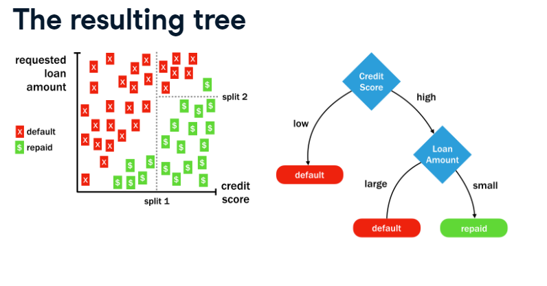

# Section 04: Classification Trees

### **`01-Building a simple decision tree`**

{width="437"}

The `loans` dataset contains 11,312 randomly-selected people who applied for and later received loans from Lending Club, a US-based peer-to-peer lending company.

You will use a decision tree to try to learn patterns in the outcome of these loans (either repaid or default) based on the requested loan amount and credit score at the time of application.

Then, see how the tree's predictions differ for an applicant with good credit versus one with bad credit.

The dataset `loans` has been loaded for you.

-   Load the `rpart` package.

\

```{r}
library(dplyr)
library(rpart)
library(readr)
library(tidyverse)

loan_URL <- "https://assets.datacamp.com/production/repositories/718/datasets/7805fceacfb205470c0e8800d4ffc37c6944b30c/loans.csv"


#data import & transformation

loans <- read_csv(loan_URL) %>%  
  mutate_if(is_character, as.factor) %>% 
  mutate(outcome = as.factor(default), 
         outcome = factor(outcome, 
                          levels = c(0,1),
                          labels = c("repaid", "default"))) %>% 
  select(-default, -keep, -rand)
```

-   Fit a decision tree model with the function `rpart()` "recursive partitioning".

    -   Supply the R formula that specifies `outcome` as a function of `loan_amount` and `credit_score` as the first argument.

    -   Leave the `control` argument alone for now. (You'll learn more about that later!)

-   Use `predict()` with the resulting loan model to predict the outcome for the `good_credit` applicant. Use the `type` argument to predict the `"class"` of the outcome.

-   Do the same for the `bad_credit` applicant.

```{r}
good_credit <- loans[1,]
good_credit
```

\
