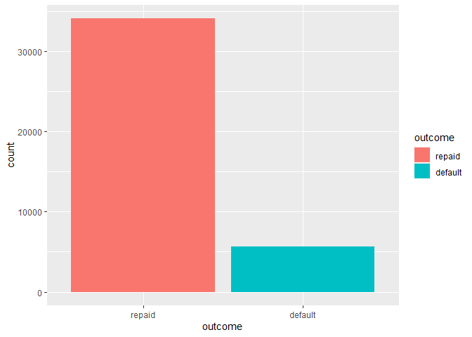
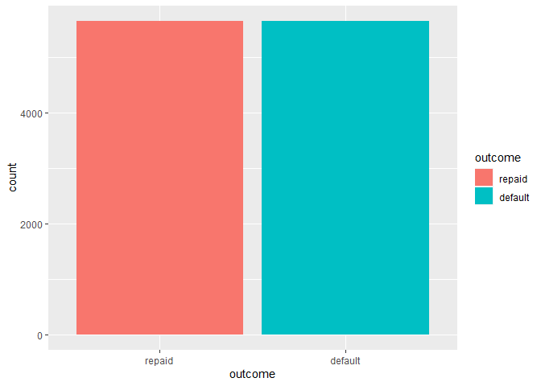
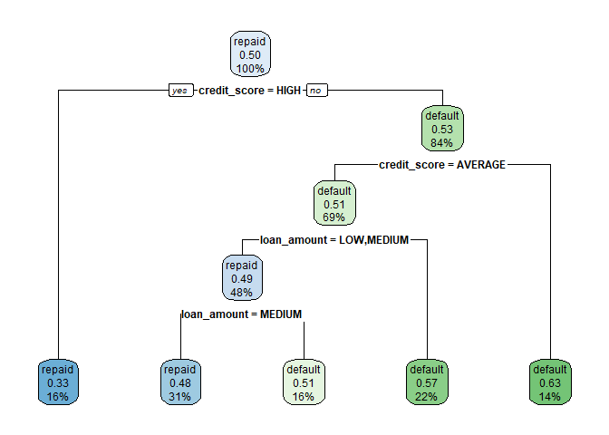
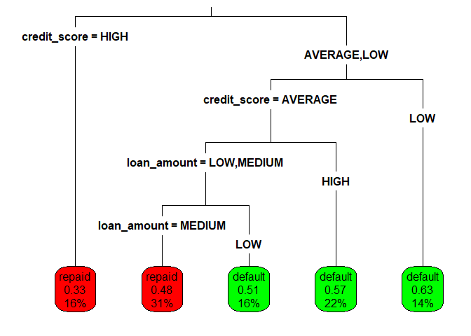
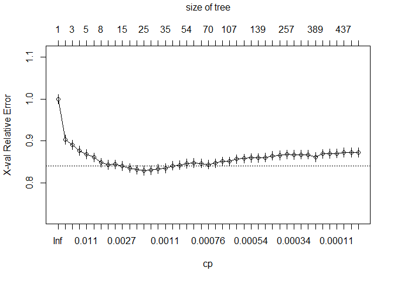

Classification Trees
================
Mohamad Osman
2022-07-27

# Section 04: Classification Trees

### **`01-Building a simple decision tree`**


The `loans` dataset contains 11,312 randomly-selected people who applied
for and later received loans from Lending Club, a US-based peer-to-peer
lending company.

You will use a decision tree to try to learn patterns in the outcome of
these loans (either repaid or default) based on the requested loan
amount and credit score at the time of application.

Then, see how the tree’s predictions differ for an applicant with good
credit versus one with bad credit.

The dataset `loans` has been loaded for you.

-   Load the `rpart` package.
-   

``` r
library(dplyr)
```

    ## 
    ## Attaching package: 'dplyr'

    ## The following objects are masked from 'package:stats':
    ## 
    ##     filter, lag

    ## The following objects are masked from 'package:base':
    ## 
    ##     intersect, setdiff, setequal, union

``` r
library(rpart)
library(readr)
library(tidyverse)
```

    ## ── Attaching packages ─────────────────────────────────────── tidyverse 1.3.1 ──

    ## ✔ ggplot2 3.3.6     ✔ purrr   0.3.4
    ## ✔ tibble  3.1.7     ✔ stringr 1.4.0
    ## ✔ tidyr   1.2.0     ✔ forcats 0.5.1

    ## Warning: package 'tidyr' was built under R version 4.2.1

    ## ── Conflicts ────────────────────────────────────────── tidyverse_conflicts() ──
    ## ✖ dplyr::filter() masks stats::filter()
    ## ✖ dplyr::lag()    masks stats::lag()

``` r
library(caret)
```

    ## Warning: package 'caret' was built under R version 4.2.1

    ## Loading required package: lattice

    ## 
    ## Attaching package: 'caret'

    ## The following object is masked from 'package:purrr':
    ## 
    ##     lift

``` r
library(rlang)
```

    ## Warning: package 'rlang' was built under R version 4.2.1

    ## 
    ## Attaching package: 'rlang'

    ## The following objects are masked from 'package:purrr':
    ## 
    ##     %@%, as_function, flatten, flatten_chr, flatten_dbl, flatten_int,
    ##     flatten_lgl, flatten_raw, invoke, splice

``` r
loan_URL <- "https://assets.datacamp.com/production/repositories/718/datasets/7805fceacfb205470c0e8800d4ffc37c6944b30c/loans.csv"


#data import & transformation
loans <- read_csv(loan_URL) %>%
  mutate(outcome = as.factor(default), 
         outcome =  factor(outcome, 
                          levels = c(0,1),
                          labels = c("repaid", "default"))) %>% 
  select(-default, -keep, -rand)
```

    ## Rows: 39732 Columns: 16

    ## ── Column specification ────────────────────────────────────────────────────────
    ## Delimiter: ","
    ## chr (13): loan_amount, emp_length, home_ownership, income, loan_purpose, deb...
    ## dbl  (3): keep, rand, default
    ## 
    ## ℹ Use `spec()` to retrieve the full column specification for this data.
    ## ℹ Specify the column types or set `show_col_types = FALSE` to quiet this message.

``` r
# unbalanced dataset
ggplot(loans, aes(x = outcome)) +   geom_bar(aes(fill = outcome))
```

<!-- -->

``` r
# downsampling the dataset 
loans <- downSample(x = loans %>% 
                      dplyr::select(-outcome),
                    y = loans$outcome, 
                    yname = "outcome")


ggplot(loans, aes(x = outcome)) +   geom_bar(aes(fill = outcome))
```

<!-- -->

``` r
good_credit <- head(loans %>%
  filter(home_ownership == "MORTGAGE"), 1) 

bad_credit <- head(loans %>%
  filter(home_ownership == "RENT", debt_to_income == "LOW", emp_length == "6 - 9 years"), 1)
```

-   Fit a decision tree model with the function `rpart()` “recursive
    partitioning”.

    -   Supply the R formula that specifies `outcome` as a function of
        `loan_amount` and `credit_score` as the first argument.

    -   Leave the `control` argument alone for now. (You’ll learn more
        about that later!)

-   Use `predict()` with the resulting loan model to predict the outcome
    for the `good_credit` applicant. Use the `type` argument to predict
    the `"class"` of the outcome.

-   Do the same for the `bad_credit` applicant.

``` r
# Load the rpart package
library(rpart)

# Build a lending model predicting loan outcome versus loan amount and credit score
loan_model <- rpart(outcome ~ loan_amount + credit_score, data = loans, method = "class", control = rpart.control(cp = 0))

# Make a prediction for someone with good credit
predict(loan_model, good_credit, type = "class")
```

    ##      1 
    ## repaid 
    ## Levels: repaid default

``` r
# Make a prediction for someone with bad credit
predict(loan_model, bad_credit, type = "class")
```

    ##       1 
    ## default 
    ## Levels: repaid default

### **`02-Visualizing classification trees`**

Due to government rules to prevent illegal discrimination, lenders are
required to explain why a loan application was rejected.

The structure of classification trees can be depicted visually, which
helps to understand how the tree makes its decisions. The model
`loan_model` that you fit in the last exercise is available to use.

-   Type `loan_model` to see a text representation of the classification
    tree.

-   Load the `rpart.plot` package.

-   Apply the `rpart.plot()` function to the loan model to visualize the
    tree.

-   See how changing other plotting parameters impacts the visualization
    by running the supplied command.

``` r
# Examine the loan_model object
loan_model
```

    ## n= 11308 
    ## 
    ## node), split, n, loss, yval, (yprob)
    ##       * denotes terminal node
    ## 
    ##  1) root 11308 5654 repaid (0.5000000 0.5000000)  
    ##    2) credit_score=HIGH 1845  601 repaid (0.6742547 0.3257453) *
    ##    3) credit_score=AVERAGE,LOW 9463 4410 default (0.4660256 0.5339744)  
    ##      6) credit_score=AVERAGE 7828 3811 default (0.4868421 0.5131579)  
    ##       12) loan_amount=LOW,MEDIUM 5391 2624 repaid (0.5132628 0.4867372)  
    ##         24) loan_amount=MEDIUM 3547 1688 repaid (0.5241049 0.4758951) *
    ##         25) loan_amount=LOW 1844  908 default (0.4924078 0.5075922) *
    ##       13) loan_amount=HIGH 2437 1044 default (0.4283956 0.5716044) *
    ##      7) credit_score=LOW 1635  599 default (0.3663609 0.6336391) *

``` r
# Load the rpart.plot package
library(rpart.plot)
```

    ## Warning: package 'rpart.plot' was built under R version 4.2.1

``` r
# Plot the loan_model with default settings
rpart.plot(loan_model)
```

<!-- -->

``` r
# Plot the loan_model with customized settings
rpart.plot(loan_model, type = 3, box.palette = c("red", "green"), fallen.leaves = TRUE)
```

<!-- -->

### **`03-Understanding the tree's decisions`**

The following image shows the structure of a classification tree
predicting loan outcome from the applicant’s credit score and requested
loan amount.

<figure>

<figcaption>Decision Tree Plot</figcaption>
</figure>

Based on this tree structure, which of the following applicants would be
predicted to repay the loan?

-   Someone with an average credit score and a low requested loan
    amount.

-   Someone with a low credit score and a medium requested loan amount.

-   Someone with a high requested loan amount and average credit.

-   Someone with a low requested loan amount and high credit. ✅

### **`04-Why do some branches split?`**

A classification tree grows using a **divide-and-conquer** process. Each
time the tree grows larger, it splits groups of data into smaller
subgroups, creating new branches in the tree.

Given a dataset to divide-and-conquer, which groups would the algorithm
prioritize to split first?

-   The group with the largest number of examples.

-   The group creating branches that improve the model’s prediction
    accuracy.

-   The group it can split to create the greatest improvement in
    subgroup homogeneity. ✅

-   The group that has not been split already.

Correct! Divide-and-conquer always looks to create the split resulting
in the greatest improvement to purity.

### **`05-Creating random test datasets`**

Before building a more sophisticated lending model, it is important to
hold out a portion of the loan data to simulate how well it will predict
the outcomes of future loan applicants.

As depicted in the following image, you can use 75% of the observations
for training and 25% for testing the model.


The `sample()` function can be used to generate a random sample of rows
to include in the training set. Simply supply it the total number of
observations and the number needed for training.

Use the resulting vector of row IDs to subset the loans into training
and testing datasets. The dataset `loans` is available for you to use.

-   Apply the `nrow()` function to determine how many observations are
    in the `loans` dataset, and the number needed for a 75% sample.

-   Use the `sample()` function to create an integer vector of row IDs
    for the 75% sample. The first argument of `sample()` should be the
    number of rows in the data set, and the second is the number of rows
    you need in your training set.

-   Subset the `loans` data using the row IDs to create the training
    dataset. Save this as `loans_train`.

-   Subset `loans` again, but this time select all the rows that are
    *not* in `sample_rows`. Save this as `loans_test`

``` r
# Determine the number of rows for training
nrow(loans)
```

    ## [1] 11308

``` r
# Create a random sample of row IDs
sample_rows <- sample(11312, 8484)

# Create the training dataset
loans_train <- loans[sample_rows,]

# Create the test dataset
loans_test <- loans[-sample_rows,]
```

### **`06-Building and evaluating a larger tree`**

Previously, you created a simple decision tree that used the applicant’s
credit score and requested loan amount to predict the loan outcome.

Lending Club has additional information about the applicants, such as
home ownership status, length of employment, loan purpose, and past
bankruptcies, that may be useful for making more accurate predictions.

Using all of the available applicant data, build a more sophisticated
lending model using the random training dataset created previously.
Then, use this model to make predictions on the testing dataset to
estimate the performance of the model on future loan applications.

The `rpart` package has been pre-loaded, and the `loans_train` and
`loans_test` datasets have been created.

-   Use `rpart()` to build a loan model using the training dataset and
    all of the available predictors. Again, leave the `control` argument
    alone.

-   Applying the `predict()` function to the testing dataset, create a
    vector of predicted outcomes. Don’t forget the `type` argument.

-   Create a `table()` to compare the predicted values to the actual
    `outcome` values.

-   Compute the accuracy of the predictions using the `mean()` function.

``` r
# Grow a tree using all of the available applicant data
loan_model <- rpart(outcome ~ ., data = loans_train, method = "class", control = rpart.control(cp = 0))

# Make predictions on the test dataset
loans_test$pred <- predict(loan_model, loans_test, type = "class")

# Examine the confusion matrix
table(loans_test$outcome, loans_test$pred)
```

    ##          
    ##           repaid default
    ##   repaid     767     614
    ##   default    612     835

``` r
# Compute the accuracy on the test dataset
mean(loans_test$outcome == loans_test$pred)
```

    ## [1] 0.5664781

### **`07-Conducting a fair performance evaluation`**

Holding out test data reduces the amount of data available for growing
the decision tree. In spite of this, it is very important to evaluate
decision trees on data it has not seen before.

Which of these is NOT true about the evaluation of decision tree
performance?

-   Decision trees sometimes overfit the training data.

-   The model’s accuracy is unaffected by the rarity of the outcome. ✅

-   Performance on the training dataset can overestimate performance on
    future data.

-   Creating a test dataset simulates the model’s performance on unseen
    data.

Right! Rare events cause problems for many machine learning approaches.

### **`08-Preventing overgrown trees`**

The tree grown on the full set of applicant data grew to be extremely
large and extremely complex, with hundreds of splits and leaf nodes
containing only a handful of applicants. This tree would be almost
impossible for a loan officer to interpret.

Using the **pre-pruning** methods for early stopping, you can prevent a
tree from growing too large and complex. See how the `rpart` control
options for maximum tree depth and minimum split count impact the
resulting tree.

`rpart` has been pre-loaded.

-   Use `rpart()` to build a loan model using the training dataset and
    all of the available predictors.

    -   Set the model `control`s using `rpart.control()` with parameters
        `cp` set to `0` and `maxdepth` set to `6`.

-   See how the test set accuracy of the simpler model compares to the
    original accuracy of 58.3%.

    -   First create a vector of predictions using the `predict()`
        function.

    -   Compare the predictions to the actual outcomes and use `mean()`
        to calculate the accuracy.

``` r
# Grow a tree with maxdepth of 6
loan_model <- rpart(outcome ~ ., data = loans_train, method = "class", control = rpart.control(cp = 0, maxdepth = 6))

# Make a class prediction on the test set
loans_test$pred <- predict(loan_model, loans_test, type = "class")

# Compute the accuracy of the simpler tree
mean(loans_test$pred == loans_test$outcome)
```

    ## [1] 0.5986563

In the model controls, remove `maxdepth` and add a minimum split
parameter, `minsplit`, set to `500`.

``` r
# Swap maxdepth for a minimum split of 500 
loan_model <- rpart(outcome ~ ., data = loans_train, method = "class", control = rpart.control(cp = 0, minsplit = 500))

# Run this. How does the accuracy change?
loans_test$pred <- predict(loan_model, loans_test, type = "class")
mean(loans_test$pred == loans_test$outcome)
```

    ## [1] 0.5997171

Nice work! It may seem surprising, but creating a simpler decision tree
may actually result in greater performance on the test dataset.

### **`09-Creating a nicely pruned tree`**

Stopping a tree from growing all the way can lead it to ignore some
aspects of the data or miss important trends it may have discovered
later.

By using **post-pruning**, you can intentionally grow a large and
complex tree then prune it to be smaller and more efficient later on.

In this exercise, you will have the opportunity to construct a
visualization of the tree’s performance versus complexity, and use this
information to prune the tree to an appropriate level.

The `rpart` package has been pre-loaded, along with `loans_test` and
`loans_train`.

-   Use all of the applicant variables and no pre-pruning to create an
    overly complex tree. Make sure to set `cp = 0` in `rpart.control()`
    to prevent pre-pruning.

-   Create a complexity plot by using `plotcp()` on the model.

-   Based on the complexity plot, prune the tree to a complexity of
    0.0014 using the `prune()` function with the tree and the complexity
    parameter.

-   Compare the accuracy of the pruned tree to the original accuracy of
    58.3%. To calculate the accuracy use the `predict()` and `mean()`
    functions.

``` r
# Grow an overly complex tree
loan_model <- rpart(outcome ~ ., data = loans_train, control = rpart.control(cp = 0), method = "class")

# Examine the complexity plot
plotcp(loan_model)
```

<!-- -->

``` r
# Prune the tree
loan_model_pruned <- prune(loan_model, cp = 0.0014)

# Compute the accuracy of the pruned tree
loans_test$pred <- predict(loan_model_pruned, loans_test, type = "class")
mean(loans_test$pred == loans_test$outcome)
```

    ## [1] 0.6053748

Great job! As with pre-pruning, creating a simpler tree actually
improved the performance of the tree on the test dataset.

### **`10-Why do trees benefit from pruning?`**

Classification trees can grow indefinitely, until they are told to stop
or run out of data to divide-and-conquer.

Just like trees in nature, classification trees that grow overly large
can require pruning to reduce the excess growth. However, this generally
results in a tree that classifies fewer training examples correctly.

Why, then, are pre-pruning and post-pruning almost always used?

  
Simpler trees are easier to interpret

Simpler trees using early stopping are faster to train

Simpler trees may perform better on the testing data

All of the above ✅

### **`11-Understanding random forests`**

Groups of classification trees can be combined into an **ensemble** that
generates a single prediction by allowing the trees to “vote” on the
outcome.

Why might someone think that this could result in more accurate
predictions than a single tree?

-   Each tree in the forest is larger and more complex than a typical
    single tree.

-   Every tree in a random forest uses the complete set of predictors.

-   The diversity among the trees may lead it to discover more subtle
    patterns. ✅

-   The random forest is not affected by noisy data.

### **`12-Building a random forest model`**

In spite of the fact that a forest can contain hundreds of trees,
growing a decision tree forest is perhaps even easier than creating a
single highly-tuned tree.

Using the `randomForest` package, build a random forest and see how it
compares to the single trees you built previously.

Keep in mind that due to the random nature of the forest, the results
may vary slightly each time you create the forest.

-   Load the `randomForest` package.

-   Build a random forest model using all of the loan application
    variables. The `randomForest` function also uses the formula
    interface.

-   Compute the accuracy of the random forest model to compare to the
    original tree’s accuracy of 57.6% using `predict()` and `mean()`.

``` r
loans_train <- subset(loans_train, !is.na(outcome))
```

``` r
# Load the randomForest package
library(randomForest)
```

    ## Warning: package 'randomForest' was built under R version 4.2.1

    ## randomForest 4.7-1.1

    ## Type rfNews() to see new features/changes/bug fixes.

    ## 
    ## Attaching package: 'randomForest'

    ## The following object is masked from 'package:ggplot2':
    ## 
    ##     margin

    ## The following object is masked from 'package:dplyr':
    ## 
    ##     combine

``` r
# Build a random forest model
loan_model <- randomForest(outcome ~ ., data = loans_train, 
                           ntree = 210)

# Compute the accuracy of the random forest
loans_test$pred <- predict(loan_model, loans_test)
mean(loans_test$pred == loans_test$outcome)
```

    ## [1] 0.5940594

### `The End`
