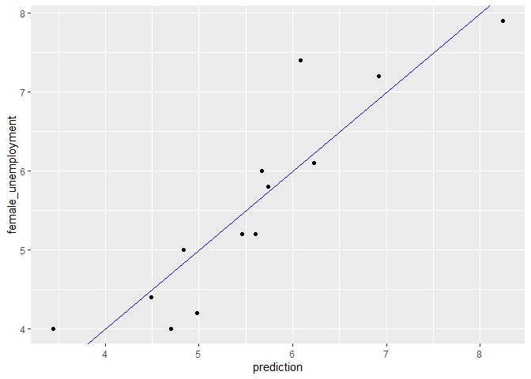
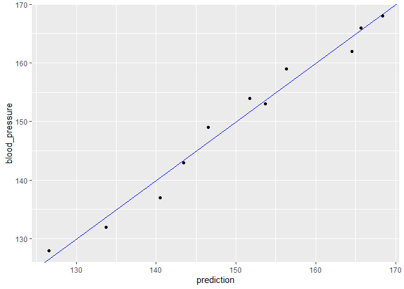

What is Regression?
================
Mohamad Osman
2022-07-28

# Section 01: What is Regression?

### **`01-Identify the regression tasks`**

From a machine learning perspective, the term *regression* generally
encompasses the prediction of continuous values. Statistically, these
predictions are the *expected value*, or the average value one would
observe for the given input values.

Which of the following tasks are regression problems?

-   Predict the student’s score (0 - 100) on the final exam, given
    scores on midterms and homework.

### **`02-Code a simple one-variable regression`**

``` r
library(dplyr)
```

    ## 
    ## Attaching package: 'dplyr'

    ## The following objects are masked from 'package:stats':
    ## 
    ##     filter, lag

    ## The following objects are masked from 'package:base':
    ## 
    ##     intersect, setdiff, setequal, union

``` r
library(readr)
library(ggplot2)

file_path <- file.path("..", "00_Datasets", "unemployment.txt")
unemployment <- read.delim(file_path)
```

For the first coding exercise, you’ll create a formula to define a
one-variable modeling task, and then fit a linear model to the data. You
are given the rates of male and female unemployment in the United States
over several years
([**Source**](https://college.cengage.com/mathematics/brase/understandable_statistics/7e/students/datasets/slr/frames/slr04.html)).

The task is to predict the rate of female unemployment from the observed
rate of male unemployment. The outcome is `female_unemployment`, and the
input is `male_unemployment`.

The sign of the variable coefficient tells you whether the outcome
increases (+) or decreases (-) as the variable increases.

Recall the calling interface for
[**`lm()`**](https://www.rdocumentation.org/packages/stats/topics/lm)
is:

`lm(formula, data = ___)`

The `unemployment` data frame has been pre-loaded.

-   Define a formula that expresses `female_unemployment` as a function
    of `male_unemployment`. Assign the formula to the variable `fmla`
    and print it.

-   Then use `lm()` and `fmla` to fit a linear model to predict female
    unemployment from male unemployment using the dataset
    `unemployment`.

-   Print the model. Is the coefficient for male unemployment consistent
    with what you would expect? Does female unemployment increase as
    male unemployment does?

``` r
# unemployment is available
summary(unemployment)
```

    ##  male_unemployment female_unemployment
    ##  Min.   :2.900     Min.   :4.000      
    ##  1st Qu.:4.900     1st Qu.:4.400      
    ##  Median :6.000     Median :5.200      
    ##  Mean   :5.954     Mean   :5.569      
    ##  3rd Qu.:6.700     3rd Qu.:6.100      
    ##  Max.   :9.800     Max.   :7.900

``` r
# Define a formula to express female_unemployment as a function of male_unemployment
fmla <- female_unemployment ~ male_unemployment

# Print it
fmla
```

    ## female_unemployment ~ male_unemployment

``` r
# Use the formula to fit a model: unemployment_model
unemployment_model <- lm(fmla, data = unemployment)

# Print it
unemployment_model
```

    ## 
    ## Call:
    ## lm(formula = fmla, data = unemployment)
    ## 
    ## Coefficients:
    ##       (Intercept)  male_unemployment  
    ##            1.4341             0.6945

### **`03-Examining a model`**

Let’s look at the model `unemployment_model` that you have just created.
There are a variety of different ways to examine a model; each way
provides different information. We will use
[**`summary()`**](https://www.rdocumentation.org/packages/base/topics/summary),
[**`broom::glance()`**](https://www.rdocumentation.org/packages/broom/topics/glance),
and
[**`sigr::wrapFTest()`**](https://www.rdocumentation.org/packages/sigr/topics/wrapFTest).

The `broom` and `sigr` packages have been pre-loaded, and
`unemployment_model` is available for you.

``` r
library(broom)
library(sigr)
```

-   Print `unemployment_model` again. What information does it report?

-   Call `summary()` on `unemployment_model`. In addition to the
    coefficient values, you get standard errors on the coefficient
    estimates, and some goodness-of-fit metrics like R-squared.

-   Call `glance()` on the model to see the performance metrics in an
    orderly data frame. Can you match the information from `summary()`
    to the columns of `glance()`?

-   Now call `wrapFTest()` on the model to see the R-squared again

``` r
# Print unemployment_model
unemployment_model
```

    ## 
    ## Call:
    ## lm(formula = fmla, data = unemployment)
    ## 
    ## Coefficients:
    ##       (Intercept)  male_unemployment  
    ##            1.4341             0.6945

``` r
print("--------------------------")
```

    ## [1] "--------------------------"

``` r
# Call summary() on unemployment_model to get more details
summary(unemployment_model)
```

    ## 
    ## Call:
    ## lm(formula = fmla, data = unemployment)
    ## 
    ## Residuals:
    ##      Min       1Q   Median       3Q      Max 
    ## -0.77621 -0.34050 -0.09004  0.27911  1.31254 
    ## 
    ## Coefficients:
    ##                   Estimate Std. Error t value Pr(>|t|)    
    ## (Intercept)        1.43411    0.60340   2.377   0.0367 *  
    ## male_unemployment  0.69453    0.09767   7.111 1.97e-05 ***
    ## ---
    ## Signif. codes:  0 '***' 0.001 '**' 0.01 '*' 0.05 '.' 0.1 ' ' 1
    ## 
    ## Residual standard error: 0.5803 on 11 degrees of freedom
    ## Multiple R-squared:  0.8213, Adjusted R-squared:  0.8051 
    ## F-statistic: 50.56 on 1 and 11 DF,  p-value: 1.966e-05

``` r
print("--------------------------")
```

    ## [1] "--------------------------"

``` r
# Call glance() on unemployment_model to see the details in a tidier form
glance(unemployment_model)
```

    ## # A tibble: 1 × 12
    ##   r.squared adj.r.squared sigma statistic   p.value    df logLik   AIC   BIC
    ##       <dbl>         <dbl> <dbl>     <dbl>     <dbl> <dbl>  <dbl> <dbl> <dbl>
    ## 1     0.821         0.805 0.580      50.6 0.0000197     1  -10.3  26.6  28.3
    ## # … with 3 more variables: deviance <dbl>, df.residual <int>, nobs <int>

``` r
# Call wrapFTest() on unemployment_model to see the most relevant details
wrapFTest(unemployment_model)
```

    ## [1] "F Test summary: (R2=0.8213, F(1,11)=50.56, p=1.966e-05)."

### **`04-Predicting from the unemployment model`**

In this exercise, you will use your unemployment model
`unemployment_model` to make predictions from the `unemployment` data,
and compare predicted female unemployment rates to the actual observed
female unemployment rates on the training data, `unemployment`. You will
also use your model to predict on the new data in `newrates`, which
consists of only one observation, where male unemployment is 5%.

The
[**`predict()`**](https://www.rdocumentation.org/packages/stats/topics/predict.lm)
interface for `lm` models takes the form

    predict(model, newdata)

You will use the `ggplot2` package to make the plots, so you will add
the prediction column to the `unemployment` data frame. You will plot
outcome versus prediction, and compare them to the line that represents
perfect predictions (that is when the outcome is equal to the predicted
value).

The `ggplot2` command to plot a scatterplot of `dframe$outcome` versus
`dframe$pred` (`pred` on the *x* axis, `outcome` on the *y* axis), along
with a blue line where *`outcome == pred`* is as follows:

    ggplot(dframe, aes(x = pred, y = outcome)) + 
           geom_point() +  
           geom_abline(color = "blue")

`unemployment`, `unemployment_model`, and `newrates` have been
pre-loaded for you.

-   Use `predict()` to predict female unemployment rates from the
    `unemployment` data. Assign it to a new column: `prediction`.

-   Use the
    [**`library()`**](https://www.rdocumentation.org/packages/base/topics/library)
    command to load the `ggplot2` package.

-   Use `ggplot()` to compare the predictions to actual unemployment
    rates. Put the predictions on the *x* axis. How close are the
    results to the line of perfect prediction?

-   Use the data frame `newrates` to predict expected female
    unemployment rate when male unemployment is 5%. Assign the answer to
    the variable `pred` and print it.

``` r
# unemployment is available
summary(unemployment)
```

    ##  male_unemployment female_unemployment
    ##  Min.   :2.900     Min.   :4.000      
    ##  1st Qu.:4.900     1st Qu.:4.400      
    ##  Median :6.000     Median :5.200      
    ##  Mean   :5.954     Mean   :5.569      
    ##  3rd Qu.:6.700     3rd Qu.:6.100      
    ##  Max.   :9.800     Max.   :7.900

``` r
# newrates is available
newrates <- data.frame(male_unemployment = 5)
newrates
```

    ##   male_unemployment
    ## 1                 5

``` r
# Predict female unemployment in the unemployment dataset
unemployment$prediction <-  predict(unemployment_model, unemployment)

# Load the ggplot2 package
library(ggplot2)

# Make a plot to compare predictions to actual (prediction on x axis). 
ggplot(unemployment, aes(x = prediction, y = female_unemployment)) + 
  geom_point() +
  geom_abline(color = "blue")
```

<!-- -->

``` r
# Predict female unemployment rate when male unemployment is 5%
pred <- predict(unemployment_model, newrates)
pred
```

    ##        1 
    ## 4.906757

### **`05-Multivariate linear regression (Part 1)`**

In this exercise, you will work with the blood pressure dataset
([**Source**](https://college.cengage.com/mathematics/brase/understandable_statistics/7e/students/datasets/mlr/frames/frame.html)),
and model `blood_pressure` as a function of `weight` and `age`.

The data frame `bloodpressure` has been pre-loaded for you.

-   Define a formula that expresses `blood_pressure` explicitly as a
    function of `age` and `weight`. Assign the formula to the variable
    `fmla` and print it.

-   Use `fmla` to fit a linear model to predict `blood_pressure` from
    `age` and `weight` in the dataset `bloodpressure`. Call the model
    `bloodpressure_model`.

-   Print the model and call `summary()` on it. Does blood pressure
    increase or decrease with age? With weight?

``` r
file_path <- file.path("..", "00_Datasets", "bloodpressure.rds")
bloodpressure <- readRDS(file_path)
```

``` r
# bloodpressure is available
summary(bloodpressure)
```

    ##  blood_pressure       age            weight   
    ##  Min.   :128.0   Min.   :46.00   Min.   :167  
    ##  1st Qu.:140.0   1st Qu.:56.50   1st Qu.:186  
    ##  Median :153.0   Median :64.00   Median :194  
    ##  Mean   :150.1   Mean   :62.45   Mean   :195  
    ##  3rd Qu.:160.5   3rd Qu.:69.50   3rd Qu.:209  
    ##  Max.   :168.0   Max.   :74.00   Max.   :220

``` r
# Create the formula and print it
fmla <- blood_pressure ~ age + weight
fmla
```

    ## blood_pressure ~ age + weight

``` r
# Fit the model: bloodpressure_model
bloodpressure_model <- lm(fmla, data = bloodpressure)

# Print bloodpressure_model and call summary() 
bloodpressure_model
```

    ## 
    ## Call:
    ## lm(formula = fmla, data = bloodpressure)
    ## 
    ## Coefficients:
    ## (Intercept)          age       weight  
    ##     30.9941       0.8614       0.3349

``` r
summary(bloodpressure_model)
```

    ## 
    ## Call:
    ## lm(formula = fmla, data = bloodpressure)
    ## 
    ## Residuals:
    ##     Min      1Q  Median      3Q     Max 
    ## -3.4640 -1.1949 -0.4078  1.8511  2.6981 
    ## 
    ## Coefficients:
    ##             Estimate Std. Error t value Pr(>|t|)   
    ## (Intercept)  30.9941    11.9438   2.595  0.03186 * 
    ## age           0.8614     0.2482   3.470  0.00844 **
    ## weight        0.3349     0.1307   2.563  0.03351 * 
    ## ---
    ## Signif. codes:  0 '***' 0.001 '**' 0.01 '*' 0.05 '.' 0.1 ' ' 1
    ## 
    ## Residual standard error: 2.318 on 8 degrees of freedom
    ## Multiple R-squared:  0.9768, Adjusted R-squared:  0.9711 
    ## F-statistic: 168.8 on 2 and 8 DF,  p-value: 2.874e-07

Good! One of the advantages of linear regression is that you can
interpret the effects of each variable on the input – to a certain
extent. In this case the coefficients for both age and weight are
positive, which indicates that bloodpressure tends to increase as both
age and weight increase.

### **`06-Multivariate linear regression (Part 2)`**

Now you will make predictions using the blood pressure model
`bloodpressure_model` that you fit in the previous exercise.

You will also compare the predictions to outcomes graphically. `ggplot2`
has already been loaded. Recall the plot command takes the form:

    ggplot(dframe, aes(x = pred, y = outcome)) + 
         geom_point() + 
         geom_abline(color = "blue")

`bloodpressure` and `bloodpressure_model` are available for you to use.

-   Use `predict()` to predict blood pressure in the `bloodpressure`
    dataset. Assign the predictions to the column `prediction`.

-   Graphically compare the predictions to actual blood pressures. Put
    predictions on the x axis. How close are the results to the line of
    perfect prediction?

``` r
# bloodpressure is available
summary(bloodpressure)
```

    ##  blood_pressure       age            weight   
    ##  Min.   :128.0   Min.   :46.00   Min.   :167  
    ##  1st Qu.:140.0   1st Qu.:56.50   1st Qu.:186  
    ##  Median :153.0   Median :64.00   Median :194  
    ##  Mean   :150.1   Mean   :62.45   Mean   :195  
    ##  3rd Qu.:160.5   3rd Qu.:69.50   3rd Qu.:209  
    ##  Max.   :168.0   Max.   :74.00   Max.   :220

``` r
# bloodpressure_model is available
bloodpressure_model
```

    ## 
    ## Call:
    ## lm(formula = fmla, data = bloodpressure)
    ## 
    ## Coefficients:
    ## (Intercept)          age       weight  
    ##     30.9941       0.8614       0.3349

``` r
# Predict blood pressure using bloodpressure_model: prediction
bloodpressure$prediction <- predict(bloodpressure_model, bloodpressure)

# Plot the results
ggplot(bloodpressure, aes(prediction, blood_pressure)) + 
    geom_point() +
    geom_abline(color = "blue")
```

<!-- -->

### `The End`
