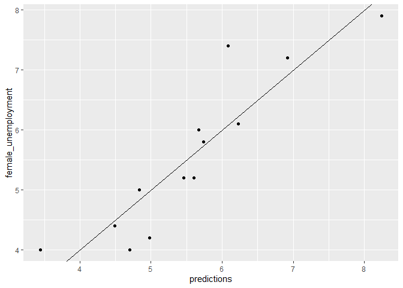
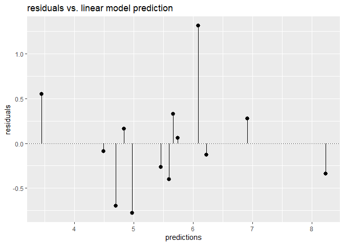
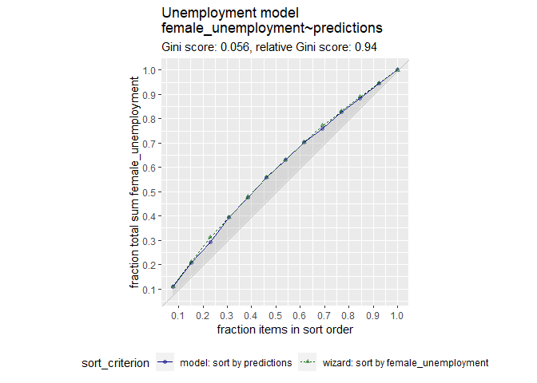
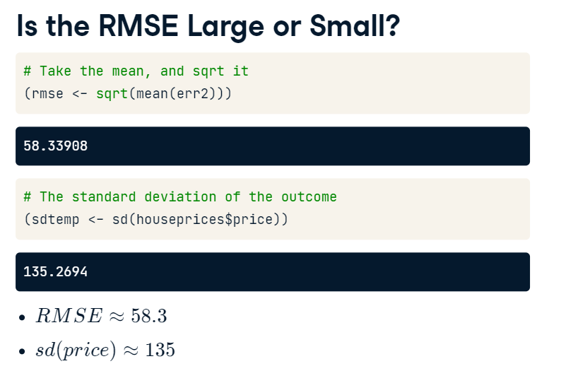
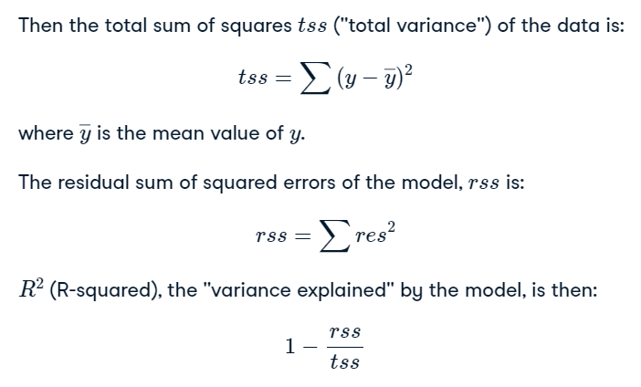
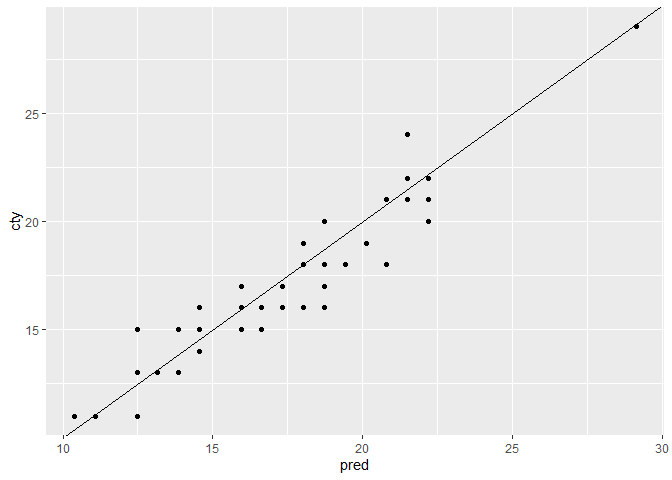

Training and Evaluating Regression Models
================
Mohamad Osman
2022-07-28

# Section 02: Training and Evaluating Regression Models

### **`01-Graphically evaluate the unemployment model`**

``` r
library(dplyr)
```

    ## 
    ## Attaching package: 'dplyr'

    ## The following objects are masked from 'package:stats':
    ## 
    ##     filter, lag

    ## The following objects are masked from 'package:base':
    ## 
    ##     intersect, setdiff, setequal, union

``` r
library(readr)
library(ggplot2)
library(broom)

file_path <- file.path("..", "00_Datasets", "unemployment.txt")
unemployment <- read.delim(file_path)


fmla <- female_unemployment ~ male_unemployment
unemployment_model <- lm(fmla, data = unemployment)
```

In this exercise, you will graphically evaluate the unemployment model,
`unemployment_model`, that you fit to the `unemployment` data in the
previous chapter. Recall that the model predicts `female_unemployment`
from `male_unemployment`.

You will plot the model’s predictions against the actual
`female_unemployment`; recall the command is of the form

    ggplot(dframe, aes(x = pred, y = outcome)) + 
           geom_point() +  
           geom_abline()

Then you will calculate the residuals:

    residuals <- actual outcome - predicted outcome

and plot predictions against residuals. The residual graph will take a
slightly different form: you compare the residuals to the horizontal
line y=0 (using `geom_hline()`) rather than to the line x=y. The command
will be provided.

The data frame `unemployment` and model `unemployment_model` have been
pre-loaded.

-   Use `predict()` to get the model predictions and add them to
    `unemployment` as the column `predictions`.

-   Plot predictions (on the x-axis) versus actual female unemployment
    rates. Are the predictions near the x=y line?

``` r
# unemployment and unemployment_model are available
summary(unemployment)
```

    ##  male_unemployment female_unemployment
    ##  Min.   :2.900     Min.   :4.000      
    ##  1st Qu.:4.900     1st Qu.:4.400      
    ##  Median :6.000     Median :5.200      
    ##  Mean   :5.954     Mean   :5.569      
    ##  3rd Qu.:6.700     3rd Qu.:6.100      
    ##  Max.   :9.800     Max.   :7.900

``` r
summary(unemployment_model)
```

    ## 
    ## Call:
    ## lm(formula = fmla, data = unemployment)
    ## 
    ## Residuals:
    ##      Min       1Q   Median       3Q      Max 
    ## -0.77621 -0.34050 -0.09004  0.27911  1.31254 
    ## 
    ## Coefficients:
    ##                   Estimate Std. Error t value Pr(>|t|)    
    ## (Intercept)        1.43411    0.60340   2.377   0.0367 *  
    ## male_unemployment  0.69453    0.09767   7.111 1.97e-05 ***
    ## ---
    ## Signif. codes:  0 '***' 0.001 '**' 0.01 '*' 0.05 '.' 0.1 ' ' 1
    ## 
    ## Residual standard error: 0.5803 on 11 degrees of freedom
    ## Multiple R-squared:  0.8213, Adjusted R-squared:  0.8051 
    ## F-statistic: 50.56 on 1 and 11 DF,  p-value: 1.966e-05

``` r
# Make predictions from the model
unemployment$predictions <- predict(unemployment_model, unemployment)

# Fill in the blanks to plot predictions (on x-axis) versus the female_unemployment rates
ggplot(unemployment, aes(x = predictions, y = female_unemployment)) + 
  geom_point() + 
  geom_abline()
```

<!-- -->

-   Calculate the residuals between the predictions and actual
    unemployment rates. Add these residuals to `unemployment` as the
    column `residuals`.

-   Fill in the blanks to plot predictions (on the x-axis) versus
    residuals (on the y-axis). *This gives you a different view of the
    model’s predictions as compared to ground truth.*

``` r
# From previous step
unemployment$predictions <- predict(unemployment_model)

# Calculate residuals
unemployment$residuals <- unemployment$female_unemployment -  unemployment$predictions

unemployment %>%
  select(female_unemployment, predictions, residuals)
```

    ##    female_unemployment predictions   residuals
    ## 1                  4.0    3.448245  0.55175458
    ## 2                  7.4    6.087456  1.31254359
    ## 3                  5.0    4.837304  0.16269616
    ## 4                  7.2    6.920891  0.27910854
    ## 5                  7.9    8.240497 -0.34049695
    ## 6                  6.1    6.226362 -0.12636225
    ## 7                  6.0    5.670739  0.32926112
    ## 8                  5.8    5.740192  0.05980820
    ## 9                  5.2    5.601286 -0.40128596
    ## 10                 4.2    4.976210 -0.77620968
    ## 11                 4.0    4.698398 -0.69839799
    ## 12                 4.4    4.490039 -0.09003923
    ## 13                 5.2    5.462380 -0.26238012

``` r
# Fill in the blanks to plot predictions (on x-axis) versus the residuals
ggplot(unemployment, aes(x = predictions, y = residuals)) + 
  geom_pointrange(aes(ymin = 0, ymax = residuals)) + 
  geom_hline(yintercept = 0, linetype = 3) + 
  ggtitle("residuals vs. linear model prediction")
```

<!-- -->

### **`02-The gain curve to evaluate the unemployment model`**

In the previous exercise you made predictions about
`female_unemployment` and visualized the predictions and the residuals.
Now, you will also plot the gain curve of the `unemployment_model`’s
predictions against actual `female_unemployment` using the
[**`WVPlots::GainCurvePlot()`**](https://www.rdocumentation.org/packages/WVPlots/topics/GainCurvePlot)
function.

For situations where order is more important than exact values, the gain
curve helps you check if the model’s predictions sort in the same order
as the true outcome.

Calls to the function `GainCurvePlot()` look like:

    GainCurvePlot(frame, xvar, truthvar, title)

where

-   `frame` is a data frame

-   `xvar` and `truthvar` are strings naming the prediction and actual
    outcome columns of `frame`

-   `title` is the title of the plot

When the predictions sort in exactly the same order, the relative Gini
coefficient is 1. When the model sorts poorly, the relative Gini
coefficient is close to zero, or even negative.

The data frame `unemployment`, which also contains the predictions, and
the model `unemployment_model` are available for you to use.

-   Load the package `WVPlots` using `library()`.

-   Plot the gain curve. Give the plot the title “Unemployment model”.
    Do the model’s predictions sort correctly?

``` r
# unemployment (with predictions) is available
summary(unemployment)
```

    ##  male_unemployment female_unemployment  predictions      residuals       
    ##  Min.   :2.900     Min.   :4.000       Min.   :3.448   Min.   :-0.77621  
    ##  1st Qu.:4.900     1st Qu.:4.400       1st Qu.:4.837   1st Qu.:-0.34050  
    ##  Median :6.000     Median :5.200       Median :5.601   Median :-0.09004  
    ##  Mean   :5.954     Mean   :5.569       Mean   :5.569   Mean   : 0.00000  
    ##  3rd Qu.:6.700     3rd Qu.:6.100       3rd Qu.:6.087   3rd Qu.: 0.27911  
    ##  Max.   :9.800     Max.   :7.900       Max.   :8.240   Max.   : 1.31254

``` r
# unemployment_model is available
summary(unemployment_model)
```

    ## 
    ## Call:
    ## lm(formula = fmla, data = unemployment)
    ## 
    ## Residuals:
    ##      Min       1Q   Median       3Q      Max 
    ## -0.77621 -0.34050 -0.09004  0.27911  1.31254 
    ## 
    ## Coefficients:
    ##                   Estimate Std. Error t value Pr(>|t|)    
    ## (Intercept)        1.43411    0.60340   2.377   0.0367 *  
    ## male_unemployment  0.69453    0.09767   7.111 1.97e-05 ***
    ## ---
    ## Signif. codes:  0 '***' 0.001 '**' 0.01 '*' 0.05 '.' 0.1 ' ' 1
    ## 
    ## Residual standard error: 0.5803 on 11 degrees of freedom
    ## Multiple R-squared:  0.8213, Adjusted R-squared:  0.8051 
    ## F-statistic: 50.56 on 1 and 11 DF,  p-value: 1.966e-05

``` r
# Load the package WVPlots
library(WVPlots)
```

    ## Loading required package: wrapr

    ## 
    ## Attaching package: 'wrapr'

    ## The following object is masked from 'package:dplyr':
    ## 
    ##     coalesce

``` r
# Plot the Gain Curve
WVPlots::GainCurvePlot(unemployment, "predictions", "female_unemployment", "Unemployment model")
```

<!-- -->

Congratulations! A relative gini coefficient close to one shows that the
model correctly sorts high unemployment situations from lower ones.

### **`03-RMSE (Root Mean Square Error)`**

  
RMSE shows the difference between actual and predicted values which is
58.3 $ here, but how to tell if this value is reasonable ?!, we cam take
the standard deviation of the price which represents the gap between the
highest price and the mean price which is 135 $

RMSE \< Standard deviation means the model can predict the price better
than taking the average !

### 

**`04-Calculate RMSE`**

In this exercise, you will calculate the RMSE of your unemployment
model. In the previous coding exercises, you added two columns to the
`unemployment` dataset:

-   the model’s predictions (`predictions` column)

-   the residuals between the predictions and the outcome (`residuals`
    column)

You can calculate the RMSE from a vector of residuals, res, as:

RMSE=mean⁡(res2)

You want RMSE to be small. How small is “small”? One heuristic is to
compare the RMSE to the standard deviation of the outcome. With a good
model, the RMSE should be smaller.

The `unemployment` data frame has been loaded for you.

-   Review the `unemployment` data from the previous exercise.

-   For convenience, assign the `residuals` column from `unemployment`
    to the variable `res`.

-   Calculate RMSE: square `res`, take its mean, and then square root
    it. Assign this to the variable `rmse` and print it.

    -   Tip: you can do this in one step by wrapping the assignment in
        parentheses: `(rmse <- ___)`

-   Calculate the standard deviation of `female_unemployment` and assign
    it to the variable `sd_unemployment`. Print it. *How does the rmse
    of the model compare to the standard deviation of the data?*

``` r
# Print a summary of unemployment
summary(unemployment)
```

    ##  male_unemployment female_unemployment  predictions      residuals       
    ##  Min.   :2.900     Min.   :4.000       Min.   :3.448   Min.   :-0.77621  
    ##  1st Qu.:4.900     1st Qu.:4.400       1st Qu.:4.837   1st Qu.:-0.34050  
    ##  Median :6.000     Median :5.200       Median :5.601   Median :-0.09004  
    ##  Mean   :5.954     Mean   :5.569       Mean   :5.569   Mean   : 0.00000  
    ##  3rd Qu.:6.700     3rd Qu.:6.100       3rd Qu.:6.087   3rd Qu.: 0.27911  
    ##  Max.   :9.800     Max.   :7.900       Max.   :8.240   Max.   : 1.31254

``` r
# For convenience put the residuals in the variable res
res <- unemployment$residuals

# Calculate RMSE, assign it to the variable rmse and print it
print(rmse <- sqrt(mean(res ^ 2)))
```

    ## [1] 0.5337612

``` r
# Calculate the standard deviation of female_unemployment and print it
print(sd_unemployment <- sd(unemployment$female_unemployment))
```

    ## [1] 1.314271

Good job! An RMSE much smaller than the outcome’s standard deviation
suggests a model that predicts well.

### **`05-Calculate R-squared`**

Now that you’ve calculated the RMSE of your model’s predictions, you
will examine how well the model fits the data: that is, how much
variance does it explain. You can do this using R2.

Suppose y is the true outcome, p is the prediction from the model, and
res=y−p are the residuals of the predictions.



After you calculate R2, you will compare what you computed with the R2
reported by
[**`glance()`**](https://www.rdocumentation.org/packages/broom/topics/glance).
`glance()` returns a one-row data frame; for a linear regression model,
one of the columns returned is the R2 of the model on the training data.

The `unemployment` data frame has been loaded for you, and contains the
columns `predictions` and `residuals` that you calculated in a previous
exercise. The `unemployment_model` is also available for you to use.

-   Calculate the mean `female_unemployment` and assign it to the
    variable `fe_mean`.

-   Calculate the total sum of squares and assign it to the variable
    `tss`.

-   Calculate the residual sum of squares and assign it to the variable
    `rss`.

-   Calculate R2. Is it a good fit (R2 near 1)?

-   Use `glance()` to get R2 from the model. *Is it the same as what you
    calculated?*

``` r
# unemployment is available
summary(unemployment)
```

    ##  male_unemployment female_unemployment  predictions      residuals       
    ##  Min.   :2.900     Min.   :4.000       Min.   :3.448   Min.   :-0.77621  
    ##  1st Qu.:4.900     1st Qu.:4.400       1st Qu.:4.837   1st Qu.:-0.34050  
    ##  Median :6.000     Median :5.200       Median :5.601   Median :-0.09004  
    ##  Mean   :5.954     Mean   :5.569       Mean   :5.569   Mean   : 0.00000  
    ##  3rd Qu.:6.700     3rd Qu.:6.100       3rd Qu.:6.087   3rd Qu.: 0.27911  
    ##  Max.   :9.800     Max.   :7.900       Max.   :8.240   Max.   : 1.31254

``` r
# unemployment_model is available
summary(unemployment_model)
```

    ## 
    ## Call:
    ## lm(formula = fmla, data = unemployment)
    ## 
    ## Residuals:
    ##      Min       1Q   Median       3Q      Max 
    ## -0.77621 -0.34050 -0.09004  0.27911  1.31254 
    ## 
    ## Coefficients:
    ##                   Estimate Std. Error t value Pr(>|t|)    
    ## (Intercept)        1.43411    0.60340   2.377   0.0367 *  
    ## male_unemployment  0.69453    0.09767   7.111 1.97e-05 ***
    ## ---
    ## Signif. codes:  0 '***' 0.001 '**' 0.01 '*' 0.05 '.' 0.1 ' ' 1
    ## 
    ## Residual standard error: 0.5803 on 11 degrees of freedom
    ## Multiple R-squared:  0.8213, Adjusted R-squared:  0.8051 
    ## F-statistic: 50.56 on 1 and 11 DF,  p-value: 1.966e-05

``` r
# Calculate and print the mean female_unemployment: fe_mean
(fe_mean <- mean(unemployment$female_unemployment))
```

    ## [1] 5.569231

``` r
# Calculate and print the total sum of squares: tss
(tss <- sum((unemployment$female_unemployment - fe_mean)^2))
```

    ## [1] 20.72769

``` r
# Calculate and print residual sum of squares: rss
(rss <- sum((unemployment$female_unemployment - unemployment$predictions)^2))
```

    ## [1] 3.703713

``` r
# Calculate and print the R-squared: rsq
(rsq <- 1 - rss/tss)
```

    ## [1] 0.8213157

``` r
# Get R-squared from glance and print it
(rsq_glance <- glance(unemployment_model)$r.squared)
```

    ## [1] 0.8213157

### **`06-Correlation and R-squared`**

The linear correlation of two variables, x and y, measures the strength
of the linear relationship between them. When x and y are respectively:

-   the outcomes of a regression model that minimizes squared-error
    (like linear regression) and

-   the true outcomes *of the training data*,

then the square of the correlation is the same as R2. You will verify
that in this exercise.

`unemployment` and `unemployment_model` are available for you to use.

-   Use
    [**`cor()`**](https://www.rdocumentation.org/packages/stats/topics/cor)
    to get the correlation between the predictions and female
    unemployment. Assign it to the variable `rho` and print it. Make
    sure you use Pearson correlation (the default).

-   Square `rho` and assign it to `rho2`. Print it.

-   Compare `rho2` to R2 from the model (using `glance()`). Is it the
    same?

``` r
# unemployment is available
summary(unemployment)
```

    ##  male_unemployment female_unemployment  predictions      residuals       
    ##  Min.   :2.900     Min.   :4.000       Min.   :3.448   Min.   :-0.77621  
    ##  1st Qu.:4.900     1st Qu.:4.400       1st Qu.:4.837   1st Qu.:-0.34050  
    ##  Median :6.000     Median :5.200       Median :5.601   Median :-0.09004  
    ##  Mean   :5.954     Mean   :5.569       Mean   :5.569   Mean   : 0.00000  
    ##  3rd Qu.:6.700     3rd Qu.:6.100       3rd Qu.:6.087   3rd Qu.: 0.27911  
    ##  Max.   :9.800     Max.   :7.900       Max.   :8.240   Max.   : 1.31254

``` r
# unemployment_model is available
summary(unemployment_model)
```

    ## 
    ## Call:
    ## lm(formula = fmla, data = unemployment)
    ## 
    ## Residuals:
    ##      Min       1Q   Median       3Q      Max 
    ## -0.77621 -0.34050 -0.09004  0.27911  1.31254 
    ## 
    ## Coefficients:
    ##                   Estimate Std. Error t value Pr(>|t|)    
    ## (Intercept)        1.43411    0.60340   2.377   0.0367 *  
    ## male_unemployment  0.69453    0.09767   7.111 1.97e-05 ***
    ## ---
    ## Signif. codes:  0 '***' 0.001 '**' 0.01 '*' 0.05 '.' 0.1 ' ' 1
    ## 
    ## Residual standard error: 0.5803 on 11 degrees of freedom
    ## Multiple R-squared:  0.8213, Adjusted R-squared:  0.8051 
    ## F-statistic: 50.56 on 1 and 11 DF,  p-value: 1.966e-05

``` r
# Get the correlation between the prediction and true outcome: rho and print it
(rho <- cor(unemployment$female_unemployment, unemployment$predictions))
```

    ## [1] 0.9062647

``` r
# Square rho: rho2 and print it
(rho2 <- rho ^ 2)
```

    ## [1] 0.8213157

``` r
# Get R-squared from glance and print it
(rsq_glance <- glance(unemployment_model)$r.squared)
```

    ## [1] 0.8213157

### **`07-Generating a random test/train split`**

For the next several exercises you will use the `mpg` data from the
package `ggplot2`. The data describes the characteristics of several
makes and models of cars from different years. The goal is to predict
city fuel efficiency from highway fuel efficiency.

In this exercise, you will split `mpg` into a training set `mpg_train`
(75% of the data) and a test set `mpg_test` (25% of the data). One way
to do this is to generate a column of uniform random numbers between 0
and 1, using the function
[**`runif()`**](https://www.rdocumentation.org/packages/stats/topics/Uniform).

If you have a dataset `dframe` of size N, and you want a random subset
of approximately size 100∗X% of N (where X is between 0 and 1), then:

1.  Generate a vector of uniform random numbers: `gp = runif(N)`.

2.  `dframe[gp < X,]` will be about the right size.

3.  `dframe[gp >= X,]` will be the complement.

-   Use the function
    [**`nrow`**](https://www.rdocumentation.org/packages/base/topics/nrow)
    to get the number of rows in the data frame `mpg`. Assign this count
    to the variable `N` and print it.

-   Calculate about how many rows 75% of N should be. Assign it to the
    variable `target` and print it.

-   Use `runif()` to generate a vector of `N` uniform random numbers,
    called `gp`.

-   Use `gp` to split `mpg` into `mpg_train` and `mpg_test` (with
    `mpg_train` containing approximately 75% of the data).

-   Use `nrow()` to check the size of `mpg_train` and `mpg_test`. Are
    they about the right size?

``` r
# mpg is available
summary(mpg)
```

    ##  manufacturer          model               displ            year     
    ##  Length:234         Length:234         Min.   :1.600   Min.   :1999  
    ##  Class :character   Class :character   1st Qu.:2.400   1st Qu.:1999  
    ##  Mode  :character   Mode  :character   Median :3.300   Median :2004  
    ##                                        Mean   :3.472   Mean   :2004  
    ##                                        3rd Qu.:4.600   3rd Qu.:2008  
    ##                                        Max.   :7.000   Max.   :2008  
    ##       cyl           trans               drv                 cty       
    ##  Min.   :4.000   Length:234         Length:234         Min.   : 9.00  
    ##  1st Qu.:4.000   Class :character   Class :character   1st Qu.:14.00  
    ##  Median :6.000   Mode  :character   Mode  :character   Median :17.00  
    ##  Mean   :5.889                                         Mean   :16.86  
    ##  3rd Qu.:8.000                                         3rd Qu.:19.00  
    ##  Max.   :8.000                                         Max.   :35.00  
    ##       hwy             fl               class          
    ##  Min.   :12.00   Length:234         Length:234        
    ##  1st Qu.:18.00   Class :character   Class :character  
    ##  Median :24.00   Mode  :character   Mode  :character  
    ##  Mean   :23.44                                        
    ##  3rd Qu.:27.00                                        
    ##  Max.   :44.00

``` r
dim(mpg)
```

    ## [1] 234  11

``` r
# Use nrow to get the number of rows in mpg (N) and print it
(N <- nrow(mpg))
```

    ## [1] 234

``` r
# Calculate how many rows 75% of N should be and print it
# Hint: use round() to get an integer
(target <- round(0.75 * N))
```

    ## [1] 176

``` r
# Create the vector of N uniform random variables: gp
gp <- runif(N)

# Use gp to create the training set: mpg_train (75% of data) and mpg_test (25% of data)
mpg_train <- mpg[gp < 0.75, ]
mpg_test <- mpg[gp >= 0.75, ]

# Use nrow() to examine mpg_train and mpg_test
nrow(mpg_train)
```

    ## [1] 182

``` r
nrow(mpg_test)
```

    ## [1] 52

Great job! A random split won’t always produce sets of exactly X% and
(100-X)% of the data, but it should be close.

### **`08-Train a model using test/train split`**

Now that you have split the `mpg` dataset into `mpg_train` and
`mpg_test`, you will use `mpg_train` to train a model to predict city
fuel efficiency (`cty`) from highway fuel efficiency (`hwy`).

The `mpg_train` data frame has been loaded for you.

-   Create a formula `fmla` that expresses the relationship `cty` as a
    function of `hwy`. Print it.

-   Train a model `mpg_model` on `mpg_train` to predict `cty` from `hwy`
    using `fmla` and `lm()`.

-   Use `summary()` to examine the model.

``` r
# mpg_train is available
summary(mpg_train)
```

    ##  manufacturer          model               displ            year     
    ##  Length:182         Length:182         Min.   :1.600   Min.   :1999  
    ##  Class :character   Class :character   1st Qu.:2.500   1st Qu.:1999  
    ##  Mode  :character   Mode  :character   Median :3.300   Median :1999  
    ##                                        Mean   :3.525   Mean   :2003  
    ##                                        3rd Qu.:4.700   3rd Qu.:2008  
    ##                                        Max.   :7.000   Max.   :2008  
    ##       cyl           trans               drv                 cty       
    ##  Min.   :4.000   Length:182         Length:182         Min.   : 9.00  
    ##  1st Qu.:4.000   Class :character   Class :character   1st Qu.:13.25  
    ##  Median :6.000   Mode  :character   Mode  :character   Median :16.00  
    ##  Mean   :5.962                                         Mean   :16.69  
    ##  3rd Qu.:8.000                                         3rd Qu.:19.00  
    ##  Max.   :8.000                                         Max.   :35.00  
    ##       hwy             fl               class          
    ##  Min.   :12.00   Length:182         Length:182        
    ##  1st Qu.:17.00   Class :character   Class :character  
    ##  Median :24.00   Mode  :character   Mode  :character  
    ##  Mean   :23.08                                        
    ##  3rd Qu.:27.00                                        
    ##  Max.   :44.00

``` r
# Create a formula to express cty as a function of hwy: fmla and print it.
(fmla <- cty ~ hwy)
```

    ## cty ~ hwy

``` r
# Now use lm() to build a model mpg_model from mpg_train that predicts cty from hwy 
mpg_model <- lm(fmla, data = mpg_train)

# Use summary() to examine the model
summary(mpg_model)
```

    ## 
    ## Call:
    ## lm(formula = fmla, data = mpg_train)
    ## 
    ## Residuals:
    ##     Min      1Q  Median      3Q     Max 
    ## -3.0285 -0.7233  0.0040  0.6663  4.4131 
    ## 
    ## Coefficients:
    ##             Estimate Std. Error t value Pr(>|t|)    
    ## (Intercept)  0.65828    0.37114   1.774   0.0778 .  
    ## hwy          0.69481    0.01556  44.643   <2e-16 ***
    ## ---
    ## Signif. codes:  0 '***' 0.001 '**' 0.01 '*' 0.05 '.' 0.1 ' ' 1
    ## 
    ## Residual standard error: 1.262 on 180 degrees of freedom
    ## Multiple R-squared:  0.9172, Adjusted R-squared:  0.9167 
    ## F-statistic:  1993 on 1 and 180 DF,  p-value: < 2.2e-16

### **`09-Evaluate a model using test/train split`**

Now you will test the model `mpg_model` on the test data, `mpg_test`.
Functions `rmse()` and `r_squared()` to calculate RMSE and R-squared
have been provided for convenience:

    rmse(predcol, ycol)
    r_squared(predcol, ycol)

where:

-   predcol: The predicted values

-   ycol: The actual outcome

You will also plot the predictions vs. the outcome.

Generally, model performance is better on the training data than the
test data (though sometimes the test set “gets lucky”). A slight
difference in performance is okay; if the performance on training is
significantly better, there is a problem.

The `mpg_train` and `mpg_test` data frames, and the `mpg_model` model
have been pre-loaded, along with the functions `rmse()` and
`r_squared()`.

1.  Predict city fuel efficiency from `hwy` on the `mpg_train` data.
    Assign the predictions to the column `pred`.

2.  Predict city fuel efficiency from `hwy` on the `mpg_test` data.
    Assign the predictions to the column `pred`.

3.  Use `rmse()` to evaluate RMSE for both the test and training sets.
    Compare. Are the performances similar?

4.  Do the same with `r_squared()`. Are the performances similar?

5.  Use `ggplot2` to plot the predictions against `cty` on the `test`
    data.

``` r
# RMSE (Root mean square error)
rmse <- function(actual_vals, predicted_vals){
  
  sqrt(mean((actual_vals - predicted_vals) ^ 2))
  
}

# R-Squared
r_squared <- function(predicted_vals, actual_vals){
    
    # Calculate the mean of actual data
    actual_vals_mean <- mean(actual_vals)
    
    # total sum of squares : tss
    tss <- sum((actual_vals - actual_vals_mean) ^ 2) 
    
    # residual sum of squares: rss
    rss <- sum((actual_vals - predicted_vals) ^ 2)
    
    1 - rss/tss
}
```

``` r
# Examine the objects that have been loaded
ls.str()
```

    ## fe_mean :  num 5.57
    ## file_path :  chr "../00_Datasets/unemployment.txt"
    ## fmla : Class 'formula'  language cty ~ hwy
    ## gp :  num [1:234] 0.391 0.585 0.782 0.863 0.659 ...
    ## mpg_model : List of 12
    ##  $ coefficients : Named num [1:2] 0.658 0.695
    ##  $ residuals    : Named num [1:182] -2.808 0.192 -2.723 -0.723 -0.723 ...
    ##  $ effects      : Named num [1:182] -225.192 -56.339 -2.541 -0.541 -0.541 ...
    ##  $ rank         : int 2
    ##  $ fitted.values: Named num [1:182] 20.8 20.8 18.7 18.7 18.7 ...
    ##  $ assign       : int [1:2] 0 1
    ##  $ qr           :List of 5
    ##  $ df.residual  : int 180
    ##  $ xlevels      : Named list()
    ##  $ call         : language lm(formula = fmla, data = mpg_train)
    ##  $ terms        :Classes 'terms', 'formula'  language cty ~ hwy
    ##  $ model        :'data.frame':   182 obs. of  2 variables:
    ## mpg_test : tibble [52 × 11] (S3: tbl_df/tbl/data.frame)
    ## mpg_train : tibble [182 × 11] (S3: tbl_df/tbl/data.frame)
    ## N :  int 234
    ## r_squared : function (predicted_vals, actual_vals)  
    ## res :  num [1:13] 0.552 1.313 0.163 0.279 -0.34 ...
    ## rho :  num 0.906
    ## rho2 :  num 0.821
    ## rmse : function (actual_vals, predicted_vals)  
    ## rsq :  num 0.821
    ## rsq_glance :  num 0.821
    ## rss :  num 3.7
    ## sd_unemployment :  num 1.31
    ## target :  num 176
    ## tss :  num 20.7
    ## unemployment : 'data.frame': 13 obs. of  4 variables:
    ##  $ male_unemployment  : num  2.9 6.7 4.9 7.9 9.8 6.9 6.1 6.2 6 5.1 ...
    ##  $ female_unemployment: num  4 7.4 5 7.2 7.9 6.1 6 5.8 5.2 4.2 ...
    ##  $ predictions        : num  3.45 6.09 4.84 6.92 8.24 ...
    ##  $ residuals          : num  0.552 1.313 0.163 0.279 -0.34 ...
    ## unemployment_model : List of 12
    ##  $ coefficients : Named num [1:2] 1.434 0.695
    ##  $ residuals    : Named num [1:13] 0.552 1.313 0.163 0.279 -0.34 ...
    ##  $ effects      : Named num [1:13] -20.08 -4.126 0.106 -0.264 -1.192 ...
    ##  $ rank         : int 2
    ##  $ fitted.values: Named num [1:13] 3.45 6.09 4.84 6.92 8.24 ...
    ##  $ assign       : int [1:2] 0 1
    ##  $ qr           :List of 5
    ##  $ df.residual  : int 11
    ##  $ xlevels      : Named list()
    ##  $ call         : language lm(formula = fmla, data = unemployment)
    ##  $ terms        :Classes 'terms', 'formula'  language female_unemployment ~ male_unemployment
    ##  $ model        :'data.frame':   13 obs. of  2 variables:

``` r
# predict cty from hwy for the training set
mpg_train$pred <- predict(mpg_model, mpg_train)

# predict cty from hwy for the test set
mpg_test$pred <- predict(mpg_model, mpg_test)

# Evaluate the rmse on both training and test data and print them
(rmse_train <- rmse(mpg_train$cty, mpg_train$pred))
```

    ## [1] 1.255042

``` r
(rmse_test <- rmse(mpg_test$cty, mpg_test$pred))
```

    ## [1] 1.240764

``` r
# Evaluate the r-squared on both training and test data.and print them
(rsq_train <- r_squared(mpg_train$pred, mpg_train$cty))
```

    ## [1] 0.9171648

``` r
(rsq_test <- r_squared(mpg_test$pred, mpg_test$cty))
```

    ## [1] 0.8913533

``` r
# Plot the predictions (on the x-axis) against the outcome (cty) on the test data
ggplot(mpg_test, aes(x = pred, y = cty)) + 
  geom_point() + 
  geom_abline()
```

<!-- -->

### **`10-Create a cross validation plan`**

There are several ways to implement an n-fold cross validation plan. In
this exercise, you will create such a plan using
`vtreat::kWayCrossValidation()`, and examine it.

`kWayCrossValidation()` creates a cross validation plan with the
following call:

    splitPlan <- kWayCrossValidation(nRows, nSplits, dframe, y)

where `nRows` is the number of rows of data to be split, and `nSplits`
is the desired number of cross-validation folds.

Strictly speaking, `dframe` and `y` aren’t used by
`kWayCrossValidation`; they are there for compatibility with other
`vtreat` data partitioning functions. You can set them both to `NULL`.

The resulting `splitPlan` is a list of `nSplits` elements; each element
contains two vectors:

-   `train`: the indices of `dframe` that will form the training set

-   `app`: the indices of `dframe` that will form the test (or
    application) set

In this exercise, you will create a 3-fold cross-validation plan for the
dataset `mpg`.

-   Load the package `vtreat`.

-   Get the number of rows in `mpg` and assign it to the variable
    `nRows`.

-   Call `kWayCrossValidation` to create a 3-fold cross validation plan
    and assign it to the variable `splitPlan`.

    -   You can set the last two arguments of the function to `NULL`.

-   Call `str()` to examine the structure of `splitPlan`.

``` r
# Load the package vtreat
library(vtreat)

# mpg is available
summary(mpg)
```

    ##  manufacturer          model               displ            year     
    ##  Length:234         Length:234         Min.   :1.600   Min.   :1999  
    ##  Class :character   Class :character   1st Qu.:2.400   1st Qu.:1999  
    ##  Mode  :character   Mode  :character   Median :3.300   Median :2004  
    ##                                        Mean   :3.472   Mean   :2004  
    ##                                        3rd Qu.:4.600   3rd Qu.:2008  
    ##                                        Max.   :7.000   Max.   :2008  
    ##       cyl           trans               drv                 cty       
    ##  Min.   :4.000   Length:234         Length:234         Min.   : 9.00  
    ##  1st Qu.:4.000   Class :character   Class :character   1st Qu.:14.00  
    ##  Median :6.000   Mode  :character   Mode  :character   Median :17.00  
    ##  Mean   :5.889                                         Mean   :16.86  
    ##  3rd Qu.:8.000                                         3rd Qu.:19.00  
    ##  Max.   :8.000                                         Max.   :35.00  
    ##       hwy             fl               class          
    ##  Min.   :12.00   Length:234         Length:234        
    ##  1st Qu.:18.00   Class :character   Class :character  
    ##  Median :24.00   Mode  :character   Mode  :character  
    ##  Mean   :23.44                                        
    ##  3rd Qu.:27.00                                        
    ##  Max.   :44.00

``` r
# Get the number of rows in mpg
nRows <- nrow(mpg)

# Implement the 3-fold cross-fold plan with vtreat
splitPlan <- kWayCrossValidation(nRows = nRows, nSplits = 3, NULL, NULL)

# Examine the split plan
str(splitPlan)
```

    ## List of 3
    ##  $ :List of 2
    ##   ..$ train: int [1:156] 1 2 3 4 6 7 9 10 12 13 ...
    ##   ..$ app  : int [1:78] 135 168 188 153 101 87 117 228 11 50 ...
    ##  $ :List of 2
    ##   ..$ train: int [1:156] 2 3 4 5 6 8 11 12 13 14 ...
    ##   ..$ app  : int [1:78] 58 185 190 225 189 41 38 67 220 73 ...
    ##  $ :List of 2
    ##   ..$ train: int [1:156] 1 5 7 8 9 10 11 14 15 16 ...
    ##   ..$ app  : int [1:78] 95 166 86 170 40 47 4 118 221 195 ...
    ##  - attr(*, "splitmethod")= chr "kwaycross"

### 

`11-Evaluate a modeling procedure using n-fold cross-validation`

In this exercise, you will use `splitPlan`, the 3-fold cross validation
plan from the previous exercise, to make predictions from a model that
predicts `mpg$cty` from `mpg$hwy`.

If `dframe` is the training data, then one way to add a column of
cross-validation predictions to the frame is as follows:

    # Initialize a column of the appropriate length
    dframe$pred.cv <- 0 

    # k is the number of folds
    # splitPlan is the cross validation plan

    for(i in 1:k) {
      # Get the ith split
      split <- splitPlan[[i]]

      # Build a model on the training data 
      # from this split 
      # (lm, in this case)
      model <- lm(fmla, data = dframe[split$train,])

      # make predictions on the 
      # application data from this split
      dframe$pred.cv[split$app] <- predict(model, newdata = dframe[split$app,])
    }

Cross-validation predicts how well a model built from all the data will
perform on new data. As with the test/train split, for a good modeling
procedure, cross-validation performance and training performance should
be close.

The data frame `mpg`, the cross validation plan `splitPlan`, and the
`rmse()` function have been pre-loaded.

``` r
# mpg is available
summary(mpg)
```

    ##  manufacturer          model               displ            year     
    ##  Length:234         Length:234         Min.   :1.600   Min.   :1999  
    ##  Class :character   Class :character   1st Qu.:2.400   1st Qu.:1999  
    ##  Mode  :character   Mode  :character   Median :3.300   Median :2004  
    ##                                        Mean   :3.472   Mean   :2004  
    ##                                        3rd Qu.:4.600   3rd Qu.:2008  
    ##                                        Max.   :7.000   Max.   :2008  
    ##       cyl           trans               drv                 cty       
    ##  Min.   :4.000   Length:234         Length:234         Min.   : 9.00  
    ##  1st Qu.:4.000   Class :character   Class :character   1st Qu.:14.00  
    ##  Median :6.000   Mode  :character   Mode  :character   Median :17.00  
    ##  Mean   :5.889                                         Mean   :16.86  
    ##  3rd Qu.:8.000                                         3rd Qu.:19.00  
    ##  Max.   :8.000                                         Max.   :35.00  
    ##       hwy             fl               class          
    ##  Min.   :12.00   Length:234         Length:234        
    ##  1st Qu.:18.00   Class :character   Class :character  
    ##  Median :24.00   Mode  :character   Mode  :character  
    ##  Mean   :23.44                                        
    ##  3rd Qu.:27.00                                        
    ##  Max.   :44.00

``` r
# splitPlan is available
str(splitPlan)
```

    ## List of 3
    ##  $ :List of 2
    ##   ..$ train: int [1:156] 1 2 3 4 6 7 9 10 12 13 ...
    ##   ..$ app  : int [1:78] 135 168 188 153 101 87 117 228 11 50 ...
    ##  $ :List of 2
    ##   ..$ train: int [1:156] 2 3 4 5 6 8 11 12 13 14 ...
    ##   ..$ app  : int [1:78] 58 185 190 225 189 41 38 67 220 73 ...
    ##  $ :List of 2
    ##   ..$ train: int [1:156] 1 5 7 8 9 10 11 14 15 16 ...
    ##   ..$ app  : int [1:78] 95 166 86 170 40 47 4 118 221 195 ...
    ##  - attr(*, "splitmethod")= chr "kwaycross"

``` r
# Run the 3-fold cross validation plan from splitPlan
k <- 3 # Number of folds
mpg$pred.cv <- 0 
for(i in 1:k) {
  split <- splitPlan[[i]]
  model <- lm(cty ~ hwy, data = mpg[split$train, ])
  mpg$pred.cv[split$app] <- predict(model, newdata = mpg[split$app,])
}

# Predict from a full model
mpg$pred <- predict(lm(cty ~ hwy, data = mpg))

# Get the rmse of the full model's predictions
rmse(mpg$pred, mpg$cty)
```

    ## [1] 1.247045

``` r
# Get the rmse of the cross-validation predictions
rmse(mpg$pred.cv, mpg$cty)
```

    ## [1] 1.264763

Congratulations! You have successfully estimated a model’s out-of-sample
error via cross-validation. Remember, cross-validation validates the
*modeling process*, not an actual model.

### `The End`
