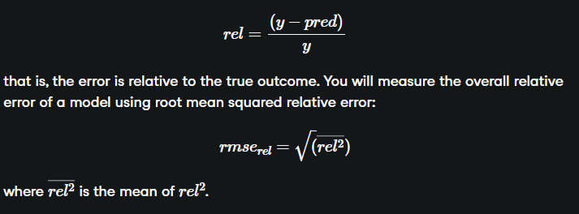
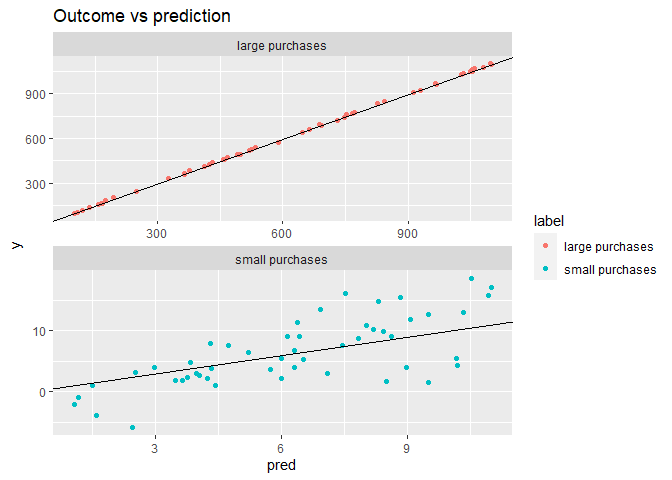

Issues to Consider
================
Mohamad Osman
2022-07-29

# Section 01: Issues to Consider

``` r
library(dplyr)
```

    ## 
    ## Attaching package: 'dplyr'

    ## The following objects are masked from 'package:stats':
    ## 
    ##     filter, lag

    ## The following objects are masked from 'package:base':
    ## 
    ##     intersect, setdiff, setequal, union

``` r
library(readr)
library(ggplot2)
library(tidyr)
```

    ## Warning: package 'tidyr' was built under R version 4.2.1

``` r
file_path <- file.path("..", "00_Datasets", "flowers.txt")
flowers <- read.delim(file_path)
```

### `01-Examining the structure of categorical inputs`

For this exercise, you will call
[**`model.matrix()`**](https://www.rdocumentation.org/packages/stats/topics/model.matrix)
to examine how R represents data with both categorical and numerical
inputs for modeling. The dataset `flowers` (derived from the `Sleuth3`
package) has been loaded for you. It has the following columns:

-   `Flowers`: the average number of flowers on a *meadowfoam* plant

-   `Intensity`: the intensity of a light treatment applied to the plant

-   `Time`: A categorical variable - when (`Late` or `Early`) in the
    lifecycle the light treatment occurred

The ultimate goal is to predict `Flowers` as a function of `Time` and
`Intensity`.

-   Call the
    [**`str()`**](https://www.rdocumentation.org/packages/utils/topics/str)
    function on `flowers` to see the types of each column.

-   Use the
    [**`unique()`**](https://www.rdocumentation.org/packages/base/topics/unique)
    function on the column `flowers$Time` to see the possible values
    that `Time` takes. How many unique values are there?

-   Create a formula to express `Flowers` as a function of `Intensity`
    and `Time`. Assign it to the variable `fmla` and print it.

-   Use `fmla` and `model.matrix()` to create the model matrix for the
    data frame `flowers`. Assign it to the variable `mmat`.

-   Use
    [**`head()`**](https://www.rdocumentation.org/packages/utils/topics/head)
    to examine the first 20 lines of `flowers`.

-   Now examine the first 20 lines of `mmat`.

    -   Is the numeric column `Intensity` different?

    -   What happened to the categorical column `Time` from `flowers`?

    -   How is `Time == 'Early'` represented? And `Time == 'Late'`?

``` r
# Call str on flowers to see the types of each column
str(flowers)
```

    ## 'data.frame':    24 obs. of  3 variables:
    ##  $ Flowers  : num  62.3 77.4 55.3 54.2 49.6 61.9 39.4 45.7 31.3 44.9 ...
    ##  $ Time     : chr  "Late" "Late" "Late" "Late" ...
    ##  $ Intensity: int  150 150 300 300 450 450 600 600 750 750 ...

``` r
# Use unique() to see how many possible values Time takes
unique(flowers$Time)
```

    ## [1] "Late"  "Early"

``` r
# Build and print a formula to express Flowers as a function of Intensity and Time: fmla
(fmla <- as.formula("Flowers ~ Intensity + Time"))
```

    ## Flowers ~ Intensity + Time

``` r
# Use fmla and model.matrix to see how the data is represented for modeling
mmat <- model.matrix(fmla, data = flowers)

# Examine the first 20 lines of flowers
head(flowers, 20)
```

    ##    Flowers  Time Intensity
    ## 1     62.3  Late       150
    ## 2     77.4  Late       150
    ## 3     55.3  Late       300
    ## 4     54.2  Late       300
    ## 5     49.6  Late       450
    ## 6     61.9  Late       450
    ## 7     39.4  Late       600
    ## 8     45.7  Late       600
    ## 9     31.3  Late       750
    ## 10    44.9  Late       750
    ## 11    36.8  Late       900
    ## 12    41.9  Late       900
    ## 13    77.8 Early       150
    ## 14    75.6 Early       150
    ## 15    69.1 Early       300
    ## 16    78.0 Early       300
    ## 17    57.0 Early       450
    ## 18    71.1 Early       450
    ## 19    62.9 Early       600
    ## 20    52.2 Early       600

``` r
# Examine the first 20 lines of mmat
head(mmat, 20)
```

    ##    (Intercept) Intensity TimeLate
    ## 1            1       150        1
    ## 2            1       150        1
    ## 3            1       300        1
    ## 4            1       300        1
    ## 5            1       450        1
    ## 6            1       450        1
    ## 7            1       600        1
    ## 8            1       600        1
    ## 9            1       750        1
    ## 10           1       750        1
    ## 11           1       900        1
    ## 12           1       900        1
    ## 13           1       150        0
    ## 14           1       150        0
    ## 15           1       300        0
    ## 16           1       300        0
    ## 17           1       450        0
    ## 18           1       450        0
    ## 19           1       600        0
    ## 20           1       600        0

### **`02-Modeling with categorical inputs`**

For this exercise, you will fit a linear model to the `flowers` data, to
predict `Flowers` as a function of `Time` and `Intensity`.

The model formula `fmla` that you created in the previous exercise is
still available, as is the model matrix `mmat`.

-   Use `fmla` and `lm` to train a linear model that predicts `Flowers`
    from `Intensity` and `Time`. Assign the model to the variable
    `flower_model`.

-   Use `summary()` to remind yourself of the structure of `mmat`.

-   Use `summary()` to examine the `flower_model`. Do the variables
    match what you saw in `mmat`?

-   Use `flower_model` to predict the number of flowers. Add the
    predictions to `flowers` as the column `predictions`.

-   Fill in the blanks to plot predictions vs. actual flowers
    (predictions on the x-axis).

``` r
# flowers is available
str(flowers)
```

    ## 'data.frame':    24 obs. of  3 variables:
    ##  $ Flowers  : num  62.3 77.4 55.3 54.2 49.6 61.9 39.4 45.7 31.3 44.9 ...
    ##  $ Time     : chr  "Late" "Late" "Late" "Late" ...
    ##  $ Intensity: int  150 150 300 300 450 450 600 600 750 750 ...

``` r
# fmla is available
fmla
```

    ## Flowers ~ Intensity + Time

``` r
# Fit a model to predict Flowers from Intensity and Time : flower_model
flower_model <- lm(fmla, data = flowers)

# Use summary on mmat to remind yourself of its structure
summary(mmat)
```

    ##   (Intercept)   Intensity      TimeLate  
    ##  Min.   :1    Min.   :150   Min.   :0.0  
    ##  1st Qu.:1    1st Qu.:300   1st Qu.:0.0  
    ##  Median :1    Median :525   Median :0.5  
    ##  Mean   :1    Mean   :525   Mean   :0.5  
    ##  3rd Qu.:1    3rd Qu.:750   3rd Qu.:1.0  
    ##  Max.   :1    Max.   :900   Max.   :1.0

``` r
# Use summary to examine flower_model 
summary(flower_model)
```

    ## 
    ## Call:
    ## lm(formula = fmla, data = flowers)
    ## 
    ## Residuals:
    ##    Min     1Q Median     3Q    Max 
    ## -9.652 -4.139 -1.558  5.632 12.165 
    ## 
    ## Coefficients:
    ##               Estimate Std. Error t value Pr(>|t|)    
    ## (Intercept)  83.464167   3.273772  25.495  < 2e-16 ***
    ## Intensity    -0.040471   0.005132  -7.886 1.04e-07 ***
    ## TimeLate    -12.158333   2.629557  -4.624 0.000146 ***
    ## ---
    ## Signif. codes:  0 '***' 0.001 '**' 0.01 '*' 0.05 '.' 0.1 ' ' 1
    ## 
    ## Residual standard error: 6.441 on 21 degrees of freedom
    ## Multiple R-squared:  0.7992, Adjusted R-squared:   0.78 
    ## F-statistic: 41.78 on 2 and 21 DF,  p-value: 4.786e-08

``` r
# Predict the number of flowers on each plant
flowers$predictions <- predict(flower_model, flowers)

# Plot predictions vs actual flowers (predictions on x-axis)
ggplot(flowers, aes(x = predictions, y = Flowers)) + 
  geom_point() +
  geom_abline(color = "blue") 
```

<!-- -->

### **`03-Modeling an interaction`**

In this exercise, you will use interactions to model the effect of
gender and gastric activity on alcohol metabolism.

The `alcohol` data frame has been pre-loaded, and has the columns:

-   `Metabol`: the alcohol metabolism rate

-   `Gastric`: the rate of gastric alcohol dehydrogenase activity

-   `Sex`: the sex of the drinker (`Male` or `Female`)

In the video, we fit three models to the `alcohol` data:

-   one with only additive (main effect) terms :
    `Metabol ~ Gastric + Sex`

-   two models, each with interactions between gastric activity and sex

You saw that one of the models with interaction terms had a better
R-squared than the additive model, suggesting that using interaction
terms gives a better fit. In this exercise, you will compare the
R-squared of one of the interaction models to the main-effects-only
model.

Recall that the operator `:` designates the interaction between two
variables. The operator `*` designates the interaction between the two
variables, plus the main effects.

    x*y = x + y + x:y

-   Write a formula that expresses `Metabol` as a function of `Gastric`
    and `Sex` with no interactions.

    -   Assign the formula to the variable `fmla_add` and print it.

-   Write a formula that expresses `Metabol` as a function of the
    interaction between `Gastric` and `Sex`.

    -   Add `Gastric` as a main effect, but not `Sex`.

    -   Assign the formula to the variable `fmla_interaction` and print
        it.

-   Fit a linear model with only main effects: `model_add` to the data.

-   Fit a linear model with the interaction: `model_interaction` to the
    data.

-   Call `summary()` on both models. Which has a better R-squared?

``` r
alc_file_path <- file.path("..", "00_Datasets", "alcohol.txt")
alcohol <- read.delim(alc_file_path)
head(alcohol)
```

    ##   Subject Metabol Gastric    Sex       Alcohol
    ## 1       1     0.6     1.0 Female     Alcoholic
    ## 2       2     0.6     1.6 Female     Alcoholic
    ## 3       3     1.5     1.5 Female     Alcoholic
    ## 4       4     0.4     2.2 Female Non-alcoholic
    ## 5       5     0.1     1.1 Female Non-alcoholic
    ## 6       6     0.2     1.2 Female Non-alcoholic

``` r
# alcohol is available
summary(alcohol)
```

    ##     Subject         Metabol          Gastric          Sex           
    ##  Min.   : 1.00   Min.   : 0.100   Min.   :0.800   Length:32         
    ##  1st Qu.: 8.75   1st Qu.: 0.600   1st Qu.:1.200   Class :character  
    ##  Median :16.50   Median : 1.700   Median :1.600   Mode  :character  
    ##  Mean   :16.50   Mean   : 2.422   Mean   :1.863                     
    ##  3rd Qu.:24.25   3rd Qu.: 2.925   3rd Qu.:2.200                     
    ##  Max.   :32.00   Max.   :12.300   Max.   :5.200                     
    ##    Alcohol         
    ##  Length:32         
    ##  Class :character  
    ##  Mode  :character  
    ##                    
    ##                    
    ## 

``` r
# Create the formula with main effects only
(fmla_add <- as.formula("Metabol ~ Gastric + Sex") )
```

    ## Metabol ~ Gastric + Sex

``` r
# Create the formula with interactions
(fmla_interaction <- as.formula("Metabol ~ Gastric + Gastric:Sex") )
```

    ## Metabol ~ Gastric + Gastric:Sex

``` r
# Fit the main effects only model
model_add <- lm(fmla_add, data = alcohol)

# Fit the interaction model
model_interaction <- lm(fmla_interaction, data = alcohol)

# Call summary on both models and compare
summary(model_add)
```

    ## 
    ## Call:
    ## lm(formula = fmla_add, data = alcohol)
    ## 
    ## Residuals:
    ##     Min      1Q  Median      3Q     Max 
    ## -2.2779 -0.6328 -0.0966  0.5783  4.5703 
    ## 
    ## Coefficients:
    ##             Estimate Std. Error t value Pr(>|t|)    
    ## (Intercept)  -1.9466     0.5198  -3.745 0.000796 ***
    ## Gastric       1.9656     0.2674   7.352 4.24e-08 ***
    ## SexMale       1.6174     0.5114   3.163 0.003649 ** 
    ## ---
    ## Signif. codes:  0 '***' 0.001 '**' 0.01 '*' 0.05 '.' 0.1 ' ' 1
    ## 
    ## Residual standard error: 1.331 on 29 degrees of freedom
    ## Multiple R-squared:  0.7654, Adjusted R-squared:  0.7492 
    ## F-statistic: 47.31 on 2 and 29 DF,  p-value: 7.41e-10

``` r
summary(model_interaction)
```

    ## 
    ## Call:
    ## lm(formula = fmla_interaction, data = alcohol)
    ## 
    ## Residuals:
    ##     Min      1Q  Median      3Q     Max 
    ## -2.4656 -0.5091  0.0143  0.5660  4.0668 
    ## 
    ## Coefficients:
    ##                 Estimate Std. Error t value Pr(>|t|)    
    ## (Intercept)      -0.7504     0.5310  -1.413 0.168236    
    ## Gastric           1.1489     0.3450   3.331 0.002372 ** 
    ## Gastric:SexMale   1.0422     0.2412   4.321 0.000166 ***
    ## ---
    ## Signif. codes:  0 '***' 0.001 '**' 0.01 '*' 0.05 '.' 0.1 ' ' 1
    ## 
    ## Residual standard error: 1.204 on 29 degrees of freedom
    ## Multiple R-squared:  0.8081, Adjusted R-squared:  0.7948 
    ## F-statistic: 61.05 on 2 and 29 DF,  p-value: 4.033e-11

### **`04-Modeling an interaction (2)`**

In this exercise, you will compare the performance of the interaction
model you fit in the previous exercise to the performance of a
main-effects only model. Because this dataset is small, we will use
cross-validation to simulate making predictions on out-of-sample data.

You will begin to use the `dplyr` package to do calculations.

-   [**`mutate()`**](https://www.rdocumentation.org/packages/dplyr/topics/mutate)
    adds new columns to a tbl (a type of data frame)

-   [**`group_by()`**](https://www.rdocumentation.org/packages/dplyr/topics/group_by)
    specifies how rows are grouped in a tbl

-   [**`summarize()`**](https://www.rdocumentation.org/packages/dplyr/topics/summarise)
    computes summary statistics of a column

You will also use `tidyr`’s
[**`gather()`**](https://www.rdocumentation.org/packages/tidyr/topics/gather)
which takes multiple columns and collapses them into key-value pairs.
The `alcohol` data frame and the formulas `fmla_add` and
`fmla_interaction` have been pre-loaded.

-   Use
    [**`kWayCrossValidation()`**](https://www.rdocumentation.org/packages/vtreat/topics/kWayCrossValidation)
    to create a splitting plan for a 3-fold cross validation.

    -   The first argument is the number of rows to be split.

    -   The second argument is the number of folds for the
        cross-validation.

    -   You can set the 3rd and 4th arguments of the function to `NULL`.

-   Examine and run the sample code to get the 3-fold cross-validation
    predictions of a model with no interactions and assign them to the
    column `pred_add`.

-   Get the 3-fold cross-validation predictions of the model with
    interactions. Assign the predictions to the column
    `pred_interaction`.

    -   The sample code shows you the procedure.

    -   Use the same `splitPlan` that you already created.

-   Fill in the blanks to

    -   gather the predictions into a single column `pred`.

    -   add a column of residuals (actual outcome - predicted outcome).

    -   get the RMSE of the cross-validation predictions for each model
        type.

-   Compare the RMSEs. Based on these results, which model should you
    use?

``` r
library(vtreat)
```

    ## Warning: package 'vtreat' was built under R version 4.2.1

    ## Loading required package: wrapr

    ## Warning: package 'wrapr' was built under R version 4.2.1

    ## 
    ## Attaching package: 'wrapr'

    ## The following objects are masked from 'package:tidyr':
    ## 
    ##     pack, unpack

    ## The following object is masked from 'package:dplyr':
    ## 
    ##     coalesce

``` r
# alcohol is available
summary(alcohol)
```

    ##     Subject         Metabol          Gastric          Sex           
    ##  Min.   : 1.00   Min.   : 0.100   Min.   :0.800   Length:32         
    ##  1st Qu.: 8.75   1st Qu.: 0.600   1st Qu.:1.200   Class :character  
    ##  Median :16.50   Median : 1.700   Median :1.600   Mode  :character  
    ##  Mean   :16.50   Mean   : 2.422   Mean   :1.863                     
    ##  3rd Qu.:24.25   3rd Qu.: 2.925   3rd Qu.:2.200                     
    ##  Max.   :32.00   Max.   :12.300   Max.   :5.200                     
    ##    Alcohol         
    ##  Length:32         
    ##  Class :character  
    ##  Mode  :character  
    ##                    
    ##                    
    ## 

``` r
# Both the formulae are available
fmla_add
```

    ## Metabol ~ Gastric + Sex

``` r
fmla_interaction
```

    ## Metabol ~ Gastric + Gastric:Sex

``` r
# Create the splitting plan for 3-fold cross validation
set.seed(34245)  # set the seed for reproducibility
splitPlan <- kWayCrossValidation(nrow(alcohol), 3, NULL, NULL)

# Sample code: Get cross-val predictions for main-effects only model
alcohol$pred_add <- 0  # initialize the prediction vector
for(i in 1:3) {
  split <- splitPlan[[i]]
  model_add <- lm(fmla_add, data = alcohol[split$train, ])
  alcohol$pred_add[split$app] <- predict(model_add, newdata = alcohol[split$app, ])
}

# Get the cross-val predictions for the model with interactions
alcohol$pred_interaction <- 0 # initialize the prediction vector
for(i in 1:3) {
  split <- splitPlan[[i]]
  model_interaction <- lm(fmla_interaction, data = alcohol[split$train, ])
  alcohol$pred_interaction[split$app] <- predict(model_interaction, newdata = alcohol[split$app, ])
}

# Get RMSE
alcohol %>% 
  gather(key = modeltype, value = pred, pred_add, pred_interaction) %>%
  mutate(residuals = Metabol - pred) %>%
  group_by(modeltype) %>%
  summarize(rmse = sqrt(mean(residuals^2)))
```

    ## # A tibble: 2 × 2
    ##   modeltype         rmse
    ##   <chr>            <dbl>
    ## 1 pred_add          1.38
    ## 2 pred_interaction  1.30

### **`05-Relative error`**

In this exercise, you will compare relative error to absolute error. For
the purposes of modeling, we will define relative error as



The example (toy) dataset `fdata` has been pre-loaded. It includes the
columns:

-   `y`: the true output to be predicted by some model; imagine it is
    the amount of money a customer will spend on a visit to your store.

-   `pred`: the predictions of a model that predicts `y`.

-   `label`: categorical: whether `y` comes from a population that makes
    `small` purchases, or `large` ones.

You want to know which model does “better”: the one predicting the
`small` purchases, or the one predicting `large` ones.

``` r
fdata_path <- file.path("..", "00_Datasets", "fdata.txt")
fdata <- read.delim(fdata_path)
```

``` r
# fdata is available
summary(fdata)
```

    ##        y                 pred             label          
    ##  Min.   :  -5.894   Min.   :   1.072   Length:100        
    ##  1st Qu.:   5.407   1st Qu.:   6.373   Class :character  
    ##  Median :  57.374   Median :  55.693   Mode  :character  
    ##  Mean   : 306.204   Mean   : 305.905                     
    ##  3rd Qu.: 550.903   3rd Qu.: 547.886                     
    ##  Max.   :1101.619   Max.   :1098.896

``` r
# Examine the data: generate the summaries for the groups large and small:
fdata %>% 
    group_by(label) %>%     # group by small/large purchases
    summarize(min  = min(y),   # min of y
              mean = mean(y),   # mean of y
              max  = max(y))   # max of y
```

    ## # A tibble: 2 × 4
    ##   label             min   mean    max
    ##   <chr>           <dbl>  <dbl>  <dbl>
    ## 1 large purchases 96.1  606.   1102. 
    ## 2 small purchases -5.89   6.48   18.6

``` r
# Fill in the blanks to add error columns
fdata2 <- fdata %>% 
         group_by(label) %>%       # group by label
           mutate(residual = y - pred,  # Residual
                  relerr   = residual / y)  # Relative error

# Compare the rmse and rmse.rel of the large and small groups:
fdata2 %>% 
  group_by(label) %>% 
  summarize(rmse     = sqrt(mean(residual ^ 2)),   # RMSE
            rmse.rel = sqrt(mean(relerr ^ 2)))   # Root mean squared relative error
```

    ## # A tibble: 2 × 3
    ##   label            rmse rmse.rel
    ##   <chr>           <dbl>    <dbl>
    ## 1 large purchases  5.54   0.0147
    ## 2 small purchases  4.01   1.25

``` r
# Plot the predictions for both groups of purchases
ggplot(fdata2, aes(x = pred, y = y, color = label)) + 
  geom_point() + 
  geom_abline() + 
  facet_wrap(~ label, ncol = 1, scales = "free") + 
  ggtitle("Outcome vs prediction")
```

<!-- -->

### **`06-Modeling log-transformed monetary output`**

In this exercise, you will practice modeling on log-transformed monetary
output, and then transforming the “log-money” predictions back into
monetary units. The data loaded records subjects’ incomes in 2005
(`Income2005`), as well as the results of several aptitude tests taken
by the subjects in 1981:

-   `Arith`

-   `Word`

-   `Parag`

-   `Math`

-   `AFQT` (Percentile on the Armed Forces Qualifying Test)

The data have already been split into training and test sets
(`income_train` and `income_test`, respectively) and pre-loaded. You
will build a model of log(income) from the inputs, and then convert
log(income) back into income.

-   Call `summary()` on `income_train$Income2005` to see the summary
    statistics of income in the training set.

-   Write a formula to express `log(Income2005)` as a function of the
    five tests as the variable `fmla.log`. Print it.

-   Fit a linear model of `log(Income2005)` to the `income_train` data:
    `model.log`.

-   Use `model.log` to predict income on the `income_test` dataset. Put
    it in the column `logpred`.

    -   Check `summary()` of `logpred` to see that the magnitudes are
        much different from those of `Income2005`.

-   Reverse the log transformation to put the predictions into “monetary
    units”: `exp(income_test$logpred)`.

    -   Check `summary()` of `pred.income` and see that the magnitudes
        are now similar to `Income2005` magnitudes.

-   Fill in the blanks to plot a scatter plot of predicted income vs
    income on the test set.

``` r
train_path <- file.path("..", "00_Datasets", "income_train.txt")
test_path <- file.path("..", "00_Datasets", "income_test.txt")

income_train <- read.delim(train_path)
income_test <- read.delim(test_path) 

head(income_train)
```

    ##   Subject Arith Word Parag Math   AFQT Income2005
    ## 1       2     8   15     6    6  6.841       5500
    ## 2       6    30   35    15   23 99.393      65000
    ## 3       8    13   35    12    4 44.022      36000
    ## 4       9    21   28    10   13 59.683      65000
    ## 5      16    17   30    12   17 50.283      71000
    ## 6      17    29   33    13   21 89.669      43000

``` r
head(income_test)
```

    ##   Subject Arith Word Parag Math   AFQT Income2005
    ## 1       7    14   27     8   11 47.412      19000
    ## 2      13    30   29    13   24 72.313       8000
    ## 3      47    26   33    13   16 75.473      66309
    ## 4      62    12   25    10   10 36.384      30000
    ## 5      73    18   34    13   18 81.527     186135
    ## 6      78    25   35    14   21 85.347      14657

``` r
# Examine Income2005 in the training set
summary(income_train$Income2005)
```

    ##    Min. 1st Qu.  Median    Mean 3rd Qu.    Max. 
    ##      63   23000   39000   49894   61500  703637

``` r
# Write the formula for log income as a function of the tests and print it
(fmla.log <- as.formula("log(Income2005) ~ Arith + Word + Parag + Math + AFQT"))
```

    ## log(Income2005) ~ Arith + Word + Parag + Math + AFQT

``` r
# Fit the linear model
model.log <-  lm(fmla.log, data = income_train)

# Make predictions on income_test
income_test$logpred <- predict(model.log, income_test)
summary(income_test$logpred)
```

    ##    Min. 1st Qu.  Median    Mean 3rd Qu.    Max. 
    ##   9.766  10.133  10.423  10.419  10.705  11.006

``` r
# Convert the predictions to monetary units
income_test$pred.income <- exp(income_test$logpred)
summary(income_test$pred.income)
```

    ##    Min. 1st Qu.  Median    Mean 3rd Qu.    Max. 
    ##   17432   25167   33615   35363   44566   60217

``` r
#  Plot predicted income (x axis) vs income
ggplot(income_test, aes(x = pred.income, y = Income2005)) + 
  geom_point() + 
  geom_abline(color = "blue")
```

<!-- -->

### **`07-Comparing RMSE and root-mean-squared Relative Error`**

In this exercise, you will show that log-transforming a monetary output
before modeling improves mean relative error (but increases RMSE)
compared to modeling the monetary output directly. You will compare the
results of `model.log` from the previous exercise to a model
(`model.abs`) that directly fits income.

The `income_train` and `income_test` datasets have been pre-loaded,
along with your model, `model.log`.

Also available:

-   `model.abs`: a model that directly fits income to the inputs using
    the formula

    `Income2005 ~ Arith + Word + Parag + Math + AFQT`

-   Fill in the blanks to add predictions from the models to
    `income_test`.

    -   Don’t forget to take the exponent of the predictions from
        `model.log` to undo the log transform!

-   Fill in the blanks to
    [**`gather()`**](https://www.rdocumentation.org/packages/tidyr/topics/gather)
    the predictions and calculate the residuals and relative error.

-   Fill in the blanks to calculate the RMSE and relative RMSE for
    predictions.

    -   Which model has larger absolute error? Larger relative error?

``` r
# fmla.abs is available
fmla.abs <- as.formula("Income2005 ~ Arith + Word + Parag + Math + AFQT")
fmla.abs
```

    ## Income2005 ~ Arith + Word + Parag + Math + AFQT

``` r
# model.abs is available
model.abs <- lm(fmla.abs, income_train)
summary(model.abs)
```

    ## 
    ## Call:
    ## lm(formula = fmla.abs, data = income_train)
    ## 
    ## Residuals:
    ##    Min     1Q Median     3Q    Max 
    ## -78728 -24137  -6979  11964 648573 
    ## 
    ## Coefficients:
    ##             Estimate Std. Error t value Pr(>|t|)    
    ## (Intercept)  17516.7     6420.1   2.728  0.00642 ** 
    ## Arith         1552.3      303.4   5.116 3.41e-07 ***
    ## Word          -132.3      265.0  -0.499  0.61754    
    ## Parag        -1155.1      618.3  -1.868  0.06189 .  
    ## Math           725.5      372.0   1.950  0.05127 .  
    ## AFQT           177.8      144.1   1.234  0.21734    
    ## ---
    ## Signif. codes:  0 '***' 0.001 '**' 0.01 '*' 0.05 '.' 0.1 ' ' 1
    ## 
    ## Residual standard error: 45500 on 2063 degrees of freedom
    ## Multiple R-squared:  0.1165, Adjusted R-squared:  0.1144 
    ## F-statistic:  54.4 on 5 and 2063 DF,  p-value: < 2.2e-16

``` r
# Add predictions to the test set
income_test <- income_test %>%
  mutate(pred.absmodel = predict(model.abs, income_test),      # predictions from model.abs
         pred.logmodel = exp(predict(model.log, income_test))) # predictions from model.log

# Gather the predictions and calculate residuals and relative error
income_long <- income_test %>% 
  gather(key = modeltype, value = pred, pred.absmodel, pred.logmodel) %>%
  mutate(residual = pred - Income2005,     # residuals
         relerr   = residual / Income2005) # relative error

# Calculate RMSE and relative RMSE and compare
income_long %>% 
  group_by(modeltype) %>%                       # group by modeltype
  summarize(rmse     = sqrt(mean(residual^2)),  # RMSE
            rmse.rel = sqrt(mean(relerr^2)))    # Root mean squared relative error
```

    ## # A tibble: 2 × 3
    ##   modeltype       rmse rmse.rel
    ##   <chr>          <dbl>    <dbl>
    ## 1 pred.absmodel 37448.     3.18
    ## 2 pred.logmodel 39235.     2.22

You’ve seen how modeling log(income) can reduce the relative error of
the fit, at the cost of increased RMSE. Which tradeoff to make depends
on the goals of your project.

### **`08-Input transforms: the "hockey stick"`**

In this exercise, we will build a model to predict price from a measure
of the house’s size (surface area). The `houseprice` dataset, loaded for
you, has the columns:

-   `price`: house price in units of $1000

-   `size`: surface area

A scatterplot of the data shows that the data is quite non-linear: a
sort of “hockey-stick” where price is fairly flat for smaller houses,
but rises steeply as the house gets larger. Quadratics and tritics are
often good functional forms to express hockey-stick like relationships.
Note that there may not be a “physical” reason that `price` is related
to the square of the `size`; a quadratic is simply a closed form
approximation of the observed relationship.


You will fit a model to predict price as a function of the squared size,
and look at its fit on the training data.

Because `^` is also a symbol to express interactions, use the function
[**`I()`**](https://www.rdocumentation.org/packages/base/topics/AsIs) to
treat the expression `x^2` “as is”: that is, as the square of x rather
than the interaction of `x` with itself.

    exampleFormula = y ~ I(x^2)

-   Write a formula, `fmla_sqr`, to express price as a function of
    squared size. Print it.

-   Fit a model `model_sqr` to the data using `fmla_sqr`

-   For comparison, fit a linear model `model_lin` to the data using the
    formula `price ~ size`.

-   Fill in the blanks to

    -   make predictions from the training data from the two models

    -   gather the predictions into a single column `pred`

    -   graphically compare the predictions of the two models to the
        data. Which fits better?

``` r
hp_path <- file.path("..", "00_Datasets", "houseprice.txt")
houseprice <- read.delim(hp_path)
head(houseprice)
```

    ##   size price
    ## 1   72   156
    ## 2   98   153
    ## 3   92   230
    ## 4   90   152
    ## 5   44    42
    ## 6   46   157

``` r
# houseprice is available
summary(houseprice)
```

    ##       size           price      
    ##  Min.   : 44.0   Min.   : 42.0  
    ##  1st Qu.: 73.5   1st Qu.:164.5  
    ##  Median : 91.0   Median :203.5  
    ##  Mean   : 94.3   Mean   :249.2  
    ##  3rd Qu.:118.5   3rd Qu.:287.8  
    ##  Max.   :150.0   Max.   :573.0

``` r
# Create the formula for price as a function of squared size
(fmla_sqr <- as.formula("price ~ I(size ^ 2)"))
```

    ## price ~ I(size^2)

``` r
# Fit a model of price as a function of squared size (use fmla_sqr)
model_sqr <- lm(fmla_sqr, data = houseprice)

# Fit a model of price as a linear function of size
model_lin <- lm(price ~ size, data = houseprice)

# Make predictions and compare
houseprice %>% 
    mutate(pred_lin = predict(model_lin, houseprice),       # predictions from linear model
           pred_sqr = predict(model_sqr, houseprice)) %>%   # predictions from quadratic model 
    gather(key = modeltype, value = pred, pred_lin, pred_sqr) %>% # gather the predictions
    ggplot(aes(x = size)) + 
       geom_point(aes(y = price)) +                   # actual prices
       geom_line(aes(y = pred, color = modeltype)) + # the predictions
       scale_color_brewer(palette = "Dark2")
```

<!-- -->

### **`09-Input transforms: the "hockey stick" (2)`**

In the last exercise, you saw that a quadratic model seems to fit the
`houseprice` data better than a linear model. In this exercise, you will
confirm whether the quadratic model would perform better on
out-of-sample data. Since this dataset is small, you will use
cross-validation. The quadratic formula `fmla_sqr` that you created in
the last exercise and the `houseprice` data frame are available for you
to use.

For comparison, the sample code will calculate cross-validation
predictions from a linear model `price ~ size`.

-   Use
    [**`kWayCrossValidation()`**](https://www.rdocumentation.org/packages/vtreat/topics/kWayCrossValidation)
    to create a splitting plan for a 3-fold cross validation.

    -   You can set the 3rd and 4th arguments of the function to `NULL`.

-   Examine and run the sample code to get the 3-fold cross-validation
    predictions of the model `price ~ size` and add them to the column
    `pred_lin`.

-   Get the cross-validation predictions for price as a function of
    squared size. Assign them to the column `pred_sqr`.

    -   The sample code gives you the procedure.

    -   You can use the splitting plan you already created.

-   Fill in the blanks to gather the predictions and calculate the
    residuals.

-   Fill in the blanks to compare the RMSE for the two models. Which one
    fits better?

``` r
# houseprice is available
summary(houseprice)
```

    ##       size           price      
    ##  Min.   : 44.0   Min.   : 42.0  
    ##  1st Qu.: 73.5   1st Qu.:164.5  
    ##  Median : 91.0   Median :203.5  
    ##  Mean   : 94.3   Mean   :249.2  
    ##  3rd Qu.:118.5   3rd Qu.:287.8  
    ##  Max.   :150.0   Max.   :573.0

``` r
# fmla_sqr is available
fmla_sqr
```

    ## price ~ I(size^2)

``` r
# Create a splitting plan for 3-fold cross validation
set.seed(34245)  # set the seed for reproducibility
splitPlan <- kWayCrossValidation(nRows  = nrow(houseprice), nSplits = 3, NULL, NULL)

# Sample code: get cross-val predictions for price ~ size
houseprice$pred_lin <- 0  # initialize the prediction vector
for(i in 1:3) {
  split <- splitPlan[[i]]
  model_lin <- lm(price ~ size, data = houseprice[split$train,])
  houseprice$pred_lin[split$app] <- predict(model_lin, newdata = houseprice[split$app,])
}

# Get cross-val predictions for price as a function of size^2 (use fmla_sqr)
houseprice$pred_sqr <- 0 # initialize the prediction vector
for(i in 1:3) {
  split <- splitPlan[[i]]
  model_sqr <- lm(fmla_sqr, data = houseprice[split$train, ])
  houseprice$pred_sqr[split$app] <- predict(model_sqr, newdata = houseprice[split$app, ])
}

# Gather the predictions and calculate the residuals
houseprice_long <- houseprice %>%
  gather(key = modeltype, value = pred, pred_lin, pred_sqr) %>%
  mutate(residuals = price - pred)

# Compare the cross-validated RMSE for the two models
houseprice_long %>% 
  group_by(modeltype) %>% # group by modeltype
  summarize(rmse = sqrt(mean(residuals ^ 2)))
```

    ## # A tibble: 2 × 2
    ##   modeltype  rmse
    ##   <chr>     <dbl>
    ## 1 pred_lin   73.1
    ## 2 pred_sqr   60.3

Great work! You’ve confirmed that the quadratic input tranformation
improved the model. In the next chapter, you will see how
transformations like this can sometimes be learned automatically.

### **`The End`**
