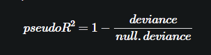

# Section 04: Dealing with Non-Linear Responses

### **`01-Fit a model of sparrow survival probability`**

In this exercise, you will estimate the probability that a sparrow survives a severe winter storm, based on physical characteristics of the sparrow. The dataset `sparrow` has been pre-loaded. The outcome to be predicted is `status` ("Survived", "Perished"). The variables we will consider are:

-   `total_length`: length of the bird from tip of beak to tip of tail (mm)

-   `weight`: in grams

-   `humerus` : length of humerus ("upper arm bone" that connects the wing to the body) (inches)

Remember that when using [**`glm()`**](https://www.rdocumentation.org/packages/stats/topics/glm) to create a logistic regression model, you must explicitly specify that `family = binomial`:

    glm(formula, data = data, family = binomial)

You will call `summary()` and `broom::glance()` to see different functions for examining a logistic regression model. One of the diagnostics that you will look at is the analog to R^2^ , called pseudo- R^2^



You can think of deviance as analogous to variance: it is a measure of the variation in categorical data. The pseudo-R^2^ is analogous to R^2^ for standard regression: R^2^ is a measure of the "variance explained" of a regression model. The pseudo-R^2^ is a measure of the "deviance explained".

As suggested in the video, you will predict on the outcomes `TRUE` and `FALSE`. Create a new column `survived` in the `sparrow` data frame that is TRUE when `status == "Survived"`.

-   Create the formula `fmla` that expresses `survived` as a function of the variables of interest. Print it.

-   Fit a logistic regression model to predict the probability of sparrow survival. Assign the model to the variable `sparrow_model`.

-   Call `summary()` to see the coefficients of the model, the deviance and the null deviance.

-   Call `glance()` on the model to see the deviances and other diagnostics in a data frame. Assign the output from `glance()` to the variable `perf`.

-   Calculate the pseudo-R2.

```{r}
library(readr)
library(dplyr)
library(ggplot2)
library(broom)
```

```{r}
file_path <- file.path("..", "00_Datasets", "sparrow.rds")
sparrow <- readRDS(file_path)
head(sparrow)
```

```{r}
# sparrow is available
summary(sparrow)

# Create the survived column
sparrow$survived <- sparrow$status=="Survived"

# Create the formula
(fmla <- as.formula("survived ~ total_length + weight + humerus"))

# Fit the logistic regression model
sparrow_model <- glm(fmla, data = sparrow, family = binomial)

# Call summary
summary(sparrow_model)
# Call glance
(perf <- glance(sparrow_model))

# Calculate pseudo-R-squared
(pseudoR2 <- 1 - perf$deviance/perf$null.deviance)
                
```

### **`02-Predict sparrow survival`**

In this exercise, you will predict the probability of survival using the sparrow survival model from the previous exercise.

Recall that when calling [**`predict()`**](https://www.rdocumentation.org/packages/stats/topics/predict.glm) to get the predicted probabilities from a `glm()` model, you must specify that you want the response:

    predict(model, type = "response")

Otherwise, `predict()` on a logistic regression model returns the predicted log-odds of the event, not the probability.

You will also use the [**`GainCurvePlot()`**](https://www.rdocumentation.org/packages/WVPlots/topics/GainCurvePlot) function to plot the gain curve from the model predictions. If the model's gain curve is close to the ideal ("wizard") gain curve, then the model sorted the sparrows well: that is, the model predicted that sparrows that actually survived would have a higher probability of survival. The inputs to the `GainCurvePlot()` function are:

-   `frame`: data frame with prediction column and ground truth column

-   `xvar`: the name of the column of predictions (as a string)

-   `truthVar`: the name of the column with actual outcome (as a string)

-   `title`: a title for the plot (as a string)

`GainCurvePlot(frame, xvar, truthVar, title)`

The `sparrow` data frame and the model `sparrow_model` have been pre-loaded.

```{r}
library(WVPlots)

# sparrow is available
summary(sparrow)

# sparrow_model is available
summary(sparrow_model)

# Make predictions
sparrow$pred <- predict(sparrow_model, sparrow,type = "response")

# Look at gain curve
GainCurvePlot(sparrow, "pred", "survived", "sparrow survival model")
```

### 
**`03-Poisson or quasipoisson`**

One of the assumptions of Poisson regression to predict counts is that the event you are counting is *Poisson distributed*: the average count per unit time is the same as the variance of the count. In practice, "the same" means that the mean and the variance should be of a similar order of magnitude.

When the variance is much larger than the mean, the Poisson assumption doesn't apply, and one solution is to use quasipoisson regression, which does not assume that variance=mean.

For each of the following situations, decide if Poisson regression would be suitable, or if you should use quasipoisson regression.

For which situations can you use Poisson regression?

1.  Number of days students are absent: mean 5.9, variance 49

2.  Number of awards a student wins: mean 0.6, variance 1.1

3.  Number of hits per website page: mean 108.2, variance 108.5

4.  Number of bikes rented per day: mean 273, variance 45863.84

-   All of them

-   1 and 4

-   2 and 3 ✔️

-   1 and 3

-   2 and 4

Yes! When the mean and variance of event arrivals are reasonably close, Poisson regression is suitable.

### **`04-Fit a model to predict bike rental counts`**

In this exercise, you will build a model to predict the number of bikes rented in an hour as a function of the weather, the type of day (holiday, working day, or weekend), and the time of day. You will train the model on data from the month of July.

The data frame has the columns:

-   `cnt`: the number of bikes rented in that hour (the outcome)

-   `hr`: the hour of the day (0-23, as a factor)

-   `holiday`: TRUE/FALSE

-   `workingday`: TRUE if neither a holiday nor a weekend, else FALSE

-   `weathersit`: categorical, "Clear to partly cloudy"/"Light Precipitation"/"Misty"

-   `temp`: normalized temperature in Celsius

-   `atemp`: normalized "feeling" temperature in Celsius

-   `hum`: normalized humidity

-   `windspeed`: normalized windspeed

-   `instant`: the time index -- number of hours since beginning of dataset (not a variable)

-   `mnth` and `yr`: month and year indices (not variables)

Remember that you must specify `family = poisson` or `family = quasipoisson` when using [**`glm()`**](https://www.rdocumentation.org/packages/stats/topics/glm) to fit a count model.

Since there are a lot of input variables, for convenience we will specify the outcome and the inputs in variables, and use [**`paste()`**](https://www.rdocumentation.org/packages/base/topics/paste) to assemble a string representing the model formula.

The `bikesJuly` data frame is available to use. The names of the outcome variable and the input variables have also been loaded as the variables `outcome` and `vars`, respectively.

-   Fill in the blanks to create the formula `fmla` expressing `cnt` as a function of the inputs. Print it.

-   Calculate the mean (`mean()`) and variance (`var()`) of `bikesJuly$cnt`.

    -   Should you use poisson or quasipoisson regression?

-   Use `glm()` to fit a model to the `bikesJuly` data: `bike_model`.

-   Use `glance()` to look at the model's fit statistics. Assign the output of `glance()` to the variable `perf`.

-   Calculate the pseudo-R-squared of the model.

```{r}
file_path <- file.path("..", "00_Datasets", "Bikes.RData")
bikes <- load(file_path)
bikes
```

```{r}
# bikesJuly is available
str(bikesJuly)

# The outcome column
outcome <- c("cnt")

# The inputs to use
vars <- c("hr","holiday", "workingday", "weathersit", "temp", "atemp", "hum", "windspeed")

# Create the formula string for bikes rented as a function of the inputs
(fmla <- paste(outcome, "~", paste(vars, collapse = " + ")))

# Calculate the mean and variance of the outcome
(mean_bikes <- mean(bikesJuly$cnt))
(var_bikes <- var(bikesJuly$cnt))

# Fit the model
bike_model <- glm(fmla, data = bikesJuly, family = quasipoisson)

# Call glance
(perf <- glance(bike_model))

# Calculate pseudo-R-squared
(pseudoR2 <- 1 - perf$deviance/perf$null.deviance)
```

### **`05-Predict bike rentals on new data`**

In this exercise, you will use the model you built in the previous exercise to make predictions for the month of August. The dataset `bikesAugust` has the same columns as `bikesJuly`.

Recall that you must specify `type = "response"` with [**`predict()`**](https://www.rdocumentation.org/packages/stats/topics/predict.glm) when predicting counts from a `glm` poisson or quasipoisson model.

The model `bike_model` and the `bikesAugust` data frame have been pre-loaded.

-   Use `predict` to predict the number of bikes per hour on the `bikesAugust` data. Assign the predictions to the column `bikesAugust$pred`.

-   Fill in the blanks to get the RMSE of the predictions on the August data.

-   Fill in the blanks to generate the plot of predictions to actual counts.

    -   Do any of the predictions appear negative?

```{r}
# bikesAugust is available
str(bikesAugust)

# bike_model is available
summary(bike_model)

# Make predictions on August data
bikesAugust$pred  <- predict(bike_model, newdata = bikesAugust, type = "response")

# Calculate the RMSE
bikesAugust %>% 
  mutate(residual = pred - cnt) %>%
  summarize(rmse  = sqrt(mean(residual ^ 2)))

# Plot predictions vs cnt (pred on x-axis)
ggplot(bikesAugust, aes(x = pred, y = cnt)) +
  geom_point() + 
  geom_abline(color = "darkblue")
```

### 06-**Visualize the bike rental predictions**

In the previous exercise, you visualized the bike model's predictions using the standard "outcome vs. prediction" scatter plot. Since the bike rental data is time series data, you might be interested in how the model performs as a function of time. In this exercise, you will compare the predictions and actual rentals on an hourly basis, for the first 14 days of August.

To create the plot you will use the function [**`tidyr::gather()`**](https://www.rdocumentation.org/packages/tidyr/topics/gather) to consolidate the predicted and actual values from `bikesAugust` in a single column. `gather()` takes as arguments:

-   The "wide" data frame to be gathered (implicit in a pipe)

-   The name of the key column to be created - contains the names of the gathered columns.

-   The name of the value column to be created - contains the values of the gathered columns.

-   The names of the columns to be gathered into a single column.

You'll use the gathered data frame to compare the actual and predicted rental counts as a function of time. The time index, `instant` counts the number of observations since the beginning of data collection. The sample code converts the instants to daily units, starting from 0.

The `bikesAugust` data frame, with the predictions (`bikesAugust$pred`), has been pre-loaded.

-   Fill in the blanks to plot the predictions and actual counts by hour for the first 14 days of August.

    -   convert `instant` to be in day units, rather than hour

    -   `gather()` the `cnt` and `pred` columns into a column called `value`, with a key called `valuetype`.

    -   `filter()` for the first two weeks of August

    -   Plot `value` as a function of `instant` (day).

Does the model see the general time patterns in bike rentals?

```{r}
library(tidyr)


# Plot predictions and cnt by date/time
quasipoisson_plot<-bikesAugust %>% 
  # set start to 0, convert unit to days
  mutate(instant = (instant - min(instant))/24) %>%  
  # gather cnt and pred into a value column
  gather(key = valuetype, value = value, cnt, pred) %>%
  filter(instant < 14) %>% # restric to first 14 days
  # plot value by instant
  ggplot(aes(x = instant, y = value, color = valuetype, linetype = valuetype)) + 
  geom_point() + 
  geom_line() + 
  scale_x_continuous("Day", breaks = 0:14, labels = 0:14) + 
  scale_color_brewer(palette = "Dark2") + 
  ggtitle("Predicted August bike rentals, Quasipoisson model")
quasipoisson_plot
```

### **`07-Writing formulas for GAM models`**

When using [**`gam()`**](https://www.rdocumentation.org/packages/mgcv/topics/gam) to model outcome as an additive function of the inputs, you can use the [**`s()`**](https://www.rdocumentation.org/packages/mgcv/topics/s) function inside formulas to designate that you want to use a spline to model the non-linear relationship of a continuous variable to the outcome.

Suppose that you want to predict how much weight (`Wtloss`) a dieter will lose over a 2-year diet plan as a function of:

-   `Diet` type (categorical)

-   `Sex` (categorical)

-   `Age` at beginning of diet (continuous)

-   `BMI` (body mass index) at beginning of diet (continuous)

You do not want to assume that any of the relationships are linear.

Which is the most appropriate formula?

-   `Wtloss ~ Diet + Sex + Age + BMI`

-   `Wtloss ~ s(Diet) + s(Sex) + s(Age) + s(BMI)`

-   `Wtloss ~ Diet + Sex + s(Age) + s(BMI)`✔️

Yes! This formula says that Age and BMI will both be modeled non-linearly.

### 
**`08-Writing formulas for GAM models (2)`**

Suppose that in the diet problem from the previous exercise, you now also want to take into account

-   the dieter's resting metabolic rate (`BMR` -- continuous) and

-   the dieter's average number hours of aerobic exercise per day (`E` -- continuous) at the beginning of the study.

You have reason to believe that the relationship between BMR and weight loss is linear (and you want to model it that way), but not necessarily the relationship between aerobic exercise and weight loss.

Which is the most appropriate formula?

-   `Wtloss ~ Diet + Sex + s(Age) + s(BMI) + s(BMR) + s(E)`

-   `Wtloss ~ Diet + Sex + s(Age) + s(BMI) + BMR + s(E)`✔️

-   `Wtloss ~ Diet + Sex + s(Age) + s(BMI) + s(BMR) + E`

Yes! This formula says to model Age, BMI and E as non-linear, but model BMR as linear.

### **`09-Model soybean growth with GAM`**

In this exercise, you will model the average leaf weight on a soybean plant as a function of time (after planting). As you will see, the soybean plant doesn't grow at a steady rate, but rather has a "growth spurt" that eventually tapers off. Hence, leaf weight is not well described by a linear model.

Recall that you can designate which variable you want to model non-linearly in a formula with the [**`s()`**](https://www.rdocumentation.org/packages/mgcv/topics/s) function:

    y ~ s(x)

Also remember that [**`gam()`**](https://www.rdocumentation.org/packages/mgcv/topics/gam) from the package `mgcv` has the calling interface

    gam(formula, family, data)

For standard regression, use `family = gaussian` (the default).

The soybean training data, `soybean_train` has been pre-loaded. It has two columns: the outcome `weight` and the variable `Time`. For comparison, the linear model `model.lin`, which was fit using the formula `weight ~ Time` has already been loaded as well.

Fill in the blanks to plot `weight` versus `Time` (`Time` on x-axis). *Does the relationship look linear?*

```{r}
file_path <- file.path("..", "00_Datasets", "Soybean.RData")
Soybean <- load(file_path)
Soybean
```

-   Fill in the blanks to plot `weight` versus `Time` (`Time` on x-axis). *Does the relationship look linear?*

```{r}
# soybean_train is available
summary(soybean_train)

# Plot weight vs Time (Time on x axis)
ggplot(soybean_train, aes(x = Time, y = weight)) + 
  geom_point() 
```

-   Load the package `mgcv`.

-   Create the formula `fmla.gam` to express `weight` as a non-linear function of `Time`. Print it.

-   Fit a generalized additive model on `soybean_train` using `fmla.gam`.

```{r}
# Load the package mgcv
library(mgcv)

# Create the formula 
(fmla.gam <- as.formula("weight ~ s(Time)" ))

# Fit the GAM Model
model.gam <- gam(
   fmla.gam,
   data = soybean_train,
   family = gaussian
)
```

-   Call `summary()` on the linear model `model.lin`. *What is the R2?*

-   Call `summary()` on `'model.gam`. *The "deviance explained" reports the model's unadjusted R2. What is the R2? Which model appears to be a better fit to the training data?*

-   Call `plot()` on `model.gam` to see the derived relationship between `Time` and `weight`.

```{r}
# From previous step
library(mgcv)

fmla.lin <- weight ~ Time
model.lin <- lm(formula = fmla.lin, data = soybean_train)


fmla.gam <- weight ~ s(Time)
model.gam <- gam(fmla.gam, data = soybean_train, family = gaussian)
# Call summary() on model.lin and look for R-squared
summary(model.lin)

# Call summary() on model.gam and look for R-squared
summary(model.gam)

# Call plot() on model.gam
plot(model.gam)
```

### **`10-Predict with the soybean model on test data`**

In this exercise, you will apply the soybean models from the previous exercise (`model.lin` and `model.gam`, already loaded) to new data: `soybean_test`.

-   Create a column `soybean_test$pred.lin` with predictions from the linear model `model.lin`.

-   Create a column `soybean_test$pred.gam` with predictions from the gam model `model.gam`.

    -   For GAM models, the [**`predict()`**](https://www.rdocumentation.org/packages/mgcv/topics/predict.gam) method returns a matrix, so use `as.numeric()` to convert the matrix to a vector.

-   Fill in the blanks to [**`gather()`**](https://www.rdocumentation.org/packages/tidyr/topics/gather) the prediction columns into a single value column `pred` with key column `modeltype`. Call the long data frame `soybean_long`.

-   Calculate and compare the RMSE of both models.

    -   Which model does better?

-   Run the code to compare the predictions of each model against the actual average leaf weights.

    -   A scatter plot of `weight` as a function of `Time`.

    -   Point-and-line plots of the predictions (`pred`) as a function of `Time`.

    -   Notice that the linear model sometimes predicts negative weights! Does the gam model?

```{r}
# soybean_test is available
summary(soybean_test)

# Get predictions from linear model
soybean_test$pred.lin <- predict(model.lin, newdata = soybean_test)

# Get predictions from gam model
soybean_test$pred.gam <- as.numeric(predict(model.gam, newdata = soybean_test))

# Gather the predictions into a "long" dataset
soybean_long <- soybean_test %>%
  gather(key = modeltype, value = pred, pred.lin, pred.gam)

# Calculate the rmse
soybean_long %>%
  mutate(residual = weight - pred) %>%     # residuals
  group_by(modeltype) %>%                  # group by modeltype
  summarize(rmse = sqrt(mean(residual^2))) # calculate the RMSE

# Compare the predictions against actual weights on the test data
soybean_long %>%
  ggplot(aes(x = Time)) +                          # the column for the x axis
  geom_point(aes(y = weight)) +                    # the y-column for the scatterplot
  geom_point(aes(y = pred, color = modeltype)) +   # the y-column for the point-and-line plot
  geom_line(aes(y = pred, color = modeltype, linetype = modeltype)) + # the y-column for the point-and-line plot
  scale_color_brewer(palette = "Dark2")
  
```

### 
**`The End`** 
