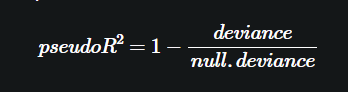
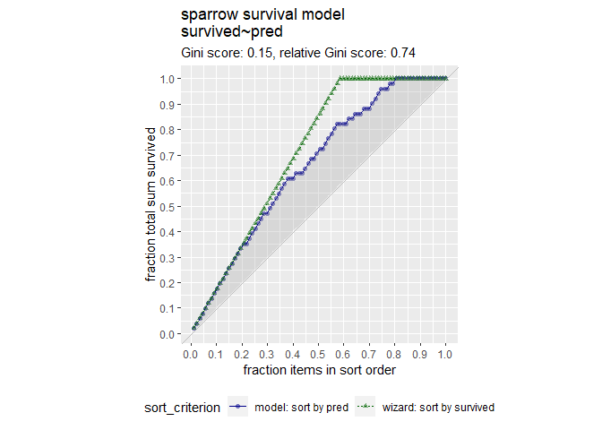
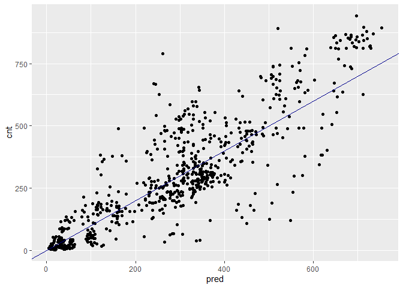
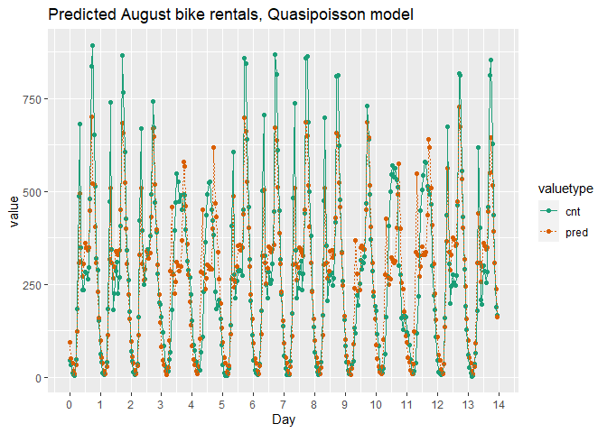
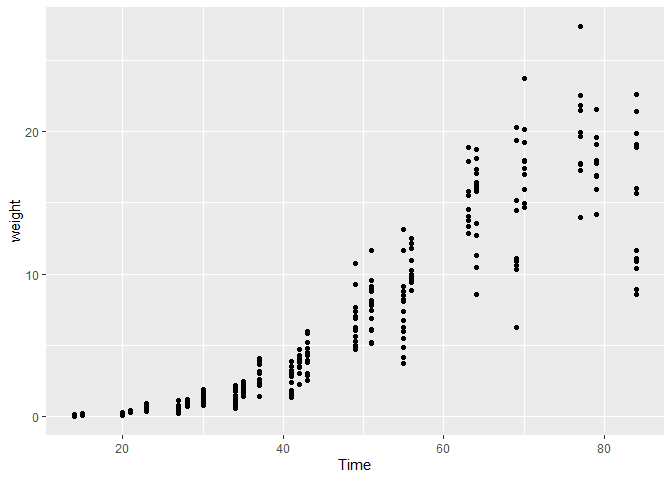
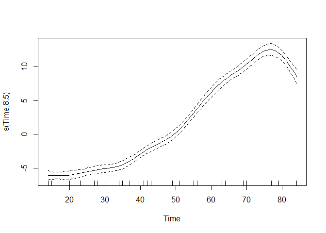
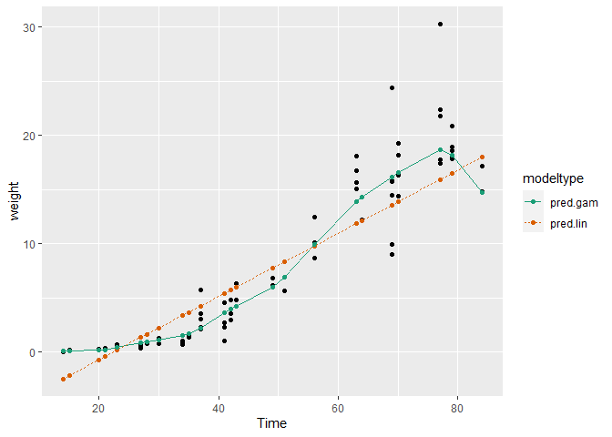

Dealing with Non-Linear Responses
================
Mohamad Osman
2022-07-30

# Section 04: Dealing with Non-Linear Responses

### **`01-Fit a model of sparrow survival probability`**

In this exercise, you will estimate the probability that a sparrow
survives a severe winter storm, based on physical characteristics of the
sparrow. The dataset `sparrow` has been pre-loaded. The outcome to be
predicted is `status` (“Survived”, “Perished”). The variables we will
consider are:

-   `total_length`: length of the bird from tip of beak to tip of tail
    (mm)

-   `weight`: in grams

-   `humerus` : length of humerus (“upper arm bone” that connects the
    wing to the body) (inches)

Remember that when using
[**`glm()`**](https://www.rdocumentation.org/packages/stats/topics/glm)
to create a logistic regression model, you must explicitly specify that
`family = binomial`:

    glm(formula, data = data, family = binomial)

You will call `summary()` and `broom::glance()` to see different
functions for examining a logistic regression model. One of the
diagnostics that you will look at is the analog to R<sup>2</sup> ,
called pseudo- R<sup>2</sup>



You can think of deviance as analogous to variance: it is a measure of
the variation in categorical data. The pseudo-R<sup>2</sup> is analogous
to R<sup>2</sup> for standard regression: R<sup>2</sup> is a measure of
the “variance explained” of a regression model. The pseudo-R<sup>2</sup>
is a measure of the “deviance explained”.

As suggested in the video, you will predict on the outcomes `TRUE` and
`FALSE`. Create a new column `survived` in the `sparrow` data frame that
is TRUE when `status == "Survived"`.

-   Create the formula `fmla` that expresses `survived` as a function of
    the variables of interest. Print it.

-   Fit a logistic regression model to predict the probability of
    sparrow survival. Assign the model to the variable `sparrow_model`.

-   Call `summary()` to see the coefficients of the model, the deviance
    and the null deviance.

-   Call `glance()` on the model to see the deviances and other
    diagnostics in a data frame. Assign the output from `glance()` to
    the variable `perf`.

-   Calculate the pseudo-R2.

``` r
library(readr)
library(dplyr)
```

    ## 
    ## Attaching package: 'dplyr'

    ## The following objects are masked from 'package:stats':
    ## 
    ##     filter, lag

    ## The following objects are masked from 'package:base':
    ## 
    ##     intersect, setdiff, setequal, union

``` r
library(ggplot2)
library(broom)
```

    ## Warning: package 'broom' was built under R version 4.2.1

``` r
file_path <- file.path("..", "00_Datasets", "sparrow.rds")
sparrow <- readRDS(file_path)
head(sparrow)
```

    ##     status   age total_length wingspan weight beak_head humerus femur legbone
    ## 1 Survived adult          154      241   24.5      31.2    0.69  0.67    1.02
    ## 2 Survived adult          160      252   26.9      30.8    0.74  0.71    1.18
    ## 3 Survived adult          155      243   26.9      30.6    0.73  0.70    1.15
    ## 4 Survived adult          154      245   24.3      31.7    0.74  0.69    1.15
    ## 5 Survived adult          156      247   24.1      31.5    0.71  0.71    1.13
    ## 6 Survived adult          161      253   26.5      31.8    0.78  0.74    1.14
    ##   skull sternum
    ## 1  0.59    0.83
    ## 2  0.60    0.84
    ## 3  0.60    0.85
    ## 4  0.58    0.84
    ## 5  0.57    0.82
    ## 6  0.61    0.89

``` r
# sparrow is available
summary(sparrow)
```

    ##       status       age             total_length      wingspan    
    ##  Perished:36   Length:87          Min.   :153.0   Min.   :236.0  
    ##  Survived:51   Class :character   1st Qu.:158.0   1st Qu.:245.0  
    ##                Mode  :character   Median :160.0   Median :247.0  
    ##                                   Mean   :160.4   Mean   :247.5  
    ##                                   3rd Qu.:162.5   3rd Qu.:251.0  
    ##                                   Max.   :167.0   Max.   :256.0  
    ##      weight       beak_head        humerus           femur       
    ##  Min.   :23.2   Min.   :29.80   Min.   :0.6600   Min.   :0.6500  
    ##  1st Qu.:24.7   1st Qu.:31.40   1st Qu.:0.7250   1st Qu.:0.7000  
    ##  Median :25.8   Median :31.70   Median :0.7400   Median :0.7100  
    ##  Mean   :25.8   Mean   :31.64   Mean   :0.7353   Mean   :0.7134  
    ##  3rd Qu.:26.7   3rd Qu.:32.10   3rd Qu.:0.7500   3rd Qu.:0.7300  
    ##  Max.   :31.0   Max.   :33.00   Max.   :0.7800   Max.   :0.7600  
    ##     legbone          skull           sternum      
    ##  Min.   :1.010   Min.   :0.5600   Min.   :0.7700  
    ##  1st Qu.:1.110   1st Qu.:0.5900   1st Qu.:0.8300  
    ##  Median :1.130   Median :0.6000   Median :0.8500  
    ##  Mean   :1.131   Mean   :0.6032   Mean   :0.8511  
    ##  3rd Qu.:1.160   3rd Qu.:0.6100   3rd Qu.:0.8800  
    ##  Max.   :1.230   Max.   :0.6400   Max.   :0.9300

``` r
# Create the survived column
sparrow$survived <- sparrow$status=="Survived"

# Create the formula
(fmla <- as.formula("survived ~ total_length + weight + humerus"))
```

    ## survived ~ total_length + weight + humerus

``` r
# Fit the logistic regression model
sparrow_model <- glm(fmla, data = sparrow, family = binomial)

# Call summary
summary(sparrow_model)
```

    ## 
    ## Call:
    ## glm(formula = fmla, family = binomial, data = sparrow)
    ## 
    ## Deviance Residuals: 
    ##     Min       1Q   Median       3Q      Max  
    ## -2.1117  -0.6026   0.2871   0.6577   1.7082  
    ## 
    ## Coefficients:
    ##              Estimate Std. Error z value Pr(>|z|)    
    ## (Intercept)   46.8813    16.9631   2.764 0.005715 ** 
    ## total_length  -0.5435     0.1409  -3.858 0.000115 ***
    ## weight        -0.5689     0.2771  -2.053 0.040060 *  
    ## humerus       75.4610    19.1586   3.939 8.19e-05 ***
    ## ---
    ## Signif. codes:  0 '***' 0.001 '**' 0.01 '*' 0.05 '.' 0.1 ' ' 1
    ## 
    ## (Dispersion parameter for binomial family taken to be 1)
    ## 
    ##     Null deviance: 118.008  on 86  degrees of freedom
    ## Residual deviance:  75.094  on 83  degrees of freedom
    ## AIC: 83.094
    ## 
    ## Number of Fisher Scoring iterations: 5

``` r
# Call glance
(perf <- glance(sparrow_model))
```

    ## # A tibble: 1 × 8
    ##   null.deviance df.null logLik   AIC   BIC deviance df.residual  nobs
    ##           <dbl>   <int>  <dbl> <dbl> <dbl>    <dbl>       <int> <int>
    ## 1          118.      86  -37.5  83.1  93.0     75.1          83    87

``` r
# Calculate pseudo-R-squared
(pseudoR2 <- 1 - perf$deviance/perf$null.deviance)
```

    ## [1] 0.3636526

### **`02-Predict sparrow survival`**

In this exercise, you will predict the probability of survival using the
sparrow survival model from the previous exercise.

Recall that when calling
[**`predict()`**](https://www.rdocumentation.org/packages/stats/topics/predict.glm)
to get the predicted probabilities from a `glm()` model, you must
specify that you want the response:

    predict(model, type = "response")

Otherwise, `predict()` on a logistic regression model returns the
predicted log-odds of the event, not the probability.

You will also use the
[**`GainCurvePlot()`**](https://www.rdocumentation.org/packages/WVPlots/topics/GainCurvePlot)
function to plot the gain curve from the model predictions. If the
model’s gain curve is close to the ideal (“wizard”) gain curve, then the
model sorted the sparrows well: that is, the model predicted that
sparrows that actually survived would have a higher probability of
survival. The inputs to the `GainCurvePlot()` function are:

-   `frame`: data frame with prediction column and ground truth column

-   `xvar`: the name of the column of predictions (as a string)

-   `truthVar`: the name of the column with actual outcome (as a string)

-   `title`: a title for the plot (as a string)

`GainCurvePlot(frame, xvar, truthVar, title)`

The `sparrow` data frame and the model `sparrow_model` have been
pre-loaded.

``` r
library(WVPlots)
```

    ## Warning: package 'WVPlots' was built under R version 4.2.1

    ## Loading required package: wrapr

    ## Warning: package 'wrapr' was built under R version 4.2.1

    ## 
    ## Attaching package: 'wrapr'

    ## The following object is masked from 'package:dplyr':
    ## 
    ##     coalesce

``` r
# sparrow is available
summary(sparrow)
```

    ##       status       age             total_length      wingspan    
    ##  Perished:36   Length:87          Min.   :153.0   Min.   :236.0  
    ##  Survived:51   Class :character   1st Qu.:158.0   1st Qu.:245.0  
    ##                Mode  :character   Median :160.0   Median :247.0  
    ##                                   Mean   :160.4   Mean   :247.5  
    ##                                   3rd Qu.:162.5   3rd Qu.:251.0  
    ##                                   Max.   :167.0   Max.   :256.0  
    ##      weight       beak_head        humerus           femur       
    ##  Min.   :23.2   Min.   :29.80   Min.   :0.6600   Min.   :0.6500  
    ##  1st Qu.:24.7   1st Qu.:31.40   1st Qu.:0.7250   1st Qu.:0.7000  
    ##  Median :25.8   Median :31.70   Median :0.7400   Median :0.7100  
    ##  Mean   :25.8   Mean   :31.64   Mean   :0.7353   Mean   :0.7134  
    ##  3rd Qu.:26.7   3rd Qu.:32.10   3rd Qu.:0.7500   3rd Qu.:0.7300  
    ##  Max.   :31.0   Max.   :33.00   Max.   :0.7800   Max.   :0.7600  
    ##     legbone          skull           sternum        survived      
    ##  Min.   :1.010   Min.   :0.5600   Min.   :0.7700   Mode :logical  
    ##  1st Qu.:1.110   1st Qu.:0.5900   1st Qu.:0.8300   FALSE:36       
    ##  Median :1.130   Median :0.6000   Median :0.8500   TRUE :51       
    ##  Mean   :1.131   Mean   :0.6032   Mean   :0.8511                  
    ##  3rd Qu.:1.160   3rd Qu.:0.6100   3rd Qu.:0.8800                  
    ##  Max.   :1.230   Max.   :0.6400   Max.   :0.9300

``` r
# sparrow_model is available
summary(sparrow_model)
```

    ## 
    ## Call:
    ## glm(formula = fmla, family = binomial, data = sparrow)
    ## 
    ## Deviance Residuals: 
    ##     Min       1Q   Median       3Q      Max  
    ## -2.1117  -0.6026   0.2871   0.6577   1.7082  
    ## 
    ## Coefficients:
    ##              Estimate Std. Error z value Pr(>|z|)    
    ## (Intercept)   46.8813    16.9631   2.764 0.005715 ** 
    ## total_length  -0.5435     0.1409  -3.858 0.000115 ***
    ## weight        -0.5689     0.2771  -2.053 0.040060 *  
    ## humerus       75.4610    19.1586   3.939 8.19e-05 ***
    ## ---
    ## Signif. codes:  0 '***' 0.001 '**' 0.01 '*' 0.05 '.' 0.1 ' ' 1
    ## 
    ## (Dispersion parameter for binomial family taken to be 1)
    ## 
    ##     Null deviance: 118.008  on 86  degrees of freedom
    ## Residual deviance:  75.094  on 83  degrees of freedom
    ## AIC: 83.094
    ## 
    ## Number of Fisher Scoring iterations: 5

``` r
# Make predictions
sparrow$pred <- predict(sparrow_model, sparrow,type = "response")

# Look at gain curve
GainCurvePlot(sparrow, "pred", "survived", "sparrow survival model")
```

<!-- -->

### 

**`03-Poisson or quasipoisson`**

One of the assumptions of Poisson regression to predict counts is that
the event you are counting is *Poisson distributed*: the average count
per unit time is the same as the variance of the count. In practice,
“the same” means that the mean and the variance should be of a similar
order of magnitude.

When the variance is much larger than the mean, the Poisson assumption
doesn’t apply, and one solution is to use quasipoisson regression, which
does not assume that variance=mean.

For each of the following situations, decide if Poisson regression would
be suitable, or if you should use quasipoisson regression.

For which situations can you use Poisson regression?

1.  Number of days students are absent: mean 5.9, variance 49

2.  Number of awards a student wins: mean 0.6, variance 1.1

3.  Number of hits per website page: mean 108.2, variance 108.5

4.  Number of bikes rented per day: mean 273, variance 45863.84

-   All of them

-   1 and 4

-   2 and 3 ✔️

-   1 and 3

-   2 and 4

Yes! When the mean and variance of event arrivals are reasonably close,
Poisson regression is suitable.

### **`04-Fit a model to predict bike rental counts`**

In this exercise, you will build a model to predict the number of bikes
rented in an hour as a function of the weather, the type of day
(holiday, working day, or weekend), and the time of day. You will train
the model on data from the month of July.

The data frame has the columns:

-   `cnt`: the number of bikes rented in that hour (the outcome)

-   `hr`: the hour of the day (0-23, as a factor)

-   `holiday`: TRUE/FALSE

-   `workingday`: TRUE if neither a holiday nor a weekend, else FALSE

-   `weathersit`: categorical, “Clear to partly cloudy”/“Light
    Precipitation”/“Misty”

-   `temp`: normalized temperature in Celsius

-   `atemp`: normalized “feeling” temperature in Celsius

-   `hum`: normalized humidity

-   `windspeed`: normalized windspeed

-   `instant`: the time index – number of hours since beginning of
    dataset (not a variable)

-   `mnth` and `yr`: month and year indices (not variables)

Remember that you must specify `family = poisson` or
`family = quasipoisson` when using
[**`glm()`**](https://www.rdocumentation.org/packages/stats/topics/glm)
to fit a count model.

Since there are a lot of input variables, for convenience we will
specify the outcome and the inputs in variables, and use
[**`paste()`**](https://www.rdocumentation.org/packages/base/topics/paste)
to assemble a string representing the model formula.

The `bikesJuly` data frame is available to use. The names of the outcome
variable and the input variables have also been loaded as the variables
`outcome` and `vars`, respectively.

-   Fill in the blanks to create the formula `fmla` expressing `cnt` as
    a function of the inputs. Print it.

-   Calculate the mean (`mean()`) and variance (`var()`) of
    `bikesJuly$cnt`.

    -   Should you use poisson or quasipoisson regression?

-   Use `glm()` to fit a model to the `bikesJuly` data: `bike_model`.

-   Use `glance()` to look at the model’s fit statistics. Assign the
    output of `glance()` to the variable `perf`.

-   Calculate the pseudo-R-squared of the model.

``` r
file_path <- file.path("..", "00_Datasets", "Bikes.RData")
bikes <- load(file_path)
bikes
```

    ## [1] "bikesJuly"   "bikesAugust" "bikesJuly"   "bikesAugust"

``` r
# bikesJuly is available
str(bikesJuly)
```

    ## 'data.frame':    744 obs. of  12 variables:
    ##  $ hr        : Factor w/ 24 levels "0","1","2","3",..: 1 2 3 4 5 6 7 8 9 10 ...
    ##  $ holiday   : logi  FALSE FALSE FALSE FALSE FALSE FALSE ...
    ##  $ workingday: logi  FALSE FALSE FALSE FALSE FALSE FALSE ...
    ##  $ weathersit: chr  "Clear to partly cloudy" "Clear to partly cloudy" "Clear to partly cloudy" "Clear to partly cloudy" ...
    ##  $ temp      : num  0.76 0.74 0.72 0.72 0.7 0.68 0.7 0.74 0.78 0.82 ...
    ##  $ atemp     : num  0.727 0.697 0.697 0.712 0.667 ...
    ##  $ hum       : num  0.66 0.7 0.74 0.84 0.79 0.79 0.79 0.7 0.62 0.56 ...
    ##  $ windspeed : num  0 0.1343 0.0896 0.1343 0.194 ...
    ##  $ cnt       : int  149 93 90 33 4 10 27 50 142 219 ...
    ##  $ instant   : int  13004 13005 13006 13007 13008 13009 13010 13011 13012 13013 ...
    ##  $ mnth      : int  7 7 7 7 7 7 7 7 7 7 ...
    ##  $ yr        : int  1 1 1 1 1 1 1 1 1 1 ...

``` r
# The outcome column
outcome <- c("cnt")

# The inputs to use
vars <- c("hr","holiday", "workingday", "weathersit", "temp", "atemp", "hum", "windspeed")

# Create the formula string for bikes rented as a function of the inputs
(fmla <- paste(outcome, "~", paste(vars, collapse = " + ")))
```

    ## [1] "cnt ~ hr + holiday + workingday + weathersit + temp + atemp + hum + windspeed"

``` r
# Calculate the mean and variance of the outcome
(mean_bikes <- mean(bikesJuly$cnt))
```

    ## [1] 273.6653

``` r
(var_bikes <- var(bikesJuly$cnt))
```

    ## [1] 45863.84

``` r
# Fit the model
bike_model <- glm(fmla, data = bikesJuly, family = quasipoisson)

# Call glance
(perf <- glance(bike_model))
```

    ## # A tibble: 1 × 8
    ##   null.deviance df.null logLik   AIC   BIC deviance df.residual  nobs
    ##           <dbl>   <int>  <dbl> <dbl> <dbl>    <dbl>       <int> <int>
    ## 1       133365.     743     NA    NA    NA   28775.         712   744

``` r
# Calculate pseudo-R-squared
(pseudoR2 <- 1 - perf$deviance/perf$null.deviance)
```

    ## [1] 0.7842393

### **`05-Predict bike rentals on new data`**

In this exercise, you will use the model you built in the previous
exercise to make predictions for the month of August. The dataset
`bikesAugust` has the same columns as `bikesJuly`.

Recall that you must specify `type = "response"` with
[**`predict()`**](https://www.rdocumentation.org/packages/stats/topics/predict.glm)
when predicting counts from a `glm` poisson or quasipoisson model.

The model `bike_model` and the `bikesAugust` data frame have been
pre-loaded.

-   Use `predict` to predict the number of bikes per hour on the
    `bikesAugust` data. Assign the predictions to the column
    `bikesAugust$pred`.

-   Fill in the blanks to get the RMSE of the predictions on the August
    data.

-   Fill in the blanks to generate the plot of predictions to actual
    counts.

    -   Do any of the predictions appear negative?

``` r
# bikesAugust is available
str(bikesAugust)
```

    ## 'data.frame':    744 obs. of  12 variables:
    ##  $ hr        : Factor w/ 24 levels "0","1","2","3",..: 1 2 3 4 5 6 7 8 9 10 ...
    ##  $ holiday   : logi  FALSE FALSE FALSE FALSE FALSE FALSE ...
    ##  $ workingday: logi  TRUE TRUE TRUE TRUE TRUE TRUE ...
    ##  $ weathersit: chr  "Clear to partly cloudy" "Clear to partly cloudy" "Clear to partly cloudy" "Clear to partly cloudy" ...
    ##  $ temp      : num  0.68 0.66 0.64 0.64 0.64 0.64 0.64 0.64 0.66 0.68 ...
    ##  $ atemp     : num  0.636 0.606 0.576 0.576 0.591 ...
    ##  $ hum       : num  0.79 0.83 0.83 0.83 0.78 0.78 0.78 0.83 0.78 0.74 ...
    ##  $ windspeed : num  0.1642 0.0896 0.1045 0.1045 0.1343 ...
    ##  $ cnt       : int  47 33 13 7 4 49 185 487 681 350 ...
    ##  $ instant   : int  13748 13749 13750 13751 13752 13753 13754 13755 13756 13757 ...
    ##  $ mnth      : int  8 8 8 8 8 8 8 8 8 8 ...
    ##  $ yr        : int  1 1 1 1 1 1 1 1 1 1 ...

``` r
# bike_model is available
summary(bike_model)
```

    ## 
    ## Call:
    ## glm(formula = fmla, family = quasipoisson, data = bikesJuly)
    ## 
    ## Deviance Residuals: 
    ##      Min        1Q    Median        3Q       Max  
    ## -21.6117   -4.3121   -0.7223    3.5507   16.5079  
    ## 
    ## Coefficients:
    ##                                Estimate Std. Error t value Pr(>|t|)    
    ## (Intercept)                    5.934986   0.439027  13.519  < 2e-16 ***
    ## hr1                           -0.580055   0.193354  -3.000 0.002794 ** 
    ## hr2                           -0.892314   0.215452  -4.142 3.86e-05 ***
    ## hr3                           -1.662342   0.290658  -5.719 1.58e-08 ***
    ## hr4                           -2.350204   0.393560  -5.972 3.71e-09 ***
    ## hr5                           -1.084289   0.230130  -4.712 2.96e-06 ***
    ## hr6                            0.211945   0.156476   1.354 0.176012    
    ## hr7                            1.211135   0.132332   9.152  < 2e-16 ***
    ## hr8                            1.648361   0.127177  12.961  < 2e-16 ***
    ## hr9                            1.155669   0.133927   8.629  < 2e-16 ***
    ## hr10                           0.993913   0.137096   7.250 1.09e-12 ***
    ## hr11                           1.116547   0.136300   8.192 1.19e-15 ***
    ## hr12                           1.282685   0.134769   9.518  < 2e-16 ***
    ## hr13                           1.273010   0.135872   9.369  < 2e-16 ***
    ## hr14                           1.237721   0.136386   9.075  < 2e-16 ***
    ## hr15                           1.260647   0.136144   9.260  < 2e-16 ***
    ## hr16                           1.515893   0.132727  11.421  < 2e-16 ***
    ## hr17                           1.948404   0.128080  15.212  < 2e-16 ***
    ## hr18                           1.893915   0.127812  14.818  < 2e-16 ***
    ## hr19                           1.669277   0.128471  12.993  < 2e-16 ***
    ## hr20                           1.420732   0.131004  10.845  < 2e-16 ***
    ## hr21                           1.146763   0.134042   8.555  < 2e-16 ***
    ## hr22                           0.856182   0.138982   6.160 1.21e-09 ***
    ## hr23                           0.479197   0.148051   3.237 0.001265 ** 
    ## holidayTRUE                    0.201598   0.079039   2.551 0.010961 *  
    ## workingdayTRUE                 0.116798   0.033510   3.485 0.000521 ***
    ## weathersitLight Precipitation -0.214801   0.072699  -2.955 0.003233 ** 
    ## weathersitMisty               -0.010757   0.038600  -0.279 0.780572    
    ## temp                          -3.246001   1.148270  -2.827 0.004833 ** 
    ## atemp                          2.042314   0.953772   2.141 0.032589 *  
    ## hum                           -0.748557   0.236015  -3.172 0.001581 ** 
    ## windspeed                      0.003277   0.148814   0.022 0.982439    
    ## ---
    ## Signif. codes:  0 '***' 0.001 '**' 0.01 '*' 0.05 '.' 0.1 ' ' 1
    ## 
    ## (Dispersion parameter for quasipoisson family taken to be 38.98949)
    ## 
    ##     Null deviance: 133365  on 743  degrees of freedom
    ## Residual deviance:  28775  on 712  degrees of freedom
    ## AIC: NA
    ## 
    ## Number of Fisher Scoring iterations: 5

``` r
# Make predictions on August data
bikesAugust$pred  <- predict(bike_model, newdata = bikesAugust, type = "response")

# Calculate the RMSE
bikesAugust %>% 
  mutate(residual = pred - cnt) %>%
  summarize(rmse  = sqrt(mean(residual ^ 2)))
```

    ##       rmse
    ## 1 112.5815

``` r
# Plot predictions vs cnt (pred on x-axis)
ggplot(bikesAugust, aes(x = pred, y = cnt)) +
  geom_point() + 
  geom_abline(color = "darkblue")
```

<!-- -->

### 06-**Visualize the bike rental predictions**

In the previous exercise, you visualized the bike model’s predictions
using the standard “outcome vs. prediction” scatter plot. Since the bike
rental data is time series data, you might be interested in how the
model performs as a function of time. In this exercise, you will compare
the predictions and actual rentals on an hourly basis, for the first 14
days of August.

To create the plot you will use the function
[**`tidyr::gather()`**](https://www.rdocumentation.org/packages/tidyr/topics/gather)
to consolidate the predicted and actual values from `bikesAugust` in a
single column. `gather()` takes as arguments:

-   The “wide” data frame to be gathered (implicit in a pipe)

-   The name of the key column to be created - contains the names of the
    gathered columns.

-   The name of the value column to be created - contains the values of
    the gathered columns.

-   The names of the columns to be gathered into a single column.

You’ll use the gathered data frame to compare the actual and predicted
rental counts as a function of time. The time index, `instant` counts
the number of observations since the beginning of data collection. The
sample code converts the instants to daily units, starting from 0.

The `bikesAugust` data frame, with the predictions (`bikesAugust$pred`),
has been pre-loaded.

-   Fill in the blanks to plot the predictions and actual counts by hour
    for the first 14 days of August.

    -   convert `instant` to be in day units, rather than hour

    -   `gather()` the `cnt` and `pred` columns into a column called
        `value`, with a key called `valuetype`.

    -   `filter()` for the first two weeks of August

    -   Plot `value` as a function of `instant` (day).

Does the model see the general time patterns in bike rentals?

``` r
library(tidyr)
```

    ## Warning: package 'tidyr' was built under R version 4.2.1

    ## 
    ## Attaching package: 'tidyr'

    ## The following objects are masked from 'package:wrapr':
    ## 
    ##     pack, unpack

``` r
# Plot predictions and cnt by date/time
quasipoisson_plot<-bikesAugust %>% 
  # set start to 0, convert unit to days
  mutate(instant = (instant - min(instant))/24) %>%  
  # gather cnt and pred into a value column
  gather(key = valuetype, value = value, cnt, pred) %>%
  filter(instant < 14) %>% # restric to first 14 days
  # plot value by instant
  ggplot(aes(x = instant, y = value, color = valuetype, linetype = valuetype)) + 
  geom_point() + 
  geom_line() + 
  scale_x_continuous("Day", breaks = 0:14, labels = 0:14) + 
  scale_color_brewer(palette = "Dark2") + 
  ggtitle("Predicted August bike rentals, Quasipoisson model")
quasipoisson_plot
```

<!-- -->

### **`07-Writing formulas for GAM models`**

When using
[**`gam()`**](https://www.rdocumentation.org/packages/mgcv/topics/gam)
to model outcome as an additive function of the inputs, you can use the
[**`s()`**](https://www.rdocumentation.org/packages/mgcv/topics/s)
function inside formulas to designate that you want to use a spline to
model the non-linear relationship of a continuous variable to the
outcome.

Suppose that you want to predict how much weight (`Wtloss`) a dieter
will lose over a 2-year diet plan as a function of:

-   `Diet` type (categorical)

-   `Sex` (categorical)

-   `Age` at beginning of diet (continuous)

-   `BMI` (body mass index) at beginning of diet (continuous)

You do not want to assume that any of the relationships are linear.

Which is the most appropriate formula?

-   `Wtloss ~ Diet + Sex + Age + BMI`

-   `Wtloss ~ s(Diet) + s(Sex) + s(Age) + s(BMI)`

-   `Wtloss ~ Diet + Sex + s(Age) + s(BMI)`✔️

Yes! This formula says that Age and BMI will both be modeled
non-linearly.

### 

**`08-Writing formulas for GAM models (2)`**

Suppose that in the diet problem from the previous exercise, you now
also want to take into account

-   the dieter’s resting metabolic rate (`BMR` – continuous) and

-   the dieter’s average number hours of aerobic exercise per day (`E` –
    continuous) at the beginning of the study.

You have reason to believe that the relationship between BMR and weight
loss is linear (and you want to model it that way), but not necessarily
the relationship between aerobic exercise and weight loss.

Which is the most appropriate formula?

-   `Wtloss ~ Diet + Sex + s(Age) + s(BMI) + s(BMR) + s(E)`

-   `Wtloss ~ Diet + Sex + s(Age) + s(BMI) + BMR + s(E)`✔️

-   `Wtloss ~ Diet + Sex + s(Age) + s(BMI) + s(BMR) + E`

Yes! This formula says to model Age, BMI and E as non-linear, but model
BMR as linear.

### **`09-Model soybean growth with GAM`**

In this exercise, you will model the average leaf weight on a soybean
plant as a function of time (after planting). As you will see, the
soybean plant doesn’t grow at a steady rate, but rather has a “growth
spurt” that eventually tapers off. Hence, leaf weight is not well
described by a linear model.

Recall that you can designate which variable you want to model
non-linearly in a formula with the
[**`s()`**](https://www.rdocumentation.org/packages/mgcv/topics/s)
function:

    y ~ s(x)

Also remember that
[**`gam()`**](https://www.rdocumentation.org/packages/mgcv/topics/gam)
from the package `mgcv` has the calling interface

    gam(formula, family, data)

For standard regression, use `family = gaussian` (the default).

The soybean training data, `soybean_train` has been pre-loaded. It has
two columns: the outcome `weight` and the variable `Time`. For
comparison, the linear model `model.lin`, which was fit using the
formula `weight ~ Time` has already been loaded as well.

Fill in the blanks to plot `weight` versus `Time` (`Time` on x-axis).
*Does the relationship look linear?*

``` r
file_path <- file.path("..", "00_Datasets", "Soybean.RData")
Soybean <- load(file_path)
Soybean
```

    ## [1] "soybean_train" "soybean_test"

-   Fill in the blanks to plot `weight` versus `Time` (`Time` on
    x-axis). *Does the relationship look linear?*

``` r
# soybean_train is available
summary(soybean_train)
```

    ##       Plot     Variety   Year          Time           weight       
    ##  1988F6 : 10   F:161   1988:124   Min.   :14.00   Min.   : 0.0290  
    ##  1988F7 :  9   P:169   1989:102   1st Qu.:27.00   1st Qu.: 0.6663  
    ##  1988P1 :  9           1990:104   Median :42.00   Median : 3.5233  
    ##  1988P8 :  9                      Mean   :43.56   Mean   : 6.1645  
    ##  1988P2 :  9                      3rd Qu.:56.00   3rd Qu.:10.3808  
    ##  1988F3 :  8                      Max.   :84.00   Max.   :27.3700  
    ##  (Other):276

``` r
# Plot weight vs Time (Time on x axis)
ggplot(soybean_train, aes(x = Time, y = weight)) + 
  geom_point() 
```

<!-- -->

-   Load the package `mgcv`.

-   Create the formula `fmla.gam` to express `weight` as a non-linear
    function of `Time`. Print it.

-   Fit a generalized additive model on `soybean_train` using
    `fmla.gam`.

``` r
# Load the package mgcv
library(mgcv)
```

    ## Loading required package: nlme

    ## 
    ## Attaching package: 'nlme'

    ## The following object is masked _by_ '.GlobalEnv':
    ## 
    ##     Soybean

    ## The following object is masked from 'package:dplyr':
    ## 
    ##     collapse

    ## This is mgcv 1.8-40. For overview type 'help("mgcv-package")'.

    ## 
    ## Attaching package: 'mgcv'

    ## The following object is masked from 'package:wrapr':
    ## 
    ##     %.%

``` r
# Create the formula 
(fmla.gam <- as.formula("weight ~ s(Time)" ))
```

    ## weight ~ s(Time)

``` r
# Fit the GAM Model
model.gam <- gam(
   fmla.gam,
   data = soybean_train,
   family = gaussian
)
```

-   Call `summary()` on the linear model `model.lin`. *What is the R2?*

-   Call `summary()` on `'model.gam`. *The “deviance explained” reports
    the model’s unadjusted R2. What is the R2? Which model appears to be
    a better fit to the training data?*

-   Call `plot()` on `model.gam` to see the derived relationship between
    `Time` and `weight`.

``` r
# From previous step
library(mgcv)

fmla.lin <- weight ~ Time
model.lin <- lm(formula = fmla.lin, data = soybean_train)


fmla.gam <- weight ~ s(Time)
model.gam <- gam(fmla.gam, data = soybean_train, family = gaussian)
# Call summary() on model.lin and look for R-squared
summary(model.lin)
```

    ## 
    ## Call:
    ## lm(formula = fmla.lin, data = soybean_train)
    ## 
    ## Residuals:
    ##     Min      1Q  Median      3Q     Max 
    ## -9.3933 -1.7100 -0.3909  1.9056 11.4381 
    ## 
    ## Coefficients:
    ##              Estimate Std. Error t value Pr(>|t|)    
    ## (Intercept) -6.559283   0.358527  -18.30   <2e-16 ***
    ## Time         0.292094   0.007444   39.24   <2e-16 ***
    ## ---
    ## Signif. codes:  0 '***' 0.001 '**' 0.01 '*' 0.05 '.' 0.1 ' ' 1
    ## 
    ## Residual standard error: 2.778 on 328 degrees of freedom
    ## Multiple R-squared:  0.8244, Adjusted R-squared:  0.8238 
    ## F-statistic:  1540 on 1 and 328 DF,  p-value: < 2.2e-16

``` r
# Call summary() on model.gam and look for R-squared
summary(model.gam)
```

    ## 
    ## Family: gaussian 
    ## Link function: identity 
    ## 
    ## Formula:
    ## weight ~ s(Time)
    ## 
    ## Parametric coefficients:
    ##             Estimate Std. Error t value Pr(>|t|)    
    ## (Intercept)   6.1645     0.1143   53.93   <2e-16 ***
    ## ---
    ## Signif. codes:  0 '***' 0.001 '**' 0.01 '*' 0.05 '.' 0.1 ' ' 1
    ## 
    ## Approximate significance of smooth terms:
    ##           edf Ref.df     F p-value    
    ## s(Time) 8.495   8.93 338.2  <2e-16 ***
    ## ---
    ## Signif. codes:  0 '***' 0.001 '**' 0.01 '*' 0.05 '.' 0.1 ' ' 1
    ## 
    ## R-sq.(adj) =  0.902   Deviance explained = 90.4%
    ## GCV = 4.4395  Scale est. = 4.3117    n = 330

``` r
# Call plot() on model.gam
plot(model.gam)
```

<!-- -->

### **`10-Predict with the soybean model on test data`**

In this exercise, you will apply the soybean models from the previous
exercise (`model.lin` and `model.gam`, already loaded) to new data:
`soybean_test`.

-   Create a column `soybean_test$pred.lin` with predictions from the
    linear model `model.lin`.

-   Create a column `soybean_test$pred.gam` with predictions from the
    gam model `model.gam`.

    -   For GAM models, the
        [**`predict()`**](https://www.rdocumentation.org/packages/mgcv/topics/predict.gam)
        method returns a matrix, so use `as.numeric()` to convert the
        matrix to a vector.

-   Fill in the blanks to
    [**`gather()`**](https://www.rdocumentation.org/packages/tidyr/topics/gather)
    the prediction columns into a single value column `pred` with key
    column `modeltype`. Call the long data frame `soybean_long`.

-   Calculate and compare the RMSE of both models.

    -   Which model does better?

-   Run the code to compare the predictions of each model against the
    actual average leaf weights.

    -   A scatter plot of `weight` as a function of `Time`.

    -   Point-and-line plots of the predictions (`pred`) as a function
        of `Time`.

    -   Notice that the linear model sometimes predicts negative
        weights! Does the gam model?

``` r
# soybean_test is available
summary(soybean_test)
```

    ##       Plot    Variety   Year         Time           weight       
    ##  1988F8 : 4   F:43    1988:32   Min.   :14.00   Min.   : 0.0380  
    ##  1988P7 : 4   P:39    1989:26   1st Qu.:23.00   1st Qu.: 0.4248  
    ##  1989F8 : 4           1990:24   Median :41.00   Median : 3.0025  
    ##  1990F8 : 4                     Mean   :44.09   Mean   : 7.1576  
    ##  1988F4 : 3                     3rd Qu.:69.00   3rd Qu.:15.0113  
    ##  1988F2 : 3                     Max.   :84.00   Max.   :30.2717  
    ##  (Other):60

``` r
# Get predictions from linear model
soybean_test$pred.lin <- predict(model.lin, newdata = soybean_test)

# Get predictions from gam model
soybean_test$pred.gam <- as.numeric(predict(model.gam, newdata = soybean_test))

# Gather the predictions into a "long" dataset
soybean_long <- soybean_test %>%
  gather(key = modeltype, value = pred, pred.lin, pred.gam)

# Calculate the rmse
soybean_long %>%
  mutate(residual = weight - pred) %>%     # residuals
  group_by(modeltype) %>%                  # group by modeltype
  summarize(rmse = sqrt(mean(residual^2))) # calculate the RMSE
```

    ## # A tibble: 2 × 2
    ##   modeltype  rmse
    ##   <chr>     <dbl>
    ## 1 pred.gam   2.29
    ## 2 pred.lin   3.19

``` r
# Compare the predictions against actual weights on the test data
soybean_long %>%
  ggplot(aes(x = Time)) +                          # the column for the x axis
  geom_point(aes(y = weight)) +                    # the y-column for the scatterplot
  geom_point(aes(y = pred, color = modeltype)) +   # the y-column for the point-and-line plot
  geom_line(aes(y = pred, color = modeltype, linetype = modeltype)) + # the y-column for the point-and-line plot
  scale_color_brewer(palette = "Dark2")
```

<!-- -->

### 

**`The End`**
