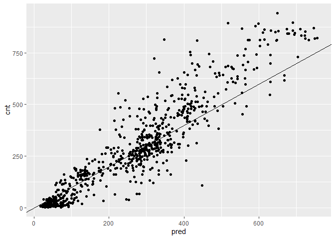
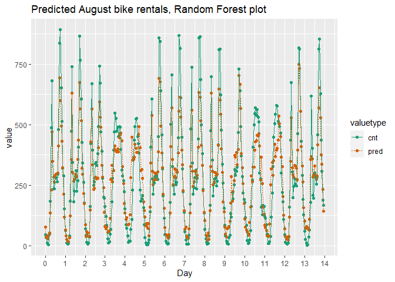
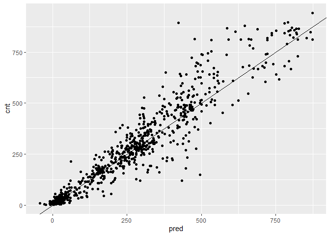
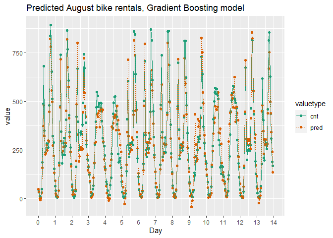

Tree-Based Methods
================
Mohamad Osman
2022-08-03

# Section 05: **Tree-Based Methods**

``` r
library(dplyr)
library(ggplot2)
library(tidyr)
library(magrittr)

file <- file.path("..", "00_Datasets", "Bikes.RData")
(load(file))
```

    ## [1] "bikesJuly"   "bikesAugust" "bikesJuly"   "bikesAugust"

### **`01-Predicting with a decision tree`**

<figure>

<figcaption>decision tree</figcaption>
</figure>

Here you see the decision tree learned from the brain dataset shown in
the previous video. The tree predicts the expected intelligence (humans
have an intelligence of 1) of several mammals, as a function of
*gestation time* (in days) and average *litter size* for that species.

The leaf nodes show the expected brain size for the datums in that node,
as well as how many (percentage-wise) of the datums fall into the node.

You want to predict the intelligence of a gorilla, which has a gestation
time of 265 days and an average litter size of 1.

What relative brain size does this tree model predict?

-   0.073

-   0.131

-   0.148 ✅

-   0.161

-   0.274

-   0.315

Yes! But as you see this tree can predict only 6 values. For the rest of
this chapter we will use tree ensembles to predict at a finer
granularity.

### **`02-Build a random forest model for bike rentals`**

In this exercise, you will again build a model to predict the number of
bikes rented in an hour as a function of the weather, the type of day
(holiday, working day, or weekend), and the time of day. You will train
the model on data from the month of July.

You will use the `ranger` package to fit the random forest model. For
this exercise, the key arguments to the
[**`ranger()`**](https://www.rdocumentation.org/packages/ranger/topics/ranger)
call are:

-   `formula`

-   `data`

-   `num.trees`: the number of trees in the forest.

-   `respect.unordered.factors` : Specifies how to treat unordered
    factor variables. We recommend setting this to “order” for
    regression.

-   `seed`: because this is a random algorithm, you will set the seed to
    get reproducible results

Since there are a lot of input variables, for convenience we will
specify the outcome and the inputs in the variables `outcome` and
`vars`, and use
[**`paste()`**](https://www.rdocumentation.org/packages/base/topics/paste)
to assemble a string representing the model formula.

The data frame `bikesJuly` has been pre-loaded. The sample code
specifies the names of the outcome and input variables.

-   Fill in the blanks to create the formula `fmla` expressing `cnt` as
    a function of the inputs. Print it.

-   Load the package `ranger`.

-   Use `ranger` to fit a model to the `bikesJuly` data:
    `bike_model_rf`.

    -   The first argument to `ranger()` is the formula, `fmla`.

    -   Use 500 trees and `respect.unordered.factors = "order"`.

    -   Set the seed to `seed` for reproducible results.

    -   Print the model. What is the R-squared?

``` r
# bikesJuly is available
str(bikesJuly)
```

    ## 'data.frame':    744 obs. of  12 variables:
    ##  $ hr        : Factor w/ 24 levels "0","1","2","3",..: 1 2 3 4 5 6 7 8 9 10 ...
    ##  $ holiday   : logi  FALSE FALSE FALSE FALSE FALSE FALSE ...
    ##  $ workingday: logi  FALSE FALSE FALSE FALSE FALSE FALSE ...
    ##  $ weathersit: chr  "Clear to partly cloudy" "Clear to partly cloudy" "Clear to partly cloudy" "Clear to partly cloudy" ...
    ##  $ temp      : num  0.76 0.74 0.72 0.72 0.7 0.68 0.7 0.74 0.78 0.82 ...
    ##  $ atemp     : num  0.727 0.697 0.697 0.712 0.667 ...
    ##  $ hum       : num  0.66 0.7 0.74 0.84 0.79 0.79 0.79 0.7 0.62 0.56 ...
    ##  $ windspeed : num  0 0.1343 0.0896 0.1343 0.194 ...
    ##  $ cnt       : int  149 93 90 33 4 10 27 50 142 219 ...
    ##  $ instant   : int  13004 13005 13006 13007 13008 13009 13010 13011 13012 13013 ...
    ##  $ mnth      : int  7 7 7 7 7 7 7 7 7 7 ...
    ##  $ yr        : int  1 1 1 1 1 1 1 1 1 1 ...

``` r
# Random seed to reproduce results
seed <- 423563

# The outcome column
(outcome <- "cnt")
```

    ## [1] "cnt"

``` r
# The input variables
(vars <- c("hr", "holiday", "workingday", "weathersit", "temp", "atemp", "hum", "windspeed"))
```

    ## [1] "hr"         "holiday"    "workingday" "weathersit" "temp"      
    ## [6] "atemp"      "hum"        "windspeed"

``` r
# Create the formula string for bikes rented as a function of the inputs
(fmla <- paste(outcome, "~", paste(vars, collapse = " + ")))
```

    ## [1] "cnt ~ hr + holiday + workingday + weathersit + temp + atemp + hum + windspeed"

``` r
# Load the package ranger
library(ranger)
```

    ## Warning: package 'ranger' was built under R version 4.2.1

``` r
# Fit and print the random forest model
(bike_model_rf <- ranger(fmla, # formula 
                         bikesJuly, # data
                         num.trees = 500, 
                         respect.unordered.factors = "order", 
                         seed = seed))
```

    ## Ranger result
    ## 
    ## Call:
    ##  ranger(fmla, bikesJuly, num.trees = 500, respect.unordered.factors = "order",      seed = seed) 
    ## 
    ## Type:                             Regression 
    ## Number of trees:                  500 
    ## Sample size:                      744 
    ## Number of independent variables:  8 
    ## Mtry:                             2 
    ## Target node size:                 5 
    ## Variable importance mode:         none 
    ## Splitrule:                        variance 
    ## OOB prediction error (MSE):       8230.568 
    ## R squared (OOB):                  0.8205434

R squared (OOB): `0.8205434`✅

### **`03-Predict bike rentals with the random forest model`**

In this exercise, you will use the model that you fit in the previous
exercise to predict bike rentals for the month of August.

The
[**`predict()`**](https://www.rdocumentation.org/packages/ranger/topics/predict.ranger)
function for a `ranger` model produces a list. One of the elements of
this list is `predictions`, a vector of predicted values. You can access
`predictions` with the `$` notation for accessing named elements of a
list:

`predict(model, data)$predictions`

The model `bike_model_rf` and the dataset `bikesAugust` (for evaluation)
have been pre-loaded

-   Call
    [**`predict()`**](https://www.rdocumentation.org/packages/ranger/topics/predict.ranger)
    on `bikesAugust` to predict the number of bikes rented in August
    (`cnt`). Add the predictions to `bikesAugust` as the column `pred`.

-   Fill in the blanks to calculate the root mean squared error of the
    predictions.

    -   The poisson model you built for this data gave an RMSE of about
        112.6. How does this model compare?

-   Fill in the blanks to plot actual bike rental counts (`cnt`) versus
    the predictions (`pred` on x-axis).

``` r
# bikesAugust is available
str(bikesAugust)
```

    ## 'data.frame':    744 obs. of  12 variables:
    ##  $ hr        : Factor w/ 24 levels "0","1","2","3",..: 1 2 3 4 5 6 7 8 9 10 ...
    ##  $ holiday   : logi  FALSE FALSE FALSE FALSE FALSE FALSE ...
    ##  $ workingday: logi  TRUE TRUE TRUE TRUE TRUE TRUE ...
    ##  $ weathersit: chr  "Clear to partly cloudy" "Clear to partly cloudy" "Clear to partly cloudy" "Clear to partly cloudy" ...
    ##  $ temp      : num  0.68 0.66 0.64 0.64 0.64 0.64 0.64 0.64 0.66 0.68 ...
    ##  $ atemp     : num  0.636 0.606 0.576 0.576 0.591 ...
    ##  $ hum       : num  0.79 0.83 0.83 0.83 0.78 0.78 0.78 0.83 0.78 0.74 ...
    ##  $ windspeed : num  0.1642 0.0896 0.1045 0.1045 0.1343 ...
    ##  $ cnt       : int  47 33 13 7 4 49 185 487 681 350 ...
    ##  $ instant   : int  13748 13749 13750 13751 13752 13753 13754 13755 13756 13757 ...
    ##  $ mnth      : int  8 8 8 8 8 8 8 8 8 8 ...
    ##  $ yr        : int  1 1 1 1 1 1 1 1 1 1 ...

``` r
# bike_model_rf is available
bike_model_rf
```

    ## Ranger result
    ## 
    ## Call:
    ##  ranger(fmla, bikesJuly, num.trees = 500, respect.unordered.factors = "order",      seed = seed) 
    ## 
    ## Type:                             Regression 
    ## Number of trees:                  500 
    ## Sample size:                      744 
    ## Number of independent variables:  8 
    ## Mtry:                             2 
    ## Target node size:                 5 
    ## Variable importance mode:         none 
    ## Splitrule:                        variance 
    ## OOB prediction error (MSE):       8230.568 
    ## R squared (OOB):                  0.8205434

``` r
# Make predictions on the August data
bikesAugust$pred <- predict(bike_model_rf, bikesAugust)$predictions

# Calculate the RMSE of the predictions
bikesAugust %>% 
  mutate(residual = pred - cnt)  %>% # calculate the residual
  summarize(rmse  = sqrt(mean(residual ^ 2)))      # calculate rmse
```

    ##       rmse
    ## 1 97.18347

``` r
# Plot actual outcome vs predictions (predictions on x-axis)
ggplot(bikesAugust, aes(x = pred, y = cnt)) + 
  geom_point() + 
  geom_abline()
```

<!-- -->

-   RMSE of poisson model \~= 112.6

-   RMSE of Random Forest \~= 97.2

Good job! This random forest model outperforms the poisson count model
on the same data; it is discovering more complex non-linear or
non-additive relationships in the data.

### **`04-Visualize random forest bike model predictions`**

In the previous exercise, you saw that the random forest bike model did
better on the August data than the quasiposson model, in terms of RMSE.

In this exercise, you will visualize the random forest model’s August
predictions as a function of time. The corresponding plot from the
quasipoisson model that you built in a previous exercise is available
for you to compare.

Recall that the quasipoisson model mostly identified the pattern of slow
and busy hours in the day, but it somewhat underestimated peak demands.
You would like to see how the random forest model compares.

The data frame `bikesAugust` (with predictions) has been made available
for you. The plot `quasipoisson_plot` of quasipoisson model predictions
as a function of time is shown.

-   Fill in the blanks to plot the predictions and actual counts by hour
    for the first 14 days of August.

    -   [**`gather`**](https://www.rdocumentation.org/packages/tidyr/topics/gather)
        the `cnt` and `pred` columns into a column called `value`, with
        a key called `valuetype`.

    -   Plot `value` as a function of `instant` (day).

*How does the random forest model compare?*

``` r
first_two_weeks <- bikesAugust %>% 
  # Set start to 0, convert unit to days
  mutate(instant = (instant - min(instant)) / 24) %>% 
  # Gather cnt and pred into a column named value with key valuetype
  gather(key = valuetype, value = value, cnt, pred) %>%
  # Filter for rows in the first two
  filter(instant < 14) 

# Plot predictions and cnt by date/time 
randomforest_plot <- ggplot(first_two_weeks, aes(x = instant, y = value, color = valuetype, linetype = valuetype)) + 
  geom_point() + 
  geom_line() + 
  scale_x_continuous("Day", breaks = 0:14, labels = 0:14) + 
  scale_color_brewer(palette = "Dark2") + 
  ggtitle("Predicted August bike rentals, Random Forest plot")

randomforest_plot
```

<!-- -->

### **`05-vtreat on a small example`**

In this exercise, you will use `vtreat` to one-hot-encode a categorical
variable on a small example. `vtreat` creates a *treatment plan* to
transform categorical variables into indicator variables (coded
`"lev"`), and to clean bad values out of numerical variables (coded
`"clean"`).

To design a treatment plan use the function
[**`designTreatmentsZ()`**](https://www.rdocumentation.org/packages/vtreat/topics/designTreatmentsZ)

    treatplan <- designTreatmentsZ(data, varlist)

-   `data`: the original training data frame

-   `varlist`: a vector of input variables to be treated (as strings).

`designTreatmentsZ()` returns a list with an element `scoreFrame`: a
data frame that includes the names and types of the new variables:

    scoreFrame <- treatplan %>% 
                magrittr::use_series(scoreFrame) %>% 
                select(varName, origName, code)

-   `varName`: the name of the new treated variable

-   `origName`: the name of the original variable that the treated
    variable comes from

-   `code`: the type of the new variable.

    -   `"clean"`: a numerical variable with no NAs or NaNs

    -   `"lev"`: an indicator variable for a specific level of the
        original categorical variable.

([**`magrittr::use_series()`**](https://www.rdocumentation.org/packages/magrittr/topics/extract)
is an alias for `$` that you can use in pipes.)

For these exercises, we want `varName` where `code` is either `"clean"`
or `"lev"`:

    newvarlist <- scoreFrame %>% 
                 filter(code %in% c("clean", "lev") %>%
                 magrittr::use_series(varName)

To transform the dataset into all numerical and one-hot-encoded
variables, use
[**`prepare()`**](https://www.rdocumentation.org/packages/vtreat/topics/prepare):

    data.treat <- prepare(treatplan, data, varRestrictions = newvarlist)

-   `treatplan`: the treatment plan

-   `data`: the data frame to be treated

-   `varRestrictions`: the variables desired in the treated data

The `dframe` data frame and the `magrittr` package have been pre-loaded.

-   Print `dframe`. We will assume that `color` and `size` are input
    variables, and `popularity` is the outcome to be predicted.

-   Create a vector called `vars` with the names of the input variables
    (as strings).

-   Load the package `vtreat`.

-   Use `designTreatmentsZ()` to create a treatment plan for the
    variables in `vars`. Assign it to the variable `treatplan`.

-   Get and examine the `scoreFrame` from the treatment plan to see the
    mapping from old variables to new variables.

    -   You only need the columns `varName`, `origName` and `code`.

    -   What are the names of the new indicator variables? Of the
        continuous variable?

-   Create a vector `newvars` that contains the variable `varName` where
    `code` is either `clean` or `lev`. Print it.

-   Use `prepare()` to create a new data frame `dframe.treat` that is a
    one-hot-encoded version of `dframe` (without the outcome column).

    -   Print it and compare to `dframe`.

``` r
dframe_path <- file.path("..", "00_Datasets", "dframe_vtreat.txt")
dframe <- read.delim(dframe_path)
```

``` r
# Print dframe
dframe
```

    ##    color size popularity
    ## 1      r   11  1.3956245
    ## 2      b   15  0.9217988
    ## 3      g   14  1.2025453
    ## 4      b   13  1.0838662
    ## 5      r   11  0.8043527
    ## 6      r    9  1.1035440
    ## 7      g   12  0.8746332
    ## 8      b    7  0.6947058
    ## 9      g   12  0.8832502
    ## 10     g   11  1.0201361

``` r
# Create and print a vector of variable names
(vars <- c("color", "size"))
```

    ## [1] "color" "size"

``` r
# Load the package vtreat
library(vtreat)
```

    ## Warning: package 'vtreat' was built under R version 4.2.1

    ## Loading required package: wrapr

    ## Warning: package 'wrapr' was built under R version 4.2.1

    ## 
    ## Attaching package: 'wrapr'

    ## The following objects are masked from 'package:tidyr':
    ## 
    ##     pack, unpack

    ## The following object is masked from 'package:dplyr':
    ## 
    ##     coalesce

``` r
# Create the treatment plan
treatplan <- designTreatmentsZ(dframe, vars, verbose =FALSE)

# Examine the scoreFrame
(scoreFrame <- treatplan %>%
    use_series(scoreFrame) %>%
    select(varName, origName, code))
```

    ##         varName origName  code
    ## 1    color_catP    color  catP
    ## 2          size     size clean
    ## 3 color_lev_x_b    color   lev
    ## 4 color_lev_x_g    color   lev
    ## 5 color_lev_x_r    color   lev

``` r
# We only want the rows with codes "clean" or "lev"
(newvars <- scoreFrame %>%
    filter(code %in% c("clean", "lev")) %>%
    use_series(varName))
```

    ## [1] "size"          "color_lev_x_b" "color_lev_x_g" "color_lev_x_r"

``` r
# Create the treated training data
(dframe.treat <- prepare(treatplan, dframe, varRestriction = newvars))
```

    ##    size color_lev_x_b color_lev_x_g color_lev_x_r
    ## 1    11             0             0             1
    ## 2    15             1             0             0
    ## 3    14             0             1             0
    ## 4    13             1             0             0
    ## 5    11             0             0             1
    ## 6     9             0             0             1
    ## 7    12             0             1             0
    ## 8     7             1             0             0
    ## 9    12             0             1             0
    ## 10   11             0             1             0

Great work! You have successfully one-hot-encoded categorical data. The
new indicator variables have `'_lev_'` in their names, and the new
cleaned continuous variables have `'_clean'` in their names. The treated
data is all numerical, with no missing values, and is suitable for use
with xgboost and other R modeling functions.

### **`06-Novel levels`**

When a level of a categorical variable is rare, sometimes it will fail
to show up in training data. If that rare level then appears in future
data, downstream models may not know what to do with it. When such
*novel levels* appear, using `model.matrix` or `caret::dummyVars` to
one-hot-encode will not work correctly.

`vtreat` is a “safer” alternative to `model.matrix` for
one-hot-encoding, because it can manage novel levels safely. `vtreat`
also manages missing values in the data (both categorical and
continuous).

In this exercise, you will see how `vtreat` handles categorical values
that did not appear in the training set. The treatment plan `treatplan`
and the set of variables `newvars` from the previous exercise are still
available. `dframe` and a new data frame `testframe` have been
pre-loaded.

-   Print `dframe` and `testframe`.

    -   Are there colors in `testframe` that didn’t appear in `dframe`?

-   Call
    [**`prepare()`**](https://www.rdocumentation.org/packages/vtreat/topics/prepare)
    to create a one-hot-encoded version of `testframe` (without the
    outcome). Call it `testframe.treat` and print it.

    -   Use the `varRestriction` argument to restrict to only the
        variables in `newvars`.

    -   How are the yellow rows encoded?

``` r
testframe_path <- file.path("..", "00_Datasets", "testframe_vtreat.txt")
testframe <- read.delim(testframe_path)
```

``` r
# treatplan is available
summary(treatplan)
```

    ##               Length Class           Mode     
    ## treatments    3      -none-          list     
    ## scoreFrame    8      data.frame      list     
    ## outcomename   1      -none-          character
    ## vtreatVersion 1      package_version list     
    ## outcomeType   1      -none-          character
    ## outcomeTarget 1      -none-          character
    ## meanY         1      -none-          logical  
    ## splitmethod   1      -none-          character

``` r
# newvars is available
newvars
```

    ## [1] "size"          "color_lev_x_b" "color_lev_x_g" "color_lev_x_r"

``` r
# Print dframe and testframe
dframe
```

    ##    color size popularity
    ## 1      r   11  1.3956245
    ## 2      b   15  0.9217988
    ## 3      g   14  1.2025453
    ## 4      b   13  1.0838662
    ## 5      r   11  0.8043527
    ## 6      r    9  1.1035440
    ## 7      g   12  0.8746332
    ## 8      b    7  0.6947058
    ## 9      g   12  0.8832502
    ## 10     g   11  1.0201361

``` r
testframe
```

    ##    color size popularity
    ## 1      g    7  0.9733920
    ## 2      g    8  0.9122529
    ## 3      y   10  1.4217153
    ## 4      b   12  1.1905828
    ## 5      y    6  0.9866464
    ## 6      r    8  1.3697515
    ## 7      g   12  1.0959387
    ## 8      b   12  0.9161547
    ## 9      y   12  1.0000460
    ## 10     b    8  1.3137360

``` r
# Use prepare() to one-hot-encode testframe
(testframe.treat <- prepare(treatplan, testframe, varRestriction = newvars))
```

    ##    size color_lev_x_b color_lev_x_g color_lev_x_r
    ## 1     7             0             1             0
    ## 2     8             0             1             0
    ## 3    10             0             0             0
    ## 4    12             1             0             0
    ## 5     6             0             0             0
    ## 6     8             0             0             1
    ## 7    12             0             1             0
    ## 8    12             1             0             0
    ## 9    12             0             0             0
    ## 10    8             1             0             0

Good work! As you saw, vtreat encodes novel colors like yellow that were
not present in the data as all zeros: ‘none of the known colors’. This
allows downstream models to accept these novel values without crashing.

### **`07-vtreat the bike rental data`**

In this exercise, you will create one-hot-encoded data frames of the
July/August bike data, for use with `xgboost` later on.

The data frames `bikesJuly` and `bikesAugust` have been pre-loaded.

For your convenience, we have defined the variable `vars` with the list
of variable columns for the model.

-   Load the package `vtreat`.

-   Use
    [**`designTreatmentsZ()`**](https://www.rdocumentation.org/packages/vtreat/topics/designTreatmentsZ)
    to create a treatment plan `treatplan` for the variables in `vars`
    from `bikesJuly` (the training data).

    -   Set the flag `verbose=FALSE` to prevent the function from
        printing too many messages.

-   Fill in the blanks to create a vector `newvars` that contains only
    the names of the `clean` and `lev` transformed variables. Print it.

-   Use
    [**`prepare()`**](https://www.rdocumentation.org/packages/vtreat/topics/prepare)
    to create a one-hot-encoded training data frame `bikesJuly.treat`.

    -   Use the `varRestrictions` argument to restrict the variables you
        will use to `newvars`.

-   Use `prepare()` to create a one-hot-encoded test frame
    `bikesAugust.treat` from `bikesAugust` in the same way.

-   Call `str()` on both prepared test frames to see the structure.

``` r
# The outcome column
(outcome <- "cnt")
```

    ## [1] "cnt"

``` r
# The input columns
(vars <- c("hr", "holiday", "workingday", "weathersit", "temp", "atemp", "hum", "windspeed"))
```

    ## [1] "hr"         "holiday"    "workingday" "weathersit" "temp"      
    ## [6] "atemp"      "hum"        "windspeed"

``` r
# Load the package vtreat
library(vtreat)

# Create the treatment plan from bikesJuly (the training data)
treatplan <- designTreatmentsZ(bikesJuly, vars, verbose = FALSE)

# Get the "clean" and "lev" variables from the scoreFrame
(newvars <- treatplan %>%
  use_series(scoreFrame) %>%        
  filter(code %in% c("clean", "lev")) %>%  # get the rows you care about
  use_series(varName))           # get the varName column
```

    ##  [1] "holiday"                                
    ##  [2] "workingday"                             
    ##  [3] "temp"                                   
    ##  [4] "atemp"                                  
    ##  [5] "hum"                                    
    ##  [6] "windspeed"                              
    ##  [7] "hr_lev_x_0"                             
    ##  [8] "hr_lev_x_1"                             
    ##  [9] "hr_lev_x_10"                            
    ## [10] "hr_lev_x_11"                            
    ## [11] "hr_lev_x_12"                            
    ## [12] "hr_lev_x_13"                            
    ## [13] "hr_lev_x_14"                            
    ## [14] "hr_lev_x_15"                            
    ## [15] "hr_lev_x_16"                            
    ## [16] "hr_lev_x_17"                            
    ## [17] "hr_lev_x_18"                            
    ## [18] "hr_lev_x_19"                            
    ## [19] "hr_lev_x_2"                             
    ## [20] "hr_lev_x_20"                            
    ## [21] "hr_lev_x_21"                            
    ## [22] "hr_lev_x_22"                            
    ## [23] "hr_lev_x_23"                            
    ## [24] "hr_lev_x_3"                             
    ## [25] "hr_lev_x_4"                             
    ## [26] "hr_lev_x_5"                             
    ## [27] "hr_lev_x_6"                             
    ## [28] "hr_lev_x_7"                             
    ## [29] "hr_lev_x_8"                             
    ## [30] "hr_lev_x_9"                             
    ## [31] "weathersit_lev_x_Clear_to_partly_cloudy"
    ## [32] "weathersit_lev_x_Light_Precipitation"   
    ## [33] "weathersit_lev_x_Misty"

``` r
# Prepare the training data
bikesJuly.treat <- prepare(treatplan, bikesJuly,  varRestriction = newvars)

# Prepare the test data
bikesAugust.treat <- prepare(treatplan, bikesAugust,  varRestriction = newvars)

# Call str() on the treated data
str(bikesJuly.treat)
```

    ## 'data.frame':    744 obs. of  33 variables:
    ##  $ holiday                                : num  0 0 0 0 0 0 0 0 0 0 ...
    ##  $ workingday                             : num  0 0 0 0 0 0 0 0 0 0 ...
    ##  $ temp                                   : num  0.76 0.74 0.72 0.72 0.7 0.68 0.7 0.74 0.78 0.82 ...
    ##  $ atemp                                  : num  0.727 0.697 0.697 0.712 0.667 ...
    ##  $ hum                                    : num  0.66 0.7 0.74 0.84 0.79 0.79 0.79 0.7 0.62 0.56 ...
    ##  $ windspeed                              : num  0 0.1343 0.0896 0.1343 0.194 ...
    ##  $ hr_lev_x_0                             : num  1 0 0 0 0 0 0 0 0 0 ...
    ##  $ hr_lev_x_1                             : num  0 1 0 0 0 0 0 0 0 0 ...
    ##  $ hr_lev_x_10                            : num  0 0 0 0 0 0 0 0 0 0 ...
    ##  $ hr_lev_x_11                            : num  0 0 0 0 0 0 0 0 0 0 ...
    ##  $ hr_lev_x_12                            : num  0 0 0 0 0 0 0 0 0 0 ...
    ##  $ hr_lev_x_13                            : num  0 0 0 0 0 0 0 0 0 0 ...
    ##  $ hr_lev_x_14                            : num  0 0 0 0 0 0 0 0 0 0 ...
    ##  $ hr_lev_x_15                            : num  0 0 0 0 0 0 0 0 0 0 ...
    ##  $ hr_lev_x_16                            : num  0 0 0 0 0 0 0 0 0 0 ...
    ##  $ hr_lev_x_17                            : num  0 0 0 0 0 0 0 0 0 0 ...
    ##  $ hr_lev_x_18                            : num  0 0 0 0 0 0 0 0 0 0 ...
    ##  $ hr_lev_x_19                            : num  0 0 0 0 0 0 0 0 0 0 ...
    ##  $ hr_lev_x_2                             : num  0 0 1 0 0 0 0 0 0 0 ...
    ##  $ hr_lev_x_20                            : num  0 0 0 0 0 0 0 0 0 0 ...
    ##  $ hr_lev_x_21                            : num  0 0 0 0 0 0 0 0 0 0 ...
    ##  $ hr_lev_x_22                            : num  0 0 0 0 0 0 0 0 0 0 ...
    ##  $ hr_lev_x_23                            : num  0 0 0 0 0 0 0 0 0 0 ...
    ##  $ hr_lev_x_3                             : num  0 0 0 1 0 0 0 0 0 0 ...
    ##  $ hr_lev_x_4                             : num  0 0 0 0 1 0 0 0 0 0 ...
    ##  $ hr_lev_x_5                             : num  0 0 0 0 0 1 0 0 0 0 ...
    ##  $ hr_lev_x_6                             : num  0 0 0 0 0 0 1 0 0 0 ...
    ##  $ hr_lev_x_7                             : num  0 0 0 0 0 0 0 1 0 0 ...
    ##  $ hr_lev_x_8                             : num  0 0 0 0 0 0 0 0 1 0 ...
    ##  $ hr_lev_x_9                             : num  0 0 0 0 0 0 0 0 0 1 ...
    ##  $ weathersit_lev_x_Clear_to_partly_cloudy: num  1 1 1 1 1 1 1 1 1 1 ...
    ##  $ weathersit_lev_x_Light_Precipitation   : num  0 0 0 0 0 0 0 0 0 0 ...
    ##  $ weathersit_lev_x_Misty                 : num  0 0 0 0 0 0 0 0 0 0 ...

``` r
str(bikesAugust.treat)
```

    ## 'data.frame':    744 obs. of  33 variables:
    ##  $ holiday                                : num  0 0 0 0 0 0 0 0 0 0 ...
    ##  $ workingday                             : num  1 1 1 1 1 1 1 1 1 1 ...
    ##  $ temp                                   : num  0.68 0.66 0.64 0.64 0.64 0.64 0.64 0.64 0.66 0.68 ...
    ##  $ atemp                                  : num  0.636 0.606 0.576 0.576 0.591 ...
    ##  $ hum                                    : num  0.79 0.83 0.83 0.83 0.78 0.78 0.78 0.83 0.78 0.74 ...
    ##  $ windspeed                              : num  0.1642 0.0896 0.1045 0.1045 0.1343 ...
    ##  $ hr_lev_x_0                             : num  1 0 0 0 0 0 0 0 0 0 ...
    ##  $ hr_lev_x_1                             : num  0 1 0 0 0 0 0 0 0 0 ...
    ##  $ hr_lev_x_10                            : num  0 0 0 0 0 0 0 0 0 0 ...
    ##  $ hr_lev_x_11                            : num  0 0 0 0 0 0 0 0 0 0 ...
    ##  $ hr_lev_x_12                            : num  0 0 0 0 0 0 0 0 0 0 ...
    ##  $ hr_lev_x_13                            : num  0 0 0 0 0 0 0 0 0 0 ...
    ##  $ hr_lev_x_14                            : num  0 0 0 0 0 0 0 0 0 0 ...
    ##  $ hr_lev_x_15                            : num  0 0 0 0 0 0 0 0 0 0 ...
    ##  $ hr_lev_x_16                            : num  0 0 0 0 0 0 0 0 0 0 ...
    ##  $ hr_lev_x_17                            : num  0 0 0 0 0 0 0 0 0 0 ...
    ##  $ hr_lev_x_18                            : num  0 0 0 0 0 0 0 0 0 0 ...
    ##  $ hr_lev_x_19                            : num  0 0 0 0 0 0 0 0 0 0 ...
    ##  $ hr_lev_x_2                             : num  0 0 1 0 0 0 0 0 0 0 ...
    ##  $ hr_lev_x_20                            : num  0 0 0 0 0 0 0 0 0 0 ...
    ##  $ hr_lev_x_21                            : num  0 0 0 0 0 0 0 0 0 0 ...
    ##  $ hr_lev_x_22                            : num  0 0 0 0 0 0 0 0 0 0 ...
    ##  $ hr_lev_x_23                            : num  0 0 0 0 0 0 0 0 0 0 ...
    ##  $ hr_lev_x_3                             : num  0 0 0 1 0 0 0 0 0 0 ...
    ##  $ hr_lev_x_4                             : num  0 0 0 0 1 0 0 0 0 0 ...
    ##  $ hr_lev_x_5                             : num  0 0 0 0 0 1 0 0 0 0 ...
    ##  $ hr_lev_x_6                             : num  0 0 0 0 0 0 1 0 0 0 ...
    ##  $ hr_lev_x_7                             : num  0 0 0 0 0 0 0 1 0 0 ...
    ##  $ hr_lev_x_8                             : num  0 0 0 0 0 0 0 0 1 0 ...
    ##  $ hr_lev_x_9                             : num  0 0 0 0 0 0 0 0 0 1 ...
    ##  $ weathersit_lev_x_Clear_to_partly_cloudy: num  1 1 1 1 0 0 1 0 0 0 ...
    ##  $ weathersit_lev_x_Light_Precipitation   : num  0 0 0 0 0 0 0 0 0 0 ...
    ##  $ weathersit_lev_x_Misty                 : num  0 0 0 0 1 1 0 1 1 1 ...

### 

**`08-Find the right number of trees for a gradient boosting machine`**

In this exercise, you will get ready to build a gradient boosting model
to predict the number of bikes rented in an hour as a function of the
weather and the type and time of day. You will train the model on data
from the month of July.

The July data has been pre-loaded. Remember that `bikesJuly.treat` no
longer has the outcome column, so you must get it from the untreated
data: `bikesJuly$cnt`.

You will use the `xgboost` package to fit the random forest model. The
function
[**`xgb.cv()`**](https://www.rdocumentation.org/packages/xgboost/topics/xgb.cv)
uses cross-validation to estimate the out-of-sample learning error as
each new tree is added to the model. The appropriate number of trees to
use in the final model is the number that minimizes the holdout RMSE.

For this exercise, the key arguments to the `xgb.cv()` call are:

-   `data`: a numeric matrix.

-   `label`: vector of outcomes (also numeric).

-   `nrounds`: the maximum number of rounds (trees to build).

-   `nfold`: the number of folds for the cross-validation. 5 is a good
    number.

-   `objective`: `"reg:squarederror"` for continuous outcomes.

-   `eta`: the learning rate.

-   `max_depth`: maximum depth of trees.

-   `early_stopping_rounds`: after this many rounds without improvement,
    stop.

-   `verbose`: `FALSE` to stay silent.

    #### **`Question:`**

-   Load the package `xgboost`.

-   Fill in the blanks to run `xgb.cv()` on the treated training data;
    assign the output to the variable `cv`.

    -   Use `as.matrix()` to convert the vtreated data frame to a
        matrix.

    -   Use 100 rounds, and 5-fold cross validation.

    -   Set `early_stopping_rounds` to 5.

    -   Set `eta` to 0.5, `max_depth` to 5.

-   Get the data frame `evaluation_log` from `cv` and assign it to the
    variable `elog`. Each row of the `evaluation_log` corresponds to an
    additional tree, so the row number tells you the number of trees in
    the model.

-   Fill in the blanks to get the number of trees with the minimum value
    of the columns `train_rmse_mean` and `test_rmse_mean`.

    -   [**`which.min()`**](https://www.rdocumentation.org/packages/base/topics/which.min)
        returns the index of the minimum value in a vector.

    -   How many trees do you need?

``` r
# Load the package xgboost
library(xgboost)
```

    ## Warning: package 'xgboost' was built under R version 4.2.1

    ## 
    ## Attaching package: 'xgboost'

    ## The following object is masked from 'package:dplyr':
    ## 
    ##     slice

``` r
# Run xgb.cv
cv <- xgb.cv(data = as.matrix(bikesJuly.treat), 
            label = bikesJuly$cnt,
            nrounds = 100,
            nfold = 5,
            objective = "reg:squarederror",
            eta = 0.5,
            max_depth = 5,
            early_stopping_rounds = 5,
            verbose = FALSE   # silent
)

# Get the evaluation log 
elog <- as.data.frame(cv$evaluation_log)

# Determine and print how many trees minimize training and test error
ntrees <- elog %>% 
   summarize(ntrees.train = which.min(train_rmse_mean),   # find the index of min(train_rmse_mean)
             ntrees.test  = which.min(test_rmse_mean))   # find the index of min(test_rmse_mean)
```

Very good! In most cases, `ntrees.test` is less than `ntrees.train`. The
training error keeps decreasing even after the test error starts to
increase. It’s important to use cross-validation to find the right
number of trees (as determined by `ntrees.test`) and avoid an overfit
model.

### 

**`09-Fit an xgboost bike rental model and predict`**

In this exercise, you will fit a gradient boosting model using
`xgboost()` to predict the number of bikes rented in an hour as a
function of the weather and the type and time of day. You will train the
model on data from the month of July and predict on data for the month
of August.

The data frames `bikesJuly`, `bikesJuly.treat`, `bikesAugust`, and
`bikesAugust.treat` have also been pre-loaded. Remember the `vtreat`-ed
data no longer has the outcome column, so you must get it from the
original data (the `cnt` column).

For convenience, the number of trees to use, `ntrees` from the previous
exercise is available to use.

The arguments to
[**`xgboost()`**](https://www.rdocumentation.org/packages/xgboost/topics/xgb.train)
are similar to those of `xgb.cv()`.

-   Fill in the blanks to run `xgboost()` on the July data. Assign the
    model to the variable `model`.

    -   Use `as.matrix()` to convert the vtreated data frame to a
        matrix.

    -   The objective should be `"reg:squarederror"`.

    -   Use `ntrees` rounds.

    -   Set `eta` to 0.3, `max_depth` to 6, and `verbose` to 0 (silent).

-   Now call
    [**`predict()`**](https://www.rdocumentation.org/packages/xgboost/topics/predict.xgb.Booster)
    on `bikesAugust.treat` to predict the number of bikes rented in
    August.

    -   Use `as.matrix()` to convert the `vtreat`-ed test data into a
        matrix.

    -   Add the predictions to`bikesAugust` as the column `pred`.

-   Fill in the blanks to plot actual bike rental counts versus the
    predictions (predictions on the x-axis).

    -   Do you see a possible problem with the predictions?

``` r
# Examine the objects available
ls()
```

    ##  [1] "bike_model_rf"     "bikesAugust"       "bikesAugust.treat"
    ##  [4] "bikesJuly"         "bikesJuly.treat"   "cv"               
    ##  [7] "dframe"            "dframe.treat"      "dframe_path"      
    ## [10] "elog"              "file"              "first_two_weeks"  
    ## [13] "fmla"              "newvars"           "ntrees"           
    ## [16] "outcome"           "randomforest_plot" "scoreFrame"       
    ## [19] "seed"              "testframe"         "testframe.treat"  
    ## [22] "testframe_path"    "treatplan"         "vars"

``` r
# The number of trees to use, as determined by xgb.cv
ntrees
```

    ##   ntrees.train ntrees.test
    ## 1           59          54

``` r
ntree <- ntrees %>% select(ntrees.test) %>% pull()
ntree
```

    ## [1] 54

``` r
# Run xgboost
bike_model_xgb <- xgboost(data = as.matrix(bikesJuly.treat), # training data as matrix
                   label = bikesJuly$cnt,  # column of outcomes
                   nrounds = ntree,       # number of trees to build
                   objective = "reg:squarederror", # objective
                   eta = 0.3,
                   max_depth = 6,
                   verbose = FALSE  # silent
)

# Make predictions
bikesAugust$pred <- predict(bike_model_xgb, as.matrix(bikesAugust.treat))

# Plot predictions (on x axis) vs actual bike rental count
ggplot(bikesAugust, aes(x = pred, y = cnt)) + 
  geom_point() + 
  geom_abline()
```

<!-- -->

### **`10-Evaluate the xgboost bike rental model`**

In this exercise, you will evaluate the gradient boosting model
`bike_model_xgb` that you fit in the last exercise, using data from the
month of August. You’ll compare this model’s RMSE for August to the RMSE
of previous models that you’ve built.

The dataset `bikesAugust` has been pre-loaded. You have already made
predictions using the `xgboost` model; they are in the column `pred`.

-   Fill in the blanks to calculate the RMSE of the predictions.

    -   How does it compare to the RMSE from the poisson model (approx.
        112.6) and the random forest model (approx. 96.7)?

``` r
# bikesAugust is available
str(bikesAugust)
```

    ## 'data.frame':    744 obs. of  13 variables:
    ##  $ hr        : Factor w/ 24 levels "0","1","2","3",..: 1 2 3 4 5 6 7 8 9 10 ...
    ##  $ holiday   : logi  FALSE FALSE FALSE FALSE FALSE FALSE ...
    ##  $ workingday: logi  TRUE TRUE TRUE TRUE TRUE TRUE ...
    ##  $ weathersit: chr  "Clear to partly cloudy" "Clear to partly cloudy" "Clear to partly cloudy" "Clear to partly cloudy" ...
    ##  $ temp      : num  0.68 0.66 0.64 0.64 0.64 0.64 0.64 0.64 0.66 0.68 ...
    ##  $ atemp     : num  0.636 0.606 0.576 0.576 0.591 ...
    ##  $ hum       : num  0.79 0.83 0.83 0.83 0.78 0.78 0.78 0.83 0.78 0.74 ...
    ##  $ windspeed : num  0.1642 0.0896 0.1045 0.1045 0.1343 ...
    ##  $ cnt       : int  47 33 13 7 4 49 185 487 681 350 ...
    ##  $ instant   : int  13748 13749 13750 13751 13752 13753 13754 13755 13756 13757 ...
    ##  $ mnth      : int  8 8 8 8 8 8 8 8 8 8 ...
    ##  $ yr        : int  1 1 1 1 1 1 1 1 1 1 ...
    ##  $ pred      : num  47.14 35.405 -0.266 -6.442 1.475 ...

``` r
# Calculate RMSE
bikesAugust %>%
  mutate(residuals = cnt - pred) %>%
  summarize(rmse = sqrt(mean(residuals ^ 2)))
```

    ##       rmse
    ## 1 75.76532

### **`11-Visualize the xgboost bike rental model`**

You’ve now seen three different ways to model the bike rental data. For
this example, you’ve seen that the gradient boosting model had the
smallest RMSE. To finish up the course, let’s compare the gradient
boosting model’s predictions to the other two models as a function of
time.

On completing this exercise, you will have completed the course.
Congratulations! Now you have the tools to apply a variety of approaches
to your regression tasks.

The data frame `bikesAugust` with predictions,has been pre-loaded. The
plots `quasipoisson_plot` and `randomforest_plot` are also available.

-   Print `quasipoisson_plot` to review the quasipoisson model’s
    behavior.

-   Print `randomforest_plot` to review the random forest model’s
    behavior.

-   Fill in the blanks to plot the gradient boosting predictions and
    actual counts by hour for the first 14 days of August.

    -   [**`gather()`**](https://www.rdocumentation.org/packages/tidyr/topics/gather)
        the `cnt` and `pred` columns into a column called `value`, with
        a key called `valuetype`.

    -   Plot `value` as a function of `instant` (day).

How does the gradient boosting model compare to the previous models?

``` r
# Print quasipoisson_plot
#quasipoisson_plot

# Print randomforest_plot
randomforest_plot
```

<!-- -->

``` r
# Plot predictions and actual bike rentals as a function of time (days)
bikesAugust %>% 
  mutate(instant = (instant - min(instant))/24) %>%  # set start to 0, convert unit to days
  gather(key = valuetype, value = value, cnt, pred) %>%
  filter(instant < 14) %>% # first two weeks
  ggplot(aes(x = instant, y = value, color = valuetype, linetype = valuetype)) + 
  geom_point() + 
  geom_line() + 
  scale_x_continuous("Day", breaks = 0:14, labels = 0:14) + 
  scale_color_brewer(palette = "Dark2") + 
  ggtitle("Predicted August bike rentals, Gradient Boosting model")
```

<!-- -->

### **`The End`**
