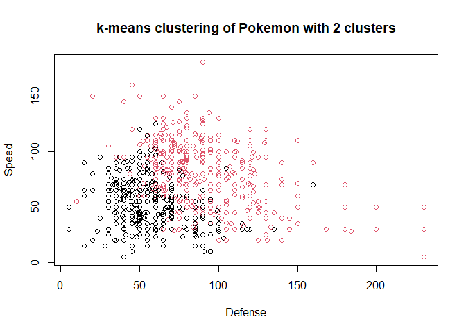

Unsupervised learning in R
================
Mohamad Osman
2022-08-03

# Section 01: Unsupervised learning in R

### **`01-Identify clustering problems`**

Which of the following are clustering problems?

1.  Determining how many features it takes to describe most of the
    variability in data

2.  Determining the natural groupings of houses for sale based on size,
    number of bedrooms, etc.

3.  Visualizing 13 dimensional data (data with 13 features)

4.  Determining if there are common patterns in the demographics of
    people at a commerce site

5.  Predicting if someone will click on a web advertisement

Ans:

-   1, 3, and 5

-   2 and 3

-   1, 2, and 4

-   2 and 4 ✔️

-   All 5 are clustering problems

### 

### **`02-k-means clustering`**

We have created some two-dimensional data and stored it in a variable
called `x` in your workspace. The scatter plot on the right is a visual
representation of the data.

In this exercise, your task is to create a k-means model of the `x` data
using 3 clusters, then to look at the structure of the resulting model
using the
[**`summary()`**](https://www.rdocumentation.org/packages/base/topics/summary)
function.

-   Fit a k-means model to `x` using 3 centers and run the k-means
    algorithm 20 times. Store the result in `km.out`.

-   Inspect the result with the `summary()` function.

``` r
library(dplyr)
library(ggplot2)

x_file <- file.path("..", "00_Datasets", "x_k_means.txt")
x <- read.delim(x_file) %>%
     select(-id)

head(x)
```

    ##      X..1.    X..2.
    ## 1 3.370958 1.995379
    ## 2 1.435302 2.760242
    ## 3 2.363128 2.038991
    ## 4 2.632863 2.735072
    ## 5 2.404268 1.853527
    ## 6 1.893875 1.942113

``` r
# Create the k-means model: km.out
km.out <- kmeans(x, centers = 3, nstart = 20)

# Inspect the result
summary(km.out)
```

    ##              Length Class  Mode   
    ## cluster      300    -none- numeric
    ## centers        6    -none- numeric
    ## totss          1    -none- numeric
    ## withinss       3    -none- numeric
    ## tot.withinss   1    -none- numeric
    ## betweenss      1    -none- numeric
    ## size           3    -none- numeric
    ## iter           1    -none- numeric
    ## ifault         1    -none- numeric

### **`03-Results of kmeans()`**

The `kmeans()` function produces several outputs. In the video, we
discussed one output of modeling, the cluster membership.

In this exercise, you will access the `cluster` component directly. This
is useful anytime you need the cluster membership for each observation
of the data used to build the clustering model. A future exercise will
show an example of how this cluster membership might be used to help
communicate the results of k-means modeling.

k-means models also have a print method to give a human friendly output
of basic modeling results. This is available by using `print()` or
simply typing the name of the model.

``` r
# Print the cluster membership component of the model
km.out
```

    ## K-means clustering with 3 clusters of sizes 150, 52, 98
    ## 
    ## Cluster means:
    ##        X..1.       X..2.
    ## 1 -5.0556758  1.96991743
    ## 2  0.6642455 -0.09132968
    ## 3  2.2171113  2.05110690
    ## 
    ## Clustering vector:
    ##   [1] 3 3 3 3 3 3 3 3 3 3 3 3 2 3 3 3 3 2 2 3 3 3 3 3 3 3 3 3 3 3 3 3 3 3 3 3 2
    ##  [38] 2 2 3 3 3 3 2 3 3 3 3 3 3 3 3 3 3 3 3 3 3 2 3 3 3 3 3 3 3 3 3 3 3 3 3 3 2
    ##  [75] 3 3 3 3 3 3 3 3 3 3 3 3 3 3 3 3 3 3 3 3 3 3 3 3 3 3 1 1 1 1 1 1 1 1 1 1 1
    ## [112] 1 1 1 1 1 1 1 1 1 1 1 1 1 1 1 1 1 1 1 1 1 1 1 1 1 1 1 1 1 1 1 1 1 1 1 1 1
    ## [149] 1 1 1 1 1 1 1 1 1 1 1 1 1 1 1 1 1 1 1 1 1 1 1 1 1 1 1 1 1 1 1 1 1 1 1 1 1
    ## [186] 1 1 1 1 1 1 1 1 1 1 1 1 1 1 1 1 1 1 1 1 1 1 1 1 1 1 1 1 1 1 1 1 1 1 1 1 1
    ## [223] 1 1 1 1 1 1 1 1 1 1 1 1 1 1 1 1 1 1 1 1 1 1 1 1 1 1 1 1 2 2 2 2 3 2 2 2 2
    ## [260] 2 2 2 2 2 2 2 2 2 2 2 2 2 2 2 2 3 3 2 2 3 2 2 2 2 2 2 3 2 2 2 2 2 2 3 2 2
    ## [297] 2 3 2 2
    ## 
    ## Within cluster sum of squares by cluster:
    ## [1] 295.16925  95.50625 148.64781
    ##  (between_SS / total_SS =  87.2 %)
    ## 
    ## Available components:
    ## 
    ## [1] "cluster"      "centers"      "totss"        "withinss"     "tot.withinss"
    ## [6] "betweenss"    "size"         "iter"         "ifault"

``` r
print("-----------------------")
```

    ## [1] "-----------------------"

``` r
# Print the km.out object
print(km.out)
```

    ## K-means clustering with 3 clusters of sizes 150, 52, 98
    ## 
    ## Cluster means:
    ##        X..1.       X..2.
    ## 1 -5.0556758  1.96991743
    ## 2  0.6642455 -0.09132968
    ## 3  2.2171113  2.05110690
    ## 
    ## Clustering vector:
    ##   [1] 3 3 3 3 3 3 3 3 3 3 3 3 2 3 3 3 3 2 2 3 3 3 3 3 3 3 3 3 3 3 3 3 3 3 3 3 2
    ##  [38] 2 2 3 3 3 3 2 3 3 3 3 3 3 3 3 3 3 3 3 3 3 2 3 3 3 3 3 3 3 3 3 3 3 3 3 3 2
    ##  [75] 3 3 3 3 3 3 3 3 3 3 3 3 3 3 3 3 3 3 3 3 3 3 3 3 3 3 1 1 1 1 1 1 1 1 1 1 1
    ## [112] 1 1 1 1 1 1 1 1 1 1 1 1 1 1 1 1 1 1 1 1 1 1 1 1 1 1 1 1 1 1 1 1 1 1 1 1 1
    ## [149] 1 1 1 1 1 1 1 1 1 1 1 1 1 1 1 1 1 1 1 1 1 1 1 1 1 1 1 1 1 1 1 1 1 1 1 1 1
    ## [186] 1 1 1 1 1 1 1 1 1 1 1 1 1 1 1 1 1 1 1 1 1 1 1 1 1 1 1 1 1 1 1 1 1 1 1 1 1
    ## [223] 1 1 1 1 1 1 1 1 1 1 1 1 1 1 1 1 1 1 1 1 1 1 1 1 1 1 1 1 2 2 2 2 3 2 2 2 2
    ## [260] 2 2 2 2 2 2 2 2 2 2 2 2 2 2 2 2 3 3 2 2 3 2 2 2 2 2 2 3 2 2 2 2 2 2 3 2 2
    ## [297] 2 3 2 2
    ## 
    ## Within cluster sum of squares by cluster:
    ## [1] 295.16925  95.50625 148.64781
    ##  (between_SS / total_SS =  87.2 %)
    ## 
    ## Available components:
    ## 
    ## [1] "cluster"      "centers"      "totss"        "withinss"     "tot.withinss"
    ## [6] "betweenss"    "size"         "iter"         "ifault"

### **`04-Visualizing and interpreting results of kmeans()`**

One of the more intuitive ways to interpret the results of k-means
models is by plotting the data as a scatter plot and using color to
label the samples’ cluster membership. In this exercise, you will use
the standard `plot()` function to accomplish this.

To create a scatter plot, you can pass data with two features (i.e.,
columns) to `plot()` with an extra argument `col = km.out$cluster`,
which sets the color of each point in the scatter plot according to its
cluster membership.

`x` and `km.out` are available in your workspace. Using the `plot()`
function to create a scatter plot of data `x`:

-   Color the dots on the scatterplot by setting the `col` argument to
    the `cluster` component in `km.out`.

-   Title the plot `"k-means with 3 clusters"` using the `main` argument
    to `plot()`.

-   Ensure there are no axis labels by specifying `""` for both the
    `xlab` and `ylab` arguments to `plot()`.

``` r
# Scatter plot of x
plot(x, col = km.out$cluster,
     main = "k-means with 3 clusters",
     xlab = "",
     ylab = "")
```

<!-- -->

### **`05-Handling random algorithms`**

In the video, you saw how `kmeans()` randomly initializes the centers of
clusters. This random initialization can result in assigning
observations to different cluster labels. Also, the random
initialization can result in finding different *local minima* for the
k-means algorithm. This exercise will demonstrate both results.

At the top of each plot, the measure of model quality—total within
cluster sum of squares error—will be plotted. Look for the model(s) with
the lowest error to find models with the better model results.

Because `kmeans()` initializes observations to random clusters, it is
important to set the random number generator seed for reproducibility.

The data, `x`, is still available in your workspace. Your task is to
generate six `kmeans()` models on the data, plotting the results of
each, in order to see the impact of random initializations on model
results.

-   Set the random number seed to 1 with
    [**`set.seed()`**](https://www.rdocumentation.org/packages/base/topics/Random).

-   For each iteration of the `for` loop, run `kmeans()` on `x`. Assume
    the number of clusters is 3 and number of starts (`nstart`) is 1.

-   Visualize the cluster memberships using the `col` argument to
    `plot()`. Observe how the measure of quality and cluster assignments
    vary among the six model runs.

``` r
# Set up 2 x 3 plotting grid
par(mfrow = c(2, 3))

# Set seed
set.seed(1)

for(i in 1:6) {
  # Run kmeans() on x with three clusters and one start
  km.out <- kmeans(x, centers = 3, nstart = 1)
  
  # Plot clusters
  plot(x, col = km.out$cluster, 
      main = km.out$tot.withinss, 
      xlab = "", ylab = "")
}
```

<!-- -->

### **`06-Selecting number of clusters`**

The k-means algorithm assumes the number of clusters as part of the
input. If you know the number of clusters in advance (e.g., due to
certain business constraints) this makes setting the number of clusters
easy. However, as you saw in the video, if you do not know the number of
clusters and need to determine it, you will need to run the algorithm
multiple times, each time with a different number of clusters. From
this, you can observe how a measure of model quality changes with the
number of clusters.

In this exercise, you will run `kmeans()` multiple times to see how
model quality changes as the number of clusters changes. Plots
displaying this information help to determine the number of clusters and
are often referred to as *scree plots*.

The ideal plot will have an *elbow* where the quality measure improves
more slowly as the number of clusters increases. This indicates that the
quality of the model is no longer improving substantially as the model
complexity (i.e., number of clusters) increases. In other words, the
elbow indicates the number of clusters inherent in the data.

The data, `x`, is still available in your workspace.

-   Build 15 `kmeans()` models on `x`, each with a different number of
    clusters (ranging from 1 to 15). Set `nstart = 20` for all model
    runs and save the total within cluster sum of squares for each model
    to the `i`th element of `wss`.

-   Run the code provided to create a scree plot of the `wss` for all 15
    models.

-   Take a look at your scree plot. How many clusters are inherent in
    the data? Set `k` equal to the number of clusters at the location of
    the elbow.

``` r
# Initialize total within sum of squares error: wss
wss <- 0

# For 1 to 15 cluster centers
for (i in 1:15) {
  km.out <- kmeans(x, centers = i, nstart = 20)
  # Save total within sum of squares to wss variable
  wss[i] <- km.out$tot.withinss
}

# Plot total within sum of squares vs. number of clusters
plot(1:15, wss, type = "b", 
     xlab = "Number of Clusters", 
     ylab = "Within groups sum of squares")
```

<!-- -->

``` r
# Set k equal to the number of clusters corresponding to the elbow location
k <- 2
```

Looking at the scree plot, it looks like there are inherently 2 or 3
clusters in the data. Awesome job!

``` r
Pok_URL <- "https://assets.datacamp.com/production/course_6430/datasets/Pokemon.csv"

pokemon <- read.csv(Pok_URL) %>%
          select(c("HitPoints", "Attack", "Defense",
                   "SpecialAttack","SpecialDefense", "Speed" ))
head(pokemon)
```

    ##   HitPoints Attack Defense SpecialAttack SpecialDefense Speed
    ## 1        45     49      49            65             65    45
    ## 2        60     62      63            80             80    60
    ## 3        80     82      83           100            100    80
    ## 4        80    100     123           122            120    80
    ## 5        39     52      43            60             50    65
    ## 6        58     64      58            80             65    80

### **`07-Practical matters: working with real data`**

Dealing with real data is often more challenging than dealing with
synthetic data. Synthetic data helps with learning new concepts and
techniques, but the next few exercises will deal with data that is
closer to the type of real data you might find in your professional or
academic pursuits.

The first challenge with the Pokemon data is that there is no
pre-determined number of clusters. You will determine the appropriate
number of clusters, keeping in mind that in real data the *elbow* in the
scree plot might be less of a sharp elbow than in synthetic data. Use
your judgment on making the determination of the number of clusters.

The second part of this exercise includes plotting the outcomes of the
clustering on two dimensions, or features, of the data. These features
were chosen somewhat arbitrarily for this exercise. Think about how you
would use plotting and clustering to communicate interesting groups of
Pokemon to other people.

An additional note: this exercise utilizes the `iter.max` argument to
`kmeans()`. As you’ve seen, `kmeans()` is an iterative algorithm,
repeating over and over until some stopping criterion is reached. The
default number of iterations for `kmeans()` is 10, which is not enough
for the algorithm to converge and reach its stopping criterion, so we’ll
set the number of iterations to 50 to overcome this issue. To see what
happens when `kmeans()` does not converge, try running the example with
a lower number of iterations (e.g., 3). This is another example of what
might happen when you encounter real data and use real cases.

The `pokemon` dataset, which contains observations of 800 Pokemon
characters on 6 dimensions (i.e., features), is available in your
workspace.

-   Using `kmeans()` with `nstart = 20`, determine the total within sum
    of square errors for different numbers of clusters (between 1 and
    15).

-   Pick an appropriate number of clusters based on these results from
    the first instruction and assign that number to `k`.

-   Create a k-means model using `k` clusters and assign it to the
    `km.out` variable.

-   Create a scatter plot of `Defense` vs. `Speed`, showing cluster
    membership for each observation.

``` r
# Initialize total within sum of squares error: wss
wss <- 0

# Look over 1 to 15 possible clusters
for (i in 1:15) {
  # Fit the model: km.out
  km.out <- kmeans(pokemon, centers = i, nstart = 20, iter.max = 50)
  # Save the within cluster sum of squares
  wss[i] <- km.out$tot.withinss
}

# Produce a scree plot
plot(1:15, wss, type = "b", 
     xlab = "Number of Clusters", 
     ylab = "Within groups sum of squares")
```

<!-- -->

``` r
# Select number of clusters
k <- 2

# Build model with k clusters: km.out
km.out <- kmeans(pokemon, centers = k, nstart = 20, iter.max = 50)

# View the resulting model
km.out
```

    ## K-means clustering with 2 clusters of sizes 374, 426
    ## 
    ## Cluster means:
    ##   HitPoints   Attack  Defense SpecialAttack SpecialDefense    Speed
    ## 1  54.87968 57.94118 55.49733      52.33155       53.44118 54.04278
    ## 2  81.88263 97.49061 89.94836      90.80751       88.11033 80.77465
    ## 
    ## Clustering vector:
    ##   [1] 1 1 2 2 1 1 2 2 2 1 1 2 2 1 1 1 1 1 1 2 1 1 2 2 1 1 1 2 1 2 1 2 1 2 1 1 2
    ##  [38] 1 1 2 1 2 1 2 1 1 1 2 1 1 2 1 1 1 2 1 1 1 1 1 2 1 2 1 2 1 1 2 1 1 2 2 1 1
    ##  [75] 2 1 1 2 1 2 1 1 2 1 2 1 2 2 1 2 1 1 2 1 2 1 2 1 2 1 1 2 2 1 1 2 1 2 1 2 1
    ## [112] 2 1 2 2 2 1 1 2 1 2 1 2 2 2 1 2 1 2 1 2 2 2 2 2 2 2 2 2 1 2 2 2 1 1 2 2 2
    ## [149] 1 1 2 1 2 2 2 2 2 2 2 1 1 2 2 2 2 2 1 1 2 1 1 2 1 1 2 1 1 1 2 1 1 1 1 2 1
    ## [186] 2 1 1 1 1 1 1 2 1 1 2 2 2 1 1 1 2 1 1 2 1 1 2 1 1 2 2 2 1 2 2 1 1 2 1 2 1
    ## [223] 1 2 2 1 2 1 2 2 2 2 2 1 1 2 1 1 1 2 1 1 2 1 2 2 1 2 2 2 1 2 2 2 1 1 2 1 1
    ## [260] 1 2 2 2 2 2 1 1 2 2 2 2 2 1 1 2 2 1 1 2 2 1 1 2 2 1 1 1 1 1 1 1 1 1 1 1 2
    ## [297] 1 1 2 1 1 1 2 1 1 2 2 1 1 1 2 1 2 2 1 2 1 1 1 2 1 2 1 1 1 1 1 2 1 2 1 2 2
    ## [334] 2 1 1 2 1 2 2 1 1 1 1 1 1 2 1 2 2 1 2 1 2 2 2 1 2 1 1 1 2 1 2 1 2 2 2 2 2
    ## [371] 2 1 2 1 2 1 2 1 2 1 2 1 2 1 2 1 2 2 1 2 2 1 2 2 1 1 2 2 1 1 2 1 2 2 2 1 1
    ## [408] 1 2 2 1 1 2 2 2 2 2 2 2 2 2 2 2 2 2 2 2 2 2 2 2 2 1 1 2 1 1 2 1 1 2 1 1 2
    ## [445] 1 1 1 1 1 1 2 1 2 1 2 1 2 1 2 2 2 2 1 2 1 1 2 1 2 1 2 2 1 2 1 2 2 2 2 1 2
    ## [482] 1 1 2 1 2 1 1 1 1 2 1 1 2 2 1 1 2 2 1 2 1 2 1 2 2 1 2 1 1 2 2 2 2 2 2 2 2
    ## [519] 2 2 2 2 2 2 2 2 2 2 2 2 2 2 2 2 2 2 2 2 2 2 2 2 2 2 2 2 2 2 2 2 2 2 2 2 1
    ## [556] 1 2 1 1 2 1 1 2 1 1 1 1 2 1 2 1 2 1 2 1 2 1 2 1 1 2 1 2 1 1 2 1 1 1 2 2 2
    ## [593] 1 1 2 1 1 2 2 2 1 1 2 1 1 2 1 2 1 2 2 1 1 2 1 2 2 2 1 2 1 2 2 1 2 1 2 1 2
    ## [630] 1 2 1 2 1 2 1 1 2 1 1 2 1 2 1 1 2 1 2 1 1 2 1 2 1 2 2 1 2 1 2 1 2 2 1 1 2
    ## [667] 1 2 1 1 2 1 1 2 1 2 2 1 2 2 1 2 2 1 2 1 2 2 1 2 1 2 2 2 1 1 2 1 2 2 2 2 2
    ## [704] 2 2 2 2 2 2 2 2 2 2 2 2 2 2 2 1 1 2 1 1 2 1 1 2 1 1 1 1 2 1 1 1 1 2 1 1 2
    ## [741] 1 2 1 2 2 1 2 2 1 2 2 2 1 2 1 2 1 2 1 2 1 2 1 2 1 2 1 2 1 2 2 2 1 2 1 2 2
    ## [778] 2 1 2 1 1 1 1 2 2 2 2 1 2 1 2 2 2 2 2 2 2 2 2
    ## 
    ## Within cluster sum of squares by cluster:
    ## [1]  911966.2 2007145.9
    ##  (between_SS / total_SS =  31.9 %)
    ## 
    ## Available components:
    ## 
    ## [1] "cluster"      "centers"      "totss"        "withinss"     "tot.withinss"
    ## [6] "betweenss"    "size"         "iter"         "ifault"

``` r
# Plot of Defense vs. Speed by cluster membership
plot(pokemon[, c("Defense", "Speed")],
     col = km.out$cluster,
     main = paste("k-means clustering of Pokemon with", k, "clusters"),
     xlab = "Defense", ylab = "Speed")
```

<!-- -->

### 

**`The End`**
