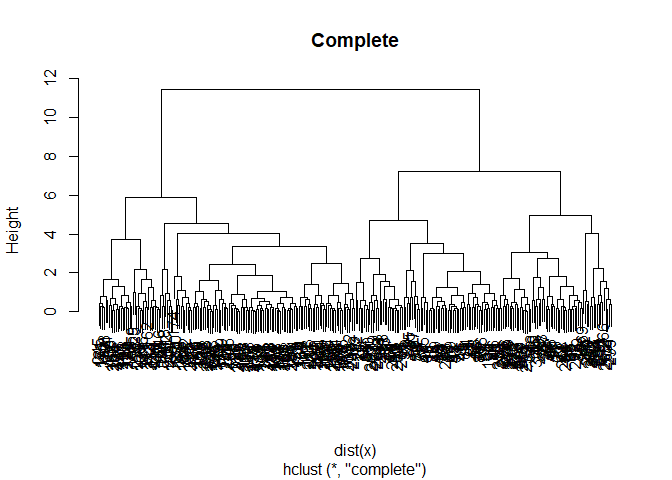
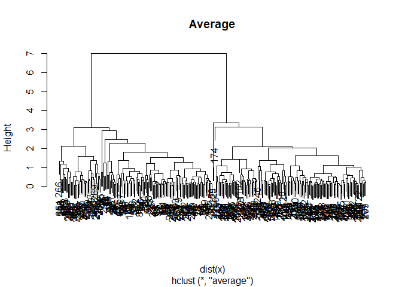
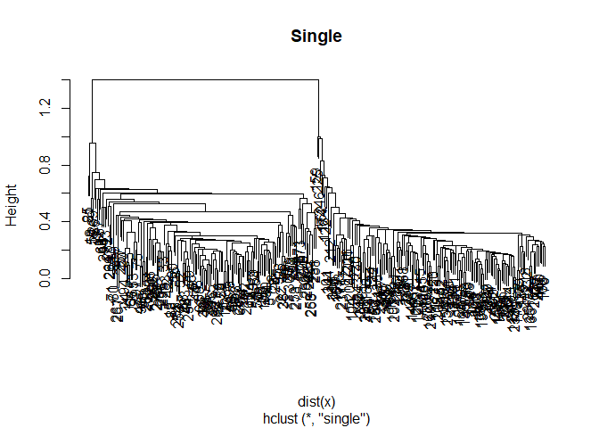

Hierarchical clustering
================
Mohamad Osman
2022-08-04

# **`Section 02: Hierarchical clustering`**

``` r
library(dplyr)
```

    ## 
    ## Attaching package: 'dplyr'

    ## The following objects are masked from 'package:stats':
    ## 
    ##     filter, lag

    ## The following objects are masked from 'package:base':
    ## 
    ##     intersect, setdiff, setequal, union

``` r
library(ggplot2)

x_path <- file.path("..", "00_Datasets", "x_k_means.txt")
x <- read.delim(x_path) %>% 
     select(-id)
head(x, 3)
```

    ##      X..1.    X..2.
    ## 1 3.370958 1.995379
    ## 2 1.435302 2.760242
    ## 3 2.363128 2.038991

### **`01-Hierarchical clustering with results`**

In this exercise, you will create your first hierarchical clustering
model using the
[**`hclust()`**](https://www.rdocumentation.org/packages/stats/topics/hclust)
function.

We have created some data that has two dimensions and placed it in a
variable called `x`. Your task is to create a hierarchical clustering
model of `x`. Remember from the video that the first step to
hierarchical clustering is determining the similarity between
observations, which you will do with the
[**`dist()`**](https://www.rdocumentation.org/packages/stats/topics/dist)
function.

You will look at the structure of the resulting model using the
`summary()` function.

-   Fit a hierarchical clustering model to `x` using the `hclust()`
    function. Store the result in `hclust.out`.

-   Inspect the result with the `summary()` function.

``` r
# Create hierarchical clustering model: hclust.out
hclust.out <- hclust(d = dist(x))

# Inspect the result
summary(hclust.out)
```

    ##             Length Class  Mode     
    ## merge       598    -none- numeric  
    ## height      299    -none- numeric  
    ## order       300    -none- numeric  
    ## labels        0    -none- NULL     
    ## method        1    -none- character
    ## call          2    -none- call     
    ## dist.method   1    -none- character

### **`02-Interpreting dendrogram`**

The plot displayed to the right shows the `hclust.out` model you
constructed in the previous exercise. We’ve drawn horizontal lines at
heights of 3.5, 4.5, 6.9, and 9.0, respectively.

Which cut point yields 3 clusters?


-   3.5

-   4.5

-   6.9 ✔️

-   9.0

Correct! If you cut the tree at a height of 6.9, you’re left with 3
branches representing 3 distinct clusters.

### **`03-Cutting the tree`**

Remember from the video that
[**`cutree()`**](https://www.rdocumentation.org/packages/stats/topics/cutree)
is the R function that cuts a hierarchical model. The `h` and `k`
arguments to `cutree()` allow you to cut the tree based on a certain
height `h` or a certain number of clusters `k`.

In this exercise, you will use `cutree()` to cut the hierarchical model
you created earlier based on each of these two criteria.

The `hclust.out` model you created earlier is available in your
workspace.

-   Cut the `hclust.out` model at height 7.

-   Cut the `hclust.out` model to create 3 clusters.

``` r
# Cut by height
cutree(hclust.out, h = 7)
```

    ##   [1] 1 1 1 1 1 1 1 1 1 1 1 1 2 1 1 1 2 2 2 1 1 2 1 1 1 2 1 2 1 2 1 1 1 2 1 2 2
    ##  [38] 2 2 1 1 1 1 2 2 1 1 1 2 1 1 2 1 1 1 1 1 1 2 1 2 1 1 1 2 1 1 1 1 1 1 1 1 2
    ##  [75] 1 1 1 1 2 1 1 1 1 1 2 1 1 1 1 1 1 2 1 1 2 1 2 2 1 1 3 3 3 3 3 3 3 3 3 3 3
    ## [112] 3 3 3 3 3 3 3 3 3 3 3 3 3 3 3 3 3 3 3 3 3 3 3 3 3 3 3 3 3 3 3 3 3 3 3 3 3
    ## [149] 3 3 3 3 3 3 3 3 3 3 3 3 3 3 3 3 3 3 3 3 3 3 3 3 3 3 3 3 3 3 3 3 3 3 3 3 3
    ## [186] 3 3 3 3 3 3 3 3 3 3 3 3 3 3 3 3 3 3 3 3 3 3 3 3 3 3 3 3 3 3 3 3 3 3 3 3 3
    ## [223] 3 3 3 3 3 3 3 3 3 3 3 3 3 3 3 3 3 3 3 3 3 3 3 3 3 3 3 3 2 2 2 2 1 2 2 2 2
    ## [260] 2 1 1 2 2 2 2 1 2 2 2 2 2 2 2 2 1 2 2 1 1 1 2 2 2 2 2 1 2 2 2 2 2 2 1 2 2
    ## [297] 2 1 2 2

``` r
# Cut by number of clusters
cutree(hclust.out, k = 3)
```

    ##   [1] 1 1 1 1 1 1 1 1 1 1 1 1 2 1 1 1 2 2 2 1 1 2 1 1 1 2 1 2 1 2 1 1 1 2 1 2 2
    ##  [38] 2 2 1 1 1 1 2 2 1 1 1 2 1 1 2 1 1 1 1 1 1 2 1 2 1 1 1 2 1 1 1 1 1 1 1 1 2
    ##  [75] 1 1 1 1 2 1 1 1 1 1 2 1 1 1 1 1 1 2 1 1 2 1 2 2 1 1 3 3 3 3 3 3 3 3 3 3 3
    ## [112] 3 3 3 3 3 3 3 3 3 3 3 3 3 3 3 3 3 3 3 3 3 3 3 3 3 3 3 3 3 3 3 3 3 3 3 3 3
    ## [149] 3 3 3 3 3 3 3 3 3 3 3 3 3 3 3 3 3 3 3 3 3 3 3 3 3 3 3 3 3 3 3 3 3 3 3 3 3
    ## [186] 3 3 3 3 3 3 3 3 3 3 3 3 3 3 3 3 3 3 3 3 3 3 3 3 3 3 3 3 3 3 3 3 3 3 3 3 3
    ## [223] 3 3 3 3 3 3 3 3 3 3 3 3 3 3 3 3 3 3 3 3 3 3 3 3 3 3 3 3 2 2 2 2 1 2 2 2 2
    ## [260] 2 1 1 2 2 2 2 1 2 2 2 2 2 2 2 2 1 2 2 1 1 1 2 2 2 2 2 1 2 2 2 2 2 2 1 2 2
    ## [297] 2 1 2 2

If you’re wondering what the output means, remember, there are 50
observations in the original dataset `x`. The output of each `cutree()`
call represents the cluster assignments for each observation in the
original dataset. Great work!

### **`04-Linkage methods`**

In this exercise, you will produce hierarchical clustering models using
different linkages and plot the dendrogram for each, observing the
overall structure of the trees.

You’ll be asked to interpret the results in the next exercise.

-   Produce three hierarchical clustering models on `x` using the
    `"complete"`, `"average"`, and `"single"` linkage methods,
    respectively.

-   Plot a dendrogram for each model, using titles of `"Complete"`,
    `"Average"`, and `"Single"`, respectively.

``` r
# Cluster using complete linkage: hclust.complete
hclust.complete <- hclust(dist(x), method = "complete")

# Cluster using average linkage: hclust.average
hclust.average <- hclust(dist(x), method = "average")

# Cluster using single linkage: hclust.single
hclust.single <- hclust(dist(x), method = "single")

# Plot dendrogram of hclust.complete
plot(hclust.complete, main = "Complete")
```

<!-- -->

``` r
# Plot dendrogram of hclust.average
plot(hclust.average, main = "Average")
```

<!-- -->

``` r
# Plot dendrogram of hclust.single
plot(hclust.single, main = "Single")
```

<!-- -->

### **`05-Comparing linkage methods`**

The models you created in the last exercise—`hclust.complete`,
`hclust.average`, and `hclust.single`—are available in your workspace.

Which linkage(s) produce balanced trees?

-   Complete only

-   Average only

-   Single only

-   Average and single

-   Complete and average ✔️

-   All three

Right! Whether you want balanced or unbalanced trees for your
hierarchical clustering model depends on the context of the problem
you’re trying to solve. Balanced trees are essential if you want an even
number of observations assigned to each cluster. On the other hand, if
you want to detect outliers, for example, an unbalanced tree is more
desirable because pruning an unbalanced tree can result in most
observations assigned to one cluster and only a few observations
assigned to other clusters.

### 

**`06-Practical matters: scaling`**

Recall from the video that clustering real data may require *scaling*
the features if they have different distributions. So far in this
chapter, you have been working with synthetic data that did not need
scaling.

In this exercise, you will go back to working with “real” data, the
`pokemon` dataset introduced in the first chapter. You will observe the
distribution (mean and standard deviation) of each feature, scale the
data accordingly, then produce a hierarchical clustering model using the
complete linkage method.

``` r
Pok_URL <- "https://assets.datacamp.com/production/course_6430/datasets/Pokemon.csv"

pokemon <- read.csv(Pok_URL) %>%
          select(c("HitPoints", "Attack", "Defense",
                   "SpecialAttack","SpecialDefense", "Speed" ))
head(pokemon)
```

    ##   HitPoints Attack Defense SpecialAttack SpecialDefense Speed
    ## 1        45     49      49            65             65    45
    ## 2        60     62      63            80             80    60
    ## 3        80     82      83           100            100    80
    ## 4        80    100     123           122            120    80
    ## 5        39     52      43            60             50    65
    ## 6        58     64      58            80             65    80

The data is stored in the `pokemon` object in your workspace.

-   Observe the mean of each variable in `pokemon` using the
    [**`colMeans()`**](https://www.rdocumentation.org/packages/base/topics/colSums)
    function.

-   Observe the standard deviation of each variable using the
    [**`apply()`**](https://www.rdocumentation.org/packages/base/topics/apply)
    and
    [**`sd()`**](https://www.rdocumentation.org/packages/stats/topics/sd)
    functions. Since the variables are the columns of your matrix, make
    sure to specify 2 as the `MARGIN` argument to `apply()`.

-   Scale the `pokemon` data using the
    [**`scale()`**](https://www.rdocumentation.org/packages/base/topics/scale)
    function and store the result in `pokemon.scaled`.

-   Create a hierarchical clustering model of the `pokemon.scaled` data
    using the complete linkage method. Manually specify the `method`
    argument and store the result in `hclust.pokemon`.

``` r
# View column means
colMeans(pokemon)
```

    ##      HitPoints         Attack        Defense  SpecialAttack SpecialDefense 
    ##       69.25875       79.00125       73.84250       72.82000       71.90250 
    ##          Speed 
    ##       68.27750

``` r
strrep("_", 70)
```

    ## [1] "______________________________________________________________________"

``` r
# View column standard deviations
apply(pokemon, 2, sd)
```

    ##      HitPoints         Attack        Defense  SpecialAttack SpecialDefense 
    ##       25.53467       32.45737       31.18350       32.72229       27.82892 
    ##          Speed 
    ##       29.06047

``` r
strrep("_", 70)
```

    ## [1] "______________________________________________________________________"

``` r
# Scale the data
pokemon.scaled <- scale(pokemon)
colMeans(pokemon.scaled)
```

    ##      HitPoints         Attack        Defense  SpecialAttack SpecialDefense 
    ##  -2.517214e-16   3.446896e-17  -3.948231e-17   2.097498e-16  -1.274306e-16 
    ##          Speed 
    ##  -1.102547e-16

``` r
# Create hierarchical clustering model: hclust.pokemon
hclust.pokemon <- hclust(dist(pokemon.scaled), method = "complete")
```

### **`07-Comparing kmeans() and hclust()`**

Comparing k-means and hierarchical clustering, you’ll see the two
methods produce different cluster memberships. This is because the two
algorithms make different assumptions about how the data is generated.
In a more advanced course, we could choose to use one model over another
based on the quality of the models’ assumptions, but for now, it’s
enough to observe that they are different.

This exercise will have you compare results from the two models on the
`pokemon` dataset to see how they differ.

The results from running k-means clustering on the `pokemon` data (for 3
clusters) are stored as `km.pokemon`. The hierarchical clustering model
you created in the previous exercise is still available as
`hclust.pokemon`.

-   Using `cutree()` on `hclust.pokemon`, assign cluster membership to
    each observation. Assume three clusters and assign the result to a
    vector called `cut.pokemon`.

-   Using
    [**`table()`**](https://www.rdocumentation.org/packages/base/topics/table),
    compare cluster membership between the two clustering methods.
    Recall that the different components of k-means model objects can be
    accessed with the `$` operator.

``` r
# Build model with k clusters: km.out
km.pokemon <- kmeans(pokemon, centers = 3, nstart = 20)


# Apply cutree() to hclust.pokemon: cut.pokemon
cut.pokemon <- cutree(hclust.pokemon, k = 3)

# Compare methods
table(km.pokemon$cluster, cut.pokemon)
```

    ##    cut.pokemon
    ##       1   2   3
    ##   1 350   5   0
    ##   2 171   3   1
    ##   3 267   3   0

Looking at the table, it looks like the hierarchical clustering model
assigns most of the observations to cluster 1, while the k-means
algorithm distributes the observations relatively evenly among all
clusters. It’s important to note that there’s no consensus on which
method produces better clusters. The job of the analyst in unsupervised
clustering is to observe the cluster assignments and make a judgment
call as to which method provides more insights into the data. Excellent
job!

### **`The End`**
