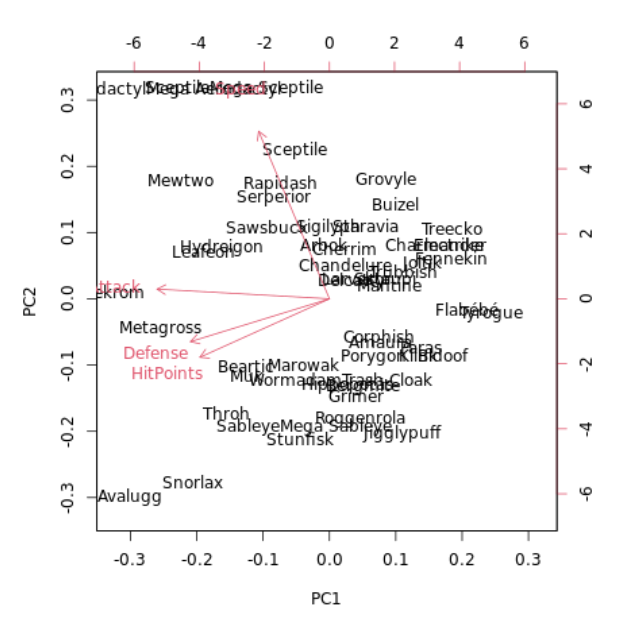
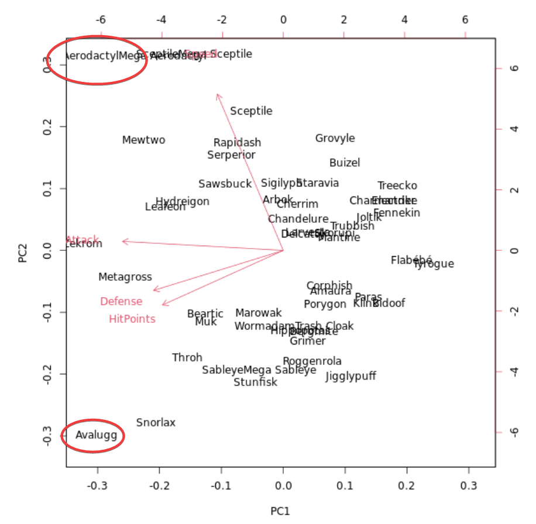

# Section 03: Dimensionality reduction with PCA

### **`01-PCA using prcomp()`**

```{r meassage = FALSE, warning = FALSE}

library(dplyr)
library(ggplot2)

Pok_URL <- "https://assets.datacamp.com/production/course_6430/datasets/Pokemon.csv"
pokemon <- read.csv(Pok_URL) %>%
          select(c("HitPoints", "Attack", "Defense",
                   "SpecialAttack","SpecialDefense", "Speed" ))
```

In this exercise, you will create your first PCA model and observe the diagnostic results.

We have loaded the Pokemon data from earlier, which has four dimensions, and placed it in a variable called `pokemon`. Your task is to create a PCA model of the data, then to inspect the resulting model using the `summary()` function.

-   Create a PCA model of the data in `pokemon`, setting `scale` to `TRUE`. Store the result in `pr.out`.

-   Inspect the result with the `summary()` function.

```{r}
# Perform scaled PCA: pr.out
pr.out <- prcomp(pokemon, 
                scale = TRUE)

# Inspect model output
summary(pr.out)
```

### **`02-Results of PCA`**

This exercise will check your understanding of the `summary()` of a PCA model. Your model from the last exercise, `pr.out`, and the `pokemon` dataset are still available in your workspace.

What is the minimum number of principal components that are required to describe at least 75% of the cumulative variance in this dataset?

-   1

-   2 ✔️

-   3

-   4

Right! The first two principal components describe around 77% of the variance.

### **`03-Additional results of PCA`**

PCA models in R produce additional diagnostic and output components:

-   `center`: the column means used to center to the data, or `FALSE` if the data weren't centered

-   `scale`: the column standard deviations used to scale the data, or `FALSE` if the data weren't scaled

-   `rotation`: the directions of the principal component vectors in terms of the original features/variables. This information allows you to define new data in terms of the original principal components

-   `x`: the value of each observation in the original dataset projected to the principal components

You can access these the same as other model components. For example, use `pr.out$rotation` to access the `rotation` component.

Which of the following statements is **not** correct regarding the `pr.out` model fit on the `pokemon` data?

-   The `x` component is a table with the same dimensions as the original data.

-   The data were centered prior to performing PCA.

-   The data were scaled prior to performing PCA.

-   The directions of the principal component vectors are presented in a table with the same dimensions as the original data. ✔️

Right! Calling `dim()` on `pr.out$rotation` and `pokemon`, you can see they have different dimensions.

```{r}
dim(pr.out$rotation)
dim(pokemon)

```

### **`04-Interpreting biplots (1)`**

As stated in the video, the [**`biplot()`**](https://www.rdocumentation.org/packages/stats/topics/biplot) function plots both the principal components loadings and the mapping of the observations to their first two principal component values. The next couple of exercises will check your interpretation of the `biplot()` visualization.

Using the `biplot()` of the `pr.out` model, which two original variables have approximately the same loadings in the first two principal components?

{width="334"}

-   `Attack` and `HitPoints`

-   `Attack` and `Speed`

-   `Speed` and `Defense`

-   `HitPoints` and `Defense`✔️

### **`05-Interpreting biplots (2)`**

In the last exercise, you saw that `Attack` and `HitPoints` have approximately the same loadings in the first two principal components.

Again using the `biplot()` of the `pr.out` model, which two Pokemon are the least similar in terms of the second principal component?

{width="367"}

-   Aerodactyl and Avalugg ✔️

-   Mewtwo and Snorlax

-   Beartic and Muk

-   Zekrom and Tyrogue

### **`06-Variance explained`**

The second common plot type for understanding PCA models is a scree plot. A scree plot shows the variance explained as the number of principal components increases. Sometimes the cumulative variance explained is plotted as well.

In this and the next exercise, you will prepare data from the pr.out model you created at the beginning of the chapter for use in a scree plot. Preparing the data for plotting is required because there is not a built-in function in R to create this type of plot.

`pr.out` and the `pokemon` data are still available in your workspace.

-   Assign to the variable `pr.var` the square of the standard deviations of the principal components (i.e., the variance). The standard deviation of the principal components is available in the `sdev` component of the PCA model object.

-   Assign to the variable `pve` the proportion of the variance explained, calculated by dividing `pr.var` by the total variance explained by all principal components.

```{r}
# Variability of each principal component: pr.var
pr.var <- pr.out$sdev^2

# Variance explained by each principal component: pve
pve <- pr.var / sum(pr.var)
```

### 
**`07-Visualize variance explained`**

Now you will create a scree plot showing the proportion of variance explained by each principal component, as well as the cumulative proportion of variance explained.

Recall from the video that these plots can help to determine the number of principal components to retain. One way to determine the number of principal components to retain is by looking for an elbow in the scree plot showing that as the number of principal components increases, the rate at which variance is explained decreases substantially. In the absence of a clear elbow, you can use the scree plot as a guide for setting a threshold.

The proportion of variance explained is still available in the `pve` object you created in the last exercise.

-   Use `plot()` to plot the proportion of variance explained by each principal component.

-   Use `plot()` and [**`cumsum()`**](https://www.rdocumentation.org/packages/base/topics/cumsum) (cumulative sum) to plot the cumulative proportion of variance explained as a function of the number principal components.

```{r}
# Plot variance explained for each principal component
plot(pve, xlab = "Principal Component",
     ylab = "Proportion of Variance Explained",
     ylim = c(0, 1), type = "b")

# Plot cumulative proportion of variance explained
plot(cumsum(pve), xlab = "Principal Component",
     ylab = "Cumulative Proportion of Variance Explained",
     ylim = c(0, 1), type = "b")
```

Awesome! Notice that when the number of principal components is equal to the number of original features in the data, the cumulative proportion of variance explained is 1.

### **`08-Practical issues: scaling`**

You saw in the video that scaling your data before doing PCA changes the results of the PCA modeling. Here, you will perform PCA with and without scaling, then visualize the results using biplots.

Sometimes scaling is appropriate when the variances of the variables are substantially different. This is commonly the case when variables have different units of measurement, for example, degrees Fahrenheit (temperature) and miles (distance). Making the decision to use scaling is an important step in performing a principal component analysis.

The same Pokemon dataset is available in your workspace as `pokemon`, but one new variable has been added: `Total`.

-   There is some code at the top of the editor to calculate the mean and standard deviation of each variable in the model. Run this code to see how the scale of the variables differs in the original data.

-   Create a PCA model of `pokemon` with scaling, assigning the result to `pr.with.scaling`.

-   Create a PCA model of `pokemon` without scaling, assigning the result to `pr.without.scaling`.

-   Use `biplot()` to plot both models (one at a time) and compare their outputs.

```{r}
# Mean of each variable
colMeans(pokemon)

# Standard deviation of each variable
apply(pokemon, 2, sd)

# PCA model with scaling: pr.with.scaling
pr.with.scaling <- prcomp(pokemon, scale = TRUE)

# PCA model without scaling: pr.without.scaling
pr.without.scaling <- prcomp(pokemon, scale = FALSE)

# Create biplots of both for comparison
biplot(pr.with.scaling)
biplot(pr.without.scaling)

```

Good job! The new `Total` column contains much more variation, on average, than the other four columns, so it has a disproportionate effect on the PCA model when scaling is not performed. After scaling the data, there's a much more even distribution of the loading vectors.

### **`The End`** 


 


 


\


