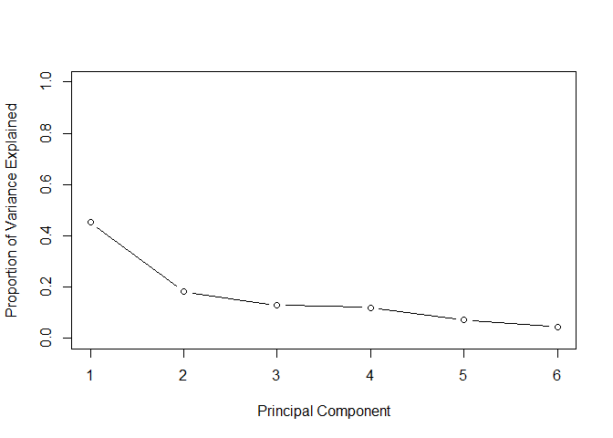
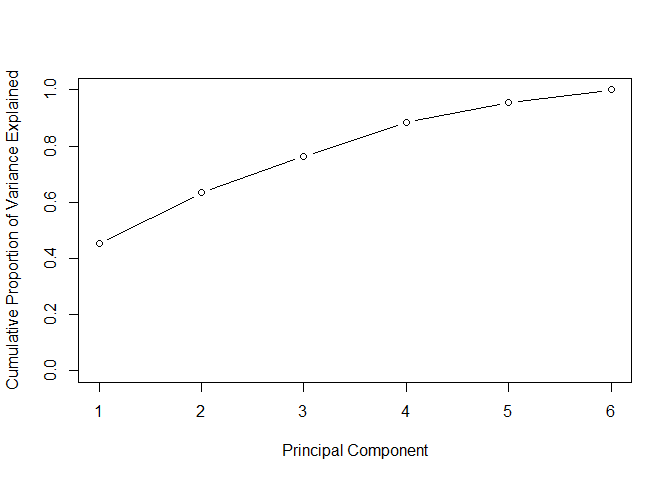
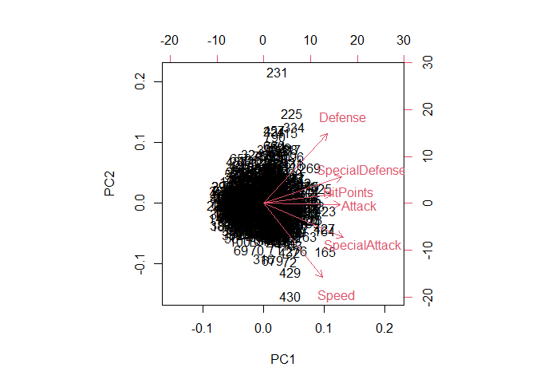
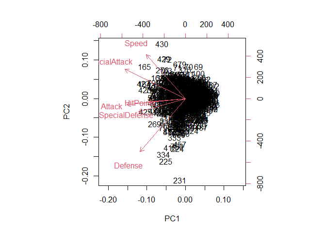

Dimensionality reduction with PCA
================
Mohamad Osman
2022-08-04

# Section 03: Dimensionality reduction with PCA

### **`01-PCA using prcomp()`**

``` r
library(dplyr)
```

    ## 
    ## Attaching package: 'dplyr'

    ## The following objects are masked from 'package:stats':
    ## 
    ##     filter, lag

    ## The following objects are masked from 'package:base':
    ## 
    ##     intersect, setdiff, setequal, union

``` r
library(ggplot2)

Pok_URL <- "https://assets.datacamp.com/production/course_6430/datasets/Pokemon.csv"
pokemon <- read.csv(Pok_URL) %>%
          select(c("HitPoints", "Attack", "Defense",
                   "SpecialAttack","SpecialDefense", "Speed" ))
```

In this exercise, you will create your first PCA model and observe the
diagnostic results.

We have loaded the Pokemon data from earlier, which has four dimensions,
and placed it in a variable called `pokemon`. Your task is to create a
PCA model of the data, then to inspect the resulting model using the
`summary()` function.

-   Create a PCA model of the data in `pokemon`, setting `scale` to
    `TRUE`. Store the result in `pr.out`.

-   Inspect the result with the `summary()` function.

``` r
# Perform scaled PCA: pr.out
pr.out <- prcomp(pokemon, 
                scale = TRUE)

# Inspect model output
summary(pr.out)
```

    ## Importance of components:
    ##                           PC1    PC2    PC3    PC4     PC5     PC6
    ## Standard deviation     1.6466 1.0457 0.8825 0.8489 0.65463 0.51681
    ## Proportion of Variance 0.4519 0.1822 0.1298 0.1201 0.07142 0.04451
    ## Cumulative Proportion  0.4519 0.6342 0.7640 0.8841 0.95549 1.00000

### **`02-Results of PCA`**

This exercise will check your understanding of the `summary()` of a PCA
model. Your model from the last exercise, `pr.out`, and the `pokemon`
dataset are still available in your workspace.

What is the minimum number of principal components that are required to
describe at least 75% of the cumulative variance in this dataset?

-   1

-   2 ✔️

-   3

-   4

Right! The first two principal components describe around 77% of the
variance.

### **`03-Additional results of PCA`**

PCA models in R produce additional diagnostic and output components:

-   `center`: the column means used to center to the data, or `FALSE` if
    the data weren’t centered

-   `scale`: the column standard deviations used to scale the data, or
    `FALSE` if the data weren’t scaled

-   `rotation`: the directions of the principal component vectors in
    terms of the original features/variables. This information allows
    you to define new data in terms of the original principal components

-   `x`: the value of each observation in the original dataset projected
    to the principal components

You can access these the same as other model components. For example,
use `pr.out$rotation` to access the `rotation` component.

Which of the following statements is **not** correct regarding the
`pr.out` model fit on the `pokemon` data?

-   The `x` component is a table with the same dimensions as the
    original data.

-   The data were centered prior to performing PCA.

-   The data were scaled prior to performing PCA.

-   The directions of the principal component vectors are presented in a
    table with the same dimensions as the original data. ✔️

Right! Calling `dim()` on `pr.out$rotation` and `pokemon`, you can see
they have different dimensions.

``` r
dim(pr.out$rotation)
```

    ## [1] 6 6

``` r
dim(pokemon)
```

    ## [1] 800   6

### **`04-Interpreting biplots (1)`**

As stated in the video, the
[**`biplot()`**](https://www.rdocumentation.org/packages/stats/topics/biplot)
function plots both the principal components loadings and the mapping of
the observations to their first two principal component values. The next
couple of exercises will check your interpretation of the `biplot()`
visualization.

Using the `biplot()` of the `pr.out` model, which two original variables
have approximately the same loadings in the first two principal
components?


-   `Attack` and `HitPoints`

-   `Attack` and `Speed`

-   `Speed` and `Defense`

-   `HitPoints` and `Defense`✔️

### **`05-Interpreting biplots (2)`**

In the last exercise, you saw that `Attack` and `HitPoints` have
approximately the same loadings in the first two principal components.

Again using the `biplot()` of the `pr.out` model, which two Pokemon are
the least similar in terms of the second principal component?


-   Aerodactyl and Avalugg ✔️

-   Mewtwo and Snorlax

-   Beartic and Muk

-   Zekrom and Tyrogue

### **`06-Variance explained`**

The second common plot type for understanding PCA models is a scree
plot. A scree plot shows the variance explained as the number of
principal components increases. Sometimes the cumulative variance
explained is plotted as well.

In this and the next exercise, you will prepare data from the pr.out
model you created at the beginning of the chapter for use in a scree
plot. Preparing the data for plotting is required because there is not a
built-in function in R to create this type of plot.

`pr.out` and the `pokemon` data are still available in your workspace.

-   Assign to the variable `pr.var` the square of the standard
    deviations of the principal components (i.e., the variance). The
    standard deviation of the principal components is available in the
    `sdev` component of the PCA model object.

-   Assign to the variable `pve` the proportion of the variance
    explained, calculated by dividing `pr.var` by the total variance
    explained by all principal components.

``` r
# Variability of each principal component: pr.var
pr.var <- pr.out$sdev^2

# Variance explained by each principal component: pve
pve <- pr.var / sum(pr.var)
```

### 

**`07-Visualize variance explained`**

Now you will create a scree plot showing the proportion of variance
explained by each principal component, as well as the cumulative
proportion of variance explained.

Recall from the video that these plots can help to determine the number
of principal components to retain. One way to determine the number of
principal components to retain is by looking for an elbow in the scree
plot showing that as the number of principal components increases, the
rate at which variance is explained decreases substantially. In the
absence of a clear elbow, you can use the scree plot as a guide for
setting a threshold.

The proportion of variance explained is still available in the `pve`
object you created in the last exercise.

-   Use `plot()` to plot the proportion of variance explained by each
    principal component.

-   Use `plot()` and
    [**`cumsum()`**](https://www.rdocumentation.org/packages/base/topics/cumsum)
    (cumulative sum) to plot the cumulative proportion of variance
    explained as a function of the number principal components.

``` r
# Plot variance explained for each principal component
plot(pve, xlab = "Principal Component",
     ylab = "Proportion of Variance Explained",
     ylim = c(0, 1), type = "b")
```

<!-- -->

``` r
# Plot cumulative proportion of variance explained
plot(cumsum(pve), xlab = "Principal Component",
     ylab = "Cumulative Proportion of Variance Explained",
     ylim = c(0, 1), type = "b")
```

<!-- -->

Awesome! Notice that when the number of principal components is equal to
the number of original features in the data, the cumulative proportion
of variance explained is 1.

### **`08-Practical issues: scaling`**

You saw in the video that scaling your data before doing PCA changes the
results of the PCA modeling. Here, you will perform PCA with and without
scaling, then visualize the results using biplots.

Sometimes scaling is appropriate when the variances of the variables are
substantially different. This is commonly the case when variables have
different units of measurement, for example, degrees Fahrenheit
(temperature) and miles (distance). Making the decision to use scaling
is an important step in performing a principal component analysis.

The same Pokemon dataset is available in your workspace as `pokemon`,
but one new variable has been added: `Total`.

-   There is some code at the top of the editor to calculate the mean
    and standard deviation of each variable in the model. Run this code
    to see how the scale of the variables differs in the original data.

-   Create a PCA model of `pokemon` with scaling, assigning the result
    to `pr.with.scaling`.

-   Create a PCA model of `pokemon` without scaling, assigning the
    result to `pr.without.scaling`.

-   Use `biplot()` to plot both models (one at a time) and compare their
    outputs.

``` r
# Mean of each variable
colMeans(pokemon)
```

    ##      HitPoints         Attack        Defense  SpecialAttack SpecialDefense 
    ##       69.25875       79.00125       73.84250       72.82000       71.90250 
    ##          Speed 
    ##       68.27750

``` r
# Standard deviation of each variable
apply(pokemon, 2, sd)
```

    ##      HitPoints         Attack        Defense  SpecialAttack SpecialDefense 
    ##       25.53467       32.45737       31.18350       32.72229       27.82892 
    ##          Speed 
    ##       29.06047

``` r
# PCA model with scaling: pr.with.scaling
pr.with.scaling <- prcomp(pokemon, scale = TRUE)

# PCA model without scaling: pr.without.scaling
pr.without.scaling <- prcomp(pokemon, scale = FALSE)

# Create biplots of both for comparison
biplot(pr.with.scaling)
```

<!-- -->

``` r
biplot(pr.without.scaling)
```

<!-- -->

Good job! The new `Total` column contains much more variation, on
average, than the other four columns, so it has a disproportionate
effect on the PCA model when scaling is not performed. After scaling the
data, there’s a much more even distribution of the loading vectors.

### **`The End`**

  
