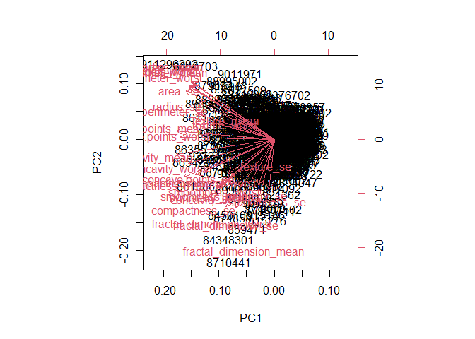
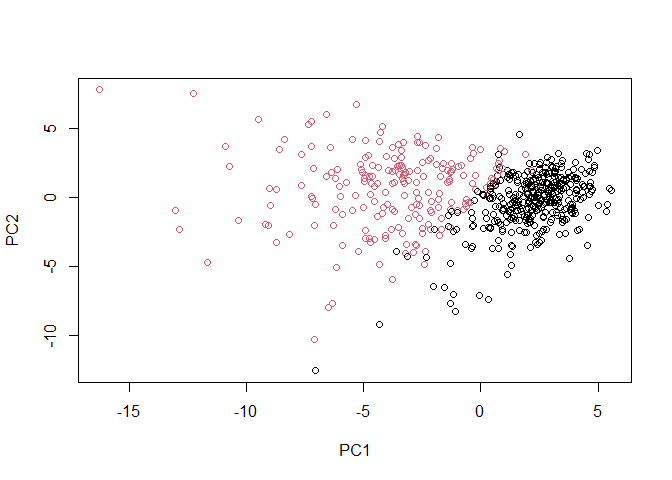
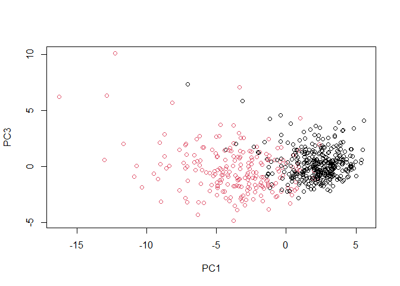
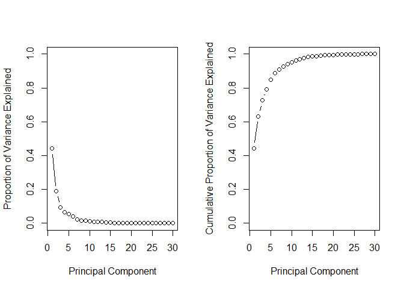
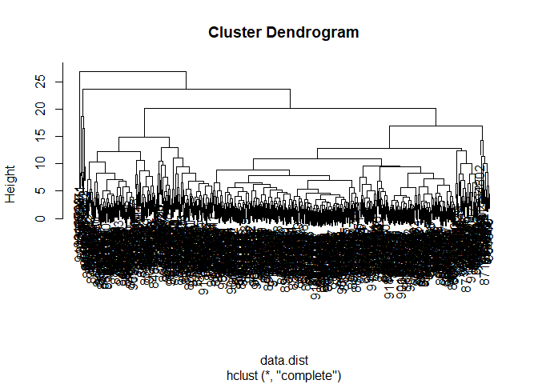

Putting it all together with a case study
================
Mohamad Osman
2022-08-04

# Section 04: Putting it all together with a case study

### **`01-Preparing the data`**

Unlike prior chapters, where we prepared the data for you for
unsupervised learning, the goal of this chapter is to step you through a
more realistic and complete workflow.

Recall from the video that the first step is to download and prepare the
data.

-   Use `read.csv()` function to download the CSV (comma-separated
    values) file containing the data from the URL provided. Assign the
    result to `wisc.df`.

-   Use `as.matrix()` to convert the features of the data (in columns 3
    through 32) to a matrix. Store this in a variable called
    `wisc.data`.

-   Assign the row names of `wisc.data` the values currently contained
    in the `id` column of `wisc.df`. While not strictly required, this
    will help you keep track of the different observations throughout
    the modeling process.

-   Finally, set a vector called `diagnosis` to be `1` if a diagnosis is
    malignant (`"M"`) and `0` otherwise. Note that R coerces `TRUE` to 1
    and `FALSE` to 0.

``` r
library(dplyr)
library(ggplot2)
```

``` r
url <- "https://assets.datacamp.com/production/course_1903/datasets/WisconsinCancer.csv"

# Download the data: wisc.df
wisc.df <- read.csv(url)

# Convert the features of the data: wisc.data
wisc.data <- as.matrix(wisc.df[,3:32])

# Set the row names of wisc.data
row.names(wisc.data) <- wisc.df$id

# Create diagnosis vector
diagnosis <- as.numeric(wisc.df$diagnosis == "M")
```

### **`02-Exploratory data analysis`**

The first step of any data analysis, unsupervised or supervised, is to
familiarize yourself with the data.

The variables you created before, `wisc.data` and `diagnosis`, are still
available in your workspace. Explore the data to answer the following
questions:

1.  How many observations are in this dataset?

2.  How many variables/features in the data are suffixed with `_mean`?

3.  How many of the observations have a malignant diagnosis?

``` r
nrow(wisc.data)
```

    ## [1] 569

``` r
colnames(wisc.data)
```

    ##  [1] "radius_mean"             "texture_mean"           
    ##  [3] "perimeter_mean"          "area_mean"              
    ##  [5] "smoothness_mean"         "compactness_mean"       
    ##  [7] "concavity_mean"          "concave.points_mean"    
    ##  [9] "symmetry_mean"           "fractal_dimension_mean" 
    ## [11] "radius_se"               "texture_se"             
    ## [13] "perimeter_se"            "area_se"                
    ## [15] "smoothness_se"           "compactness_se"         
    ## [17] "concavity_se"            "concave.points_se"      
    ## [19] "symmetry_se"             "fractal_dimension_se"   
    ## [21] "radius_worst"            "texture_worst"          
    ## [23] "perimeter_worst"         "area_worst"             
    ## [25] "smoothness_worst"        "compactness_worst"      
    ## [27] "concavity_worst"         "concave.points_worst"   
    ## [29] "symmetry_worst"          "fractal_dimension_worst"

``` r
table(diagnosis)
```

    ## diagnosis
    ##   0   1 
    ## 357 212

-   569, 5, 112

-   30, 10, 212

-   569, 10, 212 **✔️**

-   30, 5, 112

### 

### `03-Performing PCA`

The next step in your analysis is to perform PCA on `wisc.data`.

You saw in the last chapter that it’s important to check if the data
need to be scaled before performing PCA. Recall two common reasons for
scaling data:

1.  The input variables use different units of measurement.

2.  The input variables have *significantly* different variances.

The variables you created before, `wisc.data` and `diagnosis`, are still
available in your workspace.

-   Check the mean and standard deviation of the features of the data to
    determine if the data should be scaled. Use the `colMeans()` and
    `apply()` functions like you’ve done before.

-   Execute PCA on the `wisc.data`, scaling if appropriate, and assign
    the model to `wisc.pr`.

-   Inspect a summary of the results with the `summary()` function.

``` r
# Check column means and standard deviations
colMeans(wisc.data)
```

    ##             radius_mean            texture_mean          perimeter_mean 
    ##            1.412729e+01            1.928965e+01            9.196903e+01 
    ##               area_mean         smoothness_mean        compactness_mean 
    ##            6.548891e+02            9.636028e-02            1.043410e-01 
    ##          concavity_mean     concave.points_mean           symmetry_mean 
    ##            8.879932e-02            4.891915e-02            1.811619e-01 
    ##  fractal_dimension_mean               radius_se              texture_se 
    ##            6.279761e-02            4.051721e-01            1.216853e+00 
    ##            perimeter_se                 area_se           smoothness_se 
    ##            2.866059e+00            4.033708e+01            7.040979e-03 
    ##          compactness_se            concavity_se       concave.points_se 
    ##            2.547814e-02            3.189372e-02            1.179614e-02 
    ##             symmetry_se    fractal_dimension_se            radius_worst 
    ##            2.054230e-02            3.794904e-03            1.626919e+01 
    ##           texture_worst         perimeter_worst              area_worst 
    ##            2.567722e+01            1.072612e+02            8.805831e+02 
    ##        smoothness_worst       compactness_worst         concavity_worst 
    ##            1.323686e-01            2.542650e-01            2.721885e-01 
    ##    concave.points_worst          symmetry_worst fractal_dimension_worst 
    ##            1.146062e-01            2.900756e-01            8.394582e-02

``` r
apply(wisc.data, 2, sd)
```

    ##             radius_mean            texture_mean          perimeter_mean 
    ##            3.524049e+00            4.301036e+00            2.429898e+01 
    ##               area_mean         smoothness_mean        compactness_mean 
    ##            3.519141e+02            1.406413e-02            5.281276e-02 
    ##          concavity_mean     concave.points_mean           symmetry_mean 
    ##            7.971981e-02            3.880284e-02            2.741428e-02 
    ##  fractal_dimension_mean               radius_se              texture_se 
    ##            7.060363e-03            2.773127e-01            5.516484e-01 
    ##            perimeter_se                 area_se           smoothness_se 
    ##            2.021855e+00            4.549101e+01            3.002518e-03 
    ##          compactness_se            concavity_se       concave.points_se 
    ##            1.790818e-02            3.018606e-02            6.170285e-03 
    ##             symmetry_se    fractal_dimension_se            radius_worst 
    ##            8.266372e-03            2.646071e-03            4.833242e+00 
    ##           texture_worst         perimeter_worst              area_worst 
    ##            6.146258e+00            3.360254e+01            5.693570e+02 
    ##        smoothness_worst       compactness_worst         concavity_worst 
    ##            2.283243e-02            1.573365e-01            2.086243e-01 
    ##    concave.points_worst          symmetry_worst fractal_dimension_worst 
    ##            6.573234e-02            6.186747e-02            1.806127e-02

``` r
# Execute PCA, scaling if appropriate: wisc.pr
wisc.pr <- prcomp(wisc.data, scale = TRUE)

# Look at summary of results
summary(wisc.pr)
```

    ## Importance of components:
    ##                           PC1    PC2     PC3     PC4     PC5     PC6     PC7
    ## Standard deviation     3.6444 2.3857 1.67867 1.40735 1.28403 1.09880 0.82172
    ## Proportion of Variance 0.4427 0.1897 0.09393 0.06602 0.05496 0.04025 0.02251
    ## Cumulative Proportion  0.4427 0.6324 0.72636 0.79239 0.84734 0.88759 0.91010
    ##                            PC8    PC9    PC10   PC11    PC12    PC13    PC14
    ## Standard deviation     0.69037 0.6457 0.59219 0.5421 0.51104 0.49128 0.39624
    ## Proportion of Variance 0.01589 0.0139 0.01169 0.0098 0.00871 0.00805 0.00523
    ## Cumulative Proportion  0.92598 0.9399 0.95157 0.9614 0.97007 0.97812 0.98335
    ##                           PC15    PC16    PC17    PC18    PC19    PC20   PC21
    ## Standard deviation     0.30681 0.28260 0.24372 0.22939 0.22244 0.17652 0.1731
    ## Proportion of Variance 0.00314 0.00266 0.00198 0.00175 0.00165 0.00104 0.0010
    ## Cumulative Proportion  0.98649 0.98915 0.99113 0.99288 0.99453 0.99557 0.9966
    ##                           PC22    PC23   PC24    PC25    PC26    PC27    PC28
    ## Standard deviation     0.16565 0.15602 0.1344 0.12442 0.09043 0.08307 0.03987
    ## Proportion of Variance 0.00091 0.00081 0.0006 0.00052 0.00027 0.00023 0.00005
    ## Cumulative Proportion  0.99749 0.99830 0.9989 0.99942 0.99969 0.99992 0.99997
    ##                           PC29    PC30
    ## Standard deviation     0.02736 0.01153
    ## Proportion of Variance 0.00002 0.00000
    ## Cumulative Proportion  1.00000 1.00000

### **`04-Interpreting PCA results`**

Now you’ll use some visualizations to better understand your PCA model.
You were introduced to one of these visualizations, the biplot, in an
earlier chapter.

You’ll run into some common challenges with using biplots on real-world
data containing a non-trivial number of observations and variables, then
you’ll look at some alternative visualizations. You are encouraged to
experiment with additional visualizations before moving on to the next
exercise.

The variables you created before, `wisc.data`, `diagnosis`, and
`wisc.pr`, are still available.

-   Create a biplot of the `wisc.pr` data. *What stands out to you about
    this plot? Is it easy or difficult to understand? Why?*

-   Execute the code to scatter plot each observation by principal
    components 1 and 2, coloring the points by the diagnosis.

-   Repeat the same for principal components 1 and 3. *What do you
    notice about these plots?*

``` r
# Create a biplot of wisc.pr
biplot(wisc.pr)
```

<!-- -->

``` r
# Scatter plot observations by components 1 and 2
plot(wisc.pr$x [, c(1, 2)], col = (diagnosis + 1), 
     xlab = "PC1", ylab = "PC2")
```

<!-- -->

``` r
# Repeat for components 1 and 3
plot(wisc.pr$x [, c(1, 3)], col = (diagnosis + 1), 
     xlab = "PC1", ylab = "PC3")
```

<!-- -->

``` r
# Do additional data exploration of your choosing below (optional)
```

Excellent work! Because principal component 2 explains more variance in
the original data than principal component 3, you can see that the first
plot has a cleaner cut separating the two subgroups.

### **`05-Variance explained`**

In this exercise, you will produce scree plots showing the proportion of
variance explained as the number of principal components increases. The
data from PCA must be prepared for these plots, as there is not a
built-in function in R to create them directly from the PCA model.

As you look at these plots, ask yourself if there’s an elbow in the
amount of variance explained that might lead you to pick a natural
number of principal components. If an obvious elbow does not exist, as
is typical in real-world datasets, consider how else you might determine
the number of principal components to retain based on the scree plot.

The variables you created before, `wisc.data`, `diagnosis`, and
`wisc.pr`, are still available.

-   Calculate the variance of each principal component by squaring the
    `sdev` component of `wisc.pr`. Save the result as an object called
    `pr.var`.

-   Calculate the variance explained by each principal component by
    dividing by the total variance explained of all principal
    components. Assign this to a variable called `pve`.

-   Create a plot of variance explained for each principal component.

-   Using the `cumsum()` function, create a plot of cumulative
    proportion of variance explained.

``` r
# Set up 1 x 2 plotting grid
par(mfrow = c(1, 2))

# Calculate variability of each component
pr.var <- wisc.pr$sdev^2

# Variance explained by each principal component: pve
pve <- pr.var / sum(pr.var)

# Plot variance explained for each principal component
plot(pve, xlab = "Principal Component", 
     ylab = "Proportion of Variance Explained", 
     ylim = c(0, 1), type = "b")

# Plot cumulative proportion of variance explained
plot(cumsum(pve), xlab = "Principal Component", 
     ylab = "Cumulative Proportion of Variance Explained", 
     ylim = c(0, 1), type = "b")
```

<!-- -->

Great work! Before moving on, answer the following question: What is the
minimum number of principal components needed to explain 80% of the
variance in the data? Write it down as you may need this in the next
exercise :)

between 7 and 10s

### **`06-Communicating PCA results`**

This exercise will check your understanding of the PCA results, in
particular the loadings and variance explained. The loadings,
represented as vectors, explain the mapping from the original features
to the principal components. The principal components are naturally
ordered from the most variance explained to the least variance
explained.

The variables you created before—`wisc.data`, `diagnosis`, `wisc.pr`,
and `pve`—are still available.

For the first principal component, what is the component of the loading
vector for the feature `concave.points_mean`? What is the minimum number
of principal components required to explain 80% of the variance of the
data?

``` r
wisc.pr$rotation["concave.points_mean","PC1"]
```

    ## [1] -0.2608538

-   -0.26085376, 5 **✔️**

-   -0.25088597, 2

-   0.034767500, 4

-   0.26085376, 5

### **`07-Hierarchical clustering of case data`**

The goal of this exercise is to do hierarchical clustering of the
observations. Recall from Chapter 2 that this type of clustering does
not assume in advance the number of natural groups that exist in the
data.

As part of the preparation for hierarchical clustering, distance between
all pairs of observations are computed. Furthermore, there are different
ways to *link* clusters together, with *single*, *complete*, and
*average* being the most common linkage methods.

The variables you created before, `wisc.data`, `diagnosis`, `wisc.pr`,
and `pve`, are available in your workspace.

-   Scale the `wisc.data` data and assign the result to `data.scaled`.

-   Calculate the (Euclidean) distances between all pairs of
    observations in the new scaled dataset and assign the result to
    `data.dist`.

-   Create a hierarchical clustering model using complete linkage.
    Manually specify the `method` argument to `hclust()` and assign the
    results to `wisc.hclust`.

``` r
# Scale the wisc.data data: data.scaled
data.scaled <- scale(wisc.data)

# Calculate the (Euclidean) distances: data.dist
data.dist <- dist(data.scaled)

# Create a hierarchical clustering model: wisc.hclust
wisc.hclust <- hclust(data.dist, method="complete")
```

### **`08-Results of hierarchical clustering`**

Let’s use the hierarchical clustering model you just created to
determine a height (or distance between clusters) where a certain number
of clusters exists. The variables you created before—`wisc.data`,
`diagnosis`, `wisc.pr`, `pve`, and `wisc.hclust`—are all available in
your workspace.

Using the `plot()` function, what is the height at which the clustering
model has 4 clusters?

``` r
plot(wisc.hclust)
```

<!-- -->

-   20 **✔️**

-   4

-   10

-   24

### 

**`09-Selecting number of clusters`**

In this exercise, you will compare the outputs from your hierarchical
clustering model to the actual diagnoses. Normally when performing
*unsupervised* learning like this, a target variable isn’t available. We
do have it with this dataset, however, so it can be used to check the
performance of the clustering model.

When performing *supervised* learning—that is, when you’re trying to
predict some target variable of interest and that target variable is
available in the original data—using clustering to create new features
may or may not improve the performance of the final model. This exercise
will help you determine if, in this case, hierarchical clustering
provides a promising new feature.

`wisc.data`, `diagnosis`, `wisc.pr`, `pve`, and `wisc.hclust` are
available in your workspace.

-   Use `cutree()` to cut the tree so that it has 4 clusters. Assign the
    output to the variable `wisc.hclust.clusters`.

-   Use the `table()` function to compare the cluster membership to the
    actual diagnoses.

``` r
# Cut tree so that it has 4 clusters: wisc.hclust.clusters
wisc.hclust.clusters <- cutree(wisc.hclust, k=4)

# Compare cluster membership to actual diagnoses
table(wisc.hclust.clusters, diagnosis)
```

    ##                     diagnosis
    ## wisc.hclust.clusters   0   1
    ##                    1  12 165
    ##                    2   2   5
    ##                    3 343  40
    ##                    4   0   2

Four clusters were picked after some exploration. Before moving on, you
may want to explore how different numbers of clusters affect the ability
of the hierarchical clustering to separate the different diagnoses.
Great job!

### **`10-k-means clustering and comparing results`**

As you now know, there are two main types of clustering: hierarchical
and k-means.

In this exercise, you will create a k-means clustering model on the
Wisconsin breast cancer data and compare the results to the actual
diagnoses and the results of your hierarchical clustering model. Take
some time to see how each clustering model performs in terms of
separating the two diagnoses and how the clustering models compare to
each other.

`wisc.data`, `diagnosis`, and `wisc.hclust.clusters` are still
available.

-   Create a k-means model on `wisc.data`, assigning the result to
    `wisc.km`. Be sure to create 2 clusters, corresponding to the actual
    number of diagnosis. Also, remember to scale the data and repeat the
    algorithm 20 times to find a well performing model.

-   Use the `table()` function to compare the cluster membership of the
    k-means model to the actual diagnoses contained in the `diagnosis`
    vector. *How well does k-means separate the two diagnoses?*

-   Use the `table()` function to compare the cluster membership of the
    k-means model to the hierarchical clustering model. Recall the
    cluster membership of the hierarchical clustering model is contained
    in `wisc.hclust.clusters`.

``` r
# Create a k-means model on wisc.data: wisc.km
wisc.km <- kmeans(scale(wisc.data), centers=2, nstart=20)

# Compare k-means to actual diagnoses
table(wisc.km$cluster, diagnosis)
```

    ##    diagnosis
    ##       0   1
    ##   1 343  37
    ##   2  14 175

``` r
# Compare k-means to hierarchical clustering
table(wisc.km$cluster, wisc.hclust.clusters)
```

    ##    wisc.hclust.clusters
    ##       1   2   3   4
    ##   1  17   0 363   0
    ##   2 160   7  20   2

Nice! Looking at the second table you generated, it looks like clusters
1, 2, and 4 from the hierarchical clustering model can be interpreted as
the cluster 1 equivalent from the k-means algorithm, and cluster 3 can
be interpreted as the cluster 2 equivalent.

### 

**`11-Clustering on PCA results`**

In this final exercise, you will put together several steps you used
earlier and, in doing so, you will experience some of the creativity
that is typical in unsupervised learning.

Recall from earlier exercises that the PCA model required significantly
fewer features to describe 80% and 95% of the variability of the data.
In addition to *normalizing* data and potentially avoiding overfitting,
PCA also uncorrelates the variables, sometimes improving the performance
of other modeling techniques.

Let’s see if PCA improves or degrades the performance of hierarchical
clustering.

`wisc.pr`, `diagnosis`, `wisc.hclust.clusters`, and `wisc.km` are still
available in your workspace.

-   Using the minimum number of principal components required to
    describe at least 90% of the variability in the data, create a
    hierarchical clustering model with complete linkage. Assign the
    results to `wisc.pr.hclust`.

-   Cut this hierarchical clustering model into 4 clusters and assign
    the results to `wisc.pr.hclust.clusters`.

-   Using `table()`, compare the results from your new hierarchical
    clustering model with the actual diagnoses. How well does the newly
    created model with four clusters separate out the two diagnoses?

-   How well do the k-means and hierarchical clustering models you
    created in previous exercises do in terms of separating the
    diagnoses? Again, use the `table()` function to compare the output
    of each model with the vector containing the actual diagnoses.

``` r
# Create a hierarchical clustering model: wisc.pr.hclust
wisc.pr.hclust <- hclust(dist(wisc.pr$x[, 1:7]), method = "complete")

# Cut model into 4 clusters: wisc.pr.hclust.clusters
wisc.pr.hclust.clusters <- cutree(wisc.pr.hclust, k=4)

# Compare to actual diagnoses
table(wisc.pr.hclust.clusters, diagnosis)
```

    ##                        diagnosis
    ## wisc.pr.hclust.clusters   0   1
    ##                       1   5 113
    ##                       2 350  97
    ##                       3   2   0
    ##                       4   0   2

``` r
# Compare to k-means and hierarchical
table(wisc.km$cluster, diagnosis)
```

    ##    diagnosis
    ##       0   1
    ##   1 343  37
    ##   2  14 175

``` r
table(wisc.hclust.clusters,diagnosis)
```

    ##                     diagnosis
    ## wisc.hclust.clusters   0   1
    ##                    1  12 165
    ##                    2   2   5
    ##                    3 343  40
    ##                    4   0   2

### **`The End`**
