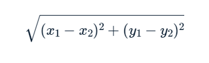
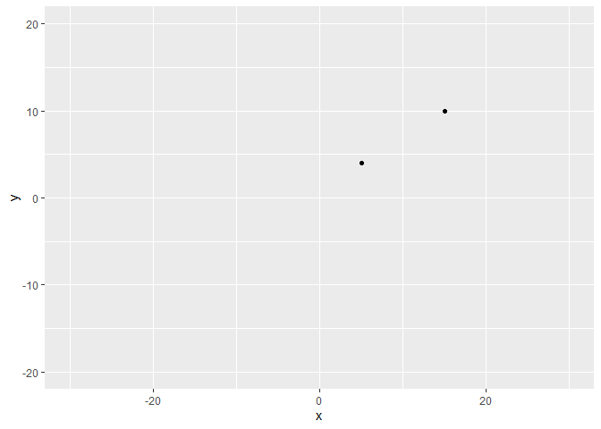

Calculating Distance Between Observations
================
Mohamad Osman
2022-08-10

# Section 01: Calculating Distance Between Observations

### **`01-When to cluster?`**

**In which of these scenarios would clustering methods likely be
appropriate?**

1)  Using consumer behavior data to identify distinct segments within a
    market. **✔️**

2)  Predicting whether a given user will click on an ad.

3)  Identifying distinct groups of stocks that follow similar trading
    patterns. **✔️**

4)  Modeling & predicting GDP growth.

1 & 3

### 

`02-Calculate & plot the distance between two players`

You’ve obtained the coordinates relative to the center of the field for
two players in a soccer match and would like to calculate the distance
between them.

In this exercise you will plot the positions of the 2 players and
manually calculate the distance between them by using the Euclidean
distance formula.

-   Plot their positions from the `two_players` data frame using
    `ggplot`.

-   Extract the positions of the players into two data frames `player1`
    and `player2`.

-   Calculate the distance between player1 and player2 by using the
    Euclidean distance formula



``` r
library(dplyr)
library(tibble)
library(ggplot2)

two_players <- tibble(x=c(5, 15), y=c(4, 10))
three_players <- tibble(x=c(5, 15, 0), y=c(4, 10, 20))
```

``` r
# Plot the positions of the players
ggplot(two_players, aes(x = x, y = y)) + 
  geom_point() +
  # Assuming a 40x60 field
  lims(x = c(-30,30), y = c(-20, 20))
```

<!-- -->

``` r
# Split the players data frame into two observations
player1 <- two_players[1, ]
player2 <- two_players[2, ]

# Calculate and print their distance using the Euclidean Distance formula
player_distance <- sqrt( (player1$x - player2$x)^2 + (player1$y - player2$y)^2 )
player_distance
```

    ## [1] 11.6619

### **`03-Using the dist() function`**

Using the Euclidean formula manually may be practical for 2 observations
but can get more complicated rather quickly when measuring the distance
between many observations.

The `dist()` function simplifies this process by calculating distances
between our observations (rows) using their features (columns). In this
case the observations are the player positions and the dimensions are
their x and y coordinates.

*Note: The default distance calculation for the `dist()` function is
Euclidean distance*

-   Calculate the distance between two players using the `dist()`
    function for the data frame `two_players`.

-   Calculate the distance between three players for the data frame
    `three_players`.

``` r
# Calculate the Distance Between two_players
dist_two_players <- dist(two_players)
dist_two_players
```

    ##         1
    ## 2 11.6619

``` r
# Calculate the Distance Between three_players
dist_three_players <- dist(three_players)
dist_three_players
```

    ##          1        2
    ## 2 11.66190         
    ## 3 16.76305 18.02776

### **`04-Who are the closest players?`**

You are given the data frame containing the positions of 4 players on a
soccer field.

This data is preloaded as `four_players` in your environment and is
displayed below.

``` r
four_players <- tibble(x=c(5, 15, 0, -5), y=c(4, 10, 20, 5))
dist(four_players)
```

    ##          1        2        3
    ## 2 11.66190                  
    ## 3 16.76305 18.02776         
    ## 4 10.04988 20.61553 15.81139

**Which two players are closest to one another?**

-   1 & 2

-   1 & 3

-   1 & 4 **✔️**

-   2 & 3

-   2 & 4

-   3 & 4

-   Not enough information to decide

### **`05-Effects of scale`**

You have learned that when a variable is on a larger scale than other
variables in your data it may disproportionately influence the resulting
distance calculated between your observations. Lets see this in action
by observing a sample of data from the `trees` data set.

You will leverage the `scale()` function which by default centers &
scales our column features.

Our variables are the following:

-   **Girth** - tree diameter in inches

-   **Height** - tree height in inches

-   Calculate the distance matrix for the data frame `three_trees` and
    store it as `dist_trees`.

-   Create a new variable `scaled_three_trees` where the `three_trees`
    data is centered & scaled.

-   Calculate and print the distance matrix for `scaled_three_trees` and
    store this as `dist_scaled_trees`.

-   Output both `dist_trees` and `dist_scaled_trees` matrices and
    observe the change of which observations have the smallest distance
    between the two matrices *(hint: they have changed)*.

``` r
three_trees <- tibble(Girth = c(8.3, 8.6, 10.5), Height = c(840, 780, 864))

# Calculate distance for three_trees 
dist_trees <- dist(three_trees)

# Scale three trees & calculate the distance  
scaled_three_trees <- scale(three_trees)
dist_scaled_trees <- dist(scaled_three_trees)

# Output the results of both Matrices
print('Without Scaling')
```

    ## [1] "Without Scaling"

``` r
dist_trees
```

    ##          1        2
    ## 2 60.00075         
    ## 3 24.10062 84.02149

``` r
print('With Scaling')
```

    ## [1] "With Scaling"

``` r
dist_scaled_trees
```

    ##          1        2
    ## 2 1.409365         
    ## 3 1.925659 2.511082

Notice that before scaling observations 1 & 3 were the closest but after
scaling observations 1 & 2 turn out to have the smallest distance.

### **`06-When to scale data?`**

Below are examples of datasets and their corresponding features.

In which of these examples would scaling **not** be necessary?

-   Taxi Trips - `tip earned ($)`, `distance traveled (km)`.

-   Health Measurements of Individuals - `height (meters)`,
    `weight (grams)`, `body fat percentage (%)`.

-   Student Attributes - `average test score (1-100)`,
    `distance from school (km)`, `annual household income ($)`.

-   Salespeople Commissions - `total yearly commision ($)`,
    `number of trips taken`.

-   None of the above, they all should be scaled when measuring
    distance. **✔️**

### 

**`07-Calculating distance between categorical variables`**

In this exercise you will explore how to calculate binary (Jaccard)
distances. In order to calculate distances we will first have to dummify
our categories using the `dummy.data.frame()` from the library `dummies`

You will use a small collection of survey observations stored in the
data frame `job_survey` with the following columns:

``` r
job_satisfaction <- c("Hi","Hi","Hi","Hi","Mid")
is_happy <- c("No","No","No","Yes","No")
job_survey <- tibble(job_satisfaction, is_happy)
job_survey
```

    ## # A tibble: 5 × 2
    ##   job_satisfaction is_happy
    ##   <chr>            <chr>   
    ## 1 Hi               No      
    ## 2 Hi               No      
    ## 3 Hi               No      
    ## 4 Hi               Yes     
    ## 5 Mid              No

-   **job_satisfaction** Possible options: “Hi”, “Mid”, “Low”

-   **is_happy** Possible options: “Yes”, “No”

-   Create a dummified data frame `dummy_survey`.

-   Generate a Jaccard distance matrix for the dummified survey data
    `dist_survey` using the `dist()` function using the parameter
    `method = 'binary'`.

-   Print the original data and the distance matrix.

    -   Note the observations with a distance of 0 in the original data
        (1, 2, and 3).

``` r
library(dummy)
```

    ## dummy 0.1.3

    ## dummyNews()

``` r
# Dummify the Survey Data
dummy_survey <- dummy(job_survey)

# Calculate the Distance
dist_survey <- dist(dummy_survey, method="binary")

# Print the Original Data
job_survey
```

    ## # A tibble: 5 × 2
    ##   job_satisfaction is_happy
    ##   <chr>            <chr>   
    ## 1 Hi               No      
    ## 2 Hi               No      
    ## 3 Hi               No      
    ## 4 Hi               Yes     
    ## 5 Mid              No

``` r
# Print the Distance Matrix
dist_survey
```

    ##           1         2         3         4
    ## 2 0.0000000                              
    ## 3 0.0000000 0.0000000                    
    ## 4 0.6666667 0.6666667 0.6666667          
    ## 5 0.6666667 0.6666667 0.6666667 1.0000000

### **`08-The closest observation to a pair`**

Below you see a pre-calculated distance matrix between four players on a
soccer field. You can clearly see that players **1** & **4** are the
closest to one another with a Euclidean distance value of 10.

|     | 1    | 2    | 3    |
|-----|:-----|:-----|:-----|
| 2   | 11.7 |      |      |
| 3   | 16.8 | 18.0 |      |
| 4   | 10.0 | 20.6 | 15.8 |

**If 1 and 4 are the closest players among the four, which player is
closest to players *1* and *4*?**

-   Clearly its player 2!

-   No! Player 3 makes more sense.

-   Are you kidding me? There isn’t enough information to decide. **✔️**

Great job! We clearly don’t have enough information to make this
decision without knowing how we compare one observation to a pair of
observations.  
The decision required is known as the **linkage method** and which you
will learn about in the next chapter!

### 

**`The End`**
