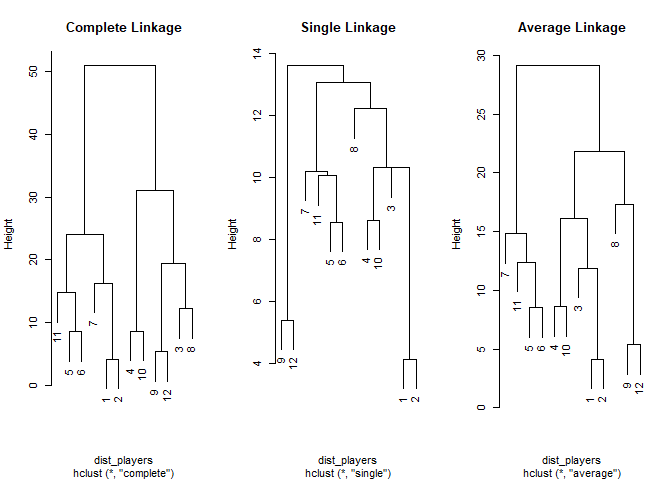

Hierarchical Clustering
================
Mohamad Osman
2022-08-11

# **Section 02: Hierarchical Clustering**

### **`01-Calculating linkage`**

``` r
library(dplyr)
library(ggplot2)
```

Let us revisit the example with three players on a field. The distance
matrix between these three players is shown below and is available as
the variable `dist_players`.

From this we can tell that the first group that forms is between players
**1** & **2**, since they are the closest to one another with a
Euclidean distance value of 11.

Now you want to apply the three linkage methods you have learned to
determine what the distance of this group is to player **3**.

|     | 1   | 2   |
|:----|:----|:----|
| 2   | 11  |     |
| 3   | 16  | 18  |

-   Calculate the distance from player 3 to the group of players 1 & 2
    using the following three linkage methods.

    -   **Complete:** the resulting distance is based on the maximum.

    -   **Single:** the resulting distance is based on the minimum.

    -   **Average:** the resulting distance is based on the average.

``` r
# Calculate the Distance Between three_players
three_players <- tibble(x=c(5, 15, 0), y=c(4, 10, 20))
dist_players <- dist(three_players)
dist_players
```

    ##          1        2
    ## 2 11.66190         
    ## 3 16.76305 18.02776

``` r
# Extract the pair distances
distance_1_2 <- dist_players[1]
distance_1_3 <- dist_players[2]
distance_2_3 <- dist_players[3]

# Calculate the complete distance between group 1-2 and 3
complete <- max(c(distance_1_3, distance_2_3))
complete
```

    ## [1] 18.02776

``` r
# Calculate the single distance between group 1-2 and 3
single <- min(c(distance_1_3, distance_2_3))
single
```

    ## [1] 16.76305

``` r
# Calculate the average distance between group 1-2 and 3
average <- mean(c(distance_1_3, distance_2_3))
average
```

    ## [1] 17.39541

### **`02-Revisited: The closest observation to a pair`**

**You are now ready to answer this question!**

Below you see a pre-calculated distance matrix between four players on a
soccer field. You can clearly see that players **1** & **4** are the
closest to one another with a Euclidean distance value of 10. This
distance matrix is available for your exploration as the variable
`dist_players`

|     | 1    | 2    | 3    |
|:----|:-----|:-----|:-----|
| 2   | 11.7 |      |      |
| 3   | 16.8 | 18.0 |      |
| 4   | 10.0 | 20.6 | 15.8 |

**If 1 and 4 are the closest players among the four, which player is
closest to players *1* and *4*?**

-   Complete Linkage: Player 3,  
    Single & Average Linkage: Player 2 **✔️**

-   Complete Linkage: Player 2,  
    Single & Average Linkage: Player 3

-   Player 2 using Complete, Single & Average Linkage methods

-   Player 3 using Complete, Single & Average Linkage methods

### **`03-Assign cluster membership`**

In this exercise you will leverage the `hclust()` function to calculate
the iterative linkage steps and you will use the `cutree()` function to
extract the cluster assignments for the desired number (`k`) of
clusters.

You are given the positions of 12 players at the start of a 6v6 soccer
match. This is stored in the `lineup` data frame.

You know that this match has two teams (k = 2), let’s use the clustering
methods you learned to assign which team each player belongs in based on
their position.

**Notes:**

-   The linkage method can be passed via the **method** parameter:
    `hclust(distance_matrix, method = "complete")`

-   Remember that in soccer opposing teams start on their half of the
    field.

-   Because these positions are measured using the same scale we do not
    need to re-scale our data.

    **Questions:**

-   Calculate the Euclidean distance matrix `dist_players` among all
    twelve players.

-   Perform the **complete** linkage calculation for hierarchical
    clustering using `hclust` and store this as `hc_players`.

-   Build the cluster assignment vector `clusters_k2` using `cutree()`
    with a `k = 2`.

-   Append the cluster assignments as a column `cluster` to the `lineup`
    data frame and save the results to a new data frame called
    `lineup_k2_complete`.

``` r
x <- c(-1,-2,8,7,-12,-15,-13,15,21,12,-25,26)
y <- c(1,-3,6,-8,8,0,-10,16,2,-15,1,0)
lineup <- tibble(x,y)
```

``` r
# Calculate the Distance
dist_players <- dist(lineup)

# Perform the hierarchical clustering using the complete linkage
hc_players <- hclust(dist_players, method = "complete")

# Calculate the assignment vector with a k of 2
clusters_k2 <- cutree(hc_players, k = 2)

# Create a new data frame storing these results
lineup_k2_complete <- mutate(lineup, cluster = clusters_k2)
```

### **`04-Exploring the clusters`**

Because clustering analysis is always in part **qualitative**, it is
incredibly important to have the necessary tools to explore the results
of the clustering.

In this exercise you will explore that data frame you created in the
previous exercise `lineup_k2_complete`.

**Reminder:** The `lineup_k2_complete` data frame contains the x & y
positions of 12 players at the start of a 6v6 soccer game to which you
have added clustering assignments based on the following parameters:

-   Distance: *Euclidean*

-   Number of Clusters (k): *2*

-   Linkage Method: *Complete*

**Questions**

-   Using `count()` from dplyr, count the number of players assigned to
    each cluster.

-   Using `ggplot()`, plot the positions of the players and color them
    by cluster assignment.

``` r
# Count the cluster assignments
count(lineup_k2_complete, cluster)
```

    ## # A tibble: 2 × 2
    ##   cluster     n
    ##     <int> <int>
    ## 1       1     6
    ## 2       2     6

``` r
# Plot the positions of the players and color them using their cluster
ggplot(lineup_k2_complete, aes(x = x, y = y, color = factor(cluster))) +
  geom_point()
```

<!-- -->

### 

**`05-Validating the clusters`**

In the plot below you see the clustering results of the same lineup data
you’ve previously worked with but with some minor modifications in the
clustering steps.

-   The **left plot** was generated using a `k=2` and
    `method = 'average'`

-   The **right plot** was generated using a `k=3` and
    `method = 'complete'`


**If our goal is to correctly assign each player to their correct team
then based on what you see in the above plot and what you know about the
data set which of the statements below are correct?**

-   The **left plot** successfully clusters the players in their correct
    team.

-   The **right plot** successfully clusters the players in their
    correct team.

-   The **left plot** fails to correctly cluster the players;  
    because this is a 6v6 game the expectation is that both clusters
    should have 6 members each.

-   The **right plot** fails to correctly cluster the players;  
    because this is a two team match clustering into three unequal
    groups does not address the question correctly.

-   Answers 3 & 4 are both correct. **✔️**

    Exactly! Both the results in the left and the right plots can be
    deemed incorrect based on what we expect from our data.

### **`06-Comparing average, single & complete linkage`**

You are now ready to analyze the clustering results of the `lineup`
dataset using the dendrogram plot. This will give you a new perspective
on the effect the decision of the linkage method has on your resulting
cluster analysis.

``` r
# Prepare the Distance Matrix
dist_players <- dist(lineup)

# Generate hclust for complete, single & average linkage methods
hc_complete <- hclust(dist_players, method="complete")
hc_single <- hclust(dist_players,method="single")
hc_average <- hclust(dist_players, method="average")

# Plot & Label the 3 Dendrograms Side-by-Side
# Hint: To see these Side-by-Side run the 4 lines together as one command
par(mfrow = c(1,3))
plot(hc_complete, main = 'Complete Linkage')
plot(hc_single, main = 'Single Linkage')
plot(hc_average, main = 'Average Linkage')
```

<!-- -->

### **`07-Height of the tree`**

An advantage of working with a clustering method like hierarchical
clustering is that you can describe the relationships between your
observations based on both the **distance metric** and the **linkage
metric** selected (the combination of which defines the height of the
tree).

  
**Based on the code below what can you concretely say about the height
of a branch in the resulting dendrogram?**

`dist_players <- dist(lineup, method = 'euclidean')`  
`hc_players <- hclust(dist_players, method = 'single')`  
`plot(hc_players)`

**All of the observations linked by this branch must have:**

Exactly! Based on this code we can concretely say that for a given
branch on a tree all members that are a part of that branch must have a
minimum Euclidean distance amongst one another equal to or less than the
height of that branch.  
In the next section you will see how this description can be put into
action to generate clusters that can be described using the same logic.

-   a **maximum Euclidean** distance amongst each other less than or
    equal to the height of the branch.

-   a **minimum Jaccard** distance amongst each other less than or equal
    to the height of the branch.

-   a **minimum Euclidean** distance amongst each other less than or
    equal to the height of the branch**✔️**

### **`08-Clusters based on height`**

In previous exercises, you have grouped your observations into clusters
using a pre-defined number of clusters (**k**). In this exercise, you
will leverage the visual representation of the dendrogram in order to
group your observations into clusters using a maximum height (**h**),
below which clusters form.

You will work the `color_branches()` function from the `dendextend`
library in order to visually inspect the clusters that form at any
height along the dendrogram.

The **hc_players** has been carried over from your previous work with
the soccer line-up data.

-   Create a dendrogram object `dend_players` from your `hclust` result
    using the function `as.dendrogram()`.

-   Plot the dendrogram.

-   Using the `color_branches()` function create & plot a new dendrogram
    with clusters colored by a cut height of 20.

-   Repeat the above step with a height of 40.

``` r
library(dendextend)
dist_players <- dist(lineup, method = 'euclidean')
hc_players <- hclust(dist_players, method = "complete")

# Create a dendrogram object from the hclust variable
dend_players <- as.dendrogram(hc_players)

# Plot the dendrogram
plot(dend_players)
```

<!-- -->

``` r
# Color branches by cluster formed from the cut at a height of 20 & plot
dend_20 <- color_branches(dend_players, h = 20)

# Plot the dendrogram with clusters colored below height 20
plot(dend_20)
```

<!-- -->

``` r
# Color branches by cluster formed from the cut at a height of 40 & plot
dend_40 <- color_branches(dend_players, h = 40)

# Plot the dendrogram with clusters colored below height 40
plot(dend_40)
```

<!-- -->

### **`09-Exploring the branches cut from the tree`**

The `cutree()` function you used in exercises 5 & 6 can also be used to
cut a tree at a given height by using the `h` parameter. Take a moment
to explore the clusters you have generated from the previous exercises
based on the heights 20 & 40.

-   Build the cluster assignment vector `clusters_h20` using `cutree()`
    with a `h = 20`.

-   Append the cluster assignments as a column `cluster` to the `lineup`
    data frame and save the results to a new data frame called
    `lineup_h20_complete`.

-   Repeat the above two steps for a height of **40**, generating the
    variables `clusters_h40` and `lineup_h40_complete`.

-   Use ggplot2 to create a scatter plot, colored by the cluster
    assignment for both heights.

``` r
dist_players <- dist(lineup, method = 'euclidean')
hc_players <- hclust(dist_players, method = "complete")

# Calculate the assignment vector with a h of 20
clusters_h20 <- cutree(hc_players, h=20)

# Create a new data frame storing these results
lineup_h20_complete <- mutate(lineup, cluster = clusters_h20)

# Calculate the assignment vector with a h of 40
clusters_h40 <- cutree(hc_players, h=40)

# Create a new data frame storing these results
lineup_h40_complete <- mutate(lineup, cluster = clusters_h40)

# Plot the positions of the players and color them using their cluster for height = 20
ggplot(lineup_h20_complete, aes(x = x, y = y, color = factor(cluster))) +
  geom_point()
```

<!-- -->

``` r
# Plot the positions of the players and color them using their cluster for height = 40
ggplot(lineup_h40_complete, aes(x = x, y = y, color = factor(cluster))) +
  geom_point()
```

<!-- -->

### **`10-What do we know about our clusters?`**

**Based on the code below, what can you concretely say about the
relationships of the members within each cluster?**

`dist_players <- dist(lineup, method = 'euclidean')`  
`hc_players <- hclust(dist_players, method = 'complete')`  
`clusters <- cutree(hc_players, h = 40)`

**Every member belonging to a cluster must have:**

``` r
dist_players <- dist(lineup, method = 'euclidean')
hc_players <- hclust(dist_players, method = 'complete')
clusters <- cutree(hc_players, h = 40)
```

-   a **maximum Euclidean** distance to all other members of its cluster
    that is less than 40. **✔️**

-   a **maximum Euclidean** distance to all other members of its cluster
    that is greater than or equal to 40.

-   a **average Euclidean** distance to all other members of its cluster
    that is less than 40.

Correct! The height of any branch is determined by the linkage and
distance decisions (in this case complete linkage and Euclidean
distance). While the members of the clusters that form below a desired
height have a maximum linkage+distance amongst themselves that is less
than the desired height.

### **`11-Segment wholesale customers`**

You’re now ready to use hierarchical clustering to perform market
segmentation (i.e. use consumer characteristics to group them into
subgroups).

In this exercise you are provided with the amount spent by 45 different
clients of a wholesale distributor for the food categories of **Milk**,
**Grocery** & **Frozen**. This is stored in the data frame
`customers_spend`. Assign these clients into meaningful clusters.

**Note:** For this exercise you can assume that because the data is all
of the same type (amount spent) and you will not need to scale it.

-   Calculate the Euclidean distance between the customers and store
    this in `dist_customers`.

-   Run hierarchical clustering using **complete** linkage and store in
    `hc_customers`.

-   Plot the dendrogram.

-   Create a cluster assignment vector using a height of 15,000 and
    store it as `clust_customers`.

-   Generate a new data frame `segment_customers` by appending the
    cluster assignment as the column `cluster` to the original
    `customers_spend` data frame

``` r
file_path <- file.path("..", "00_Datasets", "customers_spend.txt")
customers_spend <- read.delim(file_path)
```

``` r
# Calculate Euclidean distance between customers
dist_customers <- dist(customers_spend)

# Generate a complete linkage analysis 
hc_customers <- hclust(dist_customers, method="complete")

# Plot the dendrogram
plot(hc_customers)
```

<!-- -->

``` r
# Create a cluster assignment vector at h = 15000
clust_customers <- cutree(hc_customers, h = 15000)

# Generate the segmented customers data frame
segment_customers <- mutate(customers_spend, cluster = clust_customers)
```

### **`12-Explore wholesale customer clusters`**

Continuing your work on the wholesale dataset you are now ready to
analyze the characteristics of these clusters.

Since you are working with more than 2 dimensions it would be
challenging to visualize a scatter plot of the clusters, instead you
will rely on summary statistics to explore these clusters. In this
exercise you will analyze the mean amount spent in each cluster for all
three categories.

-   Calculate the size of each cluster using `count()`.

-   Color & plot the dendrogram using the height of 15,000.

-   Calculate the average spending for each category within each cluster
    using the `summarise_all()` function.

``` r
dist_customers <- dist(customers_spend)
hc_customers <- hclust(dist_customers)
clust_customers <- cutree(hc_customers, h = 15000)
segment_customers <- mutate(customers_spend, cluster = clust_customers)

# Count the number of customers that fall into each cluster
count(segment_customers, cluster)
```

    ##   cluster  n
    ## 1       1  5
    ## 2       2 29
    ## 3       3  5
    ## 4       4  6

``` r
# Color the dendrogram based on the height cutoff
dend_customers <- as.dendrogram(hc_customers)
dend_colored <- color_branches(dend_customers, h=15000)

# Plot the colored dendrogram
plot(dend_colored)
```

<!-- -->

``` r
# Calculate the mean for each category
segment_customers %>% 
  group_by(cluster) %>% 
  summarise_all(list(mean))
```

    ## # A tibble: 4 × 4
    ##   cluster   Milk Grocery Frozen
    ##     <int>  <dbl>   <dbl>  <dbl>
    ## 1       1 16950   12891.   991.
    ## 2       2  2513.   5229.  1796.
    ## 3       3 10452.  22551.  1355.
    ## 4       4  1250.   3917. 10889.

-   Customers in cluster 1 spent more money on Milk than any other
    cluster.

<!-- -->

-   Customers in cluster 3 spent more money on Grocery than any other
    cluster.

-   Customers in cluster 4 spent more money on Frozen goods than any
    other cluster.

-   The majority of customers fell into cluster 2 and did not show any
    excessive spending in any category.

-   All of the above. **✔️**

### **`The End`**
