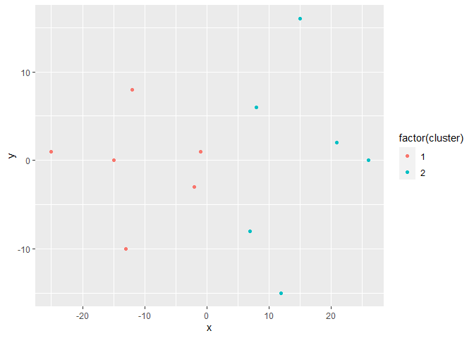
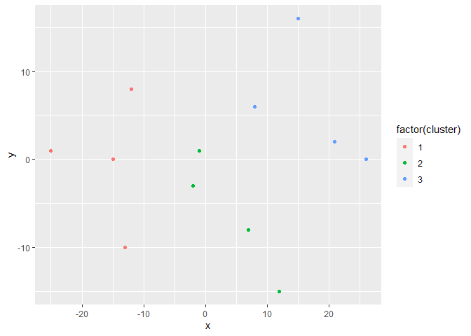
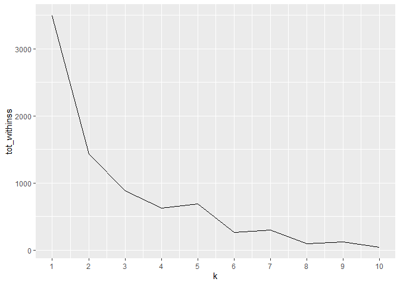
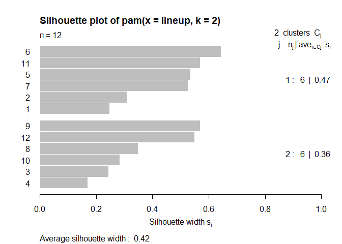
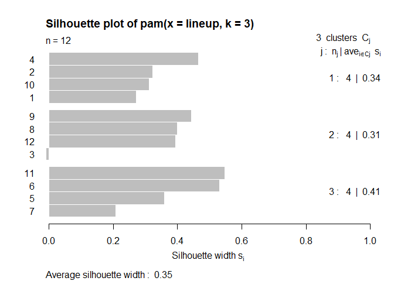
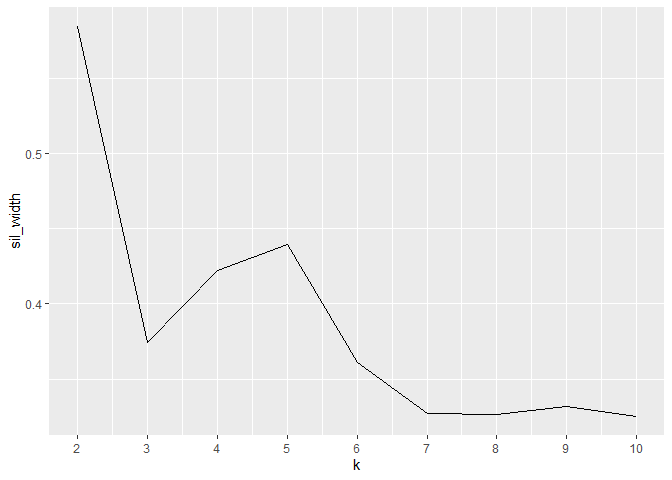

K-means Clustering
================
Mohamad Osman
2022-08-11

# Section 01: K-means Clustering

### **`01-K-means on a soccer field`**

In the previous chapter, you used the `lineup` dataset to learn about
**hierarchical** clustering, in this chapter you will use the same data
to learn about **k-means** clustering. As a reminder, the `lineup` data
frame contains the positions of 12 players at the start of a 6v6 soccer
match.

Just like before, you know that this match has two teams on the field so
you can perform a k-means analysis using *k = 2* in order to determine
which player belongs to which team.

Note that in the `kmeans()` function `k` is specified using the
`centers` parameter.

-   Build a k-means model called `model_km2` for the `lineup` data using
    the `kmeans()` function with `centers = 2`.

-   Extract the vector of cluster assignments from the model
    `model_km2$cluster` and store this in the variable `clust_km2`.

-   Append the cluster assignments as a column `cluster` to the `lineup`
    data frame and save the results to a new data frame called
    `lineup_km2`.

-   Use ggplot to plot the positions of each player on the field and
    color them by their cluster.

``` r
library(dplyr)
```

    ## 
    ## Attaching package: 'dplyr'

    ## The following objects are masked from 'package:stats':
    ## 
    ##     filter, lag

    ## The following objects are masked from 'package:base':
    ## 
    ##     intersect, setdiff, setequal, union

``` r
library(ggplot2)

x <- c(-1,-2,8,7,-12,-15,-13,15,21,12,-25,26)
y <- c(1,-3,6,-8,8,0,-10,16,2,-15,1,0)
lineup <- tibble(x,y)
```

``` r
# Build a kmeans model
model_km2 <- kmeans(lineup, centers = 2)

# Extract the cluster assignment vector from the kmeans model
clust_km2 <- model_km2$cluster

# Create a new data frame appending the cluster assignment
lineup_km2 <- mutate(lineup, cluster = clust_km2)

# Plot the positions of the players and color them using their cluster
ggplot(lineup_km2, aes(x = x, y = y, color = factor(cluster))) +
  geom_point()
```

<!-- -->

### **`02-K-means on a soccer field (part 2)`**

In the previous exercise, you successfully used the **k-means**
algorithm to cluster the two teams from the `lineup` data frame. This
time, let’s explore what happens when you use a `k` of **3**.

You will see that the algorithm will still run, but does it actually
make sense in this context…

-   Build a k-means model called `model_km3` for the `lineup` data using
    the `kmeans()` function with `centers = 3`.

-   Extract the vector of cluster assignments from the model
    `model_km3$cluster` and store this in the variable `clust_km3`.

-   Append the cluster assignments as a column `cluster` to the `lineup`
    data frame and save the results to a new data frame called
    `lineup_km3`.

-   Use ggplot to plot the positions of each player on the field and
    color them by their cluster.

``` r
# Build a kmeans model
model_km3 <- kmeans(lineup, centers = 3)

# Extract the cluster assignment vector from the kmeans model
clust_km3 <- model_km3$cluster

# Create a new data frame appending the cluster assignment
lineup_km3 <- mutate(lineup, cluster = clust_km3)

# Plot the positions of the players and color them using their cluster
ggplot(lineup_km3, aes(x = x, y = y, color = factor(cluster))) +
  geom_point()
```

<!-- -->

``` r
library(purrr)

# Use map_dbl to run many models with varying value of k (centers)
tot_withinss <- map_dbl(1:10,  function(k){
  model <- kmeans(x = lineup, centers = k)
  model$tot.withinss
})

# Generate a data frame containing both k and tot_withinss
elbow_df <- data.frame(
  k = 1:10 ,
  tot_withinss = tot_withinss
)
```

### **`03-Elbow (Scree) plot`**

In the previous exercises you have calculated the **total within-cluster
sum of squares** for values of **k** ranging from 1 to 10. You can
visualize this relationship using a line plot to create what is known as
an elbow plot (or scree plot).

When looking at an elbow plot you want to see a sharp decline from one k
to another followed by a more gradual decrease in slope. The last value
of k before the slope of the plot levels off suggests a “good” value of
k.

-   Continuing your work from the previous exercise, use the values in
    `elbow_df` to plot a line plot showing the relationship between
    **k** and **total within-cluster sum of squares**.

``` r
# Use map_dbl to run many models with varying value of k (centers)
tot_withinss <- map_dbl(1:10,  function(k){
  model <- kmeans(x = lineup, centers = k)
  model$tot.withinss
})

# Generate a data frame containing both k and tot_withinss
elbow_df <- data.frame(
  k = 1:10,
  tot_withinss = tot_withinss
)

# Plot the elbow plot
ggplot(elbow_df, aes(x = k, y = tot_withinss)) +
  geom_line() +
  scale_x_continuous(breaks = 1:10)
```

<!-- -->

Fantastic! You have learned how to create and visualize elbow plots as a
tool for finding a “good” value of **k**. In the next section you will
add another tool to your arsenal for finding **k**.

### **`04-Interpreting the elbow plot`**

Based on the elbow plot you generated in the previous exercise for the
`lineup` data:

**Which of these interpretations are valid?**

-   Based on this plot, the **k** to choose is **2**; the elbow occurs
    there. **✔️**

-   The **k** to choose is **5**; this is where the trend levels off.

-   Any value of **k** is valid; this plot does not clearly identify an
    elbow.

-   None of the above.

That is correct, you can see that there is a sharp change in the slope
of this line that makes an “elbow” shape. Furthermore, this is supported
by the prior knowledge that there are **two** teams in this data and a
**k** of **2** is desired.

### **`05-Silhouette analysis`**

Silhouette analysis allows you to calculate how similar each
observations is with the cluster it is assigned relative to other
clusters. This metric (silhouette width) ranges from **-1** to **1** for
each observation in your data and can be interpreted as follows:

-   Values close to **1** suggest that the observation is well matched
    to the assigned cluster

-   Values close to **0** suggest that the observation is borderline
    matched between two clusters

-   Values close to **-1** suggest that the observations may be assigned
    to the wrong cluster

In this exercise you will leverage the `pam()` and the `silhouette()`
functions from the `cluster` library to perform silhouette analysis to
compare the results of models with a k of 2 and a k of 3. You’ll
continue working with the `lineup` dataset.

> Pay close attention to the silhouette plot, does each observation
> clearly belong to its assigned cluster for k = 3?

-   Generate a k-means model `pam_k2` using `pam()` with `k = 2` on the
    `lineup` data.

-   Plot the silhouette analysis using `plot(silhouette(model))`.

-   Repeat the first two steps for `k = 3`, saving the model as
    `pam_k3`.

-   Make sure to review the differences between the plots before
    proceeding (especially observation **3**) for `pam_k3`.

``` r
library(cluster)

# Generate a k-means model using the pam() function with a k = 2
pam_k2 <- pam(lineup, k = 2)

# Plot the silhouette visual for the pam_k2 model
plot(silhouette(pam_k2))
```

<!-- -->

``` r
# Generate a k-means model using the pam() function with a k = 3
pam_k3 <- pam(lineup, k = 3)

# Plot the silhouette visual for the pam_k3 model
plot(silhouette(pam_k3))
```

<!-- -->

Great work! Did you notice that for `k = 2`, no observation has a
silhouette width close to 0? What about the fact that for `k = 3`,
observation 3 is close to 0 and is negative? This suggests that `k = 3`
is not the right number of clusters.

### **`06-Revisiting wholesale data: "Best" k`**

At the end of **Chapter 2** you explored wholesale distributor data
`customers_spend` using hierarchical clustering. This time you will
analyze this data using the k-means clustering tools covered in this
chapter.

The first step will be to determine the **“best”** value of k using
**average silhouette width**.

A refresher about the data: it contains records of the amount spent by
45 different clients of a wholesale distributor for the food categories
of **Milk**, **Grocery** & **Frozen**. This is stored in the data frame
`customers_spend`. For this exercise you can assume that because the
data is all of the same type (amount spent) and you will not need to
scale it.

-   Use `map_dbl()` to run `pam()` using the `customers_spend` data for
    k values ranging from 2 to 10 and extract the **average silhouette
    width** value from each model: `model$silinfo$avg.width`. Store the
    resulting vector as `sil_width`.

-   Build a new data frame `sil_df` containing the values of k and the
    vector of **average silhouette widths**.

-   Use the values in `sil_df` to plot a line plot showing the
    relationship between **k** and **average silhouette width**.

``` r
file_path <- file.path("..", "00_Datasets", "customers_spend.txt")
customers_spend <- read.delim(file_path)
```

``` r
# Use map_dbl to run many models with varying value of k
sil_width <- map_dbl(2:10,  function(k){
  model <- pam(x = customers_spend, k = k)
  model$silinfo$avg.width
})

# Generate a data frame containing both k and sil_width
sil_df <- data.frame(
  k = 2:10,
  sil_width = sil_width
)

# Plot the relationship between k and sil_width
ggplot(sil_df, aes(x = k, y = sil_width)) +
  geom_line() +
  scale_x_continuous(breaks = 2:10)
```

<!-- -->

You’re doing great! From the plot I hope you noticed that `k = 2` has
the highest average sillhouette width and is the **“best”** value of
**k** we will move forward with.

### **`07-Revisiting wholesale data: Exploration`**

From the previous analysis you have found that `k = 2` has the highest
**average silhouette width**. In this exercise you will continue to
analyze the wholesale customer data by building and exploring a kmeans
model with **2** clusters.

-   Build a k-means model called `model_customers` for the
    `customers_spend` data using the `kmeans()` function with
    `centers = 2`.

-   Extract the vector of cluster assignments from the model
    `model_customers$cluster` and store this in the variable
    `clust_customers`.

-   Append the cluster assignments as a column `cluster` to the
    `customers_spend` data frame and save the results to a new data
    frame called `segment_customers`.

-   Calculate the size of each cluster using `count()`

``` r
set.seed(42)

# Build a k-means model for the customers_spend with a k of 2
model_customers <- kmeans(customers_spend, centers = 2)

# Extract the vector of cluster assignments from the model
clust_customers <- model_customers$cluster

# Build the segment_customers data frame
segment_customers <- mutate(customers_spend, cluster = clust_customers)

# Calculate the size of each cluster
count(segment_customers, cluster)
```

    ##   cluster  n
    ## 1       1 35
    ## 2       2 10

``` r
# Calculate the mean for each category
segment_customers %>% 
  group_by(cluster) %>% 
  summarise_all(list(mean))
```

    ## # A tibble: 2 × 4
    ##   cluster   Milk Grocery Frozen
    ##     <int>  <dbl>   <dbl>  <dbl>
    ## 1       1  2296.    5004  3354.
    ## 2       2 13701.   17721  1173

### **`The End`**
