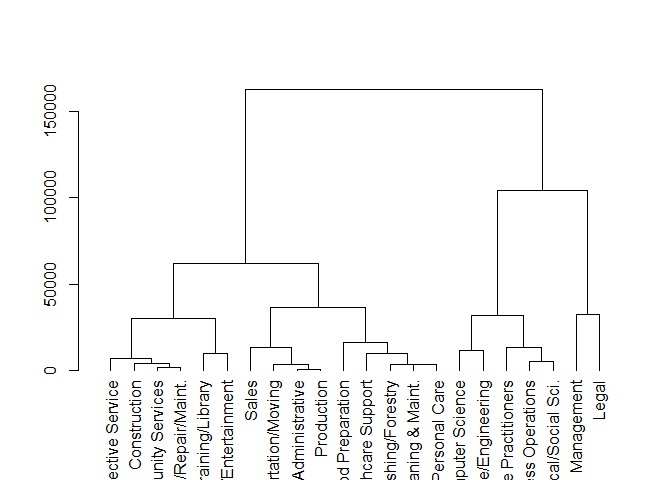
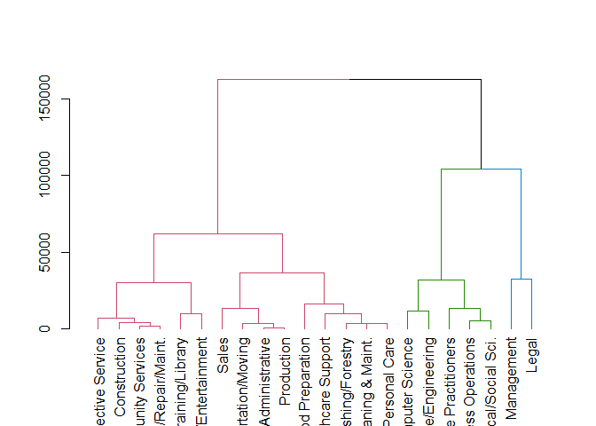
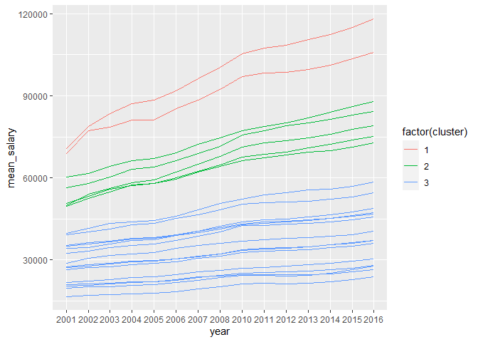
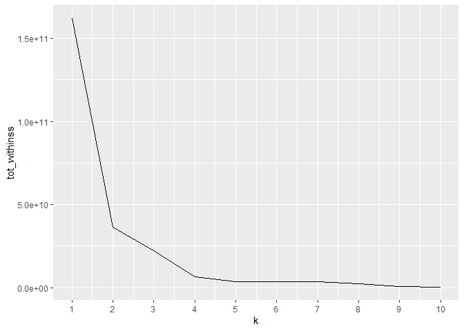
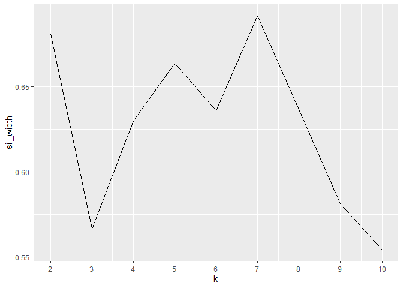

Case Study National Occupational Mean Wage
================
Mohamad Osman
2022-08-11

# Section 04: Case Study National Occupational Mean Wage

### **`01-Initial exploration of the data`**

You are presented with data from the Occupational Employment Statistics
(OES) program which produces employment and wage estimates annually.
This data contains the yearly average income from **2001** to **2016**
for **22** occupation groups. You would like to use this data to
identify clusters of occupations that maintained similar income trends.

``` r
library(dplyr)
library(ggplot2)

file_path <- file.path("..", "00_Datasets", "oes.rds")
oes <- readRDS(file_path)
head(oes,1)
```

    ##             2001  2002  2003  2004  2005  2006  2007   2008   2010   2011
    ## Management 70800 78870 83400 87090 88450 91930 96150 100310 105440 107410
    ##              2012   2013   2014   2015   2016
    ## Management 108570 110550 112490 115020 118020

The data is stored in your environment as the data.matrix `oes`.

Before you begin to cluster this data you should determine whether any
pre-processing steps (such as scaling and imputation) are necessary.

**Leverage the functions `head()` and `summary()` to explore the `oes`
data in order to determine which of the pre-processing steps below are
necessary:**

-   *NA* values exist in the data, hence the values must be imputed or
    the observations with *NAs* excluded.

-   The variables within this data are not comparable to one another and
    should be scaled.

-   Categorical variables exist within this data and should be
    appropriately dummified.

-   All three pre-processing steps above are necessary for this data.

-   None of these pre-processing steps are necessary for this data. ✅

### **`02-Hierarchical clustering: Occupation trees`**

In the previous exercise you have learned that the `oes` data is ready
for hierarchical clustering without any preprocessing steps necessary.
In this exercise you will take the necessary steps to build a dendrogram
of occupations based on their yearly average salaries and propose
clusters using a height of `100,000`.

-   Calculate the Euclidean distance between the occupations and store
    this in `dist_oes`.

-   Run hierarchical clustering using **average** linkage and store in
    `hc_oes`.

-   Create a dendrogram object `dend_oes` from your `hclust` result
    using the function `as.dendrogram()`.

-   Plot the dendrogram.

-   Using the `color_branches()` function create & plot a new dendrogram
    with clusters colored by a cut height of 100,000.

``` r
library(dendextend)

# Calculate Euclidean distance between the occupations
dist_oes <- dist(oes, method = "euclidean")

# Generate an average linkage analysis 
hc_oes <- hclust(dist_oes, method = "average")

# Create a dendrogram object from the hclust variable
dend_oes <- as.dendrogram(hc_oes)

# Plot the dendrogram
plot(dend_oes)
```

<!-- -->

``` r
# Color branches by cluster formed from the cut at a height of 100000
dend_colored <- color_branches(dend_oes, h = 100000)

# Plot the colored dendrogram
plot(dend_colored)
```

<!-- -->

### **`03-Hierarchical clustering: Preparing for exploration`**

You have now created a potential clustering for the `oes` data, before
you can explore these clusters with ggplot2 you will need to process the
`oes` data matrix into a tidy data frame with each occupation assigned
its cluster.

-   Create the `df_oes` data frame from the `oes` data.matrix, making
    sure to store the rowname as a column (use `rownames_to_column()`
    from the `tibble` library).

-   Build the cluster assignment vector `cut_oes` using `cutree()` with
    a `h = 100,000`.

-   Append the cluster assignments as a column `cluster` to the `df_oes`
    data frame and save the results to a new data frame called
    `clust_oes`.

-   Use the `gather()` function from the `tidyr()` library to reshape
    the data into a format amenable for ggplot2 analysis and save the
    tidied data frame as `gather_oes`.

``` r
dist_oes <- dist(oes, method = 'euclidean')
hc_oes <- hclust(dist_oes, method = 'average')

library(tibble)
library(tidyr)
```

    ## Warning: package 'tidyr' was built under R version 4.2.1

``` r
# Use rownames_to_column to move the rownames into a column of the data frame
df_oes <- rownames_to_column(as.data.frame(oes), var = 'occupation')

# Create a cluster assignment vector at h = 100,000
cut_oes <- cutree(hc_oes, h = 100000)

# Generate the segmented the oes data frame
clust_oes <- mutate(df_oes, cluster = cut_oes)

# Create a tidy data frame by gathering the year and values into two columns
gathered_oes <- gather(data = clust_oes, 
                       key = year, 
                       value = mean_salary, 
                       -occupation, -cluster)
```

### 

**`04-Hierarchical clustering: Plotting occupational clusters`**

You have successfully created all the parts necessary to explore the
results of this hierarchical clustering work. In this exercise you will
leverage the named assignment vector `cut_oes` and the tidy data frame
`gathered_oes` to analyze the resulting clusters.

-   View the assignments of each occupation to their clustering by
    sorting the `cut_oes` vector using `sort()`.

-   Use ggplot2 to plot each occupation’s average income by year and
    color the lines by the occupation’s assigned cluster.

``` r
# View the clustering assignments by sorting the cluster assignment vector
sort(cut_oes)
```

    ##                 Management                      Legal 
    ##                          1                          1 
    ##        Business Operations           Computer Science 
    ##                          2                          2 
    ##   Architecture/Engineering  Life/Physical/Social Sci. 
    ##                          2                          2 
    ##   Healthcare Practitioners         Community Services 
    ##                          2                          3 
    ## Education/Training/Library  Arts/Design/Entertainment 
    ##                          3                          3 
    ##         Healthcare Support         Protective Service 
    ##                          3                          3 
    ##           Food Preparation  Grounds Cleaning & Maint. 
    ##                          3                          3 
    ##              Personal Care                      Sales 
    ##                          3                          3 
    ##      Office Administrative   Farming/Fishing/Forestry 
    ##                          3                          3 
    ##               Construction Installation/Repair/Maint. 
    ##                          3                          3 
    ##                 Production      Transportation/Moving 
    ##                          3                          3

``` r
# Plot the relationship between mean_salary and year and color the lines by the assigned cluster
ggplot(gathered_oes, aes(x = year, y = mean_salary, color = factor(cluster))) + 
    geom_line(aes(group = occupation))
```

<!-- -->

Cool huh! From this work it looks like both Management & Legal
professions (cluster 1) experienced the most rapid growth in these 15
years. Let’s see what we can get by exploring this data using k-means.

### **`05-K-means: Elbow analysis`**

In the previous exercises you used the dendrogram to propose a
clustering that generated 3 trees. In this exercise you will leverage
the k-means elbow plot to propose the “best” number of clusters.

-   Use `map_dbl()` to run `kmeans()` using the `oes` data for k values
    ranging from 1 to 10 and extract the **total within-cluster sum of
    squares** value from each model: `model$tot.withinss`. Store the
    resulting vector as `tot_withinss`.

-   Build a new data frame `elbow_df` containing the values of k and the
    vector of **total within-cluster sum of squares**.

-   Use the values in `elbow_df` to plot a line plot showing the
    relationship between **k** and **total within-cluster sum of
    squares**.

``` r
library(purrr)

# Use map_dbl to run many models with varying value of k (centers)
tot_withinss <- map_dbl(1:10,  function(k){
  model <- kmeans(x = oes, centers = k)
  model$tot.withinss
})

# Generate a data frame containing both k and tot_withinss
elbow_df <- data.frame(
  k = 1:10,
  tot_withinss = tot_withinss
)

# Plot the elbow plot
ggplot(elbow_df, aes(x = k, y = tot_withinss)) +
  geom_line() +
  scale_x_continuous(breaks = 1:10)
```

<!-- -->

### **`06-K-means: Average Silhouette Widths`**

So hierarchical clustering resulting in **3** clusters and the elbow
method suggests **2**. In this exercise use **average silhouette
widths** to explore what the “best” value of **k** should be.

-   Use `map_dbl()` to run `pam()` using the `oes` data for k values
    ranging from 2 to 10 and extract the **average silhouette width**
    value from each model: `model$silinfo$avg.width`. Store the
    resulting vector as `sil_width`.

-   Build a new data frame `sil_df` containing the values of k and the
    vector of **average silhouette widths**.

-   Use the values in `sil_df` to plot a line plot showing the
    relationship between **k** and **average silhouette width**.

``` r
library(cluster)

# Use map_dbl to run many models with varying value of k
sil_width <- map_dbl(2:10,  function(k){
  model <- pam(oes, k = k)
  model$silinfo$avg.width
})

# Generate a data frame containing both k and sil_width
sil_df <- data.frame(
  k = 2:10,
  sil_width = sil_width
)

# Plot the relationship between k and sil_width
ggplot(sil_df, aes(x = k, y = sil_width)) +
  geom_line() +
  scale_x_continuous(breaks = 2:10)
```

<!-- -->

### **`07-The "best" number of clusters`**

You ran three different methods for finding the optimal number of
clusters and their assignments and you arrived with three different
answers.

Below you will find a comparison between the 3 clustering results (via
coloring of the occupations based on the clusters to which they belong).

<figure>

<figcaption>oes_clusters</figcaption>
</figure>

**What can you say about the “best” way to cluster this data?**

-   The clusters generated by the hierarchical clustering all have
    members with a Euclidean distance amongst one another less than
    100,000 and hence is the **best** clustering method.

-   The clusters generated using k-means with a **k = 2** was identified
    using elbow analysis and hence is the **best** way to cluster this
    data.

-   The clusters generated using k-means with a **k = 7** has the
    largest Average Silhouette Widths among the cluster and hence is the
    **best** way to cluster this data.

-   All of the above are correct but the **best** way to cluster is
    highly dependent on how you would use this data after. ✅

    All 3 statements are correct but there is no quantitative way to
    determine which of these clustering approaches is the right one
    without further exploration.  
    You are done with the course! If you enjoyed the material, feel free
    to send Dmitriy a thank you via Twitter. He’ll appreciate it.

      
