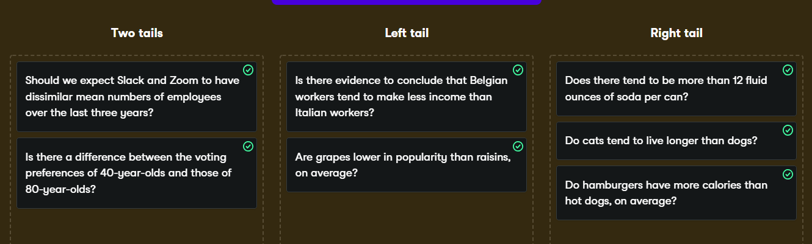
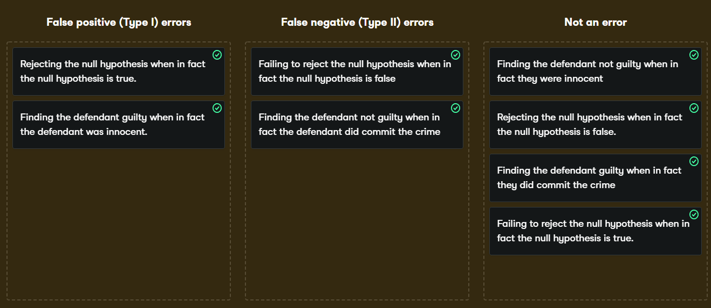

Yum, That Dish Tests Good
================
Mohamad Osman
2022-08-06

# **Section 01: Yum, That Dish Tests Good**

### **`01-Uses of A/B testing`**

In the video, you saw how Electronic Arts used A/B testing on their
website when launching SimCity 5. One version of the page showed an
advertisement for a discount, and one version did not. Half the users
saw one version of the page, and the other half saw the second version
of the page.

What is the main reason to use an A/B test?

-   It lets users vote on their preferred web page.

-   It allows you to only give discounts to half your users.

-   It is a method used to directly determine the sample size needed for
    your analysis.

-   It provides a way to check outcomes of competing scenarios and
    decide which way to proceed. ✅

-   It reduces the number of errors in production.

Ace A/B testing! A/B testing let’s you compare scenarios to see which
best achieves some goal.

### **`02-Calculating the sample mean`**

The `late_shipments` dataset contains supply chain data on the delivery
of medical supplies. Each row represents one delivery of a part. The
`late` columns denotes whether or not the part was delivered late. A
value of `"Yes"` means that the part was delivered late, and a value of
`"No"` means the part was delivered on time.

Let’s begin our analysis by calculating a point estimate (sample
statistic), namely the proportion of late shipments.

``` r
library(dplyr)
```

    ## 
    ## Attaching package: 'dplyr'

    ## The following objects are masked from 'package:stats':
    ## 
    ##     filter, lag

    ## The following objects are masked from 'package:base':
    ## 
    ##     intersect, setdiff, setequal, union

``` r
library(ggplot2)
library(fst)
```

    ## Warning: package 'fst' was built under R version 4.2.1

``` r
file_path <- file.path("..", "00_Datasets", "late_shipments.fst")
late_shipments <- read_fst(file_path)
```

    ## Warning: package 'fstcore' was built under R version 4.2.1

``` r
head(late_shipments)
```

    ##      id country managed_by fulfill_via vendor_inco_term shipment_mode
    ## 1 73003 Vietnam   PMO - US Direct Drop              EXW           Air
    ## 2 41222   Kenya   PMO - US Direct Drop              EXW           Air
    ## 3 52354  Zambia   PMO - US Direct Drop              EXW           Air
    ## 4 28471 Nigeria   PMO - US Direct Drop              EXW           Air
    ## 5 16901 Vietnam   PMO - US Direct Drop              EXW           Air
    ## 6 27238   Sudan   PMO - US Direct Drop              EXW           Air
    ##   late_delivery late product_group sub_classification                   vendor
    ## 1             0   No           ARV              Adult      HETERO LABS LIMITED
    ## 2             0   No          HRDT           HIV test            Orgenics, Ltd
    ## 3             0   No          HRDT           HIV test            Orgenics, Ltd
    ## 4             1  Yes          HRDT           HIV test            Orgenics, Ltd
    ## 5             0   No           ARV              Adult Aurobindo Pharma Limited
    ## 6             0   No          HRDT           HIV test     Trinity Biotech, Plc
    ##                                                                     item_description
    ## 1 Efavirenz/Lamivudine/Tenofovir Disoproxil Fumarate 600/300/300mg, tablets, 30 Tabs
    ## 2                                     HIV 1/2, Determine Complete HIV Kit, 100 Tests
    ## 3                                     HIV 1/2, Determine Complete HIV Kit, 100 Tests
    ## 4                                     HIV 1/2, Determine Complete HIV Kit, 100 Tests
    ## 5                                                   Abacavir 300mg, tablets, 60 Tabs
    ## 6                                                HIV 1/2, Uni-Gold HIV Kit, 20 Tests
    ##                                   molecule_test_type     brand        dosage
    ## 1 Efavirenz/Lamivudine/Tenofovir Disoproxil Fumarate   Generic 600/300/300mg
    ## 2                HIV 1/2, Determine Complete HIV Kit Determine           N/A
    ## 3                HIV 1/2, Determine Complete HIV Kit Determine           N/A
    ## 4                HIV 1/2, Determine Complete HIV Kit Determine           N/A
    ## 5                                           Abacavir   Generic         300mg
    ## 6                          HIV 1/2, Uni-Gold HIV Kit  Uni-Gold           N/A
    ##    dosage_form unit_of_measure_per_pack line_item_quantity line_item_value
    ## 1 Tablet - FDC                       30              19200        201600.0
    ## 2     Test kit                      100               6100        542900.0
    ## 3     Test kit                      100               1364        109120.0
    ## 4     Test kit                      100               2835        252315.0
    ## 5       Tablet                       60                112          1618.4
    ## 6     Test kit                       20                 53          1696.0
    ##   pack_price unit_price           manufacturing_site first_line_designation
    ## 1      10.50       0.35 Hetero Unit III Hyderabad IN                    Yes
    ## 2      89.00       0.89      Alere Medical Co., Ltd.                    Yes
    ## 3      80.00       0.80      Alere Medical Co., Ltd.                    Yes
    ## 4      89.00       0.89      Alere Medical Co., Ltd.                    Yes
    ## 5      14.45       0.24    Aurobindo Unit III, India                    Yes
    ## 6      32.00       1.60         Trinity Biotech, Plc                    Yes
    ##   weight_kilograms freight_cost_usd line_item_insurance_usd
    ## 1             2719          4084.56                  207.24
    ## 2             3497         40917.19                  895.78
    ## 3              553          7845.09                  112.18
    ## 4             1352         31284.02                  353.75
    ## 5             1701          4288.83                    2.67
    ## 6               18           569.11                    2.80

`late_shipments` is available; `dplyr` is loaded.

-   Use `View()` to view the `late_shipments` dataset.

-   Calculate the proportion of late shipments in the sample. That is,
    the mean cases where the `late` column is `"Yes"`.

``` r
# View the late_shipments dataset
View(late_shipments)

# Calculate the proportion of late shipments
late_prop_samp <- late_shipments %>%
                    summarize(mean(late == "Yes")) %>%
                    pull()
                    

# See the results
late_prop_samp
```

    ## [1] 0.067

Cool calculating! The proportion of late shipments is `0.067`, or
`6.7%`.

### **`03-Calculating a z-score`**

Since variables have arbitrary ranges and units, we need to standardize
them. For example, it would be silly if a hypothesis test gave a
different answer if your variables were in Euros instead of US dollars.
Standardization avoids that.

One standardized value of interest in a hypothesis test is called a
z-score. To calculate it, we need three numbers: the sample statistic
(point estimate), the hypothesized statistic, and the standard error of
the statistic (which we estimate from the bootstrap distribution).

The sample statistic is `late_prop_samp`.

`late_shipments_boot_distn` is a bootstrap distribution of the
proportion of late shipments. The proportion of late shipments statistic
is in the `late_prop` column.

`late_prop_samp` and `late_shipments_boot_distn` are available; `dplyr`
is loaded.

``` r
f_path <- file.path("..", "00_Datasets", "late_ship_boot_distn.fst")
late_shipments_boot_distn <- read_fst(f_path)
head(late_shipments_boot_distn,3)
```

    ##   replicate late_rate
    ## 1         1     0.065
    ## 2         2     0.081
    ## 3         3     0.069

-   Hypothesize that the proportion of late shipments is 6%.

-   Calculate the standard error. That is, the standard deviation of the
    bootstrap distribution.

-   Calculate the z-score.

``` r
late_shipments_boot_distn$late_prop <- late_shipments_boot_distn$late_rate
```

``` r
# Hypothesize that the proportion is 6%
late_prop_hyp <- 0.06

# Calculate the standard error
std_error <- sd(late_shipments_boot_distn$late_prop, na.rm=TRUE)


# Find z-score of late_prop_samp
z_score <- (late_prop_samp - late_prop_hyp) / std_error

# See the results
z_score
```

    ## [1] 0.8828321

### **`04-Criminal trials and hypothesis tests`**

In the video, you saw how hypothesis testing follows a similar process
to criminal trials.

Which of the following correctly matches up a criminal trial with
properties of a hypothesis test?

-   Just as with criminal trials, there are more than two possible
    results at the conclusion of a hypothesis test.

-   Just as the defendant is initially assumed not guilty, the null
    hypothesis is first assumed to be true. ✅

-   The defendant can be both guilty and not guilty for the crime
    charged and both the null and alternative hypotheses can be chosen
    at the end of the test.

-   Just as a court can decline to give a verdict, it’s possible for
    neither the null hypothesis nor the alternative hypothesis to be
    chosen at the end of the test.

-   Just as the defendant is initially assumed guilty, the alternative
    hypothesis is first assumed to be true.

    I pronounce you not guilty! It’s sometimes helpful to think of your
    hypothesis test as being a trial of the statistic.

### **`05-Left tail, right tail, two tails`**

Hypothesis tests are used to determine whether the sample statistic lies
in the tails of the null distribution. However, the way that the
alternative hypothesis is phrased affects which tail(s) we are
interested in.

Determine the appropriate type of hypothesis test for answering these
questions.

  
Top tail choices! The tails of the distribution that are relevant depend
on whether the alternative hypothesis refers to “greater than”, “less
than”, or “differences between”.

### **`06-Calculating p-values`**

In order to determine whether to choose the null hypothesis or the
alternative hypothesis, you need to calculate a p-value from the
z-score.

Let’s return to the late shipments dataset and the proportion of late
shipments.

The null hypothesis, H0, is that the proportion of late shipments is six
percent.

The alternative hypothesis, HA, is that the proportion of late shipments
is **greater than** six percent.

The observed sample statistic, `late_prop_samp`, the null hypothesis
statistic, `late_prop_hyp` (6%), and the bootstrap standard error,
`std_error` are available.

**Question**

What type of test should be used for this alternative hypothesis?

-   Two-tailed

-   Left-tailed

-   Right-tailed ✅

-   It doesn’t matter; any one will do.

-   A hypothesis test isn’t appropriate to answer this question.

**Question**

-   Calculate the z-score of `late_prop_samp`.

-   Calculate the p-value for the z-score, assuming a right-tailed test.

``` r
# Calculate the z-score of late_prop_samp
z_score <- (late_prop_samp - late_prop_hyp) / std_error
 
# Calculate the p-value
p_value <- pnorm(z_score, lower.tail = FALSE)
                 
# See the result
p_value   
```

    ## [1] 0.1886635

Perfect p-value! The p-value is calculated by transforming the z-score
with the standard normal cumulative distribution function.

### **`07-Decisions from p-values`**

The p-value is a measure of the amount of evidence to reject the null
hypothesis or not. By comparing the p-value to the significance level,
α, you can make a decision about which hypothesis to support.

Which of the following is the correct conclusion from the decision rule
for a significance level α?

-   If the p≤α, reject HA.

-   If the p≥α, reject HA.

-   If the p≤α, don’t reject H0.

-   If the p≤α, reject H0. ✅

Delightful decision-making. If the p-value is less than or equal to the
significance level, you reject the null hypothesis.

### **`08-Calculating confidence intervals`**

If you give a single estimate of a sample statistic, you are bound to be
wrong by some amount. For example, the hypothesized proportion of late
shipments was 6%. Even if evidence suggests the null hypothesis that the
proportion of late shipments is equal to this, for any new sample of
shipments, the proportion is likely to be a little different.
Consequently, it’s a good idea to state a confidence interval. That is,
you say “we are 95% ‘confident’ the proportion of late shipments is
between A and B” (for some value of A and B).

Sampling in R
[**demonstrated**](https://campus.datacamp.com/courses/sampling-in-r/pull-your-data-up-by-its-bootstraps?ex=10)
two methods for calculating confidence intervals. Here, you’ll use
quantiles of the bootstrap distribution to calculate the confidence
interval.

`late_prop_samp` and `late_shipments_boot_distn` are available; `dplyr`
is loaded.

-   Summarize the `prop_late_shipments` column of
    `late_shipments_boot_distn` to calculate the 95% confidence interval
    using the quantile method. Label the lower and upper CI values
    `lower` and `upper`.

``` r
late_shipments_boot_distn$prop_late_shipments <- late_shipments_boot_distn$late_prop
```

``` r
# Calculate 95% confidence interval using quantile method
conf_int_quantile <- late_shipments_boot_distn %>%
  summarise(lower = quantile(prop_late_shipments,0.025), 
            upper = quantile(prop_late_shipments,0.975))


# See the result
conf_int_quantile
```

    ##   lower    upper
    ## 1 0.052 0.083025

### **`09-Calculating confidence intervals`**

If you give a single estimate of a sample statistic, you are bound to be
wrong by some amount. For example, the hypothesized proportion of late
shipments was 6%. Even if evidence suggests the null hypothesis that the
proportion of late shipments is equal to this, for any new sample of
shipments, the proportion is likely to be a little different.
Consequently, it’s a good idea to state a confidence interval. That is,
you say “we are 95% ‘confident’ the proportion of late shipments is
between A and B” (for some value of A and B).

Sampling in R
[**demonstrated**](https://campus.datacamp.com/courses/sampling-in-r/pull-your-data-up-by-its-bootstraps?ex=10)
two methods for calculating confidence intervals. Here, you’ll use
quantiles of the bootstrap distribution to calculate the confidence
interval.

`late_prop_samp` and `late_shipments_boot_distn` are available; `dplyr`
is loaded.

**Question**

Does the confidence interval match up with the conclusion to stick with
the original assumption that 6% is a reasonable value for the unknown
population parameter?

``` r
conf_int_quantile
```

    ##   lower    upper
    ## 1 0.052 0.083025

-   Yes, since `0.06` is included in the 95% confidence interval and we
    failed to reject H0 due to a large p-value, the results are similar.
    ✅

-   No, since `0.06` is included in the 95% confidence interval and we
    should have rejected H0 due to a large p-value, the results do not
    match.

-   No, there is no relationship between confidence intervals and
    hypothesis tests.

### **`10-Type I and type II errors`**

For hypothesis tests and for criminal trials, there are two states of
truth, and two possible outcomes. Two combinations are correct test
outcomes verdicts, and there are two ways it can go wrong.

The errors are known as false positives (or “type I errors”), and false
negatives (or “type II errors”).



Cool and confident! When you have a confidence interval width equal to
one minus the significance level, if the hypothesized population
parameter is within the confidence interval, you should fail to reject
the null hypothesis.

### **`The End`**

  

  
