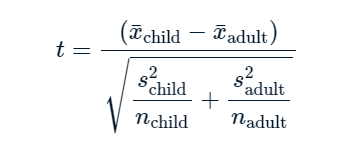

# **Section 02: Pass Me ANOVA Glass of Iced t**

### **`01-Two sample mean test statistic`**

The hypothesis test for determining if there is a difference between the means of two populations uses a different type of test statistic to the z-scores you saw in Chapter one. It's called "t", and can be calculated from three values from each sample using this equation.



While trying to determine why some shipments are late, you may wonder if the weight of the shipments that were late is different from the weight of the shipments that were on time. The `late_shipments` dataset has been split into a "yes" group, where `late == "Yes"` and a "no" group where `late == "No"`. The weight of the shipment is given in the `weight_kilograms` variable.

For convenience, the sample means for the two groups are available as `xbar_no` and `xbar_yes`. The sample standard deviations are `s_no` and `s_yes`. The sample sizes are `n_no` and `n_yes`.

-   Calculate the numerator of the test statistic.

-   Calculate the denominator of the test statistic.

-   Use those two numbers to calculate the test statistic.

```{r message = FALSE, warning=FALSE}
library(dplyr)
library(ggplot2)
library(fst)

file_path <- file.path("..", "00_Datasets", "late_shipments.fst")
late_shipments <- read_fst(file_path)

xbar_no <- 2082.171
xbar_yes <- 2377.821
s_no <- 6094.609
s_yes <- 2242.502
n_no <- 933
n_yes <- 67
```

```{r}
# Calculate the numerator of the test statistic
numerator <- xbar_no - xbar_yes

# Calculate the denominator of the test statistic
denominator <- sqrt(s_no^2/n_no + s_yes^2/n_yes)

# Calculate the test statistic
t_stat <- numerator/denominator

# See the result
t_stat
```

T-rrific! When testing for differences between means, the test statistic is called 't' rather than 'z', and can be calculated using six numbers from the samples. Here, the value is about `-0.9`.

### **`02-Hypothesis testing workflow`**

You've seen the hypothesis testing workflow for the one sample case where you compared a sample mean to a hypothesized value, and the two sample case where you compared two sample means. In both cases, the workflow shared common steps.

-   Place the hypothesis testing workflow steps in order from first to last.

    {width="470"}


