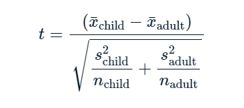
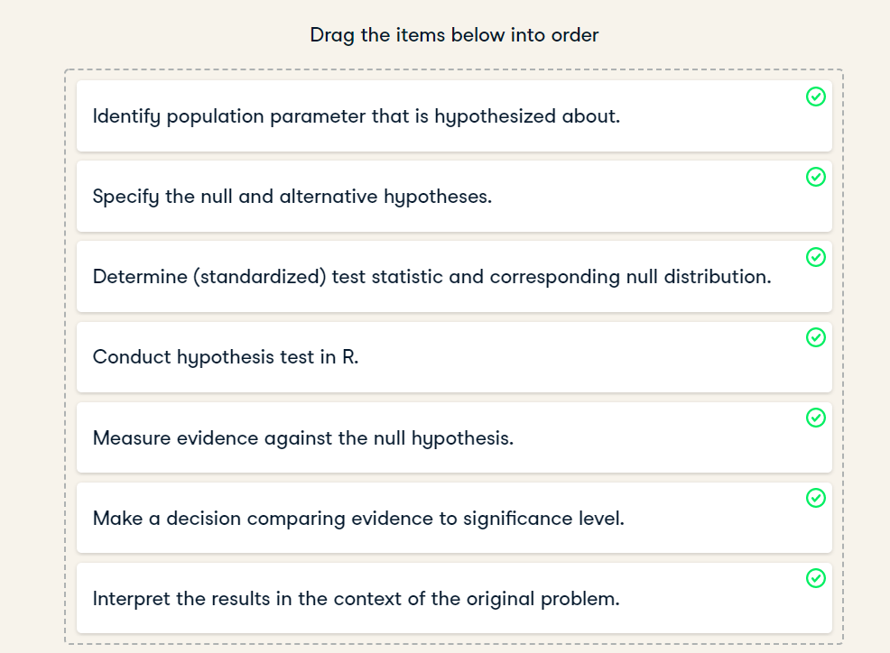
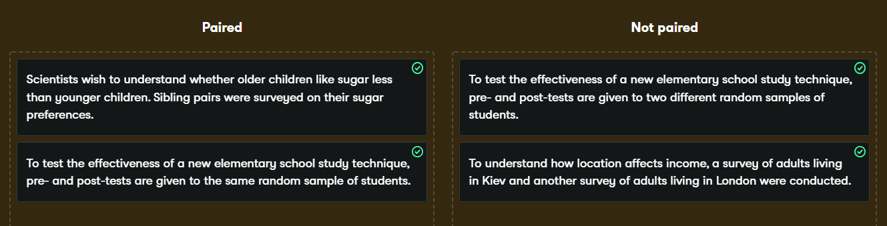
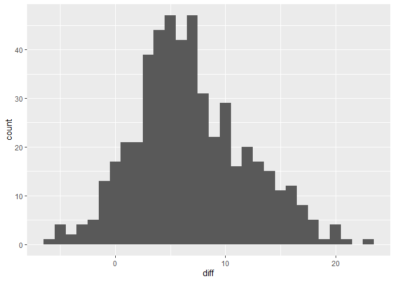
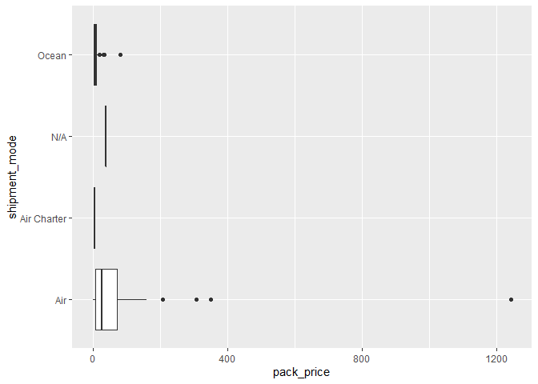

Pass Me ANOVA Glass of Iced t
================
Mohamad Osman
2022-08-06

# **Section 02: Pass Me ANOVA Glass of Iced t**

### **`01-Two sample mean test statistic`**

The hypothesis test for determining if there is a difference between the
means of two populations uses a different type of test statistic to the
z-scores you saw in Chapter one. It’s called “t”, and can be calculated
from three values from each sample using this equation.



While trying to determine why some shipments are late, you may wonder if
the weight of the shipments that were late is different from the weight
of the shipments that were on time. The `late_shipments` dataset has
been split into a “yes” group, where `late == "Yes"` and a “no” group
where `late == "No"`. The weight of the shipment is given in the
`weight_kilograms` variable.

For convenience, the sample means for the two groups are available as
`xbar_no` and `xbar_yes`. The sample standard deviations are `s_no` and
`s_yes`. The sample sizes are `n_no` and `n_yes`.

-   Calculate the numerator of the test statistic.

-   Calculate the denominator of the test statistic.

-   Use those two numbers to calculate the test statistic.

``` r
library(dplyr)
library(ggplot2)
library(fst)

file_path <- file.path("..", "00_Datasets", "late_shipments.fst")
late_shipments <- read_fst(file_path)

xbar_no <- 2082.171
xbar_yes <- 2377.821
s_no <- 6094.609
s_yes <- 2242.502
n_no <- 933
n_yes <- 67
```

``` r
# Calculate the numerator of the test statistic
numerator <- xbar_no - xbar_yes

# Calculate the denominator of the test statistic
denominator <- sqrt(s_no^2/n_no + s_yes^2/n_yes)

# Calculate the test statistic
t_stat <- numerator/denominator

# See the result
t_stat
```

    ## [1] -0.8723229

T-rrific! When testing for differences between means, the test statistic
is called ‘t’ rather than ‘z’, and can be calculated using six numbers
from the samples. Here, the value is about `-0.9`.

### **`02-Hypothesis testing workflow`**

You’ve seen the hypothesis testing workflow for the one sample case
where you compared a sample mean to a hypothesized value, and the two
sample case where you compared two sample means. In both cases, the
workflow shared common steps.

-   Place the hypothesis testing workflow steps in order from first to
    last.

    

### 

**`03-Why is t needed?`**

The process for calculating p-values is to start with the sample
statistic, standardize it to get a test statistic, then transform it via
a cumulative distribution function. In Chapter 1, that final
transformation was denoted `z`, and the CDF transformation used the
(standard normal) z-distribution. In the last video, the test statistic
was denoted `t`, and the transformation used the t-distribution.

In which hypothesis testing scenario is a t-distribution needed instead
of the z-distribution?

The t-distribution is just another name for the z-distribution so they
can be used interchangeably.

The t-distribution is the same thing as the z-distribution for very
small sample sizes.

When a sample standard deviation is used in estimating a standard error.
**✅**

When you are comparing the means of two samples, rather than comparing a
single sample mean to a value.

Terrific t! Using a sample standard deviation to estimate the standard
error is computationally easier than using bootstrapping. However, to
correct for the approximation, you need to use a t-distribution when
transforming the test statistic to get the p-value.

### 

**`04-The t-distribution`**

The t-distribution is used to calculate the p-value from the test
statistic, and having a sense of how the PDF and CDF look can help you
understand this calculation. It has two parameters: the degrees of
freedom, and the non-centrality parameter.

The plots show the PDF and CDF for a t-distribution (solid black line),
and for comparison show a normal distribution with the same mean and
variance (gray dotted line).

Which statement about the the t-distribution is true?

-   Like the normal distribution, the PDF of a distribution is always
    symmetric.

-   As you increase the degrees of freedom, the tails of the
    t-distribution get fatter.

-   As you increase the degrees of freedom, the t-distribution PDF and
    CDF curves get closer to those of a normal distribution. **✅**

-   As you increase the non-centrality, the t-distribution PDF and CDF
    curves get closer to those of a normal distribution.

Tip-top t! The normal distribution is essentially a t-distribution with
infinite degrees of freedom.

### **`05-From t to p`**

Previously, you calculated the test statistic for the two-sample problem
of whether the mean weight of shipments is lower for shipments that
weren’t late (`late == "No"`) compared to shipments that were late
(`late == "Yes"`). In order to make decisions about it, you need to
transform the test statistic with a cumulative distribution function to
get a p-value.

Recall the hypotheses:

H0: The mean weight of shipments that weren’t late is the same as the
mean weight of shipments that were late.

HA: The mean weight of shipments that weren’t late is less than the mean
weight of shipments that were late.

The test statistic, `t_stat`, is available, as are the samples sizes for
each group, `n_no` and `n_yes`. Use a significance level of
`alpha = 0.05`.

What type of test does the alternative hypothesis indicate that we need?

-   Two-tailed

-   Left-tailed **✅**

-   Right-tailed

-   Calculate the degrees of freedom for the test.

-   Use the test statistic, `t_stat`, to calculate the p-value.

``` r
t_stat <- -0.872321
n_no <- 933
n_yes <- 67
alpha = 0.05

# Calculate the degrees of freedom
degrees_of_freedom <- n_no + n_yes - 2

# Calculate the p-value from the test stat
p_value <- pt(t_stat, df = degrees_of_freedom, lower.tail =TRUE)

# See the result
p_value
```

    ## [1] 0.1916215

What decision should you make based on the results of the hypothesis
test?

-   Fail to reject the null hypothesis. **✅**

-   Reject the null hypothesis.

-   You can’t conclude anything from this hypothesis test.

Perspicacious p-value predictions! When the standard error is estimated
from the sample standard deviation and sample size, the test statistic
is transformed into a p-value using the t-distribution.

### **`06-Is pairing needed?`**

t-tests are used to compare two sample means. However, the test involves
different calculations depending upon whether the two samples are
*paired* or not. To make sure you use the correct version of the t-test,
you need to be able to identify pairing.

Match the problem description with whether a paired t-test or non-paired
t-test should be conducted.  


### **`07-Visualizing the difference`**

Before you start running hypothesis tests, it’s a great idea to perform
some exploratory data analysis. That is, calculating summary statistics
and visualizing distributions.

Here, you’ll look at the proportion of county-level votes for the
Democratic candidate in 2012 and 2016, `dem_votes_potus_12_16`. Since
the counties are the same in both years, these samples are paired. The
columns containing the samples are `dem_percent_12` and
`dem_percent_16`.

`dem_votes_potus_12_16` is available; `dplyr` and `ggplot2` are loaded.

-   View the `dem_votes_potus_12_16` dataset.

-   Mutate `dem_votes_potus_12_16` to add a `diff` column containing the
    percentage of votes for the democratic candidate in 2012 minus the
    votes for the democratic candidate in 2016.

``` r
file_path <- file.path("..", "00_Datasets", "dem_votes_potus_12_16.txt")
dem_votes_potus_12_16 <- read.delim(file_path)
head(dem_votes_potus_12_16)
```

    ##     state   county dem_percent_12 dem_percent_16
    ## 1 Alabama  Bullock       76.30590       74.94692
    ## 2 Alabama  Chilton       19.45367       15.84735
    ## 3 Alabama     Clay       26.67367       18.67452
    ## 4 Alabama  Cullman       14.66175       10.02825
    ## 5 Alabama Escambia       36.91573       31.02055
    ## 6 Alabama  Fayette       22.86685       16.51109

``` r
# View the dem_votes_potus_12_16 dataset
View(dem_votes_potus_12_16)

# Calculate the differences from 2012 to 2016
sample_dem_data <- dem_votes_potus_12_16 %>%
                mutate(diff = dem_percent_12 - dem_percent_16)

# See the result
head(sample_dem_data)
```

    ##     state   county dem_percent_12 dem_percent_16     diff
    ## 1 Alabama  Bullock       76.30590       74.94692 1.358979
    ## 2 Alabama  Chilton       19.45367       15.84735 3.606319
    ## 3 Alabama     Clay       26.67367       18.67452 7.999155
    ## 4 Alabama  Cullman       14.66175       10.02825 4.633500
    ## 5 Alabama Escambia       36.91573       31.02055 5.895185
    ## 6 Alabama  Fayette       22.86685       16.51109 6.355759

-   Summarize `sample_dem_data` to calculate the mean of the `diff`
    column as `xbar_diff` and the standard deviation of that column as
    `s_diff`.

``` r
# From previous step
sample_dem_data <- dem_votes_potus_12_16 %>% 
  mutate(diff = dem_percent_12 - dem_percent_16)

# Find mean and standard deviation of differences
diff_stats <- sample_dem_data %>%
            summarise(xbar_diff = mean(diff),
                      s_diff = sd(diff))
# See the result
diff_stats
```

    ##   xbar_diff   s_diff
    ## 1  6.829313 5.040139

-   Using `sample_dem_data`, plot `diff` as a histogram with binwidth 1.

``` r
# From previous step
sample_dem_data <- dem_votes_potus_12_16 %>% 
  mutate(diff = dem_percent_12 - dem_percent_16)

# Using sample_dem_data, plot diff as a histogram
ggplot(sample_dem_data, aes(x = diff))+  
      geom_histogram(binwidth =1)
```

<!-- -->

### **`08-Using t.test()`**

Manually calculating test statistics and transforming them with a CDF to
get a p-value is a lot of effort to do every time you need to compare
two sample means. The comparison of two sample means is called a t-test,
and R has a `t.test()` function to accomplish it. This function provides
some flexibility in how you perform the test.

As in the previous exercise, you’ll explore the difference between the
proportion of county-level votes for the Democratic candidate in 2012
and 2016.

-   `sample_dem_data` is available, and has columns `diff`,
    `dem_percent_12`, and `dem_percent_16`. Conduct a t-test on the
    sample differences (the `diff` column of `sample_dem_data`). Use an
    appropriate alternative hypothesis chosen from `"two.sided"`,
    `"less"`, and `"greater"`.

``` r
# Conduct a t-test on diff
test_results <- t.test( sample_dem_data$diff, 
                        alternative = "greater",
                        mu = 0
)
# See the results
test_results
```

    ## 
    ##  One Sample t-test
    ## 
    ## data:  sample_dem_data$diff
    ## t = 30.298, df = 499, p-value < 2.2e-16
    ## alternative hypothesis: true mean is greater than 0
    ## 95 percent confidence interval:
    ##  6.45787     Inf
    ## sample estimates:
    ## mean of x 
    ##  6.829313

-   Conduct a paired test on the democratic votes in 2012 and 2016 (the
    `dem_percent_12` and `dem_percent_16` columns of `sample_dem_data`).
    Use an appropriate alternative hypothesis.

``` r
# Conduct a paired t-test on dem_percent_12 and dem_percent_16
test_results <- t.test(
            sample_dem_data$dem_percent_12,
            sample_dem_data$dem_percent_16,
            alternative ="greater",
            mu = 0,
            paired = TRUE
)

# See the results
test_results
```

    ## 
    ##  Paired t-test
    ## 
    ## data:  sample_dem_data$dem_percent_12 and sample_dem_data$dem_percent_16
    ## t = 30.298, df = 499, p-value < 2.2e-16
    ## alternative hypothesis: true mean difference is greater than 0
    ## 95 percent confidence interval:
    ##  6.45787     Inf
    ## sample estimates:
    ## mean difference 
    ##        6.829313

What’s the correct decision from the t-test, assuming α=0.01?

**Possible Answers**

-   Fail to reject the null hypothesis.

-   Reject the null hypothesis. **✅**

-   You can’t conclude anything from this hypothesis test.

**Question**

Compare the paired t-test to an (inappropriate) unpaired test on the
same data. How does the p-value change?

-   The p-value from the unpaired test is smaller than the p-value from
    the paired test.

-   The p-value from the unpaired test is equal to the p-value from the
    paired test.

-   The p-value from the unpaired test is greater than than the p-value
    from the paired test. **✅**

Paired t-test party! Using `t.test()` lets you avoid manual calculation
to run your test. When you have paired data, a paired t-test is
preferable to the unpaired version because it gives lower p-values,
which reduces the chance of a false negative error.

### `09-Visualizing many categories`

So far in this chapter, we’ve only considered the case of differences in
a numeric variable between two categories. Of course, many datasets
contain more categories. Before you get to conducting tests on many
categories, it’s often helpful to perform exploratory data analysis.
That is, calculating summary statistics for each group and visualizing
the distributions of the numeric variable for each category using box
plots.

Here, we’ll return to the late shipments data, and how the price of each
package (`pack_price`) varies between the three shipment modes
(`shipment_mode`): `"Air"`, `"Air Charter"`, and `"Ocean"`.

`late_shipments` is available; `dplyr` and `ggplot2` are loaded.

-   Using the `late_shipments` dataset, group by `shipment_mode`.

-   Summarize to calculate the mean of `pack_price` as `xbar_pack_price`
    and the standard deviation of `pack_price` as `s_pack_price`.

``` r
# Using late_shipments, group by shipment mode, and calculate the mean and std dev of pack price
late_shipments %>%
    group_by(shipment_mode) %>%
    summarise(xbar_pack_price = mean(pack_price),
              s_pack_price = sd(pack_price))
```

    ## # A tibble: 4 × 3
    ##   shipment_mode xbar_pack_price s_pack_price
    ##   <chr>                   <dbl>        <dbl>
    ## 1 Air                     43.1         65.8 
    ## 2 Air Charter              3.39         1.34
    ## 3 N/A                     37.5         NA   
    ## 4 Ocean                    7.82         9.86

-   Using `late_shipments`, plot `pack_price` versus `shipment_mode` as
    a box plot with flipped x and y coordinates.

``` r
# Using late_shipments, plot pack_price vs. shipment_mode
# as a box plot with flipped x and y coordinates
ggplot(late_shipments, aes(shipment_mode, pack_price)) +
    geom_boxplot() +
    coord_flip()
```

<!-- -->

Beautiful boxplotting! There certainly looks to be a difference in the
pack price between each of the three shipment modes. Do you think the
differences are statistically significant?

### **`10-ANOVA`**

The box plots made it look like the distribution of pack price was
different for each of the three shipment modes. However, it didn’t tell
us whether the mean pack price was different in each category. To
determine that, we can use an ANOVA test. The null and alternative
hypotheses can be written as follows.

H0: Pack prices for every category of shipment mode are the same. HA:
Pack prices for some categories of shipment mode are different.

We’ll set a significance level of 0.1.

`late_shipments` is available.

-   Run a linear regression of `pack_price` versus `shipment_mode` using
    the `late_shipments` dataset. *The formula takes the form
    `response ~ explanatory`.*

``` r
# Run a linear regression of pack price vs. shipment mode 
mdl_pack_price_vs_shipment_mode <- lm(pack_price ~ shipment_mode, data = late_shipments)

# See the results
summary(mdl_pack_price_vs_shipment_mode)
```

    ## 
    ## Call:
    ## lm(formula = pack_price ~ shipment_mode, data = late_shipments)
    ## 
    ## Residuals:
    ##     Min      1Q  Median      3Q     Max 
    ##  -43.15  -34.55  -12.33   26.90 1199.38 
    ## 
    ## Coefficients:
    ##                          Estimate Std. Error t value Pr(>|t|)    
    ## (Intercept)                43.145      2.086  20.678  < 2e-16 ***
    ## shipment_modeAir Charter  -39.752     25.766  -1.543    0.123    
    ## shipment_modeN/A           -5.645     62.942  -0.090    0.929    
    ## shipment_modeOcean        -35.330      7.174  -4.925 9.88e-07 ***
    ## ---
    ## Signif. codes:  0 '***' 0.001 '**' 0.01 '*' 0.05 '.' 0.1 ' ' 1
    ## 
    ## Residual standard error: 62.91 on 996 degrees of freedom
    ## Multiple R-squared:  0.02572,    Adjusted R-squared:  0.02278 
    ## F-statistic: 8.764 on 3 and 996 DF,  p-value: 9.701e-06

-   Perform ANOVA on `mdl_pack_price_vs_shipment_mode`.

``` r
# From previous step
mdl_pack_price_vs_shipment_mode <- lm(pack_price ~ shipment_mode, data = late_shipments)

# Perform ANOVA on the regression model
anova(mdl_pack_price_vs_shipment_mode)
```

    ## Analysis of Variance Table
    ## 
    ## Response: pack_price
    ##                Df  Sum Sq Mean Sq F value    Pr(>F)    
    ## shipment_mode   3  104048   34683  8.7642 9.701e-06 ***
    ## Residuals     996 3941466    3957                      
    ## ---
    ## Signif. codes:  0 '***' 0.001 '**' 0.01 '*' 0.05 '.' 0.1 ' ' 1

**Question**

Assuming a significance level of 0.1, should you reject the null
hypothesis that there is a difference between pack prices between the
shipment modes?

-   Yes. The p-value is greater than or equal to the significance level,
    so the null hypothesis should be rejected.

-   Yes. The p-value is less than or equal to the significance level, so
    the null hypothesis should be rejected. **✅**

-   No. The p-value is greater than or equal to the significance level,
    so the null hypothesis should fail to be rejected.

-   No. The p-value is less than or equal to the significance level, so
    the null hypothesis should fail to be rejected.

Amazing ANOVA! There is a significant difference in pack prices between
the shipment modes. However, we don’t know which shipment modes this
applies to.

### 

**`11-Pairwise t-tests`**

The ANOVA test didn’t tell us which categories of shipment mode had
significant differences in pack prices. To pinpoint which categories had
differences, we could instead use pairwise t-tests.

`late_shipments` is available.

-   Perform pairwise t-tests on `late_shipments`’s `pack_price`
    variable, grouped by `shipment_mode`. Don’t do any p-value
    adjustment, and keep the default `"two.sided"` alternative
    hypothesis specification.

``` r
late_shipments <- late_shipments %>%
                  filter(shipment_mode != "N/A") 
unique(late_shipments$shipment_mode)
```

    ## [1] "Air"         "Ocean"       "Air Charter"

``` r
# Perform pairwise t-tests on pack price, grouped by shipment mode, no p-value adjustment
test_results <- pairwise.t.test(late_shipments$pack_price, late_shipments$shipment_mode, p.adjust.method = "none")

# See the results
test_results
```

    ## 
    ##  Pairwise comparisons using t tests with pooled SD 
    ## 
    ## data:  late_shipments$pack_price and late_shipments$shipment_mode 
    ## 
    ##             Air     Air Charter
    ## Air Charter 0.12    -          
    ## Ocean       9.9e-07 0.87       
    ## 
    ## P value adjustment method: none

-   Modify the pairwise t-tests to use Bonferroni p-value adjustment.

``` r
# Bonferroni adjusted pairwise t-tests
pairwise.t.test(
  late_shipments$pack_price,
  late_shipments$shipment_mode,
  p.adjust.method = "bonferroni"
)
```

    ## 
    ##  Pairwise comparisons using t tests with pooled SD 
    ## 
    ## data:  late_shipments$pack_price and late_shipments$shipment_mode 
    ## 
    ##             Air   Air Charter
    ## Air Charter 0.37  -          
    ## Ocean       3e-06 1.00       
    ## 
    ## P value adjustment method: bonferroni

-   Assuming a significance level of 0.1, for which pairs of shipment
    modes should you reject the null hypothesis that the pack prices are
    equal?

**Possible Answers**

-   “Ocean” and “Air Charter”; “Air Charter” and “Air”.

-   “Ocean” and “Air”; “Air Charter” and “Air”.

-   “Ocean” and “Air” only. **✅**

-   “Ocean” and “Air Charter” only.

### `The End`
