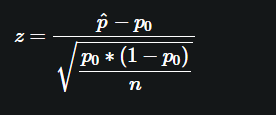
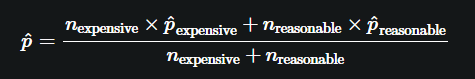
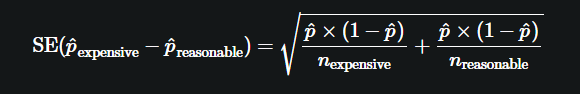
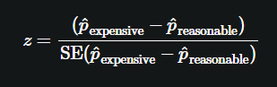
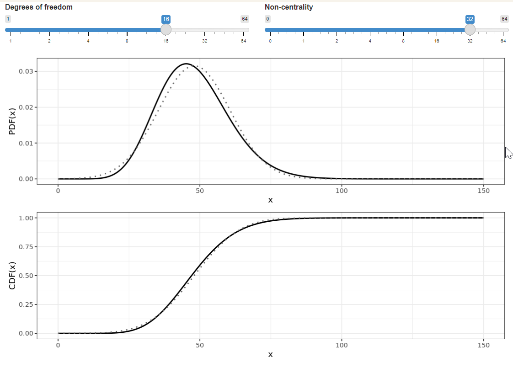

# Section 03: Letting the Categoricals Out of the Bag

### **`01-t for proportions?`**

Some of the hypothesis tests in this course have used a z test statistic, and some have used a t test statistic. To get the correct p-value, you need to use the right type of test statistic.

Do tests of proportion(s) use a z or a t test statistic and why?

-   The test statistic for proportion(s) has only one estimate of a parameter instead of two. ✅

-   t: There are two estimates used for unknown values in the test statistic for proportion(s).

-   z: Since the population standard deviation is always known for proportion(s), we always compute z-scores.

-   t: Proportions are ratios, so you need to estimate the numerator and the denominator.

Zipadeedoodah for z-scores! The t-test is needed for tests of mean(s) since you are estimating two unknown quantities, which leads to more variability.

### **`02-Test for single proportions`**

In Chapter 1, you calculated a p-value for a test hypothesizing that the proportion of late shipments was greater than 6%. In that chapter, you used a bootstrap distribution to estimate the standard error of the statistic. A simpler alternative is to use an equation for the standard error based on the sample proportion, hypothesized proportion, and sample size.



Let's revisit the p-value using this simpler calculation.

`late_shipments` is available; `dplyr` is loaded.

```{r}
library(dplyr)
library(ggplot2)
library(fst)

file_path <- file.path("..", "00_Datasets", "late_shipments.fst")
late_shipments <- read_fst(file_path)
```

-   Hypothesize that the proportion of late shipments is 6%.

-   Calculate the sample proportion of shipments where `late` equals `"Yes"` as `prop_late`, and pull out the value to get a numeric value.

-   Calculate the number of observations in the sample.

```{r}
# Hypothesize that the proportion of late shipments is 6%
p_0 <- 0.06

# Calculate the sample proportion of late shipments
p_hat <- late_shipments %>%
         summarize(prop_late = mean(late == "Yes")) %>%
         pull()


# Calculate the sample size
n <- nrow(late_shipments)
```

-   Calculate the numerator of the z-score as the difference between the sample proportion and the hypothesized proportion.

-   Calculate the denominator of the z-score as the sample proportion times one minus the sample proportion, divided by the sample size, all square rooted.

-   Calculate the z-score as the ratio of these numbers.

```{r}
# From previous step
p_0 <- 0.06
p_hat <- late_shipments %>%
  summarize(prop_late = mean(late == "Yes")) %>%
  pull(prop_late)
n <- nrow(late_shipments)

# Calculate the numerator of the test statistic
numerator <- p_hat - p_0

# Calculate the denominator of the test statistic
denominator <- sqrt(p_0 * (1 - p_0) / n)

# Calculate the test statistic
z_score <- numerator / denominator

# See the result
z_score
```

-   Transform the z-score into a p-value, remembering that this is a "greater than" alternative hypothesis.

```{r}
# From previous step
p_0 <- 0.06
p_hat <- late_shipments %>%
  summarize(prop_late = mean(late == "Yes")) %>%
  pull(prop_late)
n <- nrow(late_shipments)
numerator <- p_hat - p_0
denominator <- sqrt(p_0 * (1 - p_0) / n)
z_score <- numerator / denominator

# Calculate the p-value from the z-score
p_value <- pnorm(z_score,  lower.tail = FALSE)

# See the result
p_value
```

Well proportioned! While bootstrapping can be used to estimate the standard error of any statistic, it is computationally intensive. For proportions, using a simple equation of the hypothesized proportion and sample size is easier to compute, and the resulting p-value is almost identical (0.19 rather than 0.18).

### **`03-Test for two proportions`**

You may wonder if the amount paid for freight affects whether or not the shipment was late. Recall that in `late_shipments` dataset, whether or not the shipment was late is stored in the `late` column. Freight costs are stored in the `freight_cost_group` column, and the categories are `"expensive"` and `"reasonable"`.

We can form hypotheses to test.

H0: lateexpensive−latereasonable=0

HA: lateexpensive−latereasonable\>0

`p_hats` contains the estimates of population proportions (sample proportions) for the "expensive" and "reasonable" groups. `ns` contains the sample sizes for these groups.

-   Calculate the pooled sample proportion, p\^, as the mean of `p_hats` weighted by `ns`. *Use `weighted.mean()` or arithmetic with this equation.*

\

```{r}
ns <- c(expensive = 541, reasonable = 459)
p_hats <- c(expensive = 0.09611830,  reasonable = 0.03267974 )

p_hat <- weighted.mean((ns[1] * p_hats[1] + ns[2] * p_hats[2]) / (ns[1] + ns[2]))
p_hat


```

Calculate the standard error of the sample. *Use this equation.*



-   Calculate the pooled sample proportion times one minus the pooled sample proportion.

-   Divide `p_hat_times_not_p_hat` by the sample sizes.

-   Calculate the square root of the sum of `p_hat_times_not_p_hat_over_ns`.

```{r}
# From previous step
p_hat <- weighted.mean(p_hats, ns)

# Calculate sample prop'n times one minus sample prop'n
p_hat_times_not_p_hat <- p_hat * (1 - p_hat)

# Divide this by the sample sizes
p_hat_times_not_p_hat_over_ns <- p_hat_times_not_p_hat / ns

# Calculate std. error
std_error <- sqrt(sum(p_hat_times_not_p_hat_over_ns))

# See the result
std_error
```

-   Calculate the z-score. *Use the following equation. You'll need square bracket indexing to access elements of `p_hats`.*



```{r}
# From previous steps
p_hat <- weighted.mean(p_hats, ns)
p_hat_times_not_p_hat <- p_hat * (1 - p_hat)
p_hat_times_not_p_hat_over_ns <- p_hat_times_not_p_hat / ns
std_error <- sqrt(sum(p_hat_times_not_p_hat_over_ns))

# Calculate the z-score
z_score <- (p_hats[1] - p_hats[2]) / std_error

# See the result
z_score
```

-   Calculate the p-value from the z-score.

```{r}
# From previous steps
p_hat <- weighted.mean(p_hats, ns)
p_hat_times_not_p_hat <- p_hat * (1 - p_hat)
p_hat_times_not_p_hat_over_ns <- p_hat_times_not_p_hat / ns
std_error <- sqrt(sum(p_hat_times_not_p_hat_over_ns))
z_score <- (p_hats["expensive"] - p_hats["reasonable"]) / std_error

# Calculate the p-value from the z-score
p_value <- pnorm(z_score, lower.tail = FALSE)

# See the result
p_value
```

Mad props! You can calculate a p-value for a two sample proportion test using (a rather exhausting amount of) arithmetic.

### 

### **`04-prop_test() for two samples`**

That took a lot of effort to calculate the p-value, so while it is useful to see how the calculations work, it isn't practical to do in real-world analyses. For daily usage, it's better to use the `infer` package.

Recall the hypotheses.

H0: lateexpensive−latereasonable=0

HA: lateexpensive−latereasonable\>0

`late_shipments` is available; `infer` is loaded.

Using the `late_shipments` dataset, use `prop_test()` to perform a proportion test appropriate to the hypotheses.

-   Specify a hypothesis of `late` versus `freight_cost_group`.

-   Set the `order` of the freight cost groups.

-   Specify the `success` value for `late` and the type of `alternative` hypothesis.

-   Don't use Yates' continuity correction.

```{r}

file_path_2 <- file.path("..", "00_Datasets", "late_shipments_add_cols.txt")
add_cols_late_shipments <- read.delim(file_path_2)[1]

late_shipments <-cbind(late_shipments, add_cols_late_shipments)

```

```{r}
library(infer)


test_results <- late_shipments %>% 
  prop_test(
    late ~ freight_cost_group,
    order = c("expensive", "reasonable"),
    success = "Yes",
    alternative = "greater",
    correct = FALSE
  )

# See the results
test_results
```

### **`05-The chi-square distribution`**

Chi-square hypothesis tests rely on the chi-square distribution. Like the t-distribution, it has degrees of freedom and non-centrality parameters.

The plots show the PDF and CDF for a chi-square distribution (solid black line), and for comparison show a normal distribution with the same mean and variance (gray dotted line).

Which statement about the chi-square distribution is true?

-   Like the normal distribution, the chi-square distribution is defined for x values from minus infinity to infinity.

-   As you increase the degrees of freedom or the non-centrality, the chi-square distribution PDF and CDF curves get closer to those of a normal distribution. ✅

-   As you decrease the degrees of freedom or the non-centrality, the chi-square distribution PDF and CDF curves get closer to those of a normal distribution.

-   The chi-square distribution PDF is symmetric about its peak.

    ### 
    {width="478"}

    **`06-How many tails for chi-square tests?`**

    Unlike `t.test()` and `prop_test()`, `chisq_test()` does not have an `"alternative"` argument to specify which tails are considered by the alternative hypothesis.

    Which tail is almost always considered in chi-square tests?

    -   Left-tailed

    -   Right-tailed ✅

    -   Two-tailed

    -   Neither: chi-square tests depend on the peak, not the tails

    -   It depends on the problem

    Right on! The chi-square test statistic is a square number, so it is always non-negative, so only the right tail tends to be of interest.

    ### 
    **`06-Chi-square test of independence`**

    The *chi-square independence test* compares proportions of successes of a categorical variable across categories of another categorical variable.

    Trade deals often use a form of business shorthand in order to specify the exact details of their contract. These are International Chamber of Commerce (ICC) international commercial terms, or *incoterms* for short.

    The `late_shipments` dataset includes a `vendor_inco_term` that describes the incoterms that applied to a given shipment. The choices are:

    -   [**`EXW`**](https://www.investopedia.com/terms/e/exw.asp): "Ex works". The buyer pays for transportation of the goods.

    -   [**`CIP`**](https://www.investopedia.com/terms/c/carriage-and-insurance-paid-cip.asp): "Carriage and insurance paid to". The seller pays for freight and insurance until the goods board a ship.

    -   [**`DDP`**](https://www.investopedia.com/terms/d/delivery-duty-paid.asp): "Delivered duty paid". The seller pays for transportation of the goods until they reach a destination port.

    -   [**`FCA`**](https://www.investopedia.com/terms/f/fca.asp): "Free carrier". The seller pays for transportation of the goods.

    Perhaps the incoterms affect whether or not the freight costs are expensive. Test these hypotheses with a significance level of `0.01`.

    H0: `vendor_inco_term` and `freight_cost_group` are independent.

    HA: `vendor_inco_term` and `freight_cost_group` are associated.

    `late_shipments` is available; `ggplot2` and `infer` are loaded.

Using the `late_shipments` dataset, draw a proportional stacked bar plot of `vendor_inco_term` with fill color by `freight_cost_group`.

```{r}
# Plot vendor_inco_term filled by freight_cost_group.
# Make it a proportional stacked bar plot.
ggplot(late_shipments, aes(x = vendor_inco_term, fill = freight_cost_group)) + 
    geom_bar(position = "fill") + 
    ylab("proportion")
```

-   Using the `late_shipments` dataset, perform a chi-square test of independence on `freight_cost_group` and `vendor_inco_term`.

```{r}
# Perform a chi-square test of independence on freight_cost_group and vendor_inco_term
test_results <- late_shipments %>%
                chisq_test(vendor_inco_term ~ freight_cost_group)


# See the results
test_results
```

**Question**

-   What should you conclude from the hypothesis test?

Possible Answers

-   Fail to reject the null hypothesis and conclude that `vendor_inco_term` and `freight_cost_group` are independent.

-   Reject the null hypothesis and conclude that `vendor_inco_term` and `freight_cost_group` are independent.

-   Fail to reject the null hypothesis and conclude that `vendor_inco_term` and `freight_cost_group` are associated.

-   Reject the null hypothesis and conclude that `vendor_inco_term` and `freight_cost_group` are associated. ✅

Independence insight! The test to compare proportions of successes in a categorical variable across groups of another categorical variable is called a chi-square test of independence.

### **`06-Visualizing goodness of fit`**

The *chi-square goodness of fit test* compares proportions of each level of a categorical variable to hypothesized values. Before running such a test, it can be helpful to visually compare the distribution in the sample to the hypothesized distribution.

Recall the vendor incoterms in the `late_shipments` dataset. Let's hypothesize that the four values occur with these frequencies in the population of shipments.

-   `EXW`: 0.75

-   `CIP`: 0.05

-   `DDP`: 0.1

-   `FCA`: 0.1

`late_shipments` is available; `tibble`, `dplyr`, `ggplot2`, and `infer` are loaded.

-   Using the `late_shipments` dataset, count the `vendor_inco_term`s.

-   Get the number of rows in `late_shipments`.

-   Add a column, `n` to the tibble being defined, containing hypothesized counts for each category.

```{r}
library(tibble)

# Using late_shipments, count the vendor incoterms
vendor_inco_term_counts <- late_shipments %>%
                        count(vendor_inco_term)


# Get the number of rows in the whole sample
n_total <- nrow(late_shipments)

hypothesized <- tribble(
  ~ vendor_inco_term, ~ prop,
  "EXW", 0.75,
  "CIP", 0.05,
  "DDP", 0.1,
  "FCA", 0.1
) %>%
  # Add a column of hypothesized counts for the incoterms
  mutate(n = n_total)

# See the results
hypothesized
```

-   Using the `vendor_inco_term_counts` dataset, plot `n` versus `vendor_inco_term`.

-   Make it a precalculated bar plot (a.k.a. col plot).

-   Add points from the `hypothesized` dataset.

```{r}
# From previous step
vendor_inco_term_counts <- late_shipments %>% 
  count(vendor_inco_term)
n_total <- nrow(late_shipments)
hypothesized <- tribble(
  ~ vendor_inco_term, ~ prop,
  "EXW", 0.75,
  "CIP", 0.05,
  "DDP", 0.1,
  "FCA", 0.1
) %>%
  mutate(n = prop * n_total)

# Using vendor_inco_term_counts, plot n vs. vendor_inco_term 
ggplot(vendor_inco_term_counts, aes(vendor_inco_term, n)) +
  # Make it a (precalculated) bar plot
  geom_col() +
  # Add points from hypothesizedr
  geom_point(data = hypothesized, color = "purple")
```

Beautiful bars! Two of the bars in the sample are very close to the hypothesized values, one is a little high, and one is a little low. We'll need a test to see if the differences are statistically significant.

### 
**`07-Chi-square test of goodness of fit`**

The bar plot of `vendor_inco_term` suggested that its distribution across the four categories was quite close to the hypothesized distribution. You'll need to perform a *chi-square goodness of fit test* to see whether the differences are statistically significant.

To decide which hypothesis to choose, we'll set a significance level of `0.1`.

`late_shipments` is available; `tibble`, `dplyr`, `ggplot2`, and `infer` are loaded.

-   Using the `late_shipments` dataset, perform a chi-square goodness of fit test on `vendor_inco_term`. The hypothesized proportions are given in `hypothesized_props`.

```{r}
hypothesized_props <- c(
  EXW = 0.75, CIP = 0.05, DDP = 0.1, FCA = 0.1
)

# # Run chi-square goodness of fit test on vendor_inco_term
# test_results <- late_shipments %>%
#               chisq_test(
#                 response = vendor_inco_term,
#                 p = hypothesized_props
# 
#               )
# 
# # See the results
# test_results
```

**Question**

-   What should you conclude from the hypothesis test?

**Possible Answers**

-   Fail to reject the null hypothesis and conclude that `vendor_inco_term` follows the distribution specified by `hypothesized_props`. ✅

-   Reject the null hypothesis and conclude that `vendor_inco_term` follows the distribution specified by `hypothesized_props`.

-   Fail to reject the null hypothesis and conclude that `vendor_inco_term` does not follow the distribution specified by `hypothesized_props`.

-   Reject the null hypothesis and conclude that `vendor_inco_term` does not follow the distribution specified by `hypothesized_props`.

What a good goodness of fit! The test to compare the proportions of a categorical variable to a hypothesized distribution is called a chi-square independence test.

###  `The End`


 

\


\


\


\


\

\

\

\
